# 二、常见的 jQuery 动作和方法

Electronic supplementary material The online version of this chapter (doi:[10.​1007/​978-1-4842-1230-1_​2](http://dx.doi.org/10.1007/978-1-4842-1230-1_2)) contains supplementary material, which is available to authorized users.

现在您已经理解了元素选择的工作原理，您可以开始学习 jQuery 如何简化与 web 页面的交互的基础知识了。在本章中，您将接触到 jQuery 最常见和最有用的方面。

这一章读起来更像是一个参考，有时可能有点枯燥，但是阅读其中的例子绝对对你有好处。对这些方法如何工作以及它们做什么有一个基本的了解将会证明是无价的，因为你将在本书的后面开始构建示例项目。

## 理解 jQuery 脚本的基本行为

jQuery 最方便的特性之一是几乎所有的方法都是可链接的，这意味着方法可以一个接一个地执行。这就产生了清晰、简洁、易于理解的代码，比如

`$('p')`

`.addClass('new-class')`

`.text("I’m a paragraph!")`

`.appendTo('body');`

可链接的方法是可能的，因为每个方法在修改后都返回 jQuery 对象本身。起初，这个概念似乎很难理解，但是当你通过本章中的例子时，它会变得更加清晰。

## 理解 jQuery 方法

jQuery 试图简化一些常见的编程任务。一眼看去，它通过提供以下强大的工具简化了 JavaScript 开发:

*   使用 CSS 语法的 DOM 元素选择(你在第 1 章中学到的)
*   DOM 的简单遍历和修改
*   处理浏览器事件(如点击和鼠标悬停)的简单语法
*   访问元素的所有属性，包括 CSS 和样式属性，以及修改它们的能力
*   动画和其他效果
*   简单的 AJAX 控件

Note

前面的列表只是 jQuery 特性和功能的一部分。随着您继续完成本书中的项目，将会探索其他有用的特性。如需完整的参考资料，请访问 [`http://api.jquery.com`](http://api.jquery.com/) 的文档。

### 遍历 DOM 元素

jQuery 中的遍历是从一个 DOM 元素移动到另一个 DOM 元素的行为；遍历本质上是在初始选择完成后执行的另一种形式的过滤。这很有用，因为它允许开发人员完成一个动作，然后移动到 DOM 的另一部分，而不需要通过选择器执行另一次搜索。

它还帮助开发人员影响正被脚本操纵或利用的元素周围的元素。这包括向父元素添加一个类来指示活动，禁用所有不活动的表单元素，以及许多其他有用的任务。

Note

对于本章中的例子，您也将使用第 1 章中的 HTML 测试文件。如果您使用 XAMPP 进行本地测试，请将浏览器指向`http://localhost/testing/`来加载该文件。确保 Firebug 控制台打开并处于活动状态(参见[第 1 章](01.html)复习使用 Firebug 控制台)。

#### 。eq()

如果一组元素需要缩小到只有一个由索引标识的元素，那么可以使用`.eq()`方法。该方法接受一个参数:所需元素的索引。对于`.eq()`，索引从`0`开始。

`$("p").eq(1);`

在 Firebug 控制台中执行时，会返回以下内容:

`> $("p").eq(1);`

`Object[``p.foo`T2】

此外，可以向`.eq()`提供一个负数，以便从选择集的末尾向后计数(例如，传递`-2`将从该集中返回倒数第二个元素)。

若要通过从结果集的末尾向后计数来选择与前面的示例相同的段落，请使用以下代码:

`$("p").eq(-3);`

这将在控制台中返回相同的段落:

`> $("p").eq(-3);`

`Object[``p.foo`T2】

#### 。过滤器( )和。不是( )

要在一组元素中使用一个全新的选择器，`.filter()`方法很方便。它接受任何可以在 jQuery 函数中使用的选择器，但是它只适用于 jQuery 对象中包含的元素子集。

例如，要选择所有段落，然后过滤掉除类别为`foo`的段落之外的所有段落，请使用以下代码:

`$("p").filter(".foo");`

控制台中的结果如下所示:

`> $("p").filter(".foo");`

`Object[``p.foo`T2】

`.find()`的逆运算是`.not()`，它将返回结果集中与给定选择器不匹配的所有元素。例如，要选择所有段落，然后将选择范围限制为不包含类别`foo`的段落，请使用以下代码:

`$("p").not(".foo");`

这将导致以下结果:

`> $("p").not(".foo");`

`Object[``p, p, p#bar`T2】

#### 。首先( )和。最后一个( )

`.first()`和`.last()`方法的工作方式分别与`.eq(0)`和`.eq(-1)`相同。要从页面上的一组所有段落中选择最后一个段落，请使用以下内容:

`$("p").last();`

这将导致以下结果:

`> $("p").last();`

`Object[``p#bar`T2】

#### 。有( )

要选择包含匹配特定模式的元素，可以使用`.has()`方法。例如，使用以下代码选择所有段落，并将结果过滤为仅包含 span 元素的段落:

`$("p").has("span");`

这将输出以下内容:

`> $("p").has("span");`

`Object[``p, p#bar`T2】

#### 。是( )

`.is()`方法与其他方法略有不同，因为它不返回 jQuery 对象。它评估结果集而不修改它，这使它非常适合用于回调函数或在成功执行函数或方法后执行的函数。

在本书后面的例子中，你会学到更多关于`.is()`的实际用法；现在，选择测试文档中的所有段落，然后检查是否有一个段落具有类`foo`:

`$("p").is(".foo");`

结果是一个布尔(`true`或`false`)答案:

`> $("p").is(".foo");`

`true`

#### 。切片( )

为了根据索引选择元素的子集，需要使用`.slice()`方法。它接受两个参数:第一个是生成子集的起始索引，第二个是可选的结束点。如果没有提供第二个参数，子集将继续，直到到达选择的结尾。

Note

第二个参数中传递的索引将不包括在结果集中。因此，如果你需要一个集合中的第二到第四个元素(索引`1`到`3`，你的参数需要是`1`和`4`。

此外，与`.eq()`一样，可以使用负索引。这可以应用于起点和/或终点。

若要选择所有段落，然后将选择范围限制在第二和第三个段落，请使用以下代码:

`$("p").slice(1,3);`

控制台中的结果如下所示:

`> $("p").slice(1,3);`

`Object[``p.foo, p`T2】

要从段落集中选择最后两个元素，请使用以下内容:

`$("p").slice(-2);`

这会产生以下结果:

`> $("p").slice(-2);`

`Object[``p, p#bar`T2】

#### 。儿童( )

经常需要在结果集中向下钻取以找到子元素。这是使用`.children()`方法完成的，该方法接受一个可选参数:一个匹配子元素的选择器。

要选择所有段落，然后更改选择以匹配段落的所有子元素，请执行以下代码:

`$("p").children();`

这将输出以下内容:

`> $("p").children();`

`Object[``span, span.foo`T2】

如果您需要一组更具体的子元素，您可以向`.children()`方法传递一个可选的选择器。要选择所有段落，然后查找类别为`foo`的所有子段落，请使用以下命令:

`$("p").children(".foo");`

这会产生以下结果:

`> $("p").children(".foo");`

`Object[``span.foo`T2】

#### 。最近的( )

`.closest()`方法是一种在 DOM 树中查找元素的简单方法，DOM 树是元素的嵌套顺序(本例中的 DOM 树关系是 body 元素中段落内的跨度)。

例如，要查找与类`foo`的跨度最近的段落，请在控制台中运行以下代码片段:

`$("span.foo").closest("p");`

这将输出以下内容:

`> $("span.foo").closest("p");`

`Object[``p#bar`T2】

#### 。查找( )

类似于`.children()`方法，`.find()`方法匹配当前集合中元素的后代。`.find()`和`.children()`的主要区别在于`.children()`只检查 DOM 树中的下一层，而`.find()`不关心匹配的元素有多深。

为了进行演示，请选择 body 标记，然后使用以下代码查找任何包含的 span 元素:

`$("body").find("span");`

这导致返回两个跨度:

`> $("body").find("span");`

`Object[``span, span.foo`T2】

但是，如果您使用`.children()`做同样的事情，将返回一个空的结果集:

`> $("body").children("span");`

`Object[ ]`

#### 。下一个( )，。nextAll()和。nextUntil()

在`.next()`、`.nextAll()`和`.nextUntil()`中提供了三种在集合中寻找下一个兄弟元素的有用方法。

`.next()`方法将为原始结果集中的每个元素在集合中查找下一个兄弟元素。要选择具有类`foo`的段落，然后遍历到下一个同级元素，请在控制台中执行以下代码:

`$("p.foo").next();`

这将生成以下输出:

`> $("p.foo").next();`

`Object[``p`T2】

选择器也可以传递给`.next()`，这允许开发人员确定下一个兄弟元素的类型应该匹配:

`$("p.foo").next("#bar");`

这将返回一个空的结果集，因为下一个元素没有 ID`bar`:

`> $("p.foo").next("#bar");`

`Object[ ]`

因为`.next()`只返回一个元素，所以创建了一个伴生方法来返回所有下一个兄弟元素`.nextAll()`。要选择类别为`foo`的段落之后的所有段落，请使用以下代码:

`$(".foo").nextAll("p");`

这将返回以下结果:

`> $(".foo").nextAll("p");`

`Object[``p, p#bar`T2】

Note

选择器在`.nextAll()`中是可选的，如同在`.next()`中一样。

选择下一个兄弟元素的第三种方法是`.nextUntil()`方法。顾名思义，该方法将返回所有后续元素，直到匹配一个选择器。需要注意的是，选择器匹配的元素不会包含在结果集中。

为了演示这一点，选择带有类别`foo`的段落，并使用带有选择器`"#bar"`的`.nextUntil()`:

`$(".foo").nextUntil("#bar");`

结果集中只返回一个段落，不包括 ID 为`bar`的段落:

`> $(".foo").nextUntil("#bar");`

`Object[``p`T2】

要包含 ID 为`bar`的段落，您需要查看紧随其后的元素，在本例中是 form 元素。使用更新后的代码再次尝试选择器:

`$(".foo").nextUntil("form");`

现在返回以下两段:

`> $(".foo").nextUntil("form");`

`Object[``p, p#bar`T2】

#### 。prev()，。prevAll()和。prevUntil()

`.prev()`、`.prevAll()`和`.prevUntil()`函数的工作方式与`.next()`、`.nextAll()`和`.nextUntil()`完全一样，只是它们查看的是前一个同级元素，而不是下一个同级元素:

`> $("#bar").prev();`

`Object[``p`T2】

`> $("#bar").prevAll();`

`Object[``p, p.foo, p`T2】

`> $("#bar").prevUntil(".foo");`

`Object[``p`T2】

#### 。兄弟姐妹( )

要选择元素两侧的同级元素，请使用`.siblings()`方法。它接受一个选择器作为参数来限制返回什么类型的元素。要将所有同级段落元素与 ID 为`bar`的段落匹配，请执行以下代码:

`$("#bar").siblings("p");`

结果将如下所示:

`> $("#bar").siblings("p");`

`Object[``p, p.foo, p`T2】

#### 。父级( )

方法返回当前选择的一组直接父元素。例如，要选择具有类`foo`的任何元素的所有父元素，请使用以下代码:

`$(".foo").parent();`

这将返回以下内容:

`> $(".foo").parent();`

`Object[``body, p#bar`T2】

要仅匹配是类`foo`元素的父元素的段落元素，请将代码修改如下:

`$(".foo").parent("p");`

这缩小了结果集的范围:

`> $(".foo").parent("p");`

`Object[``p#bar`T2】

#### 。父母( )和。parentsUntil()

与`.parent()`不同，`.parents()`将返回所有父元素，并传递一个可选的选择器来过滤结果。

若要在示例页的表单中选择复选框的所有父元素，请使用以下代码:

`$(":checkbox").parents();`

这将查找每个父元素，一直到`html`元素:

`> $(":checkbox").parents();`

`Object[``label, fieldset, form #, body, html`T2】

要筛选结果以便只返回父表单元素，请按如下方式修改代码:

`$(":checkbox").parents("form");`

这仅返回父表单元素:

`> $(":checkbox").parents("form");`

`Object[``form #`T2】

最后，要选择一系列父节点，直到一个选择器匹配，类似于`.nextUntil()`或`.prevUntil()`，使用`.parentsUntil()`:

`$(":checkbox").parentsUntil("form");`

这将返回所有父元素，直到遇到 form 元素:

`> $(":checkbox").parentsUntil("form");`

`Object[``label, fieldset`T2】

#### 。添加( )

`.add()`方法是通用的，因此有点复杂。本质上，它允许您使用选择器或 HTML 字符串向现有的 jQuery 对象添加额外的元素。

要选择所有段落，然后将带有类别`foo`的范围添加到对象，请使用以下命令:

`$("p").add("span.foo");`

这将输出以下内容:

`> $("p").add("span.foo");`

`Object[``p, p.foo, p, p#bar, span.foo`T2】

`.add()`方法还允许您动态创建元素，如下所示:

`$("p").add('This is a new span');`

执行前面的代码将输出以下内容:

`> $("p").add('This is a new span');`

`Object[` `p, p.foo, p, p#bar, span#bat ]`

Note

请注意，控制台输出中的元素`span#bat`消失了。发生这种情况是因为，虽然该元素存在于 jQuery 对象中，但它没有被附加到 DOM 中，因此不会显示在页面上。在下一节“创建和插入 DOM 元素”中，您将了解如何向 DOM 添加新元素。

#### 。andSelf()

如果您使用遍历方法，您可能还想保留原始的匹配元素集。`c`通过允许调用原始集合并将其附加到新集合来提供这种能力。

例如，要匹配所有段落元素，然后查找子跨度，请使用以下代码:

`$("p").find("span");`

这将返回文档中的范围，但是您已经丢失了段落:

`> $("p").find("span");`

`Object[``span, span.foo`T2】

为了保留段落并匹配跨度，在代码末尾添加一个对`.andSelf()`的调用:

`$("p").find("span").andSelf();`

这导致了期望的输出:

`> $("p").find("span").andSelf();`

`Object[``p, p.foo, p, span, p#bar, span.foo`T2】

#### 。内容()“

除了`.contents()`也返回文本节点之外，`.contents()`方法的工作方式与`.children()`方法类似，文本节点只是元素中包含的字符数据(元素显示的实际文本)。 [1](#Fn1)

要查找类为`foo`的 span 的所有内容，请使用以下代码:

`$("span.foo").contents();`

这会产生以下输出:

`> $("span.foo").contents();`

`Object[``<TextNode textContent="And this sentence is in a span.">`T2】

#### 。结束( )

在 jQuery 脚本中，有时您会发现有必要备份到 jQuery 对象中存储的最后一组元素。`.end()`方法正是这样做的:它将 jQuery 对象恢复到当前 jQuery 对象链中最后一个过滤动作之前的状态。

要选择所有段落，然后查找所有范围，原始段落集不再可用:

`> $("p").find("span");`

`Object[``span, span.foo`T2】

要恢复到段落集，请将`.end()`添加到链中:

`> $("p").find("span").end();`

`Object[``p, p.foo, p, p#bar`T2】

### 创建和插入 DOM 元素

您将学到的第一件事是如何创建新元素并将它们插入 DOM，而不是简单地从中选择元素。幸运的是，在 jQuery 中，这非常简单。

本书的这一部分开始使用更复杂的代码片段，因此需要对 Firebug 控制台进行一些小的调整。控制台右下方是一个圆形按钮，箭头向上(见图 [2-1](#Fig1) )。

图 2-1。

The button to activate the multiline console test area

点击此按钮激活多行测试区域，在这里您可以跨多行输入命令，使它们更容易阅读，并允许更高级的示例(见图 [2-2](#Fig2) )。

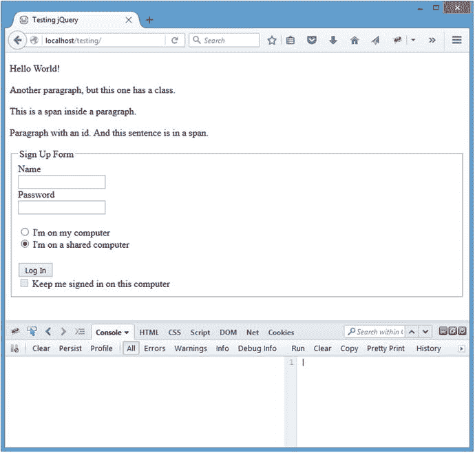

图 2-2。

The multiline testing area (shown at the right-hand side of the console)

对于多行测试区域，您现在需要单击底部的 Run 按钮来执行代码。与单行测试控制台一样，按 Enter 键将会换行。

#### 创建新的 DOM 元素

要创建新的 DOM 元素，jQuery 只需要创建标签。例如，要创建新的段落元素，请使用以下代码:

`$("
");`

要向该元素添加属性和文本，只需将它写成普通的 HTML:

`$('
This is a new paragraph!
');`

Note

前面的示例使用单引号而不是双引号将 HTML 字符串括起来。这对 jQuery 函数没有影响；它只是消除了对 class 属性中使用的双引号进行转义的需要(例如，`class=\"bat\"`)。

您还可以通过将第二个参数作为 JavaScript Object Notation(JSON)[2](#Fn2)传递来为这个新元素添加属性:

`$("
", {`

`"class":"bat",`

`"text":"This is a new paragraph!"`

`});`

该代码会导致以下结果:

`> $("
", { "class":"bat", "text":"This is a new paragraph!" });`

`Object[``p.bat`T2】

因为这只是创建元素，它还没有附加到 DOM，因此在浏览器窗口中不可见。您将在下一节“向 DOM 插入新元素”中学习插入新元素

Note

最简单地说，JSON 是一个键-值对，其中键和值都用引号括起来，所有的键-值对都用逗号分隔，并用大括号(`{}`)括起来。JSON 数据的一个例子是`{ "key":"value" }`或`{ "key1":"value1", "key2":"value2" }`。

#### 向 DOM 中插入新元素

现在您已经对如何创建新元素有了基本的了解，您可以开始学习如何将它们插入到 DOM 中。jQuery 提供了几种处理这种情况的方法，您将在本节中探讨这些方法。

这里需要注意的一点是，对 DOM 的修改是暂时的，这意味着一旦页面被刷新，所做的任何更改都将被重置回原来的 HTML 文档。这是因为 JavaScript 是一种客户端语言，这意味着它不是从服务器修改实际的文件，而是浏览器对文件的单独解释。

用 JavaScript 做的修改可以通过使用 AJAX 保存在服务器上(这一点你将在本章后面了解到)，它允许 JavaScript 与服务器端语言如 PHP 接口。

Note

在执行完以下各节中的示例后，刷新页面，以便每个新示例都从示例 HTML 文件的新副本开始。

##### 。append()和。前置( )

`.append()`和`.prepend()`函数将把作为参数传递的元素附加到它们所链接的 jQuery 对象上。唯一的区别是`.append()`在末尾附加元素，而`.prepend()`在开头附加元素。

内容将被追加或前置到匹配的元素中，这意味着如果您匹配页面上的所有段落并追加一个新句子“这是由 jQuery 添加的”，它将被追加到结束段落标记(`
`)中。

通过在控制台中输入以下代码来尝试一下:

`$("p").append(" This was added by jQuery.");`

执行代码会将这句话添加到结束段落标记内的每个段落的末尾。这一点很明显，因为文本不会跳到下一行，如果它在结束标记之外，就会跳到下一行。

Inspecting HTML using the element inspector in Firebug

使用 Firebug 提供的元素检查工具也可以看到这一点。在控制台的左上方附近，有一个看起来像鼠标光标的按钮(见图 [2-3](#Fig3) )。点按它以激活元素检查器。

图 2-3。

The button to activate the element inspector

检查器激活后，您可以将鼠标悬停在浏览器中的不同元素上，它们会以蓝色轮廓高亮显示。将鼠标悬停在您刚刚添加了文本的段落上，然后单击它。这将打开 Firebug 的 HTML 面板，当前元素被折叠并高亮显示，还有一个选项卡用于展开该元素(参见图 [2-4](#Fig4) )。

图 2-4。

The collapsed element as displayed after hovering over and clicking it

单击选项卡展开元素，您可以看到包含在段落元素中的内容，包括附加的文本(参见图 [2-5](#Fig5) )。

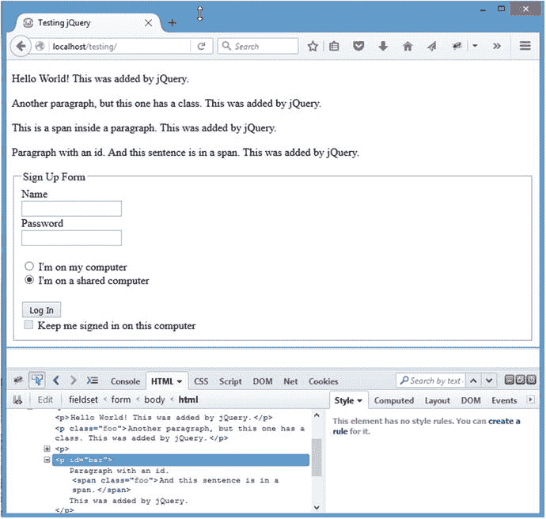

图 2-5。

The expanded element, including the dynamically added text

您可以在本书的其余练习中使用这种技术来查看内容和元素被添加到 DOM 中的位置。

使用`.append()`和`.prepend()`，还可以向 DOM 添加新元素。例如，要在浏览器页面顶部添加一个新段落，请使用以下代码在正文前添加一个新元素:

`var para = $("
", {`

`"text":"I’m a new paragraph!",`

`"css":{"background":"yellow"}`

`});`

`$("body").prepend(para);`

Note

此示例在将新元素添加到正文之前使用一个变量来存储新元素。这样做是为了增加脚本的可读性。在本书中，你会经常用到这种技巧。

在您的控制台中执行上述代码后，一个带有黄色背景的新段落会出现在浏览器窗口的顶部(参见图 [2-6](#Fig6) )。

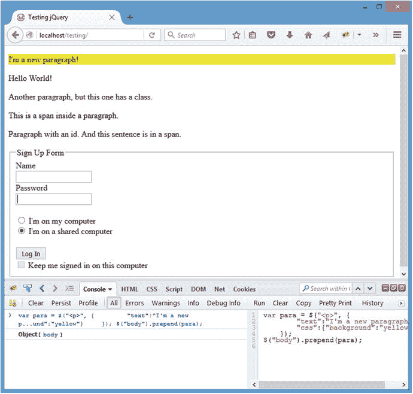

图 2-6。

The new paragraph as it appears after prepending it to the body element

##### 。appendTo()和。前置到( )

在最后一个例子中，您必须创建一个元素，存储它，然后选择它所附加到的元素。这可能是一种迂回的方法，但幸运的是，jQuery 提供了`.appendTo()`和`.prependTo()`，它们链接到要追加的对象，并接受您希望追加的元素的选择器。

以最后一个例子为起点，使用`.prependTo()`将相同的段落元素添加到正文中，您的代码将如此简化:

`$("
", {`

`"text":"I’m a new paragraph!",`

`"css":{"background":"yellow"}`

`})`

`.prependTo("body");`

这产生了相同的结果，但代码片段更简洁。

##### 。在( )和之后。之前( )

`.after()`和`.before()`方法类似于`.append()`和`.prepend()`，除了它们在元素之前或之后添加元素外部的内容，而不是在元素的开头或结尾添加内容。

要在具有类`foo`的段落之后添加新段落，请使用以下代码片段:

`$("p.foo").after("
A new paragraph.
");`

执行该代码会在类别为`foo`的段落下方插入一个新段落(见图 [2-7](#Fig7) )。

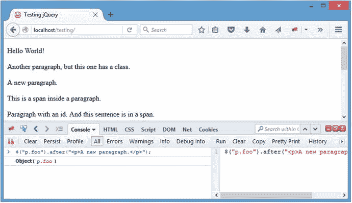

图 2-7。

A new paragraph inserted after the paragraph with class foo

##### 。insertAfter()和。insertBefore()

与`.appendTo()`和`.prependTo()`允许更简洁地向 DOM 添加新元素一样，`.insertAfter()`和`.insertBefore()`为`.after()`和`.before()`提供了相同的选择。

要使用`.insertAfter()`重复上一节中的示例，将代码修改如下:

`$("
", {`

`"text":"A new paragraph."`

`})`

`.insertAfter("p.foo");`

这复制了之前的结果(参见图 [2-7](#Fig7) )。

##### 。换行( )

`.wrap()`方法允许开发人员快速、轻松地用一个或多个新元素封装现有元素。

`.wrap()`接受的参数可以是一个或多个标记的集合，用来包装所选的元素，也可以是一个回调函数来生成标记。

首先，使用下面的代码用一个`strong`标签包装示例文档中的所有跨度:

`$("span").wrap("<strong />");`

这导致两个跨度的文本变为粗体(见图 [2-8](#Fig8) )。

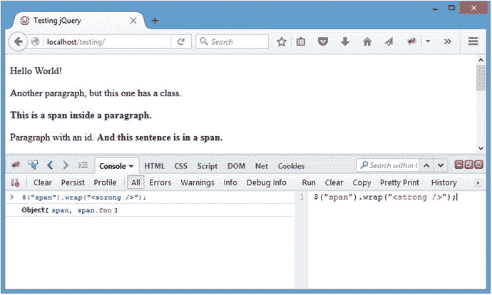

图 2-8。

The spans appear bold after wrapping them with strong tags

包装元素使用的语法相对宽松，图 [2-8](#Fig8) 中显示的输出可以使用`"<strong />"`、`"<strong>"`或`"<strong></strong>"`来完成。

此外，通过将一组嵌套的标记传递给`.wrap()`方法，可以将多个标记包装在元素周围:

`$("span").wrap("<strong><em></em></strong>");`

执行前一行后，范围中的文本将显示为粗体和斜体(参见图 [2-9](#Fig9) )。

图 2-9。

Span text appears bold and italicized after wrapping it with strong and em tags

要使用回调函数生成包装元素所需的 HTML 标记，必须从回调函数返回一个标记。例如，要在`strong`标签中用类`foo`包装所有跨度，在`em`标签中包装所有其他跨度，请执行以下代码:

`$("span").wrap(function(){`

`return $(this).is(".foo") ? "<strong>" : "<em>";`

`});`

执行这个代码片段后，浏览器用斜体显示一个 span，用粗体显示另一个 span(带有类`foo`的 span)(参见图 [2-10](#Fig10) )。

图 2-10。

Use a callback function to conditionally wrap certain elements

##### 。展开( )

`.wrap()`、`.unwrap()`的逆操作将删除给定元素周围的标签。它不接受任何参数；它只是找到直接的父元素并删除它。

要打开示例文件中的 span 元素，请执行以下代码:

`$("span").unwrap();`

这将删除父元素(但保持文本节点不变)，从而改变布局(见图 [2-11](#Fig11) )。

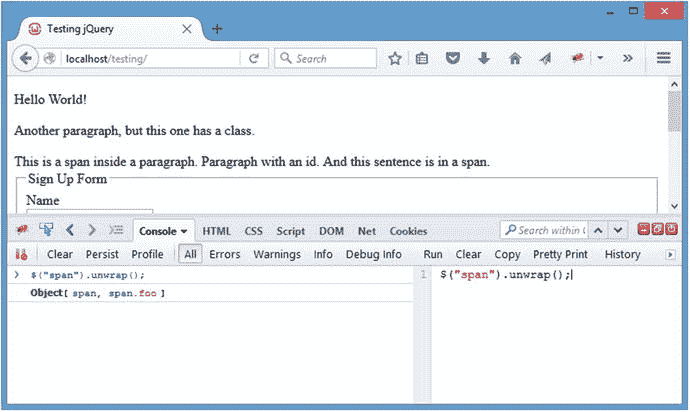

图 2-11。

After unwrapping the span elements, the document layout changes

##### 。wrapAll()

如果整个元素集需要包装在一个新的标签中，那么使用`.wrapAll()`。它不是用新标签单独包装每个选定的元素，而是将所有选定的元素分组，并在整个组周围创建一个包装器。

要用黄色背景将`div`元素环绕在页面上的所有段落周围，请使用以下代码:

`var div = $("
", {`

`"css":{"background-color":"yellow"}`

`});`

`$("p").wrapAll(div);`

执行这段代码后，新的`div`就就位了，所有段落都出现在它的黄色背景中(见图 [2-12](#Fig12) )。

图 2-12。

The yellow background shows the div successfully wrapped all paragraphs

关于`.wrapAll()`有一个重要的注意事项:它将移动 DOM 中的元素来对它们进行分组。为了演示这一点，使用`.wrapAll()`在文档中的所有跨度周围添加一个`strong`标签:

`$("span").wrapAll("<strong />");`

执行该命令后，注意文档中的第二个区域被移动到了第一个区域的旁边，因此它们可以被包含在同一个标签中(参见图 [2-13](#Fig13) )。

图 2-13。

The spans are relocated to be next to one another so both can be wrapped

##### 。wrapInner()

在某些情况下，最好包装元素的内容，而不是标签本身。一个很好的例子是将整个段落加粗:将`strong`标签放在段落周围不是有效的 HTML，因此不是一个理想的解决方案。幸运的是，jQuery 提供了`.wrapInner()`，它将元素中包含的所有内容包装在一个新标签中。

要将测试页面上段落中的所有文本变为斜体，请使用以下代码:

`$("p").wrapInner("<em />");`

执行后，页面上的所有文本都以斜体显示，标记被有效嵌套(见图 [2-14](#Fig14) )。

图 2-14。

All text is italicized, and the em tags are inside the paragraph tags

#### 。移除( )和。分离( )

为了从 DOM 中完全删除一个元素，使用了`.remove()`和`.detach()`方法。这两种方法都从 DOM 中删除选定的元素，但是`.detach()`方法保持元素的 jQuery 数据不变，这使得它非常适合元素将在某个时候重新附加到 DOM 的情况。

`.remove()`和`.detach()`都接受一个可选的选择器来过滤被删除的元素。在您的示例中，使用以下代码删除所有带有类别`foo`的段落:

`$("p").remove(".foo");`

当代码运行时，带有类`foo`的段落从视图中移除，不再是 DOM 的一部分。

为了演示`.remove()`和`.detach()`之间的区别，您必须向前跳一点，使用一种叫做`.data()`的方法，它允许开发人员在不添加额外标签或属性的情况下将信息附加到元素上。注意`.data()`将在下一节更全面地介绍。

首先，向 DOM 中的第一段添加一些数据。然后，添加数据后，使用`.detach()`从 DOM 中移除元素，重新附加它，并尝试读取数据:

`$("p:first").data("test","This is some data.");`

`var p = $("p:first").detach();`

`console.log("Data stored: "+p.data("test"));`

Note

您正在使用一个特定于 Firebug 的对象`console`及其`.log()`方法向 Firebug 控制台输出特定的信息。这对于调试特别有用，但是在项目上线之前需要删除它，以避免在没有安装 Firebug 的计算机上出现 JavaScript 错误。

运行这段代码后，`.data()`方法将一些信息附加到第一段，然后从 DOM 中移除并存储在一个变量中；然后脚本试图输出用`.data()`存储的信息的值。控制台将输出以下内容:

`> console.log("Data stored: "+p.data("test"));`

`Data stored: This is some data.`

现在，运行相同的测试，但是使用`.remove()`而不是`.detach()`:

`$("p:first").data("test","This is some data.");`

`var p = $("p:first").remove();`

`console.log("Data stored: "+p.data("test"));`

输出显示删除元素时数据丢失:

`> console.log("Data stored: "+p.data("test"));`

`Data stored: undefined`

### 访问和修改 CSS 和属性

以前，当您创建 DOM 元素时，您可以定义诸如 CSS 样式、其中包含的文本等属性。为了访问和修改现有元素的信息，jQuery 有一组内置方法。

#### 。属性( )

对于大多数元素属性，使用的是`.attr()`方法。这个方法有两个目的。第一种是读取给定的属性，这是通过将所需属性的名称作为第一个参数提供给方法来完成的，没有其他参数。第二种方法是通过传递要设置的属性的名称作为第一个参数和要设置的值作为第二个参数来设置属性。

首先，使用以下代码检索最后一段的 ID:

`$("p:eq(3)").attr("id");`

在控制台中，这会产生以下输出:

`> $("p:eq(3)").attr("id");`

`"bar"`

接下来，使用以下代码将最后一段的 ID 属性更改为`"bat"`:

`$("#bar").attr("id", "bat");`

执行后，控制台中将显示以下内容:

`> $("#bar").attr("id", "bat");`

`Object[``p#bat`T2】

现在，如果您试图选择 ID 为`bar`的元素，将返回一个空的结果集:

`> $("#bar");`

`Object[ ]`

但是，现在您可以选择一个 ID 为`bat`的段落元素:

`> $("#bat");`

`Object[``p#bat`T2】

此外，可以使用 JSON 格式设置多个属性:

`$("p:eq(3)").attr({`

`"id":"baz",`

`"title":"A captivating paragraph, isn’t it?"`

`});`

执行这段代码后，Firebug 的 HTML 面板显示该段落的标记已被更改:

`
`

#### 。移除属性( )

要删除一个属性，只需在想要删除属性的元素上调用`.removeAttr()`,并传递属性的名称。

通过删除禁用的属性来启用示例表单中的复选框:

`$(":checkbox").removeAttr("disabled");`

执行这段代码后，现在可以随意选中和取消选中复选框。

#### 。css()

除了应用于样式规则之外，`.css()`方法的工作方式与`.attr()`相似。若要返回值，请将该值的名称作为唯一参数传递给该方法；要设置值，请为其传递属性名和新值。像`.attr()`一样，可以使用 JSON 格式设置多个值。

要将类`foo`的所有元素更改为红色文本和黄色背景，请使用以下代码:

`$(".foo").css({`

`"color":"red",`

`"background-color":"yellow"`

`});`

该代码一旦被执行，就会向所选元素添加新的样式规则(参见图 [2-15](#Fig15) )。

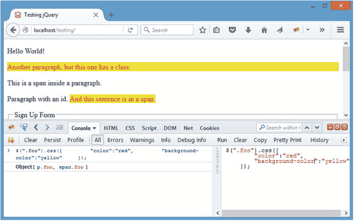

图 2-15。

The document after adding CSS styling to elements with class foo

在重新加载页面之前，使用以下代码从类为`foo`的元素中检索背景值:

`$(".foo").css("background-color");`

这将返回以下内容:

`> $(".foo").css("background-color");`

`"rgb(255, 255, 0)"`

Tip

返回的值是 CSS 速记属性。jQuery 的一个额外的好处是能够使用 CSS 简写来设置 CSS 属性，这在使用基本的 JavaScript 时是不起作用的。

##### 。文本( )和。html()

当处理一个元素的内容时，使用了`.text()`和`.html()`方法。两者的区别在于，`.html()`将允许你读取新的 HTML 标签并将其插入到一个元素中，而`.text()`仅用于读取和写入文本。

如果在没有参数的元素集上调用这些方法中的任何一个，则返回元素的内容。当一个值被传递给该方法时，现有的值将被覆盖，新的值将被替换。

要从 ID 为`bar`的段落中读出文本，请在控制台中运行以下代码:

`$("#bar").text();`

这将捕获所有文本(包括空白)，但忽略 span 标签。以下是输出:

`> $("#bar").text();`

`"Paragraph with an id.`

`And this sentence is in a span.`

`"`

要读取段落中的所有内容，包括 span 标记，请使用以下代码:

`$("#bar").html();`

这将导致以下结果:

`> $("#bar").html();`

`"Paragraph with an id.`

`And this sentence is in a span.`

`"`

现在，通过向`.text()`方法传递一个值来更改文本:

`$("#bar").text("This is new text.");`

删除该段落以前的内容，并插入新文本。请注意，span 标记也被删除了；使用`.text()`和`.html()`时，元素的所有内容都被替换。

要在段落中插入 HTML，请用以下代码片段再次替换其内容:

`$("#bar").html("This is some <strong>HTML</strong> text.");`

执行后，新文本出现在段落中，单词“HTML”以粗体显示(见图 [2-16](#Fig16) )。

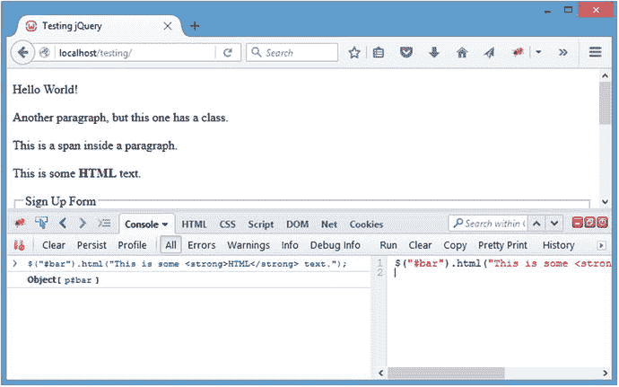

图 2-16。

The browser after inserting text and HTML tags

#### 。瓦尔( )

访问和修改表单元素的内容是通过`.val()`方法完成的。此方法返回输入的值，或者如果提供了值，则设置输入的值。

使用以下命令检索测试表单中 submit 按钮的值

`$(":submit").val();`

哪些输出

`> $(":submit").val();`

`"Log In"`

现在，使用以下代码将提交输入的值更新为`"Sign In"`:

`$(":submit").val("Sign In");`

运行前面的代码片段后，提交按钮被称为登录。

#### 。数据( )

之前，您使用了`.data()`方法来为`.remove()`和`.detach()`的测试存储信息。`.data()`方法正是这样做的:它允许您以一种安全、简单的方式存储 jQuery 对象中的元素信息。

为了给测试文档中的前两段起绰号，使用`.data()`存储信息，然后将它记录在控制台中:

`$("p:first")`

`.data("nickname", "Pookie")`

`.next("p")`

`.data("nickname", "Shnookums");`

`console.log("My nickname: "+$("p:first").data("nickname"));`

`console.log("My nickname: "+$("p:eq(1)").data("nickname"));`

执行此脚本后，控制台中将记录以下内容:

`> $("p:first") .data("nick…name: "+$("p:eq(1)").data("nickname"));`

`My nickname: Pookie`

`My nickname: Shnookums`

数据也可以以 JSON 格式一起添加到元素中:

`$("p.foo").data({`

`"nickname":"Wubby",`

`"favorite":{`

`"movie":"Pretty Woman",`

`"music":"Sade",`

`"color":"pink"`

`}`

`});`

`console.log("Nickname: "+$("p.foo").data("nickname"));`

`console.log("Favorite Movie: "+$("p.foo").data("favorite").movie);`

上述代码在执行时将产生以下输出:

`> $("p.foo").data({ "nickname":"Wubby",....data("favorite").movie);`

`Nickname: Wubby`

`Favorite Movie: Pretty Woman`

这也可以通过在变量中缓存数据来简化，如下所示:

`$("p.foo").data({`

`"nickname":"Wubby",`

`"favorite":{`

`"movie":"Pretty Woman",`

`"music":"Sade",`

`"color":"pink"`

`}`

`});`

`var info = $("p.foo").data(); // cache the data object in a variable`

`console.log("Nickname: "+info.nickname);`

`console.log("Favorite Movie: "+info.favorite.movie);`

这产生了与前一个例子相同的结果，但是执行得更好，也更容易阅读。

#### 。addClass()，。removeClass()、和。toggleclass()

三个快捷方法是为处理类而写的，因为它们的使用是现代网页设计不可或缺的一部分。前两种方法`.addClass()`和`.removeClass()`分别简单地添加或删除一个类属性:

`$("p:first").addClass("bat");`

`console.log("Text: "+$(".bat").text());`

`$("p:first").removeClass("bat");`

`console.log("Text: "+$(".bat").text());`

上述代码片段在控制台中输出以下内容:

`> $("p:first").addClass("bat"…le.log("Text: "+$(".bat").text());`

`Text: Hello World!`

`Text:`

第三种方法是`.toggleClass()`，接受一个或多个类名，如果元素不存在这个类，就添加它，如果这个类已经存在，就删除它。

使用以下代码在示例页面的第二段中添加类`baz`并删除类`foo`:

`$("p.foo").toggleClass("foo baz");`

在执行时，该段落被修改并出现，旧类被删除，新类被添加(见图 [2-17](#Fig17) )。

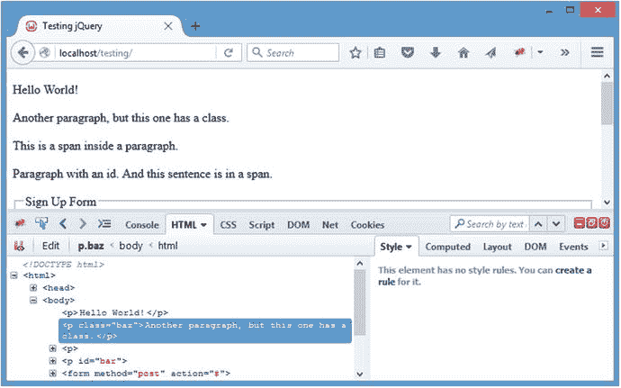

图 2-17。

The foo class is removed, and the baz class is added

要恢复到`foo`的原始类别并删除`baz`，请选择段落，并再次应用`.toggleClass()`:

`$("p.baz").toggleClass("foo baz");`

这导致该段落返回到只有一个类:`foo`。

#### 。hasClass()

`.hasClass()`方法的工作方式类似于`.is()`方法，它确定一个类是否存在于一个被选择的元素上，然后返回`true`或`false`。这使得它非常适合回调函数。

检查第一段是否有类`foo`，并使用以下命令有条件地输出一条消息:

`var msg = $("p:eq(1)").hasClass("foo") ? "Found!" : "Nope!";`

`console.log("Class? "+msg);`

#### 。高度( )和。宽度( )

要获得元素的高度或宽度，`.height()`和`.width()`方法很方便。两者都返回不带单位的值，这意味着返回的值是一个整数(如果元素是 68 像素高，`.height()`将返回`68`)。这不同于`.css()`，它也将返回度量单位。

通过运行以下代码获取窗体的高度:

`console.log("Form height: "+$("form").height()+"px");`

这将在控制台中输出以下内容:

`> console.log("Form height: "+$("form").height()+"px");`

`Form height: 252px`

Note

根据您使用的操作系统，返回的实际高度可能会因浏览器而异。

通过向`.height()`或`.width()`传递一个值，设置一个新值。使用以下代码，使页面上的所有段落高度为 100 像素，背景为黄色:

`$("p").height(100).css("background-color","yellow");`

执行时，所有段落高度都会改变，其背景变成黄色(参见图 [2-18](#Fig18) )。

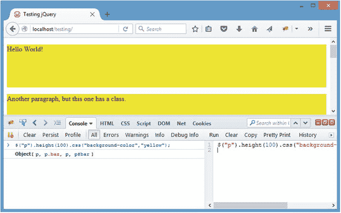

图 2-18。

The modified height and backgrounds of all document paragraphs

#### .innerHeight（ ）， .innerWidth（ ）， .outerHeight（ ） 和 .outerWidth（ ）

元素的内部高度和宽度是不包括边框或边距的宽度或高度。您可以使用`.innerHeight()`和`.innerWidth()`方法来访问这些信息。

如果您希望在元素的高度或宽度中包含边框，请使用`.outerHeight()`或`.outerWidth()`。要包含边距，请使用`.outerHeight(true)`或`.outerWidth(true)`。

使用类`foo`为段落添加边距和边框，然后记录其不同的宽度和高度:

`var el = $("p.foo");`

`el.css({`

`"margin":"20px",`

`"border":"2px solid black"`

`});`

`console.log("Inner width: "+el.innerWidth()+"px");`

`console.log("Inner height: "+el.innerHeight()+"px");`

`console.log("Outer width: "+el.outerWidth()+"px");`

`console.log("Outer height: "+el.outerHeight()+"px");`

`console.log("Outer width with margins: "+el.outerWidth(true)+"px");`

`console.log("Outer height with margins: "+el.outerHeight(true)+"px");`

这将在控制台中输出以下内容:

`> var el = $("p.foo"); el.c…rgins: "+el.outerHeight(true)+"px");`

`Inner width: 840px`

`Inner height: 20px`

`Outer width: 844px`

`Outer height: 24px`

`Outer width with margins: 884px`

`Outer height with margins: 64px`

Note

同样，根据您使用的操作系统，您的结果可能会有所不同。

### 影响结果集

要处理一组元素，您需要一组允许您影响集合中每个元素的方法。

#### 。map()和。每个( )

`.map()`和`.each()`方法允许开发人员使用回调函数将函数分别应用于集合中的每个元素，回调函数有两个参数:当前元素索引和当前 DOM 元素。

两者的区别在于，`.map()`返回一个包含回调返回值的新对象，而`.each()`将返回包含回调执行的更改的原始对象。这意味着`.each()`是可链接的，而`.map()`不是。

要使用类`foo`遍历每个段落和元素，并追加标记名和元素索引，请使用以下代码:

`$("p,.foo").map(function(index, ele){`

`$(this).append(" "+ele.tagName+" #"+index);`

`});`

这将元素的标签名和索引号添加到每个匹配元素的末尾(见图 [2-19](#Fig19) )。

图 2-19。

The test page after mapping a callback function to display names and indexes for each element

要用`.each()`完成同样的事情，只需交换对`.map()`的调用:

`$("p,.foo").each(function(index, ele){`

`$(this).append(" "+ele.tagName+" #"+index);`

`});`

这产生了相同的结果。

如果您需要在调用`.map()`或`.each()`之后执行进一步的处理，这种差异就开始起作用了。例如，如果您想要将标签名称和索引附加到每个段落和带有类别`foo`的范围，如前所述，然后过滤到带有类别`foo`的范围，并更改其背景和文本颜色，您可以尝试以下方法:

`$("p,.foo").map(function(index, ele){`

`$(this).append(" "+ele.tagName+" #"+index);`

`})`

`.find("span.foo")`

`.css({`

`"color":"red",`

`"background":"yellow"`

`});`

执行后，标签名和索引被追加，但是 span 没有应用任何样式更改。这是因为从`.map()`返回的对象不再引用这些元素。

为了让前面的代码片段按预期执行，您必须将对`.map()`的调用替换为对`.each()`的调用:

`$("p,.foo").each(function(index, ele){`

`$(this).append(" "+ele.tagName+" #"+index);`

`})`

`.find("span.foo")`

`.css({`

`"color":"red",`

`"background":"yellow"`

`});`

现在运行代码产生了期望的结果(见图 [2-20](#Fig20) )。

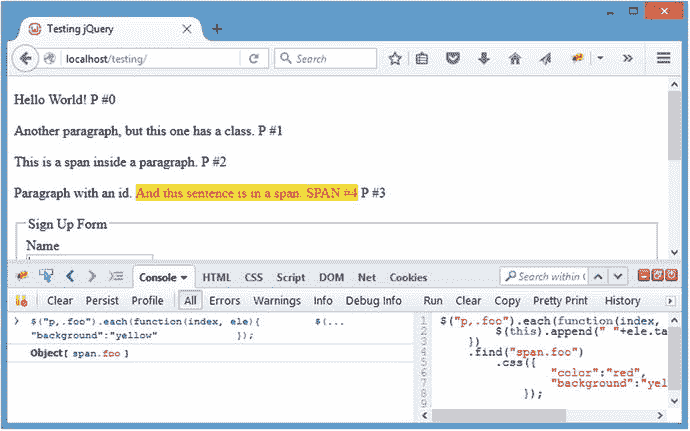

图 2-20。

Using .each(), the expected results are produced

### 使用动画和其他效果

jQuery 最令人兴奋的特性之一是它的方法库，允许动画和特殊效果，这些在普通的 JavaScript 中都是可能的，但是使用 jQuery 非常容易。传统的 JavaScript 方法很棘手，也更复杂。

Note

因为很难将动画显示为静态图像，所以您需要依靠您的浏览器来演示这些示例应该是什么样子。对于不同动画效果的现场演示，请访问位于 [`http://api.jquery.com`](http://api.jquery.com/) 的 jQuery API，并查找您希望看到演示的个别方法。

#### 。显示( )和。隐藏( )

最基本的特效功能是`.show()`和`.hide()`。当在没有参数的情况下触发时，它们只是在元素的样式属性中添加或移除`display:none;`。

使用以下代码隐藏 ID 为`bar`的段落:

`$("#bar").hide();`

该段落会从浏览器窗口中消失，但在使用元素检查器的 DOM 中仍然可见。要将它带回到视图中，请调用`.show()`:

`$("#bar").show();`

元素会恢复到原来的样子。

为了使元素的隐藏和显示具有动画效果，可以传递持续时间(以毫秒为单位),以及在动画完成后触发的可选回调。为了进行演示，向 ID 为`bar`的段落添加背景和边框，然后用 2 秒的时间隐藏它，并使用回调函数在控制台中记录一条消息:

`$("#bar")`

`.css({`

`"background":"yellow",`

`"border":"1px solid black"`

`})`

`.hide(2000,function(){`

`console.log("Animation complete!");`

`});`

执行时，CSS 样式被添加到元素中，并且触发`.hide()`方法。这将导致元素水平和垂直收缩，并淡化其不透明度。两秒钟后，它将消失，回调函数将`"Animation complete!"`消息记录在控制台中。

Note

回调函数将为动画集中的每个元素触发。

#### 。fadeIn()，。fadeOut()和。fadeTo()

要淡入或淡出一个元素(使用不透明度)，使用`.fadeIn()`和`.fadeOut()`。当被调用时，这些方法调整元素的不透明度，从`.fadeIn()`中的`0`到`1`，或者从`.fadeOut()`中的`1`到`0`。当一个元素淡出时，`display:none;`也应用于该元素。淡入时，`display:none;`会从元素中移除(如果它存在的话)。

这两种方法都接受动画持续时间的可选参数(默认为 400 毫秒)和动画完成时触发的回调。持续时间有两个快捷字符串，`"fast"`和`"slow"`，分别转换为 200 和 600 毫秒。

要淡出表单、记录一条消息、淡入并记录另一条消息，请使用以下命令:

`$("form")`

`.fadeOut(1000, function(){`

`console.log("Faded out!");`

`})`

`.fadeIn(1000, function(){`

`console.log("Faded in!");`

`});`

或者，`.fadeTo()`允许您指定元素应该淡化到的不透明度。这个方法需要两个参数:持续时间和元素淡入淡出的不透明度(一个在`0`和`1`之间的数字)。可选的回调也可以作为第三个参数传递。

将表格的透明度降低到 50 %,并使用以下内容记录一条消息:

`$("form")`

`.fadeTo(1000, 0.5, function(){`

`console.log("Faded to 50%!");`

`});`

#### 。slideUp()，。slideDown()和。slideToggle()

通过将元素的高度降低到`0`，`.slideUp()`来隐藏元素是一种快捷的方法。它动画显示元素高度的减少，直到它到达`0`，然后设置`display:none;`以确保布局不再受元素影响。为了扭转这种情况，`.slideDown()`方法删除了`display:none;`，并把从`0`到元素原始高度的高度制作成动画。

就像`.fadeIn()`和`.fadeOut()`一样，接受两个可选参数:持续时间和一个回调函数。

向上滑动带有类别`foo`的段落，记录一条消息，向下滑动，并记录另一条消息:

`$("p.foo")`

`.slideUp(1000, function(){`

`console.log("Hidden!");`

`})`

`.slideDown(1000, function(){`

`console.log("Shown!");`

`});`

`.slideToggle()`方法与`.slideUp()`和`.slideDown()`做同样的事情，但是它足够聪明，可以知道一个元素是否被隐藏或显示，并使用该信息来决定采取什么行动。

要为类别为`foo`的段落设置显示切换，请使用以下命令:

`$("p.foo")`

`.slideToggle("slow", function(){`

`console.log("Toggled!");`

`});`

多次运行此代码，以交替方式上下滑动段落。

#### 。动画( )

前面讨论的动画方法都是调用`.animate()`方法的快捷方式。此方法将动画显示元素的大多数可视 CSS 属性，并支持缓动，缓动是改变动画操作方式的任意数量的数学公式之一。默认情况下，`"linear"`和`"swing"`宽松是受支持的，但是 jQuery 有一个易于包含的宽松插件(您将在本书后面了解插件)。

`.animate()`方法接受两种格式的几个参数。在第一种格式中，向该方法传递一组 JSON 格式的 CSS 属性作为第一个参数，可选的持续时间(毫秒)作为第二个参数，可选的缓动公式作为第三个参数，可选的回调作为第四个参数。第二种格式传递一组 JSON 格式的 CSS 属性作为第一个参数，传递一组 JSON 格式的选项作为第二个参数。

在设置了背景和边框样式之后，要使用`"swing"`缓动类型在 5 秒内动画显示 ID 为`bar`的段落元素的高度和宽度，并在完成时记录一条消息，请使用以下第一种格式:

`$("#bar")`

`.css({`

`"background":"yellow",`

`"border":"1px solid black"`

`})`

`.animate({`

`"width":"500px",`

`"height":"100px"`

`},`

`5000,`

`"swing",`

`function(){`

`console.log("Animation complete!");`

`});`

完成后，该段落为黄色，带有黑色边框，并已更改其大小以匹配所传递的参数(参见图 [2-21](#Fig21) )。

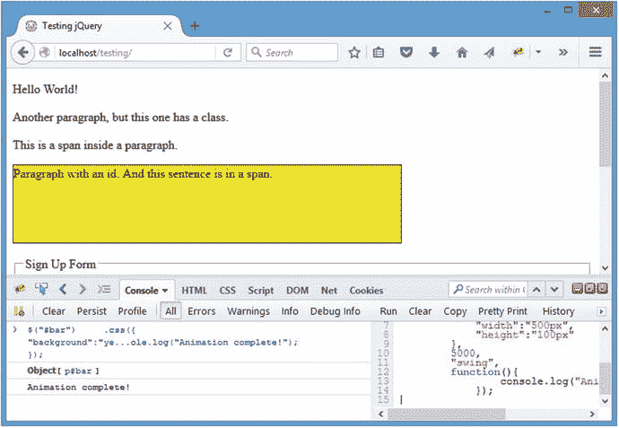

图 2-21。

The paragraph after animating its height and width

使用第二种格式，代码将更改如下:

`$("#bar")`

`.css({`

`"background":"yellow",`

`"border":"1px solid black"`

`})`

`.animate({`

`"width":"500px",`

`"height":"100px"`

`},`

`{`

`"duration":5000,`

`"easing":"swing",`

`"complete":function(){`

`console.log("Animation complete!");`

`}`

`});`

这产生了相同的结果。`.animate()`的第二种格式也提供了额外的选项。要使用所有可用选项完成相同的操作，您的代码可能如下所示:

`$("#bar")`

`.css({`

`"background":"yellow",`

`"border":"1px solid black"`

`})`

`.animate({`

`"width":"500px",`

`"height":"100px"`

`},`

`{`

`"duration":5000,`

`"easing":"swing",`

`"complete":function(){`

`console.log("Animation complete!");`

`},`

`"step":function(){`

`console.log("Step completed!");`

`},`

`"queue":true,`

`"specialEasing":{`

`"width":"linear"`

`}`

`});`

`step`选项允许开发人员创建一个回调函数，在动画的每一步之后触发。这是每次属性被调整的时候，所以前面的例子最终输出了相当多的`"Step completed!"`的日志消息。

`queue`选项告诉动画是否应该被添加到当前队列，即动画被调用的顺序。如果多个动画被调用并排队，第一个动画将在第二个开始之前完成，第二个将在第三个开始之前完成，依此类推。

`specialEasing`选项允许开发人员将不同的缓动样式附加到每个被动画化的 CSS 属性上。

#### 。延迟( )

`.delay()`方法本质上允许开发人员在给定的毫秒数内暂停脚本的执行。它提供了运行一个动画并在开始下一个动画之前等待一段时间的能力。

要向上滑动 ID 为`bar`的段落，等待 3 秒钟，然后向下滑动，请使用以下代码:

`$("#bar")`

`.css({`

`"background":"yellow",`

`"border":"1px solid black"`

`})`

`.slideUp(1000, function(){`

`console.log("Animation completed!");`

`})`

`.delay(3000)`

`.slideDown(1000, function(){`

`console.log("Animation completed!");`

`});`

#### 。停止( )

要停止动画，使用`.stop()`方法。该方法接受两个布尔参数:一个用于确定是否应该清除队列，另一个用于确定动画是否应该跳到结尾。两个值都默认为`false`。

要启动动画，停止动画，清除队列，并在 200 步后跳到结尾，请使用以下命令:

`var count = 0; // Keep track of the current step count`

`$("#bar")`

`.css({`

`"background":"yellow",`

`"border":"1px solid black"`

`})`

`.animate({`

`"width":"500px"`

`},`

`{`

`"duration":6000,`

`"step":function(){`

`if(count++==200)`

`{`

`$(this).stop(true, true);`

`}`

`}`

`});`

### 处理事件

在许多脚本中，当某些事件或浏览器动作发生时，希望发生某些动作。jQuery 内置了对处理浏览器事件的支持，您将在本节中了解到这一点。

#### 浏览器事件

当浏览器本身遇到更改或错误时，就会发生浏览器事件。

##### 。错误()

如果发生浏览器错误，将触发此事件。浏览器错误的一个常见实例是图像标签试图加载不存在的图像。`.error()`方法允许开发人员将一个处理程序(即事件发生时要触发的函数)绑定到事件。

创建一个试图显示一个不存在的图像的图像标签，并将一个错误处理程序附加到向控制台输出消息的`error`事件:

`$("", {`

`"src":"not/an/image.png",`

`"alt":"This image does not exist"`

`})`

`.error(function(){`

`console.log("The image cannot be loaded!");`

`})`

`.appendTo("body");`

执行这段代码后，控制台将显示类似如下的内容:

`> $("", { "src":"not/an/image.png", …ot be loaded!"); }) .appendTo("body");`

`Object[ img not/an/image.png ]`

`"NetworkError: 404 Not Found -``http://localhost/testing/not/an/image.png`T2】

`image.png`

`The image cannot be loaded!`

##### 。滚动( )

如果文档被滚动，则触发`scroll`事件。要将处理程序绑定到该事件，请使用`.scroll()`方法:

`$(window)`

`.scroll(function(){`

`console.log("The window was scrolled!");`

`});`

执行此代码后，滚动浏览器窗口将导致在控制台中记录一条消息。

此外，不带任何参数调用`.scroll()`方法将触发`scroll`事件。将前面的处理程序绑定到窗口后，通过运行以下命令来触发事件:

`$(window).scroll();`

执行这段代码将在控制台中记录`scroll`事件处理程序的消息。

#### 处理文档加载事件

通常，JavaScript 需要等到文档准备好之后才能执行任何脚本。此外，当用户退出一个页面时，有时需要启动一个函数来确保他们想离开这个页面。

##### 。就绪( )

几乎每个 jQuery 脚本中都使用了`.ready()`方法，以防止脚本过早执行，从而无法正常运行。该方法在触发其处理程序之前等待 DOM 准备好进行操作。

通常的做法是让整个脚本成为由`.ready()`处理程序触发的回调函数:

`$(document).ready(function(){`

`// All jQuery functionality here`

`});`

此外，`.ready()`方法接受一个参数作为 jQuery 函数的别名。这允许您编写故障保护 jQuery 脚本，即使使用`jQuery.noConflict()`将`$`别名返回给另一个库，这些脚本也能按预期工作(这允许多个使用`$`别名的 JavaScript 库在同一个项目中使用，不会出现问题)。

您可以使用以下代码保证`$`别名正常工作:

`jQuery.ready(function($){`

`// All jQuery functionality here`

`$("p").fadeOut();`

`});`

从技术上讲，任何别名都可以在这里传递:

`jQuery(document).ready(function(xTest){`

`xTest("#bar").click(function(){console.log("Clicked!");});`

`});`

这按预期执行，没有错误。在很多情况下，这种检查是不必要的，但是它说明了别名如何与`.ready()`方法一起工作。

最后，jQuery 函数本身可以用作`.ready()`的别名:

`jQuery(function($){`

`// actions to perform after the DOM is ready`

`});`

##### 。卸载( )

每当用户通过单击链接、重新加载页面、使用前进或后退按钮或完全关闭窗口退出页面时，就会触发`unload`事件。然而，卸载的处理并不是在所有的浏览器中都是一致的，因此在用于生产脚本之前，应该在多个浏览器中进行测试。要创建一个指向 Google 的链接并向 unload 事件附加一个警报，请使用以下代码:

`$("<a>", {`

`"href":"`[`http://google.com`](http://google.com/)T2】

`"text":"Go to Google!"`

`})`

`.appendTo("#bar");`

`$(window).unload(function(){`

`alert("Bye! Google something neat!");`

`});`

执行这段代码，然后单击新链接。警报触发，您被重定向到 Google 主页。

#### 处理事件附件

用户触发了大量的浏览器事件，jQuery 提供了几种方法来轻松处理它们。可用的事件有:`blur`、`focus`、`focusin`、`focusout`、`resize`、`scroll`、`unload`、`click`、`dblclick`、`mousedown`、`mouseup`、`mousemove`、`mouseover`、`mouseout`、`mouseenter`、`mouseleave`、`change`、`select`、`submit`、`keydown`、`keypress`、`keyup`和`error`。

##### 。绑定( )和。解除绑定( )

为了将事件处理程序绑定到元素，使用了`.bind()`方法。它接受一个事件作为第一个参数，接受一个处理函数作为第二个参数。

使用空格分隔的事件列表作为第一个参数，可以绑定多个事件。为了将不同的处理程序绑定到不同的事件，JSON 格式的对象也可以传递给`.bind()`。

要将控制台消息日志绑定到`click`事件，请使用以下命令:

`$("p")`

`.bind("click", function(){`

`console.log("Click happened!");`

`});`

运行此代码后单击一个段落将导致一条消息被记录到控制台。

要将处理程序绑定到`click`和`mouseover`事件，请使用以下代码:

`$("p")`

`.bind("click mouseover", function(){`

`console.log("An event happened!");`

`});`

现在，点击或悬停在一个段落上会在控制台中记录一条消息。

如果处理程序需要向其传递数据，还有一个额外的参数可用。这是一个 JSON 格式的对象，包含函数中使用的变量。这些变量被绑定到`event`对象，因此这些值在给定的处理程序中保持不变。

使用以下代码为测试文档中功能相同但日志消息不同的两个段落设置一个`click`处理程序:

`// Create a value for the notice variable`

`var notice = "I live in a variable!";`

`$("p.foo").bind("click", { n:notice }, function(event){`

`console.log(event.data.n);`

`});`

`// Change the value of the notice variable`

`var notice = "I live in a variable too!";`

`$("#bar").bind("click", { n:notice }, function(event){`

`console.log(event.data.n);`

`});`

要将不同的处理程序绑定到`click`和`mouseover`事件，请使用以下代码:

`$("p")`

`.bind({`

`"click":function(){`

`console.log("Click happened!");`

`},`

`"mouseover":function(){`

`console.log("Mouseover happened!");`

`}`

`});`

执行后，当每个事件发生时，将在控制台中记录不同的消息。

要删除一个事件，只需调用`.unbind()`方法。如果不带参数调用，则从元素中移除所有事件绑定。要指定，要解除绑定的事件的名称可以作为第一个参数传递。为了进一步说明，要从事件中移除的函数可以作为第二个参数传递。

要解除示例段落中所有事件的绑定，请使用以下命令:

`$("p").unbind();`

要仅删除`click`事件处理程序，请使用以下代码:

`$("p").unbind("click");`

或者，如果一个特定的函数被绑定到一个元素，它可以像这样被解除绑定:

`var func1 = function(){`

`console.log("An event was triggered!");`

`},`

`func2 = function(){`

`console.log("Another handler!");`

`};`

`$("#bar")`

`.bind("click", func1)`

`.bind("click", func2)`

`.trigger("click") // fire the event once`

`.unbind("click", func1);`

前面的代码创建了两个函数(存储在`func1`和`func2`变量中)，将它们绑定到 ID 为`bar`的段落的`click`事件，触发该事件一次(您将在本节稍后了解到`.trigger()`，并解除绑定存储在`func1`中的函数。

运行这段代码后，点击该段落将只触发存储在`func2`中的函数。

##### 。live()和。模具( )

类似于`.bind()`和`.unbind()` , `.live()`和`.die()`将分别附加和移除元素的事件处理程序。主要区别在于`.live()`不仅会将处理程序和 JavaScript 属性附加到现有的事件上，还会附加到添加到 DOM 中的任何新元素上，这些新元素随后也会匹配选择器。

例如，使用以下代码为任何锚元素添加一个`click`事件处理程序:

`$("a")`

`.live("click", function(){`

`console.log("Link clicked!");`

`return false; // prevent the link from firing`

`});`

当然，目前示例页面上没有任何链接。无需重新加载，使用以下代码向 ID 为`bar`的段落添加锚标记:

`$("<a>", {`

`"href":"`[`http://google.com`](http://google.com/)T2】

`"text":"Go to Google!"`

`})`

`.appendTo("#bar");`

新链接出现，即使事件是在 DOM 中存在任何锚标记之前绑定的，单击链接也会导致在控制台中记录一条消息，并且链接不会触发。

使用`.bind()`执行之前的动作不起作用。另外，`.live()`绑定的`click`事件处理程序不能用`.unbind()`移除；要删除事件，您必须使用`.die()`。`.die()`的使用与`.unbind()`相同。

##### 。一个( )

`.one()`方法的功能和使用与`.bind()`相同，除了事件处理程序在事件发生一次后被解除绑定。

使用以下代码为 ID 为`bar`的段落添加一个新的`click`事件处理程序，该事件处理程序只会触发一次:

`$("#bar").one("click", function(){`

`console.log("This will only fire once.");`

`});`

执行后，单击 ID 为`bar`的段落会导致控制台记录一条消息，随后的单击没有任何效果。

##### 。切换( )

`.toggle()`函数允许开发人员将两个或多个函数绑定到在交替点击时触发的点击事件。或者，该函数可用于切换元素的可见性(如切换`.show()`和`.hide()`——类似于`.slideToggle()`在被调用时如何交替执行`.slideUp()`和`.slideDown()`的功能)。

首先，使用以下代码将三个不同的日志消息绑定到 ID 为`bar`的段落的`click`事件:

`$("#bar")`

`.toggle(function(){`

`console.log("Function 1");`

`},`

`function(){`

`console.log("Function 2");`

`},`

`function(){`

`console.log("Function 3");`

`});`

执行后，点击 ID 为`bar`的段落，在随后的点击中连续记录三条消息。

接下来，用下面的代码切换 ID 为`bar`的段落的可见性:

`$("#bar").toggle();`

启动这个函数会隐藏段落。再次开火会把它带回来。通过添加持续时间作为第一个参数，该方法将显示或隐藏元素的动画效果:

`$("#bar").toggle(2000);`

最后，可以传递一个布尔标志来确定是否应该显示或隐藏所有元素:

`$("#bar").toggle(true);  // all elements will be shown`

`$("#bar").toggle(false); // all elements will be hidden`

##### 。触发器( )

为了触发事件，使用了`.trigger()`方法。该方法接受要触发的事件和要传递给处理程序的可选参数数组。

将处理程序绑定到 ID 为`bar`的段落，并使用以下代码触发它:

`$("#bar")`

`.bind("click", function(){`

`console.log("Clicked!");`

`})`

`.trigger("click");`

要传递附加数据，请按如下方式修改代码:

`// create a variable`

`var note = "I was triggered!";`

`$("#bar")`

`.bind("click", function(event, msg){ // allow a 2nd argument`

`// If no msg variable is passed, a default message`

`var log = msg || "I was clicked!";`

`console.log(log);`

`})`

`.trigger("click", [ note ]); // array passed in square brackets`

这将存储在`note`变量中的信息输出到控制台。

#### 快捷事件方法

每个事件都有一个快捷方法，该方法接受处理函数作为参数。如果传递时没有参数，它将调用`.trigger()`获取其事件类型。可用的快捷功能有`.blur()`、`.focus()`、`.focusin()`、`.focusout()`、`.load()`、`.resize()`、`.scroll()`、`.unload()`、`.click()`、`.dblclick()`、`.mousedown()`、`.mouseup()`、`.mousemove()`、`.mouseover()`、`.mouseout()`、`.mouseenter()`、`.mouseleave()`、`.change()`、`.select()`、`.submit()`、`.keydown()`、`.keypress()`、`.keyup()`和`.error()`。

例如，下面将一个处理程序绑定到 click 事件，并触发该事件:

`$("#bar").click(function(){ console.log("Clicked!"); }).click();`

### 使用 AJAX 控件

我们将要讨论的最后一组 jQuery 方法可能是最有用的，并且很可能在 jQuery 的广泛采用中发挥了重要作用。提供 AJAX [4](#Fn4) 功能的方法非常有用，尤其是对于以前用普通 JavaScript 构建过 AJAX 脚本的人来说，非常简单。

Note

关于 AJAX 的进一步阅读，请参见维基百科的文章 [`https://en.wikipedia.org/wiki/Ajax_(programming)`](https://en.wikipedia.org/wiki/Ajax_(programming)) `.`

对于这一部分，您需要一个外部文件来使用 AJAX 控件进行访问。在`testing`文件夹中创建一个名为`ajax.php`的新文件。在内部，插入以下代码:

`<?php`

`echo '
This paragraph was loaded with AJAX.
',`

`'<pre>GET variables: ', print_r($_GET, TRUE), '</pre>',`

`'<pre>POST variables: ', print_r($_POST, TRUE), '</pre>';`

`?>`

这个文件将被 jQuery 中各种可用的 AJAX 方法调用。为了便于说明，它将向您显示传递给脚本的数据。

#### $.ajax()

发送 AJAX 请求的底层或最基本的函数是`$.ajax()`。注意，调用这个函数时没有选择器，因为它不适用于 jQuery 对象。AJAX 动作是全局函数，独立于 DOM 执行。

`$.ajax()`函数接受一个参数:一个包含 AJAX 调用设置的对象。如果在没有任何设置的情况下调用，该方法将加载当前页面，并且对结果不做任何处理。

`$.ajax()`有相当多的设置可用，这里没有全部涵盖或在本书中使用。可用设置的完整列表见 [`http://api.jquery.com/jQuery.ajax`](http://api.jquery.com/jQuery.ajax) 。最常见如下:

*   `data`:这描述了发送到远程脚本的任何数据，或者作为查询字符串`(key1=val1&key2=val2)`或者作为`JSON ({"key1":"val1","key2":"val2"})`。
*   这个回调允许数据的预过滤，并且对于净化来自远程脚本的数据非常有用。
*   `dataType`:描述请求中预期的数据类型。如果没有定义，jQuery 会进行智能猜测。可用类型有`"xml", "html", "script", "json", "jsonp",`和`"text"`。
*   `error(XMLHttpRequest, textStatus, errorThrown)`:这个回调将在请求出错时执行。`XMLHttpRequest`对象、传达请求状态的字符串和错误代码作为参数传递。
*   `success(data, textStatus, XMLHttpRequest)`:如果请求成功完成，这个回调将被执行。从远程脚本返回的数据、传达请求状态的字符串和`XMLHttpRequest`对象作为参数传递。
*   `type`:这是要发送的请求类型。默认为`GET`，但`POST`也可用。`PUT`和`DELETE`可以使用，但可能无法在所有浏览器中正常工作。
*   `url`:这是请求要发送到的 URL。

要向您的示例脚本发送一个基本的`POST`请求，并将结果加载到 ID 为`bar`的段落中，请使用以下代码:

`$.ajax({`

`"type":"POST",`

`"url":"ajax.php",`

`"data":"var1=val1&var2=val2",`

`"success":function(data){`

`$("#bar")`

`.css("background","yellow")`

`.html(data);`

`}`

`});`

执行该代码后，该段落的内容被替换为加载的信息(见图 [2-22](#Fig22) )。

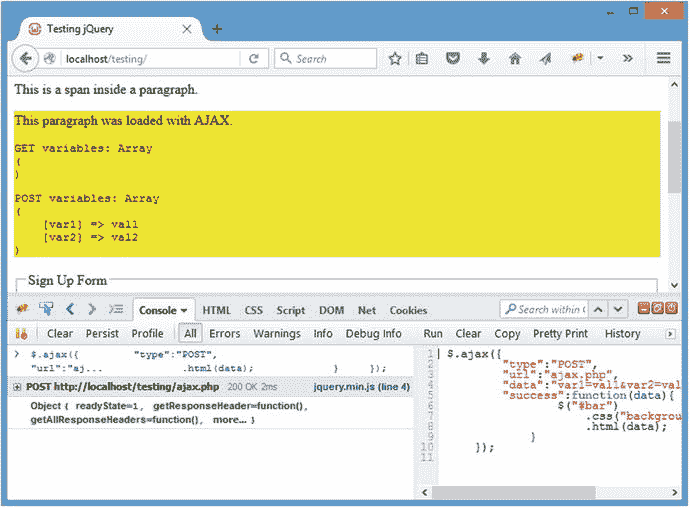

图 2-22。

The loaded AJAX information from ajax.php

#### $.ajaxSetup()

为了设置 AJAX 调用的默认选项，使用了`$.ajaxSetup()`函数。例如，要指定在默认情况下，所有 AJAX 请求都应该使用`POST`发送到`ajax.php`，然后加载到 ID 为`bar`的段落中，请使用下面的代码:

`$.ajaxSetup({`

`"type":"POST",`

`"url":"ajax.php",`

`"success":function(data){`

`$("#bar")`

`.css("background","yellow")`

`.html(data);`

`}`

`});`

现在，只需传递新数据，就可以轻松地发出新的 AJAX 请求:

`$.ajax({`

`"data":{`

`"newvar1":"value1",`

`"newvar2":"value2"`

`}`

`});`

这导致该段落的内容被来自`ajax.php`的新内容替换(见图 [2-23](#Fig23) )。

图 2-23。

The result of an AJAX call after setting default options

这些默认值可以在随后对`$.ajax()`的调用中被覆盖，只需在新调用中重新定义选项:

`$.ajax({`

`"type":"GET",`

`"data":{`

`"newvar1":"value3",`

`"newvar2":"value4"`

`}`

`});`

这导致使用`GET`发送数据(参见图 [2-24](#Fig24) )。

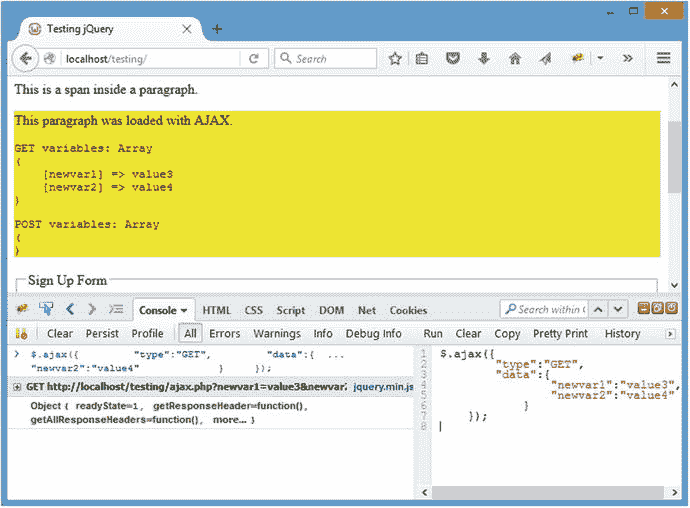

图 2-24。

The result after overriding the default type option with GET

#### 使用速记 AJAX 方法

有几个简单的一次性函数可用于执行常见的 AJAX 任务。简而言之，这些简写方法只是简单的包装函数，用一些已经设置好的参数调用`$.ajax()`。

使用这些方法会导致轻微的性能损失，因为您实际上是在调用一个设置参数的方法，并在其内部调用`$.ajax()`。然而，使用速记方法的便利确实加快了许多脚本的开发。

##### $.get()和$。帖子( )

对于标准的`GET`和`POST`请求，`$.get()`和`$.post()`功能易于使用。两者都有四个参数:请求发送到的 URL、发送到远程脚本的可选数据、请求成功时执行的可选回调以及可选的`dataType`设置。

要在不发送数据的情况下使用`GET`加载`ajax.php`的结果，请使用以下命令:

`$.get("ajax.php", function(data){`

`$("#bar")`

`.css("background","yellow")`

`.html(data);`

`});`

要使用`POST`发送带有数据的请求，可以使用以下代码:

`$.post("ajax.php", {"var1":"value"}, function(data){`

`$("#bar")`

`.css("background","yellow")`

`.html(data);`

`});`

##### $.getJSON（ ）

加载 JSON 数据时，`$.getJSON()`是一个快捷函数。它接受请求发送到的 URL、可选数据和可选回调函数。

要运行这个函数的示例，需要创建另一个测试文件:在`testing`文件夹中创建一个名为`json.php`的新文件，并在其中插入以下 JSON:

`{"var1":"value1","var2":"value2"}`

现在，加载`json.php`的内容并输出 ID 为`bar`的段落中的内容:

`$.getJSON("json.php",`

`function(data){`

`$("#bar")`

`.css("background","yellow")`

`.html(data.var1+", "+data.var2);`

`});`

执行后，该段落的内容将被替换为字符串`"value1, value2"`。

##### $.getScript（）

要加载外部 JavaScript，使用`$.getScript()`函数。它接受一个 URL 和一个可选的回调(通常不需要，因为脚本会在成功加载时自动执行)。

在`testing`文件夹中创建一个名为`script.php`的新文件，并插入以下内容:

`alert("This script was loaded by AJAX!");`

现在，通过在控制台中执行以下代码来加载该脚本:

`$.getScript("script.php");`

执行时，将触发警报。

##### 。负载( )

`.load()`方法的工作方式就像`$.get()`或`$.post()`，除了它是一个方法而不是一个全局函数。它有一个隐式回调，用远程文件返回的内容替换匹配元素的 HTML。

该方法接受相同的三个参数:目标 URL、可选数据和可选回调(在元素内容被替换后触发)。

使用此代码发送一些数据后，加载 ID 为`bar`的段落中`ajax.php`的内容:

`$("#bar").load("ajax.php", {"var1":"value1"});`

运行该代码片段后，该段落的内容被替换为返回的结果。

## 摘要

这一章内容丰富，涉及的范围非常广。记得在线查看 jQuery API 文档，获取更多示例、进一步的解释以及社区中其他开发人员的讨论。要搜索一个方法，只需将其名称添加到 API 的 URL 的末尾；例如，要查找`.slideup()`方法，在浏览器中导航到 [`http://api.jquery.com/slideup`](http://api.jquery.com/slideup) 。

在本书的下一部分中，您将复习 PHP 技能，包括面向对象编程，然后开始从第 4 章开始构建活动日历的后端开发。

Footnotes [1](#Fn1_source)

[T2`www.w3.org/TR/DOM-Level-3-Core/core.html#ID-1312295772`](http://www.w3.org/TR/DOM-Level-3-Core/core.html#ID-1312295772)

  [2](#Fn2_source)

[T2`http://en.wikipedia.org/wiki/Json`](http://en.wikipedia.org/wiki/Json)

  [3](#Fn3_source)

[T2`www.456bereastreet.com/archive/200502/efficient_css_with_shorthand_properties/`](http://www.456bereastreet.com/archive/200502/efficient_css_with_shorthand_properties/)

  [4](#Fn4_source)

[T2`https://en.wikipedia.org/wiki/Ajax_(programming)`](https://en.wikipedia.org/wiki/Ajax_(programming))