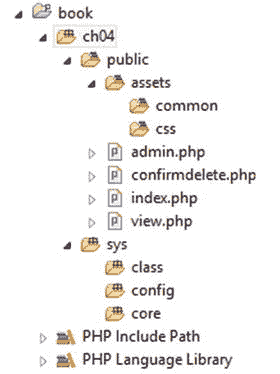
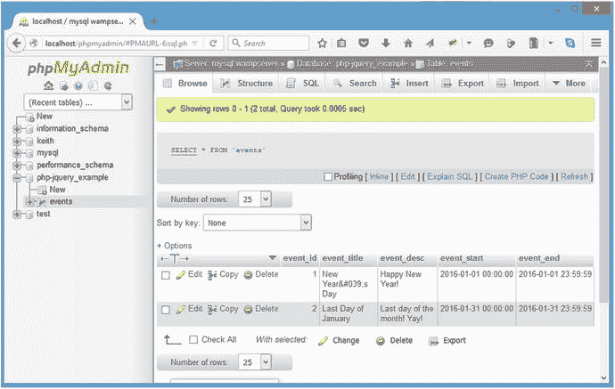
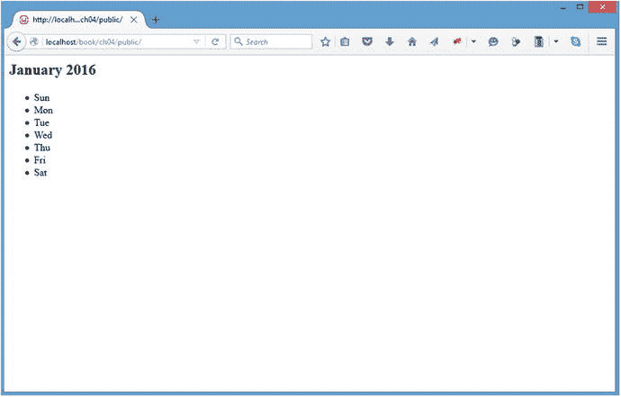
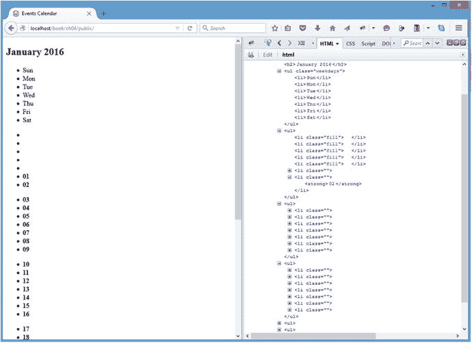
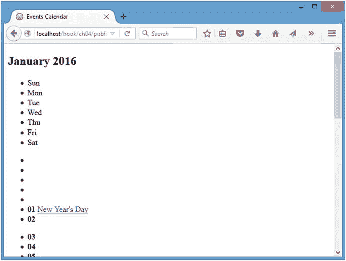
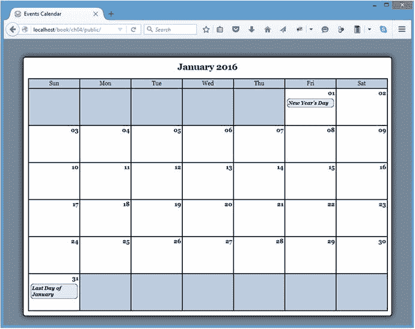
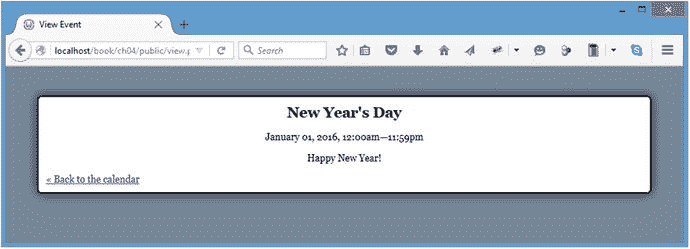

# 四、创建活动日历

Electronic supplementary material The online version of this chapter (doi:[10.​1007/​978-1-4842-1230-1_​4](http://dx.doi.org/10.1007/978-1-4842-1230-1_4)) contains supplementary material, which is available to authorized users.

既然您已经熟悉了面向对象编程的概念，那么您可以开始从事本书的核心项目:事件日历。一切都从这里开始，随着本书的进展，您将使用 PHP 和 jQuery 添加越来越多的功能。

## 规划日历

因为您完全是从零开始，所以您需要花一分钟来规划应用。这个应用将是数据库驱动的(使用 MySQL)，因此规划将分两个阶段进行:首先是数据库结构，然后是将访问和修改数据库的应用的基本图。

### 定义数据库结构

为了使构建应用变得更加容易，首先应该计划如何存储数据。这塑造了应用中的一切。

对于基本事件日历，您需要存储的所有信息如下:

*   `event_id`:自动递增的整数，唯一标识每个事件
*   `event_title`:事件的标题
*   事件的完整描述
*   `event_start`:事件的开始时间(格式`YYYY-MM-DD HH:MM:SS`)
*   `event_end`:事件的结束时间(格式`YYYY-MM-DD HH:MM:SS`)

### 创建类别映射

下一步是布置主类，它将处理应用将执行的与日历事件相关的所有操作。这个类将被称为`Calendar`；这些方法和属性将如下所示:

*   构建构造函数。
*   请确保数据库连接存在或创建一个。
*   设置以下基本属性:
    *   数据库对象
    *   要使用的日期
    *   正在查看的月份
    *   要查看的年份
    *   一个月中的天数
    *   一个月开始的工作日
*   生成 HTML 来构建事件表单。
    *   检查事件是否正在被编辑或创建。
    *   如果需要编辑，将事件信息加载到表单中。
*   在数据库中保存新事件并整理输入。
*   从数据库中删除事件并确认删除。
*   加载事件信息。
    *   从数据库加载事件数据。
    *   将每个事件作为一个数组存储在该月的适当日期。
*   输出带有日历信息的 HTML。使用 events 数组，遍历该月的每一天，并在适用的地方附加事件标题和时间。
*   将事件信息显示为 HTML。接受事件 ID 并加载事件的描述和详细信息

### 规划应用的文件夹结构

这个应用在完成后会变得有些复杂，所以值得花几分钟来考虑如何组织文件。

为了安全起见，所有可能的东西都将放在 web 根目录或公共文件夹之外:这包括数据库凭证、应用的核心以及运行它的类。由于 web 根目录中没有任何内容，恶意用户将无法在不在服务器上的情况下查看您的文件夹结构，这是一个很好的安全做法。

首先，您有两个文件夹:`public`包含应用用户可以直接访问的所有文件，比如 CSS、索引文件和 JavaScript 文件，而`sys`包含非公共文件，比如数据库凭证、应用的类和核心 PHP 文件。

#### 公共文件

`public`文件夹将作为网络根目录。当用户访问您的应用的 URL 时，这是服务器将首先查找的文件夹。在根级别，它包含用户用来查看和操作存储在数据库中的数据的文件:

*   `index.php`:这是主文件，以日历格式显示月份，事件标题显示在事件发生当天的方框中。
*   `view.php`:如果用户点击一个事件标题，他们会被带到这个页面，在这里会显示事件的详细数据。
*   `admin.php`:创建或修改新事件，使用本页显示的表格。
*   `confirmdelete.php`:要删除一个事件，用户必须首先通过在此页面提交确认表单来确认该选择。

`public`文件夹还将有一个名为`assets`的子文件夹，其中将包含该站点的附加文件。这些文件将根据它们的用途进行分组，在本节中分为四类:通用文件、CSS 文件、JavaScript 文件和表单处理文件。

在资产中创建四个文件夹，分别名为`common`、`css`、`inc`和`js`。`common`文件夹将存储将在所有可公开访问的页面上使用的文件(即应用的页眉和页脚)；`css`文件夹将存储站点样式表；`inc`文件夹将存储文件以处理表单提交的输入；而`js`文件夹将存储站点 JavaScript 文件。

#### 非公共应用文件

`sys`文件夹将被分成三个子文件夹:`class`，它将存储应用的所有类文件(如`Calendar`类)；`config`，存储数据库凭证等应用配置信息；和`core`，它保存初始化应用的文件。

当一切都组织好了，所有文件都创建好了，文件结构就组织好了，以后就容易伸缩了(见图 [4-1](#Fig1) )。

图 4-1。

The folder structure and files as they appear in Eclipse 4.5 (Mars) on Windows Public and Nonpublic Folders—Why Bother?

你现在可能会问自己，“为什么要花额外的精力来创建公共和非公共文件夹呢？有什么好处？”

要回答这个问题，您需要了解一点 web 服务器的工作原理。服务器本质上是存储文件并使用网络标识符(IP 地址或映射到 IP 地址的 URL)向网络(如万维网)提供选定文件的计算机。一台服务器上可以托管数百个网站或其他应用，每个网站或应用都有自己的文件夹。

服务器允许外部用户访问这些公共文件夹，这意味着可以从服务器所连接的网络访问文件夹中的所有文件。对于包含敏感信息的文件，这并不总是可取的。

幸运的是，公用文件夹中的文件仍然可以访问公用文件夹之外的文件，尽管网络上的用户不能。这允许您对外界隐藏您的敏感数据，但保持您的应用可以访问它。

还有其他方法来隐藏这些信息，但简单地保持敏感数据不公开是最直接、最可靠的方法。

### 修改开发环境

因为您在这个应用中使用了公共和非公共文件夹，所以有必要对您的开发环境进行快速修改:您需要将服务器指向您的公共文件夹，而不是包含两者的文件夹。在本节中，您将学习如何将您的服务器指向`public`文件夹。

Note

您可以跳过这一部分，将`sys`文件夹保留在 public 文件夹中，而不会丢失应用中的任何功能(请记住，文件路径将与本书练习中使用的路径不同)。但是，您将使应用面临潜在的安全风险。强烈建议您花一分钟时间来遵循这些步骤。

#### 地方发展

要更改本地安装中的文档根目录(`public`文件夹)，需要修改服务器的配置文件。本书假设 Apache 被用作 XAMPP 堆栈中的服务器，所以您需要定位`httpd.conf`文件(在 Mac 上位于`/xamppfiles/etc/httpd.conf`，在 Linux 上位于`/opt/lampp/etc/httpd.conf`，在 Windows 上位于`C:\wamp\bin\apache\apache2.4.x\conf\httpd.conf`)。

在`httpd.conf`中，搜索`DocumentRoot`指令。这是你设置你的`public`文件夹路径的地方。该文件应该如下所示:

`#`

`# DocumentRoot: The directory out of which you will serve your`

`# documents. By default, all requests are taken from this directory, but`

`# symbolic links and aliases may be used to point to other locations.`

`#`

`DocumentRoot "c:\wamp\www\"`

此外，在您的`httpd.conf`文件中搜索引用文档根目录的一行来设置权限。它看起来会像这样:

`<Directory "c:/wamp/www/">`

找到并修改了上面的路径后，使用 XAMPP 控制面板重新启动 Apache。现在，访问的默认文件夹是应用的`public`文件夹。为了测试这一点，创建文件`index.php`并添加以下代码片段:

`<?php echo "I’m the new document root!"; ?>`

在浏览器中导航到开发环境的文档根目录(默认为`localhost`)以确保重新配置有效(参见图 [4-2](#Fig2) )。

图 4-2。

The public folder’s index file is displayed after reconfiguring Apache

#### 远程开发

因为远程开发通常发生在托管公司的服务器上，将您的域指向应用的`public`文件夹的步骤会因托管提供商而异，因此不会在本书中讨论。

但是，在许多情况下，主机会允许您将域指向您的主机帐户中的文件夹。如果是这种情况，只需将域指向`public`文件夹，一切都应该正常工作。

有些主机不允许文档根目录以外的访问。如果你的主机提供商就是这种情况，只需将`sys`文件夹放在`public`文件夹中，并相应地改变文件路径。

## 制作日历

文件夹结构准备好了，开发环境也设置好了，是时候真正开始开发了。我们将逐步介绍三个事件视图(主视图、单个事件视图和管理视图)，从主日历视图开始。

### 创建数据库

与应用规划过程一样，开发应用的第一步是创建数据库。在您的本地开发环境中，打开 phpMyAdmin ( `http://localhost/phpmyadmin`在 XAMPP)，并打开 SQL 选项卡(如果您没有使用 phpMyAdmin，也可以在 PHP 脚本中执行这些命令)。使用以下 SQL 创建数据库、存储事件数据的表`events`和一些虚拟条目:

`CREATE DATABASE IF NOT EXISTS `php-jquery_example``

`DEFAULT CHARACTER SET utf8`

`COLLATE utf8_unicode_ci;`

`CREATE TABLE IF NOT EXISTS `php-jquery_example`.`events` (`

``event_id` INT(11) NOT NULL AUTO_INCREMENT,`

``event_title` VARCHAR(80) DEFAULT NULL,`

``event_desc` TEXT,`

``event_start` TIMESTAMP NOT NULL DEFAULT '0000-00-00 00:00:00',`

``event_end` TIMESTAMP NOT NULL DEFAULT '0000-00-00 00:00:00',`

`PRIMARY KEY (`event_id`),`

`INDEX (`event_start`)`

`) ENGINE=MyISAM CHARACTER SET utf8 COLLATE utf8_unicode_ci;`

`INSERT INTO `php-jquery_example`.`events``

`(`event_title`, `event_desc`, `event_start`, `event_end`) VALUES`

`('New Year’s Day', 'Happy New Year!',`

`'2016-01-01 00:00:00', '2016-01-01 23:59:59'),`

`('Last Day of January', 'Last day of the month! Yay!',`

`'2016-01-31 00:00:00', '2016-01-31 23:59:59');`

Note

前面所有的命令都是 MySQL 特有的。由于这本书主要关注 jQuery 和 PHP，所以我们不会在这里详细介绍 MySQL。有关 MySQL 的更多信息，请查看 Jason Gilmore 的《PHP 和 MySQL 入门》。

在您执行了前面的命令之后，一个名为`php-jquery_example`的新数据库将出现在左边的列中。点击数据库名称以显示表格，然后点击`events`表格以查看您创建的条目(参见图 [4-3](#Fig3) )。

图 4-3。

The database, table, and entries after they’re created

### 使用类连接到数据库

因为您将在这个应用中创建多个需要数据库访问的类，所以创建一个打开并存储该数据库对象的对象是有意义的。这个对象将被称为`DB_Connect`，它将驻留在名为`class.db_connect.inc.php` ( `/sys/class/class.db_connect.inc.php`)的类文件夹中。

这个类将有一个属性和一个方法，两者都受到保护。该属性将被称为`$db`，并将存储一个数据库对象。该方法将是一个构造函数；这将接受一个可选的数据库对象存储在`$db`中，或者如果没有传递数据库对象，它将创建一个新的 PDO 对象。

将以下代码插入`class.db_connect.inc.php`:

`<?php`

`declare(strict_types=1);`

`/**`

`* Database actions (DB access, validation, etc.)`

`*`

`* PHP version 7`

`*`

`* LICENSE: This source file is subject to the MIT License, available`

`* at`[`http://www.opensource.org/licenses/mit-license.html`T3】](http://www.opensource.org/licenses/mit-license.html)

`*`

`* @author     Jason Lengstorf <jason.lengstorf@ennuidesign.com>`

`* @copyright  2009 Ennui Design`

`* @license`[`http://www.opensource.org/licenses/mit-license.html`T3】](http://www.opensource.org/licenses/mit-license.html)

`*/`

`class DB_Connect {`

`/**`

`* Stores a database object`

`*`

`* @var object A database object`

`*/`

`protected $db;`

`/**`

`* Checks for a DB object or creates one if one isn’t found`

`*`

`* @param object $db A database object`

`*/`

`protected function __construct($db=NULL)`

`{`

`if ( is_object($db) )`

`{`

`$this->db = $db;`

`}`

`else`

`{`

`// Constants are defined in /sys/config/db-cred.inc.php`

`$dsn = "mysql:host=" . DB_HOST . ";dbname=" . DB_NAME;`

`try`

`{`

`$this->db = new PDO($dsn, DB_USER, DB_PASS);`

`}`

`catch ( Exception $e )`

`{`

`// If the DB connection fails, output the error`

`die ( $e->getMessage() );`

`}`

`}`

`}`

`}`

`?>`

Note

前面的函数使用了尚未定义的常量。在下一节中，您将创建文件来定义这些常量。

### 创建类包装

为了构建应用本身，首先在非公共的`sys`文件夹(`/sys/class/class.calendar.inc.php`)中的`class`文件夹中创建文件`class.calendar.inc.php`。这个类将扩展`DB_Connect`类，以便访问数据库对象。在您选择的编辑器中打开该文件，并使用以下代码创建`Calendar`类:

`<?php`

`declare(strict_types=1);`

`/**`

`* Builds and manipulates an events calendar`

`*`

`* PHP version 7`

`*`

`* LICENSE: This source file is subject to the MIT License, available`

`* at`[`http://www.opensource.org/licenses/mit-license.html`T3】](http://www.opensource.org/licenses/mit-license.html)

`*`

`* @author     Jason Lengstorf <jason.lengstorf@ennuidesign.com>`

`* @copyright  2009 Ennui Design`

`* @license`[`http://www.opensource.org/licenses/mit-license.html`T3】](http://www.opensource.org/licenses/mit-license.html)

`*/`

`class Calendar extends DB_Connect`

`{`

`// Methods and properties go here`

`}`

`?>`

创建了类之后，就可以开始向该类添加属性和方法了。

### 添加类属性

`Calendar`类不需要任何公共属性，并且您不会在本书包含的示例中扩展它，所以所有的类属性都是私有的。

按照规划一节中的定义，为`Calendar`类创建属性:

`<?php`

`declare(strict_types=1);`

`class Calendar extends DB_Connect`

`{`

`/**`

`* The date from which the calendar should be built`

`*`

`* Stored in YYYY-MM-DD HH:MM:SS format`

`*`

`* @var string the date to use for the calendar`

`*/`

`private $_useDate;`

`/**`

`* The month for which the calendar is being built`

`*`

`* @var int the month being used`

`*/`

`private $_m;`

`/**`

`* The year from which the month’s start day is selected`

`*`

`* @var int the year being used`

`*/`

`private $_y;`

`/**`

`* The number of days in the month being used`

`*`

`* @var int the number of days in the month`

`*/`

`private $_daysInMonth;`

`/**`

`* The index of the day of the week the month starts on (0-6)`

`*`

`* @var int the day of the week the month starts on`

`*/`

`private $_startDay;`

`// Methods go here`

`}`

`?>`

Note

为了简洁起见，重复的代码片段中将不包含文档块。

根据原规划，班级性质如下:

*   `$_useDate`:以`YYYY-MM-DD HH:MM:SS`格式创建日历时使用的日期
*   `$_m`:建立日历时使用的月份
*   `$_y`:建立日历时使用的年份
*   当前月份有多少天
*   `$_startDay`:从 0 到 6 的索引，代表一个月从星期几开始

### 构建构造函数

接下来，您可以构建类构造函数。首先声明它:

`<?php`

`declare(strict_types=1);`

`class Calendar extends DB_Connect`

`{`

`private $_useDate;`

`private $_m;`

`private $_y;`

`private $_daysInMonth;`

`private $_startDay;`

`/**`

`* Creates a database object and stores relevant data`

`*`

`* Upon instantiation, this class accepts a database object`

`* that, if not null, is stored in the object’s private $_db`

`* property. If null, a new PDO object is created and stored`

`* instead.`

`*`

`* Additional info is gathered and stored in this method,`

`* including the month from which the calendar is to be built,`

`* how many days are in said month, what day the month starts`

`* on, and what day it is currently.`

`*`

`* @param object $dbo a database object`

`* @param string $useDate the date to use to build the calendar`

`* @return void`

`*/`

`public function __construct($dbo=NULL, $useDate=NULL)`

`{`

`}`

`}`

`?>`

构造函数将接受两个可选参数:第一个是数据库对象，第二个是构建日历显示的日期。

#### 检查数据库连接

为了正常运行，该类需要一个数据库连接。构造函数将从`DB_Connect`调用父构造函数来检查现有的数据库对象，并在可用时使用它，或者如果没有提供对象，它将创建一个新对象。

使用粗体显示的代码设置调用以进行此检查:

`<?php`

`declare(strict_types=1);`

`class Calendar extends DB_Connect`

`{`

`private $_useDate;`

`private $_m;`

`private $_y;`

`private $_daysInMonth;`

`private $_startDay;`

`public function __construct($dbo=NULL, $useDate=NULL)`

`{`

`/*`

`* Call the parent constructor to check for`

`* a database object`

`*/`

`parent::__construct($dbo);`

`}`

`}`

`?>`

Note

`Calendar`类构造函数接受一个可选的`$dbo`参数，该参数被依次传递给`DB_Connect`构造函数。这允许您创建一个数据库对象，并轻松地传递它以便在类中使用。

##### 创建文件来存储数据库凭据

为了将数据库凭证与应用的其余部分分开，以便于维护，您需要使用一个配置文件。在`config`文件夹(`/sys/config/db-cred.inc.php`)中创建一个名为`db-cred.inc.php`的新文件。在内部，创建一个名为`$C`(用于常量)的数组，并将每条数据存储为一个新的键值对:

`<?php`

`declare(strict_types=1);`

`/*`

`* Create an empty array to store constants`

`*/`

`$C = array();`

`/*`

`* The database host URL`

`*/`

`$C['DB_HOST'] = 'localhost';`

`/*`

`* The database username`

`*/`

`$C['DB_USER'] = 'root';`

`/*`

`* The database password`

`*/`

`$C['DB_PASS'] = '';`

`/*`

`* The name of the database to work with`

`*/`

`$C['DB_NAME'] = 'php-jquery_example';`

`?>`

Note

将`$C`初始化为一个空数组是防止任何被污染的数据被存储在`$C`中并被定义为常量的一种保护措施。这是一个好习惯，尤其是在处理敏感数据的时候。

保存此文件。如果您没有使用 XAMPP 或者修改了默认的数据库凭证，那么您需要在代码中替换您自己的主机、用户名、密码和数据库名称。

#### 创建初始化文件

此时，您的数据库凭证仍然没有存储为常量。您将使用一个初始化文件来处理这个问题。

初始化文件为应用收集数据、加载文件和组织信息。在这个例子中，它将加载并定义所有必要的常量，创建一个数据库对象，并为类设置一个自动加载函数。其他功能将在以后必要时添加。

创建一个名为`init.inc.php`的文件，并将它放在`core`文件夹(`/sys/core/init.inc.php`)中。在内部，添加以下内容:

`<?php`

`declare(strict_types=1);`

`/*`

`* Include the necessary configuration info`

`*/`

`include_once '../sys/config/db-cred.inc.php';`

`/*`

`* Define constants for configuration info`

`*/`

`foreach ( $C as $name => $val )`

`{`

`define($name, $val);`

`}`

`/*`

`* Create a PDO object`

`*/`

`$dsn = "mysql:host=" . DB_HOST . ";dbname=" . DB_NAME;`

`$dbo = new PDO($dsn, DB_USER, DB_PASS);`

`/*`

`* Define the auto-load function for classes`

`*/`

`function __autoload($class)`

`{`

`$filename = "../sys/class/class." . $class . ".inc.php";`

`if ( file_exists($filename) )`

`{`

`include_once $filename;`

`}`

`}`

`?>`

当一个脚本试图实例化一个还没有被加载的类时，一个自动加载函数被调用。这是按需将类轻松加载到脚本中的一种便捷方式。有关自动加载的更多信息，请访问 [`http://php.net/autoload`](http://php.net/autoload) 。

#### 创建一个索引文件来把所有的内容放在一起

要查看所有活动，请修改`public`文件夹中的`index.php`。在内部，只需包含初始化文件并实例化`Calendar`类。接下来，检查类是否正确加载，如果正确，则输出对象的结构:

`<?php`

`declare(strict_types=1);`

`/*`

`* Include necessary files`

`*/`

`include_once '../sys/core/init.inc.php';`

`/*`

`* Load the calendar for January`

`*/`

`$cal = new Calendar($dbo, "2016-01-01 12:00:00");`

`if ( is_object ($cal) )`

`{`

`echo "<pre>", var_dump($cal), "</pre>";`

`}`

`?>`

导航到`http://localhost/`后，会输出以下消息:

`object(Calendar)#2 (6) {`

`["_useDate":"Calendar":private]=>`

`NULL`

`["_m":"Calendar":private]=>`

`NULL`

`["_y":"Calendar":private]=>`

`NULL`

`["_daysInMonth":"Calendar":private]=>`

`NULL`

`["_startDay":"Calendar":private]=>`

`NULL`

`["db":protected]=>`

`object(PDO)#1 (0) {`

`}`

`}`

#### 设置基本属性

有了所有的基础设施，您就可以继续完成`Calendar`类的构造函数了。

检查完数据库对象后，构造函数需要存储几条关于构建日历的月份的数据。

首先，它检查是否向构造函数传递了日期；如果是，则存储在`$_useDate`属性中；否则，将使用当前日期。

接下来，日期被转换成 UNIX 时间戳(从 Unix epoch 开始的秒数；在 [`http://en.wikipedia.org/wiki/Unix_time`](http://en.wikipedia.org/wiki/Unix_time) 阅读更多相关内容)之前，月和年被分别提取并存储在`$_m`和`$_y`中。

最后，`$_m`和`$_y`用于确定一个月中有多少天被使用，以及该月从星期几开始。

下面的粗体代码将此功能添加到构造函数中:

`<?php`

`declare(strict_types=1);`

`class Calendar extends DB_Connect`

`{`

`private $_useDate;`

`private $_m;`

`private $_y;`

`private $_daysInMonth;`

`private $_startDay;`

`public function __construct($dbo=NULL, $useDate=NULL)`

`{`

`/*`

`* Call the parent constructor to check for`

`* a database object`

`*/`

`parent::__construct($dbo);`

`/*`

`* Gather and store data relevant to the month`

`*/`

`if ( isset($useDate) )`

`{`

`$this->_useDate = $useDate;`

`}`

`else`

`{`

`$this->_useDate = date('Y-m-d H:i:s');`

`}`

`/*`

`* Convert to a timestamp, then determine the month`

`* and year to use when building the calendar`

`*/`

`$ts = strtotime($this->_useDate);`

`$this->_m = (int)date('m', $ts);`

`$this->_y = (int)date('Y', $ts);`

`/*`

`* Determine how many days are in the month`

`*/`

`$this->_daysInMonth = cal_days_in_month(`

`CAL_GREGORIAN,`

`$this->_m,`

`$this->_y`

`);`

`/*`

`* Determine what weekday the month starts on`

`*/`

`$ts = mktime(0, 0, 0, $this->_m, 1, $this->_y);`

`$this->_startDay = (int)date('w', $ts);`

`}`

`}`

`?>`

现在，当您重新加载`http://localhost/`时，所有先前为`NULL`的属性都将具有值:

`object(Calendar)#2 (6) {`

`["_useDate":"Calendar":private]=>`

`string(19) "2016-01-01 12:00:00"`

`["_m":"Calendar":private]=>`

`int(1)`

`["_y":"Calendar":private]=>`

`int(2016)`

`["_daysInMonth":"Calendar":private]=>`

`int(31)`

`["_startDay":"Calendar":private]=>`

`int(5)`

`["db":protected]=>`

`object(PDO)#1 (0) {`

`}`

`}`

### 加载事件数据

要加载关于事件的数据，您需要创建一个新的方法来访问数据库并检索它们。因为可以通过两种方式访问事件数据(第二种方式将在本章后面讨论)，所以加载数据的动作将保持通用，以便于重用。

这个方法是私有的，命名为`_loadEventData()`。它接受一个可选参数，即事件的 ID，并按照以下步骤加载事件:

*   创建一个基本的`SELECT`查询，从 events 表中加载可用字段。
*   检查是否传递了一个 ID，如果是，向查询中添加一个`WHERE`子句以只返回一个事件。
*   否则，请执行以下两项操作:
    *   找出该月第一天的午夜和该月最后一天的晚上 11:59:59。
    *   添加一个`WHERE...BETWEEN`子句，只加载当前月份内的日期。
*   执行查询。
*   返回结果的关联数组。

综合起来，这个方法看起来是这样的:

`<?php`

`declare(strict_types=1);`

`class Calendar extends DB_Connect`

`{`

`private $_useDate;`

`private $_m;`

`private $_y;`

`private $_daysInMonth;`

`private $_startDay;`

`public function __construct($dbo=NULL, $useDate=NULL) {...}`

`/**`

`* Loads event(s) info into an array`

`*`

`* @param int $id an optional event ID to filter results`

`* @return array an array of events from the database`

`*/`

`private function _loadEventData($id=NULL)`

`{`

`$sql = "SELECT`

``event_id`, `event_title`, `event_desc`,`

``event_start`, `event_end``

`FROM `events`";`

`/*`

`* If an event ID is supplied, add a WHERE clause`

`* so only that event is returned`

`*/`

`if ( !empty($id) )`

`{`

`$sql .= "WHERE `event_id`=:id LIMIT 1";`

`}`

`/*`

`* Otherwise, load all events for the month in use`

`*/`

`else`

`{`

`/*`

`* Find the first and last days of the month`

`*/`

`$start_ts = mktime(0, 0, 0, $this->_m, 1, $this->_y);`

`$end_ts = mktime(23, 59, 59, $this->_m+1, 0, $this->_y);`

`$start_date = date('Y-m-d H:i:s', $start_ts);`

`$end_date = date('Y-m-d H:i:s', $end_ts);`

`/*`

`* Filter events to only those happening in the`

`* currently selected month`

`*/`

`$sql .= "WHERE `event_start``

`BETWEEN '$start_date'`

`AND '$end_date'`

`ORDER BY `event_start`";`

`}`

`try`

`{`

`$stmt = $this->db->prepare($sql);`

`/*`

`* Bind the parameter if an ID was passed`

`*/`

`if ( !empty($id) )`

`{`

`$stmt->bindParam(":id", $id, PDO::PARAM_INT);`

`}`

`$stmt->execute();`

`$results = $stmt->fetchAll(PDO::FETCH_ASSOC);`

`$stmt->closeCursor();`

`return $results;`

`}`

`catch ( Exception $e )`

`{`

`die ( $e->getMessage() );`

`}`

`}`

`}`

`?>`

Note

为了简洁起见，不引用的方法是折叠的。

该方法返回一个数组，当使用您先前输入到数据库中的测试条目时，该数组如下所示:

`Array`

`(`

`[0] => Array`

`(`

`[event_id] => 1`

`[event_title] => New Year’s Day`

`[event_desc] => Happy New Year!`

`[event_start] => 2016-01-01 00:00:00`

`[event_end] => 2016-01-01 23:59:59`

`)`

`[1] => Array`

`(`

`[event_id] => 2`

`[event_title] => Last Day of January`

`[event_desc] => Last day of the month! Yay!`

`[event_start] => 2016-01-31 00:00:00`

`[event_end] => 2016-01-31 23:59:59`

`)`

`)`

#### 创建在日历中使用的事件对象数组

`_loadEventData()`的原始输出不能立即在日历中使用。因为事件需要在正确的日期显示，所以从`_loadEventData()`检索的事件需要按照事件发生的日期进行分组。为了便于参考，事件字段也将被简化。

最终目标是一个事件数组，该数组使用一个月中的某一天作为索引，将每个事件作为一个对象。当新方法完成时，数据库中的两个测试条目最终应该像这样存储:

`Array`

`(`

`[1] => Array`

`(`

`[0] => Event Object`

`(`

`[id] => 1`

`[title] => New Year’s Day`

`[description] => Happy New Year!`

`[start] => 2016-01-01 00:00:00`

`[end] => 2016-01-01 23:59:59`

`)`

`)`

`[31] => Array`

`(`

`[0] => Event Object`

`(`

`[id] => 2`

`[title] => Last Day of January`

`[description] => Last day of the month! Yay!`

`[start] => 2016-01-31 00:00:00`

`[end] => 2016-01-31 23:59:59`

`)`

`)`

`)`

#### 创建事件类

为此，您必须首先在类文件夹(`/sys/class/class.event.inc.php`)中创建一个名为`Event`的新类。它将有五个公共属性(`$id`、`$title`、`$description`、`$start`和`$end`)和一个构造函数，该构造函数将使用数据库查询返回的关联数组来设置这些属性。创建文件，并在其中插入以下代码:

`<?php`

`declare(strict_types=1);`

`/**`

`* Stores event information`

`*`

`* PHP version 7`

`*`

`* LICENSE: This source file is subject to the MIT License, available`

`* at`[`http://www.opensource.org/licenses/mit-license.html`T3】](http://www.opensource.org/licenses/mit-license.html)

`*`

`* @author     Jason Lengstorf <jason.lengstorf@ennuidesign.com>`

`* @copyright  2010 Ennui Design`

`* @license`[`http://www.opensource.org/licenses/mit-license.html`T3】](http://www.opensource.org/licenses/mit-license.html)

`*/`

`class Event`

`{`

`/**`

`* The event ID`

`*`

`* @var int`

`*/`

`public $id;`

`/**`

`* The event title`

`*`

`* @var string`

`*/`

`public $title;`

`/**`

`* The event description`

`*`

`* @var string`

`*/`

`public $description;`

`/**`

`* The event start time`

`*`

`* @var string`

`*/`

`public $start;`

`/**`

`* The event end time`

`*`

`* @var string`

`*/`

`public $end;`

`/**`

`* Accepts an array of event data and stores it`

`*`

`* @param array $event Associative array of event data`

`* @return void`

`*/`

`public function __construct($event)`

`{`

`if ( is_array($event) )`

`{`

`$this->id = $event['event_id'];`

`$this->title = $event['event_title'];`

`$this->description = $event['event_desc'];`

`$this->start = $event['event_start'];`

`$this->end = $event['event_end'];`

`}`

`else`

`{`

`throw new Exception("No event data was supplied.");`

`}`

`}`

`}`

`?>`

#### 创建在数组中存储事件对象的方法

既然每个事件都可以存储为一个对象，那么您可以创建一个方法，该方法将循环遍历可用的事件，并将它们存储在一个与事件发生日期相对应的数组中。首先，使用`_loadEventData()`从数据库加载事件数据。接下来，从每个事件的开始日期中提取一个月中的某一天，并在该天的索引处向数组中添加一个新值。在`Calendar`类中，创建一个名为`_createEventObj()`的新方法，并将其设置为私有。从数据库加载事件，并使用以下粗体代码创建新数组:

`<?php`

`declare(strict_types=1);`

`class Calendar extends DB_Connect`

`{`

`private $_useDate;`

`private $_m;`

`private $_y;`

`private $_daysInMonth;`

`private $_startDay;`

`public function __construct($dbo=NULL, $useDate=NULL) {...}`

`private function _loadEventData($id=NULL) {...}`

`/**`

`* Loads all events for the month into an array`

`*`

`* @return array events info`

`*/`

`private function _createEventObj()`

`{`

`/*`

`* Load the events array`

`*/`

`$arr = $this->_loadEventData();`

`/*`

`* Create a new array, then organize the events`

`* by the day of the month on which they occur`

`*/`

`$events = array();`

`foreach ( $arr as $event )`

`{`

`$day = date('j', strtotime($event['event_start']));`

`try`

`{`

`$events[$day][] = new Event($event);`

`}`

`catch ( Exception $e )`

`{`

`die ( $e->getMessage() );`

`}`

`}`

`return $events;`

`}`

`}`

`?>`

现在可以加载和组织事件，这样输出实际日历的方法 HTML 可以很容易地将日期放在适当的位置。

### 输出 HTML 以显示日历和事件

至此，您已经建立了数据库，存储了测试事件，并准备好了将事件数据加载和组织到一个易于使用的数组中的方法。您已经准备好将这些碎片放在一起并创建一个日历了！

日历将由一个名为`buildCalendar()`的公共方法构建。这将生成具有以下属性的日历:

*   显示月份和年份的标题
*   工作日缩写，使日历看起来像日历
*   包含给定日期存在的事件的编号框

首先，在`Calendar`类中声明`buildCalendar()`方法，并在`H2`元素中创建标题。此外，创建一个工作日缩写数组，并遍历它们以生成一个无序列表。为此，添加以下粗体代码:

`<?php`

`declare(strict_types=1);`

`class Calendar extends DB_Connect`

`{`

`private $_useDate;`

`private $_m;`

`private $_y;`

`private $_daysInMonth;`

`private $_startDay;`

`public function __construct($dbo=NULL, $useDate=NULL) {...}`

`private function _loadEventData($id=NULL) {...}`

`private function _createEventObj() {...}`

`/**`

`* Returns HTML markup to display the calendar and events`

`*`

`* Using the information stored in class properties, the`

`* events for the given month are loaded, the calendar is`

`* generated, and the whole thing is returned as valid markup.`

`*`

`* @return string the calendar HTML markup`

`*/`

`public function buildCalendar()`

`{`

`/*`

`* Determine the calendar month and create an array of`

`* weekday abbreviations to label the calendar columns`

`*/`

`$cal_month = date('F Y', strtotime($this->_useDate));`

`define('WEEKDAYS', array('Sun', 'Mon', 'Tue',`

`'Wed', 'Thu', 'Fri', 'Sat'));`

`/*`

`* Add a header to the calendar markup`

`*/`

`$html = "\n\t<h2>$cal_month</h2>";`

`for ( $d=0, $labels=NULL; $d<7; ++$d )`

`{`

`$labels .= "\n\t\t<li>" . WEEKDAYS[$d] . "</li>";`

`}`

`$html .= "\n\t<ul class=\"weekdays\">"`

`. $labels . "\n\t</ul>";`

`/*`

`* Return the markup for output`

`*/`

`return $html;`

`}`

`}`

`?>`

#### 修改索引文件

要查看`buildCalendar()`方法的输出，需要修改`public`文件夹中的`index.php`来调用该方法。用粗体显示的代码更新文件:

`<?php`

`declare(strict_types=1);`

`/*`

`* Include necessary files`

`*/`

`include_once '../sys/core/init.inc.php';`

`/*`

`* Load the calendar for January`

`*/`

`$cal = new Calendar($dbo, "2016-01-01 12:00:00");`

`/*`

`* Display the calendar HTML`

`*/`

`echo $cal->buildCalendar();`

`?>`

在浏览器中调出该文件，查看目前的结果(图 [4-4](#Fig4) )。

图 4-4。

The heading and weekday abbreviations

#### 制作日历

下一步是构建实际的日历日。要解决这个问题，需要完成几个步骤。

Create a new unordered list.   Set up a loop (with an iteration counter, a calendar date counter, today’s date, and the month and year stored as variables) that runs as long as the calendar date counter is less than the number of days in the month.   Add a `fill` class to the days of the week that occur before the first.   Add a `today` class if the current date is contained within the same month and year and matches the date being generated.   Create an opening and closing list item tag for each day.   Check if the current calendar box falls within the current month, and add the date if so.   Check if the current calendar box is a Saturday, and close the list and open a new one if so.   Assemble the pieces of the list item and append them to the markup.   After the loop, run another loop to add filler days until the calendar week is completed.   Close the final unordered list and return the markup.  

首先，通过向`buildCalendar()`方法添加以下粗体代码来完成步骤 1 和 2:

`public function buildCalendar()`

`{`

`/*`

`* Determine the calendar month and create an array of`

`* weekday abbreviations to label the calendar columns`

`*/`

`$cal_month = date('F Y', strtotime($this->_useDate));`

`define('WEEKDAYS', array('Sun', 'Mon', 'Tue',`

`'Wed', 'Thu', 'Fri', 'Sat'));`

`/*`

`* Add a header to the calendar markup`

`*/`

`$html = "\n\t<h2>$cal_month</h2>";`

`for ( $d=0, $labels=NULL; $d<7; ++$d )`

`{`

`$labels .= "\n\t\t<li>" . WEEKDAYS[$d] . "</li>";`

`}`

`$html .= "\n\t<ul class=\"weekdays\">"`

`. $labels . "\n\t</ul>";`

`/*`

`* Create the calendar markup`

`*/`

`$html .= "\n\t<ul>"; // Start a new unordered list`

`for ( $i=1, $c=1, $t=date('j'), $m=date('m'), $y=date('Y');`

`$c<=$this->_daysInMonth; ++$i )`

`{`

`// More steps go here`

`}`

`/*`

`* Return the markup for output`

`*/`

`return $html;`

`}`

接下来，添加下面的粗体代码来完成步骤 3–5:

`public function buildCalendar()`

`{`

`/*`

`* Determine the calendar month and create an array of`

`* weekday abbreviations to label the calendar columns`

`*/`

`$cal_month = date('F Y', strtotime($this->_useDate));`

`define('WEEKDAYS', array('Sun', 'Mon', 'Tue',`

`'Wed', 'Thu', 'Fri', 'Sat'));`

`/*`

`* Add a header to the calendar markup`

`*/`

`$html = "\n\t<h2>$cal_month</h2>";`

`for ( $d=0, $labels=NULL; $d<7; ++$d )`

`{`

`$labels .= "\n\t\t<li>" . WEEKDAYS[$d] . "</li>";`

`}`

`$html .= "\n\t<ul class=\"weekdays\">"`

`. $labels . "\n\t</ul>";`

`/*`

`* Create the calendar markup`

`*/`

`$html .= "\n\t<ul>"; // Start a new unordered list`

`for ( $i=1, $c=1, $t=date('j'), $m=date('m'), $y=date('Y');`

`$c<=$this->_daysInMonth; ++$i )`

`{`

`/*`

`* Apply a "fill" class to the boxes occurring before`

`* the first of the month`

`*/`

`$class = $i<=$this->_startDay ? "fill" : NULL;`

`/*`

`* Add a "today" class if the current date matches`

`* the current date`

`*/`

`if ( $c==$t``&&``$m==$this->_m``&&`T4】

`{`

`$class = "today";`

`}`

`/*`

`* Build the opening and closing list item tags`

`*/`

`$ls = sprintf("\n\t\t<li class=\"%s\">", $class);`

`$le = "\n\t\t</li>";`

`// More steps go here`

`}`

`/*`

`* Return the markup for output`

`*/`

`return $html;`

`}`

要完成步骤 6-10(实际构建日期，检查该周是否需要换行，组装日期标记，用 filler 完成最后一周，并返回标记)，请添加以下粗体代码:

`public function buildCalendar()`

`{`

`/*`

`* Determine the calendar month and create an array of`

`* weekday abbreviations to label the calendar columns`

`*/`

`$cal_month = date('F Y', strtotime($this->_useDate));`

`define('WEEKDAYS', array('Sun', 'Mon', 'Tue',`

`'Wed', 'Thu', 'Fri', 'Sat'));`

`/*`

`* Add a header to the calendar markup`

`*/`

`$html = "\n\t<h2>$cal_month</h2>";`

`for ( $d=0, $labels=NULL; $d<7; ++$d )`

`{`

`$labels .= "\n\t\t<li>" . WEEKDAYS[$d] . "</li>";`

`}`

`$html .= "\n\t<ul class=\"weekdays\">"`

`. $labels . "\n\t</ul>";`

`/*`

`* Create the calendar markup`

`*/`

`$html .= "\n\t<ul>"; // Start a new unordered list`

`for ( $i=1, $c=1, $t=date('j'), $m=date('m'), $y=date('Y');`

`$c<=$this->_daysInMonth; ++$i )`

`{`

`/*`

`* Apply a "fill" class to the boxes occurring before`

`* the first of the month`

`*/`

`$class = $i<=$this->_startDay ? "fill" : NULL;`

`/*`

`* Add a "today" class if the current date matches`

`* the current date`

`*/`

`if ( $c+1==$t && $m==$this->_m && $y==$this->_y )`

`{`

`$class = "today";`

`}`

`/*`

`* Build the opening and closing list item tags`

`*/`

`$ls = sprintf("\n\t\t<li class=\"%s\">", $class);`

`$le = "\n\t\t</li>";`

`/*`

`* Add the day of the month to identify the calendar box`

`*/`

`if ( $this->_startDay<$i``&&`T2】

`{`

`$date = sprintf("\n\t\t\t<strong>%02d</strong>",$c++);`

`}`

`else { $date="``&`T2】

`/*`

`* If the current day is a Saturday, wrap to the next row`

`*/`

`$wrap = $i!=0``&&`T2】

`/*`

`* Assemble the pieces into a finished item`

`*/`

`$html .= $ls . $date . $le . $wrap;`

`}`

`/*`

`* Add filler to finish out the last week`

`*/`

`while ( $i%7!=1 )`

`{`

`$html .= "\n\t\t<li class=\"fill\">``&`T2】

`++$i;`

`}`

`/*`

`* Close the final unordered list`

`*/`

`$html .= "\n\t</ul>\n\n";`

`/*`

`* Return the markup for output`

`*/`

`return $html;`

`}`

测试现在的功能。图 [4-5](#Fig5) 显示了浏览器中的无序列表。

图 4-5。

The markup as generated by buildCalendar()

#### 在日历中显示事件

将事件添加到日历显示中非常简单，只需从`_createEventObj()`加载`events`数组，并遍历索引中存储的与当前日期匹配的事件(如果存在的话)。使用以下粗体代码将事件数据添加到日历标记中:

`public function buildCalendar()`

`{`

`/*`

`* Determine the calendar month and create an array of`

`* weekday abbreviations to label the calendar columns`

`*/`

`$cal_month = date('F Y', strtotime($this->_useDate));`

`define('WEEKDAYS', array('Sun', 'Mon', 'Tue',`

`'Wed', 'Thu', 'Fri', 'Sat'));`

`/*`

`* Add a header to the calendar markup`

`*/`

`$html = "\n\t<h2>$cal_month</h2>";`

`for ( $d=0, $labels=NULL; $d<7; ++$d )`

`{`

`$labels .= "\n\t\t<li>" . WEEKDAYS[$d] . "</li>";`

`}`

`$html .= "\n\t<ul class=\"weekdays\">"`

`. $labels . "\n\t</ul>";`

`/*`

`* Load events data`

`*/`

`$events = $this->_createEventObj();`

`/*`

`* Create the calendar markup`

`*/`

`$html .= "\n\t<ul>"; // Start a new unordered list`

`for ( $i=1, $c=1, $t=date('j'), $m=date('m'), $y=date('Y');`

`$c<=$this->_daysInMonth; ++$i )`

`{`

`/*`

`* Apply a "fill" class to the boxes occurring before`

`* the first of the month`

`*/`

`$class = $i<=$this->_startDay ? "fill" : NULL;`

`/*`

`* Add a "today" class if the current date matches`

`* the current date`

`*/`

`if ( $c+1==$t && $m==$this->_m && $y==$this->_y )`

`{`

`$class = "today";`

`}`

`/*`

`* Build the opening and closing list item tags`

`*/`

`$ls = sprintf("\n\t\t<li class=\"%s\">", $class);`

`$le = "\n\t\t</li>";`

`/*`

`* Add the day of the month to identify the calendar box`

`*/`

`if ( $this->_startDay<$i && $this->_daysInMonth>=$c)`

`{`

`/*`

`* Format events data`

`*/`

`$event_info = NULL; // clear the variable`

`if ( isset($events[$c]) )`

`{`

`foreach ( $events[$c] as $event )`

`{`

`$link = '<a href="view.php?event_id='`

`. $event->id . '">' . $event->title`

`. '</a>';`

`$event_info .= "\n\t\t\t$link";`

`}`

`}`

`$date = sprintf("\n\t\t\t<strong>%02d</strong>",$c++);`

`}`

`else { $date=" "; }`

`/*`

`* If the current day is a Saturday, wrap to the next row`

`*/`

`$wrap = $i!=0 && $i%7==0 ? "\n\t</ul>\n\t<ul>" : NULL;`

`/*`

`* Assemble the pieces into a finished item`

`*/`

`$html .= $ls . $date . $event_info . $le . $wrap;`

`}`

`/*`

`* Add filler to finish out the last week`

`*/`

`while ( $i%7!=1 )`

`{`

`$html .= "\n\t\t<li class=\"fill\"> </li>";`

`++$i;`

`}`

`/*`

`* Close the final unordered list`

`*/`

`$html .= "\n\t</ul>\n\n";`

`/*`

`* Return the markup for output`

`*/`

`return $html;`

`}`

Caution

不要忘记将新的`$event_info`变量添加到循环底部的标记中！

当数据库事件加载到日历显示中时，标题显示在相应日期的旁边(参见图 [4-6](#Fig6) )。

图 4-6。

An event title displayed next to the appropriate date Note

链接的事件标题指向一个尚不存在的名为`view.php`的文件。该文件将在本章后面的“输出 HTML 以显示完整的事件描述”一节中进行构建和解释。

#### 使日历看起来像日历

此时，您的标记是正确的，您的事件也在那里，但是生成的代码看起来一点也不像日历。

为了纠正这一点，花点时间完成 HTML 标记，并使用 CSS 样式化页面。

Note

因为这本书不是讲 CSS 的，所以用的规则就不详细解释了。有关 CSS 的更多信息，请参阅 David Powers 的《CSS3 入门》。

简而言之，CSS 文件将执行以下操作:

*   将每个列表项向左浮动。
*   调整边距和边框，使日期看起来像传统日历。
*   添加悬停效果，这样鼠标悬停的日子将被突出显示。
*   事件标题样式。
*   也为事件标题添加悬停效果。
*   添加一些 CSS3 风格，包括圆角和阴影，以获得乐趣。

Tip

有关 CSS3 的更多信息，请访问 [`http://css3.info/`](http://css3.info/) 。

在`css`文件夹(`/public/assets/css/style.css`)中创建一个名为`style.css`的新文件，并添加以下规则:

`body {`

`background-color: #789;`

`font-family: georgia, serif;`

`font-size: 13px;`

`}`

`#content {`

`display: block;`

`width: 812px;`

`margin: 40px auto 10px;`

`padding: 10px;`

`background-color: #FFF;`

`-moz-border-radius: 6px;`

`-webkit-border-radius: 6px;`

`border-radius: 6px;`

`border:2px solid black;`

`-moz-box-shadow: 0 0 14px #123;`

`-webkit-box-shadow: 0 0 14px #123;`

`box-shadow: 0 0 14px #123;`

`}`

`h2,p {`

`margin: 0 auto 14px;`

`text-align: center;`

`}`

`ul {`

`display: block;`

`clear: left;`

`height: 82px;`

`width: 812px;`

`margin: 0 auto;`

`padding: 0;`

`list-style: none;`

`background-color: #FFF;`

`text-align: center;`

`border: 1px solid black;`

`border-top: 0;`

`border-bottom: 2px solid black;`

`}`

`li {`

`position: relative;`

`float: left;`

`margin: 0;`

`padding: 20px 2px 2px;`

`border-left: 1px solid black;`

`border-right: 1px solid black;`

`width: 110px;`

`height: 60px;`

`overflow: hidden;`

`background-color: white;`

`}`

`li:hover {`

`background-color: #FCB;`

`z-index: 1;`

`-moz-box-shadow: 0 0 10px #789;`

`-webkit-box-shadow: 0 0 10px #789;`

`box-shadow: 0 0 10px #789;`

`}`

`.weekdays {`

`height: 20px;`

`border-top: 2px solid black;`

`}`

`.weekdays li {`

`height: 16px;`

`padding: 2px 2px;`

`background-color: #BCF;`

`}`

`.fill {`

`background-color: #BCD;`

`}`

`.weekdays li:hover,li.fill:hover {`

`background-color: #BCD;`

`-moz-box-shadow: none;`

`-webkit-box-shadow: none;`

`box-shadow: none;`

`}`

`.weekdays li:hover,.today {`

`background-color: #BCF;`

`}`

`li strong {`

`position: absolute;`

`top: 2px;`

`right: 2px;`

`}`

`li a {`

`position: relative;`

`display: block;`

`border: 1px dotted black;`

`margin: 2px;`

`padding: 2px;`

`font-size: 11px;`

`background-color: #DEF;`

`text-align: left;`

`-moz-border-radius: 6px;`

`-webkit-border-radius: 6px;`

`border-radius: 6px;`

`z-index: 1;`

`text-decoration: none;`

`color: black;`

`font-weight: bold;`

`font-style: italic;`

`}`

`li a:hover {`

`background-color: #BCF;`

`z-index: 2;`

`-moz-box-shadow: 0 0 6px #789;`

`-webkit-box-shadow: 0 0 6px #789;`

`box-shadow: 0 0 6px #789;`

`}`

保存样式表，并关闭它；在本章中，您不需要再次修改它。在下一节中，您将创建公共文件，这些文件将在页面中包含这些样式。

#### 创建通用文件—页眉和页脚

这个应用将有多个供用户查看的页面，它们都需要一组通用的 HTML 元素、样式表等等。为了尽可能简化维护，您将使用两个文件`header.inc.php`和`footer.inc.php`来包含这些公共元素。

首先，在`common`文件夹(`/public/assets/common/header.inc.php`)中创建一个名为`header.inc.php`的文件。这个文件将保存 HTML 的`DOCTYPE`声明，并创建一个`head`部分，其中包含一个`Content-Type` meta 标签、文档标题和到文档所需的任何 CSS 文件的链接。

因为文档标题会因页面而异，所以您将设置一个变量`$page_title`来存储每个页面的标题。

此外，因为一个页面可能需要多个 CSS 文件，所以一个 CSS 文件名数组将被传入一个名为`$css_files`的变量，并循环生成正确的标记。

在该文件中，放置以下代码:

`<!DOCTYPE html`

`PUBLIC "-//W3C//DTD XHTML 1.0 Strict//EN"`

`"`[`http://www.w3.org/TR/xhtml1/DTD/xhtml1-strict.dtd`](http://www.w3.org/TR/xhtml1/DTD/xhtml1-strict.dtd)T2】

`<html xmlns="`[`http://www.w3.org/1999/xhtml`](http://www.w3.org/1999/xhtml)T2】

`<head>`

`<meta http-equiv="Content-Type"`

`content="text/html;charset=utf-8" />`

`<title><?php echo $page_title; ?></title>`

`<?php foreach ( $css_files as $css ): ?>`

`<link rel="stylesheet" type="text/css" media="screen,projection"`

`href="assets/css/<?php echo $css; ?>" />`

`<?php endforeach; ?>`

`</head>`

`<body>`

接下来，在`common`文件夹(`/public/assets/common/footer.inc.php`)中创建一个名为`footer.inc.php`的文件来包含标记的结束部分。

目前，这个文件不需要做太多事情:它只是关闭了在`header.inc.php`中打开的`body`和`html`标签。随着您继续开发这个应用，这里会添加更多的内容。

将以下内容插入`footer.inc.php`:

`</body>`

`</html>`

#### 将文件添加到索引

要将这些新的片段组合在一起，您需要修改索引文件。首先，将值添加到`$page_title`和`$css_files`变量中，然后包含头文件。

此外，为了包装页面内容，添加一个新的 ID 为`content`的`div`，包装对`buildCalendar()`的调用。

最后，添加对页脚文件的调用来完成页面。完成后，将用粗体显示的代码修改索引文件:

`<?php`

`declare(strict_types=1);`

`/*`

`* Include necessary files`

`*/`

`include_once '../sys/core/init.inc.php';`

`/*`

`* Load the calendar`

`*/`

`$cal = new Calendar($dbo, "2016-01-01 12:00:00");`

`/*`

`* Set up the page title and CSS files`

`*/`

`$page_title = "Events Calendar";`

`$css_files = array('style.css');`

`/*`

`* Include the header`

`*/`

`include_once 'assets/common/header.inc.php';`

`?>`

`
`

`<?php`

`/*`

`* Display the calendar HTML`

`*/`

`echo $cal->buildCalendar();`

`?>`

`
``<!--``end #content`T3】

`<?php`

`/*`

`* Include the footer`

`*/`

`include_once 'assets/common/footer.inc.php';`

`?>`

保存更改后，重新加载浏览器以查看结果，如图 [4-7](#Fig7) 所示。

图 4-7。

The calendar with the header, footer, and CSS styles applied

### 输出 HTML 以显示完整的事件描述

接下来，您需要允许用户查看事件的细节。这将分三步完成。

Create a method to format an array of a single event’s data when loaded by ID.   Create a method to generate markup containing the data as loaded by the first method.   Create a new file to display the markup generated by the second method.  

#### 创建格式化单个事件数据的方法

与`_createEventObj()`类似，这个方法的目的是从`_loadEventData()`返回的结果集中生成一个`Event`对象。

因为当只使用一个事件时，标记生成相当简单，所以这个方法所做的就是使用`_loadEventData()`通过 ID 加载所需的事件，然后从该方法返回第一个(也是唯一一个，因为有了`LIMIT 1`子句)结果。

将以下方法添加到`Calendar`类中:

`<?php`

`declare(strict_types=1);`

`class Calendar extends DB_Connect`

`{`

`private $_useDate;`

`private $_m;`

`private $_y;`

`private $_daysInMonth;`

`private $_startDay;`

`public function __construct($dbo=NULL, $useDate=NULL) {...}`

`public function buildCalendar() {...}`

`private function _loadEventData($id=NULL) {...}`

`private function _createEventObj() {...}`

`/**`

`* Returns a single event object`

`*`

`* @param int $id an event ID`

`* @return object the event object`

`*/`

`private function _loadEventById($id)`

`{`

`/*`

`* If no ID is passed, return NULL`

`*/`

`if ( empty($id) )`

`{`

`return NULL;`

`}`

`/*`

`* Load the events info array`

`*/`

`$event = $this->_loadEventData($id);`

`/*`

`* Return an event object`

`*/`

`if ( isset($event[0]) )`

`{`

`return new Event($event[0]);`

`}`

`else`

`{`

`return NULL;`

`}`

`}`

`}`

`?>`

当被调用时，该方法将返回一个对象(对于 ID 为`1`)如下所示:

`Event Object`

`(`

`[id] => 1`

`[title] => New Year’s Day`

`[description] => Happy New Year!`

`[start] => 2016-01-01 00:00:00`

`[end] => 2016-01-01 23:59:59`

`)`

#### 创建生成标记的方法

既然单个事件的数据数组已经可用，您可以构建一个新的公共方法来将事件数据格式化为 HTML 标记。这个方法将被称为`displayEvent()`；它将接受一个事件的 ID，并使用以下步骤生成 HTML 标记。

Load the event data using `_loadEventById()`.   Use the start and end dates to generate strings to describe the event.   Return the HTML markup to display the event.  

通过将粗体代码添加到`Calendar`类来创建`displayEvent()`方法:

`<?php`

`declare(strict_types=1);`

`class Calendar extends DB_Connect`

`{`

`private $_useDate;`

`private $_m;`

`private $_y;`

`private $_daysInMonth;`

`private $_startDay;`

`public function __construct($dbo=NULL, $useDate=NULL) {...}`

`public function buildCalendar() {...}`

`/**`

`* Displays a given event’s information`

`*`

`* @param int $id the event ID`

`* @return string basic markup to display the event info`

`*/`

`public function displayEvent($id)`

`{`

`/*`

`* Make sure an ID was passed`

`*/`

`if ( empty($id) ) { return NULL; }`

`/*`

`* Make sure the ID is an integer`

`*/`

`$id = preg_replace('/[^0-9]/', '', $id);`

`/*`

`* Load the event data from the DB`

`*/`

`$event = $this->_loadEventById($id);`

`/*`

`* Generate strings for the date, start, and end time`

`*/`

`$ts = strtotime($event->start);`

`$date = date('F d, Y', $ts);`

`$start = date('g:ia', $ts);`

`$end = date('g:ia', strtotime($event->end));`

`/*`

`* Generate and return the markup`

`*/`

`return "<h2>$event->title</h2>"`

`. "\n\t
$date, $start``&`T2】

`. "\n\t
$event->description
";`

`}`

`private function _loadEventData($id=NULL) {...}`

`private function _createEventObj() {...}`

`private function _loadEventById($id) {...}`

`}`

`?>`

#### 创建新文件以显示全部事件

为了显示`displayEvent()`的输出，您将创建一个新文件。这个文件将被称为`view.php`，它将驻留在公共文件夹(`/public/view.php`)中。

将使用包含要显示的事件 ID 的查询字符串调用该文件。如果没有提供 ID，用户将返回到日历的主视图。

在`view.php`的顶部，检查一个事件 ID，然后加载初始化文件；页面标题和 CSS 文件在变量中设置，头文件被调用。之后，创建了一个`Calendar`类的新实例。

接下来，建立一个新的 ID 为`content`的`div`，并调用`displayEvent()`方法。添加一个返回主日历页面的链接，关闭`div`，并包含页脚。

考虑到所有因素，文件最终应该是这样的:

`<?php`

`declare(strict_types=1);`

`/*`

`* Make sure the event ID was passed`

`*/`

`if ( isset($_GET['event_id']) )`

`{`

`/*`

`* Make sure the ID is an integer`

`*/`

`$id = preg_replace('/[^0-9]/', '', $_GET['event_id']);`

`/*`

`* If the ID isn’t valid, send the user to the main page`

`*/`

`if ( empty($id) )`

`{`

`header("Location: ./");`

`exit;`

`}`

`}`

`else`

`{`

`/*`

`* Send the user to the main page if no ID is supplied`

`*/`

`header("Location: ./");`

`exit;`

`}`

`/*`

`* Include necessary files`

`*/`

`include_once '../sys/core/init.inc.php';`

`/*`

`* Output the header`

`*/`

`$page_title = "View Event";`

`$css_files = array("style.css");`

`include_once 'assets/common/header.inc.php';`

`/*`

`* Load the calendar`

`*/`

`$cal = new Calendar($dbo);`

`?>`

`
`

`<?php echo $cal->displayEvent($id) ?>`

`<a href="./">``&`T2】

`
``<!--``end #content`T3】

`<?php`

`/*`

`* Output the footer`

`*/`

`include_once 'assets/common/footer.inc.php';`

`?>`

通过返回主日历并单击事件标题来测试该文件。`view.php`文件以匹配日历的格式加载并显示事件信息(见图 [4-8](#Fig8) )。

图 4-8。

The event information displayed after clicking an event title

## 摘要

现在您有了一个功能完整的事件日历，它是使用面向对象的 PHP 和 MySQL 创建的。在这个过程中，您学习了如何处理日期，如何将条目组织到对象中以便于访问，以及如何输出标记和样式表以类似于传统的日历。在下一章中，您将构建添加、编辑和创建事件的控件。