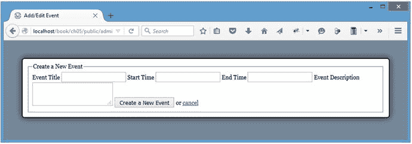
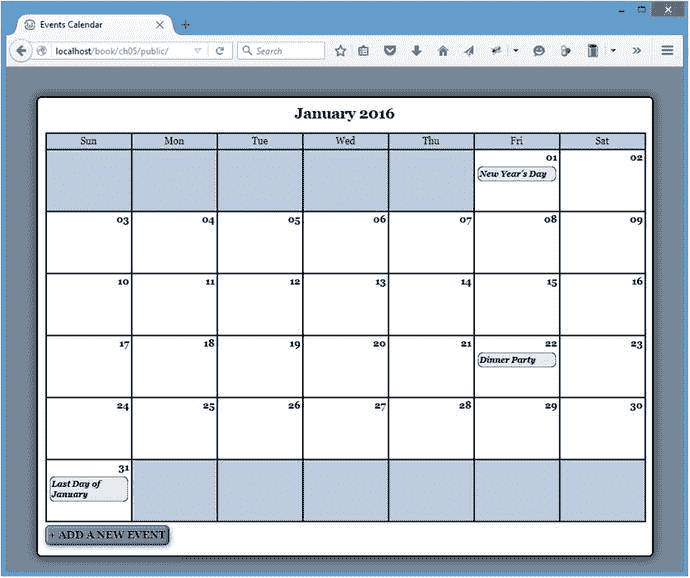
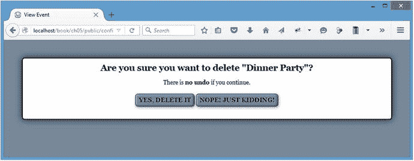
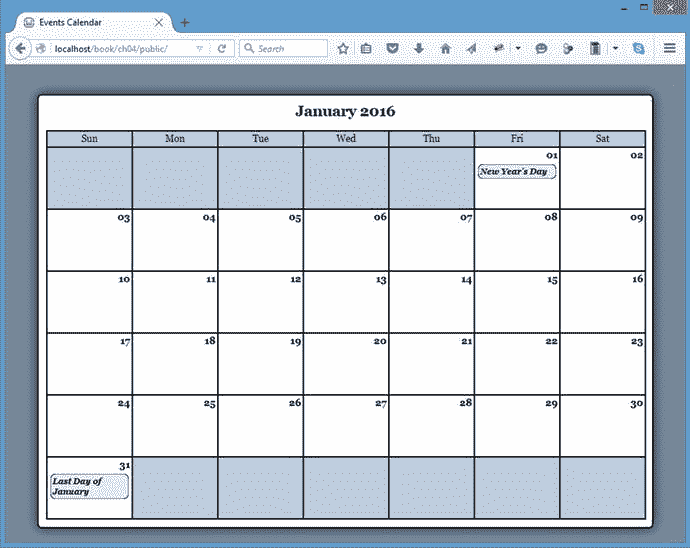

# 五、添加控件来创建、编辑和删除事件

Electronic supplementary material The online version of this chapter (doi:[10.​1007/​978-1-4842-1230-1_​5](http://dx.doi.org/10.1007/978-1-4842-1230-1_5)) contains supplementary material, which is available to authorized users.

现在可以查看日历了，您需要添加允许管理员创建、编辑和删除事件的控件。

## 生成表单以创建或编辑事件

要编辑事件或向日历中添加新事件，您需要使用一个表单。通过向`Calendar`类添加一个名为`displayForm()`的方法来实现这一点，该方法生成一个用于编辑和创建事件的表单。

这个简单的方法可以完成以下任务:

*   检查作为事件 ID 传递的整数。
*   为用于描述事件的不同字段实例化空变量。
*   如果传递了事件 ID，则加载事件数据。
*   将事件数据存储在先前实例化的变量中(如果存在)。
*   输出表单。

Note

通过显式清理在`$_POST`超全局中传递的事件 ID，您可以确保该 ID 可以安全使用，因为任何非整数值都将被转换为`0`。

通过向`Calendar`类添加以下粗体代码来构建`displayForm()`方法:

`<?php`

`declare(strict_types=1);`

`class Calendar extends DB_Connect`

`{`

`private $_useDate;`

`private $_m;`

`private $_y;`

`private $_daysInMonth;`

`private $_startDay;`

`public function __construct(``$db=NULL`

`public function buildCalendar() {...}`

`public function displayEvent($id) {...}`

`/**`

`* Generates a form to edit or create events`

`*`

`* @return string the HTML markup for the editing form`

`*/`

`public function displayForm()`

`{`

`/*`

`* Check if an ID was passed`

`*/`

`if ( isset($_POST['event_id']) )`

`{`

`$id = (int) $_POST['event_id'];`

`// Force integer type to sanitize data`

`}`

`else`

`{`

`$id = NULL;`

`}`

`/*`

`* Instantiate the headline/submit button` `text`

`*/`

`$submit = "Create a New Event";`

`/*`

`* If no ID is passed, start with an empty event object.`

`*/`

`$event = new Event();`

`/*`

`* Otherwise load the associated event`

`*/`

`if ( !empty($id) )`

`{`

`$event = $this->_loadEventById($id);`

`/*`

`* If no object is returned, return NULL`

`*/`

`if ( !is_object($event) ) { return NULL; }`

`$submit = "Edit This Event";`

`}`

`/*`

`* Build the markup`

`*/`

`return <<<FORM_MARKUP`

`<form action="assets/inc/process.inc.php" method="post">`

`<fieldset>`

`<legend>$submit</legend>`

`<label for="event_title">Event Title</label>`

`<input type="text" name="event_title"`

`id="event_title" value="$event->title" />`

`<label for="event_start">Start Time</label>`

`<input type="text" name="event_start"`

`id="event_start" value="$event->start" />`

`<label for="event_end">End Time</label>`

`<input type="text" name="event_end"`

`id="event_end" value="$event->end" />`

`<label for="event_description">Event Description</label>`

`<textarea name="event_description"`

`id="event_description">$event->description</textarea>`

`<input type="hidden" name="event_id" value="$event->id" />`

`<input type="hidden" name="token" value="$_SESSION[token]" />`

`<input type="hidden" name="action" value="event_edit" />`

`<input type="submit" name="event_submit" value="$submit" />`

`or <a href="./">cancel</a>`

`</fieldset>`

`</form>`

`FORM_MARKUP;`

`}`

`private function _loadEventData($id=NULL) {...}`

`private function _``createEventObj`

`private function _loadEventById($id) {...}`

`}`

`?>`

### 向表单添加令牌

如果您查看前面的表单，有一个名为`token`的隐藏输入，它保存一个会话值，也称为`token`。这是一种防止跨站点请求伪造(CSRF)的安全措施，跨站点请求伪造是通过从表单本身以外的其他地方将表单提交到应用的处理文件来伪造的表单提交。这是垃圾邮件发送者发送多个伪造的条目提交的常用策略，这是令人讨厌的、潜在有害的，并且肯定是不受欢迎的。

这个令牌是通过生成一个随机散列并将其存储在会话中，然后将令牌与表单数据一起提交来创建的。如果`$_POST`超全局中的令牌与`$_SESSION`超全局中的令牌匹配，那么可以相当肯定地断定提交是合法的。

通过用粗体显示的代码修改初始化文件，可以将反 CSRF 令牌添加到应用中:

`<?php`

`declare(strict_types=1);`

`/*`

`* Enable sessions if needed.`

`* Avoid pesky warning if session already active.`

`*/`

`$status = session_status();`

`if ($status == PHP_SESSION_NONE){`

`//There is no active session`

`session_start();`

`}`

`/*`

`* Generate an anti-CSRF token if one doesn’t exist`

`*/`

`if ( !isset($_SESSION['token']) )`

`{`

`$_SESSION['token'] = sha1(uniqid((string)mt_rand(), TRUE));`

`}`

`/*`

`* Include the necessary configuration info`

`*/`

`include_once '../sys/config/db-cred.inc.php'; // DB info`

`/*`

`* Define constants for configuration info`

`*/`

`foreach ( $C as $name => $val )`

`{`

`define($name, $val);`

`}`

`/*`

`* Create a PDO` `object`

`*/`

`$dsn = "mysql:host=" . DB_HOST . ";dbname=" . DB_NAME;`

`$dbo = new PDO($dsn, DB_USER, DB_PASS);`

`/*`

`* Define the auto-load function for classes`

`*/`

`function __autoload($class)`

`{`

`$filename = "../sys/class/class." . $class . ".inc.php";`

`if ( file_exists($filename) )`

`{`

`include_once $filename;`

`}`

`}`

`?>`

Caution

您可能希望包括令牌的时间限制，以进一步提高安全性。例如，确保令牌不超过 20 分钟，有助于防止用户离开无人看管的计算机，并防止恶意用户稍后开始四处窥探。欲了解更多关于代币和预防 CSRF 的信息，请访问 Chris Shiflett 的博客，并在 [`http://shiflett.org/csrf`](http://shiflett.org/csrf) 阅读他关于该主题的文章。

### 创建显示表单的文件

现在已经有了显示表单的方法，您需要创建一个调用该方法的文件。这个文件将被命名为`admin.php`，它将驻留在`public`文件夹(`/public/admin.php`)的根级别中。

与`view.php`类似，该文件完成以下任务:

*   加载初始化文件。
*   设置页面标题和 CSS 文件数组。
*   包括标题。
*   创建`Calendar`类的新实例。
*   调用`displayForm()`方法。
*   包括页脚。

接下来，在新的`admin.php`文件中添加以下内容:

`<?php`

`declare(strict_types=1);`

`/*`

`* Include necessary files`

`*/`

`include_once '../sys/core/init.inc.php';`

`/*`

`* Output the header`

`*/`

`$page_title = "Add/Edit Event";`

`$css_files = array("style.css");`

`include_once 'assets/common/header.inc.php';`

`/*`

`* Load the calendar`

`*/`

`$cal = new Calendar($dbo);`

`?>`

`
`

`<?php echo $cal->displayForm(); ?>`

`
``<!--``end #content`

`<?php`

`/*`

`* Output the footer`

`*/`

`include_once 'assets/common/footer.inc.php';`

`?>`

保存该代码后，导航到`http://localhost/admin.php`查看结果表单，如图 [5-1](#Fig1) 所示。

图 5-1。

The form before adding any CSS styles

### 为管理功能添加新样式表

显然，前面的表单需要一些视觉上的增强，以使它更有用。然而，这个表单最终只能由管理员访问(因为您不希望任何人对您的日历进行更改)，所以 CSS 规则将被分离到一个名为`admin.css`的单独样式表中。你可以在`css`文件夹(`/public/assets/css/`)中找到这个文件。

还是那句话，既然这本书不是讲 CSS 的，规则就不解释了。本质上，下面的 CSS 使表单元素看起来更像用户期望的表单；它还为即将创建的元素添加了一些规则。

现在将以下代码添加到`admin.css`中:

`fieldset {`

`border: 0;`

`}`

`legend {`

`font-size: 24px;`

`font-weight: bold;`

`}`

`input[type=text],input[type=password],label {`

`display: block;`

`width: 70%;`

`font-weight: bold;`

`}`

`textarea {`

`width: 99%;`

`height: 200px;`

`}`

`input[type=text],input[type=password],textarea {`

`border: 1px solid #123;`

`-moz-border-radius: 6px;`

`-webkit-border-radius: 6px;`

`border-radius: 6px;`

`-moz-box-shadow: inset 1px 2px 4px #789;`

`-webkit-box-shadow: inset 1px 2px 4px #789;`

`box-shadow: inset 1px 2px 4px #789;`

`padding: 4px;`

`margin: 0 0 4px;`

`font-size: 16px;`

`font-family: georgia, serif;`

`}`

`input[type=submit] {`

`margin: 4px 0;`

`padding: 4px;`

`border: 1px solid #123;`

`-moz-border-radius: 6px;`

`-webkit-border-radius: 6px;`

`border-radius: 6px;`

`-moz-box-shadow: inset -2px -1px 3px #345,`

`inset 1px 1px 3px #BCF,`

`1px 2px 6px #789;`

`-webkit-box-shadow: inset -2px -1px 3px #345,`

`inset 1px 1px 3px #BCF,`

`1px 2px 6px #789;`

`box-shadow: inset -2px -1px 3px #345,`

`inset 1px 1px 3px #BCF,`

`1px 2px 6px #789;`

`background-color: #789;`

`font-family: georgia, serif;`

`text-transform: uppercase;`

`font-weight: bold;`

`font-size: 14px;`

`text-shadow: 0px 0px 1px #fff;`

`}`

`.admin-options {`

`text-align: center;`

`}`

`.admin-options form,.admin-options p {`

`display: inline;`

`}`

`a.admin {`

`display: inline-block;`

`margin: 4px 0;`

`padding: 4px;`

`border: 1px solid #123;`

`-moz-border-radius: 6px;`

`-webkit-border-radius: 6px;`

`border-radius: 6px;`

`-moz-box-shadow: inset -2px -1px 3px #345,`

`inset 1px 1px 3px #BCF,`

`1px 2px 6px #789;`

`-webkit-box-shadow: inset -2px -1px 3px #345,`

`inset 1px 1px 3px #BCF,`

`1px 2px 6px #789;`

`box-shadow: inset -2px -1px 3px #345,`

`inset 1px 1px 3px #BCF,`

`1px 2px 6px #789;`

`background-color: #789;`

`color: black;`

`text-decoration: none;`

`font-family: georgia, serif;`

`text-transform: uppercase;`

`font-weight: bold;`

`font-size: 14px;`

`text-shadow: 0px 0px 1px #fff;`

`}`

保存该文件，然后通过进行粗体显示的更改将`admin.css`添加到`admin.php`中的`$css_files`数组:

`<?php`

`declare(strict_types=1);`

`/*`

`* Include necessary files`

`*/`

`include_once '../sys/core/init.inc.php';`

`/*`

`* Output the header`

`*/`

`$page_title = "Add/Edit Event";`

`$css_files = array("style.css", "admin.css");`

`include_once 'assets/common/header.inc.php';`

`/*`

`* Load the calendar`

`*/`

`$cal = new Calendar($dbo);`

`?>`

`
`

`<?php echo $cal->displayForm(); ?>`

`
<!-- end #content -->`

`<?php`

`/*`

`* Output the footer`

`*/`

`include_once 'assets/common/footer.inc.php';`

`?>`

保存前面的代码后，重新加载`http://localhost/admin.php`以查看样式化的表单(见图 [5-2](#Fig2) )。

图 5-2。

The form to add or edit events after applying CSS styles

## 在数据库中保存新事件

为了保存表单中输入的事件，您在`Calendar`类中创建了一个名为`processForm()`的新方法，它完成了以下任务:

*   清理通过`POST`从表单传递的数据。
*   确定事件是正在编辑还是正在创建。
*   如果没有正在编辑的事件，则生成一条`INSERT`语句；如果发布了事件 ID，则生成一条`UPDATE`语句。
*   创建预准备语句并绑定参数。
*   执行查询并在失败时返回`TRUE`或错误消息。

以下代码在`Calendar`类中创建了`processForm()`方法:

`<?php`

`declare(strict_types=1);`

`class Calendar extends DB_Connect`

`{`

`private $_useDate;`

`private $_m;`

`private $_y;`

`private $_daysInMonth;`

`private $_startDay;`

`public function __construct($dbo=NULL, $useDate=NULL) {...}`

`public function buildCalendar() {...}`

`public function displayEvent($id) {...}`

`public function displayForm() {...}`

`/**`

`* Validates the form and saves/edits the event`

`*`

`* @return mixed TRUE on success, an error message on failure`

`*/`

`public function processForm()`

`{`

`/*`

`* Exit if the action isn’t set properly`

`*/`

`if ( $_POST['action']!='event_edit' )`

`{`

`return "The method processForm was accessed incorrectly";`

`}`

`/*`

`* Escape data from the form`

`*/`

`$title = htmlentities($_POST['event_title'], ENT_QUOTES);`

`$desc = htmlentities($_POST['event_description'], ENT_QUOTES);`

`$start = htmlentities($_POST['event_start'], ENT_QUOTES);`

`$end = htmlentities($_POST['event_end'], ENT_QUOTES);`

`/*`

`* If no event ID passed, create a new event`

`*/`

`if ( empty($_POST['event_id']) )`

`{`

`$sql = "INSERT INTO `events``

`(`event_title`, `event_desc`, `event_start`,`

``event_end`)`

`VALUES`

`(:title, :description, :start, :end)";`

`}`

`/*`

`* Update the event if it’s being edited`

`*/`

`else`

`{`

`/*`

`* Cast the event ID as an integer for security`

`*/`

`$id = (int) $_POST['event_id'];`

`$sql = "UPDATE `events``

`SET`

``event_title`=:title,`

``event_desc`=:description,`

``event_start`=:start,`

``event_end`=:end`

`WHERE `event_id`=$id";`

`}`

`/*`

`* Execute the create or edit query after binding the data`

`*/`

`try`

`{`

`$stmt = $this->db->prepare($sql);`

`$stmt->bindParam(":title", $title, PDO::PARAM_STR);`

`$stmt->bindParam(":description", $desc, PDO::PARAM_STR);`

`$stmt->bindParam(":start", $start, PDO::PARAM_STR);`

`$stmt->bindParam(":end", $end, PDO::PARAM_STR);`

`$stmt->execute();`

`$stmt->closeCursor();`

`return TRUE;`

`}`

`catch ( Exception $e )`

`{`

`return $e->getMessage();`

`}`

`}`

`private function _loadEventData($id=NULL) {...}`

`private function _createEventObj() {...}`

`private function _loadEventById($id) {...}`

`}`

`?>`

### 添加处理文件以调用处理方法

添加和编辑事件的表单被提交到一个名为`process.inc.php`的文件中，该文件位于`inc`文件夹(`/public/assets/inc/process.inc.php`)中。该文件检查提交的表单数据，并通过执行以下步骤保存或更新条目:

Enables the session.   Includes the database credentials and the `Calendar` class.   Defines constants (as occurs in the initialization file).   Creates an array that stores information about each action.   Verifies that the token was submitted and is correct, and that the submitted action exists in the lookup array. If so, go to Step 6\. If not, go to Step 7.   Creates a new instance of the `Calendar` class.

*   调用`processForm()`方法。
*   将用户返回到主视图，或者在失败时输出错误。

  Sends the user back out to the main view with no action if the token doesn’t match.  

在步骤 4 中创建的数组允许您避免一长串重复的`if...elseif`块来测试每个单独的动作。使用 action 作为数组键，并将对象、方法名和用户应该重定向到的页面存储为数组值，这意味着您可以使用数组中的变量编写单个逻辑块。

将以下代码插入`process.inc.php`以完成刚刚描述的步骤:

`<?php`

`declare(strict_types=1);`

`/*`

`* Enable sessions if needed.`

`* Avoid pesky warning if session already active.`

`*/`

`$status = session_status();`

`if ($status == PHP_SESSION_NONE){`

`//There is no active session`

`session_start();`

`}`

`/*`

`* Include necessary files`

`*/`

`include_once '../../../sys/config/db-cred.inc.php';`

`/*`

`* Define constants for config info`

`*/`

`foreach ( $C as $name => $val )`

`{`

`define($name, $val);`

`}`

`/*`

`* Create a lookup array for form actions`

`*/`

`define('ACTIONS', array(`

`'event_edit' => array(`

`'object' => 'Calendar',`

`'method' => 'processForm',`

`'header' => 'Location: ../../'`

`)`

`)`

`);`

`/*`

`* Need a PDO object.`

`*/`

`$dsn = "mysql:host=" . DB_HOST . ";dbname=" . DB_NAME;`

`$dbo = new PDO($dsn, DB_USER, DB_PASS);`

`/*`

`* Make sure the anti-CSRF token was passed and that the`

`* requested action exists in the lookup array`

`*/`

`if ( $_POST['token']==$_SESSION['token']`

`&&` `isset(ACTIONS[$_POST['action']]) )`

`{`

`$use_array = ACTIONS[$_POST['action']];`

`$obj = new $use_array['object']($dbo);`

`$method = $use_array['method'];`

`if ( TRUE === $msg=$obj->$method() )`

`{`

`header($use_array['header']);`

`exit;`

`}`

`else`

`{`

`// If an error occured, output it and end execution`

`die ( $msg );`

`}`

`}`

`else`

`{`

`// Redirect to the main index if the token/action is invalid`

`header("Location: ../../");`

`exit;`

`}`

`function __autoload($class_name)`

`{`

`$filename = '../../../sys/class/class.'`

`. strtolower($class_name) . '.inc.php';`

`if ( file_exists($filename) )`

`{`

`include_once $filename;`

`}`

`}`

`?>`

保存该文件，然后导航至`http://localhost/admin.php`并用以下信息创建一个新事件:

*   活动名称:晚宴
*   开始时间:2016-01-22 17:00:00
*   结束时间:2016-01-22 19:00:00
*   描述:在约翰家吃五道菜并搭配葡萄酒

点击“创建新事件”按钮后，日历会更新为新事件，如图 [5-3](#Fig3) 所示。

图 5-3。

The new event as it appears when hovered over

### 向主视图添加按钮以创建新事件

为了让授权用户更容易创建新事件，在日历中添加一个按钮，将用户带到`admin.php`中的表单。通过在`Calendar`类中创建一个名为`_adminGeneralOptions()`的新私有方法来实现这一点:

`<?php`

`declare(strict_types=1);`

`class Calendar extends DB_Connect`

`{`

`private $_useDate;`

`private $_m;`

`private $_y;`

`private $_daysInMonth;`

`private $_startDay;`

`public function __construct($dbo=NULL, $useDate=NULL) {...}`

`public function buildCalendar() {...}`

`public function displayEvent($id) {...}`

`public function displayForm() {...}`

`public function processForm() {...}`

`private function _loadEventData($id=NULL) {...}`

`private function _createEventObj() {...}`

`private function _loadEventById($id) {...}`

`/**`

`* Generates markup to display administrative links`

`*`

`* @return string markup to display the administrative links`

`*/`

`private function _adminGeneralOptions()`

`{`

`/*`

`* Display admin controls`

`*/`

`return <<<ADMIN_OPTIONS`

`<a href="admin.php" class="admin">+ Add a New Event</a>`

`ADMIN_OPTIONS;`

`}`

`}`

`?>`

Note

确保该按钮仅显示给授权用户的检查将添加到[第 6 章](06.html)。

接下来，通过插入以下粗体代码，修改`buildCalendar()`方法以调用新的`_adminGeneralOptions()`方法:

`public function buildCalendar()`

`{`

`// To save space, the bulk of this method has been omitted`

`/*`

`* Close the final unordered list`

`*/`

`$html .= "\n\t</ul>\n\n";`

`/*`

`* If logged in, display the admin options`

`*/`

`$admin = $this->_adminGeneralOptions();`

`/*`

`* Return the markup for output`

`*/`

`return $html . $admin;`

`}`

最后，使用以下粗体代码将管理样式表(`admin.css`)添加到`index.php`，以确保链接正确显示:

`<?php`

`declare(strict_types=1);`

`/*`

`* Include necessary files`

`*/`

`include_once '../sys/core/init.inc.php';`

`/*`

`* Load the calendar`

`*/`

`$cal = new Calendar($dbo, "2016-01-01 12:00:00");`

`/*`

`* Set up the page title and CSS files`

`*/`

`$page_title = "Events Calendar";`

`$css_files = array('style.css', 'admin.css');`

`/*`

`* Include the header`

`*/`

`include_once 'assets/common/header.inc.php';`

`?>`

`
`

`<?php`

`/*`

`* Display the calendar HTML`

`*/`

`echo $cal->buildCalendar();`

`?>`

`
<!-- end #content -->`

`<?php`

`/*`

`* Include the footer`

`*/`

`include_once 'assets/common/footer.inc.php';`

`?>`

保存文件并重新加载`http://localhost/`以查看按钮(见图 [5-4](#Fig4) )。

图 5-4。

The Admin button appears in the bottom left of the calendar

## 将编辑控制添加到完整事件视图

接下来，您需要让授权用户能够编辑事件。您将通过在`view.php`中向事件的完整视图添加一个按钮来实现这一点。

然而，与用于创建新选项的简单链接不同，编辑按钮需要实际的表单提交。为了保持这段代码的可管理性，您将在`Calendar`类中创建一个名为`_adminEntryOptions()`的新私有方法，该方法将为表单生成标记。

现在，这个表单将简单地返回表单标记来显示编辑按钮。随着您继续完成本书中的练习，更多内容将添加到表格中。

您可以通过向`Calendar`类添加以下粗体代码来创建该方法:

`<?php`

`declare(strict_types=1);`

`class Calendar extends DB_Connect`

`{`

`private $_useDate;`

`private $_m;`

`private $_y;`

`private $_daysInMonth;`

`private $_startDay;`

`public function __construct($dbo=NULL, $useDate=NULL) {...}`

`public function buildCalendar() {...}`

`public function displayEvent($id) {...}`

`public function displayForm() {...}`

`public function processForm() {...}`

`private function _loadEventData($id=NULL) {...}`

`private function _createEventObj() {...}`

`private function _loadEventById($id) {...}`

`private function _adminGeneralOptions() {...}`

`/**`

`* Generates edit and delete options for a given event ID`

`*`

`* @param int $id the event ID to generate options for`

`* @return string the markup for the edit/delete options`

`*/`

`private function _adminEntryOptions($id)`

`{`

`return <<<ADMIN_OPTIONS`

`
`

`<form action="admin.php" method="post">`

`
`

`<input type="submit" name="edit_event"`

`value="Edit This Event" />`

`<input type="hidden" name="event_id"`

`value="$id" />`

`
`

`</form>`

`
``<!--``end .admin-options`

`ADMIN_OPTIONS;`

`}`

`}`

`?>`

### 修改完整事件显示方法以显示管理控件

在显示编辑按钮之前，需要从`displayEvent()`方法中调用`_adminEntryOptions()`方法。这很简单，只需将`_adminEntryOptions()`的返回值存储在变量`$admin`中，然后将该变量与其余的条目标记一起输出。

将以下粗体修改添加到`Calendar`类中的`displayEvent()`:

`/**`

`* Displays a given event’s information`

`*`

`* @param int $id the event ID`

`* @return string basic markup to display the event info`

`*/`

`public function displayEvent($id)`

`{`

`/*`

`* Make sure an ID was passed`

`*/`

`if ( empty($id) ) { return NULL; }`

`/*`

`* Make sure the ID is an integer`

`*/`

`$id = preg_replace('/[^0-9]/', '', $id);`

`/*`

`* Load the event data from the DB`

`*/`

`$event = $this->_loadEventById($id);`

`/*`

`* Generate strings for the date, start, and end time`

`*/`

`$ts = strtotime($event->start);`

`$date = date('F d, Y', $ts);`

`$start = date('g:ia', $ts);`

`$end = date('g:ia', strtotime($event->end));`

`/*`

`* Load admin options if the user is logged in`

`*/`

`$admin = $this->_adminEntryOptions($id);`

`/*`

`* Generate and return the markup`

`*/`

`return "<h2>$event->title</h2>"`

`. "\n\t
$date, $start—$end
"`

`. "\n\t
$event->description
$admin";`

`}`

Note

确保在`return`字符串的末尾包含了`$admin`变量。

与“创建新条目”按钮一样，稍后将添加检查，以确保只有授权用户才能看到编辑控件。

### 将管理样式表添加到完整事件视图页面

编辑按钮准备就绪之前的最后一步是将`admin.css`样式表包含在`view.php`的`$css_files`变量中:

`<?php`

`declare(strict_types=1);`

`/*`

`* Make sure the event ID was passed`

`*/`

`if ( isset($_GET['event_id']) )`

`{`

`/*`

`* Collect the event ID from the URL string`

`*/`

`$id = htmlentities($_GET['event_id'], ENT_QUOTES);`

`}`

`else`

`{`

`/*`

`* Send the user to the main page if no ID is supplied`

`*/`

`header("Location: ./");`

`exit;`

`}`

`/*`

`* Include necessary files`

`*/`

`include_once '../sys/core/init.inc.php';`

`/*`

`* Output the header`

`*/`

`$page_title = "View Event";`

`$css_files = array("style.css", "admin.css");`

`include_once 'assets/common/header.inc.php';`

`/*`

`* Load the calendar`

`*/`

`$cal = new Calendar($dbo);`

`?>`

`
`

`<?php echo $cal->displayEvent($id) ?>`

`<a href="./">« Back to the calendar</a>`

`
<!-- end #content -->`

`<?php`

`/*`

`* Output the footer`

`*/`

`include_once 'assets/common/footer.inc.php';`

`?>`

保存该文件，然后点击一个事件以查看编辑按钮(参见图 [5-5](#Fig5) )。

图 5-5。

The Edit button as it appears when viewing a full event description

点击编辑按钮将调出`admin.php`上的表格，表格中加载了所有事件的数据(见图 [5-6](#Fig6) )。

图 5-6。

The admin form when an event is being edited

## 删除事件

创建`Calendar`类的最后一步是允许授权用户删除事件。事件删除不同于创建或编辑事件，因为您希望在删除事件之前确认用户的意图。否则，意外的点击会给用户带来挫败感和不便。

这意味着您必须分两个阶段实现删除按钮。

The Delete button is clicked, and the user is taken to a confirmation page.   The confirmation button is clicked, and the event is removed from the database.  

### 生成删除按钮

首先，通过用粗体显示的代码修改`Calendar`类中的`_adminEntryOptions()`,向全视图编辑控件添加一个删除按钮:

`/**`

`* Generates edit and delete options for a given event ID`

`*`

`* @param int $id the event ID to generate options for`

`* @return string the markup for the edit/delete options`

`*/`

`private function _adminEntryOptions($id)`

`{`

`return <<<ADMIN_OPTIONS`

`
`

`<form action="admin.php" method="post">`

`
`

`<input type="submit" name="edit_event"`

`value="Edit This Event" />`

`<input type="hidden" name="event_id"`

`value="$id" />`

`
`

`</form>`

`<form action="confirmdelete.php" method="post">`

`
`

`<input type="submit" name="delete_event"`

`value="Delete This Event" />`

`<input type="hidden" name="event_id"`

`value="$id" />`

`
`

`</form>`

`
<!-- end .admin-options -->`

`ADMIN_OPTIONS;`

`}`

这将添加一个按钮，将用户发送到一个尚未创建的名为`confirmdelete.php`的确认页面，您将在本节稍后构建该页面。保存前面的更改后，在查看完整的事件描述时，您将看到编辑和删除选项(参见图 [5-7](#Fig7) )。

图 5-7。

The Delete button as it appears on the full event view

### 创建需要确认的方法

当用户单击 Delete 按钮时，她会被发送到一个确认页面，该页面包含一个确认她确实想要删除该事件的表单。该表单将由名为`confirmDelete()`的`Calendar`类中的新公共方法生成。

此方法通过执行以下操作来确认应删除事件:

Checks if the confirmation form was submitted and a valid token was passed. If so, go to Step 2\. If not, go to Step 3.   Checks whether the button clicked was the Confirmation button.

*   如果是，它将删除该事件。
*   如果没有，它会将用户送回主日历视图。

  It loads the event data and displays the confirmation form.  

通过将粗体显示的新方法添加到`Calendar`类中，可以完成前面的步骤:

`<?php`

`declare(strict_types=1);`

`class Calendar extends DB_Connect`

`{`

`private $_useDate;`

`private $_m;`

`private $_y;`

`private $_daysInMonth;`

`private $_startDay;`

`public function __construct($dbo=NULL, $useDate=NULL) {...}`

`public function buildCalendar() {...}`

`public function displayEvent($id) {...}`

`public function displayForm() {...}`

`public function processForm() {...}`

`/**`

`* Confirms that an event should be deleted and does so`

`*`

`* Upon clicking the button to delete an event, this`

`* generates a confirmation box. If the user confirms,`

`* this deletes the event from the database and sends the`

`* user back out to the main calendar view. If the user`

`* decides not to delete the event, they’re sent back to`

`* the main calendar view without deleting anything.`

`*`

`* @param int $id the event ID`

`* @return mixed the form if confirming, void or error if deleting`

`*/`

`public function confirmDelete($id)`

`{`

`/*`

`* Make sure an ID was passed`

`*/`

`if ( empty($id) ) { return NULL; }`

`/*`

`* Make sure the ID is an integer`

`*/`

`$id = preg_replace('/[^0-9]/', '', $id);`

`/*`

`* If the confirmation form was submitted and the form`

`* has a valid token, check the form submission`

`*/`

`if ( isset($_POST['confirm_delete'])`

`&&` `$_POST['token']==$_SESSION['token'] )`

`{`

`/*`

`* If the deletion is confirmed, remove the event`

`* from the database`

`*/`

`if ( $_POST['confirm_delete']=="Yes, Delete It" )`

`{`

`$sql = "DELETE FROM `events``

`WHERE `event_id`=:id`

`LIMIT 1";`

`try`

`{`

`$stmt = $this->db->prepare($sql);`

`$stmt->bindParam(`

`":id",`

`$id,`

`PDO::PARAM_INT`

`);`

`$stmt->execute();`

`$stmt->closeCursor();`

`header("Location: ./");`

`return;`

`}`

`catch ( Exception $e )`

`{`

`return $e->getMessage();`

`}`

`}`

`/*`

`* If not confirmed, sends the user to the main view`

`*/`

`else`

`{`

`header("Location: ./");`

`return;`

`}`

`}`

`/*`

`* If the confirmation form hasn’t been submitted, display it`

`*/`

`$event = $this->_loadEventById($id);`

`/*`

`* If no object is returned, return to the main view`

`*/`

`if ( !is_object($event) ) { header("Location: ./"); }`

`return <<<CONFIRM_DELETE`

`<form action="confirmdelete.php" method="post">`

`<h2>`

`Are you sure you want to delete "$event->title"?`

`</h2>`

`
There is <strong>no undo</strong> if you continue.
`

`
`

`<input type="submit" name="confirm_delete"`

`value="Yes, Delete It" />`

`<input type="submit" name="confirm_delete"`

`value="Nope! Just Kidding!" />`

`<input type="hidden" name="event_id"`

`value="$event->id" />`

`<input type="hidden" name="token"`

`value="$_SESSION[token]" />`

`
`

`</form>`

`CONFIRM_DELETE;`

`}`

`private function _loadEventData($id=NULL) {...}`

`private function _createEventObj() {...}`

`private function _loadEventById($id) {...}`

`private function _adminGeneralOptions() {...}`

`private function _adminEntryOptions($id) {...}`

`}`

`?>`

### 创建文件以显示确认表单

为了调用`confirmDelete()`方法，需要创建文件`confirmdelete.php`。这个文件将驻留在`public`文件夹(`/public/confirmdelete.php`)的根目录下，它将非常类似于`index.php`。该文件完成以下任务:

*   确保事件 ID 被传递并存储在`$id`变量中；否则将用户发送到主视图。
*   加载初始化文件。
*   创建`Calendar`对象的新实例。
*   将`confirmDelete()`的返回值加载到变量`$markup`中。
*   定义`$page_title`和`$css_files`变量，包括标题。
*   输出存储在`$markup`中的数据。
*   输出页脚。

Note

在包含头部之前将`confirmDelete()`的输出加载到一个变量中的原因是，该方法有时会使用`header()`将用户发送到应用中的其他地方；如果在调用`confirmDelete()`之前包含了头文件，脚本在某些情况下会失败，因为在调用`header()`之前没有数据可以输出到浏览器，或者发生致命错误。关于`header()`功能的更多信息，请访问 [`http://php.net/header`](http://php.net/header) 。

现在在`confirmdelete.php`中添加以下代码:

`<?php`

`declare(strict_types=1);`

`/*`

`* Make sure the event ID was passed`

`*/`

`if ( isset($_POST['event_id']) )`

`{`

`/*`

`* Collect the event ID from the URL string`

`*/`

`$id = (int) $_POST['event_id'];`

`}`

`else`

`{`

`/*`

`* Send the user to the main page if no ID is supplied`

`*/`

`header("Location: ./");`

`exit;`

`}`

`/*`

`* Include necessary files`

`*/`

`include_once '../sys/core/init.inc.php';`

`/*`

`* Load the calendar`

`*/`

`$cal = new Calendar($dbo);`

`$markup = $cal->confirmDelete($id);`

`/*`

`* Output the header`

`*/`

`$page_title = "View Event";`

`$css_files = array("style.css", "admin.css");`

`include_once 'assets/common/header.inc.php';`

`?>`

`
`

`<?php echo $markup; ?>`

`
``<!--``end #content`

`<?php`

`/*`

`* Output the footer`

`*/`

`include_once 'assets/common/footer.inc.php';`

`?>`

保存这个文件，然后通过删除“晚宴”条目来测试系统。在向您展示完整的事件描述后，日历会带您进入确认表单(参见图 [5-8](#Fig8) )。

图 5-8。

The confirmation form a user sees after clicking the Delete button

点击“是，删除”按钮后，该事件将从日历中删除(参见图 [5-9](#Fig9) )。

图 5-9。

After the user confirms the deletion, the event is removed from the calendar

## 摘要

至此，您已经有了一个功能齐全的活动日历。您已经学习了如何创建表单来创建、编辑、保存和删除事件，包括如何确认事件删除。但是，管理控件目前对访问该站点的任何人都可用。

在下一章中，您将构建一个类来授予授权用户对站点管理控件的访问权限。