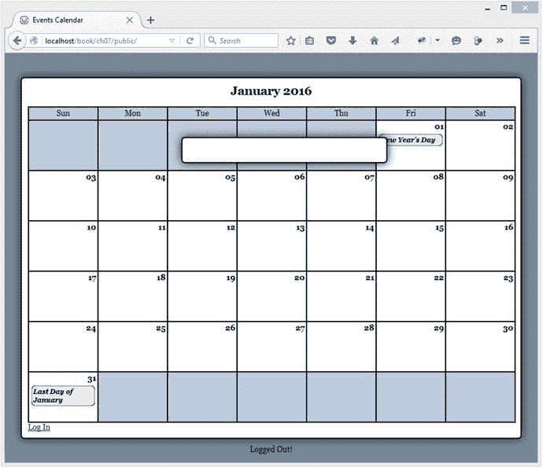
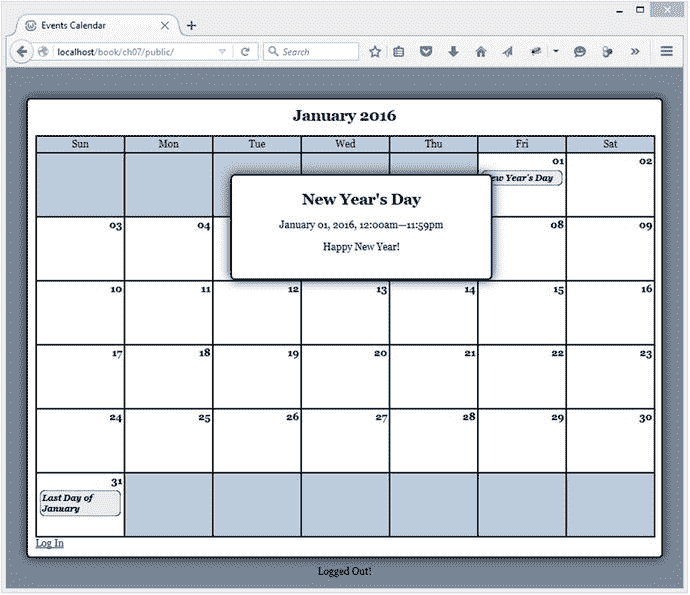
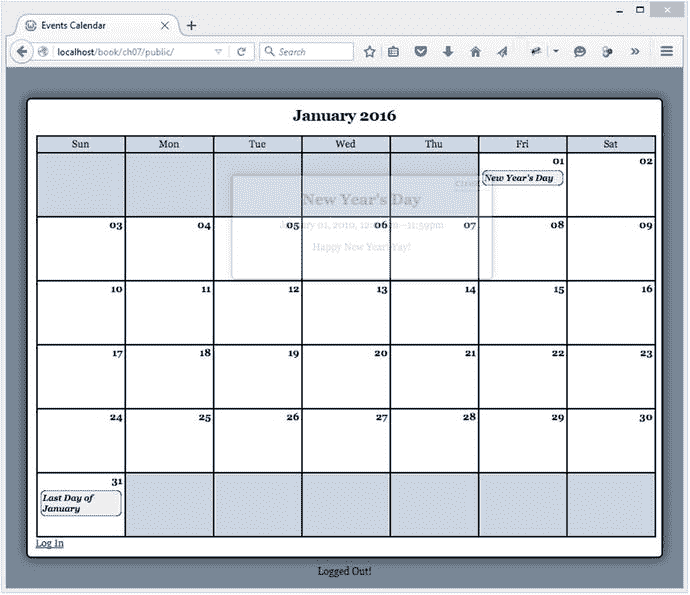
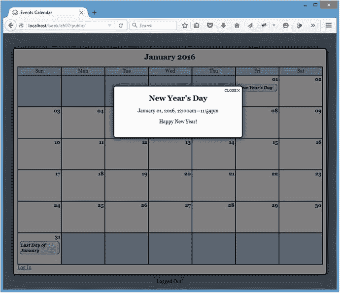

# 七、使用 jQuery 增强用户界面

Electronic supplementary material The online version of this chapter (doi:[10.​1007/​978-1-4842-1230-1_​7](http://dx.doi.org/10.1007/978-1-4842-1230-1_7)) contains supplementary material, which is available to authorized users.

目前的应用功能齐全。可以查看事件，具有管理权限的用户可以登录以创建、编辑或删除事件。

下一步是向应用添加一层润色，以创建最终的外观和感觉，这将通过使用一种称为渐进增强的技术向应用添加 AJAX 功能来完成。

## 使用 jQuery 添加渐进式增强

渐进式改进是一个术语，最初由 Steven Champeon [1](#Fn1) 在 2003 年创造，用于描述一种 web 开发技术，其中应用被设计为可访问任何互联网连接和浏览器，使用语义 HTML 和其他分层应用的技术(如 CSS 文件和 JavaScript 代码)。

对于遵循渐进增强原则的应用，它必须遵循以下准则:

*   所有浏览器都可以使用最简单、最具语义的 HTML 标记来访问基本内容。
*   该应用的所有基本功能都适用于所有浏览器。
*   尊重用户的偏好；这意味着 web 应用不会覆盖浏览器设置(如窗口大小)。
*   外部链接的 CSS 处理文档的样式和表示。
*   外部链接的 JavaScript 增强了用户体验，但它并不引人注目，或者对应用的操作并不重要。

您的应用已经满足了前四条准则(虽然不太好看，但是应用可以在禁用样式的情况下工作)。因此，只要您的 JavaScript 没有创建任何在禁用 JavaScript 的情况下无法访问的新功能，您就已经成功地创建了一个逐步增强的 web 应用。

### 设定渐进增强目标

使用渐进式增强的原则，您将添加无需在模式窗口中刷新页面即可查看事件信息的能力，模式窗口是位于现有标记之上的内容区域，用于显示附加信息。这种窗口通常是由 JavaScript 触发的，它们被用在许多当今最流行的网站上。

在您的日历应用中，您将使用一个模态窗口在用户单击事件标题后显示事件的详细信息。这不需要使用 AJAX 刷新页面就可以完成。

## 在日历应用中包含 jQuery

正如您在本书前面的 jQuery 介绍中所了解到的，使用 jQuery 语法要求您首先包含 jQuery 库。如果可能的话，最好将``

`</body>`

`</html>`

保存这段代码，然后在浏览器中加载`http://localhost/`。打开 Firebug 控制台并执行以下命令，以确保 jQuery 加载到您的应用中:

`$("h2").text();`

运行此命令后，控制台将显示以下输出:

`>>> $("h2").text();`

`"January 2016`

Note

因为您使用的是 Google 托管的 jQuery 库，所以除了 Apache 服务器之外，您还需要有一个可用的 Internet 连接。如果您无法访问互联网连接或不喜欢使用互联网连接，请从 [`http://jquery.com/`](http://jquery.com/) 下载最新版本的 jQuery 并包含它。

### 创建 JavaScript 初始化文件

您的应用遵循渐进增强准则，因此所有脚本都将保存在一个名为`init.js`的外部文件中。它将驻留在公共的`js`文件夹(`/public/assets/js/init.js`)中，并将包含您的应用的所有定制 jQuery 代码。

#### 包括应用中的初始化文件

在您的应用可以使用任何脚本之前，您需要在应用中包含初始化文件。您的应用将使用 jQuery 语法，因此初始化文件需要包含在`footer.inc.php`中加载 jQuery 库的脚本之后。

通过在`footer.inc.php`中插入以下粗体代码，您可以将该文件包含在您的应用中:

``

`</body>`

`</html>`

#### 确保文档在脚本执行前准备就绪

在创建了`init.js`之后，使用 jQuery 中的`document.ready`快捷方式来确保在文档真正准备好被操作之前没有脚本执行。将以下代码插入`init.js`:

`"use strict";  // enforce variable declarations – safer coding`

`// Makes sure the document is ready before executing scripts`

`jQuery(function($){`

`// A quick check to make sure the script loaded properly`

`console.log("init.js was loaded successfully.");`

`});`

保存这个文件，并在 Firebug 控制台打开的情况下在浏览器中加载`http://localhost/`。文件加载后，您应该会在控制台中看到以下结果:

`init.js was loaded successfully.`

### 为 jQuery 创建的元素创建新的样式表

为了确保用 jQuery 创建的元素在开始构建时看起来是正确的，我们将向前跳一步，创建一个新的 CSS 文件来存储将要用 jQuery 脚本创建的元素的样式信息。

这个文件将被命名为`ajax.css`，它将驻留在`css`文件夹(`/public/assets/css/ajax.css`)中。创建后，在其中放置以下样式规则:

`.modal-overlay {`

`position: fixed;`

`top: 0;`

`left: 0;`

`bottom: 0;`

`width: 100%;`

`height: 100%;`

`background-color: rgba(0,0,0,.5);`

`z-index: 4;`

`}`

`.modal-window {`

`position: absolute;`

`top: 140px;`

`left: 50%;`

`width: 300px;`

`height: auto;`

`margin-left: -150px;`

`padding: 20px;`

`border: 2px solid #000;`

`background-color: #FFF;`

`-moz-border-radius: 6px;`

`-webkit-border-radius: 6px;`

`border-radius: 6px;`

`-moz-box-shadow: 0 0 14px #123;`

`-webkit-box-shadow: 0 0 14px #123;`

`box-shadow: 0 0 14px #123;`

`z-index: 5;`

`}`

`.modal-close-btn {`

`position: absolute;`

`top: 0;`

`right: 4px;`

`margin: 0;`

`padding: 0;`

`text-decoration: none;`

`color: black;`

`font-size: 16px;`

`}`

`.modal-close-btn:before {`

`position: relative;`

`top: -1px;`

`content: "Close";`

`text-transform: uppercase;`

`font-size: 10px;`

`}`

#### 在索引文件中包含样式表

接下来，打开`index.php`，通过添加粗体行将新样式表包含在`$css_files`数组中:

`<?php`

`declare(strict_types=1);`

`/*`

`* Include necessary files`

`*/`

`include_once '../sys/core/init.inc.php';`

`/*`

`* Load the calendar`

`*/`

`$cal = new Calendar($dbo, "2016-01-01 12:00:00");`

`/*`

`* Set up the page title and CSS files`

`*/`

`$page_title = "Events Calendar";`

`$css_files = array('style.css', 'admin.css', 'ajax.css');`

`/*`

`* Include the header`

`*/`

`include_once 'assets/common/header.inc.php';`

`?>`

`
`

`<?php`

`/*`

`* Display the calendar HTML`

`*/`

`echo $cal->buildCalendar();`

`?>`

`
<!-- end #content -->`

`<?php`

`/*`

`* Include the footer`

`*/`

`include_once 'assets/common/footer.inc.php';`

`?>`

## 为事件数据创建模式窗口

您将为此应用创建的模式窗口将非常简单；创建它的脚本将遵循以下步骤。

Prevent the default action (opening the detailed event view in `view.php`).   Add an `active` class to the event link in the calendar.   Extract the query string from the event link’s `href` attribute.   Create a button that will close the modal window when clicked.   Create the modal window itself and put the Close button inside it.   Use AJAX to retrieve the information from the database and display it in the modal window.  

当针对事件标题链接触发 click 事件时，将执行前面的所有步骤。

### 将函数绑定到标题链接的点击事件

首先向`init.js`添加一个新的选择器，它选择列表项(`li>a`)的直接后代的所有锚元素，并使用`.on()`方法将一个处理程序绑定到 click 事件(jQuery 版本来会使用`.live()`方法，但现在已经不推荐使用了)。

因为您需要绑定到许多动态创建的元素，所以您将始终使用三参数形式的`.on()` : `$(` `selector` `).on(` `event, childSelector, function` `)`，其中 selector 是父容器(非动态)，childSelector 表示(通常)动态创建的元素。为了获得最大的灵活性，您将使用“body”作为父容器。

将以下粗体代码插入`init.js`:

`"use strict";  // enforce variable declarations – safer coding`

`// Makes sure the document is ready before executing scripts`

`jQuery(function($){`

`// Pulls up events in a modal window`

`$("body").on("click", " li>a", function(event){`

`// Event handler scripts go here`

`});`

`});`

### 防止默认操作并添加活动类

接下来，您需要使用`.` `preventDefault()`来阻止默认动作，然后使用`.` `addClass()`向被点击的元素添加一个`active`类。

这是通过添加以下粗体代码来实现的:

`"use strict";  // enforce variable declarations – safer coding`

`// Makes sure the document is ready before executing scripts`

`jQuery(function($){`

`// Pulls up events in a modal window`

`$("body").on("click", "li>a", function(event){`

`// Stops the link from loading view.php`

`event.preventDefault();`

`// Adds an "active" class to the link`

`$(this).addClass("active");`

`// Proves the event handler worked by logging the link text`

`console.log( $(this).text() );`

`});`

`});`

保存此代码后，在浏览器中重新加载`http://localhost/`,并点击任何事件标题。不是在`view.php`上查看事件详情，而是在控制台中输出事件标题。例如，如果您单击`New Year’s Day`事件，您将在控制台中看到以下输出:

`New Year’s Day`

### 用正则表达式提取查询字符串

创建模式窗口是为了显示事件信息，所以您需要某种方法来知道应该显示哪个事件。无需添加任何额外的标记，您实际上可以使用正则表达式从`href`属性中提取事件 ID。

为此，您需要从链接中提取查询字符串。(如果`href`属性值为`http://localhost/view.php?event_id=1`，查询字符串为`event_id=1`。)

您将使用两项来提取查询字符串:`.replace()`，一个接受字符串或正则表达式模式进行匹配的原生 JavaScript 函数，匹配的字符串或模式应该替换为。

#### 使用惰性方法:基于字符串的替换

乍一看，显而易见的解决方案似乎如下:

`var data = string.replace("``http://localhost/view.php`T2】

是的，这确实有效，产生了输出`"event_id=1"`(如果你假设`$string`的初始值是`http://localhost/view.php?event_id=1`)。不幸的是，这种方法不够灵活；例如，如果应用被移动到另一个域名，该怎么办？或者，文件名改成`event.php`怎么办？这两种更改都会破坏前面的逻辑，需要更新脚本。

#### 采用更好的解决方案:正则表达式

然而，有一个更好的解决方案:正则表达式。在大多数现代编程语言中，正则表达式是一种强大的模式匹配工具。

为了提取查询字符串，您将使用一种模式来查找字符串中的第一个问号(`?`)，然后返回其后的所有内容。该模式将如下所示:

`/.*?\?(.*)$/`

JavaScript 中的正则表达式由表达式两端的正斜杠(`/`)分隔。在这个表达式中，模式寻找零个或更多的任意字符(从左到右)，直到第一次到达一个问号；然后，它将问号之后直到字符串末尾的所有字符存储为一个命名组，以便在替换中使用。

Note

在第 9 章中，你会学到更多关于正则表达式及其工作原理的知识。

#### 将正则表达式合并到脚本中

您想要提取被点击链接的`href`值，所以您将使用`this`关键字。为了使用 jQuery 方法，您必须首先将`this`作为选择器传递给 jQuery 函数。现在用`.attr()`方法访问`href`值，调用`.replace()`，并提取查询字符串。

在`.` `replace()`中使用正则表达式时，不使用引号将模式括起来。使用刚才描述的正则表达式，修改`init.js`，将来自单击链接的查询字符串存储在一个名为`data`的变量中；通过添加粗体显示的代码来实现这一点:

`"use strict";  // enforce variable declarations – safer coding`

`// Makes sure the document is ready before executing scripts`

`jQuery(function($){`

`// Pulls up events in a modal window`

`$("body").on("click", "li>a", function(event){`

`// Stops the link from loading view.php`

`event.preventDefault();`

`// Adds an "active" class to the link`

`$(this).addClass("active");`

`// Gets the query string from the link href`

`var data = $(this)`

`.attr("href")`

`.replace(/.+?\?(.*)$/, "$1");`

`// Logs the query string`

`console.log( data );`

`});`

`});`

保存这段代码，重新加载`http://localhost/`，然后点击一个链接。您应该会在控制台中看到类似以下内容的内容:

`event_id=1`

### 创建模式窗口

下一步是生成实际创建模式窗口和覆盖图的 HTML 标记。这个标记非常简单:它基本上由一个包装在其他内容周围的`div`元素组成。例如，`New Year’s Day`事件模式窗口标记将如下所示:

`
`

`<h2>New Year’s Day</h2>`

`
January 01, 2016, 12:00am—11:59pm
`

`
Happy New Year!
`

`
`

您还将为其他特性使用这个相同的模式窗口(比如为事件显示编辑表单)，因此模式窗口的实际创建将被抽象在一个单独的函数中，以便于重用。因为您将重用多个函数，所以您将通过将所有实用函数放在一个对象文字中来组织您的脚本，该对象文字是一个逗号分隔的名称-值对列表(有关更多信息，请参见侧栏“使用实用函数的对象文字”)。

#### 创建实用函数来检查模式窗口

在`init.js`的顶部，声明一个名为`fx`的新对象文字来存储您的实用函数:

`"use strict";  // enforce variable declarations – safer coding`

`// Makes sure the document is ready before executing scripts`

`jQuery(function($){`

`// Functions to manipulate the modal window`

`var fx = {};`

`// Pulls up events in a modal window`

`$("body").on("click", "li>a", function(event){`

`// Stops the link from loading view.php`

`event.preventDefault();`

`// Adds an "active" class to the link`

`$(this).addClass("active");`

`// Gets the query string from the link href`

`var data = $(this)`

`.attr("href")`

`.replace(/.+?\?(.*)$/, "$1");`

`// Logs the query string`

`console.log( data );`

`});`

`});`

存储在`fx`中的第一个函数将被调用`initModal`，它将检查一个模态窗口是否已经存在。如果是，该函数将选择它；否则，它将创建一个新的并将其附加到 body 标签中。

要查看某个元素是否已经存在，请在使用该元素的选择器执行 jQuery 函数后使用`length`属性。如果`length`属性返回`0`，则该元素当前不存在于文档对象模型(DOM)中。

通过在`init.js`内的`fx`中插入以下粗体代码，执行检查并返回一个模态窗口:

`// Functions to manipulate the modal window`

`var fx = {`

`// Checks for a modal window and returns it, or`

`// else creates a new one and returns that`

`"initModal" : function() {`

`// If no elements are matched, the length`

`// property will return 0`

`if ( $(".modal-window").length==0 )`

`{`

`// Creates a div, adds a class, and`

`// appends it to the body tag`

`return $("
")`

`.addClass("modal-window")`

`.appendTo("body");`

`}`

`else`

`{`

`// Returns the modal window if one`

`// already exists in the DOM`

`return $(".modal-window");`

`}`

`}`

`};`

#### 从事件处理程序调用实用函数

接下来，通过在`init.js`中添加以下粗体代码，修改 click 事件处理程序，将`fx.initModal`的结果加载到一个变量中，以便在脚本中使用:

`// Pulls up events in a modal window`

`$("body").on("click", "li>a", function(event){`

`// Stops the link from loading view.php`

`event.preventDefault();`

`// Adds an "active" class to the link`

`$(this).addClass("active");`

`// Gets the query string from the link href`

`var data = $(this)`

`.attr("href")`

`.replace(/.+?\?(.*)$/, "$1"),`

`// Checks if the modal window exists and`

`// selects it, or creates a new one`

`modal = fx.initModal();`

`});`

Note

在本例中，`data`变量后的分号已被逗号替换。

保存并重新加载`http://localhost/`，然后点击其中一个事件标题，使一个模态窗口出现在屏幕上(见图 [7-1](#Fig1) )。

图 7-1。

Clicking an event title causes a modal window to appear Using an Object Literal for Utility Functions

在编写应用时，效用函数经常发挥作用。应用越复杂，就越有可能存在大量的实用功能，也越难将这些功能组织起来。

保持效用函数有组织的一个选择是使用对象文字。这使得开发人员可以将功能放在一个地方，甚至可以根据它们的用途对功能进行分组。

理解对象文字

最简单地说，对象文字是 JavaScript 中的一个变量，它是一组空的花括号，表示一个空的对象文字:

`var obj = {};`

您可以使用逗号分隔的名称-值对向对象文字添加任意数量的值:

`var obj = {`

`"name" : "Jason Lengstorf",`

`"age" : "25"`

`};`

要访问一个值，只需添加一个点(.)和您希望访问的属性的名称:

`alert(obj.name); // alerts "Jason Lengstorf"`

对象文字如此有用是因为您还可以在其中存储函数:

`var obj = {`

`"func" : function() { alert("Object literals rule!"); }`

`};`

若要调用存储在对象文字中的函数，请使用与访问值相同的语法；但是，您还必须在末尾包含括号。否则，JavaScript 假设您试图将该函数存储在另一个变量中，并简单地返回它:

`obj.func(); // alerts "Object literals rule!"`

对象文字中的函数也可以接受参数:

`var obj = {`

`"func" : function(text){ alert(text); }`

`};`

`obj.func("I’m a parameter!"); // alerts "I’m a parameter!"`

对象文字与过程编程

将函数组织在一个对象文字中可以使代码更易读，如果开发人员努力使函数足够抽象，可以减少将来维护代码所花费的时间，因为所有的东西都是分门别类的，很容易找到。

也就是说，对象文字并不总是最好的解决方案。在处理多个对象的情况下，使用完全面向对象的方法会更好。如果几乎不需要任何脚本，一个对象文字可能是多余的。

最终，由作为开发人员的您来决定哪种方法最适合您的项目。最终，这是一个品味和舒适的问题；你需要决定什么使你的开发过程最容易。

### 用 AJAX 检索和显示事件信息

既然模式窗口已经加载，现在是时候加载事件信息并显示它了。为此，您将使用`$.ajax()`方法。

使用`$.ajax()`方法，您将使用`POST`方法将数据发送到一个处理文件(您将在下一节构建该文件),然后将响应插入到模态窗口中。

#### 创建一个文件来处理 AJAX 请求

在调用`$.ajax()`之前，了解数据应该发送到哪里以及如何发送会有所帮助。在`inc`文件夹中，创建一个名为`ajax.inc.php` ( `/public/assets/inc/ajax.inc.php`)的新文件。这个文件将非常类似于`process.inc.php`，除了它将专门处理 AJAX 调用。因为从 PHP 函数返回的值不能被 JavaScript 读取，除非该值被实际输出(使用`echo`或其类似物)，`process.inc.php`在应用的这个方面将不能正常工作。

本质上，`ajax.inc.php`将使用一个查找数组来确定需要使用哪些对象和方法，然后使用`echo`输出返回值，以便与 AJAX 一起使用。

首先启用会话，加载必要的配置信息，定义一个常数，并组装一个自动加载功能。现在将以下内容添加到`ajax.inc.php`:

`<?php`

`declare(strict_types=1);`

`/*`

`* Enable sessions if needed.`

`* Avoid pesky warning if session already active.`

`*/`

`$status = session_status();`

`if ($status == PHP_SESSION_NONE){`

`//There is no active session`

`session_start();`

`}`

`/*`

`* Include necessary files`

`*/`

`include_once '../../../sys/config/db-cred.inc.php';`

`/*`

`* Define constants for config info`

`*/`

`foreach ( $C as $name => $val )`

`{`

`define($name, $val);`

`}`

`function __autoload($class_name)`

`{`

`$filename = '../../../sys/class/class.'`

`. strtolower($class_name) . '.inc.php';`

`if ( file_exists($filename) )`

`{`

`include_once $filename;`

`}`

`}`

`?>`

接下来，使用用于加载事件数据的信息定义查找数组，然后编写将实例化对象的代码，调用方法，并使用下面的粗体代码输出返回值:

`<?php`

`declare(strict_types=1);`

`/*`

`* Enable sessions if needed.`

`* Avoid pesky warning if session already active.`

`*/`

`$status = session_status();`

`if ($status == PHP_SESSION_NONE){`

`//There is no active session`

`session_start();`

`}`

`/*`

`* Include necessary files`

`*/`

`include_once '../../../sys/config/db-cred.inc.php';`

`/*`

`* Define constants for config info`

`*/`

`foreach ( $C as $name => $val )`

`{`

`define($name, $val);`

`}`

`/*`

`* Create a lookup array for form actions`

`*/`

`define(ACTIONS, array(`

`'event_view' => array(`

`'object' => 'Calendar',`

`'method' => 'displayEvent'`

`)`

`)`

`);`

`/*`

`* Make sure the anti-CSRF token was passed and that the`

`* requested action exists in the lookup array`

`*/`

`if ( isset(ACTIONS[$_POST['action']]) )`

`{`

`$use_array = ACTIONS[$_POST['action']];`

`$obj = new $use_array['object']($dbo);`

`$method = $use_array['method'];`

`/*`

`* Check for an ID and sanitize it if found`

`*/`

`if ( isset($_POST['event_id']) )`

`{`

`$id = (int) $_POST['event_id'];`

`}`

`else { $id = NULL; }`

`echo $obj->$method($id);`

`}`

`function __autoload($class_name)`

`{`

`$filename = '../../../sys/class/class.'`

`. strtolower($class_name) . '.inc.php';`

`if ( file_exists($filename) )`

`{`

`include_once $filename;`

`}`

`}`

`?>`

与前面代码中的`process.inc.php`唯一真正的区别是在查找数组中缺少一个头键，并且使用了`echo`来输出被调用方法的返回值。

#### 使用 AJAX 加载事件数据

回到`init.js`，您现在可以将呼叫添加到`$.ajax()`。在您的应用中，最终会有几次对`$.ajax()`的调用，所以将处理文件的位置存储在一个变量中，以便在文件位置或名称可能改变时易于维护。通过插入粗体显示的代码，将该变量添加到`init.js`的顶部:

`"use strict";  // enforce variable declarations – safer coding`

`// Makes sure the document is ready before executing scripts`

`jQuery(function($){`

`// File to which AJAX requests should be sent`

`var processFile = "assets/inc/ajax.inc.php",`

`// Functions to manipulate the modal window`

`fx = {`

`// Checks for a modal window and returns it, or`

`// else creates a new one and returns that`

`"initModal" : function() {`

`// If no elements are matched, the length`

`// property will be 0`

`if ( $(".modal-window").length==0 )`

`{`

`// Creates a div, adds a class, and`

`// appends it to the body tag`

`return $("
")`

`.addClass("modal-window")`

`.appendTo("body");`

`}`

`else`

`{`

`// Returns the modal window if one`

`// already exists in the DOM`

`return $(".modal-window");`

`}`

`}`

`};`

`// Pulls up events in a modal window`

`$("body").on("click", "li>a", function(event){`

`// Stops the link from loading view.` `php`

`event.preventDefault();`

`// Adds an "active" class to the link`

`$(this).addClass("active");`

`// Gets the query string from the link href`

`var data = $(this)`

`.attr("href")`

`.replace(/.+?\?(.*)$/, "$1"),`

`// Checks if the modal window exists and`

`// selects it, or creates a new one`

`modal = fx.initModal();`

`});`

`});`

接下来，在事件处理程序中设置对`$.ajax()`的调用。它将使用`POST`方法，指向`processFile`，并发送适当的数据。因为从链接中提取的查询字符串不包含 action 字段，所以在这里手动插入一个。最后，如果调用成功，使用`.append()`将返回的标记插入模式窗口，如果调用失败，则显示一条错误消息。

通过在`init.js`中插入以下粗体行来完成:

`// Pulls up events in a modal window`

`$("body").on("click", "li>a", function(event){`

`// Stops the link from loading view.php`

`event.preventDefault();`

`// Adds an "active" class to the link`

`$(this).addClass("active");`

`// Gets the query string from the link href`

`var data = $(this)`

`.attr("href")`

`.replace(/.+?\?(.*)$/, "$1"),`

`// Checks if the modal window exists and`

`// selects it, or creates a new one`

`modal = fx.initModal();`

`// Loads the event data from the DB`

`$.ajax({`

`type: "POST",`

`url: processFile,`

`data: "action=event_view``&`T2】

`success: function(data){`

`// Alert event data for now`

`modal.append(data);`

`},`

`error: function(msg) {`

`modal.append(msg);`

`}`

`});`

`});`

保存您的更改，重新加载`http://localhost/`，点击事件标题，查看加载到模态窗口中的事件信息(见图 [7-2](#Fig2) )。

图 7-2。

The event information loaded into the modal window

### 添加关闭按钮

就目前的情况而言，在单击事件标题后摆脱模式窗口的唯一方法是重新加载页面。当然，这还不够好，所以您需要添加一个关闭按钮。

为此，您需要创建一个新的链接，并绑定一个 click 事件处理程序，从 DOM 中移除模式窗口。为了给它一个传统的关闭按钮的感觉，使用乘法符号作为它的内容(并且`ajax.css`中的 CSS 在它前面添加了“关闭”这个词)。另外，添加一个`href`属性来确保鼠标悬停在链接上时，鼠标的行为就像按钮是可点击的一样。

接下来，通过在`init.js`中插入以下粗体代码来添加一个关闭按钮:

`// Pulls up events in a modal window`

`$("body").on("click", "li>a", function(event){`

`// Stops the link from loading view.php`

`event.preventDefault();`

`// Adds an "active" class to the link`

`$(this).addClass("active");`

`// Gets the query string from the link href`

`var data = $(this)`

`.attr("href")`

`.replace(/.+?\?(.*)$/, "$1"),`

`// Checks if the modal window exists and`

`// selects it, or creates a new one`

`modal = fx.initModal();`

`// Creates a button to close the` `window`

`$("<a>")`

`.attr("href", "#")`

`.addClass("modal-close-btn")`

`.html("``&`T2】

`.click(function(event){`

`// Prevent the default action`

`event.preventDefault();`

`// Removes modal window`

`$(".modal-window")`

`.remove();`

`})`

`.appendTo(modal);`

`// Loads the event data from the DB`

`$.ajax({`

`type: "POST",`

`url: processFile,`

`data: "action=event_view&" + data,`

`success: function(data){`

`// Alert event data for now`

`modal.append(data);`

`},`

`error: function(msg) {`

`modal.append(msg);`

`}`

`});`

`});`

保存前面的代码后，加载`http://localhost/`并点击事件标题以查看新的关闭按钮(参见图 [7-3](#Fig3) )。单击关闭按钮移除模式窗口。

图 7-3。

The Close button is now visible in the modal window

### 向模式窗口的创建和销毁添加效果

为了给模式窗口增加更多的风格和修饰，您将添加一些效果，使盒子在创建时淡入，在移除时淡出。此外，为了在模式窗口处于活动状态时帮助将焦点吸引到它，您将向站点添加一个覆盖图，该覆盖图将使除模式窗口之外的所有内容变暗。

#### 淡出模式窗口

首先，您需要添加淡出模式窗口的效果。这个函数会以几种方式触发，其中一些也会触发事件；要处理这个问题，您需要创建一个条件语句来检查事件是否被触发，如果是这种情况，就阻止默认操作。

接下来，从所有链接中移除类`active`,因为当模式窗口不可见时，它们都不被使用。

最后，使用`.` `fadeOut()`选择并淡出模态窗口。在`.fadeOut()`的回调函数中，模态窗口将被完全从 DOM 中移除。

您可以通过在`fx`对象文本中插入以下粗体代码来添加该函数:

`// Functions to manipulate the modal window`

`fx = {`

`// Checks for a modal window and returns it, or`

`// else creates a new one and returns that`

`"initModal" : function() {`

`// If no elements are matched, the length`

`// property will be 0`

`if ( $(".modal-window").length==0 )`

`{`

`// Creates a div, adds a class, and`

`// appends it to the body tag`

`return $("
")`

`.addClass("modal-window")`

`.appendTo("body");`

`}`

`else`

`{`

`// Returns the modal window if one`

`// already exists in the DOM`

`return $(".modal-window");`

`}`

`},`

`// Fades out the window and removes it from the DOM`

`"boxout" : function(event) {`

`// If an event was triggered by the element`

`// that called this function, prevents the`

`// default action from firing`

`if ( event!=undefined )`

`{`

`event.preventDefault();`

`}`

`// Removes the active class from all links`

`$("a").removeClass("active");`

`// Fades out the modal window, then removes`

`// it from the DOM entirely`

`$(".modal-window")`

`.fadeOut("slow", function() {`

`$(this).remove();`

`}`

`);`

`}`

`};`

要将这个新函数合并到脚本中，请使用以下粗体代码修改 Close 按钮的 click 事件处理程序:

`// Creates a button to close the window`

`$("<a>")`

`.attr("href", "#")`

`.addClass("modal-close-btn")`

`.html("×")`

`.click(function(event){`

`// Removes modal window`

`fx.boxout(event);`

`})`

`.appendTo(modal);`

保存`init.js`并在浏览器中重新加载`http://localhost/`。单击事件标题创建一个新的模态窗口，然后单击关闭按钮观看模态窗口淡出(参见图 [7-4](#Fig4) )。

图 7-4。

The modal window mid-fade after the user clicks the Close button

#### 在模式窗口中添加覆盖和淡入淡出

要在模式窗口中添加覆盖和淡入，需要向`fx`对象文字添加另一个函数。它将被调用`boxin`，在事件标题点击处理程序中`$.ajax()`的成功回调中被调用。该函数将接受两个参数:由`ajax.inc.php` ( `data`)返回的数据和模态窗口对象(`modal`)。

首先，该函数将创建一个新的`div`，其类为`modal-overlay`；接下来，它将隐藏`div`并将其追加到 body 元素中。为了提高可用性，这个覆盖图还会附带一个 click 处理程序，当通过调用`fx.boxout()`被点击时，它会移除模态窗口。

接下来，该函数将隐藏模态窗口，并将存储在`data`中的信息追加到其中。最后，它将使用`.fadeIn()`淡入两个元素。

通过插入粗体显示的代码，将该函数添加到`fx`对象文字中:

`// Functions to manipulate the modal window`

`fx = {`

`// Checks for a modal window and returns it, or`

`// else creates a new one and returns that`

`"initModal" : function() {`

`// If no elements are matched, the length`

`// property will be 0`

`if ( $(".modal-window").length==0 )`

`{`

`// Creates a div, adds a class, and`

`// appends it to the body tag`

`return $("
")`

`.addClass("modal-window")`

`.appendTo("body");`

`}`

`else`

`{`

`// Returns the modal window if one`

`// already exists in the DOM`

`return $(".modal-window");`

`}`

`},`

`// Adds the window to the markup and fades it in`

`"boxin" : function(data, modal) {`

`// Creates an overlay for the site, adds`

`// a class and a click event handler, then`

`// appends it to the body element`

`$("
")`

`.hide()`

`.addClass("modal-overlay")`

`.click(function(event){`

`// Removes event`

`fx.boxout(event);`

`})`

`.appendTo("body");`

`// Loads data into the modal window and`

`// appends it to the body element`

`modal`

`.hide()`

`.append(data)`

`.appendTo("body");`

`// Fades in the modal window and overlay`

`$(".modal-window,.modal-overlay")`

`.fadeIn("slow");`

`},`

`// Fades out the window and removes it from the DOM`

`"boxout" : function(event) {`

`// If an event was triggered by the element`

`// that called this function, prevents the`

`// default action from` `firing`

`if ( event!=undefined )`

`{`

`event.preventDefault();`

`}`

`// Removes the active class from all links`

`$("a").removeClass("active");`

`// Fades out the modal window, then removes`

`// it from the DOM entirely`

`$(".modal-window")`

`.fadeOut("slow", function() {`

`$(this).remove();`

`}`

`);`

`}`

`};`

接下来，您需要修改在单击事件标题调用`fx.boxin`时成功执行`$.ajax()`时触发的回调函数；您可以通过添加以下粗体代码行来实现这一点:

`// Pulls up events in a modal window`

`$("body").on("click", "li>a", function(event){`

`// Stops the link from loading view.php`

`event.preventDefault();`

`// Adds an "active" class to the link`

`$(this).addClass("active");`

`// Gets the query string from the link href`

`var data = $(this)`

`.attr("href")`

`.replace(/.+?\?(.*)$/, "$1"),`

`// Checks if the modal window exists and`

`// selects it, or creates a new one`

`modal = fx.initModal();`

`// Creates a button to close the window`

`$("<a>")`

`.attr("href", "#")`

`.addClass("modal-close-btn")`

`.html("×")`

`.click(function(event){`

`// Removes modal window`

`fx.boxout(event);`

`})`

`.appendTo(modal);`

`// Loads the event data from the DB`

`$.ajax({`

`type: "POST",`

`url: processFile,`

`data: "action=event_view&" + data,`

`success: function(data){`

`fx.boxin(data, modal);`

`},`

`error: function(msg) {`

`modal.append(msg);`

`}`

`});`

`});`

保存这段代码，重新加载`http://localhost/`，点击一个事件标题，查看模态叠加和模态窗口淡入(见图 [7-5](#Fig5) )。

图 7-5。

The modal window with an overlay to help draw the focus

你可能已经注意到模式窗口在打开时会闪烁。发生这种情况是因为`fx.initModal()`将模态窗口附加到 body 元素，而没有隐藏它。要纠正这一点，使用下面的粗体代码添加对`fx.initModal()`中的`.hide()`的调用:

`// Functions to manipulate the modal window`

`fx = {`

`// Checks for a modal window and returns it, or`

`// else creates a new one and returns that`

`"initModal" : function() {`

`// If no elements are matched, the length`

`// property will be 0`

`if ( $(".modal-window").length==0 )`

`{`

`// Creates a div, adds a class, and`

`// appends it to the body tag`

`return $("
")`

`.hide()`

`.addClass("modal-window")`

`.appendTo("body");`

`}`

`else`

`{`

`// Returns the modal window if one`

`// already exists in the DOM`

`return $(".modal-window");`

`}`

`},`

`// Adds the window to the markup and fades it in`

`"boxin" : function(data, modal) {`

`// Code omitted for brevity`

`},`

`// Fades out the window and removes it from the DOM`

`"boxout" : function(event) {`

`// Code omitted for brevity`

`}`

`};`

最后，单击关闭按钮不会删除覆盖。要淡出并移除覆盖图，只需修改`fx.boxout()`中的选择器以包含类别`modal-overlay`:

`// Functions to manipulate the modal window`

`fx = {`

`// Checks for a modal window and returns it, or`

`// else creates a new one and returns that`

`"initModal" : function() {`

`// Code omitted for brevity`

`},`

`// Adds the window to the markup and fades it in`

`"boxin" : function(data, modal) {`

`// Code omitted for brevity`

`},`

`// Fades out the window and removes it from the DOM`

`"boxout" : function(event) {`

`// If an event was triggered by the element`

`// that called this function, prevents the`

`// default action from firing`

`if ( event!=undefined )`

`{`

`event.preventDefault();`

`}`

`// Removes the active class from all links`

`$("a").removeClass("active");`

`// Fades out the modal window and overlay,`

`// then removes both from the DOM entirely`

`$(".modal-window,.modal-overlay")`

`.fadeOut("slow", function() {`

`$(this).remove();`

`}`

`);`

`}`

`};`

完成更改后，重新加载`http://localhost/`并点击事件标题。模式窗口和覆盖将淡入，单击关闭按钮或覆盖将导致模式窗口和覆盖淡出。

## 摘要

在本章中，您学习了如何使用渐进式增强技术在 jQuery 中动态加载事件数据。您还了解了事件处理、基本效果，甚至还了解了一点正则表达式。

在下一章中，您将继续添加 AJAX 功能，通过 AJAX 使编辑控件工作。

Footnotes [1](#Fn1_source)

[T2`www.hesketh.com/about-us/leadership-team/`](http://www.hesketh.com/about-us/leadership-team/)