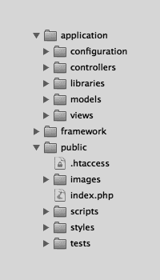

# 第 10 章 ■ 模型

```php
{

$model = new static();

return $model->_count($where);

}

protected function _count($where = array())

{

$query = $this

->connector

->query()

->from($this->table);

foreach ($where as $clause => $value)

{

$query->where($clause, $value);

}

return $query->count();

}

}

}
```

**与我无关！**

这正是我们可能开始陷入细节泥潭的节点。如果我们的模型能够识别关联表和连接类型，不仅能够查询单条记录，还能查询其他表中的所有关联记录，那将非常棒。我们当然可以编写所有这些代码，但对于理解 ORM 的概念，以及它如何融入我们的框架而言，这并不是必需的。

```markdown

确实，很多 ORM 库都实现了这样的代码，从而可以对相关的数据库数据进行极大的控制。我们可以决定在未来扩展模型库，甚至使用一个更大、功能更完整的 ORM 库，但我们现在拥有的已经能满足所有需求，没有必要现在就陷入细节。

### 问题

1.  模型只用于处理数据库吗？
2.  我们创建的 `Model` 类混合了实例方法和类方法来处理数据库行。为什么我们不统一使用实例方法或类方法来完成所有行的操作？

### 答案

1.  不！模型可以处理各种事情，例如连接到第三方 API 或修改文件系统信息。模型不等同于 ORM。
2.  有时，同时处理多行数据在语法上很有吸引力，例如从数据库中获取多行或删除多行。其他操作则涉及单行数据，例如 `INSERT` 或 `UPDATE` 查询。

[www.it-ebooks.info](http://www.it-ebooks.info/)

# 第 10 章 模型

### 练习

1.  `Model` 类为我们提供了一些有用的方法，使得数据库开发更容易。还有一些可以添加的便捷方法，例如一个根据给定的 `LIMIT` 和 `WHERE` 子句返回页数的方法。请尝试添加此方法。
2.  虽然我们可以使用 `Model` 的子类轻松地插入或更新数据库行，但我们无法验证这些数据。请尝试添加一些方法，这些方法可用于在创建 `INSERT` 或 `UPDATE` 查询之前检查数据的有效性。

[www.it-ebooks.info](http://www.it-ebooks.info/)

# 第 11 章 测试

到目前为止，我们已经编写了大量代码。这是一个成就，但如果我们的代码需要更改，它很快就会变成一种负担。对于像完整的 MVC 框架这样复杂的事物，您可以预期会有大量相互关联的代码。代码之间的关联性越强，即使我们的框架通过 MVC 实现了分离，代码更改破坏其他代码的可能性就越大。

想象一下，我们想要向 `Model` 类添加几个 ORM 方法。它们可能需要更改我们已经创建的方法，并可能微妙地改变已建立的功能。通常，这会导致应用程序中出现意外的故障。

或者想象一下，我们需要添加额外的配置或缓存驱动。理想的做法是，能够以一致的方式比较现有驱动和新驱动的功能，并且这种方式可以在未来添加更多驱动时重复使用。

解决方案是提供一组可重用的测试，可以定期运行这些测试，以确保我们的类继续以可预测的方式运行。

### 目标

*   我们需要构建一个简单的测试类。
*   我们需要设置覆盖我们已经创建的类的测试。

### 单元测试

单元测试是将一个大系统分解为可以与系统其余部分隔离测试的小部分的过程。测试一个完整的用户驱动的 Web 应用程序很困难，但测试单个数据库命令或评估单个模板标签则很容易。

单元测试，顾名思义，是一项永无止境的任务。编写的代码越多，就应该编写越多的单元测试。当你发现某个功能尚未被测试覆盖时，你应该创建该测试用例以便覆盖它。

### 测试类

在我们开始为代码库编写测试之前，需要创建一个简单的类来帮助组织测试并评估结果。清单 11-1 展示了这个 `Test` 类。

[www.it-ebooks.info](http://www.it-ebooks.info/)

# 第 11 章 测试

***清单 11-1.*** `Test` 类

```
namespace Framework
{

class Test
{

private static $_tests = array();

public static function add($callback, $title = "Unnamed Test", $set = "General")
{

self::$_tests[] = array(
"set" => $set,
"title" => $title,
"callback" => $callback
);

}

public static function run($before = null, $after = null)
{

if ($before)
{

$before($this->_tests);

}
```

```


```php
$passed = array();

$failed = array();

$exceptions = array();

foreach (self::$_tests as $test) {
    try {
        $result = call_user_func($test["callback"]);

        if ($result) {
            $passed[] = array(
                "set"   => $test["set"],
                "title" => $test["title"]
            );
        } else {
            $failed[] = array(
                "set"   => $test["set"],
                "title" => $test["title"]
            );
        }
    } catch (\Exception $e) {
        $exceptions[] = array(
            "set"   => $test["set"],
            "title" => $test["title"],
            "type"  => get_class($e)
        );
    }
}

if ($after) {
    $after($this->_tests);
}

return array(
    "passed"     => $passed,
    "failed"     => $failed,
    "exceptions" => $exceptions
);
```

这个类就是我们编写单元测试所需的一切。`add()` 方法接受一个 `$callback`（回调函数）、一个 `$title`（描述该测试）以及一个 `$set`（描述该测试所属的测试组）。这些测试存储在一个内部的 `$_tests` 数组中。

`run()` 方法会遍历这些测试并执行它们。如果测试通过，它会被添加到一个已通过测试的数组中。如果失败，它则会被添加到一个失败测试的数组中。如果在任一测试过程中发生了异常，该测试的标题/组/异常类型将被添加到一个异常数组中。当 `run()` 方法结束时，会返回这三个数组。`$before` 和 `$after` 参数指向可选提供的回调函数，它们将分别在测试之前和之后运行。

### 缓存

我们将首先测试 Cache 类。我们需要测试工厂功能，确保返回的是 `Memcached` 缓存驱动的一个有效实例。我们需要测试该驱动能否连接并断开与 Memcached 服务器的连接。

如果可以，我们将检查该驱动能否成功将数据发送到服务器，然后再将其读取回来。

我们还需要测试数据是否会在一定时间后过期，最后测试该驱动能否从 Memcached 服务器擦除之前存储的数据。

### 测试覆盖范围

我们应该创建覆盖以下需求的测试：

-   `Cache` 工厂类可以被创建。
-   `Cache\Driver\Memcached` 类可以初始化。
-   `Cache\Driver\Memcached` 类可以连接并返回自身。
-   `Cache\Driver\Memcached` 类可以断开连接并返回自身。
-   `Cache\Driver\Memcached` 类可以设置值并返回自身。
-   `Cache\Driver\Memcached` 类可以检索值。
-   `Cache\Driver\Memcached` 类可以返回默认值。
-   `Cache\Driver\Memcached` 类会遵循值的过期时间。
-   `Cache\Driver\Memcached` 类可以擦除值并返回自身。

### 测试

清单 11-2 中显示的初始缓存测试，测试了工厂类和初始化方法。

**清单 11-2.** 初始缓存测试

```php
Framework\Test::add(
    function() {
        $cache = new Framework\Cache();
        return ($cache instanceof Framework\Cache);
    },
    "Cache 在未初始化状态下实例化",
    "Cache"
);

Framework\Test::add(
    function() {
        $cache = new Framework\Cache(array(
            "type" => "memcached"
        ));
        $cache = $cache->initialize();
        return ($cache instanceof Framework\Cache\Driver\Memcached);
    },
    "Cache\Driver\Memcached 初始化",
    "Cache\Driver\Memcached"
);
```

虽然在我们的应用中只处理 `Cache` 这个类名，但它在调用 `initialize()` 时实际上返回的是驱动。我们现在需要检查该驱动能否连接/断开与正在运行的 Memcached 服务器的连接。清单 11-3 展示了我们如何实现这一点。你应该已经让 Memcached 在本地运行，并了解连接到一个正在运行的服务器所需的详细信息。

**清单 11-3.** 连接/断开与 Memcached 服务器的连接

```php
Framework\Test::add(
    function() {
        $cache = new Framework\Cache(array(
            "type" => "memcached"
        ));
        $cache = $cache->initialize();
        return ($cache->connect() instanceof Framework\Cache\Driver\Memcached);
    },
    "Cache\Driver\Memcached 连接并返回自身",
    "Cache\Driver\Memcached"
);

Framework\Test::add(
    function() {
        $cache = new Framework\Cache(array(
            "type" => "memcached"
        ));
        $cache = $cache->initialize();
```


```php
$cache = $cache->connect();
$cache = $cache->disconnect();

try {
    $cache->get("anything");
} catch (Framework\Cache\Exception\Service $e) {
    return ($cache instanceof Framework\Cache\Driver\Memcached);
}

return false;
```

如果这些测试通过，我们就可以测试剩余的 `Memcached` 类功能，如清单 11-4 所示。

**清单 11-4.** 对 Memcached 服务器进行读/写操作

```php
Framework\Test::add(
    function()
    {
        $cache = new Framework\Cache(array(
            "type" => "memcached"
        ));
        $cache = $cache->initialize();
        $cache = $cache->connect();
        return ($cache->set("foo", "bar", 1) instanceof
            Framework\Cache\Driver\Memcached);
    },
    "Cache\Driver\Memcached 设置值并返回自身",
    "Cache\Driver\Memcached"
);

Framework\Test::add(
    function()
    {
        $cache = new Framework\Cache(array(
            "type" => "memcached"
        ));
        $cache = $cache->initialize();
        $cache = $cache->connect();
        return ($cache->get("foo") == "bar");
    },
    "Cache\Driver\Memcached 检索值",
    "Cache\Driver\Memcached"
);

Framework\Test::add(
    function()
    {
        $cache = new Framework\Cache(array(
            "type" => "memcached"
        ));
        $cache = $cache->initialize();
        $cache = $cache->connect();
        return ($cache->get("404", "baz") == "baz");
    },
    "Cache\Driver\Memcached 返回默认值",
    "Cache\Driver\Memcached"
);

Framework\Test::add(
    function()
    {
        $cache = new Framework\Cache(array(
            "type" => "memcached"
        ));
        $cache = $cache->initialize();
        $cache = $cache->connect();
        // 我们睡眠 1 秒，以使上面那个 1 秒的缓存键/值失效
        sleep(1);
        return ($cache->get("foo") == null);
    },
    "Cache\Driver\Memcached 使值过期",
    "Cache\Driver\Memcached"
);

Framework\Test::add(
    function()
    {
        $cache = new Framework\Cache(array(
            "type" => "memcached"
        ));
        $cache = $cache->initialize();
        $cache = $cache->connect();
        $cache = $cache->set("hello", "world");
        $cache = $cache->erase("hello");
        return ($cache->get("hello") == null &&
            $cache instanceof Framework\Cache\Driver\Memcached);
    },
    "Cache\Driver\Memcached 擦除值并返回自身",
    "Cache\Driver\Memcached"
);
```

### 配置

接下来，我们将测试我们的配置类。我们将再次测试工厂功能，以确保返回一个有效的 `Ini` 缓存驱动实例。我们还将检查它是否能解析配置文件。最终的（解析后的）数据应当与我们的配置文件的层级结构保持一致。

### 测试覆盖

我们应该创建覆盖以下需求的测试：

- `Configuration` 工厂类能够被创建。
- `Configuration\Driver\Ini` 类能够初始化。
- `Configuration\Driver\Ini` 类能够 `parse()` 一个配置文件。

### 测试

如清单 11-5 所示，最初的配置测试用于测试工厂类和初始化方法。

**清单 11-5.** 初始配置测试

```php
Framework\Test::add(
    function()
    {
        $configuration = new Framework\Configuration();
        return ($configuration instanceof Framework\Configuration);
    },
    "配置在未初始化状态下实例化",
    "Configuration"
);

Framework\Test::add(
    function()
    {
        $configuration = new Framework\Configuration(array(
            "type" => "ini"
        ));
        $configuration = $configuration->initialize();
        return ($configuration instanceof
            Framework\Configuration\Driver\Ini);
    },
    "Configuration\Driver\Ini 初始化",
    "Configuration\Driver\Ini"
);
```

现在我们需要检查驱动是否能解析一个 INI 配置文件，并且最终的数据是否符合正确的层级结构，如清单 11-6 所示。

**清单 11-6.** 解析配置文件

```php
Framework\Test::add(
    function()
    {
        $configuration = new Framework\Configuration(array(
            "type" => "ini"
        ));
        $configuration = $configuration->initialize();
        $parsed = $configuration->parse("_configuration");
        return ($parsed->config->first == "hello" &&
            $parsed->config->second->second == "bar");
    },
    "Configuration\Driver\Ini 解析配置文件",
);
```


“`配置\驱动\Ini`”

### 数据库

数据库测试要复杂得多。我们进行常规的工厂类测试，还需要考虑在第 9 章中探讨的连接器/查询概念。查询类也包含许多需要测试的方法。

### 测试覆盖范围

我们应创建覆盖以下需求的测试：

-   `Database` 工厂类可以被创建。
-   `Database\Connector\Mysql` 类可以初始化。
-   `Database\Connector\Mysql` 类可以连接并返回自身。
-   `Database\Connector\Mysql` 类可以断开连接并返回自身。
-   `Database\Connector\Mysql` 类可以转义值。
-   `Database\Connector\Mysql` 类可以执行 SQL 查询。
-   `Database\Connector\Mysql` 类可以返回最后插入的 ID。
-   `Database\Connector\Mysql` 类可以返回受影响的行数。
-   `Database\Connector\Mysql` 类可以返回最后的 SQL 错误。
-   `Database\Connector\Mysql` 类可以返回一个 `Database\Connector\Mysql` 实例。
-   `Database\Query\Mysql` 类引用了一个连接器。
-   `Database\Query\Mysql` 类可以获取表中的第一行。
-   `Database\Query\Mysql` 类可以获取表中的多行。
-   `Database\Query\Mysql` 类可以使用 `limit`、`offset`、`order` 和 `direction`。
-   `Database\Query\Mysql` 类可以获取表中的行数。
-   `Database\Query\Mysql` 类可以使用多个 `WHERE` 子句。
-   `Database\Query\Mysql` 类可以指定字段并为其设置别名。
-   `Database\Query\Mysql` 类可以连接表并为连接字段设置别名。
-   `Database\Query\Mysql` 类可以插入行。
-   `Database\Query\Mysql` 类可以更新行。
-   `Database\Query\Mysql` 类可以删除行。

### 测试

最初的数据库测试，如清单 11-7 所示，也测试了工厂类和初始化方法。

**清单 11-7.** 初始数据库测试

```
$options = array(

"type" => "mysql",

"options" => array(

"host" => "localhost",

"username" => "prophpmvc",

"password" => "prophpmvc",

"schema" => "prophpmvc"

)

);

Framework\Test::add(

function()

{

$database = new Framework\Database();

return ($database instanceof Framework\Database);

},

"Database 实例化于未初始化状态",

"Database"

);

Framework\Test::add(

function() use ($options)

{

$database = new Framework\Database($options);

$database = $database->initialize();

return ($database instanceof Framework\Database\Connector\Mysql);

},

"Database\Connector\Mysql 初始化",

"Database\Connector\Mysql"

);
```

现在我们需要检查驱动能否连接/断开正在运行的 MySQL 服务器。清单 11-8 展示了我们如何实现这一点。你应该已经在本地运行了 MySQL，或者有连接至一个正在运行的服务器的详细信息。

**清单 11-8.** 连接、断开连接与数据清洗

```
Framework\Test::add(

function() use ($options)

{

$database = new Framework\Database($options);

$database = $database->initialize();

$database = $database->connect();

return ($database instanceof Framework\Database\Connector\Mysql);

},

"Database\Connector\Mysql 连接并返回自身",

"Database\Connector\Mysql"

);

Framework\Test::add(

function() use ($options)

{

$database = new Framework\Database($options);

$database = $database->initialize();

$database = $database->connect();

$database = $database->disconnect();

try

{

$database->execute("SELECT 1");

}

catch (Framework\Database\Exception\Service $e)

{

return ($database instanceof Framework\Database\Connector\Mysql);

}

return false;

},

"Database\Connector\Mysql 断开连接并返回自身",

"Database\Connector\Mysql"

);

Framework\Test::add(

function() use ($options)

{

$database = new Framework\Database($options);

$database = $database->initialize();

$database = $database->connect();

return ($database->escape("foo'".'bar"') == "foo\\'bar\\\"");

},

"Database\Connector\Mysql 转义值",

"Database\Connector\Mysql"

);
```


  
这些测试与我们为缓存驱动创建的测试类似，但它们的测试目标是 `MySQL` 驱动的一个实例。`connect()` / `disconnect()` 方法很简单，我们之前已经见过类似的。然而，`escape()` 方法是新的。在处理数据库时，我们需要保护其中存储的信息，使其免受 SQL 注入攻击。SQL 注入（通常还有错误数据）是导致应用程序不稳定和安全漏洞的首要原因。

这些问题最常发生在数据不符合正确的数据类型，或试图在另一个查询的正文中执行数据库查询时。我们可以通过在查询中对传递给数据库的参数进行转义来避免这种情况。这就是 `escape()` 方法的目的。

接下来，我们需要测试驱动（连接器）是否能够执行 SQL 查询，以及在执行这些查询后是否能返回正确的元数据。清单 11-9 展示了我们是如何进行测试的。

**清单 11-9.** 执行 SQL 并返回元数据

```
Framework\Test::add(

    function() use ($options)

    {

        $database = new Framework\Database($options);

        $database = $database->initialize();

        $database = $database->connect();

        $database->execute("

            SOME INVALID SQL

        ");

        return (bool) $database->lastError;

    },

    "Database\Connector\Mysql returns last error",

    "Database\Connector\Mysql"

);

Framework\Test::add(

    function() use ($options)

    {

        $database = new Framework\Database($options);

        $database = $database->initialize();

        $database = $database->connect();

        $database->execute("

            DROP TABLE IF EXISTS 'tests';

        ");

        $database->execute("

            CREATE TABLE 'tests' (

                'id' int(11) NOT NULL AUTO_INCREMENT,

                'number' int(11) NOT NULL,

                'text' varchar(255) NOT NULL,

                'boolean' tinyint(4) NOT NULL,

                PRIMARY KEY ('id')

            ) ENGINE=InnoDB DEFAULT CHARSET=utf8;

        ");

        return !$database->lastError;

    },

    "Database\Connector\Mysql executes queries",

    "Database\Connector\Mysql"

);

Framework\Test::add(

    function() use ($options)

    {

        $database = new Framework\Database($options);

        $database = $database->initialize();

        $database = $database->connect();

        for ($i = 0; $i < 4; $i++)

        {

            $database->execute("

                INSERT INTO 'tests' ('number', 'text', 'boolean') VALUES

                ('1337', 'text', '0');

            ");

        }

        return $database->lastInsertId;

    },

    "Database\Connector\Mysql returns last inserted ID",

    "Database\Connector\Mysql"

);

Framework\Test::add(

    function() use ($options)

    {

        $database = new Framework\Database($options);

        $database = $database->initialize();

        $database = $database->connect();

        $database->execute("

            UPDATE 'tests' SET 'number' = 1338;

        ");

        return $database->affectedRows;

    },

    "Database\Connector\Mysql returns affected rows",

    "Database\Connector\Mysql"

);
```

前两个测试删除并创建了一个测试表，然后插入了一些行。这些都是基本的 SQL 命令，测试也相对简单。第三个测试检查是否返回了最后插入的 ID，第四个测试检查是否返回了最后一条错误消息。

由于我们同时处理连接器和查询，因此需要检查两者之间的关联，如清单 11-10 所示。

**清单 11-10.** 返回具有正确引用的查询

```
Framework\Test::add(

    function() use ($options)

    {

        $database = new Framework\Database($options);

        $database = $database->initialize();

        $database = $database->connect();

        $query = $database->query();

        return ($query instanceof Framework\Database\Query\Mysql);

    },

    "Database\Connector\Mysql returns instance of Database\Query\Mysql",

    "Database\Query\Mysql"

);

Framework\Test::add(

    function() use ($options)

    {

        $database = new Framework\Database($options);

        $database = $database->initialize();

        $database = $database->connect();

        $query = $database->query();

        return ($query->connector instanceof

            Framework\Database\Connector\Mysql);

    },

    "Database\Query\Mysql references connector",

    "Database\Query\Mysql"

);
```


接下来，我们需要测试查询类能否返回刚插入的行，以及能否返回正确的行数。清单 11-11 演示了如何实现这一目标。

***清单 11-11.*** 获取行/计数

```
Framework\Test::add(
    function() use ($options)
    {
        $database = new Framework\Database($options);
        $database = $database->initialize();
        $database = $database->connect();
        $row = $database->query()
            ->from("tests")
            ->first();
        return ($row["id"] == 1);
    },
    "Database\Query\Mysql fetches first row",
    "Database\Query\Mysql"
);

Framework\Test::add(
    function() use ($options)
    {
        $database = new Framework\Database($options);
        $database = $database->initialize();
        $database = $database->connect();
        $rows = $database->query()
            ->from("tests")
            ->all();
        return (sizeof($rows) == 4);
    },
    "Database\Query\Mysql fetches multiple rows",
    "Database\Query\Mysql"
);
```

```
Framework\Test::add(
    function() use ($options)
    {
        $database = new Framework\Database($options);
        $database = $database->initialize();
        $database = $database->connect();
        $count = $database->query()
            ->from("tests")
            ->count();
        return ($count == 4);
    },
    "Database\Query\Mysql fetches number of rows",
    "Database\Query\Mysql"
);
```

我们还需要测试添加到 `Query` 类中的便捷方法，如清单 11-12 所示。

***清单 11-12.*** 查询便捷方法

```
Framework\Test::add(
    function() use ($options)
    {
        $database = new Framework\Database($options);
        $database = $database->initialize();
        $database = $database->connect();
        $rows = $database->query()
            ->from("tests")
            ->limit(1, 2)
            ->order("id", "desc")
            ->all();
        return (sizeof($rows) == 1 && $rows[0]["id"] == 3);
    },
    "Database\Query\Mysql accepts LIMIT, OFFSET, ORDER and DIRECTION clauses",
    "Database\Query\Mysql"
);

Framework\Test::add(
    function() use ($options)
    {
        $database = new Framework\Database($options);
        $database = $database->initialize();
        $database = $database->connect();
        $rows = $database->query()
            ->from("tests")
            ->where("id != ?", 1)
            ->where("id != ?", 3)
            ->where("id != ?", 4)
            ->all();
        return (sizeof($rows) == 1 && $rows[0]["id"] == 2);
    },
    "Database\Query\Mysql accepts WHERE clauses",
    "Database\Query\Mysql"
);

Framework\Test::add(
    function() use ($options)
    {
        $database = new Framework\Database($options);
        $database = $database->initialize();
        $database = $database->connect();
        $rows = $database->query()
            ->from("tests", array(
                "id" => "foo"
            ))
            ->all();
        return (sizeof($rows) && isset($rows[0]["foo"]) && $rows[0]["foo"] == 1);
    },
    "Database\Query\Mysql can alias fields",
    "Database\Query\Mysql"
);

Framework\Test::add(
    function() use ($options)
    {
        $database = new Framework\Database($options);
        $database = $database->initialize();
        $database = $database->connect();
        $rows = $database->query()
            ->from("tests", array(
                "tests.id" => "foo"
            ))
            ->join("tests AS baz", "tests.id = baz.id", array(
                "baz.id" => "bar"
            ))
            ->all();
        return (sizeof($rows) && $rows[0]->foo == $rows[0]->bar);
    },
    "Database\Query\Mysql can join tables and alias joined fields",
    "Database\Query\Mysql"
);
```

最后，我们需要测试负责修改行的方法。行通常是从数据库表中插入、更新和删除的，我们为这三种操作都提供了相应的方法，如清单 11-13 所示。

***清单 11-13.*** 修改行

```
Framework\Test::add(
    function() use ($options)
    {
        $database = new Framework\Database($options);
        $database = $database->initialize();
        $database = $database->connect();
        $result = $database->query()
            ->from("tests")
            ->save(array(
                "number" => 3,
                "text" => "foo",
                "boolean" => true
            ));
        return ($result == 5);
    },
    "Database\Query\Mysql can insert rows",
    "Database\Query\Mysql"
);

Framework\Test::add(
    function() use ($options)
    {
        $database = new Framework\Database($options);
        $database = $database->initialize();
        $database = $database->connect();
        $result = $database->query()
            ->from("tests")
            ->where("id = ?", 5)
            ->save(array(
                "number" => 3,
                "text" => "foo",
                "boolean" => false
            ));
    },
    "Database\Query\Mysql can update rows",
    "Database\Query\Mysql"
);
```


```php
return ($result == 0);
```

```php
"Database\Query\Mysql can update rows",
"Database\Query\Mysql"
);

Framework\Test::add(
    function() use ($options)
    {
        $database = new Framework\Database($options);
        $database = $database->initialize();
        $database = $database->connect();
        $database->query()
            ->from("tests")
            ->delete();
        return ($database->query()->from("tests")->count() == 0);
    },
    "Database\Query\Mysql can delete rows",
    "Database\Query\Mysql"
);
```

### 测试

考虑一下我们创建的用于插入/更新行的数据库方法。如果提供了 `WHERE` 子句，数据库将尝试更新一行。如果没有 `WHERE` 条件，则会插入一行。调用 `delete()` 方法将删除匹配 `WHERE` 条件的行，如果没有条件则删除所有行。

### Model

由于我们选择创建一个 ORM 并将其存储在 `Model` 类中，因此大多数模型测试都涉及 ORM 方法。`Model` 类不是一个工厂，所以我们不需要那些测试，只需要创建一组简单的模型测试。

我们需要测试模型结构是否正确地同步到数据库。我们需要测试是否可以从数据库插入、更新和删除行。我们还要测试是否可以从数据库返回匹配 `WHERE` 条件的行。

### 覆盖范围

我们应该创建覆盖以下需求的测试：

- `Model` 类与数据库同步。
- `Model` 类可以插入行。
- `Model` 类可以获取行数。
- `Model` 类可以多次保存一行。
- `Model` 类可以更新行。
- `Model` 类可以删除行。

### 测试

首先，我们需要定义一个模型以同步到数据库，如清单 11-14 所示。它遵循我们在第 10 章中学习的相同格式。

***清单 11-14.*** 将模型同步到数据库

```php
$database = new Framework\Database(array(
    "type" => "mysql",
    "options" => array(
        "host" => "localhost",
        "username" => "prophpmvc",
        "password" => "prophpmvc",
        "schema" => "prophpmvc"
    )
));
$database = $database->initialize();
$database = $database->connect();
Framework\Registry::set("database", $database);

class Example extends Framework\Model
{
    /**
     * @readwrite
     * @column
     * @type autonumber
     * @primary
     */
    protected $_id;

    /**
     * @readwrite
     * @column
     * @type text
     * @length 32
     */
    protected $_name;

    /**
     * @readwrite
     * @column
     * @type datetime
     */
    protected $_created;
}

Framework\Test::add(
    function() use ($database)
    {
        $example = new Example();
        return ($database->sync($example) instanceof Framework\Database\Connector\Mysql);
    },
    "Model syncs",
    "Model"
);
```

第一个测试将此模型同步到数据库。有了正确的表结构，我们就可以开始插入行，如清单 11-15 所示。

***清单 11-15.*** 插入行并返回数据库中的行

```php
Framework\Test::add(
    function() use ($database)
    {
        $example = new Example(array(
            "name" => "foo",
            "created" => date("Y-m-d H:i:s")
        ));
        return ($example->save() > 0);
    },
    "Model inserts rows",
    "Model"
);

Framework\Test::add(
    function() use ($database)
    {
        return (Example::count() == 1);
    },
    "Model fetches number of rows",
    "Model"
);
```

向数据库插入行是一个简单的检查，我们同时也测试了 `count()` 方法作为对插入行为的双重检查。最后几个测试需要检查更新/删除行为，如清单 11-16 所示。

***清单 11-16.*** 更新/删除行

```php
Framework\Test::add(
    function() use ($database)
    {
        $example = new Example(array(
            "name" => "foo",
            "created" => date("Y-m-d H:i:s")
        ));
        $example->save();
        $example->save();
        $example->save();
        return (Example::count() == 2);
    },
    "Model saves single row multiple times",
    "Model"
);

Framework\Test::add(
    function() use ($database)
    {
        $example = new Example(array(
            "id" => 1,
            "name" => "hello",
            "created" => date("Y-m-d H:i:s")
        ));
        $example->save();
        return (Example::first()->name == "hello");
    },
    "Model updates rows",
    "Model"
);

Framework\Test::add(
    function() use ($database)
    {
```


```php
$example = new Example(array(
    "id" => 2
));
$example->delete();
return (Example::count() == 1);
```

[www.it-ebooks.info](http://www.it-ebooks.info/)

第 11 章 ■ 测试

### 模板

测试我们创建的模板解析器，实际上就是测试各个独立的模板标签。这是因为模板解析器虽然是一段复杂的代码，但它执行的任务相对简单。

我们需要测试每个常见的模板标签，确保它们在提供数据时都能返回正确的输出。

### 覆盖率

我们应该创建覆盖以下需求的测试：

-   可以创建`Template`类。
-   `Template`类可以解析 echo 标签。
-   `Template`类可以解析 script 标签。
-   `Template`类可以解析 foreach 标签。
-   `Template`类可以解析 for 标签。
-   `Template`类可以解析 if、else 和 elseif 标签。
-   `Template`类可以解析 macro 标签。
-   `Template`类可以解析 literal 标签。

### 测试

这些模板解析器测试并没有什么特别棘手的地方，你可以在代码清单 11-17 中看到。它们都针对特定的模板标签，并确保输出符合该标签使用时的预期结果。

**代码清单 11-17.** 测试模板标签

```php
$template = new Framework\Template(array(
    "implementation" => new Framework\Template\Implementation\Standard()
));

Framework\Test::add(
    function() use ($template)
    {
        return ($template instanceof Framework\Template);
    },
    "Template 实例化",
    "Template"
);

Framework\Test::add(
    function() use ($template)
    {
        $template->parse("{echo 'hello world'}");
        $processed = $template->process();
        return ($processed == "hello world");
    },
    "Template 解析 echo 标签",
    "Template"
);

Framework\Test::add(
    function() use ($template)
    {
        $template->parse("{script \$_text[] = 'foo bar' }");
        $processed = $template->process();
        return ($processed == "foo bar");
    },
    "Template 解析 script 标签",
    "Template"
);

Framework\Test::add(
    function() use ($template)
    {
        $template->parse("{foreach \$number in \$numbers}{echo \$number_i},{echo \$number},{/foreach}");
        $processed = $template->process(array(
            "numbers" => array(1, 2, 3)
        ));
        return (trim($processed) == "0,1,1,2,2,3,");
    },
    "Template 解析 foreach 标签",
    "Template"
);

Framework\Test::add(
    function() use ($template)
    {
        $template->parse("{for \$number in \$numbers}{echo \$number_i},{echo \$number},{/for}");
        $processed = $template->process(array(
            "numbers" => array(1, 2, 3)
        ));
        return (trim($processed) == "0,1,1,2,2,3,");
    },
    "Template 解析 for 标签",
    "Template"
);

Framework\Test::add(
    function() use ($template)
    {
        $template->parse("{if \$check == \"yes\"}yes{/if}{elseif \$check == \"maybe\"}yes{/elseif}{else}yes{/else}");
        $yes = $template->process(array(
            "check" => "yes"
        ));
        $maybe = $template->process(array(
            "check" => "maybe"
        ));
        $no = $template->process(array(
            "check" => null
        ));
        return ($yes == $maybe && $maybe == $no);
    },
    "Template 解析 if、else 和 elseif 标签",
    "Template"
);

Framework\Test::add(
    function() use ($template)
    {
        $template->parse("{macro foo(\$number)}{echo \$number + 2}{/macro}{echo foo(2)}");
        $processed = $template->process();
        return ($processed == 4);
    },
    "Template 解析 macro 标签",
    "Template"
);

Framework\Test::add(
    function() use ($template)
    {
        $template->parse("{literal}{echo \"hello world\"}{/literal}");
        $processed = $template->process();
        return (trim($processed) == "{echo \"hello world\"}");
    },
    "Template 解析 literal 标签",
    "Template"
);
```

[www.it-ebooks.info](http://www.it-ebooks.info/)

第 11 章 ■ 测试

## 神圣的代码，蝙蝠侠！

测试的好处之一，除了能可靠地确保代码持续工作外，还在于它们能帮助我们识别代码中的不足，以及如何更好地使用我们所测试的各个部分。

我花了几个小时编写这些测试，并不是因为它们有多复杂，而是因为测试揭示了许多我可以修复的 bug，以及我能在前面章节的代码中做出的改进。


### 问题

1. 我们创建的单元测试似乎重复了大量代码。`Database`和`Model`类的单元测试尤其如此。为什么这种做法是必要的？

2. 这类测试应该在编写被测试类的同时编写，还是在它们完成之后编写？

### 答案

1. 我们的测试发生在框架所支持的 MVC 结构之外的原因，与我们在单个单元测试中重复代码的原因相同。测试对外部变量的依赖越少，就越能准确地指出单元测试所覆盖的类中出现的破坏性变更。

2. 决定编写这些测试的时机远没有从一开始就拥有它们重要。忘记或忽视对代码进行单元测试是很容易陷入的陷阱。在编写被测试类的同时编写测试，或者在此之后编写，两者几乎没有区别。

### 练习

1. 我们已经为框架中最大的类库创建了测试。现在尝试覆盖一些较小的类库，比如`Registry`、`StringMethods`或`ArrayMethods`类。

2. 我们创建的`Test`类是一个运行单元测试的好工具，但它不处理任何输出格式化。尝试整理一份关于通过的测试以及失败的或引发异常的测试的清晰概览。

[www.it-ebooks.info](http://www.it-ebooks.info/)

## 第 12 章

## 结构

现在我们开始走出理论的领域，进入实际应用。到目前为止，我们在一些示例中使用了社交网络的概念，现在我们将构建一个真实的社交网络。

为了更好地规划我们的应用程序，我们需要审视大多数社交网络的共同特征。首先便是用户资料的概念。用户资料包含一些关于所属用户的信息，例如他们的爱好或原籍国。根据社交网络的侧重点，这些信息可以是任何内容，从工作经历和资质，到之前的度假目的地和最喜爱的乐队。

社交网络也是分享的平台——照片、音乐曲目和视频的链接可以轻松分享。如果你有什么值得炫耀的东西，或者想知道朋友在看什么，社交网络就是最佳去处。

这些网络可能有所不同的最后一个领域，是它们如何管理用户及其分享的信息。非常排外的社交网络可能会限制用户分享的内容种类，而其他网络则允许用户分享（并查看）任何内容！

### 目标

-   我们需要构建用户注册、登录、更新设置和查看个人资料的页面/操作。
-   用户应该能够查看其他用户的资料，并与他们成为好友。
-   用户应该能够分享状态消息和照片，上传自己的照片，并通过多种不同字段搜索用户。
-   应该有一个管理界面，系统管理员可以通过它审查和/或修改存储在数据库中的信息。

我们的应用程序需要存储相当多的用户相关数据，这非常适合于测试我们的数据库/ORM 代码。它还需要相当多的视图，这将使我们能够测试（并扩展）我们的模板解析器。照片分享功能使我们能够接入第三方图像编辑库，而链接分享和好友功能则使我们能够连接到第三方网络服务。

### 数据库

我们可以将社交网络的数据库表示如图 12-1 所示。用户可以拥有多个好友（本质上就是其他用户）。他们可以拥有多张照片，然后可以与好友分享这些照片。链接和状态消息也可以与好友分享。可以根据用户交互添加/删除好友，用户也可以将照片、分享的链接和其他用户举报为不适当内容。

[www.it-ebooks.info](http://www.it-ebooks.info/)



第 12 章 ■ 结构

用户

好友

照片

状态消息 +

分享的链接/照片

**图 12-1.** 数据结构


好的，遵照您的指示，以下是翻译后的中文文本。


### 用户与内容管理

所有用户和内容都可以通过管理界面进行管理，这需要对有效的管理员用户账户进行身份验证。我们将根据需要创建各个模型结构。

### 文件夹

我们需要为应用程序建立文件夹结构，以便文件存储在可预测的位置。我们已经将框架本身放置在同名文件夹中，但应用程序的其余部分应遵循图 12-2 所示整洁的组织模式。

***Figure 12-2.** 文件夹结构*

`application`文件夹将存放所有内容，从框架代码到应用程序代码。我们创建的 HTML 视图将保存在`views`文件夹中，而任何第三方库将保存在`libraries`文件夹中。

`configuration`文件夹将存放应用程序类的配置文件，而`model`和`controller`文件将分别存放在各自的文件夹中。

`public`文件夹将存放所有可公开访问的文件，这些文件不会在应用程序执行过程中直接加载。这包括图片、JavaScript 文件和层叠样式表。

一个有趣的现象是，我们的应用程序测试存放在`public`文件夹中。这样做的目的是将测试与框架和应用程序代码库完全分离。我们的测试最终将使用框架代码并测试框架/应用程序代码，但保持这些方面（测试、框架和应用程序）的分离非常重要。

### 问题

1. 我们已经为社交网络中的数据库表/数据对象定义了粗略的结构。在开始编码之前规划数据结构有什么意义？

2. 我们使用的文件夹结构在很大程度上取决于所构建的应用程序类型。既然这种结构对于每个新应用程序都可能发生不同程度的变化，为什么我们还需要决定它？

### 答案

1. 花在规划应用程序上的时间越多，开发过程就会越顺利。这在 MVC 应用程序中尤为明显。当应用程序使用数据库时，我们不仅仅是使用 PHP 查询数据库；我们是在构建模型并与数据库交互，就像对待其他类一样。我们需要事先知道这些类应该是什么样子。

2. 文件夹结构在两个领域很重要。第一，它保持一切整洁有序。第二，我们可以快速找到所需内容。无论是查找模型、控制器还是第三方库，通过理解文件夹结构，我们都能快速定位。

