# 第 23 章 ■ CodeIgniter：MVC

```php
// 创建新用户并保存
$user = new User(array(
    "first"    => $this->input->post("first"),
    "last"     => $this->input->post("last"),
    "email"    => $this->input->post("email"),
    "password" => $this->input->post("password")
));
$user->save();

// 在视图中标记成功
$success = true;
}
}

// 加载视图
$this->load->view("users/register", array(
    "success" => $success
));
}
}
```

### 清单 23-7. `application/views/users/register.php`

### 注册

```php
<?php if ($success): ?>

您的账户已创建！

<?php else: ?>

<form method = "post" enctype = "multipart/form-data">

<ol>

<li>

<label>

名字：

<input type = "text" name = "first" />

<?php echo form_error("first"); ?>

</label>

</li>

<li>

<label>

姓氏：

<input type = "text" name = "last" />

<?php echo form_error("last"); ?>

</label>

</li>

<li>

<label>

电子邮件：

<input type = "text" name = "email" />

<?php echo form_error("email"); ?>

</label>

</li>

<li>

<label>

密码：

<input type = "password" name = "password" />

<?php echo form_error("password"); ?>

</label>

</li>

<li>

<input type = "submit" name = "save" value = "注册" />

</li>

</ol>

</form>

<?php endif; ?>
```

我们通过加载 `form_validation` 库来开始 `register()` 方法。接下来，我们检查 `save` 按钮是否被点击，并为提交的字段数据定义验证规则。如果验证成功，我们创建一个新的 `User` 对象，并用提交的数据填充它。最后，我们保存 `User` 对象，并向加载的视图指示成功。视图模板包含了之前注册视图模板的所有内容，同时使用 CodeIgniter 的等效方法来显示验证错误。

下一个需要实现的操作和视图是登录，如清单 23-8 和 23-9 所示。

### 清单 23-8. `application/controllers/users.php`（节选）

```php
class Users extends CI_Controller
{
    public function login()
    {
        $errors = null;

        // 加载验证库
        $this->load->library("form_validation");

        // 如果表单已提交
        if ($this->input->post("login"))
        {
            // 初始化验证规则
            $this->form_validation->set_rules(array(
                array(
                    "field" => "email",
                    "label" => "电子邮件",
                    "rules" => "required|max_length[100]"
                ),
                array(
                    "field" => "password",
                    "label" => "密码",
                    "rules" => "required|min_length[8]|max_length[32]"
                )
            ));

            // 加载用户模型
            $this->load->model("user");

            // 创建新用户 + 保存
            $user = User::first(array(
                "email" => $this->input->post("email"),
                "password" => $this->input->post("password"),
                "live" => 1,
                "deleted" => 0
            ));

            // 如果表单数据通过验证...
            if ($user && $this->form_validation->run())
            {
                // 加载会话库
                $this->load->library("session");

                // 将用户 ID 保存到会话中
                $this->session->set_userdata("user", $user->id);

                // 重定向到个人资料页面
                self::redirect("/profile");
            }
            else
            {
                // 指示错误
                $errors = "电子邮件地址和/或密码不正确";
            }
        }

        // 加载视图
        $this->load->view("users/login", array(
            "errors" => $errors
        ));
    }
}
```

### 清单 23-9. `application/views/users/login.php`

### 登录

```php
<form method = "post">
<ol>

<li>

<label>

电子邮件：

<input type = "text" name = "email" />

</label>

</li>

<li>

<label>

密码：

<input type = "password" name = "password" />

<?php if ($errors): ?><?php echo $errors; ?><?php endif; ?>

</label>

</li>

<li>

<input type = "submit" name = "login" value = "登录" />

</li>

</ol>

</form>
```

`login()` 方法的工作方式与 `register()` 方法类似，区别在于，我们不是将用户行保存到数据库，而是从数据库中检索与提交的表单数据相对应的用户行，并将用户 ID 存储在会话中。最后，登录成功后，我们重定向到个人资料页面。

接下来，我们将实现 `logout()` 和 `profile()` 方法以及个人资料视图模板，如清单 23-10 和 23-11 所示。

### 清单 23-10. `application/controllers/users.php`（节选）

```php
class Users extends CI_Controller
{
    public function logout()
    {
        // 加载会话库
        $this->load->library("session");
        // 移除用户 ID
        $this->session->unset_userdata("user");
        // 重定向到登录页面
        self::redirect("/login");
    }

    public function profile()
    {
        // 检查用户会话
        $this->_isSecure();
        // 加载视图
        $this->load->view("users/profile", array(
            "user" => $this->user
        ));
    }
}
```

### 清单 23-11. `application/views/users/profile.php`

```php
<h1 > <?php echo $user-> first; ? > <?php echo $user-> last; ? > </h1> This is a profile page!
```

`logout()` 动作仅会从会话中移除用户 ID，而 `profile` 动作则会加载用户会话，并将其传递给已加载的视图。`profile` 视图与我们之前使用的 `profile` 视图非常相似，同样采用了与模板标签相对应的 PHP 方法。

最后两个动作及其视图涉及用户设置与搜索功能，将在代码清单 23-12 至 23-14 中展示。

[www.it-ebooks.info](http://www.it-ebooks.info/)

## 第 23 章 ■ CodeIgniter: MVC

### 清单 23-12. `application/controllers/users.php`（摘录）

```php
class Users extends CI_Controller
{
    public function settings()
    {
        $success = false;
        // 检查用户会话
        $this-> _isSecure();
        // 加载验证库
        $this-> load-> library("form_validation");
        // 如果表单已提交
        if ($this-> input-> post("save"))
        {
            // 初始化验证规则
            $this-> form_validation-> set_rules(array(
                array(
                    "field" = > "first",
                    "label" = > "First",
                    "rules" = > "required|alpha|min_length[3]|max_length[32]"
                ),
                array(
                    "field" = > "last",
                    "label" = > "Last",
                    "rules" = > "required|alpha|min_length[3]|max_length[32]"
                ),
                array(
                    "field" = > "email",
                    "label" = > "Email",
                    "rules" = > "required|max_length[100]"
                ),
                array(
                    "field" = > "password",
                    "label" = > "Password",
                    "rules" = > "required|min_length[8]|max_length[32]"
                )
            ));
            // 如果表单数据通过验证...
            if ($this-> form_validation-> run())
            {
                // 更新用户
                $this-> user-> first = $this-> input-> post("first");
                $this-> user-> last = $this-> input-> post("last");
                $this-> user-> email = $this-> input-> post("email");
                $this-> user-> password = $this-> input-> post("password");
                $this-> user-> save();
                // 在视图中指示成功
                $success = true;
            }
        }
        // 加载视图
        $this-> load-> view("users/settings", array(
            "success" => $success,
            "user" => $this-> user
        ));
    }

    public function search()
    {
        // 获取提交的数据
        $query = $this-> input-> post("query");
        $order = $this-> input-> post("order");
        $direction = $this-> input-> post("direction");
        $page = $this-> input-> post("page");
        $limit = $this-> input-> post("limit");
        // 默认空值
        $order = $order ? $order : "modified";
        $direction = $direction ? $direction : "desc";
        $limit = $limit ? $limit : 10;
        $page = $page ? $page : 1;
        $count = 0;
        $users = null;
        if ($this-> input-> post("search"))
        {
            $where = array(
                "first" = > $query,
                "live" = > 1,
                "deleted" = > 0
            );
            $fields = array(
```


```php
"id", "first", "last"

);

// 加载用户模型

$this->load->model("user");

// 获取计数及结果

$count = User::count($where);

$users = User::all(

    $where,

    $fields,

    $order,

    $direction,

    $limit,

    $page

);

}

// 加载视图

$this->load->view("users/search", array(

    "query" => $query,

    "order" => $order,

    "direction" => $direction,

    "page" => $page,

    "limit" => $limit,

    "count" => $count,

    "users" => $users

));

}

}
```

***代码清单 23-13.*** `application/views/users/settings.php`

```php
<h1>Settings</h1>

<?php if ($success): ?>

    Your account has been updated!

<?php else: ?>

    <form method="post" enctype="multipart/form-data">

        <ol>

            <li>

                <label>

                    First name:

                    <input type="text" name="first" value="<?php echo $user->first; ?>" />

                    <?php echo form_error("first"); ?>

                </label>

            </li>

            <li>

                <label>

                    Last name:

                    <input type="text" name="last" value="<?php echo $user->last; ?>" />

                    <?php echo form_error("last"); ?>

                </label>

            </li>

            <li>

                <label>

                    Email:

                    <input type="text" name="email" value="<?php echo $user->email; ?>" />

                    <?php echo form_error("email"); ?>

                </label>

            </li>

            <li>

                <label>

                    Password:

                    <input type="password" name="password" value="<?php echo $user->password; ?>" />

                    <?php echo form_error("password"); ?>

                </label>

            </li>

            <li>

                <input type="submit" name="save" value="save" />

            </li>

        </ol>

    </form>

<?php endif; ?>
```

***代码清单 23-14.*** `application/views/users/search.php`

### 搜索

```html
<form method="post">

<ol>

<li>

<label>

查询：

<input type="text" name="query" value="<?php echo $query; ?>" />

</label>

</li>

<li>

<label>

排序方式：

<select name="order">

<option <?php if ($order == "created"): ?> selected="selected" <?php endif; ?> value="created">创建时间</option>

<option <?php if ($order == "modified"): ?> selected="selected" <?php endif; ?> value="modified">修改时间</option>

<option <?php if ($order == "first"): ?> selected="selected" <?php endif; ?> value="first">名</option>

<option <?php if ($order == "last"): ?> selected="selected" <?php endif; ?> value="last">姓</option>

</select>

</label>

</li>

<li>

<label>

排序方向：

<select name="direction">

<option <?php if ($direction == "asc"): ?> selected="selected" <?php endif; ?> value="asc">升序</option>

<option <?php if ($direction == "desc"): ?> selected="selected" <?php endif; ?> value="desc">降序</option>

</select>

</label>

</li>

<li>

<label>

页码：

<select name="page">

<?php if ($count == 0): ?>

<option value="1">1</option>

<?php else: ?>

<?php for ($i = 1; $i < ceil($count / $limit); $i++): ?>

<option <?php if ($page == $i): ?> selected="selected" <?php endif; ?> value="<?php echo $i; ?>"><?php echo $i; ?></option>

<?php endfor; ?>

<?php endif; ?>

</select>

</label>

</li>

<li>

<label>

每页数量：

<select name="limit">

<option <?php if ($limit == 10): ?> selected="selected" <?php endif; ?> value="10">10</option>

<option <?php if ($limit == 20): ?> selected="selected" <?php endif; ?> value="20">20</option>

<option <?php if ($limit == 30): ?> selected="selected" <?php endif; ?> value="30">30</option>

</select>

</label>

</li>

<li>


`settings()` 操作与我们刚刚创建的 `register()` 操作几乎相同，区别在于我们不是创建一个新的 `User` 对象，而是通过调用 `_getUser()` 方法来更新 `$this->user`。设置视图模板也与注册视图模板非常相似，只是我们根据提供的 `$this->user` 对象来填充表单字段。

`search()` 操作与我们为自己框架创建的 `search()` 操作类似。为了实现实际的搜索功能，我们可能需要定义额外的模型方法来执行搜索，但目前我们仅定义简单的搜索参数。

至此，我们完成了在基于自己框架构建的应用中几乎全部所需功能对应的模型、控制器和视图。应当明确的是，尽管我们的框架与 CodeIgniter 之间存在显著差异，但底层原理是相通的。在定义控制器、模型和视图时，我们的思考方式仍然相同——即便为了让 CodeIgniter 表现出我们所期望的行为，需要编写一些额外的代码。

### 问题

1.  本章中创建的 `User` 模型与我们框架中的 `Model` 类相似。我们是否有可能让 `CI_Model` 变得类似于我们的 `Model` 类？
2.  CodeIgniter 中是否存在与（我们框架中的）`Events` 类类似的功能？
3.  本章创建的视图包含大量 PHP 代码。CodeIgniter 是否提供某种模板引擎供我们替代使用？

### 答案

1.  CodeIgniter 的 `CI_Model` 类与我们框架的 `Model` 类相比，功能相当精简。不过，CodeIgniter 允许我们以类似添加第三方库的方式来扩展它。（我们将在第 24 章中讨论这一点。）

2. CodeIgniter 拥有所谓的“钩子”，它与 `Events` 类类似，但钩子不是在运行时定义的。钩子通过在一个关联数组配置文件中添加对类/方法的引用来进行定义。

3. CodeIgniter 确实有一个模板解析器，但你最好避免使用它。

### 练习

1. CodeIgniter 的数据库类提供了修改数据库结构的方法，但我们在本章中使用了一个简单的 SQL 查询来创建数据库表。尝试使用这些方法创建一张表。

2. 为了节省时间，我们没有创建任何 CMS 的动作或视图。现在请尝试创建它们。

[www.it-ebooks.info](http://www.it-ebooks.info/)

# 第 24 章
## CodeIgniter：扩展

CodeIgniter 包含了大量用于处理文件上传、图像操作和电子邮件发送等细节的库。让我们看看如何使用这些库，以及如何扩展 CodeIgniter 以使用第三方库。

**目标**

- 我们需要学习如何使用 CodeIgniter 内置库。
- 我们需要学习如何在 CodeIgniter 应用程序中包含我们自己的（第三方）库。
- 我们需要学习如何扩展 CodeIgniter 的核心类。

### 文件上传

我们将从学习如何使用 CodeIgniter 内置的文件上传库开始。我们最初的示例应用程序允许用户在注册时上传照片，这将是包含此功能的完美位置。我们最初的应用程序包含一个 `File` 模型，我们需要用 CodeIgniter 重新创建它。

它需要包含 `Files` 控制器为了正确处理/查询照片数据库表行所需的所有方法。之后，我们需要修改与文件上传相关的操作和视图，以正确拦截和处理上传的文件。`File` 模型应如代码清单 24-1 所示。

**代码清单 24-1.** File 模型

```php
class File extends CI_Model
{
    public $id;
    public $live = true;
    public $deleted = false;
    public $created;
    public $modified;
    public $name;
    public $mime;
    public $size;
    public $width;
    public $height;
    public $user;

    protected function _populate($options)
    {
        // 设置所有现有属性
        foreach ($options as $key => $value)
        {
            if (property_exists($this, $key))
            {
                $this->$key = $value;
            }
        }
    }

    public function __construct($options = array())
    {
        // 成为好的子类
        parent::__construct();
        // 填充值
        if (sizeof($options))
        {
            $this->_populate($options);
        }
        // 加载行
        $this->load();
    }

    public function load()
    {
        if ($this->id)
        {
            // 获取对应的行
            $query = $this->db
                ->where("id", $this->id)
                ->get("file", 1, 0);
            // 用行数据填充属性
            if ($row = $query->row())
            {
                $this->id = (bool) $row->id;
                $this->live = (boolean) $row->live;
                $this->deleted = (boolean) $row->deleted;
                $this->created = $row->created;
                $this->modified = $row->modified;
                $this->name = $row->name;
                $this->mime = $row->mime;
                $this->size = $row->size;
                $this->width = $row->width;
                $this->height = $row->height;
                $this->user = $row->user;
            }
        }
    }

    public function save()
    {
        // 初始化数据
        $data = array(
            "live" => (int) $this->live,
            "deleted" => (int) $this->deleted,
            "modified" => date("Y-m-d H:i:s"),
            "name" => $this->name,
            "mime" => $this->mime,
            "size" => $this->size,
```


```php
"width" => $this->width,
"height" => $this->height,
"user" => $this->user
);

// 更新
if ($this->id)
{
    $where = array("id" => $this->id);
    return $this->db->update("file", $data, $where);
}

// 插入
$data["created"] = date("Y-m-d H:i:s");
$this->id = $this->db->insert("file", $data);

// 返回插入的 ID
return $this->id;
}

public static function first($where)
{
    $user = new File();
    // 获取第一个用户
    $user->db->where($where);
    $user->db->limit(1);
    $query = $user->db->get("file");

    // 初始化数据
    $data = $query->row();
    $user->_populate($data);

    // 返回用户
    return $user;
}
}
```

[www.it-ebooks.info](http://www.it-ebooks.info/)
第 24 章 ■ CodeIgniter：扩展

`File` 模型与我们之前在第二十三章中创建的 `User` 模型非常相似，只是为简洁起见，排除了一些方法。它允许我们从数据库中保存和加载单行文件。为了保证其功能正常，需要数据库中已存在清单 24-2 所示的表。

**清单 24-2.** `file` 表

```sql
CREATE TABLE `file` (
  `name` varchar(255) DEFAULT NULL,
  `mime` varchar(32) DEFAULT NULL,
  `size` int(11) DEFAULT NULL,
  `width` int(11) DEFAULT NULL,
  `height` int(11) DEFAULT NULL,
  `user` int(11) DEFAULT NULL,
  `id` int(11) NOT NULL AUTO_INCREMENT,
  `live` tinyint(4) DEFAULT NULL,
  `deleted` tinyint(4) DEFAULT NULL,
  `created` datetime DEFAULT NULL,
  `modified` datetime DEFAULT NULL,
  PRIMARY KEY (`id`),
  KEY `live` (`live`),
  KEY `deleted` (`deleted`)
) ENGINE=InnoDB DEFAULT CHARSET=utf8;
```

有了这个模型，我们现在可以修改 `register.html` 视图和 `register()` 方法（在 `Users` 控制器中），以便允许用户在注册时上传照片。清单 24-3 展示了如何实现这一点。

**清单 24-3.** `register.html` 视图

```html
<h1>注册</h1>
<?php if ($success): ?>
您的账户已创建成功！
<?php else: ?>
<form method="post" enctype="multipart/form-data">
<ol>
<li>
<label>
名：
<input type="text" name="first" />
<?php echo form_error("first"); ?>
</label>
</li>
<li>
<label>
姓：
<input type="text" name="last" />
<?php echo form_error("last"); ?>
</label>
</li>
<li>
<label>
电子邮件：
<input type="text" name="email" />
<?php echo form_error("email"); ?>
</label>
</li>
<li>
<label>
密码：
<input type="password" name="password" />
<?php echo form_error("password"); ?>
</label>
</li>
<li>
<label>
照片：
<input type="file" name="photo" />
</label>
</li>
<li>
<input type="submit" name="save" value="注册" />
</li>
</ol>
</form>
<?php endif; ?>
```

此视图包含一个新的文件输入框，它将在 `Users` 控制器中使用，如清单 24-4 所示。

**清单 24-4.** `Users` 控制器

```php
class Users extends CI_Controller
{
    protected function _upload($name, $user)
    {
        // 加载文件上传辅助函数
        $this->load->library("upload");

        // 获取扩展名
        $time = time();
        $path = dirname(BASEPATH)."/uploads/";
        $filename = "{$user}-{$time}";

        // 执行上传
        $this->upload->initialize(array(
            "upload_path" => $path,
            "file_name" => $filename,
            "allowed_types" => "gif|jpg|png"
        ));

        if ($this->upload->do_upload($name))
        {
            // 获取上传的文件数据
            $data = $this->upload->data();

            // 加载文件模型
            $this->load->model("file");
            $file = new File(array(
                "name" => $data["file_name"],
                "mime" => $data["file_type"],
                "size" => $data["file_size"],
                "width" => $data["image_width"],
                "height" => $data["image_height"],
                "user" => $user
            ));
            $file->save();
        }
    }

    public function register()
    {
        $success = false;

        // 加载表单验证库
        $this->load->library("form_validation");

        // 如果表单已提交
        if ($this->input->post("save"))
        {
            // 初始化验证规则
            $this->form_validation->set_rules(array(
                array(
                    "field" => "first",
                    "label" => "名",
                    "rules" => "required|alpha|min_length[3]|max_length[32]"
                ),
                array(
                    "field" => "last",
                    "label" => "姓",
                    "rules" => "required|alpha|min_length[3]|max_length[32]"
                ),
                array(
                    "field" => "email",
                    "label" => "电子邮件",
                    "rules" => "required|max_length[100]"
                ),
                array(
                    "field" => "password",
                    "label" => "密码",
                    "rules" => "required|min_length[8]|max_length[32]"
                )
            ));
```


[www.it-ebooks.info](http://www.it-ebooks.info/)

## 第 24 章 ■ CodeIgniter：扩展

```php
// 如果表单数据通过验证...

if ($this->form_validation->run())
{
    // 加载用户模型
    $this->load->model("user");

    // 创建新用户并保存
    $user = new User(array(
        "first" => $this->input->post("first"),
        "last" => $this->input->post("last"),
        "email" => $this->input->post("email"),
        "password" => $this->input->post("password")
    ));
    $user->save();

    // 上传文件
    $this->_upload("photo", $user->id);

    // 在视图中指示成功
    $success = true;
}
}

// 加载视图
$this->load->view("users/register", array(
    "success" => $success
));
}
}
```

与我们最初应用中处理文件上传的方式类似，`register()` 动作实际上并未执行文件上传逻辑，而是调用了一个受保护的 `_upload()` 方法。与最初实现相比，`_upload()` 方法略有改动：在文件上传前的灵活性降低，但上传后能提供更多信息。

CodeIgniter 内置的文件上传库在验证上传文件和处理 PHP 所需的所有文件系统移动操作方面，功能实际上相当强大。我们只需指定要上传文件的表单字段名称，库就能（借助初始化参数的少量帮助）自行处理其余工作。

**注意：** 您可以访问 [`codeigniter.com/user_guide/libraries/file_uploading.html`](http://codeigniter.com/user_guide/libraries/file_uploading.html) 了解更多关于 CodeIgniter 文件上传类的信息。

文件上传后，我们在 `file` 表中创建一行记录，并将其与用户 ID 关联起来。在个人资料页面使用这张照片之前，我们需要研究通过第三方库扩展 CodeIgniter 的另一个方面。

### 第三方库

与我们的框架类似，CodeIgniter 允许将第三方库放置在特定目录中，以便在需要它们的动作中加载。问题在于 CodeIgniter 不会自动加载类，因此对我们来说，更简单的方法是创建一个外观类（如清单 24-5 所示）来封装 Imagine 缩略图生成功能。

**清单 24-5.** 缩略图外观类

```php
require("imagine/image/imagineinterface.php");
require("imagine/image/manipulatorinterface.php");
require("imagine/image/imageinterface.php");
require("imagine/image/boxinterface.php");
require("imagine/image/box.php");
require("imagine/gd/imagine.php");
require("imagine/gd/image.php");
require("imagine/image/pointinterface.php");
require("imagine/image/point.php");

class Thumbnail
{
    protected $_filename;

    public function __construct($options = array())
    {
        if (isset($options["file"]))
        {
            $file = $options["file"];
            $path = dirname(BASEPATH)."/uploads";
            $width = 64;
            $height = 64;
            $name = $file->name;
            $filename = pathinfo($name, PATHINFO_FILENAME);
            $extension = pathinfo($name, PATHINFO_EXTENSION);

            if ($filename && $extension)
            {
                $thumbnail = "{$filename}-{$width}x{$height}.{$extension}";
                if (!file_exists("{$path}/{$thumbnail}"))
                {
                    $imagine = new Imagine\Gd\Imagine();
                    $size = new Imagine\Image\Box($width, $height);
                    $mode = Imagine\Image\ImageInterface::THUMBNAIL_OUTBOUND;
                    $imagine
                        ->open("{$path}/{$name}")
                        ->thumbnail($size, $mode)
                        ->save("{$path}/{$thumbnail}");
                }
                $this->_filename = $thumbnail;
            }
        }
    }

    public function getFilename()
    {
        return $this->_filename;
    }
}
```

关于这个外观类，您首先会注意到它需要引入多个 Imagine 类。我们可以创建自动加载器，但对于这个小型缩略图类来说，手动包含 Imagine 依赖更快速、更简单。

`Thumbnail` 类的设计是为了与 `File` 类的实例配合使用，该实例通过关联数组的值传递给 `__construct()`。我们稍后将展示如何调用它，但重要的是要注意，CodeIgniter 的库加载器会自动实例化 `Thumbnail` 类，因此在进行任何图像缩放之前，我们需要确保 `file` 参数已被设置。

在我们有可用的文件行记录后，需要获取文件名和扩展名。然后构建缩略图文件名，并检查缩略图是否已创建。如果缩略图尚未创建，我们就使用 Imagine 创建缩略图，最后将缩略图的文件名存储在受保护的 `$_filename` 属性中。

现在让我们看看如何在 Users 控制器中使用这个类，我们将在其中修改 `profile()` 方法。请参考清单 24-6。

**清单 24-6.** 修改后的 `profile()` 方法

```php
class Users extends CI_Controller
{
    public function profile()
    {
        // 检查用户会话状态
        $this->_isSecure();

        // 获取个人资料照片
        $this->load->model("file");
        $file = File::first(array(
            "user" => $this->user->id
        ));

        // 生成缩略图
        $this->load->library("thumbnail", array(
            "file" => $file
        ));
        $filename = $this->thumbnail->getFilename();

        // 加载视图
        $this->load->view("users/profile", array(
            "user" => $this->user,
            "filename" => $filename
        ));
    }
}
```


我们的`profile()`方法有两个新特点。第一，我们从数据库中获取了第一条`File`记录。第二，我们需要将其传递给`$this->load->library()`。这将使用我们想要生成缩略图的文件来初始化`Thumbnail`类。

**注意** 你可以在[`codeigniter.com/user_guide/libraries/loader.html`](http://codeigniter.com/user_guide/libraries/loader.html)了解有关CodeIgniter资源加载细节的更多信息。

最后，我们需要修改`profile.html`视图文件和主`.htaccess`文件，如清单24-7和24-8所示。

**清单24-7.** 修改后的`.htaccess`文件

```
RewriteEngine on

RewriteCond $1 !^(index\.php|images|uploads|robots\.txt)

RewriteRule ^(.*)$ /index.php/$1 [L]
```

**清单24-8.** 修改后的`profile.html`视图

```
<?php if ($filename): ?>

" />

<?php endif; ?>

<h1><?php echo $user->first; ?> <?php echo $user->last; ?></h1> 这是一个个人资料页面！
```

我们对`.htaccess`文件（在正则表达式中）所做的修改允许对`uploads`目录中的文件进行调用。同时，如果控制器提供了个人资料照片，我们也会将其添加到`profile.html`视图中。

**注意** 从安全角度来看，文件上传目录不应允许通过网络直接访问，或者应有严格的`.htaccess`规则来防止在`uploads`目录内执行脚本。当恶意用户能够通过专门设计用于文件上传的界面上传脚本并在服务器上执行时，网站通常会崩溃。

### 扩展核心

我们需要介绍的最后一个话题是如何扩展CodeIgniter核心类。诀窍在于在`application/core`目录中添加与核心类名称匹配并带有特殊前缀的类。如果我们想创建一个可供应用程序继承的控制器，我们只需在此目录中创建一个`MY_Controller.php`文件，如清单24-9所示。

**清单24-9.** `application/core/MY_Controller.php`

```
class MY_Controller extends CI_Controller

{

public $user;

public static function redirect($url)

{

header("Location: {$url}");

exit();

}

protected function _isSecure()

{

// 获取用户会话

$this->_getUser();

if (!$this->user)

{

self::redirect("/login");

}

}

protected function _getUser()

{

// 加载会话库

$this->load->library("session");

// 获取用户 ID

$id = $this->session->userdata("user");

if ($id)

{

// 加载用户模型

$this->load->model("user");

// 获取用户

$this->user = new User(array(

"id" => $id

));

}

}

}
```

关于扩展核心类需要注意的重要事项是：文件名必须符合`my_*`模式，并且自定义核心类必须继承内置的核心类。我们可以将`redirect()`、`_isSecure()`和`_getUser()`方法移入这个新类，因为任何控制器都可以重用它们。

**注意** 关于扩展核心类还有很多知识需要了解，你可以在[`codeigniter.com/user_guide/general/core_classes.html`](http://codeigniter.com/user_guide/general/core_classes.html)了解更多。

### 问题

1. 在我们最初的应用程序中，我们也创建了一个`File`模型来存储对数据库中已上传文件的引用。为什么不直接在`uploads`目录中搜索属于用户的文件？
2. 在我们最初的应用程序中，我们还创建了一个专门的`/thumbnails/*`路由用于生成缩略图，然后将缩略图生成集成到控制器中。这种新方法有什么缺点吗？

### 答案

1. 我们在文件查找中引入数据库，只是因为查询数据库比遍历文件系统中的文件要快。我们还可以通过缓存属于用户的文件列表来进一步提高速度。
2. 这种新方法有两个缺点。第一，控制器现在需要知道缩略图是如何生成的。第二，缩略图变得不够动态——你无法再简单地请求一个新的缩略图尺寸，因为它必须通过编码实现！

### 练习

1. 我们已经了解了这种缩略图生成方法的缺点。现在请使用CodeIgniter MVC重新创建我们之前的方法。
2. 我们还学习了如何扩展核心类，并且对`CI_Controller`类进行了扩展。尝试将这种思路应用到我们创建的模型上，将可重用的代码移入一个扩展的`CI_Model`子类中。

# 第25章 CodeIgniter：测试

我们通过探讨如何使用CodeIgniter内置类进行单元测试来结束对CodeIgniter的讨论。

### 目标

- 我们需要了解CodeIgniter在单元测试方面提供了什么功能。
- 我们需要了解有哪些替代方案。

### 工具

CodeIgniter提供了一个简单的单元测试类，你可以用来为你的CodeIgniter应用程序编写测试。

它有一个方法可用于添加更多测试，还有一个方法用于返回格式化后的结果。让我们看一个如何使用它的示例，如清单25-1所示。

**清单25-1.** 使用CodeIgniter单元测试类

```
class Welcome extends CI_Controller

{

public function index()

{

$this->load->view('welcome_message');

}

public function tests()

{

$this->load->library("unit_test");

$test = $this->testing();

$expected_result = "hello world";

$test_name = "testing function returns hello world";

$this->unit->run($test, $expected_result, $test_name);

echo $this->unit->report();

}

public function testing()

{

return "hello world";

}

}
```

如清单 25-1 所示，你可以使用 CodeIgniter 提供的单元测试库来比较两个值（其中一个值很可能是对某个方法或函数调用的结果）。这在测试当提供表单提交数据时方法如何执行方面有些局限。

我们需要意识到的另一个局限是，CodeIgniter 允许的单元测试必须在 MVC 架构内部进行。这使测试与它们应该测试的框架紧密耦合，这从来都不是一件好事。

#### 替代方案

使用第三方库来测试 CodeIgniter 应用程序的功能要好得多。

像 `PHPUnit` 这样的单元测试库包含大量不同的断言函数，不仅可以测试两个值的相等性，还可以测试数组的大小、抛出的异常类型、文件是否存在于目录中等等。

**注意** 如果你想下载或了解更多关于 `PHPUnit` 的信息，可以访问 [`github.com/sebastianbergmann/phpunit`](https://github.com/sebastianbergmann/phpunit)。

你可以通过将第三方单元测试库包含在 `application/libraries` 文件夹中（如我们在第 24 章中所做的那样），甚至将它们完全分离到应用程序之外来使用它们。选择权在你手中。

如果你将我们在原始示例应用中实现的单元测试与 `application/libraries` 目录下的内容进行比较，你会发现前者完全独立于 `application/framework` 架构运行。这使得测试即使在 `application/framework` 未被加载的情况下也能正常工作。

### 问题

1.  CodeIgniter 的单元测试类和我们自己的单元测试类有何异同？
2.  既然 CodeIgniter 已经提供了单元测试类，为什么使用第三方单元测试库仍是个好主意？

### 答案

1.  我们的单元测试类执行两项基本检查：是否触发了异常，以及测试返回 `true` 还是 `false`。它旨在应用程序架构之外使用，并且依赖项极少。CodeIgniter 的单元测试类则设计在 CodeIgniter 的 MVC 应用程序代码内部运行，仅测试两个值之间的相等性。

[www.it-ebooks.info](http://www.it-ebooks.info/)

## 第 25 章 ■ CodeIgniter：测试

2.  与我们目前所见的简单单元测试类相比，第三方单元测试库提供了许多优势。它们允许我们编写更复杂的测试，从而触及应用程序功能的核心。

### 练习

1.  CodeIgniter 的单元测试类易于设置和使用。尝试使用它创建几个动作测试。
2.  `PHPUnit` 是 CodeIgniter 内置单元测试类的一个出色的替代方案。

尝试将其集成到我们的应用程序中，并为其编写一些测试。

[www.it-ebooks.info](http://www.it-ebooks.info/)

## 第 26 章

## Zend Framework：引导

PHP 的创建者和维护者维护着 Zend Framework。它是（我们重点关注的三个框架中）唯一一个应用程序架构并非由框架下载归档文件预先生成的框架。这是由于 Zend Framework 的一个设计目标：成为一个由松散耦合组件组成的“按需使用”架构。

这并不意味着我们需要做任何特殊处理才能让它像 CodeIgniter 或 CakePHP 那样运行，而只是需要我们发出正确的命令来获得我们想要的布局。

> **注** 你可以从 [`framework.zend.com/download/overview`](http://framework.zend.com/download/overview) 下载 Zend Framework。

### 目标

-   我们需要理解 Zend Framework 的理念和优势。
-   我们需要学习如何为我们的示例应用创建架构需求。

### 为什么选择 Zend Framework？

Zend Framework 结构极其良好，并包含许多与流行第三方服务的接口。该框架背后的理念是，它应包含每个人都需要的大约 80% 的功能，同时让开发者自定义另外 20% 以满足其特定的业务需求。

Zend Framework 的文档非常详尽，并且还涵盖了与核心类一起提供的所有 API 类的细节。它还包含了众多关于捆绑类通用用途的示例。

> **注** 你可以在 [`framework.zend.com/manual/en/introduction.overview.html`](http://framework.zend.com/manual/en/introduction.overview.html) 找到 Zend Framework 的文档。

### 为什么不选择 Zend Framework？

Zend Framework 可能很难学，仅仅是因为其初始的应用程序布局（或者说布局缺失）以及捆绑类的庞大数量。一旦你理解了如何创建 MVC 应用程序以及如何查阅文档，这些因素就不再是持续使用该框架的真正障碍了。

[www.it-ebooks.info](http://www.it-ebooks.info/)

## 第 26 章 ■ Zend Framework：引导

Zend Framework (1.11) 不使用命名空间，这主要是由于其类的命名方式。

> **注** 在撰写本文时，Zend Framework 2 正处于 beta 测试阶段，并完全支持命名空间。你可以从 [`packages.zendframework.com`](http://packages.zendframework.com) 下载 2.0 版本。请注意，就安装和使用而言，它似乎与本章使用的当前 Zend 版本有很大不同。

### 开始设置

使用 Zend Framework 生成一个功能性的应用程序相当简单。你可以下载的归档文件都包含一个构建脚本，该脚本将构建推荐的目录结构，甚至为你的应用程序提供示例控制器、视图和配置。我们需要遵循的开始构建示例应用的步骤如下：

1.  下载 Zend Framework 最小化包 ([`framework.zend.com/download/current`](http://framework.zend.com/download/current)) 并将其解压到任意位置。记住你解压到哪里，因为你稍后需要进入该目录。
2.  打开终端（如果你使用的是 Linux 或 OS X）或命令提示符（如果你使用的是 Windows），并导航到解压目录中的 `bin/` 文件夹。
3.  使用以下命令运行 `zf.sh` 文件（如果你使用的是 Linux 或 OS X）或 `zf.bat` 文件（如果你使用的是 Windows）：
    -   Linux/OS X：`./zf.sh create project prophpmvc`
    -   Windows：`zf.bat create project prophpmvc`

> **注** 第二个命令可能会警告未找到 `PHPUnit`。这没关系，因为我们不需要使用它。

你需要配置你的 Web 服务器以指向 `public/` 目录，以便生成的引导代码能够执行。

### 路由

除了由 `create project` 命令生成的目录结构外，还创建了一个引导文件，允许我们为应用程序指定任何自定义的初始化逻辑。我们必须在（位于 `application/bootstrap.php` 的）这个文件的类中添加应用程序的自定义路由，如清单 26-1 所示。

***清单 26-1.*** `application/bootstrap.php`

```php
class Bootstrap extends Zend_Application_Bootstrap_Bootstrap
{
    protected function _initRouter()
    {
        $router = Zend_Controller_Front::getInstance()->getRouter();
        $routes = array(
            "register" => array("register", "users", "register"),
            "login" => array("login", "users", "login"),
            "logout" => array("logout", "users", "logout"),
            "search" => array("search", "users", "search"),
            "profile" => array("profile", "users", "profile"),
            "settings" => array("settings", "users", "settings"),
            "friend" => array("friend/:id", "users", "friend"),
```


"unfriend" => array("unfriend/:id", "users", "unfriend"),
"users/edit" => array("users/edit/:id", "users", "edit"),
"users/delete" => array("users/delete/:id", "users", "delete"),
"users/undelete" => array("users/undelete/:id", "users", "undelete"),
"fonts" => array("fonts/:name", "files", "fonts"),
"thumbnails" => array("thumbnails/:id", "files", "thumbnails"),
"files/delete" => array("files/delete/:id", "files", "delete"),
"files/undelete" => array("files/undelete/:id", "files", "undelete")
);

foreach ($routes as $name => $route)
{
    list($pattern, $controller, $action) = $route;
    $router->addRoute($name, new Zend_Controller_Router_Route($pattern, 
        array("controller" => $controller, "action" => $action)));
}
}

}
```

过程很简单：我们获取 `Zend_Controller_Router` 类的一个实例（通过 `Zend_Controller_Front` 类），并向其添加几个 `Zend_Controller_Router_Route` 实例。主应用程序代码将在 `Zend_Application_Bootstrap_Bootstrap` 类执行后运行，因此当应用程序尝试确定请求的 URL 对应哪些控制器和动作时，这些新路由将可用。

在三个我们关注的框架中，需要注意的是，`Zend Framework` 处理路由的方式与我们的框架最为相似。重要的区别在于，`Zend Framework` 的 `router` 类是单例的，而我们的则由注册表管理；此外，`Zend Framework` 的所有路由都是命名的。

如果你尝试访问这些新路由中的任何一个，将会看到错误。这是因为我们还没有创建相应的控制器、动作等。在第 27 章中，我们将创建大多数这些路由正常运行所需的控制器、模型和视图。

**注意** 你可以在以下网址找到关于 `Zend Framework` 路由的更多详细信息：
`http://framework.zend.com/manual/en/zend.controller.router.html`

## 问题

1. 为什么我们应该在 `Zend_Application_Bootstrap_Bootstrap` 类中添加路由？
   难道我们不能直接在 `public/index.php` 文件中定义它们吗？

2. 你能想到一些自动化构建脚本（例如本章中使用的那个）可以加速应用程序开发的方法吗？

`www.it-ebooks.info`

## 第 26 章 ■ Zend Framework：引导

### 答案

1. 这里没有硬性规定。这仅仅是 `Zend` 推荐的添加自定义路由的方式之一。如果我们愿意，完全可以直接在 `public/index.php` 文件中添加路由。

2. 除了创建应用程序的初始结构外，自动化构建脚本还可用于创建额外的控制器、模型甚至视图。`Zend Framework` 命令行工具可以完成所有这些任务。

### 练习

1. 在本章中，我们创建了示例应用程序所需的所有路由。现在尝试创建一个使用用户名来调用 `users/profile` 动作的路由。

2. 拥有所有这些路由却没有相应的控制器和动作对我们帮助不大。尝试创建控制器和动作来处理我们定义的几个路由。

`www.it-ebooks.info`

# 第 27 章

## Zend Framework：MVC

就构建示例应用程序所提供的工具而言，`Zend Framework` 比 `CodeIgniter` 更接近我们的框架。我们已经看到了 `Zend Framework` 的路由系统与我们框架的相似之处，但它也有一个类似于我们自己的 `ORM` 系统。在本章中使用它们时，我们将逐渐体会到这些。

### 目标

在为示例应用程序创建控制器、模型和视图时，我们需要认识到我们的框架与 `Zend Framework` 之间的差异。

• 我们需要为用户、好友、文件和消息创建模型。

• 我们需要创建相应的视图和控制器。

### 差异

在本节重点讨论的框架中，`Zend Framework` 实际上与我们的框架最为相似。

它们之间的不同之处（除其他方面外）在于遵循 `MVC` 模式的紧密程度。我们可能会倾向于认为我们的框架做得更好，但 `Zend` 实际上为 `Zend Framework` 选择了一种松散耦合的模型，这一点从一开始就显而易见。你下载的不是一个组织在熟悉文件夹结构中的、整洁的 `MVC` 框架。相反，你下载的是一组在应用 `MVC` 模式时表现非常出色的类集合。

正因为如此，我们可能需要编写比我们自己的框架执行关于用户、好友、文件和消息的等效操作时更多的代码。这仅仅是因为我们的框架将诸如 `ORM` 和控制器等组件耦合得比 `Zend Framework` 耦合其 `ORM` 和控制器更紧密。

### 模型

我们将通过查看一些使用 `Zend Framework` 的 `ORM` 来选择和修改数据库记录的方法，开始我们的模型工作。在我们可以修改数据库记录之前，需要定义应用程序将使用的数据库表。目前，我们只需要 `user` 表，如清单 27-1 所示。

`www.it-ebooks.info`

第 27 章 ■ Zend Framework：MVC

#### 清单 27-1. `user` 表

```sql
CREATE TABLE 'user' (
  'id' int(11) NOT NULL AUTO_INCREMENT,
  'live' tinyint(4) DEFAULT NULL,
  'deleted' tinyint(4) DEFAULT NULL,
  'created' datetime DEFAULT NULL,
  'modified' datetime DEFAULT NULL,
  'first' varchar(32) DEFAULT NULL,
  'last' varchar(32) DEFAULT NULL,
  'email' varchar(100) DEFAULT NULL,
  'password' varchar(32) DEFAULT NULL,
  PRIMARY KEY ('id')
) ENGINE = InnoDB DEFAULT CHARSET = utf8 ;
```

有了这个表之后，我们就可以执行数据库操作，例如清单 27-2 中所示的 `select` 操作。

#### 清单 27-2. 选择行

```php
$db = Zend_Db::factory(
    "pdo_mysql",
    array(
        "host" => "localhost",
        "username" => "prophpmvc",
        "password" => "prophpmvc",
        "dbname" => "prophpmvc-zendframework"
    )
);

$table = new Zend_Db_Table(array(
    "name" => "user",
    "db" => $db
));

$select = $table->select()
    ->where("first = ?", "Chris")
    ->order("id ASC");

$user = $table->fetchRow($select);
```


前两个语句并非特定于选择行，而是建立到数据库的连接，并请求一个用于操作`user`表的接口。我们稍后会将它们移动到一个更好的位置，但理解它们的工作原理很重要。

`Zend_Db`工厂类被简单地用于返回一个数据库适配器实例，其方式与我们自己的数据库工厂类非常相似。同样，`Zend_Db_Table`类返回一个用于查询/操作我们之前创建的`user`数据库表的接口。它支持类似于我们框架和`CodeIgniter`的查询接口。

清单 27-3 演示了如何修改`user`行。

`www.it-ebooks.info`

第 27 章 ■ Zend Framework：MVC

***清单 27-3.*** 修改用户行

```
$id = $table->insert(array(
    "first" => "Joe",
    "last" => "Blogs",
    "email" => "joe@example.com",
    "password" => "password",
    "live" => true,
    "deleted" => false,
    "created" => date("Y-m-d"),
    "modified" => date("Y-m-d")
));

$user = $table->find($id)->getRow(0);
$user->password .= "123";
$user->save();
echo $user->password; // 输出: password123
$user->delete();
```

当我们使用`CodeIgniter`构建示例应用程序时，我们必须手动定义模型，创建每个行函数。我们将使用刚学到的技巧，对`Zend Framework`示例应用程序执行相同的操作。在开始我们的用户模型之前，我们需要定义一个`DbTable`类。

在`Zend Framework`中，`DbTable`类被定义为数据库表元数据的容器。我们将通过使用`DbTable`类来生成各种所需的数据库查询，而不是直接使用数据库适配器，从而节省时间（参见清单 27-4）。

***清单 27-4.*** `Application_Model_DbTable_User`扩展类

```
class Application_Model_DbTable_User extends Zend_Db_Table_Abstract
{
    protected $_name = 'user';
}
```

如您所见，这个类只需要一个表名即可生成用于查询生成的完整元数据集。这其实没什么意思，所以我们继续看模型本身，如清单 27-5 所示。

***清单 27-5.*** `Application_Model_User`类

```
class Application_Model_User
{
    protected $_table;

    public function setTable($table)
    {
        // 如果给出的是字符串，则创建新的表类
        if (is_string($table))
        {
            $table = new $table();
        }

        // ...否则，如果给出的对象不是有效的表类...
        if (!$table instanceof Zend_Db_Table_Abstract)
        {
            throw new Exception("Invalid table specified");
        }

        $this->_table = $table;
        return $this;
    }

    public function getTable()
    {
        if (!$this->_table)
        {
            // 在第一次需要时定义 DbTable
            $this->setTable("Application_Model_DbTable_User");
        }
        return $this->_table;
    }
}
```

`www.it-ebooks.info`

第 27 章 ■ Zend Framework：MVC

`Application_Model_User`模型类以一个获取表适配器的方法、一个设置表适配器的方法以及一个用于存储表适配器的受保护属性开始。这里采取的做法是，`DbTable`实例仅在第一次需要时定义，并将被缓存以供后续引用。我们继续定义初始化方法，如清单 27-6 所示。

**清单 27-6.** `Application_Model_User`类（续）

```
class Application_Model_User
{
    public $id;
    public $first;
    public $last;
    public $email;
    public $password;
    public $live = true;
    public $deleted = false;
    public $created;
    public $modified;

    protected function _populate($options)
    {
        foreach ($options as $key => $value)
        {
            if (property_exists($this, $key))
            {
                $this->$key = $value;
            }
        }
    }
}
```

初始化方法与为`CodeIgniter`创建的模型非常相似。重要的区别在于我们如何从数据库表中查询适用的行（在`load()`方法内部）。

表的结构可以通过在本地 MySQL 数据库上运行清单 27-7 中所示的 SQL 查询来实现。

**清单 27-7.** `user`表 SQL

```
CREATE TABLE 'user' (
    'id' int(11) NOT NULL AUTO_INCREMENT,
    'live' tinyint(4) DEFAULT NULL,
    'deleted' tinyint(4) DEFAULT NULL,
    'created' datetime DEFAULT NULL,
    'modified' datetime DEFAULT NULL,
    'first' varchar(32) DEFAULT NULL,
    'last' varchar(32) DEFAULT NULL,
    'email' varchar(100) DEFAULT NULL,
    'password' varchar(32) DEFAULT NULL,
    'admin' tinyint(4) DEFAULT NULL,
    PRIMARY KEY ('id')
) ENGINE = InnoDB DEFAULT CHARSET = utf8 AUTO_INCREMENT = 1 ;
```

因此，返回`user`表中的第一行将可以通过清单 27-8 中所示的代码实现。

**清单 27-8.** 检索第一个用户

```
$user = new Application_Model_User(array(
    "id" => $id
));
```

还有一些其他方法，如清单 27-9 所示，我们需要添加到这个`Application_Model_User`模型中。

**清单 27-9.** `Application_Model_User`类（续）

```
class Application_Model_User
{
    public function save()
    {
        // initialize data
        $data = array(
            "first" => $this->first,
            "last" => $this->last,
            "email" => $this->email,
            "password" => $this->password,
            "live" => (int) $this->live,
            "deleted" => (int) $this->deleted,
            "modified" => date("Y-m-d H:i:s")
        );

        if ($this->id)
```


```php
{
    // update
    $where = array("id = ?" => $this->id);
    return $this->getTable()->update($data, $where);
}
else
{
    // insert
    $data["created"] = date("Y-m-d H:i:s");
    return $this->getTable()->insert($data);
}
}

public static function first($where = null)
{
    $user = new self();
    $table = $user->getTable();
    $query = $table->select()->limit(1);
    // narrow search
    if (is_array($where))
    {
        foreach ($where as $key => $value)
        {
            $query->where($key, $value);
        }
    }
    // get the users
    if ($row = $table->fetchRow($query))
    {
        $user->_populate($row->toArray());
        return $user;
    }
    return null;
}

public static function count($where = null)
{
    $user = new self();
    $table = $user->getTable();
    $query = $table->select()->from($table, array("num" => "COUNT(1)"))->limit(1);
    // narrow search
    if (is_array($where))
    {
        foreach ($where as $key => $value)
        {
            $query->where($key, $value);
        }
    }
    $row = $table->fetchRow($query);
    return $row->num;
}

public static function all($where = null, $fields = null, $order = null,
    $direction = "asc", $limit = null, $page = null)
{
    $user = new self();
    $table = $user->getTable();
    $adapter = $table->getAdapter();
    $query = $adapter->select();
    // 选择字段
    if ($fields)
    {
        $query->from("user", $fields);
    }
    // 缩小搜索范围
    if (is_array($where))
    {
        foreach ($where as $key => $value)
        {
            $query->where($key, $value);
        }
    }
    // 排序结果
    if ($order)
    {
        $query->order("{$order} {$direction}");
    }
    // 限制结果
    if ($limit && $page)
    {
        $offset = ($page - 1) * $limit;
        $query->limit($limit, $offset);
    }
    // 获取用户
    $users = array();
    $rows = $adapter->fetchAll($query);
    foreach ($rows as $row)
    {
        // 创建并填充用户
        $user = new self();
        $user->_populate($row->toArray());
        // 将用户添加至集合
        array_push($users, $user);
    }
    return $users;
}
```

其余方法与之前为 CodeIgniter 创建的数据访问/修改方法非常相似。实际上，它们唯一的不同在于从用户表中返回行或向用户表中保存新行所用的方式。

### 控制器

有了 `User` 模型之后，我们就可以开始编写 `UsersController` 控制器，如清单 27-10 所示。

**清单 27-10.** `application/controllers/UsersController.php`（摘录）

```php
class UsersController extends Zend_Controller_Action
{
    public $user;

    public static function redirect($url)
    {
        header("Location: {$url}");
        exit();
    }

    protected function _isSecure()
    {
        // 获取用户会话
        $this->_getUser();
        if (!$this->user)
        {
            self::redirect("/login");
        }
    }

    protected function _getUser()
    {
        // 初始化会话
        $session = new Zend_Session_Namespace("application");
        // 获取用户 ID
        $id = $session->user;
        if ($id)
        {
            // 获取用户
            $this->user = Application_Model_User::first(array("id = ?" => $id));
        }
    }
}
```

`UsersController` 类以从数据库中检索用户和检查是否已创建有效会话的方法开头。它比 CodeIgniter 中的对应类更简单，这主要是由于 Zend Framework 的延迟加载机制。我们不需要显式加载模型或会话类。接下来介绍 `registerAction()` 方法，如清单 27-11 所示。

**清单 27-11.** `application/controllers/UsersController.php`（摘录）

```php
class UsersController extends Zend_Controller_Action
{
    public function registerAction()
    {
        $valid = true;
        $errors = array();
        $success = false;
        $first = $this->_request->getPost("first");
        $last = $this->_request->getPost("last");
        $email = $this->_request->getPost("email");
```


对 `registerAction()` 方法的修改也要求同步修改 `register.phtml` 视图模板，如代码清单 27-12 所示。

**代码清单 27-12.** `application/views/users/register.phtml`

```php
<h1>注册</h1>

<?php if ($this->success): ?>
    您的账户已创建成功！
<?php else: ?>
    <form method="post" enctype="multipart/form-data">
        <ol>
            <li>
                <label>
                    名：
                    <input type="text" name="first" />
                    <?php echo isset($this->errors["first"]) ? $this->errors["first"] : ""; ?>
                </label>
            </li>
            <li>
                <label>
                    姓：
                    <input type="text" name="last" />
                    <?php echo isset($this->errors["last"]) ? $this->errors["last"] : ""; ?>
                </label>
            </li>
            <li>
                <label>
                    电子邮件：
                    <input type="text" name="email" />
                    <?php echo isset($this->errors["email"]) ? $this->errors["email"] : ""; ?>
                </label>
            </li>
            <li>
                <label>
                    密码：
                    <input type="password" name="password" />
                    <?php echo isset($this->errors["password"]) ? $this->errors["password"] : ""; ?>
                </label>
            </li>
            <li>
                <input type="submit" name="save" value="注册" />
            </li>
        </ol>
    </form>
<?php endif; ?>
```

`registerAction()` 方法首先获取提交的表单值，然后通过 Zend Framework 提供的一些验证方法对其进行验证，并为每个未通过验证的字段创建错误消息。

如果验证成功且所有字段均无误，则创建新的用户记录并保存到数据库中，同时将确认信息传递给视图。这并不是 Zend Framework 验证提交表单数据的唯一方法，但它是最简单且与我们之前使用过的其他框架最为接近的方法。

接下来，我们需要为登录功能创建操作和视图。你可以在代码清单 27-13 和 27-14 中查看我们如何实现这一点。

**代码清单 27-13.** `application/controllers/UserController.php`（摘录）

```php
class UsersController extends Zend_Controller_Action
{
    public function loginAction()
    {
        $valid = true;
        $errors = array();
        $email = $this->_request->getPost("email");
        $password = $this->_request->getPost("password");

        // 如果表单已提交...
        if ($this->_request->getPost("login"))
        {
            // ...强制执行验证规则
            $alnum = new Zend_Validate_Alnum();
            $stringLength = new Zend_Validate_StringLength(array("min" => 0, "max" => 255));

            if (empty($email) || !$stringLength->isValid($email))
            {
                $valid = false;
                $errors["email"] = "电子邮件字段为必填项";
            }

            if (empty($password) || !$stringLength->isValid($password))
            {
                $valid = false;
                $errors["password"] = "密码字段为必填项";
            }
```

// 如果表单数据通过验证...

```php
if ($valid)
{
    $user = Application_Model_User::first(array(
        "email = ?" => $email,
        "password = ?" => $password
    ));

    if ($user)
    {
        // 初始化会话
        $session = new Zend_Session_Namespace("application");
        // 将用户 ID 保存到会话
        $session->user = $user->id;
        // 重定向到个人资料页面
        self::redirect("/个人资料");
    }
    else
    {
        // 指示错误
        $errors["password"] = "电子邮件地址和/或密码不正确";
    }
}
```

**代码清单 27-14.** `application/views/users/login.phtml`

```html
<h1>登录</h1>
<form method="post">
<ol>
<li>
<label>
电子邮件：
<input type="text" name="email" />
<?php echo isset($this->errors["email"]) ? $this->errors["email"] : ""; ?>
</label>
</li>
<li>
<label>
密码：
<input type="password" name="password" />
<?php echo isset($this->errors["password"]) ? $this->errors["password"] : ""; ?>
</label>
</li>
<li>
<input type="submit" name="login" value="登录" />
</li>
</ol>
</form>
```

`loginAction()` 的工作方式与 `registerAction()` 方法非常相似。首先获取提交的字段值，然后对其进行验证，如果验证通过，则使用这些值从数据库中检索用户记录。如果找到用户账户，则将用户 ID 存储在会话中，最后将用户重定向到个人资料页面。

接下来，我们实现 `logoutAction()` 和 `profileAction()` 方法与视图，如清单 27-15 和 27-16 所示。

**清单 27-15.** `application/controllers/UserController.php`（部分）

```php
class UsersController extends Zend_Controller_Action
{
    public function logoutAction()
    {
        // 解锁会话
        $session = new Zend_Session_Namespace("application");
        $session->unlock();
        // 销毁会话
        Zend_Session::namespaceUnset("application");
        // 重定向到登录页
        self::redirect("/login");
    }

    public function profileAction()
    {
        // 检查用户会话
        $this->_isSecure();
        // 加载视图
        $this->view->user = $this->user;
    }
}
```

**清单 27-16.** `application/views/users/profile.phtml`

```php
<h1><?php echo $this->user->first; ?> <?php echo $this->user->last; ?></h1>
This is a profile page!
```

`logoutAction()` 方法与 CodeIgniter 示例的不同之处在于，它并非仅仅从会话中移除用户 ID，而是销毁整个会话，随后重定向回登录页面。`profileAction()` 方法则设置用户记录，并在简单的 `profile.phtml` 模板中呈现。

我们最后完成 `settingsAction()` 和 `searchAction()` 方法与视图，如清单 27-17 所示。

**清单 27-17.** `application/controllers/UserController.php`（部分）

```php
class UsersController extends Zend_Controller_Action
{
    public function settingsAction()
    {
        // 检查用户会话
        $this->_isSecure();
        $valid = true;
        $errors = array();
        $success = false;
        $first = $this->_request->getPost("first");
        $last = $this->_request->getPost("last");
        $email = $this->_request->getPost("email");
        $password = $this->_request->getPost("password");

        // 如果表单已提交...
        if ($this->_request->getPost("save"))
        {
            // ...强制执行验证规则
            $alnum = new Zend_Validate_Alnum();
            $shortString = new Zend_Validate_StringLength(array("min" => 3, "max" => 32));
            $longString = new Zend_Validate_StringLength(array("min" => 0, "max" => 255));

            if (empty($first) || !$alnum->isValid($first) || !$shortString->isValid($first))
            {
                $valid = false;
                $errors["first"] = "名字字段为必填项";
            }
            if (empty($last) || !$alnum->isValid($last) || !$shortString->isValid($last))
            {
                $valid = false;
                $errors["last"] = "姓氏字段为必填项";
            }
            if (empty($email) || !$longString->isValid($email))
            {
                $valid = false;
                $errors["email"] = "邮箱字段为必填项";
            }
            if (empty($password) || !$longString->isValid($password))
```

```php
{
    $valid = false;
    $errors["password"] = "密码字段为必填项";
}

// 如果表单数据通过验证...

if ($valid)
{
    // 保存对用户的更改
    $this->user->first = $first;
    $this->user->last = $last;
    $this->user->email = $email;
    $this->user->password = $password;
    $this->user->save();

    // 在视图中指示成功
    $success = true;
}

// 加载视图
$this->view->errors = $errors;
$this->view->success = $success;
$this->view->user = $this->user;
}

public function searchAction()
{
    // 获取提交的数据
    $query = $this->_request->getPost("query");
    $order = $this->_request->getPost("order");
    $direction = $this->_request->getPost("direction");
    $page = $this->_request->getPost("page");
    $limit = $this->_request->getPost("limit");

    // 默认空值
    $order = $order ? $order : "modified";
    $direction = $direction ? $direction : "desc";
    $limit = $limit ? $limit : 10;
    $page = $page ? $page : 1;
    $count = 0;
    $users = null;

    if ($this->_request->getPost("search"))
    {
        $where = array(
            "first = ?" => $query,
            "live = ?" => 1,
            "deleted = ?" => 0
        );
        $fields = array(
            "id", "first", "last"
        );

        // 获取计数和结果
        $count = Application_Model_User::count($where);
        $users = Application_Model_User::all(
            $where,
            $fields,
            $order,
            $direction,
            $limit,
            $page
        );
    }

    // 加载视图
    $this->view->query = $query;
    $this->view->order = $order;
    $this->view->direction = $direction;
    $this->view->page = $page;
    $this->view->limit = $limit;
    $this->view->count = $count;
    $this->view->users = $users;
}
```

#### `settingsAction()` 方法

`settingsAction()` 方法与 `registerAction()` 方法类似，都能接收并验证提交的表单值。二者的区别在于保存的内容不同：`registerAction()` 方法将新用户保存到数据库中，而 `settingsAction()` 方法则更新由会话 ID 值（该值用于 `_getUser()` 方法）所标识的用户行。

#### `searchAction()` 方法

`searchAction()` 方法接受若干查询参数，并返回一个匹配的用户行数组，这些结果将在 `search.phtml` 模板中呈现。

以上便是构建 Zend Framework 示例应用所需的所有方法及模板。相比之下，本章所需的代码比 CodeIgniter 的对应代码更为简洁，这体现了类自动加载的便捷性，无需手动加载模型、库和视图。

### 问题

1. Zend Framework 的 ORM 模型与 CodeIgniter 乃至我们自己的框架都不同。我们采用的是连接器和查询的方式，CodeIgniter 提供了简单的查询接口，而 Zend Framework 则同时提供了表适配器和模型类。这种方式的优缺点分别是什么？

2. Zend Framework 与我们自己的框架一样，会根据控制器和动作名称自动加载视图，而 CodeIgniter 则需要显式加载视图。这种方式的优缺点是什么？

[www.it-ebooks.info](http://www.it-ebooks.info/)

## 第 27 章：Zend Framework：MVC

### 答案

1. 需要处理更多的类/接口意味着更复杂。Zend Framework 拥有更陡峭的学习曲线，因为你需要了解所有不同的类，但这允许更高的粒度。例如，我们可以在表中添加不属于模型的方法。Zend Framework 甚至提供了行级接口（继承 `Zend_Db_Table_Row_Abstract` 的类），支持行级方法。

2. 自动加载视图非常方便，但当不需要加载视图，或者视图名称与控制器及操作名称不同时，这就会带来问题。在这种情况下，了解如何切换自动渲染，或者能够覆盖将要使用的视图，是很有好处的。

### 练习

1. 我们的 `User` 模型反映了我们框架和 CodeIgniter 模型的行为，但更好的做法是将此功能放在一个可被继承的类中。请尝试这样做。

2. 查阅 Zend Framework 文档，尝试几种禁用或阻止自动视图渲染的方法。

> **注意** 关于动作视图与视图模板如何交互，以及如何禁用自动视图渲染，可访问 [`framework.zend.com/manual/en/zend.controller.action.html`](http://framework.zend.com/manual/en/zend.controller.action.html) 了解更多。

[www.it-ebooks.info](http://www.it-ebooks.info/)

## 第 28 章：Zend Framework：扩展

在试图理解 Zend Framework 的细节时，我们需要认识到它并不是附带大量类库，而是*本身*就是一个庞大的类库集合，这些类库大致按照连贯的 MVC 框架进行组织。

因此，使用内部类库与使用第三方类库并无区别，这一点不足为奇。让我们来看看具体如何操作。

### 目标

-   我们需要学习如何使用 Zend Framework 内置的类。
-   我们需要学习如何在 Zend Framework 应用中引入我们自己的（第三方）库。

### 文件上传

Zend Framework 提供的一个出色的类是 `File_Transfer`。该类处理大多数应用中常见的文件上传操作，使开发者能够专注于业务逻辑。

与我们的 CodeIgniter 需要一个 `File` 模型来处理与文件相关的数据库数据类似，我们的 Zend Framework 也将拥有这个类（以及一个 `Application_Model_DbTable` 类），如清单 28-1 和 28-2 所示。

***清单 28-1.** * 用户模型

```php
class Application_Model_File
{
    protected $_table;

    // 定义列字段
    // ...

    public function setTable($table)
    {
        // 如果传入的是字符串，则创建新的表类
        if (is_string($table)) {
            $table = new $table();
        }

        // ...否则如果给定的对象不是有效的表类...
        if (!$table instanceof Zend_Db_Table_Abstract) {
            throw new Exception("指定的表无效");
        }

        $this->_table = $table;
        return $this;
    }

    public function getTable()
    {
        if (!$this->_table) {
            // 在首次需要时定义 DbTable
            $this->setTable("Application_Model_DbTable_User");
        }
        return $this->_table;
    }

    protected function _populate($options)
    {
        // 从 $options 中填充字段
        // ...
    }

    public function __construct($options = array())
    {
        // 填充并加载模型
        // ...
    }

    public function load()
    {
        if ($this->id) {
            // 从具有此 id 的数据库记录加载字段
            // ...
        }
    }

    public function save()
    {
        // 初始化数据
        $data = array(
            "name" => $this->name,
            "mime" => $this->mime,
            "size" => $this->size,
            "width" => $this->width,
            "height" => $this->height,
            "user" => $this->user,
            "live" => (int) $this->live,
            "deleted" => (int) $this->deleted,
            "modified" => date("Y-m-d H:i:s")
        );

        if ($this->id) {
            // 更新
            $where = array("id = ?" => $this->id);
            return $this->getTable()->update($data, $where);
        } else {
            // 插入
            $data["created"] = date("Y-m-d H:i:s");
            return $this->getTable()->insert($data);
        }
    }

    public static function first($where = null)
    {
        $file = new self();
        $table = $user->getTable();
        $query = $table->select()->limit(1);

        if (is_array($where)) {
            foreach ($where as $key => $value) {
                $query->where($key, $value);
            }
        }

        if ($row = $table->fetchRow($query)) {
            $file->_populate($row->toArray());
            return $file;
        }

        return null;
    }
}
```

[www.it-ebooks.info](http://www.it-ebooks.info/)

## 第 28 章 ■ Zend Framework：扩展

***清单 28-2.*** File 数据库表

```php
class Application_Model_DbTable_File extends Zend_Db_Table_Abstract
{
    protected $_name = "file";
}
```


[www.it-ebooks.info](http://www.it-ebooks.info/)

## 第 28 章 ■ Zend Framework：扩展

`File` 模型与我们第 27 章中创建的 `User` 模型类似，区别仅在于使用的表名不同，并添加了一些用于设置表适配器的 Zend 特有实用方法。它允许我们将单个文件的详细信息保存到数据库中，并将其与用户关联。其中没有代码的方法与我们处理 CodeIgniter 时创建的方法相同。为了使该模型正常运行，需要具备清单 28-3 所示的数据库表。

### 清单 28-3. 文件表

```sql
CREATE TABLE 'file' (
    'name' varchar(255) DEFAULT NULL,
    'mime' varchar(32) DEFAULT NULL,
    'size' int(11) DEFAULT NULL,
    'width' int(11) DEFAULT NULL,
    'height' int(11) DEFAULT NULL,
    'user' int(11) DEFAULT NULL,
    'id' int(11) NOT NULL AUTO_INCREMENT,
    'live' tinyint(4) DEFAULT NULL,
    'deleted' tinyint(4) DEFAULT NULL,
    'created' datetime DEFAULT NULL,
    'modified' datetime DEFAULT NULL,
    PRIMARY KEY ('id'),
    KEY 'live' ('live'),
    KEY 'deleted' ('deleted')
) ENGINE=InnoDB DEFAULT CHARSET=utf8 ;
```

有了这个模型，我们现在可以修改 `register.phtml` 视图和 `registerAction()` 方法（在 Users 控制器中），以便允许用户在注册时上传照片。清单 28-4 展示了如何实现这一点。

### 清单 28-4. register.phtml 视图

```html
<h1>注册</h1>
<?php if ($this->success): ?>
您的账户已创建成功！
<?php else: ?>
<form method="post" enctype="multipart/form-data">
    <ol>
        <li>
            <label>
                名字：
                <input type="text" name="first" />
                <?php echo isset($this->errors["first"]) ? $this->errors["first"] : ""; ?>
            </label>
        </li>
        <li>
            <label>
                姓氏：
                <input type="text" name="last" />
                <?php echo isset($this->errors["last"]) ? $this->errors["last"] : ""; ?>
            </label>
        </li>
        <li>
            <label>
                邮箱：
                <input type="text" name="email" />
                <?php echo isset($this->errors["email"]) ? $this->errors["email"] : ""; ?>
            </label>
        </li>
        <li>
            <label>
                密码：
                <input type="password" name="password" />
                <?php echo isset($this->errors["password"]) ? $this->errors["password"] : ""; ?>
            </label>
        </li>
        <li>
            <label>
                照片：
                <input type="file" name="photo" />
            </label>
        </li>
        <li>
            <input type="submit" name="save" value="register" />
        </li>
    </ol>
</form>
<?php endif; ?>
```

该视图包含了在用户控制器中使用的新的文件上传输入，如清单 28-5 所示。

### 清单 28-5. `registerAction()` 函数

```php
class UsersController extends Zend_Controller_Action
{
    protected function _upload($name, $user)
    {
        // get extension
        $time = time();
        $path = dirname(APPLICATION_PATH) . "/public/uploads/";
        $filename = "{$user}-{$time}";
        // instantiate file transfer class
        $adapter = new Zend_File_Transfer_Adapter_Http(array(
            "useByteString" => false
        ));
        $adapter->setDestination($path);
        if ($adapter->receive())
        {
            // get file data
            $size = $adapter->getFileSize($name);
            $file = $adapter->getFileName($name);
            if (rename($file, "{$path}/{$filename}"))
            {
                // get image size/mime
                $dimensions = getimagesize("{$path}/{$filename}");
                // create new file + save
                $file = new Application_Model_File(array(
                    "name" => $filename,
                    "mime" => $dimensions["mime"],
                    "size" => $size,
                    "width" => $dimensions[0],
                    "height" => $dimensions[1],
                    "user" => $user
                ));
                $file->save();
            }
        }
    }

    public function registerAction()
    {
        $valid = true;
        $errors = array();
        $success = false;
        $first = $this->_request->getPost("first");
        $last = $this->_request->getPost("last");
    }
}
```


```php
$email = $this->_request->getPost("email");

$password = $this->_request->getPost("password");

// if form was posted

if ($this->_request->getPost("save"))

{

    // enforce validation rules

    $alnum = new Zend_Validate_Alnum();

    $stringLength1 = new Zend_Validate_StringLength(array("min" => 3, "max" => 32));

    $stringLength2 = new Zend_Validate_StringLength(array("min" => 0, "max" => 255));

    if (empty($first) || !$alnum->isValid($first) || !$stringLength1->isValid($first))

    {

        $valid = false;

        $errors["first"] = "First field required";

    }

    if (empty($last) || !$alnum->isValid($last) || !$stringLength1->isValid($last))

    {

        $valid = false;

        $errors["last"] = "Last field required";

    }

    if (empty($email) || !$stringLength2->isValid($email))

    {

        $valid = false;

        $errors["email"] = "Email field required";

    }

    if (empty($password) || !$stringLength2->isValid($password))

    {

        $valid = false;

        $errors["password"] = "Password field required";

    }

    // if form data passes validation...

    if ($valid)

    {

        // create new user + save

        $user = new Application_Model_User(array(

            "first" => $first,

            "last" => $last,

            "email" => $email,

            "password" => $password

        ));

        $id = $user->save();

        $this->_upload("photo", $id);

        // indicate success in view

        $success = true;

    }

}

// load view

$this->view->errors = $errors;

$this->view->success = $success;

}

}
```

与我们到目前为止处理文件上传的方式类似，注册动作并不执行上传逻辑。该逻辑发生在受保护的 `_upload()` 方法中，该方法使用了 Zend Framework 的 `Zend_File_Transfer_Adapter_Http` 类。这个类主要负责文件验证和上传，但出于我们的目的，只需要用到其中很小一部分代码。

**注意：** 你可以在 [`framework.zend.com/manual/en/zend.file.transfer.introduction.html`](http://framework.zend.com/manual/en/zend.file.transfer.introduction.html) 了解更多关于 Zend Framework 文件传输类的信息。

文件上传后，我们在数据库表中创建一条记录，将其与上传文件的用户关联起来。

在我们修改个人资料页面以显示照片之前，需要看看如何在 Zend Framework 应用程序中使用外部库。

### 第三方库

在 Zend Framework 应用程序中使用第三方库与使用内置库几乎完全一样。

我们只需添加另一个自动加载器实例（默认 Zend Framework 配置的那个除外），以便在不使用 `include` 语句的情况下加载类。你可以在修改后的 `application/Bootstrap.php` 文件中看到这一点，如清单 28-6 所示。

**清单 28-6.** 修改后的 `Bootstrap.php` 文件

```php
class Bootstrap extends Zend_Application_Bootstrap_Bootstrap

{

    protected function _initAutoloader()

    {

        $autoloader = Zend_Loader_Autoloader::getInstance();

        $autoloader->registerNamespace("Imagine");

    }

}
```

我们需要为自动加载器添加`Imagine`的命名空间，这样当应用程序实例化`library/Imagine`目录中的类时，就能识别以`Imagine`为前缀的类。现在我们可以使用`Imagine`类来修改上传的文件，这将在一个新的受保护方法中实现，并通过修改`Users`控制器中的`profileAction()`方法来完成，如列表 28-7 所示。

**列表 28-7.** 在`profileAction()`方法中使用`Imagine`

```php
class UsersController extends Zend_Controller_Action

{

    protected function _thumbnail($file)

    {

        $path = dirname(APPLICATION_PATH)."/public/uploads";

        $width = 64;

        $height = 64;

        $name = $file->name;

        $filename = pathinfo($name, PATHINFO_FILENAME);

        $extension = pathinfo($name, PATHINFO_EXTENSION);

        if ($filename && $extension)

        {

            $thumbnail = "{$filename}-{$width}x{$height}.{$extension}";

            if (!file_exists("{$path}/{$thumbnail}"))

            {

                $imagine = new Imagine\Gd\Imagine();

                $size = new Imagine\Image\Box($width, $height);

                $mode = Imagine\Image\ImageInterface::THUMBNAIL_OUTBOUND;

                $imagine

                    ->open("{$path}/{$name}")
```


->thumbnail($size, $mode)

->save("{$path}/{$thumbnail}");

}

return $thumbnail;

}

}

public function profileAction()

{

// 检查用户会话

$this->_isSecure();

// 加载缩略图

$file = Application_Model_File::first(array(

"user = ?" => $this->user->id

));

$filename = $this->_thumbnail($file);

// 加载视图

$this->view->user = $this->user;

$this->view->filename = $filename;

}

}

```

> **注意：** 请务必保护好上传目录的安全！

`_thumbnail()`方法类似于我们在 CodeIgniter 应用程序中创建的外观类，并且也由 `profileAction()` 内部调用。如果缩略图不存在，该方法将生成一个缩略图，并将其返回给 `profileAction()` 方法，然后该方法将其分配给视图。我们还需要修改 `profile.phtml` 视图，如列表 28-8 所示。

**列表 28-8.** `profile.phtml` 视图

```php
<?php if ($this->filename): ?>
    filename; ?>" />
<?php endif; ?>
<h1><?php echo $this->user->first; ?> <?php echo $this->user->last; ?></h1>
```

这是一个个人资料页面！现在我们知道如何利用 Zend Framework 内置库，以及支持命名空间和类自动加载的第三方库。

---

**问题**

1. Zend Framework 的命名空间模式与 PHP 5.3 提供的命名空间模式有哪些区别？
2. 我们开始使用 Zend Framework 时通过命令行界面创建项目，但后续大部分工作都没有借助 CLI。为什么会出现这种情况？

**答案**

1. Zend Framework（1.11）使用下划线作为命名空间分隔符，而 PHP 5.3 命名空间则使用反斜杠字符分隔。从技术上讲，Zend Framework 的类库并没有命名空间，因为它们都位于全局命名空间中。不过，由于 Zend Framework 的类名通常比较冗长，因此不太可能发生冲突。
2. 虽然 CLI 提供了许多有用的功能，但学习一个框架必须通过手动编码来完成。我们本可以使用 CLI，但那样的话我们对 Zend Framework 的理解就会少得多。

**练习**

1. 目前无法在 `profileAction()` 方法之外生成缩略图。尝试创建一个支持此功能的公共动作。
2. 查看 Zend Framework 附带的许多类库。这些库中包含许多有用的资源，甚至可以在其他框架中一起使用。

---

**第 29 章**
**Zend Framework：测试**

我们通过探讨如何使用 PHPUnit 在应用程序中运行单元测试，来结束对 Zend Framework 的学习。

**目标**

- 需要学习如何安装 `PEAR` 和 `PHPUnit`。
- 需要学习如何在控制器上创建和运行测试。

#### 安装 `PEAR`

`PEAR` 是用于可重用 `PHP` 库的官方分发平台。你可以把它想象成 `Homebrew`，只不过它分发的不是与 `OS X` 兼容的软件包，而是专为 `PHP` 定制的库。

只需几个步骤即可安装 `PEAR`，我们将在下面详细介绍。

##### Windows

- 下载并安装 `PHP` 后，你必须手动执行批处理文件，例如位于 `c:\php\go-pear.bat` 的文件。安装程序会询问你一些问题，之后 `PEAR Package Manager` 将安装在你安装时指定的路径中。
- 接下来，你必须将安装路径添加到 `PATH` 环境变量中。可以手动操作（开始 > 控制面板 > 系统 > 环境），或者运行（双击）新生成的 `PEAR_ENV.reg`（它现在位于 `PHP` 源目录中）。
- 之后，你可以通过在 Windows 命令提示符中运行命令 `pear` 来访问 `PEAR Package Manager`。
- 要更新你的 `PEAR` 安装，请在浏览器中请求 `http://pear.php.net/go-pear.phar` 并将输出保存到本地文件 `go-pear.phar`。然后可以运行以下命令行：

```
php go-pear.phar
```

##### Unix/Linux/BSD

使用 `PHP` 时，除非使用了 `./configure` 选项 `--without-pear`，否则 `PEAR Package Manager` 已经安装。

如果使用的是由 Unix/Linux/BSD 发行版提供的 `PHP` 版本，则可能需要手动安装 `PEAR`。在这种情况下，用户应查阅相应发行版的文档。如果你想重新安装 `PEAR`，可以使用以下方法：

- `wget http://pear.php.net/go-pear.phar`
- `php go-pear.phar`

##### Mac OS X

在 Mac OS 10.4 及更早版本上，`PEAR Package Manager` 已经安装在 `/usr/bin/pear`。

如果你使用的是 Mac OS 10.5（Leopard）并且希望安装新的或重新安装 `PEAR Package Manager`，请使用以下命令：

- `wget http://pear.php.net/go-pear.phar`
- `php -d detect_unicode=0 go-pear.phar`

#### 安装 `PHPUnit`

此时安装 `PHPUnit` 更加简单，因为它只需要以下两个命令：

- `pear config-set auto_discover 1`
- `pear install pear.phpunit.de/PHPUnit`

### 运行测试

当我们最初设置 Zend Framework 项目时，它通知我们 `PHP` 包含路径中未找到 `PHPUnit`。既然我们已经（通过 `PEAR`）安装了 `PHPUnit`，就不应再遇到此问题。

导航到 Zend Framework CLI 为我们生成的 `tests` 目录，并运行以下命令：

- `phpunit`

> **注意**：如果你的 Zend Framework 库文件位于 `libraries` 目录内，请务必遵循 `phpunit.xml` 中的说明。

### 添加测试

添加测试是一个相当直接的过程。我们将向 `tests/controllers/IndexControllerTest.php` 文件添加四个测试，如清单 29-1 所示。

**清单 29-1.** 添加单元测试

```php
class IndexControllerTest extends Zend_Test_PHPUnit_ControllerTestCase
{
    protected $_email = "testing_user";
    protected $_password = "testing_password";

    public function setUp()
    {
        $this->bootstrap = new Zend_Application(APPLICATION_ENV, APPLICATION_PATH .
            "/configs/application.ini");
        parent::setUp();
    }

    public function testRegisterHasFields()
    {
        $this->dispatch("/users/register");
        $this->assertQuery("input[name='first']", "first name field not found");
        $this->assertQuery("input[name='last']", "last name field not found");
        $this->assertQuery("input[name='email']", "email field not found");
```


`$this->assertQuery("input[name='password']", "password field not found");`

`$this->assertQuery("input[name='photo']", "photo field not found");`

`$this->assertQuery("input[name='save']", "register button not found");`

}

public function testRegisterWorks()

{

```php

$this->request->setMethod("POST")

->setPost(array(

    "first" => "testing",

    "last" => "testing",

    "email" => $this->_email,

    "password" => $this->_password,

    "save" => "register"

));

$this->dispatch("/users/register");

$this->assertQueryContentContains("p", "account has been created");

}

public function testLoginHasFields()

{

$this->dispatch("/users/login");

$this->assertQuery("input[name='email']", "email field not found");

$this->assertQuery("input[name='password']", "password field not found");

$this->assertQuery("input[name='login']", "login button not found");

}

public function testLoginWorks()

{

$this->request

->setMethod("POST")

->setPost(array(

    "email" => $this->_email,

    "password" => $this->_password,

    "login" => "login"

));

$this->dispatch("/users/login");

$this->assertRedirect($message = "not redirected");

}

```

`setUp()` 方法仅仅是为将要运行的每个单元测试初始化测试过程。这是自动生成的，无需修改。第一个和第三个测试断言 `register.phtml` 和 `login.phtml` 视图包含登录和注册所需的所有字段。

第二个和第四个测试实际上向 Zend Framework 应用程序发送数据，并检查响应是否符合预期格式。你可能需要修改应用程序，使其按照清单 29-2 所示的方式进行重定向。

**清单 29-2.** Zend Framework 方式的重定向

```php

// 重定向到个人资料页面

$this->_helper->redirector->gotoRoute(array(

    "controller" => "users",

    "action" => "profile"

));

```

**注意** 如果你希望下载或了解更多关于 PHPUnit 的信息，可以访问 [`github.com/sebastianbergmann/phpunit`](https://github.com/sebastianbergmann/phpunit)。

### 问题

1. 在本章中，我们了解了一种标准库分发机制 (PEAR)，并使用它安装了一个流行的单元测试框架 (PHPUnit)。使用像 PEAR 这样的分发系统有哪些优点和缺点？
2. 与将测试构建为应用程序本身的一部分相比，使用 PHPUnit 对我们的应用程序进行远程请求有哪些好处？

### 答案

1. 分发系统非常有用——本书中我们已经使用过几个了！问题在于每个系统都有自己的学习曲线，并以自己独特的方式给系统增加混乱。理想情况下，我们可以只依赖一个分发系统来为我们安装所有内容，从 Apache 到 PHP 再到 PHPUnit。
2. 回想一下我们自己的单元测试库。与 PHPUnit 相比，我们可以看到如何轻松测试高级功能（如注册和登录），而无需任何混乱的数据库或配置代码。Zend Framework 为我们设置了单元测试的基础，而所有繁重的工作都由 PHPUnit 完成。

# 第 30 章
## CakePHP：启动

CakePHP 由开源开发者社区创建并维护，它面向快速应用开发，倾向于**约定优于配置**。

它功能丰富，包括（除其他功能外）一个令人印象深刻的 ORM 和一个用于快速创建模型、视图和控制器的命令行界面。

**注意** 你可以从 [`cakephp.org/`](http://cakephp.org/) 下载 CakePHP。

### 目标

- 我们需要理解 CakePHP 的理念和优势。
- 我们需要学习如何为我们的示例应用创建架构要求。

### 为什么选择 CakePHP？

CakePHP 非常流行，因此它拥有一个知识渊博的社区和良好的文档。CakePHP 的重点在于按照约定行事，而不是强迫开发者配置一切。这并不是说它不能配置，而是说在你开始使用 CakePHP 之前，大部分配置工作已经完成。

CakePHP 的文档相当全面，从简单的 API 文档到常见编程任务的菜谱都有。还有许多流行的截屏视频、书籍资源和活动，旨在为新手和有经验的 CakePHP 开发者提供教育。

**注意** 你可以在 [`api20.cakephp.org/`](http://api20.cakephp.org/) 找到 CakePHP 文档。

### 为什么不选择 CakePHP？

CakePHP 并不适合胆小的人。实际上，后台有很多事情在发生，当需要对 CakePHP 应用进行简单的配置或行为更改时，很容易迷失方向。

对惯例的高度关注也意味着 CakePHP 对目录结构、文件名和实际代码做出了许多假设。这与我们自己的框架等其他框架并非不同，但我们的假设只有几十个，而 CakePHP 的整个架构都建立在这些假设之上。它假设你何时想加载模型，也假设你何时想加载助手。

当使用 CakePHP 作为应用的代码库时，似乎几乎没有事情可做，但这正是因为 CakePHP 已经在做出假设并为你包揽一切。

### 环境搭建

让 CakePHP 运行起来很简单。可下载的归档文件以即用型项目结构组织，你只需使其中的公共文件夹可通过 Web 访问，即可开始查看你的应用。要让 CakePHP 运行，请下载最新的 CakePHP 稳定版（例如，[`github.com/cakephp/cakephp/zipball/2.1.3`](https://github.com/cakephp/cakephp/zipball/2.1.3)）并将其解压到你认为合适的地方。

你需要配置 Web 服务器指向 `webroot/` 目录，以便生成的启动代码能够执行。

### 路由

CakePHP 的路由只能通过函数调用来定义，这使其与我们迄今为止使用过的所有其他框架不同。理论上，这些函数调用可以在请求分发之前的任何文件中，但通常位于 `app/Config/routes.php` 文件中。添加路由时，此配置文件应类似于清单 30-1 所示。

**清单 30-1.** 向 CakePHP 添加自定义路由

```php

/**

 * 这里，我们将 '/'（基础路径）连接到名为 'Pages' 的控制器，

 * 其动作名为 'display'，并传递一个参数来选择要使用的视图文件

 * （在本例中为 /app/View/Pages/home.ctp）。. . .

 */

Router::connect('/', array('controller' => 'pages', 'action' => 'display', 'home'));

/**

 * . . .并连接 'Pages' 控制器的其余 URL。

 */

Router::connect('/pages/*', array('controller' => 'pages', 'action' => 'display'));

/**

 * 自定义路由

 */

Router::connect('/register', array('controller' => 'users', 'action' => 'register'));

Router::connect('/login', array('controller' => 'users', 'action' => 'login'));

```


## 第 30 章：CakePHP：引导启动

### 路由定义

```php
Router::connect('/logout', array('controller' => 'users', 'action' => 'logout'));

Router::connect('/search', array('controller' => 'users', 'action' => 'search'));

Router::connect('/profile', array('controller' => 'users', 'action' => 'profile'));

Router::connect('/settings', array('controller' => 'users', 'action' => 'settings'));

Router::connect('/friend/*', array('controller' => 'users', 'action' => 'friend'));

Router::connect('/unfriend/*', array('controller' => 'users', 'action' => 'unfriend'));

Router::connect('/users/edit/*', array('controller' => 'users', 'action' => 'edit'));

Router::connect('/users/delete/*', array('controller' => 'users', 'action' => 'delete'));

Router::connect('/users/undelete/*', array('controller' => 'users', 'action' => 'undelete'));

Router::connect('/fonts/*', array('controller' => 'files', 'action' => 'fonts'));

Router::connect('/thumbnails/*', array('controller' => 'files', 'action' => 'thumbnails'));

Router::connect('/files/delete/*', array('controller' => 'files', 'action' => 'delete'));

Router::connect('/files/undelete/*', array('controller' => 'files', 'action' => 'undelete'));
```

### 插件与默认路由

```php
/**
 * 加载所有插件路由。关于如何自定义插件路由的加载方式，
 * 请参阅 CakePlugin 的文档。
 */
CakePlugin::routes();

/**
 * 加载 CakePHP 的默认路由。如果你不想使用内置的默认路由，
 * 可以移除这部分代码。
 */
require CAKE . 'Config' . DS . 'routes.php';
```

前两个路由是系统自动为我们定义的。第一个路由将对 URL `/` 的请求默认映射到`pages/home`操作。第二个路由用于根据`pages/display`操作来显示指定的命名页面。

在一些路由中，我们使用了`*`来指定一个参数将被传递给操作。这个参数无需在参数数组中显式回显，而是会自动作为参数传递给操作。

如果你尝试访问这些新路由中的任何一个，将会看到错误信息。这是因为我们尚未创建相应的控制器、操作等。在第 31 章中，我们将创建使这些路由中的大部分能够正常运作所需的控制器、模型和视图。

> **注意** 关于 CakePHP 路由的更多详细信息，请访问  
> http://book.cakephp.org/2.0/en/development/routing.html。

### 问题

1. CakePHP 路由器允许非常详细的路由规范。我们如何将这类功能添加到我们框架的`Router`类中？
2. 与使用配置文件相比，使用函数调用为应用程序添加路由有哪些好处？

### 答案

1. 我们的框架有两种不同类型路由：`Simple`和`Regex`路由子类。为了增强我们路由器的功能，我们只需要创建更详细的`Route`子类，由它们替我们处理额外的功能。
2. 函数调用可以让你对路由规范进行更精细的控制。我们可以利用函数调用实现各种酷炫的功能（例如传递回调函数或对象实例），而这些是配置文件无法做到的。

### 练习题

1. 在本章中，我们为示例应用程序创建了所有需要的路由。现在，尝试创建一个使用用户名来调用`users/profile`操作的路由。
2. 仅有这些路由却没有相应的控制器和操作，对我们帮助不大。尝试创建一个控制器和操作来处理我们所定义的部分路由。

## 第 31 章：CakePHP：MVC

CakePHP 是一个功能强大、半自动化的框架，旨在实现快速应用开发，并遵循“约定优于配置”的原则。这意味着 CakePHP 的许多部分会预先做出一些假设，然后继续推进。这涵盖了诸如 ORM 和视图生成等领域——在你打开代码编辑器之前，框架就已为你决定了如何处理数据以及如何渲染界面的诸多细节。

### 目标

-   我们需要理解 CakePHP 的 ORM 系统是如何工作的，以便能够创建和使用示例应用程序所需的模型。
-   我们需要创建与这些模型进行交互的视图和控制器。

### 模型里有什么？

对于 CakePHP 来说，模型包含的内容比我们之前所见或构建的要多得多。它内置了大量功能，可以帮助我们开发数据实体之间的复杂关系并快速提取数据；然而，这种复杂性也可能阻碍开发。

请参考列表 31-1 中所示的数据库表。

**列表 31-1.** `users` 表

```sql
CREATE TABLE 'users' (
  'id' int(11) NOT NULL AUTO_INCREMENT,
  'live' tinyint(4) DEFAULT NULL,
  'deleted' tinyint(4) DEFAULT NULL,
  'created' datetime DEFAULT NULL,
  'modified' datetime DEFAULT NULL,
  'first' varchar(32) DEFAULT NULL,
  'last' varchar(32) DEFAULT NULL,
  'email' varchar(100) DEFAULT NULL,
  'password' varchar(32) DEFAULT NULL,
  PRIMARY KEY ('id')
) ENGINE=InnoDB DEFAULT CHARSET=utf8 ;
```

到目前为止，我们所有的用户表都采用了单数命名。在使用 CakePHP 时，有一组关于（以及其他事项）数据库表命名的约定。这使得 CakePHP 能够推断出对象的名称并自动生成相应代码。

该数据库表可以轻松地通过 Listing 31-2 中所示的模型类与 ORM 进行交互。

**Listing 31-2.** `~/app/Model/User.php`

```php
class User extends AppModel
{
    // 这里无需任何代码
}
```

由于我们对 users 数据库表采用了命名约定，这个模型类出乎意料地简洁。如果我们要创建一个示例操作（如 Listing 31-3 所示），可以清楚地看到该模型的使用方式与我们之前的示例应用程序相似。

**Listing 31-3.** `~/app/Controller/UsersController.php`

```php
App::uses("AppController", "Controller");

class UsersController extends AppController
{
    public $name = "Users";
    public $helpers = array("Html", "Form");
    public $uses = array("User");

    public function index()
    {
        $user = $this->User->find("first");
        print_r($user); // 还没有用户！
        $id = $this->User->save(array(
```

这表明我们不仅能够以可预测的方式使用 CakePHP 中的模型，而且它们所需的设置甚至比我们其他示例应用程序还要少。接下来是控制器和视图的部分！

[www.it-ebooks.info](http://www.it-ebooks.info/)

## 第 31 章 ■ Cakephp：MVC 模式

### 控制器

现在我们了解了在 CakePHP 中创建模型的基础知识，接下来可以继续介绍应用程序运行所需的 `UsersController` 类，如 Listing 31-4 所示。

**Listing 31-4.** `~/app/Controller/UsersController.php`（节选）

```php
class UsersController extends AppController
{
    public $name = "Users";
    public $helpers = array("Html", "Form");
    public $uses = array("User");
    public $user;

    protected function _isSecure()
    {
        $this->_getUser();
        if (!$this->user)
        {
            $this->redirect(array(
                "action" => "login"
            ));
        }
    }

    protected function _getUser()
    {
        $id = $this->Session->read("user");
        if ($id)
        {
            $this->user = $this->User->findById($id);
        }
    }
}
```

这些方法与我们在之前示例应用程序中创建的方法类似，仅用于检查用户会话是否有效，并根据会话中存储的用户 ID 从数据库中提取用户数据。

接下来是 `register()` 操作，如 Listing 31-5 所示。

**Listing 31-5.** `~/app/Controller/UsersController.php`（节选）

```php
class UsersController extends AppController
{
    public function register()
    {
        if ($this->request->is("post"))
        {
            if ($this->User->save($this->request->data))
            {
                $this->Session->setFlash("您的账户已创建。");
            }
            else
            {
                $this->Session->setFlash("创建您的账户时发生错误。");
            }
        }
    }
}
```

这个 `register()` 操作与之前的版本截然不同，虽然代码量显著减少，但 CakePHP 在后台做了大量工作。首先，`register()` 操作检查表单是否已提交，然后立即尝试将用户数据保存到数据库中。这要求表单字段也遵循命名约定，以便模型仅根据表单字段名称就能推断出数据库字段的值。

接着，会话中会存储一条临时（或“闪现”）消息，以告知用户此操作处理的结果。

为了使用此操作，我们需要创建一个与 ORM 代码兼容的视图，如 Listing 31-6 所示。

**Listing 31-6.** `~/app/View/Users/register.ctp`

```php
<h1>注册</h1>
<?php
echo $this->Form->create("User");
echo $this->Form->input("first");
echo $this->Form->input("last");
echo $this->Form->input("email");
echo $this->Form->input("password", array(
    "type" => "password"
));
echo $this->Form->end("register");
```

自动创建表单和表单字段的速度，与我们之前创建模型和控制器一样快捷。寄存器视图也不例外！快来试试吧。

### 收尾工作

在基本应用程序准备就绪之前，我们还需要创建一些模型和操作。让我们从操作开始，如清单 31-7 所示。

**清单 31-7.** `~/app/Controller/UsersController.php` (摘录)

```php
class UsersController extends AppController
{
    public function register()
    {
        if ($this->request->is("post"))
        {
            if ($this->User->save($this->request->data))
            {
                $this->Session->setFlash("您的账户已创建。");
            }
            else
            {
                $this->Session->setFlash("创建账户时发生错误。");
            }
        }
    }

    public function login()
    {
        if ($this->request->is("post"))
        {
            $email = $this->request->data["User"]["email"];
            $password = $this->request->data["User"]["password"];
            $user = $this->User->findByEmailAndPassword($email, $password);
            if ($user)
            {
                $this->Session->write("user", $user["User"]["id"]);
                $this->redirect(array(
                    "action" => "profile"
                ));
            }
            else
            {
                $this->Session->setFlash("登录信息无效。");
            }
        }
    }

    public function logout()
    {
        $this->Session->delete("user");
        $this->redirect(array(
            "action" => "login"
        ));
    }

    public function profile()
    {
        $this->_isSecure();
        $this->set("user", $this->user);
    }

    public function settings()
    {
        $this->_isSecure();
        $this->set("user", $this->user);
```

## 第 31 章 ■ CakePHP：MVC

```php
$this->User->id = $this->user["User"]["id"];

if ($this->request->is("get"))
{
    $this->request->data = $this->user;
}
else if ($this->request->is("post"))
{
    if ($this->User->save($this->request->data))
    {
        $this->Session->setFlash("您的账户已更新。");
    }
    else
    {
        $this->Session->setFlash("更新账户时发生错误。");
    }
}

public function search()
{
    $data = $this->request->data;
    if (isset($data["Search"]))
    {
        $query = !empty($data["Search"]["query"]) ? $data["Search"]["query"] : "";
        $order = !empty($data["Search"]["order"]) ? $data["Search"]["order"] : "modified";
        $direction = !empty($data["Search"]["direction"]) ? $data["Search"]["direction"] : "desc";
        $page = !empty($data["Search"]["page"]) ? $data["Search"]["page"] : 1;
        $limit = !empty($data["Search"]["limit"]) ? $data["Search"]["limit"] : 10;
    }

    $users = null;
    if ($this->request->is("post"))
    {
        $conditions = array(
            "conditions" => array(
                "first = ?" => $query
            ),
            "fields" => array(
                "id", "first", "last"
            ),
            "order" => array(
                $order . " " . $direction
            ),
            "page" => $limit,
            "offset" => ($page - 1) * $limit
        );

        $users = $this->User->find("all", $conditions);
        $count = $this->User->find("count", $conditions);
    }

    $this->set("query", $query);
    $this->set("order", $order);
    $this->set("direction", $direction);
    $this->set("page", $page);
    $this->set("limit", $limit);
    $this->set("count", $count);
    $this->set("users", $users);
}
```

这些操作与我们在之前框架中的相同操作功能一致，但实现代码却少得多。它们还调用了清单 31-8 至清单 31-12 中的视图文件。

### 清单 31-8. `~/app/View/Users/register.ctp`

```php
<h1>注册</h1>

<?php
echo $this->Form->create("User");
echo $this->Form->input("first");
echo $this->Form->input("last");
echo $this->Form->input("email");
echo $this->Form->input("password", array(
    "type" => "password"
));
echo $this->Form->end("register");
?>
```

### 清单 31-9. `~/app/View/Users/login.ctp`

```php
<h1>登录</h1>

<?php
echo $this->Form->create("User");
echo $this->Form->input("email");
echo $this->Form->input("password", array(
    "type" => "password"
));
echo $this->Form->end("login");
?>
```

### 清单 31-10. `~/app/View/Users/profile.ctp`

```php
<h1><?php echo $user["User"]["first"]; ?> <?php echo $user["User"]["last"]; ?></h1>

这是个人资料页面！
```

### 清单 31-11. `~/app/View/Users/settings.ctp`

```php
<h1>设置</h1>

<?php
echo $this->Form->create("User");
echo $this->Form->input("first");
echo $this->Form->input("last");
echo $this->Form->input("email");
echo $this->Form->input("password", array(
    "type" => "password"
));
echo $this->Form->end("save");
?>
```

### 清单 31-12. `~/app/View/Users/search.ctp`

```html
<h1>搜索</h1>
```

```php
<?php
echo $this->Form->create("Search");
echo $this->Form->input("query");
echo $this->Form->input("order", array(
    "options" => array(
        "id" => "id",
        "first" => "first",
        "last" => "last"
    )
));
echo $this->Form->input("direction", array(
    "options" => array(
        "id" => "id",
        "first" => "first",
        "last" => "last"
    )
));
echo $this->Form->input("limit", array(
    "options" => array(
        10 => 10,
        20 => 20,
        30 => 30,
        40 => 40
    )
));
?>
```

[www.it-ebooks.info](http://www.it-ebooks.info/)

```php
$range = range(1, ceil($count / $limit));
$options = array_combine($range, $range);
```


echo `$this->Form->input("page", array("options" => $options));`

echo `$this->Form->end("search");`

?>

```html
<table>
    <tr>
        <th>id</th>
        <th>姓名</th>
    </tr>
    <?php foreach ($users as $user): ?>
    <tr>
        <td><?php echo $user["User"]["id"]; ?></td>
        <td><?php echo $user["User"]["first"]; ?> <?php echo $user["User"]["last"]; ?></td>
    </tr>
    <?php endforeach; ?>
</table>
```

### 问题

1. CakePHP 对应用程序的命名约定和默认配置做了大量假设，从而可以用极少的代码实现非常多的功能。这种应用开发方法有哪些优点和缺点？
2. CakePHP 与 Zend Framework 一样，为其模板文件使用了自定义文件扩展名。这可能会给我们的应用程序带来哪些安全错误？

### 答案

1. CakePHP 约定优于配置的方法意味着我们可以用极少的代码完成很多工作。它的好处在于，开发者无需重复执行每个应用程序中常见的任务，就能快速构建原型。然而，这也要求开发者必须先学习这些约定，才能高效地使用该框架。
2. 包含 PHP 代码但扩展名不是`.php`的文件，可能会被负责提供文件的网络服务器解读为纯文本文件或纯 HTML 文件。建议将所有包含 PHP 代码的文件都使用`.php`扩展名，或者至少确保每个可网络访问的文件夹在提供包含 PHP 代码的文件时，都使用 PHP 的 MIME 类型。

[www.it-ebooks.info](http://www.it-ebooks.info/)

## 第 31 章 ■ CakePHP：MVC

### 练习

1. CakePHP 的 ORM 系统功能强大且富有表现力，我们在此仅使用了其中的一小部分。请查阅文档并尝试扩展`search()`操作。
2. CakePHP 包含一个与我们这里创建的登录系统截然不同的认证库。请研究一下它，并尝试将其与我们的登录系统集成。

[www.it-ebooks.info](http://www.it-ebooks.info/)

## 第 32 章 CakePHP：扩展

对 CakePHP 核心功能的扩展有多种形式。它们可以是组件、助手、行为或任务（所有这些都被统称为集合）。

无论你是需要 CakePHP 捆绑的库，还是打算使用自己的（第三方）库，你都需要利用所有集合共享的统一 API，来加载、卸载、启用、禁用或调用它们的功能。

### 目标

- 我们需要学习如何使用 CakePHP 的内置功能。
- 我们需要学习如何在 CakePHP 应用程序中引入我们自己的（第三方）功能。

### 文件上传

CakePHP 有自己的内置库来处理文件和文件夹。这个库处理了创建和移动文件的所有麻烦事，所以我们不需要自己做这些工作。

在接受任何文件上传之前，我们需要创建用于存储文件引用的数据库表。这遵循了之前框架和应用程序中设定的可预测模式，如**清单 32-1** 所示。

***清单 32-1.*** `photos` 表

```sql
CREATE TABLE 'photos' (
    'name' varchar(255) DEFAULT NULL,
    `mime` varchar(32) DEFAULT NULL,
    `size` int(11) DEFAULT NULL,
    `width` int(11) DEFAULT NULL,
    `height` int(11) DEFAULT NULL,
    `user_id` int(11) DEFAULT NULL,
    `id` int(11) NOT NULL AUTO_INCREMENT,
    `live` tinyint(4) DEFAULT NULL,
    `deleted` tinyint(4) DEFAULT NULL,
    `created` datetime DEFAULT NULL,
    `modified` datetime DEFAULT NULL,
    PRIMARY KEY (`id`),
    KEY `live` (`live`),
    KEY `deleted` (`deleted`)
) ENGINE=InnoDB DEFAULT CHARSET=utf8 ;
```

[www.it-ebooks.info](http://www.it-ebooks.info/)

## 第 32 章 ■ Cakephp：扩展

这张表与我们之前创建的文件表有所不同；主要区别在于，现在表名变为`photos`（这是遵循 CakePHP 的命名规范），并且出于相同原因，`user`字段变为了`user_id`。创建好数据库表后，我们就可以来看一下`Photo`模型，如代码清单 32-2 所示。

**代码清单 32-2.** `~/app/Model/Photo.php`

```php
class Photo extends AppModel
{
    public $belongsTo = "User";
}
```

`Photo`模型引入了一个我们之前未曾见过的新概念：关联关系。CakePHP 的 ORM 模型提供了数据库对象之间多种类型的关联关系，而`$belongsTo`表示每个`Photo`对象都属于一个单一的`User`对象。

为了巩固这两种数据类型之间的这种连接，我们还需要修改`User`模型，如代码清单 32-3 所示。

**代码清单 32-3.** `~/app/Model/User.php`（已修改）

```php
class User extends AppModel
{
    public $hasMany = "Photo";
}
```

（在修改后的`User`模型中展示的）对应的关联关系类型是`$hasMany`。这意味着一个单一的`User`对象拥有多个`Photo`对象。我们也可以在`Photo`模型中，指定一个`$hasOne`关联关系来与`$belongsTo`相对应。

> **注意：** 有办法可以偏离 CakePHP 的命名规范，但仍然使用它提供的关联关系。具体方法请参见：[`book.cakephp.org/2.0/en/models/associations-linking-models-together.html`](http://book.cakephp.org/2.0/en/models/associations-linking-models-together.html)

为了允许用户上传文件，我们需要修改`register`和`settings`视图模板，如代码清单 32-4 和 32-5 所示。

**代码清单 32-4.** `~/app/View/Users/register.ctp`（已修改）

```php
<h1>注册</h1>
<?php
echo $this->Form->create("User" , array("type" => "file"));
echo $this->Form->input("first");
echo $this->Form->input("last");
echo $this->Form->input("email");
echo $this->Form->input("password", array("type" => "password"));
echo $this->Form->input("photo", array("type" => "file"));
echo $this->Form->end("register");
?>
```

**代码清单 32-5.** `~/app/View/Users/settings.ctp`（已修改）

```php
<h1>设置</h1>
<?php
echo $this->Form->create("User" , array("type" => "file"));
echo $this->Form->input("first");
echo $this->Form->input("last");
echo $this->Form->input("email");
echo $this->Form->input("password", array("type" => "password"));
echo $this->Form->input("photo", array("type" => "file"));
echo $this->Form->end("save");
?>
```


这两个视图都有两处重要的修改。第一处是在调用`$this->Form->create(...)`时包含了第二个参数。第二处是每个表单都新增了一个（`type`为`file`的）输入项。这些修改使我们能够在`UsersController`中创建处理文件上传的函数，如代码清单 32-6 所示。

**代码清单 32-6.** `~/app/Controller/UsersController.php`（摘录）

```php
class UsersController extends AppController
{
    protected function _upload($name, $user)
    {
        App::uses("File", "Utility");
        $meta = $this->request->data["User"][$name];
        $file = new File($meta["tmp_name"], false);
        if ($file)
        {
            $path = WWW_ROOT."uploads";
            if ($file->copy($path.DS.$meta["name"]))
            {
                $info = $file->info();
                $size = getimagesize($meta["tmp_name"]);
                $this->Photo->save(array(
                    "user_id" => $user,
                    "mime" => $info["mime"],
                    "size" => $info["filesize"],
                    "width" => $size[0],
                    "height" => $size[1]
                ));
            }
        }
    }
}
```

`_upload()`方法首先加载了 CakePHP 自带的`File`类。这是因为 CakePHP 不支持我们期望从自有框架或 Zend Framework 中获得的类自动加载功能。

接着，我们创建一个新的`File`实例，并使用其`copy()`方法将临时上传的文件复制到`~/app/webroot/uploads`目录中。最后，我们在`photos`表中保存对上传文件的引用。我们在`register()`和`settings()`操作中调用`_upload()`方法，如清单 32-7 所示。

**清单 32-7.** `~/app/Controller/UsersController.php`（摘录）

```php
class UsersController extends AppController
{
    public function register()
    {
        if ($this->request->is("post"))
        {
            if ($this->User->save($this->request->data))
            {
                $this->_upload("photo", $this->User->id);
                $this->Session->setFlash("Your account has been created.");
            }
            else
            {
                $this->Session->setFlash("An error occurred while creating your account.");
            }
        }
    }

    public function settings()
    {
        $this->_isSecure();
        $this->set("user", $this->user);
        $this->User->id = $this->user["User"]["id"];
        if ($this->request->is("get"))
        {
            $this->request->data = $this->user;
        }
        else if ($this->request->is("post"))
        {
            if ($this->User->save($this->request->data))
            {
                $this->_upload("photo", $this->User->id);
                $this->Session->setFlash("Your account has been updated.");
            }
            else
            {
                $this->Session->setFlash("An error occurred while updating your account.");
            }
        }
    }
}
```

现在，当新用户在示例应用中注册账户并选择上传照片时，用户记录将被创建，其照片将被上传，并且在数据库中会创建对该照片的引用（并分配给该用户账户）。

### 第三方库

在 CakePHP 中使用第三方库与使用内置库略有不同。这有两种不同的方式：要么通过插件，要么将它们放在`vendor`目录中。

#### 插件

创建插件的操作与复制`app`目录的结构类似，并用控制器、视图、模型以及插件运行所需的集合来填充它。问题在于，如果我们只是想使用一个已有的 PHP 库，这种方法会产生大量工作量。

> **注意：** 你可以在以下网址找到更多关于 CakePHP 插件的信息：[`book.cakephp.org/2.0/en/plugins.html`](http://book.cakephp.org/2.0/en/plugins.html)

#### Vendor 目录

我们将采取的方法是将 Imagine 库放在`Vendor`目录中。首先将 Imagine 库放在`~/app/Vendor`目录下，然后在`UsersController`中添加一个新的`_thumbnail()`方法，如清单 32-8 所示。

**清单 32-8.** `~/app/Controller/UsersController.php`（摘录）

```php
class UsersController extends AppController
{
    protected function _thumbnail($photo)
    {
        App::uses("File", "Utility");
        App::import("Vendor", "Imagine/Image/ManipulatorInterface");
        App::import("Vendor", "Imagine/Image/ImageInterface");
        App::import("Vendor", "Imagine/Image/ImagineInterface");
        App::import("Vendor", "Imagine/Image/BoxInterface");
        App::import("Vendor", "Imagine/Image/PointInterface");
        App::import("Vendor", "Imagine/Image/Point");
        App::import("Vendor", "Imagine/Gd/Image");
```

`_thumbnail()`方法与我们之前在 Zend Framework 应用程序中创建的方法类似，但存在一些细微差别。首先，我们接受相同类型的参数，但为了符合 CakePHP 约定，它们的命名略有不同。其次，我们利用`File`组件来获取正确的文件名和扩展名。第三，由于没有类自动加载机制为我们执行此操作，我们需要手动导入调整上传照片大小所需的全部 Imagine 类。最后，在用于打开和保存缩略图的字符串方面存在一些小的差异。

所有这些都体现在`profile()`操作和`profile.ctp`视图模板中，如代码清单 32-9 和 32-10 所示。

[www.it-ebooks.info](http://www.it-ebooks.info/)

### 第 32 章 ■ CakePHP：扩展

**代码清单 32-9** `~/app/Controller/UsersController.php`（摘录）

```php
class UsersController extends AppController
{
    public function profile()
    {
        $this->_isSecure();
        if (sizeof($this->user["Photo"]))
        {
            $this->set("photo", $this->_thumbnail($this->user["Photo"][0]));
        }
        $this->set("user", $this->user);
    }
}
```

**代码清单 32-10** `~/app/View/Users/profile.ctp`

```php
<?php if ($photo): ?>
" />
<?php endif; ?>
<h1><?php echo $user["User"]["first"]; ?> <?php echo $user["User"]["last"]; ?></h1>
```

这是一个个人资料页面！

我们现在知道如何使用内置的 CakePHP 集合，以及如何包含第三方（供应商）库。

### 问题

1.  CakePHP 提供了第一个处理关系的 ORM 库（在我们迄今为止构建/使用的所有框架中）。这个概念有哪些优点和缺点？
2.  与之前的章节相比，我们在本章中生成表单的方式大不相同。这如何体现好处和坏处？

### 答案

1.  在任何 ORM 中，关系都是一个难以正确处理的问题。我们在本章中创建的关系易于设置，但在很大程度上依赖于命名约定。我们无需做任何工作即可检索相关照片，这大大减轻了我们的工作量。这也需要对 CakePHP 中关系的工作原理有基本了解。
2.  CakePHP 并不是我们用来支持自动表单生成的唯一框架。Zend Framework 也支持此类功能；然而，两个框架都需要深入了解如何定义这些表单以及如何使用它们各种功能。与任何自动生成的代码一样，即使是很小的更改也需要大量了解自动完成的操作。

[www.it-ebooks.info](http://www.it-ebooks.info/)

### 第 32 章 ■ CakePHP：扩展

### 练习

1.  在本章中，我们选择使用`Vendor`目录作为 Imagine 库的存放位置。对于计划在其他项目中重用的第三方代码，使用插件要好得多，但这也需要大量代码。尝试将我们基于供应商的 Imagine 代码转换为插件。
2.  CakePHP 的 ORM 库还支持通过在主数据对象上调用`saveAll()`方法来创建多个数据库记录。尝试将照片和用户的单独`save()`调用合并起来。

> **注意** 您可以在此处了解有关创建相关记录的这种方法的更多信息：[`book.cakephp.org/2.0/`](http://book.cakephp.org/2.0/en/models/saving-your-data.html#model-saveall-array-data-null-array-options-array)
> [en/models/saving-your-data.html#model-saveall-array-data-null-array-options-array](http://book.cakephp.org/2.0/en/models/saving-your-data.html#model-saveall-array-data-null-array-options-array)

[www.it-ebooks.info](http://www.it-ebooks.info/)

## 第 33 章
## CakePHP：测试

与我们在 Zend Framework 中进行的测试类似，CakePHP 的单元测试依赖于 PHPUnit，这使得我们在 CakePHP 中的收尾工作变得容易。

### 目标

*   我们需要学习如何创建并对控制器运行测试。

### 测试

我们可以创建一些简单的测试来验证 CakePHP 控制器的功能。

由于我们在 CakePHP 中编写的大部分代码都与控制器相关，因此我们只针对`UsersController`中的部分操作编写了测试。

CakePHP 单元测试需要放置在`~/app/Test/`目录下，我们创建的第一组测试如清单 33-1 所示。

**清单 33-1.** `~/app/Test/Controller/UsersControllerTest.php`（摘录）

```php
class UsersControllerTest extends ControllerTestCase
{
    public function testRegisterGet()
    {
        $result = $this->testAction("/register", array(
            "method" => "get",
            "return" => "contents"
        ));
        $this->assertContains("data[User][first]", $result);
        $this->assertContains("data[User][last]", $result);
        $this->assertContains("data[User][email]", $result);
        $this->assertContains("data[User][password]", $result);
        $this->assertContains("data[User][photo]", $result);
    }
```


```php
public function testLoginGet()
{
    $result = $this->testAction("/login", array(
        "method" => "get",
        "return" => "contents"
    ));
    $this->assertContains("data[User][email]", $result);
    $this->assertContains("data[User][password]", $result);
}

public function testLogoutGet()
{
    $result = $this->testAction("/logout", array(
        "method" => "get",
        "return" => "contents"
    ));
}

public function testProfileGet()
{
    $result = $this->testAction("/profile", array(
        "method" => "get",
        "return" => "contents"
    ));
}
```

这里展示的测试仅检查操作能否无错调用，以及注册和登录视图模板是否包含各种表单字段。`assert*()`方法与我们在测试 Zend Framework 和 PHPUnit 时看到的完全相同，因为它们都由 PHPUnit 库提供。

> **注意** CakePHP 也支持集合的测试，详见：
> [`book.cakephp.org/2.0/en/development/testing.html#testing-components`](http://book.cakephp.org/2.0/en/development/testing.html#testing-components)

我们需要设置的第二类测试用于检查 POST 请求的响应，如清单 33-2 所示。

**清单 33-2.** `~/app/Test/Controller/UsersControllerTest.php`（摘录）
```php
class UsersControllerTest extends ControllerTestCase
{
    public function testLoginPost()
    {
        $result = $this->testAction("/login", array(
            "method" => "post",
            "return" => "contents",
            "data" => array(
                "User" => array(
                    "email" => "cgpitt@gmail.com",
                    "password" => "chris"
                )
            )
        ));
        $this->assertEquals(true, isset($this->headers["Location"]));
        if (isset($this->headers["Location"]))
        {
            $this->assertContains("/profile", );
        }
    }
}
```


这个测试首先向`login()`操作提交一些数据，然后检查表单是否重定向到了个人资料页面。你的数据显然需要反映本地数据库中注册用户账户的详细信息，但逻辑保持不变。

归根结底，为应用程序编写的测试越多，在后续需要修改或扩展时，应用程序的表现就会越好。本章中我们编写的测试数量有限，但至此你应该已经理解测试的工作原理，并且明白由开发者决定编写多少测试以及覆盖哪些功能。

> **注意** 你可以在此处了解更多关于 CakePHP 中 PHPUnit 测试的信息：
> [`book.cakephp.org/2.0/en/development/testing.html`](http://book.cakephp.org/2.0/en/development/testing.html)

### 问题

1. Zend Framework 和 CakePHP 都使用了相同的单元测试库 PHPUnit。为什么这是一个好主意？
2. 从技术上讲，是否可以测试诸如登录会话管理和设置页面更新之类的功能？

### 答案

1. 许多框架使用 PHPUnit 的好处是，无论开发者使用哪种框架，都可以用相同的方式编写单元测试。这在节省学习新测试框架的时间上具有明显优势，同时也帮助相互竞争的多个框架了解其竞争对手正在测试什么。
2. 从技术上讲，通过一系列连续的请求，可以建立成功的登录，然后进行基于会话的进一步交互。本章中我们选择不深入探讨，因为这种持续请求测试很快会暴露出代码库之间的细微差异。诸如路由差异或拼写差异这类简单问题，都可能决定单元测试的成败。

### 练习

1. 在本章中，我们仅创建了五个单元测试，但还有很多改进空间。尝试创建至少总共十个单元测试，覆盖示例应用程序的大部分功能。
2. 我们简要讨论了测试基于会话的交互，但尚未为此编写任何测试。尝试创建一个或两个依赖于成功登录的测试。

---

## 附录 A
## 设置 Web 服务器

在本章中，我们将学习如何在 Windows、Linux 和 OS X 中安装和配置 Web 服务器。

### 目标

- 安装 Apache 2.2+、MySQL 5+和 PHP 5.3+。
- 安装 Memcached。
- 运行单元测试以确保一切正常。

### Windows

在本节中，我们将介绍在 Windows 7 中的安装过程。这些软件包的安装通常被称为 WAMP（**W**indows **A**pache **M**ySQL **P**HP）。让我们开始吧。

#### 步骤 1

访问[`www.wampserver.com/en/download.php`](http://www.wampserver.com/en/download.php)并下载最适合你系统的版本。如果你使用的是 64 位 PC，则需要 64 位安装程序。如果不确定，请坚持使用 32 位安装程序，它应该能在 64 位和 32 位 PC 上运行。下载安装程序后，启动它并开始完成步骤，如图 A-1 所示。

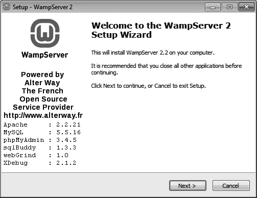
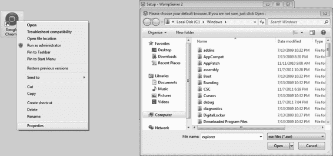

**图 A-1.** 使用 WAMP 安装程序进行设置

你可以将 WAMP 安装到其推荐的默认`c:\wamp`目录。你也可以使用其推荐的默认 SMTP 和电子邮件设置，如果以后需要，可以更改。在某个时刻，它会要求你选择默认浏览器。由于我安装了 Google Chrome，我希望将其设为默认浏览器。找到该可执行文件的最快方法是右键单击 Google Chrome 快捷方式图标，然后选择“属性”>“快捷方式”。复制整个“目标”值，并将其粘贴到“文件名”框中。如图 A-2 和图 A-3 所示。

**图 A-2.** 选择默认浏览器

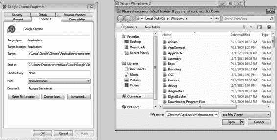

**图 A-3.** 获取 Google Chrome 的路径

完成 WAMP 安装后，你将在系统托盘中看到一个新图标。左键单击此图标，你将看到一个弹出菜单。单击“localhost”。

> **注意** 你不必使用 Google Chrome。你可以以同样的方式选择任何其他浏览器。

#### 讨厌的 Skype！

每次在同时运行 Skype 的 Windows 系统上安装 WAMP 时，我反复遇到的一个问题是 Apache 无法加载。这是由于浏览器和 Skype 的工作方式所致。

长期以来，Web 服务器默认在端口 80 上提供内容。同样，浏览器从域名的端口 80 请求网站。你可以轻松更改这些设置，但它们是标准。因此，端口 80 是一个常用端口。路由器和安全软件通常保持此端口开放以发送/接收数据，因为它们假设这里只会有 HTTP 流量。

看到这种情况，`Skype` 选择使用 `80` 端口作为默认通信端口，这样它就能绕过最严格的安全软件。问题是 `Apache` 或 `Skype`（但不能两者同时）可以使用 `80` 端口。

我们可以让 `Apache` 运行在不同的端口上，并不断更改浏览器地址栏以匹配，或者更改 `Skype` 设置。我建议更改 `Skype`！要让 `Skype` 使用不同的端口，请转到 `Skype` ➤ `Options` ➤ `Advanced` ➤ `Connection` ➤ 并取消选中 "`Use port 80 and 443 as alternatives...`"（见图 A-4）。现在重启 `Skype` 和 `WAMP`，问题应该可以解决。

[www.it-ebooks.info](http://www.it-ebooks.info/)

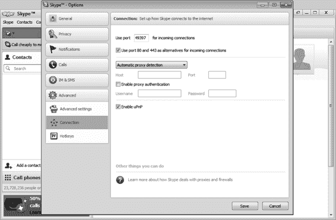

附录 A ■ 设置 Web 服务器

***Figure A-4.*** 让 Skype 离开 80 端口

### 配置 Apache/PHP

我们需要在 `Apache` 和 `PHP` 中启用一些模块并更改一些设置。首先，启用所有需要的模块。再次左键单击 `WAMP` 图标，然后选择 `Apache` ➤ `Apache modules` ➤ `rewrite_module`。

对 `cache_module`、`headers_module` 和 `expires_module` 重复此过程。每次启用一个模块，`WAMP` 都会重启服务器。然后，左键单击 `WAMP` 图标，选择 `PHP` ➤ `PHP extensions` ➤ `php_memcache`。

接下来，我们需要更新 `Apache` 的文档根目录，使其指向我们应用程序文件夹内的 `public` 文件夹。

左键单击 `WAMP` 图标，选择 `Apache` ➤ `httpd.conf`。将找到默认路径（`c:/wamp/www`）的两个位置都更新为正确的路径，如图 A-5 所示。

[www.it-ebooks.info](http://www.it-ebooks.info/)

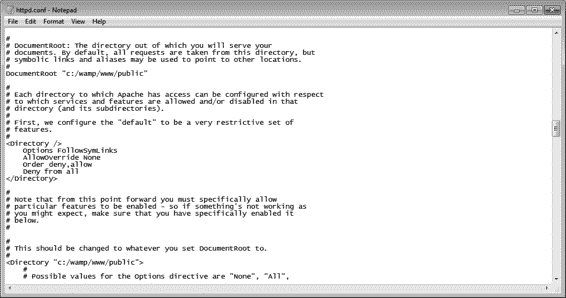

附录 A ■ 设置 Web 服务器

***Figure A-5.*** 设置正确的 DocumentRoot

#### 步骤 2

安装 `Memcached` 稍微不那么友好。访问 [`code.jellycan.com/memcached/`](http://www.code.jellycan.com/memcached/) 并下载 32 位 Windows 二进制归档文件。下载后，将其解压到 `c:\memcached`（您可能需要创建此文件夹）。

您需要指示 Windows 以管理员身份运行 `Memcached` 可执行文件。为此，右键单击可执行文件，转到 `Properties` ➤ `Compatibility` 并选中 "`Run this program as an administrator`"（见图 A-6）。

[www.it-ebooks.info](http://www.it-ebooks.info/)

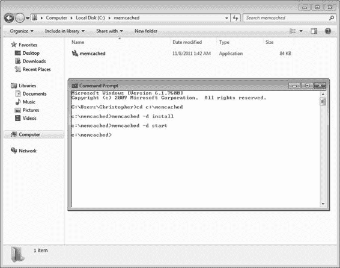

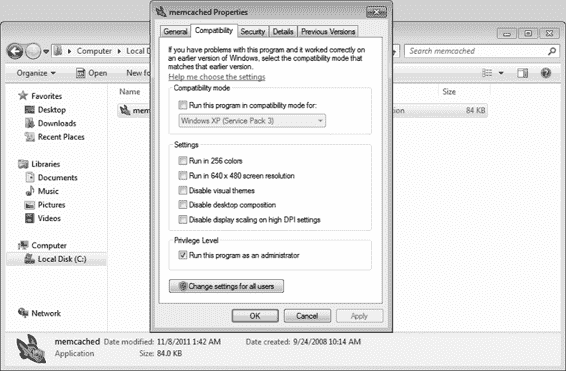

附录 A ■ 设置 Web 服务器

***Figure A-6.*** 以管理员身份运行可执行文件

接下来，打开命令提示符并输入以下命令，如图 A-7 所示：

***Figure A-7.*** 安装和启动 Memcached

[www.it-ebooks.info](http://www.it-ebooks.info/)

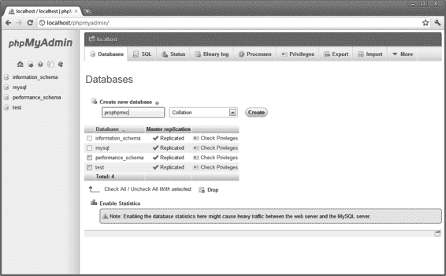

附录 A ■ 设置 Web 服务器

- `cd c:\memcached`
- `memcached –d install`
- `memcached –d start`

### 什么是 MSVCP71.dll？

如果您看到有关类似名称缺失文件的错误，请不要惊慌。似乎微软遗漏了一些许多第三方软件包（例如 `Memcached`）经常使用的库。要安装这些缺失的库，请访问 [`www.addictivetips.com/?attachment_id=38105`](http://www.addictivetips.com/?attachment_id=38105) 并下载包含两个 `.dll` 文件的归档文件。

下载后，将这些文件解压到 `c:\Windows\System32` 目录或 `c:\Windows\SysWOW64` 目录（取决于您运行的是 32 位还是 64 位系统）。现在，`Memcached` 可执行文件应该可以按预期工作了。

#### 步骤 3

我们需要创建一个数据库用户和模式供框架使用。左键单击 `WAMP` 图标并选择 `phpMyAdmin`。此界面允许您直接与 `WAMP` 安装的 `MySQL` 服务器交互。转到 `Databases` ➤ `Create new database`，并输入数据库名称（我选择了 `prophpmvc`），如图 A-8 所示。

***Figure A-8.*** 创建数据库和模式

接下来，转到 `Privileges` ➤ `Add a new User` 并填写用户名、密码和权限，如图 A-9 到 A-11 所示。

[www.it-ebooks.info](http://www.it-ebooks.info/)

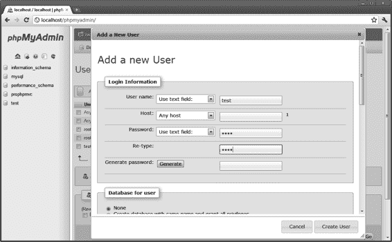

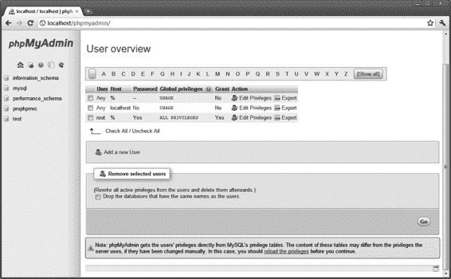

附录 A ■ 设置 Web 服务器

***Figure A-9.*** 用户权限中心

***Figure A-10.*** 添加用户名和密码

[www.it-ebooks.info](http://www.it-ebooks.info/)

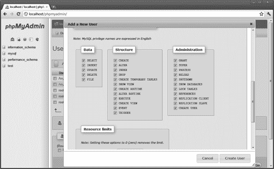

附录 A ■ 设置 Web 服务器

***Figure A-11.*** 权限

> **注意:** 请务必使用正确的数据库用户名、密码和模式更新单元测试。

### Linux

在本节中，我们将介绍在 Ubuntu 11.10 中的安装过程。这些软件包的安装通常被称为 LAMP（**L**inux **A**pache **M**ySQL **P**HP）。虽然可能存在小的差异，但本节描述的方法应该适用于其他 Linux 发行版。

#### 步骤 1

通过输入 `sudo –s` 并提供 root 帐户密码切换到 root 用户帐户。后续命令需要 root 访问权限才能正确安装/配置。获得 root 访问权限后，输入以下命令，并在提示时输入 `Y`：

- `apt-get update`
- `apt-get install tasksel`（见图 A-12）
- `tasksel`

[www.it-ebooks.info](http://www.it-ebooks.info/)

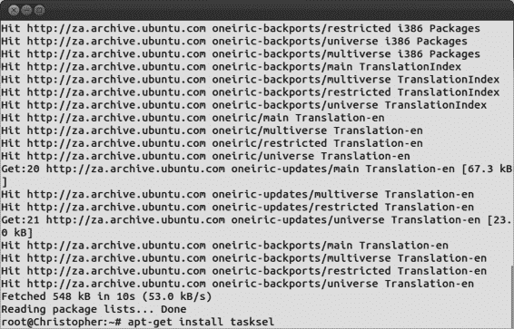

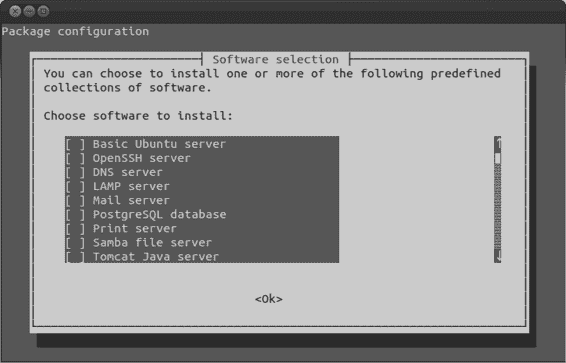

附录 A ■ 设置 Web 服务器

***Figure A-12.*** 安装 tasksel

从图 A-13 所示的选项列表中选择 LAMP 服务器。在安装的某个时刻，系统会要求您提供 `MySQL` 用户名和密码。我选择使用 `root/root`，因为它易于记忆并且适用于开发环境。

***Figure A-13.*** 选择要安装的软件包

[www.it-ebooks.info](http://www.it-ebooks.info/)

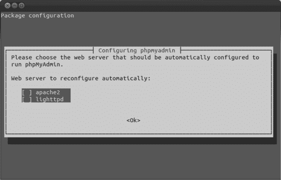

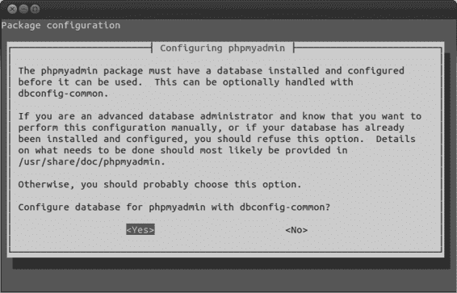

附录 A ■ 设置 Web 服务器

#### 步骤 2

与 `WAMP` 不同，`tasksel` 不会自动将 `phpMyAdmin` 与 LAMP 服务器软件包一起安装。

要安装 `phpMyAdmin`，请输入命令 `apt-get install phpMyAdmin`。选择 `apache2`（见图 A-14），使用 `dbconfig-common` 进行配置（见图 A-15），并提供您刚为 `MySQL` 设置的用户名/密码（见图 A-16）。

***Figure A-14.*** 将 phpMyAdmin 与 Apache 集成

***Figure A-15.*** 使用 dbconfig-common

[www.it-ebooks.info](http://www.it-ebooks.info/)

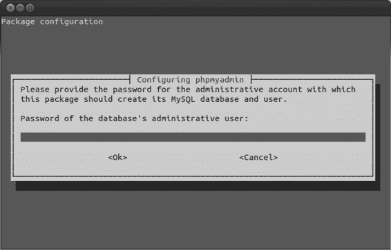

附录 A ■ 设置 Web 服务器

***Figure A-16.*** 为 MySQL 提供用户名/密码

设置完 `phpMyAdmin` 后，请随意为您的应用程序/单元测试创建 `prophpmvc` 数据库和用户名/密码。您可以按照与 Windows 7 完全相同的方式执行此操作，因为 `phpMyAdmin` 在两者中的工作方式应类似。

#### 步骤 3

安装 `Memcached` 再简单不过了。只需输入命令 `apt-get install memcached php5-memcache`，并在提示时回答 `Y`（见图 A-17）。安装完成后，`Apache2` 服务器（以及 `Memcached` 服务）将重启，并且 `Memcached` 将可供使用。

[www.it-ebooks.info](http://www.it-ebooks.info/)

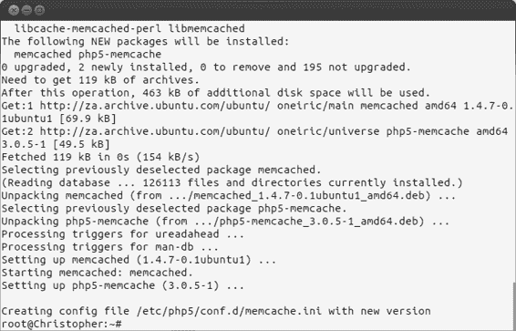

附录 A ■ 设置 Web 服务器

***Figure A-17.*** 安装 Memcached

#### 步骤 4

在 Ubuntu 中，我们需要做的最后一件事是将文件的所有权设置为 `Apache2` 并设置正确的文档根目录。使用以下命令从同一文件夹内更改文件的所有权：`chown –R www-data:www-data *`

接下来，输入 `vim /etc/apache2/sites-enabled/000-default`，并将显示 `DocumentRoot` 的行更改为应用程序目录 `public` 文件夹的正确路径。我的路径是 `/var/www/public`，因此配置文件中的那一行应改为 `DocumentRoot /var/www/public`（见图 A-18）。

[www.it-ebooks.info](http://www.it-ebooks.info/)

***图 A-18.** 设置正确的 DocumentRoot*

**注意：** `vim` 是一个常见的文本编辑器，安装在大多数 Linux 系统上。如果尚未安装，可以通过输入 `apt-get install vim` 来安装。或者，你也可以使用自己喜爱的文本编辑器，但重要的是将 `DocumentRoot` 路径更新到正确位置。

### MAC OS X

在本节中，我们将介绍在 OS X 中的安装过程。这些软件包的安装通常被称为 MAMP（**M**ac **A**pache **M**ySQL **P**HP）。

#### 步骤 1

安装 OS X 的 Web 服务器非常简单。首先，前往 [`www.mamp.info/en/downloads/`](http://www.mamp.info/en/downloads/index.html) 下载最新版本的 MAMP 和 MAMP PRO。解压下载的归档文件，并运行相应的安装程序（32 位或 64 位）。

安装程序会将 MAMP 文件夹放置在你的 `Applications` 文件夹中，这需要管理员权限。系统会提示你输入管理员密码。当你打开 MAMP 应用程序（现在应位于你的 `Applications` 文件夹中）时，你可以轻松地停止/启动服务器，并查看本地 Web 服务器的登录页面（见图 A-19）。你可以将默认端口设置为 `80/3306`（见图 A.20），就像在 Windows 7/Linux 中一样，并且还可以选择要运行的 PHP 版本（应选择 PHP 5.3+）。最后，你还可以在 Apache 标签页中设置正确的 `DocumentRoot` 文件夹。

重复我们之前为应用程序创建数据库模式、用户名和密码的步骤，通过随 MAMP 一起安装的 `phpMyAdmin` 进行操作。

#### 步骤 2

在 OS X 中安装 Memcached PHP 扩展有些棘手。你需要输入以下命令：

- `chmod u+x /Applications/MAMP/bin/php/php5.3.X/bin/p*`（其中 `5.3.X` 是你在 MAMP 应用程序中选择的 PHP 版本）
- `cd /tmp`
- `wget http://pecl.php.net/get/memcache-2.2.5.tgz`
- `tar -zxvf memcache-2.2.5.tgz`
- `cd memcache-2.2.5`
- `/Applications/MAMP/bin/php/phpX.X.X/bin/phpize`
- `MACOSX_DEPLOYMENT_TARGET=10.6 CFLAGS='-O3 -fno-common -arch i386 -arch x86_64' LDFLAGS='-O3 -arch i386 -arch x86_64' CXXFLAGS='-O3 -fno-common -arch i386 -arch x86_64' ./configure`
- `make`
- `cp modules/memcache.so /Applications/MAMP/bin/php/phpX.X.X/lib/php/extensions/no-debug-non-zts-20060613/`
- `echo 'extension=memcache.so' > /Applications/MAMP/bin/php/phpX.X.X/conf/php.ini`

重新启动服务器后，通过 MAMP 应用程序，PECL Memcache 类将可以在我们的代码中使用。

#### 如果 wget 缺失怎么办？

你可能没有 `wget` 命令可用，在这种情况下，你将在第 3 步遇到困难。

不用担心；使用以下命令可以轻松安装：

- `/usr/bin/ruby -e "$(/usr/bin/curl -fsSL https://raw.github.com/mxcl/homebrew/master/Library/Contributions/install_homebrew.rb)"`（见图 A-21）
- `brew install wget`（见图 A-22）

***图 A-21.** 安装 Homebrew*

***图 A-22.** 安装 wget*

[www.it-ebooks.info](http://www.it-ebooks.info/)