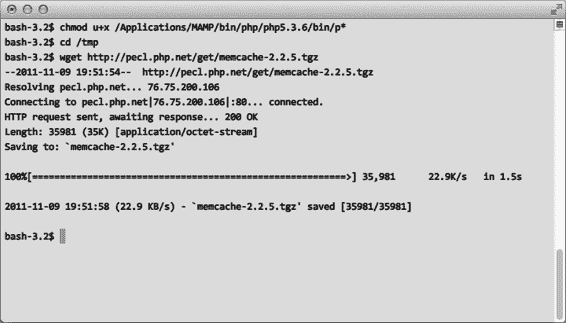
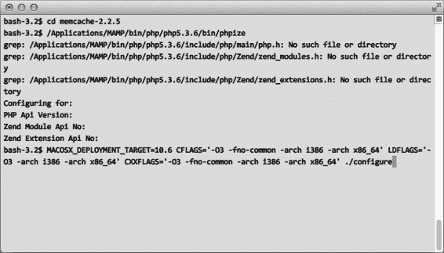
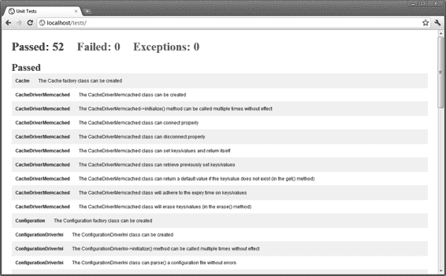
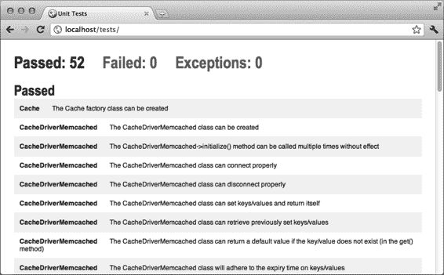
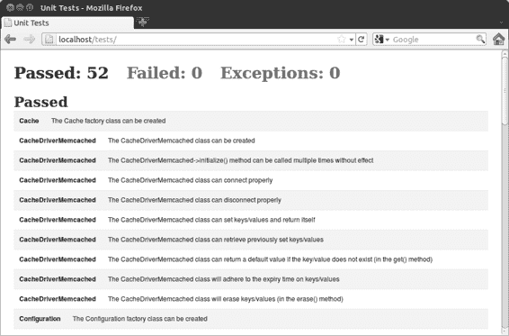

# 我们主要在做的事

我们主要是在安装一个名为`Homebrew`的 OS X 软件包管理器。使用`Homebrew`，我们可以直接安装一个替代 Linux 中`wget`命令的工具。

> **注意:** 如果你想了解更多关于`Homebrew`的信息，或者在安装时遇到问题，可以在此处阅读更多内容：
>
> [`github.com/mxcl/homebrew/wiki`](http://www.github.com/mxcl/homebrew/wiki)

> **注意:** 看到这些警告是正常的，可以忽略它们。

接下来的两个列表（A-23 和 A-24）展示了此步骤中的命令 3 到 6。

[www.it-ebooks.info](http://www.it-ebooks.info/)

## 附录 A ■ 设置 Web 服务器

**图 A-23.** *下载 PECL Memcached 扩展*

**图 A-24.** *安装/配置 Memcached 扩展*

#### 步骤 3

接下来，我们需要安装将在 OS X 上运行的 Memcached 服务器。通过下载以下内容来完成：

[`topfunky.net/svn/shovel/memcached/install-memcached.sh`](http://www.topfunky.net/svn/shovel/memcached/install-memcached)

到本地目录（例如`~/Desktop`）并使用以下命令执行它：

- `chmod 744 install-memcached.sh`
- `sudo ./install-memcached.sh`

[www.it-ebooks.info](http://www.it-ebooks.info/)

## 附录 A ■ 设置 Web 服务器

> **注意:** 如果脚本没有正确执行，可能是你没有安装 Xcode 工具。请从以下地址下载：
>
> [`developer.apple.com/technologies/tools/`](http://www.developer.apple.com/technologies/tools)

你可以通过在终端中输入`memcached –d`来让`Memcached`作为守护进程运行。

### 你出色地通过了！

为了确保一切安装和配置正确，我们需要运行在第 21 章中创建的单元测试（地址为[`localhost/tests`](http://www.localhost/tests)）。Windows 7 系统请参见**图 A-25**；Linux 系统请参见**图 A-26**；Mac OS X 系统请参见**图 A-27**。

**图 A-25.** *Windows 7 中测试通过*

[www.it-ebooks.info](http://www.it-ebooks.info/)

## 附录 A ■ 设置 Web 服务器

**图 A-26.** *Ubuntu 11.10 中测试通过*

**图 A-27.** *OS X 中测试通过*

[www.it-ebooks.info](http://www.it-ebooks.info/)

---

## 索引

### A

**引导过程**

- 地址到文件的关系，201
- `addRoute()` 方法，72
- 缓存工厂类配置，206
- `admin()` 钩子，328
- 控制器类
    - 管理界面
        - `__construct()` 方法，212
        - `_admin()` 钩子，328
        - 布局，210
        - `application/views/files/view.html`，335
        - 已修改，213
    - `application/views/navigation.html`，333
    - `render()` 方法，211
    - `application/views/users/edit.html`，332
    - 视图类，208
    - `application/views/users/view.html`，331
- 数据库工厂类配置，205
- 内容管理系统 (CMS)，321
- 目标，201
- `delete()`/`undelete()` 动作，330
- `Index.php`，203
- `edit()`/`view()` 动作，329
- URL 重写，202
- 文件 `view()`、`delete()` 和 `undelete()` 动作，334–335
- `_buildSelect()` 方法，125
- `login()` 动作，322
- `public/routes.php`，330
- `settings()` 动作，323

### C

- `Shared\Controller` 类，324，333–334
- 缓存类工厂，206

## 索引

### A

`卸载控制器`, 326

`缓存`

`用户模型管理员标志`, 322

`Cache\Driver`

`@after 标志`, 76

`Memcached 类`, 57

`Apache`2, 202

`Memcached connect()/disconnect()`

`Apache 网络服务器`, 9

`方法`, 55

`application/libraries/shared/markup.php`, 270

`Memcached 通用方法`, 56

`Application_Model_User 类模型`, 390

`Memcached 内部属性/方法`, 54

`application/views/files/view.html`, 335

`缓存工厂类`, 52–53

`application/views/nagivation.html`, 253

`目标`, 51

`application/views/navigation.html`, 333

`性能瓶颈`, 51

`application/views/users/edit.html`, 332

`CakePHP`, 4

`application/views/users/register.html`, 271

`~/app/Controller/UsersController.php`, 435–436

`application/views/users/search.html`, 256

`~/app/Model/Photo.php`, 434

`application/views/users/settings.html`, 267

`~/app/View/Users/register.ctp`, 434

`application/views/users/view.html`, 331

`CodeIgniter`, 3

`ArrayMethods::flatten()` 方法, 69

`约定`, 419

`文档`, 419

### B

`扩展的核心类`, 377

`文件上传`

`@before 标志`, 76

`文件模型`, 367

`臃肿的注册视图`, 269

`文件控制器`, 367

465

[www.it-ebooks.info](http://www.it-ebooks.info/)

### C

`CakePHP` (*续*)

`parse_ini_file()` 函数, 42

`文件表`, 370

`parse()` 方法, 46

`register.html 视图`, 370

`PHP parse_ini_string()` 方法, 46

`_upload()` 方法, 373

`$_type` 和 `$_options`, 44

`用户控制器`, 371

`__construct()` 方法, 212, 254

`最小自动化`, 345

`内容管理系统 (CMS)`, 321

`MVC` `~/app/Controller/UsersController.php`

`控制器类`

`~/app/Controller/UsersController.php`

`__construct()` 方法, 212

`(提取)`, 426

`布局`, 210

`~/app/Model/User.php`, 424

`已修改`, 213

`~/app/View/Users/login.ctp`, 429

`render()` 方法, 211

`~/app/View/Users/profile.ctp`, 430

`共享库`, 219

`~/app/View/Users/register.ctp`, 426, 429

`视图类`, 208

`~/app/View/Users/search.ctp`, 430

`~/app/View/Users/settings.ctp`, 430

### D

`差异`, 349

`闪现消息`, 426

`数据库工厂类`, 205

`register()` 动作, 425

`数据库`

`UsersController 类`, 425

`_buildSelect()` 方法, 125

用户模型, 349

`connector` 类, 116

`users` 表, 423

`database factory` 类, 115

理念与优势, 345

富有表现力的 SQL 生成, 114

`photos` 表, 433

目标, 113

路由, 346, 420

`MySQL connector` 类, 116, 120

设置, 420

`query` 类, 120

中小型应用, 345

查询语法糖方法, 123, 125

第三方库

`_quote()` 方法, 122

`$_filename` 属性, 375

使用 PHP/MySQL 工作, 113

`.htaccess` 文件, 376

`delete()`/`undelete()` 操作, 330

插件, 437

`profile()` 操作, 375

N

`thumbnail façade` 类, 374

**E**

单元测试库, 380

`edit()`/`view()` 操作, 329

`vendor` 目录, 437

`erase()` 方法, 56

测试

`Exception` 子类, 273

`~/app/Test/Controller/UsersControllerTest.php`, 441

`assert*()` 方法, 442

**F**

控制器功能, 441

工厂模式, 6

`login()` 操作, 443

文件上传

`UsersController`, 441

文件输入, 294

`UsersControllerTest` 继承自 `ControllerTestCase`, 442

文件模型, 290–291

文件表, 291

URL 重写, 345–346

`getFile()` 方法, 294

*CodeIgniter*

`register()` 操作, 293

文件上传, 370–371

`search.html` 模板, 295

第三方库, 374–376

`settings()` 操作, 293

单元测试类, 379

简单步骤, 289

配置

`_upload()` 方法, 292

关联数组, 41

文件 `view()`、`delete()` 和 `undelete()` 操作, 334

目标, 41

基础代码

INI 文件

自动加载, 9–11

`ConfigurationExceptionArgument`, 44

代码块, 9

`__construct()` 方法, 44

缺点, 10

`include()` 方法, 46

`index.php`, 9–10

466

[www.it-ebooks.info](http://www.it-ebooks.info/)

索引

延迟加载, 11

`application/libraries/fonts/types.php`, 298

命名空间, 10

`clean()` 方法, 15

自定义字体路由, 303

`$delimiter` 和 `_normalize()` 成员, 14

`deleteFont()` 方法, 299

`Exception` 类, 12

`detectSupport()` 方法, 302

`$location` 和 `$smell` 属性

文件控制器, 303

配置文件解析器, 15

`fonts()` 操作, 302, 305

`Doc Comments`（文档注释），16–17

`getFont()` 方法，299

`trim()` 方法，15

`serve()` 方法，302

`match()` 和 `split()` 方法，14

`sniff()` 方法，300, 302

`metadata`（元数据），15–17

`Proxy`（代理），297

`Proxy`（代理），297

`imagine`（想象），305

`from()` 方法，124

`observer pattern`（观察者模式），307

`plugins`（插件），314

### G

`proxy`（代理），298–300, 302–303, 305

`synchroncity`（共时性），307

`getFile()` 方法，294

`limit()` 方法，125

`get()` 方法，56

## Linux

`getRoutes()` 方法，72

`DocumentRoot`（文档根目录），457

`Google Chrome`（谷歌浏览器），447

`Memcached`，456

`packages selection`（软件包选择），454

### H

`phpMyAdmin`，455

`root user account`（根用户账户），453

`handle()` 方法，87

`tasksel installing`（安装 tasksel），454

`Hook function`（钩子函数），76

`test passing`（测试通过），464

`Linux Apache MySQL PHP (LAMP)`，453

### I

### Login（登录）

`login()` action（登录操作），231

`Imagine library`（Imagine 库），305

`login.html`，231

`_include()` handler（_include() 处理器），243

`modified login()` action（修改后的登录操作），233

`indexOf()` 方法，85

`profile()` action（个人资料操作），233

`Index.php`，203

`profile.html`（个人资料页面），233

`user model`（用户模型），237

### J, K

`users controller`（用户控制器），234

`login()` action（登录操作），231, 322

`join()` 方法，124

`logout()` action（退出操作），271

### L

### M, N

### Libraries（库）

`Mac Apache MySQL PHP (MAMP)`，458

`code`（代码），309

### MAC OS X

`CSS custom fonts`（CSS 自定义字体），297

`applications folder`（应用程序文件夹），458

`$database->disconnect()` 方法，312

`Memcached application`（Memcached 应用），459

`__construct()` 方法，312

`Memcached PHP extension`（Memcached PHP 扩展），459

`__destruct()` 方法，311

`server ports setting`（服务器端口设置），459

`framework.controller.destruct.after` 事件，311

`test passing`（测试通过），464

`matches()` 方法，69, 87

`framework.controller.destruct.before` 事件，311

`Memcached class`（Memcached 类），52, 57

`connect()`/`disconnect()` 方法，55

`modified controller class`（修改后的控制器类），311–312

`general-purpose methods`（通用方法），56

`modified shared class`（修改后的共享类），312

`internal properties/methods`（内部属性/方法），54

`events`（事件），311–312

### Metadata（元数据）

`$_fonts array`（$_fonts 数组），299

`autonumber fields`（自动编号字段），144

`addFont()` 方法，299

`Boolean fields`（布尔字段），144

`application/libraries/fonts/proxy.php`，298–300, 302

`configuration file parser`（配置文件解析器），15

## 索引

### D

`datetime` 字段，144
467
[www.it-ebooks.info](http://www.it-ebooks.info/)

## M

**元数据** (*续*)

`decimal` 字段，144
`delete()` 和 `deleteAll()` 方法，158

**模型-视图-控制器 (MVC)**
- 优势，2
- CakePHP，4
- CodeIgniter，3
- 创建，7
- Zend 框架，4

### O

**对象关系映射 (ORM)**
- `librar`y 库，170
- 范式，143

### P

**PEAR 包管理器**，415

**照片上传**，290

**PHP/MySQL**，113–114

**PHPUnit**，416

**插件**，437

**提交的表单数据验证**
- `$location` 和 `$smell` 属性，16
- 模型验证，261

**打印标签**，89

**主键类属性**，157

**profileAction() 方法**，233, 412

**public/routes.php**，330

### Q

**查询语法糖方法**，123–124

### R

**正则表达式类**，68–69

**注册表类**，150
- **福特类**，65
- 目标，61
- 键/实例仓库，63
- 模式，5
- **注册表类**，64
- `removeRoute()` 方法，72
- `render()` 方法，212, 254
- **请求类**，244, 249
- `request()` 方法，247

**registerAction() 函数**，226, 266, 293, 395, 409

**注册**
- `register.html`，224
- 用户模型，146

**请求方法类**，225

### S

**save() 方法**，227
**SQL**，150, 152–153, 155

### T

`text` 字段，144

### W

**文档注释**，16–17

**目标**，143
**整数字段**，144
**模型类**，223
**对象关系映射 (ORM) 范式**，143
**记录修改**，157–158, 170

## @

`@protected` 或 `@private` 标志，76
`@column` 标志，152
`@type` 标志，152
`$_types` 属性，147
`@column` 标志，146
`getter/setter` 方法，146
`@index` 标志，146
`@length` 标志，146
`@primary` 标志，146
`@readwrite` 标志，146
`@type` 标志，146

## $

`$_table` 和 `$_connector` 属性，150

### C

**CREATE TABLE `$template` 字符串**，155

**DROP TABLE 语句**，155
**getColumns() 方法**，152–153
**getConnector() 方法**，150
**`_quote()` 方法**，122
**getPrimaryColumn() 方法**，153
**getTable() 方法**，150
**词形变化方法**，150

### R

**`register()` 动作**，266
**验证映射与方法**，263, 264

### S

**`register()` 方法**，226

---

■ 索引

**C**

`RequestMethods` 类, 225

**D**

描述, 1

**F**

`Routing` 工厂模式, 6

**G**

`ArrayMethods`, 69

**I**

`框架`, 3–4, 7

**L**

`目标`, 67

**O**

`观察者模式`, 6

`路由器类`, 71

`注册模式`, 5

`路由管理方法`, 71–72

`单例模式`, 4

**R**

`Router\Route` 类, 68

`Mysql connector` 类, 116

`Router\Route\Regex` 类, 69

`Router\Route\Simple` 类, 70–71

**S**

`已定义路由处理`, 72–73

`已存在路由处理`, 73–74

`观察者模式`, 6

`Router _pass()` 方法, 74, 76

`@once 标志`, 76

`路由类`, 68–77

`order()` 方法, 125

`路由定义`, 67

468

[www.it-ebooks.info](http://www.it-ebooks.info/)

**T**

`第三方图像编辑库`, 197

`用户友好的错误页面` `sanitize()` 方法, 85

`application/views/errors/404.ph``p` 文件, 277

`脚本标签`, 89

`DEBUG 常量`, 277

`search()` 动作, 255

`search.html 模板`, 295

`include 语句`, 277

`Session` 类, 228

`PHP 异常数据`, 277

`Session\Driver\Server` 类, 230

`public/index.php` 引导文件, 273

`set()` 方法, 56, 64

`模板`, 276

`_setRequestHeaders()` 方法, 248

`View/Template 类`, 277

`_setRequestMethod()` 方法, 248

`用户个人资料`, 197

`_setRequestOptions()` 方法, 248

`语句标签`, 89

`settings()` 动作, 293, 323

`strpos()` 方法, 85

`settings()` 方法, 268

`Settings` 页面

`application/libraries/shared/`

**U**

`markup.php`, 270

`模板语言结构`

`application/views/users/register.html`, 271

`附加模板语法`, 241

`application/views/users/settings.html`, 267

`application/views/nagivation.html`, 253

`臃肿的注册视图`, 269

`application/views/users/search.html`, 256

`logout()` 动作, 271

`扩展类`, 242

`settings()` 方法, 268

`_include()` 处理函数, 243

`Shared\Controller` 类, 324, 333–334

`修改后的 __construct()` 方法, 254

`Singleton` 类

`修改后的 render()` 方法, 254

`缺点`, 63

`Request` 类, 244, 249

`Ford` 类, 62, 63

`request()` 方法, 246

## 索引

`instance()`方法, 63

请求设置方法（`request setter methods`）, 247

有限实例示例（`limited instance example`）, 61–62

`Response`类, 249

单例模式（`Singleton pattern`）, 4

`search()`动作, 255

### S

社交网络（`Social network`）

模板（`Templates`）

数据库, 197

额外字符串方法（`additional StringMethods`）

好友（`friends`）

方法, 84, 85

`application/controllers/users.php`, 282

替代方案（`alternatives`）, 84

`application/views/navigation.html`, 281

基本方言（`basic dialect`）, 83–84

`application/views/users/`

目标（`goals`）, 83

`search.html`, 281, 283

语法/语言映射（`grammar/language map`）, 87–89

`@before`元标志, 282

打印标签（`print tags`）, 89

`friend()`和`unfriend()`动作, 278, 280, 282

脚本标签（`script tags`）, 89

`Friend Model`, 278

语句处理函数（`statement handler functions`）, 89, 90

`friend`表, 278

语句标签（`statement tags`）, 89

`isFriend()`/`hasFriend()`方法, 283

`Template`类, 105–107

`@protected`标志, 282

`Template\Implementation`类, 86–87

`public/index.php`, 280

`Template\Implementation\Standard`

`public/routes.php`, 279

类, 102–105

文件夹结构（`folder structure`）, 198

`Template`类, 105

目标（`goals`）, 197

`Test`类

照片共享功能（`photo-sharing functionality`）, 197

`add()`方法, 175

共享（`sharing`）

配置, 179

`application/controllers/messages.php`, 286

数据库, 180, 182

`application/views/home/`

`connect()`/`disconnect()`

`index.html`, 286–287

方法, 182

`Messages::add()`动作, 286–287

`escape()`方法, 182

消息模型（`message model`）, 284, 287

需求（`requirements`）, 180

消息流（`message stream`）, 285

目标（`goals`）, 173

`message`表, 284

`Memcached`缓存, 175

469

[www.it-ebooks.info](http://www.it-ebooks.info/)

### T

`Test`类（续）

`logout()`动作, 359

模型（`model`）, 189

`profile()`动作, 359

`run()`方法, 175

`register()`动作, 355, 356

`Template`, 192

`User`模型

单元测试（`unit testing`）, 173

`application/models/user.php`,

测试（`Testing`）

350–351

目标（`goals`）, 339–342

`User Row`, 351

练习（`exercises`）, 343

`User Table SQL`, 351

表单字段（`form fields`）, 340–341

`GET`请求, 339

`login.html`和`search.html`

表单（`forms`）, 341

### V

验证映射和方法（`Validation maps and methods`）, 263, 264

`login.html`表单, 342

`Vendor`目录, 437

## 索引

### W, X, Y

### 第三方库

### Web 服务器（Web server）

- `modified Bootstrap.php` 文件, 412
- `profileAction()` 方法, 412
- `profile.phtml` 视图, 413
- `DocumentRoot`, 457
- `Memcache`d, 456
- `unique()` 方法, 85
- `_upload()` 方法, 292

## MAC OS X

### 用户账户

- `login()` 操作（action）
- `login.html`, 231
- `modified login()` 操作（action）, 233
- `profile()` 操作（action）, 233
- `profile.html`, 233
- `user` 模型（model）, 237
- `users` 控制器（controller）, 234
- `model.php`, 222
- `register.html`, 224
- `register()` 方法, 226
- `RequestMethods` 类, 225
- `save()` 方法, 227–228
- `sessions`, 228, 230
- `Session\Driver\Server` 类, 230
- `Session factory` 类, 228
- `where()` 方法, 125
- `shared libraries`, 219
- `table structure`, 222
- `user.php`, 220

### 用户控制器（Users controller）

- `application/controllers/users.php`
- `form_validation` 库, 357
- `_getUser()` 方法, 355
- `login()` 操作（action）, 358

### Windows Apache MySQL PHP (WAMP), 445

- `functional application`, 384
- `initialization method`, 390
- `Zend framework`, 4

### 其他

- `POST requests`, 341, 342
- `View class`, 208
- `register.html` 表单, 341–342
- `Request class`, 339
- `n questions and answers`, 342
- `n U packages selection`, 454
- `phpMyAdmin`, 455
- `root user account`, 453
- `Unix/Linux/BSD distributors`, 416
- `tasksel installing`, 454
- `URL rewriting`, 202
- `Applications folder`, 458
- `Memcached application`, 459
- `Memcached PHP extension`, 459
- `server ports setting`, 459
- `test passing`, 464
- `Windows 7`, 7
- `Apache/PHP`, 448
- `c:\wamp` 目录, 446
- `default browser`, 446
- `download`, 445
- `Google Chrome`, 446
- `Memcache`d, 449
- `phpMyAdmin`, 451
- `Skype`, 447
- `test passing`, 463
- `WAMP installer`, 446
- `Windows 7`, 12
- `Apache/PHP`, 448
- `c:\wamp` 目录, 446
- `download`, 445
- `Google Chrome`, 446
- `Memcached`, 449
- `Skype`, 447
- `test passing`, 463
- `WAMP installer`, 446
- `Windows Apache MySQL PHP (WAMP)`, 445

### Z

- `Zend framework`, 4
- `goals`, 405
- `memcache`d, 456
- `phpMyAdmin`, 455
- `unique()` 方法, 85
- `_upload()` 方法, 292

[www.it-ebooks.info](http://www.it-ebooks.info/)