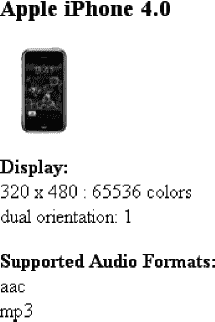
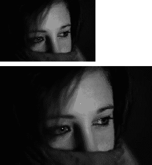
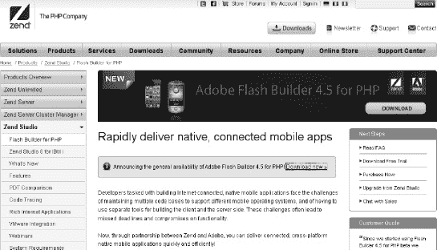

# 三、PHP 移动开发

移动开发每年都受到越来越多的关注。iPhone、Android 和黑莓不仅是强大的智能手机设备，也是争夺利润丰厚的市场份额的有价值品牌。每个智能手机制造商都希望为自己的产品开发应用，以期吸引用户。除了智能手机，我们还有平板电脑，如 iPad、PlayBook 和 Galaxy，以及阅读设备，如 Kindle 和 Nook。即使是标准手机也改进了浏览器支持和功能。

每一个接入互联网的移动设备都可以浏览由 PHP 在服务器端提供的在线内容或应用。出于这个原因，我们需要一种方法在更小的屏幕上有意义地呈现我们的内容。在本章中，我们将介绍通过 HTTP 请求用户代理字符串、WURFL 和 Tera-WURFL 进行的设备检测，所有这些将在本章的后面定义。

目前存在数以千计的移动设备，每个都具有不同的能力。如果您认为为旧浏览器开发 web 应用很脆弱，那么移动设备就不那么标准了。幸运的是，在我们的探索中，有一些系统可以帮助我们。为了在移动设备上渲染，我们将展示如何用 WALL 抽象标记，自动调整图像大小，并使 CSS 更加流畅。

我们还将介绍设备模拟器，在 Android 驱动的设备上开发 PHP，以及用于 PHP 的 Flash Builder。最后，我们将介绍快速响应(QR)码以及如何生成它们。

### 移动差异

在处理移动开发时，最大的挑战之一是让网站在呈现时可读。对于桌面 web 开发，我们检查主要的浏览器，如 Chrome、Firefox、Safari、Opera 和 Internet Explorer，还可能检查不同的操作系统(OS)，如 WinXP、Windows 7、Linux 和 Mac OS X。迎合浏览器、浏览器版本和 OS 的不同可能组合可能是一件相当麻烦的事情。

对于移动设备，渲染功能就不那么标准了。这使得移动渲染变得更加复杂。例如，几乎所有现代台式计算机都支持数千种颜色和至少 800×600 像素的屏幕分辨率。然而，手机、智能手机、平板电脑、电子阅读器和其他移动设备可能只支持灰度或有限的调色板。物理尺寸也有很大差异。这只是三种能力。设备可能有数百种不同的功能。我们将在本章的后面讨论其中的一些功能。

与桌面 web 开发不同，天真地尝试为每个可能的移动变体手工编程是不可能的，或者至少会花费太多的时间和精力，超出任何人愿意花费的时间和精力。相反，我们将讨论系统来确定正在使用的设备，然后动态呈现内容并流畅地调整 CSS。

### 检测设备

定制内容的第一步是知道我们在什么设备上渲染。我们将研究几种技术来确定活动设备。

#### 用户代理

任何设备检测系统的核心都是在标准`HTTP`请求中发送的用户代理头字符串。使用 PHP，我们可以访问`$_SERVER['HTTP_USER_AGENT']`超级全局服务器变量中的用户代理字符串。用户代理头可以包含关于浏览器、渲染引擎和操作系统的信息。用户代理字符串将类似于下面的字符串，它适用于 Firefox 4:

`Mozilla/5.0 (Windows NT 5.1; rv:2.0) Gecko/20100101 Firefox/4.0`

从这个字符串可以看出，客户端的操作系统是 Windows，渲染引擎是 Gecko，浏览器版本是 Firefox 4.0。

 **注意**的探测装置并非万无一失。尽管用户代理字符串很少出现，但对于两个不同的设备来说，它们可能不是唯一的。同样，正如安全性一章中所讨论的，报头也可能是伪造的。

#### 内置 PHP 支持

PHP 有`get_browser`函数，它试图获得关于所用浏览器的信息。它通过引用文件`browscap.ini`中的信息来做到这一点。在这方面，它就像是 WURFL 系统的一个更简单、更有限的版本，我们将在后面介绍。

 **注意**该功能依赖于在您的系统上安装`browscap.ini`文件，并设置该文件在您的`php.ini`文件中的位置，例如:

`browscap = "C:\your\path\to\browscap.ini"`

关于`get_browser`的更多信息可在 http://php.net/manual/en/function.get-browser.php 的[获得，更新的`browscap.ini`文件可在 http://browsers.garykeith.com/downloads.asp](http://php.net/manual/en/function.get-browser.php)[的](http://browsers.garykeith.com/downloads.asp)获得

如果我们将第一个参数设置为`null`或者传入实际的用户代理，那么我们将获得关于当前正在使用的客户端的信息。我们还可以传入一个不同的用户代理字符串来了解它的信息。第二个参数是可选的。通过将参数设置为`true`，我们请求将信息作为数组而不是默认对象返回。参见列表 3-1 和列表 3-2 。

***清单 3-1。**使用 PHP 的 get_browser 函数*

`<?php
echo $_SERVER ['HTTP_USER_AGENT'] . "\n\n";

var_dump ( get_browser ( null, true ) );

//equivalently,  we could have passed in the user agent string into the first parameter
//var_dump ( get_browser ( $_SERVER ['HTTP_USER_AGENT'], true ) );
?>`

***清单 3-2。**Chrome 浏览器中的输出*

`Mozilla/5.0 (Windows NT 6.1; WOW64) AppleWebKit/534.24 (KHTML, like Gecko) Chrome/11.0.696.65 Safari/534.24
array
  'browser_name_regex' => string '§^.*$§' *(length=6)*
  'browser_name_pattern' => string '*' *(length=1)*
  'browser' => string 'Default Browser' *(length=15)*
  'version' => string '0' *(length=1)*
  'majorver' => string '0' *(length=1)*
  'minorver' => string '0' *(length=1)*
  'platform' => string 'unknown' *(length=7)*
  'alpha' => string '' *(length=0)*
  'beta' => string '' *(length=0)*
  'win16' => string '' *(length=0)*
  'win32' => string '' *(length=0)*
  'win64' => string '' *(length=0)*
  'frames' => string '1' *(length=1)*
  'iframes' => string '' *(length=0)*
  'tables' => string '1' *(length=1)*
  'cookies' => string '' *(length=0)*
  'backgroundsounds' => string '' *(length=0)*
  'cdf' => string '' *(length=0)*
  'vbscript' => string '' *(length=0)*
  'javaapplets' => string '' *(length=0)*
  'javascript' => string '' *(length=0)*
  'activexcontrols' => string '' *(length=0)*
  'isbanned' => string '' *(length=0)*
  'ismobiledevice' => string '' *(length=0)*
  'issyndicationreader' => string '' *(length=0)*
  'crawler' => string '' *(length=0)*
  'cssversion' => string '0' *(length=1)*
  'supportscss' => string '' *(length=0)*
  'aol' => string '' *(length=0)*
  'aolversion' => string '0' *(length=1)*`

正如您所看到的，对于这个新的浏览器，`get_browser`函数获得的信息没有返回任何内容。这是因为我的 WAMP (Windows、Apache、MySQL、PHP)包中包含的`browscap.ini`文件已经超过一年了。解决方案是下载一个最新版本。如果文件被缓存，我们可能还需要重启 Apache 服务器。更新后，我们得到了一些更有用的信息，如清单 3-3 所示。

***清单 3-3。**在 Chrome 浏览器中输出更新后的`browscap.ini`*

`Mozilla/5.0 (Windows NT 6.1; WOW64) AppleWebKit/534.24 (KHTML, like Gecko) Chrome/11.0.696.65 Safari/534.24
array
  'browser_name_regex' => string '§^mozilla/5\.0 \(.*windows nt 6\.1.*wow64.*\) applewebkit/.* \(khtml, like gecko\).*chrome/11\..*safari/.*$§' (length=108)
  'browser_name_pattern' => string 'Mozilla/5.0 (*Windows NT 6.1*WOW64*) AppleWebKit/* (KHTML, like Gecko)*Chrome/11.*Safari/*' (length=90)
  'parent' => string 'Chrome 11.0' (length=11)
  'platform' => string 'Win7' (length=4)
  'win32' => string '' (length=0)
  'win64' => string '1' (length=1)
  'browser' => string 'Chrome' (length=6)
  'version' => string '11.0' (length=4)
  'majorver' => string '11' (length=2)
  'frames' => string '1' (length=1)
  'iframes' => string '1' (length=1)
  'tables' => string '1' (length=1)
  'cookies' => string '1' (length=1)
  'javascript' => string '1' (length=1)
  'javaapplets' => string '1' (length=1)
  'cssversion' => string '1' (length=1)
  'minorver' => string '0' (length=1)
  'alpha' => string '' (length=0)
  'beta' => string '' (length=0)
  'win16' => string '' (length=0)
  'backgroundsounds' => string '' (length=0)
  'vbscript' => string '' (length=0)
  'activexcontrols' => string '' (length=0)
  'isbanned' => string '' (length=0)
  'ismobiledevice' => string '' (length=0)
  'issyndicationreader' => string '' (length=0)
  'crawler' => string '' (length=0)
  'aolversion' => string '0' (length=1)Using Regex`

如果您只关心检测几个主要的移动设备，那么您可以使用正则表达式来搜索用户代理字符串。在清单 3-4 中，我们检查用户代理字符串中的几部电话。如果找到匹配，那么我们重定向到一个单独的移动页面，并加载一个备用模板和样式表。正则表达式(regex)中的`/i`选项使我们的搜索不区分大小写。`|`表示“或”，因此“iPhone”和“iPod”都匹配，但“iPod”不匹配。类似地，“windows ce”和“windows phone”会匹配，但“windows xp”不会匹配有关正则表达式的更多信息，请参考索引。

***清单 3-4。**使用正则表达式检查特定的移动设备*

`<?php
  if (preg_match ( '/i(Phone|Pad)|Android|Blackberry|Symbian|windows (ce|phone)/i',
                 $_SERVER ['HTTP_USER_AGENT'] )) {
        //redirect, load different templates, stylesheets  
        header ( "Location: mobile/index.php" );
  }
?>`

为了检测更广泛的移动设备，我们需要更多的正则表达式。网站`[`detectmobilebrowser.com/`](http://detectmobilebrowser.com/)`越来越受欢迎，因为它可以为几种不同的脚本语言或框架生成我们需要的长正则表达式(15 个，还在增加)。如果我们需要，它还会将客户端重定向到特定的移动页面。清单 3-5 显示了站点生成的示例正则表达式。

***清单 3-5。**由`detectmobilebrowser.com`生成的正则表达式*

`<?php
$useragent = $_SERVER['HTTP_USER_AGENT'];

if(preg_match('/android|avantgo|blackberry|blazer|compal|elaine|fennec|hiptop|iemobile|ip(hone|od)|iris|kindle|lge |maemo|midp|mmp|opera m(ob|in)i|palm( os)?|phone|p(ixi|re)\/|plucker|pocket|psp|symbian|treo|up\.(browser|link)|vodafone|wap|windows (ce|phone)|xda|xiino/i',$useragent)||preg_match('/1207|6310|6590|3gso|4thp|50[1-6]i|770s|802s|a wa|abac|ac(er|oo|s\-)|ai(ko|rn)|al(av|ca|co)|amoi|an(ex|ny|yw)|aptu|ar(ch|go)|as(te|us)|attw|au(di|\-m|r |s )|avan|be(ck|ll|nq)|bi(lb|rd)|bl(ac|az)|br(e|v)w|bumb|bw\-(n|u)|c55\/|capi|ccwa|cdm\-|cell|chtm|cldc|cmd\-|co(mp|nd)|craw|da(it|ll|ng)|dbte|dc\-s|devi|dica|dmob|do(c|p)o|ds(12|\-d)|el(49|ai)|em(l2|ul)|er(ic|k0)|esl8|ez([4-7]0|os|wa|ze)|fetc|fly(\-|_)|g1 u|g560|gene|gf\-5|g\-mo|go(\.w|od)|gr(ad|un)|haie|hcit|hd\-(m|p|t)|hei\-|hi(pt|ta)|hp( i|ip)|hs\-c|ht(c(\-| |_|a|g|p|s|t)|tp)|hu(aw|tc)|i\-(20|go|ma)|i230|iac( |\-|\/)|ibro|idea|ig01|ikom|im1k|inno|ipaq|iris|ja(t|v)a|jbro|jemu|jigs|kddi|keji|kgt( |\/)|klon|kpt |kwc\-|kyo(c|k)|le(no|xi)|lg( g|\/(k|l|u)|50|54|e\-|e\/|\-[a-w])|libw|lynx|m1\-w|m3ga|m50\/|ma(te|ui|xo)|mc(01|21|ca)|m\-cr|me(di|rc|ri)|mi(o8|oa|ts)|mmef|mo(01|02|bi|de|do|t(\-| |o|v)|zz)|mt(50|p1|v )|mwbp|mywa|n10[0-2]|n20[2-3]|n30(0|2)|n50(0|2|5)|n7(0(0|1)|10)|ne((c|m)\-|on|tf|wf|wg|wt)|nok(6|i)|nzph|o2im|op(ti|wv)|oran|owg1|p800|pan(a|d|t)|pdxg|pg(13|\-([1-8]|c))|phil|pire|pl(ay|uc)|pn\-2|po(ck|rt|se)|prox|psio|pt\-g|qa\-a|qc(07|12|21|32|60|\-[2-7]|i\-)|qtek|r380|r600|raks|rim9|ro(ve|zo)|s55\/|sa(ge|ma|mm|ms|ny|va)|sc(01|h\-|oo|p\-)|sdk\/|se(c(\-|0|1)|47|mc|nd|ri)|sgh\-|shar|sie(\-|m)|sk\-0|sl(45|id)|sm(al|ar|b3|it|t5)|so(ft|ny)|sp(01|h\-|v\-|v )|sy(01|mb)|t2(18|50)|t6(00|10|18)|ta(gt|lk)|tcl\-|tdg\-|tel(i|m)|tim\-|t\-mo|to(pl|sh)|ts(70|m\-|m3|m5)|tx\-9|up(\.b|g1|si)|utst|v400|v750|veri|vi(rg|te)|vk(40|5[0-3]|\-v)|vm40|voda|vulc|vx(52|53|60|61|70|80|81|83|85|98)|w3c(\-| )|webc|whit|wi(g |nc|nw)|wmlb|wonu|x700|xda(\-|2|g)|yas\-|your|zeto|zte\-/i', substr($useragent,0,4)))
header('Location: http://detectmobilebrowser.com/mobile');
    ?>`

这种类型的解决方案在某些情况下会起作用。然而，为了获得更准确的结果和识别设备功能，我们需要一个更精细的系统。这个系统就是 WURFL，我们将在接下来讨论它。

### 检测移动能力

要超越简单的设备检测并了解设备能够做什么，需要使用更复杂的 WURFL 系统。

#### WURFL

无线通用资源文件(WURFL)是一个 XML 文件，由 Luca Passani 发明，它包含移动设备功能。

##### 简介

目前，WURFL 中列出了 500 多种不同的设备功能。使用 WURFL 的实现已经在包括 Java 和. NET 在内的许多语言和平台中被创建。在 PHP 中，官方 API 被称为*新的 PHP WURFL API* ，可在`[`wurfl.sourceforge.net/nphp/`](http://wurfl.sourceforge.net/nphp/)`获得。

设备功能使用继承堆栈层次结构。如果没有列出最具体型号的功能，则检查更通用的设备。如果该功能仍然没有列出，那么 WURFL 将检查下一个最通用的设备，并重复这个过程，直到达到基本根设备级别。这种分层结构节省了空间并提高了性能。WURFL 还试图通过 ZipArchive 使用 XML 文件的 ZIP 存档版本，ZIP archive 是 PHP >= 5.2.0 中包含的一个包。由于该文件的 ZIP 版本目前小于一兆字节(MB ),而实际的 XML 文件是 16MB，这是另一个性能改进。

了解特定设备的一些有用功能可能是屏幕分辨率、编解码器支持和格式、JavaScript、Java 和 Flash 支持。

 **注意**对 XML 文件的贡献大部分是由开发者和最终用户自愿贡献的，并且可能包含错误。此外，新的设备一直在被创造出来。尽管它非常庞大和全面，但我们不应该期望 WURFL 是 100%准确的。如果您很快需要包含一个设备，您可以列出它的功能并将信息修补到主 XML 文件中。

如果准确性是最重要的，声称甚至更好的准确性的专有系统确实存在。

##### 设置

对于本章中的所有例子，我们将把 WURFL 库文件放在一个名为`wurfl,`的目录中，该目录相对于 webroot 为`./wurfl/`。在我们的例子中，我们将使用一个公共的配置文件，并通过使用清单 3-6 中的代码每次获得一个`WURFLManager`对象。

***清单 3-6。**创建一个 WURFLManager 对象:`wurflSetup.php`*

`<?php

error_reporting(E_ALL);
define( "WURFL_DIR", dirname(__FILE__) . '/wurfl/WURFL/' );
define( "RESOURCES_DIR", dirname(__FILE__) . "/wurfl/examples/resources/" );` 
`require_once WURFL_DIR . 'Application.php';

function getWurflManager() {
    $config_file = RESOURCES_DIR . 'wurfl-config.xml';
    $wurfl_config = new WURFL_Configuration_XmlConfig( $config_file );

    $wurflManagerFactory = new WURFL_WURFLManagerFactory( $wurfl_config );
    return $wurflManagerFactory->create();
}

?>`

##### 带 WURFL 的检测设备

在我们的第一个设备检测示例中，我们将使用新的 WURFL PHP API 打印出设备堆栈。我们将使用 fallback 和 id 属性输出 UA 的设备层次结构。参见清单 3-7 。

***清单 3-7。**输出用户代理的设备栈，从最特定到一般*

`<?php

error_reporting(E_ALL);
require_once('wurflSetup.php');

$wurflManager = getWurflManager();

$device = $wurflManager->getDeviceForHttpRequest($_SERVER);

print "
ID Stack is:  ";
while ($device != null)
{
    print $device->id . " ";
    if (!$device->fallBack || $device->fallBack == "root")
    {
        break;
    }
    $device = $wurflManager->getDevice($device->fallBack);
}
print "
";

?>`

以下是在 Firefox 4 浏览器中浏览台式电脑时脚本的输出:

`ID Stack is:
firefox_1
firefox
generic_web_browser
generic_xhtml
generic`

在 Chrome 浏览器中:

`ID Stack is:
google_chrome_1
google_chrome
generic_web_browser
generic_xhtml
generic`

 **注意**第一次运行清单 3-7 中的脚本可能需要很长时间，因为 WURFL 会构建资源缓存。您可能需要增加您的`php.ini max_execution_time`指令。

如果我们想使用另一个设备进行模拟，我们可以修改用户代理服务器变量。清单 3-7 的修改版本如清单 3-8 所示。输出如清单 3-9 所示。

***清单 3-8。**通过修改服务器用户代理仿真另一台设备*

`<?php

error_reporting(E_ALL);
require_once('wurflSetup.php');

$wurflManager = getWurflManager();

**$_SERVER['HTTP_USER_AGENT'] =**
**"Mozilla/5.0 (iPhone; U; CPU iPhone OS 4_0 like Mac OS X; en-us) AppleWebKit/532.9 (KHTML,**
** like Gecko) Version/4.0.5 Mobile/8A293 Safari/6531.22.7";**

$device = $wurflManager->getDeviceForHttpRequest( $_SERVER );

print "
ID Stack is:  ";
while ( $device != null) {
    print $device->id . " ";
    if ( !$device->fallBack  || $device->fallBack == "root" )
    {
        break;
    }
    $device = $wurflManager->getDevice( $device->fallBack );
}
print "
";

?>`

***清单 3-9。**仿真 iPhone 4 用户代理的 WURFL 输出*

`ID Stack is:
apple_iphone_ver4_sub405
apple_iphone_ver4
apple_iphone_ver3_1_3` `apple_iphone_ver3_1_2
apple_iphone_ver3_1
apple_iphone_ver3
apple_iphone_ver2_2_1
apple_iphone_ver2_2
apple_iphone_ver2_1
apple_iphone_ver2
apple_iphone_ver1
apple_generic
generic_xhtml
generic`

##### 使用 WURFL 检测和列出设备功能

在清单 3-10 中，我们将展示我们可以检查的可用能力组。我们还将输出`display`和`css`组所有可用的特定功能。输出如清单 3-11 所示。

***清单 3-10。**列出可用的能力组*

`<?php

error_reporting(E_ALL);
require_once('wurflSetup.php');

$wurflManager = getWurflManager();

$device = $wurflManager->getDeviceForHttpRequest( $_SERVER );
$capability_groups = $wurflManager->getListOfGroups();
asort( $capability_groups );

foreach ( $capability_groups as $c ) {
    print $c . " ";
}
?>`

***清单 3-11。**清单 3-10 的输出清单 *

`ajax
bearer
bugs
cache
chtml_ui
css
display
drm
flash_lite
html_ui
image_format
j2me` `markup
mms
object_download
pdf
playback
product_info
rss
security
sms
sound_format
storage
streaming
transcoding
wap_push
wml_ui
wta
xhtml_ui`

为了输出所有可用能力的列表，我们可以修改清单 3-10 中的来使用`getCapabilitiesNameForGroup`方法，如清单 3-12 中的所示。输出的第一部分如清单 3-13 中的所示。

***清单 3-12。**列出我们可以检查的所有能力*

`<?php

error_reporting(E_ALL);
require_once('wurflSetup.php');

$wurflManager = getWurflManager();

$device = $wurflManager->getDeviceForHttpRequest( $_SERVER );
$capability_groups = $wurflManager->getListOfGroups();
asort( $capability_groups );

foreach ( $capability_groups as $c ) {
**    print "<strong>" . $c . "</strong> ";**
**    var_dump( $wurflManager->getCapabilitiesNameForGroup( $c ) );**
}
?>`

***清单 3-13。**第一部分输出自清单 3-12*

`**ajax**

array
  0 => string 'ajax_preferred_geoloc_api' (length=25)
  1 => string 'ajax_xhr_type' (length=13)
  2 => string 'ajax_support_getelementbyid' (length=27)
  3 => string 'ajax_support_event_listener' (length=27)
  4 => string 'ajax_manipulate_dom' (length=19)` `  5 => string 'ajax_support_javascript' (length=23)
  6 => string 'ajax_support_inner_html' (length=23)
  7 => string 'ajax_manipulate_css' (length=19)
  8 => string 'ajax_support_events' (length=19)

**bearer**

array
  0 => string 'sdio' (length=4)
  1 => string 'wifi' (length=4)
  2 => string 'has_cellular_radio' (length=18)
  3 => string 'max_data_rate' (length=13)
  4 => string 'vpn' (length=3)
…`

我们可以修改清单 3-12 使其在视觉上更加有用，并且只显示某些设备功能，用绿色复选标记作为支持功能的前缀(用 HTML 实体呈现),用红色删除线样式列出不支持的功能。参见清单 3-14 。输出如图图 3-1 所示。

***清单 3-14。**显示颜色编码的设备能力值*

`<?php
error_reporting ( E_ALL );
require_once ('wurflSetup.php');

$wurflManager = getWurflManager ();

$device = $wurflManager->getDeviceForHttpRequest ( $_SERVER );
$capability_groups = $wurflManager->getListOfGroups ();
asort ( $capability_groups );

foreach ( $capability_groups as $group ) {
        //only output the capabilities of certain groups
        if (in_array ( $group, array ("ajax", "css", "image_format" ) )) {
                print "<strong>" . $group . "</strong> ";
                print "<ul>";
                foreach ( $wurflManager->getCapabilitiesNameForGroup ( $group ) as $name ) {
                        $c = $device->getCapability ( $name );
                        if ($c == "false") {
                                $c = "<li>";
                                $c .= $name . "";
                        } else if ($c == "true") {
                                $c = "<li> &#10003; ";
                                $c .= $name . "";
                        } else {
                                $c = "<li>" . $name . ": <em>" . $c . "</em>";
                        }
                        print $c;
                        print "</li>";
                }` 
`                print "</ul>";
        }
}

?>` 

***图 3-1。**清单 3-14 中的一些输出，显示更容易看到的设备功能*

对于我们使用新的 WURFL PHP API 的最终脚本，我们将输出我们的用户代理设备的一些特定功能。见清单 3-15 。

***清单 3-15。**输出 iPhone 4 的选定音频和显示功能*

`<?php

error_reporting(E_ALL);
require_once('wurflSetup.php');

$wurflManager = getWurflManager();

$_SERVER['HTTP_USER_AGENT'] =
        "Mozilla/5.0 (iPhone; U; CPU iPhone OS 4_0 like Mac OS X; en-us) AppleWebKit/532.9
(KHTML, like Gecko) Version/4.0.5 Mobile/8A293 Safari/6531.22.7";

$device = $wurflManager->getDeviceForHttpRequest($_SERVER);

**//output fields that interest us**

**//display information**
**print "<h2>" . $device->id . "</h2>";**
**print "
<strong>Display: </strong> ";**
**print $device->getCapability( 'resolution_width' ) . " x "; //width**
**print $device->getCapability( 'resolution_height' ) . " : "; //height**
**print $device->getCapability( 'colors' ) . ' colors ';**
**print "dual orientation: ".$device->getCapability( 'dual_orientation' ) . "
";**

**//audio information**
**print "
<strong>Supported Audio Formats:</strong> ";**
**foreach ( $wurflManager->getCapabilitiesNameForGroup( "sound_format" ) as $name ) {**
**    $c = $device->getCapability( $name );**
**    if ( $c == "true") {**
**            print $name . " ";**
**    }**
**}**
**print "
";**
**?>**`

运行清单 3-15 输出以下信息:

* * *

`apple_iphone_ver4_sub405

Display:

320 x 480 : 65536 colors

dual orientation: true` 
`Supported Audio Formats:

aac

mp3`

* * *

 **注**如前所述，不保证用户代理识别。测试 Kindle 3 时，使用如下用户代理:

``Mozilla/5.0 (Linux; U; en-US) AppleWebKit/528.5+ (KHTML, like Gecko, Safari/528.5+)`
 Version/4.0 Kindle/3.0 (screen 600x800; rotate)`

丹希拉得到了错误的结果:

* * *

`toshiba_folio100_ver1
Display:
600 x 1024 : 256 colors
dual orientation: true
Supported Audio Formats:
aac
mp3`

* * *

##### 特创伏尔

WURFL 的 Tera-WURFL 实现于`[www.tera-wurfl.com](http://www.tera-wurfl.com)`发布。新的 PHP WURFL API 专注于精确的结果。Tera-WURFL 更注重性能。为了实现这一点，使用数据库而不是大的 XML 文件来获取结果。Tera-WURFL 目前支持 MySQL、Microsoft SQL Server 和 MongoDB。它声称比普通的 WURFL 快五到十倍，准确率达 99%，并提供更好的桌面检测。此外，Tera-WURFL 提供了显示正在使用的移动设备的图片的能力。稍后我们将展示如何显示设备图像。

##### 设置

要设置 Tera-WURFL，我们需要执行以下操作:

1.  创建一个数据库，并修改`TeraWurflConfig.php`配置文件中的凭证以使用它。
2.  在`[`localhost/Tera-WURFL/admin/`](http://localhost/Tera-WURFL/admin/)`进入管理页面。如果您收到由于缺少表而导致的错误，不要担心——当我们加载数据时，会创建这些表。
3.  您可以加载本地 XML 文件或远程 XML 文件。

 **注意**如果你收到一个类似于`fatal error maximum function nesting level of '100' reached aborting,`的错误信息，那么你需要暂时禁用`php.ini`文件中的`xdebug`，或者通过将 php.ini 指令`xdebug.max_nesting_level=100`设置为一个更高的值，比如 500，来增加你的 xdebug 嵌套级别限制。

##### Tera-WURFL 检测设备

在我们使用 Tera-WURFL 的第一个例子中，如清单 3-16 所示，我们将输入 iPhone 4 的用户代理字符串，并验证 Tera-WURFL 能够识别它并正确设置。

***清单 3-16。**识别特定用户代理的 Tera-WURFL 代码*

`<?php

error_reporting(E_ALL);
require_once('Tera-WURFL/TeraWurfl.php');

$teraWURFL = new TeraWurfl();
$iphone_ua = "Mozilla/5.0 (iPhone; U; CPU iPhone OS 4_0 like Mac OS X; en-us)
AppleWebKit/532.9 (KHTML, like Gecko) Version/4.0.5 Mobile/8A293 Safari/6531.22.7";

if ( $teraWURFL->getDeviceCapabilitiesFromAgent( $iphone_ua ) ) {
   print "ID: ".$teraWURFL->capabilities['id']." ";
} else {
    print "device not found";
}
?>`

运行清单 3-16 的输出是:

`ID: apple_iphone_ver4_sub405`

如果我们没有将 user-agent 作为参数传入，那么就像 WURFL 一样，结果将来自实际使用的客户机。

##### 使用 Tera-WURFL 检测和列出设备功能

在清单 3-17 中，我们将输出 iPhone 设备的显示和音频功能。这是等同于清单 3-15 中的 WURFL 功能的 Tera-WURFL。

***清单 3-17。**使用 Tera-WURFL 确定 iPhone 4 的显示和声音格式功能*

`<?php

error_reporting(E_ALL);
require_once('Tera-WURFL/TeraWurfl.php');

$teraWURFL = new TeraWurfl();
$iphone_ua = "Mozilla/5.0 (iPhone; U; CPU iPhone OS 4_0 like Mac OS X; en-us)
AppleWebKit/532.9 (KHTML, like Gecko) Version/4.0.5 Mobile/8A293 Safari/6531.22.7";

if ( $teraWURFL->getDeviceCapabilitiesFromAgent( $iphone_ua ) ) {
    $brand_name = $teraWURFL->getDeviceCapability( "brand_name" );
    $model_name = $teraWURFL->getDeviceCapability( "model_name" );
    $model_extra_info = $teraWURFL->getDeviceCapability( "model_extra_info" );

    //output fields that interest us
    print "<h2>" . $brand_name . " " . $model_name . " " . $model_extra_info . "</h2>";

    //display information
    print "
<strong>Display: </strong> ";
    print $teraWURFL->getDeviceCapability( 'resolution_width' ) . " x "; //width
    print $teraWURFL->getDeviceCapability( 'resolution_height' ) . " : "; //height
    print $teraWURFL->getDeviceCapability( 'colors' ) . ' colors ';
    print "dual orientation: " . $teraWURFL->getDeviceCapability( 'dual_orientation' );
    print "
";

    //audio information
    print "
<strong>Supported Audio Formats:</strong> ";

    foreach ( $teraWURFL->capabilities['sound_format'] as $name => $value ) {
         if ( $value == "true" ) {
            print $name . " ";
        }
    }
    print "
";
} else
{
    print "device not found";
}
?>`

清单 3-17 的输出是:

**苹果 iPhone 4.0**

*显示:*

320 x 480 : 65536 色

双重定位:1

*支持的音频格式:*

自动幅度控制（Automatic Ampltiude Control 的缩写）

mp3

##### 用 Tera-WURFL 输出设备图像

在 Tera-WURFL 的最后一个例子中，我们将输出一个设备映像。首先，我们需要从`[`sourceforge.net/projects/wurfl/files/WURFL%20Device%20img/.`](http://sourceforge.net/projects/wurfl/files/WURFL%20Device%20img/.)`下载设备映像的档案，然后我们需要解压缩文件并将内容放入一个可通过网络访问的文件夹中。我们将在`/Tera-WURFL/`中创建一个名为`device_pix`的文件夹。我们将在清单 3-17 中添加我们之前的例子。首先，我们需要包含新的实用程序文件，然后我们可以添加代码来获取适当的设备映像并显示它。参见清单 3-18 。输出如图 3-2 所示。

***清单 3-18。**显示设备图像*

`<?php

error_reporting ( E_ALL );
require_once ('Tera-WURFL/TeraWurfl.php');
require_once ('Tera-WURFL/TeraWurflUtils/TeraWurflDeviceImage.php');

$teraWURFL = new TeraWurfl ();
$iphone_ua = "Mozilla/5.0 (iPhone; U; CPU iPhone OS 4_0 like Mac OS X; en-us)?
AppleWebKit/532.9 (KHTML, like Gecko) Version/4.0.5 Mobile/8A293 Safari/6531.22.7";

if ($teraWURFL->getDeviceCapabilitiesFromAgent ( $iphone_ua )) {
        $brand_name = $teraWURFL->getDeviceCapability ( "brand_name" );
        $model_name = $teraWURFL->getDeviceCapability ( "model_name" );
        $model_extra_info = $teraWURFL->getDeviceCapability ( "model_extra_info" );

        //output fields that interest us
        print "<h3>" . $brand_name . " " . $model_name . " " . $model_extra_info . "</h3>";

        //image
        $image = new TeraWurflDeviceImage ( $teraWURFL );
        //location on server
        $image->setBaseURL ( '/Tera-WURFL/device_pix/' );
        //location on filesystem
        $image->setImagesDirectory ( $_SERVER ['DOCUMENT_ROOT'].
                                    '/Tera-WURFL/device_pix/' );

        $image_src = $image->getImage ();
        if ($image_src) {
                print '';
        } else {
                echo "No image available";
        }

        //display information
        print "
<strong>Display: </strong> ";
        print $teraWURFL->getDeviceCapability ( 'resolution_width' ) . " x "; //width
        print $teraWURFL->getDeviceCapability ( 'resolution_height' ) . " : "; //height
        print $teraWURFL->getDeviceCapability ( 'colors' ) . ' colors ';
        print "dual orientation: " . $teraWURFL->getDeviceCapability ( 'dual_orientation' );
        print "
";` `        //audio information
        print "
<strong>Supported Audio Formats:</strong> ";

        foreach ( $teraWURFL->capabilities ['sound_format'] as $name => $value ) {
                if ($value == "true") {
                        print $name . " ";
                }
        }
        print "
";
} else {
        print "device not found";
}
?>` 

***图 3-2。清单 3-18 的**输出，显示设备图像*

### 渲染工具

为了动态调整不同移动设备上的内容，我们可以使用几种工具。其中包括使用无线抽象库(WALL)的抽象标记、自动调整图像大小和 CSS 媒体属性。

#### 墙

除了 WURFL，Luca Passani 还负责创建 WALL。WALL 是一个抽象移动设备中的标记的库。这到底是什么意思？首先，你需要知道与普通桌面浏览器上的内容不同，这些内容是用 HTML 或 XHTML 编写的，在移动设备上有更多差异更大的标记变体。

一些最常见的可用标记方案如下:

*   XHTML MP(移动配置文件)
*   压缩 HTML
*   超文本标记语言

所有这些标记语言中可接受的标记的交集非常有限。例如，显示为` `而不是` `的换行符标签可能会被忽略或导致错误，这取决于所使用的标记。

有了 WALL，我们可以将换行符标记为`<wall:br/` >。使用 WURFL，我们可以通过找到`preferred_markup`功能来找到设备的期望标记。有了这些信息，WALL 将为设备呈现适当的标记，如` `或` `。

WALL 最初是为 Java Servlet Pages (JSP)编写的。可在`[`laacz.lv/dev/Wall/`](http://laacz.lv/dev/Wall/)`获得的库 WALL4PHP 是为 PHP 编写的。该库还有一个更新版本，由 Tera-WURFL 开发人员维护，可在`[`github.com/kamermans/WALL4PHP-by-Tera-WURFL`](https://github.com/kamermans/WALL4PHP-by-Tera-WURFL)`获得。在下面的例子中，我们将使用原始的实现。在`[`www.tera-wurfl.com/wiki/index.php/WALL4PHP`](http://www.tera-wurfl.com/wiki/index.php/WALL4PHP)`可以找到将墙壁与 WURFL 集成的详细说明。

带有 WALL 的 PHP 文件可能看起来像清单 3-19 中的。

***清单 3-19。**带墙壁标记的文档*

`<?php require_once('WALL4PHP/wall_prepend.php'); ?>
<wall:document><wall:xmlpidtd />
<wall:head>
    <wall:title>WALL is Cool</wall:title>
</wall:head>
<wall:body>
    <wall:h1>A header</wall:h1>    
    <wall:block>This will be a paragraph in HTML</wall:block>    
    <wall:menu autonumber="true">
       <wall:a href="http://urlA">A</wall:a>
       <wall:a href="http://urlB">B</wall:a>
    </wall:menu>
</wall:body>
</wall:document>`

根据用户代理的不同，渲染会有所不同。如果设备支持 HTML，标记可以输出，如清单 3-20 所示。

***清单 3-20。**支持 HTML 的设备的渲染标记*

`<?xml version="1.0" encoding="UTF-8"?>
<!DOCTYPE html PUBLIC "-//WAPFORUM//DTD XHTML Mobile 1.0//EN"
  "http://www.wapforum.org/DTD/xhtml-mobile10.dtd">
<html >` 
`<head>
<title>WALL is Cool</title>
</head>
<body>
<h1>A header</h1>

This will be a paragraph in HTML

<ol>
      <li><a accesskey="1" href="urlA">A</a></li>
      <li><a accesskey="2" href="urlB">B</a></li>
</ol>
</body>
</html>`

#### 图像大小调整

另一个 WURFL 实用程序是 PHP 图像渲染库，可在`[`wurfl.sourceforge.net/utilities/dwld/ImageAdapter.zip`](http://wurfl.sourceforge.net/utilities/dwld/ImageAdapter.zip)`获得。该实用程序与 WURFL 一起工作，获取源图像并生成适当大小的输出图像以供显示。如有必要，图像也将被转换为设备支持的格式。这个工具要求你已经为 PHP 安装了 GD 图形库，可以在 http://php.net/manual/en/book.image.php 的[找到。](http://php.net/manual/en/book.image.php)

设置 PHP 图像渲染库的说明位于`[`wurfl.sourceforge.net/utilities/phpimagerendering.php`](http://wurfl.sourceforge.net/utilities/phpimagerendering.php)`。

基本轮廓如下:

1.  创建新数据库
2.  改变 DBConfig.php

一旦建立了数据库，我们只需要提供一个图像和目标用户代理。参见清单 3-21 。

***清单 3-21。**基于 ImageAdapter 库文件`example.php`的代码，用两个不同的用户代理*输出图像

`<?php
error_reporting ( E_ALL ^ E_DEPRECATED);
require_once ('ImageAdapter/imageAdaptation.php');

$base_image = 'ImageAdapter/imgc/eye.jpg';

$iphone_ua = "Mozilla/4.0 (compatible; MSIE 4.01;
            Windows CE; PPC; 240x320; HP iPAQ h6300)";
$img = convertImageUA ( $base_image, $iphone_ua );
if ( $img ) {
        print " ";
}

$trident_ua = "Mozilla/4.0 (compatible; MSIE 7.0; Windows Phone OS 7.0; Trident/3.1; IEMobile/7.0; HTC; 7 Mozart; Orange)";` `$img = convertImageUA ( $base_image, $trident_ua );

if ( $img ) {
        print "";
}
?>` 

***图 3-3。**top image:iphone ua；底部图像:三叉戟 UA*

 **注意**如果清单 3-21 没有运行在与 WURFL 库文件相同的目录下，那么你需要调整文件`wurfl_class.php`、`wurfl_config.php`和`imageAdapation.php`的相对包含路径。将`require_once('./wurfl_config.php');`改为`require_once('/ImageAdapter/wurfl_config.php');`

这个工具已经过时了，因为它使用了不推荐使用的`ereg_replace`，并且代码风格有些松散。但是，它确实可以工作，并展示了使用 WURFL 功能可以获得的强大功能。

#### 响应式 CSS

为了使网页设计更具响应性，我们可以使用流体网格布局，并像上一节一样调整图像大小。我们也可以使用移动特定的样式表。CSS3 最近的一个进步是媒体查询。可以查询的属性有*宽度*、*高度*、*器件宽度*、*器件高度*、*取向*、*器件宽高比*、*器件宽高比*、*颜色*、*颜色索引*、m*on chrome*、*分辨率*、*参见清单 3-22 。*

***清单 3-22。**设备属性媒体查询示例*

`   @media screen and (min-device-width:400px) and (max-device-width:600px){
     /* limit device width */
   }
   @media screen and (orientation:landscape){
    /* good for flippable devices like the iPad and kindle */
   }`

对 CSS 的深入探讨超出了本书的范围，但是在`[www.netmagazine.com/tutorials/adaptive-layouts-media-queries](http://www.netmagazine.com/tutorials/adaptive-layouts-media-queries)`有一篇很好的文章。所有这些技术都可以改善网站的移动显示。有关 CSS3 规范媒体查询的更多信息，请访问`[www.w3.org/TR/css3-mediaqueries](http://www.w3.org/TR/css3-mediaqueries)`。

### 仿真器和软件开发工具包

为了帮助有限的预算，负担不起物理电话测试和全面易用，许多模拟器和软件开发工具包(SDK)存在的移动设备。有些只能模拟一个设备，而有些可以一次模拟几个设备。以下是一些链接:

*   Android:t0]
*   苹果:`[`developer.apple.com/devcenter/ios/index.action`](http://developer.apple.com/devcenter/ios/index.action)`
*   黑莓:`[www.blackberry.com/developers/downloads/simulators/](http://www.blackberry.com/developers/downloads/simulators/)`
*   Kindle: `[www.amazon.com/kdk/](http://www.amazon.com/kdk/)`
*   Opera Mini: `[www.opera.com/mobile/demo](http://www.opera.com/mobile/demo)` /
*   视窗:`[`create.msdn.com/en-us/resources/downloads`](http://create.msdn.com/en-us/resources/downloads)`

#### 在安卓系统上开发

谷歌的 Android 操作系统可以运行 Java 和原生 C 代码。位于`[`code.google.com/p/android-scripting/`](http://code.google.com/p/android-scripting/)`的 Android 脚本层(SL4A)项目支持 Android 上的脚本语言。然而，PHP 不是目前官方支持的脚本语言之一。

要在 Android 上开发应用，我们可以使用开源 PHP for Android 项目，可在`[www.phpforandroid.net/](http://www.phpforandroid.net/)`获得。这个项目通过提供一个 Android 包(APK)文件，为 SL4A 中的 PHP 提供非官方支持。

#### Adobe Flash Builder for PHP

最近，Zend 宣布它已经与 Adobe 合作，将 PHP 支持引入 Flash Builder 4.5(见图 3-4 )。关于 Flash Builder for PHP 的更多信息可以在 IDE 中的`[www.zend.com/en/products/studio/flash-builder-for-php/.](http://www.zend.com/en/products/studio/flash-builder-for-php/.)`Flash Builder for PHP integrated Zend Studio 找到。Flex 可以在前端和 PHP 后端一起使用。

IDE 致力于加速开发并提高移动代码的跨平台能力。它甚至可以交叉编译 Flex 代码，以便在 iPhone 和 iPad 等 iOS 设备上原生运行。

***图 3-4。**Zend 网站上的 Flash Builder 公告页面*

### 二维码

QR(快速响应)码是一种 2D 条形码。大约 20 年前，日本引进了这种仪器，以帮助跟踪汽车零部件。内置摄像头的现代移动设备导致二维码在全球范围内流行。

QR 码通常代表一个 URL，但可以包含大量文本。我们将展示如何使用三个不同的库轻松生成 QR 码。TCPDF 和 Google Chart API 这两个库在第十章中有更深入的介绍。

我们将在这里提到的第一个用于生成二维码的库 TCPDF 可在`[www.tcpdf.org/](http://www.tcpdf.org/)`获得。使用 TCPDF，我们可以生成 QR 码作为 PDF 的一部分，但不能直接输出到独立的图像文件。参见清单 3-23 。

***清单 3-23。**使用 TCPDF 在 PDF 中生成二维码*

`<?php

error_reporting(E_ALL);
require_once('/tcpdf/config/lang/eng.php');
require_once('/tcpdf/tcpdf.php');

$pdf = new TCPDF();     //create TCPDF object
$pdf->AddPage();        //add a new page
$pdf->write2DBarcode( 'Hello world qrcode', 'QRCODE' );
//write 'Hello world qrcode' as a QR Code
$pdf->Output( 'qr_code.pdf', 'I' ); //generate and output the PDF
?>` 

***图 3-5。**二维码为字符串“Hello world qrcode”当由任何库生成时，图像应该看起来是相同的。*

要将二维码保存到文件中，我们可以使用库 phpqrcode，该库可在`[`phpqrcode.sourceforge.net/index.php`](http://phpqrcode.sourceforge.net/index.php)`获得。见清单 3-24 。

***清单 3-24。**用 phpqrcode 生成 QR 码到图像文件或直接到浏览器*

`<?php
require_once('phpqrcode/qrlib.php');

QRcode::png( 'Hello world qrcode', 'qrcode.png' ); //to a file
QRcode::png( 'Hello world qrcode' ); //direct to browser
?>`

我们也可以使用位于`[`code.google.com/p/gchartphp/`](http://code.google.com/p/gchartphp/)`的 Google Chart API 包装器。参见清单 3-25 。

***清单 3-25。**用 qrcodephp 生成二维码*

`<?php
error_reporting(E_ALL);
require_once ('GChartPhp/gChart.php');

$qr = new gQRCode();
$qr->setQRCode( 'Hello world qrcode' );
echo "getUrl()."\" />";
?>`

### 总结

在本章中，我们讨论了检测移动设备及其功能。目前没有完美的设备检测系统，但我们拥有的是相当可靠的。也就是说，保持警惕并保持文件的最新状态取决于程序员——无论是使用 browscap、WURFL 还是其他系统。

我们还展示了能够抽象标记、自动调整图像大小和流畅调整内容大小的工具。尽可能使用为我们工作的工具。这项工作可以是了解一个设备的能力，如何转换现有的样式，图像和标记。自动化和协助都是很好的东西，应该在开发的所有领域使用和接受。

移动技术仍在发展，开发方法也在快速调整。要成为一名优秀的移动开发人员并保持下去，您需要跟上最佳实践、最新技术以及新兴的 SDK 和 API。