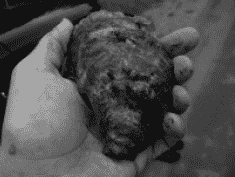
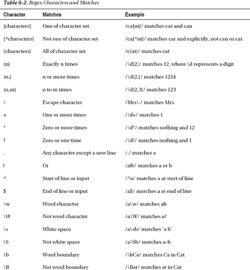
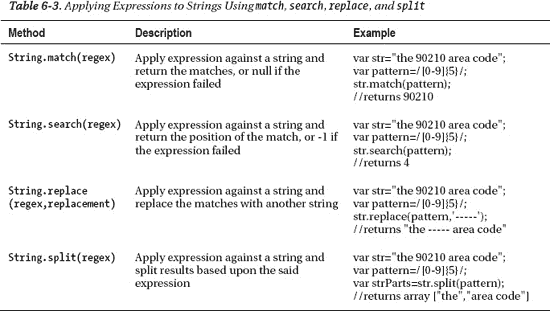

# 六、表单设计和管理

基于 Web 的表单是应用新数据的常见来源。一般来说，这些数据是非结构化的，在存储之前通常需要进行处理、格式化或其他处理。数据也可能来自潜在的不可靠来源。本章将演示从 web 表单中获取数据、使用 JavaScript 验证输入字段、通过 AJAX 请求将数据传递给 PHP 以及在数据存储服务中维护数据完整性的方法。我们还会给你一些关于操作图像、集成多种语言和使用正则表达式的建议。

### 数据验证

在基于 web 的表单中，有两个主要的数据验证区域，它们有两个不同的功能。第一种类型的验证发生在客户端使用 JavaScript 的表单中，第二种类型发生在 PHP 通过`GET`或`POST`请求在服务器端接收数据时。

JavaScript 验证的作用是双重的，两个动作都发生在客户端。它可以用来通知客户机(网站用户)关于输入数据的建议和警告，并将数据放入接收 PHP 脚本所寻找的一致模式中。PHP 验证更多地关注于维护接收到的数据的完整性，同时对其进行操作，使其与已经存储的数据保持一致和兼容。

我们将为 JavaScript 验证定义一个表单和两个表单元素——一个接受必需的姓和名，另一个接受带有可选区号的电话号码。对于此示例，表单中不会包含提交按钮；相反，它将由 JavaScript 在搜索函数中处理，并在发生`onblur`事件时被激活。这将在本章后面讨论。

在清单 6-1 的[中，我们使用了`GET`方法，这样我们就可以在浏览器的地址栏中显示提交的值。这将允许使用其他数据进行快速测试，并绕过 JavaScript 验证。](#list_6_1)

***清单 6-1。**使用`GET`方法的验证示例*

`<form method='GET' action='script7_1.php' name='script'>
<input type='text' id='name' name='name' onkeyup='validate(this);' onfocus='this.select();'
onblur='search();' value='First and Last Name' />
<input type='text' id='phone' name='phone' onkeyup='validate(this);' onfocus=
'this.select();' onblur='search();' value='Phone Number' />
</form>`

测试完成后，表格可以切换到`POST`方法。使用`POST`方法可以获得干净的 URL 外观，而表单参数对客户端是不可见的(例如，`[http://domain.com/dir/](http://domain.com/dir/)`或`[http://domain.com/dir/script.php](http://domain.com/dir/script.php)`)。或者，如果提交的页面可以被客户端加入书签，那么使用`GET`方法会更好，因为客户端在再次访问 web 页面时不需要再次“重新发布”表单数据。当使用`GET`方法时，表单提交后浏览器的 URL 将类似于`[http://domain.com/?var1=exa&var2=mple](http://domain.com/?var1=exa&var2=mple)`。

 **注**根据项目需求，您可以使用`POST`或`GET`方法。重要的是要记住，没有一种方法比另一种更安全；两者都可以利用。然而，使用`POST`可能会稍微安全一些，因为普通用户不能通过操作查询字符串获得不同的结果。请务必阅读关于安全的第 11 章了解更多详情。

当客户端在清单 6-1 的[文本框中输入时，JavaScript 验证函数被`onkeyup`事件调用，并传递`this`作为引用。这将允许 JavaScript 访问执行验证所需的所有元素属性。如果两个字段都通过了必要的验证，那么`onblur`事件将尝试使用 AJAX 提交表单。在第 15 章](#list_6_1)中，我们将研究如何执行 AJAX 请求。`onfocus`事件选择已经输入到文本框中的文本，这样客户端就不必删除已经输入的数据。这是通过在 JavaScript 中调用`select()`方法并使用当前元素的属性`(onfocus='this.select();')`来实现的。

我们将定义接受一个参数的`validate` JavaScript 函数(参见[清单 6-2](#list_6_2) )。验证将包括正则表达式模式匹配。我们将在本章的后面解释如何建立正则表达式。现在，我们将专注于基本结构。

***清单 6-2。**`validate`JavaScript 函数*

`function validate(a){
    if(a.value.length>3)
    switch(a.name){
        case 'name':
            if(a.value.match(/^[a-zA-Z\-]+ [a-zA-Z\-]+$/)){
                /* ... successful match code for name ... */
                return true;
            }else{
                /* ... no match code for name ... */
            }
        break;
        case 'phone':
            if(a.value.match((/^((\(|\[)?\d{3}?(\]|\))?(\s|-)?)?\d{3}(\s|-)?\d{4}$/)){
                /* ...successful match code for phone ... */
                return true;
            } else{
                /* ... no match code for phone ... */
            }
        break;
    }
    return false;
}//validate function`

`validate`函数仅在字符串长度大于三时才开始对表单输入字段进行检查。如果正在验证的数据集没有包含足够的字符，则必须调整验证阈值。如果在验证中执行的代码发出 AJAX 请求，限制字符串的长度也有助于避免对服务器资源造成不必要的压力，这些资源可能会执行数据库查找或运行算法。

 **注意**在[清单 6-2](#list_6_2) 中，我们假设收集的数据长度大于三个字符。不过，通常从表单中收集的数据包含三个或更少字符的字符串和数字。在这种情况下，`a.value.length>3` `if`语句可以被移到`case`语句中，并被调整以匹配被验证字段的每个模式。

接下来，我们将使用表单元素的名称来确定值需要匹配哪个表达式。通过返回`true`或`false`，我们也可以将这个函数用于我们的搜索函数。我们通过调用字符串的`match`函数来匹配文本框值和表达式。如果表达式匹配成功，则返回匹配字符串。如果不存在匹配，则返回`null`。

我们将在[清单 6-3](#list_6_3) 中定义`search`函数，它将验证两个表单字段，然后在[清单 6-4](#list_6_4) 中，我们将启动一个 AJAX 请求将表单值传递给一个 PHP 脚本。

***清单 6-3。**定义`search`功能*

`function search(){
    if(validate(document.getElementById('name'))
        &&validate(document.getElementById('phone'))){
        //build and execute AJAX request
    }
}//save function`

使用`search`函数，首先通过调用`validate`函数并传入元素属性来验证所需的参数。实际的表单提交是通过 AJAX 请求执行的。

如果姓名和电话文本框的值被验证，表单将请求 AJAX 提交一个类似于`[http://localhost/script7_1.php?name=john+smith&phone=(201) 443-3221](http://localhost/script7_1.php?name=john+smith&phone=(201)443-3221)`的 URL。我们现在可以开始构建 PHP 验证组件了。由于属性在 URL 中，我们可以通过手动调整 URL 中已知的异常和可接受的格式来测试不同的值。例如，我们使用以下 URL 测试 PHP 执行的名称验证:

`http://localhost/script7_1.php?name=Shérri+smith&phone=(201) 443-3221
http://localhost/script7_1.php?name=john+o'neil&phone=(201) 443-3221
http://localhost/script7_1.php?name=john+(*#%_0&phone=(201) 443-3221`

然后，我们可以使用下一组 URL 测试 PHP 执行的电话验证:

`http://localhost/script7_1.php?name=john+smith&phone=2014433221
http://localhost/script7_1.php?name=john+smith&phone=john+smith
http://localhost/script7_1.php?name=john+smith&phone=201 443-3221 ext 21`

我们现在可以介绍清单 6-4 中的 PHP 验证代码。

***清单 6-4。** PHP 验证*

`<?php
$formData=array();//an array to house the submitted form data
foreach($_GET as $key => $val){
        $formData[$key]=htmlentities($val,ENT_QUOTES,'UTF-8');
}
if(isset($formData['name'])&&isset($formData['phone'])){
    $expressions=array('name'=>"/^[a-zA-Z\-]+ [a-zA-Z\-]+$/",
                                        'phone'=>"/^((\(|\[)?\d{3}?(\]|\))?(\s|-)?)?\d{3}
(\s|-)?\d{4}$/"
                                 );
    if(preg_match($expressions['name'],$formData['name'],$matches['name'])===1 &&
       preg_match($expressions['phone'],$formData['phone'],$matches['phone'])===1){
        /*      code, do something with name and phone  */
    }
}
?>`

函数`preg_match`接受一个正则表达式，后跟一个与表达式匹配的字符串，然后是一个填充了匹配结果的数组。

有几个方便的 PHP 扩展也有助于数据验证、净化和表达式匹配。数据过滤是清理和验证数据的一种良好且一致的方式。它包括几个用于验证客户端输入数据的常用函数。[清单 6-5](#list_6_5) 通过过滤器库的 PHP `filter_var`函数使用 URL 和电子邮件验证过滤器。通过向函数传递一个字符串以及 sanitize 过滤器或 validate 过滤器来使用`filter_var`函数。sanitize 过滤器从字符串中删除不支持的字符，而 validate 过滤器确保字符串格式正确并包含正确的数据类型。

***清单 6-5。**PHP`filter_var`函数*

`<?php

//string(15) "email@example.com"
var_dump(filter_var('email@example.com', FILTER_VALIDATE_EMAIL));

//string(18) "e.mail@exam.ple.ab"
var_dump(filter_var('e.mail@exam.ple.ab', FILTER_VALIDATE_EMAIL));

//string(20) "em-ail@example.co.uk"
var_dump(filter_var('em-ail@example.co.uk', FILTER_VALIDATE_EMAIL));

//bool(false)
var_dump(filter_var('www.domain@.com', FILTER_VALIDATE_EMAIL));

//bool(false)
var_dump(filter_var('email@domain', FILTER_VALIDATE_EMAIL));` 
`//bool(false)
var_dump(filter_var('example.com', FILTER_VALIDATE_URL));

//bool(false)
var_dump(filter_var('www.example.com', FILTER_VALIDATE_URL));

//string(22) "http://www.example.com"
var_dump(filter_var('http://www.example.com', FILTER_VALIDATE_URL));

//string(23) "http://www.e#xample.com"
var_dump(filter_var('http://www.e#xample.com', FILTER_VALIDATE_URL));

//bool(false)
var_dump(filter_var('www example com', FILTER_VALIDATE_URL));

//bool(false)
var_dump(filter_var('www.ex#ample.com', FILTER_VALIDATE_URL));

?>`

整理过滤器对于准备一致的数据很有用。他们也使用`filter_var`功能。[清单 6-6](#list_6_6) 使用 URL 和电子邮件验证过滤器。

***清单 6-6。**使数据与 URL 和电子邮件一致验证过滤器*

`<?php

//string(15) "email@example.com"
var_dump(filter_var('email@example.com', FILTER_SANITIZE_EMAIL));

//string(17) "e.mail@exam.pl.ab"
var_dump(filter_var('e.mail@exam.plé.ab', FILTER_SANITIZE_EMAIL));

//string(20) "em-ail@example.co.uk"
var_dump(filter_var('em-ail@examp"le.co.uk', FILTER_SANITIZE_EMAIL));

//string(16) "www.dom!ain@.com"
var_dump(filter_var('www.dom!ain@.com', FILTER_SANITIZE_EMAIL));

//string(13) "email@do^main"
var_dump(filter_var('email@do^main', FILTER_SANITIZE_EMAIL));

//string(11) "example.com"
var_dump(filter_var('example.com', FILTER_SANITIZE_URL));` 
`//string(15) "www.example.com"
var_dump(filter_var("\twww.example.com", FILTER_SANITIZE_URL));

//string(22) "http://www.example.com"
var_dump(filter_var('http://www.example.com', FILTER_SANITIZE_URL));

//string(23) "http://www.e#xample.com"
var_dump(filter_var('http://www.e#xample.com', FILTER_SANITIZE_URL));

//string(13) "wwwexamplecom"
var_dump(filter_var('www example com', FILTER_SANITIZE_URL));

?>`

Perl 兼容的正则表达式(PCRE)库也包括一些有用的函数，比如正则表达式`find and replace`、`grep`、`match`和`match all`，还有一个方便的`find and replace using a callback`函数。

在清单 6-7 的[中，我们将使用`preg_match_all`函数来识别所有以大写字符开头，后面跟着小写字符的字符串。我们将使用`var_export`函数将`$matches`数组中匹配的结果转储到屏幕上。](#list_6_7)

***清单 6-7。**使用`preg_match_all`功能*

`<?php

$str='A Ford car was seen at Super Clean car wash.';
preg_match_all('/[A-Z][a-z]+/',$str,$matches);
var_export($matches);

/*
array (
  0 =>
  array (
    0 => 'Ford',
    1 => 'Super',
    2 => 'Clean',
  ),
)
*/

?>`

在[清单 6-7](#list_6_7) 中，`preg_match_all`被传递了三个参数，正则表达式，匹配的字符串，以及包含匹配的数组。我们还可以传递一个标志来调整`$matches`数组，并传递一个偏移量来从字符串中的某个字符位置开始，如[清单 6-8](#list_6_8) 所示。

***清单 6-8。**调整`$matches`阵列*

`<?php

$str='A Ford car was seen at Super Clean car wash.';

preg_match_all('/[A-Z][a-z]+/',$str,$matches,PREG_PATTERN_ORDER,5);
var_export($matches);

preg_match_all('/[A-Z][a-z]+/',$str,$matches,PREG_SET_ORDER);
var_export($matches);` 
`preg_match_all('/[A-Z][a-z]+/',$str,$matches,PREG_OFFSET_CAPTURE);
var_export($matches);

/*
// PREG_PATTERN_ORDER,5
array (
  0 =>
  array (
    0 => 'Super',
    1 => 'Clean',
  ),
)

// PREG_SET_ORDER
array (
  0 =>
  array (
    0 => 'Ford',
  ),
  1 =>
  array (
    0 => 'Super',
  ),
  2 =>
  array (
    0 => 'Clean',
  ),
)

// PREG_OFFSET_CAPTURE
array (
  0 =>
  array (
    0 =>
    array (
      0 => 'Ford',
      1 => 2,
    ),
    1 =>
    array (
      0 => 'Super',
      1 => 23,
    ),
    2 =>
    array (
      0 => 'Clean',
      1 => 29,
    ),
  ),
)
*/
?>`

PCRE 库中的其他函数以非常相似的方式工作，对于数据验证、提取和操作相关的任务非常有用。

### 上传文件/图像

向服务器添加文档是一种常见的请求。文档通常位于远程计算机或服务器上，必须移动到托管服务器。这可以使用表单元素来完成。

在通过基于 web 的表单向服务器添加文件之前，最好检查一下 PHP 配置文件。它包含许多设置，这些设置直接影响表单的工作方式、能做什么、能做多少以及持续多长时间。在对上传和表单相关问题进行故障排除时，熟悉并了解这些配置设置非常重要。另一个常见问题是拥有适当的权限来访问接收服务器上的目录。

考虑清单 6-9 中的表单，它允许通过浏览/上传过程或者通过来自服务器的 URL 添加文档。在表单中，定义了一个新的表单属性`enctype`，它定义了表单数据的编码方式。当表单使用二进制数据(在本例中为输入类型文件)时，这是必需的。

***清单 6-9。**定义`enctype`属性*

`<form action='script7_9.php' method='post' enctype='multipart/form-data'>
<input type='file' name='localfile' />
<input type='text' name='remoteurl' />
<input type='Submit' value='Add Document' name='Submit' />
</form>`

如果没有在表单标签中定义，`enctype`的默认值是`application/x-www-form-urlencoded`，它将处理除文件上传和非 ASCII 数据之外的大多数输入类型。当网站用户提交这个表单时，两个不同的 PHP 超全局变量将包含数据:`localfile`输入字段的`$_FILES`和`remoteurl`输入字段的`$_POST`。`$_FILES`将包含关于`localfile`的元数据。`$_FILES`包含的元数据如[表 6-1](#tab_6_1) 所示。

在将清单 6-9 中`localfile`的文件移动到永久存储位置之前，最好确保该文件来自 HTTP POST。这可以使用函数`is_uploaded_file()`来完成，它接受一个参数，临时文件名`['tmp_name']`。上传后，要将文件移动到某个目录，可以使用`move_uploaded_file()`函数，该函数接受两个参数，临时名称`['tmp_name']`和目标名称。

对于输入远程 URL，我们可以使用几个选项从远程 URL 获取文件。通过 HTTP、HTTPS 和 FTP 下载文件的一种便捷方法是通过`shell_exec`函数使用`wget`(一个命令行实用程序)，它执行一个 shell 命令并返回输出(如果有的话)。下载文档的其他方法包括 socket 相关的工具，如 fsocketopen 或 curl。可以使用以下语法下载文件:

`shell_exec('wget '. escapeshellcmd($_POST['remoteurl']));`

注意`escapeshellcmd`功能的使用。这用于转义常用的恶意字符，以防止在服务器上执行任意命令。

### 图像转换和缩略图

在使用基于 web 的应用时，图像是一种常见的文件类型。这些可以用在照片图库、截图和幻灯片中。在上一节中，您学习了如何从浏览器上传表单或者通过命令行实用程序`wget`结合`shell_exec`向服务器添加文档。既然文件已经驻留在服务器上，我们就可以开始操作它们，使之适合其他应用所需的结构。

PHP 有一个叫做 GD 的图像库。它包含一个可以创建和操作图像的函数列表。我们将只触及那些调整大小和转换的一小部分。名为`php_info()`的函数可以用来检查安装在服务器上的 GD 的版本。

创建缩略图时，我们将创建原始图像的 PNG 副本，宽度调整为 200 像素，高度将根据原始图像而变化。为了获得图像的大小，我们将使用函数`getimagesize()`，该函数接受图像名称作为参数，并返回一个包含`width`、`height`和`mime`的元数据数组。让我们考虑一下[清单 6-10](#list_6_10) 。

***清单 6-10。**使用`getimagesize()`功能*

`<?php
$imgName='image.jpg';
$thumbName='thumb.png';
$metaData=getimagesize($imgName);
$img='';` 
`$newWidth=200;
$newHeight=$metaData[1]/($metaData[0]/$newWidth);

switch($metaData['mime']){
    case 'image/jpeg':
        $img=imagecreatefromjpeg($imgName);
    break;
    case 'image/png':
        $img=imagecreatefrompng($imgName);
    break;
    case 'image/gif':
        $img=imagecreatefromgif($imgName);
    break;    
    case 'image/wbmp':
        $img=imagecreatefromwbmp($imgName);
    break;    

}

if($img){
    $imgThumb=imagecreatetruecolor($newWidth,$newHeight);
    imagecopyresampled($imgThumb,$img,0,0,0,0,$newWidth,$newHeight,$metaData[0],$metaData[1]);
    imagepng($imgThumb, $thumbName);
    imagedestroy($imgThumb);
}
?>`

名为`$metadata`的数组包含 MIME 类型以及原始图像的高度和宽度。这些信息将用于在 GD 中打开原始图像。我们现在可以为缩略图确定`$newheight`的值。MIME 类型是通过 switch 语句发送的，因此我们可以处理不同类型的图像文件。`imagecreatefromjpg`和类似的函数将打开原始图像并返回该图像的资源句柄。使用`imagecreatetruecolor`创建具有定义宽度和高度的缩略图。当创建图像的副本时，`imagecopyresampled`函数接受几个参数，缩略图的资源句柄，原始文件的资源句柄，目的点和源点的 *x* 和 *y* 值，新的宽度和高度，以及原始宽度和高度。缩略图是通过提供 thumb 资源和一个新文件名用`imagepng`创建的。使用`imagedestroy`函数并传递 thumb 资源，资源最终被销毁。

最终结果是我们想要的缩略图格式的 PNG 图像。在[清单 6-11](#list_6_11) 中，显示了来自`getimagesize()`的 image.jpg 和 thumb.png 的输出。

***清单 6-11。**image.jpg 和 thumb.png 从`getimagesize()`T4 输出*

`//image.jpg
array (
  0 => 1600,
  1 => 1200,
  2 => 2,
  3 => 'width="1600" height="1200"',
  'bits' => 8,` 
`  'channels' => 3,
  'mime' => 'image/jpeg',
)
//thumb.png
array (
  0 => 200,
  1 => 150,
  2 => 3,
  3 => 'width="200" height="150"',
  'bits' => 8,
  'mime' => 'image/png',
)`

在[图 6-1](#fig_6_1) 中显示的缩略图是由[清单 6-10](#list_6_10) 中的脚本创建的。原始图像是一个宽 1200 像素、高 900 像素的 JPEG，输出图像是一个宽 200 像素、高 150 像素的 PNG。

***图 6-1。**创建的缩略图[清单 6-10](#list_6_10)T5】*

### 正则表达式

正则表达式对于描述文本中的模式很有用，可以用在 JavaScript、MySQL 和 PHP 中。在我们开始构建正则表达式(regex)之前，我们应该首先获得一个正则表达式编辑器。在 Windows 上，Regex Tester by `antix.co.uk`是免费的，使用简单。还有许多其他可用的正则表达式编辑器，其中一些具有更多功能。然而，作为开始，Regex Tester 是一个很好的工具。

[表 6-2](#tab_6_2) 列出了 regex 中可用的字符及其各自的匹配。

在[表 6-2](#tab_6_2) 中，我们看到了常用的字符以及它们匹配的内容。在[清单 6-7](#list_6_7) 和[清单 6-8](#list_6_8) 中，使用了正则表达式`[A-Z][a-z]+`。基于[表 6-2](#tab_6_2) ，表达式现在可以读作:匹配一个大写字母字符一次`[A-Z]`，后面跟着一个小写字母字符`[a-z]`重复一次或多次`+`。大小写字母 A 和 Z 之间使用的连字符被解释为 A 和 Z 之间的任何字符。连字符的另一个例子是`[a-e]`，它匹配 A、b、c、d 和 e，但不匹配 f 或 g，或者使用数字`[1-3]`，它匹配 1、2 或 3，但不匹配 4 或 5。表达式`[A-Z][a-z]{4}`将匹配以大写字符开头的所有五个字母单词。

在 JavaScript 中，我们可以通过使用[表 6-3](#tab_6_3) 中定义的字符串方法`match`、`search`、`replace`和`split`将表达式应用于字符串。也可以使用`RegExp`对象，它有`compile`、`exec`和`test`方法，都在[表 6-4](#tab_6_4) 中定义。

T2】

在 PHP 中，我们可以使用 PCRE 函数将正则表达式应用于字符串，并执行各种函数([表 6-5](#tab_6_5) )..

正如这些使用 PHP 和 JavaScript 的例子所示，正则表达式非常有用，是执行简单和复杂数据操作的好工具。表达式也可以在 MySQL 中用来执行复杂的搜索。例如，查询可以是`"select * from contacts where civics regexp '[0-9]{5}'"`，它将返回在 civics 列中包含有效的 5 位邮政编码(或者任何其他 5 位数字)的所有记录。

### 多语言集成

当查看预期以某种方式输出的数据时，总是令人惊讶，您会遇到那些看起来奇怪的 A 或问号或其他奇怪的字符嵌套在应该是干净的数据中。大多数情况下，这是某种编码错误的结果。无论是来自表单、CSV 文件还是从文档中提取的文本，输入数据的脚本都不期望某些特定字符集之外的字符，可能是 ISO-8859-1 或 UTF-8。

 **注**ISO-8859-1(Latin-1)字符集包含 8 位单字节 ASCII 编码图形字符集，包括标准和扩展 ASCII 字符(0-255)。UTF 8 字符集是 unicode 的多字节字符编码，包含 ISO-8859-1 中的字符，包括带有音调符号的字符。

当您遇到编码问题时，有一些事情需要观察和识别。数据的来源很重要，如果是来自网页，最好确认定义了正确的内容类型。这可以在 XHTML 的 HEAD 部分找到。如果我们将内容类型设置为 UTF-8，它将如下所示:

`<meta http-equiv="Content-Type" content="text/html; charset=UTF-8" />`

数据库可能是编码问题的另一个来源。创建 MySQL 数据库时，会设置一个排序规则。表和行也是如此。如果在数据库不期望的时候提供了 UTF-8 字符，则该字符在存储时可能会被误传。如果我们接受 MySQL 的 UTF-8 字符，排序规则可能是`utf8_general_ci`(不区分大小写)或者`utf8_unicode_ci`。我们还可以在建立数据库连接后，通过执行查询`'set names utf8'`来请求 MySQL 采用 UTF-8 字符集。

最后，PHP 代码可能无法正确识别字符串的正确编码。有几个函数和库可以帮助解决编码问题，还有一些标志可以采用特定的字符集。函数`utf8_encode()`将把一个 ISO-88591 字符串编码成 UTF-8。将某种字符编码转换成另一种编码的另一个有用的函数是使用`mb_convert_encoding()`函数，它接受一个字符串、to 编码类型和 from 编码类型。`'mb_*'`函数来自多字节字符串函数库，包含许多不同的多字节字符函数，比如`mb_substr`(获取字符串的一部分)、`mb_strlen`(获取字符串的长度)，或者`mb_eregi_replace` (regex find replace)。某些 PHP 函数也接受`charset`标志。例如，当使用`htmlentities()`时，我们可以传递一个标志来指定 UTF-8 字符集`htmlentities($str,ENT_QUOTES,'UTF-8')`。

除了 MB 函数，PHP 提供的人类语言和字符编码支持中还有`iconv`模块。`iconv`函数，特别是`iconv()`函数会将字符串转换成定义的字符编码。通过使用函数`iconv("UTF-8","ISO-8859-1//IGNORE//TRANSLIT",$str)`，我们可以将一个 UTF-8 字符串转换成它的 ISO-8859-1 等价物。`//IGNORE`和`//TRANSLIT`标志用于指定如何处理不可转换的字符。`IGNORE`标志无声地删除未知字符和所有后续字符，其中`TRANSLIT`将尝试猜测要转换成的正确字符。

### 总结

在设计和编写基于 web 的表单时，有许多问题需要记住，比如数据验证、维护数据完整性和操作文件(包括图像)。在本章中，我们向您展示了一系列解决这些问题的技术，并辅以合适的代码示例和参考信息。您可以在客户端使用 JavaScript 验证输入数据，也可以在服务器端使用 PHP 验证输入数据。这些方法是互补的，因为客户端验证侧重于确保用户输入可接受的数据，而服务器端验证更多地着眼于维护数据库的完整性和一致性。

没有一个真正的开发人员能够放弃正则表达式(regex ),所以我们在本书的上下文中提供了一个简短的介绍。Regex 可以在许多情况下用于查找、匹配、拆分和替换字符串或部分字符串；我们在 JavaScript 和 PHP 中都提供了这种类型的简单示例。最后但同样重要的是，关于多语言集成的最后一个简短部分强调了确保数据以预期和可接受的格式传输的重要性。

在下一章，我们将研究 PHP 与传统关系数据库之外的数据库的集成；例如 SQLite3、MongoDB 和 CouchDB。