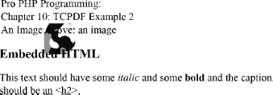
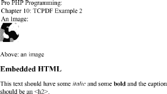
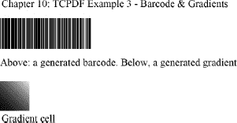
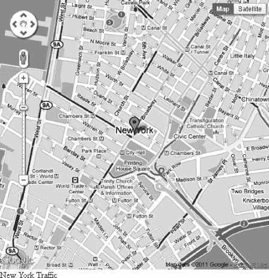
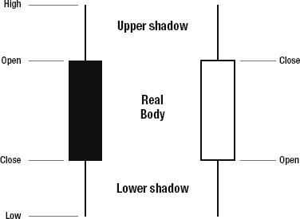
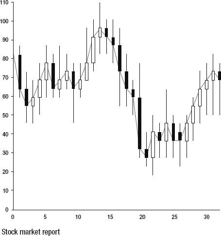

# 十、库

PHP 是一种用途广泛的通用语言。现在有许多成熟的、功能丰富的开源库。这是一件好事，因为作为程序员，我们希望尽可能不要重新发明轮子。库可以节省我们的时间和精力。本章非常注重实践，我们将展示如何:

*   使用 *SimplePie* 解析 RSS 提要
*   使用 *TCPDF* 生成 PDF
*   使用 *cURL* 和 *phpQuery* 从网站上抓取数据
*   使用 php-google-map-api 整合 Google 地图
*   使用 *PHPMailer* 生成电子邮件和短信
*   用 *gChartPHP* 包装 Google Chart API

**服务器设置**

对于本章的所有例子，让我们假设我们的文档根是`/htdocs/`。

那么我们相对于根目录的本地服务器文件系统设置将是:

`/htdocs/library1/
/htdocs/library2/
…
/htdocs/example1.php
/htdocs/example2.php
…`

这将对应于以下位置的浏览器输出:

`http://localhost/library1/
http://localhost/library2/
http://localhost/example1.php
http://localhost/example2.php`

### 单纯形

SimplePie 是一个支持非常简单的 RSS 和 Atom-feed 消费的库。SimplePie 还提供了高级功能，有很好的文档记录，并且是免费的。从`[http://simplepie.org/](http://simplepie.org/)`下载 SimplePie，放在`/htdocs/simplepie/`。在您的浏览器中，`[http://localhost/simplepie/compatibility_test/sp_compatibility_test.php](http://localhost/simplepie/compatibility_test/sp_compatibility_test.php)`页面将帮助您解决服务器设置问题。如果您收到以下消息，您可以启用 cURL 扩展:

`"cURL: The cURL extension is not available. SimplePie will use fsockopen() instead."`

但是，正如输出所说的，这不是严格需要的，选择由您决定。

让我们看看来自`wired.com`的 RSS 提要。在关于 XML 的第 14 章中，我们将在不使用 SimplePie 库的情况下重新访问这个提要。提要 URL 是`http://feeds.wired.com/wired/index?format=xml`。SimplePie 抛出了几个`E_DEPRECATED`错误，这是 PHP 5.3 中新增的。我们将使用行`error_reporting(E_ALL ^ E_NOTICE ^ E_DEPRECATED);. See [Listing 10-1](#list_10_1).`禁用该消息的输出

***清单 10-1。**简单派基本用法*

`<HTML>
<HEAD>
<meta http-equiv="Content-Type" content="text/html; charset=UTF-8" />
</HEAD>
<BODY>
<?php
error_reporting ( E_ALL ^ E_NOTICE ^ E_DEPRECATED );
require_once ('simplepie/simplepie.inc');

$feed_url = "http://feeds.wired.com/wired/index?format=xml";
$simplepie = new Simplepie ( $feed_url );

foreach ( $simplepie->get_items () as $item ) {
        echo '
<strong><a href="' . $item->get_link () . '">';
        echo $item->get_title () . '</a></strong> ';
        echo '<em>' . $item->get_date () . '</em> ';
        echo $item->get_content () . '
';
}
?>
</BODY>
</HTML>`

如果您收到警告“`./cache is not writeable. Make sure you've set the correct relative or absolute path, and that the location is server-writable`”，那么我们需要解决这个问题。要么提供一个可写的自定义路径作为构造函数的第二个参数，要么在与我们的脚本相同的目录中创建一个名为`'cache'`的可写文件夹。[图 10-1](#fig_10_1) 显示了[清单 10-1](#list_10_1) 的输出。

***图 10-1。**[清单 10-1 的示例浏览器输出](#list_10_1)*

我们自己在[第 14 章](14.html#ch14)的代码并不比这个例子长多少。使用 SimplePie 库的真正优势是它更加可配置和成熟。它处理不同类型的提要，如果解析过程越复杂，它将为我们节省大量的工作。SimplePie 有很多辅助方法来完成任务，比如检索 favicon 或社交媒体字段。它还具有内置的清理支持和订阅管理。SimplePie 有用于外部框架、CMSes 和 API 的插件。在[清单 10-2](#list_10_2) 中，我们添加了 feed 链接的 favicon 图像并格式化了日期。

***清单 10-2。** SimplePie 添加图标和自定义格式化日期*

`<HTML>
<HEAD>
<meta http-equiv="Content-Type" content="text/html; charset=UTF-8" />
</HEAD>
<BODY>
<?php
error_reporting ( E_ALL ^ E_NOTICE ^ E_DEPRECATED );
require_once ('simplepie/simplepie.inc');` `$feed_url = "http://feeds.wired.com/wired/index?format=xml";
$simplepie = new Simplepie ( $feed_url );

**$favicon = $simplepie->get_favicon ();**
foreach ( $simplepie->get_items () as $item ) {
        **echo '
&nbsp; &nbsp;';**
        echo '<strong><a href="' . $item->get_link () . '">';
        echo $item->get_title () . '</a></strong> ';
        **echo '<em>' . $item->get_date ( 'd/m/Y' ) . '</em> ';**
        echo $item->get_content () . '
';
}
?>
</BODY>
</HTML>`

我们的最后一个例子将处理 RSS 提要中的命名空间元素。如果您不确定在某个提要中填充了哪些字段，请在 web 浏览器中查看源代码并检查 XML。在我们来自 Wired 的样例提要中，作者是一个命名空间元素`"dc:creator".`

`<rss xmlns:dc="http://purl.org/dc/elements/1.1/" xmlns:feedburner="http://rssnamespace.org/feedburner/ext/1.0" version="2.0">`

我们可以看到 dc 对应于`http://purl.org/dc/elements/1.1/`，可以用`get_item_tags`的方法来考察一个项的结构。参见[清单 10-3](#list_10_3) 和[清单 10-4](#list_10_4) 。

***清单 10-3。**检查带有名称空间的元素的结构*

`<?php
error_reporting ( E_ALL ^ E_NOTICE ^ E_DEPRECATED );
require_once ('simplepie/simplepie.inc');

$feed_url = "<ins>http://feeds.wired.com/wired/index?format=xml</ins>";
$simplepie = new Simplepie ( $feed_url );
$item = array_pop($simplepie->get_items());
$creator = $item->get_item_tags("http://purl.org/dc/elements/1.1/", "creator");
var_dump($creator);`

输出

`array
 0 =>
    array
     'data' => string 'Sample Author' (length=13)
     'attribs' =>
       array
         empty
     'xml_base' => string '' (length=0)
     'xml_base_explicit' => boolean false
     'xml_lang' => string '' (length=0)`

现在我们知道了 creator 元素的结构，我们可以将它添加到我们的脚本中。

***清单 10-4。**添加命名空间元素创建者*

`<HTML>
<HEAD>
<meta http-equiv="Content-Type" content="text/html; charset=UTF-8" />
</HEAD>
<BODY>
<?php

error_reporting ( E_ALL ^ E_NOTICE ^ E_DEPRECATED );
require_once ('simplepie/simplepie.inc');

$feed_url = "http://feeds.wired.com/wired/index?format=xml";
$simplepie = new Simplepie ( $feed_url );

$favicon = $simplepie->get_favicon ();
foreach ( $simplepie->get_items () as $item ) {
        **$creator = $item->get_item_tags ( "http://purl.org/dc/elements/1.1/", "creator" );**
        echo '
&nbsp; &nbsp;';
        echo '<strong><a href="' . $item->get_link () . '">';
        echo $item->get_title () . '</a></strong> ';
        echo '<em>' . $item->get_date ( 'd/m/Y' ) . '</em> ';
        **echo '<em>' . $creator [0] ['data'] . '</em> ';**
        echo $item->get_content () . '
';
}
?>
</BODY>
</HTML>
The output from [Figure 10-4](#fig_10_4) is shown in [Figure 10-2](#fig_10_2).` 

***图 10-2。**清单 10-4[的浏览器输出](#list_10_4)，显示图标和故事创建者*

有关 SimplePie API 的更多方法和文档，请参考位于`[http://simplepie.org/wiki/reference/start](http://simplepie.org/wiki/reference/start)`的优秀文档。

### TCPDF

TCPDF ( `tecnick.com` PDF)是一个用 PHP 生成 PDF 文档的库。它不需要外部库，非常受欢迎，正在积极开发中。TCPDF 可在`[www.tcpdf.org.](http://www.tcpdf.org.)`找到 TCPDF 功能全面，支持通过 PHP GD 和 imagemagick 的图形、条形码、渐变、HTML、CSS、字体、布局管理、页眉和页脚。默认定义和设置在配置文件中，可在`/htdocs/tcpdf/config/tcpdf_config.php`找到。

用 TCPDF 生成 PDF 时，命令行执行会比在浏览器中更快。浏览器速度也可能大相径庭。例如，Chrome 浏览器内置的 PDF 渲染器速度惊人。通过 TCPDF 生成 PDF 会占用大量内存和执行时间。我们可能需要调整几个`php.ini`设置。

`max_execution_time = 90 //adjust up or down as necessary
memory_limit = 256M     //increase/decrease as necessary`

清单 10-5 用最少的编码在 PDF 中生成一行文本。

***清单 10-5。**最小 TCPDF 示例*

`<?php

error_reporting(E_ALL);
require_once('/tcpdf/config/lang/eng.php');
require_once('/tcpdf/tcpdf.php');

//Construct a new TCPDF object
$pdf = new TCPDF();

//add a page
$pdf->AddPage();

//assign text
$txt = "Pro PHP Programming - [Chapter 10](#ch10): TCPDF Minimal Example";

//print the text block
$pdf->Write( 20, $txt );

//save the PDF
$pdf->Output( 'minimal.pdf', 'I' );

?>`

在清单 10-5 中，我们包含了语言配置文件和库入口文件。然后我们构造一个新的`TCPDF`对象，并通过`AddPage`方法调用向其添加一个页面。我们写一行高度为 20 的文本，然后生成我们的 PDF。`'I'`选项是使用一个可用的插件在我们的浏览器中查看文档。

构造函数有许多可选参数，用于设置方向、单位、格式、unicode 用法、编码和磁盘缓存。相应的默认值为纵向、毫米、A4、真、UTF-8 和假。对于 diskcache，false 速度更快，但会消耗更多 RAM。True 由于磁盘写入而较慢，但使用的 RAM 较少。

`Write`方法只需要行高和文本，但是有大约十个可选参数。`Output`方法将文件名或原始数据字符串作为第一个参数。当表示一个数据字符串时，第一个字符应该是一个`@`符号。当表示文件名时，非法字符被删除，空白被转换成下划线。保存选项包括使用插件在线浏览(默认),强制下载，保存到服务器，以原始字符串或电子邮件附件的形式返回文档。

 **注意**像`Write`这样的方法调用中可选参数的数量很难记住，而且很容易混淆。设计 API 时，考虑让方法签名对程序员友好。这可以通过限制方法参数的数量或传入关联数组或对象来实现。参数太多也是一种“代码味”罗伯特·马丁在*干净代码*中说得好(Prentice-Hall，2009 年):

一个函数的理想参数个数是零。接下来是一个(一元)，紧接着是两个(二元)。应尽可能避免三个参数(三元组)。超过三个(多音节)需要非常特殊的理由——然后无论如何都不应该使用。”

参数越少，记忆就越容易或不必要。然而，使用 IDE——比如 Zend Studio 或 Netbeans——将提供到源代码和自动完成提示的内联链接。

从图形上看，TCPDF 包含使用 GD 图像、带 alpha 的 PNG 或 EPS 的方法；或者组成诸如圆形、直线和多边形的形状。与大多数方法一样，有大量可配置的可选参数。记住参数并不重要，只需根据需要在`tcpdf.php`文件中查找即可。

在[清单 10-6](#list_10_6) 中，我们将展示如何在文档中输出图像和 HTML 格式的文本。

***清单 10-6。**第二个带有图像和 HTML 的 TCPDF 示例*

`<?php

error_reporting ( E_ALL );
require_once ('/tcpdf/config/lang/eng.php');
require_once ('/tcpdf/tcpdf.php');

//Contruct a new TCPDF object
$pdf = new TCPDF ();

//set document meta information
$pdf->SetCreator ( PDF_CREATOR );
$pdf->SetAuthor ( 'Brian Danchilla' );
$pdf->SetTitle ( 'Pro PHP Programming - [Chapter 10](#ch10)' );
$pdf->SetSubject ( 'TCPDF Example 2' );
$pdf->SetKeywords ( 'TCPDF, PDF, PHP' );

//set font
$pdf->SetFont ( 'times', '', 20 );` `//add a page
$pdf->AddPage ();
$txt = <<<HDOC
Pro PHP Programming:
[Chapter 10](#ch10): TCPDF Example 2
An Image:
HDOC;
$pdf->Write ( 0, $txt );

//image scale factor
$pdf->setImageScale ( PDF_IMAGE_SCALE_RATIO );

//JPEG quality
$pdf->setJPEGQuality ( 90 );

//a sample image
$pdf->Image ( "bw.jpg" );

$txt = "Above: an image<h2>Embedded HTML</h2>
This text should have some <em>italic</em> and some <strong>bold</strong>
and the caption should be an &lt;h2&gt;.";

$pdf->WriteHTML ( $txt );

//save the PDF
$pdf->Output ( 'image_and_html.pdf', 'I' );
?>
The results of running this example are shown in [Figure 10-3](#fig_10_3).` 

***图 10-3。**运行[清单 10-6](#list_10_6) 导致文本和图像重叠*

在[清单 10-6](#list_10_6) 中，我们设置了文档元数据和我们的字体。就像我们在清单 10-5 中的第一个例子，我们添加了一个带有`Write`的文本块。然后，我们设置一些图像属性，并用`Image`方法输出我们的图像。最后，我们嵌入 HTML 标签并用`WriteHTML`方法输出标记。

默认情况下，徽标将输出到光标最后停留的位置。这导致我们的一些输出重叠。为了解决这个问题，我们将用[清单 10-7](#list_10_7) 中的`Ln`方法添加一些换行符。`Ln`可选地将高度值作为参数。默认高度将等于先前写入的元素的高度。

***清单 10-7。**通过插入换行符解决重叠问题*

`<?php

error_reporting ( E_ALL );
require_once ('/tcpdf/config/lang/eng.php');
require_once ('/tcpdf/tcpdf.php');

//Contruct a new TCPDF object
$pdf = new TCPDF ();

//set document meta information
$pdf->SetCreator ( PDF_CREATOR );
$pdf->SetAuthor ( 'Brian Danchilla' );
$pdf->SetTitle ( 'Pro PHP Programming - [Chapter 10](#ch10)' );
$pdf->SetSubject ( 'TCPDF Example 2' );
$pdf->SetKeywords ( 'TCPDF, PDF, PHP' );

//set font
$pdf->SetFont ( 'times', '', 20 );

//add a page
$pdf->AddPage ();
$txt = <<<HDOC
Pro PHP Programming:
[Chapter 10](#ch10): TCPDF Example 2
An Image:
HDOC;
$pdf->Write ( 0, $txt );
**$pdf->Ln ();**

//image scale factor
$pdf->setImageScale ( PDF_IMAGE_SCALE_RATIO );

//JPEG quality
$pdf->setJPEGQuality ( 90 );

//a sample image
$pdf->Image ( "bw.jpg" );
**$pdf->Ln ( 30 );**

$txt = "Above: an image
<h2>Embedded HTML</h2>
This text should have some <em>italic</em> and some <strong>bold</strong>
and the caption should be an &lt;h2&gt;.";

$pdf->WriteHTML ( $txt );

//save the PDF
$pdf->Output ( 'image_and_html.pdf', 'I' );
?>`

运行这个例子的结果可以在[图 10-4](#fig_10_4) 中看到。

***图 10-4。**运行[清单 10-7](#list_10_7) 修复重叠问题*

我们的第三个也是最后一个 TCPDF 用法的例子，见[清单 10-8](#list_10_8) ，将输出一个条形码和渐变。可用的条形码类型可在`barcodes.php`文件中找到。输出条形码的方法有`write1DBarcode`、`write2DBarCode,`和`setBarcode`。渐变方式有`Gradient`、`LinearGradient`、`CoonsPatchMesh,`和`RadialGradient`。

***清单 10-8。** TCPDF 生成条形码和渐变*

`<?php

error_reporting ( E_ALL );
require_once ('/tcpdf/config/lang/eng.php');
require_once ('/tcpdf/tcpdf.php');

//Contruct a new TCPDF object
$pdf = new TCPDF ();

//set document meta information
$pdf->SetCreator ( PDF_CREATOR );
$pdf->SetAuthor ( 'Brian Danchilla' );
$pdf->SetTitle ( 'Pro PHP Programming - [Chapter 10](#ch10)' );
$pdf->SetSubject ( 'TCPDF Example 3 - Barcode & Gradient' );
$pdf->SetKeywords ( 'TCPDF, PDF, PHP' );

//set font
$pdf->SetFont ( 'times', '', 20 );

//set margins
**$pdf->SetMargins( PDF_MARGIN_LEFT, PDF_MARGIN_TOP, PDF_MARGIN_RIGHT );**

//add a page
$pdf->AddPage();
$txt = <<<HDOC
[Chapter 10](#ch10): TCPDF Example 3 - Barcode & Gradients
HDOC;
$pdf->Write( 20, $txt );` `$pdf->Ln();

**$pdf->write1DBarcode('101101101', 'C39+');**

$pdf->Ln();

$txt = "Above: a generated barcode. Below, a generated gradient image";

$pdf->WriteHTML($txt);

$pdf->Ln();

**$blue = array( 0, 0, 200 );**
**$yellow = array( 255, 255, 0 );**
**$coords = array( 0, 0, 1, 1 );**

**//paint a linear gradient**
**$pdf->LinearGradient( PDF_MARGIN_LEFT, 90, 20, 20, $blue, $yellow, $coords );**
**$pdf->Text( PDF_MARGIN_LEFT, 111, 'Gradient cell' ); //label**

//save the PDF
$pdf->Output( 'barcode_and_gradient.pdf', 'I' );
?>`

清单 10-8 中的代码增加了设置页边距、编写条形码和绘制线性渐变的功能。运行这个例子会产生[图 10-5](#fig_10_5) 。

***图 10-5。**用 TCPDF 生成的条码和渐变*

最后，您应该知道您可以用方法`SetAutoPageBreak`改变分页符的行为。默认情况下，分页是自动的，就像调用了`$pdf->SetAutoPageBreak( TRUE, PDF_MARGIN_FOOTER);`一样。要关闭自动分页，你可以调用`$pdf->SetAutoPageBreak( FALSE );`。如果没有自动分页符，一页上放不下的任何额外数据都会被删除。这就需要程序员增加更多的`AddPage`调用，检查页面内容的大小。使用自动分页符，不适合的数据会输出到新页面上。

#### 抓取网站数据

有时候，我们希望从一个网站检索信息，但是通过 web 服务 API 调用或提要并不容易访问。我们感兴趣的数据以原始 HTML 的形式呈现。我们希望以自动化的方式获得数据，以便进行进一步的数据处理。这个过程被称为页面抓取。

抓取数据不如从提要或 API 接收 XML 数据精确。但是，我们可以使用上下文线索，如 CSS 元素、id 和类值，并定期在表中输出数据，以理解检索到的数据。更严格遵循格式的网站提供更容易精确抓取的数据。

抓取网站数据是一个两步的过程。首先，我们需要获取远程内容，然后我们必须对其进行处理。抓取远程内容可以简单地通过`file_get_contents`函数来完成，或者使用 cURL 库的更多配置选项来完成。我们可以对数据做的一些事情是直接显示它，过滤/解析它的特定内容，或者将它存储在文件或数据库中。

在本节中，我们关注第二个选项，解析特定的内容。对于一般内容，我们可以用正则表达式来完成。对于我们的 HTML 示例，将数据加载到 DOMDocument 对象中更有意义。我们将展示如何将 DOMDocument 与 DOMXPath 一起使用。我们还将使用 phpQuery 库展示等效的功能。

phpQuery 包装了 DOMDocument，旨在成为服务器端 jQuery 符号的“端口”。因此，如果您已经了解 jQuery，那么这个库将很容易上手。关于 XML、DOM 和 jQuery 的更多信息可以在第 14 章和第 15 章中找到。

 **注意**如果你收到消息`Fatal error: Call to undefined function curl_init()`，那么你需要安装或者启用`cURL`扩展。如果您的系统中没有`cURL`库，您可能需要下载它。

在`php.ini`中添加或启用延长线:

`;windows:
extension=php_curl.dll

;linux:
extension=php_curl.so`

并重新启动您的 web 服务器

在清单 10-9 的[中，我们将使用 cURL 从](#list_10_9)`[www.nhl.com](http://www.nhl.com)`获取和输出数据。

***清单 10-9。**基本卷发用法*

`<?php
error_reporting ( E_ALL ^ E_NOTICE );

$url = "http://www.nhl.com";
print fetchRawData ( $url );

function fetchRawData($url) {
        $ch = curl_init ();
        curl_setopt ( $ch, CURLOPT_URL, $url );
        curl_setopt ( $ch, CURLOPT_RETURNTRANSFER, true ); //return the output as a variable
        curl_setopt ( $ch, CURLOPT_FAILONERROR, true ); //fail if error encountered
        curl_setopt ( $ch, CURLOPT_FOLLOWLOCATION, true ); //allow redirects
        curl_setopt ( $ch, CURLOPT_TIMEOUT, 10 ); //time out length

        $data = curl_exec ( $ch );
        if (! $data) {
                echo " cURL error: \n";
                echo "#" . curl_errno ( $ch ) . " \n";
                echo curl_error ( $ch ) . " \n";
                echo "Detailed information:";
                var_dump ( curl_getinfo ( $ch ) );
                die ();
        }

        curl_close ( $ch );
        return $data;
}

?>`

在[清单 10-9](#list_10_9) 中，我们用`curl_init()`得到了一个 cURL 资源句柄。然后我们用`curl_setopt`调用配置 cURL 设置。`curl_exec`执行请求并返回结果。最后，我们检查结果是否为非空。如果是，那么我们使用`curl_errno`、`curl_error`和`curl_getinfo`来排除故障。`curl_getinfo`包含关于最后一个请求的信息。典型的错误如下所示:

`cURL error:
#6
Could not resolve host: www.znhlz.com; Host not found`

cURL 是非常可配置的。其他一些选项包括:

`curl_setopt( $ch, CURLOPT_POST, true );                           //POST request
curl_setopt( $ch, CURLOPT_POSTFIELDS, "key1=value1&key2=value2" );//POST key/value pairs
curl_setop($ch, CURLOPT_USERPWD, "username:password" );           //for authenticated sites
//some sites block requests that do not have the user agent sent
curl_setopt( $ch, CURLOPT_USERAGENT, $userAgent );`

如果我们不需要大量配置并且在`php.ini,`中启用了`file_get_contents`用法，那么[清单 10-9](#list_10_9) 中的脚本可以简化为[清单 10-10](#list_10_10) 。

***清单 10-10。**使用文件获取内容简化内容获取*

`<?php
error_reporting(E_ALL ^ E_NOTICE);

$url = "<ins>http://www.nhl.com</ins>";
print fetchRawData( $url );

//our fetching function
function fetchRawData( $url ) {
  **$data = file_get_contents($url);**
   **if( $data === false ) {**
     **die("Error");**
   **}**
  **return $data;**
}

?>`

在基于清单 10-9 的下一个脚本中，我们将解析特定的数据并显示结果。在这种情况下，我们将找到网页上的所有链接及其标题。参见[清单 10-11](#list_10_11) 。

***清单 10-11。**使用 cURL、DOMDocument 和 DOMXPath 查找网页上的链接*

`<?php

error_reporting ( E_ALL ^ E_NOTICE );

$url = "http://www.nhl.com";
$rawHTML = fetchRawData ( $url );
$parsedData = parseSpecificData ( $rawHTML );
displayData ( $parsedData );

//our fetching function
function fetchRawData($url) {
        $ch = curl_init ();
        curl_setopt ( $ch, CURLOPT_URL, $url );
        curl_setopt ( $ch, CURLOPT_RETURNTRANSFER, true ); //return the output as a variable
        curl_setopt ( $ch, CURLOPT_FAILONERROR, true ); //fail if error encountered
        curl_setopt ( $ch, CURLOPT_FOLLOWLOCATION, true ); //allow redirects
        curl_setopt ( $ch, CURLOPT_TIMEOUT, 10 ); //time out length        

        $data = curl_exec ( $ch );
        if (! $data) {
                echo " cURL error: \n";
                echo "#" . curl_errno ( $ch ) . " \n";
                echo curl_error ( $ch ) . " \n";
                echo "Detailed information:";
                var_dump ( curl_getinfo ( $ch ) );
                die ();
        }` `        curl_close ( $ch );
        return $data;
}

//our parsing function
function parseSpecificData($data) {
        $parsedData = array ();
        //load into DOM
        $dom = new DOMDocument ();
        @$dom->loadHTML($data); //normally do not use error suppression!        

        $xpath = new DOMXPath ( $dom );
        $links = $xpath->query ( "/html/body//a" );
        if ($links) {
                foreach ( $links as $element ) {
                        $nodes = $element->childNodes;
                        $link = $element->attributes->getNamedItem ( 'href' )->value;
                        foreach ( $nodes as $node ) {
                                if ($node instanceof DOMText) {
                                        $parsedData [] = array ("title" => $node->nodeValue,
                                                                "href" => $link );
                                }
                        }
                }
        }
        return $parsedData;
}

//our display function
function displayData(Array $data) {
        foreach ( $data as $link ) { //escape output
                $cleaned_title = htmlentities ( $link ['title'], ENT_QUOTES, "UTF-8" );
                $cleaned_href = htmlentities ( $link ['href'], ENT_QUOTES, "UTF-8" );
                echo "
<strong>" . $cleaned_title . "</strong> \n";
                echo $cleaned_href . "
\n";
        }
}

?>`

在清单 10-11 的[中，我们将原始数据加载到一个`DOMDocument`对象中。然后我们调用`loadHTML`并使用 PHP 的错误抑制操作符`@`。](#list_10_11)

 **注意**通常我们不使用错误抑制，因为它会妨碍调试。然而，在这种情况下，它隐藏了许多我们不关心的 DOMDocument 警告。

然后我们使用`DOMXPath`来查找文档链接和相应的文本，并将它们存储到一个数组中。由于数据来自外部，我们不应该相信它。在将输出打印到屏幕上之前，我们对所有的值进行了转义。这是防止*跨站脚本*的最佳实践，这在[第 11 章](11.html#ch11):安全性中有所涉及。

以下是运行清单 10-11 的示例输出:

* * *

`TEAMS

http://www.nhl.com/ice/teams.htm#?nav-tms-main

Chicago Blackhawks

http://blackhawks.nhl.com

Columbus Blue Jackets

http://bluejackets.nhl.com

Detroit Red Wings

http://redwings.nhl.com` 

* * *

我们现在将展示 phpQuery 库如何允许我们使用类似于 jQuery 的选择器和符号(参见清单 10-12 )。这简化了我们的抓取脚本的解析步骤。您首先需要从`[http://code.google.com/p/phpquery/](http://code.google.com/p/phpquery/)`下载 phpQuery 库。

***清单 10-12。**使用 cURL 和 phpQuery 查找网页上的链接*

`<?php
error_reporting ( E_ALL ^ E_NOTICE );
require_once ("phpquery/phpQuery/phpQuery.php");

$url = "http://www.nhl.com";
$rawHTML = fetchRawData ( $url );
$parsedData = parseSpecificData ( $rawHTML );
displayData ( $parsedData );

//our fetching function
function fetchRawData($url) {
        $ch = curl_init ();
        curl_setopt ( $ch, CURLOPT_URL, $url );
        curl_setopt ( $ch, CURLOPT_RETURNTRANSFER, true ); //return the output as a variable
        curl_setopt ( $ch, CURLOPT_FAILONERROR, true ); //fail if error encountered
        curl_setopt ( $ch, CURLOPT_FOLLOWLOCATION, true ); //allow redirects
        curl_setopt ( $ch, CURLOPT_TIMEOUT, 10 ); //time out length` `        $data = curl_exec ( $ch );
        if (! $data) {
                echo " cURL error: \n";
                echo "#" . curl_errno ( $ch ) . " \n";
                echo curl_error ( $ch ) . " \n";
                echo "Detailed information:";
                var_dump ( curl_getinfo ( $ch ) );
                die ();
        }

        curl_close ( $ch );
        return $data;
}

**//our parsing function**
**function parseSpecificData($data) {**
        **$parsedData = array ();**
        **phpQuery::newDocumentHTML ( $data );**
        **foreach ( pq ( "a" ) as $link ) {**
                **$title = pq ( $link )->text ();**
                **if ($title) {**
                        **$parsedData [] = array ("title" => $title,**
                                                "href" => **pq ( $link )->attr ( 'href' ) );**
                **}**
        **}**
        **return $parsedData;**
**}**

//our display function
function displayData(Array $data) {
        foreach ( $data as $link ) { //escape output
                $cleaned_title = htmlentities ( $link ['title'], ENT_QUOTES, "UTF-8" );
                $cleaned_href = htmlentities ( $link ['href'], ENT_QUOTES, "UTF-8" );
                echo "
<strong>" . $cleaned_title . "</strong> \n";
                echo $cleaned_href . "
\n";
        }
}

?>`

注意，从[清单 10-11](#list_10_11) 到[清单 10-12](#list_10_12) ，只有我们的解析函数发生了变化。为了直接使用`phpQuery`而不是`DOMDocument`，我们称之为`newDocumentHTML`方法:

`    phpQuery::newDocumentHTML($data);`

这里不包括 phpQuery 库的全部内容。相反，我们将比较示例中使用的选择器的 XPath、phpQuery 和 jQuery 符号([表 10-1](#tab_10_1) )。

### 谷歌地图整合

为了使用 Google Maps，我们将使用位于`[http://code.google.com/p/php-google-map-api](http://code.google.com/p/php-google-map-api)` /的 php-google-map-api 库。当前版本 3.0 的直接下载包目前不可用。您需要使用 subversion 客户机来签出源代码，命令如下:

`svn checkout http://php-google-map-api.googlecode.com/svn/trunk/`

两个 svn 客户端分别是在[http://tortoisesvn.net/downloads.html](http://tortoisesvn.net/downloads.html)可用的 tortoiseSVN 和在[http://www.sliksvn.com/en/download](http://www.sliksvn.com/en/download.)可用的 slik svn。

php-google-map-api 库正在积极开发，功能丰富。我们将定义一个样板模板，我们的示例脚本将输出到这个模板中([清单 10-13](#list_10_13) )。

***清单 10-13。**我们的样板模板，gmap_template.php*

`<html>
    <head>
        <?php
          echo $gmap->getHeaderJS();
          echo $gmap->getMapJS();
        ?>
    </head>
    <body>
        <?php
          echo $gmap->printOnLoad();
          echo $gmap->printMap();
          echo $gmap->printSidebar();
        ?>
    </body>
</html>`

在我们的第一个例子中，我们将显示一个只有一个标记的 Google 地图。参见[清单 10-14](#list_10_14) 。

***清单 10-14。**谷歌地图卫星图像，单一标记示例*

`<?php
error_reporting(E_ALL ^ E_NOTICE);
require_once("php-google-map-api/GoogleMap.php");
require_once("php-google-map-api/JSMin.php");

$gmap = new GoogleMapAPI();
$gmap->addMarkerByAddress(
                          "Eiffel Tower, Paris, France",
                          "Eiffel Tower Title",
                          "Eiffel Tower Description" );
require_once('gmap_template.php');
?>`

正如你所看到的，用库显示谷歌地图非常容易。在[清单 10-14](#list_10_14) 中，我们创建了一个新的`GoogleMapAPI`对象并标记了一个地址。方法`addMarkerByAddress`将标题和描述作为附加参数。结果如图[图 10-6](#fig_10_6) 所示。

***图 10-6。**标记艾菲尔铁塔的谷歌地图*

在清单 10-15 的[中，我们将展示一张地图，而不是卫星图像。我们还将设置默认缩放级别，并将交通路线显示为叠加图。结果如图 10-7](#list_10_15) 中[所示。](#fig_10_7)

***清单 10-15。**谷歌地图交通路线叠加示例*

`<?php
error_reporting(E_ALL ^ E_NOTICE);
require_once("php-google-map-api/GoogleMap.php");
require_once("php-google-map-api/JSMin.php");

$gmap = new GoogleMapAPI();
$gmap->addMarkerByAddress( "New York, NY", "New York Traffic", "Traffic description here" );
**$gmap->setMapType( 'map' );**
**$gmap->setZoomLevel( 15 );**
**$gmap->enableTrafficOverlay();**
require_once('gmap_template.php');
?>` 

***图 10-7。**谷歌地图显示纽约交通路线*

对于最后一个例子，我们将在同一张地图上放置几个标记。我们还将把地图类型设置为地形。参见[清单 10-16](#list_10_16) ，其结果显示在[图 10-8](#fig_10_8) 中。

***清单 10-16。**谷歌地图地形，多个标记示例*

`<?php
error_reporting(E_ALL ^ E_NOTICE);
require_once("php-google-map-api/GoogleMap.php");
require_once("php-google-map-api/JSMin.php");

$gmap = new GoogleMapAPI();
**$gmap->addMarkerByAddress( "Saskatoon, SK", "", "Home" );**
**$gmap->addMarkerByAddress( "Vancouver, BC", "", "West Coast" );**
**$gmap->addMarkerByAddress( "Montreal, QC", "", "Hockey" );**
**$gmap->addMarkerByAddress( "Playa del Carmen, Mexico", "", "Tropical vacation" );**
**$gmap->setMapType( 'terrain' );**

require_once('gmap_template.php');
?>` 

***图 10-8。**谷歌地图显示地形和多个标记*

### 电子邮件和短信

PHP 有一个内置函数`mail`，用来发送电子邮件。然而，对于更复杂的服务器或电子邮件设置，外部库支持以更容易的面向对象方式创建邮件。PHPMailer 库让我们可以轻松地发送电子邮件和短信。PHPMailer 可以在`http://sourceforge. net/projects/phpmailer/files/phpmailer%20for%20php5_6/`下载。

清单 10-17 显示了 PHPMailer 库的基本用法。

***清单 10-17。**基本邮件使用*

`<?php
error_reporting(E_ALL);
require("phpmailer/class.phpmailer.php");

$mail = new PHPMailer(); //default is to use the PHP mail function

$mail->From = "from@foobar.com";
$mail->AddAddress( "to@foobar.net" );

$mail->Subject = "PHPMailer Message";
$mail->Body = "Hello World!\n I hope breakfast is not spam.";

if( $mail->Send() ) {
  echo 'Message has been sent.';
} else {
  echo 'Message was not sent because of error: ';
  echo $mail->ErrorInfo;
}
?>`

 **注意**如果您收到错误消息`“Could not instantiate mail function,”`，那么很可能是因为`From`电子邮件地址在您发送邮件的服务器上无效。

接下来，我们将演示如何发送 HTML 格式的消息和附件([清单 10-18](#list_10_18) )。

***清单 10-18。**发送带有附件的 HTML 格式的消息*

`<?php
error_reporting(E_ALL);
require("phpmailer/class.phpmailer.php");

$mail = new PHPMailer(); //default is to use the PHP mail function

$mail->From = "from@foobar.com";
$mail->AddAddress( "to@foobar.net" );` `$mail->Subject = "PHPMailer Message";

**$mail->IsHTML(); //tell PHPMailer that we are sending HTML** **$mail->Body = "<strong>Hello World!</strong>  I hope breakfast is not spam.";**

**//fallback message in case their mail client does not accept HTML**
**$mail->AltBody = "Hello World!\n I hope breakfast is not spam.";**
**//adding an attachment**
**$mail->AddAttachment( "document.txt" );**

if( $mail->Send() ) {
  echo 'Message has been sent.';
} else {
  echo 'Message was not sent because of error: ';
  echo $mail->ErrorInfo;
}
?>`

在[清单 10-19](#list_10_19) 中，我们将使用带认证的 SMTP 服务器。我们还将遍历一组电子邮件地址和名称来发送批量电子邮件。

***清单 10-19。** PHPMailer 用 SMTP 发送批量邮件*

`<?php

error_reporting(E_ALL);
require("phpmailer/class.phpmailer.php");

$mail = new PHPMailer();

**$mail->IsSMTP();  //using SMTP**
**$mail->Host = "smtp.example.com"; // SMTP server**

**//authenticate on the SMTP server**
**$mail->SMTPAuth = true;**
**$mail->Username = "brian";**
**$mail->Password = "briansPassword";**

$mail->From = "from@foobar.com";
$mail->Subject = "PHPMailer Message";

**$names = array(**
    **array( "email" => "foobar1@a.com", "name" => "foo1" ),**
    **array( "email" => "foobar2@b.com", "name" => "foo2" ),**
    **array( "email" => "foobar3@c.com", "name" => "foo3" ),**
    **array( "email" => "foobar4@d.com", "name" => "foo4" )**
**);**`
`**foreach ( $names as $n ) {**
    $mail->AddAddress**( $n['email'] );**
    $mail->Body = "Hi **{$n['name']}!**\n Do you like my SMTP server?";
    if( $mail->Send() ) {
      echo 'Message has been sent.';
    } else {
      echo 'Message was not sent because of   error: ';
      echo $mail->ErrorInfo;
    }
    $mail->ClearAddresses();
**}**
?>`

在我们最后一个使用 PHPMailer 库的例子中，我们将发送一条短消息服务(SMS)消息。SMS 消息通常被称为文本消息或文本。要发送短信，我们需要知道收件人的电话号码和提供商。从提供商那里，我们需要知道 SMS 域。

***清单 10-20。**使用 PHPMailer 发送短信*

`<?php

error_reporting(E_ALL);
require("phpmailer/class.phpmailer.php");
**define( 'MAX_SMS_MESSAGE_SIZE', 140 );**

$mail = new PHPMailer();

$mail->IsSMTP();
$mail->Host = "smtp.example.com";
$mail->SMTPAuth = true;
$mail->Username = "brian";
$mail->Password = "briansPassword";

$mail->From = "from@foobar.com";
$mail->Subject = "PHPMailer Message";

**$phone_number = "z+a  555 kfla555-@#1122";**
**$clean_phone_number = filter_var( $phone_number, FILTER_SANITIZE_NUMBER_INT );**
**//+555555-1122**
**$cleaner_phone_number = str_replace( array( '+' ,  '-' ), '', $clean_phone_number );**
**//5555551122**

**$sms_domain = "@sms.fakeProvider.com";**

**//5555551122@fake.provider.com**
**$mail->AddAddress( $cleaner_phone_number . $sms_domain );**
**$mail->Body = "Hi recipient!\r\n here is a text";**
**if ( strlen( $mail->Body ) < MAX_SMS_MESSAGE_SIZE ) {**
    if ( $mail->Send() ) {
        echo 'Message has been sent.';` `    } else {
        echo 'Message was not sent because of error: ';
        echo $mail->ErrorInfo;
    }
} else {
    echo "Your message is too long.";
}
?>`

在[清单 10-20](#list_10_20) 中，我们首先确保我们的电话号码只包含数字。我们使用`filter_var`去掉除了数字、加号和减号之外的所有字符。然后，我们使用`str_replace`删除任何加号或减号。我们还定义了一个最大字符串长度，并确保我们的身体小于这个限制。我们将清除的电话号码与我们的 SMS 域连接起来，并将其用作发送 SMS 消息的地址。

 **注意**大多数短信提供商要求号码长度为十位数，不带标点符号。这意味着该数字不包括国家代码。您可能希望添加验证，确认清除的数字长度为十位数。

### gChartPHP:一个谷歌图表 API 包装器

Google Chart API 是一个非常容易使用的非常强大的库，可以生成动态图形和图表。gChartPHP 包装器以面向对象的方式抽象出 API 所需的精确语法。这使得它更容易使用，更不容易出错。有了 Chart API，Google 就可以生成图像，从而减轻服务器的负担。您可以在`[http://code.google.com/p/gchartphp/](http://code.google.com/p/gchartphp/)`下载 API 包装器。有关 Google Chart API 的更多信息，请访问`[http://code.google.com/apis/chart/](http://code.google.com/apis/chart/)`。

Google Chart API 可以生成以下类型的图表:*折线图、条形图、饼图、地图、散点图、维恩图、雷达图、二维码图、google-o-meter、复合图、烛台图和 GraphViz* 。我们将展示如何生成地图和蜡烛图。

地图就像谷歌分析中的地图。我们要标记的国家在两个颜色值的渐变范围之间着色。我们分配给一个国家的数据决定了该国接受的阴影级别。这有助于显示在我们绘制的统计数据中具有更大权重的国家或地区。参见[清单 10-21](#list_10_21) 。

***清单 10-21。**显示部分欧洲国家的彩色地图*

`<?php

error_reporting(E_ALL);
require_once ('GChartPhp/gChart.php');

$map = new gMapChart();

$map->setZoomArea( 'europe' );  //geographic area
//italy, sweden, great britain, spain, finland
$map->setStateCodes( array( 'IT', 'SE', 'GB', 'ES', 'FI') );` `$map->addDataSet( array( 50, 100, 24, 80, 65 ) ); //level of shading in gradient
$map->setColors(
        'E7E7E7', //default
        array('0077FF', '000077') //gradient color range
);
echo "getUrl() . "\" /> Europe";
?>`

在[清单 10-21](#list_10_21) 中，我们构造了一个`**gMapChart**`对象并放大到欧洲。然后我们添加一些国家代码。这些缩写的列表可以在网上的`[http://en.wikipedia.org/wiki/ISO_3166-1_alpha-2](http://en.wikipedia.org/wiki/ISO_3166-1_alpha-2)`找到。我们为每个国家代码设置相应的数据。如果我们希望所有的国家都是相同的颜色，那么将所有的值设置为相等。接下来，我们设置颜色。我们的渐变范围从浅蓝绿色到深蓝色。最后，我们将 URL 直接输出到一个图像标签中。[图 10-9](#fig_10_9) 显示了用谷歌图表 API 生成的地图。

 **注意**在执行`GET`请求时，我们受到查询长度的限制。Google Chart API 和包装器确实有发送`POST`请求的方法。其中一种方法就是使用`renderImage(true)`。

***图 10-9。**用谷歌海图 API 生成的地图*

我们的第二个也是最后一个例子将展示如何制作蜡烛图。蜡烛图需要至少四个数据系列，通常用于描绘股票市场数据。参见图 10-10 。

***图 10-10。**烛台标记*

在蜡烛线标记中，股票开盘和收盘之间的区域被称为“主体”或“真实主体”高低“灯芯”也被称为“影子”，显示一天中最高和最低的股票价格。清单 10-22 产生了一个烛台风格的图表。

***清单 10-22。**代码生成一个`Candlestic`样式的图表*

`<?php

error_reporting(E_ALL);
require_once ('GChartPhp/gChart.php');

$candlestick = new gLineChart( 400, 400 );

//the regular line graph of close prices
//32 pts
$candlestick->addDataSet(
        array( 90, 70, 60, 65, 75, 85, 70, 75,
            80, 70, 75, 85, 100, 105, 100, 95,
            80, 70, 65, 35, 30, 45, 40, 50,
            40, 40, 50, 60, 70, 75, 80, 75
));

//the candlestick markers. the close price is the same as our line graph
$candlestick->addHiddenDataSet(
        array( 100, 95, 80, 75, 85, 95, 90, 95,
            90, 85, 85, 105, 110, 120, 110, 110,
            105, 90, 75, 85, 45, 55, 50, 70,
            55, 50, 55, 65, 80, 85, 90, 85
)); //high` `$candlestick->addHiddenDataSet(
        array( 80, 90, 70, 60, 65, 75, 85, 70,
            75, 80, 70, 75, 85, 100, 105, 100,
            95, 80, 70, 65, 35, 30, 45, 40,
            50, 45, 40, 50, 60, 70, 75, 80
)); //open
$candlestick->addHiddenDataSet(
        array( 90, 70, 60, 65, 75, 85, 70, 75,
            80, 70, 75, 85, 100, 105, 100, 95,
            80, 70, 65, 35, 30, 45, 40, 50,
            40, 40, 50, 60, 70, 75, 80, 75
)); //close
$candlestick->addHiddenDataSet(
        array( 65, 65, 50, 50, 55, 65, 65, 65,
            70, 50, 65, 75, 80, 90, 90, 85,
            60, 60, 55, 30, 25, 20, 30, 30,
            30, 25, 30, 40, 50, 55, 55, 55
));   //low

$candlestick->addValueMarkers(
        'F', //line marker type is candlestick
        '000000', //black color
        1, //start with "high" data series
        '1:', //do not show first marker
        5           //marker width
);
$candlestick->setVisibleAxes( array( 'x', 'y' ) );  //both x and y axis
$candlestick->addAxisRange( 0, 0, 32 );           //x-axis
$candlestick->addAxisRange( 1, 0, 110 );          //y-axis

echo "getUrl() . "\" /> Stock market report";
?>`

在清单 10-22 中，我们构造了一个`gLineChart`对象。然后，我们定义将用于烛台的线数据集和四个隐藏数据集。接下来，我们添加烛台标记。最后，我们设置一些轴信息并显示我们生成的图像。清单 10-22 的[输出如图 10-11](#list_10_22) 中[所示。](#fig_10_11)

***图 10-11。**运行[清单 10-22](#list_10_22)* 输出一个股市蜡烛图

### 总结

在这一章中，我们展示了很多 PHP 库和它们的用法。通过这样做，我们展示了如何使用现有的解决方案是非常有益的。我们使用包装器来集成 Google Maps 和 Google Chart API。我们解析了 RSS 提要并搜集了网站数据。我们生成了 pdf、电子邮件和短信。

使用现有的库使我们能够在高层次上快速开发，抽象出低层次的细节。另一方面，我们无法控制第三方代码。我们必须相信它不是恶意的或错误的。

作为程序员，编写自己的库可能很有诱惑力，因为现有的选项缺少一些功能或者不符合您的标准。然而，这样做通常会浪费大量的时间和精力。通常，更好的办法是参与现有开源库的补丁、错误修复和特性请求。