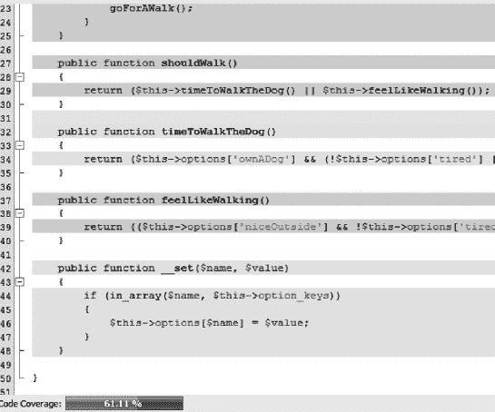
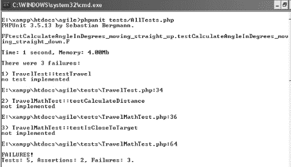
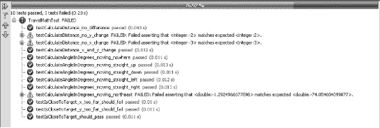
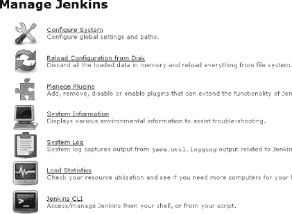
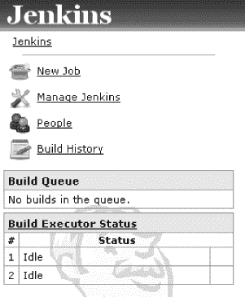

# 十三、重构、单元测试和持续集成

作为开发人员，我们的目标是实现稳定、高质量的代码库。这减少了花费在调试上的时间，并且方便了频繁的发布。在这一章中，我们将研究三种技术来提高我们代码的可靠性，并使其更容易和更安全地修改。这些技术是重构、单元测试和持续集成。

重构是一种修改代码*结构*的方式，目的是提高其质量。当我们重构时，我们并不试图添加或修改*功能*。重构是编程中必要且自然的一部分。尽管我们最大的意图是在重构时不修改功能，但重要的是要意识到无意中这样做是很容易的。以这种方式引入的 bug 很难被发现，它们会潜伏很长一段时间，直到有人注意到它们。

单元测试有助于确保由重构引入的非预期效果立即被注意到。当一个单元测试失败时，我们检查失败的原因。如果我们预料到失败是因为我们有意地调整了功能，那么我们简单地调整测试直到它通过。然而，如果失败是意外的，那么我们需要修复代码中新引入的 bug。

持续集成(CI)在整个项目中执行质量保证(QA)。团队成员每天(甚至更频繁地)将代码变更集成到项目的源代码控制库中。CI 服务器轮询存储库中的更改，在检测到代码更改后，以固定的时间间隔或按需执行自动“构建”。构建执行诸如运行单元测试和静态分析之类的任务。持续集成的频繁、自动的本质会迅速提醒我们代码中的变化已经“破坏了构建”中断构建指的是在团队成员提交了他们的代码后，自动化步骤不再正确运行。在 PHP 这样的非编译语言中，这通常是指一个或多个单元测试失败。CI 的使用让我们对我们的代码库更有信心，这反过来允许更频繁、更稳定的发布。CI 还允许我们运行构建脚本，它可以为我们执行一系列的命令和任务，否则可能会重复、枯燥、耗时和/或容易出错。

### 重构

以下是重构的示例:

*   通过创建一个我们可以调用的新函数来消除重复代码。
*   用简化的语句或描述性函数名替换复杂的逻辑表达式，以提高代码可读性。
*   从一个大类中提取方法，并将它们移动到一个新的或更合适的类中。
*   减少多层控制结构(`if/else`、`for`、`foreach`、`while`、`switch`)嵌套。
*   面向对象的设计变更，如扩展基类或使用设计模式，如 builder 或 singleton。

有很多不同的重构方法可以实现。Martin Fowler 是这一编程领域的先驱，他对几种“代码气味”进行了分类，并给出了解决方法。关于重构的好书包括以下内容:

*   《重构:改进现有代码的设计》作者:马丁·福勒、肯特·贝克、约翰·布兰特、威廉·奥普戴克和约翰·罗伯茨(艾迪森-韦斯利，1999 年)
*   Francesco Trucchia 和 Jacopo Romei(2010 年出版)的《PHP 重构》

代码中的重复是我们应该重构它的必然信号。将代码的逻辑部分封装到函数中是一个基本的编程原则。如果我们将代码剪切/复制到多个地方，那么我们就绕过了这个原则，大大增加了以后引入 bug 的可能性。

例如，假设我们将一段代码复制到五个不同的地方。随着时间的推移，当我们试图修改块的功能时，我们不太可能记得更新所有五个地方的代码。如果我们将代码块提取为一个函数，我们只需要在一个地方修改它。如果我们在代码中添加测试，我们也只需要测试一个功能单元，而不是五个。

重构的隐患是在我们的代码中引入了意想不到的行为变化。这些行为变化经常发生在我们目前还没有使用的代码区域，并且很难被发现。这就是重构和单元测试携手并进的原因。

重构时，代码的总长度可能会增加，但这没关系。重构的目的不是减少我们代码的大小。许多添加的行都是以空白的形式，这使得我们的代码更容易阅读。

#### 小的重构

清单 13-1 中显示了一个可以使用重构的代码示例。

***清单 13-1。**代码决定我们是否应该去散步*

`<?php
define('OWN_A_DOG', true);
define('TIRED', false);
define('HAVE_NOT_WALKED_FOR_DAYS', false);
define('NICE_OUTSIDE', false);` `define('BORED', true);

if ( (OWN_A_DOG && (!TIRED || HAVE_NOT_WALKED_FOR_DAYS)) || (NICE_OUTSIDE && !TIRED) || BORED )
{
    goForAWalk();
}

function goForAWalk() {
    echo "Going for a walk";
}
?>`

我们的第一次重构(清单 13-2 )将配置选项提取到一个外部文件中(清单 13-3 )。

***清单 13-2。**一个小的重构来包含我们的配置文件(清单 13-3 )*

`<?php
require_once('walkConfig.php');

if ( (OWN_A_DOG && (!TIRED || HAVE_NOT_WALKED_FOR_DAYS)) || (NICE_OUTSIDE && !TIRED) || BORED )
{
    goForAWalk();
}

function goForAWalk() {
  echo "Going for a walk";
}

?>`

***清单 13-3。**我们的配置文件，`walkConfig.php`*

`<?php
define('OWN_A_DOG', true);
define('TIRED', false);
define('HAVE_NOT_WALKED_FOR_DAYS', false);
define('NICE_OUTSIDE', false);
define('BORED', true);
?>`

长逻辑表达式，如清单 13-1 中的一个，可以提取到一个函数中以增加可读性，如清单 13-4 中的所示。

***清单 13-4。**通过将逻辑表达式放入单独的函数中来提高可读性*

`<?php
require_once('walkConfig.php');` 
`if (shouldWalk()) {
    goForAWalk();
}

function shouldWalk() {
    return ( (OWN_A_DOG && (!TIRED || HAVE_NOT_WALKED_FOR_DAYS)) ||
             (NICE_OUTSIDE && !TIRED) ||
             BORED);
}

function goForAWalk() {
  echo "Going for a walk";
}

?>`

乍一看，我们似乎只是在逻辑的位置上进行洗牌。这是真的。然而，由于这种变化，主程序流程更容易理解。此外，如果逻辑在我们的程序中重复，我们现在可以重用该函数。此外，我们可以通过继续拆分逻辑来使我们的新函数更具可读性，如清单 13-5 所示。

***清单 13-5。**将一个逻辑函数分成两个附加的更小的函数*

`<?php
require_once('walkConfig.php');

if (shouldWalk()) {
    goForAWalk();
}

function shouldWalk() {
    return ( timeToWalkTheDog() || feelLikeWalking() );
}

function timeToWalkTheDog() {
   return (OWN_A_DOG && (!TIRED || HAVE_NOT_WALKED_FOR_DAYS));
}

function feelLikeWalking() {
   return ((NICE_OUTSIDE && !TIRED) || BORED);
}

function goForAWalk() {
  echo "Going for a walk";
}

?>`

清单 13-1 和清单 13-5 具有相同的功能。然而，清单 13-5 更容易阅读、重用和测试。

我们的下一个例子(清单 13-6 )重构起来稍微复杂一点，并且向我们提取的函数引入了参数，如清单 13-7 所示。

***列表 13-6。**带重复的 PHP 脚本*

`<?php

$total = 0;
$value = rand(1, 10);
if ($value > 5) {
    $multiple = 2;
    $total  = $value;
    $total *= $multiple;
    $total += (10 - $value);
    print "goodbye ";
    print "initial value is $value ";
    print "the total is $total ";
} else {
    $multiple = 7;
    $total  = $value;
    $total *= $multiple;
    $total += (10 - $value);
    print "hello! ";
    print "initial value is $value ";
    print "the total is $total ";
}
?>`

***清单 13-7。**清单 13-6 中的 PHP 脚本被重构以消除重复*

`<?php

$total = 0;
$value = rand(1, 10);
if ($value > 5) {
    $total = changeTotalValue($value, 2);
    displayMessage("goodbye", $value, $total);
} else {
    $total = changeTotalValue($value, 7);
    displayMessage("goodbye", $value, $total);
}

function changeTotalValue($value, $multiple){
    $total = $value * $multiple;
    $total += (10 - $value);
    return $total;
}

function displayMessage($greeting, $value,$total){
    print "$greeting ";
    print "initial value is $value ";
    print "the total is $total ";
}
?>`

当从清单 13-6 中的代码转到清单 13-7 中的代码时，您可能会问自己，“我们怎么知道我们没有引入任何不希望的副作用？”简而言之，没有测试，我们无法确定。

#### 一个更大的遗留代码示例

考虑清单 13-8 中的大脚本，我们将重构它，使它更容易理解。在脚本中，给定一个源和目的地位置，计算出我们的最佳旅行模式，并显示旅行的总时间。例如，我们假设了简单的条件。这包括始终能够以直线路径到达目的地，并且汽车永远不会耗尽汽油。

***清单 13-8。**我们最初遗留的代码脚本，`travel_original.php`*

`<?php

error_reporting ( E_ALL );
//constants
define ( 'WALK_STEP', 0.25 ); //quarter meter steps
define ( 'BIKE_STEP', 3.00 ); //three meter steps
define ( 'BUS_STEP', 30.00 ); //bus steps
define ( 'BUS_DELAY', 300 ); //five minutes to wait for bus
define ( 'CAR_STEP', 50.00 ); //car steps
define ( 'CAR_DELAY', 20 ); //twenty seconds to get car up to speed
define ( 'HAS_CAR', true );
define ( 'HAS_MONEY', true );
define ( 'IN_A_RUSH', true );
define ( 'ON_BUS_ROUTE', true );
define ( 'HAS_BIKE', false );
define ( 'STORMY_WEATHER', false );
define ( 'WALKING_MAX_DISTANCE', 2500 );

class Location {

        public $x = 0;
        public $y = 0;

        public function __construct($x, $y) {
                $this->x = $x;
                $this->y = $y;
        }

        public function toString() {
                return "(" . round ( $this->x, 2 ) . ",  " . round ( $this->y, 2 ) . ")";
        }

}` `function travel(Location $src, Location $dest) {
        //calculate the direction vector
        $distance_y = $dest->y - $src->y;
        $distance_x = $dest->x - $src->x;
        $angle = null;

        if ($distance_x) {
            if ($distance_y) {
                $angle = atan($distance_y / $distance_x);
            } else {
                if ($distance_x > 0) {
                    $angle = 0.0; //right
                } else {
                    $angle = 180.0; //left
                }
            }
        } else {
            if ($distance_y) {
                if ($distance_y < 0) {
                    $angle = - 90.0;    //down
                } else {
                    $angle = 90.0;      //up
                }
            }
        }
          $angle_in_radians = deg2rad ( $angle );

        $distance = 0.0;
        //calculate the straight line distance
        if ($dest->y == $src->y) {
                $distance = $dest->x - $src->x;
        } else if ($dest->x == $src->x) {
                $distance = $dest->y - $src->y;
        } else {
                $distance = sqrt ( ($distance_x * $distance_x) +
   ($distance_y * $distance_y) );
        }

        print "Trying to go from " . $src->toString () .
              " to " . $dest->toString () . " \n";
        if (IN_A_RUSH) {
                print "<strong>In a rush</strong> \n";
        }
        print "Distance is " . $distance . " in the direction of " .
               $angle . " degrees ";

        $time = 0.0;

        $has_options = false;
        if (HAS_CAR || (HAS_MONEY && ON_BUS_ROUTE) || HAS_BIKE) {
                $has_options = true;
        }` `if ($has_options) {
                if (STORMY_WEATHER) {
                        if (HAS_CAR) {` `//drive
                                while ( abs ( $src->x - $dest->x ) > CAR_STEP ||
                                        abs ( $src->y - $dest->y ) > CAR_STEP ) {
                                        $src->x += (CAR_STEP * cos ( $angle_in_radians ));
                                        $src->y += (CAR_STEP * sin ( $angle_in_radians ));
                                        ++ $time;
                                        print "driving a car... currently at (" .
                                              round ( $src->x, 2 ) . ",  " .
                                              round ( $src->y, 2 ) . ") \n";
                                }
                                print "Got to destination by driving a car ";
                        } else if (HAS_MONEY && ON_BUS_ROUTE) {
                                //take the bus
                                while ( abs ( $src->x - $dest->x ) > BUS_STEP ||
                                        abs ( $src->y - $dest->y ) > BUS_STEP ) {
                                        $src->x += (BUS_STEP * cos ( $angle_in_radians ));
                                        $src->y += (BUS_STEP * sin ( $angle_in_radians ));
                                        ++ $time;
                                        print "on the bus... currently at (" .
                                               round ( $src->x, 2 ) . ",  " .
                                               round ( $src->y, 2 ) . ") \n";
                                }
                                print "Got to destination by riding the bus ";
                        } else {` `//ride bike
                                while ( abs ( $src->x - $dest->x ) > BIKE_STEP ||
                                         abs ( $src->y - $dest->y ) > BIKE_STEP ) {
                                        $src->x += (BIKE_STEP * cos ( $angle_in_radians ));
                                        $src->y += (BIKE_STEP * sin ( $angle_in_radians ));
                                        ++ $time;
                                        print "biking... currently at (" .
                                               round ( $src->x, 2 ) . ",  " .
                                               round ( $src->y, 2 ) . ") \n";
                                }
                                print "Got to destination by biking ";
                        }
                } else {
                        if ($distance < WALKING_MAX_DISTANCE && ! IN_A_RUSH) { //walk
                                while ( abs ( $src->x - $dest->x ) > WALK_STEP ||
                                        abs ( $src->y - $dest->y ) > WALK_STEP ) {
                                        $src->x += (WALK_STEP * cos ( $angle_in_radians ));` `                                        $src->y += (WALK_STEP * sin ( $angle_in_radians ));
                                        ++ $time;
                                        print "walking... currently at (" .
                                               round ( $src->x, 2 ) . ",  " .
                                               round ( $src->y, 2 ) . ") \n";
                                }
                                print "Got to destination by walking ";
                        } else {
                                if (HAS_CAR) {
                                        //drive
                                        $time += CAR_DELAY;
                                        while ( abs ( $src->x - $dest->x ) > CAR_STEP ||
                                                abs ( $src->y - $dest->y ) > CAR_STEP ) {
                                                $src->x += (CAR_STEP *
                                                            cos ( $angle_in_radians ));
                                                $src->y += (CAR_STEP *
                                                            sin ( $angle_in_radians ));
                                                ++ $time;
                                                print "driving a car... currently at (" .    
                                                       round ( $src->x, 2 ) . ",  " .
                                                       round ( $src->y, 2 ) . ") \n";
                                        }
                                        print "Got to destination by driving a car ";
                                } else if (HAS_MONEY && ON_BUS_ROUTE) {
                                        //take the bus
                                        $time += BUS_DELAY;
                                        while ( abs ( $src->x - $dest->x ) > BUS_STEP ||
                                                abs ( $src->y - $dest->y ) > BUS_STEP ) {
                                                $src->x += (BUS_STEP *
                                                            cos ( $angle_in_radians ));
                                                $src->y += (BUS_STEP *
    sin ( $angle_in_radians ));
                                                ++ $time;
                                                print "on the bus... currently at (" .
                                                round ( $src->x, 2 ) . ",  " .
                                        round ( $src->y, 2 ) . ") \n";
                                        }
                                        print "Got to destination by riding the bus ";
                                } else {
                                        //ride bike
                                        while ( abs ( $src->x - $dest->x ) > BIKE_STEP ||    
                                                abs ( $src->y - $dest->y ) > BIKE_STEP ) {
                                                $src->x += (BIKE_STEP *
                                                            cos ( $angle_in_radians ));
                                                $src->y += (BIKE_STEP *
                                                            sin ( $angle_in_radians ));
                                                ++ $time;
                                                print "biking... currently at (" .
                                                round ( $src->x, 2 ) . ",  " .
                                                round ( $src->y, 2 ) . ") \n";
                                        }
                                        print "Got to destination by biking ";
                                }
                        }
                }
        } else {
                if (STORMY_WEATHER) {
                        print "ERROR: Storming ";
                } else if ($distance < WALKING_MAX_DISTANCE) {
                        //walk
                        while ( abs ( $src->x - $dest->x ) > WALK_STEP ||
                                abs ( $src->y - $dest->y ) > WALK_STEP ) {
                                $src->x += (WALK_STEP * cos ( $angle_in_radians ));
                                $src->y += (WALK_STEP * sin ( $angle_in_radians ));
                                ++ $time;
                                print "walking... currently at (" .
                                      round ( $src->x, 2 ) . ",  " .
                                      round ( $src->y, 2 ) . ") \n";
                        }
                        print "Got to destination by walking ";
                } else {
                        print "ERROR: Too far to walk ";
                }
        }
        print "Total time was: " . date ( "i:s", $time );
}
//sample usage
//travel ( new Location ( 1, 3 ), new Location ( 4, 10 ) );
?>`

在初始状态，清单 13-8 中的代码是一个单一的、非常大的函数，做了太多的工作。我们完全没有测试。如果我们的代码依赖于这个脚本的准确性，我们就不能确定它是否可信。此外，如果我们需要添加功能，我们将需要谨慎行事，以限制引入副作用的可能性。这段代码并不是遗留代码的典型，但它可能更糟——在这个例子中，我们不需要处理任何全局变量。

`travel`函数嵌套层次过多。试图像现在这样增加测试是非常困难的。它也承担了太多的责任。它会计算到某条路线的距离，确定旅行模式，并为您指引方向。这个函数充满了行内注释，如果我们把它分解成名字更有意义的小函数，就没有必要了。我们还可以看到有很多重复的代码。

我们可以运行一些对`travel`函数的示例调用，以直观地感受该函数是否工作，但这一点也不严谨。我们需要的是重构我们的代码并实现单元测试。

当我们重构代码时，我们需要问自己一些基本的问题，例如:

*   有什么可以很容易修改的？(无依赖性)
*   有重复吗？(是否应该创建一个函数？)
*   我们能简化代码或者让它更容易理解吗？(可读性)
*   我们是否让代码足够简单，以便我们可以添加测试？

重构并不只有一种方式。对于不同的程序员(甚至在不同的时间对于同一个程序员)来说，next 的改进可能会有所不同。通过练习，下一步该怎么做变得更加明显和容易察觉。重构时何时添加测试也是一门艺术。理想情况下，我们希望在做出改变的任何时候添加新的测试。实际上，这并不总是可行的。

相反，我们将一次展示一些重构的结果。

要查看一步一步的过程，请从本书的页面`[www.apress.com](http://www.apress.com)`下载源代码。

作为第一组重构，我们将删除脚本顶部的`define`语句，并将它们放入一个新文件`config.php` ( 清单 13-9 )。这有促进代码重用的额外好处。如果我们需要不同脚本中的定义，我们可以包含配置文件。

我们还将把`Location`类移动到它自己的文件`location.php` ( 清单 13-10 )。我们将把`travel`函数的名字改为`execute`，并将其封装在一个名为`Travel`的类中(清单 13-12 )。接下来，我们将提取位于`execute`函数顶部的代码块，该代码块显示了我们要去的地方，并将它放入一个新的助手类 TravelView 中(清单 13-11 )。最后，我们将提取 travel 函数顶部附近的代码块，该代码块决定我们是否有车辆选项。我们还没有测试过，但是稍微更有组织的主类现在看起来像清单 13-12 中的。

***清单 13-9。**我们的设置文件，`config.php`*

`<?php
define ( 'WALK_STEP', 0.25 ); //quarter meter steps
define ( 'BIKE_STEP', 3.00 ); //three meter steps
define ( 'BUS_STEP', 30.00 ); //bus steps
define ( 'BUS_DELAY', 300 ); //five minutes to wait for bus
define ( 'CAR_STEP', 50.00 ); //car steps
define ( 'CAR_DELAY', 20 ); //twenty seconds to get car up to speed
define ( 'HAS_CAR', true );
define ( 'HAS_MONEY', true );
define ( 'IN_A_RUSH', true );
define ( 'ON_BUS_ROUTE', true );
define ( 'HAS_BIKE', false );
define ( 'STORMY_WEATHER', false );
define ( 'WALKING_MAX_DISTANCE', 2500 );
?>`

***清单 13-10。**的`Location`类，`location.php`类。*

`<?php

class Location {

    public $x = 0;
    public $y = 0;

    public function __construct($x, $y) {
        $this->x = $x;
        $this->y = $y;
    }` `    public function toString() {
        return "(" . round($this->x, 2) . ",  " . round($this->y, 2) . ")";
    }

}

?>`

*清单 13-11**。**我们的`View`班，`travelView.php`。*

`<?php

error_reporting(E_ALL);
require_once ('config.php');
require_once ('location.php');

class TravelView {

    public static function displayOurIntendedPath( $angle, $distance,
                                                   Location $src, Location $dest) {
        print "Trying to go from " . $src->toString() . " to " .
              $dest->toString() . " \n";
        if (IN_A_RUSH) {
            print "<strong>In a rush</strong> \n";
        }
        print "Distance is " . $distance . " in the direction of " .
              $angle . " degrees ";
    }

}
?>`

***清单 13-12。**第一轮重构后的`travel_original.php`文件*

`<?php.

error_reporting(E_ALL);
require_once ('config.php');
require_once ('location.php');
require_once ('travelView.php');

class Travel{

public function execute(Location $src, Location $dest) {
        //calculate the direction vector
        $distance_y = $dest->y - $src->y;
        $distance_x = $dest->x - $src->x;
        $angle = null;
        $time = 0.0;` `if ($distance_x) {
            if ($distance_y) {
                $angle = atan($distance_y / $distance_x);
            } else {
                if ($distance_x > 0) {
                    $angle = 0.0; //right
                } else {
                    $angle = 180.0; //left
                }
            }
        } else {
            if ($distance_y) {
                if ($distance_y < 0) {
                    $angle = - 90.0;    //down
                } else {
                    $angle = 90.0;      //up
                }
            }
        }
        return $angle;
          $angle_in_radians = deg2rad ( $angle );

        $distance = 0.0;
        //calculate the straight line distance
        if ($dest->y == $src->y) {
                $distance = $dest->x - $src->x;
        } else if ($dest->x == $src->x) {
                $distance = $dest->y - $src->y;
        } else {
                $distance = sqrt ( ($distance_x * $distance_x) +
                           ($distance_y * $distance_y) );
        }

**        TravelView::displayOurIntendedPath($angle, $distance, $src, $dest);**

**        $has_options = $this->doWeHaveOptions();        **

        if ($has_options) {
                if (STORMY_WEATHER) {
                        if (HAS_CAR) {
                                //drive
                                while ( abs ( $src->x - $dest->x ) > CAR_STEP ||
                                        abs ( $src->y - $dest->y ) > CAR_STEP ) {
                                        $src->x += (CAR_STEP * cos ( $angle_in_radians ));
                                        $src->y += (CAR_STEP * sin ( $angle_in_radians ));
                                        ++ $time;
                                        print "driving a car... currently at (" .
                                              round ( $src->x, 2 ) . ",  " .
                                              round ( $src->y, 2 ) . ") \n";
                                }
                                print "Got to destination by driving a car ";
                        } else if (HAS_MONEY && ON_BUS_ROUTE) {` `//take the bus
                                while ( abs ( $src->x - $dest->x ) > BUS_STEP ||
                                        abs ( $src->y - $dest->y ) > BUS_STEP ) {
                                        $src->x += (BUS_STEP * cos ( $angle_in_radians ));
                                        $src->y += (BUS_STEP * sin ( $angle_in_radians ));
                                        ++ $time;
                                        print "on the bus... currently at (" .
                                               round ( $src->x, 2 ) . ",  " .
                                               round ( $src->y, 2 ) . ") \n";
                                }
                                print "Got to destination by riding the bus ";
                        } else {
                                //ride bike
                                while ( abs ( $src->x - $dest->x ) > BIKE_STEP ||
                                        abs ( $src->y - $dest->y ) > BIKE_STEP ) {
                                        $src->x += (BIKE_STEP * cos ( $angle_in_radians ));
                                        $src->y += (BIKE_STEP * sin ( $angle_in_radians ));
                                        ++ $time;
                                        print "biking... currently at (" .
                                               round ( $src->x, 2 ) . ",  " .
                                               round ( $src->y, 2 ) . ") \n";
                                }
                                print "Got to destination by biking ";
                        }
                } else {
                        if ($distance < WALKING_MAX_DISTANCE && ! IN_A_RUSH) { //walk
                                while ( abs ( $src->x - $dest->x ) > WALK_STEP ||
                                        abs ( $src->y - $dest->y ) > WALK_STEP ) {
                                        $src->x += (WALK_STEP * cos ( $angle_in_radians ));
                                        $src->y += (WALK_STEP * sin ( $angle_in_radians ));
                                        ++ $time;
                                        print "walking... currently at (" .
                                               round ( $src->x, 2 ) . ",  " .
                                               round ( $src->y, 2 ) . ") \n";
                                }
                                print "Got to destination by walking ";
                        } else {
                                if (HAS_CAR) {
                                        //drive
                                        $time += CAR_DELAY;
                                        while ( abs ( $src->x - $dest->x ) > CAR_STEP ||
                                                abs ( $src->y - $dest->y ) > CAR_STEP ) {
                                                $src->x += (CAR_STEP *
                                                            cos ( $angle_in_radians ));
                                                $src->y += (CAR_STEP *
                                                            sin ( $angle_in_radians ));
                                                ++ $time;
                                                print "driving a car... currently at (" .    
                                                       round ( $src->x, 2 ) . ",  " .
                                                       round ( $src->y, 2 ) . ") \n";
                                        }
                                        print "Got to destination by driving a car ";` `} else if (HAS_MONEY && ON_BUS_ROUTE) {
                                        //take the bus
                                        $time += BUS_DELAY;
                                        while ( abs ( $src->x - $dest->x ) > BUS_STEP ||
                                                abs ( $src->y - $dest->y ) > BUS_STEP ) {
$src->x += (BUS_STEP *                                                                                                       
            cos ( $angle_in_radians ));
                                                $src->y += (BUS_STEP *
    sin ( $angle_in_radians ));
                                                ++ $time;
                                                print "on the bus... currently at (" .
                                                      round ( $src->x, 2 ) . ",  " .
                                                      round ( $src->y, 2 ) . ") \n";
                                        }
                                        print "Got to destination by riding the bus ";
                                } else {
                                        //ride bike
                                        while ( abs ( $src->x - $dest->x ) > BIKE_STEP ||    
                                                abs ( $src->y - $dest->y ) > BIKE_STEP ) {
                                                $src->x += (BIKE_STEP *
                                                            cos ( $angle_in_radians ));
                                                $src->y += (BIKE_STEP *
                                                            sin ( $angle_in_radians ));
                                                ++ $time;
                                                print "biking... currently at (" .
                                                       round ( $src->x, 2 ) . ",  " .
                                                       round ( $src->y, 2 ) . ") \n";
                                        }
                                        print "Got to destination by biking ";
                                }
                        }
                }
        } else {
                if (STORMY_WEATHER) {
                        print "ERROR: Storming ";
                } else if ($distance < WALKING_MAX_DISTANCE) {
                        //walk` `while ( abs ( $src->x - $dest->x ) > WALK_STEP ||
                                abs ( $src->y - $dest->y ) > WALK_STEP ) {
                                $src->x += (WALK_STEP * cos ( $angle_in_radians ));
                                $src->y += (WALK_STEP * sin ( $angle_in_radians ));
                                ++ $time;
                                print "walking... currently at (" .
                                       round ( $src->x, 2 ) . ",  " .
                                       round ( $src->y, 2 ) . ") \n";
                        }
                        print "Got to destination by walking ";
                } else {
                        print "ERROR: Too far to walk ";
                }
        }` 
`        print "Total time was: " . date ( "i:s", $time );
  }

  private function doWeHaveOptions(){
        $has_options = false;
        if (HAS_CAR || (HAS_MONEY && ON_BUS_ROUTE) || HAS_BIKE) {
                $has_options = true;
        }
        return $has_options;
  }
}
?>`

我们将再做一组重构，然后添加一些测试。我们将把乘坐公共汽车、驾驶汽车、步行或骑自行车的代码提取到逻辑函数中。我们还将一些数学计算提取到一个单独的类中，`travelMath.php` ( 清单 13-13 )。在我们重构之前，注意乘坐公共汽车的实现与上面的不一致(清单 13-12 )。一个实例设置了一个`BUS_DELAY`时间，而另一个没有。作为一个试图处理这些遗留代码的程序员，我们不得不问，“我们应该总是包括延迟吗，我们应该永远不包括延迟吗，我们应该有时包括延迟吗？这是有意的差异还是一个错误？”这很可能是一个意外的疏忽。如果我们不剪切/复制重复的代码，而是使用函数，这些类型的普遍情况是可以避免的。

*清单 13-13**。**`Calculation`班，`travelMath.php`*

`<?php

error_reporting ( E_ALL );
require_once ('location.php');

class TravelMath {

        public static function calculateDistance() {
                $distance = 0.0;
                //calculate the straight line distance
                if ($dest->y == $src->y) {
                        $distance = $dest->x - $src->x;
                } else if ($dest->x == $src->x) {
                        $distance = $dest->y - $src->y;
                } else {
                        $distance_y = $dest->y - $src->y;
                        $distance_x = $dest->x - $src->x;
                        $distance = sqrt ( ($distance_x * $distance_x) +
   ($distance_y * $distance_y) );
                }
                return $distance;
        }

        public static function calculateAngleInDegrees() {                
                //calculate the direction vector
                $distance_y = $dest->y - $src->y;
        $distance_x = $dest->x - $src->x;
                $angle = null;` `            if ($distance_x) {
                       if ($distance_y) {
                           $angle = atan($distance_y / $distance_x);
                       } else {
                    if ($distance_x > 0) {
                        $angle = 0.0; //right
            } else {
                        $angle = 180.0; //left
            }
        }
           } else {
               if ($distance_y) {
                        if ($distance_y < 0) {
                    $angle = - 90.0;    //down
                        } else {
                                $angle = 90.0;      //up
                        }
            }
                }
    return $angle;
          }

        public static function isCloseToDest($src, $dest, $step){
                return (abs ( $src->x - $dest->x ) < $step ||
                        abs ( $src->y - $dest->y ) < $step );
        }
}
?>`

***清单 13-14。**第二轮重构后的`Travel`类*

`<?php

error_reporting(E_ALL);
require_once('config.php');
require_once('location.php');
require_once('travelMath.php');
require_once('travelView.php');

class Travel
{

    private $src = null;
    private $dest = null;
    private $time = 0.0;` 
`public function execute(Location $src, Location $dest)
    {
        $this->src = $src;
        $this->dest = $dest;
        $this->time = 0.0;
        $angle = TravelMath::calculateAngleInDegrees($src, $dest);
        $angle_in_radians = deg2rad($angle);
        $distance = TravelMath::calculateDistance($src, $dest);

        TravelView::displayOurIntendedPath($angle, $distance, $src, $dest);
        $has_options = $this->doWeHaveOptions();

        if ($has_options)
        {
            if (STORMY_WEATHER)
            {
                if (HAS_CAR)
                {
                    $this->driveCar();
                } else if (HAS_MONEY && ON_BUS_ROUTE)
                {
                    $this->rideBus();
                } else
                {
                    $this->rideBike();
                }
            } else
            {
                if ($distance < WALKING_MAX_DISTANCE && !IN_A_RUSH)
                {
                    $this->walk();
                } else
                {
                    if (HAS_CAR)
                    {
                        $this->driveCar();
                    } else if (HAS_MONEY && ON_BUS_ROUTE)
                    {
                        $this->rideBus();
                    } else
                    {
                        $this->rideBike();
                    }
                }
            }
        } else
        {
            if (STORMY_WEATHER)
            {
                print "ERROR: Storming ";
            } else if ($distance < WALKING_MAX_DISTANCE)
            {
                $this->walk();
            } else
            {
                print "ERROR: Too far to walk ";
            }` `}
        print "Total time was: " . date("i:s", $this->time);
    }

    private function doWeHaveOptions()
    {
        $has_options = false;
        if (HAS_CAR || (HAS_MONEY && ON_BUS_ROUTE) || HAS_BIKE)
        {
            $has_options = true;
        }
        return $has_options;
    }

    private function driveCar()
    {
        $this->time += CAR_DELAY;
        //drive
        while (abs($this->src->x - $this->dest->x) > CAR_STEP ||
        abs($this->src->y - $this->dest->y) > CAR_STEP)
        {
            $this->src->x += ( CAR_STEP * cos($this->angle_in_radians));
            $this->src->y += ( CAR_STEP * sin($this->angle_in_radians));
            ++$this->time;
            print "driving a car... currently at (" . round($this->src->x, 2) .
                    ", " . round($this->src->y, 2) . ") \n";
        }

        print "Got to destination by driving a car ";
    }

    private function rideBus()
    {
        //take the bus
        $this->time += BUS_DELAY;
        while (abs($this->src->x - $dthis->est->x) > BUS_STEP ||
        abs($this->src->y - $this->dest->y) > BUS_STEP)
        {
            $this->src->x += ( BUS_STEP * cos($this->angle_in_radians));
            $this->src->y += ( BUS_STEP * sin($this->angle_in_radians));
            ++$this->time;
            print "on the bus... currently at (" . round($this->src->x, 2) .
                    ", " . round($this->src->y, 2) . ") \n";
        }
        print "Got to destination by riding the bus ";
    }

    private function rideBike()
    {
        //ride bike
        while (abs($this->src->x - $this->dest->x) > BIKE_STEP ||
        abs($this->src->y - $this->dest->y) > BIKE_STEP)
        {
            $this->src->x += ( BIKE_STEP * cos($this->angle_in_radians));` `            $this->src->y += ( BIKE_STEP * sin($this->angle_in_radians));
            ++$this->time;
            print "biking... currently at (" . round($this->src->x, 2) .
                    ", " . round($this->src->y, 2) . ") \n";
        }
        print "Got to destination by biking ";
    }

    private function walk()
    {
        //walk
        while (abs($this->src->x - $this->dest->x) > WALK_STEP ||
        abs($this->src->y - $this->dest->y) > WALK_STEP)
        {
            $this->src->x += ( WALK_STEP * cos($this->angle_in_radians));
            $this->src->y += ( WALK_STEP * sin($this->angle_in_radians));
            ++$this->time;
            print "walking... currently at (" . round($this->src->x, 2) .
                    ", " . round($this->src->y, 2) . ") \n";
        }
        print "Got to destination by walking ";
    }

}`

经过几次重构，我们的代码(清单 13-14 )更容易阅读、理解、修改和添加测试。我们消除了许多重复，我们还可以做更多的改进。在下一节中，我们将向我们的代码添加一些测试，从`TravelMath`类开始，它的函数已经完全没有依赖性了。

### 单元测试

为了确保我们的代码正常工作，我们需要测试它。我们希望我们的代码是具有很少依赖性的短块，这样我们就可以隔离和测试单个的功能单元。为了促进这一点，我们应该有松散耦合的代码，并在必要时使用依赖注入。我们还应该努力保持函数简短，参数数量少。

我们应该把函数重构到多短？就像一个类应该代表一个对象一样，一个函数应该做一件事情。如果一个功能要做多件事情，那么它应该被分解成更小的功能。这样做时，大多数函数的长度往往是 5 到 15 行。随着函数变得越来越小，它们就越来越容易理解。也有更少的空间给虫子。一本关于最佳函数、类长度和代码可读性的好书是罗伯特·马丁(Prentice Hall，2008)写的*干净的代码:敏捷软件工艺手册*。

两个广泛使用的 PHP 单元测试框架是 *PHPUnit* 和 *Simpletest* 。我们将在本章中使用 PHPUnit。PHPUnit 是塞巴斯蒂安·博格曼写的一个 xUnit 端口。由于它是 xUnit 家族的一部分，程序员熟悉 Java 的 *JUnit* 或 Java 的 *NUnit* 。NET 会发现入门相当容易。

 **注意**这些框架可从以下网址在线获得:

`https://github.com/sebastianbergmann/phpunit/`

`[www.simpletest.org/](http://www.simpletest.org/)`

PHPUnit 手册在`[www.phpunit.de/manual/current/en/index.html.](http://www.phpunit.de/manual/current/en/index.html.)`

要用 PEAR 安装 PHPUnit，请使用以下命令:

`pear channel-discover pear.phpunit.de
pear channel-discover components.ez.no
pear channel-discover pear.symfony-project.com
pear install --alldeps phpunit/PHPUnit`

当编写单元测试时，我们应该努力编写快速运行的、可重复的测试，这些测试隔离一小块代码的功能。这可能需要使用高级技术，如依赖注入和模拟对象。

PHPUnit 和 Simpletest 都支持模拟对象。模拟对象对于隔离我们想要测试的代码部分非常有用。它们还可以通过返回模拟结果来帮助我们快速测试，而不需要访问一个缓慢的(用单元测试术语来说)资源，比如一个数据库、一个文件或者一个 web 位置。

我们将返回到我们的`Travel`类，并在本章稍后添加一些测试。首先，我们将回到清单 13-5 中的小例子，它决定了我们是否应该出去走走并给它添加测试。有了测试框架，我们可以添加测试，断言带有给定输入参数的函数的预期结果是我们获得的实际结果。

在清单 13-15 中，我们将创建清单 13-5 中代码的面向对象版本。

***清单 13-15。**面向对象`Walk`类，`walk.php`*

`<?php

class Walk
{

    private $option_keys = array(
             'ownADog', 'tired', 'haveNotWalkedForDays', 'niceOutside', 'bored');
    private $options = array();` 
`    public function __construct()
    {
        foreach ($this->option_keys as $key) {
            $this->options[$key] = true;
        }
    }

    public function move()
    {
        if ($this->shouldWalk()) {
            $this->goForAWalk();
        }
    }

    public function shouldWalk()
    {
        return ($this->timeToWalkTheDog() || $this->feelLikeWalking());
    }

    public function timeToWalkTheDog()
    {
        return ($this->options['ownADog'] &&
               (!$this->options['tired'] || $this->options['haveNotWalkedForDays']));
    }

    public function feelLikeWalking()
    {
        return (($this->options['niceOutside'] && !$this->options['tired']) ||
                 $this->options['bored']);
    }

    public function __set($name, $value)
    {
        if (in_array($name, $this->option_keys)) {
            $this->options[$name] = $value;
        }
    }

    private function goForAWalk()
    {
        echo "Going for a walk";
    }
}

//$walk = new Walk();
//$walk->move();
?>`

大多数 PHP 集成开发环境(ide)，如 Netbeans 和 Eclipse，可以生成框架测试文件来帮助我们。ide 通常将我们的测试结果显示为彩色的红/绿条，以表示成功或失败。但是，您也可以直接从命令行运行 PHPUnit 或 Simpletest。我们还可以生成代码覆盖报告，显示已经测试的代码的百分比，以及哪些行没有被测试覆盖。

我们将创建我们的第一个 PHPUnit 类(清单 13-16 )，它还不包含任何测试。

***清单 13-16。**一个单元的测试骨架为`Walk`类，`walkTest.php`*

`<?php

require_once dirname(__FILE__) . '/../walk.php';

/**
 * Test class for Walk.
 * Generated by PHPUnit on 2011-05-31 at 19:57:43.
 */
class WalkTest extends PHPUnit_Framework_TestCase
{

    /**
     * @var Walk
     */
    protected $object;

    /**
     * Sets up the fixture, for example, opens a network connection.
     * This method is called before a test is executed.
     */
    protected function setUp()
    {
        $this->object = new Walk;
    }

    /**
     * Tears down the fixture, for example, closes a network connection.
     * This method is called after a test is executed.
     */
    protected function tearDown()
    {

    }
}
?>`

在清单 13-16 中，我们扩展了`PHPUnit_Framework_TestCase`。`setUp`函数创建一个被测试类`Walk`的实例，并将其存储在`$object`中。`teardown`函数是我们在测试完成后关闭资源或销毁对象的地方。在没有添加测试的情况下，在 Netbeans IDE 中运行测试文件会产生如图图 13-1 所示的输出。

***图 13-1。**Netbeans IDE 中没有执行任何测试*

我们将演示添加一个在清单 13-17 中失败的单元测试。结果如图图 13-2 所示。

***清单 13-17。**添加第一个失败的单元测试*

`<?php

require_once dirname(__FILE__) . '/../walk.php';

class WalkTest extends PHPUnit_Framework_TestCase
{

    protected $object;

    protected function setUp()
    {
        $this->object = new Walk;
    }

    protected function tearDown()
    {

    }

    public function testTimeToWalkTheDog_default()
    {
        print "testTimeToWalkTheDog_default";
        $this->assertTrue(!$this->object->timeToWalkTheDog());
    }
}

?>` 

***图 13-2。** Netbeans IDE 显示单元测试失败*

我们的默认选项将`ownADog`和`haveNotWalkedForDays`都设置为`true`。所以我们调用`$this->object->timeToWalkTheDog()`的结果应该是真的。

在清单 13-18 中，我们调整了之前的测试，使其通过，并增加了第二个测试。

***清单 13-18。**修正了第一个测试并增加了第二个*

`<?php

require_once dirname(__FILE__) . '/../walk.php';

class WalkTest extends PHPUnit_Framework_TestCase
{

    protected $object;

    protected function setUp()
    {
        $this->object = new Walk;
    }

    protected function tearDown()
    {

    }

    public function testTimeToWalkTheDog_default_shouldReturnTrue()
    {
        print "testTimeToWalkTheDog_default";
        $this->assertTrue($this->object->timeToWalkTheDog());
    }

    public function testTimeToWalkTheDog_haveNoDog_shouldReturnFalse()
    {
        print "testTimeToWalkTheDog_default";
        $this->object->ownADog = false;
        $this->assertTrue(!$this->object->timeToWalkTheDog());
    }
}

?>`

在我们添加的第二个测试中，我们将`ownADog`选项设置为`false`。当然，。

`$this->object->timeToWalkTheDog()`现在也返回`false`。我们两次测试的成功结果如图图 13-3 所示。

***图 13-3。**两次成功测试*

代码覆盖率是已经测试过的代码的百分比。在图 13-4 中，经过我们的两次测试，Walk 类有 61%的代码覆盖率。大多数 ide 都有内置功能或插件，可以突出显示被覆盖的代码行。

***图 13-4。**Netbeans IDE 中逐行代码覆盖率*

重要的是要知道单元测试的代码覆盖率可以是 100%,而程序仍然会失败。这是因为程序的各个部分可能都可以工作，但作为一个整体却不行。你可以把每个单元想象成汽车的一部分，把整个程序想象成你的汽车。尽管所有的零件都是新的，而且工作正常，但它们可能没有正确连接，所以汽车无法运行。为了测试整个程序，我们需要功能测试。

单元测试有助于提醒我们程序中的变化——一个已知的变化或一些重构的副作用。后一种情况会产生潜伏很长一段时间的病毒。当我们试图找出为什么我们会在几周或几个月后得到一个意想不到的结果时，追踪这些类型的错误可能会非常困难和耗时。五分钟或两年前编写的单元测试所提供的对变化的反应是无价的。

单元测试和功能测试都是回归测试的类型。定期运行回归测试，以确保在功能增强、错误修复或配置更改后不会引入新的错误或回归。

当我们在 IDE、命令行或浏览器中使用 PHPUnit 时，输出是不同的。比较图 13-3 、图 13-5 和图 13-6 。

***图 13-5。**示例 Zend Studio 输出的 PHPUnit 结果*

***图 13-6。**PHPUnit 结果的命令行输出示例*

代码覆盖率统计可以让我们看到每个文件被单元测试覆盖的百分比。图 13-7 显示了为我们的旅行计划编写的测试的文件覆盖。

***图 13-7。**Netbeans IDE*中显示的我们的 Travel 程序中每个测试文件的百分比

在我们实现了覆盖整个`TravelMath`类的单元测试之后(清单 13-20 ，错误向我们揭示，如图图 13-8 所示。

***清单 13-20。**针对`TravelMath`类、`TravelMathTest.php`类、*类的全单元测试

`<?php

require_once dirname(__FILE__) . '/../TravelMath.php';
require_once 'PHPUnit/Autoload.php';

/**
* TravelMath test case.
*/
class TravelMathTest extends PHPUnit_Framework_TestCase {

    /**
     * Prepares the environment before running a test.
     */
    protected function setUp() {
        parent::setUp ();
    }

    /**
     * Cleans up the environment after running a test.
     */
    protected function tearDown() {
        parent::tearDown ();
    }

    /**
     * Constructs the test case.
     */
    public function __construct() {
        // TODO Auto-generated constructor
    }

    public function testCalculateDistance_no_difference() {
        $src = new Location(3, 7);

        $expected = 0;
        $actual = TravelMath::calculateDistance($src, $src);
        $this->assertEquals($expected, $actual);
    }

    public function testCalculateDistance_no_y_change() {
        $src = new Location(5, 7);
        $dest = new Location(3, 7);` `$expected = 2;
        $actual = TravelMath::calculateDistance($src, $dest);
        $this->assertEquals($expected, $actual);
    }

    public function testCalculateDistance_no_x_change() {
        $src = new Location(3, 10);
        $dest = new Location(3, 7);

        $expected = 3;
        $actual = TravelMath::calculateDistance($src, $dest);
        $this->assertEquals($expected, $actual);
    }

    public function testCalculateDistance_x_and_y_change() {
        $src = new Location(6, 7);
        $dest = new Location(3, 11);

        $expected = 5;
        $actual = TravelMath::calculateDistance($src, $dest);
        $this->assertEquals($expected, $actual, '', 0.01);
    }

    public function testCalculateAngleInDegrees_moving_nowhere() {
        $src = new Location(3, 7);

        $expected = null;
        $actual = TravelMath::calculateAngleInDegrees($src, $src);
        $this->assertEquals($expected, $actual);
    }

    public function testCalculateAngleInDegrees_moving_straight_up() {
        $src = new Location(3, 7);
        $dest = new Location(3, 12);

        $expected = 90.0;
        $actual = TravelMath::calculateAngleInDegrees($src, $dest);
        $this->assertEquals($expected, $actual);
    }

    public function testCalculateAngleInDegrees_moving_straight_down() {
        $src = new Location(3, 12);
        $dest = new Location(3, 7);

        $expected = -90.0;
        $actual = TravelMath::calculateAngleInDegrees($src, $dest);
        $this->assertEquals($expected, $actual);
    }` `public function testCalculateAngleInDegrees_moving_straight_left() {
        $src = new Location(6, 7);
        $dest = new Location(3, 7);

        $expected = 180.0;
        $actual = TravelMath::calculateAngleInDegrees($src, $dest);
        $this->assertEquals($expected, $actual);
    }
    public function testCalculateAngleInDegrees_moving_straight_right() {
        $src = new Location(3, 7);
        $dest = new Location(6, 7);

        $expected = 0.0;
        $actual = TravelMath::calculateAngleInDegrees($src, $dest);
        $this->assertEquals($expected, $actual);
    }

    public function testCalculateAngleInDegrees_moving_northeast() {
        //random values where both $x2 != $x1 and $y2 != $y1
        $x1 = rand(-25, 15);
        $y1 = rand(-25, 25);
        $x2 = rand(-25, 25);
        $y2 = rand(-25, 25);

        while ($x2 == $x1) {
            $x2 = rand(-25, 25);
        }
        while ($y2 == $y1) {
            $y2 = rand(-25, 25);
        }

        $src = new Location($x1, $y1);
        $dest = new Location($x2, $y2);

        $expected = rad2deg(atan(($y2 - $y1) / ($x2 - $x1)));
        $actual = TravelMath::calculateAngleInDegrees($src, $dest);
        $this->assertEquals($expected, $actual,  '', 0.01);
    }

    public function testIsCloseToDest_x_too_far_should_fail() {
        $src = new Location(3, 9);
        $dest = new Location(3.5, 7);
        $step = 1.0;

        $expected = false;
        $actual = TravelMath::isCloseToDest($src, $dest, $step);
        $this->assertEquals($expected, $actual);
    }` `    public function testIsCloseToDest_y_too_far_should_fail() {
        $src = new Location(4.5, 7.5);
        $dest = new Location(3.5, 7);
        $step = 1.0;

        $expected = false;
        $actual = TravelMath::isCloseToDest($src, $dest, $step);
        $this->assertEquals($expected, $actual);
    }

    public function testIsCloseToDest_should_pass() {
        $src = new Location(3, 7.5);
        $dest = new Location(3.5, 7);
        $step = 1.0;

        $expected = true;
        $actual = TravelMath::isCloseToDest($src, $dest, $step);
        $this->assertEquals($expected, $actual);
    }
}
?>` 

***图 13-8。**我们的测试运行后出现了一些意想不到的错误*

通过检查失败的方法，我们可以看到前两个错误是由于没有返回一维距离的绝对值造成的。我们可以通过改变来解决这个问题

`        if ($dest->y == $src->y) {
                $distance = $dest->x - $src->x;
        } else if ($dest->x == $src->x) {
                $distance = $dest->y - $src->y;`

到

`        if ($dest->y == $src->y) {
                $distance = abs($dest->x - $src->x);
        } else if ($dest->x == $src->x) {
                $distance = abs($dest->y - $src->y);`

第三个错误是因为`atan`函数以弧度返回结果。我们期待着学位。所以我们可以通过使用`rad2deg`函数来解决这个问题，改变

`      $angle = atan($distance_y / $distance_x);`

到

`      $angle = rad2deg(atan($distance_y / $distance_x));          `

进行我们的更改并重新运行我们的测试，我们可以验证这确实解决了问题。参见图 13-9 。

***图 13-9。**我们的代码现在完全通过了所有测试*

我们的单元测试已经通过检测遗留程序中的错误显示了它们的价值。我们继续重构，让读者自己添加更多的单元测试。我们的最终代码将更多的显示语句移到了`TravelView`类中，并使用了 TravelMath::isCloseToDest 函数。

***清单 13-21。**决赛`TravelView.php`班*

`<?php

error_reporting(E_ALL);
require_once ('config.php');
require_once ('location.php');

class TravelView {

    public static function displayOurIntendedPath( $angle, $distance,
                                                   Location $src, Location $dest) {
        print "Trying to go from " . $src->toString() . " to " .
              $dest->toString() . " \n";
        if (IN_A_RUSH) {
            print "<strong>In a rush</strong> \n";
        }
        print "Distance is " . $distance . " in the direction of " .
              $angle . " degrees ";
    }

    public static function displaySummary($time) {
        print "Total time was: " . date("i:s", $time);
    }` `    public static function displayError($error){
            print "ERROR: ".$error. " ";
    }

    public static function displayLocationStatusMessage($method, $x, $y){
            print $method . “… currently at (" .
                  round($x, 2). "  " .
                  round($y, 2). ") \n";
    }
     public static function displayArrived($message){
         print "Got to destination by " . strtolower($message). " ";
     }

}
?>`

***清单 13-22。**`travel_original.php`*的一个可能的最终重构

`<?php

error_reporting(E_ALL);
require_once('config.php');
require_once('location.php');
require_once('travelView.php');
require_once('travelMath.php');

class Travel {

    private $distance = null;
    private $angle = 0.0;
    private $angle_in_radians = 0.0;
    private $time = 0.0;
    private $src = 0.0;
    private $dest = 0.0;

    public function __construct() {
        $this->distance = new Location(0, 0);
    }

    public function execute(Location $src, Location $dest) {
        $this->src = $src;
        $this->dest = $dest;

        $this->calculateAngleAndDistance();
        TravelView::displayOurIntendedPath( $this->angle, $this->distance,
                                            $this->src, $this->dest);` `if ($this->doWeHaveOptions ()) {
            $this->pickBestOption ();
        } else {
            $this->tryToWalkThere ();
        }
        TravelView::displaySummary($this->time);
    }

    public function calculateAngleAndDistance() {
        $this->angle = TravelMath::calculateAngleInDegrees($this->src, $this->dest);
        $this->angle_in_radians = deg2rad($this->angle);
        $this->distance = TravelMath::calculateDistance($this->src, $this->dest);
    }

    public function tryToWalkThere() {
        if (STORMY_WEATHER) {
            TravelView::displayError("Storming");
        } else if ($this->distance < WALKING_MAX_DISTANCE) {
            $this->walk ();
        } else {
            TravelView::displayError("Too far to walk");
        }
    }

    public function pickBestOption() {
        if (STORMY_WEATHER) {
            $this->takeFastestVehicle ();
        } else {
            if ($this->$this->distance < WALKING_MAX_DISTANCE && !IN_A_RUSH) {
                $this->walk()
            } else {
                $this->takeFastestVehicle ();
            }
        }
    }

    private function takeFastestVehicle() {
        if (HAS_CAR) {
            $this->driveCar ();
        } else if (HAS_MONEY && ON_BUS_ROUTE) {
            $this->rideBus ();
        } else {
            $this->rideBike ();
        }
    }` `    private function doWehaveOptions() {

        $has_options = false;
        if (HAS_CAR || (HAS_MONEY && ON_BUS_ROUTE) || HAS_BIKE) {
            $has_options = true;
        }
        return $has_options;
    }

    private function move($step, $message) {
        while (!TravelMath::isCloseToDest($this->src, $this->dest, $step)) {
            $this->moveCloserToDestination($step, $message);
        }
TravelView::displayArrived($message);
    }

    private function driveCar() {
        $this->time = CAR_DELAY;
        $this->move(CAR_STEP, "Driving a Car");
    }

    private function rideBus() {
        $this->time = BUS_DELAY;
        $this->move(BUS_STEP, "On the Bus");
    }

    private function rideBike() {
        $this->move(BIKE_STEP, "Biking");
    }

    private function walk() {
        $this->move(WALK_STEP, "Walking");
    }

    private function moveCloserToDestination($step, $method) {
        $this->src->x += ( $step * cos($this->angle_in_radians));
        $this->src->y += ( $step * sin($this->angle_in_radians));
        ++$this->time;
        TravelView::displayLocationStatusMessage($method, $this->src->x, $this->src->y);
    }

}
?>`

将我们主类的重构版本(清单 13-22 )与初始代码(清单 13-8 )进行比较。

如果我们要为`Travel`类添加测试，我们可以通过将它们添加到测试套件中来一次运行所有的测试(清单 13-23 )。

***清单 13-23。**我们的测试套件，`AllTests.php`*

`<?php

error_reporting(E_ALL ^ ~E_NOTICE);
require_once 'PHPUnit/Autoload.php';
require_once 'travelMathTest.php';
require_once 'travelTest.php';

class AllTests
{
    public static function suite())
    {
        $suite = new PHPUnit_Framework_TestSuite('Travel Test Suite');
        $suite->addTestSuite('TravelTest');
        $suite->addTestSuite('TravelMathTest');
        return $suite;
    }
}

?>`

我们现在可以更有把握地展示我们修改后的代码(清单 13-24 )的使用示例，它会按预期工作。

***清单 13-24。**调用我们的脚本*

`<?php

error_reporting(E_ALL);
require_once ('travel.php');

$travel = new Travel();
$travel->execute(new Location(1, 3), new Location(4,7));

?>`

运行清单 13-24 (将`IN_A_RUSH`配置标志设置为`false`)的输出如下所示。

`Trying to go from (1, 3) to (4, 7)
Distance is 5 in the direction of 53.130102354156 degrees
Walking... currently at (1.15, 3.2)
Walking... currently at (1.3, 3.4)
Walking... currently at (1.45, 3.6)
Walking... currently at (1.6, 3.8)
Walking... currently at (1.75, 4)
Walking... currently at (1.9, 4.2)
Walking... currently at (2.05, 4.4)
Walking... currently at (2.2, 4.6)
Walking... currently at (2.35, 4.8)
Walking... currently at (2.5, 5)
Walking... currently at (2.65, 5.2)` `Walking... currently at (2.8, 5.4)
Walking... currently at (2.95, 5.6)
Walking... currently at (3.1, 5.8)>
Walking... currently at (3.25, 6)
Walking... currently at (3.4, 6.2)
Walking... currently at (3.55, 6.4)
Walking... currently at (3.7, 6.6)
Walking... currently at (3.85, 6.8)
Got to destination by walking
Total time was: 00:19`

单元测试和重构配合得很好。事实上，测试驱动开发(TDD)的原则更进了一步，它规定在没有为新代码编写单元测试之前，不要编写任何新代码..

TDD 的基本原则是:

1.  写一个测试。
2.  测试失败是因为还没有编写出满足它的代码。
3.  实现能使测试通过的最少功能。
4.  重复一遍。

如果可以选择的话，用全新的代码库进行 TDD，或者用现有的单元测试安全网进行重构是非常好的。然而，更多的时候我们是在处理遗留代码。这不是让修改变得可怕的借口。打破依赖关系和重构代码可能会导致意想不到的行为。然而，你等待重构的时间越长，风险就越大。最好是经常重构，小改小改。

类似地，即使少量的单元测试也比没有好。测试覆盖率为 10%的代码库确实比零覆盖率的代码库更稳定。这种对代码稳定性的信任有助于加速进一步的重构和测试创建。当我们打破紧密耦合的依赖关系，以便我们可以实现测试时，代码库的设计也得到改进。这反过来让我们在以前有多个依赖关系的领域中打破依赖关系。

通常，当试图添加测试时，有两种不同的项目状态。这些措施如下:

1.  开始一个新的项目或者添加到一个已经有 100%测试覆盖率的项目中。然后我们可以安全地使用 TDD(如果我们希望的话),并继续测试和重构。
2.  从遗留代码库开始。这可能是一个未经测试的开源项目，或者是您继承的公司代码，或者是您自己的未经测试的代码。事实上，在 Michael Feathers (Prentice Hall，2004)的优秀著作《有效地使用遗留代码工作》中，遗留代码被定义为“任何没有测试的代码”。

作为一名 PHP 程序员，你会遇到这两种类型的项目。第二种情况更常见。然而，PHP 开发人员开始采用更严格的“企业”级代码。这包括更强的测试和开发标准。

 **注意**大部分引用的重构和单元测试的参考书都不是为 PHP 编写的。Java、C++或 C#等强类型语言的知识并不是必需的，但对于完全理解所介绍的技术是有用的。

### 持续集成

我们希望我们的代码测试经常运行并且自动化。这有助于实现快速、稳定的发布周期。持续集成服务器执行一组预定义的构建任务，例如代码部署、测试代码或生成分析报告。因为代码已经被提交到存储库中，所以每次存储库发生变化时都要执行这些操作，或者以一定的时间间隔(例如每小时)执行，或者按需执行。

持续集成(CI)允许您设置计算机可以自动执行的重复任务。这些任务可能单调、乏味、涉及多个步骤、复杂和/或容易出错。

您可以设置构建系统来执行的多步骤任务的一个示例是:

1.  从源代码控制中签出我们代码的当前版本。
2.  从网站获取第三方库的最新版本。
3.  对我们的程序进行静态分析。
4.  对我们程序中的 PHP 代码进行单元测试。

假设现在我们想发布一个新版本的程序。使用 CI，在我们的单元测试成功后，我们可以设置额外的构建步骤来:

1.  混淆 PHP。
2.  创建一个`WAR`文件工件。
3.  向版本系统查询修订号。
4.  从数据库或文件中读取活动发布版本。
5.  在此修订版和以前发布的版本之间创建一个补丁。
6.  将内部版本标记为发布版本。
7.  在发布版本数据库中插入新记录或更新活动发布版本文件。
8.  将`WAR`文件部署到可公开访问的服务器上。

现在想象一下，您手工执行上面的每一个步骤，然后意识到代码中有一个小错误或者丢失了一个文件，或者类似的事情。发布正确的版本需要再次执行所有步骤。手动重复执行所有这些步骤很快就会消耗比我们希望花费的更多的时间，容易出错，而且通常不好玩。

有了 CI，如果我们愿意，我们可以在每次提交后自动执行所有这些步骤。我们还可以为额外的八个部署步骤只标记某些构建。

#### 持续集成服务器

PHP 可用的两个最好的免费 CI 服务器是 Jenkins 和 phpUnderControl。Jenkins 是 Hudson 项目的一个分支，是世界上最常用的 CI 系统之一。phpUnderControl 与 CruiseControl CI 框架集成。Jenkins 和 CruiseControl 都是用 Java 编写的，支持多种构建系统和语言，并提供许多附加插件。我们将在本章中使用詹金斯。

 **注**詹金斯、phpUnderControl 和 CruiseControl 可从以下网站获得:

`[`jenkins-ci.org/`](http://jenkins-ci.org/)`

`[`phpundercontrol.org/`](http://phpundercontrol.org/)`

`[`sourceforge.net/projects/cruisecontrol/files/`](http://sourceforge.net/projects/cruisecontrol/files/)`

CI 服务器使用以下工具:

1.  版本控制
2.  单元测试和代码覆盖率
3.  静态分析
4.  构建自动化

#### 版本控制

重申上一章的讨论，版本控制也被称为源代码控制或修订控制。对于任何程序员来说，这都是一个必不可少的工具，不管他是否敏捷。版本控制就像一个数字录音机和混音器。我们可以播放现有的内容。我们可以添加新的内容。我们可以倒回到某个地方。我们可以分支到不同的轨道。我们可以混合我们最喜欢的东西。有时片段会发生冲突，我们需要进行编辑，让不同的部分再次和谐工作。但总而言之，它是我们使用的一个强有力的工具。

最流行的版本控制系统之一是 *Subversion* (SVN)，这将在第十二章中介绍。像 *Git* 和 *Mercurial* 这样的新一波分布式版本控制系统也在开发生态中开发出高级别的支持。

 **注意**关于这些版本控制系统的在线文档可从以下网址获得:

`[`svnbook.red-bean.com/`](http://svnbook.red-bean.com/)`

`[`gitref.org/`](http://gitref.org/)`

`[`hgbook.red-bean.com/`](http://hgbook.red-bean.com/)`

#### 静态分析

静态分析工具使用度量来检查我们的代码，并且可以揭示有用的信息，例如:

*   计算复杂性水平(越高越差)
*   依赖性(越少越好)
*   最佳实践建议
*   遵守代码风格惯例
*   检测有问题的代码和可能的错误
*   重复代码的显示
*   制作文档

大多数 PHP 静态分析工具都以 IDE 插件或 PEAR 包的形式提供。按类别划分的一些现有工具有:

遵守一套代码约定:

> PhpCheckstyle
> 
> `[`code.google.com/p/phpcheckstyle/`](http://code.google.com/p/phpcheckstyle/)`
> 
> PHP 代码嗅探器
> 
> `[`pear.php.net/package/PHP_CodeSniffer/`](http://pear.php.net/package/PHP_CodeSniffer/)`

API 生成:

> PHP 文档管理器
> 
> `[`www.phpdoc.org/`](http://www.phpdoc.org/)`
> 
> 代码质量指标:
> 
> PHP 代码行
> 
> 关于函数、类等代码行的度量
> `[`github.com/sebastianbergmann/phploc`](https://github.com/sebastianbergmann/phploc)`
> 
> p 结束
> 
> 类和函数依赖关系
> 
> `[`pdepend.org/`](http://pdepend.org/)`

代码质量建议:

> PHP 复制/粘贴检测器
> 
> `[`github.com/sebastianbergmann/phpcpd`](https://github.com/sebastianbergmann/phpcpd)`
> 
> phpcpd - (php 复制/粘贴检测器)重复代码
> 
> PHP mess 检测器
> 
> `[`phpmd.org/`](http://phpmd.org/)`
> 
> 类型不匹配的 phantm - PHp 分析器
> 
> PHP 是松散类型的。Phantm 有助于发现由类型不匹配引起的潜在错误
> 
> `[`github.com/colder/phantm`](https://github.com/colder/phantm)`
> 
> 学徒
> 
> 代码反模式和“气味”
> 
> `[`github.com/mayflowergmbh/padawan`](https://github.com/mayflowergmbh/padawan)`

突出显示:

> phpcb
> 
> PHP 代码浏览器——与代码嗅探器 PHPUnit 一起使用
> 
> `[`github.com/mayflowergmbh/PHP_CodeBrowser`](https://github.com/mayflowergmbh/PHP_CodeBrowser)`

安全

> PHP 安全审计工具
> 
> `[`sourceforge.net/projects/phpsecaudit/`](http://sourceforge.net/projects/phpsecaudit/)`

#### 构建自动化

为了自动化重复的任务，我们需要知道如何使用一个构建系统，比如 Apache Ant、Maven 或 Phing。这些构建系统基于 XML 文件。XML 包含在第十四章中。典型的构建文件包含一个或多个目标，每个目标都有子任务。这些任务可用于添加或删除文件，从存储库中签出文件，运行单元测试，执行静态分析，生成文档，等等。

 **注意**关于这些构建系统的更多信息可以在它们各自的网站上找到:

`[`ant.apache.org/`](http://ant.apache.org/)`

`[www.phing.info/trac](http://www.phing.info/trac)`

`[`maven.apache.org/`](http://maven.apache.org/)`

一个非常基本的构建文件可能是这样的:

`<?xml version="1.0" encoding="UTF-8"?>

<project default="testAutomate">
    <target name="testAutomate">
        <echo msg="Making directory ./foobar" />
        <mkdir dir="./foobar" />
    </target>
</project/>`

在这个示例构建文件中，我们有一个构建目标，`"testAutomate"`。目标回显一条消息并创建一个目录。构建文件可以有几个目标，本质上变得非常复杂。

从未使用过 CI 服务器的程序员很容易看不到设置 CI 系统所涉及的额外工作的好处。随着时间、构建和测试的增加，我们将真正体验到全部的效用和好处。

#### 詹金斯服务器设置

本节将概述 PHP 与 Jenkins CI 服务器的设置(见图 13-10 )。詹金斯的布局相当直观。这是一个非常受欢迎的配置项，拥有大量的支持社区。詹金斯是复杂和强大的，但也相当容易使用。Jenkins 有一个写得很好的 GUI，也为那些喜欢它的人提供了命令行脚本。

***图 13-10。**詹金斯网站*

用 PHP 设置 Jenkins 的权威参考资料位于`[`jenkins-php.org/`](http://jenkins-php.org/)`，作者是塞巴斯蒂安·博格曼(PHPUnit 的作者)。

基本步骤是:

1.  下载并安装詹金斯。
2.  配置 Jenkins 插件。
3.  升级 PHP pear 包。
4.  创建构建文件。
5.  创造一个新的詹金斯工作。

从`[`jenkins-ci.org/.`](http://jenkins-ci.org/.)`下载 Jenkins 确切的安装过程将因操作系统和发布版本而异。wiki 上有扩展帮助`[`wiki.jenkins-ci.org/display/JENKINS/Home.`](https://wiki.jenkins-ci.org/display/JENKINS/Home.)`

默认情况下，使用端口 8080，仪表板可在`[`localhost:8080/dashboard.`](http://localhost:8080/dashboard.)`访问

要配置 Jenkins 插件，我们可以使用 web 界面或命令行实用程序(见清单 13-25 )。参见图 13-11 。

***清单 13-25。**通过 Jenkins 命令行实用程序安装插件*

`wget http://localhost:8080/jnlpJars/jenkins-cli.jar
java –jar jenkins-cli.jar –s http://localhost:8080 install-plugin checkstyle
java –jar jenkins-cli.jar –s http://localhost:8080 install-plugin clover
java –jar jenkins-cli.jar –s http://localhost:8080 install-plugin jdepend
java –jar jenkins-cli.jar –s http://localhost:8080 install-plugin pmd
java –jar jenkins-cli.jar –s http://localhost:8080 install-plugin phing
java –jar jenkins-cli.jar –s http://localhost:8080 install-plugin xunit
java –jar jenkins-cli.jar –s http://localhost:8080 safe-restart` 

***图 13-11。**通过 GUI 管理 Jenkins】*

您可能需要升级现有的 pear 模块或通道，或者安装额外的模块。为了让构建自动化正常工作，修复 pear 安装尝试中报告的任何错误都是非常重要的。

`pear channel-discover pear.pdepend.org
pear channel-discover pear.phpmd.org
pear channel-discover pear.phpunit.de
pear channel-discover components.ez.no
pear channel-discover pear.symfony-project.com

pear install pdepend/PHP_Depend
pear install phpmd/PHP_PMD
pear install PHPDocumentor
pear install PHP_CodeSniffer
pear install phpunit/phpcpd //copy paste detector
pear install –alldeps phpunit/PHP_CodeBrowser
pear install –alldeps phpunit/PHPUnit`

 **注意**如果您收到错误消息，您可能需要更改您的 pear 配置。例如，您的`data_dir`可能设置不正确。

`[`pear.php.net/manual/en/guide.users.commandline.config.php`](http://pear.php.net/manual/en/guide.users.commandline.config.php)`

错误:无法创建目录 C:\ PHP \ pear \ data \ PHP _ PMD \ resources \ rulesets

`pear config-get data_dir`

`“C:\php5”    #incorrect`

`pear config-set data_dir “C:\xampp\php\pear\data”`

`pear config-set doc_dir “C:\xampp\php\pear\docs”`

`pear config-set test_dir “C:\xampp\php\pear\tests”`

博格曼还编写了几个实用程序脚本，可以作为 CI 设置的良好起点和模板。您很可能需要调整路径和/或调整构建目标。这些脚本可以通过 pear 包管理器使用以下命令获得:

`pear install phpunit/ppw`

或在线访问

`https://github.com/sebastianbergmann/php-project-wizard`

图 13-12 显示了 Jenkins 主菜单屏幕，我们可以在此创建一个新任务。

***图 13-12。**詹金斯主菜单*

### 总结

在这一章中，我们介绍了三种开发实践，它们可以帮助我们创建更高质量的 PHP 代码。这些是重构、单元测试和持续集成。所有这三个领域都很广阔，有许多关于每个主题的书籍。

世界上大多数代码都是遗留代码，因此作为开发人员，您需要知道如何从最初笨拙的代码中创建稳定性。重构是一项至关重要的技能，通过实践会变得更加容易。然而，即使是经验丰富的重构者和代码专家也会在重构时不知不觉地引入微妙的行为修改。这些可能会被忽视，并且以后很难确定。单元测试可以帮助跟踪函数的预期结果，从而检测出代码结构改变时引入的行为变化。

为了定期运行我们的测试，我们可以使用持续集成。持续集成系统帮助您消除枯燥、重复(但容易出错且耗时)的任务。计算机非常擅长重复的任务，它们从不抱怨它们正在做的工作很枯燥。

作为开发人员，我们应该努力在我们的代码中有高水平的质量保证，并且总是在寻找可用的新技术和工具。