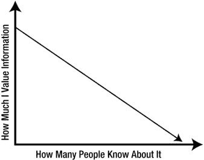
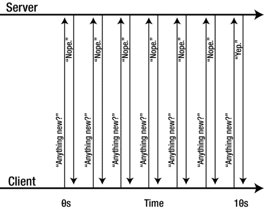
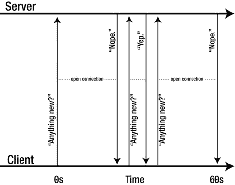
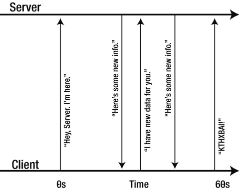
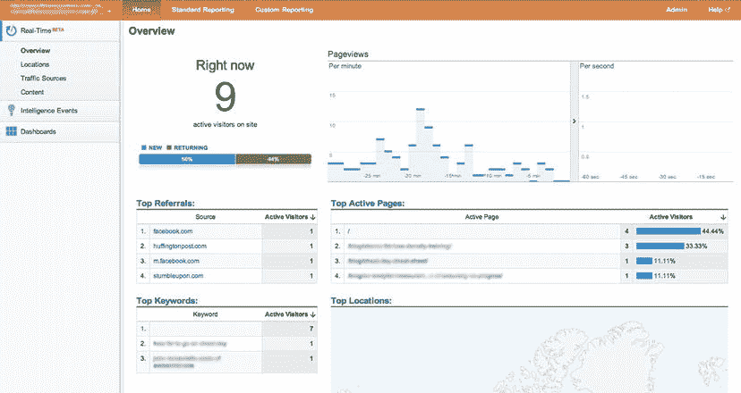

# 一、什么是实时？

如果你在过去的一两年里一直关注着网络发展的趋势，毫无疑问你已经看到了术语*实时*被抛来抛去。但是什么是*实时呢？它与当前的网络技术有什么不同，为什么我们要费心去使用它？*

 *为了更好地理解实时意味着什么，以及它如何改变我们所知的互联网，让我们看看它试图解决的问题的历史:我们如何在客户端影响我们的 web 应用的状态，而不需要用户采取任何行动？

媒体的演变

实话实说:说到信息，我们有一种想先听到消息的欲望。这种渴望可以归因于天生的求知欲，第一个知道的人可能会给我们带来的机会，或者仅仅是因为这意味着我们可以成为所有八卦的一方。在某些情况下，比起关心新闻内容，我们甚至更重视第一个得到新闻。(巧合的是，这也是潮人存在的全部原因。)我们首先想知道，这意味着我们想在这个信息可用的时候*知道。*



图 1-1。随着某些类型的信息变得司空见惯，其感知价值往往会降低

这种对保持现状的不懈追求让我们走到了今天:我们不满足于洞穴壁画或手写的大部头作品；印刷机给了我们书和传单，但我们还想要更多；报纸和其他期刊每天早上都给我们提供最新消息，但这些事情都发生在昨天。收音机和电视只能在几小时内给我们提供信息，或者——在天气好的时候——几分钟。

互联网让我们有能力与全球观众分享信息。但是这些信息仍然需要很长时间才能被发现，我们依靠电子邮件和论坛来传播信息。谷歌改变了这一切，让数据更容易被发现。即便如此，其页面索引的速度意味着我们仍然需要等待我们的数据通过搜索被发现。“实时博客”的发明意味着，如果我们知道去哪里找，我们就可以收到频繁的更新，而那些目的地通常都是知名的媒体品牌。

社交媒体加大了赌注，创造了一个全球网络，任何人都可以随时分享新闻。在 2011 年埃及革命等事件中，Twitter 等服务是我们的主要信息来源。然而，第一个实时网络游戏规则的改变者是，有史以来第一次，新信息发布的瞬间也可以通过搜索被发现。这开始证明在互联网上即时获取新信息的价值，增加了用户对“实时内容”的期望，甚至导致知名技术评论员罗伯特·斯考伯(Robert Scoble)质疑“实时网络是否是对谷歌的威胁。” [<sup>2</sup>](#Fn2)

社交媒体平台正在转变为实时交流平台。你一发布状态更新，就会收到一个或多个用户的回复。这种快速、交互式的反馈对我们大多数人来说是非常新鲜的，除了我们这些玩基于 Flash 的游戏的人，他们习惯于只提供相对静态的单用户体验的互联网应用。这一新的多用户交互功能带来了更具吸引力和吸引力的用户体验。

媒体已经从提供延迟和静态的内容发展到具有更丰富、实时和互动的潜力。用户看到了这些体验，他们现在对互联网应用的期望大大提高了。

尽管互联网和社交媒体展示了所有这些即时的满足感，但许多来源仍然没有将我们的新闻作为直播内容提供给我们，或者为我们提供互动和迷人的体验。为什么不呢？

网站，而不是网络应用

互联网传统上用于共享静态内容。一个网站仅仅是属于一个集合的静态实体的结构。一个网站的主要焦点是展示它的内容，而“内容为王” [<sup>3</sup>](#Fn3) 的理念并没有改变多少。即使当我们提出创建“动态内容”的技术时，我们实际上的意思是，我们的服务器现在可以基于一组不同但定义好的参数和值动态地生成静态内容。

我们用来查看互联网上的实体的应用，即 Web 浏览器，自然专注于确保它满足日常需求:下载和呈现 HTML 和图像，并了解如何跟踪链接——这在最初就足够了。

以同样的方式，媒体的形式被推动着发展，我们的网站也是如此。我们希望我们的网站看起来更好，所以我们引入了 CSS。我们希望他们对用户的输入反应更快(你能相信你曾经可以对 DHTML 库收费吗？例如，下拉菜单)，于是 JavaScript 出现了(让我们忘记 VBScript 曾经存在过)。这些技术增强了网络浏览器的功能，但主要是让我们增强网站上的页面。

一些先驱超越了静态网站，开始考虑动态 web 应用。对于 web 应用，焦点从服务器转移到了客户端。客户必须做更多的工作；它动态地检索和加载内容，根据用户反馈改变用户界面(UI ),并且 UI 以我们传统上与桌面应用相关联的方式呈现。很少关注页面重载和页面的一般概念。内容也变得不那么基于文本，我们开始在 web 应用中实现更具视觉吸引力和交互性的数据表示。

http hack

随着越来越多的人(我们开发人员是先锋)开始构建 web 应用，对 web 浏览器的需求也在增加。性能成了问题；不仅仅是 web 浏览器应用，还有运行浏览器的机器。那些真正推动 web 技术和 web 应用边界的人也遇到了一个巨大的绊脚石:HTTP。[<sup>4</sup>](#Fn4)T5】

HTTP 是一种协议，在这种协议中，客户端发出数据请求并接收响应。然而，一些 web 应用开始要求信息从服务器发送到客户机。所以我们不得不开始入侵！黑客攻击会导致非标准化和复杂的解决方案。将跨 web 浏览器的特性支持状态抛入其中，您可以想象这个问题的一些解决方案的复杂性(我们将在后面讨论其中的一些)。

它采用了 Twitter 和脸书等广受欢迎的解决方案，来证明实时网络技术带来的好处和体验需求。在需求的驱动下，这导致了实时网络技术的巨大进步和可用性。

但是首先:“实时”实际上意味着什么？

术语*实时*指的是事件发生和我们意识到它之间的及时性。一个事件发生和交付之间的时间测量确实取决于该事件。如果事件是把你的脚放在汽车刹车上，那么你的脚放下和刹车之间的时间必须绝对最小。然而，如果事件是在足球论坛中发送聊天消息，并显示给其他用户，几秒钟不太可能有很大的不同。最终，事件需要在足够短的时间内交付，以便该事件仍然相关；在上下文中仍然有意义。想象一下被扇了一巴掌:在巴掌的冲击和疼痛的记录之间没有延迟。这是实时的。如果有延误，那将会非常混乱。

然而，添加任何实时体验的能力最初都不是那么容易的。但是开发人员并不容易被打败，他们已经想出了聪明的变通办法和“窍门”来解决服务器和客户机之间的通信故障。

 **注意**这里已经省略了一些最早的与服务器建立双向通信的方法，因为它们不常被使用。

创建交互式、快速动态网页应用的网页开发技术

随着 JavaScript 开始变得更加流行，开发人员开始利用 XMLHttpRequest 对象 [<sup>5</sup>](#Fn5) 异步发送 HTTP 请求*，或者不需要重新加载当前页面。这叫做 *AJAX* ，或者异步 JavaScript 和 XML 。*

 *这种方法非常适合向 web 应用添加用户触发的功能，因此通常仍然依赖于浏览器中的事件，例如单击，因此在保持内容最新的过程中并没有真正解决任何问题。

投票

在 AJAX 站稳脚跟之后，尝试将浏览器事件从等式中剔除并自动获取新信息的过程是一个短暂的跳跃。开发人员使用类似 JavaScript `setInterval()`函数的东西设置一个刷新间隔，每隔 *n* 秒检查一次更新。



图 1-2。轮询经常发送 HTTP 请求来检查新信息

为了更好地理解这有多浪费，您可以将这种通信想象成客户端和服务器之间的对话:

`CLIENT: Hi! Can I have some data?`

`SERVER: Sure. Here you go!`

`[time passes]`

`CLIENT: Do you have any new data for me?`

`SERVER: No.`

`[time passes]`

`CLIENT: Do you have any new data for me?`

`SERVER: No.`

`[time passes]`

`CLIENT: Do you have any new data for me?`

`SERVER: No.`

`[time passes]`

`CLIENT: Do you have any new data for me?`

`SERVER: I do! Here you go!`

就像现实生活一样，客户机和服务器之间这样的对话既烦人又没什么成效。

尽管这个轮询解决方案绝对是一个开始，但它也有缺点。最值得注意的是，它创建了许多空请求，这对一个应用造成了许多不必要的开销。这种开销可能会妨碍应用的良好扩展:如果一个应用每秒轮询一次新数据，并且 10 万用户同时使用该应用，则每分钟有 600 万个请求。

如果考虑到每个 HTTP 请求的开销——在彼得·吕贝尔斯的测试中，每个请求/响应总计 871 字节[<sup>6</sup>](#Fn6)——来回发送大量额外信息只是为了发现服务器上没有发生任何新的事情。

HTTP 长轮询

实时进化链的下一步是 HTTP *长轮询* ，这是在设定的时间段内打开一个 HTTP 请求来监听服务器响应的实践。如果有新数据，服务器会发送并关闭请求；否则，在达到间隔限制后，请求将被关闭，并将打开一个新的请求。



图 1-3。HTTP 长轮询使 HTTP 请求在一段时间内保持打开状态，以检查更新

与标准轮询相比，这要高效得多。它节省了开销，减少了应用发送的请求数量。客户端和服务器的对话如下所示:

`CLIENT: Hi! Can I have some data?`

`SERVER: Sure. Here you go!`

`CLIENT: Thanks! I'm ready for more, if it comes in.`

`[time passes]`

`SERVER: I have new data for you! Here you go!`

`CLIENT: Thanks! I'm ready for more, if it comes in.`

好多了。这种方法提供了一种机制，通过这种机制，服务器可以提醒客户端有新数据*，而不需要客户端*方面的任何动作。

如果需要客户机/服务器双向通信，就可以看出 HTTP 长轮询的一个主要问题。一旦长轮询 HTTP 连接打开，客户机与服务器通信的唯一方法就是发出另一个 HTTP 请求。这可能导致使用双倍的资源:一个用于服务器到客户端的消息，另一个用于客户端到服务器的消息。这种情况的确切影响实际上取决于双向交流的数量；客户机和服务器之间的对话越多，资源消耗就越大。

这种方法的另一个问题是，在长轮询请求之间有一小段时间，客户机上的数据可能与服务器上的数据不同步。只有当连接重新建立后，客户端才能检查是否有新的数据可用。这其中的负面影响确实要看数据，但如果数据是高度时效性的，那肯定不是好事。

HTTP 流

HTTP *streaming* 非常类似于 HTTP 长轮询，除了当新数据可用时或者在给定的时间间隔连接不会关闭。相反，新数据通过保持打开的现有连接推送。

客户端和服务器之间的对话现在变成如下所示:

`CLIENT: Hi! Can I have some data? And please let me know whenever any new data comes along.`

`SERVER: Sure. Here you go!`

`[time passes]`

`SERVER: I have new data for you! Here you go!`

`[time passes]`

`SERVER: I have more new data for you! Here you go!`

这种解决方案的好处是，客户端和服务器之间的连接是持久的，因此一旦有新数据可用，就可以将其发送到客户端，之后的任何新数据也通过同一连接发送。这确保了服务器和客户端保持同步。

HTTP 流仍然不能提供双向通信，因此存在潜在的资源问题，需要使用第二个连接进行客户端到服务器的通信。

HTTP 流方法的一个大问题是它在不同的浏览器中实现方式的不一致性。在基于 Gecko 的浏览器中，可以使用多部分替换头，指示浏览器用更新的内容替换上次接收的旧内容。在其他浏览器中，这是不可能的，因此响应缓冲区会不断增长，直到没有其他选择，只能关闭并重新打开到服务器的连接。

Web 浏览器中基于 HTTP 的解决方案的其他问题

使用多个连接进行双向通信的要求和跨浏览器实现的差异并不是基于 HTTP 的解决方案的唯一问题。浏览器还限制了来自网页的 HTTP 请求的目的地以及可以建立的连接数。

在网页中运行的 JavaScript 向服务器发出请求的能力长期以来被限制为只允许向同一个域发出请求。 [<sup>7</sup>](#Fn7) 例如，如果网页是`www.example.com/index.html`，JavaScript 只能向`www.example.com`上的资源发出请求，或者通过操纵 JavaScript 中`document.domain`的值，可以向任何 example.com 子域发出请求，比如 sub.example.com。这种限制是由浏览器供应商出于安全原因设置的，但与许多安全限制一样，它阻止了向其他域发出请求的合法用例。跨来源资源共享(CORS)解决了提出这些请求的需求。 [<sup>8</sup>](#Fn8) CORS 有很好的浏览器支持， [<sup>9</sup>](#Fn9) 但是有明显的老浏览器考虑。

对可以建立的连接数的限制是针对每个域实施的，例如对[www.example.com](http://www.example.com)的请求。在早期的浏览器中，这意味着同一个域只能有两个连接。对于基于 HTTP 的解决方案，这意味着您只能打开使用 HTTP 长轮询或流的 web 应用或网站的一个页面。如果您尝试打开第二个页面，连接将会失败。解决这个问题的方法是将许多子域映射回同一个服务器。连接限制在现代浏览器中仍然是强制的，但是现在允许的连接数要合理得多。 [<sup>10</sup>](#Fn10)

术语注释

有许多不同的术语被用来描述基于 HTTP 的实时 web 解决方案。其中大部分都是总括性的术语，涵盖了开发人员用来通过 HTTP 实现服务器到客户端通信的各种方法。

这些术语包括 Comet 、HTTP Server Push 和 AJAX Push 等等。问题是，尽管其中一些术语有非常具体的定义和技术——尤其是 Comet——它们对不同的人有不同的含义。

本书的观点是, *Comet* 是一个术语，用来定义应用结构中的范例:即模拟使用两个 HTTP 连接的服务器和客户机之间的双向通信。 [<sup>11</sup>](#Fn11)


图 1-4。Comet 范例意味着客户机和服务器之间的双向通信 11

Comet 应用可以在任何时候向客户端传送数据，而不仅仅是响应用户输入。数据通过之前打开的单个连接传递。

—亚历克斯·罗素

甚至有人认为 HTML5 WebSockets 等新技术是 Comet 范式的一部分，而不是它的替代品。然而，亚历克斯·罗素(他创造了这个术语)现在已经证实，我们应该把 *Comet* 看作是旧的基于 HTTP 的黑客的总称，并且用一种叫做 WebSockets 的新技术展望未来。 [<sup>12</sup>](#Fn12)

Web Sockets 是彗星的一种形式吗？或者彗星只是 HTTP 黑客？我倾向于后一种定义。这句话和那些黑客也许应该一起消失在夕阳下。就我而言，欢迎我们的非 HTTP 实时霸主。在某种程度上，我们可以忘记旧的浏览器，我们都可以使用“网络插座”,不再需要任何特定的保护伞。

—亚历克斯·罗素

解决方案:WebSockets

毫无疑问，你已经听到人们谈论 HTML5 和它所有的新功能。其中两个新特性直接应用于实时 web 技术和客户机服务器通信——这是一个极好的结果，表明 web 标准组织和浏览器供应商确实听取了我们的反馈。

服务器发送的事件和 event source API[<sup>13</sup>](#Fn13)是 HTTP 流解决方案的形式化，但还有一个更令人兴奋的解决方案。

你可能听过一两次 WebSockets 这个术语。如果你以前从未真正研究过实时，WebSockets 可能不会出现在你的雷达上，除非它是谈论 HTML5 所有伟大新特性的文章中的一个流行词。WebSockets 如此令人兴奋的原因是，它们提供了一种标准化的方式来实现我们多年来一直试图通过 Comet hacks 实现的目标。这意味着我们现在可以通过单个连接实现*客户端服务器双向实时通信。它还内置了对跨域通信的*支持*。*



图 1-5。Websockets 打开一个全双工连接，允许双向客户端服务器通信

WebSocket 规范是 HTML5 的一部分，这意味着 web 开发者可以在现代浏览器中使用 WebSocket 协议。[<sup>14</sup>](#Fn14)T5】

根据 WHATWG， [<sup>15</sup>](#Fn15) 的说法，WebSocket 协议定义了一种在 web 应用中添加实时通信的标准化方式:

WebSocket 协议支持在受控环境中运行不受信任的代码的用户代理与选择加入来自该代码的通信的远程主机之间的双向通信。为此使用的安全模型是 Web 浏览器通常使用的基于原点的安全模型。该协议由初始握手和随后的基本消息成帧组成，分层于 TCP 之上。该技术的目标是为基于浏览器的应用提供一种机制，这种机制需要与服务器进行双向通信，而不依赖于打开多个 HTTP 连接(例如，使用 XMLHttpRequest 或 <iframe>s 和长轮询)。<a id="_Fn16" href="#Fn16"> <sup> 16 </sup> </a></iframe>

广泛的 WebSocket 支持带来的最有益的影响之一是可伸缩性:因为 web socket 使用单个 TCP 连接在服务器和客户端之间进行通信，而不是多个单独的 HTTP 请求，所以开销大大减少了。

WebSocket 协议

因为使用 HTTP 无法实现全双工通信，所以 WebSocket 实际上定义了一个全新的*协议*，或者从客户端连接到服务器的方法。

这是通过打开一个 HTTP 请求，然后请求服务器通过发送以下报头将连接“升级”到 WebSocket 协议来实现的: [<sup>17</sup>](#Fn17)

```php
GET /chat HTTP/1.1
Host: server.example.com
Upgrade: websocket
Connection: Upgrade
Sec-WebSocket-Key: dGhlIHNhbXBsZSBub25jZQ==
Origin:http://example.com
Sec-WebSocket-Protocol: chat, superchat
Sec-WebSocket-Version: 13
```

如果请求成功，服务器将返回如下所示的标头:

```php
HTTP/1.1 101 Switching Protocols
Upgrade: websocket
Connection: Upgrade
Sec-WebSocket-Accept: s3pPLMBiTxaQ9kYGzzhZRbK+xOo=
Sec-WebSocket-Protocol: chat
```

这个交换被称为*握手*，它是建立 WebSocket 连接所必需的。一旦服务器和客户端之间成功握手，就建立了双向通信通道，客户端和服务器都可以独立地向对方发送数据。

握手后发送的数据被封装在*帧*中，这些帧本质上是信息块。每个帧以一个`0x00`字节开始，以一个`0xFF`字节结束，这意味着除了消息的大小之外，发送的每个消息只有两个字节的开销。

因此，我们已经明确表示，这对 web 开发人员来说是个好消息。但不幸的是，并非所有的独角兽和冰淇淋甜筒都是如此:和以往一样，我们将等待少数用户和公司升级到现代浏览器。我们还将等待互联网基础设施的某些部分赶上来。例如，一些代理和防火墙会阻止合法的 WebSocket 连接。然而，这并不意味着我们不能在我们的应用中使用它们。

为什么要学习实时网络技术呢？

你可能想知道为什么值得学习这些；这项技术最初可能看起来很复杂，很难支持，很难学习，而且它太新了，不重要。

事实是，实时技术已经改变了我们与网络互动的方式:如前所述，像脸书这样的社交网络正在使用实时组件；Spike TV 与 Loyalize 公司合作，允许《最致命的战士》第四季大结局的观众参与一些现场投票，从而改变了电视节目的进程； [<sup>18</sup>](#Fn18) 谷歌已经在其几个项目中加入了实时功能，包括谷歌文档和谷歌分析。



图 1-6。谷歌分析使用实时技术来显示分析数据

如果我们希望作为 web 开发人员跟上时代，我们需要尽早接受实时技术。对我们来说幸运的是，有很多公司致力于从无聊的旧拉动式网络向全新的 holymolyawesome 实时驱动网络转变。我们所要做的就是想出一些很酷的东西用它来建造。

现在在你的应用中使用实时网络技术

虽然你可能无法开始完全依赖 WebSocket 技术来开发你的新网络应用，但是现在有越来越多的公司和项目致力于让你获得实时网络功能。他们的方法不同，从使用(喘气！)Flash [<sup>19</sup>](#Fn19) ，它实际上已经有了多年的套接字支持，当 WebSockets 本身不能专注于我们前面提到的基于 HTTP 的解决方案时，它可以作为一个后备。

一些选项包括 Socket.io、 [<sup>20</sup>](#Fn20) Faye、 [<sup>21</sup>](#Fn21) SignalR、 [<sup>22</sup>](#Fn22) PubNub、[<sup>23</sup>](#Fn23)Realtime.co、 [<sup>24</sup>](#Fn24) 和 Pusher [<sup>25</sup>](#Fn25) (有关更全面的解决方案列表，请参见实时 Web 技术指南)。 [<sup>26</sup>](#Fn26)

在本书中，我们将重点介绍 Pusher 的使用。

摘要

实时就是现在正在发生的事情。使用这一功能，我们可以让客户知道新数据可用，而不会产生大量开销，这使我们可以创建应用，在更新信息可用时(而不是在用户请求更新后)为用户提供实时内容体验。更重要的是，它让我们能够构建交互式功能，为我们的应用用户提供更具吸引力的体验。这使得他们会回来买更多。

既然您已经了解了实时的来源、含义、工作方式以及它提供的好处，那么您可以开始选择工具来构建您的第一个实时 web 应用了。在下一章，我们将讨论你将用来构建应用的所有组件技术和编程语言。

[<sup>1</sup>](#_Fn1)T0】

[<sup>2</sup>](#_Fn2)T0】

[<sup>3</sup>](#_Fn3)T0】

[<sup>4</sup>](#_Fn4)T0】

[<sup>5</sup>](#_Fn5)T0】

[<sup>6</sup>](#_Fn6)T0】

[<sup>7</sup>](#_Fn7)T0】

[<sup>8</sup>](#_Fn8)T0】

[<sup>9</sup>](#_Fn9)T0】

[<sup>10</sup>](#_Fn10)T0】

[<sup>11</sup>](#_Fn11) 图及引用来源:`http://infrequently.org/2006/03/comet-low-latency-data-for-the-browser/`

[<sup>12</sup>](#_Fn12)T0】

[<sup>13</sup>](#_Fn13)T0】

[<sup>14</sup>](#_Fn14)T0】

[<sup>15</sup>](#_Fn15)T0】

[<sup>16</sup>](#_Fn16)T0】

[<sup>17</sup>](#_Fn17) 这些例句头都是借用了`http://tools.ietf.org/html/rfc6455`

[<sup>18</sup>](#_Fn18)T0】

[<sup>19</sup>](#_Fn19)T0】

[<sup>20</sup>](#_Fn20)T0】

[<sup>21</sup>](#_Fn21)T0】

[<sup>22</sup>](#_Fn22)T0】

[<sup>23</sup>](#_Fn23)T0】

[<sup>24</sup>](#_Fn24)T0】

[<sup>25</sup>](#_Fn25)T0】

[<sup>26</sup>](#_Fn26)T0】**