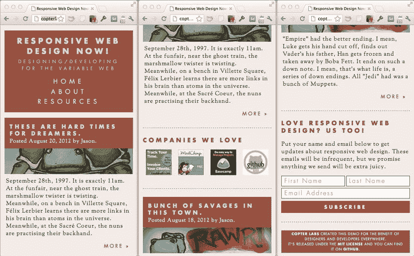
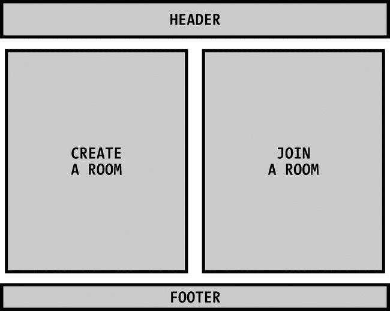
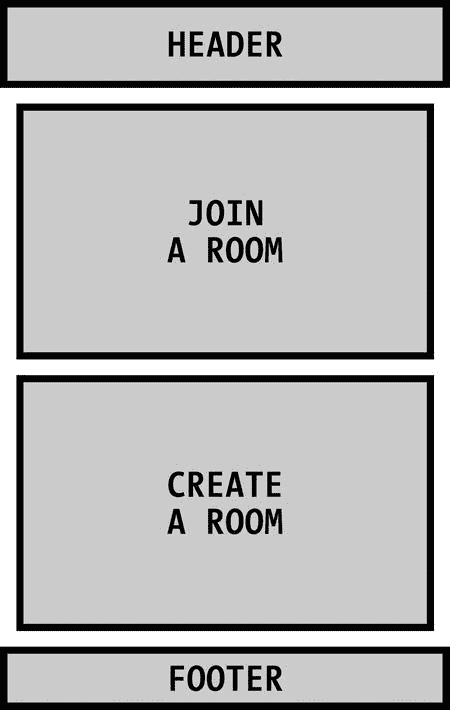
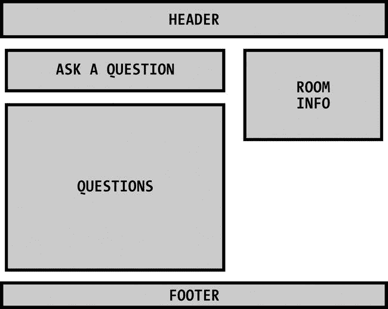
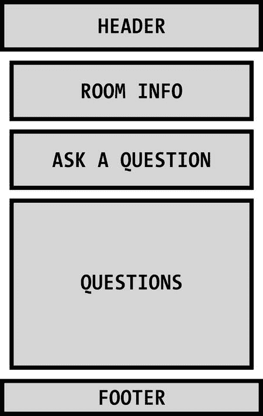
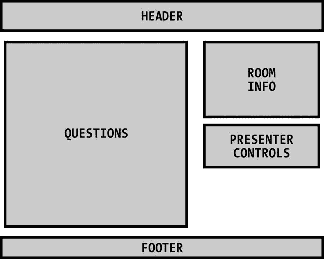

第五章


确定应用的功能和结构

现在我们知道我们正在构建一个 web 应用，并且我们已经准备好了工具，我们可以开始真正规划应用的功能了<sub>..</sub>在本章中，您将:

*   定义应用的功能
*   确定用户将如何与之交互(以及基于用户角色的不同之处)
*   为网站的后端代码和数据库制定一个计划
*   想出一个前端的结构
*   为应用创建一个简单的线框

在这一章结束的时候，你应该对应用的构建有一个非常清晰的想法；这将消除浪费的开发时间，并有助于保持应用正常运行。

这个应用是做什么的？

在我们计划任何事情之前，你需要一个非常清晰简明的特性列表。这将检查我们的特性列表，并在您开始设计和开发时帮助避免任何范围蔓延。

给应用一个使命宣言

让我们从应用的高层次概述开始，这将指导您做出关于应用功能的所有决策。

用一小段话来说，让我们想想如何描述这个应用:

这是一个简单的 Q &一个网络应用，允许特定事件的参与者向演讲者提问，并确认另一个参与者的问题也与他们相关，所有这些都是实时的。此外，演示者应该有一个问题列表和每个问题的提问人数，她可以在向小组给出答案时从中标记出已回答的问题。

App 不做什么？

与应用能做什么相比，同样重要的是它不能做什么。这将有助于决定某个功能是否应该包含在应用中。

该应用旨在成为现场活动的演示者和参与者的工具，最有可能在与其他参与者相同的物理空间中使用。所以 app 应该*而不是*:

*   尝试取代现场讨论。

*   这意味着应用本身不允许评论或回答；它只是提出问题，而不是回答或澄清问题。允许在应用中讨论可能会分散对实际演示的注意力。

*   提供有关会话的任何附加信息。

*   该应用不会告诉与会者会议的内容，也不会提供任何资源。焦点仍然在演示者身上，因为这个应用并不参与演示，只是问答。

*   为演示者提供任何组织工具。

*   演示者的仪表板只是一个问题列表，按受欢迎程度排序，可以标记为“已回答”这不是帮助演示者更好地进行演示的工具；它可以帮助他们回答房间里的问题。

用户会扮演什么角色？

既然我们知道了应用做什么——提问和回答问题——我们就可以定义与它交互的不同类型的用户。

因为这是一个非常简单的应用，所以只有两个用户角色:演示者和参与者。

提出者

演示者将在应用的主视图上创建一个房间，然后使用创建房间时生成的链接与与会者共享该房间。将向他提供一个结束会话的按钮，关闭该按钮以回答进一步的问题。

当提问时，它们会实时出现在演示者的屏幕上，并带有一个 UI 元素，允许他将问题标记为已回答。

出席者

与会者将通过单击演示者提供的链接或输入房间 ID 来加入房间，房间 ID 将是 URL 中不是域名的部分(即`http://example.com/1234`，其中`1234`是房间 ID)。

进入会议室后，与会者将看到之前在此会议中提出的问题(如果有)，并可以选择对该问题进行投票表决。任何新问题都会实时出现在屏幕上。

还将有一个表格，与会者可以通过它提出自己的问题，这些问题将被添加到她已经投票表决的问题列表中。

最后，如果一个问题没有得到满意的回答，或者这个问题不适合整个小组，将会有一个链接直接给演示者发电子邮件。

前端规划

你的下一步是开始充实你将采用的应用前端的方法，或者用户将与之交互的应用的可视部分。

在本节中，您将为所有前端技术组织您的开发方法。

我们在使用什么技术？

我们已经讨论了我们将用于此应用的工具，但概括一下，您将使用以下内容构建网站的前端:

*   HTML5
*   CSS3
*   Java Script 语言
*   框架
*   Pusher JavaScript 库

您将使用每种技术的多个方面来为应用制作一个好看、易用、简单的前端。

使用 HTML5

和几乎所有的 web 应用一样，前端将使用 HTML 标记构建。对于这个应用，您将利用 HTML5 中引入的一些新元素和属性。

您可能已经见过或使用过任何新元素，比如`<article>`和`<footer>`元素。如果您没有，它们在功能上与`<div>`元素相同，但是从语义的角度来看它们更好，因为它们是自描述的。

你还将利用新的`<input>`类型——即`email`类型——来鼓励触摸屏设备定制键盘，以适应输入的数据。

最后，您将使用新的数据属性将信息传递给级联样式表(CSS)和 jQuery，用于各种目的。我们将在下一章更深入地探讨如何和为什么这样做。

用 HTML 实现极简主义

 **小心**以下是作者的边界咆哮。

好的 HTML 标记是一个相对的术语。怎么好？有功能就好吗？格式良好？有效吗？

像编程中的几乎所有东西一样，HTML 标记“好”的大部分原因完全是主观的。没有全球公认的“正确方式”来编写标记，这可能是一件好事，因为它允许开发人员创造性地使用 HTML 元素来创建真正聪明的布局。

然而，有*种绝对*错误的方式来编写标记。比如对每个应用的 CSS 类使用不同的嵌套`<div>`是*错误的*；这只是草率的编程。使用完全不透明的类名是错误的。把适当的缩进和嵌套抛到九霄云外是错误的。

对于这个应用，我们将 HTML 视为一个舞池:它需要清除任何碎片和障碍，以便呈现的数据不会被绊倒。

让我们回顾一些最常见和最有害的标记实践，并计划*而不是*使用它们中的任何一个。

滥用

元素

HTML 标记最明显的滥用是为每个要应用的新样式应用新的`<div>`元素。这不仅给文档对象模型(DOM)增加了更多的元素，使 jQuery 遍历这样的事情变得更加复杂和低效，而且使以后的维护成为一场噩梦，尤其是当其他人不得不处理您的代码时。

使用完全不透明的类名

另一个令人沮丧的标记*失误*是使用了神秘的类名和 id。在 99.999%的情况下，通过将类名`float-right`缩短为`fl`来节省几个字节的好处完全被令人头痛的事情抵消了，因为这使人们不得不在以后试图理解和维护代码。

完全忽略缩进

缩进在 HTML 中是可选的，因此它在很大程度上被许多开发人员忽略了。这不一定会损害他们的工作质量，但会使处理他们的加价变得比必要的更痛苦。

考虑到至少对标记进行*排序*所需的额外时间可以忽略不计，特别是考虑到大多数现代集成开发环境(IDEs)默认情况下会正确缩进代码——不花一点时间来确保以后必须处理标记的人可以通过添加一些空白来阅读它，这简直是懒惰。

好的标记与坏的标记的例子

为了展示关注标记所能带来的巨大差异，让我们来看一个非常小的例子，这个例子比较了一个糟糕的标记片段和一个完成相同任务的重写的片段。

错误标记的示例

首先，我们来看看不好的标记。在不到 3 秒钟的时间内，您能找出这是什么，以及如何解决额外的保证金问题吗？

```php
<td><div class="sb"><div class="im csh"><a
href="http://www.example.com/inventory/1234/"
title="Example Product"></a></div></div></td>
```

这段代码完全有效，但是太糟糕了。这些`<div>`都是从哪里来的？`sb`班到底是干什么的？那么`csh`、`im`或者`at`呢？要解决这个假设的边距问题，您必须检查这个代码片段中引用的每个类，然后才能确定有问题的样式。

最重要的是，由于完全没有格式化，如果不花额外的时间真正查看，很难说出这个片段是什么。这将会减慢将来的维护，尤其是如果有其他人在做的话。

同样的例子，但是有更好的标记

将前面的标记与下面的代码片段进行对比:

```php
<td class="show-badge">
    <a href="http://www.example.com/inventory/1234"
       class="image cushioned"
       title="Example Product">
        
    </a>
</td>
```

你花了多长时间才发现这是一个产品的图片缩略图？不长，尤其是与原始片段相比。

多余的`<div>`已经被删除，因为所有这些样式都可以应用于`<td>`或`<a>`元素。类名已经扩展到人类可读的程度。(据猜测，我们假设的保证金问题可能来自于`cushioned`类。)元素已被格式化，以便于扫描。

对你的标记做这些小小的调整将会多花几秒钟，但是会节省*小时*的沮丧。所以你应该去做。

CSS3，媒体查询 ，以及它如何影响设计和 HTML

为了设计应用，你将使用 CSS，包括 CSS3 的一些新特性。使用像`box-shadow`和`border-radius`这样的功能将允许你给你的应用一层设计润色，而不必处理大量的图像。

您将实现的 CSS3 最令人兴奋的新特性可能是使用媒体查询的自适应布局。这将允许您基于浏览器的宽度应用样式，消除浏览器嗅探、应用的多个版本或仅在特定设备子集上看起来不错的布局的需要。

然而，使用媒体查询带来了一些问题，应该在应用的设计和标记阶段解决。因为布局会改变以最适合它所显示的屏幕，所以从一开始就需要考虑布局的一定程度的灵活性。

一列和两列布局

当查看实现自适应布局的网站时，最常用的技术之一是在较小的屏幕上查看网站时，从多列变为单列。

乍一看，这似乎没什么大不了的，但是如果内容需要以除了第一列、第二列等等之外的任何方式流动(反之亦然)，这可能会给布局带来麻烦。(例如，如果广告突然被推离所有最新内容下方的屏幕，侧边栏中有广告的网站可能会与广告商陷入困境。)

练习 5-1:使用响应式布局

为了展示 responsive layout 可能带来的内容回流挑战，我们来看一个示例站点。

在这个练习中，你负责将图 5-1 中的设计转换成一个响应式布局。


[图 5-1。](#_Fig1)需要转换为响应布局的示例网站

这是一个非常标准的布局:一个页眉、一个页脚、一个包含博客条目的左侧栏和一个包含标准“侧边栏”内容(广告和时事通讯截图)的右侧栏。

在小屏幕上重排内容

从逻辑上讲，当站点在手持设备上呈现时，并排显示两列是没有意义的；内容会过于混乱和狭窄。自然的解决方案是切换到单列布局，这允许内容以更美观的方式显示。

然而，这个网站的广告商不会容忍广告被埋在博客条目下面——随着更多内容的积累，可能会有多达八个条目显示在左栏中——所以简单地将左栏堆叠在右栏之上不会有所减少。

要解决这个问题，您需要以某种方式将左栏的内容与右栏的内容交错。这需要对标记进行一些调整，以允许主要内容区域的每个部分独立流动。

通常，像这样的设计可能会被标记为如下形式(简化):

```php
<header>...</header>

<section id="main-content">
    <article>...</article>
    <article>...</article>
</section>

<aside id="sidebar-content">
    <div id="ads">...</div>
    <div id="newsletter">...</div>
</aside>

<footer>...</footer>
```

然而，这会将列放入不允许您重排内容的“框”中。要解决这个问题，您需要让每一部分内容都有自己的盒子:

```php
<header>...</header>

<article>...</article>
<aside id="ads">...</aside>
<article>...</article>
<aside id="newsletter">...</aside>

<footer>...</footer>
```

这种标记类似于单列布局的外观:以一个条目开头，然后显示广告，然后显示另一个条目，最后显示新闻稿注册。将来，更多的条目将出现在时事通讯的下方。

现在，当屏幕足够宽时，您可以使用媒体查询将内容排列成两列，但当屏幕不够宽时，可以按可接受的顺序堆叠内容。

通过媒体查询进行内容重排

要让内容正确显示，请从最小的屏幕尺寸开始。标记没什么特别的；只是一些基本的风格:

```php
article {
    position: relative;
    margin: 0 0 2em;
    overflow: hidden;
}

aside {
    margin: 1.5em 0;
    padding: 1.5em 0;
    border-top: 1px dashed #955240;
    border-bottom: 1px dashed #955240;
}
```

然后，当屏幕足够宽时，应用附加样式将内容分成两列。对于本例，应用这些规则的媒体查询被设置为匹配任何小于 768 像素的屏幕，这是一种常见的平板电脑分辨率。

这种风格并不疯狂:博客条目向左浮动，侧边栏内容向右浮动，将内容分为两栏:

```php
@media screen and (min-width: 768px) {

    article {
        position: relative;
        float: left;
        width: 55%;
        margin: 0 3% 2em 0;
    }

    aside {
        float: right;
        width: 42%;
        margin: 0 0 2%;
        padding: 0;
        border: none;
    }

}
```

 **注意**百分比的使用允许列根据屏幕大小增长或收缩。在桌面浏览器中查看此布局时，您可以调整窗口大小来查看内容重排，以利用可用空间。

一旦布局完成，窄屏幕将看到一个单列布局，广告可接受地位于第一个条目的下方([图 5-2](#Fig2) )。



[图 5-2。](#_Fig2)从左到右显示回流内容的三个屏幕

 **注**要查看实际布局并查看上述练习的完整源代码，请访问`https://github.com/jlengstorf/responsive-design`。

可点击区域和胖手指

设计将在移动设备上使用的应用的另一个不同之处是当点击(或点击)时精确度的损失。如果你曾经试图在手机上使用一个专为全尺寸浏览器设计的网站，你可能会经历这样的挫折:试图点击列表中显示的链接，但由于手指太大而无法准确选择，所以意外地选择了错误的链接。

由于这个原因，你的用户界面应该有大按钮，并确保链接周围有足够的空间，以确保用户即使用胖手指也能轻松点击它们。

效果和动画

为了让应用感觉像是在响应用户动作，您还需要实现效果和动画，包括指示用户选择了哪个输入或控件(包括键盘控制)的代码，以及表示请求的动作已经执行的简单动画。

投票表决一个问题

当与会者点击某个问题的向上投票按钮时，您会希望添加一种效果来提供视觉反馈。在这种情况下，只需突出显示控件并增加投票计数就足够了。

回答问题

当演讲者回答问题时，它应该停留在屏幕上，但移到不太突出的地方。您需要实现一些效果来对问题列表进行重新排序，将已回答的问题移到未回答的问题下面，以及降低其不透明度来保持对未回答问题的关注。

来自 UI 元素的反馈

用户可以在应用中的各种 UI 元素上悬停或切换，所以你要确保添加效果，让他们知道什么是可点击的，或者哪个表单元素有焦点。这可以用 CSS 来完成。

其他影响

每当其他用户执行某些操作时，网站的后端将通过 Pusher 用新数据更新应用，因此必须有适当的效果来处理 DOM 操作以显示更新。我们将在后面的章节中更深入地讨论这些影响。

后端规划

网站的后端是所有用户操作需要被处理和存储的地方。为了使应用易于维护和快速开发，让我们来看看脚本和数据库应该如何组织。

模型视图控制器

web 应用软件设计的行业标准是*模型-视图-控制器* (MVC) 模式。有几十种可用的 PHP 框架，其中大多数都是基于 MVC 模式的。

因为它的广泛使用以及它被普遍认为是 web 应用的最佳方法这一事实，您将使用 MVC 模式来构建这个应用。

MVC 编程模式简介

MVC 听起来比实际更复杂。MVC 的核心概念是将任何表示元素(视图，通常是 HTML 标记)与数据(模型，通常是存储在数据库中的信息)和逻辑(控制器，可能是 PHP 代码)分离开来。

使用 MVC 模式的应用有三个非常明显的区别:

*   **控制器**处理数据和解释用户输入的类和代码。这就是解释用户指令(比如一个页面请求)，向模型请求所需的数据，操纵它，并将其发送到视图进行输出。
*   **建模读写数据的**类。就这样。这些类不对数据进行任何操作，也不生成任何显示给最终用户的输出。
*   这是用来向用户显示信息的代码。这里没有任何形式的逻辑；在 web 应用环境中，视图应该尽可能接近普通的 HTML。

对基于 MVC 的应用的典型请求应该与这些非常相似(见[图 5-3](#Fig3) )。


[图 5-3。](#_Fig3)显示典型 MVC 请求的操作顺序的图表

让我们带着我们正在构建的应用，走一遍图 5-3 所示的步骤。

1.  用户通过统一资源指示器(URI) 传递命令，与客户端应用(控制器)进行交互。这可能是一个演示与会者填写并提交问题表，或投票表决一个问题。或者可能是演示者将问题标记为已回答。这导致客户端应用向服务器发出请求。
2.  控制器处理该请求，基于请求参数确定动作。然后，它根据这些输入与适当的模型进行交互。
3.  MVC 中的模型也可以表示或包含数据访问层。在我们的应用中，就是这种情况。因此，当用户提交一个问题与模型进行交互时，它会将问题存储在数据库中。如果是问题投票表决的结果，问题已经被投票表决的事实也将被保留。在模型处理了交互之后，它将适当的数据返回给控制器。
4.  控制器处理来自模型的响应，并将其传递给视图。
5.  视图根据控制器的响应进行更新。正在提交的问题可能会导致视图发生变化，向演示者显示所有问题，同时突出显示新添加的问题。或者在向上投票的情况下，问题可以改变视图中的位置。

用一个愚蠢的类比来解释 MVC

为了以最简单的形式理解 MVC，考虑订购一份比萨饼。你打电话给披萨店，和收银员说，收银员会帮你点菜。当你点完菜后，收银员告诉厨师点了什么，厨师就开始做披萨。披萨出炉后，厨师将披萨交给收银员，收银员将披萨打包后交给送货司机，随后送货司机会将披萨送到你家。

在这个例子中，收银员是控制者。你通过电话与她互动——URI(T1)——给她你的命令——T2 的指示(T3)——她会翻译。

厨师是*型*。收银员向他要你要的披萨——*数据*——他给了收银员。厨师接受请求，制作比萨饼，在烤箱中烹制，然后交给收银员。

然后，收银员准备好要交付的比萨饼— *逻辑*—并把它交给司机，司机是从交互中产生的*视图*。收银员给她指示后，司机把披萨送到你面前——*展示*——供你享用。司机除了给你送披萨，从来不会以任何方式碰披萨；如果你的披萨外卖司机染指了你食物的原材料，那就太不可思议了。

 **注** MVC 可以追溯到 1979 年 [<sup> 2 </sup>](#Fn2) 从它的概念提出到现在的 30 多年里，已经被数十种语言的程序员解释、再解释、再解释。实现 MVC 没有绝对正确的方法。这是一个指导发展的哲学原则，而且，和所有的哲学一样，它在不同的阵营中会有不同的实践。不要为此感到紧张。

确定数据库结构

为了存储关于房间和问题的信息，你需要一个数据库。在本节中，您将列出需要存储的数据列表，并确定这些数据的结构。

需要存储哪些数据？

首先，让我们列出应用正常运行需要存储的所有内容。这包括房间和问题信息:

*   房间的名称
*   房间的唯一标识符
*   房间是否处于活动状态
*   演示者的姓名
*   演示者的唯一标识符
*   演示者的电子邮件
*   这个问题
*   问题的唯一标识符
*   不管这个问题是否被回答
*   这个问题的投票数

数据库规范化

为了保持数据库整洁并消除重复信息，需要对数据库进行规范化。 [<sup>3</sup>](#Fn3)

为什么数据库规范化很重要

说明数据库规范化为什么重要的最简单的方法是看一个简单的例子。

想象一下，一所大学有一个数据库，需要跟踪它的教授以及每个教授目前在教什么课。它需要存储教授的姓名、电子邮件地址、聘用日期和他们所教班级的 ID。

如果数据库是*而不是*规范化的，它可能看起来像[表 5-1](#Tab1) 。

[表 5-1](#_Tab1) 。尚未规范化的表


乍一看，这可能没有错，但是当你开始处理数据时，事情就开始变得有点不可靠了。

例如，当一个新教授被雇用，但还没有上课，会发生什么？该条目将有一个空列，这可能会导致读取该数据的任何应用出现问题。

反过来，一个老师教两个班或者两个班以上怎么办？除了一列之外，所有列都有重复数据(见[表 5-2](#Tab2) )。

[表 5-2](#_Tab2) 。一个教授教两个班的非规格化表


还有删除信息的问题:如果汤姆·琼斯停止教 MATH-315，那一行从数据库中删除，他的其他信息也会丢失，这可能不是想要的结果。

规范化数据库

为了使这个数据库更易于管理，应该将其规范化，这将把数据分成两个表:一个用于教授数据(见[表 5-3](#Tab3) )，另一个用于将教授映射到他们所教的班级(见[表 5-4](#Tab4) )。

[表 5-3](#_Tab3) 。没有班级信息的教授表

| 名字 | 电子邮件 | 雇佣日期 |
| --- | --- | --- |
| 简·多伊 | [jane.doe@example.org](mailto:jane.doe@example.org) | 2004-08-09 |
| 汤姆·琼斯 | [tom.jones@example.org](mailto:tom.jones@example.org) | 2007-01-15 |

[表 5-4](#_Tab4) 。新表格将教授与他们所教的班级对应起来

| 教授 | 班级 |
| --- | --- |
| 简·多伊 | ECON-101 |
| 简·多伊 | ECON-201 |
| 汤姆·琼斯 | 数学-315 |

通过将数据拆分到两个表中，现在可以在不丢失个人数据的情况下取消汤姆·琼斯作为数学 315 教师的职务，并且也可以让无名氏教两个班而不复制她的所有其他数据。

然而，这个表仍然不理想，因为它在更新教授的姓名时存在困难。例如，如果雇佣了另一个叫 Jane Doe 的老师，如何在教授和所教班级的映射表中唯一地识别出哪个老师是被引用的？可以进一步规范化为教授使用数字 ID 而不是他们的名字，这解决了这个问题(见[表 5-5](#Tab5) 和[表 5-6](#Tab6) )。

[表 5-5](#_Tab5) 。添加了 ID 字段的 Professors 表


[表 5-6](#_Tab6) 。班级信息表现在使用教授的 id 而不是他们的名字

| 教授 _ID | 班级 |
| --- | --- |
| one | ECON-101 |
| one | ECON-201 |
| Two | 数学-315 |

在这一点上，这个数据库是充分规范化的，在将来添加、修改或删除数据时不会出现任何问题。

确定表格和结构

考虑到标准化，让我们为您的应用定义表。概括地说，您需要存储的数据如下:

*   房间的名称
*   房间的唯一标识符
*   房间是否处于活动状态
*   演示者的姓名
*   演示者的唯一标识符
*   演示者的电子邮件
*   这个问题
*   问题的唯一标识符
*   不管这个问题是否被回答
*   这个问题的投票数

如果您正常地对这些数据进行分组，您应该得到四个表:

*   提出者
*   空间
*   问题
*   投票

演示者表格

第一个表`presenters`，存储演示者的姓名、电子邮件和唯一的 ID(见[表 5-7](#Tab7) )。

[表 5-7](#_Tab7) 。`presenters`表

| 编号 | 名字 | 电子邮件 |
| --- | --- | --- |
|   |

房间表

`rooms`表将存储房间的唯一 ID、名称以及是否处于活动状态(参见[表 5-8](#Tab8) )。

[表 5-8](#_Tab8) 。`rooms`表

| 编号 | 名字 | 不活动的 |
| --- | --- | --- |
|   |

问题表

`questions`表将存储问题的唯一 ID、问题所属的房间、问题文本以及问题是否已被回答(参见[表 5-9](#Tab9) )。

[表 5-9](#_Tab9) 。问题表

| 编号 | 室友 | 问题 | 已回答 |
| --- | --- | --- | --- |
|   |

问题投票表

`question` _ `votes`表将存储问题的 ID 和当前的票数(见[表 5-10](#Tab10) )。

[表 5-10](#_Tab10) 。`question_votes`表

| 问题 id | 投票计数 |
| --- | --- |
|   |

房间所有者表

`Room_owners`表将存储房间和主持人的 id(参见[表 5-11](#Tab11) )。

[表 5-11](#_Tab11) 。`room_owners`表

| 室友 | 演示者 id |
| --- | --- |
|   |

将所有东西放在线框图中

此时，我们已经完成了大部分计划；剩下的就是快速绘制应用的线框，以获得布局的大致想法。

组织主页

主页需要服务于两个目的，以满足我们两个用户角色的需求。

首先，它需要为演示者提供创建新房间的方法。这将需要一个要求提供必要信息的表格。

其次，如果与会者没有与会话的直接链接，他们需要能够加入房间。这还需要一个接受房间 ID 的表单。

除了这两个表单之外，还应该有一个用于标识应用的页眉和一个用于提供附加信息(如版权)的页脚。

更宽屏幕的线框

在更宽的屏幕上，并排设置这两种形式是有意义的，因为它们并不比另一个更重要或更不重要。当我们把这些都放到一个基本的线框中，它看起来像图 5-4 。



[图 5-4。](#_Fig4)更宽屏幕的主页线框

较窄屏幕的线框

在较窄的屏幕上，两栏布局是不可行的，所以我们必须将内容重排为一栏。与会者加入会议室的表格应该放在顶部，原因有二:它将比演示者表格短得多，而且有理由认为使用该应用参加会议的人将多于演示者。

内容重排后，看起来会像[图 5-5](#Fig5) 。



[图 5-5。](#_Fig5)窄屏幕的主页线框

为与会者组织问答页面

与会者加入房间后，应用需要显示房间的名称和演示者是谁，并向她显示提问表格和现有问题列表。

页眉和页脚将在整个应用中保持一致，因此只有主要内容区域需要改变。

更宽屏幕的线框

同样，在更宽的屏幕上，内容可以分成两列，但在这种情况下，其中一列应该比另一列宽，因为侧边栏中不会显示太多内容。

提出新问题的表格应该放在主栏的顶部，下面是问题。

在右侧，应该显示房间的名称和演示者的信息。

插入这些信息后，线框看起来像[图 5-6](#Fig6) 。



[图 5-6。为与会者设计的问答页面被框在更宽的屏幕上](#_Fig6)

较窄屏幕的线框

对于单列布局，我们实际上要把包含房间信息的侧栏放在顶部。这样做的原因是内容很重要——没有它，与会者就不知道他们参加了哪个会议——而且非常短，所以它不会把其余的内容压得太低。

重排内容后，你会看到类似于[图 5-7](#Fig7) 的东西。



[图 5-7。为与会者设计的问答页面适合更窄的屏幕](#_Fig7)

为演示者组织问答页面

面向与会者的问答页面和面向演示者的问答页面之间只有一些小的区别。也就是说，删除了“提问”表单，并为演示者添加了一些控件。

更宽屏幕的线框

将“提问”表单换成演示者控件后，两栏视图中的布局没有太大变化。然而，控件并没有放在问题列表的顶部，而是放在房间信息的下面，以便将注意力更多地放在回答问题上(参见[图 5-8](#Fig8) )。



[图 5-8。](#_Fig8)Q&为演示者设计的页面被框在更宽的屏幕上

较窄屏幕的线框

与与会者的布局类似，房间信息和控件将移动到单列视图中问题列表的顶部(参见[图 5-9](#Fig9) )。


[图 5-9。](#_Fig9)Q&专为窄屏幕的演示者设计的页面

摘要

此时，您已经熟悉了所有需要的技术，您已经为站点的前端和后端开发制定了一个攻击计划，并且您已经有了一个线框来通知您的设计。

在下一章中，你将根据本章的计划从头开始设计和构建应用。

[<sup>1</sup>](#_Fn1) 关于适应性布局的图库，参见`http://mediaqueri.es`。

[<sup>2</sup>](#_Fn2)T0】

[<sup>3</sup>](#_Fn3)T0】