第六章

设计应用程序

因为这是一本关于开发而不是设计的书，所以这一章会很短。它讨论了一些 web 应用程序特有的设计注意事项。此外，我们将谈一谈如何确保在 Photoshop 中制作的设计能够很好地翻译到 web 上。

 **注意**本章假设你已经接触过 Adobe Photoshop，对它的界面相当熟悉，而且——也许是最重要的——你关心设计。您将能够在另一个程序(如 GIMP)中创建相同的作品，但以下步骤不会正确匹配。

 **警告**如果你是一名铁杆开发者，正考虑跳过这一章，那么除了带你浏览应用程序的设计，它还提供了一些调整 Photoshop 设置的技巧，以确保编码后的设计看起来像 Photoshop 中的布局。如果您在团队中工作并做任何前端工作，当您的创意团队想知道为什么字体看起来略有不同或其他微小的布局不一致时，这可能会省去您一些头痛。

设定设计目标

对于任何设计项目来说，从明确的目标开始是很重要的。这有助于防止设计偏离轨道或与应用程序的意图相冲突。

因为这种设计是针对需要在标准 web 浏览器和手持设备上工作的应用程序，所以这种设计的目标如下:

*   在绝对必要的情况下需要尽可能少的图像
*   保持设计简洁，只关注所需的内容
*   使用大型用户界面(UI)元素，使应用程序易于在触摸屏上使用

如果设计坚持这三个目标，那么从桌面到移动的过渡将会很容易，使用简单，导航也非常容易。

定义调色板

接下来，你需要为应用程序选择一个调色板。这完全是一个主观的决定，但是所选择的颜色应该符合一定的准则:

*   背景颜色和文本颜色应该有很高的对比度，以确保易于阅读
*   从易读性的角度来看，较亮的背景对眼睛来说更容易一些
*   包含强调色来吸引对重要元素(如链接和按钮)的注意通常是个好主意

对于这个应用程序，让我们使用简单的地球色调加上明亮的橙色强调色(见[图 6-1](#Fig1) )。保持中性色可以让眼睛看起来更舒服，防止颜色冲突，这会让网站上的文字更难阅读。本书中不会正确显示强调色，因为它是灰度的。要正确查看强调色，请将 Photoshop 中的拾色器设置为图中所示的十六进制值。

[图 6-1。](#_Fig1)为应用程序选择的调色板浅色将用于背景，深色用于文本

选择字体

最近对`@font-face`的广泛支持为设计师们打开了一个全新的可能性世界。基于网络的应用不再局限于一小部分网络安全字体；相反，交互设计师现在只受到他们想象力的限制(还有 OFL 许可 [1](#Fn1) )。

利用你新获得的自由，你现在需要为应用程序选择字体。像调色板一样，这完全是一个主观的决定，但是有一些通用的指导原则可以帮助选择稳定的字体:

*   标题可以使用比网站上其他内容更有趣的字体。
*   正文应该使用简单易读的字体，以确保阅读起来不难。
*   设计一致性很重要。不要过分使用不同的字体；坚持一个或两个一起工作很好的。
*   如果选择的字体非常独特，文档中使用的其他字体应该更加端庄，以防止冲突。
*   额外提示:有疑问时，使用 Helvetica。 [2](#Fn2)

为了创造视觉趣味，我们应用程序中的标题将采用古铜色黑色， [3](#Fn3) ，这是一种非常独特的字体，在广告的*广告狂人*时代大量使用。它经典而大胆，看起来不傻，这使得它非常适合大字体。

由于库珀·布莱克的圆形衬线，紧凑的字距(字符之间的间距)增加了视觉趣味。通过将字母挤在一起，我们获得了简洁的视觉效果。

相比之下，该网站的其余文字将设置为新闻哥特式 [4](#Fn4) ，就字体而言，这明显不那么直言不讳。它的线条简洁有力，非常易读——即使是小字体——但不会像库珀·布莱克那样引人注目。

为了提高可读性，字距应该向外调整一点，让字符“呼吸”它还与标题字体形成了很好的对比。

这两种字体很好地相互补充，将形成一个有凝聚力的演示文稿，而不会与互联网上其他使用传统 web 安全字体(如 Arial 和 Georgia)的网站融为一体。

当我们将它们放在一个样本中时，最终的字体选择看起来非常好(见[图 6-2](#Fig2) )。

[图 6-2。](#_Fig2)所选字体的样本

字体渲染:PHOTOSHOP vs . @ FONT-FACE

没有网络字体经验的设计师经常抱怨说，他们看起来和在 Photoshop 中不一样了。发生这种情况是因为 Photoshop 使用的抗锯齿与大多数 web 浏览器不同，这意味着字体的渲染会稍有不同。大多数人不会注意到这种差异，但这种差异足以让一个刚刚花了一周时间把自己的设计做得恰到好处的创意型人才感到心痛(见[图 6-3](#Fig3) )。

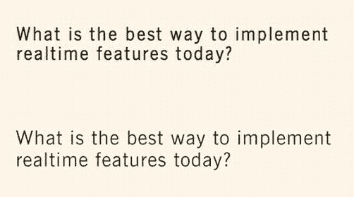

[图 6-3。](#_Fig3)在浏览器(上图)和 Photoshop(下图)中渲染的新闻哥特风格

幸运的是，Photoshop 提供了更改布局中字体抗锯齿的选项。其中一个选项——强——与大多数浏览器使用的抗锯齿非常相似，它消除了 Photoshop 布局与其在 Web 上的外观之间的明显差异(参见[图 6-4](#Fig4) )。

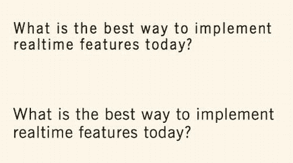

[图 6-4。](#_Fig4)使用强抗锯齿类型，字体匹配更紧密

要更改 Photoshop 中的抗锯齿模式，请选择文本图层(或图层；这可以批量更改而不影响其他设置)并打开“字符”面板。在右下角，有一个下拉菜单，可能默认选择了平滑。改成 Strong 就万事俱备了(见[图 6-5](#Fig5) )。

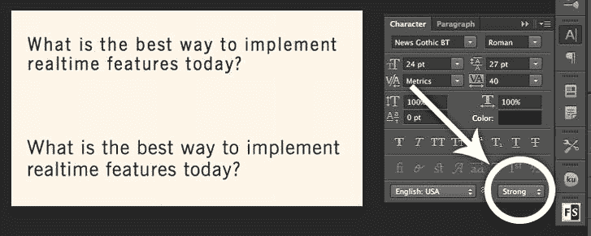

[图 6-5。](#_Fig5)在 Photoshop 中更改文字的抗锯齿

设计常见的站点元素

准备好你的颜色和字体，你就可以开始设计了。在 Photoshop 中，创建一个宽`1024px`高`840px`的新文档。开始设置背景为浅色，`#FBF7E7`。

创建标题

设计的第一个元素是标题，它将与设计的主体分开，以深色`#1F1B0C`作为背景色。

*   1.对于页眉，选择矩形工具，画一个宽`1024px`高`240px`的矩形。将其与文档的顶部和左侧对齐。
*   2.接下来，选择水平文字工具，并在页面上绘制一个包含主要标题的文本区域。打开字符面板，进行如下设置:

*   字体:古柏黑
*   尺寸:110 磅
*   跟踪:-80
*   颜色:#fbf 7 和 7
*   抗锯齿:强

*   3.添加应用程序的标题，**实时 Q & A** ，并将其置于标题中央。
*   4.要添加副标题，请使用水平文字工具在标题下绘制另一个文本区域。在“字符”面板中，将设置更改为以下内容:

*   字体:新闻哥特式光
*   尺寸:18 磅
*   跟踪:100
*   颜色:#fbf 7 和 7
*   抗锯齿:强

*   5.添加副标题，**课堂、演示和会议的实时反馈系统**。

保存到目前为止的工作；你现在已经得到了应用程序的标题(见[图 6-6](#Fig6) )。

[图 6-6。](#_Fig6)设计割台的工作进展

创建页脚

接下来，让我们添加网站页脚。再画一个`1024px`宽、`50px`高的矩形(就像你为标题画的一样),并将其与底部和左侧对齐；这将是页脚的背景。

*   1.使用水平文字工具，以页脚背景为中心绘制一个文本区域；然后将“字符”面板中的设置更改为以下内容:

*   字体:新闻哥特式光
*   尺寸:13 磅
*   跟踪:25
*   颜色:#fbf 7 和 7
*   抗锯齿:强

*   2.添加版权信息， **2013 杰森·伦斯托夫&菲尔·莱格特**；然后按下`Tab`并选择右对齐选项。制表符允许版权信息左对齐，而制表符后的文本右对齐。现在添加其余的页脚文本:*****的一部分实时 Web 应用:用 HTML5 WebSocket，PHP，和 jQuery*** **。获取图书|源代码(在 GitHub 上)**。**
***   3.对于链接 Get the Book and Source Code(在 GitHub 上)，依次选择每一个并将字体设置为 News Gothic Medium，打开下划线，将颜色设置为你的强调色，`#E06F00`。**

 **再次保存；页脚准备就绪(参见[图 6-7](#Fig7) )。

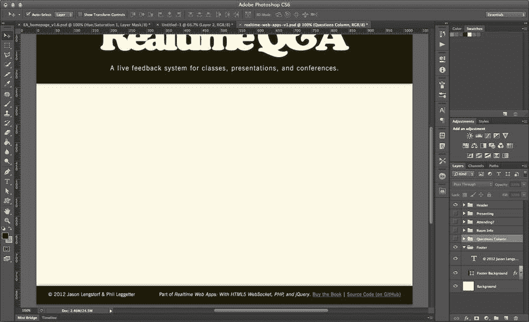

[图 6-7。](#_Fig7)应用程序的页脚

表单元素

现在您已经有了应用程序的基本包装，您可以开始整合用户界面的外观和感觉了。因为这个应用程序完全是关于交互的，它严重依赖于表单在与会者和演示者之间发送信息。

因为这个应用程序将依赖于它的表单元素来获得大部分美感，所以让我们从设计输入和按钮样式开始，我们可以在应用程序的所有视图上使用它们。

文本和电子邮件输入

文本输入将用于这个应用程序上几乎所有的交互，所以它们是一个逻辑起点。我倾向于将所有元素保存在 Photoshop 的不同图层上，然后将它们分组到文件夹中。随意使用任何适合你的组织方法。

*   1.  Playing off the roundness of our headline font, grab the rounded rectangle tool and set the border radius to `6px`. Draw a rectangle `430px` wide by `40px` tall and make it white (`#FFFFFF`). This will serve as the base for the input (see [Figure 6-8](#Fig8)).

    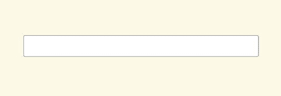

    [图 6-8。](#_Fig8)带 6px 圆角的白色矩形

*   2.  Next, we need to make it look a little more like an input. To start, let’s give it a border. Bring up the Layer Style panel by clicking the Layer Style (fx) button at the bottom of your layers panel while the rectangle layer is active (see [Figure 6-9](#Fig9)).

    

    [图 6-9。](#_Fig9)Photoshop 中的图层样式按钮

*   3.  After the Layer Style button is clicked, several options will be listed. Click Stroke and the Effects dialog will open.

     **提示**隐藏目标路径——当你选择图层时 Photoshop 显示的矩形轮廓(见[图 6-9](#Fig9) 的例子)——以便更好地了解你编辑效果时的样子。要隐藏，按下`Command + Shift + H`或点击查看显示并取消选中目标路径。

*   4.  In the Effects dialog, give the input a 2px stroke and place it outside the shape. Use the dark color for this. The rest of the settings should remain at their default values (see [Figure 6-10](#Fig10)).

    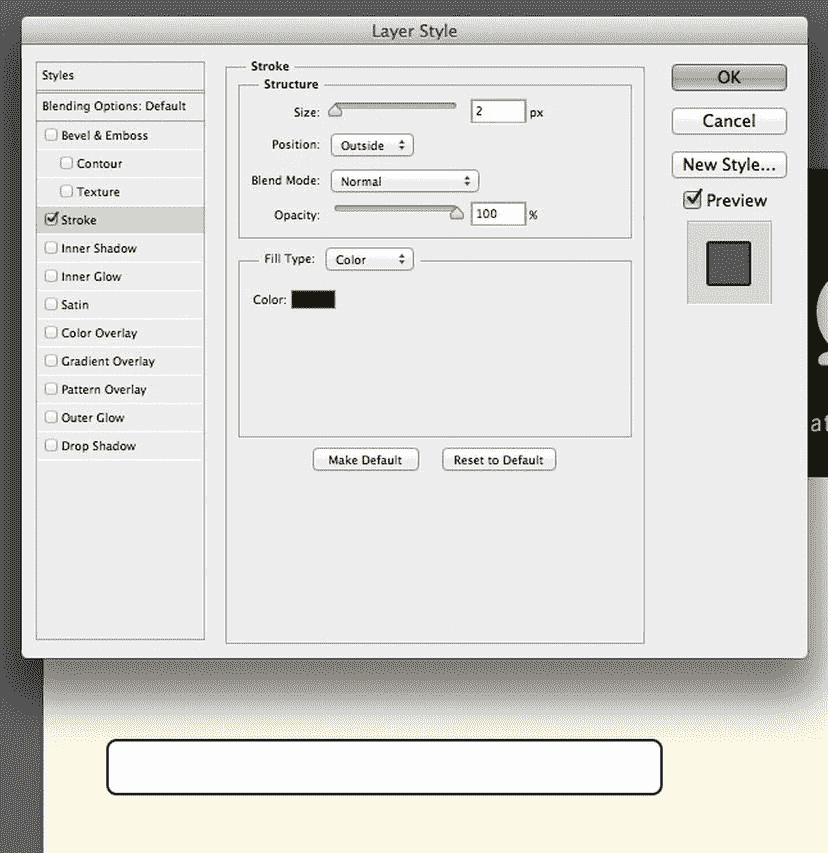

    [图 6-10。](#_Fig10)添加了笔画的输入，加上所有的设置

*   5.  Next, add an inner shadow to the input, which will give it some dimension. Click the Inner Shadow check box below Stroke in the Layer Style panel, which brings up new settings (if it doesn’t, click the actual label next to the check box). Set the shadow color to dark (#1F1B0C), the angle to 135º, distance to 2px, and the size to 14px. Change the blending mode to Normal as well, and drop the opacity to 30%, which gives you an input-looking rectangle (see [Figure 6-11](#Fig11)).

    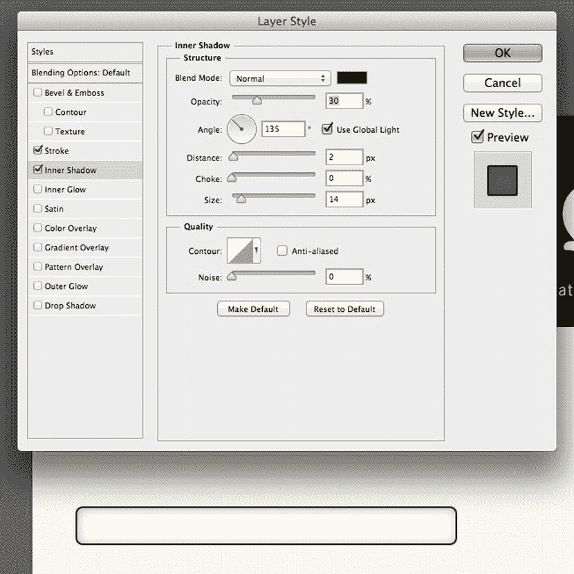

    [图 6-11。](#_Fig11)对输入矩形应用阴影的设置

     **提示**将混合模式设置为正常可以确保阴影很好地转换为 HTML/CSS。虽然混合模式正在设计中 [ 5 ](#Fn5) (希望很快)，但 CSS3 目前还不支持，因此应该暂时避免在网页布局中使用。

     **提示**使用 135 的阴影，这样在 CSS 中 X 和 Y 的偏移量是相同的。这通常看起来很好，并防止 Photoshop 中的阴影和 Web 上的阴影不一致。

*   6.最后，输入需要标签的样式，这将让用户知道她应该在字段中输入什么。这将是输入右上角的一个小文本字段，设置如下:

*   字体:新闻哥特式粗体
*   跟踪:25
*   颜色:#1F1B0C
*   抗锯齿:强

*   7.  Use the text **Tell us your name (so attendees know who you are)**. Align it with the input, and your input is complete (see [Figure 6-12](#Fig12)).

    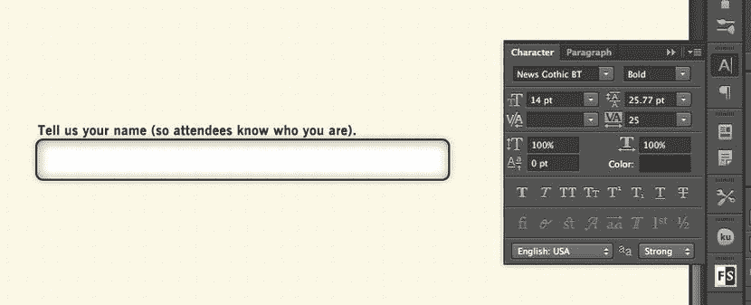

    [图 6-12。](#_Fig12)输入的标签完成了样式化

提交按钮

如果表单不能被提交，那么它们对我们没有太大的帮助，所以我们需要一个提交按钮来配合输入。

*   1.就像文字输入一样，使用圆角矩形工具，边框半径设置为`6px`。创建一个宽`310px`高`54px`的盒子，设置为深色(`#1F1B0C`)。这将是你的按钮的基础。
*   2.接下来，使用具有以下设置的文本工具:

*   字体:古柏黑
*   尺寸:30 磅
*   跟踪:-50
*   颜色:#fbf 7 和 7
*   抗锯齿:强

*   3.使用文本**创建您的房间**并将文本置于提交按钮的中央。
*   4.  To give it a little dimension, open the Layer Style panel and add a drop shadow using the dark color (`#1F1B0C`) at 30% opacity, angled at 135º, and set at a size of `10px` (see [Figure 6-13](#Fig13)).

    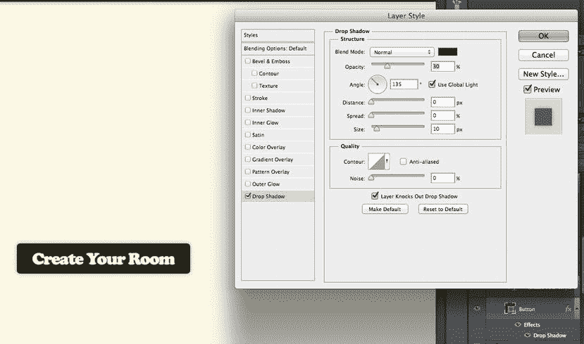

    [图 6-13。](#_Fig13)带有细微阴影的提交按钮

设计主视图

现在，网站的基本元素已经设计好了，您可以开始将它们组装到主页设计中。

此页面为用户提供了两个选项:他们可以作为演示者创建文件室或加入现有文件室。为了简单起见，除了页眉和页脚，这两个选项应该是页面上仅有的内容。

创建房间表单

首先放置创建*创建房间表单*所需的输入，它允许即将成为演示者的人为 Q & A:

*   名字
*   电子邮件
*   会话名称

因为这一页上有两个表单，所以只使用左半部分的可用空间。用你的标签描述得更详细一点，向用户解释为什么她需要提供这些信息。不要只是列出他们接受的数据，而是使用以下听起来更人性化的标签:

*   告诉我们您的姓名(以便与会者知道您是谁)。
*   告诉我们您的电子邮件地址(以便与会者可以与您联系)。
*   你的疗程叫什么？

在这些输入的下面，添加一个带有文本 Create Your Room 的 submit 按钮(在上一节中您已经准备好了)。这就完成了想要创建新房间的演示者的表格(参见[图 6-14](#Fig14) )。

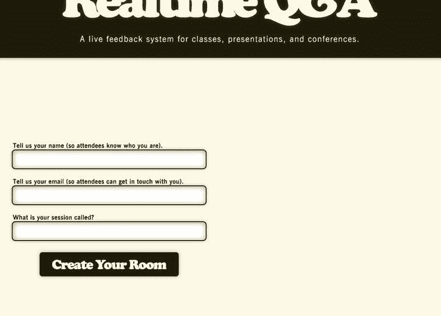

[图 6-14。](#_Fig14)主页视图上演示者的表单

但是，这个表单仍然缺少一些东西。让我们添加一个标题和一段描述性文字，以便清楚地说明这个表格的用途。首先在表单上方添加一个标题，设置如下:

*   字体:古柏黑
*   尺寸:48 磅
*   跟踪:-50
*   颜色:#1F1B0C
*   抗锯齿:强

简单的用文字呈现？对于标题，它向用户提出了一个清晰的问题，应该很快引导他到正确的形式。通过添加和提交按钮相同的投影来增加一点尺寸:颜色#1F1B0C，透明度 30%，135，大小 10px。

 **提示**在图层面板中要复制样式的图层上右键单击(或按住 Control 键并单击)，可以快速轻松地将图层样式复制到其他元素；然后从上下文菜单中选择复制图层样式。复制完成后，右击你想要应用样式的图层；然后从上下文菜单中选择粘贴图层样式，样式将被应用。当挑剔的客户希望看到设计中每个元素的多种变化时，这将为您节省时间。

接下来，在标题下添加一段文字，内容为:创建一个房间开始问答环节。使用以下设置:

*   字体:新闻哥特式罗马
*   尺寸:24 磅
*   跟踪:25
*   颜色:#1F1B0C

将标题居中并复制到表格上方，现在你应该有一个创建新房间的完成表格(见[图 6-15](#Fig15) )。

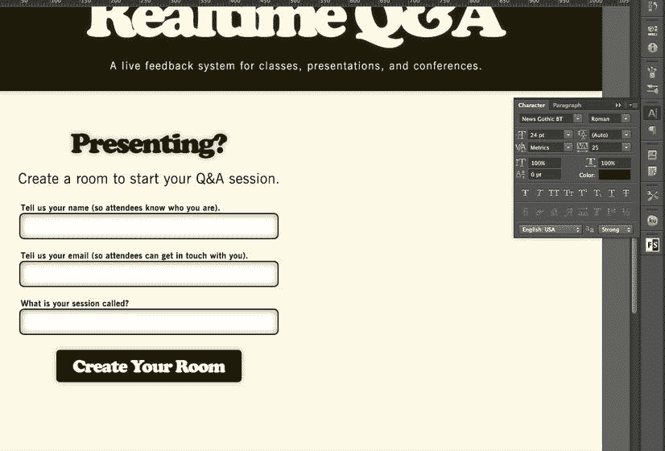

[图 6-15。](#_Fig15)完成家庭视图的创建房间表单

加入房间表单

为了保持设计的一致性，加入一个房间的形式将在风格上与创建一个房间的形式相同；只有输入和复制会改变。

为了最大限度地降低与会者的准入门槛，加入房间所需的唯一信息是房间号。

1.  通过将 create-a-room 表单复制到页面的右半部分，然后删除三个输入中的两个，快速启动该表单。
2.  把标题改成参加？上面的内容是“使用 ID 加入房间”。
3.  输入的标签应该变成，房间的 ID 是什么？
4.  最后，提交按钮的文本应该是“加入这个房间”。
5.  完成这些修改后，主页视图应该包含两个表单(见[图 6-16](#Fig16) )。

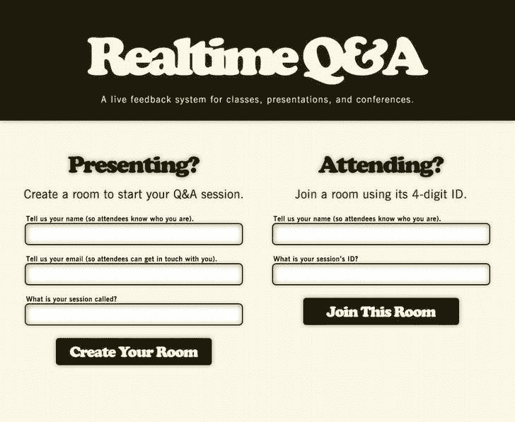

[图 6-16。](#_Fig16)已完成的首页视图

 **提示**现在你已经完成了主视图，将其保存为图层构图，在此状态下创建文档的快照(参见[图 6-17](#Fig17) )。这允许您隐藏所有主视图层，并开始在问题视图上工作，而不会丢失任何布局。如果你曾经不得不保存一个 PSD 的多个版本，或者因为覆盖了部分布局而丢失了半天的工作，layer comps 将会是你新的最好的朋友。

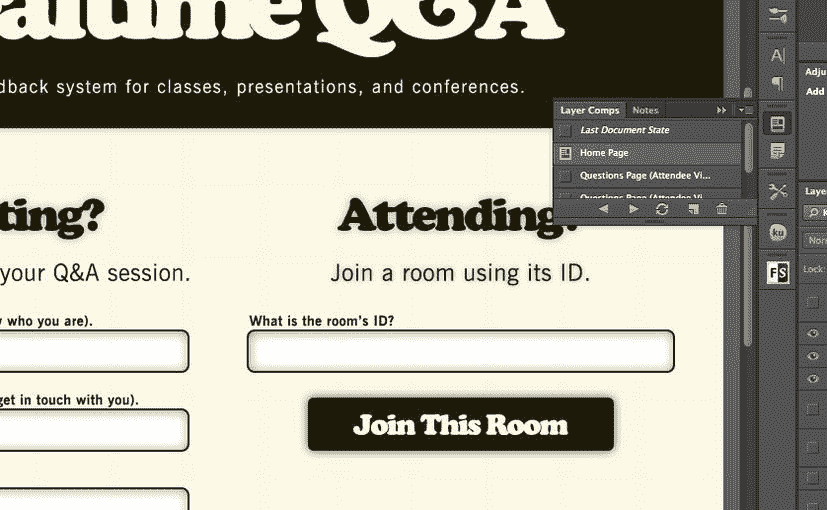

[图 6-17。](#_Fig17)图层复合面板允许在设计的不同状态之间快速切换，消除了对多个文件或大量重复图层的需求

设计房间视图

房间视图借用了主视图中的一些元素，这将稍微简化这个过程，但它也有多个状态:一个版本供与会者使用，一个版本供演示者使用，一个“关闭的”房间外观供演示者结束其会话后使用。

设计与会者视图

与会者视图有三个不同的部分:

*   提问的形式
*   房间信息(他们在哪里，谁负责)
*   这些问题

为了组织这些信息，您将使用两栏布局，其中左栏更大，并突出重要信息(其中 *important* 表示最直接有用；在这种情况下，提问表单和问题本身)，右栏将包含不太重要的信息—会议和发言人的名称，与会者可能在加入之前就知道—并且会更小。

提问式表单将位于主栏的顶部，不会偏离标准的表单元素设计。

房间信息将遵循库珀黑色标题和新闻哥特式正文的标准；唯一不同的是，它会更小，标题使用 30 磅文本，正文使用 18 磅文本。

这些问题不同于你目前设计的任何问题，所以它们需要更多的思考。需要显示的信息如下:

*   问题本身
*   该问题获得的投票数
*   允许与会者为该问题投票的按钮

问题将使用 News Gothic 以 24 磅显示，这对于在任何屏幕尺寸上阅读都是一个很好的尺寸，即使设备稍微远一点，例如放在桌子上的电话。文本将位于问题布局的右侧。

计票将在库珀黑色 24 点，将坐在最左边的问题。

在计数和问题之间有一个大按钮，用来对问题进行投票表决。用椭圆工具画一个直径为 60px 的圆，颜色为深色，# 1F1B0C 然后使用自定义形状工具在其中心绘制一个浅色箭头#FBF7E7。给黑色圆圈添加和提交按钮一样的阴影，现在你就有了一个投票按钮。

在第一个问题下面添加第二个问题，以确保设计可以处理多个问题。问题之间的微妙分割线——一个 2px 乘 500px 的深色矩形，填充不透明度为 10%,带有来自提交按钮的阴影——完成了与会者页面视图(参见[图 6-18](#Fig18) )。

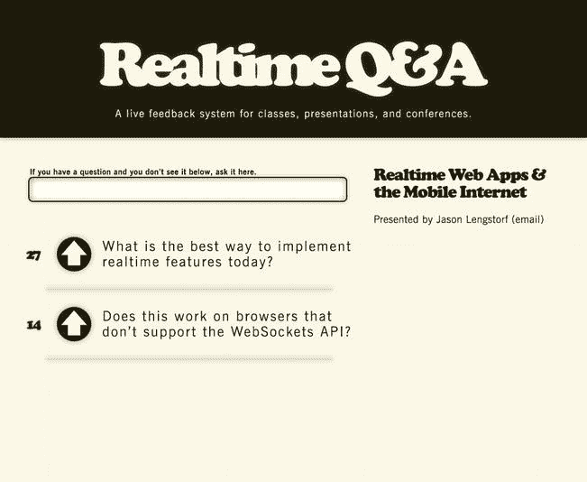

[图 6-18。](#_Fig18)与会者的房间视图

设计封闭房间视图

封闭房间视图与标准与会者视图非常相似，但有两个明显的例外:

*   问问题的形式已经被一个关于房间被关闭的通知所取代。
*   问题已经被淡化为 60%的不透明度(投票按钮被淡化为 15%的不透明度)，以使这个房间在视觉上明显是关闭的。

除了这两个变化，封闭的房间视图几乎没有变化(见[图 6-19](#Fig19) )。

[图 6-19。](#_Fig19)封闭房间视图

设计演示者视图

最后，该应用程序需要一个演示者视图。这与与会者视图非常相似，只是有一些例外:

*   提问形式被删除了，因为演示者不需要问自己问题。
*   房间的链接会显示出来，因此演示者可以轻松地与她选择的任何人共享房间。
*   有一个关闭房间的按钮。
*   投票按钮被移除，取而代之的是一个标记问题已回答的按钮，尽管是在问题的右边而不是左边。

房间链接和关闭按钮都使用了我们已经设计的标准表单元素，但是回答按钮需要一些新的设计:

1.  使用圆角矩形工具，用深色#1F1B0C 画一个 72px 的正方形。接下来，按住 command 键单击图层面板中的形状，这将在形状周围绘制一个选取框选区。
2.  选择矩形选框工具并按住 Alt 然后单击并拖动选框的左侧，从上到下重叠 12px。当您释放单击时，选取框现在应该是 60px 宽 72px 高，矩形的左侧未被选中。
3.  With the marquee still on the shape, make sure the shape layer is selected in the Layers panel; then click the Add layer mask button at the bottom of the Layers panel (it is next to the Layer Styles button) to create a mask. This gives the shape the appearance of having the upper- and lower-right corners rounded, but the left side squared (see [Figure 6-20](#Fig20)).

    

    [图 6-20。](#_Fig20)从左到右，圆角矩形，矩形周围的选取框选择，从左侧取消选择的 12px，以及最终的遮罩形状

4.  对此形状应用与提交按钮相同的阴影；然后使用选中复选框的自定义形状工具，以浅色#FBF7E7 绘制一个复选框，以深色形状为中心。这给了你一个回答按钮。
5.  Position the room link and end this session buttons in the right-hand column, and the presenter view is good to go (see [Figure 6-21](#Fig21)).

    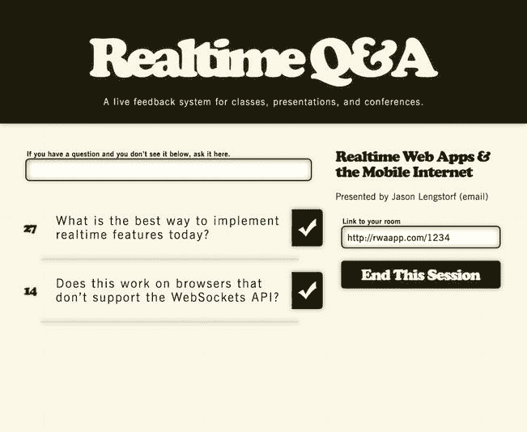

    [图 6-21。](#_Fig21)演示者视图

更小的屏幕布局(以及为什么不在这里设计它们)

在上一章中，我们花了很多时间讨论一个移动友好的 web 应用相对于一套本地应用的优势。那么为什么现在不设计手机版呢？

主要原因是移动设计本质上太不稳定，不适合传统设计。这需要更多的动手操作，尝试看看的方法，这在 Photoshop 中会花费很长时间。 [6](#Fn6)

由于这种特殊布局的简单性，另一个不做手机专用布局的原因是为了节省时间。如果在 CSS 中进行修改很容易，那么最好把时间花在编码上。不需要加倍努力。

摘要

在本章中，您应用了前几章的所有规划，并为应用程序创建了一个设计。因为你是有组织的，你提前考虑过，你的 PSD 包含了可以用 CSS 非常接近地复制的样式和字体。

在下一章——终于——你将开始编写这个应用程序。更具体地说，您将构建前端，包括高级 CSS，使这种设计适应任何屏幕大小。

[1](#_Fn1)T0】

[2](#_Fn2)T0】

[3](#_Fn3)T0】

[T2T4`http://www.fontpalace.com/font-details/News+Gothic+BT/`](#_Fn4)

[5](#_Fn5)T0】

[6](#_Fn6)Adobe 似乎也知道这一点，因为他们正在开发一种新工具来解决这个问题:`http://html.adobe.com/edge/reflow/`。**