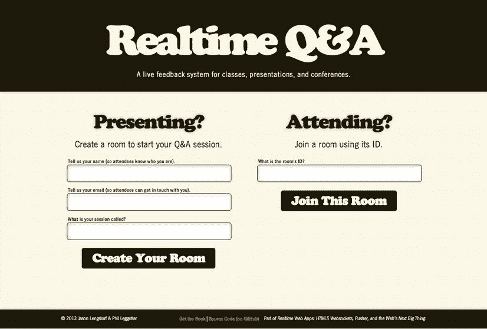
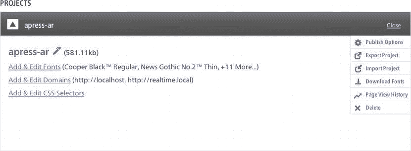
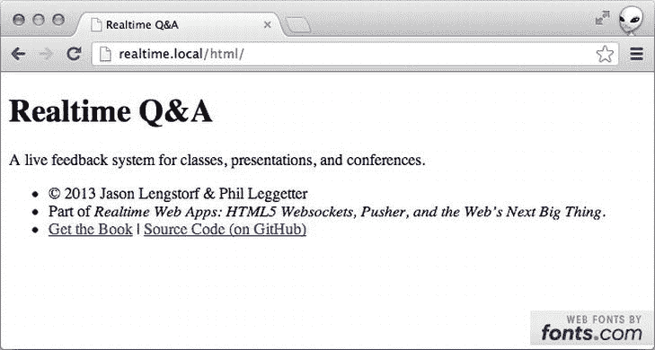
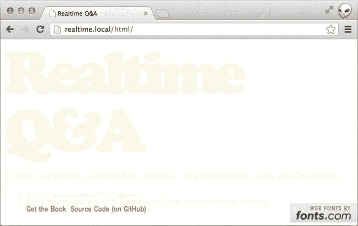
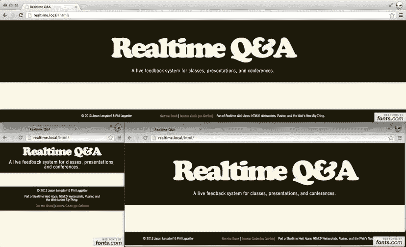
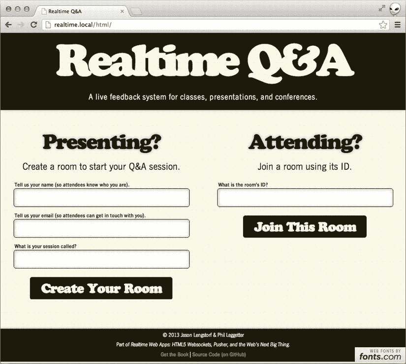
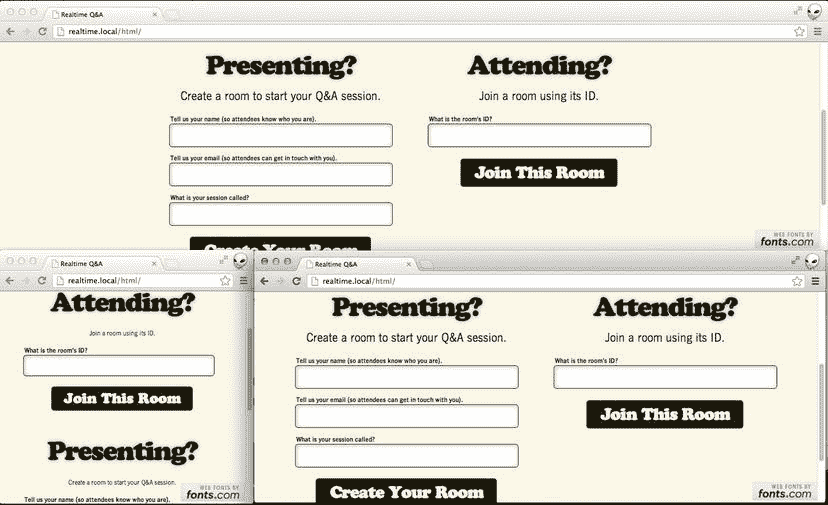

# 七、创建 HTML 和 CSS 标记

现在设计已经准备好了，您可以开始编码了。在这一章中，你将把你创建的 PSD 转换成一个 web 可用的 HTML 和 CSS 布局。您还将实现 CSS3 媒体查询，以确保布局在平板电脑和手持设备大小的屏幕上看起来不错。

从基础开始:设置 HTML5 文档

在写一行代码之前，让我们提醒自己正在创建的设计(见[图 7-1](#Fig1) )。



[图 7-1。](#_Fig1)应用外观的提示

现在，您可以在项目的根文件夹中创建一个新的 HTML 文档。将其命名为**index.html**，并插入`doctype`和其他必需的元素:

```php
<!doctype html>
<html lang="en">

<head>

<meta charset="utf-8" />

<title>Realtime Q&amp;A</title>

</head>

<body> 

</body>

</html>
```

准备好字体

接下来，你需要设计的字体。因为 Cooper Black 和 News Gothic 不是 Tahoma 和 Georgia 等传统的 web 安全字体，所以您需要使用 CSS 的`@font-face`功能来加载它们。

然而，Cooper Black 和 News Gothic 并没有在开放字体许可下发布， [<sup>1</sup>](#Fn1) ，这意味着简单地在网站上使用`@font-face`字体是不合法的。但幸运的是，由于 Fonts.com 等公司的出现，这不是一个问题，这些公司(收取合理的费用)将处理字体嵌入的法律问题，让我们继续进行设计。

对于这个应用，在 Fonts.com 创建一个免费帐户，在“管理 Web 字体”部分创建一个新项目，并将 Cooper Black Regular 和 News Gothic No. 2 系列字体(搜索“News Gothic”)添加到一个项目中(参见[图 7-2](#Fig2) )。将您的开发域(即使是本地的)添加到项目中；那就发表吧。使用 JavaScript 嵌入选项，因为这是免费帐户唯一可以使用的选项。



[图 7-2。](#_Fig2)Fonts.com 项目详情

将新的`<script>`标签添加到`<head>`部分的`index.html`中:

```php
<head>

<meta charset="utf-8" />

<title>Realtime Q&amp;A</title>

<!--Fonts via fonts.com-->
<script type="text/javascript" src="[http://fast.fonts.com/jsapi/a09d5d16-57fd-447d-a0f6-73443033d2de.js"></script](http://fast.fonts.com/jsapi/a09d5d16-57fd-447d-a0f6-73443033d2de.js"></script)>

</head>
```

接下来，在应用的根目录下创建一个名为`assets`的子目录，并在其中创建另一个名为`styles`的子目录。在里面，创建一个名为`main.css`的新样式表。

在`main.css`里面，添加一个注释块，上面有来自 Fonts.com 的`font-family`规则，以备后用:

```php
/**
 * Styles for the Realtime Q&A app
 */

/*
fonts.com font-family rules.

Cooper Black
font-family:'Cooper Black W01';

News Gothic:
light: font-family:'NewsGothicNo.2W01-Light 710401';
light-italic: font-family:'NewsGothicNo.2W01-Light 710404';
roman: font-family:'NewsGothicNo.2W01-Roman';
italic: font-family:'News Gothic No.2 W01 It';
demi: font-family:'NewsGothicNo.2W01-Mediu 710407';
demi-italic: font-family:'NewsGothicNo.2W01-Mediu 710410';
bold: font-family:'NewsGothicNo.2W01-Bold';
bold-italic: font-family:'NewsGothicNo.2W01-BoldI';
*/
```

在`index.html`的`<head>`部分的 Fonts.com 脚本标签下包含新的样式表:

```php
<head>

<meta charset="utf-8" />

<title>Realtime Q&amp;A</title>

<!-- Fonts via fonts.com -->
<script type="text/javascript" src="[http://fast.fonts.com/jsapi/a09d5d16-57fd-447d-a0f6-73443033d2de.js">
</script](http://fast.fonts.com/jsapi/a09d5d16-57fd-447d-a0f6-73443033d2de.js"></script)>

<!--Main site styles-->
<link rel="stylesheet" href="./assets/styles/main.css" />

</head>
```

@FONT-FACE 和 SAAS

虽然看起来它仅仅存在了一两年，但实际上它早在 1998 年就随着 CSS2 规范被引入了。然而，由于缺乏支持、浏览器不兼容问题，以及最重要的法律问题，它直到最近才被真正使用。

使用`@font-face`创建一个指向字体的指针，它允许浏览器下载并使用它在用户机器上呈现字体。这对设计来说很棒，但是它为任何人简单地非法下载字体打开了大门。可以预见，铅字铸造厂对此并不满意。

然而，近年来，在提高网络字体的安全性方面取得了长足的进步。除了 web 字体的新格式，如嵌入式开放类型(EOT)和 web 开放字体格式(WOFF)，提供 Web 字体嵌入软件作为服务的公司如雨后春笋般涌现(SaaS)。

使用 SaaS 有很多好处，但只有一个缺点(那根本不是缺点)。主要优势如下:

*   您无需购买即可使用该字体。
*   你不必再为了保护你自己和你的客户而在模糊的法律水域中航行。
*   跨浏览器字体嵌入的有限性已经为您处理好了。

使用 SaaS 进行字体嵌入的唯一“缺点”是它不是免费的。但是如果你看看这些数字，使用 SaaS 实际上是一笔巨大的交易。例如，流行的 Futura 字体可以从 MyFonts [<sup>3</sup>](#Fn3) 以每种风格 24.95 美元*或 445.50 美元购买全家(每月限 10，000 次浏览量)的网络字体购买。*

 *Fonts.com[<sup>4</sup>](#Fn4)每月收费 10 美元来嵌入整个 Futura 系列(以及其库中的任何其他字体)，每月浏览量高达 25 万次。

当我们做数学计算时，这意味着如果唯一嵌入的字体是 Futura 系列，那么使用 SaaS 将需要超过 3 年半的时间来购买网络字体许可。

考虑到你的页面浏览量是它的 25 倍，而且你可能会在这项服务中使用不止一种字体，很明显 SaaS 是一笔大买卖。

网络字体 SaaS 选项

对于这个应用，我们使用 Fonts.com 加载库珀黑色和新闻哥特式到我们的设计。有许多选项可供选择，但以下是一些最受欢迎的选项:

*   `http://fontdeck.com/`
*   `http://fonts.com/`
*   `https://typekit.com/`

如果你选择使用 Fonts.com 以外的软件，你仍然可以顺利完成本书中的应用，但是请注意`font-family`名称可能会有所不同。

 **注意**Fonts.com 免费账户要求在你的应用中放置一个横幅，JavaScript include 会自动做到这一点。Fontdeck 的免费帐户将允许您开发本书中的应用，而不会增加任何成本。他们只在一个网站被“激活”时收费，他们认为当超过 20 个唯一的 IP 地址需要访问该网站时才收费。

公共元素

像大多数其他应用一样，这个应用有一些不随页面变化的通用元素。让我们从发展这些开始。

标题标记

这个应用将提供的每个视图都有顶部的标题。这在结构上很简单:它是一个盒子，里面有应用标题和标语。

使用 HTML5 `<header>`元素，将标题标记添加到`index.html`的`<body>`部分:

```php
<body>

<header>
    <h1>Realtime Q&amp;A</h1>
    <p class="tagline">
        A live feedback system for classes, presentations, and conferences.
    </p><!--/.tagline-->
</header>

</body>
```

 **提示**在带有类或 id 的元素的末尾使用注释有助于提高可扫描性，尤其是在处理嵌套了相同标签的嵌套元素或布局时，比如`<div>`元素。这些注释完全是可选的。

如果你在浏览器中查看，它在语义上是有意义的(见[图 7-3](#Fig3) )。这应该是应用的一个次要目标:如果所有的样式都被撕掉了，它还清晰可辨吗？


[图 7-3。](#_Fig3)未样式化的标题标记

页脚标记

与页眉类似，页脚在语义上也很简单。它分解成一个盒子，里面有法律副本和几个链接。因为这样的复制在列表中是有意义的，所以让我们使用一个无序列表在`<footer>`元素中显示它。将粗体代码添加到`index.html` : 的正文中

```php
<body>

<header>
    <h1>Realtime Q&amp;A</h1>
    <p class="tagline">
        A live feedback system for classes, presentations, and conferences.
    </p><!--/.tagline-->
</header>

<footer>
    <ul>
        <li class="copyright">
            &copy; 2013 Jason Lengstorf &amp; Phil Leggetter
        </li><!--/.copyright-->
        <li>
            Part of <em>Realtime Web Apps: HTML5 Websockets, Pusher, and the
            Web&rsquo;s Next Big Thing</em>.
        </li>
        <li>
            <a href="[http://amzn.to/XKcBbG">Get](http://amzn.to/XKcBbG">Get)the Book</a> |
            <a href="[http://cptr.me/UkMSmn">Source](http://cptr.me/UkMSmn">Source)Code (on GitHub)</a>
        </li>
    </ul>
</footer>

</body>
```

在浏览器中重新加载`index.html`。页脚信息以逻辑方式显示(参见[图 7-4](#Fig4) )。



[图 7-4。](#_Fig4)添加了无样式的页脚标记

款式

标记就绪后，就可以开始设计元素的样式了。从基础开始，添加字体规则。每个元素都将在`em` s 中设置其字体大小，以便在稍后媒体查询时更加灵活。诀窍是将主体`font-size`设置为`px`值，对所有其他元素使用相对大小。如果你以后需要增加或减少字体大小，你需要做的就是调整主体设置，整个设计会相应地调整。

以设计为指导，为页眉和页脚中的每个元素设置颜色、大小和字母间距。使用粗体或斜体字体时，不要忘记将字体重置为正常样式和粗细；如果你忘记了，浏览器会将自己的粗体或斜体应用到已经粗体或斜体的文本中，这在大多数情况下看起来很糟糕。当你完成了这些，CSS 将看起来如下:

```php
/**
 * Styles for the Realtime Q&A app
 */

/*
fonts.com font-family rules.

Cooper Black
font-family:'Cooper Black W01';

News Gothic:
light: font-family:'NewsGothicNo.2W01-Light 710401';
light-italic: font-family:'NewsGothicNo.2W01-Light 710404';
roman: font-family:'NewsGothicNo.2W01-Roman';
italic: font-family:'News Gothic No.2 W01 It';
demi: font-family:'NewsGothicNo.2W01-Mediu 710407';
demi-italic: font-family:'NewsGothicNo.2W01-Mediu 710410';
bold: font-family:'NewsGothicNo.2W01-Bold';
bold-italic: font-family:'NewsGothicNo.2W01-BoldI';
*/

/* Basic Font Styles
 ----------------------------------------------------------------------------*/

body {
    font: 18px/24px 'NewsGothicNo.2W01-Roman';
    color: #1f1b0c;
    letter-spacing: .06em;
}

h1 {
    font-family: 'Cooper Black W01';
    font-weight: normal;
}

h1 {
    margin: 0;
    color: #fbf7e7;
    font-size: 6em;
    line-height: 1em;
    letter-spacing: -.1em;
}

.tagline {
    font-family: 'NewsGothicNo.2W01-Light 710401';
    font-size: 1.1em;
    line-height: 1em;
    color: #fbf7e7;
    letter-spacing: .12em;
}

a {
    font-family: 'NewsGothicNo.2W01-Mediu 710407';
    color: #e06f00;
    text-decoration: none;
}

a:active,a:hover,a:focus {
    text-decoration: underline;
    outline: none;
}

footer li {
    font-family: 'NewsGothicNo.2W01-Light 710401';
    font-size: .75em;
    line-height: 1em;
    letter-spacing: .04em;
    color: #fbf7e7;
}

footer li em {
    font-family: 'NewsGothicNo.2W01-Light 710404';
    font-style: normal;
}
```

 **注意**现在为`h1`设置了两个规则。这是有意的，因为在设计的后期，会有其他元素添加到第一个规则中，这些元素不应该从第二个规则集中接收样式。

如果此时将`index.html`加载到浏览器中，在添加深色背景之前，它看起来不会正确(参见[图 7-5](#Fig5) )。



[图 7-5。](#_Fig5)仅应用字体样式规则的标记

要纠正这一点，现在您需要添加布局规则，以给出背景颜色、对齐方式和其他框模型规则。添加新的布局代码以完成页眉和页脚样式:

```php
/* Layout
 ----------------------------------------------------------------------------*/

html { background-color: #fbf7e7; }

body { margin: 0; }

header,footer {
    -webkit-box-shadow: 0 0 10px rgba(31, 27, 12, .3);
            box-shadow: 0 0 10px rgba(31, 27, 12, .3);
}

header,footer {
    overflow: hidden;
    background: #1f1b0c;
    margin: 0;
    padding: 1em;
    text-align: center;
}

header {
    margin-bottom: 3em;
    padding: 3em 0 2em;
}

header h1,header p {
    width: 960px;
    margin: 0 auto;
    padding: 0;
}

header h1 { margin-bottom: .25em; }

footer { margin-top: 6em; }

footer ul {
    overflow: hidden;
    width: 960px;
    margin: 0 auto;
    padding: 0;
}

footer li {
    float: right;
    margin-left: 1em;
    list-style: none;
}

footer li.copyright { float: left; margin-left: 0; }
```

这段代码的大部分都是不言自明的，但是有几条规则值得注意。方框阴影仅使用`-webkit-`前缀。这是因为所有其他浏览器现在都支持标准的框阴影规则(甚至是 IE9)，所以不再需要包含规则的前缀版本来使其工作。事实上，`-webkit-`前缀只需要添加对 Safari、iOS 和 Android 旧版本的支持。因为旧版本的 iOS 和 Android 并不少见，所以保持这个规则是个好主意。

`box-shadow`规则还使用了从 CSS3 开始新增的`rgba`。这允许您设定颜色的 alpha(或不透明度)。使用的 RGB 值与站点的深色相匹配。

最后，一个解决“clearfixes”需求的技巧:将包含元素设置为`overflow: hidden`，它将增长到包含浮动元素。这适用于所有的浏览器，所以这是一个消除大量非语义元素的非常简单的技巧。这个技巧用在页脚元素上，强制`<footer>`元素在浮动的`<li>`元素周围正确地应用填充。

重新加载浏览器，查看完整的页眉和页脚(参见[图 7-6](#Fig6) )。


[图 7-6。](#_Fig6)样式化的页眉和页脚

使页眉和页脚响应迅速

完成页眉和页脚的最后一步是添加媒体查询，这将调整它们在平板电脑和手持设备上的显示。

您不需要做任何花哨的事情，比如检查设备方向或像素密度，而是简单地根据视口宽度调整布局。这种方法的原因是，在较小的屏幕上不需要发生任何花哨的事情；布局只需要稍微调整一下，以适应所提供的屏幕空间。

为了简单起见，将仅对布局进行两项调整:宽度在`960px`以下的设备(平板电脑)和宽度在`768px`以下的设备(手持设备)。

对于标题，需要改变的只是元素的字体大小和最大宽度。更改填充有助于防止布局看起来过于宽敞。

页脚需要同样的调整。此外，它还需要关闭列表元素的浮动，以便它们可以居中。

将媒体添加到`main.css`的底部，以调整较小屏幕的页眉和页脚:

```php
/* Media queries
 ----------------------------------------------------------------------------*/

@media screen and (max-width: 960px)
{

    header h1,header p { width: 760px; }

    header { padding: .75em 0 1.2em; }

    footer { margin-top: 4em; padding: 0;}

    footer ul { width: 740px; }

    footer li,footer li.copyright { float: none; margin: .75em 0;}

}

@media screen and (max-width: 768px)
{

    header h1,header p {
        width: 90%;
        min-width: 300px;
    }

    header { padding-bottom: .75em; }

    header h1 { font-size: 2.4em; }

    footer { margin-top: 3em; }

    footer ul { width: 300px; }

}
```

在浏览器中重新加载文件。乍一看，似乎什么都没有改变，但是如果你调整浏览器窗口的大小，你会看到元素根据不同的屏幕尺寸进行了调整(见[图 7-7](#Fig7) )。



[图 7-7。](#_Fig7)不同屏幕尺寸的页眉和页脚

开发主页视图

应用的框架准备好了，你现在可以从主页开始插入各个视图了。

编写标记

主页由两个表单组成，所以让我们从两个表单中较简单的一个开始，了解基本情况。

“加入房间”表单有一个标题、一个简短的广告词、一个带标签的输入和一个提交按钮。将以下标记添加到`index.html, in between the <header> and <footer> tags,`以创建该表单:

```php
<section>

    <form id="attending">
        <h2>Attending?</h2>
        <p>Join a room using its ID.</p>
        <label>
            What is the room's ID?
            <input type="text" name="room_id" />
        </label>
        <input type="submit" value="Join This Room" />
    </form><!--/#attending-->

</section>
```

接下来，使用相同格式生成“创建房间”表单，它的标记方式几乎相同。将这个`<form>`元素直接添加到我们刚刚添加的前一个“attending”表单元素之后:

```php
<form id="presenting">
    <h2>Presenting?</h2>
    <p>Create a room to start your Q&amp;A session.</p>
    <label>
        Tell us your name (so attendees know who you are).
        <input type="text" name="presenter-name" />
    </label>
    <label>
        Tell us your email (so attendees can get in touch with you).
        <input type="email" name="presenter-email" />
    </label>
    <label>
        What is your session called?
        <input type="text" name="session-name" />
    </label>
    <input type="submit" value="Create Your Room" />
</form><!--/#presenting-->
```

这段代码没有什么值得注意的，除了使用`type="email"`作为演示者的电子邮件输入。保存它并重新加载浏览器；你现在有了主视图的两种形式，尽管没有样式化(见[图 7-8](#Fig8) )。


[图 7-8。](#_Fig8)主视图的所有标记都已就位，但需要样式化

实现 CSS

更新现有的包含字体系列和字体粗细的`h1`规则，使字体系列和字体粗细也适用于`h2`标签。还要为二级标题添加附加规则；一般段落；以及表单、输入和标签:

```php
/* Basic Font Styles
 ----------------------------------------------------------------------------*/
/* Update */
h1, h2 {
    font-family: 'Cooper Black W01';
    font-weight: normal;
}

/* Unchanged */ h1 {    margin: 0;    color: #fbf7e7;    font-size: 6em;    line-height: 1em;    letter-spacing: -.1em;}/* New rules */

h2 { text-shadow: 0 0 10px rgba(31, 27, 12, .3); }

h2 {
    margin: 0 0 .5em;
    font-size: 2.75em;
    line-height: 1em;
    letter-spacing: -.08em;
}

p {
    text-align: center;
}

form p {
    margin: 0 0 1em;
    padding: 0;
    font-size: 1.375em;
}

label {
    font-family: 'NewsGothicNo.2W01-Bold';
    font-size: .75em;
    line-height: 1.25em;
    letter-spacing: .04em;
}

input {
    font-family: 'Cooper Black W01';
    color: #fbf7e7;
    background-color: #1f1b0c;
    border-radius: 6px;
    border: none;
    font-size: 1.75em;
    line-height: 1em;
    letter-spacing: -.08em;
    text-shadow: 0 0 10px rgba(31, 27, 12, .3);
}

label input {
    font-family: 'NewsGothicNo.2W01-Light 710401';
    font-size: 1.75em;
    letter-spacing: .08em;
    color: #1f1b0c;
    background-color: #fff;
}/* Existing rules e.g. .tagline */
```

保存后，主视图应有适当的字体(见[图 7-9](#Fig9) )。


[图 7-9。](#_Fig9)应用了字体样式的主视图，但没有布局规则

布局规则相当简单:“加入房间”表单向右浮动,“创建房间”表单向左浮动，标签和输入需要垂直堆叠。通过在`main.css` : 的“布局”部分的第一个`footer`规则之前插入如下所示的代码来实现这些规则

```php
section {
    width: 960px;
    margin: 0 auto;
    overflow: hidden;
}

form {
    float: left;
    width: 460px;
    text-align: center;
}

form#attending { float: right; }

label {
    display: block;
    width: 430px;
    margin: 0 auto 1em;
    text-indent: 2px;
    text-align: left;
}

input {
    margin: .25em 0 0;
    padding: .375em .875em;
}

label input {
    display: block;
    width: 400px;
    margin: 0;
    padding: .375em 15px;
    border: 2px solid #1f1b0c;
    -webkit-border-radius: 6px;
            border-radius: 6px;
    -webkit-box-shadow: inset 2px 2px 14px rgba(31, 27, 12, .3);
            box-shadow: inset 2px 2px 14px rgba(31, 27, 12, .3);
}
```

保存这些更改并在浏览器中重新加载页面。此时，主视图已接近完成(见[图 7-10](#Fig10) )。



[图 7-10。](#_Fig10)主视图现在看起来像实体模型

为活动和悬停的表单元素创建样式

因为表单是交互式的，所以当用户悬停、单击和切换表单元素时，为他们提供视觉反馈是一个好主意。为此，您需要为输入的`:active`、`:hover`和`:focus`状态添加样式。

使用高亮颜色`#E06F00`，改变活动输入的边框颜色以指示用户当前关注的位置，并使提交按钮在活动或悬停时变为橙色。包括以下代码来实现这一点:

```php
/* Highlights
 ----------------------------------------------------------------------------*/
input:active,input:hover,input:focus {
    background-color: #e06f00;
    outline: none;
}

input::-moz-focus-inner { border: 0; }

label input:active,label input:focus {
    border-color: #e06f00;
    background-color: #fff;
    outline: none;
}

label input:hover { background-color: #fff; }
```

这段代码覆盖了浏览器的默认行为，并用一个自定义突出显示来替换它。值得注意的是`input::-moz-focus-inner`规则；这解决了 Firefox 中的一个问题，当它处于活动状态时，会导致输入在输入内部出现一个小虚线。

 **警告**如果你覆盖了默认的浏览器样式，确保用你自己的样式替换它们。使用键盘浏览网页的用户依靠`:focus`和`:active`状态来查看光标当前停留的位置，因此完全移除这些状态将对用户体验产生负面影响。

覆盖样式后，在浏览器中重新加载页面，并使用 Tab 键在表单中导航。现在，当输入处于活动状态时，它们会以橙色突出显示(参见[图 7-11](#Fig11) )，当它们有焦点或悬停在上面时，提交按钮会变成橙色(参见[图 7-12](#Fig12) )。


[图 7-11。](#_Fig11)具有焦点的文本输入现在用橙色突出显示


[图 7-12。](#_Fig12)当鼠标悬停或聚焦时，提交按钮变成橙色

添加媒体查询

媒体对主页的查询仍然相当简单。在平板电脑上，如果表格缩小了一点，你仍然可以把它们并排放在一起，而在手持设备上，它们应该一个叠一个。

“加入房间”表单应该放在最上面，因为它更短，也更容易被使用(参加的人可能比出席的人多)。

以下代码为较小的视口添加了额外的规则:

```php
@media screen and (max-width: 960px)
{

    header h1,header p { width: 760px; }

    header { padding: .75em 0 1.2em; }

    section { width: 740px; }

    p { margin: 0 0 2em; padding: 0; }

    header>p,section>p { font-size: .875em; }

    form { width: 340px; padding: 0 8px; }

    form p { font-size: 1em; }

    label { width: 100%; }

    input { font-size: 1.5em; }

    label input { width: 91%; }

    footer { margin-top: 4em; padding: 0;}

    footer ul { width: 740px; }

    footer li,footer li.copyright { float: none; margin: .75em 0;}

}

@media screen and (max-width: 768px)
{

    header h1,header p,section {
        width: 90%;
        min-width: 300px;
    }

    header { padding-bottom: .75em; }

    header h1 { font-size: 2.4em; }

    form,form#attending {
        float: none;
        width: 90%;
        margin: 0 auto 3em;
    }

    form p { font-size: .75em; }

    label input { width: 88%; font-size: 1.6em; }

    footer { margin-top: 3em; }

    footer ul { width: 300px; }

}
```

保存并重新加载页面；然后改变浏览器大小，查看布局是否适应(参见[图 7-13](#Fig13) )。



[图 7-13。](#_Fig13)主视图，包含响应性布局规则

为与会者开发活动房间视图

下一步是为活动房间视图创建标记，因为它将被与会者看到。这是他们提问和投票的地方。

编写标记

首先，抓取在`index.html`中使用的相同的页眉和页脚标记，并将其保存到一个名为`attendee-active.html` : 的新文件中

```php
<!doctype html>
<html lang="en">

<head>

<meta charset="utf-8" />

<title>Realtime Q&amp;A</title>

<!-- Fonts via fonts.com -->
<script type="text/javascript" src="[http://fast.fonts.com/jsapi/a09d5d16-57fd-447d-a0f6-73443033d2de.js"></script](http://fast.fonts.com/jsapi/a09d5d16-57fd-447d-a0f6-73443033d2de.js"></script)>

<!-- Main site styles -->
<link rel="stylesheet" href="./assets/styles/main.css" />

</head>

<body>

<header>
    <h1>Realtime Q&amp;A</h1>
    <p class="tagline">
        A live feedback system for classes, presentations, and conferences.
    </p><!--/.tagline-->
</header>

<section>

</section>

<footer>
    <ul>
        <li class="copyright">
            &copy; 2013 Jason Lengstorf &amp; Phil Leggetter
        </li><!--/.copyright-->
        <li>
            Part of <em>Realtime Web Apps: HTML5 Websockets, Pusher, and the
            Web&rsquo;s Next Big Thing</em>.
        </li>
        <li>
            <a href="http://amzn.to/XKcBbG">Getthe Book</a> |
            <a href="http://cptr.me/UkMSmn">SourceCode (on GitHub)</a>
        </li>
    </ul>
</footer>

</body>

</html>
```

该视图的内容分为三个部分:

*   标题，包含房间名称和演示者信息
*   “提出问题”表格
*   问题列表

前两个标记元素并不奇怪，所以让我们先把它们去掉。在`<section>`中添加两个附加元素:

```php
<section>

    <header>
        <h2>Realtime Web Apps &amp; the Mobile Internet</h2>
        <p>
            Presented by Jason Lengstorf
            (<a href="mailto:jason@lengstorf.com">email</a>)
        </p>
    </header>

    <form id="ask-a-question">
        <label>
            If you have a question and you don't see it below, ask it here.
            <input type="text" name="new-question" tabindex="1" />
        </label>
        <input type="submit" value="Ask" tabindex="2" />
    </form><!--/#ask-a-question-->

</section>
```

使用 HTML5 的数据属性

这些问题将以一个无序列表的形式出现，但是有一个变化:您将使用 HTML5 `data-`属性，而不是为投票计数创建一个额外的元素。

这有两个目的:

*   jQuery 内置了对访问该属性的支持
*   CSS 可以使用这个属性来生成对文档不重要的内容

 **注意**“不重要”在前面的陈述中是指投票计数对于所显示的信息并不重要。出于这个原因，它被排除在标记之外，而是由 CSS 显示，从而保持标记的整洁和语义。

将问题无序列表标记添加到现有`<section>`的底部:

```php

<ul id="questions">

    <li id="question-1"
        data-count="27">

        **<p>**
            **What is the best way to implement realtime features today?**
        **</p>**

        **<form class="vote">**
            **<input value="I also have this question."**
                   **type="submit"  />**
        **</form>**

    **</li>**`<!--`**/#question-1**`-->`

    **<li id="question-2"**
        **data-count="14">**

        **<p>**
            **Does this work on browsers that don't support the**
            **WebSockets API?**
        **</p>**

        **<form class="vote">**
            **<input value="I also have this question."**
                   **type="submit"  />**
        **</form>**

    **</li>**`<!--`**/#question-2**`-->`

**</ul>**`<!--`**/#questions**`-->`
```

 `标记就绪后，在浏览器中加载`attendee-active.html`。看起来不太好，但所有的部分都在适当的位置(见[图 7-14](#Fig14) )。


[图 7-14。](#_Fig14)未样式化的活动与会者视图

实现 CSS

首先，通过在`main.css` : 的“基本字体样式”部分的第一个页脚规则之前插入以下代码，添加问题和标题的字体样式。

```php
section header h2 {
    font-size: 1.5em;
    line-height: 1.125em;
    letter-spacing: -.06em;
}

#questions li {
    font-size: 1.33em;
    letter-spacing: .1em;
}
```

接下来，您需要添加基本的布局规则。有很多，所以在`main.css`中创建一个新的部分，紧接在现有的“布局”部分之后:

```php
/* Questions View
 ----------------------------------------------------------------------------*/

section header {
    background: transparent;
    float: right;
    width: 340px;
    margin: 0;
    padding: 0;
    box-shadow: none;
    overflow: visible;
}

section header h2 {
    margin: 0 0 .5em;
    text-align: left;
}

section header p {
    width: auto;
    margin: 0;
    text-align: left;
}

form#ask-a-question,#questions {
    width: 596px;
    margin: 0;
    padding: 0;
    overflow: hidden;
}

#questions { padding-bottom: 1em; }

#ask-a-question label,#ask-a-question>input { float: left; }

#ask-a-question label { width: 460px; }

#ask-a-question label input {
    width: 430px;
    height: 1.7em;
    margin: 0;
    padding-left: 15px;
    padding-right: 15px;
}

#ask-a-question input {
    height: 1.55em;
    margin: 0.5em 0 0 0.5em;
    padding: 0.1em 0.75em;
}

#questions li {
    position: relative;
    list-style: none;
    margin: 0;
    padding: 1em 0 1em;
    overflow: hidden;
    -webkit-box-shadow: 0  12px 16px -16px rgba(31, 27, 12, .3),
                        0 -12px 16px -16px rgba(31, 27, 12, .3);
            box-shadow: 0  12px 16px -16px rgba(31, 27, 12, .3),
                        0 -12px 16px -16px rgba(31, 27, 12, .3);
}

#questions p {
    float: right;
    width: 77%;
    margin: .75em 0;
    padding: 0;
    text-align: left;
}

#questions .vote {
    position: relative;
    display: block;
    width: 76px;
    height: 76px;
    margin: 0 0 0 2em;
    padding: 0;
    overflow: hidden;
}
```

这些规则都是相当基本的；他们解决了`<header>`元素与文本颜色相同的问题，将各部分浮动到适当的位置，并在适当的地方添加边距和间距，以使元素正确布局(参见[图 7-15](#Fig15) )。


[图 7-15。](#_Fig15)问题页面的部分完整布局

切片 PSD 和创建精灵

布局基本完成后，我们需要将按钮的图像放入网站。这将需要切片 PSD 并创建一个 sprite，这是一个由较小的图像组成的大图像。精灵用于减少请求的数量和网站的整体下载量。

在与会者问题视图中打开 Photoshop 中的 PSD 并抓取切片工具。在“向上投票”按钮周围画一个 76 px 乘 76 px 的切片。确保它水平和垂直居中。

在第二个向上投票按钮，进入黑色圆形的图层样式，用我们的高亮颜色`#E06F00`添加一个颜色叠加。这将是按钮的悬停和活动状态。

在按钮顶部以 76 px 乘 76 px 绘制另一个切片(参见[图 7-16](#Fig16) )。


[图 7-16。](#_Fig16)PSD 中的按钮带有切片

存储为 Web 所用(command + option + shift + S 或“文件”菜单中的“存储为 Web 所用…”)。将两个按钮片段保存为 PNG 文件。您可以随意命名它们，因为您将在下一步将它们组合成不同的图像。

为了准备演示者视图，通过绘制 78 px 宽 88 px 高的切片，对回答按钮及其悬停状态做同样的事情(参见[图 7-17](#Fig17) )。


[图 7-17。](#_Fig17)PSD 中的接听按钮带有切片

接下来，创建一个 154 像素宽，176 像素高的新 PSD。将背景设置为浅色`#FBF7E7`。

将您刚刚创建的四个 png 放入文档，将“关闭”投票按钮放在左上角，“打开”投票按钮放在左下角，“关闭”回答按钮放在右上角，“打开”回答按钮放在右下角(参见[图 7-18](#Fig18) )。


[图 7-18。](#_Fig18)Photoshop 中的精灵

最后一步是将这张图片保存到网上。这一次，将其保存为 JPG，并在不明显损失质量的情况下尽可能降低质量。在该图像的情况下，`70`的质量设置是好的。

要保存该图像以供项目使用，请在`assets`文件夹中创建一个名为`images`的新子目录；然后将此图像保存为`sprite.jpg`。

回到`main.css`，让我们使用新的精灵来设计投票按钮。将以下代码添加到“问题视图”部分的底部:

```php
#questions .vote input[type=submit] {
    margin: 0;
    width: 100%;
    height: 100%;
    cursor: pointer;
    text-indent: -9999px;
    background: url(../img/sprite.jpg) left top no-repeat;
    -webkit-box-shadow: none;
            box-shadow: none;
}

#questions .vote input:active,
#questions .vote input:hover,
#questions .vote input:focus {
    background-position: left bottom;
}
```

这段代码将输入设置为像一个小的查看窗口一样工作，只显示 sprite 的一部分。在悬停时，或者当用户切换到输入时，精灵移动，在输入的查看窗口中显示其自身的不同部分。这节省了加载“over”图像的额外 HTTP 请求，从而改善了加载时间和整体用户体验。

在浏览器中保存并重新加载文档。输入现在看起来像你设计的按钮，悬停或点击按钮会使其以橙色高亮显示(见[图 7-19](#Fig19) )。


[图 7-19。](#_Fig19)样式化按钮，包括其高亮显示状态

使用:在之前

这个视图的最后一步是从`data-count`属性中检索投票数。这是使用`:before`伪元素和`content`规则完成的，它允许您传入一个要在伪元素中显示的属性名。使用`data-count`属性，将其向左移动，并使用以下代码将其垂直放置在中心位置(添加到`main.css)` : 中“问题视图”部分的底部)

```php
#questions li:before {
    content: attr(data-count);
    position: absolute;
    left: 0;
    top: 50%;
    margin-top: -.5em;
}
```

保存并重新加载；现在票数显示在每个问题的左侧(见[图 7-20](#Fig20) )。


[图 7-20。](#_Fig20)投票数显示在问题的左侧

最后，您需要使字体与设计相匹配，因此在`main.css`的“基本字体样式”部分，为已经应用于`h1`和`h2`的字体规则添加一个用于伪元素的选择器:

```php
h1,h2,#questions li:before {
    font-family: 'Cooper Black W01';
    font-weight: normal;
}
```

现在，如果重新加载，字体看起来是正确的(见[图 7-21](#Fig21) )。


[图 7-21。](#_Fig21)风格化的投票计数

添加媒体查询

较小屏幕的布局相当简单。在平板电脑上，房间描述移动到布局的顶部，表单和问题位于下方，形成一列布局。

在手持设备上，一列布局仍然存在，投票计数移到投票按钮上方，以节省更多的水平空间。

更新`main.css`中的“媒体查询”部分，以匹配粗体显示的代码，从而实施更改:

```php
@media screen and (max-width: 960px)
{

    header h1,header p { width: 760px; }

    header { padding: .75em 0 1.2em; }

    section header {
      float: none;
      width: 680px;
        margin: 0 auto 1.5em;
      overflow: hidden;
    }

    p { margin: 0 0 2em; padding: 0; }

    header>p,section>p { font-size: .875em; }

    form { width: 340px; padding: 0 8px; }

    form#ask-a-question { float: none; width: 680px; margin: 0 auto 1em; }

    form p { font-size: 1em; }

    label { width: 100%; }

    #ask-a-question label { width: 80%; }

    input { font-size: 1.5em; }

    #ask-a-question input { font-size: 1.75em; }

    label input,#ask-a-question label input { width: 91%; }

    #questions { margin: 0 auto; }

    footer { margin-top: 4em; padding: 0;}

    footer ul { width: 740px; }

    footer li,footer li.copyright { float: none; margin: .75em 0;}

}

@media screen and (max-width: 768px)
{

    header h1,header p {
        width: 90%;
        min-width: 300px;
    }

    section,section header,form#ask-a-question,#questions { width: 300px; }

    header { padding-bottom: .75em; }

    header h1 { font-size: 2.4em; }

    form,form#attending,form#ask-a-question {
        float: none;
        width: 90%;
        margin: 0 auto 3em;
    }

    form#ask-a-question { overflow: visible; }

    form p { font-size: .75em; }

    label input { width: 88%; font-size: 1.6em; }

    #ask-a-question label { width: 270px; }

    #ask-a-question label input { width: 87%; }

    #ask-a-question input {
        float: none;
        margin: 0 auto;
    }

    #questions li { font-size: 1.125em; line-height: 1.125em; }

    #questions li:before { top: 20px; left: 24px; margin-top: 0; }

    #questions .vote { margin: 20px 0 0;}

    #questions p { width: 210px; margin: 0; }

    footer { margin-top: 3em; }

    footer ul { width: 300px; }

}
```

保存、重新加载和调整浏览器窗口的大小。布局现在可以响应了(见[图 7-22](#Fig22) )。


[图 7-22。](#_Fig22)以多种视窗尺寸查看问题

为与会者开发封闭房间视图

下一步是为被演示者关闭的房间创建视图。与会者将不再能够投票，将会有一个通知让他们知道会议室已经关闭，他们可以通过电子邮件联系演示者。

在 app 的根目录下新建一个名为`attendee-closed.html`的文件；这是保存该步骤标记的地方。

争取尽可能少的新加价

因为编写更少的代码总是更好，所以对标记所做的唯一更改是用封闭房间通知替换“提问”表单，并在问题列表中添加一个“封闭”类。将`attendee-active.html`的内容复制到新的`attendee-closed.html`文件中，将“提问”表单替换为关闭通知标记，并添加`class="closed"`属性，如下图所示:

```php
<h3>This session has ended.</h3>
<p>
    If you have a question that wasn't answered, please
    <a href="mailto:jason@copterlabs.com">email the presenter</a>.
</p>

<ul id="questions" class="closed">

    <!—leave existing elements here -->

</ul><!--/#questions-->
```

保存后，将文档加载到浏览器中，显示文档几乎准备就绪，无需更改(见[图 7-23](#Fig23) )。


[图 7-23。](#_Fig23)未应用新样式的关闭视图

添加样式

调整标题和正文样式，更新两个现有规则以包括`h3`，添加一个新的`h3`规则，并修改`p`，如下面`main.css` : 的“基本字体样式”部分所示

```php
h1,h2,h3,#questions li:before {
    font-family: 'Cooper Black W01';
    font-weight: normal;
}

h2,h3 { text-shadow: 0 0 10px rgba(31, 27, 12, .3); }

h3 {
    margin: 0 365px .75em 0;
    font-size: 1.875em;
    line-height: 1em;
    letter-spacing: -.08em;
    text-align: center;
}

p {
    text-align: center;
    margin: 0 365px 2em 0;
    padding: 0 6em;
}
```

接下来，通过将问题的不透明度降低到 0.2，使问题变得明显不再是交互式的。从按钮上移除活动和悬停状态，以确保它看起来不可点击。将`#questions.closed`规则添加到`main.css` : 中“问题视图”部分的末尾

```php
#questions.closed { opacity: .4; }

#questions.closed .vote { opacity: .2; }

#questions.closed .vote input:active,
#questions.closed .vote input:hover,
#questions.closed .vote input:focus {
    background-position: left top;
    cursor: default;
}
```

重新加载您的浏览器；您会看到问题逐渐消失，“投票”按钮显示为禁用状态([图 7-24](#Fig24) )。


[图 7-24。](#_Fig24)已完成的封闭房间视图

媒体的询问呢？

因为您将更改保持得如此简单，所以不需要对媒体查询进行更新；它开箱后就能正常工作。

为演示者开发会议室视图

转移到后端功能之前的最后一步是为 presenter 视图创建标记。除了以下三点之外，该视图与与会者视图完全相同:

*   没有“提出问题”的形式
*   有一个“回答”表单和按钮，而不是“投票”按钮
*   在房间信息下面有一个表单，有一个到房间的链接和一个关闭表单的按钮

返工现有标记

创建一个名为`presenter.html`的新文件，并将`attendee-active.html`的内容复制到其中。

接下来，删除问题上方的“提问”表单标记，并删除每个问题的“投票”表单，代之以“回答”表单和按钮。在`<header>`标签中添加一个新表单，其中包含房间信息，该信息具有一个禁用的文本输入，其值为房间的统一资源指示器(URI ),并添加一个提交按钮，其副本为“Close This Room ”,这将允许演示者结束会话。

总而言之，变化很少。唯一的区别是在`<section>`元素中:

```php
<section>

    <header>
        <h2>Realtime Web Apps &amp; the Mobile Internet</h2>
        <p>
            Presented by Jason Lengstorf
            (<a href="mailto:jason@lengstorf.com" tabindex="100">email</a>)
        </p>

        <form id="close-this-room">
            <label>
                Link to your room.
                <input type="text" name="room-url"
                       value="[http://realtime.local/room/1234](http://realtime.local/room/1234)"
                       disabled />
            </label>
            <input type="submit" value="Close This Room" />
        </form><!--/#close-this-room-->

    </header>

    <ul id="questions" class="presenter">

        <li id="question-1"
            data-count="27">

            <form class="answer">
                <input type="submit" value="Answer this question." />
            </form>

            <p>
                What is the best way to implement realtime features today?
            </p>

        </li>

        <li id="question-2"
            data-count="14">

            <form class="answer">
                <input type="submit" value="Answer this question." />
            </form>

            <p>
                Does this work on browsers that don't support the
                WebSockets API?
            </p>

        </li>

    </ul><!--/#questions-->

</section>
```

在浏览器中查看此文件；它需要一点调整，但已经很接近了(见[图 7-25](#Fig25) )。


[图 7-25。](#_Fig25)无样式演示者视图

更新 CSS

正如你在[图 7-25](#Fig25) 中看到的，唯一需要调整的是“回答”按钮和侧边栏中的表单。“回答”按钮使用 sprite，类似于“投票”按钮，浮动在问题的右侧。侧边栏中的表单只需要稍微窄一点，以适应可用的空间。

更新现有的`#questions .vote`和`#questions .vote input[type=submit]`规则，使其也适用于演示者视图，并在`main.css` : 中的“问题视图”部分的底部添加一些特定的回答和结束规则

`/* Updated rules */`

```php
#questions .vote,#questions .answer {
    position: relative;
    display: block;
    width: 76px;
    height: 76px;
    margin: 0 0 0 2em;
    padding: 0;
    overflow: hidden;
}

#questions .vote input[type=submit],
#questions .answer input[type=submit] {
    width: 100%;
    height: 100%;
    margin: 0;
    padding: 0;
    cursor: pointer;
    text-indent: -9999px;
    background: url(../img/sprite.jpg) left top no-repeat;
    -webkit-box-shadow: none;
            box-shadow: none;
}

/* new rules */#questions .answer {
    float: right;
    width: 78px;
    height: 88px;
    margin: 0;
}

#questions .answer input[type=submit] { background-position: right top; }

#questions .answer input:active,
#questions .answer input:hover,
#questions .answer input:focus {
    background-position: right bottom;
}

#close-this-room { width: 340px; margin: 2em 0 0; }

#close-this-room label input { width: 305px; }
```

重新加载您的浏览器以查看正确样式的演示者视图(参见[图 7-26](#Fig26) )。


[图 7-26。](#_Fig26)带有“回答”按钮活动状态的风格化演示者视图

更新媒体查询

presenter 视图的媒体查询与 attendee 视图的类似，只是不是将投票计数移动到左侧按钮的上方，而是移动到右侧计数的下方。

除此之外,“关闭这个房间”表单被重排以适应平板电脑和手持设备上的单列布局。

更新现有规则并将新规则添加到`main.css`的“媒体查询”部分，如下所示:

```php
@media screen and (max-width: 960px)
{

    section header,#close-this-room {
        float: none;
        width: 680px;
        margin: 0 auto 1.5em;
        overflow: hidden;
    }

    #close-this-room { margin: 1em auto 0; }

    #close-this-room label { width: 59%; float: left;}

    #close-this-room label input { width: 88%; margin: 0; }

    #close-this-room input { float: left; margin: .6em 0 0; }

}

@media screen and (max-width: 768px)
{

    form,form#attending,form#ask-a-question,#close-this-room {
        float: none;
        width: 90%;
        margin: 0 auto 3em;
    }

    #ask-a-question label,#close-this-room label { width: 270px; }

    #ask-a-question input,#close-this-room input {
        float: none;
        margin: 0 auto;
    }

    /* New close rules */
    #close-this-room { margin: 1em auto 0; }

    #questions.presenter li:before {
        top: auto;
        right: 24px;
        bottom: 6px;
        left: auto;
        z-index: 10;
    }

}
```

在浏览器中保存并重新加载页面。你现在有了一个响应的演示者视图(见[图 7-27](#Fig27) )。


[图 7-27。](#_Fig27)演示者视图，包括平板电脑和手持设备布局

摘要

此时，您已经有了应用的 HTML 和 CSS 模板，并且您已经准备好开始使用 PHP 和 MySQL 开发后端。

仍然有一些东西需要 CSS 样式，比如点击后的“投票”按钮，或者回答后的问题，但是你将在下一章开发该功能时添加这些样式。

在下一章中，您将构建服务器端脚本和数据库来使应用实际工作。

[<sup>1</sup>](#_Fn1)T0】

[<sup>2</sup>](#_Fn2)T0】

[<sup>3</sup>](#_Fn3)T0】

[<sup>4</sup>](#_Fn4)T0】`*