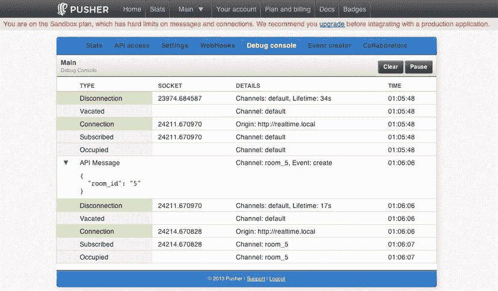
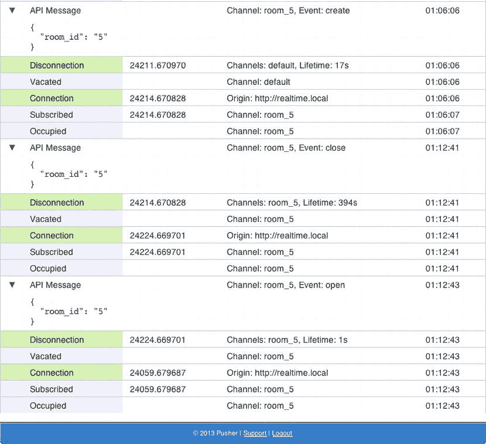
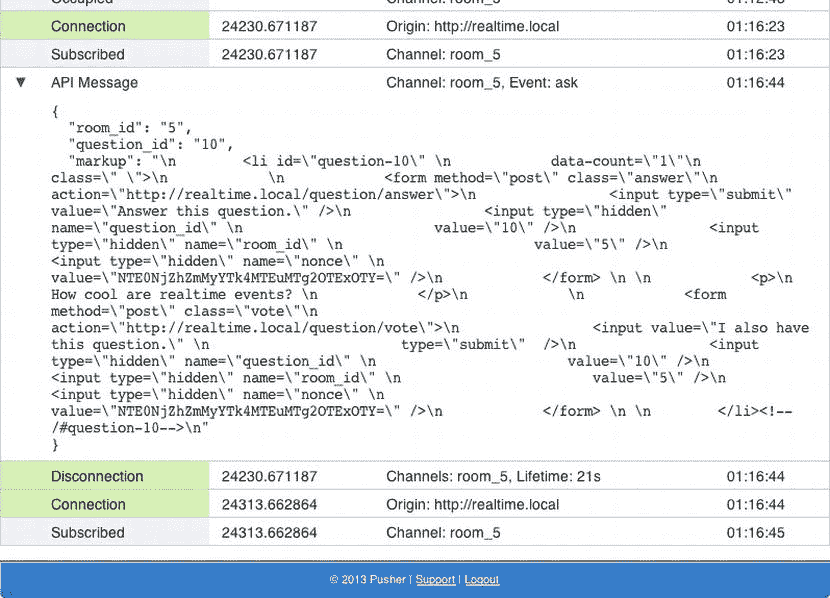
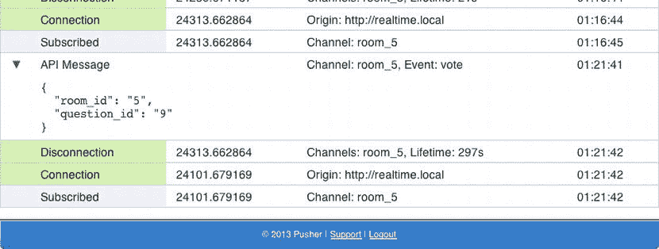
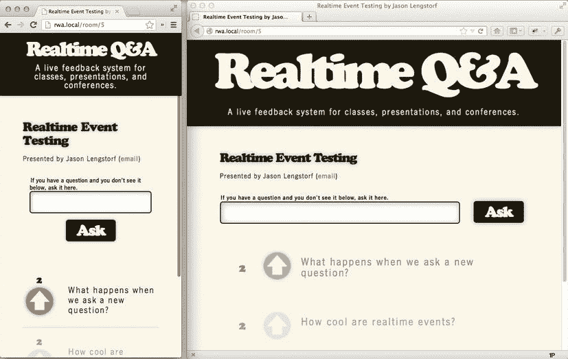
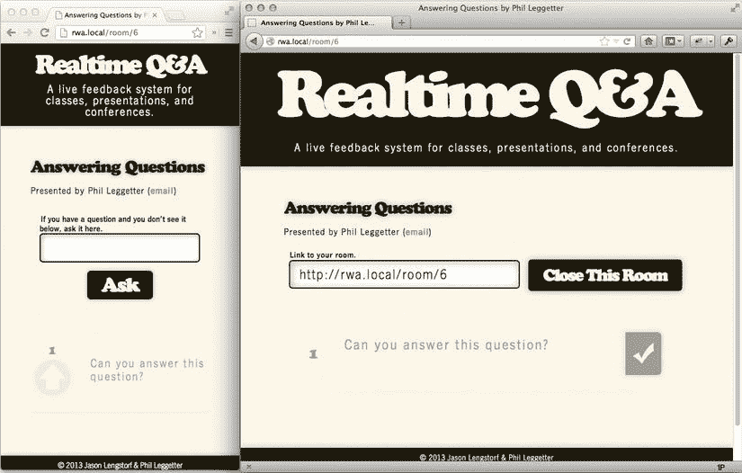

# 十、实现实时事件和 jQuery 效果

至此，你有了一个全功能的 app。然而，为了让这个特殊的应用有用，它需要实现实时功能，这样它的用户就不会被迫不断地重新加载以获取新数据。

在这一章中，你将把应用挂接到 Pusher 上，并在后端添加代码来创建实时事件。您还将使用 Pusher 的 JavaScript 应用编程接口(API)来订阅这些事件，并使用 jQuery 来制作应用的动画，这样就可以在屏幕上以一种和谐的方式操作新数据。

哪些事件需要实时增强？

*   关闭房间
*   开房
*   问问题
*   投票表决一个问题
*   回答问题

添加所需的凭证和库

在开始添加 realtime 之前，您需要确保手头上有所有适当的凭据和库来配置应用。

获取您的 Pusher API 证书

Pusher API 要求您的应用使用应用密钥、应用密码和应用 ID 进行身份验证。

要获取它们，请在`http://pusher.com`登录您的帐户，并从您的仪表板左上角选择“添加新应用”。将你的新应用命名为“实时网络应用”，不要勾选下面的两个框(见[图 10-1](#Fig1) )。


[图 10-1。](#_Fig1)在 Pusher 中创建新应用

点击“创建应用”，然后在下一个屏幕上点击“API 访问”，调出您的 API 凭证(见[图 10-2](#Fig2) )。


[图 10-2。](#_Fig2)在 Pusher 仪表盘上查看应用的 API 凭证

将推送器 API 凭证添加到配置文件

现在您已经有了 API 凭证，它们需要包含在应用中。为此，向`system/config/config.inc.php`添加三个新的常量——以粗体显示:

```php
//-----------------------------------------------------------------------------
// Database credentials
//-----------------------------------------------------------------------------

$_C['DB_HOST'] = 'localhost';
$_C['DB_NAME'] = 'rwa_app';
$_C['DB_USER'] = 'root';
$_C['DB_PASS'] = '';

//-----------------------------------------------------------------------------
// Pusher credentials
//-----------------------------------------------------------------------------

$_C['PUSHER_KEY']    = '9570a71016cf9861a52b';
$_C['PUSHER_SECRET'] = '65cc09ede8e2c18701cc';
$_C['PUSHER_APPID']  = '37506';

//-----------------------------------------------------------------------------
// Enable debug mode (strict error reporting)
//-----------------------------------------------------------------------------

$_C['DEBUG'] = TRUE;
```

为 Pusher 下载 PHP API 包装

对于应用的后端部分，我们需要使用 API 包装器来使访问 Pusher 变得轻而易举。

从`https://github.com/pusher/pusher-php-server`下载 API 包装。ZIP 将包含几个文件和目录，但你需要抓取的唯一一个是在`lib/Pusher.php`，你现在应该在你的应用中复制到`system/lib/`。

包括应用中的 PHP API 包装器

既然 Pusher API 包装器已经在应用的目录结构中，就需要包含它以供使用。在`index.php`中，将以下粗体代码添加到初始化块中:

```php
// Starts the session
if (!isset($_SESSION)) {
    session_start();
}

// Loads the configuration variables
require_once SYS_PATH . '/config/config.inc.php';

// Loads Pusher
require_once SYS_PATH . '/lib/Pusher.php';

// Turns on error reporting if in debug mode
if (DEBUG===TRUE) {
    ini_set('display_errors', 1);
    error_reporting(E_ALL^E_STRICT);
} else {
    ini_set('display_errors', 0);
    error_reporting(0);
}
```

加载 Pusher 的 JavaScript API 包装器

对于实时实现的前端部分，应用需要包含 Pusher 的 JavaScript API 包装器。在`system/inc/footer.inc.php`中，添加以下粗体代码:

```php
    </ul>
</footer>

<script src="[http://js.pusher.com/1.12/pusher.min.js"></script](http://js.pusher.com/1.12/pusher.min.js"></script)>

</body>

</html>
```

正在加载 jQuery

为了获得效果，您的应用将需要 jQuery 库。将其添加到页脚中的 Pusher JS 之后:

```php
    </ul>
</footer>

<script src="http://js.pusher.com/1.12/pusher.min.js"></script>
<script src="[http://code.jquery.com/jquery-1.8.2.min.js"></script](http://code.jquery.com/jquery-1.8.2.min.js"></script)>

</body>

</html>
```

 **注意**该应用中的代码只经过了 jQuery 1 . 8 . 2 版本的测试。较新的版本可能会带来一些问题，只有经过全面测试后才能使用。

在后端实现实时

为了让球滚动起来，需要在应用的后端创建和触发事件。

创建事件

由于应用处理表单提交的方式——所有表单都通过一个表单处理程序方法传递——发送实时事件通知只需要几行代码，这些代码将被添加到抽象`Controller`类中的`handle_form_submission()`方法中。

打开`system/core/class.controller.inc.php`并插入以下粗体代码:

```php
protected function handle_form_submission( $action )
{
    if ($this->check_nonce()) {

       // Calls the method specified by the action
       $output = $this->{$this->actions[$action]}();

       if (is_array($output) && isset($output['room_id'])) {
          $room_id = $output['room_id'];
       } else {
          throw new Exception('Form submission failed.');
       }

       // Realtime stuff happens here
       $pusher  = new Pusher(PUSHER_KEY, PUSHER_SECRET, PUSHER_APPID);
       $channel = 'room_' . $room_id;
       $pusher->trigger($channel, $action, $output);

       header('Location: ' . APP_URI . 'room/' . $room_id);
       exit;
   } else {
       throw new Exception('Invalid nonce.');
    }
}
```

创建一个新的`Pusher`对象并存储在`$pusher`变量中，然后使用其 ID 创建房间的通道。使用动作名作为事件名，使用发送输出数组供客户端使用的`trigger()`方法在房间的通道上触发一个新事件。

测试实时事件

为了确保你的实时事件在后端被触发，回到你的 Pusher 仪表盘，打开你的应用的调试控制台。打开此页面，在新标签或浏览器中导航至`http://rwa.local`，然后创建一个新房间。

创建房间后，查看调试控制台，您会看到类似于[图 10-3](#Fig3) 的内容。



[图 10-3。](#_Fig3)推进器调试控制台实时显示房间的创建

接下来，关闭房间；然后重新打开它。再次检查控制台，您将看到`close`和`open`事件被触发(参见[图 10-4](#Fig4) )。



[图 10-4。](#_Fig4)Pusher控制台显示关闭和重新打开房间的事件

在第二个浏览器中，加入房间(本例中为 ID 5)并提出问题。新的连接以及触发的`ask`事件显示在控制台上(见[图 10-5](#Fig5) )。



[图 10-5。](#_Fig5)控制台显示新的问题标记，由 ask 事件发送

在第三个浏览器中，对问题进行投票，以查看触发的投票事件(参见[图 10-6](#Fig6) )。



[图 10-6。](#_Fig6)控制台显示发生的投票事件

最后，返回到创建房间的浏览器，将问题标记为已回答。这触发了控制台中的`answer`事件(参见[图 10-7](#Fig7) )。


[图 10-7。](#_Fig7)控制台中的回答事件

在前端实现实时

现在，应用的后端正在触发事件，前端需要监听它们。

订阅频道

第一步是创建一个 JavaScript `Pusher`对象，并用它来订阅房间的频道。

确定通道名称

在订阅频道之前，您首先需要创建一个新的模板变量来保存正确的频道名称。在`index.php`中，添加以下粗体代码以生成通道名称:

```php
require_once SYS_PATH . '/inc/header.inc.php';

$controller->output_view();

// Configures the Pusher channel if we're in a room
$channel = !empty($uri_array[0]) ? 'room_' . $uri_array[0] : 'default';

require_once SYS_PATH . '/inc/footer.inc.php';
```

添加频道订阅 JavaScript

现在频道名称已经确定，创建一个新的`Pusher`对象，并通过在`system/inc/footer.inc.php`中添加以下粗体代码来订阅该频道:

```php
</footer>

<script src="http://js.pusher.com/1.12/pusher.min.js"></script>
<script src="http://code.jquery.com/jquery-1.8.2.min.js"></script>
<script>
    var pusher  = new Pusher('<?php echo PUSHER_KEY; ?>'),
        channel = pusher.subscribe('<?php echo $channel; ?>');
</script>

</body>

</html>
```

绑定到事件

该应用现在订阅了一个频道，但此时它仍需要监听各个事件。

创建一个初始化 JavaScript 文件

为了保持页脚的整洁，在`assets/scripts/`中创建一个名为`init.js`的新文件，并用下面的代码初始化它:

```php
/**
 * Initialization script for Realtime Web Apps
 */
(function($) {

})(jQuery);
```

这个文件将包含应用的 JavaScript 的其余部分。

 **提示**用闭包[脚注]包装你的应用脚本可以防止与其他使用美元符号(`$`)快捷方式的库发生冲突，比如 Prototype 和 MooTools。

通过将以下粗体代码插入页脚，将此文件加载到您的应用中:

```php
<script src="http://js.pusher.com/1.12/pusher.min.js"></script>
<script src="http://code.jquery.com/jquery-1.8.2.min.js"></script>
<script>
    var pusher  = new Pusher('<?php echo PUSHER_KEY; ?>'),
        channel = pusher.subscribe('<?php echo $channel; ?>');
</script>
<script src="<?php echo APP_URI; ?>assets/scripts/init.js"></script>

</body>

</html>
```

 **注意**`Pusher`对象初始化和通道订阅被直接放在页脚中，以利用 PHP 支持的模板。

为每个支持的动作添加事件绑定

对于每一个需要实时响应的动作，我们的应用都会触发一个需要“监听”的事件。Pusher 通过`bind()`方法使这变得非常容易，这对于任何在以前的项目中使用过 JavaScript 的开发人员来说都应该很熟悉。

`bind()`方法将被监听的事件的名称作为第一个参数，将事件发生时要执行的函数作为第二个参数。

使用以下粗体代码为应用中的每个事件绑定一个函数:

```php
(function($) {

    channel.bind('close',  function(data){  });
    channel.bind('open',   function(data){  });
    channel.bind('ask',    function(data){  });
    channel.bind('vote',   function(data){  });
    channel.bind('answer', function(data){  });

})(jQuery);
```

这些绑定实际上不会增加应用的开销，因此同时绑定所有五个不会影响性能。

 **注意**这些方法现在还不做任何事情；您将在下一节中添加该功能。

添加效果

该应用现在发送和接收实时事件，所以剩下要做的就是添加新数据的效果。

处理房间事件

当演示者关闭一个房间时，需要立即让与会者知道，这样他们就不会试图问任何新问题或投新票。

类似地，如果一个演示者重新打开一个房间，所有与会者都应该立即知道这个房间现在又打开了。

由于标记在封闭的房间和开放的房间之间变化很大，所以提醒与会者房间的开放状态发生变化的最直接、最不容易出错的方法是简单地刷新页面。

在`init.js`，创建一个名为`room`的新对象，它有两个方法:`open()`和`close()`。两者都应该在被调用时重新加载页面。

相应的事件也应该触发这些方法。为此，将以下粗体代码添加到`init.js`:

```php
(function($) {

    channel.bind('close',  function(data){ room.close(data); });
    channel.bind('open',   function(data){ room.open(data); });
    channel.bind('ask',    function(data){  });
    channel.bind('vote',   function(data){  });
    channel.bind('answer', function(data){  });

    var room = {
            open: function(data){
                location.reload();
            },
            close: function(data){
                location.reload();
            }
        };

})(jQuery);
```

请注意，我们已经选择在演示者关闭房间时自动重新加载页面。通常情况下，你不希望在没有用户输入的情况下重新加载一个页面，因为这可能会造成混乱，但是我们有充分的理由这样做。在这种特殊情况下，如前所述，当房间关闭时，页面上的许多标记会发生变化。此外，用户不能向关闭的房间提交新问题，因此关闭房间的演示者应该是破坏性的；否则，与会者可能会花额外的时间处理一个无论如何都无法提交的问题，这可能比仅仅意识到房间现在已经关闭，他们应该给演示者发电子邮件更令人沮丧。

添加带动画的新问题

当一个新问题被提出时，它应该立即提供给查看房间的每个人。为了使新数据的引入不那么刺耳，应该添加一个动画。

在第 8 章中，当动作处理器方法`create_question()`被添加到`Question`控制器中以询问新问题时，您已经为该事件生成了视图，因此格式化的 HTML 将在`data`对象中发送。

但是，因为后端不可能知道视图当前使用的随机数，所以我们需要读取随机数并将其插入到所有新生成的随机数字段的`value`属性中，然后用`slideDown()`将问题添加到列表的顶部:

```php
(function($) {

    channel.bind('close',  function(data){ room.close(data); });
    channel.bind('open',   function(data){ room.open(data); });
    channel.bind('ask',    function(data){ question.ask(data); });
    channel.bind('vote',   function(data){  });
    channel.bind('answer', function(data){  });

    varnonce = $('input[name=nonce]:eq(0)').val(),
        room = {
            open: function(data){
                location.reload();
            },
            close: function(data){
                location.reload();
            }
        },
        question = {
            ask: function(data){
                $(data.markup)
                    .find('input[name=nonce]').val(nonce).end()
                    .hide().prependTo('#questions').slideDown('slow');
            }
        };

})(jQuery);
```

 **注意**为了保持 JavaScript 简洁，我们在这个脚本中对所有三个变量只使用了一次`var`声明。这主要是一种风格上的选择，但是也有一些观点认为使用这种方法可以获得微小的性能提升。

为问题添加投票

当与会者对某个问题进行投票时，投票按钮旁边的计数应该会更新。然而，我们想吸引更多的注意力，所以让我们添加一个微妙的动画。

将动画添加到样式表

因为 CSS3 引入了动画，并且因为大多数现代浏览器支持 CSS3 动画的硬件加速，所以您的应用将使用关键帧 CSS 动画，而不是 jQuery 动画。

为了实现这一点，您首先必须确定哪个类(在本例中为`.new-vote`)将触发动画，然后设置它。对于这个名为`vote`的动画，我们将快速淡出问题，然后通过调整不透明度再次淡入。这将被执行或迭代两次。

不幸的是，您将需要特定于供应商的前缀来确保动画在所有浏览器中都能工作，所以应该是快速添加的内容变成了相当大量的 CSS。

将以下代码添加到`assets/styles/main.css`的底部:

```php
/*
 * ANIMATION
 *****************************************************************************/

#questions li.new-vote {
    -webkit-animation-name: vote;
    -webkit-animation-duration: 0.5s;
    -webkit-animation-timing-function: ease-in-out;
    -webkit-animation-iteration-count: 2;

    -moz-animation-name: vote;
    -moz-animation-duration: 0.5s;
    -moz-animation-timing-function: ease-in-out;
    -moz-animation-iteration-count:2;

    -ms-animation-name: vote;
    -ms-animation-duration: 0.5s;
    -ms-animation-timing-function: ease-in-out;
    -ms-animation-iteration-count: 2;

    animation-name: vote;
    animation-duration: 0.5s;
    animation-timing-function: ease-in-out;
    animation-iteration-count: 2;
}

@-webkit-keyframes vote {
    0% { opacity: 1; }
    50% { opacity: .4; }
    100% { opacity: 1; }
}

@-moz-keyframes vote {
    0% { opacity: 1; }
    50% { opacity: .4; }
    100% { opacity: 1; }
}

@-ms-keyframes vote {
    0% { opacity: 1; }
    50% { opacity: .4; }
    100% { opacity: 1; }
}

@keyframes vote {
    0% { opacity: 1; }
    50% { opacity: .4; }
    100% { opacity: 1; }
}
```

用一个类触发动画

现在动画已经就绪，JavaScript 需要做的就是添加一个类来触发它。

除了动画之外，脚本还需要更新投票计数，因为可能会有多个人为一个问题投票，所以在动画完成后删除该类，以便它可以被多次触发。

将以下粗体代码添加到`init.js`以完成投票效果:

```php
(function($) {

    channel.bind('close',  function(data){ room.close(data); });
    channel.bind('open',   function(data){ room.open(data); });
    channel.bind('ask',    function(data){ question.ask(data); });
    channel.bind('vote',   function(data){ question.vote(data); });
    channel.bind('answer', function(data){  });

    var nonce = $('input[name=nonce]:eq(0)').val(),
        room = {
            open: function(data){
                location.reload();
            },
            close: function(data){
                location.reload();
            }
        },
        question = {
            ask: function(data){
                $(data.markup)
                    .find('input[name=nonce]').val(nonce).end()
                    .hide().prependTo('#questions').slideDown('slow');
            },
            vote: function(data){
                var question  = $('#question-'+data.question_id),
                    cur_count = question.data('count'),
                    new_count = cur_count+1;

                // Updates the count
                question
                    .attr('data-count', new_count)
                    .data('count', new_count)
                    .addClass('new-vote');

                setTimeout(1000, function(){
                    question.removeClass('new-vote');
                });
            }
        };

})(jQuery);
```

测试动画

要查看实际效果，请使用两个浏览器加入一个房间(确保没有一个浏览器是演示者)，并将它们并排放置，以便您可以同时看到两个浏览器。

在一个浏览器中，问一个新问题；当`ask`事件被触发时，它将被动态添加到另一个浏览器窗口。

在另一个浏览器中，对新问题进行投票。提交投票时，观看第一个浏览器:它将在动画中运行一遍，然后返回正常状态。很难在静态图像中演示这一点，但是图 10-8 显示了正在进行的动画。



[图 10-8。](#_Fig8)当使用左边的浏览器对首要问题投票时，动画会在右边的浏览器中触发

用动画和重新排序回答问题

当一个问题被标记为已回答时，它应该淡出，然后从列表中移除(通过向上的动画幻灯片)并重新附加到底部(也通过动画幻灯片)，以便为未回答的问题腾出空间。

将以下粗体显示的代码添加到`init.js`中，使其发生:

```php
(function($) {

    channel.bind('close',  function(data){ room.close(data); });
    channel.bind('open',   function(data){ room.open(data); });
    channel.bind('ask',    function(data){ question.ask(data); });
    channel.bind('vote',   function(data){ question.vote(data); });
    channel.bind('answer', function(data){ question.answer(data); });

    var nonce = $('input[name=nonce]:eq(0)').val(),
        room = {
            open: function(data){
                location.reload();
            },
            close: function(data){
                location.reload();
            }
        },
        question = {
            ask: function(data){
                $(data.markup)
                    .find('input[name=nonce]').val(nonce).end()
                    .hide().prependTo('#questions').slideDown('slow');
            },
            vote: function(data){
                var question  = $('#question-'+data.question_id),
                    cur_count = question.data('count'),
                    new_count = cur_count+1;

                // Updates the count
                question
                    .attr('data-count', new_count)
                    .data('count', new_count)
                    .addClass('new-vote');

                setTimeout(1000, function(){
                    question.removeClass('new-vote');
                });
            },
            answer: function(data){
                var question = $("#question-"+data.question_id),
                    detach_me = function() {
                        question
                            .detach()
                            .appendTo('#questions')
                            .slideDown(500);
                    }

                question
                    .addClass('answered')
                    .delay(1000)
                    .slideUp(500, detach_me);
            }
        };

})(jQuery);
```

测试答题

要查看标记为已回答的问题在与会者看来是什么样子，请打开两个浏览器并将窗口并排放置，以便您可以同时看到两个窗口。在一个浏览器中，创建一个新房间；在另一个房间里，问一个问题。

问题将显示在创建房间的浏览器上，此时您可以将问题标记为已回答。在与会者视图中，问题将淡化、消失，然后以“已回答”状态重新附加(参见[图 10-9](#Fig9) )。因为房间里只有一个问题，所以不会演示如何将问题移到列表的底部，但是如果您愿意，您可以进行自己的实验来查看实际效果。



[图 10-9。](#_Fig9)一个在与会者和演示者视图中都被标记为已回答的问题

摘要

在这一章中，你确切地了解了实现实时事件是多么的快捷和容易，以及将它们集成到你的应用中的效果。

至此，应用已经完成，您已经准备好开始构建自己令人惊叹的实时应用了。请在 Twitter 上找到你的作者——@ jlengstorf 和@ leggetter——并分享你的创作。

朋友，欢迎来到网页设计的未来。