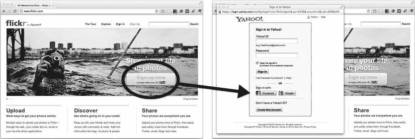
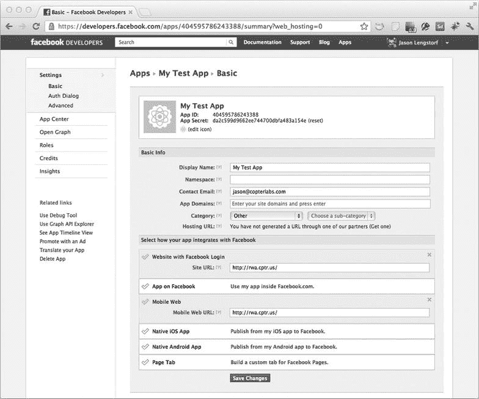
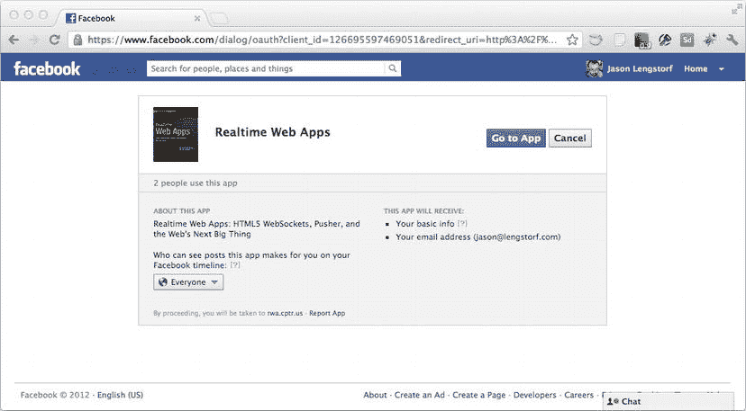
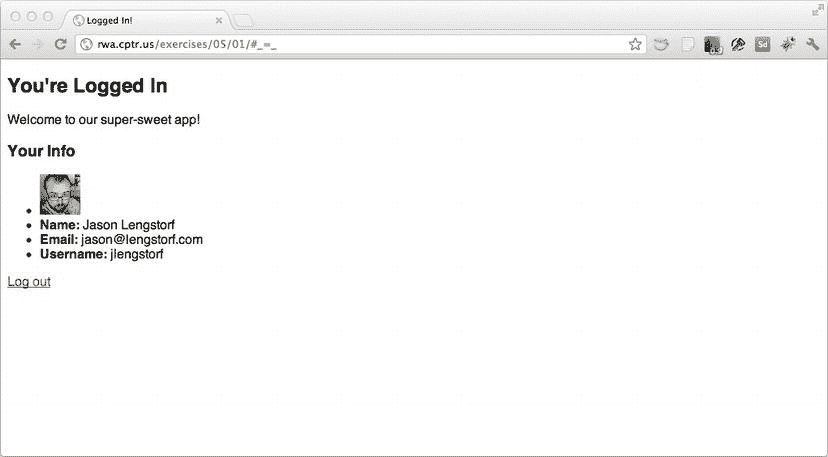

附录 A


OAuth

在本附录中，我们将使用用户现有的社交媒体帐户，在您的 web 应用程序中对用户进行身份验证，从而消除在*和*网站上使用*和*用户名和密码组合的需要。

为此，我们将使用 OAuth 协议。

OAuth 是什么？

根据 OAuth 主页上的说法， *OAuth* 是“一个开放的协议，允许桌面和 web 应用程序以简单和标准的方式进行安全的 API 授权。” [<sup>1</sup>](#Fn1)

这在很大程度上意味着，OAuth 为你的应用程序提供了一种方式来访问用户的其他帐户，如脸书，而不需要在你的应用程序中输入用户的脸书密码。

更深入地说，OAuth 为开发人员提供了一个标准化的协议，让他们向服务提供商注册，获取凭证，并使用这些凭证让他们的应用程序代表用户向服务提供商请求权限。

OAuth 的历史

OAuth 1.0 于 2007 年完成，解决了随着脸书和 Twitter 等网站的流行而困扰开发者的一个问题。这些网站如何在不要求用户向其他应用提供密码的情况下进行互动？

Twitter 的早期采用者被新的应用程序、工具和服务淹没，这些应用程序、工具和服务增强了 Twitter，自动化了推文，将具有相似兴趣的人联系起来，并展示了使用 Twitter 平台的无数其他有趣的方式。不幸的是，要使用这些应用程序，用户最初需要输入他们的 Twitter 用户名和密码，以授予应用程序访问帐户的权限。这种访问是不受限制的，所以用户只是相信这些应用程序开发人员会负责任，并希望得到最好的结果。

显然，这不是一个可持续的模式。

在 OAuth 背后的团队研究了许多现有的专有解决方案(如 Google AuthSub、AOL OpenAuth 和 Amazon Web Services API 等服务)并将最佳实践结合到一个开放协议中之后，OAuth 成为了一个替代的身份验证协议，该协议易于任何服务使用和任何开发人员实现。

OAuth 目前正在起草 OAuth 2.0 草案，包括脸书在内的一些服务提供商已经实施了该草案。

OAuth 如何工作

在我们讨论正在发生的事情之前，让我们先来看看现实世界中的 OAuth 工作流:社交照片共享网站 Flickr 是 Yahoo！但它也允许用户使用其脸书或谷歌账户登录服务。

最有可能的是，这个工作流程是您以前见过的，甚至可能是您在多个场合使用过的。在用户方面，它极其简单，这也是它吸引人的一部分。用户点击登录按钮，选择使用一个支持 OAuth 的现有帐户登录(参见[图 A-1](#Fig1) )，然后使用所选服务(在本例中为脸书)确认请求应用程序有权访问所请求的数据([图 A-2](#Fig2) )。之后，用户登录。



[图 A-1。除了基于雅虎的账户系统，Flickr 主页](#_Fig1)还允许用户登录谷歌或脸书


[图 A-2。](#_Fig2)点击脸书登录后，雅虎向脸书请求权限，您可以选择批准或取消

 **注意**如果你看脸书登录对话框的右下方，列出了请求的权限，供用户在批准前查看。

从用户的角度来看，这是三次快速点击。从开发人员的角度来看，它稍微复杂一些(尽管它仍然比自定义的帐户注册和登录系统更容易实现)。

OAuth 开发人员工作流程

在应用程序中实现 OAuth 的开发人员工作流程相当简单:

1.  您的应用程序将用户发送到授权*端点*，或统一资源指示器(URI)，通过它，API 公开一个动作，以及它的凭证、它自己的授权端点、它需要什么权限和一个安全令牌。
2.  服务的授权端点要求用户确认您的应用程序是否被允许代表用户访问 API。
3.  假设用户授予访问权限，服务会将用户重定向回您的应用程序的授权端点，以及步骤 1 中的授权代码和安全令牌。
4.  您的应用程序通过发送在步骤 3 中收到的授权代码，再加上其凭据和您的应用程序的授权端点，从服务的令牌端点请求访问令牌。
5.  该服务对您的应用程序进行身份验证，检查授权代码，并发回一个访问令牌，该令牌可用于通过服务的 API 访问用户的数据。

以一个真实的服务为例，让我们看看脸书的 OAuth 2.0 [<sup>2</sup>](#Fn2) 实现使用的实际端点。

建立登录链接

应用程序请求访问用户数据的第一步是将用户定向到服务提供商的授权端点。为脸书做这件事的端点 URI 是`https://www.facebook.com/dialog/oauth`，应用程序必须随请求一起发送它的`client_id`、`redirect_uri`、`scope`和`state`。

假设用户在获得应用程序的访问权限后应该被重定向到`http://app.example.org/login.php`，应用程序的登录链接可能如下所示:

```php
https://www.facebook.com/dialog/oauth?client_id=YOUR_APP_ID& redirect_uri=http%3a%2f%2fapp.example.org%2flogin.php&scope=email&state= 73ef0836082f31
```

 **注意**`client_id`的值是你注册 app 后脸书提供的唯一值。当前值`YOUR_APP_ID`是一个占位符，应该替换为您自己的应用程序凭证。暂时不要担心注册你的应用程序；我们将在本章后面的 A-1 练习中完成这个过程。

这个例子使用`GET`方法向端点发送参数。为了更容易识别，它们以粗体显示。

*   `client_id`是脸书在应用程序注册后为其生成的公共标识符。它让脸书知道谁请求访问。
*   `redirect_uri`是授权应用程序后用户应被重定向到的 URI。这个 URI 是你的应用程序的授权端点，应用程序将在这里处理脸书发送的数据。
*   `scope`是从脸书请求的权限的逗号分隔列表。在脸书的开发者文档中有一个完整的列表，前面提到过，但是在本书中唯一使用的是`email`。[T33](#Fn3)
*   `state`是为防止跨站点请求伪造而生成的任意字符串。这在技术上是可选的，但是应该使用。

从用户处获得授权

在用户点击前一部分生成的登录链接后，她将看到脸书的授权对话框。这将向她显示所请求的权限，并为她提供确认或拒绝向您的应用程序授予这些权限的选项。

假设她批准了授权请求，脸书会将她重定向回您的应用程序的授权端点，这是在登录链接的`redirect_uri`参数中传递的。脸书将从登录链接发回一个`code`和`state`的值，如下所示:

```php
http://app.example.org/login.php?code=CODE_GENERATED_BY_FACEBOOK&state=73ef0836082f31
```

 **注意**`code`的值将是一个由脸书生成的长字符串，对每个请求都是唯一的。`CODE_GENERATED_BY_FACEBOOK`是占位符。

请求访问令牌

有了`code`的值，你的应用可以向脸书请求一个访问令牌。这是通过发送`code`、您的应用在`client_id`和`client_secret`中的凭证以及您的应用在`redirect_uri`中的授权端点来完成的。

该 URL 将类似于以下内容:

```php
https://graph.facebook.com/oauth/access_token?client_id=YOUR_APP_ID&redirect_uri=http%3a%2f%2fapp.example.org%2flogin.php&client_secret=YOUR_APP_SECRET&code=CODE_GENERATED_BY_FACEBOOK
```

 **注**`client_secret`的值是脸书在你的 app 注册后提供给你的另一部分凭证。值`YOUR_APP_SECRET`是一个占位符，应替换为您的应用凭证。

假设所有需要的参数都是正确有效的，脸书将在`access_token`返回一个访问令牌，以及在`expires`中指示该令牌的有效时间(以秒为单位)。

```php
access_token=USER_ACCESS_TOKEN&expires=NUMBER_OF_SECONDS_UNTIL_TOKEN_EXPIRES
```

 **注**`access_token`的值是脸书生成的唯一值。`expires`的值将是一个整数。当前值`USER_ACCESS_TOKEN`和`NUMBER_OF_SECONDS_UNTIL_TOKEN_EXPIRES`是占位符。

如何处理访问令牌

使用访问令牌，您的应用程序现在可以从脸书 API 请求用户信息。因为除了基本的用户信息之外，它只请求电子邮件，你的应用程序将不能查看用户的信息流，代表他们发帖，或者做任何高级的事情。它为您的应用程序提供了身份验证和一点个人资料个性化所需的一切。

要加载用户信息，只需使用脸书的一个 API 端点(在本例中，我们从 Graph API 加载基本用户信息)并传递 access_token 中的访问令牌:

```php
https://graph.facebook.com/me?access_token=USER_ACCESS_TOKEN
```

用有效的访问令牌加载它将生成一个 JSON 编码的输出，如下所示:

```php
{
   "id": "1468448880",
   "name": "Jason Lengstorf",
   "first_name": "Jason",
   "last_name": "Lengstorf",
   "link": "https://www.facebook.com/jlengstorf",
   "username": "jlengstorf",
   "hometown": {
      "id": "109281049091287",
      "name": "Whitefish, Montana"
   },
   "location": {
      "id": "112548152092705",
      "name": "Portland, Oregon"
   },
   "bio": " I\u2019m a turbogeek from Portland. I design and develop websites, and sometimes I draw pictures of stuff.\n\nI\u2019ve written two books (check 'em out here:http://cptr.me/LP9YAm), and I\u2019ve written articles on development and design for Nettuts, CSS Tricks, and Smashing Magazine, among others.",
   "quotes": "That dog'll hunt.",
   "work": [
      {
         "employer": {
            "id": "169249483097082",
            "name": "Copter Labs"
         },
         "position": {
            "id": "137221592980321",
            "name": "Developer"
         },
         "description": "Making the web a better-looking place.",
         "start_date": "2010-12"
      }

   ],

   "education": [
      {
         "school": {
            "id": "107993102567513",
            "name": "Whitefish High School"
         },
         "year": {
            "id": "194603703904595",
            "name": "2003"
         },
         "type": "High School"
      }
   ],
   "gender": "male",
   "email": "jason\u0040lengstorf.com",
   "timezone": -7,
   "locale": "en_US",
   "languages": [
      {
         "id": "113301478683221",
         "name": "American English"
      }
   ],
   "verified": true,
   "updated_time": "2012-06-29T21:53:51+0000"
}
```

这些数据可以在您的应用程序中用来定制用户体验，识别他们所做的任何操作，以及其他需要用户信息的功能。

为什么 OAuth 比构建登录系统更好

在许多情况下，使用 OAuth 对用户进行身份验证是解决“用户帐户”问题的更好方法。创建新帐户对开发者和用户来说都是一件痛苦的事情，所以当应用程序没有明确的需求来密切控制自己的注册过程时，有很多很好的理由使用 OAuth，而不是实现特定于您的应用程序的东西。一些好处包括:

*   用户需要处理的帐户注册和密码少了一个，这降低了潜在新用户的准入门槛:开始意味着三次点击，而不是填写表格，检查他们的确认电子邮件，然后登录。
*   该应用程序可以访问基本的用户信息，而无需用户在授权之外进行任何额外的输入或操作。
*   该应用可以访问服务提供商的 API 及其优势(如在权限允许的情况下，在脸书上共享用户的应用活动)。
*   它消除了构建复杂的定制登录系统的需要，节省了维护和开发时间。

**练习 A-1:使用 OAUTH 和 FACEBOOK 构建一个简单的登录系统**

让我们通过构建一个非常简单的应用程序来使用 OAuth，这个应用程序只允许用户使用他们的脸书帐户登录。

这个应用程序将放弃 CSS 样式和任何非必要的标记，因为需要合理数量的 PHP 来实现所需的功能。您将构建一个抽象的 PHP 类来定义基本的 OAuth 2.0 工作流，然后用一个定义端点、凭证和 API 交互方法的特定于脸书的类来扩展该类。

这个应用程序将由五个文件组成:两个 PHP 类、一个配置文件、一个登录文件和应用程序的主页。

第一步:在脸书注册你的应用程序

要向脸书注册您的应用，请导航至`https://developers.facebook.com/apps`。进入后，点击屏幕右上角的创建新应用按钮。一个模态窗口将会出现，要求你命名你的应用程序(见[图 A-3](#Fig3) )。


[图 A-3。](#_Fig3)向脸书注册新应用的模式对话框

接下来，你会被带到应用程序的主屏幕。在内部，选中复选框以表明该应用程序将允许登录网站，并且它也将是一个移动应用程序(参见[图 A-4](#Fig4) )。



[图 A-4。](#_Fig4)脸书上的应用主屏幕

保存这些更改，应用程序就注册了。在页面顶部记下应用 ID 和应用密码；稍后将使用它们来获得授权。

**步骤 2:创建一个 OAuth 基类**

第一步是创建处理所有通用 OAuth 2.0 工作流的抽象类。使这个类成为抽象类的原因是，如果没有一个服务提供者，它就不能工作，请求应该向服务提供者发出。将该类与脸书特定的类分开的原因是，如果该应用程序要添加第二个服务提供商作为登录选项，这将防止重复代码。

在 web root 中，创建一个名为`includes`的文件夹，并在其中创建一个名为`class.rwa_oauth.inc.php`的新文件。首先，添加一些基本的检查并声明这个类:

```php
<?php

// Makes sure cURL is loaded
if (!extension_loaded('curl')) {
    throw new Exception('OAuth requires the cURL PHP extension.');
}

// Makes sure the session is started
if (!session_id()) {
    session_start();
}

/**
* An abstract class for handling the basics of OAuth 2.0 authorization
*
* @author Jason Lengstorf
* @copyright 2012 Jason Lengstorf
*/
abstract class RWA_OAuth
{

}
```

因为使用 OAuth 需要应用程序请求外部 URIs 才能正常工作，所以需要使用`cURL`扩展。这个脚本使用`extension_loaded()`来验证`cURL`支持是否可用，如果不可用，则使用`throw`来验证`Exception`。

 **注意**缺少`cURL`、[和 <sup>4</sup>](#Fn4) 的支持是可能的，但这不在本练习的范围之内。

接下来，它检查活动会话 ID，如果没有找到，就启动一个会话。

这个类被称为`RWA_OAuth`(可能还有其他类被称为“OAuth ”,所以使用前缀`RWA_`来防止类命名冲突)。它是抽象的，这意味着它不能被直接实例化；换句话说，另一个类必须在它的方法和属性被访问之前扩展`RWA_OAuth`。

**类属性**

声明了类之后，我们现在可以定义所有的类属性:

```php
abstract class RWA_OAuth
{

  /**
  * The service's auth endpoint
     * @var string
     */
    public $service_auth_endpoint,

    /**
     * The service's token endpoint
     * @var string
     */
           $service_token_endpoint,

    /**
     * The scope, or permissions, required for the app to work properly
     * @var string
     */
           $scope,

    /**
     * The service-generated client ID
     * @var string
     */
           $client_id,

    /**
     * The service-generated client secret
     * @var string
     */
           $client_secret,

    /**
     * The app's authorization endpoint
     * @var string
     */
           $client_auth_endpoint,

    /**
     * The user's account ID as loaded from the service
     * @var string
     */
           $id,

    /**
     * The user's username as loaded from the service
     * @var string
     */
           $username,

    /**
     * The user's name as loaded from the service
     * @var string
     */
           $name,

    /**
     * The user's email as loaded from the service
     * @var string
     */
           $email,
    /**
     * Generated HTML markup to display the user's profile image
     * @var string
     */
           $profile_image;

    /**
     * The current logged in state
     * @var bool
     */
    protected $logged_in    = FALSE,

    /**
     * The user access token or FALSE if none is set
     * @var mixed
     */
              $access_token = FALSE;

}
```

 **注**为了节省空间，只关注相关的代码，类定义之外的代码将被省略，类内与当前例子不相关的代码将被折叠起来，省略注释。新代码将以粗体显示。

*   `$service_auth_endpoint`、`$service_token_endpoint`、`$client_auth_endpoint`将存储指向用户授权所需的每个端点的 URIs。
*   `$scope`存储应用程序请求的权限。
*   `$client_id`和`$client_secret`存储您的应用凭证(通过向服务提供商注册您的应用获得)。
*   `$id`、`$username`、`$name`和`$email`存储关于用户的数据。
*   `$profile_image`存储 HTML 标记以显示用户的个人资料图像。
*   `$logged_in`存储一个布尔值，指示用户当前是否登录。
*   `$access_token`存储授权成功后从服务提供商处获取的访问令牌。

接下来，通过定义所有方法名来布置类的框架:

```php
abstract class RWA_OAuth
{

    public $service_auth_endpoint, $service_token_endpoint, $scope,
           $client_id, $client_secret, $client_auth_endpoint,
           $id, $username, $name, $email, $profile_image;

    protected $logged_in    = FALSE,
              $access_token = FALSE;

    /**
     * Checks for a login or logout attempt
     *
     * @return void
     */
    public function __construct(  )
    {

    }

    /**
     * Checks a login attempt for validity
     *
     * @return void
     */
    public function check_login(  )
    {

    }

    /**
     * Returns the current logged in state
     *
     * @return bool The current logged in state
     */
    public function is_logged_in(  )
    {

    }

    /**
     * Processes a logout attempt
     *
     * @return void
     */
    public function logout(  )
    {

    }

    /**
     * Returns the URI with which a authorization can be requested
     *
     * @return string   The authorization endpoint URI with params
     */
    public function get_login_uri(  )
    {

    }

    /**
     * Returns the URI with which an access token can be generated
     *
     * @return string   The access token endpoint URI with params
     */
    protected function get_access_token_uri(  )
    {

    }

    /**
     * Saves the access token in the session and as a class property
     *
     * @return bool TRUE on success, FALSE on failure
     */
    protected function save_access_token(  )
    {

    }

    /**
     * Makes a request using cURL and returns the resulting data
     *
     * @param string $uri   The URI to be requested
     * @return string       The data returned by the requested URI
     */
    protected function request_uri(  )
    {

    }

    /**
     * Loads the basic user data, including name and email
     *
     * This method will be different for each OAuth authorized service,
     * so it will need to be defined in the child class for the service.
     */
    abstract protected function load_user_data();

    /**
     * Generates markup to display the user's profile image
     *
     * This method will be different for each OAuth authorized service,
     * so it will need to be defined in the child class for the service.
     */
    abstract protected function load_user_profile_image();

}
```

这些方法中的每一个都将在定义时详细介绍。简而言之，这些是完成本章前面“OAuth 开发人员工作流”一节中描述的 OAuth 工作流所需的所有方法。

**获取登录 uri() &获取访问令牌 uri()**

定义了类框架之后，让我们从授权和令牌生成所需的端点开始，定义`get_login_uri()`和`get_access_token_uri()`:

```php
abstract class RWA_OAuth
{

    public $service_auth_endpoint, $service_token_endpoint, $scope,
           $client_id, $client_secret, $client_auth_endpoint,
           $id, $username, $name, $email, $profile_image;

    protected $logged_in    = FALSE,
              $access_token = FALSE;

    public function __construct(  ) {...}

    public function check_login(  ) {...}

    public function is_logged_in(  ) {...}

    public function logout(  ) {...}

    public function get_login_uri(  )
    {
        $state = uniqid(mt_rand(10000,99999), TRUE);
        $_SESSION['state'] = $state;
        return $this->service_auth_endpoint
             . '?client_id='    . $this->client_id
             . '&redirect_uri=' . urlencode($this->client_auth_endpoint)
             . '&scope='        . $this->scope
             . '&state='        . $state;
    }

    protected function get_access_token_uri($code=NULL)
    {
        return $this->service_token_endpoint
             . '?client_id='     . $this->client_id
             . '&redirect_uri='  . urlencode($this->client_auth_endpoint)
             . '&client_secret=' . $this->client_secret
             . '&code='          . $code;
    }
    protected function save_access_token(  ) {...}

    protected function request_uri(  ) {...}

    abstract protected function load_user_data();

    abstract protected function load_user_profile_image();

}
```

`get_login_uri()`方法做的第一件事是生成一个惟一的字符串作为`state`参数传递，它将用于验证授权请求是真实的。这也存储在进程中，供以后参考。

之后，我们将`$service_auth_endpoint`与所需的参数连接起来。为了避免编码问题，首先通过`urlencode()`运行`$client_auth_endpoint`值。

组装完成后，授权请求或登录 URI 将被返回。

对`get_access_token_uri()`遵循相同的过程，有两个小的不同:1)没有使用`state`参数，2)增加了`client_secret`参数。它还接受从服务提供商发回的参数`$code`。我们将在下一节中介绍如何获取该值。

**保存 _ 访问 _ 令牌()和请求 _uri()**

为了加载和保存生成的令牌，让我们定义`save_access_token()`和`request_uri()`:

```php
abstract class RWA_OAuth
{

    public $service_auth_endpoint, $service_token_endpoint, $scope,
           $client_id, $client_secret, $client_auth_endpoint,
           $id, $username, $name, $email, $profile_image;

    protected $logged_in    = FALSE,
              $access_token = FALSE;

    public function __construct(  ) {...}

    public function check_login(  ) {...}

    public function is_logged_in(  ) {...}

    public function logout(  ) {...}

    public function get_login_uri(  ) {...}

    protected function get_access_token_uri(  ) {...}

    protected function save_access_token(  )
    {
        $token_uri = $this->get_access_token_uri($_GET['code']);
        $response = $this->request_uri($token_uri);

        // Parse the response
        $params = array();
        parse_str($response, $params);
        if (isset($params['access_token'])) {
            $_SESSION['access_token'] = $params['access_token'];
            $this->access_token       = $params['access_token'];
            $this->logged_in          = TRUE;
            return TRUE;
        }

        return FALSE;
    }

    protected function request_uri($uri)
    {
        $ch = curl_init();
        curl_setopt($ch, CURLOPT_URL, $uri);
        curl_setopt($ch, CURLOPT_RETURNTRANSFER, 1);
        curl_setopt($ch, CURLOPT_CONNECTTIMEOUT, 4);

        return curl_exec($ch);
    }

    abstract protected function load_user_data();

    abstract protected function load_user_profile_image();

}
```

首先，我们来看看`request_uri()`。这个方法接受一个参数`$uri`，它是请求的 URI。然后，它初始化`cURL`，将请求的 URI 设置为`$uri`，告诉`cURL`返回请求的输出，并将超时设置为任意但合理的值，即 4 秒。

接下来，在`save_access_token()`中，使用`get_access_token_uri()`和`code`的值(假定已经在查询字符串中传递)将令牌请求 URI 加载到`$token_uri`中。然后来自`$token_uri`的响应用`request_uri()`加载后存储在`$response`中。

除非出现错误，否则`$response`中的值将包含查询字符串格式的访问令牌。使用`$params`数组和`parse_str()`，查询字符串被分解成一个关联数组，我们在其中检查`access_token`。如果它被设置，它将被存储在对象的属性和会话中，`$logged_in`被设置为`TRUE`，该方法返回`TRUE`；如果没有，该方法返回`FALSE`以指示失败。

**其余的类方法**

让我们通过定义剩余的四个方法来结束`RWA_OAuth`类:

```php
abstract class RWA_OAuth
{

    public $service_auth_endpoint, $service_token_endpoint, $scope,
           $client_id, $client_secret, $client_auth_endpoint,
           $id, $username, $name, $email, $profile_image;

    protected $logged_in    = FALSE,
              $access_token = FALSE;

    public function __construct(  )
    {
        if (isset($_GET['logout']) && $_GET['logout']==1) {
            $this->logout();
            header('Location: ' . $this->client_auth_endpoint);
            exit;
        }

        $this->check_login();
    }

    public function check_login(  )
    {
        if (isset($_GET['state']) && isset($_GET['code'])) {
            if ($_GET['state']===$_SESSION['state']) {
                $this->save_access_token();
                $this->load_user_data();
                $this->load_user_profile_image();
            } else {
                throw new Exception("States don't match.");
            }
        } elseif (!$this->logged_in && !$this->access_token) {
            if (isset($_SESSION['access_token'])) {
                $this->access_token = $_SESSION['access_token'];
                $this->logged_in = TRUE;
                $this->load_user_data();
                $this->load_user_profile_image();
            }
        }
    }

    public function is_logged_in(  )
    {
        return $this->logged_in;
    }

    public function logout(  )
    {
        $this->logged_in = FALSE;
        $this->access_token = FALSE;
        unset($_SESSION['access_token']);
        session_regenerate_id();
        session_destroy();
    }

    public function get_login_uri(  ) {...}

    protected function get_access_token_uri(  ) {...}

    protected function save_access_token(  ) {...}

    protected function request_uri(  ) {...}

    abstract protected function load_user_data();

    abstract protected function load_user_profile_image();

}
```

方法 中的`is_logged_in()`是最简单的，简单地返回`$logged_in`的值。

`logout()` 也非常简单:它将`$logged_in`和`$access_token`设置为`FALSE`，确保访问令牌从会话中删除，然后彻底销毁会话。

`check_login()` 在查询字符串中查找`state`和`code`，如果它们存在，它检查`state`是否与会话中存储的匹配。如果匹配，则运行`save_access_token()`方法；然后调用类中的两个抽象方法(`load_user_data()`和`load_user_profile_image()`，它们将在一个子类中定义)。如果它们不匹配，就会抛出一个`Exception`。

如果用户未登录，但会话中存在访问令牌，脚本将在对象中保存访问令牌，将`$logged_in`设置为`TRUE`，并加载用户数据和配置文件映像。

对象的构造函数首先检查注销尝试，这是通过查询字符串(`$_GET['logout']`)发送的。除此之外，它运行`check_login()`。

**步骤 3:构建脸书·欧特子类**

有了`RWA_OAuth`类，我们就可以进行特定于服务的 OAuth 实现了。在这个例子中，我们将使用脸书。

在`includes`文件夹中，创建名为`class.rwa_facebook.inc.php`的新文件。在内部放置以下代码:

```php
<?php

// Makes sure JSON can be parsed
if (!extension_loaded('json')) {
    throw new Exception('OAuth requires the JSON PHP extension.');
}

/**
* An RWA_OAuth extension for Facebook's OAuth 2.0 implementation
*
* @author Jason Lengstorf
* @copyright 2012 Jason Lengstorf
*/
class RWA_Facebook extends RWA_OAuth
{

    public $service_auth_endpoint
                = 'https://www.facebook.com/dialog/oauth',
           $service_token_endpoint
                = 'https://graph.facebook.com/oauth/access_token';

    /**
     * Sets defaults, calls the parent constructor to check login/logout
     *
     * @param array $config Configuration parameters for Facebook OAuth
     * @return void
     */
    public function __construct( $config=array() )
    {
        /*
         * In order to use OAuth, the client_id, client_secret, and
         * client_auth_endpoint must be set, so execution fails here if
         * they aren't provided in the config array
         */
        if (   !isset($config['client_id'])
            || !isset($config['client_secret'])
            || !isset($config['client_auth_endpoint'])
        ) {
            throw new Exception('Required config data was not set.');
        }

        $this->client_id            = $config['client_id'];
        $this->client_secret        = $config['client_secret'];
        $this->client_auth_endpoint = $config['client_auth_endpoint'];

        /*
         * Adding scope is optional, so if it's in the config, this sets
         * the class property for authorization requests
         */
        if (isset($config['scope'])) {
            $this->scope = $config['scope'];
        }

        // Calls the OAuth constructor to check login/logout
        parent::__construct();
    }

    /**
     * Loads the user's data from the Facebook Graph API
     *
     * @return void
     */
    protected function load_user_data(  )
    {
        $graph_uri = 'https://graph.facebook.com/me?'
                   . 'access_token=' . $this->access_token;
        $response = $this->request_uri($graph_uri);

        // Decode the response and store the values in the object
        $user = json_decode($response);
        $this->id       = $user->id;
        $this->name     = $user->name;
        $this->username = $user->username;
        $this->email    = $user->email;
    }

    /**
     * Generates HTML markup to display the user's Facebook profile image
     *
     * @return void
     */
    protected function load_user_profile_image(  )
    {
        $image_path = 'https://graph.facebook.com/' . $this->id
                    . '/picture';
        $this->profile_image = 'name . '" />';
    }
}
```

首先，因为脸书以 JSON 编码的格式发回数据，如果 PHP 中没有加载`json`扩展，脚本将抛出一个`Exception`。

之后，声明`RWA_Facebook`类来扩展`RWA_OAuth`。在里面，两个属性被重新声明——`$service_auth_endpoint`和`$service_token_endpoint`——构造函数被重新定义，来自`RWA_OAuth`的两个抽象方法被声明。

`$service_auth_endpoint`和`$service_token_endpoint`是特定于脸书的，因此它们可以被硬编码到类中。

其他属性值——即`$client_auth_endpoint`、`$client_id`、`$client_secret`，以及可选的`$scope (`(如果我们需要的不仅仅是基本的应用程序，我们并不需要)——是通过构造函数设置的。端点和应用凭证是必需的，如果它们没有设置，抛出一个`Exception`，然后该方法在`$config`数组中检查`scope`。然后运行父构造函数来检查登录和注销尝试。

**第四步:创建一个脸书配置文件**

`RWA_Facebook`类将被加载到应用程序的主页和应用程序的验证端点，因此脸书配置细节将被抽象到一个单独的文件中。在`includes`文件夹中，创建一个名为`fb_config.inc.php`的新文件，并将以下内容放入其中:

```php
<?php

$fb_config = array(
    'client_id' => '404595786243388',
    'client_secret' => 'da2c599d9662ee744700dbfa483a154e',
    'client_auth_endpoint'
            => 'http://rwa.cptr.us/exercises/05/01/login.php',
    'scope' => 'email',
);
```

这个文件非常简单:它定义了一个数组，存储在`$fb_config`中，当它被实例化时将被传递给`RWA_Facebook`类的构造函数。

 **注意**确保用你的应用凭证替换`client_id`和`client_secret`，因为它们是特定于域的，并且*在没有设置它们的域上*无效。

**第五步:创建应用的认证端点**

现在，所有的类和配置文件都已就绪，您可以开始构建应用程序的实际页面了。首先在 web 根目录下创建文件`login.php`。在内部放置以下内容:

```php
<?php

// Set error reporting to keep the code clean
error_reporting(E_ALL^E_STRICT);
ini_set('display_errors', 1);

// Loads the Facebook class
require_once 'includes/class.rwa_oauth.inc.php';
require_once 'includes/class.rwa_facebook.inc.php';

// Loads the $fb_config array
require_once 'includes/fb_config.inc.php';

$facebook = new RWA_Facebook($fb_config);

// If the user is logged in, send them to the home page
if ($facebook->is_logged_in()) {
    header("Location: ./");
    exit;
}

?>
<!doctype html>
<html lang="en">
    <head>
        <meta charset="utf8" />
        <title>Please Log In</title>
    </head>
    <body>
        <h2>Please Log In</h2>
        <p>
            Before you can use this sweet app, you have to log in.
        </p>
        <p>
            <a href="<?php echo $facebook->get_login_uri(); ?>">
                Log In with Facebook
            </a>
        </p>
    </body>
</html>
```

该文件首先将错误报告设置得尽可能高，以确保代码非常干净，然后包括 OAuth 类和脸书配置文件。

加载必要的文件后，一个新的`RWA_Facebook`对象被实例化并存储在`$facebook`中。然后，脚本通过运行`is_logged_in()`方法检查用户是否登录，如果是，则重定向到主页。

对于已注销的用户，会显示一个简单的 HTML 页面，要求用户登录。使用`get_login_uri()`方法生成一个登录 URI。

**第六步:创建应用主页**

最后创建的文件是应用程序的主页。在 web 根目录下创建一个名为 index.php 的文件，然后添加以下代码:

```php
<?php

// Set error reporting to keep the code clean
error_reporting(E_ALL^E_STRICT);
ini_set('display_errors', 1);

// Loads the Facebook class
require_once 'includes/class.rwa_oauth.inc.php';
require_once 'includes/class.rwa_facebook.inc.php';

// Loads the $fb_config array
require_once 'includes/fb_config.inc.php';

$facebook = new RWA_Facebook($fb_config);

// If the user is not logged in, send them to the login page
if (!$facebook->is_logged_in()) {
    header('Location: login.php');
    exit;
}

?>
<!doctype html>
<html lang="en">
    <head>
        <meta charset="utf8" />
        <title>Logged In!</title>
    </head>
    <body>
        <h2>You're Logged In</h2>
        <p>
            Welcome to our super-sweet app!
        </p>
        <h3>Your Info</h3>
        <ul>
            <li>
                <?php echo $facebook->profile_image; ?>
            </li>
            <li>
                <strong>Name:</strong>
                <?php echo $facebook->name; ?>
            </li>
            <li>
                <strong>Email:</strong>
                <?php echo $facebook->email; ?>
            </li>
            <li>
                <strong>Username:</strong>
                <?php echo $facebook->username; ?>
            </li>
        </ul>
        <p>

            <a href="?logout=1">Log out</a>
        </p>
    </body>
</html>
```

和`login.php`一样，这个文件首先打开错误报告，包括必要的文件，并在`$facebook`中实例化`RWA_Facebook`对象。它检查用户是否登录，如果没有，就把他送到登录页面。

对于已登录的用户，会显示一个简单的 HTML 页面，其中包含一条快速欢迎消息、他们的信息、他们的个人资料图片以及一个注销按钮。

**第七步:测试 App**

该应用程序现已准备好进行测试。将其加载到浏览器中，您应该会看到登录屏幕(参见[图 A-5](#Fig5) )。


[图 A-5。](#_Fig5)应用程序的登录屏幕

点击登录按钮，你将被带到脸书的授权端点，要求你确认该应用程序已被授权访问你的信息(见[图 A-6](#Fig6) )。



[图 A-6。](#_Fig6)脸书授权对话框

点击转到应用程序按钮确认授权，您将被重定向到您的应用程序，您将在主页上看到您的信息(参见[图 A-7](#Fig7) )。



[图 A-7。](#_Fig7)登录后，应用程序将显示欢迎信息和您的信息

[<sup>1</sup>](#_Fn1)T0】

[<sup>2</sup>](#_Fn2)T0】

[<sup>3</sup>](#_Fn3)T0】

[<sup>4</sup>](#_Fn4)T0】