# 关于技术审校

  **Richard Carter** 是一位经验丰富的网页设计师和前端网页开发者，专注于将设计集成到内容管理、电子商务和其他软件中。他服务过的客户包括 Directgov、NHS Choices、都柏林大学学院，以及——最令人难忘的——一座佛教寺院。

Richard 是四本书的作者（Packt Publishing 2008 年出版的 *MediaWiki Skins Design*；Packt Publishing 2011 年出版的 *Magento 1.3 Themes Design*；Packt Publishing 2010 年出版的 *Joomla! 1.5 Themes Cookbook*；以及 Packt Publishing 2011 年出版的 *Magento 1.4 Themes Design*），并担任过 Packt Publishing 2010 年出版的 *MediaWiki 1.1 Beginners Guide* 和 Packt Publishing 2010 年出版的 *Inkscape 0.48 Essentials for Web Designers* 的技术审校。他目前是位于英格兰东北部的网页设计机构 Peacock Carter Ltd 的创意总监。Richard 在 Twitter 上（`@RichardCarter`）和博客上（[`earlgreyandbattenburg.co.uk`](http://earlgreyandbattenburg.co.uk)）分享信息。


## 前言：为什么选择 Drupal？

作者：Benjamin Melançon

`Drupal` 是一个卓越的内容管理系统，一个强大的 Web 应用框架，以及一个前沿的社会化发布平台。更重要的是，`Drupal` 超越了软件本身——它是一个充满活力的社区，成员包括开发者、设计师、项目经理、商业创新者、技术战略家、用户体验专家、标准和无障碍倡导者，以及那些喜欢钻研直到弄明白一切的人。

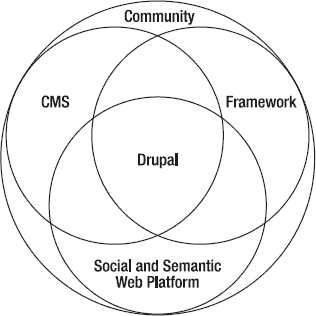

***图 1**. `Drupal` 作为 Web 内容管理系统、应用框架以及社会化与语义化发布平台的交汇点——由一个多元化的社区所包容*

### `Drupal` 是用于构建动态网站的 CMS

> *“我能用 `Drupal` 构建的东西……真是令人难以置信。”*
>
> ——Merlin Mann，来自 [`43folders.com`](http://43folders.com)

使用 `Drupal`，你可以获得一个强大内容管理系统（即 CMS）的所有特性——用户登录与注册；用户与内容类型的定义；不同级别的权限；内容的创建、编辑、分类与管理；内容联合与聚合——所有这些都开箱即用。除了这些核心功能之外，随着社区贡献的不断增加，一个不断扩展的功能宇宙也在涌现。

`Views` 模块（参见第 3 章）允许你以多种方式组织和显示内容。`Groups` 模块（参见第 5 章）可用于创建在线工作组、讨论组等。`Drupal Commerce`（参见第 25 章）让你能够配置完整的在线商店。这只是通过贡献模块为 `Drupal` 提供的强大扩展的一小部分（更多内容参见第 4 章）。从美化网站外观的主题示例（参见第 15 章和第 16 章），到命令行工具（第 26 章），再到强大的搜索功能（第 31 章），如果你想在 `Drupal` 中构建某个功能，很可能已经有人实现了——并且已将代码或说明贡献回社区。如果你希望通过编写自己的模块（第 18 章至第 24 章）来超越现有已贡献的功能，你也能获得大量的帮助。（参见第 9 章了解如何通过参与社区来充分利用 `Drupal`，以及第 38 章了解如何亲自为这个生态系统做出贡献。）

`Drupal` 使用 `PHP` 编写，并结合了大量的 `JavaScript`（主要使用 `JQuery` 库）来实现前端体验，并且它使用诸如 `MariaDB`/`MySQL` 或 `PostgreSQL` 之类的数据库来存储内容和配置。当然，通过使用这些或其他编程语言和数据库进行足够的自定义编码，开发者可以实现 `Drupal` 站点能做的任何事情。但何必如此呢？使用 `Drupal` 可以节省网站构建者重复造轮子的时间，使他们能够专注于达成目标。`Drupal` 能带你驶向你想去的地方，而无需你先自己造一辆车。

> *“我需要一个系统，能够处理多种不同类型的结构化内容，并以各种方式对其进行切分和重组。[……] 我想出了一种非常酷的组织数据的方法，然后意识到我需要在此基础上编写一个 CMS，而我不想在未来八年里把时间都花在这上面。后来我发现，已经有一群人花了过去八年的时间编写了这个系统，它就叫 `Drupal`；我简直兴奋极了。”*
>
> ——Jeff Eaton

### `Drupal` 是一个应用框架

> *“是的，`Drupal` 就是你想要的任何东西。”*
>
> ——Wim Mostrey

`Drupal` 的核心已经变得如此稳固、如此可扩展、并且在构建不同类型的网站方面如此强大，以至于它已经超越了 CMS 的范畴：它是一个用于开发严肃 Web 应用的平台。每个主要版本都包含更好的 API（应用程序编程接口；即代码之间如何通信）以及其他强大的特性，使其超越了 CMS 的范畴。

`Drupal` 被用作各种类型应用的基础，从智能手机和 Facebook 应用，到具有复杂业务逻辑的网站（[`nysenate.gov/mobile`](http://nysenate.gov/mobile)、[`zagat.com`](http://zagat.com)），再到社交媒体和可直接用于零售的软件即服务（[`buzzr.com`](http://buzzr.com)）。`Drupal` 也出现在非 CMS 的角色中，例如作为基于 `Java` 应用的前端，或者作为由 `AJAX` 或 `Flash` 驱动的前端的后端。

框架与 CMS 或其他产品之间的这种区别对你来说最重要的意义在于基于 `Drupal` 构建的发行版（Distributions）的增长，这些发行版专为解决特定用例而设计。例如，用于团队内部网的 `OpenAtrium`（[`openatrium.com`](http://openatrium.com)）、用于社交化商业的 `Drupal Commons`（[`drupalcommons.com`](http://drupalcommons.com)）、用于在线出版商的 `OpenPublish`（[`openpublishapp.com`](http://openpublishapp.com)）以及用于个人学术和研究网站的 `OpenScholar`（[`scholar.harvard.edu`](http://scholar.harvard.edu)）。（有关发行版的更多信息，包括如何创建自己的发行版，请参见第 34 章。）

### `Drupal` 是一个社交化与语义化 Web 平台

> *“如果你必须成为世界的中心，那么你要么成功并拥有一切，要么就会消亡。”*
>
> ——蒂姆·伯纳斯-李爵士

社交化与语义化 Web 的理想拥抱了一个未来的愿景：信息不再被困在单一的网站或公司中。相反，你的信息和他人与你分享的信息都处于你的控制之下，并且可以在多个平台和设备之间使用。协同工作的网站提供了一条出路，让我们得以摆脱那种对人与数据之间连接的控制要么全有、要么全无的反乌托邦世界。`Drupal` 及其对 `RDF`（资源描述框架）的支持，帮助使这个更美好的未来成为可能。

`RDF` 帮助以计算机能够普遍理解的方式标记数据，从而使它们能够利用来自不同来源的数据执行智能操作。通过将易于共享结构化数据的工具直接构建到 `Drupal` 中，我们正在帮助迎来语义网时代，即链接数据时代。到那时，网站和其他互联网连接的设备能够基于在互联网上共享的数据自动回答复杂的问题。

### `Drupal` 是一个社区

选择 `Drupal` 的另一个原因是这本书——以及许许多多其他的书籍、视频、网站、课程，甚至歌曲。（好吧，可能不包括歌曲。搜索后果自负。）围绕 `Drupal` 发展起来的、数量庞大的、既适合初学者又适合专家的资源，既是其成功与增长的成果，也是其促进因素。

即使明天世界上排名前十的 `Drupal` 公司都转而使用石器时代的技术，仍然会有大量出色的贡献者推动其继续发展。没有多少自由软件项目敢这么说，当然，没有任何专有产品可以做出这样的声明。当然，大多数 `Drupal` 公司都在与 `Drupal` 一同成长，而不是退出舞台。


## 临界质量的社区

每年，Drupal 相关活动在世界各地举办多次，这客观上有理由让我们相信，Drupal 已经达到了一个充满活力的参与式项目的临界质量，但更令人津津乐道的还是那些轶事。Drupal 开发者 Matt Schlessman 在 2010 年记录了他第一次参加 Drupal 会议——DrupalCon 旧金山大会的经历：

> *当我走下飞机时，不确定会有什么样的体验。在此之前，Drupal 社区的热情以及大家用 Drupal 做出的杰出成就一直令我惊叹不已。但这次会议能否不负 DrupalCon 的盛名呢？*
>
> *在打车后的几分钟内，我就有了答案。当我们驶入 101 号高速公路时，司机问我为什么来这座城市。我猜他不会知道 Drupal，就提到我是来参加一个会议的。*
>
> *他问道：“是 DrupalCon 吗？” 确实如此。*
>
> *“你在 Drupal 公司工作？” 是的，在 Acquia。*
>
> *在高速公路中间，这位出租车司机激动地从座位上转过身来，大声说道：“太棒了！我有两个 Drupal Gardens 网站！我喜欢 Drupal！而且我爱 Dries！”*
>
> *哇！就在头五分钟里。简直不可思议。*

使用 Drupal 的首要原因并非其功能、可扩展性、强大性能、灵活性，甚至任何与代码相关的东西。首要原因是其社区的广度和深度。

### Drupal 是...

> * ……一个比利时学生，他与世界分享了他大学宿舍的内网软件（`buytaert.net`）。
> * ……一位社区领袖（webchick.net），她共同维护了整个 Drupal 7 版本，欢迎并帮助新的贡献者，定期组织对 Drupal 至关重要的计划，通过咨询和培训谋生，同时还能抽出时间陪伴她的妻子。
> * ……成千上万的人从世界各地汇聚到巴黎、旧金山、哥本哈根、芝加哥、伦敦或丹佛，只为观看、展示、分享、会面、品尝美食、交谈，以及共同编织 Drupal 之梦（`drupalcon.org`）。
> * ……一本有 145 年历史的自由主义杂志，如今使用一个“与我们的政治理念更合拍”的 CMS 进行在线出版（`thenation.com`）。
> * ……35 年来首位来自马萨诸塞州的共和党参议员的竞选活动（`scottbrown.com`）。
> * ……一个为进步政治候选人提供的网络服务（`starswithstripes.org`）。
> * ……美国政府（`sba.gov` 和 `whitehouse.gov` 等）。
> * ……自由意志共产主义者的在线家园（`libcom.org`）。
> * ……50 年来首家进行首次公开募股的美国汽车公司（`teslamotors.com`）。
> * ……一个国际交互设计协会（`IxDA.org`）。
> * ……几位喜剧演员（`robinwilliams.com` 和 `chrisrock.com`）。
> * ……最大的企业参与式媒体网站（`examiner.com`）以及世界各地许多小型反企业参与式媒体网站（如 `bolivia.indymedia.org` 和 `tc.indymedia.org`）。
> * ……数十万个各种规模与用途的网站，包括 Drupal 7（作为一项服务，`drupalgardens.com`）免费托管的成千上万个网站。
> * ……成千上万个靠 Drupal 谋生的人，从制作强大工具的奇才（`angrydonuts.com`，其工具部分由高端网站付费，但人人都可以使用），到知名 Drupal 公司的关键员工（`angrylittletree.com`），再到专注于社区组织需求的工人合作社（`palantetech.com`）。

Drupal 涵盖所有这些，甚至更多。Drupal 也是，或者说可以是，你。

### Drupal 7 的新特性

作者：Dani Nordin

当然，每个 Drupal 版本都比上一个版本更好；否则就没有意义了。然而，可以说 Drupal 6 的飞跃比以往任何版本都大，而 Drupal 7 的飞跃则更大。本节将重点介绍一些显著的改进。

 **注意** 本书的写作目标是，既要对从未使用过 Drupal 的新手有帮助，也要对在 Drupal 7 之前就使用过它的老用户有用。考虑到 Drupal 社区在每次重大发布后规模都会大约翻一番，这看起来是个不错的方法。

#### 更易于使用

全新改版的管理界面使日常任务更加简单，并特别为网站构建者和内容编辑者增加了许多改进（图 2）。

> **管理工具栏：** 管理任务的导航现在由位于浏览器窗口顶部的工具栏提供。可以通过用户角色设置工具栏的访问权限，并且只有该角色已获授权的功能才会在工具栏中可用。
>
> **快捷方式抽屉：** 在管理工具栏下方是快捷方式抽屉，可以切换打开或关闭。每个管理屏幕上的加号或减号图标用于在抽屉中添加或删除快捷方式。快捷方式可以像（指向区块页面的链接）那样通用，也可以像（指向正在完善中的某个特定视图的链接）那样具体。此外，快捷方式可以保存为集合，从而可以为站点编辑创建一组快捷方式，为管理员创建另一组，等等。
>
> **上下文链接：** 当您将鼠标悬停在各种站点内容（如区块、视图、菜单列表和摘要）上时，会显示一个小扳手图标，这就是上下文链接。它们提供了一键导航到与该内容相关的编辑屏幕的功能，极大地减少了大多数日常 Drupal 任务中每次任务所需的点击次数。同样重要的是，上下文链接为 Drupal 新手提供了一个有用的参考工具，他们可能不清楚自己要编辑的内容源自何处。在您完成编辑并保存区块、视图或菜单后，上下文链接会将您带回原始屏幕。Drupal 7 充满了许多诸如此类的细微之处，它们共同显著提升了 Drupal 的体验。有关 Drupal 7 用户体验原则的更多信息，请参见本书的第 32 章。

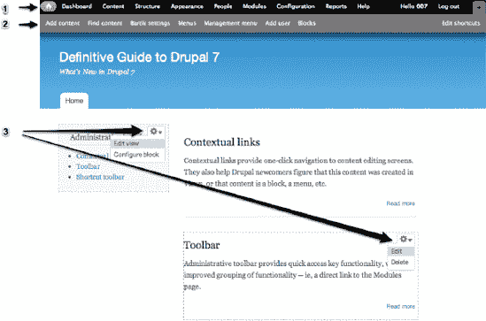

***图 2**。Drupal 7 管理界面的改进包括 1) 管理工具栏，2) 快捷方式抽屉，和 3) 上下文链接。*

Drupal 的新管理界面还包括许多其他针对内容创建和管理流程的增强功能，例如一个新的仪表板，它拥有一个简单而强大的拖放界面，站点管理员可以对其进行自定义，以便包含最近的内容、需要审核的评论/内容，或者您的 Drupal 站点可用的任何其他区块（参见图 3）。

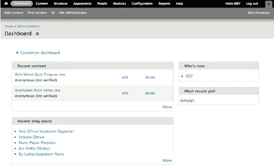

***图 3.** Drupal 仪表板为站点用户提供了一个定制化的视图，展示了他们执行内容或用户维护所需的信息。管理员可以根据各个站点编辑者的需求自定义仪表板。*


#### 更灵活

借助 Drupal 7，你无需添加模块即可定义自己的内容结构，并向内容、用户、评论等添加自定义字段。除了创建自定义文本和列表字段外，你还可以将图片直接上传到 Drupal 字段，并创建自定义`图片样式`来自动缩放和裁剪图片。

你还可以通过本书撰写时 Drupal 7 可用的 1000 多个模块中的一部分来扩展你的网站。许多模块和主题维护者已经做出并履行了`D7CX`承诺，这意味着在 Drupal 新版本发布之日，为其准备好的贡献模块比以往任何时候都多。

Drupal 7 现在还支持不同类型的数据库，包括 MariaDB 5.1.44 及以上版本、MySQL 5.0.15 及以上版本、PostgreSQL 8.3 及以上版本，或 SQLite 3.x。这为你的网站数据提供了更大的灵活性和控制力。

#### 更具可扩展性

得益于改进的 JavaScript 和 CSS 优化、更好的缓存等特性，你的 Drupal 7 网站将快速、响应灵敏，并能够处理巨大的流量。Drupal 7 还需要 PHP 5.2.4 或更高版本才能运行，这带来了更好的性能，但可能在安装或升级前需要与你网站的主机提供商进行确认。

#### 7 版本中的其他变更

除了前面列出的变更之外，Drupal 7 还纳入了以下重要变更。

##### 通过用户界面安装模块和主题

在 Drupal 7 中，你现在可以直接在 Drupal 界面中安装贡献模块和主题，方式可以是提供外部来源的链接，或者直接上传文件（参见图 4）。同样，你可以直接通过 Drupal UI 更新模块和主题，这比之前的 Drupal 版本有了巨大改进。

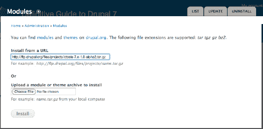

**图 4.** 通过 Drupal 界面安装新模块非常简便。

##### 新的核心主题与增强功能

Drupal 的新版本还包括几个新的默认主题，包括：

> *   Bartik：Drupal 7 的默认主题，一个简洁、多区域的主题，允许更轻松地自定义颜色、区域和 CSS 样式设置（图 5）。
> *   Seven：Drupal 7 的管理主题，一个用于配置覆盖层和管理页面的极简主义主题。
> *   Stark：一个完全空白的主题，提供了一种窥探 Drupal 默认标记底层结构的方式。这对于需要在其开始工作前查看 Drupal 输出的标记的模块和主题开发者来说非常有用。

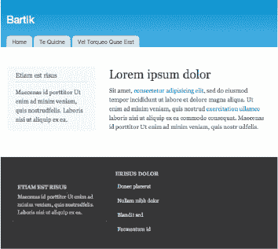

**图 5.** Bartik，Drupal 7 的新默认主题

尽管主题本身很好，但更重要的是网站主题和管理主题之间的明确分离，如图 6 所示。Bartik 是一个拥有 15 个可配置区域的复杂主题。相比之下，Seven 只有两个区域，大大简化了管理界面。

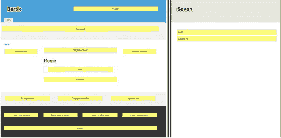

**图 6.** Bartik 和 Seven 主题中的可用内容区域

##### 内容录入与组织的增强

Drupal 7 包含许多对内容录入界面的增强，包括更直观的界面、用于关键配置区域的垂直选项卡，以及向内容添加摘要的选项（可用于自定义页面视图）。

它还包含一个经过改进的分类（内容分类）设置，允许你向内容分类添加图片、描述和字段，甚至可以向它们添加链接。这对于内容密集型网站以及主题化非常有用，因为可以在主题化中使用默认图片来表示特定类别中的每一条内容。

##### RDFa 支持

RDFa 提供了一种构建 HTML 输出的方法，使得机器能够区分日历内容、联系信息和其他类型的内容。这不仅为你的网站提供了内置的搜索引擎优化（SEO），还为你网站的其他功能增强奠定了基础。

有关 RDFa 的更多信息，请访问[`h3.org/TR/xhtml-rdfa-scenarios/`](http://h3.org/TR/xhtml-rdfa-scenarios/)。

##### 安全与测试改进

Drupal 7 的发布附带了许多重要的安全改进，包括：

> *   密码哈希值已被加盐（这意味着无法通过查表法破解密码）。
> *   `cron.php` 使用唯一密钥，使得拒绝服务攻击更加困难。*（注意：这意味着你不能像过去习惯的那样，仅通过访问* `example.com/cron.php` *来运行它。）*
> *   权限拥有通常的、面向用户的名称和描述。
> *   过滤器权限位于主权限页面上。
> *   允许在每个文件字段的基础上选择公共文件或私有文件。
> *   测试模块（原 Simpletest）已包含在 Drupal 核心中。此模块帮助你编写测试，以确保你的网站和模块按预期工作，并在进行更改后测试你的网站。更多信息请参见第 23 章。

这仅仅是 Drupal 7 中众多巨大变化的一小部分。如果你想查看所有变化，请访问 `drupal.org/about/new-in-drupal-7` 和 `drupal.org/drupal-7-released`。

### 如何使用本书

> 埃尔伍德：到芝加哥还有 106 英里，我们有满满一箱汽油，半包香烟，天黑了，我们还戴着墨镜。
> 
> 杰克：走起。

——*《福禄双霸天》*，1980 年

欢迎来到《Drupal 7 权威指南》！拿起这本书表明你对学习 Drupal 感兴趣，渴望充分利用 Drupal 7 强大的新功能，或致力于持续提升 Drupal 知识。或者，对于一个从未听说过 Drupal 的人来说，拿起这本书纯粹是好运气——*命运*般的运气。对于那个人以及更多比幸运更努力的人来说，作者要说：恭喜你找到了一个新的爱好、职业、热情和社区。

本书将加速人们沿着 Drupal 学习曲线前进，涵盖 Drupal 的多个维度，例如：

> *   通过选择和配置免费可用的扩展（称为模块）来构建网站。
> *   规划并维护 Drupal 项目。
> *   创建主题，为你的网站赋予独特的外观和感觉。
> *   编写新模块，扩展 Drupal 和其他模块的功能。
> *   从 Drupal 社区获取帮助并回馈社区。

 **注意** 第五点与使用 Drupal 构建东西有什么关系？一切关系。Drupal 的所有功能、灵活性和强大能力都源于社区。当你开始学习 Drupal 时，成为这个社区的一部分将使你和社区都受益。更多信息请参见第 9 章和第 38 章。


## 谁应该阅读本书？

本书适合任何希望深入理解 Drupal 并利用它实现卓越成果的读者。本书不预设任何特定的先前课程。通往 Drupal 的道路就像社区成员一样多样。

本书旨在成为使用 Drupal（甚至是任何内容管理系统）构建网站的最全面指南。其内容远超代码本身，涵盖了大量其他知识和技能，帮助你提升效率。

目标在于帮助你培养一套扎实的技能，以便驾驭和塑造 Drupal——更重要的是，推广一种被许多人称为“Drupal 之道”的开发理念，其中包括：

> * 为未来的升级、可能出现的故障、客户的新功能需求等做好规划，并构建能够优雅老化的网站。
> * 参与使 Drupal 及其他关键项目得以实现的开放源码自由软件生态系统——在 Drupal 中，这是一个涵盖管理员、开发者、主题制作者和设计师的卓越社区。

声称“权威性”是相当大胆的。并非每个从事 Drupal 工作的人都精通所有方面，甚至并非所有人都了解所有方面。这对你，本书的读者和用户来说，是个绝佳的消息。正是因为 Drupal 的组成部分众多，且没有人在所有领域都是专家，因此成为 Drupal 专家有许多途径和渠道。本书旨在帮助你学习如何思考和处理 Drupal，目标是在社区中留下你的印记。

本书将涵盖广泛的内容，从构建网站、编写代码以增强 Drupal 的外观或扩展其功能，到管理所有这些项目。在整本书中，它始终关注如何参与 Drupal 社区并回馈社区。回馈 Drupal 当然是使 Drupal 得以实现的关键，但与社区的互动也为我们这些与 Drupal 打交道的人提供了持续学习的机会，使我们能够跟上步伐并不断进步。

因此，《Drupal 7 权威指南》不会涵盖这个庞大且不断扩展的软件宇宙中的每一个细节。相反，它将涵盖完成一些实际工作所需的内容，重点是构建解决其他所有问题所需的知识和工具。

### 要求

要使用 Drupal，你需要具备以下条件：

> * 一台可正常使用的电脑。
> * 至少能间歇性访问互联网。

 **提示** 电脑尚未设置好以便轻松运行 Web 服务器、PHP 和数据库的读者（不确定的读者可以假定答案为“否”）可以立即开始下载 VirtualBox 和预装 Drupal 的 VirtualBox 映像，如 `drupal.org/project/quickstart` 所述。有关设置运行 Drupal 的更多方法，请参见附录 F 至 I，另请参见第 12 章。

### 方法与理念

一本参考书只提供事实；一本优秀的教学书则试图展示我们最初是如何发展知识的。本书重在教导。

如果某件事值得做，那么用 Drupal 做这件事可能有三种或十几种方法。鉴于时间和空间的限制，作者们选择了他们最喜欢的方法来撰写。互联网上还有大量其他方法；如果我们想要列出所有可能性，那就不需要一本书了。尽管如此，本书的目的并非宣称并交付唯一的最佳解决方案，而是教你如何寻找和评估解决方案。它旨在提升你思考网站项目和 Drupal 开发的能力。

尽管本书是为从头到尾阅读而写，但它并非线性的。一本关于互联网项目、面向互联网项目以及关于一个庞大而活跃的社区的书很难是线性的。一本旨在实用的书必须允许读者根据他们需要处理的项目及其当前技能水平从任何地方开始。本书的许多部分都可以作为独立的简短章节，介绍如何完成特定任务。

最重要的是，本书是关于赋能，而不是灌输事实。开源自由软件的一个重要启示是，没有任何人类系统或结构是静止不变的；一切都在变化。如果在某个时候，你认为某个主题没有得到充分介绍，请参考第 9 章，该章节讲述了如何参与社区并从社区获得帮助。

#### 关于术语的说明

Drupal 7 在可用性方面取得了巨大进步，部分原因是从管理界面中移除了术语。（界面？这是指你使用网站时所看到东西的术语。）尽管如此，这些术语将在本书中再次出现，因为这是 Drupal 内部思考问题的方式，要成为一名出色的 Drupal 网站构建者，你需要了解一点 Drupal 的思考方式。所以，让我们先解决几个问题。

> 使用网站的人被称为*用户*。在 Drupal 7 管理界面的某些部分，我们被提升为“人”，但当你偶尔看到我们被指代为用户时，不必惊慌——这并非侮辱（尽管 Drupal 可能会让人上瘾）。这只是指代使用网站者的一种更精确、更简洁的方式。
> 
> Drupal 网站中的一段内容也被称为*节点*。为什么不一直称之为内容呢？嗯，有时节点并非内容；有时将它们视为一段数据或更多节点的容器（抱歉，内容）更为合适。

书中还会有很多其他术语，作者们会在出现时尽量更好地解释，但最重要的是，那些一开始让你觉得难以理解的单词、短语甚至概念，不会让你停滞不前。整本书的上下文以及各种在线帮助，都能在你越来越深入地理解这个名为 Drupal 的、由人和软件构成的复杂综合体时，推动你前进。

你可以按照自己的节奏进行，可以重读章节并再次尝试，也可以访问书籍论坛（`definitivedrupal.org/forums` 或 `dgd7.org/fora`）。每个章节都有一个对应的论坛，你可以在那里向作者和其他读者提问（如果你的问题尚未被解答）。

### 约定

管理页面和其他页面的位置会通过点击路径  和 `url/path`（相对于 Drupal 网站的根目录，例如路径 `admin/content`）来描述。例如，帮助主题可以直接从工具栏或管理菜单中访问，因此我们只需指示：转到管理  帮助 (`admin/help`)。

你始终可以通过直接输入提供的 URL 路径（在上一个例子中，对于站点 `example.com`，URL `http://example.com/admin/people/permissions/roles` 将直接带你到该路径）来跳过点击链接、选项卡和子链接。

当提到 Drupal 社区成员时，他们的 `drupal.org` 用户名通常会附加在括号中，因为这个昵称（通常也用于 IRC）在 Drupal 社区中可能比他们的真实姓名更广为人知。例如，在首次介绍 Drupal 7 共同维护者（以及全能型 Drupal 超级明星）时，我们会将她的名字写成 Angela Byron (`webchick`)。

在本书中，“我们”一词通常包括你（读者）、作者以及任何其他可能正在使用 Drupal 的人。


## 超越书本

本书的配套网站是[`definitivedrupal.org`](http://definitivedrupal.org)（也可通过[`dgd7.org`](http://dgd7.org)访问）。你可以在[`dgd7.org/code`](http://dgd7.org/code)下载书中使用的代码。此外，在线内容中还包含关于 Drupal 及作者的更多信息。该网站是对书的补充，而非替代。请告知作者哪些内容最有帮助、哪些让人困惑、以及哪些可以改进。欢迎分享 Drupal 的成功故事或表达困惑，但请保持讨论与各章节相关，而将整体 Drupal 讨论引向第 9 章中介绍的众多社区参与场所之一。

在示例使用方面，作者已尽力确保本书信息是完成特定任务的最佳方式。然而，在 Drupal 中完成一项任务总有其他方法，且 Drupal 是一个不断演进的实体。本书致力于提供所需知识与资源，助你找到自己的解决方案。你也可以订阅[`dgd7.org/updates`](http://dgd7.org/updates)，或通过邮件将你感兴趣的领域发送至[`news@definitivedrupal.org`](http://news@definitivedrupal.org)，以获知文本勘误、新技术建议以及新材料的发布。

作者的目标是通过涵盖使用 Drupal 构建网站的各个方面——架构与配置、模块开发、前端开发、可持续项目运营、以及贡献于 Drupal 的代码、文档和社区——来加速你掌握 Drupal 的学习曲线。

### Drupal 如何运作

作者：丹尼·诺丁

在开始使用 Drupal 之前，你需要了解一些基础知识。本章将概述 Drupal 的运作方式，并介绍一些入门前应掌握的基本术语和概念。

### Drupal 如何运作

Drupal 与 WordPress（[`wordpress.org`](http://wordpress.org)）或 Expression Engine（[`expressionengine.com`](http://expressionengine.com)）等系统类似，是一种内容管理系统（CMS）。它将你的内容视为独立的信息单元，并提供框架将这些内容以符合网站受众需求的方式展示出来。

#### Drupal 的真正作用

理解 Drupal 最简单的方式是将其视为一个数字硬币分类器。你的`节点（nodes）`就是硬币，而`内容类型（content types）`是不同面值（如 25 美分、10 美分等）。除了`内容类型`，你还可以使用`分类法（taxonomy）`按货币国家、颜色、状态等对硬币进行组织。`视图（Views）`是分类硬币的机制；它们获取你的`节点`，并根据大小、形状、颜色或你设定的任何标准将其分类为`页面（Pages）`或`区块（Blocks）`。`主题（Themes）`和`模块（modules）`就像硬币包装纸和齿轮；它们确保一切井然有序，并使系统平稳运行。请参见图 7。

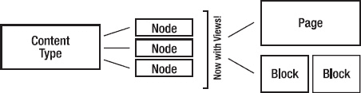

*图 7\. Drupal 如何提供内容的图形概览*

Drupal 与其他内容管理系统在以下方面有所不同：

> * 它极其灵活。与主要专注于博客平台的 WordPress 不同，Drupal 网站可以构建为处理几乎任何所需功能，从企业内网到电子商务、捐赠管理等等。如果你真的想，甚至可以用它来写博客。
> * Drupal 庞大的开发者、设计师和主题师社区意味着即使是最缺乏经验的网站构建者也能获得帮助，从而入门并解决棘手问题。虽然 IRC 和`drupal.org`的议题队列（Issue Queue）非常有帮助（也是很好的起点），但即使是在 Twitter 上用`#Drupal`标签发布问题，也常常会获得你可能未曾想到的帮助和答案。更多关于获取 Drupal 帮助的信息，请参见第 9 章。

### 你需要了解的一些术语


> **节点**：单个内容单元。它可以是新闻条目、活动列表、简单页面、博客文章——任何你想得到的内容。网站上任何带有标题和一段文本的内容都是节点。节点还可以拥有自定义字段，这些字段适用于各种用途。

> **字段**：字段是在 Drupal 中创建内容时最强大的功能之一。使用字段，你可以将图片或文件附加到内容上，创建额外的描述信息（例如活动的日期或文章的子标题），甚至引用其他节点。

> **区块**：一段独立的可复用内容（例如侧边栏菜单或提示框）。区块可以由视图（见下文）创建，也可以在 Drupal 的区块管理菜单中手动创建。区块的妙处在于显示的灵活性；你可以根据设置的任何条件来配置区块的显示。这在首页上或显示仅与网站特定部分相关的菜单时尤其有用。

> **内容类型**：你正在创建的节点类型。Drupal 的最佳特性之一是其对多种内容类型的支持，每种类型都可以根据任意数量的条件进行排序和显示。

> **分类**：内容类别。在最基本的层面上，你可以将分类视为内容的标签（如博客文章）。然而，分类的真正威力在于根据受众可能搜索的内容来组织大量内容。例如，一个食谱网站可以使用分类按多种标准组织食谱：食谱类型（甜点、晚餐等）、食材（作为标签）和自定义指标（素食、纯素、无麸质、低碳水等）。在构建网站时，你可以使用视图让用户根据这些标准中的一个（或多个）来搜索或筛选食谱。

> **用户、角色和权限**：用户正如其名——在你的网站上注册的用户。与用户打交道的关键在于角色；Drupal 允许你为网站上可能发生的任何事情创建独特的角色，并根据每个角色可能需要的操作设置权限。例如，如果你正在创建一个有多位作者的杂志类网站，你可能需要创建一个名为“作者”的角色，该角色拥有访问、创建和编辑自己内容的权限，但不能编辑其他人的内容。你还可以创建一个名为“编辑”的角色，该角色拥有编辑、修改以及发布或取消发布任何作者内容的权限。

> **模块**：一个为网站添加功能的插件。开箱即用，Drupal 提供了一个强大的框架，但框架的意义在于通过模块为其添加功能。[`drupal.org/project/moduleshas`](http://drupal.org/project/moduleshas) 列出了所有由 Drupal 社区贡献的模块，并按热门程度排序。至少，每个 Drupal 安装都应该使用 Views、Pathauto 和 Token。Pathauto 和 Token 帮助您为内容创建自动的 URL 别名；您将在第 3 章和第 8 章以及本书其他部分了解更多关于 Views 的内容。

> **视图**：使用 Views 模块在网站内创建的单个内容单元的有组织列表。您将在第 3 章更深入地了解视图。

> **主题**：控制 Drupal 网站外观和感觉的模板。Drupal 核心附带了一些非常适用于网站管理和原型设计的主题；然而，自定义主题应*始终*放置在您的 `sites/all/themes` 文件夹中，而*非*核心主题文件夹中。

> **tpl.php**：Drupal 用于模板生成的单个 PHP 文件。大多数 Drupal 主题至少会为区块、节点和页面包含一个 `tpl.php` 文件。一旦您掌握了 `tpl.php` 的使用方法，您就可以为特定内容、特定内容类型或特定视图的输出等创建自定义模板。

> **Drupal 核心**：从 `drupal.org` 下载的实际 Drupal 项目文件。任何位于 `/sites` 文件夹*之外*的内容都被视为核心。

有关其他主题相关的定义，请查看第 15 章和第 16 章。

### 规划 Drupal 项目：从内容出发进行设计

由于 Drupal 的许多强大功能都基于创建不同类型的内容并将其组织成可管理的块，因此在开始开发之前制定有效的内容策略和信息架构的重要性怎么强调都不为过。Drupal 本质上是一个内容策展和显示引擎，因此花时间了解网站目标内容的类型和格式以及网站的功能，对于成功使用 Drupal 至关重要。

以下是对典型 Drupal 网站规划的简要概述。更全面的概述请见第 10 章。

#### 第一阶段：发现

任何创意项目的发现阶段都会确立项目业务目标、受众和功能需求等重要信息。这是您与客户合作，确定他们是谁、他们的目标受众是谁以及该受众可能需要做什么的阶段。在此阶段，您主要关注客户的观点和目标；在后续阶段，您将能够研究并确认或修正这些观点。

虽然人们常常想直接动手开始构建，但在发现阶段投入足够的时间和精力对于避免日后出现麻烦至关重要。问问任何一个因为项目需求变更而不得不重做网站大部分内容的 Drupal 开发者就知道了。

在发现阶段，您需要回答以下问题：

> - 客户是谁？他们是做什么的？
> - 客户项目团队的主要联系人是谁？
> - 客户方还有哪些其他决策者（如果有）？反馈将如何处理？
> - 围绕这个项目的主要业务目标是什么？换句话说，我们为什么要做这个项目？
> - 客户对他们这个项目的主要受众有什么理解？次要受众呢？他们对该受众的需求有何理解？
> - 受众需要从这个项目获得的主要信息是什么？
> - 为此项目提供了哪些财务、人员和内容资源？
> - 此项目需要满足哪些截止日期？

#### 第二阶段：信息架构和功能需求

发现阶段确立了客户的目标及其对受众的看法，而第二阶段则侧重于更深入地了解网站的目标用户；它致力于确保网站的用户体验能够将客户的业务目标与目标受众的需求相匹配。

此阶段的具体可交付成果可能因团队而异，但通常包括以下内容：

> - 用户画像或故事。
> - 功能需求大纲或矩阵。
> - 网站线框图。
> - 纸质或数字原型。
> - 内容策略文档，包括网站内容、内容类型和类别的细分。这可能还包括网站用户角色（编辑、会员等）的细分，以及他们有权访问、编辑等内容。

这个阶段可能持续几天到几个月不等，其目标是让客户和开发团队就网站的用户是谁以及他们来网站的目的达成共识。此外，最重要的是，目标是识别项目中可能需要对预算或项目范围进行调整的领域，并避免未来可能出现的任何混淆。


好的，作为一名高级文档工程师和翻译员，我将严格遵循您提供的注意事项和示例，将以下英文文本翻译成中文。

---

### 第三阶段：开发实施

一旦功能和内容需求确定并获得批准，团队就可以开始安装和配置 `Drupal`。在某些团队中，这个安装/配置过程会在信息架构阶段、功能需求确立之后就开始。这种方法的优势在于，团队可以在流程早期构建一个可用的网站原型，并在此基础上进行迭代。其缺点是，随着新需求的发现，项目后期可能需要返工。

在开发过程中，网站的功能得以开发和迭代。选择并实施模块（更多内容请见第 4 章），开发自定义功能，设置用户角色和权限，以及内容类型、分类法等。在此阶段，设计师可以开始处理外观和体验问题，内容编辑者可以（也应当）在项目负责人的指导下开始向网站添加内容。

#### 第四阶段：设计与主题实施

`Drupal` 网站的主题控制着网站的外观和体验。虽然可以在实现功能的同时，在 `Drupal` 网站中实施视觉设计，但这种方式并不推荐。`Drupal` 网站的开发阶段是解决功能和可用性问题的重要时期；在此阶段添加视觉元素（即使是简单的元素）会导致许多客户过早地将注意力集中在美学上。

另一个重要的区别在于视觉设计和主题化之间。虽然许多主题制作者也懂设计，反之亦然，但视觉设计是创建一套控制网站外观的视觉标准的行为。这可能涉及一些简单的工作，比如为网站挑选颜色和字体，以及创建一些排版、方框等的标准。它通常涉及在诸如 `Fireworks` 或 `Photoshop` 等程序中创建视觉原型。

而主题化，则是使用 `HTML`、`CSS` 和 `PHP` 在整个网站的模板文件中实施这些视觉标准的过程。虽然主题化可以在没有设计的情况下进行（有时也确实如此），但设计才是真正将信息传达给客户受众的关键。当经过深思熟虑并由才华横溢的主题制作者实施后，网站的设计通常是决定网站是否能够实现客户业务目标的重要因素。

#### 第五阶段：预发布、测试与上线

一旦网站功能实现，并且视觉设计已整合到网站主题中，就该让网站准备好迎接世界了。虽然可以在第 13 章中找到更全面的概述，但其基本概念如下：

1.  备份网站的数据库和文件。
2.  建立一个预发布 URL（最好是实际 URL 的子域，例如 [`staging.newsite.com`](http://staging.newsite.com)），并将网站文件和数据库移动到此 URL。
3.  测试。
4.  测试。
5.  测试。
6.  当你已经对它进行了彻底的测试，并修复了所有出现的问题后，将网站文件和数据库移动或复制到正式（也称为“生产”）URL。
7.  测试。
8.  测试。
9.  测试。
10. 欢庆吧！

既然您已经对要做什么有了概念，那么是时候设置开发环境并首次安装 `Drupal` 了。请参阅附录 F 至 I，了解各种操作系统的安装说明：Windows、Ubuntu（包括在非 Linux 计算机上作为虚拟机使用）、Mac OS X，以及（最便捷的入门方式）跨平台的 `Drupal` 堆栈安装程序。

## 第 一 部 分


## 入门指南

第 1 章将引导您完成从规划到授予用户发布页面和其他内容权限的整个 `Drupal` 网站构建过程，其间会涵盖许多关键的 `Drupal` 概念并提供提示。该网站的构建工作将在第 8 章和第 33 章中继续。

第 2 章介绍了每位 Drupal 使用者生命中两个必不可少的工具：`Drush`，即 `Drupal` Shell，它能使 `Drupal` 中的许多任务变得更快、更简单；以及 `Git`，一个分布式版本控制系统，它允许您自由地试验代码，并与世界各地的人协作。

## 第 1 章


## 构建一个 Drupal 7 网站

**作者：Benjamin Melançon, Dan Hakimzadeh, 与 DaniNordin**

> *“好吧，我们可以走难走的路，也可以走 Drupal 的路。”*
> 
> —Forest Mars (康普茶)

本书将通过涵盖使用 `Drupal 7` 构建网站的各个方面来加速您对 `Drupal` 的学习曲线：架构与配置；模块开发；前端开发；可持续地运行项目；以及为 `Drupal` 的代码、文档和社区做出贡献。

还有什么比在第一章就构建一个完整的网站更好的入门方式呢？您将在 27 页的篇幅内，从零加速到六十英里每小时（或一百公里每小时，视情况而定）。在后面的章节中，您将使用 `Views` 添加动态页面的涡轮增压器，使用主题化添加赛车条纹，使用 `JQuery` 添加杯架；您还将使用 `Commerce` 等模块执行一些炫酷的操作。

在整本书中，我们将努力引导您以“Drupal 之道”行事。达成目标的方法从来不止一种，但有些方法会忽略甚至违背 `Drupal` 所提供的功能。相比之下，`Drupal` 之道是任何建立在 `Drupal` 优势之上的方法。（第 8 章涵盖了其中一项优势——一个活跃且乐于助人的社区，可以帮助您保持在正轨上。）

您将在本章中构建的网站将允许用户轻松地创建和分类内容。这个场景并非假设。本书需要一个网站，而您将创建它！您将：

*   使用基本方法规划一个网站。
*   安装 `Drupal 7`。
*   配置 `Drupal` 核心，以提供一个面向协作的网站，接受来自作者和访客的内容及评论。
*   为网站及其首页提供静态（半永久性）内容和最新更新的混合展示。
*   为作者和访客赋予不同的访问级别，以添加和编辑内容。

这只是第一章，所以请系好安全带！

### 规划：设定参数并明确方向

在开始任何项目之前，您应该对其包含的内容有所了解，哪怕只是为了为您将要涉足的内容设定一些参数。交付满意度的关键在于设定预期。（关于使用敏捷方法进行规划和管理的更多信息，请参见第 9 章。）


#### 发现阶段：为何要构建此网站？

启动一个项目时，首先要弄清楚的不是*如何做*，而是*为什么做*。所有具体的实施方案都应源于对项目目标的理解。探索项目目标的过程被称为项目的*发现阶段*，本书引言中已对此定义，并在第 9 章中进一步讨论。

 **提示** 尽管发现阶段显而易见且至关重要，但它有时得到的关注却少得可怜。即使是一个只为你自己构建的网站，也应该从你明确自身目标开始。跳过这一步可能意味着，当对需求的理解发生变化或项目后期才发觉新的需求时，你需要重复所有其他阶段。

询问网站发起人（即作者）他们对网站的目标会发现，他们希望人们能更多地了解*《Drupal 7 权威指南》*这本书，并希望该网站能促进多位作者、读者以及感兴趣的 Drupal 爱好者之间的交流与协作。

总的来说，DefinitiveDrupal.org 这个网站（以下简称为 DGD7 网站）应服务于这本书的目标，这些目标包括：

*   为拥有不同技能背景的人提供利用 Drupal 实现卓越成就的入门途径。
*   帮助人们学习如何更自主地深入学习。
*   鼓励对 Drupal 软件感兴趣的人参与到使该软件成为可能的社区中来。

为了让这本书达成目标，有人购买它是有帮助的，因此所有网站访问者必须能够看到本书的基本信息、精选及额外内容，以及购书信息。作者需要能够添加、编辑和整理这些信息。人们必须能够为本书或其后续版本提出内容建议。随后，本书的读者必须能够对特定章节进行评论或提问。（这些更具结构性的互动形式对作者来说，比联系表单或全站论坛更具可持续性。）该网站必须能够通过新功能和新内容进行扩展，并且当有关于 Drupal 的重要新信息添加时，访客必须能够注册以接收更新通知。

 **提示** 网站构建者应尽早提出的另一个问题是资源将从何而来。谁将为这个项目付出时间、资源和资金？所有相关人员都需要清楚哪些目标可以通过资金支持实现，哪些只能依靠志愿时间来完成。

#### 信息架构：你究竟要构建什么？

一旦项目目标被充分理解，就该进入下一步——*信息架构*。发现阶段回答的是*为什么*。信息架构回答的是*是什么*。这个阶段有时也被称为*功能规格说明*或*站点架构*。通常，信息架构包括编写功能需求和绘制线框图。

*功能需求*包含了网站必须做的每一件事，以及它们如何相互配合，表述得尽可能清晰简洁。*线框图*则是关于链接、表单、功能、菜单、内容以及任何其他元素应在网站关键页面或区域中如何布局的快速草图。功能需求和线框图共同精确地展示了网站必须做什么。

基于发现阶段确立的宏观目标，你可以询问网站发起人他们在网站上想要什么。你必须根据已确立的目标来筛选这些需求。以 DGD7 网站为例，需求范围从一段一段的注释工具，到让整个网站看起来像一本书。这时，你必须学习并运用 Web 开发中最重要的技巧：说“不”。

 **提示** 在 Web 开发中，“你需要什么？”这个问题得到的回答往往是：“我需要一匹全 3D 的小马在屏幕上跳跃，点击它一次就往购物车里加一杯热巧克力，并且我周二就要。” 你的工作就是说“不”，并帮助人们根据他们的目标和资源来对想法进行优先级排序。

作为 Drupal 开发者，对所有事情都说“是”是非常诱人的，因为用 Drupal 几乎可以做任何事情。这里缺少的一个词是*最终*。为了所有人的满意度，最好帮助网站发起人牢记他们的愿景，并首先构建能够实现这一愿景的网站功能。需求需要融入网站发起人想要达成的战略中。向他们解释时间和资源是有限的：是的，用 Drupal 几乎可以做任何事情，但不能一蹴而就。考虑到总体目标，网站最重要的部分是什么？哪些具有优先级？

基于此，我们可以为这个书籍网站列出一份功能需求清单：

*   访客应在网站首页看到醒目的使命宣言。
*   作者应能够编辑和重新排列一个包含可选章节摘要的公开目录。
*   作者应能够发布与其章节相关的资源，并将其链接到目录中的章节摘要。
*   注册访客应能对与章节相关的单个资源进行评论。
*   注册用户应能分享对本书的建议，例如小贴士或警示、关于 Drupal 的轶事，或应涵盖的概念。
*   参与者最新贡献的帖子和评论应在网站每个页面的侧边栏中显示。
*   作者及其他参与者应能对内容进行分类，以在网站内建立联系和组织结构。
*   出版后，读者应能注册并参与讨论（按章节分组）、发现新资料并提供反馈。

功能需求通常比这些更具体，但我们在实现每个功能时会逐步细化这些更宽泛的需求。（请注意，并非所有这些功能都会在本章中构建。）

功能需求完成后，是时候使用线框图来为网站上的数据提出一个基本的视觉结构了（参见图 1-1）。这是初始开发阶段的重要部分，因为它直观地展示了需求、显示了它们彼此之间的关系，并有助于开发网站的用户界面。至少，线框图有助于让你清醒地认识到一个给定页面上能放下什么内容。

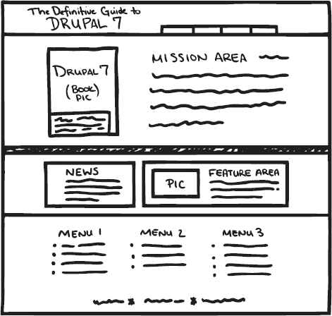

***图 1-1.** 餐巾纸上的线框图草图。第 9 章 提供了制作精美线框图的资源，但线框图也可以是简单的手绘草图。*

将绘制线框图作为第一步且独立的步骤来践行，有助于确保你不会过早地封闭自己的选择。在使用 Drupal 时，很容易从计划*做什么*滑向计划*如何做*——甚至直接开始配置它。Drupal 可以（并且经常）被用作快速原型制作工具，但应坚持划分阶段——现在还不是构建网站的时候。事实上，在信息架构阶段，是否使用 Drupal 来构建网站还不应是已成定局的事。

 **提示** 作者们热爱 Drupal，但就连他们也承认，用一个单页面的网站就用上 Drupal，好比设置一台投石机只是为了递给某人一个芒果。


##### 设计

在进行设计时，请记住 Drupal 网站是动态的。一个 Drupal 设计（或在实施时称为*主题*）会识别出每个页面都包含区域，例如页眉、左侧边栏、主内容区、页脚等。快速浏览需求可知，网站需要一个侧边栏来显示最新添加的文章和评论（需求 #6）。因此，包含最新评论列表的这个区域（侧边栏）在评论标题增多或变长时需要能够扩展。这就是为何应先确定功能；功能需求所指定的网站动态区域，应反映在设计所依据的线框图中。

对于 DGD7 网站，创建一个与 Apress 风格一致的专业且易于阅读的设计是合理的。主题化将在第 15 章和第 16 章中讲述；这里需要注意的重要一点是，你用图形程序所做的设计*并非*一个主题。它只是一张图，描绘了网站构建并完成主题化后应有的样子。

Drupal 将外观与功能分离，设计阶段不必按此顺序进行。先构建网站，然后在主题化阶段之前或甚至作为其一部分直接进行设计，可能是一种可行的方法（这正是简介中的顺序）。无论何时进行设计，网站都应在主题化之前，基于其功能需求和线框图来构建（参见图 1-2）。

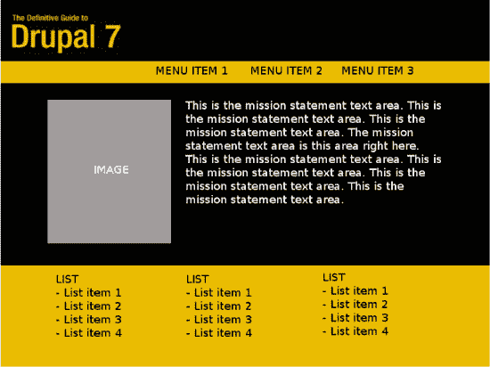

***图 1-2.** DGD7 首页的模型图。它并非一个可运行的网站，甚至不是 HTML；它仅仅是一个设计，一张图片。（首页有特殊布局，将最新评论放在主内容下方，而非侧边栏中。）*

 **注意** 设计通常是项目生命周期中的第三步，但由于 Drupal 将外观与内容及功能分离，它可以与实现网站功能并行进行。

### 实施

现在进入关键环节。实施阶段将在本章剩余部分讲述。它包括安装和配置 Drupal，以实现前期阶段的规划。实施之后，网站构建的后续阶段通常分为以下三个：

*   *内容暂存：* 内容的编写和上传，这通常是网站发起人的责任（在网站构建者的指导下进行）。
*   *质量保证：* 网站的测试，应由网站构建者和网站发起人共同完成。
*   *部署与上线：* 将网站或服务推向世界，面向其目标受众和用户。

实施后的阶段将在后续章节中更详细地讲述（特别是部署与上线，见第 12 章）。

 **提示** 大型项目可以重复这些基本步骤的迭代来完成，从发现阶段到部署阶段。当你为网站添加功能时，你会一次又一次地遵循这些步骤。

#### 安装 Drupal

要开始构建任何 Drupal 网站，首先需要安装 Drupal。多种操作系统（Linux、Windows、Mac OS X）、Web 服务器（Apache、IIS、Nginx）和数据库（MariaDB/MySQL、PostgreSQL、SQLite）的组合都支持 Drupal。附录 F 到 I 介绍了在多种操作系统上设置 Web 服务器和数据库的方法。让我们继续有趣的部分。

##### 放置文件

Drupal 核心作为 Drupal.org 上的一个项目托管，与数千个相关的贡献项目一起。虽然 Drupal.org 提供了直接下载链接，你也可以从其项目页面 [`http://drupal.org/project/drupal`](http://drupal.org/project/drupal) 下载 Drupal（参见图 1-3）。与所有其他项目一样，它有推荐的版本，你可以从中下载 Drupal 7 的最新稳定版。

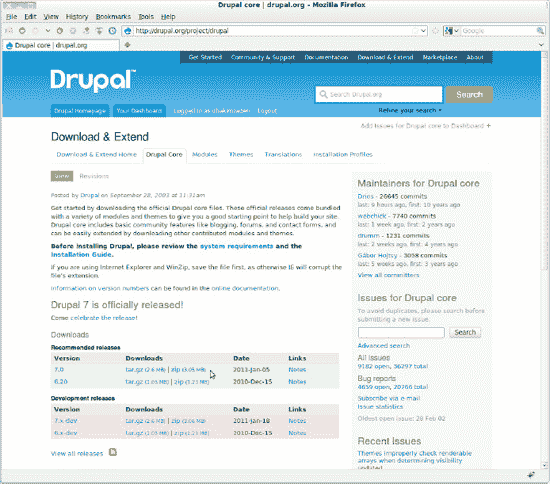

***图 1-3**. Drupal 的项目页面*

文件的存放位置取决于你选择的 Web 服务器设置（参见 `dgd7.org/install`）。无论你将 Drupal 文件解压到何处，能够看到 `index.php` 和 `.htaccess` 文件的位置就是我们所说的 Drupal 根目录或 web 根目录。

 **提示** 最佳实践是为项目（此处为 `dgd7`）创建一个目录，并将 Drupal 核心作为子目录（例如 `dgd7/web`）放入其中。这样可以轻松地将与项目相关的所有内容（包括不应从 web 访问的内容）一起纳入版本控制（参见第 2 章）。

然后，进入你的 Drupal 根目录，将 `sites/default/default.settings.php` 文件复制一份为 `sites/default/settings.php`（复制，不要移动），并更改新 `settings.php` 文件的权限，使其可被 Drupal 写入。同时，创建 `sites/default/files` 目录，并使其可被 Web 服务器写入。特定操作系统的安装说明详见附录 F 到 I；更多资源请参见 `dgd7.org/install`。

 **提示** 不要因为设置过程中的任何困难而气馁。真的。安装可能最困难的部分。本书剩余的 800 多页内容可以证明这是可行的，请不要放弃。


##### Drupal 的自动安装程序

现在，在浏览器中加载你的 Drupal 根目录（具体地址取决于你的本地托管环境）。对于推荐的 Ubuntu 指南，DGD7 网站位于 [`http://dgd7.localhost;`](http://dgd7.localhost;)；而对于 WAMP、MAMP 或标准 LAMP 环境，则可能是 [`http://localhost/dgd7/web`](http://localhost/dgd7/web)。你将被自动重定向到 `install.php`，即 Drupal 的自动安装程序。

选择标准安装配置文件（精简安装配置文件甚至不会为你创建管理员角色）。点击浏览语言页面；除非你事先按照 `drupal.org/localize` 上的说明获取了文件（或者更好的做法是，从本地化就绪的 Drupal 发行版 `drupal.org/project/l10n_install` 开始），否则它不会提供任何选项。

在下一个屏幕上输入你的数据库设置（即你创建数据库时提供的值）。或者，你可以选择 SQLite，并告诉 Drupal 使用一个你的 Web 服务器可写的目录，然后 Drupal 会为你创建一个 SQLite 数据库。（目前，作者不建议将 SQLite 用于重要的生产环境部署，但它非常适合轻松入门。）提交表单，Drupal 将自行安装！

安装完成后（可能需要几分钟），你将能够填写一些基本网站详细信息，并创建一个用户名和电子邮件地址，并附上适合管理员用户（称为站点维护账户）的凭据。

 **警告** 安装过程中创建的第一个用户被赋予永久执行网站上所有操作的权限。因此，建议你*不要*将此站点维护账户用作你的个人账户。该网站目前可能只运行在你的计算机上，但当你将其迁移到线上时，你会希望保留这些用户账户。有关 Drupal 安全性的更多信息，请参阅第 6 章，其中包括关于强密码以及处理 Drupal 每个账户唯一电子邮件地址要求的建议。

恭喜，你现在拥有一个 Drupal 站点了！然而它……完全是空的。目前还没有任何内容，而 Drupal 7 很贴心地告诉你，你的首页为空，因为没有首页内容（请参阅图 1-4）。（首页内容，顾名思义，是指被标记为“推广到首页”的内容。）不过，在开始创建内容之前，我们先来看看管理菜单。

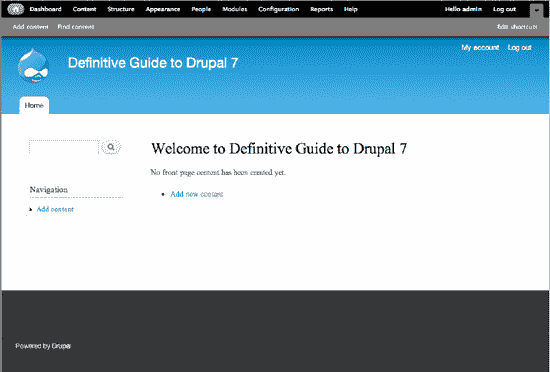

***图 1-4**. 你全新的空白首页，顶部包含 Drupal 工具栏和快捷栏*

### Drupal 的管理菜单

Drupal 的管理菜单（请参阅图 1-5）让你能够管理 Drupal 站点的方方面面。标准安装配置文件会安装工具栏模块，该模块会将管理菜单的主要部分放置在站点每个页面的顶部。通过工具栏，你可以执行以下操作：

*   查找和添加内容。
*   构建影响网站结构的内容。
*   添加并启用主题以更改网站外观。
*   管理哪些人可以登录你的网站及其权限。
*   通过添加和启用模块来扩展网站功能。
*   更改默认设置和所有内容的配置。
*   查看关于站点不同方面状态的报告。
*   获取关于所有这些主题和任务的帮助。

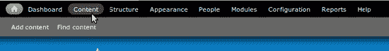

***图 1-5.** Drupal 7 在工具栏中的管理菜单，其下方为快捷栏*

其他模块可以向管理菜单添加链接。实际上，同样包含在 Drupal 核心中并由标准安装配置文件启用的仪表盘模块，提供了一个可配置的网站活动概览，并向工具栏添加了仪表盘链接。

快捷模块会在工具栏下方添加一个可隐藏的栏，其中包含指向你想即时访问的任何页面的书签。你可以在*管理*  *配置*  用户界面  快捷方式（`admin/config/user-interface/shortcut`）创建多组快捷链接。管理员可以设置用户在用户的快捷方式选项卡（例如，对于 ID 为 7 的用户，路径为 `user/7/shortcuts`）中看到的快捷方式集。或者，你可以在管理  人员  权限（`admin/people/permissions`）中，授予某个角色中所有人员“选择任意快捷方式集”的权限，让他们选择自己的快捷方式集。（角色和设置权限将在本章后面介绍。）快捷栏对拥有“使用管理工具栏”权限的角色中的用户可见；如果他们看不到工具栏，则无法使用快捷方式。

 **提示** 与所有核心模块一样，快捷栏在内置帮助（`admin/help/shortcut`）以及在线文档（[`http://drupal.org/documentation/modules/shortcut`](http://drupal.org/documentation/modules/shortcut)）中都有更多说明。

### 外观：更改核心主题的颜色方案

使用主题，你可以快速轻松地更改 Drupal 网站的整体外观和感觉。DGD7 网站计划的设计方面要求网站具有简洁、专业的视觉效果，并采用 Apress 书籍的黑黄配色方案。你可以在管理  外观（`admin/appearance`）中查看你网站可用的主题（目前只有核心主题）。这些主题——以及更重要的是，如何创建你自己的主题——将在第 15 章中介绍。

 **提示** Drupal 提供许多免费主题。浏览 `drupal.org/project/themes` 并通过与 7.x 版本的兼容性进行筛选。其中一个主题，Corolla（`drupal.org/project/corolla`），原本是为了包含在 Drupal 7 核心中而构建的（但后来被认为未经充分审查，未能及时纳入核心下载包）。

Drupal 7 新的默认主题 Bartik，集成了颜色模块。这使得无需接触任何代码即可更改配色方案（请参阅图 1-6）。通过点击设置链接，你可以选择一个新的配色方案。选择 Slate，这是一种柔和且中性的配色方案（在 Drupal 社区要求蓝色之前，它本是 Bartik 的预期默认配色方案）。

Slate 不会包含设计中要求的黄色，但它会很简洁，不会分散注意力。在第 15 章中，你将学习如何创建主题。目前，Bartik 主题提供的布局和区域与线框图一致，因此你可以继续构建网站。

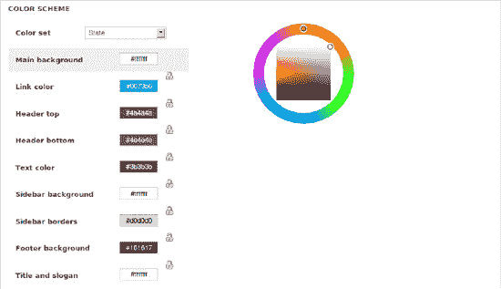

***图 1-6**. 在 Bartik 主题设置中选择不同的配色方案*

 **警告** 试图通过颜色模块诱人的用户界面（UI）来创建自己的配色方案，这很可能会让你的网站看起来不够专业。除非你确定自己在做什么——或者你根本不在乎——否则请坚持使用预设的配色方案。

### 使用模块扩展功能

模块可用于扩展 Drupal 的特性和功能。核心模块是包含在 Drupal 主下载包中的模块，你无需安装额外软件即可启用其功能。贡献模块（成千上万）可在 `Drupal.org` 上获取（请参阅第 4 章）。在本书的后面部分，你甚至会学习如何创建自己的模块。目前，启用核心模块是一个很好的起点。你可以在管理  模块页面（`admin/modules`）上执行此操作。


#### 允许用户通过 OpenID 注册和登录

勾选 OpenID 模块旁的复选框，然后点击底部的`保存配置`按钮提交表单即可启用该模块（参见图 1-7）。


***图 1-7**. `admin/modules`页面表单中的 OpenID 模块行*

 **注** 在模块管理页面的“核心”分类下，你会发现核心模块按字母顺序排列（按系统名称排序，可能与显示名称不同）。随着更多贡献模块添加到该页面，使用浏览器的页面内搜索功能（通常通过`Control+F`或`Command+F`调用）可能是查找所需模块最快的方式。

OpenID 无需额外配置——用户现在即可使用其 OpenID 账户进行注册和登录。（OpenID 是一种用于用户身份验证的去中心化标准，允许用户使用同一数字身份登录不同服务。任何拥有 Google、Yahoo、LiveJournal、Wordpress.com、MayFirst.org 或 AOL.com 账户的用户都拥有 OpenID；而 MyOpenID.com 和 Yiid.com 等专门的 OpenID 提供商则提供免费注册。更多信息请参见 `openid.net`。你也可以自行托管 OpenID，Drupal 有对应的模块，地址为 `drupal.org/project/openid_provider`。）

 **警告** 当你的网站上线时，你需要安装反垃圾模块（关于 Captcha、Mollom 和 Antispam 等选项的简要介绍，请参见第 4 章），或者关闭用户自主注册功能（Drupal 默认启用该功能，但账户需要管理员批准）。使用验证码时，出于无障碍考虑，建议采用文本谜题或带有音频替代的图片形式。

#### 禁用不需要的模块

关于 Drupal 的介绍大多围绕如何启用模块以释放新功能，但知道何时禁用模块也同样重要。禁用不需要的模块可以降低网站的复杂性，方便你（网站构建者）管理，同时提升网站的性能和扩展性。我们将禁用两个模块：Color 和 Overlay。

你之前已经使用 Color 模块设置了 Bartik 主题的配色方案，现在不再需要它了。抵制诱惑！Overlay 模块很容易导致工作成果丢失（参见注）。通过管理  模块（`admin/modules`）页面，取消勾选这两个模块名称旁的复选框，然后点击底部的`保存配置`按钮提交表单即可禁用它们。

 **注** 为什么要禁用 Overlay？如果你的网站用户在 Overlay 中向添加内容表单（例如 `node/add/page`）输入了一篇千字长文，随后在提交前点击了“关于文本格式的更多信息”链接，那么所有输入的内容都将永久丢失。在没有 Overlay 的情况下，像 Firefox 这样的优秀浏览器通常会保留标签页中输入的所有数据。不小心点了一个链接？按一下后退按钮就能回到你之前写的内容。关闭了标签页？按 `Control+Shift+T` 就能恢复它——连同你输入的所有数据。但使用 Overlay 时，一次误点击就会导致管理表单的更改或未提交的帖子丢失。（目前已有针对此行为的修复方案，请参见 `drupal.org/node/655388`。如果某个问题被标记为“已在 Drupal 7 中修复”，则该修复将包含在该日期之后的 Drupal 7 下一个版本中。）如果你正在使用 Overlay，至少在创建和编辑内容时应禁用管理主题（该主题使用 Overlay）；相关选项位于管理  外观（`admin/appearance`）页面底部。你也可以在用户的编辑表单（例如 `user/86/edit`）中为单个用户禁用 Overlay。

### 创建内容类型并添加内容

作为世界级的内容管理系统，Drupal 在内容管理方面自然表现出色。Drupal 网站上的每一条内容都属于某一种内容类型，并且你可以根据需要创建任意数量的自定义内容类型。内容类型使网站编辑者能够轻松更新内容，而你作为网站构建者，可以确保这些内容以正确的方式呈现在正确的位置。

所有内容都具有标题、创建日期和作者（网站上的用户）等属性。内容类型决定了内容是否包含正文（主文本）字段、是否允许评论以及其默认设置是什么。最棒的是，内容类型可以拥有任意数量的字段，包括文本和数字字段、文件和图片字段、列表和选项字段以及分类。你为某内容类型配置的特定字段集合将对该内容类型的所有内容生效。

好的，作为高级文档工程师和翻译员，我将遵循您提供的注意事项和示例，为您翻译以下文本。


### 创建“建议”内容类型

对于本网站，注册用户应能针对本书后续版本应涵盖的概念提出建议。为此，我们将创建一个名为 `Suggestion` 的新内容类型，并授予注册用户创建此类型内容的权限。为了让用户能够对他们的建议进行分类（例如：技巧、警告、轶事、模块建议等），我们还将创建一个分类词汇表，并将其附加到此内容类型上。（这些将在下面进行说明！）

要创建 `Suggestion` 内容类型，请点击管理工具栏中的 `Structure`，然后选择 `Content types`。在接下来的页面中，点击 `+ Add content type`。

**注意** 本书通常会通过面包屑导航路径来引导您到某个页面，并在括号内附上您可以直接在浏览器地址栏中输入的相对路径。例如：`Administration > Structure > Content types > Add content type` (`admin/structure/types/add`)。

将您的新内容类型命名为 `Suggestion`，并在描述字段中添加一段简短的描述。描述会显示在 `Add content` 页面 (`node/add`) 上，帮助网站编辑和用户判断某个内容类型是否是她们想要使用的。在此表单的靠下位置，在“提交表单设置”中，您可以输入说明或提交指南，这些内容将显示在内容添加和编辑表单的顶部。您随时可以返回编辑这里的任何内容。没有其他需要更改的设置，而且您将要添加字段，所以请继续点击 `Save and Add Fields` 按钮。

**注意** 对于 `Suggestion` 内容类型，您保留了评论的启用状态；这是在启用 `Comment` 模块时创建新内容类型的默认设置。对于某些内容类型，例如新闻或事件列表，您可能需要禁用评论，这可以在内容类型添加/编辑表单底部的垂直选项卡中的 `Comment settings` 选项卡中进行。

现在，Drupal 会将您带到该内容类型的 `Manage fields` 选项卡，您可以在其中编辑字段、删除字段、对字段重新排序，以及添加新的和已有的字段（参见图 1-8）。(Drupal 允许您在多个内容类型之间共享字段。) 此时，您的内容类型只有两个字段：标题和正文。虽然正文字段是默认创建的，但您可以删除它。标题字段并未完全使用字段系统，并且始终是必填项。

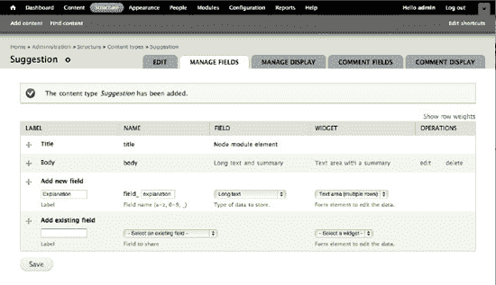

**图 1-8.** 为你的内容类型添加一个新字段。此字段名为 `Explanation`，机器名为 `field_explanation`（`field_` 部分会自动为您添加前缀）。

为了让用户解释他们的建议如何与本书契合，创建一个名为 `Explanation` 的新字段。在 `Add new field` 部分，为你的新字段提供一个标签、字段名称（机器可读的名称），并选择 `long text`（长文本）数据类型。字段标签将显示在编辑表单中该字段旁边；字段名称将在 Drupal 内部标识该字段。使用 `long text`（长文本）数据类型允许用户提交段落；而 `text`（文本）数据类型用于单行输入。

**提示** 字段名称是在 Drupal 中工作的重要组成部分。请注意，一旦设置便无法更改。选择既具有描述性又简洁的字段名称，因为要充分发挥自定义主题的灵活性就需要用到这些字段名称。您将在第 15 章和第 16 章中学习主题化。

点击下一页的 `Save field settings`，因为 `long text`（长文本）字段类型没有设置。（您并不是唯一一个认为 Drupal 应该在这里跳过不必要页面的人，但目前解决此问题的议题已标记为 Drupal 8 版本；`drupal.org/node/552604`。）

在*下一页*上，您可以配置一些设置（参见图 1-9）。您可以将其设为必填字段，这将防止建议作者在未填写该字段时发布建议。添加一些帮助文本，说明您希望该字段是一个解释。将行数设置为仅三行，以暗示解释应该简短。将文本处理设置为 `plain text`（纯文本），因为此字段不关乎呈现形式。（默认情况下，`plain text`（纯文本）和 `filtered text`（过滤后的文本）都会从已发布的内容中去除有潜在恶意的脚本标签。）将“值的数量”保持为“1”（除非您认为人们应该为一个建议提交多个解释！），然后点击 `Save settings`。您的新内容类型就可以使用了。

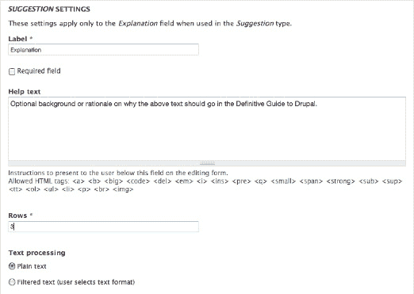

**图 1-9.** 配置长文本字段的设置

### 创建内容

本书侧重于网站构建，而非如何使用 Drupal 站点，但您有时仍然需要创建内容！

#### 添加一个具有人类可读 URL 和主菜单链接的页面

不要让这个冗长的标题迷惑了您；这是一个简单的任务。为了满足创建一个供人们获取购买书籍信息的页面的需求，您可以创建一个静态页面，并通过主菜单链接。您可以使用 Drupal 标准安装配置文件提供的 `Basic page`（基本页面）内容类型。首先，进入 `Add content > Basic page` (`node/add/page`)。

**7 中的新功能** `Add content` 链接（在 Drupal 6 中曾是 `Create content`）可通过工具栏下方的快捷栏、内容管理页面以及导航菜单访问。

为新页面取一个标题，例如 `Buying the Definitive Guide to Drupal 7`，并在正文中添加指向该书的链接。Powell's 和 Amazon 提供了可复制粘贴的联盟营销链接。要在文本中嵌入图像或进行其他特殊格式化，您需要将正文字段的文本格式更改为 `Full HTML`。

接下来，在表单底部巧妙的垂直选项卡中，转到 `Menu settings`（菜单设置）并勾选“提供菜单链接”（参见图 1-10）。提供一个标题（链接的文本）、一个描述（当用户将鼠标悬停在链接上时看到的工具提示），以及一个“较重”（即正数）的权重，以便将其放置在所选 `<Main menu>` 的右侧，这样就可以了。

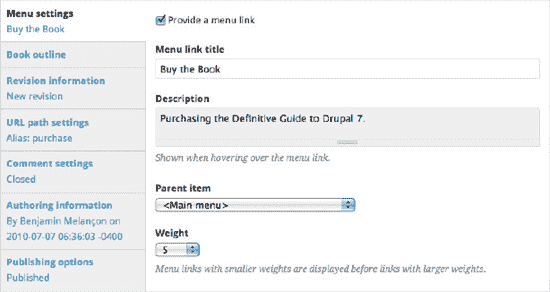

**图 1-10.** 为基本页面添加菜单链接

在 `URL path settings`（URL 路径设置）选项卡中，为此文章添加一个用户友好的 URL（例如，用户在浏览器地址栏中看到的将是这个而不是 `node/1`）。将 URL 别名设置为 `purchase`。（图 1-10 显示了已完成此项操作的摘要。）

**注意** 您可能会注意到在图 1-10 中，修订信息显示“新修订版”。当您首次创建内容时，这没有任何意义，但最佳实践是让您的内容类型默认创建新修订版。有关使用 `Content Type Overview` 模块一次性为所有内容类型设置此设置和其他设置的描述，请参见第 4 章。

保存新内容，您将看到您的链接出现在主菜单栏中“主页”的右侧。


#### 添加文章并置顶到首页

网站规划要求首页顶部有一段书籍简介，该简介需始终位于其他首页文章之上。在 Drupal 中，您可以通过管理菜单实现此操作：以“基本页面”类型添加内容。填写您想要的标题和正文。在“发布选项”下，勾选两个默认未选中的选项：`“推荐文章到首页”` 和 `“列表顶部置顶”`（参见图 1-11）。现在，您的内容已被推荐到首页。`“列表顶部置顶”` 意味着当添加新内容时，该文章会“固定”在列表页面（例如默认的首页）的顶部（通常情况下，最新发布的内容会显示在最前面）。

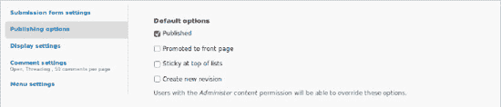

**图 1-11.** 默认基本页面的发布选项

 **注意** Drupal 新手常问的一个问题是“我的内容去哪了？”，因为如果在创建内容后未将其推荐到首页，首页就会一直保持空白。在标准安装配置中，`Basic page`（基本页面）内容类型默认不会设置为推荐到首页。您始终可以通过管理菜单中的 **Content**（内容）选项（`admin/content`）查看 Drupal 网站上的所有内容。

### 区块：创建使命宣言

`Block`（区块）是可以在主题区域中显示的信息片段。区块形式多样，通常呈现为动态信息列表或菜单。Drupal 7 提供了一些默认区块；您可以在管理菜单的 区块页面中找到它们：管理  结构  区块（`admin/structure/block`）。区块页面会显示所有可用的区块以及它们可以被放置的各个区域。如果您启用了多个主题，可以为每个已启用的主题配置区块（您也始终可以为管理主题配置区块，且无需启用该主题即可使用）。

网站的第三个要求是首页需要有一个醒目的使命宣言。要实现这一点，您可以创建一个自定义使命宣言区块。再次进入管理  结构  区块，这次点击“添加区块”。在区块描述字段中，填写 `“使命宣言”`（此内容不会展示给网站访客）。区块标题留空。在区块正文中，写下使命宣言（参见图 1-12）。

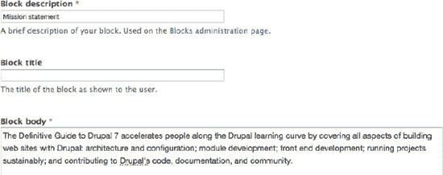

**图 1-12.** 自定义区块的添加/编辑格式（用于添加新区块）`admin/structure/block/add`

 **7 版本新特性** 自 2002 年 4.0 版本以来，Drupal 所有先前版本都在“站点信息”下设有专门的使命宣言字段配置。Drupal 7 摒弃了这种特殊字段的配置方式，转而采用了这种更灵活的方法。

向下滚动表单到“区域设置”，将此新区块放置在 `Highlighted`（高亮）区域；Bartik 主题为类似使命宣言的内容提供了此区域，效果会很不错。在“可见性设置”下，进入“页面”垂直选项卡，将“在特定页面显示区块”设置为 `“仅限所列页面”`，并在文本区域中输入 `<front>`（参见图 1-13）。

 **提示** 不同主题的区域名称可能不同，因此如果您更换主题，可能需要为您的区块重新指定正确的区域。

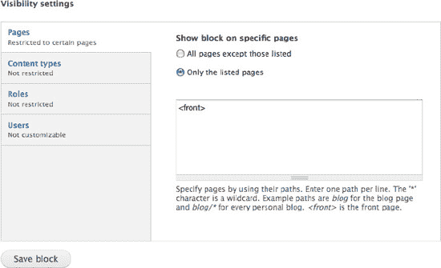

**图 1-13.** 使命宣言区块的可见性设置

最后，点击 `Save block`（保存区块）按钮提交表单。

 **提示** Drupal 不仅允许您针对特定页面设置可见性，还可以针对内容类型和用户角色进行设置。例如，当您只想在博客页面上显示最新博客条目列表，而不希望在其他地方显示时，这个功能就非常有用。

DGD7 网站的要求之一是，每页的侧边栏都应能显示参与者最新贡献的文章和评论（参见图 1-14）。您只需将 `Recent content`（最新内容）和 `Recent comments`（最新评论）区块拖拽到 `Sidebar first`（第一个侧边栏）区域（或为每个区块在下拉菜单中选择该区域），然后保存页面，即可完成此项要求的勾选（参见图 1-15）。

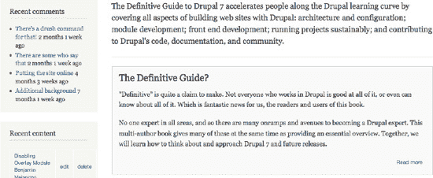

**图 1-14.** 首页包含最新评论、使命宣言区块以及第一篇内容。

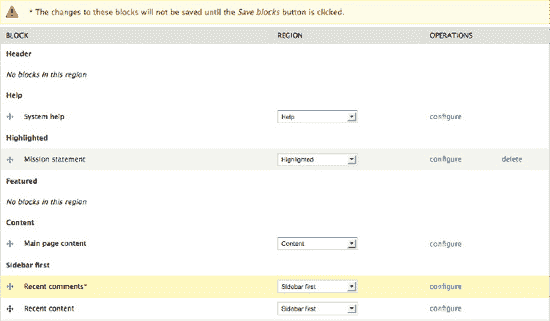

**图 1-15.** 区块管理页面，`Recent comments`（最新评论）区块已在 `Sidebar first`（第一个侧边栏）区域启用，但表单尚未保存。

 **警告** 自定义区块可以被删除，且无法撤销。请确保您不会在只想暂时禁用区块或仅为特定主题禁用区块时，错误地删除了它。删除链接是直接可见的；要禁用区块，请将区块的区域更改为 `None`（无）或 `Disabled`（已禁用）。


### 分类法：对内容进行分类

使用核心模块`分类法`，`Drupal` 可以让你轻松地对内容进行分类。你可以定义自己的词汇表（分类术语的分组），并为每个词汇表添加术语。词汇表可以是扁平的或分层的，可以允许单选或多选，也可以设置为“自由标签”（这意味着在创建或编辑内容时可以即时添加新术语）。然后，每个词汇表都可以关联到一种或多种内容类型；这样一来，你网站上的节点就可以按照你选择的任何方式被分组、打标签或分类。

 **提示** 对内容应用分类术语的一个主要用途是，具有相同术语的内容可以被集中列出。`Drupal` 核心在路径 `taxonomy/term/8` 默认提供了此功能，其中 `8` 是分类术语的 ID。（当你点击某条内容上的一个术语时，就会跳转到这个路径——它会列出该条内容以及所有其他包含此术语的内容。你可以用更多方式来使用分类法展示内容（关于其中最重用的方法——视图，请参阅第 3 章）。例如，你可以列出按格式和主题分类的活动，或者按音乐流派排序的专辑列表。

让我们回到要求：注册用户应能够分享针对本书的建议，例如提示或警告、关于 Drupal 的趣闻轶事，或者应该涵盖的概念。你已经创建了`建议`内容类型；现在你需要让它能够被分类。

为了组织作者将为本书接受的所有不同类型的建议，请前往管理  结构  分类法 (`admin/structure/taxonomy`)。接着，点击`+ 添加词汇表`创建一个新的词汇表。输入一个逻辑名称；此处可以是`图书元素`。点击自动生成的机器名称旁边的编辑链接，将其缩短为 `element`，如图 1-16 所示。在可选的描述文本字段（仅用于管理界面）中，输入类似于`本书中包含、或建议加入本书的内容或概念`的内容。

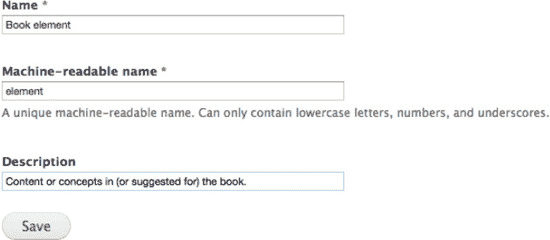

**图 1-16**。使用`分类法`模块添加`图书元素`词汇表

现在，你可以通过点击`+ 添加术语`链接向此词汇表添加分类术语。添加以下术语：

*   提示
*   注释
*   陷阱
*   警告
*   现实
*   Drupal 7 新功能
*   概念
*   轶事

接着，创建另一个名为`状态`的词汇表，并向其添加以下术语：

*   别浪费像素了
*   如果版面允许
*   计划加入
*   已收录

现在，你需要为每个词汇表向你的`建议`内容类型添加一个字段。这样，当人们添加建议时，选择这些关联分类术语的选项就会出现在标题和正文字段附近。

前往管理  结构  内容类型，并点击你的`建议`内容类型的`管理字段`链接。在`添加新字段`下，为新字段的标签输入`图书元素`，字段名称输入 `element`，数据类型选择`术语引用`。这最后一个选择会在最后一列弹出选项；对于表单元素，选择“复选框/单选按钮”，如图 1-17 所示。点击`保存`。


**图 1-17**。使用术语引用字段将词汇表添加到内容类型

 **注** 如果“`复选框/单选按钮`”字段的`数值数量`限制为仅一个值，则它将显示为单选按钮。如果可以有两个或更多值，或者不限数量，则会显示为复选框。

在保存后跳转到的配置页面上，选择名为`图书元素`的词汇表，并点击`保存字段设置`。在下一页上，勾选`必填字段`并保存页面。

 **提示** Drupal 7 的新功能是，通过添加一个引用同一词汇表的新字段，可以将同一个词汇表两次关联到同一个内容类型。例如，这允许将`位置`词汇表同时用作`产品`内容类型的出发地和目的地。

按照添加`图书元素`字段的相同步骤，为`状态`词汇表向`建议`内容类型添加一个`状态`术语引用字段。这次，通过保持`必填字段`复选框未选中，使该字段成为可选项。

完成此操作后，你可以通过点击`添加内容`（在默认的快捷栏中）然后选择`建议`来进行测试。你会看到标题的文本字段、正文和说明的文本区域，以及分类术语的单选按钮。很酷！

你可以通过返回内容类型的字段管理页面（管理  结构  内容类型  管理  建议  字段 (`admin/structure/types/manage/suggestion/fields`)) 来调整这些字段的顺序。使用交叉图标上下拖动字段。这会影响`建议`添加和编辑表单上的字段顺序（显示时的字段顺序可以在“显示字段”选项卡中独立更改）。别忘了点击`保存`。

现在，DGD7 的注册用户已经可以添加建议并对其进行分类了。或者他们能吗？在 Drupal 中，直到你配置好权限，一切才算完成。


### 用户、角色与权限

Drupal 将您网站的每位访客视为一个*用户*。您可以通过*角色*为用户分配权限。Drupal 支持多种角色，且每个用户可被分配一个或多个角色。

 **注意** Drupal 7 力求礼貌，在其管理区域中使用“人员”一词，但更准确地说，使用网站的人应称为“用户”。您将添加*用户*并进行*用户设置*。

Drupal 的标准安装初始包含以下三个角色：

*   *匿名用户：* 未登录您网站的任何访客。
*   *已认证用户：* 已登录您网站的任何访客。
*   *管理员：* 启用新模块时自动获得所有权限的角色。

前两个角色无法删除；它们是 Drupal 运行所必需的。管理员角色可以删除，但建议不要这样做。如果您确实删除了它，或者使用最小安装配置文件安装了 Drupal，您可以在管理  配置  人员  账户设置（`admin/config/people/accounts`）处选择哪个角色将作为管理员角色。

关于角色更有趣的一点是，您可以创建任意数量的自定义角色。每个角色都可以被分配特定的权限，以控制该角色下的用户在网站上能做什么或不能做什么。例如，如果您有内容编辑人员，他们应该能够添加或编辑内容，但不能处理其他管理任务，您可以创建一个名为“编辑”的角色，并为其分配适当的权限。

 **提示** 将权限授予已认证用户角色意味着所有其他角色都将获得该权限。但请注意，将权限授予匿名用户角色并*不*意味着已认证角色或任何其他角色拥有该权限。匿名用户角色与已认证用户角色是完全分开的。所有其他角色都要求用户登录才能拥有该权限，因此它们*继承*了授予已认证用户角色的权限。

在 DGD7 网站上，所有已注册或已认证的用户都应该能够提交建议，并编辑或删除他们自己的建议，但不能编辑或删除他人的建议，也不能添加其他类型的内容。作者应该能够添加任何类型的内容并编辑章节内容。让我们为图书作者实现这一点。

首先，您需要添加一个作者角色。这可以在管理  人员  权限  角色（`admin/people/permissions/roles`）处完成。在人员管理页面上，“权限”是最右侧的选项卡，而“角色”在其下一级选项卡中（在您点击“权限”选项卡之后）。在现有角色下方的文本字段中，输入 `author` 并点击**添加角色**按钮，如图 1-18 所示。

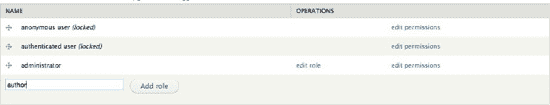

***图 1-18**. 角色管理界面。您的网站上可以有多个角色。*

接下来，您需要为角色分配*权限*，以告知 Drupal 拥有该角色的用户可以在网站上做什么或不能做什么。为了让您的网站拥有可以被分配角色的用户，您需要允许匿名用户注册（在 `admin/config/people/accounts` 配置），或者您需要在 `admin/people/create` 处自行添加用户。

对于 DGD7 网站上的建议，已注册或已认证的用户应该能够提交建议，但在筛选建议时，“状态”字段应保留给图书作者。第 8 章 将介绍字段权限模块，以实现更细粒度的权限控制——使您刚刚创建的“状态”词汇字段仅对作者和管理员可用。

要分配权限，您可以点击新创建角色旁边的“编辑权限”链接来编辑该角色的权限，或者通过点击返回“权限”选项卡来同时编辑所有角色的权限。勾选用户角色列中相应的复选框将授予特定于角色的权限。这将允许“作者”角色中的所有用户在登录后执行指定的操作。用户可以有任意数量的角色，并且权限会累加。

要完成“建议”的要求，请向下滚动到“分类”部分，允许作者编辑和删除*状态*中的术语。作者还需要以下权限：

*   访问内容概览页面。
*   创建新的基本页面内容。
*   编辑自己的基本页面内容。
*   编辑任何基本页面内容。
*   创建新的建议内容。
*   编辑自己的建议内容。
*   编辑任何建议内容。
*   使用管理页面和帮助。
*   使用管理工具栏。

配置好作者角色权限后，您可以将用户分配到该角色。点击管理菜单中的“人员”将显示已在网站上注册的用户列表。您可以通过“+ 添加用户”链接为用户创建帐户。在创建新用户帐户时，您可以为该用户选择角色，并请求 Drupal 向该用户发送电子邮件通知其帐户已创建。（请注意，在网站上线之前，人们无法使用您的网站，也可能无法收到来自网站的电子邮件；参见第 12 章。）

 **提示** 您可以通过勾选选定的用户并从“更新选项”下拉菜单中选择适当的选项，一次性为多个现有用户添加或移除角色。参见图 1-19。

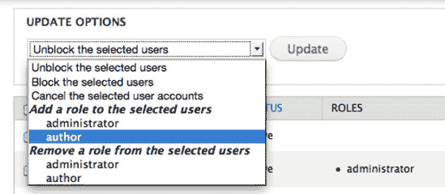

***图 1-19**. 在管理菜单下的“人员”页面上，轻松地为多个用户同时更改或添加角色*

### 是时候喝杯庆祝饮料了

恭喜您，您刚刚使用 Drupal 7 构建了一个网站！想到您只是触及了皮毛——您还没有为 Drupal 的核心功能添加一个贡献模块——可能会感到不知所措，但完全不必担心。学习 Drupal 的最佳方式就是安装它并开始尝试。这正是第 1 章 的全部内容。

您规划并构建了一个网站。具体来说，您：

*   在本地安装了 Drupal 7 并配置了一个核心主题。
*   创建了新的内容类型和分类词汇表来对其进行分类。
*   配置了区块并创建了一个自定义区块作为使命宣言。
*   启用和禁用了选定的核心模块。
*   创建了一个角色并配置了权限，让作者和访客在添加和编辑内容时拥有不同级别的访问权限。

在下一章中，我们将介绍一些在高级层面使用 Drupal 工作的基本工具：Drush 和 Git。（关于优质工具的重要话题将在第 12 章 中继续，该章涵盖如何设置您的开发环境）。在第 3 章 中，您将超越 Drupal 核心，使用功能强大且多功能的 Views 项目。 第 4 章 提供了一些可用于 Drupal 7 的贡献扩展（称为模块）的概览，以及关于如何选择使用哪些模块的一些建议。掌握这些新知识后，构建 DGD7 网站的工作将在第 8 章 中正式开始。

 **注意** 有关本章的更多资料和问题，请访问 `dgd7.org/firstsite`。

## 第 2 章


## 必备工具：Drush 与 Git

**作者：DaniNordin 与 Benjamin Melançon**

> *“没有知识，就没有力量。”*
> 
> ——拉尔夫·沃尔多·爱默生

无论是构建网站、开发主题或模块，还是试图制作一个能驱动你汽车的 Drupal 发行版，`Drush`（Drupal 命令行工具）和 `Git`（开源版本控制系统）都能帮助你快速而安全地到达目的地。本章将简要介绍 `Drush` 与 `Git`，然后帮助你开始使用这些强大的工具。如果你已经熟悉 `Drush`，或希望深入了解它的所有功能，请参考第 26 章“Drush”。

`Drush` 很容易解释。它能让你以快得多的速度执行各种重复性的 Drupal 任务。需要更新代码？使用 `drush up`。需要下载新模块？使用 `drush dl 模块名`。其余的工作——通常在一两分钟内——都由 `Drush` 完成（见 图 2-1）。

`Git` 可能稍微难解释一些。简短的解释是：如果你还没有使用版本控制，那你需要开始用了。如果你是比较较真、凡事都需要理由的那类人，这里有稍微详细一点的解释：你是否曾想过为生活提供一个“撤销”或“倒带”按钮？这就是版本控制。备份工作的最佳方式是使用一个配置妥当的版本控制系统（VCS），并持续用它记录文件或文件集随时间的变化，以便日后可以回退或比较特定版本。

像大多数开发者一样，我们最初的网站是在没有版本控制的情况下构建的。也像大多数开发者一样，我们都有那么一两个小灾难的故事——从导致网站在 Internet Explorer 中出错的改动，到不小心删除了三天的工作成果。但你们可以受益于我们的经验，我们要让你从一开始就走上正轨。不过，在深入探讨之前，我们需要打好一些基础。你需要安装 `Drush` 和 `Git`。

 **提示** 你也可以用 `Git` 来追踪非 Drupal 项目的变更，甚至是一个仅包含单个文件的文件夹。

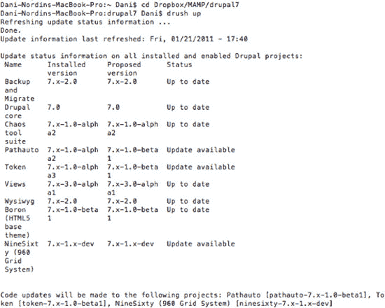

***图 2-1.** 使用 `drush up` 命令升级 Drupal。总共耗时？大约 30 秒。手动操作？15 分钟到几个小时，具体取决于需要升级的模块数量。*

### Drush 安装入门指南

安装并使用 `Drush`——一个让你可以通过两个单词的命令在 Drupal 站点上执行诸如更新模块等操作的神奇命令行工具——其实非常简单。但即使是硬核 Drupal 用户，也常常迟迟未能体验到 `Drush` 的好处，因为他们拖延了那些能让他们生活更轻松的少量前期工作。对于 Drupal 新手，或者那些习惯于图形界面而抵触命令行的人来说，安装 `Drush` 的想法可能会让人望而生畏。

本节提供一个简单的 `Drush` 安装指南。

**开始前须知**

*   你将开始使用命令行。
*   在 Mac OSX 或 Ubuntu 上，你可以打开终端（Terminal）进入命令行。如果你在 Windows 下开发，请参考附录 F 关于搭建 Windows 开发环境的说明，或者考虑为你的 Drupal 开发环境设置一个运行 Ubuntu 的虚拟机（在附录 G 中讨论）。
*   在本练习中，你将专注于本地开发。当处理部署在远程主机上的站点时，你还需要在主机服务器上安装 `Drush` 和 `Git`，并通过命令行登录这些服务器。如果你使用 Mac OSX，Panic 的 Coda (www.panic.com/coda/) 包含一个终端编辑器，可以自动完成此操作。如果你在本地开发，仍需使用终端。
*   无论你是本地安装还是远程安装 `Drush`，务必将其放在你的 Web 根目录（即 Drupal 安装文件存放的位置）**之外**。将包含 `Drush` 的站点放在远程服务器上，可能会让攻击者轻易攻破你的 Drupal 站点。

一旦你安装好 `Drush`（下文介绍），你就可以在包含 Drupal 站点根目录的文件夹内运行许多 `Drush` 命令了。进入命令行后，使用 `cd /path/to/drupal` 命令即可到达该目录（将 `/path/to/drupal` 替换为你的 Drupal 站点在文件系统中的实际路径）。然后你就可以使用 `drush 命令名` 来执行 `Drush` 命令。（如果你在 Drupal 文件夹中运行 `Drush` 命令，`drush` 会指向你安装的默认站点（位于 `sites/default` 中的那个）；如果你在同一安装中运行多个站点，请导航到你的站点目录（`cd /path/to/drupal/sites/example.com`），或者在 `drush` 命令中添加 `-l http://example.com`）。以下是一个使用 `Drush` 下载并启用 Date 模块的示例。第一个命令 `cd Dropbox/MAMP/dgd7` 将你导航到 Drupal 站点文件夹；你系统上的路径会不同：

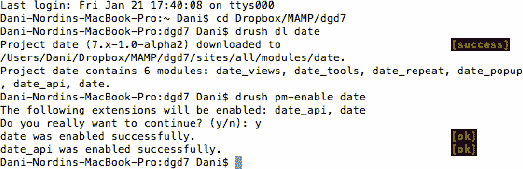

接下来的三个步骤改编自 Laura Scott 的一篇博客文章，并经许可使用；这些步骤将引导你完成 `Drush` 的安装过程。她在 Mac OS X 上（作者们也在该系统上进行开发）安装了 `Drush`，这些说明也适用于任何 Unix 类系统。如果你使用 Windows，请参考附录 F，开始为 Drupal 搭建 Windows 开发环境，或参考附录 G 在虚拟机中运行 Ubuntu Linux（你也可以考虑使用 Cygwin 来模拟 UNIX 环境）。

##### 1. 下载 Drush

从 `drupal.org/project/drush` 获取 `Drush`。`Drush` 适用于所有版本的 Drupal，所以只需找到最新版本并下载即可（参见 图 2-2）。（`Drush` 可能是你最后一个需要手动下载的项目！）

将 tarball 文件放入你的工作文件夹，理想情况下，该文件夹应位于你的 home 目录中。我们在自己的 home 目录下创建了一个名为 `dev` 的工作文件夹。

双击 tarball 文件解压。进入 `drush` 文件夹后，你会看到许多文件，包括 `README.txt` 文件。阅读它！

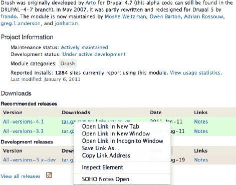

***图 2-2.** Drush 项目页面。你想要的是“Recommended releases”下的最新版本。*

如果你已经熟悉命令行，也可以通过终端完成此操作：复制项目页面上 `tar.gz` 文件的链接，然后在终端中从 home 文件夹输入以下命令（参见 图 2-3）。注意，注释部分用 ** 括了起来。

```
wget http://ftp.drupal.org/files/projects/drush-7.x-4.4.tar.gz
        ；** 下载 Drush tarball - 将 wget 后面的内容替换为当前链接 **
tar xzf drush-7.x-4.4.tar.gz
        ；** 将 tarball 解压到你的文件夹中 **
rm drush-7.x-4.4.tar.gz
       ；** 删除原始 tarball 文件 **
```
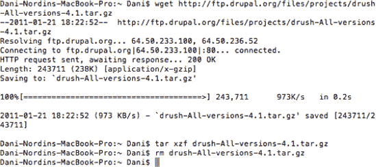

***图 2-3.** 通过命令行安装 Drush。当需要在多台服务器上安装 Drush，或者为新项目安装时，这非常有用。*

##### 2. 使 Drush 可执行

现在你需要进入命令行。我们希望这不会让你感到烦恼，因为 `Drush` *就是*一个命令行工具。

打开你的终端。这会默认打开你的 home 目录，它对应于 Finder 中带有你 Mac 用户名标签的文件夹。

你的 `drush` 路径取决于你放置它的位置。

你需要输入命令 `chmod u+x /path/to/drush/drush`（将 `/path/to/` 替换为你放置 `Drush` 的实际路径）。在我们的例子中，`Drush` 位于 `dev` 文件夹，因此命令是：

```
chmod u+x dev/drush/drush
```

既然你已经让 `Drush` 可执行，接下来你需要完成设置，以便你实际上可以在 `Drush` 文件夹之外（例如，在你构建站点的工作文件夹中）执行 `drush` 命令。


##### 3. 创建别名

这一部分可能看起来有些神秘，但实际上非常简单。你需要在你的 bash 配置文件中添加 `drush` 命令的路径，这样你就可以在文件系统的任何位置运行 `drush` 命令了。

一个便捷的指向家目录的 UNIX 快捷键是 `“~”`（波浪号字符）。你可以在任何路径指定中使用它。

在终端中，在家目录下找到你的 bash 配置文件。如果你不在家目录，请在命令行中输入：

`cd ~`

Bash 配置文件默认是隐藏的，所以要查看家目录中有哪些文件，请输入以下命令：

`ls -a`

你会看到该文件夹中的所有文件列表，类似 图 2-4 所示。隐藏文件以点号 (`.`) 开头，因此请寻找以下文件之一：

`.profile`
`.bash_aliases`
`.bashrc`
`.bash_profile` 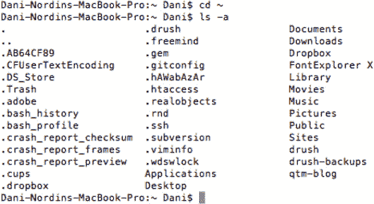

**图 2-4.** 使用 `ls` 命令列出家目录中的文件。

你的 bash 配置文件可以是这四个名称中的任何一个。如果在你的家目录中没有看到这些文件，可以使用 `nano` 编辑器（UNIX 自带的一个极其简单、老式的文本编辑器）创建一个；如果 `nano` 找不到同名文件，它会自动创建该文件。

任意一个都可以，只需选择一个已有的文件即可。（我们选择了 `.bash_profile`。）要编辑该文件，请输入 `nano [文件名]`。对我们来说，就是：

`nano .bash_profile`

这将带你进入编辑器。你可能看到一两行代码。将光标移动到文件末尾；确保你处于新的一行，然后添加：

`alias drush='/path/to/drush/drush'`

将 `“/path/to/”` 部分替换为实际路径——但这次它需要相对于系统根目录。还记得家目录的快捷键吗？现在是使用它的时候了（参见 图 2-5）。

`alias drush='~/dev/drush/drush'` 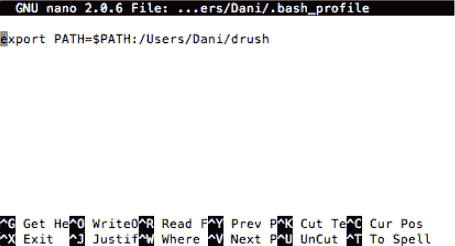

**图 2-5.** 另一种推荐的方法，让你能随时使用 `drush` 命令：将 Drush 文件夹的路径添加到你的 shell 路径中，这同样可以在 `.bash_profile` 或 `.profile` 这类文件中完成。

使用 `<control>-x`、`y(es)`、`<enter>` 保存文件。现在你会回到终端提示符下。

接下来你需要做的就是使用 `source [文件名]` 重新加载更新后的 bash 配置文件。在我的例子中：

`source .bash_profile`

##### 4. 测试

是的，我们说过这是三步。但测试是一个始终存在且不言自明的额外步骤。要测试，请输入：

`drush`

你应该会看到一长串可用的 Drush 命令列表。大功告成！（或者更确切地说，现在你可以开始使用了！）详情请参见 图 2-6。

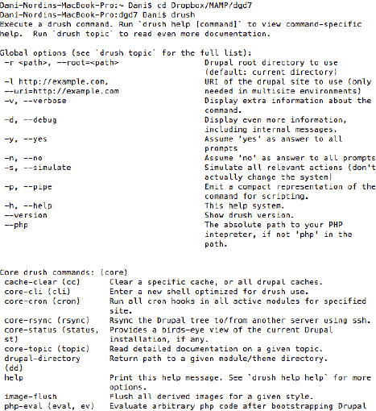

**图 2-6.** 成功！

既然你已经安装了 Drush，你就可以做许多通过 Drupal 界面需要花费很长时间才能完成的事情。首先，确保你的系统上有一个可用的 Drupal 安装，并导航到它：`cd /path/to/drupal`。现在，需要安装一个模块吗？输入 `drush dl projectname`。（请注意，对于 Drush 来说，项目名称是包含模块或模块组的文件夹名称，而不是人类可读的模块名称。例如，如果你想安装 X-ray 模块，请使用它的机器名 `xray`。）需要更新你的代码吗？输入 `drush up`。请务必查看第 26 章，了解 Drush 能做的所有出色的事情（以及如何扩展它来做更多事情）。

### Git：开发润滑剂

持续备份你的工作是任何 Web 开发人员的基本实践。无论你的工作流程是基于下载和安装模块、构建自定义主题还是编写代码，将所有内容置于版本控制之下可以让你专注于进展。你无需担心走错路，因为你随时可以回退。

版本控制就是开发润滑剂。它让一切运行顺畅，并帮助你进入心流状态。第 14 章讨论了如何使用版本控制（也称为修订控制）来达到最佳生产效率的状态。

#### 为什么选择 Git？

有很多不同的版本控制系统可供选择。本书将重点介绍 Git。为什么？因为它是免费的，一旦你掌握了一些基础知识，使用起来就相当（比较）容易，而且 Drupal.org 已经转向使用它。最后这一点意味着，一旦你掌握了 Git，向社区贡献代码将会容易得多。（在掌握 Git 的过程中——这将是一个终身学习的过程——你可以向 Drupal 社区寻求帮助。）

 **注意** 如果你确实选择了其他 VCS，我们强烈建议你选择一个现代的——即分布式版本控制系统（DVCS）。Bazaar 和 Mercurial 都是 Drupal.org 曾经考虑过的（基础设施团队使用 Bazaar），但 Drupal 社区已经用行动投票选择了 Git。换句话说，已经有更多的人在使用 Git。

#### 安装 Git

要安装 Git，你首先需要获取安装程序。你可以在 `git-scm.com` 找到 Git 软件。下载适合你操作系统的安装程序，页面右侧有方便的图标指示（参见 图 2-7）。

 **提示** 如果你使用的是带有包管理器的类 UNIX 操作系统，你可以使用它来安装 Git；请随意跳过本节。例如，在 Debian 或 Ubuntu 上，`sudo apt-get install git` 会为你搞定一切。如果你使用 Mac OS X 并且想要享受包管理器带来的好处，可以设置 Homebrew（`mxcl.github.com/homebrew`），这是 Mac 上最新、最好的 `apt-get` 克隆版本。如果你使用 Windows，请参阅 Git for Windows（`code.google.com/p/msysgit`），或者 Cygwin 可以帮助你在你的机器上创建一个类 UNIX 环境，从而帮助你有效地使用命令行。

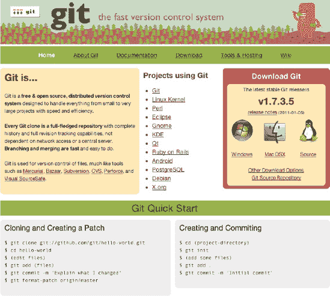

**图 2-7.** Git 主页。右上角的方框提供了一种快速下载适用于你操作系统的 Git 代码的方法。

按照网站上的说明安装 Git 软件。Git 是一个命令行程序，这意味着你不会在应用程序文件夹中找到它。要访问它，你必须进入终端。（Windows 安装程序会在你的开始菜单中添加一个图标，用于启动 Git 终端。）进入终端后，只需输入 `git`。你应该会看到一个方便的命令列表，就像你之前输入 `drush` 时看到的那样（参见 图 2-8）。

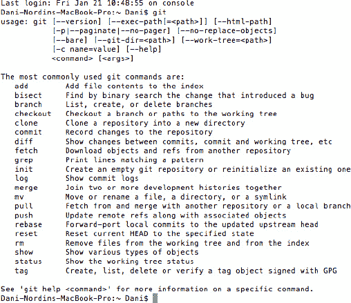

**图 2-8.** 终端中的 Git 主屏幕

 **注意** 如果安装后 `git` 命令不起作用，请尝试退出终端（在大多数操作系统上是文件 > 退出，或者在 Mac 上是 Cmd+Q）并重新打开程序。

#### 使用 Git

Git 主要是一个命令行工具，并且在命令行上非常易于使用。我们建议你先在命令行上学习 Git，然后再尝试可视化工具。熟悉命令行能让你与其他 Drupal Git 用户拥有共同的语言。接下来的章节将讨论入门的基本步骤。不过，你也能找到一些为你创建 GUI 的客户端。有关一些示例，请参见 `drupal.org/node/777182`，包括 SmartGit 和（仅适用于 Mac OS X，专有软件）Tower（`git-tower.com`）。

 **提示** 有关常见的 Git 命令和有用的技巧，请参见 `dgd7.org/git`。

##### 额外的一次性步骤：标识你自己

为了在你以后共享代码时，每次提交都能正确标识自己的身份，你应该使用以下两个命令：

`git config --global user.name "你的名字"`
`git config --global user.email you@example.com`

你只需要执行此操作一次。


##### 创建一个仓库

为了开始使用 Git，你需要做的第一件事就是创建一个仓库。这个仓库应该位于你的项目文件夹中。你可以使用 `git init` 命令创建仓库（你可以使用 `cd` 命令导航到该文件夹）。每个项目只需要执行一次此操作。

我们稍后会介绍一些额外的命令；但假设你正在处理你在第 1 章中创建的 DGD7 网站项目，你可以依次使用以下命令来创建你的仓库：

```
cd ~/code/dgd7
git init
```

这会在你的 Drupal 项目中创建一个新的 `.git` 文件夹（参见图 2-9），它将存储你所有的代码版本。

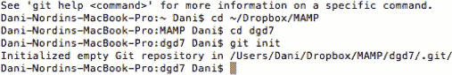

***图 2-9.** 创建你的 Git 仓库*

在开发过程中，尽早且频繁地将代码放入仓库非常重要。我们建议每次对项目进行更改时都进行提交，例如添加模块、更新网站主题的 CSS 或更改代码中的功能。创建仓库后，你正在处理的所有文件都被视为该仓库的工作副本。它可以是干净的（所有更改都已提交）或已更改的。目前，没有文件被提交，它被视为处于已更改状态。

提交代码的第一步是将其添加到“暂存区”。暂存区临时保存你的更改，直到你提交它们。要将更改添加到暂存区，请在网站项目的工作副本中使用 `git add.` 命令。最后的句点很重要——它告诉 Git 准备将目录中（以及其下任何嵌套目录中）所有已更改的代码添加到仓库中。你可以使用 `git status` 查看即将提交的内容（以及尚未暂存的内容）（参见图 2-10）。

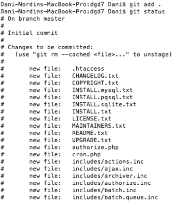

***图 2-10.** 将 DGD7 站点代码添加到暂存区并查看状态*

接下来，你实际提交代码到仓库。这是使用 `git commit` 命令完成的（参见图 2-11）。此处不需要路径名；Git 将提交你刚刚添加的所有内容。你也可以通过使用 `-m "Messagegoeshere"`（其中“Messagegoeshere”是你的消息文本）向提交添加一条消息。该消息应告知任何下载你代码的人他们正在下载什么（例如，“DGD7 演示站点的初始构建”）。在实践中，添加和提交代码的操作会依次发生，如下所示：

```
git add .
git status
git commit -m "Added photo of kittens to the theme header per client request."
```

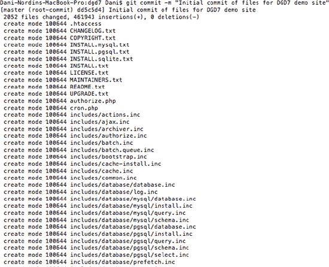

***图 2-11.** 首次提交你的 DGD7 代码*

这将提交自上次提交以来站点中所有已更改的代码。值得注意的是，如果你是第一次添加代码，这个过程可能需要一些时间；Git 将复制每个文件和代码片段到暂存区。

理想情况下，你应该持续提交（参见第 14 章）。至少，在对站点文件进行任何重大更改后（例如，下载模块或主题后），或者在为站点编写自定义模块时定期提交。

##### 出错时该怎么办——放弃更改并在 Git 中还原

在 Git 中开发时，有很多方法可以修复错误。如果在开发过程中，你发现根本不想保存刚刚所做的操作，并且还没有提交更改，你可以使用以下命令：

```
git reset --hard HEAD
```

 警告：此命令将放弃自上次提交以来你所做的所有更改。

如果你不想替换所有代码，而只想恢复一个文件，可以使用以下命令：

```
git checkout -- path/to/filename.php
```

此命令会将 `filename.php` 恢复到上次提交的修订版本。如果你已经提交了代码，可以使用以下命令：

```
git revert HEAD
```

将你的代码恢复到上次提交的修订版本。如果你想再回退一个版本（即倒数第二个修订版本），可以将其修改为：

```
git revert HEAD^
```

##### 其他有用的 Git 命令

现在你已经了解了基本情况，这里还有其他一些你可能觉得有用的 Git 命令：

*   `git status` 显示你即将提交的内容。
*   `git log` 提供你已提交内容的列表。该命令的变体（例如 `git log --pretty=oneline`）更加实用。而 `git log --pretty=oneline -n5` 可以显示最近 5 次提交，当你拥有数百次提交时非常有用。此外，查看日志后，可能需要输入“`:q`”才能返回命令行。
*   `git checkout mymodule.info` 允许你检出（即下载）特定文件或修订版本。

要获取 Git 命令的完整列表，请在终端中输入 `man git`。

### 数据库备份工具

虽然 Git 会通过版本控制帮助你备份文件和代码，但定期备份数据库也同样重要。对于正在被其他人（如客户）使用的网站来说，这至关重要。由于 Drupal 网站（包括内容）的许多部分都存储在数据库中，如果不备份，一旦出现问题，可能会产生严重后果。

Drupal Git Backup Drush 脚本（可在 `github.com/scor/dgb` 找到）可用于轻松导出你关心的数据库表并将其提交到版本控制。这将在第 12 章中更详细地介绍。

如果这个设置对你来说太复杂了——好吧，即使你本章什么都不做——也请安装 Backup and Migrate 模块（`drupal.org/project/backup_migrate`），它能让你轻松地定期将整个数据库备份到你配置设置中指定的文件夹。

另一种直接使用 Drush 备份数据库的方法是以下命令：

```
drush sql-dump > /path/to/filename.sql
```

这将在你选择的位置创建数据库文件的备份。然而，Drush 不会自动清空缓存表；这可能导致数据库备份文件过大，从而迅速填满你的仓库。Drupal Git Backup 脚本解决了这个问题，第 26 章解释了如何从导出中排除选定的表。另一种方法是在进行数据库备份之前，使用 `drush cc all` 命令简单地清除缓存。此命令将清除所有数据库缓存表。

### 总结

我们希望本章能让你快速了解在开发过程中将代码置于版本控制之下并备份数据库是多么重要（而且多么容易！）。通过预先设置几个关键流程，你可以为自己节省数小时的麻烦；去问问任何曾经在编程中误入歧途或处理过网站崩溃的人吧。你以后会感谢我们的。

 注意：获取我们遗漏的工具和技巧的基本更新，请访问 `dgd7.org/essential`，因为人们会在那里纠正我们。

