# 第二部分


## 网站构建基础

**第 3 章** 将带你深入理解 Drupal 最重要的贡献项目：`Views`。你构建的几乎所有网站（即便不是全部）都将依赖`Views`模块提供的强大功能来列出、筛选和排序内容。

**第 4 章** 介绍 Drupal 社区提供的许多其他模块（功能包），你可能需要使用它们，更重要的是，学习如何查找和评估模块以满足你的网站构建需求。

**第 5 章** 带你领略`Organic Groups`模块套件，该套件能让用户在你的网站上自主组织内容和用户群体。本章还特别邀请了`Panels`模块客串登场，这是另一个用于显示内容的强大模块，尤其擅长与`Views`配合使用。

**第 6 章** 讲解安全实践，并提供从配置到评估甚至编写代码等多种方法来确保网站安全。

**第 7 章** 延续安全章节，介绍几种使 Drupal 核心和贡献模块保持最新的方法。

**第 8 章** 延续第一章开始的网站构建工作，通过配置`Fields`、`Views`及精选的贡献模块来展示作者、呈现目录、将作者和资源关联到章节，并允许访客参与互动。本章让你一窥在不编写任何代码的情况下，使用 Drupal 能达到的深度。

## 第 3 章


## 使用 Views 构建动态页面

**作者：米歇尔·劳尔（Michelle Lauer）和格雷格·斯托特（Greg Stout）**

`Views` 改变了我的生活。如果你曾长期构建动态网站，就会知道有两项主要任务是你反复进行的：创建内容并将其存储在数据库中，然后请求这些内容片段来构建网页元素。后一项任务通常需要复杂的公式，哪怕最细微的打字错误都可能返回错误的内容，或者更糟，什么结果都没有。

`Views`模块允许你轻松指定显示子集内容的筛选条件，甚至可以组合多种内容类型。它还允许你调整数据显示的格式。随着新内容添加到网站，生成的视图会动态更新以反映新内容。它让你能完成所有这些工作——而且无需你编写一行代码；谢谢你，厄尔！`Views` 改变了我的生活；它也即将改变你的生活。

### 什么是 Views？

`Views` 这个名称源自数据库术语。数据库视图是一种复杂的存储查询，你可以像使用数据库表一样使用它。当你从数据库视图中请求数据项时，你能以完全符合需求的方式获得所需内容。

Drupal `Views` 的工作方式类似，但它允许你通过图形用户界面来创建数据库查询。当你创建一个 Drupal View 时，该模块会为你编写查询语句，因此你无需了解任何数据库管理知识。

`Views` 模块由厄尔·迈尔斯（Earl Miles，在 `drupal.org` 上用户名为 merlinof chaos）构思、创建并维护。所有可下载的版本、文档和问题队列都可以在其项目页面 `drupal.org/project/views` 上找到。

> *这个工具本质上是一个智能查询构建器，只要配置得当，它能构建正确的查询、执行它并显示结果。*
> 
> *除此之外，Views 还可用于生成报告、创建摘要以及显示图片和其他内容的集合。*
> 
> *——摘自* `drupal.org/project/views`

与 Drupal 本身一样，`Views` 模块开箱即用，功能强大。只需点击几下，你就可以在主页上放置一个区块，列出网站的最新内容。再点击几下，你可以将该区块转换为选项卡式菜单，这样第一个选项卡显示网站最热门的内容，第二个选项卡显示最近的评论，第三个选项卡列出新成员。

`Views` 模块是动态网站的引擎。它让你的工作——无论是网站构建还是特别是维护工作——都变得更轻松、更强大。即使只用`Views`为题写一本书，也绝不会缺少有趣的内容。

基于以上所有原因，本章要学习的重点并非你能用 `Views` 做什么或如何去做，而是如何以一种让你更容易维护网站——并将这份责任传承给后来者的方式去做。换句话说，我希望你真正学习的是流程、标签、描述和命名规范。一旦这些根深蒂固，你将能够构思并使用 `Views` 来构建几乎任何东西。

#### Views 使用示例

以下是 `Views` 常见用途的几个示例：

- 最近五篇新闻稿
- 即将举办的活动
- 特定人员（如博客）撰写的所有文章
- 内容的月度归档
- 用于管理目的的内容列表（见图 3-1）

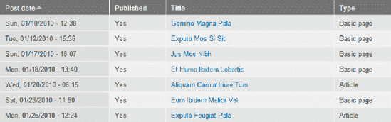

**图 3-1.** *用于管理目的的内容列表示例*

你实际上可以显示任何类型的内容，并且还可以引入相关的内容。只要它存在于数据库中，你就可以使用 `Views` 模块来显示它。

`Views` 最常见的显示类型是页面和区块。使用页面，你可以将输出分配给自己专属的 URL；使用区块，你的输出则可以放置在你网站任何页面的任何区域。

#### 下载、启用并配置 Views 模块的权限

要开始使用 `Views` 进行开发，你需要按照下载模块的标准流程下载该模块并启用它。

##### 下载

在网页浏览器中，访问 `drupal.org/project/views`。向下滚动到下载部分，你会看到一个绿色的表格，标题为“推荐版本”。点击与你已安装的 Drupal 版本（例如 `7.x-3.x`）相对应的、你想要的格式（`tar.gz` 或 `zip`）的下载链接。

解压压缩文件，并将其放入你的贡献模块目录。对于大多数开发者来说，该目录是 `sites/all/modules/contrib` 或直接是 `sites/all/modules`，以便你可以在 `sites/all/modules/contrib/views` 或 `sites/all/modules/views` 中找到所有 Views 文件。（第 2 章中介绍的 `Drush` 可以为你下载并放置这些文件。）


##### 启用

在您的网站上，请确保您已使用有权管理模块的用户或以管理员角色（或 `user/1`）登录。使用顶部的管理菜单，点击“模块”（`admin/modules`）。

向下滚动到“Views”字段集。您将看到三个模块：`Views`、`Views exporter` 和 `Views UI`。在 `Views` 模块描述的下方，您会注意到 `CTools` 是 `Views` 运行所需的依赖模块。如果您已经在站点上下载并启用了 `CTools` 模块，说明依赖关系的文本将显示为“enabled”。如果您已下载 `CTools` 但未启用，文本将显示为“disabled”。最后，如果您尚未下载 `CTools`，文本将显示为“missing”。如果所有依赖项均未存在于站点文件中，Drupal 将不允许您启用模块。

如果您尚未下载 `CTools` 模块，请从其项目页面 `drupal.org/project/ctools` 下载。解压压缩文件，并将 `ctools` 文件夹放入您的贡献模块目录。对于大多数开发者来说，该目录位于 `/sites/all/modules`，这样您就可以在 `sites/all/modules/ctools` 中找到所有 `CTools` 文件。

 **注意** `CTools`（Chaos Tools Suite）是一个为其他模块提供辅助代码的模块。

在浏览器中，返回模块页面（`admin/modules`）并点击“刷新”。向下滚动到“Views”字段集。说明 `CTools` 依赖关系的文本应显示为“disabled”。由于所有必需文件均已就绪，您现在可以启用 `Views`。勾选 `Views` 和 `Views UI` 的复选框，然后保存配置（参见 图 3–2）。

 **注意** 我们将在本章后面讨论 `Views exporter` 模块。

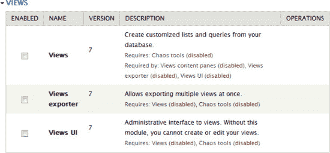

***图 3–2.** 模块列表管理页面。所需模块已下载但尚未启用。*

Drupal 会提示您 `Views` 模块需要另一个模块启用。

* * *

`您必须启用 Chaos tools 模块才能安装 Views UI。是否要继续？`
`请点击“继续”。`

* * *

##### 配置权限

Drupal 提供的功能之一是能够为不同角色授予权限，如 第 1 章 和 第 8 章 所述。大多数模块都有与之关联的权限，需要授予角色才能与其交互。您网站的用户将拥有匿名用户或已认证用户的角色，并且可能分配有其他角色。

 **提示** 启用任何模块后，最好立即配置权限。等到开发结束时再配置通常会导致权限审核任务繁重。

转到顶部的管理菜单，点击“人员”。进入此页面后，点击“权限”选项卡。向下滚动到底部，找到“Views”部分。`Views` 模块有两个权限：“管理视图”和“访问所有视图”。

 **注意** 您也可以使用模块管理页面上的“Views”的“权限”链接。这将直接带您转到权限页面上的“Views”部分。

“管理视图”授予对 Views 管理页面的访问权限，允许用户创建、编辑和删除视图。仅将此权限授予分配给适当且经过正确使用培训的用户的角色。大多数“管理”权限仅授予管理员角色。

“绕过视图访问控制”是另一个应谨慎使用的权限。对于特定的视图，您可以指定哪些角色可以查看结果。为某个角色选择“访问所有视图”权限将覆盖该设置。我们建议仅将此权限授予分配给适当且经过正确使用培训的用户的角色，例如您的站点管理员。

确认已认证用户和匿名用户角色的两个复选框均未选中。确认管理员角色的两个复选框均已选中。如果您做了任何更改，请点击“保存权限”。

 **提示** 在开发过程中，请确保以不同用户身份检查您的网页，以确认他们具有由权限设置定义的正确的用户体验。尝试打开三个不同的浏览器，每个浏览器演示一个不同的角色，例如在 Firefox 中演示管理员，在 Chrome 中演示已认证用户，在 Internet Explorer 中演示匿名用户。您需要为每个角色使用不同品牌的浏览器，因为您的浏览器在其打开的窗口/标签页中共享您登录的用户账户。

恭喜！您现已成功下载并配置了 Views 模块的权限。您现在可以管理视图了。

### Views 管理页面

使用管理菜单，点击“结构”，然后在该页面上点击“视图”（`admin/structure/views`）。这是 Views 列表页面，您网站上的所有视图都列在此处。

#### Advanced Help 模块

如果您尚未安装并启用 Advanced Help 模块，您将在页面顶部看到一条状态消息（参见 图 3–3）。

Advanced Help 模块将在您构建视图时提供一些额外的信息来解释各个选项。您可以选择从 `drupal.org/project/advanced_help` 下载它，或点击“隐藏此消息”。


***图 3–3.** Advanced Help 状态消息*

#### 操作链接

在状态消息下方，您将看到“添加新视图”和“导入”。我们将在本章后面讨论如何使用它们。

#### 更改列出的可用视图

默认情况下，此页面上会显示所有可用的视图。虽然现在可能没有必要，但如果您的站点有大量视图，对其进行排序和筛选将使此管理页面更易于管理。您可以通过单击“视图名称”、“标签”和“路径”的列标题对视图表格进行排序。单击一次可按从先到后排序，再次单击则反向排序。

您还可以通过点击“设置”选项卡，勾选“在视图列表上显示筛选器”旁边的复选框，然后点击“保存配置”来启用一组额外的筛选器。

在表格上方，您将看到一个用于按名称查找视图的搜索框，以及 表 3–1 中所示的下拉筛选器。

***表 3–1.** 筛选控件*

| **筛选器** | **说明** |
| --- | --- |
| 标签 | 已为此视图添加了哪些额外分类（类似于元数据）以使查找相关视图更容易？ |
| 显示类型 | 此视图是显示为带有自己 URL 的完整页面、一个馈送，还是显示为可以放置在站点任何页面上的区块？ |
| 类型 | 视图显示的内容是关于节点、用户、文件等吗？ |
| 存储 | 视图是存储在数据库中、仅存储在代码中，还是存储在覆盖代码的数据库中（稍后详细介绍）？ |
| 状态 | 视图已启用还是已禁用？ |

任何筛选器选择都会自动应用到列表中，但您可以点击“重置”将列表显示恢复为其默认设置（参见 图 3–4）。

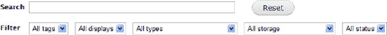

***图 3–4.** 细化可用视图列表*

#### 可用视图

`Views` 模块带有几个默认视图，您可以选择启用并在您的站点中使用。站点中的其他模块也可能定义出现在列表中的视图。到本章结束时，您将能够创建自己的视图。


#### 视图列表的组成元素

每个列出的视图都提供了大量信息。以下元素在图 3-5 中进行了映射，并直接关系到你如何筛选列表中显示的视图：

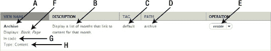

***图 3-5.** 视图列表的组成元素*

1.  视图的名称是什么？
    *   这是视图的人类可读名称。
    *   你可以将鼠标悬停在此标签上以查看机器名称。
2.  描述是什么？
    *   描述仅出现在管理列表中。这在查看所有可用视图并确定每个视图的功能时很有用。
    *   可选
3.  标签是什么？
    *   标签是视图的元数据。它们是附加信息，有助于你对视图进行分类，并在列表页面上更轻松地找到它们。例如，可以将所有关于公司信息（包括员工和部门）的视图标记为"内部"。
4.  路径是什么？
    *   这仅用于页面显示类型。
    *   如果你的视图设置为显示为页面，则必须输入路径。这是在网站上找到视图显示位置的 URL。Drupal 只需要域名后面的部分。例如，如果你的视图要在 [`www.example.com/archive`](http://www.example.com/archive) 处显示，那么此处只会显示 archive。
5.  是启用还是禁用？
    *   这是更改该设置的能力。
    *   当模块定义视图时，它通常是一个可选功能，你可以打开或关闭它。某些模块会创建一个初始状态为禁用的视图，允许你决定是否要使用它。如果是这种情况，你会看到一个启用它的链接。一旦启用，如果你选择不使用它，则可以禁用它。
    *   在此菜单下，你还会找到克隆和导出（稍后讨论）。

     **提示** 显示的词语是你想要执行的操作，而不是当前状态。如果显示"启用"，则表示该视图已被禁用；你可以单击"启用"来启用它。

6.  使用了哪些显示？
    *   创建视图时，你可以选择内容以何种格式显示。你想要页面、区块还是其他形式？单个视图可以创建多个显示。例如，一个新闻稿视图可能有一个显示最近五条标题的区块，以及一个显示单月所有新闻稿摘要的页面。
7.  存储格式是什么？存储格式有三种可能性。
    *   "在代码中"表示视图的代码存储在模块文件中。任何模块都可以定义任意数量的视图。
    *   "数据库覆盖代码"表示最初由模块定义了该视图，但你已修改了它并将副本保存在数据库中。当前站点上使用的是数据库中的副本。
    *   "在数据库中"表示你使用管理界面创建了视图，其代码仅存储在数据库中。
8.  视图的类型是什么？
    *   这描述了你想在视图中显示的内容类型。选项包括内容、用户、评论、术语、文件等。

#### 默认视图

管理视图的主页面（`admin/structure/views`）显示所有可用视图的列表。表 3-2 列出了由 Views 模块定义的视图。其他贡献模块可能会定义额外的默认视图。默认视图存储在代码中，而当你使用管理界面创建视图时，其定义存储在数据库中。由于你的网站设置可能不同，因此你的列表中可能还有其他视图。

***表 3-2.** 由 Views 模块定义的视图*

| **视图** | **定义** |
| --- | --- |
| 归档 | 显示链接到该月内容的月份列表。 |
| 反向链接 | 使用搜索反向链接表，显示链接到该节点的节点列表。 |
| 首页 | 模拟 Drupal 默认首页；你可以将默认首页路径设置为该视图，使其成为你的首页。 |
| 词汇表 | 按字母顺序排列的所有内容列表。 |
| 最近评论 | 包含一个区块和一个页面，用于列出最近评论；区块将自动链接到页面，该页面显示评论正文以及指向节点的链接。 |
| 分类术语 | 一个用于模拟 Drupal 内核处理分类/术语的视图；它还通过提供两个可能的反馈来模拟 Views 1 的处理方式。 |
| 追踪器 | 显示系统上的所有新活动。 |

#### 解构一个视图

Views 模块是一个非常强大的模块，拥有许多配置选项。第一次看到所有这些选项可能会令人生畏。我们将解释所有选项，但会重点介绍在入门时需要了解的最重要的选项。

让我们查看一个默认视图并检查其所有元素。在视图管理页面上，找到名为"首页"的默认视图。找到最右侧的操作列，然后单击"启用"。现在你已经启用了该视图，操作链接已更改为"编辑"。

这一小菜单选项允许你对所选视图执行一系列不同的操作。

*   *编辑*：你可以编辑此视图并保存修改后的版本。如果此视图存储在代码中，你将创建其定义的一个活动副本并将其保存在数据库中。你始终可以选择恢复到存储在代码中的原始版本。
*   *禁用*：如果你正在处理的视图存储在代码中，并且你不再想使用它，则可以禁用它。如果禁用它，该视图的显示将不再在你的网站上可见。这意味着区块或页面可能会消失。
*   *克隆*：如前所述，你可以编辑和保存存储在代码中的视图。如果你更喜欢创建一个与现有视图相似的视图，可以克隆它。这会生成该视图的精确副本，以便你可以重命名它并进行任意数量的更改。克隆允许你创建一个与现有视图完全相同的全新视图，而不是覆盖存储在数据库中的视图或覆盖代码中的视图。然后你可以编辑新视图而不影响原始视图。
*   *导出*：如果你对创建视图的代码感兴趣，可以导出它。单击此选项将带你进入一个页面，你可以在其中复制代码并将其放入你的模块中（稍后会详细介绍）。

 **提示** 如果你新克隆的视图使用页面显示，请注意不要使用与原始视图完全相同的路径。

对于"首页"视图，单击"编辑"，如图图 3-6 所示。

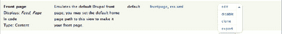

***图 3-6.** 列表中已启用的视图及其操作菜单*


##### 显示类型

点击**编辑**将进入特定视图的配置页面。在此案例中，你应查看的是首页视图。首先要注意的是视图内各显示的横向导航。首次编辑视图时，你会看到第一个可用的显示，其深色高亮表示选中（参见图 3–7）。

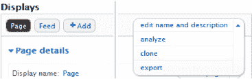

***图 3–7.** 页面显示（左）与视图的操作菜单（右）*

此首页视图包含两个显示：页面和 Feed。如果需要，你可以使用 **+添加** 按钮新增显示（后续会详述）。

在显示栏右侧是另一个操作菜单。**克隆**和**导出**的功能与视图列表中的同名项一致。此外，你还可以找到以下选项：

* **编辑名称和描述**：打开一个对话框，允许你编辑视图的人类可读名称和视图描述，用于说明视图的用途（参见图 3–8）。

  你还可以创建或查找现有的视图标签；这些标签非常有用。随着你越来越多地使用视图，每个项目都会创建数十个视图。使用标签有助于你组织和管理项目中的视图。虽然非必需，但我强烈建议你善用此功能。

* **分析**：**分析**按钮会检查是否存在相互冲突的设置，或报告其他相关开发信息。

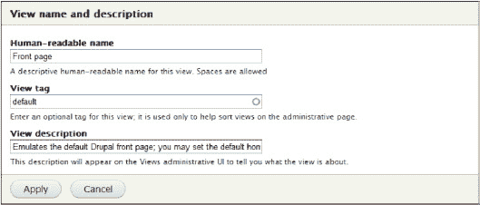

***图 3–8.** 编辑名称和描述对话框*

##### 视图配置详情

现在我们进入定义视图的核心部分。请做好准备，因为你将在开发工作中花费大量时间，通过此界面创建、编辑、调整和优化视图（参见图 3–9）。虽然一开始可能有些令人望而生畏，但你会很快熟悉这个界面。每个由黑色标题标识的功能组控制视图的一个方面。你将使用这些功能组来设置显示内容、显示方式，以及设置元数据和提供分页器等功能控件。

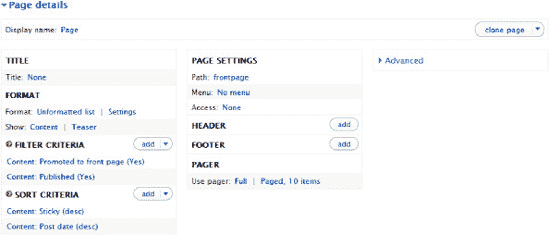

***图 3–9.** 视图详情（高级部分已展开）*

我们将简要讨论首页视图页面显示的所有选项，然后回过头来，更详细地介绍创建视图的关键要素。

###### 显示名称

第一个可编辑项是显示名称。要编辑，请点击文本"页面"。点击当前设置将打开一个模态对话框，允许你编辑特定显示的信息。

* **名称**：你正在编辑的视图的显示名称。创建新显示时，此名称字段会预填你刚创建的显示类型。修改此字段以区分同一类型的多个显示非常重要。例如，你可能有一个视图包含一个显示最近 5 篇文章的区块，以及另一个显示 5 篇随机文章的区块。当你创建这两个区块显示时，视图会将两者的显示名称都预填为"区块"。最好将名称改为更具描述性的内容，如"区块：最近 5 篇"和"区块：随机 5 篇"。
* **描述**：视图显示的人类可读描述。

###### 标题

标题会根据显示类型出现在不同位置。如果显示类型是页面，标题将成为页面标题，既用于`H1`标签，也用于元数据。如果显示类型是区块，标题将作为区块标题显示在内容输出上方。点击当前标题可打开模态对话框，包含以下设置，如图 3–10 所示：

* **用于菜单**：此下拉菜单控制你在此输入的标题是仅应用于此显示（若选择"此页面（覆盖）"），还是应用于所有显示（若选择"所有显示（除覆盖外）"）。
* 标题的文本字段。

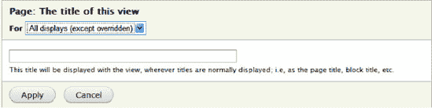

***图 3–10.** 显示标题对话框，一个模态对话框示例*

###### 格式

你希望视图结果使用哪种 HTML 标记？选项包括列表、表格、网格或未格式化（每个结果用`div`标签包裹）。其他贡献的模块可以添加额外的结果显示方式。

* **设置**：允许你为每行结果的输出容器添加自定义 CSS 类。
* **显示**：你是想将内容或摘要显示为预先格式化好的整体块，还是选择特定字段来显示？
* 根据你的初次选择，在"|"符号（读作"管道符"）后会有相应选项，用于指定格式化块的选项，或字段分组/排列的选项。如果选择字段，则会新增一个名为**字段**的完整区域，让你添加和配置字段特定设置。

###### 字段

如果在**显示**选项中选择了**内容**，则此分组隐藏；但若选择以字段形式显示结果，则会显示。在此你可以从 Drupal 提供的可用选项目录中选择字段。

###### 筛选条件

为了避免显示所有可能的内容，根据指定条件限制结果集。默认情况下，你会看到已设置"内容：已发布（是）"作为筛选条件。这是明智的编程先辈们赠予你的礼物，仿佛在说："愿你永远不必经历创建视图后向世界展示未发布内容的羞愧。"要知道，如果你试图移除它，他们的目光正注视着你。

###### 排序标准

结果应按什么顺序显示？默认情况下，你会看到已设置"内容：发布日期（降序）"作为排序条件。这将使你的内容按倒序排列（也称为博客顺序），最新内容位于最上方。

###### 显示设置

这些设置会根据当前编辑的显示类型而变化。在我们的示例中，它是一个页面。

* **路径**：此视图将在此 URL 显示其内容。在本例中，路径为`http://www.example.com/frontpage`。
* **菜单**：创建一个将用户带到视图的菜单项。你还可以创建选项卡和其他选项。
* **访问权限**：是否只允许拥有特定权限或角色的用户查看内容？"无"表示没有特殊限制。

###### 页眉

你希望在视图结果上方显示任何内容吗？

###### 页脚

你希望在视图结果下方显示任何内容吗？

###### 分页器

* **使用分页器**：如果你决定显示 10 个结果，但视图产生了 35 个结果，你可以告诉 Drupal 自动进行分页。显示 10 个结果后，会出现一个分页器，带你进入下一页，再显示另外 10 个结果。如果你的内容过多导致页面过长不便使用，这是一个极佳的解决方案。
* **更多链接**（仅出现在区块和附件中）：创建一个指向包含更多结果页面的链接。如果你有一个只显示 5 个结果的区块，以及一个显示所有结果的页面，你可以让 Drupal 在区块上创建一个指向该页面的链接。

#### 上下文过滤器

如果你想创建动态页面，根据 URL 来决定显示什么内容，可以在此指定。此部分过去称为**参数**。


#### 关系

如果你有一些与最终结果相关但不属于结果本身的内容想要展示，你可以通过**关联**来连接并显示它。

如果你对这个描述感到困惑，我理解。关系是一个难以掌握的概念，但一旦你掌握了，你会发现它们很有价值，就像现实生活中的关系一样。我们稍后会详细讨论。

###### 无结果时的行为

如果没有结果，你希望向用户显示任何文本吗？此设置以前被称为**空文本**。

###### 暴露的表单

-   *块中的暴露表单*：如果你已将过滤器设置为暴露，你是希望将它们渲染在单独的块中，而不是与视图结果一起显示？过滤器的设置以及如何暴露它们将在本章后面的内容中讨论。
-   *暴露表单样式*：允许对暴露的过滤器进行更多配置，包括标签。

###### 其他

-   *机器名*：此字段允许你定义一个机器友好的名称，即不含空格或特殊字符的名称。
-   *备注*：一个用于输入关于此视图的注释或信息的区块。
-   *显示状态*：就像你可以启用或禁用整个视图一样，你也可以启用或禁用视图内的某个显示。
-   *使用 AJAX*：你是否希望分页、表格排序和暴露的过滤器在不刷新页面的情况下即时加载内容？
-   *在摘要中隐藏附件*：在显示上下文过滤器摘要时隐藏附件。
-   *使用分组*：你是否希望允许视图根据某个字段对结果进行分组？如果你还指定了排序顺序，结果将先分组后排序。
-   *查询设置*：
    -   禁用 SQL 重写：你是否希望禁用对结果进行权限检查的功能（即确保用户有权限查看它们）？这将跳过 `node_access` 检查以及任何其他 `hook_query_alter()` 的实现。在大多数情况下，不建议更改此设置。
    -   去重：你是否希望确保没有重复的结果？通过选择**去重**，如果你的视图结果中同一个节点出现了多次，此设置将移除重复项。

        一个不希望节点出现多个实例的例子是，当你有一个显示所有带有文件附件的节点的视图时。因为这是一个多值字段，所以每个附件都会显示该节点。

        一个希望节点出现多个实例的例子是，如果你的视图按分类术语对节点进行分组，并且你的节点被标记了多个术语，那么你希望该节点在所有相关的分组中都显示出来。

    -   *使用从属服务器*：这是一个性能选项。这将使查询尝试连接到可用的从属服务器（如果存在）。
-   *缓存*：你是否希望缓存此视图的结果以便更快地交付？请注意，如果内容被更新，视图中的内容不会立即更新。缓存只会在你设置的间隔时间后清除。对于内容经常变化的视图，比如一个非常活跃的网站上的最新文章列表，你可能不希望缓存结果。但是，如果你的视图显示的是不经常变化的内容，缓存是一个好主意。即使是短时间的缓存也能显著提高网站性能。
-   *链接显示*：如果你正在使用“更多”链接，你希望它指向哪个显示？例如，如果你的块使用了“更多”链接，并且你的视图中还有几个页面显示，你希望“更多”链接指向哪个页面？
-   *CSS 类*：你是否希望向包装层 `div` 添加一个 CSS 类，以便应用样式？
-   *主题*：这不是一个设置，而是帮助你创建模板以进一步自定义视图输出的信息。点击它可以看到可用的模板信息。请注意，这些模板需要保存为代码才能正常使用，并且在此管理界面中不生效。

##### 覆盖：一个视图概念

许多设置都可以针对特定的显示进行覆盖。在进一步讨论之前，理解设置覆盖的概念非常重要。

当你第一次创建一个视图时，为第一个显示配置的设置将被后续的视图显示所继承。换句话说，当你添加额外的显示（如页面或区块）时，它们能与第一个显示共有的所有设置都将被设置为相同。这使得开发相关的显示非常高效，但你也可以选择为单个显示覆盖任何这些设置。

了解何时设置了覆盖对于构建一致的视图非常重要，并且有清晰的视觉提示用于识别覆盖。当视图配置上的某个设置被覆盖时，该设置的左侧会显示一个断链图标，如图 3–11 所示。

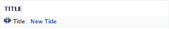

***图 3–11.** 断链图标表示该标题已被覆盖。*

##### 理解将输出的内容类型：视图过滤器

无论你正在编辑哪个显示，都有三列配置选项。要了解将显示的内容类型，请查看第一列中的**过滤器**部分。过滤器会减少符合你条件的显示内容。Frontpage 视图有两个过滤器。

点击“内容：推送到首页”，如图 3–12 所示。

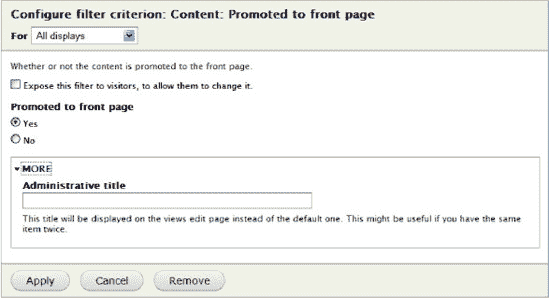

***图 3–12.** 配置过滤器*

此对话框的标题告诉了你很多信息：“配置过滤条件：内容：推送到首页”。

-   “配置过滤条件”告诉你，你正在处理过滤器，而不是其他的配置分组（如字段或排序标准）。
-   “内容：推送到首页”是过滤器的名称。“内容”指的是过滤器的类型，“推送到首页”是具体的条件。
-   “所有显示”下拉菜单告诉你，此显示使用的设置与所有其他未被覆盖的显示相同。

你可以选择暴露一个过滤器。这将允许网站访问者确定过滤器的值。这将在后面更详细地讨论。

这个特定的过滤器有两个值供你选择：是或否。你可以将这个过滤器理解为向你提问。你是否只想显示已被推送到首页的内容？是还是否？在这种情况下，答案是“是”。

下方有三个配置按钮：

-   *应用*：这将使用选定的选项进行配置。请注意，它实际上并不会保存视图。
-   *取消*：这将使你退出此配置设置。即使你更改了某些内容，也不会应用这些更改。
-   *移除*：如果你不再希望此过滤器作为视图的一部分，它将完全移除它。

所有过滤器配置都由以下部分组成：

-   一个描述性标题。
-   暴露过滤器的选项，以及如果设置的话，相关的配置。
-   实际设置。
-   用于设置、取消过滤器配置以及移除过滤器的按钮。

再次查看这三列，点击“内容：已发布”。此配置块的设置方式与前一个相同。它提问：你是否只想显示已发布的内容？是还是否？

 **提示** 除非你有其他意图，否则请务必包含一个用于“已发布”状态的过滤器，这一点极其重要。在管理站点内容时，你可能会选择取消发布一个节点，因为你不想让访客看到它。为了保持此内容的隐藏状态，你必须对视图进行过滤，使其只显示已发布的内容。你创建的每个新视图都默认提供了一个已发布状态的过滤器。请极其谨慎地移除它。

点击“取消”退出此配置对话框。


###### 高级筛选条件组：将排序与逻辑运算符结合使用

`Views` 模块能够构建筛选条件的逻辑组合，从而实现更复杂的内容分组。例如，你可能想创建一个包含所有满足以下条件的文章块：

*   评论数超过十条，**或**
*   在过去一小时内收到评论。

满足以上任一条件都可使内容块保持非常新鲜。但是，如果你同时添加了`评论数`筛选条件和`最后评论时间`筛选条件，那么你将只会得到一个包含那些评论数达到十条**且**最后一条评论在一小时内的文章块。这将是一组与你预期完全不同的项目。相反，你需要指定项目只需满足第一个**或**第二个条件，而不是同时满足两者。

在`筛选条件`部分的右侧，打开选项列表并选择`与/或`。

你将看到`页面：重新排列筛选条件`对话框，如图 Figure 3–13 所示。你可以设置标准的`针对`选项，以指明此筛选条件的更改是仅应用于此显示，还是应用于`视图`中的所有显示。默认情况下，你指定的所有筛选条件将包含在一个筛选逻辑组中，并且运算符设置为`与`。此配置将使筛选效果与默认筛选效果相同，这意味着所有内容必须通过每个筛选条件才能被包含在视图的结果中。

在当前示例（`首页视图`）中，如果你将`运算符`更改为`或`，你将获得一个已发布或已推送至首页的内容列表。这会将任何未发布的内容包含在你的`Views`输出中，因此请谨慎使用逻辑运算符。

单击`创建新的筛选条件组`将创建另一个运算符框；如果你有更多筛选条件，可以使用每个筛选条件旁边的小箭头将它们拖到更多逻辑组中，从而可能创建同一筛选条件在多个筛选组中使用的组合。

 **提示** 请记住，`或`逻辑组中的每个分组独立于其他分组运行；例如，`((A 和 B) 或 (C 和 D))`。你需要向`筛选条件`添加多个`内容：已发布 是`筛选条件，并在每个组中添加一个，以便每个组都要求其内容已发布。

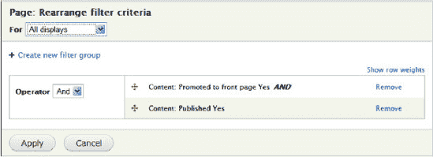

***Figure 3–13.** 配置与/或筛选条件组*

 **提示** 你可能已经注意到每个筛选条件底部的`更多`切换开关。如果将其打开，你会看到一个名为`管理标题`的字段。这允许你为每个筛选条件指定一个自定义名称。很可能只在你有多个相同筛选条件的副本时（例如在逻辑组中使用时）才会用到此功能。

##### 理解内容的输出顺序：视图排序条件

要理解内容的显示顺序，请查看第一列中的`排序条件`部分。多个排序条件允许你对此设置进行非常精细的控制。`首页`视图有两个排序条件。

点击`内容：置顶`。这个特定的筛选条件有两个值供你选择：`升序排序`或`降序排序`。可以将此筛选条件视为在问你一个问题：你是希望标记为置顶的内容排在结果顶部，还是排在底部？在这种情况下，答案是`降序排序`。所有标记为置顶的内容都将位于页面顶部。

再次查看这三列，点击`排序标准`下的`内容：发布日期`。此配置块的设置方式与前一个相同。它提出了一个问题：你希望最新发布的内容显示在前面，还是最旧的内容显示在前面？如果你希望采用博客时间顺序（即最新发布的内容在最上面），则应选择`降序排序`。

由于有两个排序条件，第一个条件会被调用并对结果进行排序。当结果中存在排序权重相同的项目时，会调用下一个排序条件。你可以根据需要添加任意数量的排序条件，以获得非常精细的结果排序。

在当前示例中，结果将首先把所有置顶的帖子显示在顶部。然后，它会遍历置顶的帖子进行排序，以确保最新的排在最前面；同时也会遍历所有未标记为置顶的帖子进行排序，以确保最新的帖子列在最前面。

点击`取消`退出此配置对话框。

##### 理解将要输出的内容片段：视图格式设置

你已经确定了将要显示的内容类型以及显示顺序。但内容看起来会是什么样子？会显示内容的哪些部分？在第一列中，`格式`框允许你配置几个元素。`首页视图`将其结果显示为带有容器`div`的内容摘要。在`设置`下，你可以看到没有设置额外的 CSS 类（参见 Figure 3–14）。

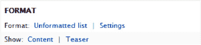

***Figure 3–14.** 格式设置配置框*

在编辑或创建`视图`时，你应该首先查看的项目是`显示`设置。没错，它是列表中的第二个，但对结果的外观影响更大。

你可以点击链接文字`内容`来更改`显示`设置。如果你点击`摘要`，则会更改所选`显示`样式的设置。

###### 格式设置的配置选项

当你点击`显示`设置的当前值`内容`时，会看到所有可用的选项。`Views` 模块提供了两个选项：`字段`和`内容`。其他贡献模块可能会提供额外的选项并显示在此处。例如，将结果显示为地图上的点、幻灯片或可自定义的 HTML。

要查看`内容` `显示`设置的设置，请点击`摘要`。`视图模式`的选择框当前设置为`摘要`。这意味着内容会以缩短版本显示，并带有一个链接标题和一个`阅读更多`链接。如果你的主题使用了自定义的摘要模板，你的`摘要`可能看起来与描述有所不同。

除了`显示`设置，你还可以配置整个`视图`的`格式`，如 Table 3–3 所述。

***Table 3–3.** 配置选项*

| **选项** | **描述** |
| --- | --- |
| `网格` | `网格` 将`视图`的所有内容放入一个盒子中，你可以选择每行或每列要放置多少个盒子。 |
| `HTML 列表` | 你可以选择有序列表（数字）或无序列表（项目符号）。 |
| `跳转菜单` | 如果你将内容标题放入跳转菜单，当你选择该标题时，将自动被引导至该内容。 |
| `表格` | 表格将结果字段放入一个类似电子表格的表格中。你可以允许列标题作为排序链接。 |
| `无格式` | 一个简单的 `div`，带有可自定义的 CSS 类，包裹每个项目。 |

### 创建基本视图

让我们直接开始，创建第一个`视图`。在本示例中，假设你的网站中已有内容。在`Views`管理页面（`admin/structure/views`）顶部附近，找到写着`添加新视图`的链接并点击它。

#### 目标

你需要创建一个页面，该页面显示指向特定作者所写所有文章的摘要，以及一个显示这些文章最新五篇标题的区块，这些标题链接到实际内容。你还需要一个`更多`链接，将用户引导至显示所有文章的主页面。


#### 系统化方法

每次创建视图时，我都遵循相同的模式。我会向自己提出一系列问题，每个问题对应一个不同的配置框。这确保了我能得到预期的结果，并且不会遗漏任何步骤。

如果我要创建一个新视图，向导会提供一个初始窗口，让我可以回答其中一些问题。我输入的回答将预先填充主编辑页面上的部分配置框。

如果我已经有一个视图，并且正在为其添加额外的显示项，我会遵循以下所有步骤：

1.  *创建显示项*：这应该是一个区块、一个页面还是其他内容？
2.  *名称*：当我查看显示项时，应该显示什么名称来帮助我理解正在编辑的是哪一个？当我希望使用其他管理界面将某个区块放置在网站的某个位置时，什么名称才有意义？
3.  *标题*：标题应该是什么？网站用户看到的这个内容标题应该是什么？
4.  *筛选条件*：我想要显示什么类型的内容？
5.  *字段或显示内容/摘要*：我想要显示内容的哪些部分？
6.  *格式*：我希望结果以表格还是列表的形式显示？
7.  *排序*：结果应该按什么顺序排列？
8.  *上下文筛选器/关系*：我是否需要使用 URL 的某些部分来进一步定制结果集？我是否需要引入相关数据？上下文筛选器和关系将在后面的章节中讨论。

##### 设置视图的基本信息

借助向导，您可以在“添加新视图”屏幕上配置视图的大部分内容。让我们开始吧！使用管理菜单，进入“结构” “视图”（`admin/structure/views`），然后点击“添加新视图”。

思考网站上所需的视图并创建一种便于管理的命名规范非常重要。考虑在视图名称中包含网站分区或内容类型。

在此示例中，将视图命名为“文章（按{作者姓名}）”。我将其命名为“文章（按 bob）”。机器名称会根据您输入的名称自动生成。

勾选“描述”框以显示字段，您可以在其中输入视图的描述。描述应为类似于“显示由{作者姓名}撰写的文章”的内容。

向导的下一部分帮助您阐明要显示的内容类型。从头到尾，您想要显示类型为“文章”、标记为“___”、按“最新优先”排序的“内容”。

您可以看到“创建一个页面”默认已被勾选，并且系统已使用您的标题为您填充了该页面的许多信息。

“页面标题”和“路径”已使用您在标题中使用的{作者姓名}预先填充。在此示例中，我选择使用虚构的鲍勃，因此我的页面标题变为“Articles by Bob”，路径变为“articles-by-bob”。

“显示格式”设置也采用了默认值，看起来不错：一个包含链接（允许用户添加评论等）但不包含评论的未格式化摘要列表。

“每页显示条目数”可以保留为 10。

您可以在此处添加菜单或包含 RSS 源，但先等等。

勾选“创建一个区块”框。目前您可以接受默认设置，但将“区块标题”更改为“Articles by Bob”。

如果您的设置看起来像图 3–15 中所示，那么您就准备好了。点击“继续并编辑”来创建您的第一个视图。

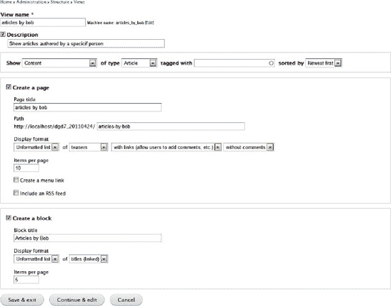

***图 3–15.** 添加新视图向导*

其他类型的视图将在本章后面讨论。点击“继续并编辑”。

 **提示** 在创建/编辑时，定期保存视图非常重要。另外请注意，如果您在正式站点上创建/编辑视图，保存后用户将能看到它。为避免这种情况，请阅读本章后面的“导出为代码”部分。

您现在看到的是编辑视图的主页面。

 **提示** URL 是`admin/structure/views/edit/articles_by_bob`。要编辑任何视图，您可以在视图管理页面的列表中找到它，或者只需将`articles_by_bob`替换为您要编辑的视图的机器名称。

###### 定义管理信息

如前所述，如果您的视图有多个显示项，可能很难辨别每个显示项的功能。幸运的是，视图允许您为每个显示项设置一个管理名称。使用一个有意义的名称非常重要，这样其他开发人员就能轻松编辑您创建的视图。

在此示例中，点击“显示名称”旁边的活动链接“页面”。当对话框打开时，将其更改为“Page: by {author_name}”，用您之前选择的用户名替换{author_name}。记住，我选择了“Bob”。您可以为“描述”重复相同的文本。点击“应用”，然后保存您的视图。您可能需要向上滚动才能看到“保存”按钮。

请注意，顶部的页面显示按钮现在反映了您输入的名称。

###### 定义标题

当您为视图设置显示项（无论是页面还是区块）时，您希望标题出现在结果上方，以便用户了解内容是什么。

在“标题”框中，您可以看到“标题：Articles by {author_name}”。此标题将与视图一起显示在通常显示标题的位置：页面标题、区块标题等。如果您想更改它，请点击带链接的标题，然后点击“应用”。

###### 定义要显示的内容类型

您将跳过某个配置框，以便指定筛选条件。除非您是为网站管理员创建视图，否则您总是希望将第一个筛选条件设为“内容：已发布”。这将确保您不会意外地显示隐藏的内容。此筛选条件默认添加，但请始终检查它。

现在，您需要确保只显示特定作者创建的节点。在“筛选条件”部分点击“添加”。从筛选条件选择框中选择“用户”，然后从列表中选择“用户：名称”筛选条件。点击“添加并配置筛选条件”。

在新的对话框中，将运算符选择为“是其中之一”。对于“用户名自动完成”，只需开始输入您网站上有文章的作者的用户名，例如 Bob。点击“应用”。

 **注意** 在上一个示例中，您一次选择并配置了一个筛选条件。添加筛选条件时，您可以从不同的筛选条件组中选择多个筛选条件。点击“添加”后，系统将引导您逐一配置它们。这样做可以节省时间，因为点击次数会大大减少！

您已成功设置筛选条件！现在，您的结果集将只显示由特定作者创建的已发布文章节点，如图 3–16 所示。

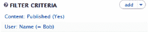

***图 3–16.** 为“按作者名称查看文章”视图选择的筛选条件*

###### 定义要显示的内容元素

现在您可以回到“格式”配置框。如您所见，此部分已使用您在向导中的选择进行了预填充。“显示”设置为“内容 | 摘要”，这既是类型，也是您希望内容显示的方式。如果您在向导中选择了字段作为显示格式，那么您现在就需要开始添加并配置字段到“字段”配置框中。


###### 定义格式设置

您已经将行设置设为“内容 | 预告”。现在您可以确认每个结果周围的 HTML 标记。对于结果为“内容 | 预告”或“内容 | 全文”的情况，我建议选择“无格式”作为样式。这意味着每个结果周围会有一个 `div`，而不是放在列表或表格中。这是默认设置，但您也可以为该行 `div` 指定一个 CSS 类。这在您对网页进行主题化/样式化时会很有帮助。在“格式”部分，点击“无格式列表”旁边的“设置”，输入一个 CSS 类。

此外，如果您希望多个视图外观相同，可以为整个视图添加一个 CSS 类。这可以通过点击“高级”标题下方第三列“其他”部分中“CSS 类”旁边的活动链接“无”来指定。

###### 定义内容的显示顺序

与许多内容列表一致，您希望视图按最近发布的文章排在最前、较早的文章排在最后来显示结果。

您可以看到“排序标准”已设置为“内容：发布日期（降序）”，这正是您想要的，因此再次跳过此步。

###### 定义结果数量

在中间列，点击“使用分页：完整”旁边的活动链接。在这里您可以设置所需的分页样式，或者是否只想显示固定数量的结果。点击“取消”退出模态窗口。

点击“分页，10 个项目”来更改要显示的项目数量。我觉得 10 个太少，所以我们每页设为 15 个项目。

“公开选项”下有很多可探索的设置。这些是关于向用户显示内容的设置，包括允许用户决定每页显示多少项目。

点击“应用”保存每页显示项目数量的更改。

##### 添加菜单

让我们为页面添加一个菜单，使其出现在网站的主导航中。在“页面设置”下，“菜单”旁边，点击“无菜单”打开模态对话框。选择“普通菜单条目”。输入标题“{author_name} 撰写的文章”。同时在“菜单”下拉菜单中选择“主菜单”。点击“应用”。

 **注意** 我们将在后续练习中讨论“菜单选项卡”。

##### 定义高级设置

在“高级设置”框中，您将“使用 AJAX”保留为“否”，因为这是页面的主要内容。如果您选择将此设置改为“是”，后续的分页页面将不会被搜索引擎索引，因为 HTML 不会出现在源代码中，而是动态生成的。

您在此视图中不会使用“分组”或“查询”设置，因此可以跳过这些配置。

“视图缓存”对于流量较大的网站非常有用。如果您选择对查询或结果进行基于时间的缓存，则数据不会在每次有人访问页面时重新生成。这可以为高流量网站节省一些处理资源，但同时也意味着最新的结果只有在缓存过期后才会显示。因此，对于高度动态或对时间敏感的内容，我不建议设置缓存，但对于不经常变化的内容，缓存会很有用。

 **提示** 如果您决定使用视图缓存，在开发过程中，您可能希望定期清除视图缓存以查看更改，而不是等待设定的过期时间。要清除视图缓存，请点击顶部的“工具”选项卡，然后点击顶部的“清除视图缓存”按钮。

##### 预览您的工作

Views 模块允许您在不离开 Views 界面的情况下预览刚刚配置的设置。如果您向下滚动到所有配置框的下方，会注意到“自动预览”区域。它展示了您当前正在编辑的显示效果；假设您选择的用户已经创作了一些内容，您应该会看到一个不错的预览。

##### 动态编辑您的视图

Views 中的一个炫酷功能是能够在自动预览区域编辑您的视图结果。一旦您设置了一些显示选项，使视图能够显示内容，有时基于实际内容做出编辑决策会更容易。

例如，现在我看到了我的标题“Bob 撰写的文章”，但我不喜欢它。“Bob 撰写的”对我来说头韵太重了，无法认真对待，我想更改它。我打算就在预览区域这里进行更改。

在我的标题上方，我会点击齿轮图标。我会看到出现一个小菜单，其中有“编辑标题”选项，所以我点击该项（参见 图 3–17）。

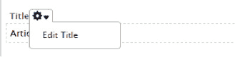

***图 3–17.** 预览区域编辑菜单*

打开的对话框与我在主设置区域点击“标题”旁边的链接时出现的对话框相同。我进行更改并点击“应用”。

哇，太棒了。实际上，如果您更愿意通过微调预览区域中的内容来工作，您可以点击对话框最顶部、显示按钮下方的“页面：{author_name} 详细信息”名称来折叠主设置区域。完成后别忘了保存您的视图！

##### 欣赏您的视图

一开始，您为页面显示分配了一个路径。在浏览器中访问该页面。如果您按照我的建议操作，它应该类似于 [`http://example.com/articles-by-author_name`](http://example.com/articles-by-author_name)。此外，如果您在主菜单中为此页面创建了一个普通菜单项，您可以访问任意页面并点击导航栏中的链接。

恭喜！但还有更多……

##### 添加更多功能

正如我在本练习目标中提到的，您还需要一个区块来显示这些文章的最新五个标题，并链接到实际的节点。

对于每个显示，请遵循系统化方法中概述的步骤。尽管许多设置无需更改，但坚持流程并检查您的工作非常重要。

###### 创建另一个显示

您已经使用向导创建了区块；如果需要另一个，您可以通过编辑视图并点击左上角的“+ 添加”按钮轻松创建。您也可以克隆现有显示。

由于您已经有区块了，请点击左上角的“区块”按钮以查看该显示的设置。

###### 定义管理信息

为了在管理 Views 时便于使用，请将“显示名称”中的“名称”更新为“区块：仅标题”或其他有意义的名称。

###### 覆盖格式

对于您的区块，您希望只显示内容标题。这意味着您需要将其设置为显示字段，以便您可以准确选择要显示的字段（在此用途下，Views 将标题视为一个字段）。之前的“显示”设置被称为“行样式”。

查看“格式”框中的“显示”行。其旁边有一个断裂的链接。这意味着它正在使用您覆盖的格式，并且您可以看到其设置为“字段”。

如果您点击“字段”，可以看到此配置的范围设置为“此区块（覆盖）”。点击“取消”退出此模态窗口。


好的，作为一名高级文档工程师和翻译员，我将严格遵循您提供的注意事项和示例，将给定的英文文本翻译成中文。


##### 编辑字段

您需要确认已拥有所需字段，并且这些字段输出的标记在语义质量和样式方面都符合要求。

如果您查看`Fields`部分，会发现当您在向导中创建区块时，它默认添加了`Content: Title`字段。

1.  单击`Content: Title`打开字段配置对话框。
2.  按下文所述配置选项（我只注明需要更改的选项）。
3.  确认已勾选“将此字段链接到原始内容”。

您要更改的一项内容是输出的 HTML 标记。目前所有标题仅用`div`标签输出，而您希望向读者和搜索引擎表明它们是标题。

1.  单击`Style Settings`展开设置框。
2.  勾选“将字段包裹在 HTML 中”复选框，将出现更多设置。在 HTML 元素框中，选择`H2`。
3.  勾选“创建一个 CSS 类”复选框，并在出现的字段中输入`"title"`。

    您的设置现在应类似于图 3-18 所示。

    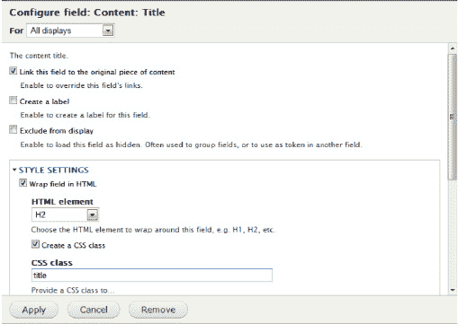

    ***图 3-18.** 标题字段样式设置*

4.  单击`Apply`并向上滚动到`Save`以保存您的视图。

##### 添加“更多”链接

为您的区块显示添加一个`More`链接会是一个很好的改进，这样用户就不必为了查看所有项目而翻很多页。

在`Pager Settings`框中，单击“More Link: No.”链接。您要做的第一件事是更改`For`设置，以便您的链接仅在此显示中出现。将下拉菜单设置为“This block (override)”。勾选`Create More Link`复选框。单击`Apply`，然后在`Auto preview`区域查看您的成果。

保存视图。

您可以在预览区域测试您的“更多”链接。请注意，如果您的内联内容少于区块显示设置的数量，则`More`链接不会出现。

 **注意** 我们读者中非常敏锐的人可能会问：“我的`More`链接是怎么知道要链接到`Page`视图的？”因为这是该视图中唯一的页面，它很可能与区块共享相同的条件，所以视图将其链接到了那里。您可能还会说：“这个答案太敷衍了，因为如果我的视图中不止一个页面会怎样？”啊，是的，如果您有多个页面，区块的选项部分会出现一个新项目，名为“Link display: [页面名称]”。单击该名称将打开一个对话框，您可以在其中指定哪个页面应该作为摘要链接、RSS 供稿链接、更多链接等的目标页面。

##### 放置区块

保存视图后，您的区块将出现在区块管理页面的已禁用区块列表中。像启用其他任何区块一样启用它。有关放置区块的更多信息，请参考第 1 章或第 8 章。

### 扩展视图

您还可以对创建的视图进行其他配置以提高可用性。让我们从您创建的、显示特定作者文章的基本视图开始。

#### 处理零结果的情况

有时我们创建视图是预期未来会有内容。可以想象，作为开发人员，我们知道需要显示`{author_name}`的所有文章，即使这些文章尚未编写。如果我们的视图在内容创建之前就上线了，我们需要在用户导航到该页面时考虑这种情况。

对于页面显示，在右侧栏中，单击`No Results Behavior`的`Add`。勾选`Global: Text area`，然后点击`Add and Configure`。

对于管理标签，输入`"default"`。输入您的默认无结果文本，类似于“目前没有可用的文章。我们正在频繁更新内容，请稍后再来查看。”单击`Apply`。

如果您想检查这是否按预期工作，您可以将其中一个过滤器更改为您知道会产生零结果的条件，然后查看`Auto Preview`区域。

由于您没有更改`For`设置，您的消息将同时应用于页面和区块显示——一次操作即可完成两倍的工作。

#### 一个页面，多个显示以突出显示第一个结果

您之前创建的页面使用分页器显示了 15 个摘要。这是显示所有内容的好方法。但是，在网站的另一个区域，您可能希望突出显示最近的节点。

让我们创建一个页面，以完整节点形式显示最近的文章，并在其下方以表格形式显示接下来的 14 个节点。

为此，请按照以下步骤操作：

1.  添加一个新的页面显示。
2.  将显示名称更新为“Page: Highlight”。
3.  在页面设置下为此视图添加一个路径`"highlights"`。在主菜单中添加一个普通菜单项，以便轻松找到它。
4.  在格式下，将“显示”设置更改为显示完整内容；确保将“For”设置为“This page (override)。”
5.  覆盖“使用分页器”并将其设置为“显示指定数量的项目”，并将此数量设置为 1，仅针对此显示。

     **提示** 当您尝试添加页面标题时，您会看到错误消息“显示‘Page’使用了路径，但路径未定义。”别担心；这是您在不使用向导的情况下创建的第一个显示，您只需在让它保存之前为该显示设置一个路径即可。

    查看`Auto Preview`区域，看看结果是否符合您的预期。

    现在，您需要在该突出显示节点下方添加表格。

6.  添加一个新的附件显示。
7.  将管理名称更新为“Attach: table to highlight”。
8.  覆盖“显示样式”以使用字段。您无需进行任何其他配置。
9.  在“字段”菜单中单击`Add`。在内容组中，选择`Content: Post Date`，然后点击`Add`。将日期格式更改为您想要的任何格式。单击`Apply`。
10. 尝试添加另外两个字段。
11. 将格式从`Unformatted`覆盖为`Table`。

    表格样式选项对话框非常漂亮。您可能希望能得到指导，但只需查看并阅读文本即可。您很快就会明白它功能强大但并不难理解或令人困惑。您可以接受默认设置，也可以进行各种更改；这完全取决于您。

12. 覆盖“分页器”下的“要显示的项目数量”，设置为显示 14 个项目，偏移量为 1。这意味着第一个结果不会显示，但随后的 14 个会显示。这恰好是您想要的，因为您将为第一个节点使用完整显示。
13. 覆盖“分页器”中的“更多链接”以创建一个“更多”链接。
14. 为了将此表格附加到完整节点页面显示，在“附件设置”框中单击`Attach to:` Not defined 链接。选择`Page: Highlight`并单击`Apply`。将“附件位置”下的`Before`更改为`After`。单击`Apply`。
15. 保存您的视图并转到 Page: Highlights。您现在可以在内容下方看到您漂亮的表格视图了。


##### 使用标签页实现独特显示

您可以创建一个包含多个标签页的页面，这样用户无需离开当前页面即可浏览大量内容。

让我们创建一个新的视图，其主页面显示所有文章节点，同时包含一个用于所有活动节点的标签页，以及一个用于博客节点的标签页（请参见表 3–4）。

***表 3–4.** 使用标签页创建新视图以实现独特显示*

| **+ 新增视图** |  |
| --- | --- |
| **新增页面显示：** |  |
| 显示名称 | 名称 = Page: landing |
| 标题 | 标题 = Content |
| 筛选条件 | Content: Published = Yes Content: Type = Article |
| 字段 | Content: Title  –元素类 = H2
 –移除标签
 –将此字段链接到其内容 |
| 排序条件 | Content: Post Date = 降序排序 |
| 分页器 | 使用分页器 = 显示所有项目 |
| 格式 | 样式 = HTML 列表  –列表类型 = 无序列表 |
| 页面设置 | 路径 = content 菜单 = 普通菜单项
 –标题 = Content
 –菜单 = 主菜单 |
| **新增页面显示：** |  |
| 显示名称 | 名称 = Page: Articles |
| 标题 | 标题 = Articles |
| 页面设置 | 路径 = content/articles 菜单 = 默认菜单标签页
 –标题 = Articles
 –父菜单项 = 已存在 |
| **新增页面显示：** |  |
| 显示名称 | 名称 = Page: Blog |
| 标题 | 标题 = Blog |
| 覆盖 – 筛选条件 | Content: Type = blog |
| 页面设置 | 路径 = content/blog 菜单 = 菜单标签页
 –标题 = Blog |
| **新增页面显示：** |  |
| 显示名称 | 名称 = Page: Events |
| 标题 | 标题 = Events |
| 覆盖 – 筛选条件 | Content: Type = event |
| 页面设置 | 路径 = content/events 菜单 = 菜单标签页
 –标题 = Events |

保存您的视图，然后转到可以查看主菜单的页面。点击您创建的 Content 链接，如图 3–19 所示。

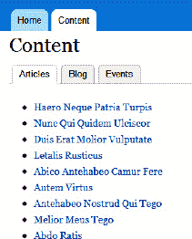

***图 3–19.** 带有标签页的视图*

##### 使用公开过滤器克隆并制作管理表格

通常，您可能希望让一组管理员能够查看内容列表，并能够对其进行筛选，以获得他们想要的确切结果集。Views 模块通过公开筛选器提供了此功能。通过公开筛选器，您可以允许用户设置条件。

让我们为管理员创建一个新视图（请参见表 3–5），该视图以表格格式显示所有内容，并且支持筛选和排序，如图 3–20 所示。

***表 3–5.** 为管理员创建新视图*

| **新增视图：** |  |
| --- | --- |
| **新增页面显示：** |  |
| 标题 | 标题 = All Content |
| 筛选器 | Content: Published  –公开
 –已发布 = <任意>
 –选项 = 是
Content: Type
 –公开
 –解锁运算符 = 是
 –可选 = 是
 –强制单选 = 否
Content: Post Date
 –公开
 –运算符 = 介于
 –解锁运算符 = 是
 –可选 = 是 |
| 字段 | Content: Post Date Content: Published
Content: Title
 –将此字段链接到其内容
Content: Type |
| 分页器 | 使用分页器 = 显示所有项目 访问权限 = 角色
 –管理员 |
| 格式 | 格式 = 表格  –确保所有列都可排序
 –将 Post Date 设置为默认排序，降序 |
| 页眉 | 全局：文本区域  –使用下面的筛选器来精炼列表中显示的内容。 |
| 页面设置 | 路径 = administer/content 菜单 = 普通菜单项
 –标题 = Content
 –菜单 = 导航 |

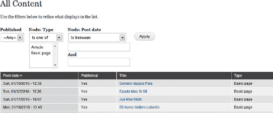

***图 3–20.** 带有公开筛选器的视图*

### 高级视图实现

我们已经讨论了如何创建视图，在其中设置条件，甚至让用户设置条件，但我们还可以创建一个视图，其中传递一个变量来决定结果。此外，我们还可以提取与结果相关的信息，并将其与结果一同显示。

在本节中，我们将讨论剩下的两个配置框：上下文过滤器和关系。

#### 上下文过滤器

上下文过滤器是通常来自 URL 的输入，常被称为参数。一个典型的参数用法可能是将视图缩小到单个节点、单个用户或具有给定分类术语的节点。它类似于筛选器，但不同之处在于，其值并非通过表单设置，而是来自 URL。

与本章前面创建的视图类似，让我们创建一个视图，使每个至少拥有一个博客节点的用户都拥有自己的页面，并且这些页面是动态创建的，这样您就无需显式地按用户名进行筛选（请参见表 3–6）。您还将创建一个菜单和一个区块。

***表 3–6.** 使用上下文过滤器创建视图*

| **创建一个新的节点视图** |  |
| --- | --- |
| **新增页面显示** |  |
| 标题 | 标题 = Blogs |
| 格式 | 显示 = Content &#124; Teaser |
| 筛选器 | Content: Published = Yes Content: Type = Blog |
| 排序条件 | Content: Post Date = 降序排序 |
| 页面设置 | 路径 = blog 菜单 = 普通菜单项
 –标题 = Blog
 –菜单 = 主菜单 |
| 上下文过滤器 | User: Name  –当筛选值不在 URL 中时 = 显示“指定字段的所有结果”
 –覆盖标题 = 按 %1 分类的博客
 –指定验证设置 = 基本验证，显示“未找到结果”内容
  –更多部分：
 –大小写 = 每个单词首字母大写
 –路径中的大小写 = 小写
 –在 URL 中将空格转换为破折号 = 是 |
| **新增区块显示** |  |
| 覆盖上下文过滤器 | User: Name -如果参数不存在则执行的操作 = 显示摘要
 -排序顺序 = 升序 |

 **提示** 贡献模块 Pathauto (`drupal.org/project/pathauto`) 允许您指定 URL 别名的模式，以便自动创建这些别名。这些别名对用户和搜索引擎优化都友好。在此示例中，您应为博客节点设置 Pathauto，使用模式 `blog/[user]/[title]`，以便此页面 URL 与您正在创建的视图保持一致。

将您的区块放置在路径为 `blog/*` 的页面上，这样它就能出现在所有博客页面（包括视图和节点）上。转到您的主页面，点击主菜单中的 Blog 链接。


#### 关系

关系配置允许您引入与当前显示内容相关但存储在同一数据库不同区域的内容。创建关系后，您需要将其与字段或上下文过滤器关联。

在此示例中，您希望为每个节点结果显示创建该节点的人以及编辑/修订该节点的人。使用您在上下文过滤器示例中创建的视图并进行一些修改。我们假设您创建的不是博客节点视图，而是百科节点视图（表 3–7）。

在构建时，在添加新字段后查看实时预览区域。然后在将关系与用户名字段关联后再次查看。

***表 3–7.** 创建百科节点视图*

| **更新页面显示** |  |
| --- | --- |
| 格式 | 显示 = 字段 |
| 字段 | 内容：标题 –将此字段链接到其内容<br>–将字段和标签包装在 HTML 中 = H2<br>用户：名称<br>–标签 = 创建者<br>–更多：管理标题 = 创建者<br>用户：名称<br>–标签 = 修订者<br>–更多：管理标题 = 修订者<br>内容：正文<br>–移除标签<br>–格式化程序 = 修剪，300 |
| 关系 | 内容修订：用户 |
| 编辑字段 | 用户：名称（您添加的第二个，管理标题为“修订者”）<br>–关系 = 修订用户 |
| 格式 | 样式 = 网格<br>–列数 = 3 |
| 分页设置 | 用户分页 = 分页输出，完整分页器<br>–每页项目数 = 9 |

您刚刚为字段分配了一个关系。在分配关系之前，它显示的是节点的作者。在分配关系之后，它显示的是最后保存该节点的作者（修订者），如图 3–21 所示。您需要使用关系来实现此目的，原因在于节点数据、节点修订历史记录和用户数据在数据库中的存储位置不同。您需要将这些信息关联起来。

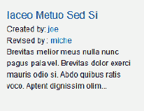

***图 3–21.** 使用关系显示最近编辑节点的用户名的视图*

 **提示** 某些您选择安装的贡献模块可能需要使用关系才能显示所需内容。如果您在可用组中找不到某个过滤器或字段，但确认它应该存在，那么它很可能需要依赖关系。

#### 其他模块

有许多模块可以扩展视图的功能。它们通常会创建可供您自定义的视图，因此大部分工作已经完成。以下列表并非详尽无遗，但您应该了解以下模块：

*   管理
    *   视图批量操作（VBO） – `drupal.org/project/views_bulk_operations`
*   地图
    *   OpenLayers – `drupal.org/project/openlayers`
    *   Gmap – `drupal.org/project/gmap`
*   日历
    *   日历 – `drupal.org/project/calendar`
*   样式与显示
    *   jCarousel – `drupal.org/project/jcarousel`
    *   视图手风琴 – `drupal.org/project/views_accordion`
    *   视图无限滚动 – `drupal.org/project/views_infinite_scroll`

请记住，所有模块都是持续开发中的作品，社区成员需要通过报告问题和测试补丁来帮助增强它们。

#### 导出为代码

你必须导出，必须导出！！我来告诉你为什么……

我在练习中提到，定期保存视图很重要，但问题是，即使你还没准备好，它也会在你的网站上显示出来。我认为对于一个新视图来说，这其实算不上什么大问题，因为在基本设置框中可以更改显示状态配置。但如果你正在修改一个现有视图呢？

此外，如果你最初是在开发环境中创建视图，又如何让视图在生产服务器上显示呢？难道你需要点击 100 次来复制它吗？

当然不用；你可以将视图导出为代码！

使用开发环境来创建、编辑和微调你的视图；导出最终版本；然后将文件复制到生产服务器。这非常简单，并减少了因误点击而造成的人为错误。

然而，在导出视图之前，你需要创建一个模块来保存代码。根据你在第 22 章学到的内容，创建你的模块文件夹、`.info` 文件和 `.module` 文件。同时，在你的模块中创建一个名为 `views` 的文件夹。这是你存放每个导出文件的地方。在该文件夹中，创建一个名为 `articles_by_author.inc` 或与视图同名的空文本文件。

打开你刚刚创建的 `.inc` 文件，并在顶部输入以下代码：

```
<?php
//将导出代码放在这里
$views[$view->name] = $view;
```

转到 `/admin/structure/views` 的视图管理页面，找到你想要导出的视图。在视图列表右侧，点击该视图操作菜单中的“导出”。这将带你进入一个包含大量代码的页面。复制文本区域中的所有代码，并将其粘贴到 `articles_by_author.inc` 文件中，覆盖掉中间的那一行（`//将导出代码放在这里`）。

对于每个你想要导出的视图，你都需要在模块的 `views` 文件夹中创建一个文件，并像刚才那样粘贴导出代码。

下一步是向你的模块添加一些代码，告诉视图模块去你的模块的 `views` 文件夹中查找。在你的模块的 `.module` 文件中，添加以下代码，并将 “dgd7glue” 替换为你模块的名称：

```
/**
 * 实现 hook_views_api().
 */
function dgd7glue_views_api() {
  return array(
    'api' => '3.0',
  );
}

/**
 * 实现 hook_views_default_views().
 */
function dgd7glue_views_default_views() {
  $path = './' . drupal_get_path('module', 'dgd7glue') .'/views/*.inc';
  $views = array();
  foreach (glob($path) as $views_filename) {
     require_once($views_filename);
  }
  return $views;
}
```

像启用其他模块一样，在 `admin/modules` 页面启用你的模块。

为了确保视图模块知道你已将视图添加到代码中，你需要清除视图缓存。转到 `/admin/structure/views/settings/advanced` 的视图工具选项卡，然后点击“清除视图缓存”。

返回视图列表页面。找到你刚刚导出的视图。你会注意到左侧显示“数据库覆盖代码”的字样。这意味着 Drupal 知道你已将这个视图保存在代码中，但当前使用的是数据库中的版本。你应该使用你刚刚添加的代码版本，并删除数据库版本。点击你刚刚导出的视图操作菜单中的“还原”。它会确认你是否真的想要这样做。在你点击“是的，我想还原我的视图！”后，它会将你重定向回列表页面。注意，现在你的视图旁边显示的是“在代码中”。

恭喜你！

将视图导出为代码的最大好处在于，你可以非常轻松地进行更改，并将创建好的视图从一个环境迁移到另一个环境。只是别忘了清除视图缓存。


#### 其他资源

由于 Views 模块非常流行，网上有大量相关资源，Drupal 活动中也有许多相关演示。如果你正在寻找更多帮助，可以查看这些地方：

- *Drupal 文档页面*：由社区持续更新；尽管 Views 模块多年来已趋于成熟，但其核心概念和策略仍保持相对一致。`drupal.org/documentation/modules/views`
- *Views 问题队列*：搜索这些问题，看看是否有人在讨论类似的内容。如果找不到，你可以创建支持工单。`drupal.org/project/issues/views`
- *谷歌*：网上有大量关于 Views 的博客文章、教程和视频。`google.com/search?q=drupal+views`
- *你所在地区的 Drupal 小组*：每个地区都有月度聚会，这是提问的好地方。找到你当地的小组并加入！`groups.drupal.org/groups`
- *专业培训*：有许多付费的专业培训课程可以帮助你提升技能。关于如何进一步参与 Drupal 项目并获得帮助，请参阅第 9 章，但永远不要害怕自己动手尝试和实验（请在本地环境而非正式网站上进行操作）。

## 总有对应的模块

作者：Dani Nordin, Dan Hakimzadeh, 和 Benjamin Melançon

在构建 Drupal 网站时，“总有对应的模块”可能是你听到的最动听的话。模块是精心打包的代码片段，用于扩展 Drupal 的功能。由于有成千上万个贡献模块，很有可能有人已经编写了一个能基本满足你需求的模块。那么，主要挑战有两方面：

1.  明确你究竟需要什么。
2.  找到实现该目标的最佳模块。

本章将为你介绍一些核心模块，这些模块对多种类型的 Drupal 网站都大有裨益。接着，我们将迎接创造性挑战，为特定的使用场景找到合适的模块。一旦找到符合你使用场景的模块，学习如何评估其有效性，并有时将其与功能相似的其他模块进行比较，就至关重要。礼貌且有效地报告错误和请求功能，也是一门需要学习的艺术。

**提示：** 找到一个能在一个包中完全满足你需求的模块，通常*不是*使用 Drupal 的初衷。Drupal 的发展方向是，让许多小部件各司其职，并良好协作。字段和视图就是一个很好的例子。你不需要为食谱页面、赞助商列表以及新闻与活动版块分别使用三个专门的模块。你只需要 `Field` 和 `Views` 模块及其相关模块，通过配置它们，你就可以完成所有这些任务，甚至更多。（`Features` 模块以及其他定义自身视图并为你创建内容类型的模块，试图通过打包这些配置工作，提供开箱即用的功能，从而实现两全其美。但如果需要，你可以使用灵活、广泛使用的工具对其进行修改或扩展。）

### 适用于 Drupal 的模块在不断演变

评估可用于 Drupal 的模块有很多不同的方法。NodeOne 的工作人员制作了一个名为“你应该了解的 49 个模块”的系列节目（`nodeone.se/blogg/49-modules-you-should-know`），它提供了一个很好的思考角度。`NodeOne.se` 推荐的是你应该了解的模块，但不一定必须使用，当然也不是每个网站都要用。Palantir 有一个更深入的系列节目，名为“更好地了解一个模块”（`palantir.net/blog/series/14`），思路相同。Drupalistas 经常发布前十名或前一百名模块的列表，这些都是了解可用模块最新动态的好方法。

#### 模块越少越好

Drupal 社区喜欢炫耀其成千上万个贡献模块，但这里有一个非常重要的事实：你安装的模块越多，网站的性能就越差。

来自 `2bits.com` 的性能和可扩展性专家 Khalid Baheyeldin 经常进行演示，讲解如何帮助 Drupal 网站在一台服务器上每天处理两到三百万次页面浏览、每月数千万访客，而无需使用通常与规模化相关的反向代理、缓存、内容分发网络、NoSQL 数据库或 Drupal 修改。

在确保服务器本身已针对服务 Drupal 进行调优且没有额外运行多余程序后，他的第一步就是移除所有不必要的模块。这意味着：

-  更少的待加载/执行代码。
-  更少的内存消耗。
-  更少的数据库查询。

比性能考虑更重要的是，添加太多额外模块会增加网站的复杂性，使其更难以开发和维护。为了防止因不必要的模块臃肿而导致的代码和概念开销，我们不一定推荐创建一个“核心”模块列表。每个模块都应该有出现在特定网站上的理由。尽管如此，当你持续使用 Drupal 创建网站时，某些模块会证明自己始终有用。这就是为什么使用 Drupal 的个人或团队一旦开始创建网站，就应该为其工作流程和过程编写文档的原因之一；随着时间的推移，这些文档对于团队效率至关重要。关于创建项目维基的更多信息，请查看第 11 章。


#### 如何查找和选择模块

需要理解的关键点是：**每个模块都需要从你所构建的站点角度进行评估。**这也是为什么合理的站点规划是 Drupal 开发流程中至关重要部分的关键原因之一；提前了解站点的业务需求和所需功能，会让找到适合站点需求的正确模块变得容易得多。即使是功能强大且超级实用的模块——例如 `Views`（第 3 章会专门介绍，它是大多数站点的核心组件）——在某些特定项目中也可能不会被采用。

少数情况下，某些模块需要被视为二选一的关系：两个或多个模块可能功能相似，或者极少数情况下完全不兼容，你必须在它们之间做出选择。

虽然没有找到特定项目正确模块的神奇公式，但以下提示可以帮助你从真正出色的模块中筛选出不太有用的模块：

- **按兼容性筛选。** 作为最近重新设计的一部分，`Drupal.org` 允许你通过 `drupal.org/project/modules`（见图 4-1）按模块与 Drupal 核心版本的兼容性进行筛选。在为特定项目搜索模块时，这应当成为默认行为。通过按你正在使用的 Drupal 版本筛选模块，你可以避免过滤掉数百个尚未支持你所用 Drupal 核心版本的模块。

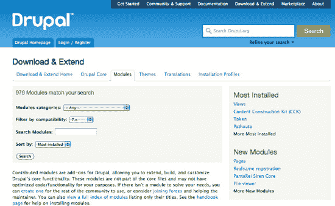

***图 4-1.** Drupal.org 模块页面（`drupal.org/project/modules`）允许按类别、热度或与你所用 Drupal 版本的兼容性进行筛选。*

 **注意** 在撰写本文时，Drupal 的“安装最多”排序在确定排名时会包含 *所有* 版本的 Drupal，即使你正在按兼容性筛选。因此，你看到的未必是 *针对 Drupal 7* 最流行的模块，而可能是一个在 Drupal 6 中非常流行、恰好有 Drupal 7 版本但在 Drupal 7 中用处不大的模块。要查看特定版本的模块热度，请点击模块项目页面“项目信息”区域（位于“下载”区域上方）中的 *查看使用统计信息* 链接。此链接的格式为 `drupal.org/project/usage/`*`模块名称`*。

- **寻找积极维护的模块。** `Drupal.org` 上的大多数模块都会提供推荐版本及其发布日期。你还可以看到该模块最近一次提交代码的日期。通常来说，选择标有“积极维护”且在过去六个月内更新过的模块是一个好主意。虽然确实有可能找到一个运行良好但已超过一年未更新的模块，但这足以作为一个警示信号，让你在使用该模块之前对其进行更深入的审查。请参见图 4-2，了解流行的 Views 模块的版本信息示例。如果你现在访问 `drupal.org/project/views`，你会看到自截图以来该模块已经有了许多新版本。

 **提示** 你也可以按“最近发布”排序，以更好地查看那些维护较好或更新更频繁的模块。

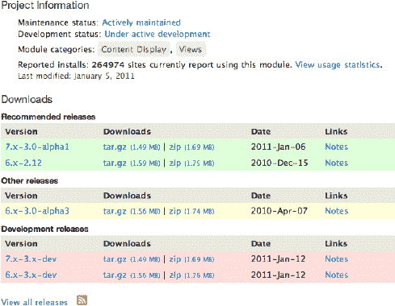

***图 4-2.** Views 模块的版本信息*

- **在走投无路之前，将搜索范围限制在“完整项目”内。** 默认情况下，开发者沙盒模块（没有正式发布版）在 `drupal.org/project/modules` 的搜索中被隐藏。通常你不应该尝试这些未经支持的代码，但如果你找不到其他替代方案，并且愿意为其开发做出贡献，那么你或许能在沙盒项目中找到一些隐藏的宝藏。

- **与所有搜索一样，尝试使用多种关键词组合。** 如果首次搜索没有找到合适的模块，请用更少或不同的关键词再试一次。你也可以将搜索范围从 `Drupal.org` 扩展到整个互联网，利用人们讨论你期望模块时可能使用的更广泛语言来获取信息。（如果你想惠及他人——很可能也包括一两个月后的自己——请记下你用来搜索模块的关键词，并将它们连同成功结果的链接一起发布。）

- **寻求帮助。主动请求你需要制作的模块！** 当所有其他方法都失败时，包括在 Drupal 支持论坛或 IRC（见第 9 章）中提问，请将你的梦想模块发布到 `groups.drupal.org/contributed-module-ideas` 的“贡献模块创意”小组。（仅凭你的请求就有人制作该模块的可能性极低，但这可以成为一个起点！）

#### 模块出现问题时该如何处理

尽管所有这些贡献模块在改善 Drupal 站点功能方面非常有用，但偶尔你可能会发现某个模块无法完全按预期工作，甚至更糟——它可能完全损坏你的站点。发生这种情况时，最简单的做法是卸载该模块并寻找另一个。但 Drupal 社区为你提供了一些额外的选项，让模块能更好地工作。

一个关键的帮助来源是 Drupal.org 的问题队列。通常，在 `Drupal.org` 搜索框中输入错误文本或问题描述，会揭示社区关于你所面临问题的丰富信息。这可能包括社区其他成员解决问题的快速方法列表，也可能包含一个可用于修复该问题的补丁。如果你有自己编写补丁的积极性，为特定模块贡献补丁是回馈 Drupal 社区的好方法。有关补丁的更多信息，请查看关于为社区贡献的第 38 章以及 `drupal.org/patch`。

### 核心中的模块

如果你使用**标准**安装配置文件安装 Drupal，那么以下模块很可能已经在你的 Drupal 安装中安装并启用了：


*   `Block`（区块）——允许您在主题中创建和管理区块。区块类似于小部件或功能片段，您可以将其拖放到页面的指定区域中。可以基于区块应出现或不应出现的 URL 路径、用户正在查看的内容类型、查看内容的用户角色以及当前应用于网站的主题，来控制区块在区域中的显示。
*   `Color`（颜色）——允许您更改支持此选项的主题的颜色。最终用户可以通过定义十六进制颜色代码或从色轮中选择颜色，来指定在网站特定区域使用的颜色。如果您的主题不支持重新着色（或您已完成重新着色），则可以禁用`Color`模块。
*   `Comment`（评论）——允许访问者对网站上的任何内容发表评论。所有内容类型都可以启用评论功能，并且可以为评论添加自定义字段。
*   `Contextual Links`（上下文链接）——控制可帮助您更轻松访问与页面元素相关操作的链接。默认情况下，Drupal 7 会在每个节点和每个区块上放置编辑和删除链接。这为贡献模块（以及您自己创建的模块）提供了出色的可用性，并且可以定义额外的上下文链接。
*   `Dashboard`（仪表盘）——在您的网站上启用管理仪表盘。管理仪表盘在管理界面中提供了一个页面，采用两栏布局，可在其中分配区块以显示网站的“快速概览”信息（例如，最近的评论和登录用户）。
*   `Database Logging`（数据库日志记录）——将记录和条目记录到数据库中。此模块在管理界面中提供了一个报告屏幕，列出站点上的所有近期活动和错误。管理员可以筛选这些记录的条目，并点击查看更详细的信息。
*   `Field SQL Storage`（字段 SQL 存储）、`Field UI`（字段用户界面）——允许您创建字段并将其附加到站点上的内容类型、评论和其他实体。字段可以使用以下可选核心模块以及必需的`Text`模块，以不同格式存储并以不同方式格式化：
    *   `File`（文件）
    *   `Options`（选项）
    *   `List`（列表）
    *   `Number`（数字）
    *   `Image`（图片）
*   `Help`（帮助）——显示帮助文本。通过此模块，其他模块可以向用户（尤其是站点管理员）显示信息，解释 Drupal 用户界面中可用的各种设置或操作。
*   `Menu`（菜单）——允许站点管理员管理站点的导航菜单。
*   `Overlay`（覆盖层）——启用了管理覆盖层。覆盖层旨在通过以页面上的覆盖层形式呈现管理屏幕（以及可选的内容创建/编辑表单），为任务提供上下文。可以禁用此模块而不会丢失任何功能。
*   `Path`（路径）——允许用户创建对搜索引擎友好的 URL。默认情况下，Drupal 对内容使用`node/[节点 ID]`的 URL 模式，例如`node/123`。Path 允许您将其更改为`您想要的任意路径`。（请参阅本章后面讨论的`Pathauto`模块，以便从节点数据（如标题）自动创建路径别名。）
*   `RDF`——将元数据附加到您的内容中，定义您所写的项目在现实世界中是什么。例如，该模块添加了 RDFa 语义标记，指示内容的发布者是其创建者。这让其他站点或工具能够以智能方式查询或组合您的内容，从而理解您的内容。有关 Drupal 7 新 RDFa 功能的更多信息，请参阅第 28 章关于 Drupal 与语义网的内容。
*   `Search`（搜索）——允许用户搜索站点内容。搜索模块提供一个基本的搜索表单（作为区块）和一个带有高级搜索过滤器的搜索页面，使用户能找到更相关的结果。
*   `Shortcut`（快捷方式）——允许管理员创建可通过管理工具栏访问的便捷快捷链接列表。这些链接显示在工具栏的可扩展部分，可通过点击工具栏最右侧的灰色标签来展开。
*   `Taxonomy`（分类）——提供使用词汇表或标签组对内容进行分类的能力。您可以创建无限数量的词汇表，并以添加字段的方式将它们添加到内容和用户中。您可以对词汇表的呈现方式进行一些选择——单选、多选或自由标签。
*   `Toolbar`（工具栏）——在管理界面顶部创建管理菜单。工具栏提供对 Drupal 管理功能的快速链接。
*   `Update manager`（更新管理器）——处理 Drupal 核心和贡献模块的更新，并检查可用的更新。您可以直接从更新管理器下载和更新更多模块。

此外，以下模块是 Drupal 必需的：

*   `Filter`（过滤器）——在显示内容之前对其格式进行过滤。
*   `Node`（节点）——控制站点内容。
*   `System`（系统）——处理管理员的一般站点配置。
*   `Text`（文本）——定义简单的文本字段类型。
*   `User`（用户）——管理用户注册和登录系统。Drupal 核心还提供了更多在标准安装配置文件下默认未启用的模块。您可以根据站点的功能需求考虑启用以下模块：
    *   `Aggregator`（聚合器）——允许您将 RSS 源导入到 Drupal 站点。聚合的项目不作为节点存储。
    *   `Blog`（博客）——启用多用户博客，并设置博客所需的一些标准选项，例如近期文章列表等，而无需使用 Views 模块。
    *   `Book`（图书）——允许您以大纲格式创建和组织内容。
    *   `Contact`（联系）——在 Drupal 站点上创建一个联系表单，并根据最终用户选择的理由将电子邮件分配给不同的收件人。
    *   `Content translation`（内容翻译）——允许您将内容翻译成不同语言。
    *   `Forum`（论坛）——创建类似讨论论坛的功能，以方便站点上组织有序的对话。
    *   `Locale`（区域设置）——允许您将用户界面元素翻译成不同语言（甚至不同的术语）。虽然看起来`Content translation`和`Locale`可以满足您站点的所有翻译需求，但实际上它们只是一个开始。内容和界面的翻译是一个非常复杂的领域——在撰写本文时，Drupal 7 在这方面仍在变化中，但我们将尽量通过贡献模块资源`dgd7.org/translate`让您保持最新信息。
    *   `Open ID`（开放身份）——允许用户使用 Open ID 在线身份管理服务登录您的 Drupal 网站。
    *   `PHP filter`（PHP 过滤器）——允许用户在 Drupal 管理界面中创建内容或自定义区块时使用 PHP。出于安全性和可维护性的原因，不建议使用此模块。
    *   `Poll`（投票）——适用于简单的流行度投票，尽管该模块位于核心中，但历史上并未受到太多关注或开发。
    *   `Profile`（个人资料）——除非您是从 Drupal 6 升级并且启用了`Profile`模块，否则您在 Drupal 7 中甚至不会看到它。它已被弃用，取而代之的是字段和诸如 Profile2 之类的贡献解决方案。
    *   `Syslog`（系统日志）——此模块可替代`Database logging`模块使用，将 Drupal 的 Watchdog 日志存储到资源消耗较少的系统日志中（在 Debian 和 Ubuntu 系统中位于`/var/log/syslog`）。
    *   `Testing`（测试）——一个面向开发者的模块，允许模块开发者对他们为 Drupal 编写的自定义代码运行自动化测试。
    *   `Tracker`（追踪器）——存储关于站点访问和内容变更的信息，这些信息会显示给站点管理员。
    *   `Trigger`（触发器）——一个简单的工作流系统，允许用户对站点上完成的任务添加操作或系统响应，例如当有人在帖子下评论时发送电子邮件。

快速浏览任何 Drupal 安装的模块屏幕（从管理菜单中的**模块**，路径为`admin/modules`），您将看到所有随 Drupal 预装的模块。现在，让我们开始讨论如何通过贡献模块来完善 Drupal 的功能。


### 存放贡献模块的位置

在深入探索 Drupal 的贡献模块（也常称为 contrib）世界之前，我们需要知道将它们放在哪里。你下载的贡献模块应放置在 `sites/all/modules/contrib` 目录下。放在 `all` 目录下意味着它们将在多站点安装中（如果你采用这种方式）的每个站点上可用。放在 `contrib` 目录下（需要你手动创建）则能与你可能创建的任何自定义模块（可放在 `sites/all/modules/custom` 目录下，同样需手动创建）进行适当分离。

贡献模块**切勿**放置在 `sites` 目录之外的任何位置。你为核心或安装配置文件之外添加的所有 Drupal 内容都应放在 `sites` 文件夹中。当你最终更新 Drupal 安装时（这对于应用安全更新和错误修复是必要的，参见第 7 章），将所有非核心数据放在 `sites` 文件夹中，使你只需备份该文件夹，并替换其他所有内容，而无需担心丢失任何数据。

### 站点构建基础

本节中的所有模块均在 Drupal.org 上提供，可通过访问完整的模块列表页面 `drupal.org/project/modules` 找到。正如我们之前提到的，这里列出的模块并非每个 Drupal 站点都必须安装；然而，经验表明，这些模块维护良好且值得了解。此外，这绝非一个完整的列表，适用于任何目的。在寻找特定功能时，建议按照前面描述的方法进行彻底搜索。

从技术上讲，我们这里列出的每一项都是一个“项目”，而非严格意义上的模块，每个模块项目可能包含一个或多个模块。要访问特定项目页面，请使用每个项目名称标题下列出的项目短名称，格式为 `drupal.org/project/project_shortname`。

 **提示** 如果你在使用 Drush，命令 `drush dl project_shortname` 会自动下载并将短名称为 `project_shortname` 的模块解压到 `sites/all/modules/contrib` 文件夹（前提是你先创建了它）；如果你没有创建 `contrib` 目录，则会解压到 `sites/all/modules`。如果你还需要开始使用 Drush，请参见第 2 章。如需高级技巧，请查阅第 26 章。

#### Views

项目：`views`

Views 模块是一个强大的工具，用于构建自定义的内容展示。你可以把它看作一个查询构建器——它允许你通过点击式界面，从 Drupal 的数据库中请求你想要在网站上展示的内容、用户和其他数据。然后，你可以利用 Views 的“样式插件”，以一些非常有趣的方式（如列表、幻灯片或地图）来展示这些内容。

在 Drupal 站点上使用 Views 的原因和动机如此之多，以至于第 3 章专门对此进行了阐述。虽然某些站点（例如，极其简单的站点或高度定制的应用程序）可以在没有 Views 的情况下蓬勃发展，但如今大多数基于 Drupal 构建的网站都在使用 Views。

Views 附带了一些“辅助”模块。其中，Views UI 是最重要的一个——因为它控制着 Views 的用户界面。如果你正在处理一个 Drupal 站点，但无法访问你的任何视图，请检查 Views UI 是否已启用。

#### Chaos Tools（依赖项）

项目：`ctools`

Chaos Tools，也称为 CTools，是一个面向开发者的模块，提供了一组辅助工具，使 Drupal 中一些困难的开发任务变得更容易。其中一些选项包括将 Drupal 配置导出为代码、构建多步骤表单、简化 AJAX 请求的实现和管理。Views 依赖 CTools 提供的某些辅助功能。

如第 3 章所述，Views UI 需要 CTools 才能运行。CTools 包中包含的模块为各种有趣的站点构建工具奠定了基础。

 **注意** 所有模块都可以在 `drupal.org/project/project_shortname` 找到，此项目短名称列在每个模块项目的人类可读名称下方。例如，CTools 模块套件可在 `drupal.org/project/ctools` 获取。如果你想用 Drush 下载模块，请在命令中使用项目短名称；例如，`drush dl ctools`。

#### Pathauto

项目：`pathauto`

你的 Drupal 站点上的每个页面都有其独特的内部路径。默认情况下，Drupal 会在浏览器地址栏中显示这个内部路径。例如，你 Drupal 站点上的第一个节点会在路径 `node/1` 下。Pathauto 允许你为每个节点自动创建人类可读、对搜索引擎友好的 URL。你还可以使用 Pathauto 根据内容类型或 Token 模块能够理解的任何其他内容方面，来设置自动前缀。

例如，使用内容类型的机器名称令牌和标题令牌，可以使所有博客条目自动获得路径别名，如 `example.com/blog/blog-post-title`。Pathauto 由令牌驱动，并依赖于接下来会介绍的 Token 模块。更多关于 Pathauto 的使用示例，请参见第 8 章。

#### Token（依赖项）

项目：`token`

Token 允许你在管理界面的不同区域为 用户、节点 或其他引用创建简单的占位符。这些占位符会在适当的时候被相应令牌的值替换。以使用 Pathauto 创建对搜索引擎友好的 URL 为例，为所有文章定义一个默认模式 `[node:content-type:name]/[node:title]`，然后发布一篇标题为“Education is the path from cocky ignorance to miserable uncertainty”的文章，将会创建 URL `example.com/article/education-path-cocky-ignorance-miserable-uncertainty`。

 **注意** （默认情况下，像“a”和“the”这类意义不大的单词会从 Pathauto 创建的别名中排除，但你可以在*管理*  *配置*  *搜索和元数据*  *URL 别名*  *设置*（`admin/config/search/path/settings`）下的“要移除的字符串”中进行配置。你可以创建视图来匹配 Pathauto 生成的内容类型前缀（例如，在 `story` 路径下提供所有故事内容的视图）。有关创建可定制 URL 的示例，请参见第 33 章。


#### 附加字段类型

在 Drupal 7 之前，字段是通过一个名为内容构建工具包（CCK）的模块以及各种附加模块来处理的，这些模块可以格式化字段，以便为内容添加图片、链接、视频和其他类型的数据。该功能已整合到 Drupal 7 中，成为“字段”和“字段界面”模块。

以下是一些有用的模块列表，它们为“字段”模块添加了自定义字段类型：

*   References（`drupal.org/project/references`）允许您创建对用户或节点的引用，这些引用随后可以在进行引用的内容中显示。随着时间的推移，它可能会被 Relation 模块（`drupal.org/project/relation`）所取代，后者是一种更强大也更复杂的方式，用于将任何 Drupal 实体与任何其他实体关联起来。Block reference（`drupal.org/project/blockreference`）和 View reference（`drupal.org/project/viewreference`）则分别创建了允许管理员选择显示特定区块和视图的字段。
*   Field Group（`drupal.org/project/field_group`）允许您将字段聚类成组，以创建更直观、更精简的内容创建界面和面向最终用户的内容展示。例如，这对于将地址信息或项目相关信息整合在一起非常有用。您可以将字段组显示为可折叠字段集、垂直选项卡或水平选项卡。
*   Link（`drupal.org/project/link`）为带有相关标题的 URL 提供了存储和格式化功能。
*   Media（`drupal.org/project/media`）远不止是一个字段模块，但它确实为不同类型的内容（如视频、图片和文档）提供了格式化功能。它还实现了一个集中的存储空间和系统，用于管理 Drupal 站点上的各种类型的内容。

在 Drupal.org 上还有数十种其他字段可供下载。如果现有字段类型不能满足需求，您也可以创建自己的自定义模块来实现新的字段类型。

#### 所见即所得（WYSIWYG）

项目：`wysiwyg`

Drupal 在内容创建和编辑表单上默认使用纯文本和手动 HTML 输入。虽然这对开发者或熟悉 HTML 的用户来说通常不是问题，但站点编辑者和用户通常更喜欢某种形式的所见即所得编辑器（可以理解为文字处理器），以便更轻松地格式化文本。WYSIWYG 模块正好实现了这一点，您可以从包括 TinyMCE、CKEditor 和 FCKeditor 在内的众多 WYSIWYG 编辑器中进行选择。

 **提示** 任何 WYSIWYG 编辑器都会增加大量复杂性，并且没有一种能完全实现“所见即所得”的承诺——这可能导致在处理内容时遇到很多麻烦，因为其 HTML 标记不如手动输入的那么干净。因此，如果您的站点用户能够借助 Drupal 的自动段落标签和诸如 BUEditor 之类的 HTML 标记辅助工具来处理纯文本内容输入，那会好得多。

为了使用 WYSIWYG，您需要下载一个编辑器库并将其安装在您的 `sites/all/libraries` 文件夹中。有关更多信息，请参阅 WYSIWYG 模块的 `README.txt` 文件及其配置页面。

我们强烈建议除了 WYSIWYG 模块之外，还下载 WYSIWYG line breaks（`drupal.org/project/wysiwyg_linebreaks`）。这个附加模块有助于修复 WYSIWYG 编辑器可能导致的一些 HTML 异常。

##### 替代方案

如果可能避免使用 WYSIWYG，请这样做。这种保持简单的方法将惠及移动设备用户，并保持您内容中的代码更干净。作为完整 WYSIWYG 控件的替代方案，您可以使用出色的 BUEditor 模块（`bueditor`），它添加了用于插入 HTML 标记的按钮。或者，您也可以使用 Markdown 过滤器（`markdown`），它允许您在编辑字段中使用 Markdown 语法。Markdown 语法是一种非常简单的格式化方法，模仿了老式的文字处理应用程序。例如，您可以通过在文本两端加星号来添加粗体文本（例如 `*粗体文本*`），用下划线表示斜体（例如 `_ 斜体 _`），等等。

#### Webform

项目：`webform`

Drupal 自带“联系”模块，它允许您站点上的任何用户向可配置的地址（通过 `contact` 路径的主联系表单）发送快速电子邮件，或者，如果进行了相应配置，也可以发送给站点上的注册用户（路径为 `user/[uid]/contact`）。其局限性在于表单非常基础，只收集用户的姓名、电子邮件地址和简短评论。此外，提交的消息不会存储在站点数据库中，因此除了您的电子邮件帐户之外，没有可回溯的参考点。

对于许多站点来说，这远远不够——某些站点需要更大的灵活性来构建具有任意数量自定义字段、灵活布局选项和报告功能的表单。Webform 模块允许您构建可用于收集数据的自定义表单。您可以使用 Webform 构建联系表单、调查、在线申请等。该模块自带报告功能，并允许您配置电子邮件通知，以便在每次提交表单时发送。

#### AntiSpam 或 Mollom

项目：`antispam`、`mollom`

在任何站点（至少是包含任何类型社交互动的站点）中，最重要的事情之一就是保护站点免受垃圾信息的侵扰。Drupal 的贡献模块提供了几种实现方式。其中在防止垃圾信息和避免激怒用户之间取得良好平衡的两个模块是 AntiSpam 和 Mollom。这两个模块都需要注册一个垃圾信息检测网络服务，根据发送的请求数量，该服务可以是免费的，也可以是付费的。

Mollom 是由 Drupal 创始人 Dries Buytaert 创办的一项服务。每天拦截的垃圾信息数量在一定限额内是免费的。要使用 Mollom 模块，请在 `Mollom.com` 创建一个帐户并注册您的站点。然后将公钥和私钥 API 复制到您站点上的 Mollom 设置页面（`admin/config/content/mollom/settings`）。

 **注意** 默认情况下，如果 Mollom 服务无法正常工作，它会阻止所有表单提交。如果您宁愿偶尔应对垃圾信息的涌入，也不希望在 Mollom 宕机时拒绝所有表单提交，请将“当 Mollom 宕机或不可达时”的设置更改为“接受所有表单提交”。

要使用 AntiSpam 模块，请在 `akismet.com` 注册 Akismet，对于大多数非商业站点，Akismet 是免费的。Akismet 是使用最广泛的防垃圾信息服务，最初是为 WordPress 内容管理系统创建并主要使用的。其配置与 Mollom 非常相似——只需将 API 密钥复制到您站点上的 AntiSpam 设置页面（`admin/config/content/antispam/settings`）即可。

默认情况下，当提交被阻止时，该模块会通过电子邮件通知用户。若要更改此设置，请在 AntiSpam 设置屏幕的常规选项下选择“禁用电子邮件通知”。

 **注意** 除了使用外部垃圾信息检测服务外，CAPTCHA 模块套件（`drupal.org/project/captcha`）允许您插入各种 CAPTCHA（请参阅 `drupal.org/project/captcha_pack`），包括简单的数学问题和可根据您的社区定制的可配置问题。您还可以将其扩展为使用 reCAPTCHA 服务（`drupal.org/project/recaptcha`），该服务提供了必要的无障碍音频 CAPTCHA 作为后备方案。一种完全避免使用 CAPTCHA 的解决方案（即使作为垃圾信息检测的后备方案）是 Hashcash 模块（`drupal.org/project/hashcash`），它依靠 JavaScript 和 hashcash 算法来阻止垃圾信息提交。


### 其他可能实用的模块

在了解了 Drupal 一些最实用的模块后，这里列出了其他一些可能对您特定网站方案有帮助的模块。这份列表绝非详尽无遗；如果您在此处没有找到符合需求的模块，在`Drupal.org`上快速搜索模块，很可能至少会找到与您所需接近的模块。

#### 管理界面与内容录入

Drupal 社区提供了许多有用的模块，可改善您管理网站和内容管理的体验。

##### 工作台

项目：`workbench`

作为 Drupal 7 全新推出的项目，工作台模块套件为内容创作者和编辑者提供了可用性改进，包括可定制的工作流。

##### 环境指示器

项目：`environment_indicator`

环境指示器会在您的网站侧面添加一个彩色条，用以非常清晰地标明您当前所处的环境（开发、测试、生产等）。虽然这更像是一个开发者模块，但如果您不希望因误操作在错误版本的网站上输入内容，它会非常有用。

##### 智能裁剪

项目：`smartcrop`

智能裁剪有助于更好地自动化照片裁剪过程。它提供了一种基于信息熵进行裁剪的图像样式，在裁剪为固定形状时能产生更有效的效果。例如，在将个人资料图片裁剪为正方形时，它可以减少剪掉人物头部的可能性。

##### 内容类型概览

项目：`content_type_overview`

这个极其有用的模块能让您从一个地方编辑多种内容类型的设置。

**配置和使用模块：内容类型概览**

从`drupal.org/project/content_type_overview`页面或通过`drush dl content_type_overview`获取模块后，在模块管理页面（`admin/modules`）启用它。

很难预知一个模块会把自己放在管理页面的哪个分类下，因此，最简便的方法始终是使用浏览器的页面内搜索（尝试组合键`ctrl f`或`command f`）并输入模块名称（其官方名称，而非系统名称）。在本例中，内容类型概览独自位于管理（Administration）分类下。

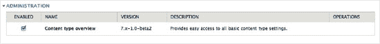

我们勾选它，然后点击页面底部的“保存配置”按钮提交模块页面。Drupal 会提示“配置选项已保存”。我们返回管理页面的条目，希望内容类型概览模块会有 Drupal 7 提供的那些漂亮的配置链接之一，但失望地发现“操作”列中没有任何内容。我们记下要提交一个补丁，将链接添加到`.info`文件中，这样它就会出现在模块页面上，下次操作会更容易。（该问题已发布在`drupal.org/node/1032930`。）

当一个模块未提供指向其配置页面的链接时，您可以自行查找。我们首先在配置（Configuration）(`admin/config`)中查找，因为这是模块配置最常放置的地方。

通过`ctrl f`进行搜索是再次尝试查找该模块的好方法，这次是在众多其他配置项中寻找。

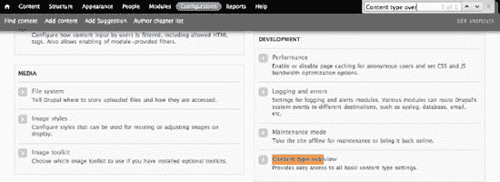

它位于“开发”（Development）之下，这对于一个配置辅助工具来说似乎有点奇怪，但我们在使用 Drupal 的过程中本应早就预料到，并非所有东西都安排得合情合理。我们点击那里的链接，进入`admin/config/development/content_type_overview`。我们勾选了网站上所有内容类型。

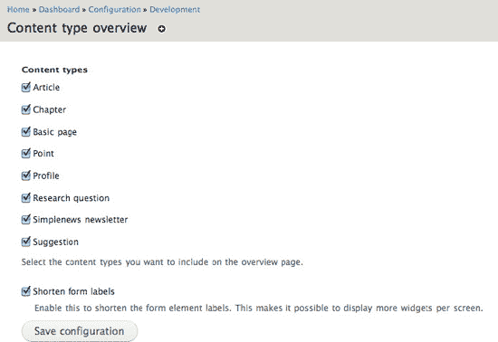

然后我们点击“保存配置”按钮提交表单。耶！

但现在该做什么？这是 Drupal 一个太常见的烦人之处。难道就不能给点提示，告诉我们接下来要去哪里吗？难道我们是通灵师不成？

好吧。我们知道内容类型位于 *管理*  *结构* (`admin/structure`)下，我们去那里找找内容类型概览。嗯，没有。那么，我们点击内容类型（`admin/structure/types`）。嗯...啊哈！在最右边，有一个新的标签页，“概览”。


我们进入那个标签页（`admin/structure/types/overview`）。哇。我们选中的所有内容类型都有几十个选项，全部在一个地方！

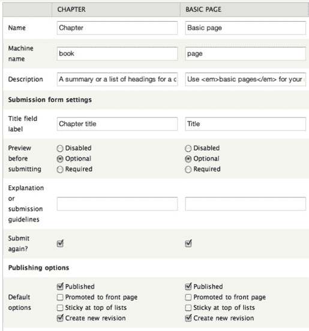

这太棒了。我们可以一次性为所有内容类型设置“创建新修订版本”的发布选项，以及所有其他发布选项，如“推送到首页”和“已发布”。此外，在这个页面上，我们可以更改任何内容类型的名称、描述、标题字段的标签、“提交前预览”按钮是禁用、可选还是必选、提交指南文本、是否显示作者和日期信息、评论设置、菜单设置，甚至是贡献模块的设置，例如“允许重复提交”选项（有关该模块如何升级到 Drupal 7，请参见第 21 章）。

从提交后看到的消息中，我们可以发现它会逐个保存每个内容类型，就像我们逐一访问了所有八个内容类型一样。

##### 模拟登录

项目：`masquerade`

通常，在构建网站时测试用户权限需要您退出网站并以其他用户身份登录。模拟登录模块允许（拥有相应权限的）用户在不登出的情况下切换用户。

#### 内容显示

这组模块将帮助您自定义网站的外观和内容显示方式。

##### 面板

项目：`panels`

作为 Earl Miles（merlinofchaos）的又一力作，面板模块允许网站管理员创建可在网站多个区域使用的自定义页面布局。它还创建了一个拖放界面用于管理内容和区块放置。虽然对于创建动态 Drupal 网站来说并非必不可少，但许多网站构建者会将整个网站建立在面板项目及其所需的工具集（`ctools`）项目提供的模块之上。

##### 代码过滤器

项目名称：`codefilter`

这个模块对于成功开发 Drupal 网站绝非必不可少，但如果您想撰写关于开发的文章并包含代码片段，它就至关重要了！该模块提供了一种简单的方式来添加代码片段并使其格式美观。

它通过提供一个输入过滤器来实现这一点，您必须为一个或多个文本格式启用该过滤器，新启用的模块才会为您工作。

1.  进入 *管理*  *配置*  *内容撰写*  *文本格式*（`admin/config/content/formats`）并编辑（开始时）已过滤的 HTML 格式。
2.  在“已启用的过滤器”列表中，启用代码过滤器。
3.  在“过滤器处理顺序”下，将代码过滤器放在 *“限制允许的 HTML 标签”之后*。
4.  不要忘记点击表单底部的“保存配置”。

 提示 如果您将*限制允许的 HTML 标签*过滤器放在*代码过滤器*之后，它会剥离代码过滤器添加的 HTML。通常的规则是，将*限制允许的 HTML 标签*放在首位，将*修正错误和截断的 HTML*放在最后。

对“完整 HTML”格式执行相同操作，但您无需担心过滤器处理顺序，因为完整 HTML 默认不限制允许的 HTML 标签。

##### Colorbox

项目：`colorbox`

作为流行的 Drupal 6 模块（如 Lightbox2、JQuery Lightbox、Thickbox 等）的 Drupal 7 就绪继承者，Colorbox 帮助您使用 JQuery 在网页前部的覆盖层中显示图像、视频、表单和其他内容。

#### 菜单与导航

下一组模块将有助于放置自定义导航菜单。


##### 菜单区块

项目：`menu_block`

该模块允许你从菜单创建区块——从你想要的任何层级开始。例如：假设你的网站有一个“关于”板块，下设“团队”、“历史”和“真实故事”子项。该模块让你能够创建一个自定义的子菜单区块，该区块仅显示在“关于”板块的页面上。这只是该模块强大功能的冰山一角。

##### 菜单定位

项目：`menu_position`

`菜单定位` 可以告知菜单系统某个页面在菜单层次结构中应属于某个特定位置，而无需为其创建菜单项。这对于确保菜单系统知道所有 12,000 篇博客文章都“属于”博客菜单项下方（因此当查看其中任何一篇时，博客菜单项保持高亮）特别有用，而无需实际将它们添加为菜单链接。过多的菜单链接会严重拖慢网站速度。

#### 社区建设与社交网络

虽然 Drupal 是许多不同类型网站的强大选择，但它特别擅长创建具有社交功能的网站。以下模块旨在帮助用户在网络上构建社区。

##### 评论通知

项目：`comment_notify`

`评论通知` 让您的网站访客（包括登录用户和匿名用户）可以在发表评论时，请求接收后续评论的电子邮件通知。（该模块曾被推荐给 Drupal 创始人 Dries Buytaert，现已用于他的博客，并正被考虑纳入 Drupal 核心。这总是一个好兆头。）

`评论通知` 需要核心 Token 模块（`drupal.org/project/token`）。如果所需模块存在但未启用，Drupal 会提示您启用它，如图 Figure 4-3 所示。

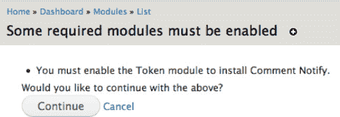

**图 4-3.** *Drupal 提示启用 Token 模块，该模块是评论通知模块的依赖项*

当 `评论通知` 启用后，它会立即开始工作。在 *管理*  *配置*  *人员*  *评论通知* (`admin/config/people/comment_notify`) 下，有一个设置页面，可以配置哪些内容类型可以有通知，是发送所有评论的通知还是仅回复自己评论的通知，默认设置是什么，甚至包括消息的格式。

##### 有机群组

项目：`og`

`有机群组` 提供了一种向 Drupal 添加社交活动的方式，允许用户或管理员在 Drupal 网站内创建自己的“群组”。每个群组可以设定自己的成员标准，并且可以使用您为网站定义的标准内容类型或您创建的自定义内容类型来为群组贡献内容。请参阅 第 5 章 开始使用这套模块。

##### 评分

项目：`rate`

`评分` 为节点和评论提供了一系列投票小部件，这些部件通过 Drupal 7 的字段系统添加和排列。

###### 依赖项：Voting API

项目：`votingapi`

`Voting API` 为模块提供了一套标准化的函数和数据库模式，用于存储、检索和统计投票。它是一项经过充分验证的投票和评级模块最佳实践。Fivestar 模块（`fivestar`）是 Drupal 6 中使用 `Voting API` 的非常流行的模块，它也有 Drupal 7 版本。

##### 用户积分

项目：`userpoints`

`用户积分` 为您提供了一种方法，可以为在您的网站上执行特定操作（例如，发表评论或内容）的注册用户授予“积分”。

##### 个人资料 2

项目：`profile2`

该模块旨在允许用户在您的网站上创建个性化资料，这些资料可以使用 Drupal 的字段 API 进行定制。推荐使用此模块代替核心的 Profile 模块，Drupal 开发者曾试图将后者转换为使用字段，但最终不得不将其隐藏。

##### 角色限制

项目：`role_limits`

`角色限制` 允许您设定可拥有特定角色的用户数量上限。例如，如果您想限制特定群组可拥有的成员数量，或网站上可以被授予管理员或编辑角色的用户数量，这将非常有用。

#### 路径、搜索与 404 错误

下一组模块有助于控制和扩展 Drupal 对搜索和 404 错误的处理。

##### Apache Solr

项目：`apachesolr`

`Apache Solr` 提供了远超 Drupal 核心搜索模块的内容搜索能力，但它并非单打独斗。`Apache Solr` 是一个集成模块，意味着它使 Drupal 能够与外部应用程序协同工作。您无需编写任何代码即可使用它，但其设置过程比大多数模块复杂一些，这在 第 31 章 中有所介绍。

##### 搜索 404

项目：`search404`

该模块用针对未找到路径中的关键词进行的网站搜索，替换了毫无帮助的“文件未找到”页面。

 **警告** 当路径未找到时，执行搜索而非提供轻量级页面，可能会给服务器资源带来巨大压力。您应经常在 Drupal 的 watchdog 日志中检查 404 错误（如果使用数据库日志模块，则在 `admin/reports/dblog` 查看；如果使用 Syslog 模块，则在服务器系统日志中查看）。如果存在应指向特定页面的常见错误 404 路径，您应在服务器配置中设置这些页面的重定向，或者至少使用 Redirect 模块（该模块在 404 页面上提供了一个方便操作链接）。如果您经常注意到与网站无关的路径，您需要将其屏蔽，以免每次搜索路径时进行的大量工作消耗您的主机资源。目前尚未找到最佳方法，请参阅 `dgd7.org/fast404` 获取最新建议。

##### 404 导航

项目：`navigation404`

这个较小的模块解决了一个 Drupal 网站中常见的简单但烦人的问题。`404 导航` 确保 Drupal 在“文件未找到”页面上保留您的网站导航菜单。如果您为文件未找到设置了备用页面，包括使用了 `搜索 404` 模块，则无需使用 `404 导航`。

##### 全局重定向

项目：`globalredirect`

`全局重定向` 确保当人们访问您网站上的某个页面时，他们看到的是您最新、最漂亮的别名，而不是 Drupal 风格的内部路径或您的倒数第二个别名。启用 `全局重定向`，它就会开始工作：有一个配置页面，但在几乎所有情况下，默认设置都能很好地为您服务。

请注意，`全局重定向` 对于防止搜索引擎将多个路径解释为重复内容并非必需（Drupal 7 添加了规范链接标识符），并且它不适用于多语言网站和某些服务器配置。

#### 杂项

如果没有一些难以归类的东西，那它就不是 Drupal：只要能想到，就能把它做成模块。

##### 机器人

项目：`bot`

`机器人` 模块运行一个 IRC 机器人。有关 IRC（Drupalistas 实时聊天的核心聚集地）以及由该模块驱动的 Druplicon 机器人的更多信息，请参阅 第 9 章。

##### OpenLayers

项目：`openlayers`

`OpenLayers` 使您能够将来自不同来源的地图与来自您的 Drupal 网站的数据相结合，创建令人惊叹的在线地图。


### 这一切之美

我们可以用有用的模块及其描述填满本书的剩余篇幅，但随着模块世界的不断演变，我们建议使用 `Drupal.org` 和网络上众多的博客。我们甚至还在本书的配套网站上建立了一个专门的论坛板块，列出了许多推荐模块及其描述，并附有通往其他网络资源的链接。

至此，希望你已经意识到用 `Drupal` 构建强大的网站是多么容易。大部分繁重的工作已经为你完成，而且有一个完整的社区理解分享的价值，这意味着即使你不是一名 `php` 开发者，也能实现更多目标。所以下次当有人问你 `Drupal` 能否做到某事时，开始搜索吧，也许你可以说：“有一个模块专门干这个！”


**提示** 本章并不声称列出了最好的模块，也不是针对每种用途的模块，但鉴于本书的标题和人性，对于遗漏的内容必定会有*大量*激烈的观点！欢迎加入 `dgd7.org/modules` 的讨论。

## 使用 Organic Groups 创建社区网站

**作者：Ed Carlevale**

`Drupal` 的许多方面在未来几年将被视为革命性的，但这场革命（在很大程度上仍未被充分开发）与角色和权限设置中蕴含的力量有关。大多数网络平台提供两到三个角色，通常是用户、会员、管理员的一些变体，然后就完事了。当然，`Facebook` 是个例外，它拥有出色的界面和好友类别的变体。`Facebook` 将其用户转变为管理员，将其访客转变为贡献者，这是一种连马克思和华尔街都会为之鼓掌的职责重新划分。

`Drupal` 可以做到同样的事情，甚至更多……而正是“更多”带来了问题。成百上千的选项与零个选项有很多共同点。然而，正是在这里，`Drupal` 中的群组构建提供了最强大的力量，而且是革命性的力量，因此我们将在部署 `Organic Groups 模块` 的基本步骤之后，再回到这个想法。

启动并运行 `Organic Groups` 的步骤其实很基础。创建一个名为 `Group` 的内容类型，并用它在你的网站上创建任意数量的群组。然后创建其他内容类型，如 `Blog`、`Events` 和 `Aggregator`，以创建你发布到群组中的内容。接着添加成员，并为他们分配适当的角色，例如 `Group Manager`、`Administrator`。`Organic Groups` 的一个特点在于，其魔法主要在数据库内部运作。要在你的网站上显示成员、内容和群组之间的关系，需要借助其他模块的帮助，主要是第 3 章中介绍的 `Views`，以及这里将要介绍的 `Panels`。`Views` 从数据库中选取并排序信息，而 `Panels` 允许你将其放置在页面上。`Blocks` 和 `Regions` 也能做到同样的事情，但它们依赖于你的主题。`Panels` 让你摆脱主题的限制，从而能够以更强大、更灵活的方式选择和排列内容。

本章的练习涉及为老年人建立一个网站。任何曾尝试教父母电脑基础知识的人都知道，指令必须清晰，提问的机会要充足，耐心依然是一种美德。构建一个基于社区的网站也是如此。这项工作本质上是试图让其他人参与到你的群组中来。`Drupal` 集强大、简单和古怪于一身的特点，可能会给新手带来障碍。因此，设计一个以简洁为目标的界面至关重要，网站资源如操作指南和视频也是如此。

好消息是，`Drupal 7` 最好的方面之一在于其对 `Drupal` 界面的改进。过去需要十次点击的操作，现在只需要一两次，开发网站也不再感觉像骑着弹簧单高跷去上班一样颠簸。

### 安装和配置 Organic Groups

你将从一个全新的 `Drupal 7` 安装开始，然后随着本章的推进，下载并启用新的贡献模块。一开始你需要的是 `Organic Groups` 和 `Views` 模块。这两个模块各自又需要一个辅助模块——`Organic Groups` 需要 `Entity` 模块，`Views` 需要 `CTools` 模块——所以我们也需要下载它们。为了安装这些模块，我们将使用 `Drupal 7` 新的自动化安装功能（`admin/modules/install`），并添加每个模块当前推荐的版本：

*   `Organic Groups` （`drupal.org/project/og`）
*   `Entity` （`drupal.org/project/entity`）
*   `Views` （`drupal.org/project/views`）
*   `CTools` （`drupal.org/project/ctools`）


**注意** 本书编写时，`Drupal 7` 的 `Organic Groups` 仍处于主要开发阶段。本章将重点介绍基本功能，这些功能很可能保持不变。结尾部分将涉及未来版本中可能演变的功能。

`Organic Groups` 项目包含七个模块（见图 5-1）——在本章中，我们将使用除 `Migrate` 模块之外的所有模块，因此在一开始就将它们全部启用可能是最简单的做法。

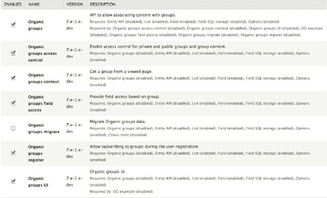
***图 5-1**. Organic Groups 模块套件*


**注意** 当你启用 `OG` 访问控制模块时，系统会提示你重建权限。点击“是”，以便 `Drupal` 系统可以执行此更新。

你还需要启用 `OG Example` 模块（见图 5-2）。该模块位于模块页面的“特性”部分。事实上，你也可以通过 `Features UI`（`structure/features`）来启用该模块。但如果你在模块页面进行操作，系统会提示你启用该示例所需的各种辅助模块（见图 5-3）。

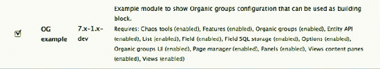
***图 5–2**. OG Example 模块*

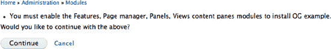
***图 5–3**. OG Example 模块所需的辅助模块*


### 组内容类型

默认情况下，标准 Drupal 安装包含两种内容类型：文章和基本页面。当启用 OG 示例模块后，会增加两种内容类型：组和帖子（参见 图 5–4）。

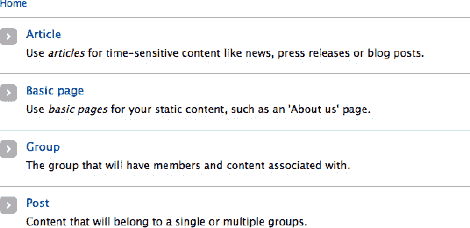

***图 5–4.** 启用 OG 示例模块后，新增了两种内容类型：组和帖子。*

我们将使用“组”内容类型为网站创建群组，并使用“帖子”内容类型创建要发布到群组中的内容。现在打开“组”内容类型，以便调整其部分设置。进入“结构” →“内容类型”，然后选择“组”内容类型（`admin/structure/types/manage/group`）。进行以下更改：

- 将标题字段标签改为“组名称”。
- 描述：“创建一个新群组。”
- 发布选项：取消勾选“推送到首页”。
- 显示设置：取消勾选此选项。
- 评论设置：关闭。

结果应类似于 图 5–5。

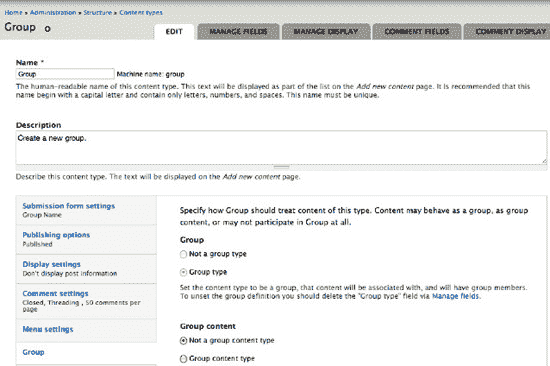

***图 5–5.** 组内容类型*

请注意，当启用 OG 模块后，表单中添加了新的垂直选项卡“组”。此设置允许您将一种内容类型指定为群组、群组内容，或两者都不是。使用“组”内容类型创建的节点应为群组，因此单选按钮设置为“组类型”。保存修改后的表单。

接下来，再次打开“组”内容类型，这次在“管理字段”选项卡下，将“正文”标签改为“使命宣言”（参见 图 5–6）。正如任何励志演说家都会告诉你的那样，为任何事业定义明确的使命宣言是迈向成功的第一步。即使您不在网站上显示该字段的标签，了解这是我们要做的事情也有助于明确我们为添加到网站的每个群组所设定的目标。点击“编辑”，将标签从“正文”改为“使命宣言”。

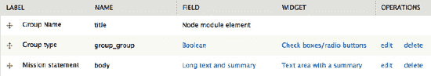

***图 5–6.** 修改“组”内容类型的字段标签*

接下来，点击“管理显示”选项卡进行最后一项调整。为了允许网站访客自行订阅群组，您需要启用“订阅”选项。通过将“组类型”的格式设置为“群组订阅”来实现此目的（参见 图 5–7）。

然后保存表单。

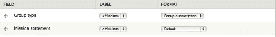

***图 5–7.** “管理显示”选项卡。通过将“组类型”字段的显示方式修改为“群组订阅”，可以控制对群组的订阅。这会在每个群组页面放置一个“加入”链接。*

### 创建群组

现在，我们将使用“组”内容类型为网站创建一些群组。点击快捷工具栏上的“添加内容”，会弹出网站上可用的内容类型。选择“组”（`node/add/group`）。我们将添加一个“iPad 用户群组”，填写使命宣言，然后保存表单（参见 图 5–8）。

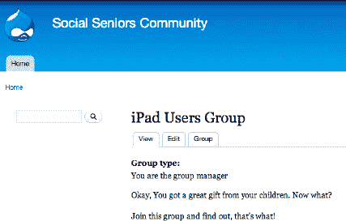

***图 5–8.** iPad 用户群组首页*

群组首页已添加一个新的“组”选项卡，拥有相应权限的用户可以看到该选项卡，同时会显示消息“你是群组管理员”。非群组成员和管理员则会看到“申请加入群组”链接。“组”选项卡允许群组管理员添加成员并修改角色和权限。我们稍后会处理这些选项。

但基本上，这里的页面设计并不多，这也是需要借助 Views 和 Panels 模块的原因。

### 在 Organic Groups 中使用 Views

OG 模块包含四个内置视图（参见 图 5–9），它们可以帮助您入门。

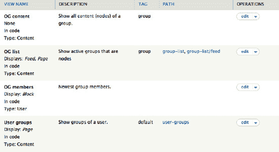

***图 5–9**. OG 模块包含的四个默认视图*

OG 列表将用作群组着陆页，因此请打开该视图并进行一些调整。开箱即用时，该页面视图有一个路径（`group-list`）但没有菜单（参见 图 5–10），而您希望从主菜单访问此页面。因此，请向主菜单添加一个菜单项。

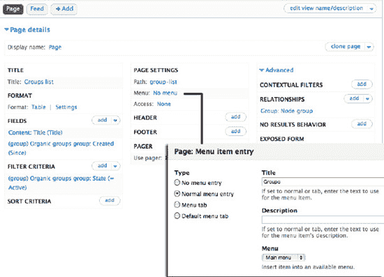

***图 5–10**. 群组列表视图*

点击“页面设置”下的菜单链接，向主菜单添加一个名为“群组”的菜单项。点击保存视图。现在，您就有了一个“群组”选项卡和一个基础版的群组着陆页（参见 图 5–11）。

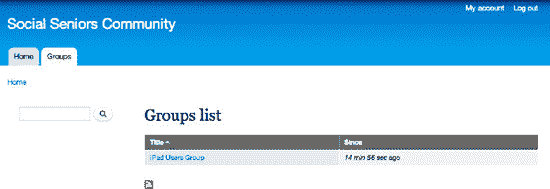

***图 5–11**. 群组着陆页*

其他视图会创建显示群组成员和群组内容的区块，因此您需要先向群组添加一些内容和成员，这些视图才能发挥作用。

### 创建群组内容

为了向群组添加一些内容，您需要创建可用于创建要发布到群组中的节点的内容类型。您可以简单地使用 OG 示例模块附带的“帖子”内容类型。但这里我们选择启用 Drupal 自带的博客模块（参见 图 5–12），方法是进入模块页面（`admin/modules`）。


***图 5–12**. 启用博客模块*

启用后，打开“博客”内容类型（`admin/structure/types/manage/blog`），并将此内容类型指定为群组内容类型（参见 图 5–13）。这意味着当您使用此内容类型创建内容时，您可以选择将该内容发布到网站上的任何群组中。

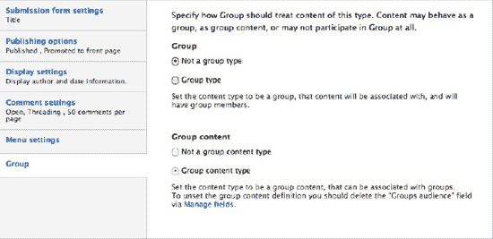

***图 5–13**. 将博客条目指定为群组内容*

不知为何，我觉得高尔夫爱好者比 iPad 初学者更有可能写博客，因此我创建了一个新群组（`node/add/group`）——“小鸟球”高尔夫球友会，并创建了一条博客条目（`node/add/blog`）发布到该群组中（参见 图 5–14）。

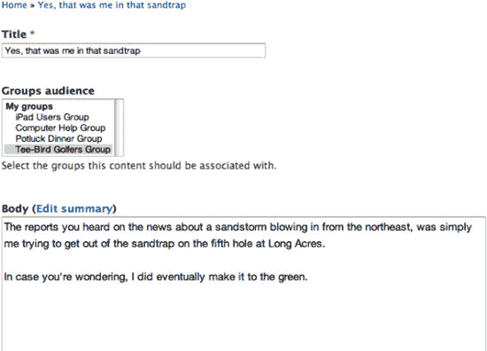

***图 5–14**. 当一种内容类型被指定为“群组内容”后，节点创建表单上会添加一个“群组受众”下拉菜单，允许用户将内容发布到一个或多个群组中。*

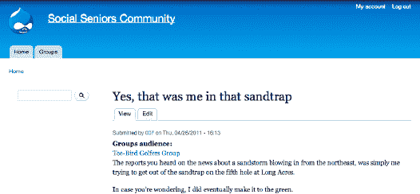

***图 5–15**. 发布到“小鸟球”高尔夫球友会的博客文章*

群组内容上会添加一个群组链接（参见 图 5–15）。但群组内容和群组着陆页（参见 图 5–16）看起来仍然有些简陋，因此您现在需要启用 Panels 模块来辅助布局。

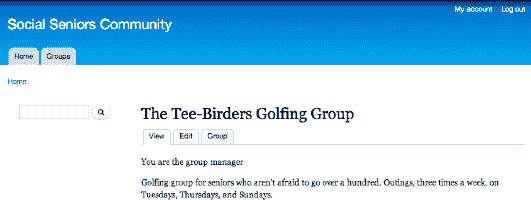

***图 5–16.** “小鸟球”高尔夫球友会首页*


### Panels 入门

当您启用 OG 示例模块时，就已经启用了 Panels 及其辅助模块。现在您需要启用面板本身。请前往 结构  页面 (`admin/structure/pages`)，并启用控制节点模板的面板（图 5–17）。

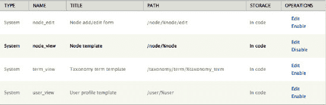

***图 5–17**. 启用 OG 模块中包含的 Panels 示例*

启用的面板会立即接管您群组首页的布局（参见图 5–18）。除了群组使命陈述外，群组首页现在还会显示三个与群组相关的元素：

*   群组内容，以摘要格式显示
*   用于添加新内容并将其发布到当前群组的上下文链接
*   群组成员列表

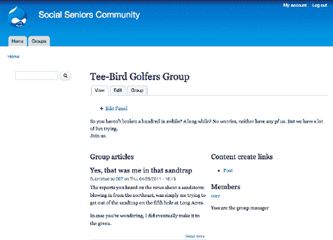

***图 5–18**. 使用 Panels 提供的布局显示的群组首页*

如果您点击“编辑面板”链接，将进入面板的管理界面（参见图 5–19）。左侧的垂直菜单提供了指向面板管理界面不同部分的链接。

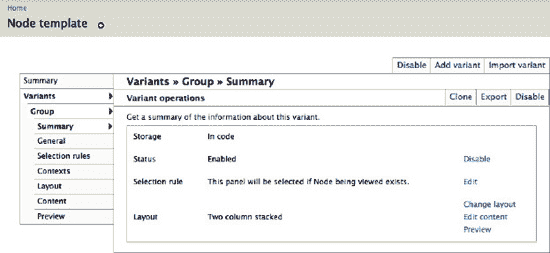

***图 5–19.** OG 示例面板的设置摘要*

关键的设置有“选择”（决定面板激活的条件）和“布局”（决定使用单列、双列还是三列布局，以及显示哪些内容）。OG 示例面板的默认设置包括：

*   **选择**: 面板将对所有群组节点激活（参见图 5–20）。
*   **布局**: 选择了三列布局（参见图 5–21）。
*   **内容**: （参见图 5–22）。

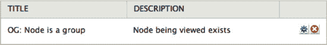

***图 5–20**. 显示选择设置。面板将用于所有群组节点。*

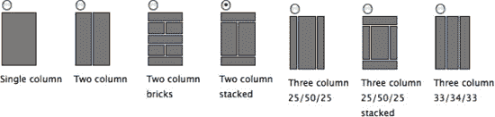

***图 5–21**. 显示模板布局。选择了双列堆叠布局。*

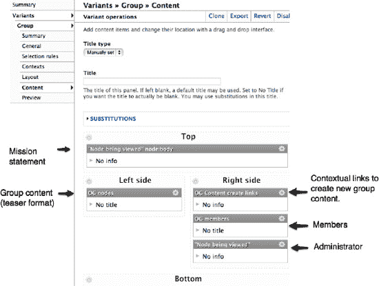

***图 5–22**. 面板内容*

对 Panels 的全面讨论超出了本章的范围，但 OG 示例面板提供的快速入门是这个强大模块的一个实用介绍。更多信息，包括视频和教程，请参见 Panels 3 文档页面 (`drupal.org/node/496278`)。

### 成员、角色和权限

在很大程度上，与群组成员管理相关的功能反映了 Drupal 本身，区别在于这些设置是在逐个群组的基础上进行的。一旦创建了新角色（`admin/config/group/roles`，参见图 5–23），就可以为该角色设置特定于群组的权限（`admin/config/group/permissions`，参见图 5–24）。

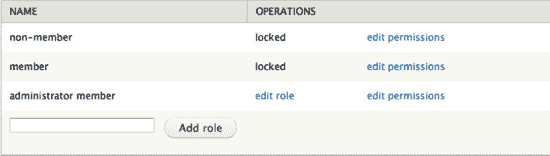

***图 5–23**. 与群组相关的角色*

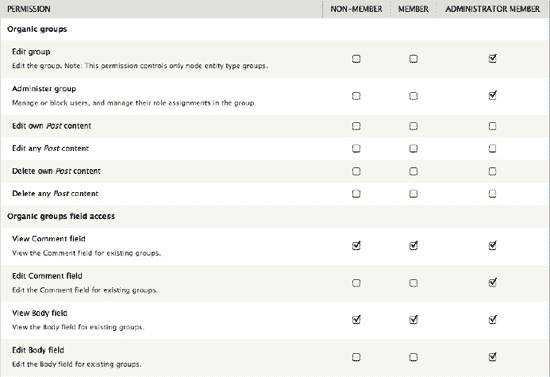

***图 5–24**. 与群组相关的权限*

适用于 Drupal 7 的 Organic Groups 仍在积极开发中，将继续演进，因此强烈建议关注该模块的问题队列（`drupal.org/project/og`）。

### 总结

在本章中，我介绍了在 Drupal 7 中构建基于群组的网站的基础知识，包括在后端部署 Organic Groups 模块来创建群组和群组内容，以及建立群组、内容和用户之间的关系。然后，我展示了如何启用 Views 和 Panels 模块来组织页面上的内容和调整其位置。用户体验是构建成功的用户驱动型网站的关键，我涉及了一些关键问题，包括角色和权限。

## 第 6 章


## Drupal 中的安全性

**作者：Stéphane Corlosquet**

> *“安全是一个过程，而非一个产品。产品提供一些保护，但在这个不安全的世界上有效开展业务的唯一方法是建立能够认识到产品固有安全风险的流程。”*
> 
> —布鲁斯·施奈尔

互联网上充斥着试图破坏或摧毁你的网站、损害你的品牌、瘫痪你的社区或窃取机密数据的垃圾邮件发送者和黑客。无论你是网站管理员、模块开发者、主题制作者、系统管理员还是用户，在管理网站或编写代码时，你都应该牢记安全性。如果你不遵循一些简单的规则和最佳实践，你可能会将自己或他人的网站置于危险之中。幸运的是，在这种情况下你并非孤立无援，Drupal 社区已经开发了一套可靠的流程，帮助你在处理安全问题时避免严重的麻烦。

### 搭建安全的 Drupal 站点

让我们从好消息开始：Drupal 在开箱时就已配置为安全的！这是因为其默认采用了相当保守的设置。你很可能需要更改这些设置，以根据自己的需求扩展和调整网站，而这时就存在为不速之客破坏网站打开方便之门的风向。不过，你并非独自面对：凭借其改进的用户界面，Drupal 7 会在某项设置可能对安全产生影响时向你发出警告。但是，不要仅仅依赖于此；运用常识，继续阅读以了解 Drupal 站点配置不当的常见陷阱。

#### 使用强密码

这条建议同样适用于任何使用密码进行身份验证的系统：你必须使用强密码（参见图 6–1）。任何知道你密码的人都可以登录并在网站上执行潜在的破坏性操作。对于用户 id 为 1 的账户或任何具有高权限的账户尤其如此。


***图 6–1.** 使用强密码保护你的用户账户安全。*

但什么构成强密码呢？

[`www.baekdal.com/tips/password-security-usability`](http://www.baekdal.com/tips/password-security-usability) 上的文章表明，包含三个常见单词的密码比常规的单单词密码安全十倍。（顺便一提，Drupal 的密码可以包含空格。）

同样重要的是，不要与任何人分享你的密码。同样，不要为网站管理和审核目的创建在用户间共享的账户。如果一组用户需要在网站上执行类似操作，请为每个用户创建一个账户，并授予他们相同的角色；这将使追踪谁做了什么变得更加容易。

你的账户还会关联到一个电子邮件地址。趁此机会，请确保你信任你的电子邮件提供商，并且在那里也使用了强密码；如果你的电子邮件账户被攻破，你的 Drupal 账户密码可能在几秒钟内被重置，从而破坏你为创建强密码所做的努力。

#### 保留用户 1 仅供管理目的使用

在安装过程中创建的第一个用户始终被授权在网站上执行所有操作。因此，最佳实践是将此用户不作为个人的账户，而是作为一个超级用户或超级管理员账户。（Drupal 要求账户电子邮件地址是唯一的，所以如果你只有一个电子邮件地址，最好将第一个账户设为你的个人账户，而不是使用一个错误的电子邮件地址。但请注意，一些电子邮件服务允许你使用变体地址：例如，[example@gmail.com](http://example@gmail.com) 会收到发送至 [example+site1@gmail.com](http://example+site1@gmail.com) 的电子邮件，并且 Drupal 会将后者视为一个独立的地址。）

 **注意** 在 Drupal 6 中，有时需要共享 uid 1 密码才能在不编辑 `settings.php` 的情况下运行 `update.php`，但在 Drupal 7 中已不再需要，因为运行 `update.php` 的能力现在是基于角色的。


#### 分配权限时务必谨慎

每个用户可被赋予一组角色，而每个角色包含一组权限。有些权限相当无害，例如`View published content`，但其他权限可能带来严重后果。通常，以"Administer"开头的权限应仅授予高度信任的用户。其他权限，如`Bypass content access control`，可赋予查看、编辑和删除任意内容的能力：若将其授予粗心的用户，可能导致信息丢失。Drupal 7 会高亮显示这些权限，并附上警告，提示仅应授予受信任用户，如图 6–2 所示。


**图 6–2.** 某些权限存在安全隐患，应谨慎授予。

请注意，`Authenticated User`角色会被赋予任何能够登录你网站的用户——除非其账户已被封禁。默认情况下，Drupal 配置为要求新账户需管理员批准，但如果你已在`admin/config/people/accounts`更改此设置，允许访客无需批准即可注册账户，则应审查`Authenticated User`角色所拥有的权限，并确保它们都是安全的。若不这样做，可能导致意外后果，例如由于`Post comments`和`Skip comment approval`权限默认都授予了`Authenticated User`，现有节点上可能会涌入大量垃圾评论。

#### 保持文本格式安全严格

用户输入是危险的，绝不应被信任。除了少数地方（如电子邮件地址）会在输入时验证用户数据外，Drupal 在输出时会对用户提交的数据进行清理。这样做的好处是保留用户输入数据，以便根据渲染上下文进行适当的转义。关于此设计选择的深入解释，请参阅 Steven Wittens 在`acko.net/blog/safe-string-theory-for-the-web`发表的优秀文章《Web 安全字符串理论》。因此，未能转义任何用户提交的数据都可能导致最常见的 Web 应用程序漏洞之一：跨站脚本攻击（XSS）¹。例如，当用户在文本字段（如节点的正文）中提交内容并显示时，Drupal 会使用文本格式。每种文本格式都包含一组过滤器，这些过滤器会对内容进行转义，使其能在特定上下文中安全显示。默认情况下，文本格式`Filtered HTML`和`Plain Text`是安全的，因此它们可供匿名用户和认证用户使用。如果你更改了这些文本格式的设置，请务必谨慎；配置不当可能导致它们变得不安全。`Security Review`模块²能轻松检查文本格式配置。

_________

¹ Wikipedia，“跨站脚本攻击”，[`http://en.wikipedia.org/wiki/Cross-site_scripting`](http://en.wikipedia.org/wiki/Cross-site_scripting)，2011。

² [`http://drupal.org/project/security_review`](http://drupal.org/project/security_review)

#### 避免使用 PHP Filter 模块

虽然能够直接在 Drupal 网页界面中编写 PHP 代码而无需创建模块很方便，但这也非常危险！所有 PHP 代码都应以模块或主题的形式存在。在 Drupal 的网页界面中编写 PHP 代码是个坏主意，原因如下：

- 编辑和调试不友好（没有语法高亮和适当的错误报告）。
- 使代码审查变得困难，且无法进行版本控制。
- 受信任的用户可能会因格式错误的 PHP 代码而无意中损坏你的站点。
- 如果你的网站遭到入侵，黑客可以使用精心构造的 PHP 代码渗透并破坏你的服务器。关闭`PHP Filter`模块（甚至最好从文件系统中彻底删除它）有助于将此类入侵限制在仅影响 Drupal 层面。
- 就性能而言，将 PHP 代码存储在数据库中将阻止任何操作码缓存机制对这段代码生效。

请注意，某些贡献模块可能提供与`PHP Filter`模块类似的功能；它们也会遭受上述相同的缺陷。同时，使用来自`drupal.org`或其他地方的 PHP 代码片段时要格外小心：确保你理解它们的作用以及它们会如何影响你的站点。许多此类代码片段并未从安全角度进行审查，可能会使你的网站暴露于漏洞之中。代码片段通常也比模块中的代码可靠性更低。

### 安全流程

作为网站管理员，安全不仅仅是在搭建网站时才需要考虑的事情。Drupal 核心项目维护者能做的只是发布软件时确保其没有已知安全漏洞。然而，这并不能保证未来永远不会出现安全问题。网络上的事物变化迅速，新的安全漏洞和技术不断被发现。它们可能并非 Drupal 特有，而是可能影响任何基于 Web 的系统。

Drupal 安全团队由一群志愿者组成，他们致力于通过帮助网站管理员和开发者了解如何避免站点及代码中的安全问题来维护 Drupal 的安全。Drupal 安全团队的首要目标是帮助解决 Drupal 核心和贡献模块中的安全问题。所有报告给安全团队的问题首先会与报告者和项目维护者进行私下讨论，直到找到解决方案并在代码仓库中完成修复。安全团队通常会在周三发布周期性的安全公告（SA）。每个 SA 都有一个唯一的 ID，包含其类型和年份。共有三种类型的公告：

- **Drupal 核心安全公告**（例如`SA-CORE-2010-002`）是最重要的公告类型，因为它们关系到每一个 Drupal 站点。强烈建议进行更新。
- **贡献项目安全公告**（例如`SA-CONTRIB-2010-015`）是安全团队发布数量最多的公告类型。每份公告涉及特定的贡献项目（或有时涉及多个项目），站点维护者应仔细评估他们所维护的站点是否受到影响，并进行适当更新。
- **公共服务公告**（例如`PSA-2011-001`）旨在教育社区，包含一般性的安全相关信息，例如安全策略变更、近期威胁或社交工程攻击——这些攻击不影响特定模块，但都与站点管理员和开发者相关。

安全公告和通知通过以下渠道公开发布：

- `Drupal.org` 安全公告列表，位于`drupal.org/security`
- 各列表的 RSS 源：
  - 核心：`drupal.org/security/rss.xml`
  - 贡献：`drupal.org/security/contrib/rss.xml`
  - 公共服务公告：`drupal.org/security/psa/rss.xml`
- 通过“安全公告”邮件列表发送电子邮件；包含所有三种类型的公告。你可以在`drupal.org`编辑个人资料时，在“我的新闻通讯”选项卡中订阅。
- Twitter：`twitter.com/drupalsecurity`

所有安全公告都包含解决当前安全漏洞的步骤。大多数情况下，会提供一个指向安全版本的链接，供网站管理员更新其站点。在极少数情况下，当项目维护者不响应或无法修复问题时，安全团队可能会建议关闭特定模块。PSA 则包含关于安全最佳实践的更一般性建议。


#### 选择模块和主题：贡献项目的安全性如何？

Drupal 核心中的每一行代码在提交到代码库之前都要经过严格的同行评审流程；即使在提交之后，由于开源软件的特性，这些代码也会持续受到数百名贡献者的审计。`drupal.org` 上免费提供了数千个贡献项目。Drupal 社区试图在保持新贡献者的低准入门槛与接受干净、安全的代码之间找到平衡，但不断增长的社区以及仅有少数志愿者在代码质量方面进行监控，使得这项任务变得非常困难。结果是贡献项目领域中的代码质量参差不齐。然而，`Drupal.org` 上的代码比 `Drupal.org` 之外其他地方找到的代码更有可能具有更高的质量，因为社区往往对 `Drupal.org` 上的代码审查得比任何其他地方都更严格。

作为一位正在考虑在您的网站上安装模块或主题的站点管理员，您有责任从安全角度评估项目的质量。无论是安装过程中还是后来因安全漏洞造成的任何损害，Drupal 社区和项目维护者均不承担责任。

评估项目的价值是一项有些主观的任务。下一节中的每个标准单独来看都不能给你完整的画面；希望结合使用它们，您将能够为您的站点在选择贡献项目时做出明智的决定。

#### 项目主页

项目主页包含大量有用的信息来评估项目的健康状况。这些元素将有助于您的评估。贡献项目页面的一个例子是 `drupal.org/project/views`。图 6–3 和 6–4 对比了一个被放弃的项目和一个维护良好的项目。

- **维护者的声誉如何？** 您可以在项目页面的右侧找到维护者列表及其活动情况。如果您不认识某个维护者，可以在 `drupal.org` 上查看他的个人资料，了解他在社区的参与情况；他可能维护着您知道或使用的其他模块。如果该项目有一位近期活动频繁的知名维护者，这是个好迹象。
- **模块开发的活跃度如何？** 该模块是否已被放弃或正在寻找新的维护者？此信息可在项目描述页面上找到（参见图 6–3 中一个被放弃且过时的模块示例）。属于这些类别的模块未来不太可能得到任何关注，并且可能包含安全漏洞。尽管 Drupal 安全团队通常会在已知包含安全漏洞的被放弃项目的描述中添加警告信息，但缺少此类信息并不意味着使用被放弃的项目是安全的。
- **流行度：** 查看图 6–4 中“项目信息”部分显示有多少网站报告使用了某个项目。使用某个项目的网站越多，它越有可能已经经过审查并且值得信赖。

  

  **图 6–3.** 一个被放弃项目的项目信息部分

  

  **图 6–4.** 一个维护良好的项目的项目信息部分

- **发布版本：** 避免在生产网站上使用开发版。如果您的 Drupal 版本有稳定版，请选择稳定版。不稳定版、Alpha 版、Beta 版或候选发布版可能包含安全漏洞，这些漏洞通常会被公开讨论。如果您决定在您的网站上使用此类模块，请务必了解这些漏洞是什么，并采取正确的措施来保护您的站点。
- **该项目是否有已知的安全漏洞？** 位于每个项目主页右侧的“问题”板块显示了关于该问题及错误报告的统计数据（参见图 6–5）。点击未解决问题的数量，可以查看详尽的问题列表，如图 6–6 所示。
- **检查问题队列，查看截至目前报告了哪些未解决的突出问题，以及其中是否有安全问题。** 查看问题队列中的“最后更新”列，可以让您了解项目开发的活跃程度（参见图 6–6）。看到状态为“已修复”的问题，是项目维护良好的有力证明。您可能需要使用问题列表顶部的筛选器，将搜索范围缩小到模块的特定版本或特定类型的问题，例如错误报告。


**图 6–5.** 点击未解决问题的数量以浏览问题队列


**图 6–6.** 活跃的问题队列是健康模块的标志。

#### 安全代码审查

如果您找到了一个符合您需求但对其安全级别有疑虑的贡献项目，该怎么办？它可能尚未达到稳定发布版本，或者您所在部门可能要求任何代码在使用前都必须经过安全审查。

如果您是开发者，`Coder`^(3) 和 `Secure Code Review`^(4) 模块将极大地帮助您识别不符合 Drupal 安全标准的代码片段。虽然这些模块对于进行安全审查的第一遍检查相当不错，但它们不能保证模块是安全的，也不能替代安全专家的眼睛。

如果您更愿意聘请熟练的顾问来进行代码审查，有几家 Drupal 公司专门从事这一专业领域，其中最著名的是由 Greg Knaddison 和 Ben Jeavons（两人均为 Drupal 安全团队成员）运营的 Drupal Scout (`drupalscout.com`)。


#### 保持你的代码库最新

正确配置 Drupal 只是迈向一个安全 Drupal 站点的第一步。像 Drupal 这样的动态 Web 应用，在互联网上不能不加维护，因为每天都有新的威胁和漏洞被发现。认为一旦构建好一个站点并将其推送到生产环境后，就可以置之不理而不必担心，这是一个错误的想法。就像你监控服务器性能或维护软件堆栈一样，你也需要运行最新版本的 Drupal 核心及其贡献模块。幸运的是，Drupal 社区拥有非常好的基础设施，可以帮助站点管理员了解何时需要更新某个模块。

Drupal 核心自带了更新管理器模块，当你的已安装模块有新的安全版本可用时，它会向你发出警告。你会在管理区域看到一条红色的警告消息，提示你更新模块。默认情况下，也会配置电子邮件通知。你可以在“管理”“报告”“可用更新”（`admin/reports/updates`）页面查看可用更新列表。任何安全更新都会以红色背景显示，如图 6–7 所示。

______

³ [`http://drupal.org/project/coder`](http://drupal.org/project/coder)

⁴ [`http://drupal.org/project/secure_code_review`](http://drupal.org/project/secure_code_review)


**图 6–7.** 更新管理器模块会显示已安装模块和主题的可用更新。我们强烈建议你更新任何有安全更新的模块。

使用 Drupal 提供的工具更新模块或主题非常容易。核心的更新管理器模块允许你通过 Web 界面更新任何模块。你也可以使用 `Drush`⁵ 或通过从项目下载链接下载压缩包或使用 git 来手动更新代码。有关如何更新 Drupal 的更详细信息，请参阅第 7 章。

#### 编写安全代码

Drupal 为模块和主题开发者提供了出色的 API。只要正确使用这些 API，即使对安全性知之甚少，编写安全的 Drupal 代码也很容易。然而，还是有一些基本规则需要牢记。第一条规则是尽可能多地使用 Drupal 的 API，并正确使用它们，即使它们看起来不合理；通常使用它们是有原因的。以下是一些例子：

______

⁵ Drupal, “Drush,” [`http://drupal.org/project/drush`](http://drupal.org/project/drush)`, 2011.`

*   *当显示链接时*，通过拼接 `<a>` 和 `href` 元素来构建 HTML 字符串可能更直观，但如果输入不可信，这可能会引入跨站脚本漏洞。通过使用链接函数 `l()`⁶，你可以省去一些麻烦，因为 Drupal 会为你处理适当的转义，并过滤恶意协议。
*   *表单 API*：你绝不应直接使用 `$_POST` 变量中的数据，而应依赖表单 API 的验证和提交函数，这些函数可以防止跨站请求伪造⁷。
*   *数据库 API*：在编写 SQL 查询时，很容易将 PHP 变量直接用于 SQL 查询中。这可能会造成 SQL 注入⁸，而通过正确使用数据库 API⁹ 可以避免这种情况。

还有许多其他例子表明 Drupal 框架可以防止安全漏洞。以下是一些对愿意了解更多关于 Drupal 安全性的开发者有用的资源列表：

*   出版物：
    *   Drupal 安全团队成员 Greg Knaddison 撰写了唯一一本深入探讨 Drupal 安全性的书：*Cracking Drupal: A Drop in the Bucket*（Wiley, 2009），`crackingdrupal.com`
    *   *The Drupal Security Report* 由 Ben Jeavons 和 Greg Knaddison 编写。对于决策者以及有兴趣了解 Drupal 过去如何处理安全问题的用户来说，这是一份有用的文档。`drupalsecurityreport.org`
*   在线资源：
    *   在 `api.drupal.org` 上熟悉 Drupal 的 API，所有 Drupal 函数和 API 都有文档记录。安全说明也包括在相关位置。
    *   *Develop for Drupal* 手册在 `drupal.org/documentation/develop` 提供了有关如何利用 Drupal API 的更宏观视角。
    *   *Develop for Drupal* 手册的“编写安全代码”部分在 `drupal.org/writing-secure-code` 提供了一系列带有代码片段的示例，说明如何以安全的方式使用 Drupal API。
*   安全博客：
    *   Drupal 安全团队负责人 Heine Deelstra 在 `heine.familiedeelstra.com` 上撰写关于 Drupal 安全性的博客。
    *   Greg Knaddison 和 Ben Jeavons 在 `crackingdrupal.com/blog` 上撰写关于安全性的文章。
    *   DrupalScout 正在 `drupalscout.com/knowledge-base` 构建一个安全知识库。

______

⁶ Drupal, “common.inc,” [`http://api.drupal.org/api/function/l/7`](http://api.drupal.org/api/function/l/7)`, 2011.`

⁷ Wikipedia, “Cross-site request forgery,” [`http://en.wikipedia.org/wiki/Cross-site_request_forgery`](http://en.wikipedia.org/wiki/Cross-site_request_forgery)`, 2011`.

⁸ Wikipedia, “SQL injection,” [`http://en.wikipedia.org/wiki/SQL_injection`](http://en.wikipedia.org/wiki/SQL_injection)`, 2011`

⁹ Drupal, “Database API,” [`http://drupal.org/developing/api/database`](http://drupal.org/developing/api/database)`, 2011.`

#### 处理安全问题

Drupal 安全团队有一套处理在 `drupal.org` 上托管的贡献项目中发现的安全问题的流程。作为一名开发者，如果你遇到一段看起来包含安全漏洞的代码，你应该知道如何处理这种情况。


#### 你在 Drupal 核心或贡献项目中发现了问题

本节详细介绍了处理流程，但请注意，该流程将来可能会发生变化。请查看 `drupal.org/security-advisory-policy` 以获取关于 Drupal 安全策略的最新信息。

首先，确保代码托管在 `drupal.org` 上；Drupal 安全团队不处理托管在其他地方的代码。其次，如果有问题的代码尚未作为稳定版本的一部分发布（即它位于开发快照、Alpha、Beta 或候选发布版本中），我们鼓励你在问题队列中公开讨论此问题。如果该代码已作为稳定版本（例如 `7.x-1.2`）的一部分发布，则不应公开讨论此漏洞，除非利用该漏洞需要以下权限之一：

- `Administer filters`
- `Administer users`
- `Administer permissions`
- `Administer content types`
- `Administer site configuration`
- `Administer views`

拥有以上任何权限的用户已经可以对网站造成很大损害，因此预期只有受信任的用户才会被授予这些权限，所以公开讨论这类问题是允许的。请查看 `drupal.org/security-advisory-policy` 以获取当前策略，该策略可能会随时间变化。

在任何其他情况下，不要公开讨论你的发现，而是通过电子邮件联系安全团队：`security@drupal.org`，并详细说明如何重现该问题以及你正在使用的 Drupal 核心、模块和主题的版本。安全团队将调查该问题，并与项目维护者合作创建修复程序、修补代码、发布版本并宣布发布。你将在关于此问题的任何公告中获得署名。在撰写本文时，问题应通过电子邮件报告给安全团队；但这种情况将来可能会改变，因此请查看 `drupal.org/node/101494` 以获取关于如何向安全团队报告问题的最新信息。确保订阅安全邮件列表，以便收到任何变更的通知（请参阅“安全流程”部分的开头）。

#### 修复项目中的安全问题

如果你在自己的项目中发现了漏洞，请在采取任何行动之前联系安全团队。如果安全团队收到关于你项目中某个漏洞的报告，你会通过电子邮件私下收到通知。作为项目维护者，你有责任与安全团队合作，在修复程序公开可用之前对漏洞保密。你将被邀请发送修复该问题的补丁，以便安全团队进行审查并可能提出更好的解决方案。当补丁准备就绪并得到安全团队批准后，将选定一个日期来提交补丁并发布安全版本。你将被要求帮助为你的项目起草一份安全公告，该公告将在安全版本发布当天发送。安全版本通常发生在星期三。你将被邀请在约定发布日期前 24 小时内提交补丁并将修复推送到 `drupal.org` 仓库。然后，你将能够为所有受漏洞影响的分支创建新版本，并将其标记为 “`Security update`”，如图 6–8 所示。将发布的链接发送给安全团队，以便他们将其添加到安全公告中。这些版本将保持未发布状态，直到安全团队发布它们并同时发送安全公告。


**图 6–8.** `drupal.org` 上的创建项目发布表单。如果发布包含安全修复，请确保将其标记为 “`Security update`”。此时，你应该已经联系了安全团队！

任何在你的模块问题队列中公开报告的问题，只要不是出现在稳定版本中，都可以在你方便的时候修复。新的发布可以标记为 “`Security update`”，如图 6–8 所示，但你需要联系安全团队才能使其发布。

### 总结

在本章中，你学习了保持 Drupal 站点安全的安全流程，以及如何利用 Drupal 社区建立的、帮助站点维护者保持其代码库安全的基础设施。你还了解到 Drupal 提供的 API 使模块开发者和主题制作者能够轻松编写安全的代码。试试看吧！

## 第七章


