# 更新 Drupal

**作者：Benjamin Melançon**

> *“人性的另一个缺点是，每个人都想建造，却没有人愿意维护。”*
> 
> ——小库尔特·冯内古特

更新 Drupal 7 意味着停留在 Drupal 7 *内部*。这被称为次要版本更新。在 Drupal 核心中，像 Drupal 7 版本的第二次和第三次更新这样的次要更新的版本号看起来像 `7.2` 到 `7.3`。在贡献模块中，对于次要更新，例如 Drupal 7 模块第二个版本的第十一次和第十二次更新，版本号看起来像 `7.x-2.11` 到 `7.x-2.12`。（Drupal 版本号没有前导零，这可能会令人困惑。请记住顺序是 `7.1`、`7.2`、... `7.8`、`7.9`、`7.10`、`7.11`。）

次要版本更新和主要版本升级之间存在巨大差异。主要版本升级（例如从 Drupal 6 到 Drupal 7）将需要将所有模块替换为与 Drupal 7 核心兼容的版本；你的自定义主题和自定义代码将需要更改；并且需要大量工作才能使一个复杂的网站再次正常运行。在本章中，你无需担心这些。当将 Drupal 核心从 `7.x` 更新到更高的 `7.x` 时，API 中不应有任何破坏。所有模块和主题应继续工作，无需重新配置任何内容。如果你需要将 Drupal 6 站点升级到 Drupal 7，附录 A 将帮助你入门。


### 为何更新

保持 Drupal 核心版本更新不仅简单，而且至关重要。首先，这对你网站的安全性至关重要。其次，错误修复和其他改进也会整合到当前版本中。

顺便提一句，Drupal 的安全记录非常出色。通常，Drupal 的安全漏洞首先由安全团队（`drupal.org/security-team`）或其他友好的 Drupalistas 发现——而非在被恶意利用后才修复。然而，一旦安全漏洞被确认并发布 Drupal 更新版本，任何怀有恶意的人都能轻易阅读安全公告并利用该漏洞。这就是为什么你必须保持网站更新的原因。

值得注意的是，在 Drupal 版本更新过程中修复的大多数安全漏洞，对于配置得当的网站来说可能并不重要；要利用这些漏洞，你必须给予不受信任的用户过多权限。第 6 章 涵盖了 Drupal 出色的安全特性以及其他确保网站安全的方法。

 **提示** 除了易于操作和重要性之外，更新 Drupal 核心这件事却很少被完成。向世界展示你精通此道，并让你所有网站都运行在 Drupal 7 的最新安全版本上。

只要社区继续支持 Drupal 7（官方支持将持续到 Drupal 9 发布），Drupal 7 核心的新版本和次要版本更新就会持续发布。

 **注意** 在`drupal.org`上，只有当前版本和上一个版本会获得错误修复和安全更新支持，但这并不妨碍社区中的其他人提供更多支持。Openflows 社区技术实验室就做了这样的事：[`http://openflows.com/drupal/security`](http://openflows.com/drupal/security) 提供了向后移植到 Drupal 旧主要版本的适用安全更新。

本章介绍了在次要版本更新之间更新核心的三种方法。首先，你将了解 Drupal 核心本身描述的*手动*更新流程。其次，你将了解用于更新 Drupal 核心的 Drush 命令。最后（也许是最不重要的），你将了解我偏好的方法——通过 shell 脚本创建`diff`并将其作为补丁应用。如果你希望对 Drupal 核心进行已知修改并希望保留（这并不一定意味着你修改了核心；例如，`.htaccess` 文件是允许被合理修改的），那么后一种方法效果最佳。如果核心存在已知或未知的修改，并且你需要确保移除这些修改，第一种方法是必要的，而且通常也是最为可靠的方法。

无论你采用哪种方法更新 Drupal 核心，以下准备步骤都适用。

### 准备

每当你接触 Drupal 代码时，都有可能出现问题。因此，即使是这里所述的次要版本更新，也应当：

*   先在离线环境或开发服务器上测试。
*   安排在网站流量较低的时候上线。

 **提示** 查看你的分析数据，确定你网站一周中何时流量最低。可以通过基于服务器的统计收集和报告工具（如 AWStats（`awstats.sourceforge.net`））或使用类似 Google Analytics（它有 Drupal 模块便于集成；参见 `drupal.org/project/google_analytics`）的服务来获取这些洞察。

查看发布公告。如果更新过程中有任何特殊需求，都会在这里注明。你是否正在一次性跨越多个次要版本进行更新（例如从 7.0 到 7.3）？请检查*所有*相关的发布公告。前往`drupal.org`的“下载与扩展”Drupal 核心页面（`drupal.org/project/drupal`），点击底部的“查看所有版本”链接（或直接访问 `drupal.org/node/3060/release`）。

 **提示** 如果某次更新不是安全更新，你可以放心选择不更新。发布说明和管理  报告  可用更新页面（`admin/reports/updates`）会告诉你哪些不是安全更新。这有助于你避免让那些对网站安全并非至关重要的更改影响到网站的运行方式。Drupal 核心正朝着一种模式发展，即你可以选择仅应用安全更新。对于贡献模块，跳过非安全更新会推迟更新需求，但每当有安全更新时，你仍需完成所有更新。

确保版本控制系统中的所有内容都已提交。如果使用 Git，请在 Drupal 项目的目录中运行 `git status` 命令。（如果你与他人协作，请确保先执行 `git pull`。）

除了例行的夜间（或更高频率）备份之外，请在更新前立即备份你的数据库。你可以使用 Web 图形界面（例如 phpMyAdmin 提供的界面），也可以使用 Drush 或以下命令行：

`mysqldump -u exampleuser -p examplepass example > example_backup.sql`

 **注意** 另一个选择是位于 `drupal.org/project/backup_migrate` 的备份和迁移模块。

### 手动更新

此方法遵循 Drupal 核心每个副本中都包含的 `UPGRADE.txt` 建议。因此，这是官方推荐的将 Drupal 从一个次要版本更新到另一个版本的方法。它并非最简单的方法，因此对于需要尽可能定期和自动化的操作来说，也不是最佳方法。但作为备用的保险方法，了解它非常重要。

 **提示** 手动更新过程不是最便捷的，但却是最健壮的。如果你有一个 Drupal 站点但对其历史或代码状态不甚了解，这是最佳选择。

所有 Drupalistas 很快就学会了一条规则：**不要修改核心**。通常，你不应该触碰 Drupal 安装中 `sites` 目录之外的任何内容。然而，Drupal 核心中有两个文件修改后不会受到谴责：`.htaccess` 和 `robots.txt`。你可能不需要修改它们，但修改它们并不被视为修改核心。由于这些文件位于 `sites` 文件夹之外（该文件夹你将会完整保留，稍后说明），因此需要特别注意以保留你所做的任何更改。

手动更新的最后一步准备是通过以下代码下载你所用 Drupal 版本的最新版本（注意，此代码针对版本 7.1；你应获取最新版本）：

```
cd ~/code
wget http://ftp.drupal.org/files/projects/drupal-7.1.tar.gz
tar -xzf drupal-7.1.tar.gz
```

 **提示** Drupal 的最新版本会在 Drupal.org 首页的 `drupal.org/home` 上展示。


#### 按照 `UPGRADE.txt` 中的步骤操作

以下说明遵循 `UPGRADE.txt` 中的步骤，但在某些情况下我对其做了一些细微调整，主要是因为部分工作已在“准备”部分中涵盖。

1.  以具有“管理软件更新”权限的用户身份登录（第一个创建的用户，也称为用户 1，始终有效）。
2.  进入管理  配置  开发  维护模式（`admin/config/development/maintenance`）。勾选“将网站置于维护模式”复选框，然后点击页面底部的“保存配置”。（你可以在“维护模式消息”中填写一些对访客来说个性化且令人安心的话语，因为他们将看到该消息而不是你的网站。）
3.  将所有已更改的文件从你的代码库中复制出来。这应该包括整个 **sites** 目录，可能还有 **.htaccess** 和 **robots.txt**。如果你不确定这些文件中是否有任何更改，请将它们复制出来；稍后你可以使用 `diff` 命令来比较文件。此外，将你在 **sites** 之外添加或更改的任何其他文件也移出来。我建议复制所有内容。然后删除整个代码库，仅将 `sites` 目录复制回去，并可选择性地复制其他已更改的文件，例如 `.htaccess` 和 `robots.txt`。

   这可以通过下面的命令行步骤来完成，即移动文件，然后将所需的文件复制回来。在此示例中，Drupal 目录是 **example/web**。

   ```
   mv example/web examplewebtmp/
   mkdir -p example/web
   cp -pr examplewebtmp/sites/ example/web/
   cp examplewebtmp/.htaccess example/web/
   cp examplewebtmp/robots.txt example/web/
   ```

4.  将最新的 Drupal 版本复制到代码库目录中，该目录除了 **sites** 和其他已修改的文件外应为空。不要覆盖 **sites** 目录中的任何内容。

   此命令行步骤将一个新的 Drupal 安装程序复制到其 `install` 目录中，该目录包含 **sites** 和你放入的其他文件（文件不会被覆盖）：

   ```
   cp -R drupal-7.1/* drupal-7.1/.htaccess example/web/
   rm example/web/sites/default/default.settings.php
   ```

5.  重新应用对诸如 `.htaccess` 和 `robots.txt` 等文件的任何修改。

   如果发布说明指示了对 `settings.php` 的更改，请进行这些更改。如果你对 `.htaccess` 和 `robots.txt` 进行了更改，请重新应用它们。如果你不确定这些文件中哪些具体内容发生了变化，请使用诸如 `diff` 之类的比较工具。将新版本的 `.htaccess` 与你移回的原旧版本进行比较；对 `robots.txt` 执行同样的操作。对于 `settings.php`，将其与替换了旧 `default.settings.php` 的新 `default.settings.php` 进行比较。

   你可以使用图形化的 `diff` 工具或以下命令行来查看文件之间的差异：

   ```
   diff -up example/websites/default/settings.php/ example/web/sites/default/default.settings.php
   ```

   ```
   diff -up example/web/robots.txt drupal-7.1/robots.txt
   ```

   ```
   diff -up example/web/.htaccess example/web/.htaccess
   ```

   第一个 `diff` 显示了新的 `settings.php` 文件建议中的更改内容。第二和第三个 `diff` 将新的核心 `robots.txt` 和 `.htaccess` 文件与你旧的、可能已修改的版本进行比较。评估你看到的带有 + 号的内容，这些可能是你想要添加或恢复的内容，而带有 - 号的内容可能是你想要删除的内容——但其中大部分将是你自己所做的更改。

    **提示** 如果你不确定所处理的 Drupal 版本核心是否被修改过，并且你确切知道所使用的 Drupal 版本，你可以下载一份纯净的副本，并使用 `diff` 命令将其与你的副本进行比较，以查看是否进行了修改以及具体修改了哪些内容。有关命令，请参阅“差异更新”部分。

6.  访问 `update.php`，例如在本地测试站点上访问 [`http://example.localhost/update.php`](http://example.localhost/update.php)，在线上站点上访问 [`http://example.com/update.php`](http://example.com/update.php)。虽然如果你正在更新的点版本（或多个版本）没有数据库更改，这一步并非必须，但此信息目前尚未在发布说明中特别标注。请访问 `update.php` 进行检查。点击继续；如果无需运行，它会告诉你“没有待处理的更新”，如图 7-1 所示。如果有更新，请运行它们。

   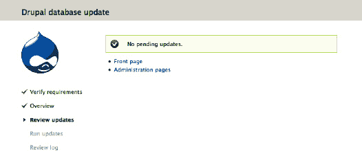

   ***图 7-1.** 没有待处理的更新*

7.  进入管理  报告  状态报告（`admin/reports/status`），查看 Drupal 是否有任何问题。访问所有关键页面以测试关键功能，并检查 Drupal 的 watchdog 日志（如果使用数据库日志记录模块，则在 `admin/reports/dblog` 处；如果使用 Syslog 模块，则在操作系统的 syslog 中）。
8.  此步骤（来自 `UPGRADE.txt` 的步骤 8）仅在你无法登录并必须在 `settings.php` 中将 `$update_free_access` 设置为 `TRUE` 时适用；你可能不需要这样做。
9.  返回管理  配置  开发  维护模式（`admin/config/development/maintenance`）。取消勾选“将网站置于维护模式”，然后保存配置。

##### 现在在线上执行

如果一切顺利，请提交你的代码更改，在生产站点上执行步骤 1 和 2（或者更好的是，先在暂存站点上执行），将更新后的代码部署到你的线上站点，然后在线上站点上重复步骤 6 到 10。有关部署建议，请参阅第 13 章。

### Drush 更新

使用 Drush，这个过程要容易得多。它首先会处理所有需要更新的贡献模块。此命令是 `drush pm-update`，或简写为 `drush up`。

请记住，在将其应用到生产站点之前，始终先在你站点的副本和数据库上尝试此操作。你也可以使用 `drush upc` 仅更新代码（你可以将其提交到你的仓库），而不是使用上述同时更新代码和数据库的命令。在测试站点上成功测试 `drush updatedb`（用于更新数据库）后，你可以将代码部署到线上站点并立即在那里运行 `drush updated`（或访问 `update.php`）。

贡献模块的更新将在后面的一节中讨论。要仅使用 Drush 更新 Drupal 核心，请使用命令 `drush up drupal`。

至于大多数 Drush 相关内容，请参阅第 26 章以获取更完整的说明。


### 差异更新

接下来介绍我个人使用的方法。我相信它可以写成一个 Drush 脚本，但惭愧的是，我目前还没能实现。所以留作读者的练习吧！

清单 7-1 是一个脚本，用于下载一份最新的 Drupal 版本副本*以及*你当前的 Drupal 版本副本，并应用其差异。这意味着，在很多情况下，你对 Drupal 所做的任何修改都不会与简单地重新应用到现有代码上的变更产生冲突。

 **提示** 你应该对你当前的站点执行`diff`操作，或者使用 Hacked 模块（`drupal.org/project/hacked`）来查看站点发生了哪些变化。不建议在不完全了解 hack 内容及其必要性的情况下保留它们。

还应该能直接从`git.drupal.org`生成这个`diff`，这将是比该脚本更高效、更精细的改进，但效果相同。这个改进可能会被应用到该脚本中，这也是从`dgd7.org/update`下载它的另一个原因；不要尝试手动输入！使用该脚本的命令如清单 7-1 所示。

***清单 7-1.** 利用新旧版本差异自动更新 Drupal 核心的 Shell 脚本*

```sh
#!/bin/sh -e

if [ $# -lt 2 ]; then
    echo "用法: $0 旧版本 新版本 (可选) 目录 (例如 5.5 5.6 dir)"
    exit 1
fi

#### 如果更改了 TMP，则必须同时更改 patch 命令中的 -p3 选项！ TMP=/tmp
#### 将下面的版本号改为你当前的版本
VER_OLD=$1
VER_NEW=$2

if [ $# -gt 2 ]; then
  DRUPAL_DIR=$3
else
   DRUPAL_DIR=`pwd` 
fi

#### 将其改为 Drupal 的安装目录 PATCH_FILE=$TMP/drupal-$VER_OLD-to-$VER_NEW.patch
cd $TMP

#### 下载你当前的版本
wget http://ftp.drupal.org/files/projects/drupal-$VER_OLD.tar.gz

#### 解压该文件
tar -xzf drupal-$VER_OLD.tar.gz

#### 现在，下载新版本
wget http://ftp.drupal.org/files/projects/drupal-$VER_NEW.tar.gz
#### 同样解压它
tar -xzf drupal-$VER_NEW.tar.gz

#### 现在创建差异文件
#### echo "这个命令，或下一个命令，会中断脚本，所以你只能自己完成剩下的步骤。"
 echo `diff -Naur $TMP/drupal-$VER_OLD $TMP/drupal-$VER_NEW > $PATCH_FILE` 

#### 现在切换到你的 Drupal 安装目录
cd $DRUPAL_DIR

#### 我们希望看到此步骤的输出
set -vx

#### 检查补丁是否能无错误地应用
patch -p3 --dry-run < $PATCH_FILE

#### 关闭详细输出
set +vx
#### 重新关闭（自然，减号表示开启，加号表示关闭）

echo "如果以上的预演补丁应用没有错误，你可以按 Y 来实际应用该补丁。"
echo "如果有错误，或者你还没准备好应用补丁，请按 N 中止。"
read YN
if ( test -z "$YN" )
then
  echo -e "请输入 \"Y\" 或 \"N\" " ;
  eval "$0" "$@" ;
  exit ;
fi
#### 此时 'YN' 包含 Y, y, N, 或 n
if ( test "$YN" = "N" -o "$YN" = "n" )
then
  exit ;
fi

set -vx
#### 假设上一步没有错误，你现在可以实际应用补丁
patch -p3 < $PATCH_FILE
```

要使用该脚本，你需要提供 Drupal 站点的路径。我为将这个脚本命名为“升级”表示歉意，尽管它也可能用于开始主要版本的升级。

`/path/to/version-upgrade-diff.sh 7.0 7.1`

如果该脚本位于你的主目录`scripts`中，并且当前站点‘dgd7'位于主目录内的`code`目录下，其中 Drupal 安装在`web`目录中，那么以下命令可以从任何位置运行：

`~/scripts/version-upgrade-diff.sh 7.0 7.1 ~/code/dgd7/web`

### 贡献模块

保持你的贡献模块处于最新状态也至关重要。由`update.module`提供的报告页面，管理 → 报告  可用更新（`admin/reports/updates`），会列出需要更新的模块。模块实际上不是由模块本身更新，而是由项目更新；有些项目包含多个模块，更新页面会通过“包含项”行显示每个项目包含的模块，如图 7-2 所示。

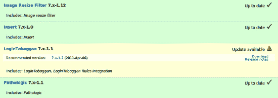

***图 7-2.** 可用更新报告中显示的贡献模块，包含下载链接和可更新模块的发布说明*

手动更新贡献模块的方法是删除每个过时的模块，并在其位置解压一份新下载的最新稳定版。然后访问你站点的`update.php`，例如测试站点访问[`http://example.localhost/update.php`](http://example.localhost/update.php)，线上站点访问[`http://example.com/update.php`](http://example.com/update.php)。确实没有理由推荐手动下载方式而非下面描述的自动化选项。

无论你如何更新，首先都要在*生产站点的副本*上彻底测试结果。与核心一样，始终先在本地或测试副本上执行贡献模块的更新。与核心相比，更需要仔细检查贡献模块在更新后是否改变了其行为。关于自动将线上数据库副本导入本地或测试环境的方法，请参见第 13 章的部署或第 26 章的 Drush。

 **警告** 模块的主版本升级意味着模块维护者告诉你存在重大变化。甚至可能没有干净的升级路径。例如，如果你需要将贡献模块从 2.x 升级到 3.x，请仔细阅读发布说明并彻底测试。预计你需要调整模块的配置。发布说明可以直接从`drupal.org`上模块页面的链接找到，就在模块不同版本的下载链接旁边。

有两种简单、自动化的更新方式。（不过，这两种方式都不能免去在应用到线上站点之前测试更新的步骤。）

#### Drupal 的自动化模块安装器

要自动更新需要更新的模块，请访问你的 Drupal 站点的管理 →  报告 →  可用更新 →  更新（`admin/reports/updates/update`）。勾选要更新的模块，然后点击表单底部的“下载这些更新”按钮，如图 7-3 所示。

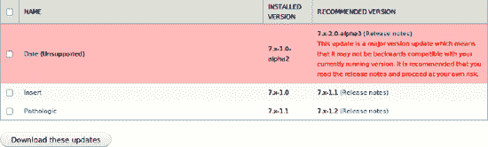

***图 7-3.** 自动化更新页面，显示了一个不再受支持的模块分支示例，以及两个需要简单次要版本更新的模块*

最好一次只应用一个或有限数量的相关更新，特别是带有主版本升级警告的更新，这样在测试中更容易识别任何变化的来源。在 Drupal 自动放置好代码后，不要忘记运行数据库更新（在你尝试后，如果不需要更新，Drupal 会告诉你，如图 7-1 所示）。

你可以在本地运行 Drupal 的自动化贡献模块更新器，然后提交代码以将更改应用到线上环境。这使你可以继续遵循不在线上服务器上修改代码的最佳实践。

如果 Drupal 的更新管理器模块无法通过用户界面为你运行升级（如果它要求你提供不确定是否拥有的 FTP 信息），不要费心去让它工作。这段时间用来让 Drush 正常工作会更有价值。


#### 使用 Drush 更新模块

如前所述，用于更新贡献模块的 Drush 命令与更新 Drupal 核心的命令完全相同。默认情况下，Drush 会尝试一次性完成所有更新：首先更新所有贡献模块，然后更新 Drupal 核心。

关于安装 Drush，请参见第 2 章。关于 Drush 及其强大功能的更多信息，请参见第 26 章。

在撰写本文时，有一个（漫长的）问题（`drupal.org/node/1002658`）正在讨论如何确保 Drush 检查 *所有* 可用的更新，并且不会花费一两分钟来查找它们（当前补丁中的行为）。Drush 有时也会声称它在更新中失败了（由于某个版本不可用或其他一些小故障）并且无法从其备份中恢复。实际上，Drush 几乎肯定成功更新了代码；你无需手动回滚任何内容，而是可以运行数据库更新、提交代码、部署并在预发布和生产站点上运行数据库更新。为了避免其中一些问题，并作为测试和识别问题原因（或解决方法）的最佳实践，你可以让 Drush 一次只更新一个或几个项目，例如仅使用 `drush upc ctools views` 更新 CTools 和 Views 项目代码。

使用 Drush 选择要更新的模块时，请查看管理  报告  可用更新（`admin/reports/updates`）来决定要更新的内容，然后悬停在下载链接上以查看应向 Drush 提供的项目名称。（你也可以运行 `drush up` 来查看可用的更新，并在更新任何内容之前取消（`n`），以便逐个挑选执行。）从前面的例子来看，LoginToboggan 模块的下载链接是 `ftp.drupal.org/files/projects/logintoboggan-7.x-1.2.tar.gz`，这意味着你想用来下载它的命令是：

```
drush up logintoboggan
```

并非所有项目的面向用户名称和系统名称都几乎相同。Image resize filter 是 `image_resize_filter`，而 Meta tags 是 `nodewords`。如果有多个可能的版本可以更新（例如，当有新的主版本升级可用时），你可以包含你想要的版本，格式也采用下载链接中所示的形式，如下所示：

```
drush up logintoboggan-7.x-1.2
```

### 总结

本章至少有两个目的。它向你展示了多种保持 Drupal 站点更新的方法，所以只需选择一种并执行即可！它还表明，在 Drupal 内部和周边，总有多种方法可以完成某些事情。

 **提示** 除了有多种执行更新的方法之外，还存在（或将会存在）比此处讨论的方法更好的方法。请查看 `dgd7.org/update` 以获取与本章相关的新信息，并通过参与社区（参见第 9 章）来了解有关 Drupal 所有内容的最新想法和实践。

## 第 8 章


## 扩展你的站点

**作者：Dan Hakimzadeh 和 Benjamin Melançon**

> *“为他人建造好工具有着极大的满足感。”*

——弗里曼·戴森

第 1 章 让你开始使用 Drupal 站点，第 3 章 向你展示了 Views 模块的强大功能，第 4 章 让你了解了可供使用的各种模块。本章将展示你可以通过字段和视图、可选核心模块以及精选的贡献模块来构建站点到何种程度——简而言之，就是对你站点进行极致配置。

### 使用个人资料页展示作者

一个多作者书籍网站不能忽视其作者，因此最好将他们展示在网站上。同时也是站点用户的作者应该能够编辑自己的个人资料，但*不应*假设作者会创建和管理自己的个人资料页面。你可以赋予“作者”角色创建“个人资料”类型内容的权限，并且相信作者不会为自己创建多于一个的个人资料条目。

 **提示** 尽管在用户账户之上构建个人资料似乎是显而易见的选择，但这并不总是最佳方案。考虑一个以董事会成员为特色的“关于我们”页面；虽然他们所有人都应该能够登录并编辑自己的个人资料，但实际上有多少人会这么做呢？即使是像本书作者这样精通 Drupal 的团队，也不能期望所有人都按需加入一个网站。此外，当最迫切的需求是全名、头像照片和简短的第三人称传记时，创建包含用户名、电子邮件和密码的用户账户真的有意义吗？Profile2 模块（`drupal.org/project/profile2`）所实现的那类个人资料，对于确定会是活跃用户的用户来说最有意义。当个人资料或传记主要是作为内容，而非用户账户的副产品时，请考虑使用更轻量级的方案，即简单的内容类型。

让我们开始吧：

1.  如第 1 章所示，通过访问 *管理*  *结构*  *内容类型, + 添加内容类型*（`admin/structure/types/add`）来创建一个新的内容类型。
2.  将其命名为 `Author profile`，然后点击自动生成的机器名旁边的“编辑”按钮，使其弹入自己的表单字段中，这样你就可以将 `author_profile` 更改为 `profile`。
3.  在此表单底部的垂直标签中，在“提交表单设置”下，将“标题字段标签”从 `Title` 更改为 `Name`（参见图 8–1）。

    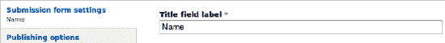

    ***图 8–1.** 作者内容类型的提交表单设置：标题字段标签已更改为 Name*

4.  接下来在垂直标签中，在“发布选项”中勾选 *创建新修订* 以将其添加到默认选项。
5.  在“显示设置”中，取消勾选 *显示作者和日期信息*（参见图 8–2）。

    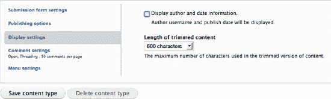

    ***图 8–2.** 配置内容类型以不显示发布（作者和日期）信息*

6.  最后，将“评论设置”更改为 *隐藏*（不显示任何评论）或 *已关闭*（不允许留下任何额外评论）。如果在留下任何评论之前进行设置，两者效果相同。

作者个人资料内容类型当然应该有字段，因此点击“保存并添加字段”提交表单。现在你位于内容类型的“管理字段”标签页。

#### 为作者提供头像图片

Drupal 7 核心包含了良好的图片处理能力。在“添加新字段”下指定：

*   标签为 **Headshot**
*   机器名为 **headshot**
*   字段类型为 **Image**

 **提示** 避免为了此类用途而重用现有图片字段的诱惑。Drupal 7 在允许大多数字段设置特定于其附加的内容类型或其他捆绑包方面做了出色的工作，但默认图片选项和可上传图片数量都是按字段全局设置的，而不是按字段在内容类型或其他捆绑包上的实例设置的。即使现有字段现在满足了我们新字段所需的全局设置，如果以后需要更改全局设置，也没有好方法可以将共享字段分离出来。除非你确定它们的字段级设置不会发生分歧，*并且* 你知道需要在列表中使用来自不同来源的相同字段，否则你应该创建一个新字段，而不是重用现有字段。

实例（作者个人资料设置）上的默认设置可以保持不变，不过将子目录设为“headshot”可以使文件目录更井井有条。此外，在“字段设置”中，将“值数量”保持为 1。提供一个默认图片（可选）将有助于在所有作者提供其个人资料头像之前保持视觉一致性。


好的，作为一名高级文档工程师和翻译员，我将严格按照您提供的注意事项和示例，将给定的英文文本翻译成中文。


#### 从个人资料链接到网站

没有哪个网站是一座孤岛，`definitivedrupal.org` 自然应当链接其作者的个人和专业网站（尽管有时“鞋匠的孩子没鞋穿”的寓言也适用于 Drupal 开发者的网站）。如果我们打破常规，仅凭名称来评判一个模块，那么 Link 模块（`drupal.org/project/link`）将是首选。事实上，自 Drupal 4.7 和 CCK 时代起，Link 就是提供 URL 专用字段的首选模块，并且在 Drupal 7 和 Fields 时代依然如此。除了 URL 之外，Link 模块还提供了标题（要超链接的文本）、添加 CSS 类和链接目标等选项。（您可以使用文本字段来存储链接，但它不提供这些功能。）

当然，在 Drupal 中为任何内容添加 Link 字段之前，您需要先安装该模块。第 4 章 介绍了安装模块的方法；这里我们给出 Drush 指令（参见第 2 章和第 26 章）。同时还展示了使用 Git 将模块添加到版本控制的命令（参见第 2 章）。

```
drush dl link
Project link (7.x-1.0-alpha2) downloaded to                        [success]
/home/ben/code/dgd7/drupal/sites/all/modules/link.
git add sites/all/modules/link/
git commit -m "Link module for link fields."
drush en -y link
The following extensions will be enabled: link
Do you really want to continue? (y/n): y
link was enabled successfully. [ok]
```

 **注意：** 如果通过用户界面启用 Link 模块，在模块管理页面（可按下 `control + f`）搜索 `link`，会发现它被分在“字段”包下。

Link 模块在模块管理页面上没有配置链接，因为它的所有设置都是针对每个字段的。要开始操作，需要将其附加到内容类型。对于本网站，需要 Link 字段的内容类型是 Profiles，即作者简介的内容类型。要添加一个链接字段：

1.  转到 *管理*  *结构*  *内容类型*。
2.  点击 Profile 内容类型的“管理字段”链接 (`admin/structure/types/manage/profile/fields`)。
3.  转到表单中标记为“添加新字段”的部分。
4.  为它指定一个标签，例如 **网站**，机器名为 `website`（它会自动添加 `field_` 前缀），字段类型选择 Link（参见图 8–3）。

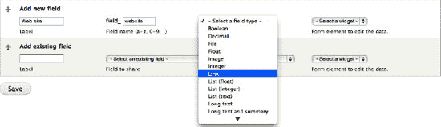

***图 8–3.** 添加一个类型为 Link 的新字段*

5.  Link 模块只提供一个 *组件*（组件用于在添加或编辑内容的表单上显示该字段），但您接下来会看到的字段设置也提供了各种影响该组件的选项。点击“保存”即可。

 **提示：** 添加字段时，您可以在提交保存之前将其拖到您希望的位置。这很安全，而且有效！（这会影响其在节点添加/编辑表单上的显示位置；其显示位置的排列可以在 **管理显示** 标签页中进行。）

6.  在字段设置页面上，取消勾选“允许可选 URL”——在 Link 字段中允许这样做是不常见的——并将“链接标题”设置为可选。
7.  您可能希望将 URL 显示截断值提高到 120 个字符，因为我们不希望截断地址的显示，除非它会影响页面布局。
8.  将链接目标保留为默认值“无”，因为强迫用户的链接在新窗口中打开可能会让他们感到困惑，而不是帮助他们返回您的网站。
9.  最后，不要设置 Rel 属性。对于非导航链接，rel 没有太多有趣的用途（参见 `w3.org/TR/html401/types.html#type-links`），除非您定义自己的 rel。（不要像示例中那样设置“nofollow”；这样做是对您网站用户的不尊重，也违背了万维网的本质。）“额外的 CSS 类”不太可能造成任何损害，但另一方面，如果您以后想专门为网站链接设置主题，随时可以回来添加它。
10.  现在点击 **保存字段设置**。

这将带您进入第二个设置页面，分为 Profile 设置（意味着仅当该字段位于 Profile 内容类型时适用的设置）和网站字段设置（意味着将影响您可能附加到的任何内容上的网站字段的设置）。这些设置几乎都与您之前填写的内容重复，但有一个重要的设置您之前没见过。向下滚动一点，网站字段设置的第一个选项是“值的数量”（参见图 8–4）。通过设置此项，您可以使该字段能够重复并填写多个值。

这意味着，与其为公司网站创建一个 Link 字段，再为个人网站创建另一个 Link 字段，再为秘密项目网站创建一个，再为宠物网站创建一个——也就是说，试图猜测作者可能链接多少个、哪些种类的网站——不如创建一个可以重复有限次数或无限制次数的网站字段。

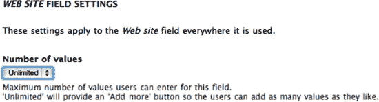

***图 8–4.** 配置为允许无限数量值的网站 Link 字段*

其他所有设置您都已设置完毕。在表单底部保存设置，此字段即可使用。Drupal 会将您带回 Profile 内容类型的“管理字段”标签页，您可以在其中编辑或排列现有字段——或添加更多字段。


#### 作者的其他网络据点

由于大多数作者本身已是公众人物（现任作者除外），本网站应提供一种标准化方式，链接到他们其他最相关的页面（如 `drupal.org` 用户页面、`groups.drupal.org` 用户页面和 Twitter）。这些本可以作为链接字段实现，但通过在开发端投入更多工作，你可以仅获取用户 ID 并自行包裹链接，从而确保呈现风格的一致性。

 **注意** 使用链接字段连接到 `drupal.org` 和其他特定网站账户会简单得多，也完全可以接受。但要真正发挥这种方法的优势，你需要等到第 33 章通过自定义代码来实现。

添加两个整数类型的字段（注意：你必须通过 Drupal 的用户界面逐一添加字段，除非其中一个要添加的字段已经存在）：

- *Drupal.org 用户 ID*，其机器名可为 `do_uid`
- *Groups.Drupal.org 用户 ID*，其字段名可为 `gdo_uid`。（如同所有通过用户界面创建的字段，这两个机器名都会自动加上 `field_` 前缀。）

你可以立即点击进入接下来的“字段设置”页面，因为整数字段在此页面上并无需要配置的选项。

 **注意** 如果此问题得到解决，也许空白配置页面将被移除：`drupal.org/node/552604`。

尽管最好将用户 ID 数据存储为整数，但每个 ID 在显示时都应成为指向各自网站上用户账户的链接。整数字段允许你定义前缀和后缀，这些内容将在输入和编辑表单中使用，并与值一同显示。这是一个按内容类型进行的设置，位于添加字段后的第二个配置屏幕上。（你可以随时返回该页面，路径为：*管理*  *结构*  *内容类型*  *作者简介*  *管理字段*  *Groups.Drupal.org 用户 ID*，`admin/structure/types/manage/profile/fields/field_gdo_uid`）。然而，这些前缀和后缀原本是为货币符号或度量单位设计的。试图将 HTML 链接代码的开头部分作为前缀，其余部分作为后缀的做法是行不通的。

不过，确实有一个模块能解决这个问题。为字段提供特殊包装可以通过“自定义格式化器”（Custom Formatters，`drupal.org/project/custom_formatters`）来实现——定义一个自定义格式化器，将其适当地应用于整数或文本字段，然后定义用于包裹数据的 HTML 代码。或者，你也可以编写自己的模块来定义一个格式化器，这样可能更整洁（例如，通过带选项的一两个格式化器，而不是为每个字段都定义一个格式化器），也更具扩展性（例如，实现某种疯狂功能，比如查找 `drupal.org` 账户的用户名）。更多信息请参见第 33 章。

 **提示** 字段系统的一大优点就是我们可以立即收集数据，稍后再完善显示方式。

保存后，你将回到“作者简介”内容类型的管理字段页面，准备添加下一个字段。

#### 一个不显示的数据字段：大致页数

创建另一个整数字段，用于记录每位作者在本书中贡献的大致页数。这个字段将在后面用于排序显示作者姓名和简介（详见“列出作者”一节）。随后，在“微调内容显示”一节中会介绍如何将其隐藏。你已经创建过整数字段，所以这里无需赘述！

#### 连接作者简介与作者的用户账户

我们决定不将作者简介与用户账户直接绑定，但我们可以通过允许简介引用用户账户，从而兼顾两者的优势。

1.  节点引用和用户引用是 Drupal 内容类型和字段系统的一项强大扩展，目前存在于“引用”项目（References project，`drupal.org/project/references`）中。我们需要添加它：

    ```
    drush dl references
    Project references (7.x-2.x-dev) downloaded to                      [success]
    /home/ben/code/dgd7/drupal/sites/all/modules/references.
    
    Project references contains 2 modules: node_reference, user_reference.
    
    git add sites/all/modules/references
    git commit -m "Added project references (node_reference, user_reference)."
    ```

2.  启用“用户引用”模块（稍后你还会用到“节点引用”，所以可以同时启用它）。

3.  添加一个新字段，标签为 **DefinitiveGuide.org 账户**，字段（机器）名为 `field_user`，当然，将存储的数据类型改为“用户引用”。一旦选择此类型，“用户引用”字段类型会提供三种不同的输入小部件供你选择：选择列表、复选框/单选按钮和自动完成文本字段（参见图 8–5）。

    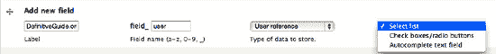

    ***图 8–5.** 添加用户引用字段，并显示三种小部件选项*

     **注意** “复选框/单选按钮”小部件在字段配置为允许单个值时显示为单选按钮，在允许多个值时显示为复选框。同样，如果允许多个值，“选择列表”会显示为选择框而非下拉菜单。

4.  由于网站可能有成千上万的用户可供选择，看似唯一可用的就是自动完成文本字段——因为其他两种小部件会显示所有用户，从上千人中选一个并不是好用的用户界面。然而，在下一个屏幕中，你会发现可以按角色限制可被引用的用户。因此，选择“选择列表”小部件，以便以一种紧凑的方式显示可供选择的网站用户。

5.  你随时可以返回此页面（“作者简介”内容类型的“管理显示”选项卡）更改小部件，所以直接保存即可。

6.  接下来，你会进入一个配置页面，其中包含按角色和状态限制可引用用户的选项。只有具有“作者”角色的用户才应可用，而且限制为活跃用户通常没有坏处，所以勾选该框（参见图 8–6）。

    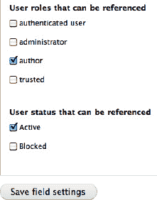

    ***图 8–6.** 按角色和状态限制可供引用的用户*

7.  点击**保存字段设置**，然后进入下一个配置屏幕。

8.  这里需要操作的不多：不要设为必填字段，不要设置默认值，并将“值的数量”保持为 1。这个字段的目的是将作者简介与该作者的用户账户关联起来（如果存在的话）。因此，点击“保存设置”离开此页面即可完成！


#### 授权作者创建个人资料

权限在第 1 章中介绍过，您将经常回到那个复选框墙来构建 Drupal 站点。您创建的新内容类型“作者个人资料”可以在`管理``人员``权限`（`admin/people/permissions`）下的“节点”部分设置其权限。

为“作者”角色勾选两个权限：`Author profile: Create new content`和`Author profile: Edit own content`。

**注意**：“管理员”角色没有被授予对此新内容类型的创建、编辑和删除权限，但这没关系，因为“管理员”角色已经拥有节点模块的`Bypass content access control`权限。

**提示**：大多数站点应创建一个“内容编辑”或“内容管理员”角色，该角色同时拥有`Administer content`和`Access the content overview page`权限，可能还包括`Administer comments`和`comment settings`权限，以及可能的`Bypass content access control`权限。关于管理内容和评论、创建视图及其他使操作更便捷的工具的讨论，请参阅`dgd7.org/content`上的额外章节“Content Administrator Convenience”。

您可以在`添加新内容``创建作者个人资料`（`node/add/profile`）下创建一个或两个作者个人资料。您应该测试使用*仅具有作者角色的用户账户*创建个人资料——权限问题最常导致您告诉用户在站点上执行某项操作却不起作用，从而显得愚蠢。请创建一个测试账户或使用`Masquerade`模块（`drupal.org/project/masquerade`）。

**提示**：作为管理员，您可以在创建内容时或之后将内容分配给其他用户。在节点添加/编辑表单底部的垂直选项卡中，找到“作者信息”部分，将“作者”字段中的用户名替换为您希望成为该内容所有者（作者）的用户名。请耐心输入——它会自动补全。

您还可以在`管理``人员，+ 添加用户`（`admin/people/create`）下为有意愿的作者创建用户，并直接为他们分配作者角色。最后，您可以邀请用户在站点上自行创建账户，并在他们注册后为其用户账户添加作者角色（有关设置用户注册通知的方法，请参阅本章的在线资料`dgd7.org/moresite`）。

### 列出作者

现在作者有能力拥有个人资料了，但访客无法找到它们。图书站点应该适当展示作者。个人资料将以三种方式展示：

*   一个页面，从主菜单链接，展示作者图片和姓名的网格，每个姓名和图片链接到完整的作者个人资料，随机排序。
*   一个页面，可从图片网格页面访问，包含小尺寸个人资料图片以及简短传记的第一两段，每个链接到完整的作者个人资料，按写作页数排序。
*   一个区块，位于每个页面的页脚，每个作者姓名链接到其完整的作者个人资料，按写作页数排序。

对于以上三个目的，`Views`模块是自然的选择。

**注意**：在 Drupal 7 的`Views`官方发布之前的一小段时间，该站点使用 Drupal 核心提供的一个优秀类`EntityFieldQuery`来显示作者个人资料。关于如何仅用自定义模块中的几行代码而不使用`Views`制作作者个人资料页面，请参阅`dgd7.org/180`。

#### 构建作者头像视图

`Views`模块可以访问管理员或作者添加作者个人资料时存储的数据，并仅显示部分数据，以制作包含链接到作者个人资料页面的姓名和图片的页面。

1.  首先，转到工具栏中的`结构``视图`，点击“添加新视图”链接（`admin/structure/views/add`）。
2.  在此页面上，为您的视图命名。在“视图名称”字段中添加`Author profiles`，但将自动生成的机器名称更改为简单的`profiles`。

    **注意**：视图机器名称一旦选定，就无法更改。

3.  勾选“描述”以显示“视图描述”字段，并输入简短描述，例如`A view to show all the author profiles`。
4.  本页其余部分帮助您更快地构建视图。将“显示”设置为`Content`（意味着节点），并将“类型”更改为`Author profile`。
5.  在“创建一个页面”下，将自动填充的“页面标题”更改为`Authors`。这将显示给访问此页面的访客。将路径 URL 的最后部分设置为`authors`。并将“显示格式”更改为`Grid`（字段格式）。
6.  现在点击`继续并编辑`按钮。这将带您进入视图编辑页面。说这里可以完成很多事情是轻描淡写的。不过，您需要做的大部分工作已根据您在上一个页面上的设置为您配置好了。所有这些都可以更改或调整。例如，在“网格”设置中，将“列数”更改为`4`。

    **提示**：为站点开发的主题（参见第 15 和 16 章以及`dgd7.org/theme`了解主题开发）是弹性宽度的，并在其样式表中包含一个`inline`类。将格式更改为`HTML List`并使用`inline`类将获得更完美的结果。Drupal 的数据与表现分离让您可以稍后进行此更改。

7.  转到“字段”部分，再次点击“添加”按钮为您的视图添加一些字段。这里有很多魔法发生。“作者”页面的要求是：作者头像图片和姓名应以网格形式显示，并且图片和姓名都应链接到相应的作者个人资料。因此，选择`Content: Image`（还记得将其添加到作者个人资料内容类型吗？）和`Content: Title`。
8.  在`Content: Image`的配置中，移除标签文本（取消勾选“创建标签”），并在“图像样式”下选择`thumbnail`。确保“链接图像到”设置为`Content`。在`Content: Title`设置中，同样移除标签文本，并确保勾选了“将此字段链接到原始内容”。
9.  不要忘记保存视图！

您刚刚在站点上创建了一个动态页面，该页面查询数据库并以 4 列网格格式显示来自个人资料节点（且仅限个人资料节点）的图片和标题。您可以通过访问您输入的路径来访问该页面，本例中为`authors`。


#### 创建图像样式

你可以保持刚才创建的视图不变。但这样做的缺点是，有些作者可能会上传横向的个人资料图片，而另一些作者可能会上传纵向的。这意味着作者列表页面可能会显得杂乱无章，长宽不一的图片混杂在一起。你为图像字段显示选择的默认缩略图样式，只会将图像按比例缩放到特定的像素宽度或高度。

自动调整图像大小的功能虽然很酷，但还不够好，而 Drupal 则要酷得多。我们想要的是完全正方形的个人资料图片，这样我们的网格就不会有那么多空白区域或形状怪异的图片了。借助 Drupal 的图像样式，我们可以轻松创建一种图像样式，利用“缩放并裁剪”效果来实现这一目标。

Drupal 还能做得更好吗？当然可以。智能裁剪模块（`drupal.org/project/smartcrop`）为图像模块的裁剪功能提供了替代方案。智能裁剪会尝试识别图片的焦点区域，并将其作为裁剪的中心。如果你想使用它，请下载并启用 Smart Crop。

 **提示** 智能裁剪比 Drupal 核心的图像裁剪功能更强大，但它并非万无一失。如果你需要将图像裁剪到精确尺寸，同时又不丢失任何重要内容，请尝试 Imagefield crop 模块（`drupal.org/project/imagefield_crop`），该模块允许用户在上传图片时自行进行裁剪。

1. 首先，我们必须编辑现有的图像样式（通过点击其名称或编辑链接），或者创建一个新的图像样式（通过点击表格上方的 *+ 添加样式* 链接）（参见 图 8–7）。由于缩略图、中等和大尺寸图像始终由图像模块提供，每个使用图像的模块都可以依赖它们的存在。你对这些图像样式所做的任何更改，都将影响你网站上所有使用它们的地方，包括作为你甚至尚未考虑安装的模块所使用的默认图像样式。

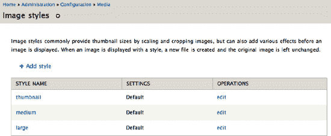

***图 8–7.** 图像样式列表页面。点击样式名称或“操作”下的编辑链接即可进行编辑。*

 **注意** 如果你想影响所有可能使用某个图像样式的模块，可以编辑模块提供的图像样式。当你第一次编辑（该样式仍为默认设置时），你需要先点击“覆盖默认值”。

2. 作者视图的需求非常特定，所以我们不要覆盖默认样式。相反，通过 *+ 添加样式* 链接创建一个新样式。给它一个样式名称，例如 **small_square**，然后点击“创建新样式”。

 **提示** 由于图像样式关乎呈现效果，我们建议你根据其外观（而非用途）来命名。

3. 你会被带到图像样式编辑页面，你可以在其中通过添加各种不同的效果来构建你的样式。在我们的案例中，我们需要正方形图像，因此选择并添加“缩放并智能裁剪”效果（参见 图 8–8）。这会带你进入另一个配置页面；将宽度和高度都设置为 150px，并允许放大。

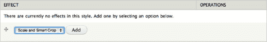

***图 8–8.** 为新的图像样式添加“缩放并智能裁剪”效果*

4. 点击“添加效果”按钮提交此表单。现在你会被带回图像样式编辑页面，该页面包含应用了该样式的示例图像预览。如果你看到一幅美丽的热气球场景，那你得到了一份特殊获奖版的 Drupal！开个玩笑，这个示例图像是由图像模块的主要作者 Nate Haug（quicksketch）专门为该模块绘制的。在图像预览下方，你刚刚添加的效果会出现在此图像样式使用的效果列表中，并且你还可以选择添加更多效果。

 **警告** 虽然图像样式允许你更改其名称（实际上是一个机器名），但使用该图像样式的视图和其他网站元素并不会收到通知。因此，强烈建议你不要更改图像样式的名称。如果确实需要更改，请记得在网站中逐一更新所有使用到它的地方。

5. 最后一步是回到你的作者视图，将图像字段设置为使用你新创建的图像样式，而不是默认的缩略图样式。

在返回视图并再次编辑时，这也是为传记页面创建一个菜单项的好机会，这样你网站的访问者就可以通过菜单项访问该页面，而不仅仅是输入路径。

#### 为页面视图创建菜单链接

首先编辑你创建的视图页面显示。

1. 找到“页面设置”，在其内部找到“菜单：无菜单”。点击“无菜单”为其添加一个菜单链接。（很抱歉，视图更新后的更直观用户界面在这里并没有变得更直观！）确保在“菜单”选项下选择了“主导航”，如图 8–9 所示。

   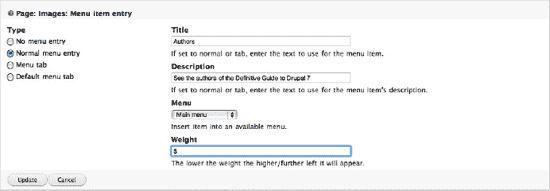

   ***图 8–9.** 为页面视图添加菜单链接*

2. 点击“应用”，然后点击“保存”。如果链接不在你期望的菜单位置，最简单的方法是前往 *管理*  *结构*  *菜单*（`admin/structure/menu`）并在那里重新排序菜单。

 **注意** 与所有页面一样，你也可以通过菜单管理为视图页面创建菜单链接。点击“添加链接”并给出路径——就像创建目录菜单链接那样。


#### 构建作者传记视图页面，作为作者视图中的标签页可访问

展示作者的主要方式是图片网格，但访问者也应该能够在一个包含简短传记的列表中一次性浏览所有作者。此显示的关键元素请参见表 8-1。

 **注意** 我们不会涵盖此视图的每个方面。关于所需的任何其他视图参考资料，请参阅第 3 章。

***表 8-1**. 视图页面的关键元素*

| 标题 | *(覆盖)* 标题：**作者传记** |
| 高级设置 | 机器名称：**biographies** 显示名称：页面：**传记** |
| 格式 | *(覆盖)* 样式：HTML 列表 *(覆盖)* 行样式：节点（摘要） |
| 页面设置 | 路径：**authors/biographies** 菜单：**标签页：传记** （权重：5） |
| 排序标准 | **字段：field_pagecount** （降序） |
| 过滤器 *(未更改)* | *节点：类型 = 个人资料* *节点：已发布 = 是* |

我们还需要做一件事，才能让这个菜单标签页显示在现有的作者图片视图上——我们需要将该页面设为默认标签页（参见图 8-10）。

1. 返回个人资料视图的图片显示。在页面设置中，将路径更改为 `authors/pictures`，并在菜单中选择默认菜单标签页。
2. 保持标题为“作者”，并保留相同的描述。
3. 将权重更改为 `-5`，因为这是默认标签页的权重（而不是主菜单中的链接），并且它应始终显示在第一位。
4. 点击更新。对于父菜单项，您必须选择普通菜单项（*非*“已存在”）。
5. 将其标题设为 **作者**，并保留相同的描述。将其放入主菜单（并预期稍后需要从菜单管理中调整其权重）。

 **注意** 您无法通过菜单管理用户界面创建这些菜单和标签页，只能通过视图（或您自己的代码或其他创建菜单项的方式，而不仅仅是菜单链接）来实现。要说得非常清楚：即使您已经有一个指向路径 `authors` 的菜单链接，您也需要告知视图为默认标签页的父级创建菜单条目。当视图为您创建菜单条目时，它创建的不仅仅是一个菜单链接，而是一个菜单项，这足以支撑标签页的固定。此外，默认标签页必须具有与其父菜单项不同的路径。这就是为什么路径 “authors” 被替换为 “authors/pictures”，以便父菜单项可以使用 “authors” 路径。请参阅第 29 章了解菜单系统。

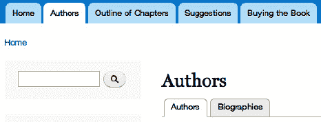

***图 8-10.** 由您的视图提供的两个菜单标签页：传记标签页和默认的菜单标签页“作者”*

 **提示** 即使两个视图显示在逻辑上相关，但如果它们在结构上差异过大——如不同的过滤器、字段、排序等——出于性能考虑，最好将它们作为独立的视图。如果一个显示将覆盖几乎所有默认设置，它应该成为一个独立的显示（除非它是附件显示，需要与它所附着的显示位于同一视图中）。图 8-10 中的两个显示原本也完全可以拆分为独立的视图。

#### 微调内容显示

能够添加字段来容纳各种不同信息固然很棒，而能够灵活更改这些信息的显示方式则更胜一筹。这一神奇功能体现在每种内容类型的**管理显示**标签页中。借助它，您可以对内容的显示进行大量控制，而无需进行主题开发或任何其他编码。

首先，转到位于 *管理*  *结构*  *内容类型*  *作者个人资料*  *管理显示* (`admin/structure/types/manage/profile/display`) 页面中的作者个人资料内容类型的管理显示页面（参见图 8-11）。

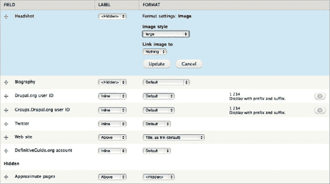

***图 8-11.** 作者个人资料内容类型的管理显示页面，默认视图模式*

 **注意** 这是一个功能强大的页面，对于每个可添加字段的实体（如内容类型的节点、右侧标签页中所示的内容类型的评论、词汇表的分类术语、用户等），您都拥有其对应的版本。

图 8-11 展示了作者个人资料内容类型（您在本章前面已构建）默认显示配置的进行中的状态。头像图像字段的标签已隐藏，更明显的是，其格式被设置为以大型图片样式显示。这些选项是通过点击头像表行右侧的齿轮图标打开的。主要内容传记字段的标签也已隐藏，各种 ID 和账户字段的标签则设置为内联显示。

可以通过选择 `<隐藏>` 作为其格式，或将其拖拽到底部的隐藏部分，来将字段从显示中隐藏。“大致页数”字段就是这种情况，它仅用于对个人资料视图进行排序，而非用于显示。字段的顺序也可以通过拖拽来更改（或者，作为可选方案或在没有 JavaScript 的情况下，通过权重文本字段更改）。在图 8-11 中，DefinitiveGuide.org 账户字段可能应该放在多值网站字段之上，以便与其他单值、内联标签字段放在一起。

 **警告** 当您上下拖拽字段时，Drupal 会清晰友好地提醒您需要点击页面底部的“保存”按钮来提交更改。但当您更改标签或格式时，它**根本**不会提醒您。即使您使用齿轮图标配置高级显示设置，系统也不会警告您这些更改尚未保存。（请参阅 `drupal.org/node/857312` 上的问题）。在任何情况下，除非您点击页面底部的“保存”提交更改，否则您所做的任何更改都不会被保存。

您记得点击页面底部的“保存”了吗？即使您点击了“更新”，Drupal 也不会保存任何东西，直到您使用“保存”按钮整体提交表单。现在您知道了，尽管可能需要被“烫”过几次才能适应：在完整的“管理显示”表单提交之前，字段显示设置不会被保存。所以，请保存此表单。


### 使用视图模式以不同方式显示相同内容

之前的更改是对作者简介内容类型的默认视图设置进行的，这可以从管理显示选项卡下选中的子选项卡看出。另一个选项卡是摘要，这是为节点内容自动配置的另一种视图模式。

在查看默认视图设置时，隐藏于标有"自定义显示设置"（位于页面底部附近）的折叠字段集中的是一组用于视图模式的复选框。对于标准 Drupal 核心安装中的内容（节点），这些模式包括：完整内容、摘要、RSS、搜索索引、搜索结果和打印。值得一提的是，其中两种模式由 Drupal 核心中包含的搜索模块提供。

默认情况下，摘要只是唯一经过特殊配置的视图模式；其他所有内容（包括完整节点视图）都回退到默认配置。选择额外的视图模式会将其添加到管理显示选项卡下的子选项卡中。

 **提示** 您可以在自己编写的小型自定义模块中定义额外的视图模式（正如第 33 章中所做的那样），或使用 Display Suite 模块（`drupal.org/project/ds`）。在使用节点引用显示格式器时，视图模式（在 Drupal 6 的 CCK 中称为构建模式）可用于显示引用的内容。当使用 Views 模块（行样式：节点）创建列表时，视图模式也可用，这使其成为构建需要大量字段的基于字段的视图的有用替代方案。这在 Anjali Forber-Pratt（残奥会运动员兼教育家）案例研究（见`dgd7.org/anjali`）中得到了很好的应用。

#### 修改摘要显示并设置截断长度

摘要视图模式用于作者简介的视图，因此您绝对需要关注其显示效果。摘要的要点是仅显示部分内容，因此这正是利用隐藏字段显示功能的好时机。

1.  在*管理*  *结构*  *内容类型*  *简介*  管理显示  摘要（`admin/structure/types/manage/profile/display/teaser`）处编辑摘要显示（参见图 8–12）。

    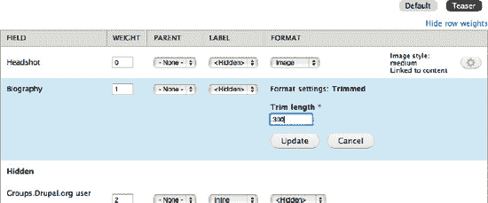

    ***图 8–12.** 为作者简介摘要视图模式设置截断长度，除头像外所有其他字段均已隐藏。已点击"显示行权重"链接以展示无需拖放即可移动字段的方法。*

2.  将头像图片样式更改为*中*，并将图片链接指向*内容*（以便点击头像可跳转至完整的作者简介页面）。
3.  您在摘要中标记为"传记"（机器名`body`）的字段，默认格式为*摘要或截断*，其截断长度设置为 600 个字符。（没错，是字符，不是单词；Drupal 因未显示度量单位而失分。）要更改默认截断长度，您需要点击左侧的齿轮图标。要将长度强制限制为不超过 300 个字符，请将格式器更改为*截断*并设置截断长度。

     **提示** "摘要或截断"格式器将使用显式定义的摘要，即使该摘要长于其截断长度设置。"截断"格式器则始终使用截断长度并忽略任何摘要。这意味着它从主要内容中截取文本，而非从摘要中截取。在 Drupal 7 中，摘要从不被视为指示完整内容断点的方式；如果提供了摘要，它始终是独立的，不被视为完整内容的一部分。因此，如果您使用的文本字段允许包含摘要——正如 Drupal 默认对每种内容类型所做的那样，提供一个"长文本和摘要"类型的正文字段——您可能需要告知用户：在查看完整内容类型时，摘要*不会*显示。

4.  隐藏所有其他字段，您就为作者简介页面构建了精炼紧凑的摘要。

### 使用图书模块制作目录

在 Drupal 的世界里，通常已经存在能实现您需求的模块。接下来 DefinitiveGuide.org 网站需求就是这种情况：*网站应具有一个目录，并可选择包含章节摘要，所有作者均可编辑和重新排列。*

由章节标题和摘要组成的目录实际上是一个可编辑的页面层次结构，这正是图书模块所提供的功能："一组以层级顺序关联在一起的页面"，如其手册页面所述（`drupal.org/handbook/modules/book`）。您无需走远就能找到这个模块：它就在 Drupal 核心中。前往*管理*  *模块*（`admin/modules`），您会看到图书模块的描述是"允许用户以大纲形式创建和整理相关内容"。听起来不错！

尽管包含在 Drupal 核心中，但图书模块在标准安装配置文件中默认是禁用的。通过勾选图书模块名称左侧的复选框，并单击页面底部的"保存配置"按钮来提交此更改，从而启用它。

 **注意** 图书模块的站内文档（`admin/help/book`）未能说明该模块的配置位置，也未提及它会创建一个内容类型。四处查找启用模块后的变化，是您需要时不时做的事情，但您可以通过改进文档和直接改善用户体验来帮助 Drupal 及其贡献模块变得更好。先从搜索相应的问题队列开始，添加您的观察结果，或者如果无人报告过问题，则提交一个新问题。改进图书模块帮助页面的事项在`drupal.org/node/1041498`。（除非是针对 Drupal 8，否则对文本的更改可能不会被接受；即便如此，只有我们主动去做，改进才会发生。关于如何为 Drupal 社区做贡献的更多信息，请参见第 38 章。）

首次启用时，图书模块会运行一个安装过程，为您创建一个新的内容类型：*图书页面*。DefinitiveGuide.org 网站计划并未要求将图书模块用于其他目的，因此请接管并编辑其内容类型。

 **提示** 如果您想为其他内容类型添加大纲功能，您可以随时在*管理*  *内容*  *图书*  *设置*（`admin/content/book/settings`）中进行设置。

图书内容类型的编辑方式与其他内容类型相同（并且，作为 Drupal 7 的新功能，可以删除；它就像您自己创建的内容类型一样）。前往*管理*  *结构*  *内容类型*，然后点击图书页面的配置链接（`admin/structure/types/manage/book`），如图 8–13 所示。

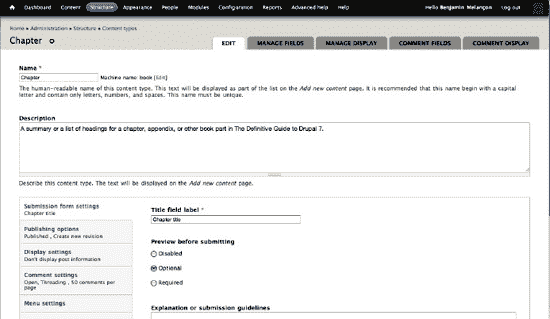

***图 8–13.** 图书内容类型的编辑表单，已修改为服务于章节内容*

将名称从"图书页面"改为**章节**（您可以将机器名保留为`book`），并修改描述以使其适用于章节摘要。您还应对内容类型编辑表单底部整齐堆叠在垂直选项卡中的选项进行一些更改。

1.  在"提交表单设置"中，您可以将标题字段标签更改为**章节标题**。
2.  接下来，在"发布选项"中，确保"默认选项"同时勾选了"已发布"和"创建新修订版本"。

 **提示** 为每种内容类型开启"创建新修订版本"。严格限制哪些角色可以删除内容，同时可以宽松地允许哪些角色编辑内容，从而减少永久丢失任何人工作的担忧。我们将在下一节中设置这些权限以及其他权限。


3.  然后，在**显示设置**中，取消勾选*显示作者和日期信息*选项。默认情况下，Drupal 中的新节点或帖子会包含发布者的用户名和首次提交的时间。在章节摘要中应移除这些信息，因为将章节与发布者关联，而非该章节的实际作者（一位或多位），会产生误导（参见图 8–14）。

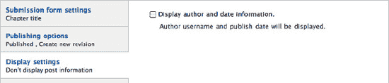

***图 8–14.** 选择不在特定类型的内容上显示作者和日期信息（“由……提交”文本）*

4.  现在保存该内容类型。由 Book（书籍）模块最初提供的内容类型现在已配置好，可用于处理 DefinitiveDrupal.org 网站的章节摘要。

#### 设置组织和编写章节的权限

如第 1 章所述，最好在启用新模块或定义新内容类型后尽快设置权限。您刚刚启用了 Book 模块并编辑了其内容类型，因此现在绝对需要检查权限。这包括由 Book 模块专门提供的权限以及新内容类型的内容类型权限（参见图 8–15）。

对于 Book 模块专门提供的四个权限，管理员可以继续拥有所有权限，而“作者”角色的用户应能够*管理书籍大纲*（以便安排目录）以及*向书籍添加内容和子页面*（以便添加他们的章节）。由于只有一个目录，因此作者无需“创建新书籍”权限。最后，“查看适合打印的书籍”权限应授予匿名用户和已认证用户，不过您也可以稍微优待一下登录用户，仅将权限授予已认证用户角色。

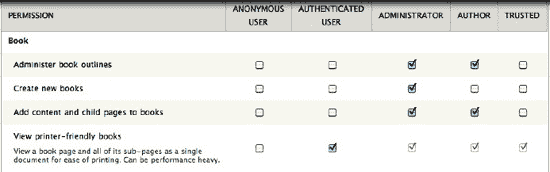

***图 8–15.** Book 模块的权限设置（`admin/people/permissions#module-book`）*

您还应在权限页面上为刚刚修改的“章节”内容类型设置权限（参见图 8–16）。再次强调，让“管理员”角色保留所有权限。授予“作者”角色所有创建和编辑权限，但不授予删除权限。由于“章节”内容类型已设置为保留修订版本，作者们可以协作修改彼此的章节，但不会永久丢失工作成果。

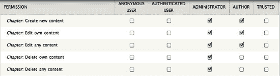

***图 8–16.** “章节（书籍）”内容类型的权限，位于“节点”标题下*

 **提示** 您创建的内容类型以及模块提供的大多数内容类型都将受 Node 模块控制，因此在权限表中会列在“节点”项下，并按机器名称（而非显示名称）排序。

与大多数模块一样，一旦启用 Book 模块，它就会向网站的管理页面添加新页面。在这种情况下，Book 模块会向“内容”部分添加一个页面。您现在应该会在*管理*  *内容*（`admin/content`）下看到一个“书籍”选项卡，如图 8–17 所示。

 **提示** 在模块管理页面上，模块列表旁边添加的“配置”链接或“帮助”链接可以帮助您找到其设置页面。


***图 8–17.** “书籍”内容选项卡（`admin/content/book`），显示其“列表”和“设置”子选项卡*

在书籍的管理列表页面上，没有创建新书籍的链接。相反，书籍是通过创建一个启用了大纲的节点来生成的。在“列表”子选项卡旁边的“设置”子选项卡（`admin/content/book/settings`）中，您可以分配哪些类型的内容可以添加到书籍大纲中，但由于“章节”内容类型最初是 Book 模块提供的“书籍”内容类型，因此它已经被选中。

#### 通过字段向章节内容类型添加元数据

为了在书籍最终顺序未确定时无需编号即可引用章节，章节应具有简短的内部分名称。（在章节草稿中，使用这些“章节机器名称”而非编号来相互引用。）此信息需要与章节摘要一起存储——这显然是向“章节”内容类型添加字段的用例。

1.  从内容类型列表页面——*管理*  *结构*  *内容类型*——您可以点击“管理字段”链接（`admin/structure/types/manage/book/fields`）。（如果您已经在某个内容类型的编辑页面上，可以通过“管理字段”选项卡到达同一位置，该选项卡位于左上角，有七个主题。）
2.  在这里，我们改进一下主文本区域（正文）字段的标签。通过点击“编辑”链接（`admin/structure/types/manage/book/fields/body`）来编辑正文字段。
3.  将“正文”标签更改为**章节摘要**，并确保未勾选“必填字段”（使其成为可选项，以便章节除了标题外还可以提供更多内容），然后点击“保存设置”。
4.  现在添加一个“章节编号”字段（参见图 8–18）。将此字段设为“整数”类型似乎是合理的做法，但不幸的是，章节包含附录，这些附录使用字母而非数字。因此退一步，使用“文本”字段类型。

    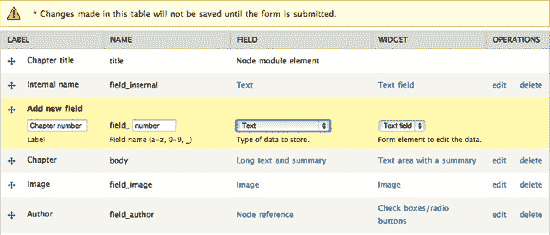

    ***图 8–18.** 在内容编辑表单的期望位置上，向“章节”内容类型添加最终字段——“章节编号”文本字段*

5.  您可以通过将最大字符数限制为仅 2 个，来假装自己仍能对数据类型有一定控制，如图 8–19 所示。

    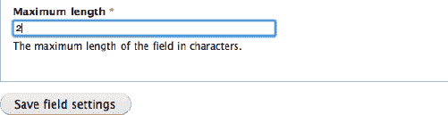

    ***图 8–19.** 在添加新文本字段后的第一个字段设置配置页面上，设置其最大长度。*

6.  在下一个配置屏幕上，字段的大小不应大于最大长度，因此也将其缩减为 2，如图 8–20 所示。

    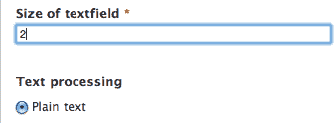

    ***图 8–20.** 在“章节编号”文本字段的章节设置中，设置文本字段的大小*

7.  其他所有选项可以保持默认值，不过为将要输入字段值的人员添加帮助文本通常是个好主意：*章节编号（整数）或附录字母*。


#### 设置章节内容类型的字段显示方式

在内容类型的字段设置完成（`管理字段` 选项卡）后，立即着手初步配置这些字段在显示时的外观（`显示字段` 选项卡），这是一个很好的时机。

1.  在此例中，隐藏所有字段的标签，将章节摘要移动到章节编号下方的顶部图片位置，并将图片样式设置为大图，如图 图 8-21 所示。

   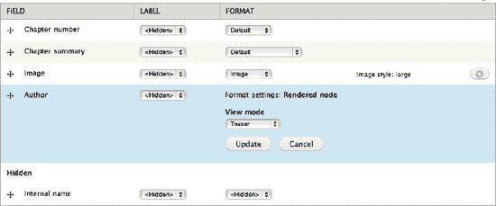

   ***图 8-21.** 为默认视图模式（包括完整内容视图）配置章节摘要内容类型的字段显示——以及设置引用的作者内容的视图模式*

    **注意** 这一节的标题是"制作目录"，但你会注意到，实际上我们做的是让目录 *成为可能*。如果这让你感到一点认知失调，那很好——你与大多数你将为其建站的人处在同一个频道上。从 Drupal 站点构建者的角度来看，一个完成的站点是指能够接收特定内容、将其放置在正确位置并通常执行所有必要操作的站点。从站点发起者的角度来看，一个完成的站点是指所有内容都已编写或添加的站点。在理想情况下，负责更新内容的人会首先添加内容，这能同时实现真实内容、测试和培训。此时你需要确保不会丢失他们的数据；这是通过代码捕获站点功能开发的另一个好处（参见第 13 章、第 34 章和附录 A）。

2.  务必至少放入几个示例。第 4 章 提到了 Devel 模块，用于生成预填充了 Lorem ipsum（虚拟填充文本）、随机图片和无意义的分类术语的内容。为了快速粘贴填充文本，还有一个 Firefox 插件（`sogame.cat/dummylipsum`）。但无论如何，只要可能，最好使用真实示例来测试功能和设计。

3.  对于目录，你需要从创建"章节"开始，它将是顶级页面并包含所有其他页面。前往 *添加内容*  *章节*（`node/add/book`）。在这种情况下，章节标题就是书名，内部名称可以是 `dgd7`。摘要是可选的。

    **注意** 图书模块允许你将书籍的顶级页面创建为一种内容类型，而将子页面保持为另一种内容类型，但这并没有足够的理由让目录的顶级页面拥有真正不同的功能。

4.  操作从内容添加表单上的一个新垂直标签页"图书大纲"开始。将"图书"从`<无>`更改为`<创建新书>`，Drupal 会就地更新页面，让你知道"这将是此书中的顶级页面"。不用担心这令人困惑的措辞，你确实是在创建一个新的图书大纲（参见图 8-22）。

   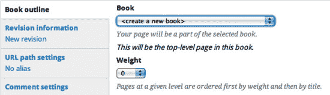

   ***图 8-22.** 创建将成为新书顶级页面的内容*

    **注意** 在顶级页面（因此也就是图书大纲）已经存在后，创建或编辑启用了大纲功能的内容时，你将能够在此处选择那本书。然后，你将获得进一步的选项，为正在创建的新内容选择此书中的父项。

5.  创建你的第一个（或任何）属于图书大纲的内容后，你会注意到它会显示一个用于添加子页面的链接。使用"添加子页面"链接向大纲中添加一个章节占位符和几个章节摘要（参见图 8-23）。


***图 8-23.** 图书模块提供的"添加子页面"链接（和"打印友好版本"链接）*

### 使用菜单区块显示更好的目录

图书模块的大纲功能允许大纲深度达到九层，但图书导航只显示第一层。这意味着如果我们将章节分为书籍的各部分，访问网站的人将只会看到在顶级页面下方以及图书模块提供的区块中列出的各部分。当然 Drupal 可以做得更好。借助一个你可能没想到能在此处提供帮助的贡献模块——菜单区块，它确实可以做到。

尽管图书大纲不会显示在菜单管理页面上，但图书模块在底层悄悄使用了 Drupal 的菜单链接。出色的菜单区块模块利用这一点，让你可以精确创建所需的图书导航菜单。下载并安装菜单区块模块（项目页面 `drupal.org/project/menu_block`）。

在安装时，菜单区块模块通过额外提供一条带有管理和设置位置链接的消息来证明其质量（参见图 8-24）。

 **提示** 如果你使用 Drush 安装模块（`drush dl menu_block; drush en -y menu_block`），你仍然会收到模块提供的消息（尽管没有链接）。更多关于 Drush 的内容，请参见第 2 章和第 26 章！

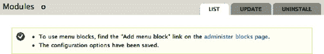

***图 8-24.** 安装菜单区块模块时提供的有帮助信息及链接*

1.  再简单不过了——跟随链接进入常规的区块管理页面（`admin/structure/block`）。在 *+* 添加区块链接旁边有一个 *+* 添加菜单区块链接（`admin/structure/block/add-menu-block`）。进入菜单区块表单后，立即点击"高级选项"标签页——别担心，它只是（通过 JavaScript）显示表单中几个原本隐藏的部分（参见图 8-25）。

2.  "区块标题作为链接"将使区块标题链接到顶级书籍页面，这恰好模仿了当选中"仅在书籍页面显示区块"时 Drupal 核心书籍区块标题的行为。不妨保持此行为。

3.  有趣的是，在"菜单"中你可以选择 `Definitive Guide to Drupal 7`——这是一个图书大纲。奇怪的是，"父项"允许你选择它所谓的`<Definitive Guide to Drupal 7 的根>`，但真正的根，从图书模块的角度来看，是顶级页面，即下拉选择中的下一个选项：`Definitive Guide to Drupal 7`。

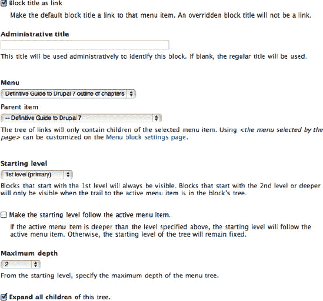

***图 8-25.** 目录的关键菜单区块设置（需要高级选项视图才能全部设置）*

4.  在此之下，作为核心区块模块提供的一项功能，你可以立即配置新区块应显示的区域及其可见性设置。通过将主题的区域设置设为"左侧边栏"，并在"可见性设置"中设置页面为"在特定页面上显示区块：除列出的页面之外的所有页面"，然后在框中列出`<front>`，将其放置在除首页之外所有页面的左侧边栏。

 **提示** 通过主区块列表管理页面为区块选择区域时，由 JavaScript 驱动的 UI 会迅速将其移走并放置到该区域。它可能会出现在该区域的顶部，但保存时实际上会将其放在底部（直到此错误修复：`drupal.org/node/1039666`）。将其移动到您想要的位置，或者将其向下拖一个位置再拖回来（不必松开鼠标），即可使其真正位于顶部。

 **提示** 如果使用的主题在首页省略了侧边栏，或者以其他方式控制哪些区块在哪些页面上显示，那么在区块配置中匹配这些可见性选项非常重要。否则，Drupal 会加载那些区块，然后又把它们丢掉，永远不会显示。Omega 主题（`drupal.org/project/omega`）允许通过 UI 对呈现进行根本性更改，它推荐使用 Context 模块（`drupal.org/project/context`）来确定区块可见性，以避免加载未显示的区块。


#### 将目录添加到主菜单

网站访问者需要一种方式查看目录，因此从主菜单链接到它。

1.  在 *管理*  *结构*  *菜单* 下，点击主菜单行中的“添加链接”（`admin/structure/menu/manage/main-menu/add`）。

     **提示** 在开发网站时，你可能希望将此“添加菜单链接”页面添加到带有黑色加号图标的工具栏中。

2.  输入菜单链接的标题，以及要链接内容的路径（本例中根书籍页面的节点编号是 50）。
    -   菜单链接标题：章节大纲
    -   路径：`node/50`
    -   赋予其一个较小的权重（例如 3），仅用于观察其排列位置。

3.  在此页面上对权重的最佳操作是猜测，因此不必过于担心。在保存新的菜单链接后，Drupal 会将我们带到一个列出菜单中所有链接的页面，你可以通过拖放重新排序。

### 将章节与其作者关联

由于网站中既有章节摘要，也有作者简介，我们应该在两者之间建立联系。这可以通过编辑章节摘要文本并插入指向作者简介主页面的 HTML 链接来实现。和往常一样，Drupal 的方式更复杂但也更强大。

从技术角度来说，你所做的是从“章节摘要”内容类型引用“作者简介”内容类型。你将在本章稍后看到从另一方向追踪关联的方法——查看作者简介并看到该作者撰写的章节。这与添加到“作者简介”内容类型的“用户引用”字段直接类似。这一次，你将在“章节摘要”内容类型（`admin/structure/types/manage/book/fields`）上配置字段，并添加一个限制为“作者简介”内容类型内容的“节点引用”字段。相同的过程在下一节第三部分“使用节点引用关联内容类型”中有更详细的描述。

 **提示** 当 Relation 项目（`drupal.org/project/relation`）成熟时（它是 Awesome Relationships 模块的命名更为谦逊的继承者），你将能够使用一个字段来引用任何实体——例如，如果你使用 Profile2 模块创建了作者简介。在此之前，References 项目提供了 Node reference 和 User reference 模块，用于连接任何接受字段的内容与节点和用户。

#### 复用章节的图像字段

与章节摘要类似，资源可以包含图像、图表以及文本内容。

 **注意** 何时复用字段，何时创建新字段？最重要的考虑因素是，你是否会需要同时从两个内容类型访问该字段类型的数据。如果数据不同，即使使用了相同的字段类型——例如，赛道内容类型中的“英里数”和汽车内容类型中油箱的“加仑数”，两者都以小数形式存储——也要创建一个新字段。然而，与分类词汇表具有相同关系的内容类型应共享同一个字段，就像 `definitivedrupal.org` 网站上的“建议”、“资源”和原始“文章”都使用“标签术语引用”字段一样。

你可能会希望创建一个视图来查看所有附加到章节或资源上的图像，并且希望这两个内容类型的图像字段行为完全一致。因此，复用章节的图像字段。

#### 允许人们将通用文件附加到内容上

资源内容类型的一个基本目的是包含与章节相关但不适合放入书籍页面中的任何内容——这意味着它绝对需要允许作者上传文件。这只需添加另一个字段——类型为文件。将其标签设为“附件”，机器名设为 `file`（或者实际上，任何你喜欢的名称）。

1.  文件字段（包括扩展了基本文件类型的图像字段）特有的两个选项是“允许的文件扩展名”和“文件目录”。我们将 `sql` 添加到允许的扩展名中，以便可以附加以 `.sql` 结尾的数据库文件，并在文件目录中创建一个名为 `resource` 的子目录（请参见图 8–26）。

    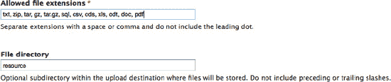

    ***图 8–26.** 特定于内容类型的文件字段设置：允许的文件扩展名和文件目录*

2.  对于“附件”字段的全局设置，将“值的数量”设为“无限制”。（保留“启用显示字段”的勾选，以便作者可以选择隐藏附件文件并在内容中链接它；对于预设行为，也保留“默认显示文件”的勾选。）

3.  最后一步，资源内容需要一种方式来引用它所附加到的节点，即书籍章节内容类型。

#### 使用节点引用关联内容类型

在本章中你已经使用过 References 模块、Node reference 和 User reference，因此你已了解操作流程。

1.  在资源内容类型的“管理字段”页面（`admin/structure/types/manage/resource/fields`）上，添加一个类型为“节点引用”的新字段，在下一页你将可以将其限制为章节内容类型（请参见图 8–27）。

    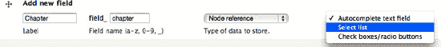

    ***图 8–27.** 向资源内容类型添加将引用章节摘要内容的新字段*

2.  将小部件从默认的“自动完成文本字段”更改为“选择列表”，然后保存表单。

3.  对于“可引用的内容类型”，仅勾选“章节摘要”并保存字段设置。

4.  将其设为“必填字段”，将“值的数量”保留为 1，其余设置保持原样，然后保存设置。

#### 管理资源内容类型的显示

现在你已经添加了所有字段，切换到“管理显示”选项卡（`admin/structure/types/manage/resource/display`），并对这些字段的显示进行快速调整。对“默认”显示模式执行此操作；资源预计不会显示为摘要，因此可以忽略该模式和其他显示模式，至少目前可以。隐藏正文标签，将文件附件显示格式更改为“文件表格”，并将章节标题设为内联（请参见图 8–28）。

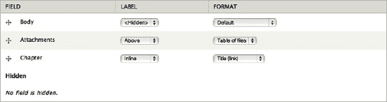

***图 8–28.** 资源内容类型的“管理显示”表单，默认显示模式*


### 为网站发帖者赋予面孔

我们喜欢那些留下建议和评论的人，并希望能看到他们的面孔。Drupal 内置了用户头像功能（标准安装配置文件已默认启用）。由 Arnaud Ligny（`Narno`）创建、Dave Reid（`davereid`）维护的一个模块，利用同名的 Gravatar 服务来使用用户已有的关联头像。（该模块允许使用其他服务，并且很可能开箱即用地支持 `libravatar.org`。）请下载并安装此模块，你可以在 `drupal.org/project/gravatar` 了解更多信息。

1.  在 *管理*  *配置*  *人员*  *Gravatar*（`admin/config/people/gravatar`）处进行配置。该模块提供了大量默认图片选项，包括使用你通过用户模块自行上传的默认图片，并且在你选择时能实时预览效果（参见图 8–29）。

    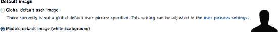

    ***图 8–29.** Gravatar 模块提供的默认图片（这是对 Gravatar 服务所提供图片的补充）*

2.  将 Gravatar 尺寸设置为 100 像素——与缩略图图片样式相同（参见 `admin/config/media/image-styles/edit/thumbnail`），该样式是为用户上传的图片设置的（参见 `admin/config/people/accounts`）。
3.  对于书籍网站，将图片成熟度过滤器保留为 G（你并不希望将 PG 分级中所有允许的内容都塞进一张图片里）。

现在，当人们发表评论时，无论是否注册为网站用户，只要他们使用的邮箱地址关联了 Gravatar 账户，他们的图片就会显示在评论旁。

#### 显示技巧：图片倾斜

Drupal 7 核心媒体样式的主要用途在于可以分配不同的尺寸，但你也可以对给定的图片样式应用一系列其他效果。第一步是找到 Drupal 隐藏这些图片样式的位置，即 *管理*  *配置*  *媒体*  *图片样式*（`admin/config/media/image-styles`）。

 **提示** 如果站点的状态报告页面（`admin/reports/status`）报告 GD 库存在问题，那么你对图片样式应用旋转或去色效果时，不会看到任何变化。你需要正确安装它；请参阅 `drupal.org/node/256876`。（Drupal 核心可能会改为允许使用替代的 ImageMagick 库来实现这些图片效果，正如该问题中 27 条评论所讨论的：`drupal.org/node/758628`。）

将缩略图（以及用户头像）向左上方倾斜一度，仅仅因为你能够这样做（并看看是否有人注意到）。

如果你不希望每个缩略图都被倾斜并显示在网站的任何位置——默认情况下，上传图片后显示的示例也会被倾斜——那么你应该添加一种新样式，并专门配置用户头像使用它。

 **注意** 当你读到这里时，Gravatar 模块很可能已经支持对 gravatar 图片进行图片样式转换（参见 `drupal.org/node/334630`）。目前，你所看到的倾斜效果是通过 CSS3 实现的（参见第 15 章及其在线资源 `dgd7.org/86`）。处理图片的方法不止一种！

### 添加允许使用图片的文本格式

现有的“过滤后的 HTML”文本格式允许用户发布包含基本 HTML 的内容——但不允许包含任何可能危及网站安全的脚本或代码。不幸的是，恶意代码可以嵌入到通过 `img` 标签包含的文件中，因此用户无法在内容中包含图片。而“完整的 HTML”文本格式虽然允许图片，但安全性**远**低得多，应仅限于管理员和其他高度受信任的用户使用。（用户只需从包含脚本标签的内容中复制粘贴，就可能不经意地向网站添加恶意或仅仅是破坏页面的代码。）结论：如果你想允许未知用户包含一些 HTML，并允许受信任用户包含图片，就需要创建一个新的文本格式。

文本格式是输入过滤器的集合。输入过滤器在内容输出时处理用户的文本输入。“过滤后的 HTML”文本格式与“完整的 HTML”文本格式（由标准安装配置文件提供）不同，因为它包含了一个“限制允许的 HTML 标签”过滤器。在 Drupal 7 中，每种文本格式可限制的内容标签都是可配置的。

在“过滤后的 HTML”文本格式所使用的“限制允许的 HTML 标签”输入过滤器中，默认提供给内容作者的允许 HTML 标签略显局限。除了图片之外，如果你想让用户添加标题或上标文本，就需要添加实现这些功能的标签：`img`、`h1` 或 `h2` 至 `h6`、以及 `sup`。

1.  要创建新的文本格式，请前往 *管理*  *配置*  *内容撰写*  *文本格式*，*+ 添加文本格式*（`admin/config/content/formats/add`），并为其命名，例如“过滤后的 HTML Plus”（机器名将自动生成为 `filtered_html_plus`）。
2.  为其指定角色：*管理员*、*作者*和*受信任用户*（前提是你已经创建了后两者）。
3.  勾选与“过滤后的 HTML”相同的已启用过滤器：限制允许的 HTML 标签、将换行符转换为 HTML、将 URL 转换为链接、以及修正错误和截断的 HTML。（如果你在第 4 章讨论该模块时安装了它，请包含“代码过滤器”；确保在过滤器处理顺序中将其设置为位于“限制允许的 HTML 标签”之后。）

     **注意** 得益于 JavaScript 的神奇功能，任何在“已启用的过滤器”下新勾选启用的过滤器，都会出现在“过滤器处理顺序”中，支持拖放排序。（在无 JavaScript 或使用屏幕阅读器的情况下，所有选项都会通过权重选择字段提供。）

4.  相对于“过滤后的 HTML”文本格式，你需要做的唯一更改是在“过滤器设置”中。这里你会有一个“限制允许的 HTML 标签”选项卡，并能够编辑“允许的 HTML 标签”。以下是扩展后允许标签列表的示例（参见图 8–30）：

    ```
    <a><em><strong><cite><blockquote><code><ul><ol><li><dl><dt><dd><h2><h3>
    <h4><h5><h6><tt><output><q><sub><sup>
    ```
    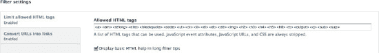

    ***图 8–30.** 文本格式表单底部垂直选项卡中的允许 HTML 标签配置*

5.  点击底部的“保存配置”保存所有设置，你就拥有了一个允许使用图片的新文本格式，该格式仅对被你授予信任角色的用户可用。


### 附加内容：简化插入图片

作者们希望为托管在网站上的草稿章节或附加内容添加图片、截图和图表，而读者无疑也希望能留下带有他们与这本书在加勒比海滩或乞力马扎罗山顶的合影的评论。通过两个用于插入并自动调整用户上传图片的贡献模块，你可以轻松实现这一点，它们分别名为 `Insert`（`drupal.org/project/insert`）和 `Image resize filter`（`drupal.org/project/image_resize_filter`）。

通过 Drush，你对该流程已不陌生：

```
drush dl insert image_resize_filter; drush en -y insert image_resize_filter
```

**提示** 许多模块在配置之前不会执行任何操作，有些模块没有自己的设置页面，而是将其配置隐藏在某些已有的管理页面中。我们总是在安装模块后检查页面顶部的消息，因为一些有用的模块会提供说明，甚至是跳转到其管理页面的链接。（Drush 会在安装模块时向你返回包含注释的消息，但不包含链接。）

`Image resize filter` 在自我说明方面做得非常出色，它会在注释“图像调整滤镜已安装。在此之前，需要将图像调整滤镜添加到一个或多个文本格式中”之后，提供指向文本格式管理页面（`admin/config/content/formats`）的链接。（请记住，你需要将 `` 添加到允许的 HTML 标签列表中，就像你之前所做的那样，这样 `Insert` 和 `Image resize filter` 才能按预期工作。）

编辑“完整的 HTML”和你新建的“HTML 过滤增强版”文本格式，在“启用的过滤器”下，为每个格式启用 `Image resize filter`（不要忘记每次都要单击“保存配置”）。

现在你需要配置 `Insert` 模块，在撰写本文时，该模块并未提供任何有用的安装说明。其设置隐藏在每种内容类型或其他实体（包括每种内容类型的评论，你可能需要为此添加一个图像字段并使用此设置）的每个图像字段中。

进入一种内容类型，添加一个新的图像字段，或编辑一个已有的图像字段。你可以为“章节摘要（书）”内容类型改进图像字段，路径为：*管理* → *结构* → *内容类型* → *章节摘要* → *管理字段*，点击“图像”一行的 *编辑* 链接（`admin/structure/types/manage/book/fields/field_image/edit`）。你无需更改此字段的任何属性，只需向下找到“插入”设置，该设置处于折叠状态且容易被忽视。

**提示** 请仔细确认已勾选“启用 Alt 字段”。这是站点满足基本无障碍标准的必要条件：每个承载信息的图片都应包含替代文本，以尽可能传达与图片相同的信息。有关更多无障碍信息，请阅读附录 E。

展开折叠的“插入”字段集，并勾选“启用插入按钮”。将“图片最大插入宽度”设置为 600 像素；这对于使用户更容易设置上传图片的大小非常有用（并能降低大图破坏站点设计的可能性）。

现在，如果用户为“章节摘要”内容浏览图片并立即上传，他们将在图片缩略图旁边看到一个“插入”按钮。当他们点击“插入”按钮时，用于显示该图片的 HTML 将会被插入到文本区域中。`Image resize filter` 模块的神奇之处在于，它利用 Drupal 核心的图片处理功能，生成一个大小与 HTML `img` 标签的 `height` 和 `width` 属性声明相同的图片版本。这个尺寸正确的图片会被缓存，其性能远优于保持全尺寸且仅由浏览器调整大小的大尺寸上传图片。如果你已经配置了所见即所得编辑器（参见第 4 章和`dgd7.org/modules`），这对用户来说通常会变得非常简单：只需拖动图片边框即可调整大小。

**提示** `Insert` 模块会使用完整的 URL 插入图片，因此，如果你正在从事任何类型的内容暂存工作，或者只是在临时域名下构建站点，然后才正式上线，那么你需要安装 `Pathologic` 模块（`drupal.org/project/pathologic`），启用其输入过滤器“使用 Pathologic 更正 URL”（是的，这是另一个通过文本格式化系统发挥魔力的模块），并将其配置为将你的本地、暂存或临时域名转换为正式域名（例如，告诉它将 [`http://dgd7.localhost/`](http://dgd7.localhost/) 视为“本地”域名，以便在正式站点上将其转换为 [`http://definitivedrupal.org/`](http://definitivedrupal.org/)）。`Pathologic` 还可以确保你的站内链接和图片能正常显示，即使人们通过 RSS 阅读器或在类似 Drupal Planet（`drupal.org/planet`）的聚合器上查看你的内容。


### 限制对“建议状态”字段的访问

你已经对网站访客隐藏了某个字段，但如何对拥有编辑权限的人隐藏字段呢？这正是你需要对“建议”内容类型的“状态”字段所做的操作——普通用户应能提交建议，但只有管理员才能设置其状态。幸运的是，有一个模块可以实现这个功能：字段权限模块（`drupal.org/project/field_permissions`）。

1.  字段权限模块启用后，（在撰写本文时）并不会在模块管理页面的条目旁提供“配置”链接。它确实提供了一个“权限”链接，但这仅针对其自身的“管理字段权限”权限，而 Drupal 已经友好地将该权限授予了管理员角色。权限页面上尚未出现任何新的字段权限。魔力必须在别处开始……啊，就在这里，在“结构”中：*管理*  *结构*  *字段权限* (`admin/structure/field_permissions`)。
2.  该页面上的表格显示了网站上的所有字段，并针对每个字段指示是否启用了任何权限处理。向下滚动字段列表到`field_status`行（它们按机器名称的字母顺序排序），然后点击**使用于**列中的“建议”。
3.  这将带你进入“建议”内容类型中“状态”字段的字段设置页面。这与添加或编辑字段时进入的页面相同；字段权限模块只是提供了一种比 *管理*  *结构*  *内容类型*  *建议*  *管理字段*  *状态* (`admin/structure/types/manage/suggestion/fields/field_status/field-settings`) 更便捷的访问方式。
4.  忽略那个吓人的警告：“数据库中已存在此字段的数据。无法再更改字段设置。” Drupal 核心（在撰写本文时）并不理解字段权限设置（例如，与锁定的“词汇表”设置不同）可以随时更改，这是完全可以接受的（参见图 8-31）。

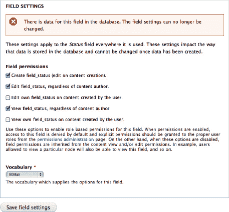

***图 8-31.** 包含新字段权限选项的字段设置页面*

 **注意** 字段权限的用户界面可能会更改，以避免此类无益的警告和其他奇怪之处，但基本概念可能会保持不变：选择要设置权限的字段，然后通过常规的“权限”页面设置其权限。（不过，有一个不太可能改变的奇怪之处是：字段权限设置是每个字段独立于内容类型的，却只能通过内容类型页面进行编辑。这种方式在 Drupal 7 的字段用户界面中已根深蒂固。）

5.  勾选以下三个权限：`创建 field_status`（创建内容时编辑）、`编辑 field_status`（无论内容作者是谁）以及`查看 field_status`（无论内容作者是谁）。这看起来可能有些反直觉——勾选了那些我们本想取消的权限——但这正是字段权限模块的工作方式：一旦选中，每个权限都会成为你可以在主权限页面上编辑的权限（参见图 8-32）。

 **注意** `创建字段` 可能看起来是 `编辑字段` 的一种特殊情况，但字段权限模块并不这么认为——如果你没有在字段设置页面上勾选它以使其在权限页面上可用，那么所有角色在创建“建议”内容时仍将能够设置状态。

6.  请务必留意字段权限模块的以下警告：“启用权限后，默认情况下禁止访问此字段，应从权限管理页面为适当的用户角色显式授予权限。”因此，在你保存字段设置后，前往 *管理*  *人员*  *权限* (`admin/people/permissions`)，事情会变得更有趣一些。

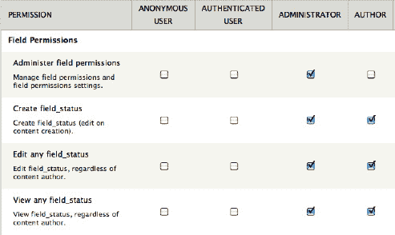

***图 8-32.** 字段权限。第一个权限是关于访问模块本身，但所有附加权限控制对字段的访问，并在你在字段设置中选中它们时生效。*

7.  对于你启用的三个权限，将它们授予管理员和作者角色。通过这些设置，非管理员、非作者用户将无法访问“状态”字段。不要忘记在表单底部点击“保存权限”，这样你就完成了对“建议”内容类型状态词汇表访问的限制。

 **注意** 如果你只想在节点编辑表单上对非特权用户隐藏字段，你可以编写几行实现 `hook_form_alter()` 的自定义代码，而不是使用字段权限模块。当然，你也可以编写自定义代码来根据用户角色有条件地显示字段，但这得不偿失。（在这种情况下，网站发起者无法决定访客是否应该看到“建议”状态，因此通过用户界面进行控制是十分合理的。）

### 使用 Pathauto 自动生成人类可读的 URL

这样做比那个笨拙的标题要巧妙得多。第一步，一如既往，是获取所需的模块。Pathauto 的项目页面（`drupal.org/project/pathauto`）需要 Token 模块（`drupal.org/project/token`），如果你已经安装了一个也需要 Token 的模块（如 Comment Notify），那么它应该已经就位了。

```
drush dl pathauto; drush en -y pathauto
项目 pathauto (7.x-1.0-beta1) 已下载至                      [success]
/home/ben/code/dgd7/drupal/sites/all/modules/pathauto。
将启用以下扩展：pathauto
你真的要继续吗？(y/n): y
pathauto 已成功启用。 [ok]
```

 **注意** 如果 Pathauto 所需的 Token 模块尚未为其他模块安装，那么第一行必须改为 `drush dl pathauto token; drush en -y pathauto`。

Pathauto 不会在管理的“配置”概览部分（也不在“结构”或“内容”中）添加任何链接。如果你足够聪明，查看 *管理*  *配置*  *搜索和元数据*  *URL 别名*，你会找到 Pathauto 模块提供的四个新选项卡。要开始使用，请转到第一个选项卡：“模式”（`admin/config/search/path/patterns`）。

首先，更改默认路径模式，使其不包含静态文本“content”。默认情况下，Pathauto 会将这个后备模式预填充为 `content/[node:title]`，但“content”这个词是一个无信息量的空间浪费。相反，使用内容类型机器名称令牌 `[node:content-type:machine-name]`，如下所示：

`[node:content-type:machine-name]/[node:title]`

 **提示** 你可以通过点击令牌名称将令牌插入到光标所在的文本字段中。

“基本页面”内容类型可以没有前缀——只需使用标题令牌 `[node:title]`。这意味着，例如，你的“关于”页面路径可能是 *about* 而不是 *page/about*。对于其他所有内容，推荐使用内容类型机器名称和节点标题，效果应该不错。

 **注意** “建议”内容类型可以做得比通用的“suggestion”替代更好。一旦 Dave Reid 在 `drupal.org/node/691078` 中的补丁被提交到 Token 模块，它就可以利用其必填的“建议类型”词汇表的值——该词汇表作为单值分类术语引用字段附加到内容上。


### 小结

恭喜！你已经构建了一个相当复杂的网站。通过配置 `Views` 和其他精选的贡献模块，你得以展示书籍的作者、呈现目录、将作者和资源链接到章节，并允许访客参与其中。这让你初步体验了不编写任何代码就能在 `Drupal` 中走多远。（通过编写代码，你可以走得更远，在接下来的章节中介绍主题和模块开发之后，我们将在第 33 章中重新审视这个网站。）

本书出版后，`DefinitiveDrupal.org` 网站将通过添加贡献模块以及配置核心模块和贡献模块，持续构建增强功能和新特性。要跟踪这些后续开发进展，可访问 `dgd7.org/moresite`。

## 第三部分


## 让生活更轻松

**第 9 章** 可能是本书中最重要的章节：如何融入 `Drupal` 社区。

**第 10 章** 针对项目规划与管理这一关键且不可避免的实践，提供了一些额外建议。

**第 11 章** 讲述了如何为客户端和同事记录你的工作，因为只有当别人能理解时，工作才有价值。

**第 12 章** 全部关于如何设置你的计算机，以帮助你配置或编码项目。

**第 13 章** 探讨了让网站上线的问题，并简要提及了后续如何继续。

**第 14 章** 传达了一个信息：通过扫清障碍、实现不受限制的努力，从而从编码或贡献中获得快乐。

## 第 9 章


## Drupal 社区：获取帮助与参与其中

**作者：Ben Melançon 和 Susan Stewart**

*“Drupal：为软件而来，为社区而留。”*

——Dries Buytaert，Drupal 创始人

你可能想知道 `Drupal` 是如何诞生的，以及它那数以千计的贡献模块、主题、功能、发行版和其他资源来自何方。从局外人的角度来看，`Drupal` 社区是一个有些模糊的概念。这些人是谁？是什么让他们成为社区的一部分？对我有什么好处？

`Drupal` 社区，就是所有通过代码、主题制作、翻译、支持、组织或其他途径让 `Drupal` 变得更好的人。成为社区成员很简单：常驻 `Drupal` 的 IRC、论坛或邮件列表，帮助人们解决他们的 `Drupal` 问题；常驻 `drupal.org` 的问题队列，进行缺陷分类、测试补丁或贡献修复方案；创建你自己的 `Drupal` 模块或主题，并在 `drupal.org` 上分享；学习如何用 `Drupal` 做某事，然后编写或改进相关文档。

`Drupal` 的内涵远不止其核心下载包中的那些文件。`Drupal` 7 很棒。`Drupal` 5 在 2007 年时也很棒。优秀的软件总是在不断进化，以满足新的需求。而驱动 `Drupal` 进化的，是一个充满活力、有血有肉的社区——一个你可以加入的社区。

在 `Drupal` 生态系统中，并没有一个中央权威来分配任务；成千上万的 `Drupalistas` 各自找到了自己的定位，所有这些定位都在某种程度上促进了 `Drupal` 的发展。文档编写、提供支持、问题队列分类、补丁测试、修复错误、报告错误、编写测试、以及维护贡献模块/主题，仅仅是 `Drupallers` 使 `Drupal` 变得更好的众多方式中的一小部分。

对于新 `Drupalista`，或是首次尝试做出贡献的 `Drupal` 用户来说，这看起来可能像一团乱麻。一群观点、背景和动机各异的陌生人，怎么可能走到一起，构建出像 CMS 这样复杂的东西，并且还能成功？混沌之中自有秩序，本章旨在帮助你理解这种秩序，并在 `Drupal` 生态系统中找到你自己的位置。

你会发现，在提供支持、编写文档、修复错误、编写代码、制作主题、测试补丁的过程中，你从一个纯粹的消费者，逐渐成长为一名成熟的社区成员。你会比一个纯粹的旁观者更深入地理解 `Drupal` 的开发周期。当 `Drupal` 的下一个版本逐步成型时，你知道该期待什么，因为你正亲身参与其发布过程。你会成为一名更熟练、更具洞察力、也更有市场价值的 `Drupaller`。同时，你也会成为更具影响力和效率的 `Drupaller`；当你负责报告错误并帮助修复它们时，你可以让那些最困扰你的问题得到关注。当你向社区贡献代码时，其他 `Drupallers` 的视线也会聚焦于此；那些想要使用它的人会帮助改进它，而你投入的时间也会获得更多的回报。

简而言之，社区成员的 `Drupal`-foo 总是高于消费者——并不是因为你必须很出色才能成为社区一员，而是因为成为社区一员会让你变得更加出色。

### 如何最大化你的参与效果

虽然有很多途径可以让你在 `Drupal` 世界中初试锋芒，但最快融入核心的方式是通过我们的 `IRC`（互联网中继聊天）频道。`#drupal` 频道有点像自由讨论区，而 `#drupal-contribute` 则专注于社区活动——核心开发、贡献模块开发、`drupal.org` 基础设施等等。

或许感受 `Drupal` 社区氛围的最佳方式是挂在我们 `IRC` 频道里，观察事态发展。我们大多数人在聊天时都会同时处理多项任务，或者离开时让客户端保持登录，所以没有人会介意那些在频道里但一言不发，或者只是偶尔插句话的人。这里是一个提问的好地方，也是初次涉足问题队列时不可或缺的资源。

### 在哪里可以找到社区

至少有数百个地方可以找到 `Drupal` 社区。虽然有些场所（例如 `drupal.org` 的网络论坛）明显是针对新手，但大多数场所都面向各种经验水平的 `Drupal` 用户。由于本书是用英文撰写的，我们将重点介绍英文资源。其他语言的使用者可以访问 `drupal.org/language-specific-communities`，查找他们偏好的语言的资源。很可能已经有使用你母语的人在从事 `Drupal` 相关工作了。

#### 阅读、收听与观看

在任何时刻，`Drupal` 社区中都有大量的事情在发生。跟上所有这些动态的一个绝佳方式，就是通过你身边的 `Drupallers` 的博客文章、播客和视频。严格来说，阅读和收听并不算与 `Drupal` 社区互动（除非你撰写回复、致电或发布自己的内容），但这是了解情况、学习新技能和感受社区氛围的简便方法。

##### Drupal Planet

`Drupal Planet` 聚合器（`drupal.org/planet`）收集社区成员提交的订阅源中与 `Drupal` 相关的博客文章，为更广泛的 `Drupal` 社区的新闻和想法提供一个中心来源。在这里，你可以阅读操作指南、公告、聚会和会议的总结报告、别重蹈覆辙的警告、深思熟虑的问题、对 `Drupal` 未来的思考，以及对 `Drupal` 发行版的评论。换句话说，你可以阅读或观看任何人那天想发布的任何内容。


##### 播客

播客（指经轻微编辑后可在线轻松获取的讨论音频记录）多年来一直是 Drupal 爱好者们了解社区动态的一种流行且非正式的方式。目前，Drupal 播客均采用录制形式，而非直播，因此您无法拨入电话提问。尽管如此，部分原因正是由于无需实时回应，它们成为了低门槛入门、感受人们对 Drupal 所怀有的那份激动——乃至纯粹的兴奋——的绝佳方式。每期节目通常还附带一个评论线程，包含相关链接和后续讨论。

-   `Lullabot`（`lullabot.com/podcast`）是一家知名的 Drupal 咨询与培训公司，自 2006 年初起便持续制作播客（尽管未严格按时更新）。这些节目通常时长超过一小时，内容广泛，常有五名或更多 Drupal 专家参与讨论。在浏览 `lullabot.com/podcast` 时，请务必查看 Kent Bye 精彩的和 Drupal Voices 系列节目，他每次都会采访一位不同的 Drupal 社区成员；这些播客通常时长约五分钟。
-   `DrupalEasy`（`drupaleasy.com/podcast`）带来篇幅较长但主题更聚焦的采访式讨论，内容涉及 Drupal 社区关心的议题。
-   `Acquia`（`acquia.com/podcasts`）由 Drupal 创始人联合创办，专注于将 Drupal 引入企业级项目。它制作短小精悍的播客，通常邀请一位正为 Drupal 代码做出重要贡献的人物。
-   `Geeks&God` 是一个帮助基督教事工运用科技的播客，其长篇讨论节目中包含对 Drupal 的特别关注。这类播客可能因其关注将 Drupal 解决方案应用于特定社群而令你感兴趣：`geeksandgod.com/podcast`

之所以列出以上这些网站，是因为截至本书写作时，它们都有持续发布节目的记录。作者将会在 `dgd7.org/podcasts` 上维护一份最新的 Drupal 相关播客列表。

##### Drupal.org 论坛

尽管大多数资深开发者不常光顾，但 `drupal.org/forum` 上的论坛依然非常活跃，主要关注新用户遇到的问题。论坛包含发布付费工作招聘广告的版块、解答 Drupal 相关问题的版块等等。

##### Groups.Drupal.org

`Groups.Drupal.org`（常简写为 `g.d.o`）让 Drupal 爱好者们能够围绕某个兴趣主题或地理区域创建群组，从而方便与希望了解相关信息的人分享新闻和资讯。因此，无论你对无障碍性充满热情、居住在印第安纳波利斯大都会区，还是想为报社网站使用 Drupal，都能找到适合你的 Drupal 群组。如果其他话题更合你的口味，你也可以创建自己的群组。

##### 邮件列表

如果你更希望将 Drupal 社区的动态直接送达你的收件箱，可以加入 Drupal 的某个邮件列表。你可以在 `drupal.org/mailing-lists` 找到 Drupal 邮件列表的清单。邮件列表的使用很简单：向列表地址发送一封邮件（请务必紧扣主题！），邮件将会发送给该列表的所有订阅者。你可以像阅读和回复普通邮件一样阅读和回复列表中的消息。大多数人发现，告诉他们的邮件客户端将列表邮件归类到特定文件夹，有助于减少收件箱的混乱。

##### 面对面交流

Drupal 每年举办两次大型会议、众多参与度高但形式更随意且通常免费的 Drupal Camp，以及遍布全球数不胜数的 Meetup。DrupalCon 通常在 `drupal.org` 首页及其他地方发布公告。寻找你当地的 Drupal Camp 和 Meetup 的最佳途径是 `groups.drupal.org` 上你所在地区的群组。

##### Drupal Camp

Drupal Camp 可能是线下 Drupal 活动中对新手最友好的。Camp 在全球许多地方举办，通常免费或费用极低。Camp 一般由本地 Drupal 群组的志愿者组织，你无需成为 Drupal 专家就能在 Camp 中帮忙。在布置和撤场、分发午餐、记录会议或为参会者登记等方面，总是需要帮助的。

参加 Drupal Camp 是以较少花费学习 Drupal 新知识的绝佳方式；而在 Drupal Camp 工作，你不仅能学到这些，还能有机会与本地 Drupal 社区建立联系，并让自己成为一名积极的贡献者。

##### DrupalCon

DrupalCon 是 Drupal 社区每年举办两次的会议，春季在北美，秋季在欧洲。来自数十个国家的数千名 Drupal 用户汇聚一堂，其结果总是令人惊叹。DrupalCon 的参会人数已从 2007 年（加州桑尼维尔）的大约 300 人增长到 2010 年（加州旧金山）的大约 3000 人，并在 2011 年（伊利诺伊州芝加哥）达到更多。DrupalCon 提供数十场讲座，内容涵盖从社区参与到数据库抽象层等方方面面，均由创建和维护 Drupal 的人主讲。

然而，如果只参加 DrupalCon 的正式讲座，你将错失良机。规模较小的“BoF”（同好交流会）为在学习过程中进行更深入的互动提供了机会，而即兴的“走廊交流”同样宝贵。此外，每晚的正式活动结束后，一群来自五湖四海的 Drupal 黑客会聚集在 Chx 编程者休息室进行通宵开发。编程者休息室是一个绝佳的机会，你可以与我们一些最多产的贡献者进行面对面交流，或在将自己的贡献变为现实的过程中获得帮助。

##### Drupal Meetup

如果 DrupalCon 或 DrupalCamp 对于你初次涉足线下 Drupal 世界来说规模太大，或者你需要在这些活动之外更频繁地获得 Drupal 相关的交流，那么答案就是你当地的 Drupal Meetup。

最全面的 Drupal 活动列表可以在 `g.d.o` 的 `groups.drupal.org/events` 上找到。这是了解特定日期活动举办地点的好方法，但除非你准备好可能飞越数千英里去孟买参加一场 Drupal Meetup，否则按日期查找活动可能不是最实际的方式。相反，花点时间加入你本地的 Drupal 群组会更好。

 **提示** 没有任何权威机构授予组织 Drupal Meetup 的特权，任何人都可以组织。如果你所在的地方没有 Meetup 群组，哪怕是在城市的一个街区、郊区，或者仅仅是在定期安排的 Meetup 活动之间，你也可以自行组织一次。这是关于 Meetup 的另一个窍门：你不需要了解任何 Drupal 知识就能组织或帮忙，更不用说参加了！有规划地组织 Meetup（至少邀请一位 Drupal 专家）并进行一些推广会更好，但资深 Drupal 用户 Cristefano 创下了一个响应速度记录：在本文作者仅提前半小时通知的情况下，他就出现在了马萨诸塞州剑桥市的一场 Drupal Meetup 上。关于组织和举办 Meetup 的更多内容，请参见第 38 章。

考虑到这可能会吸引一些甚至从未见过 `g.d.o` 的人，一些 Drupal 用户自掏腰包在 `Meetup.com` 上维护 Drupal 群组。除了真正的本地 `Meetup.com` 群组外，还有一个 Drupal Meetup 群组试图追踪全球范围内的 Drupal 活动（`meetup.com/drupal-worldwide`）。不过，任何在 `Meetup.com`、Facebook 或其他服务上发布 Drupal 活动的人，都被鼓励也发布到相应的 `groups.drupal.org` 群组中。


#### IRC

要最直接地参与 Drupal 社区，请前往 IRC（互联网中继聊天）。你可以在 `drupal.org/irc` 找到设置说明和 Drupal 所有 IRC 频道的完整列表。所有主要频道都位于 `irc.freenode.net`：`#drupal-support` 频道解答支持问题，`#drupal` 频道进行一般讨论，任何涉及社区贡献的内容都可以在 `#drupal-contribute` 频道中讨论。此外还有数十个特定频道以及基于语言和地区的频道。

与其他任何聚会场所一样，IRC 也有其自身的习惯和礼节。为了帮助你顺利融入，而不至于感到或表现得像个局外人，以下是一些需要记住的要点：

- 在正确的频道提问。`#drupal-contribute` 不是寻求网站帮助的地方；`#drupal-support` 才是。请参见 `drupal.org/irc` 上的列表，了解所有 Drupal 频道的信息。
- 无需请求许可再提问；这就是我们的目的。不要问谁在使用某个模块，或者是否有人可以帮你解决问题。要问具体的问题，比如“我在面板中有一个视图，如何向它传递参数？” 向每个人保证可以提问，或者向每位访客介绍我们的履历，会被视为浪费时间——并且是对志愿者工作的不尊重。
- 向整个频道提问。只在有人开始帮助你之后，再高亮提及他们（通过完整说出他们的昵称）；这有助于他们轻松地跟上对话。
- 未经频道内许可，不得向任何用户发送私信（pm）。支持性讨论保留在频道内，以便每个人都能参与，并且让志愿者有一个地方来跟踪他们正在帮助的所有人。
- 切勿将大量代码（超过一两行）、日志条目或其他文本粘贴到 IRC 频道中。相反，应将其粘贴到 pastebin（例如 `drupalbin.com`）中，并向频道提供该粘贴内容的链接。
- 在提问前先快速进行互联网搜索。很可能已经有人针对你的问题撰写了文档，而且这些文档可能比你在 IRC 上得到的回答更详细，或者至少能为你提供信息，让你能问出更有针对性问题。
- 不要重复提问，尤其不要向多个频道重复提问。如果任何能帮助你的人在关注，他们会帮助你。如果没有，你应该考虑在论坛或邮件列表中提问。重复提问会干扰其他对话，从而影响志愿者的工作流程；在一个空频道中，它会向所有人发出新对话的提示，而实际上并没有新对话。（半天后，或在一天中的不同时间再试一次是合理的，特别是如果你已经完善了你的问题，并且希望引起某位知情者的注意，附上问题或论坛帖子的链接。）
- 务必保持礼貌。每个在 Drupal IRC 上的人都是因为他们享受 Drupal 社区的支持氛围。当人们粗鲁无礼时，志愿者们会感到沮丧、倦怠甚至离开。保持愉快的氛围能让更多人愿意贡献他们的时间。
- 使用正确的英语（或非英语频道使用恰当的语言）。火星文（txtspk）和**黑客语（13375p34k，英语的网络和移动通信现代变体）**对有些人来说是令人厌烦的，对另一些人则完全无法理解。使用正确的英语只需多敲几次键盘，却能让你的问题更有可能得到回答。

“如何聪明地提问”（`catb.org/~esr/faqs/smart-questions.html`）和“常见支持吸血鬼的习性与特征”（`binaryredneck.net/support-leech`）是学习该做什么和不该做什么的必读文章。

新手们常常会发现 IRC 比网络论坛需要更多时间来适应。这确实如此，但付出努力绝对值得。花时间学习 IRC 习俗的回报是，你有机会让这些频道中成百上千的经验丰富的 Drupal 高手回答你的问题，其中包括一些最活跃的贡献者。

当你不提问时，也请在 Drupal 频道里挂机（闲逛）。你或许能帮助他人解答问题，甚至参与关于 Drupal 未来的深入讨论。而且你肯定会经常学到新东西。

**提示** 要厚脸皮。才华横溢的 Amitai Burstein 将受欢迎的 Organic Groups 项目改造得充分利用了 Drupal 7 的新功能（见第 5 章），同时他还改了名并征求社区意见。一位受尊敬的核心贡献者（据多方描述，人也非常好）毫不客气地反对改名。Amitai 指出了言辞的尖锐，并收到了这样的回复：“是的——我严厉一点是想清楚地表明，我认为这真是一个坏主意。”如果每个能为社区做出贡献（或从社区获益）的人，在第一次被别人不合理（或合理）地严厉批评时就离开并退出，那么这里就不会剩下任何人了。


#### 议题队列

有众多绝佳场所可以接触 Drupal 社区，但社区的核心当属 Drupal 议题队列。议题队列本质上是一个协作式待办事项列表，贡献者们在此汇聚一心完成工作。Drupal 核心、每个贡献模块和主题都在`drupal.org`上拥有各自专属的议题队列。

Drupal 核心的议题队列位于`drupal.org/project/issues/drupal`，你可以通过`drupal.org/project/issues/projectname`（其中`projectname`为模块或主题项目名称）或其在`drupal.org`项目页面上的链接找到对应项目的队列。

Drupal 的大部分核心代码与社区基础设施决策都是在议题队列中产生的；模块和主题亦是如此。正是通过成千上万的渐进式改进，Drupal 才得以持续优化。有人发布任务、漏洞报告或功能请求，其他人则进行确认、评论等操作。有人提交补丁，其他人则进行测试。

从你在 Drupal.org 的个人资料编辑页面，可以在“区块配置”下勾选“贡献者链接”，从而获得参与 Drupal 开发所需的一系列实用链接，其中包括查看各类正在处理中议题的多种方式。第 38 章简单介绍了如何使用议题队列来审查或提交补丁，而第 37 章则关于如何使用 Git 维护项目，其中涵盖了如何将自己的项目提交到`drupal.org`以便他人发现（并参与其议题队列）。在投入其中之前，以下是一些值得了解的提示：

-   你无需成为专家也能在议题队列中做出贡献。议题分类（例如将重复议题标记为重复、在措辞模糊的漏洞报告中请求更多信息等）本身就是巨大的帮助，测试他人编写的补丁同样如此。这些活动也是结识其他 Drupal 开发者并熟悉代码库的绝佳途径。你可以通过 Angela Byron 在`webchick.net/6-pass-patch-reviews`上的精彩博文了解更多关于补丁测试的知识。
-   在提交漏洞报告之前，请先搜索漏洞追踪器，确认是否有人已经提交过。重复的议题会阻碍进展，因为最好的情况是有人需要花时间标记重复；最坏的情况则是无人注意到重复，直到能量已经被耗费在处理同一个问题的多个副本上。
-   撰写漏洞报告时，请尽可能具体，包含关于你的 Drupal 安装及其运行环境的相关信息。
    -   仔细清晰地描述问题、漏洞（或缺失功能）的症状。
    -   描述问题发生的环境（Drupal 版本、浏览器、服务器、操作系统）。
    -   描述你在提问前为尝试自行定位问题所采取的步骤。
    -   描述服务器设置或网站配置中任何可能相关的近期变更（即使看起来似乎无关）。
    -   最重要的是，提供他人重现该问题所需的一切信息。
-   提交漏洞后，请跟进。通常，修复问题的人需要更多信息才能重现问题（并开始着手修复）。

### 总结

Drupal 社区包括网站管理员、程序员、设计师、主题制作者（或前端开发者）、网站所有者、项目经理、系统管理员、社区组织者、多面手、文档志愿者、讲师，甚至还有遍布六大洲的营销人员。（曾有人——"无脖"诺埃尔·伊达尔戈——勇敢地尝试将 Drupal 的代表带往南极洲，但他未能从智利南端搭上便车。）

大多数人身兼多职，并常常定义出新的类别（例如诺埃尔·伊达尔戈，一位“开放社区、自由文化和透明政府的倡导者”）。社区成员在 Drupal 之外的兴趣多种多样且并不集中，尤其是当许多人是为了给自己的兴趣社区寻找在线平台而发现 Drupal 时。（事实上，Dries Buytaert 最初创建 Drupal 就是为了让那些想讨论新互联网技术的人们能够相互交流。）尽管有一种强烈的观点认为 Drupal 频道中的一切内容都应与 Drupal 相关，但 Drupal 社区成员的其他兴趣和特质正日益被接受为其 Drupal 身份的一部分。Drupal 社区的共同主线是用 Drupal 做事——特别是，用 Drupal 创始人的话来说：“创新、协作、分享、力求简约，并享受其中。”

是什么使人成为 Drupal 社区的一员？这不仅仅是使用 Drupal。即使是某些网站管理员和 Drupal 程序员也可能在 Drupal 社区中并未扮演重要角色，而网站访问者和参与者当然可能从未意识到他们正在使用 Drupal 网站。

Drupal 社区就是那些参与 Drupal 社区的人。这听起来像同义反复，然而正是参与的行为，是将某些东西回馈给社区的行为，构建了社区。我们回馈的东西不一定是物质意义上的贡献；它可以仅仅是我们自身的存在。成为 Drupal 社区的一部分可能表现为：

-   在 Drupal.org 上与世界分享一个模块或主题。
-   为别人的模块或主题建议一行代码。
-   对解释某行 Drupal 代码的评论提供一个词的修正。
-   在当地的咖啡馆或图书馆召集一次 Drupal 线下聚会——或者仅仅出席一次。
-   在互联网的任何地方撰写一篇博文，讲述解决的一个 Drupal 问题，或用 Drupal 完成的一件酷事。
-   在众多沟通渠道中的任何一个上，对某人的问题给出有用的回应。
-   在参加 Drupal 会议期间的跳伞辅助行程中，坐在皮卡车后座讨论商业实践和 Drupal 8 设置 API（应用程序编程接口）的改进。
-   在世界任何地方的 Drupal 活动中，亲自演示一个网站、提出一个问题（或回应他人的演示或问题）。

在 Drupal 社区中的成员身份和地位并不基于学术意义上的“功绩”或专业认证之类的东西。其他 Drupalistas（Drupal 社区成员）看重的不是我们知道什么或拥有什么资质。真正重要的是我们做了什么。第 34 章涵盖了我们回馈 Drupal 的众多方式（其范围远不止代码本身）。

阅读这本书本身并不会让我们成为 Drupal 社区的一员。去和 Drupal 社区一起做点什么，或者为 Drupal 社区做点什么，才能让我们成为 Drupal 社区的一员。向他人求教并与他人分享知识，构建一些东西并回馈一些东西，这既能构建社区，也能让我们成为其中的一部分。欢迎！

 **提示：** 虽然大多数 Drupal 参与应围绕 `*.drupal.org` 系列网站展开，但你也随时可以访问本章的在线主页 `dgd7.org/participate`，寻求更多关于参与 Drupal 社区帮助的信息。

## 第 10 章


