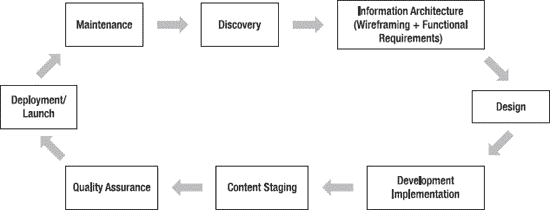
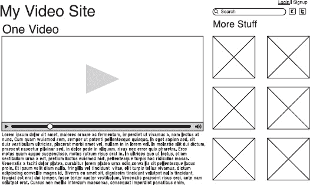

# 规划与管理 Drupal 项目

**作者：艾米·斯卡瓦达**

欢迎！本章主要讲解如何规划与管理 Drupal 网站项目。你已经了解了 Drupal 的强大功能，现在准备动手搭建一个属于自己的网站。

请带着适度热情来阅读本章：搭建网站比看上去要难得多，我有很多蹩脚的比喻来形容这种难度。就像试图用金属构件拼装一套秋千，或者坐过山车却没有轨道。请对未来充满期待，但也要明白并非一切都会一帆风顺。用 Drupal 搭建网站也是一个创造性过程，因为它需要思考、才能和技术学习才能实现既定目标。给初学者的最佳建议是：摒弃对“什么容易、什么困难”的任何先入之见。只管让自己去学习，享受当新手的感觉。

本章将涉及：制定目标、清晰定义需求、学会将大型项目分解为小模块来应对、了解需要研究什么才能最终完成项目。同时也会谈到时间管理、帮助项目顺利推进的若干项目管理方法论，以及一个合理的项目计划应该是什么样子。我会逐一讲解 Drupal 中影响规划的各个部分、需要注意的事项，以及最大的挑战是什么。

读完本章后，你应该能够清晰定义自己想要构建的内容，并对各部分需要完成的工作有个粗略的轮廓。你还会了解项目经理的职责。更棒的是，你将能够把这些职责分解为可管理的任务，并掌握完成这些任务所需的工具。

### 局限性的作用

*“人生重要的不是开始什么，而是完成什么。”*

——凯瑟琳·赫本

在规划项目时，必须意识到局限性的存在。设定“你很棒，明天这个时候就能建成一个完整的社区网站”这样的期望固然很好，但这并不合理。更好的做法是了解自己的局限性，因为这样你才知道在合理时间内能承诺完成什么——这才是真正厉害的地方。

了解自己能为一个项目投入多少时间是第一步。这样一来，当遇到非常庞大的任务时，你就能清楚地知道自己能付出多少努力，同时保持头脑清醒。这通常被称为“工作与生活的平衡”，但本质上是指能够维持那些保持你自身生产力的系统。如果你没有留出足够的时间来处理自己的邮件、人际关系和洗衣等琐事，那么在完成这个项目的过程中，你将没有生活可言，对任何人来说都不会有趣。

虽然理论上可以在 60 分钟内让一个网站上线运行，但我通常为初始建站安排 4 小时。我希望确保能正确配置开发托管环境、设置好邮件（Google Apps）和 SMTP 服务器、让 DNS 服务器指向正确位置、完成 Drupal 安装、安装模块、应用主题并添加一些内容 ^(1)。虽然这些任务可以分散在几天内完成，每次花一小时左右，但我发现这样会忘记下一步该做什么。一个功能完整、邮件正常运转并包含一些占位页面的网站，至少给了我一个起点。

### 将概念落于纸面

一旦清楚自己能为建站投入多少时间，就要思考你想构建什么样的网站。

以下是我设想的 1 到 10 难度等级：

1. “我对网站有一些想法，但概念还没完全确定。”（也就是“我打算在自己电脑上安装 Drupal 并玩玩看。”）^(2)
2. “我已经有了这个网站的概要，可能也知道标题是什么。我注册了一个域名。”（这是我预算花 4 小时完成的裸站搭建。）
3. “我有一个很久以前用 Dreamweaver/Publisher 搭建的网站，但可以以纯文本文件形式导出内容。这周我不想改进它，但想迁移到一个新网站。”
4. “我很久以前搭建的网站有很多内容需要迁移，比如一个相册或是我自 2001 年以来的所有博客文章。”
5. “我有一个需要迁移的网站，它有个定制设计。我想在新的系统中重现这个设计。”
6. “我有一个新社区网站的想法，会有一些用户，并且我会先放一些内容上去。”
7. “我想要一个新的社区网站。我有大量需要动态提供的内容，会有很多用户，并且我希望他们能通过六种不同的方式互相交流。”
8. “我已经有一个社区网站了。我想把所有现有内容迁移过去。我想把现有的所有用户也迁移过去。另外，我还想添加地图、地理位置、来自不同网站的 feed 以及私信功能。”
9. “我有三个不同的网站想迁移到 Drupal。它们都需要与现有用户协同工作，但我不想更改任何密码。用户之间可以通过 10 种不同方式互动。我现在有很多内容，但不想全部迁移，所以需要决定哪些内容需要迁移，哪些需要在新网站上重新创建。而且我也厌倦了现在的设计，想尝试些新的。”
10. 与第 9 点相同，额外加上“我需要它在三周内完成。或者最好是昨天。我今天能建好这个网站吗？”

_________

¹ 更有经验的开发者可能会预算更少的时间（比如 2 小时）。我做得不够频繁，不敢保证在关键时刻不会漏掉某个步骤，所以预算 4 小时来给自己留出慢慢推进的空间。

² 注：你不需要在自己电脑上安装 Drupal 就能玩转它（可以试试 [`http://buzzr.com`](http://buzzr.com) 上的 Buzzr 或 [`http://drupal.gardens.com`](http://drupal.gardens.com) 上的 Drupal Gardens），但安装练习一下也不错。

这些只是粗略的草图；每个类别都有成千上万的例子。我的期望是你不要试图独自处理难度超过 6 的项目。我特意没有提及“我希望能在网站上销售东西”，因为添加商店通常会使任何项目的复杂度提升一个等级。所以这个等级有可能达到 11，但任何超过 5 的级别通常需要不止一个人的帮助，而超过 6 的级别则需要 3 到 10 个人的时间和投入。

如果你对自己的目标有了想法，开始做笔记，思考你的想法可能属于哪个类别。你的网站目的是什么？谁会使用它？如果很难缩小范围，试着思考它*不是*什么。这是你的头脑风暴空间。

在深入头脑风暴之前，请先看看图 10–1，它展示了网站开发的完整生命周期。

***图 10–1.** 项目生命周期*

### 难度等级与项目生命周期

难度等级会考虑到这一生命周期。一个处于最初阶段的项目，其复杂程度远低于正在进行第四次迭代的项目。较为成熟的项目不再是从一个空泛的想法起步；它们已经拥有了既定的内容或用户，或者正在从一个已无法满足其全部增长需求的系统中迁移。请记住，你的项目也可能需要随着时间推移而发展。`Drupal` 在接收来自各种来源的输入并以多种格式输出信息方面表现得相当出色。它很灵活，但它只是将你的需求落实到纸面上的工具。接下来，我们将使用图 10–1 中的阶段来逐步了解项目生命周期。

#### 1. 发现阶段

如果你刚刚起步，那么你就处于发现阶段：我想要什么？它需要做什么？它看起来是什么样子？谁参与这个项目？谁是决策者？

项目计划产生于发现阶段；这些计划将为生命周期的其余部分提供信息。它们是指导性文档，有助于确定项目的范围和进度。

#### 2. 信息架构

信息架构是指将这些头脑风暴具体地落实下来。线框图可以让你构建一个原型，展示页面将包含哪些信息。可以将其视为网站的蓝图，就像建筑师为房屋绘制设计图一样。图 10–2 是使用 `GoMockingbird` 创建的视频网站线框图示例。([`http://gomockingbird.com`](http://gomockingbird.com))

***图 10–2.** 线框图示例*

这描绘了页面上的信息布局。有一个整个网站的标题，也可以是一张图片。有登录和注册链接，这意味着该网站有用户。有一个搜索栏以及指向 Facebook 和 Twitter 的链接。有一个主要内容区域，用于放置视频和文本。还有一个用于放置相关内容的侧边栏。这个线框图提供了视觉参考，设计师可以在此基础上进行工作，而无需从头开始重建一个网站。

信息架构阶段的另一个部分是功能需求。功能需求旨在捕获网站需要具备的所有特性以及它需要做什么。功能需求不是关于“怎么做”，而是关于“做什么”。如果你能用简单的语言回答出需要发生什么，这就是功能需求的开端。

#### 3. 设计阶段

一旦你拥有了所有内容放置位置的线框图，设计阶段就会为其“穿上衣服”，增添外观和感觉。颜色、字体、网站的外观——这一切都在这个阶段完成。设计完成后，它看起来会像一个网站，但这仅仅是一个 `Photoshop` 文件。警告：人们会期望 `Photoshop` 文件中能实现的任何效果，网站都能完全匹配。有时 `Photoshop` 文件会超出技术可行性的范围。期望一个箭头恰好位于链接 3 像素处，最终只会导致失望。将期望调整为链接旁边会有一个箭头，则更容易实现。

#### 4. 开发与实施阶段

如果说功能需求是“做什么”，那么开发和实施（连同时间表和项目计划）就是“怎么做”。所有你提到过需要的东西——正是在这个阶段，你需要决定需要多长时间以及由谁来负责实现。正是在这个阶段，线框图被转化为实际运行的网站，设计被添加进去，网站开始看起来像你在浏览器中会看到的样子。但还有一些东西缺失了。

#### 5. 内容阶段

网站的灵魂是内容：故事、照片和视频。这是项目中你添加内容的阶段。它也将引领你进入质量保证阶段，在此阶段你要确保网站按照你的预期运行并呈现。如果没有，你要么修复它，要么改变你对需求的想法。

#### 6. 部署/发布阶段

你的网站已完全完成。它已准备好上线，但如果你操作正确，你应该有两个独立的环境：一个用于开发的测试环境，一个用于生产、供全世界在浏览器中看到的环境。你需要将所有内容从开发站点迁移到生产站点。这需要一些时间和工作量。

你还需要检查所有的工作。链接是否正常工作？添加内容时，你是否记得开启了自动路径生成器，以便 URL 不是 `/node/X`？你所有的图片是否都正确迁移了？在迁移过程中是否丢失了文件目录？主题在 IE6/IE 7/IE8、Firefox 和 Safari 中是否正常工作？检查你的视图，确保它们格式正确并显示你想要的内容。浏览器 URL 栏顶部的收藏夹图标是否丢失了？这也是你测试多个用户角色的机会。匿名用户是否能看到你不希望他们看到的内容？检查并确认。准备一个电子表格，记录下来在更改域名指向新站点之前需要更改的所有内容。

#### 7. 维护阶段

你的项目在运行过程中很可能需要更新：模块会更新，`Drupal` 核心会发布安全更新，`Drupal` 的新版本也会出现。最终，你会想利用新功能或新设计，或者你会想彻底改变网站，于是生命周期将重新开始。

### 项目管理方法论与 Drupal

生命周期各阶段会被记录到整体项目计划中，而项目计划本身也受方法指引，帮助你取得成功。这里有几种思考方式，以及一些值得提及的项目管理方法论。Drupal 采用了两种基本方法论：更传统的“瀑布”模式和更迭代的“敏捷”模式。

瀑布模型源于传统项目管理。规划者假设存在有限数量的任务（无论任务列表多么庞大），并且每个任务都可以按顺序排列以完成项目。所有任务都在项目开始前进行预估并已知晓。这种模式通常用于大型建筑项目或最终有非常具体交付物的项目。瀑布模型通常也基于精确的预算或精确的时间表。例如，当我策划一个活动（如会议）时，我倾向于使用瀑布模型作为指导原则来确保一切按部就班。我知道无法调整时间表，所以我会在时间范围内尽力而为并确保成功。

敏捷是用于规划项目的迭代过程。它假设你对最终交付物的了解不那么充分。这是一个与项目中所有利益相关者协作的过程。它强调规划中的团队合作、短周期的开发，以及通过反馈来调整项目目标。当我在没有计费时间的内部项目或没有严格截止日期的项目上工作时，我倾向于使用敏捷。敏捷对于启动那些信息不足、无法有效应用瀑布模型的项目效果很好；然而，当尝试完成一个有固定发布日期、具体预算和许多必需功能的项目时，敏捷就没有那么有用了。

了解这两种方法都很有用，因为 Drupal 项目可以从两者的结合中受益。在表 10-1 中，我将任务分解为受益于瀑布方法的任务和受益于敏捷方法的任务。

**表 10-1.** 按 Drupal 项目阶段划分的瀑布与敏捷方法

| | **使用瀑布方法的 Drupal 任务** | **使用敏捷方法的 Drupal 任务** |
| --- | --- | --- |
| 发现阶段 | 记录项目计划、时间线规划 | 头脑风暴 |
| 信息架构 | 功能需求 | 线框图 |
| 设计 | （设计工作很少适合瀑布模型） | 创建设计布局 |
| 开发 | 仅在功能需求的高层次匹配上 | 构建站点的所有功能，创建站点。 |
| 内容暂存 | 决定添加哪些内容 | 在冲刺周期中积极工作效果最佳 |
| 质量保证 | 与功能需求匹配 | 效果不佳 |
| 部署/上线 | 上线清单检查 | 效果不佳 |
| 维护 | 无方法论偏好 | 无方法论偏好 |

总的来说，如果项目存在很多不确定性，敏捷会带来更好的最终产品。随着你对项目及其需求越来越熟悉，你就能更好地在后期过程中添加更多功能。

瀑布模型能让你事先描绘出所有内容，几乎不留不确定性。你会知道什么时候上线，你的最小可行产品是什么，以及成本是多少。随着你对项目越来越熟悉，如果不改变项目范围，你可能无法利用一些绝妙的创想。

站点构建和实现正是“敏捷-瀑布”混合模式发挥作用的地方。你的团队可能会在专注的敏捷环境中工作得更好以完成任务，但你的客户可能不习惯看到敏捷过程。项目经理可以用瀑布风格来规划生命周期（我会在 X 时间点完成某项工作），但通过敏捷用户故事来管理团队的工作。如果你不必在试图了解客户项目需求的同时解释敏捷如何运作，那么开发和项目管理都会轻松得多。

### 将生命周期落实到纸面上

现在你对自己要构建什么有了清晰的概念，并且对如何构建有了初步思路。现在你需要回答这些问题：

-   为什么要构建这个？
-   它将要做什么？
-   生命周期的每个阶段将在何时完成？
-   它们需要什么时候完成？
-   每个阶段需要完成什么？
-   谁来负责做这些事？

了解所涉及的复杂性是很有帮助的。所有这些都将汇聚到项目计划中。

#### 什么是项目计划？

项目计划是一份阐述项目目的和方法的文档。它定义了项目中的风险所在、主要利益相关者是谁、时间线的范围（以及该时间线由什么驱动），以及项目的成果。它还分解了什么事情按什么顺序发生，以及每个阶段由谁负责、谁参与。这是一份面向客户的文档，因为它旨在让所有参与者达成一致。当项目计划完整且清晰时，每个人都知道为什么要做这个项目，紧迫感来自何处，以及项目可能何时上线。如果做得得当，项目计划不会回避困难的部分：项目有多难，需要多快完成，以及谁真正承诺让它成为现实。

目的是项目计划中一个独特的组成部分，尽管可能只有几句话。对于一个初创公司，可以是：“这是我们新初创公司的对外形象。我们想要展示我们的工作成果并达成第一笔销售。”对于一个从现有平台迁移过来的、更大型复杂的项目，目的可以是：“我们想更新我们的网络资产，以利用新的客户互动水平。我们希望能拥有更多满意的客户和更多的销售。”对于一个社区网站，“我希望我们的用户能找到与他们需求相关的内容。”

目的陈述应该用平实的语言写成：它阐述了项目的目标。把它打印出来。（是的，用纸打印。）在棘手的会议上——那些所有与会者都带着自己希望网站实现的投资设想，且范围早已确定之后的会议——把它放在手边。这个目的陈述也可以用来回答诸如“X 想法有助于实现我们的目的吗？是否值得为了纳入它而改变范围？”这样的问题。这个目的陈述将有助于让你的项目保持在正轨上。

### 滨屋非营利组织示范项目计划

**使命**：滨屋是一家非营利组织，希望更新其网站，以便利用在线活动管理和捐款功能。

**功能**：

-   可由非技术人员轻松更新的静态页面
    -   页面中的图片
-   可供下载的文档
-   捐款功能
-   活动管理
-   电子邮件简报注册
-   过往活动照片库

**时间线**：

-   **第 1 周：启动、调研与规划，6 月 18 日至 25 日**
    -   周五：启动会议
    -   周一：项目计划与评审
    -   首页及内部页面布局
    -   周四会议：结合网站视图讨论主题，评审布局
-   **第 2 周：网站初始构建，6 月 28 日至 7 月 3 日**
    -   周一：选定主题
    -   内容站点地图
    -   功能评审
    -   内容策略概述
    -   内容类型文档
    -   角色文档
-   **第 3 周：Alpha 版网站构建，7 月 5 日至 9 日**
    -   周一：主题化网站上線运行
    -   构建着陆页线框图
    -   构建内容类型
    -   构建功能模块
    -   构建初始角色与权限
    -   周四：评审
-   **第 4 周：质量保证（QA），7 月 12 日至 16 日**
    -   周一：站点地图评审
    -   开发团队为着陆页准备内容
    -   内容类型、角色及 QA
    -   捐款功能测试
    -   周四：评审
-   **第 5 周：内容准备，7 月 19 日至 23 日**
    -   周一：根据现有内容进行网站评审
    -   内容准备
    -   内容清单
    -   周四：评审
-   **第 6 周：Beta 版网站，7 月 25 日至 30 日**
    -   所有内容已就绪，可上线发布
    -   所有 QA 工作已完成
    -   周四（7 月 29 日）网站上线
-   **第 7 周：上线后支持，8 月 1 日至 7 日**
    -   与员工一同评审培训录屏
    -   支持服务时间
    -   维护合同讨论

### 估算完成日期

请记住：日历上的日期往往比看起来更近。务必小心；根据过往经验，为自己留出合理的时间。在理想情况下，可能只需不到两周就能交付一个主题完整、内容齐全的网站。但如果项目涉及大量定制开发，或需要从旧系统迁移，则需要更多时间。

开始时，先在纸上梳理整个生命周期。需要进行多少调研？是否需要花费一周时间积极审查旧网站才能全面了解情况？客户是否希望设计非常复杂？要为设计的几次修订预留 30%的额外时间。他们想要的功能是否是你听说过别人已经实现过的？你是否在其他网站上安装过这些模块？如果你不必从头构建模块，那么你的开发时间估算会大大降低，但要为配置留出时间。估算时间是在项目中取得成功、并让所有人对工作进度感到满意的主要部分。

### 如果我什么都不做会怎样？

要勇于在规划过程中提出这个问题。一旦目的明确，也会引出其他可能性。如果你的社区网站没有能引起用户共鸣的内容，会发生什么？他们可能再也不会回来，你的广告收入可能会流失，甚至生意倒闭！这是有可能的，因此你应确保正在为这个项目做最有益的事情，以支持其背后的业务。答案可能是，在`X`条件到位之前，你根本不应该启动这个项目。如果项目从一开始就没设好成功的基础，它就不会成功，随之而来的将是许多尴尬的对话。我保证。

### 风险

项目中的最大风险之一就是旧系统与当前系统的集成/迁移。这个问题通常因为需要在`x`活动、`y`发布事件或`z`节日前紧急完成新网站而变得更加复杂。只要可能，就需要了解这些硬性截止日期并纳入计划中。然而，我们的世界并不完美：各种情况都可能发生，硬性截止日期也不一定能达成。对于这些期限，定义一个最小可行项目对于维持客户关系至关重要。

当每个人都知道最低限度是什么时，他们也就知道了情况可能有多糟糕。但有时这也会产生相反的效果，将项目的交付成果变成一场“逐底竞赛”，不断削减交付物，直到只期望完成最低限度的工作。项目经理的职责是兼顾两个理想目标：既要在销售中描绘出令人惊叹的网站项目，又要拿出能符合客户需求（即使不符合其期望）的极简版本。

### 最小可行项目/产品

这是能实现项目目的的最基本项目。它很可能无法满足所有人对功能或设计（或两者）的期望。对于某些项目，最小可行产品可以是一个域名，配上一个简单的启动页面，包含一个标志和一套配色方案；它就像是“即将上线”页或“在建”图标的一个版本。^(3) 也可以是新闻简报注册表或联系表单，让更广泛的受众有机会参与项目，或者是一系列阐述项目使命的静态页面。想象一下，在客户没有参与、开发团队因棘手问题而停滞、或者项目主要利益相关者发生变动时，在某个特定日期必须交付的最低限度是什么。在项目计划中明确这点，有助于设定“必需”与“想要”的期望；这对于奠定期望基础至关重要。在项目开始时定义好这一点，剩下的问题就是能否在此基础上进行扩充，或者根据情况缩减到这一基线。

### 跟踪承诺事项

项目已设定了预计完成日期，规划好了各个里程碑，也有了明确的截止时间。但还缺少一样东西：跟踪/工单系统。这个系统需要能够设定截止日期，并帮助管理整个团队的责任——包括你，项目经理。它需要能按日期跟踪里程碑和任务，并允许更改任务的状态。如果系统能通过电子邮件或短信提供提醒功能，那也会非常有用。

以下是一些个人偏好的工具：

- Unfuddle
- Basecamp
- ManyMoon
- 5pm
- LiquidPlanner
- Teambox

> ³ 我很少推荐使用“正在建设中”图标。这看起来就像是 1998 年打来的电话，想把它的网页要回去。但如果你喜欢那种风格，那当然很好！

请注意，这些都不是基于 Drupal 的任务管理系统。这个列表旨在轻松管理大型和小型项目。一个系统是为了让你安心，并具备同时管理多个项目的能力。当有新事项添加到工单系统中时，参与该项目的整个团队都能看到。任何事项都不会被遗忘在某个电子邮件收件箱里，而且一切行动都有记录可查。

因此，从现在开始，一切都要将这份项目计划付诸行动。我要告诉你一个秘密：你已经完成了大部分困难的工作。构建过程并非一帆风顺，但你现在已经拥有了一张路线图。

你现在是负责的项目经理。你的主要任务是让所有事情井井有条，在正确的时间做正确的事，并确保一切都能按时完成。你也是与对项目成功至关重要的人员进行沟通的主要负责人。这些人可能是组织内赞助这个新网站的人，可能是付钱给你做网站的人，甚至可能是你的父母——如果你正在为父母搭建一个博客的话。你必须能够提出问题而不指望得到答案，并且你必须能够把 Drupal 的专业术语翻译成人话。运气好的时候，这其实非常有趣。

我将为你描绘一个项目经理顺风顺水的大部分工作场景，这样你就能拥有更多顺利的日子，减少不顺心的日子。

### 超越开发的项目经理任务

项目经理的工作并不在项目计划完成后就结束。你现在负责通过启动会议、设计会议、进度检查会和里程碑收尾会议来推动项目的产出。这就是“项目经理的一天”。

#### 启动会议

这些是介绍团队成员、让整个团队首次见面的会议。了解团队中每个人的角色至关重要，我发现面对面的会议在整个项目生命周期中效果要好得多。这是一个建立关系的阶段，每个人都确保自己谈论的是同一件事。可能会冒出一些大家不理解的专业术语，因此这里有一个快速词汇表，列举了我在项目启动会议中谈论 Drupal 时经常使用的一些词汇：

- *线框图*：网站外观的非工作原型。它是一个骨架。
- *视觉稿*：Photoshop 或其他文件，它在线框图的基础上增添了外观和感觉。看起来像一个完整的网站，只是所有功能都不可用。
- *布局*：信息（图形或其他）在页面上的排列方式。
- *概念设计*：视觉稿的另一种说法。
- *主题*：一组用于改变网站外观和感觉的文件。设计就体现在这里。
- *模块*：可以安装到 Drupal 中的功能片段。它是可互换部件的系统。
- *功能*：一组用于 Drupal 的文件，它将许多不同模块的功能整合为一个。这有点像在可互换部件之上的可互换引擎。然而，“功能”这个词也用来描述网站的一些简单功能。

针对 Drupal 的设计词汇更棘手，因为设计通常是大多数非技术人员唯一能接触到的网站部分。你能看到它，能描述它，而且看着也舒服。预计启动会议通常会持续一到两个小时。你们将讨论项目计划、时间线和资源，并就任何修改达成一致。

每个人都想得到答案的问题包括：

- 我们要构建什么？
- 谁会参与其中？
- 谁负责哪个部分？
- 项目成本是多少？
- 什么时候能完成？
- 额外问题：推动这个项目的动力是什么？

理想情况下，这不会是项目中的所有人第一次思考这些问题，但会议结束时，你们应该对答案达成一致。

#### 探索会议

这些是头脑风暴会议。它们是非结构化的；在这些会议上不会做太多决定，但它们对项目的成功至关重要。记录这些会议的成果很有挑战性，但对设计师来说，当他们整合概念时，这些记录是无价之宝。

以下问题会在这些会议上得到答案：

- 你喜欢哪些其他网站？
- 它们具有哪些功能？
- 你不喜欢什么？
- 你想通过设计传达关于你网站的什么信息？
- 你在网上看到的哪些例子体现了这一点？

在这里要清楚自己的能力，不要承诺在你第一个 Drupal 网站上就实现 Facebook 最新版的设计。设计很容易让人忘乎所以，所以要小心。如果可能的话，优先考虑功能而非设计。

#### 信息架构/设计会议

这些会议通常涉及线框图或概念设计等可交付成果。参会者包括项目经理、信息架构专家、设计师和客户。会议讨论的是功能以及需要添加、删除或更改的内容。同时也会讨论网站的外观和感觉：是否太亮、太暗、处理方式不对、需要更圆润的边角。这些会议最好简短（30 分钟）且频繁（每周两次），直到信息架构专家和设计师完成最终稿。

以下问题会在这些会议上得到答案：

- 所有内容都在它应该在的位置吗？
- 缺少什么？
- 在这三个设计方案中，你最喜欢哪些元素？
- 这是最终设计，还是我们需要再修改一轮？根据估算，我们已经花费了 X 美元在设计阶段。再增加一轮设计将使整个项目的预算增加 Y 美元。这是你想要做的吗？

预算开始变得紧张就在这里。要密切关注资源情况，并对可用资源保持透明。

#### 开发会议

这些会议通常是项目经理和开发人员之间的内部会议。他们会上说明已完成的工作、剩余的工作以及阻碍进展的问题。在敏捷开发中，这些会议每天举行，并且非常简短——不超过 20 分钟。这些开发会议有助于协调开发团队，确保其他人都知道进展顺利，并能共同解决问题。这些会议贯穿项目的整个生命周期。

以下问题会在这些会议上得到答案：

- 我正在做什么？
- 接下来要做什么？
- 哪些事情会成为/已经是阻碍？

#### 进度检查

项目经理是穿梭于开发团队和客户之间，确保问题得到解答的人。这需要在开发人员和客户之间进行翻译；内容会根据网站建设所处的阶段而变化。

以下事项会在这些会议中涉及：

- 这是我们正在做的工作。
- 这是下一步要做的。
- 我们在哪些方面需要你的帮助？
- 你的内容准备得怎么样了？

#### 里程碑结项会议

当一个周期阶段结束时，项目经理、首席开发人员和客户会举行会议，以确保该阶段所需完成的所有工作均已落实，且下一阶段可以启动。如有任何需要调整的地方，应是小范围的改动，否则这也会演变成一次范围变更的讨论。

这些会议涵盖以下内容：

- 这是我们在该项目中关闭的所有任务单。
- 这是开发站点上的对应位置。
- 这需要添加到下一阶段，还是已经完成？
- 如果我们更改此项，项目工期将增加 X 时长。这样是否可以，或者需要放弃哪些其他事项来实现这一更改？

#### 上线会议

网站上线前的最后一次会议中，所有开发人员、项目经理和客户齐聚一堂，讨论网站发布前的最终修改。如果沟通一直顺畅，本次会议就不会有重大意外。如果出了差错，这次会议可能会带来令人不快的意外。作为项目经理，你需要将此次会议中的任何需求与功能需求文档进行比对。如果需求未在功能需求文档中体现，就不应纳入本次会议的讨论范畴；而应推迟到未来的工作阶段处理。

这些会议涵盖以下内容：

- 所有事项均按我们此前讨论的完成。
- 需要做哪些小修改？
- 我们所有的内容都准确无误地呈现在这里。
- 我们已在生产站点上测试了工作，准备将此项目上线。

#### 项目后复盘

太好了！网站上线了，大家都很开心，现在团队可以坐下来讨论哪些地方做得好、哪些地方不太顺利、哪些地方可以改进。这通常是一次内部的设计/开发/项目管理会议，因为坦诚的反馈才是本次会议的主要目标。

### 项目经理的其他任务

除了以上所有会议，项目经理还有实际任务需要完成，而不仅仅是跟踪项目进展。项目经理有助于明确正在发生什么以及为什么发生。

#### 创建用户故事

了解项目预期的最佳方法之一是将范围分解为一系列故事。用户应该能够做什么？管理用户应该能够做什么？这些是讲述具体事项的大故事，而不是一系列任务。它们可能在项目全程中不断撰写，而不仅仅在项目开始时。这些故事很容易向整个团队解释每个元素需要实现什么功能。

以下是一些用户故事的结构示例：

- 我想通过[站点的某部分]来[做某事]，以便能够[原因]。示例：我想在我的个人资料中收藏内容，以便将来能再次找到它们。
- 作为[某个角色]，我想要[某个目标]，以便能够[原因]。示例：作为管理员，我想删除帖子上的评论，以便能够管理网站的用户生成内容。

传统的敏捷工作流程将这些故事写在小型卡片上：故事、某些概念以及确认其可行的验证。这三个要素必须同时存在，这样任何团队成员都能独立完成此任务，而无需依赖另一张卡片完成。这是一个非常理想的状态。但更多时候，团队规模不足以需要这种可互换性，因此这些用户故事作为提醒，表明网站中完整功能应是什么样子。

#### 实施任务与任务工作流

基于用户故事，你需要创建任务。任务是具体的、需要构建/完成/处理的小事项，它们集成到完整的工作流中。大多数任务跟踪系统都支持这一点：任务可以处于不同的工作流状态。

任务最初状态为“新建”，分配给团队成员后变为“已分配”。如果团队成员觉得有足够信息完成任务，可以“接受”该任务。如果团队成员认为需要进一步澄清或不宜立即执行，任务也可以被“拒绝”；此时项目经理与团队成员应和整个开发团队或客户进行讨论。

任务完成后，其状态变为“已解决”，随后由质量保证（QA）团队进行测试，确认其在各种平台上按设计运行。

当无需进一步操作时，任务可以被“关闭”；或者如果 QA 发现需要修改，也可以“重新打开”任务。QA 可以将错误报告反馈给项目经理和开发团队。

建议使用独立的错误跟踪系统，不与开发工作流混用。实际工作流是相同的，但独立的系统有助于将开发与修复区分开。让客户能够访问错误跟踪系统（而非整个开发任务系统）有助于推动项目进展，因为这样更容易请求并收到有针对性的反馈。

任务并不总是与开发相关。设计任务可以是创建 BeachHouse 的 Photoshop 效果图，或根据已批准的效果图创建 HTML/CSS 布局。项目管理任务可以是制定项目计划，或为“探索”里程碑填充任务。任务被分配到各个里程碑，每个任务的预估时间加总后构成该里程碑的总时间。

#### 构成里程碑的任务

当一个里程碑中的所有任务完成时，站点可由客户和项目经理审核以批准。项目时间表中通常会预留一些时间，用于在会议前进行必要的审核。

让各方了解已完成的工作、正在运行的功能以及剩余待办事项对所有人都有帮助。这些里程碑会议也是审查预算的好时机。可以提出以下问题：

- 基于已完成的工作量，我们的预算情况如何？
- 项目中还有哪些待完成事项？
- 我是否有下一阶段的预算？
- 如果预算不足，可以削减哪些部分来使项目可行，或者如何获得更多预算？

花时间审查并确定下一步行动的优先级，并对项目范围与预算保持坦诚。

这也可能是新增一些原本不在范围内的事项的时机。项目经理的职责是牢记最初商定的范围，管理预算以满足预期，并推动项目完成。在每个里程碑会议之前审查范围是保持项目正常推进的最佳方式，但这并非易事。项目经理需要设定基调；最好的做法是在整个项目中保持一致性。

### 糟糕的日子

上述所有事件和任务都是项目经理日常工作中的正常部分。当项目中的部分环节出现问题、未能达到客户期望，或者被完全搁置而遗忘时，这便是糟糕的日子。

你是所有这些项目中关系的维护者，虽然确保项目完成是你的职责，但这有时也意味着收起自负，进行艰难的对话。

艰难的对话包括：

* “我需要更多沟通。”
* “我需要更聚焦的沟通。”
* “我们已经讨论过那件事，并且说好了就此了结。”
* “这就是改变方向需要付出的代价。”
* “我们预算超支了。”
* “我无法实现那个设计。”
* “我们落后于进度了。”

进行艰难的对话并不愉快，但从长远来看，回避这些对话只会让情况更糟。别让这种事发生在你身上！深呼吸。在必要时愿意进行这些对话。记录你需要做什么、你如何做的以及结果如何。每一次对话都可以通过一种让双方都能获得良好结果的方式来处理。一个好的模板是：

* 发生了什么
* 承担责任
* 你的团队承诺在 Y 时间前完成 X 事项
* 接下来会发生什么

愿意为团队承受一些打击。承诺会被打破。本该进行的测试不会进行。本应交付的设计无法交付。本该添加的内容无法及时准备好。在紧张时刻，邮件的语气会比预期更尖锐。一切都会感觉糟透了。

如果可以，让团队其他成员也参与那些通话/会议。让他们观察你如何处理团队中的失误而不归咎于任何人，你如何承担责任，你如何管理沟通中的断裂，你如何恢复团队信任，以及你如何推动项目向前发展。

最终，最好的项目是那些成员之间理解最深的团队。如果你能将项目目标传达给不同性格的人，你的工作会顺利得多。你还需要识别每个项目中的各种技能水平，包括你自己的技能。你不仅仅是项目经理，你还是协调者、领导者和导师。

祝愉快！

### 进一步资源

*《管理人类》* 作者：Michael Lopp [`http://managinghumans.com`](http://managinghumans.com)

*《推动事情发生》* 作者：Scott Berkun [`www.scottberkun.com/books/making-things-happen/`](http://www.scottberkun.com/books/making-things-happen/)

*《在不完美的世界中变得敏捷》* 作者：Greg Smith

*《来自 Drupal 项目经理的预算管理更多建议》* - `affinitybridge.com/blog/managing-budgets-and-billing-while-practicing-agile-development`

 **提示** 前往 `dgd7.org/manage` 获取更多关于规划和运行项目的资源与建议。

