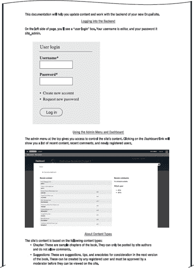
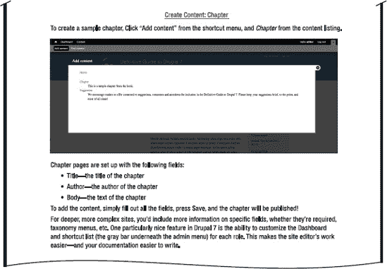
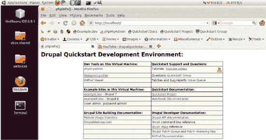
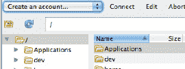
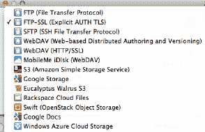
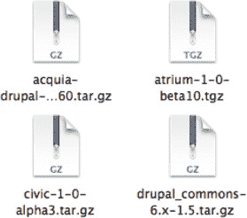
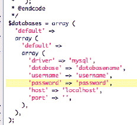

# 第 11 章


## 为最终用户和生产团队编写文档

**作者：Dani Nordin**

文档是许多设计师和开发者讨厌做的工作之一，但它很重要——不仅为了接手网站的客户和编辑者的满意度，也为了防止生产团队反复犯同样的错误。

本章将为你概述如何为 Drupal 项目团队创建有效的文档。理想情况下，你将为一个特定网站的最终编辑者和管理员创建文档，同时为生产团队创建内部文档以帮助提高其工作流程效率。我还将讨论 Drupal 社区成员发现的一些方法，用于为同行 Druapl 开发者创建文档——以及你如何也能做到。

### 什么是好的文档？

虽然没有固定公式适用于好的文档，但在创建文档时有几点需要谨记。好的文档：

* 易于编辑并能随着网站的发展而演进。

* 格式一致，这样在每次向文档添加内容时不必重新发明轮子（包括截图等可视化内容）。

* 覆盖用户最常需要处理的事项——最好按照他们需要处理的顺序。

* 讨论用户可能遇到的常见错误以及如何解决。

* 用简单的语言编写。

最后一点在创建文档时是最重要的，无论是为客户网站、Drupal 模块或主题，还是为团队内部文档。这并不是说文档中不应该包含代码或技术要求；而是说，重要的是要假设你的最终用户并非像你一样的专家，但如果愿意以他们能理解的方式提供指导，他们愿意*获得*专业知识。

 提示 Claudina Sarahe 编写的特别补充内容涵盖了为不同受众编写文档的最佳实践，以及用于创建和维护文档的工具。请在本章的在线主页 `dgd7.org/document` 查找该内容及更多信息。

### 让客户尽早参与内容录入

由于内容的策划、创建和录入是任何 Drupal 网站的重要组成部分，因此让客户的目标内容团队尽快开始向网站输入内容至关重要。这样做可以实现几个关键目标：

* 让开发团队养成快速迭代原型的习惯。

* 让客户习惯与 Drupal 界面交互。

* 有助于在过程中尽早识别需要调整的领域，从而使开发更容易。

* 让客户了解完整的开发过程。理想情况下，促使他们从对美学的关注（即事物看起来如何）转向对用户体验和功能性问题的关注——直到真正该讨论美学的时候。

最后这一点是让客户尽早参与录入过程的最重要原因。客户在网站规划早期很容易纠结于字体、颜色和图像的选择。为了让设计过程高效运作并产生有效结果，客户和设计师都需要尽早并经常打破这个习惯。

让客户尽早参与内容录入过程的最佳方法是，一旦你有了网站的工作原型，就在受密码保护的 URL 上设置一个预发布服务器（例如，`staging.newsite.com`）。预发布服务器是网站的“开发中”版本；它允许客户和开发团队了解项目的进展，并防止外界看到生产站点（即线上站点）上正在进行的工作。更多信息，请参阅第 13 章。

如果你设置了预发布服务器，到网站上线时，客户的内容团队（理想情况下）将拥有足够的 Drupal 网站内容管理经验，以至于成为他们的第二天性。那么为什么还要事后创建文档呢？答案很简单：人员会变动。现在录入内容的人并不一定是唯一负责该网站内容录入的人，直到永远。以 PDF（或更好的是，网站隐藏区域内的内部 Wiki）形式交付给客户的优质最终用户文档，是建立客户好感的重要方式。它还能防止未来新来的客户编辑打来焦虑的电话。

### 发布后创建最终用户文档

为客户创建有效文档的最佳、也是最简单的方法，是在网站构建过程中，一旦网站的某些区域获得批准，就立即开始编写。尽管每个网站都不同，但应包含的关键区域包括：

-   如何登录网站的信息，包括登录`URL`、用户名和密码。

-   对管理菜单以及你设置的任何快捷方式的简要概述。

-   如何添加内容以及如何格式化每种内容类型。虽然为每种内容类型都在文档中包含一条说明可能看起来重复，但养成这个习惯会非常有用——尤其是对于那些技术不太熟练的客户。

-   如果适用，关于如何创建新用户以及如何为其分配角色的信息。

-   对菜单系统以及如何添加/删除菜单项的简要概述。

-   对分类系统以及如何添加/删除术语的简要概述。

-   对区块系统以及如何添加/删除区块的简要概述。

请注意，最后三项存在一些争议。许多开发人员反对让客户拥有对其网站架构和菜单/区块系统的控制权，而访问区块、菜单等将会赋予这种控制权——这理所应当。然而，经验表明，客户期望并且经常要求这种级别的控制权；毕竟，他们选择像 Drupal 这样的内容管理系统，部分原因就是希望有能力管理自己的内容，而无需致电他们的网络团队。

因此，在开发过程中创建一些方法，让网站编辑者能够在不破坏网站其他部分的情况下管理菜单项和分类等内容，这一点非常重要。通过使用权限，你可以实现以下目标：

-   允许网站编辑者创建新的分类术语，但不能创建新的词汇表。

-   允许网站编辑者创建新的菜单项、删除或移动菜单项，但不能创建新的菜单。

-   允许网站编辑者创建和放置新的区块，但不能更改视图。

在网站制作过程中需要考虑的另一件重要事情是用户将如何向网站输入内容。虽然`WYSIWYG`编辑器（例如你在 Microsoft Word 中用来格式化副本的按钮）在 Drupal 网站构建者中可能是一个有争议的话题，但可以放心地假设，你构建的几乎任何网站最终都将由非网站构建者来管理。Drupal 网站的内容编辑者通常包括企业主、秘书、实习生和志愿者。有些人可能精通技术，但坚持要求客户学习`HTML`以便在纯文本编辑器中输入内容，这对客户（或你的团队，因为他们将不得不接听困惑的网站编辑者的支持电话）是不公平的。客户期望某种`WYSIWYG`编辑器，而作为网站构建者，提供这种编辑器非常重要。幸运的是，`WYSIWYG`模块（`drupal.org/project/wysiwyg`）支持多种不同的库。有关更多信息，请查看第 4 章。

### 优秀客户文档的剖析

优秀的文档应该：

-   使用具备基本技术知识的人易于理解的语言编写。假设他们不懂`HTML`。

-   当网站部分内容发生变化时，开发团队可以轻松更新。

-   全面；它涵盖了客户管理团队在管理网站时将要处理的所有事项。

出于这些原因，我使用简单的文字处理程序（如 Microsoft Word 或 OpenOffice）来创建网站文档。对于文档团队来说，这使他们能够快速创建文档，并在网站发生变化时轻松更新。文件以`PDF`格式交付给客户，这有助于确保内容不会在后续过程中被意外删除。

创建文档的过程同样简单，但对于习惯于埋头于代码的人来说，通常需要稍微转变一下思维方式。基本流程是执行网站编辑者需要做的所有事情——从创建新内容到更改菜单项，再到添加分类术语——并使用屏幕截图记录整个过程。

例如，这是我们在第 1 章和第 8 章中构建的网站的一些文档示例。

**网站文档 :: DGD7.ORG**





### 为开发团队编写文档

虽然客户文档是 Drupal 开发过程中必不可少的一部分，但内部文档对于开发团队的重要性也不容低估。作为聪明人，我们很容易将事情记在脑子里——当只有我们自己接触这些东西时，这很有意义，但当其他人参与进来时，尤其是在较大的项目中，这就会引发问题。

团队文档可以采取多种形式，从内部 Wiki（可以使用 MediaWiki（[`www.mediawiki.org/wiki/MediaWiki`](http://www.mediawiki.org/wiki/MediaWiki)）或直接在 Drupal 中构建！），到内部网（请查看`openatrium.com`，这是一个基于 Drupal 构建的团队内部网解决方案），再到共享的 Evernote 笔记本或充满随机代码片段的 Dropbox 文件夹。在创建文档时，最重要的不仅是考虑你当前的团队，还要考虑你最终希望拥有的团队。团队会成长；老成员离开，新成员加入。拥有良好的内部文档可以使新团队成员快速上手，并有助于避免生产瓶颈。

创建良好内部文档中最重要也最困难的因素是建立一个合乎逻辑的组织结构；将所有内容存储在一个公共位置很重要，为保存的代码片段、博客条目和其他文档添加注释或引用也同样重要。最后，定期检查文档并清除过时或老旧的信息也很重要。Drupal 在不断发展，团队开发经验也是如此。文档的目的不是记录你做过的每一件事，而是编译一份团队成员可以相互分享的最佳实践列表。

良好的内部文档应涵盖：

-   团队反复使用的代码片段，并附上用例描述。

-   特定模块的独特之处以及团队为解决这些问题所做的努力（如果你将代码作为补丁贡献给该模块，那就更完美了！）。

-   网站启动检查清单，涵盖启动网站时常见的问题（以及如何从中恢复）。

-   针对常见构建网站的“配方”（特定模块和配置的组合）。

-   常用文件、模块、网站配置和基础主题的位置（有关主题的更多信息，请参阅第 15 章和第 16 章）。

-   团队共享的编码和开发标准。

组织文档的方式和制作通心粉奶酪的方式一样多种多样。虽然味道可能会因你添加的配料而改变，但关键成分总是不变的：你可以使用任何一种奶酪或任何一种形状的通心粉，但你仍然需要奶酪和通心粉。

### 为社区编写文档

虽然贡献代码是为 Drupal 社区做贡献的绝佳方式，但贡献高质量的文档可以说更为重要。优秀的文档不仅对当前的 Drupal 站点构建者和设计师解决棘手问题至关重要，还能帮助新手站点构建者轻松上手创建 Drupal 站点，从而使社区更加强大。

Drupaller 可以通过多种方式为社区贡献文档。最流行的方法之一是网络播客；例如，Lullabots（`lullabot.com`）提供了许多付费和免费的播客，内容涵盖与 Drupal 工作相关的概念。Bob Christenson 的 MustardSeed Media 视频播客（`mustardseedmedia.com/podcast`）是熟悉主题化和使用显示模块的绝佳途径。Drupaltherapy（`www.drupaltherapy.com/screencasts`）提供的截屏视频则专注于通过特定模块组合的“配方”来进行站点构建。如果没有像他们这样的人制作帮助我们学习如何使用 Drupal 的内容，许多聪明而有才华的设计师和开发者就不会成为社区的一员。

因此，如果你正在使用 Drupal 并学到了新东西，请写一篇博客或制作一个截屏视频。如果你发现某个模块存在问题，请在 `drupal.org` 上的问题队列中提交，或在 Twitter 上提及。如果有天你收到一封感谢你贡献的电子邮件，请不要感到惊讶。

### 知道的越多越好

好的文档不是要为你本已繁忙的日程增加更多工作。它旨在帮助你的客户、你自己以及社区享受你用 Drupal 制作的出色站点。它旨在避免半夜收到客户发来的、因不知如何向站点添加页面而抓狂的邮件。它旨在让下一位 Drupaller 免于重蹈你为让某个模块或主题正常工作而苦苦挣扎的头痛经历。它旨在分享你在某个站点上学到、却又希望自己能记住的酷炫技巧。好的文档对每个人都有帮助。你越早开始整理，效果就越好。

 提示 随着 `dgd7.org` 本身以及其他示范项目（如 `dgd7.org/anjali`）工作的持续进行，文档示例和经验教训将会发布到 `dgd7.org/document`。

## 第 12 章


## 开发环境

**作者：Kay VanValkenburgh**

请特别关注本章。这个主题可能就像第一次约会就去家得宝一样“迷人”，但本章将让你免于重复造轮子。无论你是否有意，当你启动任何类型的项目时，你都会建立一个开发环境：你选择工具并创建空间，这些空间定义了你的流程，并要么限制、要么推动你的努力。所以，这里是你利用他人错误经验的机会。在本章中，我将探讨高效且相互关联的工具以及适当定义的空间。我将聚焦于几种可能的方法，每种方法都只需要最少的设置和维护。结果将是一个开发环境，它能让你的项目顺利运行，为项目和团队规模及复杂性的变化建立灵活性，并让你将精力集中在可交付成果上，而不是纠结于不完善的设置。

对于没有编程经验、想从最基本的必需品开始的人，请跳转到名为“最基础的开发环境”的章节，了解完成上传和安装站点等基本任务所需的*最简*工具集。你可以从这里开始，随着熟悉程度和需求的增长，再回到本章的其他部分来扩展你的开发环境。简而言之，本章涵盖以下内容：

*   **快速启动**：一个功能完备、预配置好的开发环境，启动即可使用。下载它，添加凭据，添加你的项目，你就能通过一个强大的本地环境开始工作了。（适用于经验丰富的开发人员以及处于开发者职业发展轨道的初学者。）

*   **向现有开发环境添加关键工具**，以及添加这些工具的理由。（适用于经验丰富的开发人员。）

*   **注册并配置网站托管账户和域名注册**。（适用于初学者和非编程人员。）

*   **安装并配置创建和维护简单 Drupal 站点所需的基本图形用户界面（GUI）工具**。（适用于初学者和非编程人员。）

 **注意** 设置开发环境的选择几乎是无限的。本章描述了两种主要方法：在虚拟环境中使用功能完备的 Linux 构建，以及使用 Windows 或 Mac 的原生工具。更多方法请参见 `dgd7.org/devenv`。

### 快速入门指南

`Quickstart`（`drupal.org/project/quickstart`）是一个适用于 Mac 和 Windows 电脑的虚拟设备，只需几步即可启动一个预配置的、以 LAMP 为核心的开发环境。它省去了数小时的工作，为你提供一个经过深思熟虑且全面组装的环境，只需几分钟即可完成设置。与 `Drubuntu`（一个可在 Ubuntu 上设置预配置开发环境的 `Drush` 脚本；参见附录 G）一样，`Quickstart` 还额外提供了 Drupal 特定文档（`drupal.org/node/788080`）、问题队列（`drupal.org/project/issues/quickstart`）和用户组（`groups.drupal.org/quickstart-drupal-development-environment`）——换句话说，它拥有一个不断发展的开发者社区的所有优势，这个社区共享通用工具和代码库。`Quickstart` 使用带 Ubuntu 的 `VirtualBox`，并且是完全开源的。

与大多数虚拟化解决方案一样，`Quickstart` 可能面临性能挑战，并且需要大量资源。`Virtual Box` 应用程序至少需要 1024MB 内存，而 `Quickstart` 镜像在交付时占用 18GB 硬盘空间，因此请首先检查是否需要腾出空间或安装更多内存。关于性能，各种机器和主机操作系统上的用户都曾抱怨运行缓慢。在一次简单测试中，`Quickstart` 在一台仅有 2GB 内存的老式 Intel Core Duo 机器上的 Windows XP Pro 系统中运行完美。然而，一台更新、更强大的机器却出现了性能问题（尽管是轻微的）：在一台配置精良的 MacBook Pro i7（Snow Leopard，8GB 内存，固态硬盘）上，屏幕刷新过于卡顿，导致鼠标难以使用。调整窗口大小等典型任务需要额外的注意力和耐心。尝试增加基本内存、显存和处理器数量的小规模实验并未消除卡顿现象（有关加快 `Quickstart` 速度的简要说明，请参见 `drupal.org/node/819720`）。

如果你以前没有使用过组装完善的开发环境，那么为了熟悉它，值得解决性能问题。然后，你可以选择你认为最有价值的组件，并花时间将其安装在你偏好的开发操作系统上。以下是 `drupal.org` 项目页面（`drupal.org/project/quickstart`）上描述的安装步骤。请注意，安装需要导入一个设备，而不是创建新机器（当 `VirtualBox` 完成安装后，它会提示你创建新机器；你需要取消该操作并按照这里的说明进行）。

1.  使用 BitTorrent 下载 `Quickstart` 0.9.1 虚拟机。（需要客户端？从 [`www.utorrent.com`](http://www.utorrent.com) 获取 `uTorrent`（Windows 和 Mac））

2.  安装 `Virtualbox`（版本 4.0.4+）。

3.  导入 `Quickstart` 虚拟机。

    1.  启动 `Virtualbox`。

    2.  文件  导入虚拟电脑  选择文件 （选择已下载的 `ova` 文件）

    3.  将内存设置为系统内存的 50%（最低 1024MB，最高 2048MB）。

    4.  导入 （等待导入完成）。

4.  从列表启动新机器。

5.  用户名：密码

    1.  Unix = `quickstart:quickstart`

    2.  MySQL = `root:quickstart`

    3.  Drupal = `admin:admin`

6.  更新到最新官方版本：`drush`，`drush make`，`drush Quickstart` 等。要获取 `drush` 命令的最新更新：

    1.  `cd ~/quickstart`

    2.  `git pull`

    3.  `bash -x update.sh`

一旦 `Quickstart` 运行起来，打开自述文件（如图 12-1 所示）以获取文档、教程以及一些基于浏览器的开发者工具的链接。值得点击这些链接，并仔细查看页面顶部打开的 Firefox 工具栏。



**图 12-1.** 自述文件包含指向文档、教程以及一些基于浏览器的工具的有用链接。

虚拟化还有其他好处。请参阅后面关于浏览器测试的部分，了解虚拟机特别擅长解决的一个挑战。不过，如果你不打算采用虚拟化方案，请继续阅读本章的下一节，其中包含在 Windows 和 Mac 操作系统上安装几个 Drupal 友好型 IDE 关键组件的说明。

### 增强你现有的开发环境

# 开发者工具设置

几乎每个任务都有对应的开发者工具。你执行某个任务的频率越高，“正确”的工具就越有用，你的开发环境也就越个性化。本节将介绍如何设置一些更常用的工具，并探讨促使你将它们纳入自定义开发环境的因素。我将涉及以下几个主要开发需求：

*   在本地托管你的网站。

*   访问命令行。

*   处理渲染后的 HTML、CSS 和 JavaScript。

*   测试浏览器和设备兼容性。

*   处理 PHP 文件。

## 在本地托管你的网站

在本地机器上托管你正在开发的网站通常被认为既方便又是一种最佳实践。借助 `Git` 来促进团队开发人员工作的合并，本地开发实例允许每个团队成员使用自己的文件、数据库和服务器软件副本。这种设置让每个团队成员能够更自由地实验，并在上传可能干扰其他团队成员工作的半成品修改之前解决问题。此外，本地开发环境可以随身携带，无论开发人员是否在线，网络中断也不会阻止整个团队的工作（这也是独立开发者也采用此做法的两个原因）。

在 Mac 和 Windows 上本地运行 LAMP 堆栈的几种可靠、全面的解决方案已被打包成经过充分测试的安装包。不同的系统在任务上各有不同的方法和工具；本书专门为四种常见解决方案提供了附录。

*   附录 F 介绍了在 Windows 上使用 WAMP 进行本地托管。

*   附录 G 介绍了在 Linux 上设置 `Drubuntu`。

*   附录 H 重点介绍了 Mac 上的 MAMP。

*   附录 I 重点介绍了 Acquia Dev Desktop，它可在 Windows 和 Mac 上运行。

Windows 上的另一个选择是 Microsoft WebMatrix（`microsoft.com/web/drupal`），它可以在 IIS 上本地设置运行 Drupal。

## 访问命令行

在很多人眼中，命令行仿佛是黑暗时代的遗物，一种图形界面出现前用来折磨人的工具。尽管外表不太友好，但命令行却是开发环境中一个重要、高效且强大的组成部分。

Mac 和 Linux 系统自带`终端`，这是首选的命令行界面。在 Mac 上打开`终端`，请前往“应用程序”“实用工具”`终端`；在 Ubuntu 上，请前往“应用程序”“附件”`终端`。

在 Windows 上使用`终端`有几种选择。最常见的是通过虚拟化（例如 Quickstart）托管 Linux，或者安装 Linux 模拟器。`Cygwin`（`cygwin.com/`）在后一种方法中被广泛使用。

要安装`Cygwin`，请遵循以下步骤：

1.  在`cygwin.com/setup.exe`下载安装程序。

2.  运行`setup.exe`，接受默认设置，并按照屏幕指示操作，直到进入软件包选择界面。

3.  在软件包选择界面中，找到并启用以下选项（单击某个软件包一次会选择最新版本，再次单击会选择之前的版本，所以请克制住双击的冲动）：

    1.  在“Shells”类别中，选择“`rxvt`：用于 X 和 Windows 的 VT102 终端模拟器”。

    2.  在“Net”类别中，选择“`openssh`：OpenSSH 服务器和客户端程序”。

    3.  在“Archive”类别中，选择“`unzip`：Info-ZIP 解压缩工具”。

    4.  在“Editors”类别中，选择“`nano`：带扩展功能的 pico 克隆文本编辑器”（你也可以添加`vim`）。

    5.  在“Web”类别中，选择“`wget`：通过 HTTP 和 FTP 从万维网获取文件的工具”。

 **注意** `终端`在处理文件和目录名中的空格时，与 Windows 和 Mac 操作系统不同。输入路径时，请使用反斜杠来转义空格，如下所示：

```
$ cd Documents\ and\ Settings
```

除了输入文件或目录的完整路径外，你还可以将其图标拖放到`终端`窗口中。

当完成`Cygwin`的安装后，启动`Cygwin`程序即可打开`终端`。输入`help`以获取命令行功能列表。有关使用命令行的说明，请参见本书的其他章节。

## 使用渲染后的 HTML、CSS 和 JavaScript

对前端开发者而言，最有价值的工具是 Firebug 插件（[`http://getfirebug.com/`](http://getfirebug.com/)）。在最基本的实现中，`Firebug`允许 Web 开发者在页面运行于浏览器中时，检查和试验性地更改其 CSS 及 HTML 的设置。完整功能需要流行的开源 Firefox 网络浏览器，不过也有在其他浏览器中提供部分功能的版本。其他一些浏览器也实现了提供类似功能的自身工具，其中最值得注意的是 Safari 开发者工具（要使用这些工具，请开启菜单 Safari偏好设置高级中的“开发”菜单）。

 **注意** 在开始使用`Firebug`之前，请确保在“管理”“配置”“开发”“性能”（`admin/config/development/performance`）中关闭你网站的`CSS`和`JavaScript`聚合功能。

要启用`Firebug`，首先将其添加到 Firefox（使用 Firefox 浏览器访问`getfirebug.com`并点击“安装 Firebug”），然后通过菜单“工具”Firebug“打开 Firebug”来激活它。默认情况下，`Firebug`打开时，左窗格显示 HTML 视图，右窗格显示与高亮元素关联的样式。样式按优先级顺序列出：列表顶部的样式会覆盖下面列出的样式（请注意，这种显示顺序与 CSS 样式表相反，非常适合屏幕阅读的目的）。可以通过展开和选择 HTML 元素，或启用检查器缩放工具（Firebug 面板左上角的图标，显示一个鼠标指针和一个矩形）来浏览代码。要使用缩放工具，请点击检查器缩放工具，然后在网页上悬停，直到你想要检查的区域被高亮显示。点击页面，HTML 视图将放大到与该高亮区域关联的嵌套 HTML 元素。

一旦定位到你想影响的 HTML 元素，你就可以更改“样式”窗格或“HTML”窗格中显示的值。更改将立即对已加载的页面生效。但是，`Firebug`不会保存这些更改。这些更改仅影响页面的当前加载实例（也就是说，如果你在现有窗口中保留更改后的页面，并在另一个窗口中打开页面的新实例，你会发现所做的更改不会应用于新窗口或新标签页）。

要实现你希望保留的更改，请在文本编辑器中打开相关的 PHP 或 CSS 文档。在开发所需设置时，相应地修改相关的 PHP/CSS 文档。请记住，只修改你自己的自定义主题或模块文件，不要修改核心或贡献代码；有关覆盖渲染后的 HTML、CSS 和 JavaScript 的正确方法，请参见关于主题化的第 15 章和第 16 章。还要牢记，最佳实践是避免对正在运行的网站代码进行修改；请务必在开发服务器上进行更改，然后酌情部署到预发布和生产服务器。

另外，请查看 Drupal for Firebug 模块，该模块将 Drupal 调试和 SQL 查询信息添加到`Firebug`窗口中（请参考`drupal.org/project/drupalforfirebug`）。

## 浏览器与设备兼容性测试

在优化网站主题时，务必在目标受众使用的各类浏览器和设备上对网站进行全面测试。对于外行来说或许难以置信，但在 Internet Explorer 和 Firefox 这两款主流浏览器中，同一网站的显示效果可能大相径庭。即便在 IE 不同版本之间，显示差异也可能相当严重（IE6 在某些市场依然根深蒂固，据报道仍占 IE 整体使用量的 15%以上，尽管 IE9 现已可用）。另外要注意，某些行业（学术界尤为突出）比其它行业更倾向于继续使用旧版浏览器而非升级。随着支持网络功能的移动设备选择日益增多，全面测试网站的挑战也随之加大。

缩小测试范围会很有帮助。首先确定哪些浏览器和设备最为重要。关于当前浏览器市场份额的统计数据有多种来源；`en.wikipedia.org/wiki/Usage_share_of_web_browsers` 列出了这类来源的优质参考列表。最终判断应测试哪些浏览器和设备的最佳指标，是专为项目目标受众收集的统计数据。如果你正在处理现有网站，通常可以从主机网站的统计数据中获取此类信息；你也可以在 Drupal 安装中添加 `Browscap` 模块来捕获浏览器版本信息（`drupal.org/project/browscap`）。在查看历史数据时，请牢记移动互联网使用的快速增长。

即使你已经确定了需要关注的有限浏览器和设备范围，执行测试本身仍可能是一项挑战。对于桌面和笔记本电脑浏览器最系统化的兼容性测试方法是，运行（虚拟）机器来承载每个感兴趣的操作系统与浏览器版本的组合。对于移动设备，设备制造商通常会随开发者工具发布模拟器；请访问其网站获取下载和说明。

并非所有人都能证明投入人力来构建和维护这一系列测试环境是合理的，此时可以借助第三方服务来处理测试。不过，以下是一些针对桌面浏览器版本的潜在捷径：

- `Utilu IE Collection` 是一个可下载的合集，包含所有主要版本的 Microsoft Internet Explorer，并设置为可在同一台机器上同时运行；可在 `utilu.com/IECollection` 找到。

- Mozilla 在 `releases.mozilla.org/pub/mozilla.org/firefox` 维护着一个 Firefox 版本目录。

- `Multi-Safari` 提供 Apple Safari 的单独立下载，将每个版本的相应 WebKit 框架捆绑到应用程序中（详见网站说明：`michelf.com/multi-safari`）；Apple 似乎也保留了旧版本的下载页面，可通过搜索引擎找到。

- Opera 在 `opera.com/docs/history` 维护着多个可下载的版本。

- Google Chrome 旧版本的资源尚未出现。

在测试浏览器时，请记住目标用户的机器上可能安装了会影响显示和性能的不同插件，更不用说屏幕分辨率和尺寸的影响，以及访问者可以调整窗口大小这一事实（针对后者，请确保在每个测试平台上调整浏览器窗口大小，以验证所有流体或未定义宽度的行为是否符合预期）。

### 使用 PHP 文件

Eclipse 和 Netbeans 是两个非常适合 Drupal 开发需求的开源集成开发环境（IDE）。它们安装和配置迅速，并提供了一种出色的方式来导航和修改你的 Drupal 模块和主题。从 `eclipse.org/pdt` 获取 Eclipse PDT（PHP 开发工具）；从 `netbeans.org` 获取 Netbeans。以下是在你的机器上设置 Eclipse PDT 包的基本步骤：

1. 启动 Eclipse。在启动欢迎页面上，选择工作台（Workbench）。

2. 在“窗口” “首选项” “常规” “内容类型”中设置偏好，以识别 Drupal PHP 内容类型；逐个输入以下文档类型，并以点号开头：`.engine`、`.install`、`.inc`、`.module`、`.profile`、`.theme`、`.test`）

3. 在“窗口” “首选项” “常规” “工作空间”中设置文本编码和行分隔符；在窗口底部，使用“文本文件编码” “其他” UTF-8 和“新建文本文件行分隔符” “其他” Unix

4. 在“窗口” “首选项” “常规” “编辑器”中设置将制表符转换为两个空格；将“显示的制表符宽度”设为 2，并选择“插入空格代替制表符”。

## 最基础的开发环境

本部分旨在帮助初学者和非编程人员搭建一套供偶尔使用的工具集。

假设你从未接触过 Drupal，也没有任何编程经验。你听说第一步是要下载一个 Drupal 发行版（请参阅第 34 章），但此刻你还在书店里，手里正拿着这本书。它恰好翻到了这一页。你想知道，当 Drupal 列入你的计划时，需要哪些必备工具：也就是那套最基本的工具。

以下是简要清单。如今大多数计算机用户已经拥有其中的大部分工具，但如果你是 Web 开发的新手，请特别注意清单上最后四项。

*   一台能够连接互联网的计算机。

*   一个互联网连接。

*   少量可用磁盘空间（100MB 的空间就能用 Drupal 做很多事，不过你还需要考虑视频、音频或大型图片等媒体文件的体积）。

*   一个网页浏览器（强烈推荐使用最新版 Firefox）。

*   一个代码或文本编辑器（重要区别：普通的文字处理器不适合此工作）。

*   一个用于解压 gzip/zip 文件的程序。

*   要让你的网站上线，你还需要：

    *   一个域名（由你的网站托管服务商或域名注册商进行注册和管理）。

    *   一台具备数据库功能的 Web 服务器（通常是一台远程 Web 服务器；Linux 是最常用的操作系统，Apache 是最常用的 Web 服务器，MariaDB/MySQL 是最常用的数据库；系统要求请见 `drupal.org/requirements`）。

    *   一种向远程服务器传输文件的方法（Drupal 7 提供了一种通过管理页面添加模块和主题的方法；这要求你的服务器已正确配置 FTP，大多数托管服务器都满足这一条件；你也可以使用称为 FTP 客户端的软件）。

你入门所需的工具清单简单得惊人。Drupal 和贡献模块将提供你最常使用的工具，尤其是在起步阶段。所有其他你需要的基础工具，以及不少高级工具，都可以作为开源软件获取（无论你使用何种操作系统）。

在本开发环境章节中，这一部分涉及的每个组件都相对容易设置和学习，因此新用户可以将精力集中在攀登 Drupal 的学习曲线上。如果你需要重复执行这些任务，你可能会想为工具箱增加一些复杂性，以换取更高的效率。

你或许还会发现，在找到心仪的工具之前，你会试用几个 FTP 客户端和文本编辑器。可能性很多，尤其是在文本编辑器方面，网络上也有很多关于某些解决方案优于其他方案的讨论。为了简单起见，我只会介绍几个不错且通用的选择。

 **提示** 将你的生产环境网站托管给专业主机商；自行托管需要相当多的专业知识和时间。在选择主机商时，请务必参考 `drupal.org/requirements` 上的建议。

### 选择托管服务

在托管配置方面，有很多选择，提供商也数量众多。请参阅 `drupal.org/hosting`；列出的提供商很可能都满足托管 Drupal 的最低要求。然而，一旦这些要求得到满足，还有几个重要的考虑因素和一些你需要能够完成的简单任务。以下是关于选择及设置托管服务的一些指南。

#### 根据性能和服务需求选择主机

为满足你所需的性能而合理调整托管方案，是重要的第一步。考虑到更换主机，甚至在同一主机商内更换服务器配置可能带来的费用和麻烦，请选择一个能为未来需求增长预留空间的服务。以下是一些常见的托管类别及其大致的性能预期：

*   Drupal 即服务（也称为 Drupal SaaS）提供商提供了价格与性能的吸引力组合；请务必确认你所需的具体功能是否包含在其服务中。

*   如果你正在创建一个基础的 Drupal 站点，能够接受较慢的页面加载速度，并且预期流量不大（比如同时访问者不超过几十人），那么你可以选择众多现成且价格低廉的共享主机账户。

*   如果你需要快速的页面加载速度并支持更高流量，性能和预算的最佳平衡点可能是虚拟专用服务器（VPS）。

*   如果你的网站面向全球受众提供数 GB 的媒体内容，你可能需要内容分发网络（CDN）。

*   如果你预见到流量会剧烈波动，你将需要一个典型的云托管自伸缩解决方案。

请确保你的托管服务商能提供你无法自行提供的任何服务。有些服务商只提供服务器空间，其余事项则留给你自己处理。你可以通过比较不同提供商的服务列表和报告的正常运行时间来获取更多详细信息。（关于主机的评论网站通常看起来并不可靠）。关键属性包括：

*   一家资金充足、运营良好的公司。

*   配备完善、软件和设备配置正确且完整的服务器。

*   7×24 小时的服务器软件与设备监控及问题解决。

*   主动执行安全与维护任务。

*   充足的客户支持。

*   适时获取新的基础设施和专业知识。

除了托管服务，你还需要注册一个域名，并使其传播到域名服务器上。并非所有托管商都提供这些服务。如果你的托管商不提供，你需要向域名注册商注册一个账户。此服务预计每年花费约 10 美元（通常托管账户会免费附带此项服务）。负责协调互联网地址的机构 ICANN 也负责认证域名注册商。他们在 `icann.org/en/registrars/accredited-list.html` 上维护着一个注册商列表。

一旦你选定了托管商，注册过程通常很快。注册完成后，请注意查收邮件。邮件中将包含下一步操作的重要信息。如果你在注册商处另有独立账户，该邮件还会包含如何将你的新 URL 指向托管账户的说明（请查找关于域名服务器（DNS）的说明）。

#### FTP 客户端设置

FTP 客户端允许你在本地计算机和远程服务器之间传输文件。在收到托管服务商的确认邮件后，即可开始设置你的 FTP 客户端。邮件中通常包含访问在线文件所需的 URL、用户名和密码。

一款广受欢迎的独立 FTP 工具是 Cyberduck，它是一个适用于 Mac 和 Windows 的强大开源 FTP 客户端（`cyberduck.ch`）。Firefox 插件中一个热门选择是 FireFTP（`fireftp.mozdev.org`）。这些客户端安装后，FTP 连接的设置方法类似，并且都提供了多种登录和传输文件的方式。

以下部分将展示如何访问你的远程服务器。

### 1. 创建包含服务器访问设置的书签

在 Cyberduck 中：通过菜单 书签  新建书签 为你的托管账户创建一个书签。

在 FireFTP 中：点击窗口左上角的“创建账户”，如图 12–2 所示。



**图 12–2.** 在 FireFTP 中，点击“创建账户”以保存你的 FTP 登录凭据。

务必为书签指定一个清晰的昵称，以便一眼就能看出你连接到了哪里。当你进入文件结构后，各个服务器看起来一模一样，因此昵称通常是你最可靠的标识。最好的昵称应包含项目名称，并指示该服务器托管的是你网站的线上版、预发布版还是开发版。

### 2. 选择安全协议

在 `Cyberduck` 中：从`新建书签`窗口顶部的下拉菜单选择安全协议（参见图 12–3）。

在 `FireFTP` 中：安全设置位于书签窗口的`连接`选项卡下。

如果你的主机提供 `SSH` 服务，你应该能够使用 `SSH` 凭证通过 `SFTP` 进行连接。如果它提供 `FTP-SSL` 服务，你应该能够使用 `FTP` 凭证进行连接。如果不清楚如何建立安全的 `FTP` 连接，请联系他们的支持人员。



**图 12–3.** Cyberduck 连接类型

 **提示** 大多数主机都提供安全的文件传输方式。传统的 `FTP` 会以明文形式发送你的密码，而广泛可用的软件可以轻松地记录密码，尤其是在共享网络（例如你常去的咖啡馆的无线连接）上。

### 3. 输入主机提供的登录凭证

在主机发送给你的电子邮件中，你会找到适合你所选连接类型的服务器地址、用户名和密码。这些信息的命名方式可能有所不同。服务器地址可能被称为主机地址或 `URL`。对于通过 `SSH` 进行的文件传输，电子邮件中可能会使用缩写 `SCP`。无论命名方式如何，你应该能够识别出所需的几项信息：服务器地址通常类似于网站 `URL`；用户名有时看起来像电子邮件地址；密码通常是字母、数字和符号的组合。

填写这些信息，并注意不要更改窗口中的其他设置，除非你有具体的操作指示。确保`匿名登录`复选框保持未选中状态。请注意，`Cyberduck` 在此界面上没有密码字段；一旦你点击连接，它会要求输入密码。

保存这些设置。将来需要连接时，你只需点击书签即可。

### 4. 建立连接并上传文件

点击书签。你应该会进入一个新界面，显示文件和目录树。你通常会在名为 `public_HTML` 或 `www` 的目录中工作（有时两者都会列出，但指向同一个子目录）。

现在你可以上传文件了。`Cyberduck` 和 `FireFTP` 都允许你从本地目录拖放文件到要加载的远程目录。有关在服务器目录中设置 Drupal 的步骤，请参见第 1 章；“实施”部分提供了详细信息。

如果连接失败，请确认你已严格按照主机提供的信息输入了所有凭证。微小的偏差可能难以发现，但几乎总能解释问题所在（检查大写锁定键是否关闭，以及是否按所示输入了大写和小写字母）。安全协议也可能是问题的另一个来源。为了确保凭证输入正确，你也可以尝试不使用安全协议。如果你能通过普通的 `FTP` 成功连接，但无法使用安全协议连接，请就正确的设置联系你的主机。

### 5. 基本文本编辑器设置

几乎每个程序员都有自己钟爱的基本文本编辑器，即使他们同时拥有功能完备的集成开发环境（`IDE`）和高端桌面出版工具。一个好的基础文本编辑器就像瑞士军刀一样方便。

Windows 机器的实际标准是 `Notepad++`（`sourceforge.net/projects/notepad-plus`）；Windows 系统也自带`记事本`，在紧急情况下足以应付小型的编辑任务。如果你使用`记事本`，请务必使用 `UTF-8` 编码保存文档（参见`保存`对话框中的下拉菜单）。

对于 Mac，一个非常好的选择是 `TextWrangler`（免费但非开源）；Mac 系统也自带 `TextEdit`，可以设置为纯文本模式，并且功能可用。

使用基于 GUI 的文本编辑器的 Linux 用户可以尝试 `gEdit`。

不要尝试使用 Microsoft Word、WordPad 或 OpenDoc 等文字处理软件。服务器和浏览器很难轻松处理这些程序的输出。有时你会立即得到关于其缺点的反馈（页面显示不正确或收到错误消息）。最坏的情况下，你在自己的计算机上永远看不到问题，只有你的网站访问者会体验到由此产生的各种问题。

### 7. 设置你的 FTP 客户端使用你的文本编辑器

有时候，使用本地的文本编辑器修改位于远程开发或暂存服务器上的文件可能是最高效的完成工作的方式（请注意，不建议在生产服务器上这样做）。像 `Cyberduck` 和 `FireFTP` 这样的 `FTP` 客户端允许你将文件类型（包括图片）与合适的编辑程序关联起来。

对于 `Cyberduck`：前往`编辑`  `偏好设置`，点击`编辑器`选项卡，然后从列表中选择要使用的程序。如果程序未列出，请点击`添加程序`。

对于 `FireFTP`：右键单击 `FireFTP` 文件视图区域中的任意文件，选择`打开方式`  `添加程序`。在`扩展名`窗口下，点击`添加`，然后输入一个扩展名，例如 `.txt`。在扩展名高亮显示时，点击`程序`窗口下的`添加`。点击`浏览`并找到你的程序。输入一个名称（例如 `Notepad++`），然后点击`应用`。

### 解压归档文件

大多数现代操作系统都自带解压归档文件的工具。如果你在 Windows 上安装了命令行界面（例如本章前面提到的 `Cygwin`），推荐的软件包之一是 `unzip`。在终端中，命令看起来像 `$ unzip filename`。

如果你没有命令行界面，从 `drupal.org` 下载的归档文件需要有一个与之关联的程序（参见图 12–4），你可能需要下载一个。（双击归档文件即可打开；如果无法打开，系统会提示你选择一个程序来打开它）。一个用于解压常见归档类型的流行开源工具是 `7zip`（`sourceforge.net/projects/sevenzip/`）。



**图 12–4.** 当一个程序与归档文件正确关联时，归档文件通常会显示一个拉链图标。

### 服务器端任务与工具

一旦你拥有了上述基本工具，接下来的任务就是设置数据库、上传文件并运行 Drupal 安装程序。本书的引言和第 1 章从总体上描述了这些任务。由于不同的主机提供不同的工具和方法来完成这些任务，我将在这里更详细地介绍几种常见的设置。主机提供的某些工具实际上可能会给 Drupal 带来关键问题，因此我们将简要探讨一些解决方法。如果你的主机提供一键安装，请跳到“规避一键安装程序”部分。

 **提示** 关于创建数据库的更多细节，请访问 `drupal.org/documentation/install/create-database`。

#### 使用 phpMyAdmin 设置数据库

设置数据库其实相当简单。如果你的服务器可以直接访问广泛使用的开源数据库管理器 phpMyAdmin 的数据库创建功能，那么只需以下几个步骤：

1. 启动 phpMyAdmin，进入“权限”选项卡，点击“添加新用户”。

2. 输入一个与你的项目和阶段相关的用户名（如果你创建多个数据库，使用易于识别的名称有助于在需要时快速定位）；请记下你使用的名称。

3. 主机选择“本地”，输入密码（或点击“生成”让系统为你创建一个）；记下密码——当你运行 Drupal 安装程序时，系统会提示你输入用户名和密码。

4. 在标有“用户的数据库”的框中，选择“创建同名数据库并授予所有权限”，然后点击页面底部的“执行”。

5. 在左侧边栏中，点击你创建的数据库名称，然后进入“操作”选项卡。

6. 将排序规则设置为 `utf8_general_ci`，然后点击“执行”。

7. 按照第 1 章所述，上传文件并启动 Drupal 安装程序。

#### 使用向导和手动工具设置数据库

主机提供商通常提供专用的数据库和用户创建工具，并禁用 phpMyAdmin 中的相关功能。在最好的情况下，主机会提供一个手动表单或向导，其要求的输入与上述步骤相同。

#### 规避一键安装程序

在托管服务器上设置 Drupal 站点的最大陷阱很可能来自一键安装实用程序。如果它们存在，你通常被迫使用它们。不幸的是，它们经常引入完全可以避免的问题，而且这些问题相对难以发现和修复。`Fantastico` 和 `SimpleScripts` 就是这类广泛使用的工具。它们各有各的问题。更令人困惑的是，手动/向导方法通常与一键安装程序同时可用。当两种方法都可用时，手动/向导方法通常也会导致安装无法正常运行。最佳变通方案似乎是使用一键安装工具。它会建立数据库、用户以及所需的非 Drupal 文件。然后，你可以删除安装程序创建的 Drupal 文件和表，并继续执行正常安装。

以下是当你被迫使用一键安装实用程序时的变通步骤：

1. 按照主机商的指示安装 Drupal；当它指示你为此版本创建一个新的子目录时，给它一个易于识别的名称（例如 `fantastico-drupal7`）。

2. 安装完成后，按照一键安装程序的指示启动站点；确保安装运行正常（你将看到第 1 章中所示的前端页面）；如果无法正常运行，请联系主机商寻求支持。

3. 确认安装正常后，使用你的 FTP 客户端将你自己的 Drupal 发行版放入另一个目录（例如 `public_HTML`），如第 1 章所述。

4. 导航到安装脚本创建的子目录（即我在步骤 1 中建议命名为 `fantastico-drupal7` 的目录）；在该目录中，导航至 `sites/default/settings.php`；打开该文件；并记下数据库名称、用户名、密码、主机和端口，如图 12–5 所示。

    

    **图 12–5.** 显示连接信息的 `settings.php` 文件，运行 Drupal 安装程序时需记下这些信息

5. 接下来，启动 `phpMyAdmin`，点击左侧边栏中你从 `settings.php` 记下的数据库名称。

6. 滚动到数据库表列表的底部，点击“全选”；在旁边标有“选中项”的下拉菜单中，选择“删除”，然后确认你的选择。

7. 点击“操作”选项卡，将排序规则设置为 `utf8_general_ci`，然后点击“执行”。

8. 按照本书第 1 章所述启动 Drupal 安装程序，并输入从 `settings.php` 中记录的连接信息。

### 总结

在本章中，我们探讨了设置开发环境的几种可能方法。本章的大部分内容聚焦于两种构建高级工具集的方法，这些工具集能显著提高效率，但学习曲线也相对陡峭。本章的最后一部分（你最基础的开发环境）介绍了一种极大简化的设置方案，适合偶尔使用、初学者和非编程人员。我们涵盖了选择、注册和配置虚拟主机账户及域名注册的基础知识。通篇涉及最佳实践以及针对开发和共享虚拟主机已知问题的变通方案。更多与开发环境相关的主题信息，请参阅本书网站 [`www.dgd7.com`](http://www.dgd7.com)。