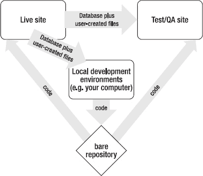
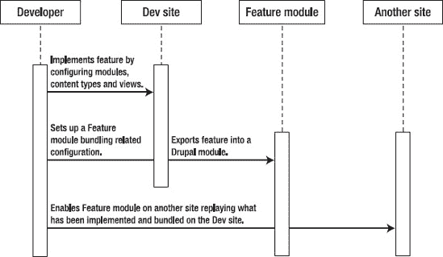

# 第 13 章


## 上线网站与部署新功能

**作者：Benjamin Melançon 和 Stefan Freudenberg**

如果只有你能看到，你的 Drupal 网站就没有发挥其最大价值。如果它出了问题而你又无法恢复，那将非常糟糕。如果你需要让网站离线一周来添加复杂的新功能，那也不太好。本章涵盖如何让你的网站上线、如何进行备份，然后浅涉 Drupal 部署主要功能的新领域。


### 将网站上线

您的网站值得在互联网上亮相。本节将概述将网站上线（或称“发布”）的步骤，这些通用步骤适用于任何可用的软件环境。我们将逐一解释每个步骤，并提供适用于任何正经配置的命令行操作。如果部署次数超过几次，您会希望将这些步骤自动化。目前 Drupal 社区对于最佳方式尚未形成共识，但我们仍会提供一些技巧并指向一些最佳实践资源。

将网站从本地计算机或开发服务器迁移到线上 Web 服务器可分为五个步骤：

1. 导出数据库
2. 将网站代码副本、用户文件及导出的数据库传输至服务器
3. 在服务器上导入网站数据库
4. 在服务器上创建或编辑网站的 `settings.php` 以配置数据库设置
5. 将域名的访问流量指向服务器上的网站根目录

这些步骤可在任何平台上通过不同工具完成，例如图形化数据库程序和 SFTP 软件。同样，任何构建工具（如 `rake` 或 `ant`）均可执行步骤 2 至 4。

 **提示** 在选择网站托管服务商时，请务必选择允许通过 SSH 访问主机服务器的服务商。关于推荐的托管商，可参见 `dgd7.org/deploy` 的在线说明与资源。

现在我们来看 Linux、Mac OS X 或 Cygwin 环境下的具体命令行步骤。即使您尚未搭建好开发环境，这些步骤也同样适用。在服务器端，命令基于典型的 Debian 或 Ubuntu 系统配置；若您自行搭建服务器，请参考 `wiki.debian.org/LaMp`。

当您需要管理多个网站时，肯定会希望将流程脚本化。部署脚本通常需要根据您的托管环境、开发工作流和具体需求来定制。（例如，我所在 Drupal 团队不断演进的最佳实践记录在 `data.agaric.com/deploying-the-agaric-way`）。Aegir（重度依赖 Drush）是一套 Drupal 部署解决方案（即用 Drupal 来部署 Drupal），拥有庞大、悠久且持续发展的社区。这是一套自由软件托管系统，用于自动化部署和管理网站相关的常见任务。相关信息与下载请访问 `aegirproject.org`。

 **提示** 关于 Drush 如何优化部署工作流，请参见第 26 章中的“使用远程命令通过 Drush 部署站点”一节。

#### 1. 导出数据库

截至目前，本书一直指导您在本地计算机上安装和运行网站。若要将您添加的任何网站内容配置一并迁移到线上，首先需要导出数据库。

 **注意** 此第一步仅适用于首次上线操作。在大多数情况下，将开发数据库导出并替换现有线上数据库都是错误的。如果您尚未使用第 2 章提及或本章后续描述的工具备份线上站点，这将无异于一场*灾难性*错误。

在以下命令中，核心操作是 `mysqldump`。其余命令仅用于指定数据库的临时存放位置。

当从网站根目录或使用别名运行时，Drush 命令 `drush sql-dump` 可帮您省去查找数据库连接信息的步骤。

```
##### 切换到项目文件夹
cd ~/code/dgd7
##### 如果"db"（数据库）目录尚未创建：
mkdir db
##### 导出数据库，其中 dgd7 为数据库名称
mysqldump -udgd7 -pdgd7 dgd7 > db/development.sql
```

`mysqldump` 命令所使用的选项说明如下：

* `-u` 指定数据库用户名，可紧跟用户名（此处为 `dgd7`）。
* `-p` 指定数据库密码，可紧跟密码（此处为 `dgd7`）。
* 单独出现的词（`dgd7`）为数据库名称。您可以从本地网站的 `settings.php` 文件中获取这些值。

 **注意** 如需了解更多 `mysqldump` 命令的用法，可在类 UNIX 系统（Linux、Mac OS X、Cygwin）的命令行中输入 `man mysqldump`。`man` 是手册（manual）的缩写，可用于获取几乎所有命令的详细信息。

#### 2. 传输至服务器

这一步无需多言：将网站代码、相关用户文件以及导出的数据库从开发环境迁移到线上服务器。远程文件复制程序安全复制（`scp`）即可胜任。

```
scp -r ~/code/dgd7 username@host.example.com:/var/www/
```

 **提示** 不要忘记传输 `.htaccess` 文件；作为以点号开头的“隐藏”文件，它很容易被遗漏。

##### 设置文件目录权限

迁移代码库和用户文件后，需要确保用户文件目录具有写入权限。`scp` 命令在将网站代码和导出的数据库传输到 `/var/www` 时创建了 `dgd7` 目录，因此登录服务器后，您可以进入该目录方便地访问这些文件。（请注意，这里假设您部署的是以用户 `www-data` 身份运行的 Apache Web 服务器。）

```
ssh username@host.example.com
cd /var/www/dgd7
chown -R www-data:www-data web/sites/default/files
chown -R www-data:www-data private_files
```

后一命令仅适用于创建了私有文件目录的情况，并且应在您选择创建私有文件目录的位置执行（该目录应位于 Web 根目录之外）。

#### 3. 在服务器上创建数据库并导入

在您的主机服务器上，登录系统创建新数据库，并将传输的数据库转储文件导入其中。

 **注意** 您的主机服务商很可能提供用于创建数据库用户和数据库的控制面板。

我们将数据库用户和数据库本身都命名为项目名称，本例中为 `dgd7`。

```
ssh username@host.example.com
mysqladmin -u root -p create dgd7
mysql -u root -p -e "GRANT ALL ON `dgd7`.* TO 'dgd7'@'localhost' IDENTIFIED BY 'S3cUr3p4s5w0rD'"
```

执行上述两条命令后，系统会提示您输入 MySQL root 密码。最好不要将密码直接写在命令中，否则这个重要密码会保存在服务器 Shell 命令历史记录里。在本例中，第三条命令为新数据库设置了密码“S3cUr3p4s5w0rD”，您随后将使用该密码、以及数据库用户名和数据库名称来导入数据库。

如果您已按照“设置文件目录权限”一节中的步骤操作，那么您已登录到主机服务器并位于目录 `/var/www/dgd7` 中，因此前面步骤中使用的数据库目录 `db` 就在此处。

```
mysql -h localhost -u dgd7 -pS3cUr3p4s5w0rD dgd7 < db/development.sql
```

用于导入数据库的 `mysql` 命令与导出时 `mysqldump` 的参数相同，但多了一项：`-h` 用于指定主机，即数据库所在的服务器。通常数据库会与系统其他组件位于同一台服务器上，因此可以使用 `localhost`。请注意，尖括号的方向发生了变化——可以将其理解为将数据库文件传入命令中。


#### 4. 在 `settings.php` 中设置数据库

你的 Drupal 站点已基本准备就绪，可以上线。代码已部署到生产服务器上，用户文件也已随同传输，数据库也已加载完毕，现在只需要告知站点数据库的相关信息即可。

你可以手动编辑 `settings.php` 来使用这些值，也可以通过浏览器访问站点来让 Drupal 为你自动设置（前提是 `settings.php` 的文件权限允许这样做），例如：

`http://example.com/install.php`

若要手动编辑该文件，可以使用以下命令在 vim 中打开它，然后跳转到正确行（约第 181 行）并进入插入模式：

```
vi sites/default/settings.php
:181
i
```

将相关部分（`$databases = array()` 这一行）修改为类似如下内容：

```
$databases['default']['default'] = array(
  'driver' => 'mysql',
  'database' => 'dgd7',
  'username' => 'dgd7',
  'password' => 'S3cUr3p4s5w0rD',
  'host' => 'localhost',
  'prefix' => '',
);
```

 **提示** 请注意，你定义的数组是两层嵌套的（通常每层都使用键名 'default'）！这并不是 Drupal 最初提示你的简单 `$databases = array()`；这是一个双重嵌套的数组，你最好从一开始就用 `$databases['default']['default'] = array( ... );` 这种形式。第一个 default 表示这是默认数据库，而非额外的数据库；第二个 default 表示这是主（master）数据库，而非辅助（slave）数据库。

每个自动化工具都必须执行到目前为止描述的步骤。我们假设你已经有了一个可正常运行的 Web 服务环境，因此初始部署这一节，最后一步是：告知你的 Web 服务软件站点文档根目录的位置。我们不涉及的前提条件包括能够解释或运行 PHP 的模块（例如，对于 Apache 而言，如 `mod_fcgid` 或 `mod_php`）。

#### 5. 将你域名的传入流量指向服务器上的站点

这一步是将访问你域名的访客引导至你的站点。这意味着需要配置你的 Web 服务器软件（最常见的是 Apache），使其与之前步骤中 Drupal 的对应位置和设置相匹配。不过，在访客能够通过一个公共地址（网站域名）访问你的站点之前，需要满足几个先决条件。

*   首先，你需要一个域名，你可以通过域名注册商购买（完整的注册商列表请参见 `icann.org/en/registrars/accredited-list.html`）。
*   其次，你需要为你域名的域名系统（DNS）设置，使其指向你控制的名称服务器。你的名称服务器可以由你的注册商、主机提供商或专门的 DNS 服务提供。
*   最后，名称服务器需要告知你的域名指向你服务器的互联网协议（IP）地址。

 **注意** 在告知你的域名使用新的名称服务器后，可能需要长达两天的时间才能完成解析（开始生效）。如果你从同一家公司购买主机服务和域名（不推荐这么做），那么这些步骤可能已经为你完成了。

一旦所有条件都满足，你就可以配置 Web 服务器软件，将对你的域名的传入请求发送到包含站点 Web 根目录的文件夹。在本例中，该文件夹是 `/var/www/dgd7/web`。（Drupal 的代码在第 1 章中被放置在了 `dgd7` 目录下的子目录 `web` 中。）

 **注意** 与你在 Drupal 中要做的许多事情一样，托管网站有多种方式。即使你的主机使用的是 Apache，它也可能提供了一个图形用户界面或命令行工具来自动化部分或全部即将执行的任务，所以请先寻找简便的解决方案！

Apache 是最常用的 Web 服务器；和 Drupal 一样，它也是自由软件。Apache 将访客引向你的网站的一种常见方法是使用虚拟主机配置。这些配置可以写成独立的文件，每个网站一个，并添加到 `/etc/apache2/sites-available` 目录下（在 Debian 系统中）。你可以创建一个新文件，并使用 Vim 编辑器（参见附录 I）通过命令 `vi /etc/apache2/sites-available/dgd7`（其中 dgd7 可以是任何便于你识别站点的文件名）开始编辑，并在其中放入类似代码清单 13-1 中的内容。

***代码清单 13–1.** 为 definitivedrupal.org 提供的示例 Apache 虚拟主机配置文件*

```
<VirtualHost *:80>
     ServerAdmin webmaster@agaricdesign.com
     ServerName definitivedrupal.org
     ServerAlias www.definitivedrupal.org dgd7.org www.dgd7.org definitivedrupal.mayfirst.org
     DocumentRoot /var/www/dgd7/web
     <Directory />
        Options FollowSymlinks
        AllowOverride None
     </Directory>
     <Directory /var/www/dgd7/web>
        Options Indexes FollowSymLinks
        AllowOverride All
        Order allow, deny
        allow from all
     </Directory>
</VirtualHost>
```

可以使用命令 `sudo a2ensite dgd7`（其中 dgd7 是你在 Apache 的 `sites-available` 目录中创建的文件名）在 Apache 的 `sites-enabled` 目录中创建指向该文件的符号链接。

Apache 必须重新加载其虚拟主机配置文件后，这些配置才会生效。这些文件中的任何一个错误都可能导致 Apache 提供的所有网站失效，因此我们强烈建议你先进行测试（此处为第一个命令）：

```
sudo /usr/sbin/apache2ctl -t
sudo /etc/init.d/apache2 reload
```

第二个命令会重新加载你的配置，现在你应该能够通过你的域名看到你的网站了！有关 Apache 虚拟主机的更多信息，请访问 `apache.org/docs/current/vhosts`。

请注意 `AllowOverride` 指令，它允许 Drupal 自带的 `.htaccess` 文件向 Apache 提供 Drupal 正常运行所必需的指令。

 **注意** 你可能已经注意到，在示例 Apache Vhost 文件中列出的一个服务器别名是 `definitivedrupal.mayfirst.org`，它并不是站点的公共域名。这允许你在任何人通过其常用域名访问你的站点*之前*，测试本节中完成的所有配置。这在替换现有站点时尤其有用。这个特定的域名和子域名是由我们的主机提供商 May First People Link 为每个项目设置的，但你可以自行设置，甚至可以设置一个子域名（如 `livetest.definitivedrupal.org`）指向你的服务器以实现此目的。

你的网站已上线！现在（或者更早！）该考虑备份了，很快就要部署更新和新功能了。


### 继续操作前，请先备份

*“另一个致命错误是不备份你的网站。”*

*——杰夫·罗宾斯（来自 Lullabot 播客）*

凯伦·史蒂文森立即补充道，每个人都犯过这个错误，而且大多数人都有惨痛的经历。请允许我们帮助你避免这种命运。如果你在这一节中什么也不做，至少设置好第 2 章中介绍的`Backup and Migrate`模块（`drupal.org/project/backup_migrate`）。再次强调，如果你没有使用下文描述的基于服务器的备份方案，请在你所有的 Drupal 站点上设置`Backup and Migrate`模块。将其配置为每日备份，上传到你服务器上的某个位置和/或发送到你的邮箱。

 **提示** 不要跳过这一节。如果你还没有自动化备份，请在继续操作前先备份你的工作——然后设置你的工作环境和服务器，使备份自动化。

如果你正在构建任何你希望再次见到的东西，你需要备份它。如果你不相信这一点，去问任何经历过服务器故障、用户或开发者错误、或遭受过攻击且未备份的网站的开发者。甚至，去问问任何丢失过电脑或硬盘报废的人。

持续备份你的工作对任何网页开发者来说都是一项基本实践。如第 2 章所介绍以及第 14 章所详述的那样，无论你是下载模块来构建网站、编写主题还是编写模块，通过使用版本控制，你都可以高枕无忧，并享受流畅的创作过程。

然而，比你的代码更重要的是，使用你网站的人所创作和放置的文字、图片、故事和事实。这些内容是一种神圣的信任；你能对用户做的最糟糕的事情就是丢失他们所有的数据。而这实际上，是非常糟糕的。不要这样做。

备份数据库和文件。如果你配置了私有文件目录，无论你将私有文件放在哪里，都不要忘记也备份它们。做任何你需要做的事情，以确保所有数据和文件都定期备份，并在本地和另一台电脑上保存。服务器故障、用户或开发者错误、或对你的网站的攻击都可能意味着备份失败会付出极高的代价。

 **注意** 一个扩展了 Drush 的数据库备份工具是 DGB，即 Drush Git Backup。它提供用于备份 Drupal 数据库的 Drush 命令，使数据库的每个表都成为一个单独的文件。这种方法更适合将数据库导出添加到版本控制（Git 部分），因为你可以通过 `git diff` 命令查看表中的变化（某些表比其他表更有查看价值）。它还改进了 Drush 对 `cache_*` 表的处理，方便地排除了这些表中不需要包含在任何备份中的数据。DGB 可在 GitHub 上获取：`github.com/scor/dgb`。

在 `drupal.org/node/22281` 可以查看更多备份网站的选项。接下来，我们将介绍一种经过验证的方法，配合一个便捷的工具 Backupninja。

### BACKUPNINJA

Backupninja 允许你在 `/etc/backup.d` 中放入简单的配置文件来协调系统备份。它精通多种技艺，包括增量远程文件系统备份和 MySQL 备份。在使用 Debian 软件包管理工具的系统中，你可以通过执行 `apt-get install backupninja` 来安装它。

 **注意** 对于没有 Debian 软件包管理器的 Linux 系统，你可以通过其项目页面 [`https://labs.riseup.net/code/projects/show/backupninja`](https://labs.riseup.net/code/projects/show/backupninja) 获取 backupninja。

运行 `man backupninja` 会提供一些基本信息；最值得注意的是，它会提到一个名为 ninjahelper 的小程序。它有一个简单的用户界面，当你首次启动时会提供以下两个基本功能：

*   new 用于创建新的备份操作
*   quit 用于退出 ninjahelper

一个涉及数据库转储、系统配置和远程存储的基本设置，需要创建三个操作：

*   sys
*   mysql
*   rdiff（确保包含前面提到的所有相关目录）

最后一个选项需要在远程机器上拥有一个具有 ssh 访问权限的用户帐户。非常有用的 ninjahelper 会创建并复制一个 ssh 公钥，安装所需的软件包，并为你留下一个可用的备份配置。

#### 测试备份

如果你无法恢复数据，那你的网站就没有真正被备份。找到你的备份位置（如果你使用了前面提到的 backupninja 设置，所有配置都将在你的 `/etc/backup.d` 目录中指定）。

同时决定你需要哪种类型的恢复。如果发生灾难性事件时，你可以在几小时到一天内手动恢复所有内容，那你就只需要知道所有东西在哪里。如果无论发生什么，你都需要非常快速地恢复，那么你需要准备一个随时可用的备份服务器，并编写恢复脚本。

 **提示** 这与备份完全无关，但另一种会让客户或其他网站用户因数据丢失而恼火的情况是，他们在网站上输入了一篇精彩的论文，结果（网站或他们的浏览器）出了问题。不要在浏览器窗口中直接撰写任何重要的内容，并告诉其他人也避免这样做。在你的文本编辑器或文字处理器（如 MS Word 或 OpenOffice.org）中编辑你的宝贵作品，然后复制粘贴到表单中。使用像 Firefox 或 Chrome 这样努力保护你数据的浏览器，也能让你省心不少。

当然，你的网站并不是唯一需要备份的东西。正如下一章所述，将你的编码区域包含在你的个人电脑的整体备份中。如果你还没有备份你的个人电脑，现在就是开始的时候了。毕竟，现在不仅仅是珍贵的个人笔记、无可替代的照片和潜在的敲诈材料了；我们说的是真正宝贵的 Drupal 代码。


### 暂存与部署

所谓暂存与部署，是指将网站开发的所有工作（包括开发和内容）集中到一个可预览的位置（暂存站点），然后将其迁移到所有人都能完整欣赏的线上网站（部署）的过程。

关键在于：当线上网站每天有用户使用，且可能有多人共同参与开发时，如何实现这一流程。

 **注意：** 将第 6 章中所述的安全措施和错误修复应用到线上站点，是部署中的一个特殊情况，也是本文所述内容中最简单的一种情况；只需更新代码并运行`update.php`（在暂存环境测试后），即可部署这类更新。此流程将在下文说明。

Drupal 的暂存没有标准方法，而是有多种方式。最佳方式取决于网站项目的具体需求。根据我们的经验，最常见的需求是为已上线的网站添加功能。建议采用“一切皆代码”的方法来部署新功能：区分内容与配置，并将配置以代码形式进行版本控制，使其能轻松在不同环境（如本地电脑与暂存/线上环境）之间迁移。

 **提示：** 在 Drupal 社区中，即使是 Deploy 模块（`drupal.org/project/deploy`）的作者 Greg Dunlap，也不认为 Drupal 7 中的部署问题已完全解决。他和其他人都认为我们能在 Drupal 8 中解决此问题。Deploy 模块不在此处详述；它尤其适用于需要同时将内容和配置从暂存站点推送至线上站点的情况。对于需要频繁发布内容、在暂存站点预览大量内容后再推送到线上站点的用户而言，Deploy 模块至关重要。

##### 方法

本节所述的方法基于以下假设：

- 具备胜任能力的 Drupal 开发者
- 简洁的发布工作流（关键点：无需对内容进行暂存）

在这种情况下，我们建议采用“一切皆代码”的开发方式，即使用 Features 模块套件来自动化大部分功能开发，将线上数据库视为最终权威，并使所有对数据库的开发影响都可测试、可重演。

在此方法中，线上站点的数据库始终保持权威性、正确性，且无需进行合并。配置所需的数据库更改可以先在暂存站点以可测试的方式重演，然后再应用到线上站点。

如果你已经有一个正在维护的 Drupal 站点，*不需要*回头将现有配置全部迁移到代码中。开发工作将始终基于线上工作数据库的副本进行。这意味着新功能必须通过代码来实现对数据库的所有更改。

和所有重度依赖数据库的应用一样，Drupal 在更新方面也存在一些陷阱。这是一种有利有弊的架构设计。将“一切皆代码”应用于一个核心遵循“一切皆通过 Web 操作”哲学的应用中，会面临挑战，但正如你即将看到的，Drupal 社区正在积极应对。

#### 工作流

基于上述方法，一个典型的工作流如下所示：

1.  复制线上数据库，并在本地使用。
2.  通过代码（模块、主题等）添加功能或更改外观。所有通过点击操作完成的更改必须导出，或以其他方式生成可被代码捕获的形式。
3.  针对步骤 2 中的代码，使用一份新的线上数据库副本来测试，如果编写了更改数据库的代码，则运行 `update.php`。你可以在暂存服务器上执行此操作，供他人查看和评估。
4.  在线上站点上，直接应用步骤 3 中测试过的代码更新，并立即运行任何必要的数据库更新。

 **提示：** 为了随时知道自己正在查看的是哪个站点，可以使用环境指示器模块（`drupal.org/project/environment_indicator`）。

所有内容的更改和新增、用户的操作以及用户账号本身，都源自线上站点。所有代码更改（包括通常由站点构建管理员完成并导出为代码的操作）都源自开发站点。数据库和用户文件会在质量保证（QA）、测试或暂存站点上与代码汇合，进行质量保证和测试，然后再一同部署到线上站点。图 13-1 展示了这一流程。



***图 13-1.** “所有配置在代码中，所有内容更改在线上”的代码与数据库/文件流动示意图*

此设置的一个关键在于，本地开发环境可以多次复制（每位开发者一个），而代码和数据流以及工作流程保持不变。这得益于*裸仓库*，它是一个共享仓库，你和其它开发者可以推送和拉取代码更改。暂存和线上站点应仅拉取更改。本章稍后的“将代码更改从开发环境迁移到暂存环境，再到线上环境”一节将对此进行讨论。

还能在线上直接进行配置更改吗？当然可以。这里描述的是推荐的最佳实践，而非一成不变的定律。一种常见的混合方法是：在开发环境中构建内容类型和视图，然后导入到线上环境，但其他许多更改和微调则直接在线上完成。但请注意，线上的配置更改迟早会给你带来麻烦：线上可能出现问题，而你却不知道原因。参与站点维护的人越多，发生这种情况的可能性就越大。如果回滚到前一晚的快照备份的代价越高，这个问题就越严重。另一方面，你越是将所有配置更改都纳入代码，执行效率就会越高；同样地，越多的人采用此方法，社区工具就会越完善。后续的“如何实现‘一切皆代码’”一节将介绍其中一些工具。

#### 将内容从生产环境迁移到开发环境（以及暂存/QA 环境）

“上线你的站点”一节中的相同命令在此同样适用。导出和导入数据库即可。Drush（`drupal.org/project/drush`）能更好地完成这项工作；详见第 26 章。别忘了使用`rsync`来传输用户文件。

尽量在你的环境中将此操作整合为一个命令。为减少线上服务器的额外负担，你可能希望自动化夜间数据库导出，或直接使用最近的备份副本，而不是每次同步生产环境到开发和暂存环境时都直接导出线上数据库。关键在于让它足够简单，以便开发者能经常使用。数据库应始终被视为属于线上环境，任何你想保留的更改都必须通过代码来捕获。

 **注意：** 演示模块（`drupal.org/project/demo`）可以通过重新加载数据库来帮助你测试代码更改的工作流。


### 将代码变更从开发环境迁移到预发布环境，再到生产环境

你的代码变更不一定要很大——你或许只是简单更新了核心代码或贡献代码（如第 7 章所述）。但首先必须在开发站点上完成。因此，请在本地开发环境中的网站上先下载更新或进行代码变更。然后将这些变更提交到本地仓库，推送变更到共享仓库，再拉取变更到预发布或质量保证站点进行测试。当一切验证通过后，代码变更即可上线。

此场景的关键点是所有环境都指向同一个仓库。该仓库可由 [`http://gitorious.org`](http://gitorious.org) 或 [`http://github.com`](http://github.com) 等第三方服务托管，你也可以自行创建并将其放在自己的服务器上。

#### 搭建你自己的中央仓库

Git 是一个分布式版本控制系统，这意味着它不需要中央仓库——无论你将项目带到哪里，它都携带着完整的版本历史记录。

然而，为了将代码从一台服务器推送到另一台服务器，以及为了团队协作，创建一个中央参考点可能非常有价值。

你可以通过对项目仓库（在第 2 章中已建立）进行裸克隆来实现这一点。这里的“裸”指的是仅包含仓库本身——即 `.git` 目录中那些对人来说毫无意义的文件，而不包含其周围的工作副本。

在本地开发环境中，运行 `git clone --bare` 命令，并将生成的文件夹（带有 `.git` 后缀，是一个文件夹而非文件）移动到服务器上（该服务器已配置为可通过 `git.example.com` 地址访问，并且存在 `/srv/git` 目录）。

```
git clone --bare ~/code/dgd7 dgd7.git
scp -r dgd7.git you@git.example.com:/srv/git/dgd7.git
```

你的新中央仓库可能已经准备就绪，但你可以在服务器上额外执行一些操作，以确保它在任何情况下都能正常工作。

```
ssh you@git.example.com
cd /srv/git/dgd7.git
git init --bare --shared
git update-server-info
```

要将这个新的外部仓库与本地计算机上的原始项目关联起来，请执行以下操作：

```
cd ~/code/dgd7
git remote add origin git
```

要在另一台计算机上访问你的项目，包括将其部署到预发布或生产服务器，请执行以下操作：

```
ssh you@test.example.com
cd /var/www
git clone you@git.example.com:/srv/git/dgd7.git dgd7
```

这将在 `dgd7` 文件夹中为你提供一个包含工作副本的仓库。有关如何在服务器上放置裸 Git 仓库的更多信息，请参阅 Pro Git 书籍中的第 4 章.2（[`http://progit.org`](http://progit.org)）。

一切设置完成后，用于将你的变更添加并提交到本地版本控制并推送到共享仓库的命令非常简单。一旦你完成了你认为需要对代码做的任何操作（更多内容将在后续章节中介绍），你就可以像这样将其推送到中央仓库：

```
git add -A
git commit -m "将 pathologic 模块更新到最新的安全版本。"
git push
```

请注意，`git add -A` 会捕获你所做的所有更改（添加、编辑或删除的文件），并准备提交它们。使用 `git status` 查看你准备提交的内容（并在提交前使用 `git reset` 撤销 `add` 操作）。

这会将你的代码推送到与之关联的远程仓库。如果它关联了多个仓库，你可能需要在 push 命令中指定它（例如，`git push origin master`）。

现在，代码已准备好在新的环境中进行测试。首先，从生产站点同步数据库（手动操作，如“将你的网站上线”部分所述，或使用 Drush），并使用 `rsync` 命令将用户创建的文件也从生产站点同步过来。接下来，将代码变更转移到你的测试站点（仓库的一个克隆和工作副本）。你可以使用类似以下的命令：

```
ssh you@test.example.com
cd /var/www/dgd7
git pull
```

 **注意** 如本章中的每个步骤一样，你可以在 `data.agaric.com/deploying-the-agaric-way` 查看一个 Drupal 工作室实践中（不断演进的）辅助脚本示例。

如果代码变更包含需要运行的数据库更新，请不要忘记访问 `update.php`，例如 [`http://test.example.com/update.php`](http://test.example.com/update.php)。（即使是安全版本，更新核心和贡献代码也可能需要更新数据库中的某些内容，因此如果你不完全确定，请在你的站点上访问 `update.php` 进行检查。）

当所有内容都检查通过后，你可以像在测试站点上所做的那样，在生产环境上应用代码变更（继续使用源码控制作为部署工具，或使用 `rsync` 进行上线），并运行 `update.php`。

### 如何实现“一切尽在代码中”

本章概述的方法是将你希望对站点所做的所有变更导出或以其他方式捕获到代码中。这确实需要一些工作——尽管这里提到的工具和技术可以减少工作量——但其好处是巨大的。

- 代码可以进行版本控制，并且存在成熟的方法来使用版本控制工具解决代码不同版本之间的冲突。你可以查看谁在何时做了什么更改。
- 质量保证环境使你能够精确测试将变更应用到生产环境时会发生什么。
- 分离配置和内容意味着你的更新不会覆盖生产站点上的用户活动。

简而言之，你应该尽可能将每一条*配置*项都捕获到代码中。在 Drupal 中，有一项运动旨在使配置可导出，并且他们已成功为现代 Drupal 配置中最重要的元素实现了这一理念：内容类型、字段和视图。可以说，大多数菜单、区块和分类法都可以被视为配置，因此应将其交由代码控制，而非生产站点上的用户界面。Chaos Tools 项目（`drupal.org/project/ctools`）为我们带来了*可导出项*的清晰概念，以及帮助其他模块导出其配置的工具。其中大部分功能已由 Features 项目进一步自动化，这是大多数人将配置纳入代码的最便捷方式，因此将在接下来进行介绍。


#### 特性

`Features`项目（`drupal.org/project/features`）并非将站点配置放入代码的唯一方法。即使在单个 Drupal 团队中，有些团队可能只使用更新钩子（下一节介绍），有些则可能使用`Features`模块。然而，业界普遍认为，使 Drupal 配置可导出是稳健部署解决方案的关键部分，而`Features`正在推动这一过程的自动化。

在`Features`世界中，“feature”一词的不同变体具有不同的含义，理解这些区别很重要。本书采用官方定义：

- **Features**：Drupal 模块，允许将配置捕获到代码中。
- **Feature**：一个模块，包含一组执行特定功能的 Drupal 组件。
- **feature**：你希望网站实现的功能。
- **features**：你希望网站实现的一组功能。

*“是的，很抱歉。当时这看起来是个好主意。”*
——Jeff Miccolis，*Development Seed，关于 Features 的术语*

用句子说明这些术语：一个`Feature`模块（由`Features`模块创建）通常包含一组紧密相关的`features`。有关从`feature`到`Feature`模块并部署到其他站点的典型工作流程，请参见图 13-2。



***图 13-2.** 从 feature 到 Feature 模块*

对于相对简单的网站，Drupal 开发人员可以选择只为整个站点创建一个`Feature`模块。这个单一的站点级更新`Feature`会随着站点一起演变。对于复杂站点，多个开发人员可以使用独立的自定义`Feature`模块。然而，`Features`的真正理想目标是创建一个可共享的`Feature`模块，它封装了可在多个站点上部署的有用功能和配置。有关制作可共享`Feature`的最佳实践，请参阅`Kit`规范（`drupal.org/project/kit`）。

**提示** 与特定功能相关的主要新开发应在专用的自定义模块中进行，或者更好的做法是，在`drupal.org`上贡献一个模块。使用`Features`管理内容类型、视图以及站点特定的其他元素，并不妨碍你将其中可泛化使用的元素通过独立的模块进行导出和存储。你制作的这些额外模块可以依赖并需要使用`Features`，也可以不依赖。无论哪种情况，它们都会被站点级`Feature`模块所依赖，以保持所有组件紧密关联。

`Features`和 Drupal 7 核心在导出内容类型、字段、权限、输入过滤器、菜单项、图像样式和分类法词汇方面表现得相当不错。如有必要，你也可以自己将几乎任何其他内容挂接到`CTools`的可导出框架中。这样，你可以使其他模块或自定义模块的数据库存储配置也变得可导出。（对于贡献模块，请先在其问题队列中查看其他人的进展！）额外的模块可以增强`Features`的导出和恢复能力。特别是，同样需要`CTools`的`Strongarm`模块（`drupal.org/project/strongarm`），可被模块（包括`Features`模块）用来导出和覆盖存储在经常使用且易滥用的*variable*表中的设置。

所有这些让你能够像往常一样通过管理界面配置 Drupal 站点（创建内容类型、使用这些内容类型的视图、这些内容类型中的字段在不同视图和视图模式中使用的图像样式等），然后使用`Features`的 UI 或`Drush`，将所有配置导出到代码并放入一个`Feature`模块中。

**提示** `Features`模块允许你通过图形用户界面实现自动化处理，而这原本需要大量自定义编码。你在本地进行更改，`Features`会将你的更改导出为代码，放入一个特殊的`Feature`模块中。

指示一个`Feature`使用其在代码中的内容被称为*reverting*一个 feature。从本章工作流程的角度来看，这个说法容易混淆，因为我们实际上是在更新。`Features`之所以称之为*reverting*，是因为使用`Feature`模块的已保存配置会恢复到代码中的状态；但因为你没有在线上站点通过用户界面进行任何更改，这始终导致一次更新，而非你通常理解的“回滚”。

#### 编写更新钩子

这是作为`Features`方法的替代方案提到的，但实际上它们是互补的。导出功能通常仍然不一致且不完整，但你可以通过自己的自定义代码来补充导出功能和`Features`生成的模块。

这种方法的核心思想依然是相同的：所有更改都在模块中编码。你为每次更改编写自己的更新代码。每个影响数据库的新更改都应该放在`hook_update_N()`函数中，并且相同的更改也应放在`hook_install()`或`hook_schema()`中以保持同步。关于更新钩子的基础知识，请参阅`api.drupal.org/hook_update_N`。

**提示** 我们强烈建议，即使你完全使用`features`，也编写一个更新钩子，通过`features_revert()`来触发该 feature。

在更新钩子中，尽量使用 API，而不是直接调用数据库。（但请注意，对于以编程方式创建内容，像`node_save()`这样的 API 函数并不总能完美处理所有内容；有时可能需要伪造一个表单数组并使用`drupal_form_submit()`提交。）

**注意** 任何可以通过提交表单在模块中完成的操作，都应该可以通过一行代码实现。事实上，处理表单的`submit`函数应该始终使用`API`函数来保存更改。不幸的是，Drupal 核心尚未达到此目标，因此你有时必须退而求其次，伪造表单并使用`drupal_form_submit()`，而不是使用合适的 API 函数。例如，`node_save()`目前无法接受自由标签的分类法术语，除非在`drupal_form_submit()`的上下文中调用。

依赖关系必须非常小心地按正确顺序处理。请记住，更新代码会为禁用的模块运行，在这种情况下，你必须显式加载此模块中不在其`.install`文件中的任何所需代码。首先，使用`ifmodule_exists()`检查模块是否已启用。

本章不深入探讨使用`Feature`模块或编写更新钩子的细节。后者将在第 24 章模块开发的上下文中介绍。有关更新和资源，请访问`dgd7.org/deploy`；有关使用`Features`和更新钩子为站点添加功能的示例，请关注`dgd7.org/anjali`。


##### 在生产环境中创建、编辑和审核内容

本章的方法要求所有内容变更都在实时站点上进行，必要时借助 Drupal 作为 CMS 的强大修订审核功能，而不要尝试从预览站点部署内容变更（在此工作流中，预览站点并非用于内容创建或配置，而是用于将生产站点的数据库与开发站点的代码进行联合测试）。

本章讨论的方法将预览内容排除在外。直接在实时站点上操作。使用预览站点来确认将编码化的开发变更应用到生产数据库副本后能按预期运行，然后将代码变更上线并启用功能/运行`update.php`。

针对在实时站点上“预览”内容（在公开前进行创建、编辑或审核），有几种扩展 Drupal 内容管理能力的主内容选项。例如，修订审核模块（`drupal.org/project/revision_moderation`）允许编辑内容，但编辑内容在审核通过前不会公开。（在撰写本文时，该模块正在移植到 Drupal 7 中。）

另一个保护实时内容免遭破坏的模块是路径重定向模块（`drupal.org/project/path_redirect`）。路径重定向确保即使 Pathauto 模块因标题变更等原因修改了内容的路径，旧路径仍能重定向到新 URL。

如果您的发布需求要求内容在独立站点上预览，我们再次推荐您使用部署模块（`drupal.org/project/deploy`）。无论如何，如果开发或预览站点已生成或即将生成大量内容，则可能需要使用 Deploy、Feeds（`drupal.org/project/feeds`）或 Migrate（`drupal.org/project/migrate`）模块。

节点导出模块（`drupal.org/project/node_export`）也可行，它能生成可通过`update.php`在更新钩子中运行的代码，用于导入导出内容。若采用此方式，可使用 Pathologic 模块（`drupal.org/project/pathologic`）来修正内容中的绝对路径。

##### 需要功能支持的页面或内容区块

包含大量功能的页面和区块可通过`hook_menu()`和回调函数创建，而非以节点形式实现。请参阅`api.drupal.org/hook_menu`和第 29 章。

 **提示** 如果启用了 PHP 过滤器模块，请尝试禁用它。PHP 过滤器模块不应被用于在节点（内容）页面提供功能。从代码质量和部署角度考虑，都应避免这种做法。若要在页面或页面局部放置功能（而非内容），请使用 Drupal 的`hook_menu()`、`hook_block()`或`hook_page_build()`。

您可以让内容与功能配合存在——即通过代码创建内容——但当内容之间存在关联时（例如主键问题），这种方法会带来麻烦。这是 Drupal 8 的优先事项，目前正在对通用唯一标识符（UUID）进行大量研究。

#### 开发工作流总结

开发工作流有很多种可能。关键是要保护生产数据并进行测试，同时确保所有协作者理解并遵循相同的方法。一个基本的开发工作流包括：从实时站点拉取内容和用户数据（如果有的话），在本地添加功能和修复错误，将变更后的代码推送到预览站点供他人测试，只有在测试通过后，才能将其推送到实时站点。

- 新功能被添加到现有模块或新模块中。此功能的数据库相关部分通过 Features 模块导出（并提交到模块中），或以更手动的方式编码到模块中。
- 其他开发者可以从开发者仓库（或中央仓库）拉取代码，在开发环境中通过浏览器运行`update.php`，即可获得一个可运行的站点版本。
- 在开发过程中，会定期重新导入生产数据库的新副本，但特别需要注意的是：在更新代码并在实时站点上运行`update.php`之前，要先获取一份新副本，并在预览站点上用更新后的代码和运行过的`update.php`进行质量保证，而**不要**进行任何手动配置变更。
- 如有必要，可为数据库配置的协作创建共享开发环境（在这些变更被导出到代码之前），但预览站点应仅用于质量保证。

 **提示** 使用 Jenkins 持续集成工具（`jenkins-ci.org`）为你的开发设置测试（部分工作可实现自动部署到预览站点）。可参考`groups.drupal.org/node/47686`了解面向 Drupal 的配置。（注意：Jenkins 在 2011 年之前被称为 Hudson；它依然是同一款软件，但为了保持其作为自由软件项目的独立性而更名。）

### 总结

这只是部署方法之一。“一切皆代码”的理念最受喜欢开发模块的人欢迎，但 Features 项目使其对偏好网站构建者角色的人来说也是一个合理的方法。

 **注意** 请参阅`dgd7.org/deploy`上的读者评论和更新后的资源链接。要了解代码驱动部署原则的实际应用，请关注`dgd7.org/anjali`上的 Anjali 项目。

我们鼓励您根据自己站点的需求和团队的工作流来考虑部署方案。您可能会发现此处概述的方法的变体效果最佳，或者您可能发现完全不同的替代方案更可取。这是 Drupal 领域中充满活力和潜力的领域，参与的人越多，效果就越好。请访问`groups.drupal.org/build-systems-change-management`上的打包与部署小组，关注关于在 Drupal 7 及更高版本中开发更好部署工具和技术的相关讨论。

## 以人为中心的开发心态

**作者：Károly Négyesi**

本书旨在为您提供理解 Drupal 的工具，帮助您利用它完成卓越的工作，并回馈 Drupal 社区。本章将助您不仅高效工作，更能从中获得乐趣。

### 使用版本控制

简而言之，版本控制会在您每次发出指令时存储文件副本，从而允许后续恢复。当然，它通过仅存储变更来更高效地存储文件。它还提供许多其他功能，但就本节而言，仅“后续恢复”功能至关重要。

Drupal.org 上的代码仓库已迁移到现代的版本控制系统 Git（[`http://git-scm.com`](http://git-scm.com)），我推荐使用它。使用 Git 跟踪工作非常简便，只需运行一次以下代码片段：

```
git init .
git add .
git commit -m 'Initial commit.'
```

此外，每次保存时，运行`git commit -a -m "something"`。“something”是一条消息，内容无关紧要，无需担心。您还可以通过系统命令自动输入日期（`git commit -a -m "'date'"`），或定义键盘快捷键。重要的是，您可以毫不费力地保留每一次工作修订版本。（毫不费力这一点的重要性将在后文体现。）

在更理想的世界中，操作系统会自动执行此操作；但现实往往并非如此。当您达到一个里程碑时，请撰写有意义的提交消息，以便您希望能与他人共享工作成果。但频繁提交并非为了共享，而是为了确保您可以回退到任何先前的状态。请学习`git bisect`以了解如何找到错误发生的修订版本。有关 Git 的更多信息，请参阅第 2 章。


### 备份

应使用 `mysqldump`（`dev.mysql.com/doc/refman/5.5/en/mysqldump.html`）或备份与迁移项目（`drupal.org/project/backup_migrate`）来生成 SQL 转储文件。SQL 转储是文本文件，因此您也可以将其提交到 Git 中。实际上，无论您处理的是何种文本文件，都可以将其纳入版本控制！

您的网站可能包含文件，因此也请务必备份它们。Windows 和 Mac OS X 有图形界面工具（Windows 备份和 Time Machine）可实现此功能；Linux 则有一些命令行工具（`tar` 和 `rsync`）可供使用。我推荐使用 r1soft（`r1soft.com`）提供的免费和商业产品。

### 自由实验

即使您从本书中一无所获，也请记住这一点：自由实验。这是成为一名成功网络开发者的关键要素。不要害怕——您不会搞坏任何东西。这正是我不断使用版本控制并定期备份的原因。切勿在生产服务器上工作；搭建开发环境非常重要且并不困难（这也是第 12 章的重点）。

我经常在 IRC 或其他论坛上看到有人问“如果……会怎样？”好吧，告诉您一个好消息：不会有什么严重问题！最坏的情况，您会收到一条错误信息。如果收到，请移除过于具体的内容（如 Drupal 的本地路径），然后将错误信息扔到 Google 中搜索，找出其发生原因。自由实验不仅意味着针对某个问题尝试各种策略，也包括进行网络搜索。

网络搜索只需不到一秒钟，您做得再多也不为过。搜索某个内容，查看结果，基于结果重新组织搜索词，迟早会找到您要找的东西。这是一个迭代过程，掌握它的唯一方法就是大量实验。

这不仅适用于搜索，也适用于一切事物。“终身学习”意味着持续学习。如果您学到的东西现在用不上，将来也可能有用。我的座右铭是“没有学到新东西的一天就是虚度的一天。”

另一方面，不要死记硬背！谷歌能记住的死记硬背的知识比我们能记住的多得多，而且它持续学习的速度远超任何人类。相反，要学习模式；学习对搜索有用的词汇。在这个无所不在的网络搜索时代，“知识”本身的含义正在改变。如果您能熟练运用搜索引擎这一武器，只需在脑中携带必要知识的骨架；血肉则可通过快速搜索来填充。

自由实验是进入“心流”状态的一步。心流是一种奇妙的状态，根据米哈里·契克森米哈赖的说法，在这种状态下，心灵会“完全为了活动本身而投入其中。自我意识消失。时间飞逝。每一个动作、每一个行动、每一个思绪都不可避免地从前一个中衍生出来，就像演奏爵士乐。您的整个身心都参与其中，并且将技能发挥到极致。”进入心流令人愉悦，并能带来卓越的表现。描述这种心理状态的表达包括“沉浸当下”、“进入状态”、“得心应手”和“全神贯注”。

我们并非说您应该始终处于心流状态，也不建议一直努力追求心流（那样反而可能无法达到）。而是说，要安排好事情，让心流得以自然发生。唉，虽然没有简单的配方，但以下几点肯定有帮助：

*   **明确的目标**。如果您在一个定义清晰的项目上工作，这很容易实现。（这也是为什么好的规格说明对成功至关重要！）如果规格说明有问题，将其分解成本身清晰的任务。
*   **集中注意力**。我建议听音乐来帮助集中注意力。它可以让你进入状态，并掩盖其他干扰性的噪音。
*   **享受直接即时的反馈**。这就是为什么网络程序员更容易进入心流状态的原因：直接和即时的反馈是我们职业的固有特征。保存代码，在浏览器中按刷新键，然后——哒哒！*即时*在这里很重要；等待代码编译或测试完成不符合这种模式。
*   **让活动既不太容易也不太困难**。这在工作环境中很难实现。当这种情况发生时，您就自认幸运吧。
*   **对情境或活动有个人掌控感**。还记得我之前说的把问题分解成任务吗？这样做会给您一种掌控感。不按固定时间表工作也有帮助。
*   **活动本身就有内在回报，因此行动毫不费力**。您是否曾因为代码运行成功而欣喜若狂？

### 贡献力量

为开源项目做贡献可能不会让您每两周收到一次薪水，但它会以其他方式让您受益。首先，如果您想要金钱，社区就在那里，所以您的专业网络会扩大，从而带来更多工作机会。在 Drupal 领域尤其如此，对优质工作者的需求远超供应（目前如此，但供需极不平衡，预计这种情况将持续相当长一段时间）。

其次，同行评审为您提供了学习的机会。这是开源为何如此伟大机遇的原因之一——我们一起学习。

第三，我们是社会性动物。归属一个社区并得到同行的赞赏对每个人都很重要。

第四，回顾一下上面的心流清单！在处理自己的问题时，您有明确的目标，所以选择一个可完成的（但仅仅是可完成）任务。当然，您对整个过程拥有完全的个人掌控。

最后，虽然没有薪水可领，但这本身就是一种内在回报。

那么，您该如何贡献力量呢？贡献有多种形式（市场营销、活动组织等），但我想要强调的两种是文档和代码。

文档最好由那些刚刚达到理解某个主题程度的人来撰写。一旦您对某样事物了如指掌，就需要非同寻常的天赋才能回想起初学时难以理解的地方。因此，当您在努力理解某个东西时，把遇到的问题记录下来。最后，写出您学到的答案，您就拥有了一篇手册页面。它可能不够流畅，可能包含不太标准的英语。别担心。清理一篇手册页面比撰写一篇容易得多。

代码贡献通常以编写补丁或审查补丁的形式进行。两者都非常重要。您可以进入任何项目页面，点击“开放问题”链接，然后修复一个现有 bug 或审查一个补丁。有一些优秀的手册页面可以帮助完成这个过程，网址是 `drupal.org/patch`、`drupal.org/patch/apply` 和 `drupal.org/handbook/git`。

再次强调，不要试图提出完美的解决方案。先做出能用的东西，然后与社区合作。请注意，很多补丁审查很简短，且不太中听；请记住，负面的批评是针对您的代码，而不是您本人！我们爱每一位贡献者。花时间审阅他们的贡献本身就是一种欣赏，因为时间是开源社区最稀缺的资源。

即使您不写代码，也可以对问题队列做出有价值的贡献。您可以打开一个 bug 报告，检查它是否包含足够的信息以供重现。如果没有，将其标记为“需要更多信息”。如果有，尝试重现它。如果无法再重现，将其关闭为“已修复”。我们需要很多人来做这件事，这样那些更熟悉 Drupal 的人——比如您读完本书、付诸实践并投入时间后——就能专注于解决真正的问题。

关于这一点以及更多为 Drupal 做贡献的方式，请参见第 38 章。

 **提示** 关于从人类思维模式进行开发的更多讨论，请访问 `dgd7.org/think`。

## 第四部分


