# 第 15 章


## 主题制作

**作者：Jacine Luisi**

Drupal 的主题层以及使用它的主题，决定了 Drupal 网站的外观与感觉。优秀的主题包含你在任何正规网站上都能找到的所有元素，包括符合标准的 XHTML 标记、CSS 和 JavaScript。而将这些元素整合在一起的方式正是 Drupal 主题如此灵活和强大的特别之处。

Drupal 主题可以简单，也可以复杂，完全取决于你的需求。主题对页面的几乎每一个方面都拥有最终决定权和绝对控制权。与 Drupal 本身一样，主题既灵活又强大。诚然，充分利用 Drupal 的主题层意味着要克服相当陡峭的学习曲线，并且如果对底层机制没有大致了解，很容易在早期就犯错。

在本章中，你将了解 Drupal 主题层的基本方面。你将学习如何以可持续的方式进行自定义和修改，以及常见任务的最佳实践。你将很快走上创建灵活且可持续的自定义 Drupal 主题的道路！下一章将基于本章内容，介绍 Drupal 主题更高级的复杂细节。

本章及下一章中的一些示例可以在 DGD7 主题中找到。如果你想跟着学习，可以从[`https://github.com/jacine/dgd7`](https://github.com/jacine/dgd7)下载。

### 核心主题目录

刚开始时，人们通常做的第一件事就是导航到核心的`/themes`目录，查看主题文件以了解其总体结构和内容。不幸的是，许多人会犯一个错误，即直接自定义核心主题。请不要犯这个错误！他们通常在不久后就会遇到阻碍并感到沮丧。Drupal 拥有庞大且多样化的用户群，核心 Drupal 主题的主要目标是迎合大众需求。

撇开美观不谈，核心主题需要满足许多要求和不同的使用场景。少数主题支持颜色模块，以便网站管理员可以轻松地在用户界面中更改配色方案。这并非坏事；然而，当尝试自定义配色主题时，这很容易变得令人困惑和沮丧，因为 CSS 是通过程序生成的，并且存储在主题目录之外。核心主题如果用作管理主题也必须能正常运行，并且必须支持双向文本；总的来说，它们不能偏离 Drupal 默认的区域和设置太远。

取悦所有人并不容易，而 Drupal 核心主题正肩负着这一艰巨任务。因此，核心主题远没有它们本可以做到的那样灵活或前沿。大多数情况下，你在创建自定义主题时的目标和方式会截然不同。你将能够专注于编写自己的前端或后端设计代码，自定义标记，决定使用哪些 CSS 文件（如果有的话），以及其他令人兴奋的决策。

#### 核心主题

Drupal 核心包含四个主题。下面各节将对它们进行介绍。

##### Bartik

Bartik 是 Drupal 7 新增且受欢迎的主题。安装 Drupal 后，Bartik 被设为面向用户的默认主题。它是一个简洁明了的主题，支持颜色模块，并出色地利用了区域（参见**图 15-1**）。除了 Drupal 推荐的默认区域外，Bartik 主题还有七个自定义区域，用于在页脚和子页脚中布置区块。

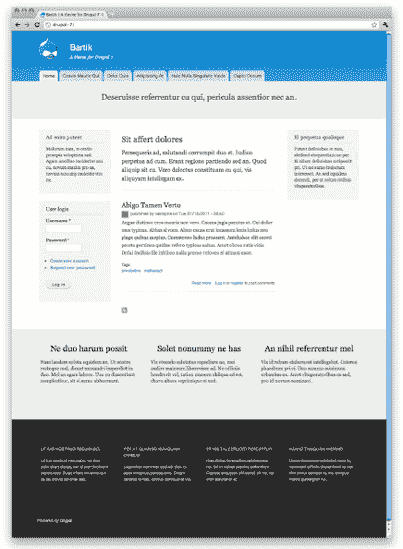

***图 15-1.** Bartik 是一个简洁明了的主题。*

##### Garland

Garland 最初作为核心主题亮相于 Drupal 5。它是一个更复杂的主题，具有出色的颜色模块支持（参见**图 15-2**）。它包含十五种配色方案，并提供了在固定或流式布局之间切换的选项。

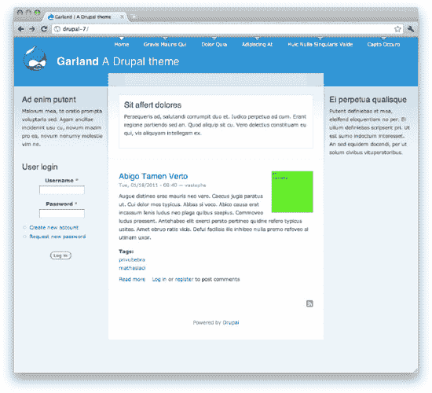

***图 15-2.** Garland 是一个更复杂的主题，具有出色的颜色模块支持。*

##### Seven

同样是 Drupal 7 新增的，Seven 是 Drupal 的默认管理主题。Seven 诞生于 Drupal 7 用户体验项目（[`http://d7ux.org`](http://d7ux.org)），它推动了 Drupal 用户界面的许多改进。它包含很少的区域，因为其重点是执行管理任务（参见**图 15-3**）。

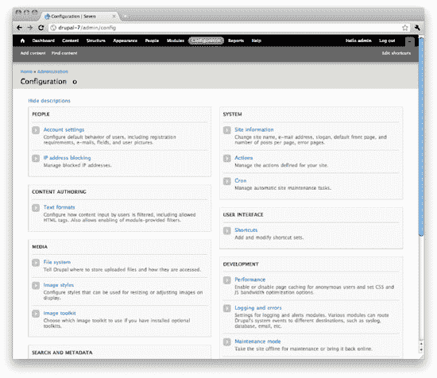

***图 15-3.** Seven 是 Drupal 的默认管理主题。*

##### Stark

Stark 是一个独特且名副其实的最小化 Drupal 主题（参见**图 15-4**）。它的主要目的是暴露 Drupal 的默认 HTML 标记和 CSS。它不提供任何模板文件，除了放置默认侧边栏区域的基本布局样式外，几乎不提供任何 CSS。不要被它的简单性所迷惑；它实际上非常有用。Stark 是开发者在为其模块编写 CSS 时进行编码的完美主题。它还能帮助主题开发者排查问题，当他们不确定问题是出在自己的主题还是其他模块上时。

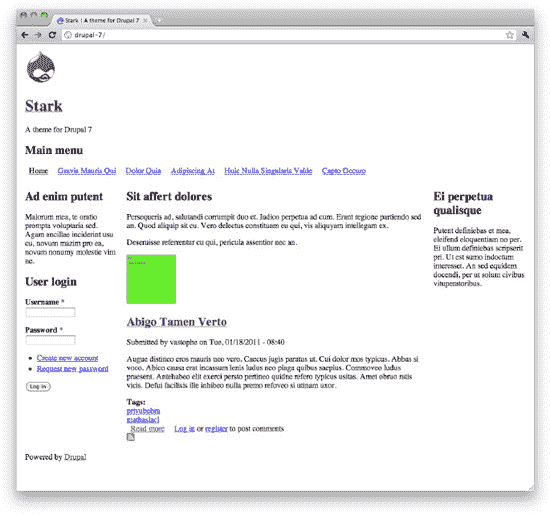

***图 15-4.** Stark 是一个独特且名副其实的最小化 Drupal 主题。*

#### 主题引擎

Drupal 的主题目录下还有一个引擎目录，其中包含一个名为 PHPTemplate 的主题引擎。主题引擎提供了一种简便的方法，可将可主题化的输出分离到模板文件中，而不是纯 PHP 代码中。使用 PHPTemplate 引擎的主要好处是简化了逻辑与表现的分离。那些不熟悉 PHP 的人也能完成大量工作，因为他们可以在主要包含标记和打印变量的模板文件中操作。

虽然也可以使用其他主题引擎，如 Smarty、XTemplate 和 PHPTal，但 PHPTemplate 是 Drupal 的默认主题引擎，也是迄今为止 Drupal 主题（以及许多流行的贡献模块）使用最广泛的主题引擎，因此我们将在本章中介绍它。也可以编写纯 PHP 的 Drupal 主题。关于纯 PHP 主题的示例，请参阅 Chameleon 主题，网址为[`http://drupal.org/project/chameleon`](http://drupal.org/project/chameleon)。有关可用主题引擎的完整列表，请访问[`http://drupal.org/project/theme+engines`](http://drupal.org/project/theme+engines)。

### 主题管理

主题配置任务位于 Drupal 管理后台的外观部分。在这里，你可以控制诸如启用或禁用哪些主题、应用哪些设置、使用哪种配色方案（如果你的主题支持颜色模块）等项目。

#### 启用并设置默认主题

在全新安装的 Drupal 7 中，默认主题（Bartik）会出现在“外观”页面的顶部，随后是其他已启用和已禁用的主题（参见图 15–5）。什么是默认主题？在 Drupal 中，仅仅启用一个主题是不够的。将一个主题设置为默认主题，才能使其成为前台主题（即网站访问者将看到的主题）。

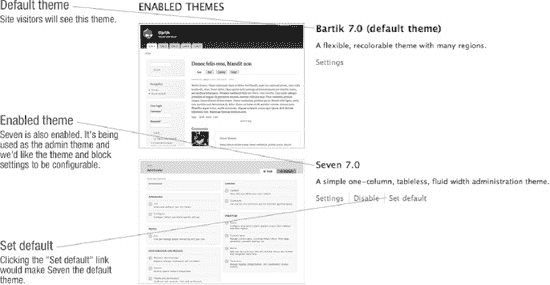

**图 15–5.** 默认安装中显示已启用主题的“外观”页面

当你希望网站同时使用多个主题时，启用一个主题但不将其设置为默认主题会很有用。此设置通常在与贡献模块结合使用时更为实用。一个例子是 SwitchTheme：[`http://drupal.org/project/switchtheme`](http://drupal.org/project/switchtheme)模块，它允许用户通过从已启用主题列表中选择主题名称来更改网站主题。

#### 管理主题

在 Drupal 7 中，Seven 是默认的管理主题。执行所有管理任务时都会使用管理主题，这些任务大多发生在`/admin`路径下。你还可以选择在编辑网站内容时允许使用管理主题。尽管某些主题对 Drupal 管理界面的支持比其他主题更好，但如有需要，任何 Drupal 主题都可以用作管理主题。

管理主题的配置设置位于`admin/appearance`页面上主题列表的下方。要在 Drupal 网站的前端和后端使用相同的主题，只需在“管理主题”选项中选择“默认主题”即可。

#### 全局主题设置

Drupal 自带一些可以在管理界面中配置的主题设置。大多数网站身份资产以及一些其他杂项设置都在此处定义。位于`admin/appearance/settings`的“全局设置”页面包含了这些设置。保存全局设置后，这些设置将应用于所有主题。每个主题也有自己的“设置”页面，可通过`admin/appearance`页面上每个已启用主题旁边的“设置”链接访问。当在单个主题的“设置”页面上应用主题设置时，这些设置会覆盖全局设置。以下各节将详细介绍这些设置的具体内容以及你在主题中会发现它们的位置。

这些设置中有相当一部分决定了变量是否被填充，从而是否在模板文件中被打印输出。图 15–6 中展示的设置代表了 Drupal 提供的默认设置。主题可以通过在主题的`.info`文件中定义特性（features）来覆盖这些设置，这将在“定义主题元数据”一节中进一步讨论。在`.info`文件中指定特性时，你需要确保包含所有你想要支持的特性，因为只要指定一个特性就会覆盖 Drupal 提供的所有默认设置。以下是这些设置在`.info`文件中的快速参考：

```
features[] = logo
features[] = name
features[] = slogan
features[] = favicon
features[] = main_menu
features[] = secondary_menu
features[] = node_user_picture
features[] = comment_user_picture
features[] = comment_user_verification
```

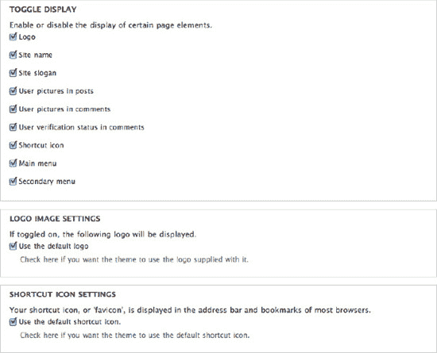

**图 15–6.** 全局设置页面

##### 标识

默认情况下，Drupal 会在主题目录的根目录下查找名为`logo.png`的文件。你也可以选择指定一个不同的文件路径作为标识，并能够上传一个标识来使用。当“标识”复选框被选中时，一个名为`$logo`的变量会被填充为标识的路径，该变量将在`page.tpl.php`中可用。如果未选中，则不会打印输出标识。

##### 网站名称和标语

网站名称在安装过程中定义。网站名称和标语都可以在`admin/config/system/site-information`页面上更改。在主题的“设置”页面上，你可以切换它们的可见性。两者在`page.tpl.php`中分别以`$site_name`和`$site_slogan`的形式提供。

##### 快捷图标

快捷图标（也称为网站图标）是出现在大多数浏览器的地址栏、书签和标签页中的小 Drupal 图标。与标识一样，其可见性可以切换，并且可以使用自定义文件。默认文件是`misc/favicon.ico`。

##### 文章和评论中的用户头像

这些设置控制`node.tpl.php`中的`$user_picture`变量和`comment.tpl.php`中的`$picture`变量是否被填充，从而控制查看节点和评论时是否显示头像。

##### 评论中的用户验证状态

此选项会在未经验证账户的用户名旁边显示“（未验证）”。此文本在`template_preprocess_username()`中定义，并在`theme_username()`中以`$variables['extra']`形式打印输出。请参阅“预处理和处理函数”及“主题函数”章节，了解如何更改此设置。

##### 主导航菜单和辅助导航菜单

当“主导航菜单”和“辅助导航菜单”的复选框被选中时，`page.tpl.php`中的`$main_menu`和`$secondary_menu`变量会被填充为包含每个菜单链接的数组。在位于`admin/structure/menu/settings`的菜单设置页面上，你可以为每个变量选择使用哪个菜单。默认情况下，可以在`admin/structure/menu/manage/main-menu`管理的主导航菜单，被用作填充`$main_menu`的源菜单。辅助导航菜单的源菜单默认是用户菜单，可以在`admin/structure/menu/manage/user-menu`管理。

这些是简单的单级菜单，在`page.tpl.php`中使用`theme_links()`函数（本章稍后会介绍）输出。这使得它们在设计复杂的导航样式时难以使用。由于通常需要复杂的导航，许多主题开发者会创建导航区域并使用区块来输出菜单，而不是使用这些菜单。我们强烈推荐 **菜单区块** 模块（[`http://drupal.org/project/menu_block`](http://drupal.org/project/menu_block)），它允许你非常轻松地完成几乎所有与菜单相关的需求。

##### 自定义主题设置

自定义主题设置与全局主题设置类似，可以由主题和模块提供。在 Garland 主题的`garland.info`文件中可以找到自定义主题设置的一个例子。它创建了一个名为`garland_width`的设置，可以设置为固定宽度或流体宽度。快捷键模块也提供了一个设置，用于显示“添加或移除快捷键链接”，该链接在 Seven 主题中使用，以提供你在叠加层中标题旁边看到的图标。要了解如何为你的主题创建自定义主题设置，请访问：[`http://drupal.org/node/177868`](http://drupal.org/node/177868)

#### 安装新主题

Drupal 会扫描其主题目录以查找可用的主题，因此将主题放置在正确的位置以供 Drupal 识别非常重要。你可能还想将主题添加到 Drupal 的 `/themes` 目录中，但从技术上讲，这被认为是“篡改核心”，应予以避免。下载并解压主题后，请选择以下目录之一来放置主题。使用这些目录之一将有助于确保你对 Drupal 本身所做的任何更新不会意外覆盖你的主题。

- `sites/all/themes`：当你希望该主题在你的 Drupal 安装中所有站点都可使用时，请使用此目录。

- `sites/sitename/themes`：当你仅希望该主题在你多站点 Drupal 安装中的特定站点可用时，请使用此目录。

你还可以使用主题安装程序来下载和安装贡献主题，方法是点击**外观**页面顶部的**安装新主题**链接。这将带你进入一个表单，你可以在其中输入项目下载包的 `.tar.gz` 文件链接，然后点击**安装**。主题安装程序将自动下载你的主题并将其放置在 `sites/all/themes` 目录中。完成后，你可以像往常一样在 `admin/admin/appearance` 页面上启用该主题。

### 定义主题元数据（`.info` 文件）

`.info` 文件（读作“dot info files”）包含有关主题的重要元数据，例如主题名称、它支持的 Drupal 版本，以及主题将包含的样式表和区域等内容。编写 `.info` 文件通常是创建 Drupal 主题时采取的第一步。

文件名的第一部分是主题的机器可读名称，Drupal 使用它来将有关主题的信息存储在数据库中。不允许使用连字符和其他特殊字符。虽然允许使用下划线，但最佳实践是避免在命名 `.info` 文件时使用它们。请使用 `themename.info` 而不是 `theme_name.info`。此名称还将用于在实现主题函数覆盖时为函数名称添加前缀。例如，在覆盖 `theme_menu_link()` 时，名为 `themename_menu_link()` 的函数被认为比 `theme_name_menu_link()` 更容易阅读，以便确定正在执行的覆盖操作。

 **注意**：你的主题（机器）名称必须是唯一的。请勿将主题命名为与任何现有模块相同的名称，因为这可能会导致命名空间问题，并使跟踪 PHP 错误变得困难。

每个主题都需要在主题的 `.info` 文件中设置一些基本属性。`name`、`core` 和 `engine` 属性是所有 Drupal 主题的最低要求。以下各节包含每个可用属性的简要说明，后跟语法示例。

 **提示**：要向 `.info` 文件添加注释，请在每行的开头添加分号，如下所示：`; 这是一条注释。注释很有用。请善加利用。`

#### 必需属性

> **核心：** Drupal 仅在 `core` 设置支持当前主要版本的 Drupal 时才允许启用你的主题。主要版本如 `6.x`、`7.x` 或 `8.x` 等。

>

> `core = 7.x`

>

> **名称：** 你主题的人类可读名称。它不需要与机器可读名称匹配或相似，因此你可以在此尽情发挥创意。

>

> `name = 主题名称`

#### 附加属性

> **基础主题：** Drupal 允许主题之间建立关系。创建子主题可以让你继承基础主题的功能和资源（更多详情将在下一章介绍）。在创建子主题时，你需要指定基础主题。务必在此使用基础主题的机器名称。

>

> `base theme = themename`

>

> **描述：** 此处应描述主题的基本特性或用途。该描述将显示在 `admin/appearance` 页面中，可以包含 HTML。

>

> `description = 我主题的描述`

>

> **引擎：** 指定主题引擎。PHPTemplate 是默认且最常见的引擎，因此除非你想更改它，否则无需手动设置。其他选项包括 `smarty` 和用于纯 PHP 主题的 `theme`（示例请参见 [`drupal.org/project/chameleon`](http://drupal.org/project/chameleon) 中的 Chameleon）。

>

> `engine = phptemplate`

>

> **功能：** 设置 `features` 是覆盖 Drupal 默认全局主题设置的一种方式。以下是 Drupal 提供的默认主题设置列表。这些设置可以在每个主题的**设置**页面的管理界面中开启或关闭。即使只指定一项，也会禁用 Drupal 的默认设置并使用你的设置。

>
```

# Drupal 7 主题 `.info` 文件详解

## 核心属性

### 功能特性
```
features[] = logo
features[] = favicon
features[] = name
features[] = slogan
features[] = node_user_picture
features[] = comment_user_picture
features[] = comment_user_verification
features[] = main_menu
features[] = secondary_menu
```

### PHP 版本
**PHP：** Drupal 7 支持 PHP 版本 5.2.5，默认情况下，你的主题也是如此。你可能永远不需要用到这个属性，但以防你的主题包含仅适用于特定 PHP 版本的代码，你可以在此处指定。

`php = 5.3`

### 区域定义
**区域：** 区域是页面布局中放置内容（区块）的部分。每个条目都以 `regions` 开头，并在方括号中包含区域的系统名称，其值为人类可读名称。例如，`regions[system_name] = 人类可读名称`。默认区域如下所示：

```
regions[page_top] = 页面顶部
regions[header] = 页眉
regions[highlighted] = 高亮区
regions[help] = 帮助
regions = 内容
regions[sidebar_first] = 第一个侧边栏
regions[sidebar_second] = 第二个侧边栏
regions[footer] = 页脚
regions[page_bottom] = 页面底部
```

### 主题设置
**设置：** `settings` 属性保留用于主题中自定义设置的实现。**Garland** 主题为布局类型（固定或流动）提供了一个主题设置，站点管理员可以进行选择。虽然我们不涉及自定义主题设置，但我们强烈建议查看 Omega ([`drupal.org/project/omega`](http://drupal.org/project/omega)) 和 Fusion ([`drupal.org/project/fusion`](http://drupal.org/project/fusion)) 主题，以了解如何使用主题设置。如需更多信息，请访问 [`drupal.org/node/177868`](http://drupal.org/node/177868)。

`settings[garland_width] = fluid`

### 截图
**截图：** Drupal 会自动在你的主题目录根目录中查找名为 `screenshot.png` 的文件，因此只有在你想为主题截图使用替代路径或文件名时才需要此行。建议的截图图像尺寸为 294 x 219 像素。

`screenshot = screenshot.png`

### 样式表
**样式表：** 在 Drupal 7 中添加 CSS 文件有多种选项。对于希望在每个页面上加载的 CSS 文件，你需要通过主题的 `.info` 文件来添加样式表。我将在下一章的**管理 CSS 文件**部分中更详细地介绍这一点。

```
stylesheets[screen][] = path/to/screen-stylesheet.css
stylesheets[print][] = path/to/print-stylesheet.css
```

### 脚本
**脚本：** 可以使用 `scripts` 属性在 `.info` 文件中定义 JavaScript 文件。与样式表类似，你应仅在此处加载需要在每个页面上加载的 JavaScript 文件。

`scripts[] = path/to/script.js`

### 版本
**版本：** 对于贡献主题和模块，不建议指定版本。这是因为 `drupal.org` 有一个打包脚本，会在创建版本时自动添加版本信息。不过，如果需要，你可以为自定义主题使用此属性。

`version = 7.x-1.1`

## 实际示例

现在，让我们通过查看 DGD7 主题的 `.info` 文件来实际了解这些基础知识，如清单 15–1 所示。

**清单 15–1**. DGD7 主题 `.info` 文件的顶部部分

```
name = DGD7 Theme
description = A theme written for The Definitive Guide to Drupal 7 book website.
core = 7.x
```

除 `core` 属性外，以上所有内容都可以在 `admin/appearance` 页面的用户界面中看到，如图 15–7 所示。这就是开始使用你的主题所需的全部内容。

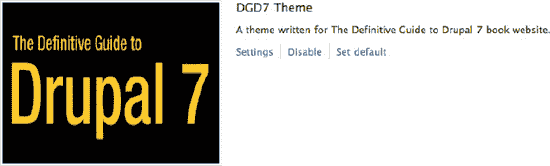

**图 15–7**. 主题列表页面 `admin/appearance` 上显示的 DGD7 主题。

## 创建你的第一个主题！

结合你到目前为止所学到的知识，创建一个自定义主题。

1.  首先，在 `sites/all/themes` 中创建一个名为 `dgd7` 的新文件夹。

2.  在 `dgd7` 文件夹内，创建一个名为 `dgd7.info` 的新文件，并在其中添加以下代码：

    ```
    name = DGD7 Theme
    description = A theme written for The Definitive Guide to Drupal 7 book website.
    core = 7.x
    ```

3.  从章节源代码中获取 `screenshot.png` 文件，并将其复制到 `dgd7` 目录中。这是一个可选步骤。如果未定义截图，你将看到文字“No screenshot”。

4.  现在访问 `admin/appearance` 并重新加载页面。你应该会在“已禁用主题”下看到此主题。点击“启用并设置为默认”链接，开始在你的网站上使用此主题。

 **提示** 你需要清除网站缓存，以使 `.info` 文件中的更改生效！要清除网站缓存，请访问性能页面 `admin/config/development/performance`。

## 使用区域

Drupal 页面上的大多数内容都在区域内输出。典型的区域包括页眉、页脚、侧边栏和内容（参见图 15–8）；这些区域通常在定义 HTML 标记的高级结构方面起着重要作用。每个区域的选项都会出现在 `admin/structure/block` 的区块界面中，允许网站管理员控制并定位其中的区块。

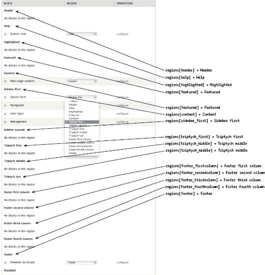

**图 15–8**. 区块管理页面上显示的 Bartik 主题的区域和区块放置选项

主题完全掌控着定义和确定打印及样式区域的位置。在 Bartik 主题中，示例如图 15–9 所示。

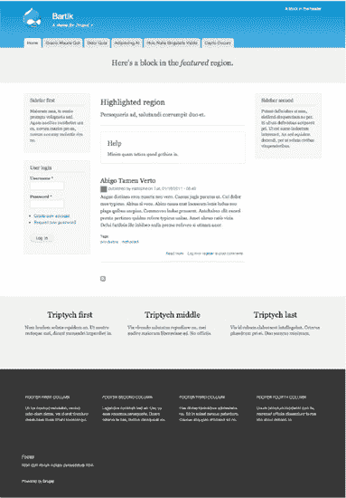

**图 15–9**. 填充了自定义区块的 Bartik 区域

此外，主题也可以将区域用于不那么明显的用途，结合 JavaScript 或 jQuery。常见的区域用例包括包含模态或隐藏内容以增强用户界面，或将区块嵌入节点内容中。

### 默认区域

Drupal 核心默认定义了九个区域供主题以编程方式使用。清单 15–2 中的代码以 `.info` 文件格式复述了默认的核心区域。与大多数主题层实现一样，主题定义区域的原因是他们想要修改或补充默认设置。在主题定义自己的区域之前，Drupal 将使用默认区域。这意味着，如果默认区域对你的设计来说已经足够，则无需在主题的 `.info` 文件中定义区域。

**清单 15–2**. Drupal 按时间顺序排列的九个预定义主题区域

```
regions[page_top] = Page Top
regions[header] = Header
regions[highlighted] = Highlighted
regions[help] = Help
regions = Content
regions[sidebar_first] = Sidebar First
regions[sidebar_second] = Sidebar Second
regions[footer] = Footer
regions[page_bottom] = Page Bottom
```

然而，一开始就将此代码包含在主题的 `.info` 文件中是一个好的实践。一旦你在主题中定义了一个区域，它将覆盖核心的默认设置，因此，保留完整的默认列表并注释掉你已禁用的区域（而不是完全删除或省略它们）是跟踪你如何处理这些区域的好方法。你需要其中一些区域，即 `page_top`、`content` 和 `page_bottom` 区域。这些是必需的，并且必须在每个 Drupal 主题中打印，以维护一个运行正常的网站。清单 15–3 展示了如何在 `.info` 文件中组织区域的一个示例，其中考虑了默认设置。

### 清单 15–3. 主题的 `.info` 文件中区域实现示例

```
; CORE REGIONS - DISABLED
;regions[highlighted] = Highlighted
;regions[help] = Help
;regions[header] = Header
;regions[footer] = Footer

; CORE REGIONS - REQUIRED
regions[page_top] = Page Top
regions = Content
regions[page_bottom] = Page Bottom

; CORE REGIONS
regions[sidebar_first] = Sidebar First
regions[sidebar_second] = Sidebar Second

; CUSTOM REGIONS
regions[my_custom_region] = My Custom Region
```

 **提示** 如果你好奇 Drupal 在哪里定义了默认区域，请查看 `http://api.drupal.org/_system_rebuild_theme_data` 上的 `_system_rebuild_theme_data()` 函数。

如图 15–10 所示，Drupal 默认区域的预期显示是一个标准的三列布局。灰色区域是必需的，其余的是可选的。`Header`、`sidebar_first`、`sidebar_second` 和 `footer` 是布局区域。`page_top` 和 `page_bottom` 是特殊区域；它们将在本章的“隐藏区域”部分讨论。

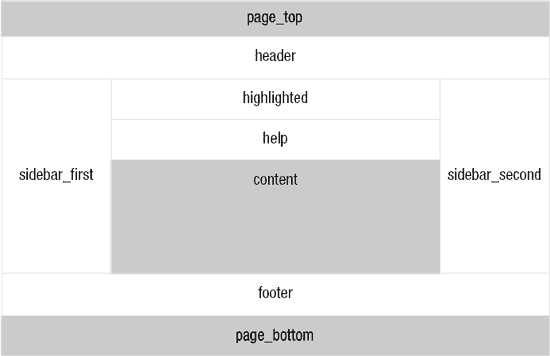

### 图 15–10. Drupal 的默认区域布局

`highlighted` 区域取代了旧的站点使命，后者曾经是一个包含站点使命陈述或简短摘要文本的静态变量，在 `page.tpl.php` 中手动输出。先前的实现由于一些原因并不理想，但主要是因为其显示仅限于首页。当时认为使用自定义区块来显示此信息是更好的选择，因此创建了 `highlighted` 区域。

帮助区域曾经也是一个打印错误和状态消息的 `page.tpl.php` 变量。状态消息现在显示在一个名为“系统帮助”的区块中，并且创建了帮助区域来容纳它。但是，系统帮助区块可以很容易地放置在内容区域内，并设置其权重高于主要内容区块以获得相同的效果。

内容区域是 Drupal 7 中新增的。它被引入用来容纳主页内容区块，这个区块有些特殊，因为它可以在不同区域之间移动，但不能被禁用。由于区块模块是可选的，而主页内容区块的内容对于运行 Drupal 网站至关重要，该区块的内容将始终通过 `page.tpl.php` 中的 `$page['content']` 变量显示。

因此，区块模块的某些功能可能无法如你预期的那样工作。如果你将主页内容区块放置在禁用区域，或者设置区块可见性设置使其从某个页面排除，区块模块的用户界面会让你相信它已被禁用。但是，内容仍然会显示。你还会注意到标记中的变化，这可能会导致不期望的结果，例如内容缺少样式，具体取决于你的 CSS 是如何编写的。

#### 隐藏区域

在图 15-8 所示的区块管理页面选项中，`page_top` 和 `page_bottom` 区域明显缺失。这两个都是隐藏区域，Drupal 故意将其排除在用户界面之外，以便站点管理员无法交互或控制其内容。隐藏区域的主要作用是作为占位符，模块或主题可以通过结构化方式动态添加标记。主题可使用以下语法在 `.info` 文件中声明隐藏区域，每个区域单独一行：

```
regions_hidden[] = the_region_name
```

`page_top` 和 `page_bottom` 区域都在 `html.tpl.php` 中输出（参见代码清单 15-4），不应被移除或重新排列。例如，工具栏模块利用 `page_top` 区域添加管理工具栏所需的标记，当用户以站点管理员身份登录时，该工具栏会显示在每个页面的顶部。`page_bottom` 区域的存在是为了让模块添加任何最终的闭合标记，这些标记需要位于页面最底部。以谷歌分析模块为例，它会添加用于加载追踪网站访客活动的 JavaScript 文件的标记，并且需要最后加载。`page_bottom` 区域取代了先前 Drupal 版本中使用的 `$closure` 变量。

### 代码清单 15-4. `html.tpl.php` 的内容，突出显示 `page_top` 和 `page_bottom` 区域的位置

```
<!DOCTYPE html PUBLIC "-//W3C//DTD XHTML+RDFa 1.0//EN"
  "http://www.w3.org/MarkUp/DTD/xhtml-rdfa-1.dtd">
<html xml:lang="<?php print $language->language; ?>" version="XHTML+RDFa 1.0" dir="<?php print $language->dir; ?>"<?php print $rdf_namespaces; ?>>
<head profile="<?php print $grddl_profile; ?>">
  <?php print $head; ?>
  <title><?php print $head_title; ?></title>
  <?php print $styles; ?>
  <?php print $scripts; ?>
  </head>
<body class="<?php print $classes; ?>" <?php print $attributes;?>>
  <div id="skip-link">
    <a href="#main-content" class="element-invisible element-focusable"><?php print t('Skip to main content'); ?></a>
  </div>
  <?php print $page_top; ?>
  <?php print $page; ?>
  <?php print $page_bottom; ?>
</body>
</html>
```

 **提示** Drupal 使用 `hook_system_info_alter()` 来声明 `page_top` 和 `page_bottom` 隐藏区域。更多信息请参见 [`api.drupal.org/api/function/system_system_info_alter/7`](http://api.drupal.org/api/function/system_system_info_alter/7)。

#### 模块特定区域

仪表盘模块的“仪表盘主要内容”和“仪表盘侧边栏”区域就是由模块创建的区域示例。这些区域是非传统的，因为它们无法通过区块管理页面管理，并且主题不负责定义或输出它们。仪表盘模块使用 `hook_system_info_alter()` 以编程方式定义它们，并负责在位于 `/admin` 的管理仪表盘上显示它们。仪表盘模块允许您将可用区块拖放到这些区域，为站点管理员创建仪表盘（参见图 15-11）。

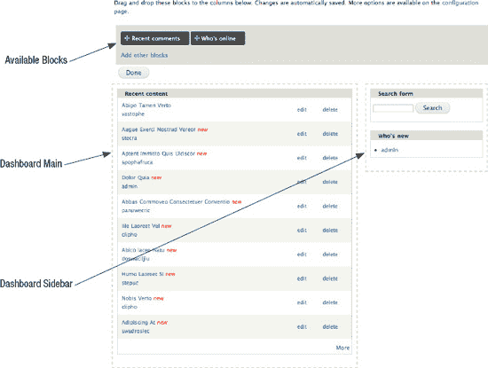

### 图 15-11. 编辑模式下的管理仪表盘

#### 区域与你的主题

开始处理主题区域需要认真审视设计需求，并为意外情况做好规划。需要考虑许多因素，包括站点管理员将如何使用区块和区域、您拥有哪些类型的内容，以及区域在您的整体布局策略中扮演的角色。如前所述，默认区域是一个很好的起点。我们建议您从在主题的 `.info` 文件中定义默认区域开始，并在此基础上进行调整，如代码清单 15-5 所示。

### 代码清单 15-5. Drupal 的默认区域

```
regions[page_top] = Page Top
regions[header] = Header
regions[highlight] = Highlight
regions[help] = Help
regions = Content
regions[sidebar_first] = Sidebar First
regions[sidebar_second] = Sidebar Second
regions[footer] = Footer
regions[page_bottom] = Page Bottom
```

 **提示** 除了在主题的 `.info` 文件中定义区域外，您还需要在适当的模板文件中输出它。`page_top` 和 `page_bottom` 区域在 `html.tpl.php` 模板中输出，其余区域在 `page.tpl.php` 中输出。关于输出区域和模板文件的更多细节将在本章后面讨论。

#### 使用区域 vs. 在模板文件中硬编码变量

在决定是否在主题中使用区域时，考虑每个部分将包含的内容、内容位置变化的可能性以及谁需要能够更改它是很有用的。区块本质上是灵活的，旨在允许站点管理员轻松地移动它们。如果期望区块位于某个特定区域，然后被移动或重新排序，这可能会导致问题。

当独自处理一个站点，或者只有少数受信任的个人控制区块配置时，这可能不是您需要担心的事情。相反，在不太受信任的个人可以访问并可能引发问题的情况下，采取额外措施来识别潜在问题区域并尽你所能预防这些问题是非常值得的。例如，页眉和页脚特别容易出现此类问题。它们通常具有严格定义的设计和匹配的 CSS。当区块在这些区域内被移动时，尤其是像主导航菜单这样高度样式化的内容，在不当操作下很快就会出现问题。有时，定义一个额外的区域，即使其目的只是为了容纳一个区块，也比将该区块与其他区块一起放在页眉区域更安全。这将有助于确保它始终在正确的位置输出，并减少用户出错的可能性。如果站点管理员不需要控制定位，那么最好在 `page.tpl.php` 中使用硬编码变量来输出，这样它就不会受到区块界面中操作的影响。

作为一般规则，当内容需要在区块界面中移动或重新排列时，应考虑使用区域。当内容不需要通过区块界面控制，并且将其放在那里存在风险时，考虑在模板文件中硬编码它，这样它就不会受到区块界面中操作的影响。

 **提示** 位于 `page.tpl.php` 中的主菜单（`$main_menu`）和辅助菜单（`$secondary_menu`）是硬编码变量的示例。

#### 布局策略

侧边栏的核心默认值（`Sidebar First` 和 `Sidebar Second`）旨在借助 body 类处理多种侧边栏组合。`Drupal` 极其灵活，可以随时更改页面。这最终效果如何，取决于主题的灵活性和编码质量。由于 `Drupal` 仅输出包含内容的区域，因此拥有一个规划良好且灵活的布局非常重要。

例如，假设你有一个两栏布局主题，其中第一栏包含主要内容，而 `Sidebar First` 区域只包含一个区块。如果你将该区块的可见性设置为仅在首页显示，那么整个 `Sidebar First` 区域将仅在首页输出，而内页则只会显示主栏。如果你的布局 CSS 只为每页同时存在这两栏的情况而设计，而没有为单栏和两栏两种情况都包含 CSS，那么你的布局就会出错。虽然区域在任何时候添加或修改起来都相当容易，但在项目初期过度简化布局可能会在后期给你带来额外的 CSS 工作。无论你的主题有多少个侧边栏，通常最好的做法是考虑到所有可能的侧边栏组合（一栏、两栏或三栏），以避免在后续开发中遇到问题。一种简单且可持续的好方法是使用一个成熟的基主题。

此外，某些类型的内容放在单独的区域中通常效果更好。例如，包含广告的自定义区块以及具有显著不同设计要求的区块，当它们被抽象出来时，编写 CSS 和进行管理通常会更简单。图 15–12 展示了添加广告横幅区域和主导航区域可能的样子。

考虑页面将如何构建以及由谁来使用它们也很重要。如果你的网站打算使用区域和区块来实现更复杂的设计，并且你想让网站管理员易于使用，那么预先定义多个区域来布局页面的较小部分可能是有意义的。`Bartik` 主题就是一个很好的例子，它包含了七个额外的区域来组织页脚中的区块，如图 15–13 所示。通过定义两个区域（`Footer First` 和 `Footer Second`）并使用 CSS 将每个区块向左浮动，也可以实现相同的效果。但 `Bartik` 的实现方式（如代码清单 15–6 所示，并在图 15–13 中说明）对于那些不想了解代码内部原理、只想使用该主题的人来说，可以说更容易理解。

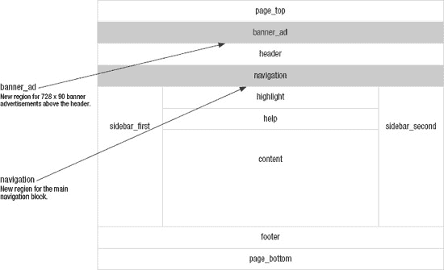

**图 15–12**。自定义广告横幅和导航区域示例

**代码清单 15–6**。`Bartik` 主题 `.info` 文件中定义其七个自定义区域的摘录

```
regions[triptych_first] = Triptych first
regions[triptych_middle] = Triptych middle
regions[triptych_last] = Triptych last
regions[footer_firstcolumn] = Footer first column
regions[footer_secondcolumn] = Footer second column
regions[footer_thirdcolumn] = Footer third column
regions[footer_fourthcolumn] = Footer fourth column
```

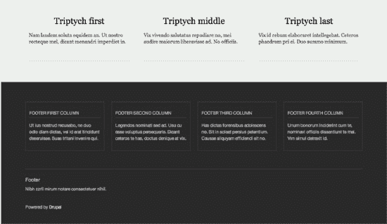

**图 15–13**。`Bartik` 主题中已填充内容的页脚区域

### 创建新区域

创建一个新区域分为两步。使用图 15–12 中的示例，以下是创建新的 `Banner Ad` 和 `Navigation` 区域的过程。

1.  在 `dgd7.info` 文件中定义区域。首先，在代码清单 15–3 中的默认配置基础上，添加新区域的代码，然后将 `banner_ad` 和 `navigation` 区域的定义添加到你的 `dgd7.info` 文件中。

    ```
    ; 默认区域
    regions[page_top] = Page Top
    regions[header] = Header
    regions[highlight] = Highlight
    regions[help] = Help
    regions = Content
    regions[sidebar_first] = Sidebar First
    regions[sidebar_second] = Sidebar Second
    regions[footer] = Footer
    regions[page_bottom] = Page Bottom

    ; 自定义区域
    regions[banner_ad] = Banner Ad
    regions[navigation] = Navigation
    ```

2.  在 `page.tpl.php` 模板文件中输出区域。清除站点缓存后，你将能够在 `admin/structure/block` 的区块管理页面上看到并填充这些新区域。为了让它们显示在页面上，你需要在主题中覆盖 `page.tpl.php` 文件，并输出这些新区域。

    导航到 `modules/system` 目录，复制 `page.tpl.php` 文件，并将其粘贴到你之前创建的 `sites/all/themes/dgd7` 目录中。

    在主题中打开 `page.tpl.php` 文件，向下滚动到 `<div id="page-wrapper">`，然后将用于输出区域的代码粘贴到它下面、`<div id="header">` 的上面。

    ```
    <div id="page-wrapper"><div id="page">
        <?php print render($page['banner_ad']); ?>
        <div id="header"><div class="section clearfix">
    ```

    移除 `$main_menu` 的默认标记，并用新导航区域的区域代码替换它。

    移除以下代码：

    ```
    <?php if ($main_menu || $secondary_menu): ?>
          <div id="navigation"><div class="section">
            <?php print theme('links__system_main_menu', array('links' => $main_menu,
    'attributes' => array('id' => 'main-menu', 'class' => array('links', 'inline',
    'clearfix')), 'heading' => t('Main menu'))); ?>
            <?php print theme('links__system_secondary_menu', array('links' =>
    $secondary_menu, 'attributes' => array('id' => 'secondary-menu', 'class' =>
    array('links', 'inline', 'clearfix')), 'heading' => t('Secondary menu'))); ?>
          </div></div><!-- /.section, /#navigation -->
        <?php endif; ?>
    ```

    替换为以下代码：

```
<?php print render($page['navigation']); ?>
```

3.  从技术上讲，你已经完成了，但让我们添加一些内容来说明你做了什么。

    为 `Banner Ad` 代码添加一个新的自定义区块。将区块标题命名为“Banner Ad”，并在区块正文中添加以下代码来伪造一个广告横幅的外观（确保选择 Full HTML 文本格式）。然后，在区域设置中选择 `Banner Ad` 区域，并保存它。

    ```
    
    ```

    返回 `admin/structure/block` 页面。找到 `Main Menu` 区块，将其放置在 `Navigation` 区域内，然后点击“保存区块”。

    你已经成功添加并填充了两个新的自定义区域！

### 模板文件

Drupal 核心、其模块以及贡献模块的大部分输出均以模板文件的形式呈现。模板文件由 HTML 标记和 PHP 变量组成。这使得即使对 PHP 知之甚少（或完全不懂）的用户也能轻松修改 HTML 代码。

一个简单的模板文件示例是 `user-picture.tpl.php`（参见代码清单 15–7）。该模板位于 `modules/user` 目录中，其唯一用途是打印网站用户的头像，形式可以是纯图片，也可以是带链接的图片（取决于查看照片的用户是否有权限查看用户个人资料）。它将头像包裹在 `<div class="user-picture">` 中。无论何时调用 `user_picture` 主题钩子，例如在用户个人资料页面、节点的作者信息以及评论（在启用的情况下）中，都会使用此模板文件。

**代码清单 15–7**。`user-picture.tpl.php` 文件内容

```
<?php
// $Id: user-picture.tpl.php,v 1.5 2009/08/06 05:05:59 webchick Exp $

/**
 * @file
 * 默认主题实现，用于展示为用户帐户配置的图片。
 *
 * 可用变量：
 * - $user_picture: 用户设置或站点默认的图片。将根据查看者
 *   查看用户个人资料页面的权限决定是否添加链接。
 * - $account: 帐户信息数组。潜在不安全。使用前务必通过
 *   check_plain() 处理。
 *
 * @see template_preprocess_user_picture()
 */
?>
<?php if ($user_picture): ?>
  <div class="user-picture">
    <?php print $user_picture; ?>
  </div>
<?php endif; ?>
```

Drupal 站点上的一个典型页面本质上是一个由嵌套模板文件和主题函数组成的庞大树状结构。如图 15–14 所示，这个树从较大的模板（如 `html.tpl.php` 和 `page.tpl.php`）开始，一直延伸到用于打印字段的 `field.tpl.php`。

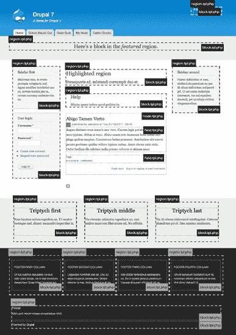

**图 15–14**。使用 Bartik 主题的示例首页，突出了主要模板文件和许多自定义区域的使用

### 常用核心模板

Drupal 核心包含超过四十个模板文件，但有六个主要的模板文件（详见表 15–1）负责构成每个页面的大部分内容。在编写 Drupal 主题时，这些主要模板文件是您最常使用的，它们能让您完成主题中的大部分繁重工作。

**表 15–1**。常用核心模板文件

| **名称** | **来源** | **用途** |
| --- | --- | --- |
| `html.tpl.php` | `modules/system` | 打印 HTML 文档的结构，包括 `<head>` 标签的内容，例如 `$scripts` 和 `$styles`，以及使用 `$page_top`、`$page` 和 `$page_bottom` 区域在内部进行打印的 `<body>` 标签的开闭。除非您需要更改 DOCTYPE，否则可能没有理由覆盖此文件。 |
| `page.tpl.php` | `modules/system` | 打印页面级别的区域以及其他硬编码变量，如 `$logo`、`$site_name`、`$tabs`、`$main_menu` 等。通过操作此文件可以完全控制站点布局，并且大多数主题都会提供自己的版本。 |
| `region.tpl.php` | `modules/system` | 打印区域的 HTML 标记。 |
| `block.tpl.php` | `modules/block` | 打印区块的 HTML 标记。 |
| `node.tpl.php` | `modules/node` | 打印节点的 HTML 标记。 |
| `comment.tpl.php` | `modules/comment` | 打印评论的 HTML 标记。 |
| `field.tpl.php`* | `modules/field/theme` | 打印字段的 HTML 标记。字段类型非常多，由于此文件需覆盖所有情况，其实现非常通用。如果您对语义化标记有要求，最终可能需要为此模板创建几个版本。 |

* `field.tpl.php` 仅在主题覆盖时才使用。`modules/field/theme` 中的文件仅作为您工作的基础提供。

### 覆盖模板文件

Drupal 核心和贡献模块提供的模板文件代表了原作者或团队选择的默认标记实现，但所有这些模板文件——以及其中打印的标记和变量——都是可以自定义的。在开发主题时，如果您认为默认实现不能满足您的要求，您可以简单地选择覆盖它。Drupal 的主题层设计得极其灵活且易于以这种方式操作。

Drupal 站点主题化的美妙之处在于，您可以轻松地进行更改，而无需修改原始模板。覆盖模板文件的过程非常简单：

1.  通过浏览代码或查看 `http://api.drupal.org` 找到原始模板文件。
2.  将其复制并粘贴到您的主题目录中。
3.  清除站点缓存并重新加载页面！

完成这三个步骤后，Drupal 将开始使用主题版本的文件，您便可以自由地进行任何您想要的更改。就是这么简单。

 **提示** 确保 Drupal 正在使用您在主题中刚刚覆盖的模板文件的一个快速方法是在模板文件顶部添加文本，例如“Hello World”。如果您重新加载页面后出现该文本，您就可以确定您正在处理正确的文件。

### 全局模板变量

模板文件包含的变量通常比它们实际打印的要多。在某些情况下会多很多。这对于主题开发者来说是一件好事，因为它为操作标记的显示开辟了许多可能性，而无需太多 PHP 知识。表 1-2 描述了一些在所有模板中都可用的有用变量（属性变量除外；这些变量在“HTML 属性”部分中介绍）。如何识别可用变量将在下一章中详细说明。

**表 15–2**。所有模板中可用的变量

| **变量** | **描述** |
| --- | --- |
| `$is_admin` | 辅助变量。如果当前登录用户是管理员，则等于 `TRUE`，否则等于 `FALSE`。 |
| `$logged_in` | 辅助变量。如果当前用户已登录，则等于 `TRUE`，否则等于 `FALSE`。使用 `$user->uid` 来确定此信息，因为匿名用户的用户 ID 始终为 0。 |
| `$is_front` | 辅助变量。使用 `drupal_is_front_page()` 函数判断当前页面是否为站点的首页。在首页上等于 `TRUE`（除非数据库离线），否则等于 `FALSE`。 |
| `$directory` | 正在使用的模板所在的目录。 |
| `$user` | 一个包含当前登录用户帐户信息的对象。可以通过在您正在工作的模板中添加 `global $user;` 行来访问。切勿直接打印其任何属性，因为它包含原始用户数据，因此是不安全的。请改用 `theme('username');`，例如 `theme('username', array('account' => $user)).` |
| `$language` | 一个包含站点当前使用语言信息的对象，例如 `$language->dir` 包含文本方向，`$language->language` 对于英语包含 `en`。可以通过在您正在工作的模板中添加 `global $language;` 行来访问。 |
| `$theme_hook_suggestions` | 一个包含其他可能的主题钩子的数组，这些钩子可用作命名模板文件和主题函数的变体，或用于确定上下文。请参阅“主题钩子建议”部分。 |

| `$title_prefix` 和 `$title_suffix` | 包含元素的渲染数组（例如上下文链接），这些元素在模板中的标题前后打印，或者在不存在标题的模板文件的顶部和底部打印。 |

### HTML 属性

在 Drupal 7 中，我们开始将属性存储在数组中。这样做部分原因是出于 RDF 模块的考虑。RDF 模块利用这些变量在预处理阶段附加其数据。另一个原因是允许主题开发者在预处理函数中对其模板文件输出的类进行更多控制。

表 15–3 中描述的每个变量都有数组和字符串两种版本。数组版本的变量名中包含后缀 `_array`，在各种预处理函数（如 `template_preprocess()` 和 `template_preprocess_node()` 或 `template_preprocess_block()`）中被赋值。然后，在 `template_process()` 阶段，会创建包含这些数组扁平化或字符串版本的新变量，以供模板使用。此过程在图 15–15 中进行了说明。更多详细信息，请参阅本章的“预处理和过程函数”部分。

**表 15–3**。可插入的 HTML 属性

| **变量** | **描述** |
| --- | --- |
| `$attributes` | 包含模块（主要是 RDF 模块）提供的 HTML 属性，但 class 属性除外（该属性单独处理，见下文）。`$attributes`（在预处理器中作为 `$attributes_array` 使用）通常保留给顶级 HTML 包装元素，例如 `<body>` 或其他模板文件中最外层的 `<div>`。 |
| `$classes` | 包含模板的 HTML 类。通常保留给顶级 HTML 包装元素，例如 `<body>` 或其他模板文件中最外层的 `<div>`。 |
| `$title_attributes` | 包含模板文件顶级标题（如节点或区块标题）的类，对于节点摘要或区块内容，通常是一个 `<h2>`。 |
| `$content_attributes` | 包含内容包装器 `<div>` 或模板文章正文的类。这些变量使用方式的示例可以在 `node.tpl.php` 文件中找到。 |

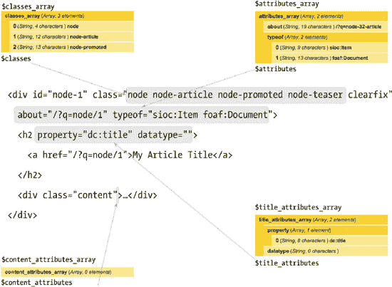

**图 15–15**。来自 `node.tpl.php` 的摘录，展示了如何使用可插入的 HTML 属性

 **提示**：如果在你的源代码中看不到这些属性，请务必启用 RDF 模块。

所有核心通用模板都提供了可用变量的详细文档。快速查看位于 `modules/block` 目录下的默认 `block.tpl.php` 模板文件，就会发现该文件的大部分内容实际上就是可用变量的文档。如代码清单 15–8 所示，仅通过查看文档和代码，你就能大致了解可以使用哪些变量。

**代码清单 15–8**。默认 `modules/block/block.tpl.php` 的源代码，包含变量文档

```php
<?php
/**
* @file
* 显示区块的默认主题实现。
*
* 可用变量：
* - $block->subject: 区块标题。
* - $content: 区块内容。
* - $block->module: 生成该区块的模块。
* - $block->delta: 区块的唯一 ID，在每个模块内唯一。
* - $block->region: 嵌入当前区块的区块区域。
* - $classes: 可用于通过 CSS 进行上下文样式化的类字符串。可以通过预处理函数中的变量 $classes_array 进行操作。默认值可以是以下一个或多个：
*   - block: 当前模板类型，例如“主题钩子”。
*   - block-[module]: 生成该区块的模块。例如，用户模块负责处理默认的用户导航区块。在这种情况下，类将是 "block-user"。
* - $title_prefix (数组): 一个包含模块填充的额外输出的数组，旨在显示在模板中主标题标签之前。
* - $title_suffix (数组): 一个包含模块填充的额外输出的数组，旨在显示在模板中主标题标签之后。
*
* 辅助变量：
* - $classes_array: HTML 类属性值的数组。它在变量 $classes 中被扁平化为一个字符串。
* - $block_zebra: 根据每个区块区域输出 'odd' 和 'even'。
* - $zebra: 与 $block_zebra 输出相同，但独立于任何区块区域。
* - $block_id: 根据每个区块区域递增的计数器。
* - $id: 与 $block_id 输出相同，但独立于任何区块区域。
* - $is_front: 当在首页显示时为真。
* - $logged_in: 当当前用户是已登录成员时为真。
* - $is_admin: 当当前用户是管理员时为真。
* - $block_html_id: 一个有效的 HTML ID，保证唯一。
*
* @see template_preprocess()
* @see template_preprocess_block()
* @see template_process()
*/
?>
<div id="<?php print $block_html_id; ?>" class="<?php print $classes; ?>"<?php print $attributes; ?>>
  <?php print render($title_prefix); ?>
<?php if ($block->subject): ?>
  <h2<?php print $title_attributes; ?>><?php print $block->subject ?></h2>
<?php endif;?>
  <?php print render($title_suffix); ?>
  <div class="content"<?php print $content_attributes; ?>>
    <?php print $content ?>
  </div>
</div>
```

文件顶部有一个 `@file` 块，简要描述了文件的作用。下面是一个长长的变量列表，其中一些在模板文件中打印，一些没有。还有指向相关预处理和过程函数的 `@see` 引用，这些将在下一章中更详细地讨论。

为了直观了解此模板文件生成的内容，请查看 Bartik 主题生成的一个区块。Bartik 不包含 `block.tpl.php` 文件；它使用区块模块提供的 Drupal 默认模板。创建一个标题为“我的自定义区块”的自定义区块，正文为一些占位文本，并将其放置在 Bartik 主题的侧边栏第一区域。

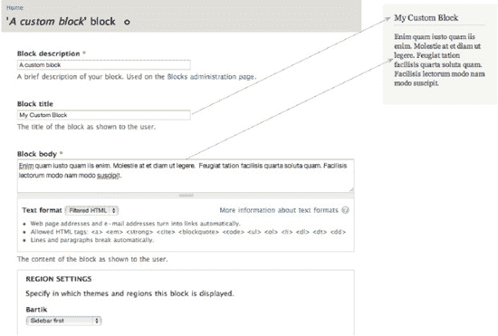

**图 15–16**。使用 Bartik 主题查看时渲染的自定义区块截图以及该区块的配置页面

你的自定义区块（如图 15–16 所示，配合代码清单 15–9 中的 `block.tpl.php` 模板文件）对匿名用户生成的输出显示在代码清单 15–9 中。区块标题由 `<?php print $block->subject ?>` 输出，正文由 `<?php print $content ?>` 输出。Drupal 只会填充变量并显示查看用户有权访问的内容。

**代码清单 15–9**。注销时标题为“我的自定义区块”的自定义区块的 HTML 输出

```html
<div id="block-block-1" class="block block-block">
  <h2>我的自定义区块</h2>
  <div class="content">
    <p>Enim quam iusto quam iis enim. Molestie at et diam ut legere. Feugiat tation facilisis
quarta soluta quam. Facilisis lectorum modo nam modo suscipit.</p>
  </div>
</div>
```

清单 15–10 展示了同一区块在管理员登录状态下所显示的 HTML。你会注意到代码有所不同。管理员可以访问由上下文链接模块添加的上下文管理链接。这些链接通过 `<?php print render($title_prefix); ?>` 这行代码输出。上下文链接模块还会在外层 `<div>` 上添加一个类，将其标识为 `contextual-links-region`。这种行为并非区块模块或 `block.tpl.php` 模板文件所特有。`$title_prefix` 和 `$title_suffix` 变量是为了让模块能够在模板文件的标题前后注入内容而创建的，上下文链接模块正是利用了这一点。

**清单 15–10**。以管理员身份登录时，标题为“我的自定义区块”的自定义区块的 HTML 输出，其中高亮显示了 `$title_suffix` 的输出内容

```
<div id="block-block-1" class="block block-block contextual-links-region">
  <h2>我的自定义区块</h2>
  <div class="contextual-links-wrapper contextual-links-processed">
    <a class="contextual-links-trigger" href="#">配置</a>
    <ul class="contextual-links">
      <li class="block-configure first last"><a href="/admin/structure/block/manage/block/1/configure?destination=node">配置区块</a></li>
    </ul>
  </div>
  <div class="content">
    <p>Enim quam iusto quam iis enim. Molestie at et diam ut legere. Feugiat tation facilisis
quarta soluta quam. Facilisis lectorum modo nam modo suscipit.</p>
  </div>
</div>
```

### 主题函数

主题函数的目的与模板文件相同，其目标是以一种可由主题（以及模块）自定义的方式提供 HTML 标记。Drupal 核心中包含了许多主题函数，涵盖从表单元素到菜单项，再到完整的后台页面实现。如需查看 Drupal 7 中可用的完整主题函数列表，请访问[`http://api.drupal.org/api/group/themeable/7`](http://api.drupal.org/api/group/themeable/7)。

#### 主题函数如何创建

Drupal 核心和模块通常会定义主题函数，但主题也可以定义它们。`hook_theme()`的实现包含了大多数通用主题函数的所有关键信息，包括这些函数接受哪些参数。主题钩子将在本章后面的“主题钩子建议”部分详细讨论，但清单 15–11 展示了一个简单的`hook_theme()`实现示例。

**清单 15–11**。`hook_theme()`实现示例

```php
<?php
/**
* 实现 hook_theme()。
*/
function mymodule_theme() {
  return array(
    'my_theme_hook' => array(
      'variables' => array('parameter' => NULL),
    ),
  );
}
?>
```

`hook_theme()`的实现让 Drupal 知道有哪些主题钩子。一旦 Drupal 知晓，它将搜索一个名为`theme_my_theme_hook()`的主题函数（在本例中），其代码可能如清单 15–12 所示。

**清单 15–12**。主题函数实现示例

```php
<?php
function theme_my_theme_hook($variables) {
  $parameter = $variables['parameter'];
  if (!empty($parameter)) {
    return '<div class="my-theme-hook">' . $parameter . '</div>';
  }
}
?>
```

#### 调用主题函数

在本章中，我们将主题函数称为`theme_this()`和`theme_that()`。这就是这些函数的名称及其通常的称呼。但是，你绝不应该直接调用主题函数。这样做会破坏 Drupal 主题层所带来的绝佳功能，例如重写、建议等。请始终使用`theme()`函数来生成主题输出。它会负责将请求路由到适当的主题函数。有关其工作原理的更多信息，请参见[`http://api.drupal.org/api/function/theme/7`](http://api.drupal.org/api/function/theme/7)。

使用`theme_image()`，清单 15–13 和 15–14 分别说明了调用主题函数的正确与错误方式。

**清单 15–13.** 调用主题函数的正确方式

```php
<?php print theme('image', array('path' => 'path/to/image.png', 'alt' => '图像说明')); ?>
```

**清单 15–14.** 调用主题函数的错误方式

```php
<?php print theme_image(array('path' => 'path/to/image.png', 'alt' => '图像说明')); ?>
```

### 覆写主题函数

覆写主题函数的方法与覆写模板文件非常相似。主要区别在于，你处理的是函数，且所有被覆写的主题函数都存放在 `template.php` 中。覆写主题函数的具体步骤如下：

1.  通过浏览 Drupal 的源代码或查阅 [`http://api.drupal.org`](http://api.drupal.org) 来找到原始主题函数。

2.  将其复制并粘贴到你的 `template.php` 文件中。

3.  将函数名称开头的 `theme_` 修改为 `你的主题名称 _`。

4.  保存 `template.php`，清除网站缓存，然后重新加载！

 **注意：** 如果是从零开始创建 `template.php`，请务必在文件顶部加上 `<?php`。同时注意，不要在文件底部添加结束标签。省略 PHP 结束标签可以避免产生不必要的空白字符，这些空白字符可能导致“无法修改头信息”或“头信息已发送”等错误。更多信息，请访问 [`http://drupal.org/node/1424`](http://drupal.org/node/1424)。

**让我们来覆写一个主题函数**

下面是一个名为 `theme_more_link()` 的主题函数。它用于在区块中打印指向更多内容的链接。要找到这个主题函数的代码，可以查看 [`http://api.drupal.org/api/function/theme_more_link/7`](http://api.drupal.org/api/function/theme_more_link/7)。

1.  将原始主题函数的代码复制并粘贴到 `template.php` 中。

```php
<?php
/**
* 为类似区块中使用的"更多"链接返回 HTML。
*
* @param $variables
*   一个包含以下内容的关联数组：
*   - url: 主页面的 URL。
*   - title: 对链接的描述性动词，例如“阅读更多”。
*/
function theme_more_link($variables) {
  return '<div class="more-link">' . l(t('More'), $variables['url'], array('attributes' => array('title' => $variables['title']))) . '</div>';
}
?>
```

2.  将函数名称的开头改为你的主题名称，保存文件，并清除网站缓存。

```php
<?php
/**
* 为类似区块中使用的"更多"链接返回 HTML。
*
* @param $variables
*   一个包含以下内容的关联数组：
*   - url: 主页面的 URL。
*   - title: 对链接的描述性动词，例如“阅读更多”。
*/
function dgd7_more_link($variables) {
  return '<div class="more-link">' . l(t('More'), $variables['url'], array('attributes' => array('title' => $variables['title']))) . '</div>';
}
?>
```

3.  Drupal 现在将使用你自定义版本的主题函数，所以你可以进行修改了！

```php
<?php
/**
* 覆写 theme_more_link()。
*  - 将文本从"More"改为"Show me More"
*  - 将 class 从"more-link"改为"more"
*/
function dgd7_more_link($variables) {
  return '<div class="more">' . l(t('Show me MORE!'), $variables['url'], array('attributes' => array('title' => $variables['title']))) . '</div>';
}
?>
```

 **提示：** 在步骤 3 中，你会注意到注释块已修改，用以说明哪个函数被覆写以及做了哪些更改。记录你的代码总是一个好习惯，明确列出覆写主题函数的原因，在未来可以大大节省时间。主题函数会发生变化，有些甚至不止修改几行代码。当升级 Drupal 主版本（如从 Drupal 7 升级到 Drupal 8）时，这样的注释会让你的工作轻松很多。

### 主题钩子与主题钩子建议

主题函数和模板文件由主题钩子定义。通过利用主题钩子建议，你在特定情况下覆写主题函数或模板文件时将拥有更大的灵活性。本节将介绍这两种方法，它们能极大地增强你自定义主题的能力和可操控性。

#### 什么是主题钩子？

在 Drupal 中，主题钩子指的是通过 `hook_theme()` 特别注册的模板文件和函数。对于非 PHP 开发者来说，这听起来可能有些吓人或过于技术化，但老实说并非如此。你已经了解了模板文件和主题函数，所以从技术上讲，你已经对主题钩子有了相当不错的理解。

核心模块是采用模板文件还是函数来实现，是根据具体情况来决定的，而做出这个决定的标准通常是平衡其在其他模块中复用的可能性、预期变化的频率以及出于性能原因的考虑。模板文件比主题函数执行速度稍慢，因此并非总是最佳选择。像表单输入元素这样较小的标记片段，作为主题函数实现效率更高，而像节点和区块这样较大的代码块，则更适合作为模板文件。

-   主题函数和模板文件都是 Drupal 及其模块生成由标记和变量组成的输出的方式，目的是让你（主题开发者）能够覆写并使其成为你自己的内容。它们完全属于你的领域，你将拥有最终决定权来决定它们的外观。

-   两者共享完全相同的主题钩子。例如，名为 `node.tpl.php` 的模板文件和名为 `theme_node()` 的函数共享相同的节点主题钩子。区别在于实现方式，因为两者不能同时使用。

-   两者都可以利用预处理函数，这允许你在渲染前拦截并修改变量。以节点钩子为例，在核心中看起来是 `template_preprocess_node();`，在你的主题中则是 `yourtheme_preprocess_node()`。

#### 主题钩子建议

模板文件和主题函数的默认实现提供了一组非常通用的标记，虽然足够使用，但在所有情况下并非理想之选。当执行标准覆写时（例如将 `block.tpl.php` 复制到主题中），所做的更改将在整个站点中每次渲染区块时生效。有时这正是我们想要的结果，但你通常希望对特定区块、特定模块提供的一组区块，甚至特定区域中的一组区块进行修改。

主题钩子允许你通过命名模式在主题中实现针对模板文件和主题函数的目标覆写。选项和命名模式取决于你正在处理的对象类型。在预处理阶段，每个模板被渲染之前，会创建并填充一个名为 `$theme_hook_suggestions` 的变量，其中包含替代钩子建议。

#### 建议与模板文件

表 15–1 中列出的所有常见模板文件都可以通过简单修改模板文件名来覆盖，以实现更有针对性的定制。例如，在处理区块时，Drupal 在 `template_preprocess_block()` 中提供了列表 15–15 中的建议。

***列表 15–15.** 来自 `template_preprocess_block()` 的摘录，其中定义了区块模板文件的模板建议*

```php
<?php
  $variables['theme_hook_suggestions'][] = 'block__' . $variables['block']->region;
  $variables['theme_hook_suggestions'][] = 'block__' . $variables['block']->module;
  $variables['theme_hook_suggestions'][] = 'block__' . $variables['block']->module . '__' .
$variables['block']->delta;
?>
```

在决定使用哪个模板时，Drupal 会自动将下划线转换为短横线，并在你的主题中搜索这些模板。这段代码会转换成表 15–4 中所示的建议。

***表 15–4**. 区块的模板建议*

| **建议** | **对应的模板文件** | **描述** |
| --- | --- | --- |
| `block` | `block.tpl.php` | 默认区块实现。 |
| `block__REGION` | `block--REGION.tpl.php` | `REGION` 被替换为主题区域名称，模板针对该区域中的区块。 |
| `block__MODULE` | `block--MODULE.tpl.php` | `MODULE` 被替换为创建该区块的模块名称。例如，针对自定义区块的模板文件应为 `block--block.tpl.php`，而由菜单模块创建的区块则使用 `block--menu.tpl.php`。 |
| `block__MODULE__DELTA` | `block--MODULE--DELTA.tpl.php` | `DELTA` 值（在旧版本中曾是数字）是模块定义的区块系统名称。例如，要针对系统模块的导航区块，你可以使用 `block--system--navigation.tpl.php`。在此示例中，“system”是模块，“navigation”是 delta 值。 |

##### 页面级建议

由于 `html.tpl.php` 和 `page.tpl.php` 作为 Drupal 中最高级别的模板文件具有特殊性质，因此在生成其建议时会受到特别关注。一个名为 `theme_get_suggestions()` 的函数会基于当前页面的上下文参数自动生成建议。这意味着，如果你愿意，实际上可以为网站上的每个页面提供不同版本的这些模板文件。当然，这是你永远不该考虑去做的事情，但在某些情况下，比如一个非常不同的首页或着陆页，使用不同的 `page.tpl.php` 是完全合理的。

如前所述，这些文件的主题钩子建议是借助参数生成的。Drupal 中的参数是页面系统路径的组成部分或片段。例如，当查看 URL [`http://your-site.com/node/1`](http://your-site.com/node/1) 时，第一个参数是“node”，第二个参数是“1”。理解 Drupal 中的参数是帮助你理解 Drupal 的关键之一。它们在确定上下文方面极其有用，并允许你在主题中执行更高级的操作。

图 15–17 展示了如何利用主题钩子建议和参数，为网站上的几乎任何页面创建独立的 `page.tpl.php` 和 `html.tpl.php` 模板。

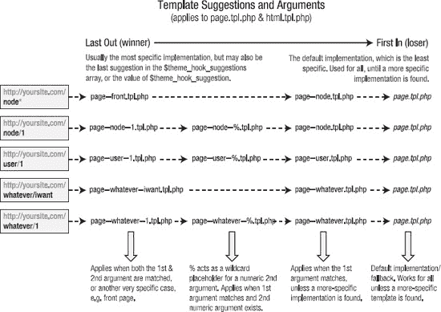

***图 15–17.** 不同类型页面的 `page.tpl.php` 建议*

> **注意：** Drupal 的前台页面默认为“node”，位置在管理  配置  站点信息下。此页面并非典型的节点。它是由节点模块的 `node_page_default()` 函数提供的自定义页面，用于列出标记为“推荐到首页”的帖子。“front”建议特定于前台页面（或首页），无论它是哪种类型的页面。如果你将前台页面更改为其他路径，你将获得额外的建议。

 **警告：** 图 15–17 列出了你可能在使用视图和面板等贡献模块时会遇到的命名路径示例。这些路径会成为系统路径，并可用作模板建议。然而，尝试使用通过自定义别名（或 Pathauto 模块）创建的路径（例如为 `node/1` 创建的 `about/team`）来创建模板文件是行不通的。这同样适用于分类、术语和用户资料。使用模板时，始终需要真实的系统路径。

对 `$theme_hook_suggestions` 的一些观察包括：

*   使用下划线而非短横线。

*   文件扩展名不存在，因为这些钩子可以作为主题函数或模板文件实现。在此阶段，使用模板还是主题函数并不重要。当需要渲染内容时，`theme()` 将决定使用哪个，并进行必要的调整。

*   每个建议都以 `hook__`（双下划线）前缀开头。在列表 15–15 所示的示例中，该钩子是 block。这使得 Drupal 能够回退到通用的主题钩子（在此例中是 block），并在不存在更具体的模板（如 `block--module.tpl.php`）时使用 `block.tpl.php`。

这些建议出现在 `$theme_hook_suggestions` 变量中的顺序决定了哪个钩子/模板文件将按照 FILO（先进后出）顺序被使用。当需要渲染模板时，将使用最后一条建议，但有一个例外。一个名为 `$theme_hook_suggestion`（注意是单数，而非复数）的变量也可用。如果它由模块或主题设置，则优先级高于 `$theme_hook_suggestions` 中定义的任何内容。

 **提示：** 在你正在处理的通用模板文件中使用 `dpm()` 函数（由 Devel 模块提供）来查看可用的选项。`<?php dpm($theme_hook_suggestions); ?>` 将显示你当前处理页面上可用的选项。

#### 建议与主题函数

如"建议与模板文件"部分所述，`$theme_hook_suggestions`（主题钩子建议）的备选方案通常在该钩子的预处理函数中定义。这种方法效果良好，因为模板文件通常服务于特定目的，例如输出节点或区块等特定实体。然而，主题函数则更具多样性，最终会被用于多种不同类型的输出，如表单元素、字段和渲染元素。模块开发者也可能使用主题函数来创建一次性自定义内容。这使得对诸如 `theme_links()` 这样广泛使用的函数实现主题函数覆写的吸引力大为降低，因为这可能会在你网站的各个意想不到的地方破坏样式。

幸运的是，许多主题函数也支持主题钩子建议，Drupal 核心已为一些流行的主题函数（如 `theme_links()`）实现了建议。对主题函数使用主题钩子建议，仅意味着你可以选择在特定上下文中覆写某个主题函数，而非覆写整个基础主题函数（后者会产生全站影响）。

如前所述，`theme_links()` 是一个很好的例子，说明在覆写主题函数时如何使用主题钩子建议。该主题函数被用于许多地方，例如主导航、节点、评论和上下文链接。请注意，要实现表 15-5 中"主题函数等效项"列出的函数，你需要在 `template.php` 中将 `THEME` 替换为你的主题名称。

**表 15-5**. `theme_links()` 的部分模板建议示例

| 建议（Suggestion） | 等效主题函数（Theme Function Equivalent） | 描述（Description） |
| --- | --- | --- |
| `links` | `THEME_links()` | 默认实现，除非指定了下面更具体的实现，否则它将用于所有实现。 |
| `links__node` | `THEME_links__node()` | `theme_links()` 的针对性实现，仅适用于节点内部的链接列表。 |
| `links__comment` | `THEME_links__comment()` | `theme_links()` 的针对性实现，仅适用于评论内部的链接列表。 |
| `links__contextual` | `THEME_links__contextual()` | `theme_links()` 的针对性实现，仅适用于为上下文链接生成的链接。 |
| `links__contextual__node` | `THEME_links__contextual__node()` | `theme_links()` 的针对性实现，仅适用于节点内部的上下文链接。 |

你会在 Drupal 默认的 `page.tpl.php` 文件（位于 `modules/system` 目录）中注意到，主菜单和次菜单都使用建议（suggestion）进行输出。你可能还会注意到，名为 `theme_links__system_main_menu()` 和 `theme_links__system_secondary_menu()` 的主题函数并不存在，但这没关系。在这种情况下，除非创建了更有针对性的主题函数，否则将使用基础钩子或回退函数 `theme_links()`（参见清单 15-16）。

**清单 15-16**. `modules/system/page.tpl.php` 节选

```php
<?php if ($main_menu || $secondary_menu): ?>
  <div id="navigation"><div class="section">
    <?php print theme('links__system_main_menu', array('links' => $main_menu, 'attributes'
=> array('id' => 'main-menu', 'class' => array('links', 'inline', 'clearfix')), 'heading' =>
t('Main menu'))); ?>
    <?php print theme('links__system_secondary_menu', array('links' => $secondary_menu,
'attributes' => array('id' => 'secondary-menu', 'class' => array('links', 'inline',
'clearfix')), 'heading' => t('Secondary menu'))); ?>
  </div></div><!-- /.section, /#navigation -->
<?php endif; ?>
```

在这种情况下，主题钩子建议被硬编码到函数参数中。当 `theme()` 处理此内容时，它会先检查是否存在 `theme_links__system_main_menu()` 的实现。如果找到该函数，则使用它来渲染内容。如果未找到，则使用原始的（或回退的）`theme_links()` 代替。`theme()` 会自动处理此过程，并能根据双下划线直接确定基础钩子。

**注意**：需要特别注意的是，**主题钩子建议** 与**主题钩子**并不相同。根据你所学的关于主题钩子建议的知识，自然会认为可以为特定的建议编写预处理函数和处理函数。主题钩子（即默认实现和建议）是在 `hook_theme()` 的实现中专门注册的。这意味着你可以创建一个名为 `THEME_preprocess_page()` 的预处理函数，但不能使用 `THEME_preprocess_page__front()`。

### 本章小结

本章涵盖了 Drupal 主题的基础知识，包括如何：

*   定义 `.info` 文件并处理区域。

*   覆写和创建有针对性的模板文件和主题函数。

*   理解主题钩子及其建议。

掌握这些知识后，我们将在下一章中探讨一些更高级的主题主题。

## 第 16 章

## 高级主题开发

**作者：Jacine Luisi**

Drupal 主题层最大的优点之一就是它提供了极大的灵活性。在上一章中，你学习了创建主题的基础知识：使用 `.info` 文件、模板文件和主题函数。在实现更定制的主题时，有时仅靠这些工具是不够的，你需要进行更深入的挖掘。此时，前端开发者与后端开发者之间的界限变得有些模糊，但请继续跟随我们的讲解。

读完本章后，你将了解如何在预处理函数中处理变量、自定义表单以及使用新的渲染 API。我还将详细介绍 CSS 文件处理的细节和子主题的基础知识，并为你提供创建可持续 Drupal 主题的基本规则。你很快就能化身为主题开发高手。

好的，作为一名高级文档工程师和翻译员，我将严格遵循您的注意事项和示例格式，将给定的英文文本翻译成中文。

### 在主题层中查找可用变量

在主题层工作时，您会发现可用的变量会根据您所处理的实体类型而有所不同。您还会发现各种模板和主题函数并未使用或记录所有可用的变量，因此，您经常需要做的一件事就是将数组的内容打印到屏幕上。

有多种使用 PHP 打印数组的方法。最常见的方法之一是使用 `print_r()` 函数。此外还有 `var_dump()`、`get_defined_vars()` 以及 Drupal 自带的 `debug()`。这些函数对于小型数组来说非常棒，但 Drupal 的数组以其庞大而闻名，因此在进行站点前端编码时使用这些函数，至少可以说是令人烦恼的。幸运的是，多亏了 Devel 模块(`http://drupal.org/project/devel`)和 Krumo 库，打印紧凑且易于阅读的数组变得轻而易举。安装 Devel 模块后，您就可以使用 `dpm()` 和 `kpr()` 等函数。

在使用模板和预处理函数时，您通常使用 `dsm()` 或 `dsm()` 来打印 `$variables`。例如，尝试在您的 `node.tpl.php` 文件顶部添加 `<?php dpm($variables); ?>`。

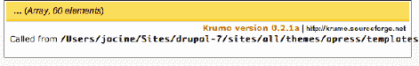

**图 16–1.** 在 `node.tpl.php` 中打印 `<?php dpm($variables); ?>` 的结果

在图 16–1 中，您可以看到使用 `dpm()` 函数打印 `$variables` 数组内容的结果。使用 `dpm()` 的好处在于，数组会通过 `page.tpl.php` 中的 `$messages` 变量（系统状态信息所在位置）被整齐地打印出来。如图 16–2 所示，您可以单击标题并逐一展开每个部分的内容。

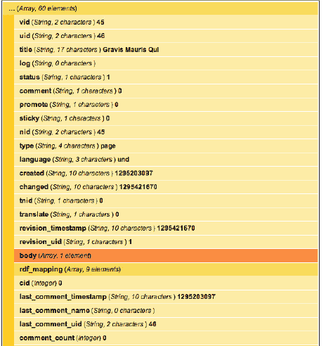

**图 16–2.** 使用 `dpm()` 函数打印的已展开数组

在模板文件内部工作时，这些变量可作为顶层变量使用。这是为了方便主题开发者。例如，在模板中，不要打印`$variables['status']`，只需打印`$status`即可。在函数（如主题函数或预处理函数）内部工作时，请使用`$variables['status']`。

#### 使用主题开发者模块

当然，当您刚开始使用 Drupal 时，您需要了解代码位于何处以及首先需要覆盖什么。主题开发者模块（`http://drupal.org/project/devel_themer`）是帮助您解决此问题的完美工具。启用后，页面右下角会出现一个复选框。点击后，页面右上角会出现一个半透明的、可调整大小且可拖动的窗口。然后，您可以移动它并点击页面上的任何元素，窗口将填充您所需的所有信息，甚至更多（参见图 16–3）。

例如，当点击一个节点时，窗口中会提供以下信息：

-   影响该元素的父函数和模板

-   模板或主题钩子建议（候选）

-   正在使用的预处理和处理函数

-   可用变量的打印输出

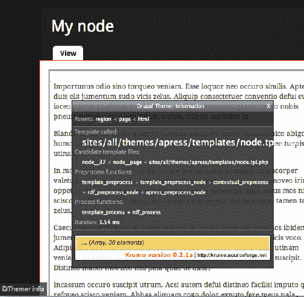

**图 16–3.** 主题开发者窗口显示了与被点击元素（本例中为一个节点）相关的主题信息。

### 预处理函数和处理函数

预处理函数是主题开发者的最佳盟友。在许多用例中，预处理函数都可以让您的工作更轻松、代码更高效、模板文件更清晰整洁。如果您以前从未使用过它们，要么是因为您觉得不需要，要么是害怕深入研究 PHP，那么您真的错过了很多。我们希望改变这一点。

现在您已经熟悉了模板文件的一般用途，即主要提供标记和打印变量。但是，如果您想更改这些变量或添加自己的变量呢？您的第一反应可能是创建一个模板文件并在其中完成所有操作，但这通常是错误的做法。

预处理函数正是为此目的而设计的。在实现预处理函数或处理函数时，您基本上是在告诉 Drupal：“嘿，等等！在您将这些数据发送出去进行渲染之前，我需要对其做一些修改。”这有点像一篇文章在发布前需要经过编辑的最终审查。根据定义，“预处理”是在模板渲染之前发生的一个处理阶段。“处理”函数是 Drupal 7 中的新特性，它们服务于相同的目的，唯一的区别在于它们在处理周期中运行得较晚（在预处理之后）。

Drupal 如何使用预处理函数和处理函数的一个很好的例子是`$classes_array`和`$classes`变量。在清单 16–1 的`template_preprocess()`中，这是 Drupal 默认的预处理实现，并且是第一个被调用的预处理函数，`$classes_array`变量被初始化；请参阅`http://api.drupal.org/api/function/template_preprocess/7`。

**清单 16–1**. 来自定义`$classes_array`的`template_preprocess()`的摘录

```php
<?php
function template_preprocess(&$variables, $hook) {
  // 为当前钩子初始化 HTML 类属性。
  $variables['classes_array'] = array(drupal_html_class($hook));
}
?>
```

第一步提供了一个指示正在使用的钩子的类。例如，如果这个预处理函数是为一个节点调用的，这段代码会将`node`类添加到该数组中。此函数运行后，所有模块和主题也有机会运行它们自己的版本，并添加或更改任何变量。接下来是 Node 模块，它实现了`template_preprocess_node()`；请参阅`http://api.drupal.org/api/function/template_preprocess_node/7`。如清单 16–2 所示，有相当多的类被添加到此数组中。

**清单 16–2**. 来自将额外类添加到`$classes_array`变量的`template_preprocess_node()`的摘录

```php
<?php
function template_preprocess_node(&$variables) {
  // 收集节点类。
  $variables['classes_array'][] = drupal_html_class('node-' . $node->type);
  if ($variables['promote']) {
    $variables['classes_array'][] = 'node-promoted';
  }
  if ($variables['sticky']) {
    $variables['classes_array'][] = 'node-sticky';
  }
  if (!$variables['status']) {
    $variables['classes_array'][] = 'node-unpublished';
  }
  if ($variables['teaser']) {
    $variables['classes_array'][] = 'node-teaser';
  }
  if (isset($variables['preview'])) {
    $variables['classes_array'][] = 'node-preview';
  }
}
?>
```

同样，在`template_preprocess_node()`运行之后，所有模块和主题都有机会实现自己的版本，进行他们想要的任何更改或添加。一旦所有预处理函数完成，处理函数就有了机会。在 Drupal 核心中，节点只有两个处理实现：`template_process()`（默认实现）和`rdf_process()`（RDF 模块的实现）。

在`template_process()`中，当所有模块和主题都有机会修改后，会创建一个名为`$classes`的新变量。它包含`$classes_array`中所有类名的字符串版本。`$classes`变量被打印在`node.tpl.php`模板文件中包装器`<div>`的 class 属性中。如清单 16–3 所示。

**清单 16–3**. 来自`template_process()`的摘录，其中`$classes`由`$classes_array`变量创建

```php
<?php
function template_process(&$variables, $hook) {
  // Flatten out classes.
  $variables['classes'] = implode(' ', $variables['classes_array']);
}
?>
```

清单 16–1 到 16–3 展示了 Drupal 通过预处理函数和过程函数提供的一些灵活性和强大功能，以及这些函数的执行顺序。最重要的是要理解，在主题层，你可以对这些变量拥有最终决定权。只需在主题中实现预处理函数和过程函数，你就可以轻松地添加、修改和移除任何你想要的变量；这将在后续页面中更详细地介绍。

使用预处理函数的一大优势是，它们允许你将大部分逻辑保留在模板文件之外。这使得模板文件更清晰、更容易理解，同时主题也更高效，更易于长期维护、管理和扩展。你可以进行许多更改，例如影响类和修改现有变量，这些都不需要对模板文件进行任何更改——只需几行简单的代码即可。

### 实现预处理和过程钩子

预处理函数通过创建一个按特定方式命名的函数来实现。清单 16–4 展示了这种命名约定的示例。

**清单 16–4**. 预处理和过程钩子的命名约定

```php
<?php
/**
 * Implements template_preprocess_THEMEHOOK().
 */
function HOOK_preprocess_THEMEHOOK(&$variables) {
   // Changes go here.
}

/**
 * Implements template_process_THEMEHOOK().
 */
function HOOK_process_THEMEHOOK(&$variables) {
   // Changes go here.
}
?>
```

在命名这些函数时，需要考虑四点：

1.  默认实现（通常由模块创建）的钩子是`template`。在所有其他实现中，`HOOK`被替换为实现它的模块或主题的系统名。

2.  你想要影响流程的哪个阶段？有两个选项：预处理（首先运行）或过程（在所有预处理函数执行完毕后运行）。

3.  主题钩子与`hook_theme()`中定义的主题钩子相匹配，最终通过主题函数或模板文件输出。

4.  `&$variables`参数包含渲染它的主题函数或模板文件所需的数据。由于预处理函数在模板渲染之前运行，你可以对其内容进行各种更改和添加。

 **注意**：默认情况下，只有那些在`hook_theme()`中明确定义的主题钩子才能使用预处理钩子。例如，`hook_preprocess_node()`完全没问题，但`hook_preprocess_node__article()`则不会生效。这是因为`node__article`是一个主题钩子建议，它是主题钩子的一个变体，但并非真正的主题钩子。

#### 默认实现

清单 16–5 展示了默认主题钩子的预处理实现的样子，以`template_preprocess_node()`为例，它为`node.tpl.php`模板文件创建变量。此函数存在于`node.module`中，同时还有`hook_theme()`的实现`node_theme()`，它在其中将“`node`”定义为主题钩子。

**清单 16–5**. 预处理和过程钩子默认实现的命名约定

```php
<?php
function template_preprocess_node(&$variables) {
   // Changes go here.
   // See http://api.drupal.org/api/function/template_preprocess_node/7 for contents.
}

function template_process_node(&$variables) {
   // Changes go here.
   // See http://api.drupal.org/api/function/template_process_node/7 for contents.
}
?>
```

 **提示**：浏览[`http://api.drupal.org`](http://api.drupal.org)并查看默认实现是学习变量如何创建的好方法。

#### 主题和模块实现

模块和主题都能够以相同的方式使用预处理函数，并且一个给定的主题钩子可以有多个来自模块和主题的预处理实现。这引入了发生冲突的可能性，因此牢记这一点并了解这些函数的运行顺序非常重要。来自模块的预处理实现先运行，主题的实现最后运行。当处理基础主题和子主题时，基础主题先运行，子主题最后运行。记住这一点的一个好方法是，活动主题总是胜出。

由 Drupal 核心和模块实现的预处理函数位于各种文件中，例如`modulename.module`或`theme.inc`等，而由主题实现的预处理函数始终位于`template.php`中。

例如，为一个名为“`dgd7`”的主题实现一个用于节点主题钩子的预处理函数。如清单 16–6 所示，你只需在`template.php`中放置一个函数，以主题名（实现钩子）开头，后跟`_preprocess_`和主题钩子（本例中为`node`）。最后，通过引用传递`&$variables`参数（`$`前的`&`表示通过引用传递的变量）。

**清单 16–6.** 在主题中实现`template_preprocess_node()`

```php
<?php
/**
 * Implements template_process_node().
 */
function dgd7_preprocess_node(&$variables) {
  // Changes go here.
}
```

只需要清单 16–6 中的代码，再加上一次快速的缓存清除，Drupal 即可识别你的预处理函数并在渲染节点之前运行它。现在，有趣的部分可以开始了！

### 查找`$variables`的内容

`$variables`数组的内容因每个主题钩子而异；即使同一主题钩子的内容也会根据其他因素（如视图模式或用户角色）而变化。

创建函数后，首先要做的是打印数组并找出里面有哪些你可以操作的内容。如“在主题层查找可用变量”部分所述，使用`dpm()`函数是一个很好的方法，如清单 16–7 所示。

**清单 16–7.** 将变量打印到屏幕以进行调试

```php
<?php
/**
 * Implements template_preprocess_node().
 */
function dgd7_preprocess_node(&$variables) {
  dpm($variables);
}
?>
```

 **注意**：调试函数应仅在开发期间临时使用。

#### 实战中的预处理函数

使用预处理函数可以更改的东西太多了，我们无法一一详述。既然你已经设置好了预处理函数，并且知道如何查看现有变量，那么你已经具备了开始进行一些更改的知识。让我们直接开始，通过几个如何使用预处理函数的实用示例来实践。

### 为模板包装器添加类

在 [`definitivedrupal.org`](http://definitivedrupal.org) 的 DGD7 主题中，页眉、侧边栏和页脚区域为黑色，而内容区域为白色。为了更轻松地设置这些区域内容的样式，你可以为区域包装器添加几个辅助类。为此，你需要在你的 `template.php` 文件中为区域主题钩子实现一个预处理函数；参见清单 16-8。

**清单 16-8.** 在 `template_preprocess_region()` 中使用 `$classes_array` 变量向区域包装器 `<div>` 添加类

```php
<?php
/**
 * 实现 template_preprocess_region()。
 */
function dgd7_preprocess_region(&$variables) {
  $region = $variables['region'];
  // 侧边栏和内容区域需要好的类来设置样式。你不应该使用像 #main 或 #main-wrapper 这样的 ID 来设置内容样式。
  if (in_array($region, array('sidebar_first', 'sidebar_second', 'content'))) {
    $variables['classes_array'][] = 'main';
  }
  // 向某些区域添加 "clearfix" 类，以清除其中的浮动元素。
  if (in_array($region, array('footer', 'help', 'highlight'))) {
    $variables['classes_array'][] = 'clearfix';
  }
  // 向较暗的区域添加 "outer" 类。
  if (in_array($region, array('header', 'footer', 'sidebar_first', 'sidebar_second'))) {
    $variables['classes_array'][] = 'outer';
  }
}
?>
```

`$variables['classes_array']` 在处理阶段会变成 `$class`，而在预处理过程中添加的类会自动随之修改。因此，你只需如此，就能为区域包装器 `<div>` 添加一个类。

在模板文件中采用替代方法则更加冗长。需要向每个受影响的模板文件中添加逻辑，这意味着即使你不需要改动标记，也必须覆盖文件。如果你有多个区域模板文件，则需要手动对所有文件进行更改，这显然效率低下，如清单 16-9 所示。

**清单 16-9.** 在预处理函数中添加类可以显著提高 CSS 代码的效率。

```css
/* 使用默认提供的类和 ID。 */
#header fieldset,
#footer fieldset,
.sidebar fieldset {
  border-color: #333;
}

/* 使用[清单 16-8]中添加的类，效率更高。 */
.outer fieldset {
  border-color: #333;
}
```

 **提示** 此示例更改了区域模板的类，但这种技术可以应用于任何主要模板，包括在其各自的预处理函数中的 `html.tpl.php`、`block.tpl.php`、`node.tpl.php` 和 `comment.tpl.php`。

### 修改节点

清单 16-10 演示了三个修改：

1.  Drupal 的页面标题在 `page.tpl.php` 中输出。当节点标题在 `node.tpl.php` 文件中输出时，通常是因为它正处于摘要模式下查看，因此，节点标题默认使用 `<h2>` 标记。通常，节点正文内的内容也包含一个或多个 `<h2>` 标签。向节点标题添加一个单独使用的类可以使样式设置更容易。清单 16-10 利用 `$title_attributes_array` 添加一个 `node-title` 类，以帮助简化样式设置。

2.  当查看一个节点，且其评论表单直接位于节点链接下方时，再显示一个 "添加新评论" 链接意义不大。在清单 16-10 中，通过使用 `hide()` 函数（本章后面将详细介绍），在评论表单位于下方时隐藏评论链接。

3.  设计通常要求在查看节点的摘要与完整页面时有所不同。清单 16-10 演示了使用`$variables['teaser']`在摘要模式下抑制`$submitted`信息的显示，并将节点标题截断为 70 个字符。

***清单 16-10.** 演示在预处理过程中修改节点内容的显示*

```php
<?php
/**
 * 实现 template_preprocess_node()。
 */
function dgd7_preprocess_node(&$variables) {
  // 为包含摘要节点标题的 <h2> 提供一个更好的类。
  $variables['title_attributes_array']['class'][] = 'node-title';

  // 当评论表单位于链接下方时，移除 "添加新评论" 链接。
  if (!empty($variables['content']['comments']['comment_form'])) {
    hide($variables['content']['links']['comment']);
  }

  // 在摘要模式下进行一些更改。
  if ($variables['teaser']) {
    // 不显示作者或日期信息。
    $variables['display_submitted'] = FALSE;
    // 修剪节点标题并追加省略号。
    $variables['title'] = truncate_utf8($variables['title'], 70, TRUE, TRUE);
  }
}
?>
```

### 在用户照片下方添加更改照片链接

你可能已经注意到，`$variables`数组中提供了许多变量。这些变量可以用来非常方便地创建新变量。你知道编辑用户个人资料页面的路径是`user/UID/edit`，因此你可以利用`$variables`中的信息来判断查看页面的用户是否为账户持有人。一旦确定，你可以通过实现`template_preprocess_user_picture()`轻松创建一个包含链接的变量，以便用户在其照片出现的任何位置编辑照片，如清单 16-11 所示。完成后，你就可以在相应的模板`user-picture.tpl.php`中输出它，如清单 16-12 所示。

***清单 16-11.** 通过实现`template_preprocess_user_picture()`为`user-picture.tpl.php`创建自定义变量。*

```php
<?php
/**
 * 实现 template_preprocess_user_picture()。
 * - 添加 "更改照片" 链接，位于用户图像下方。
 */
function dgd7_preprocess_user_picture(&$vars) {
  // 创建一个空字符串变量，以防止在尝试输出变量时出现 PHP 通知
  $vars['edit_picture'] = '';
  // account 对象包含正在处理的用户照片的信息。将其与代表当前登录用户
  // 的 user 对象的用户 ID 进行比较。
  if ($vars['account']->uid == $vars['user']->uid) {
    // 创建一个包含指向用户个人资料链接的变量，并带有一个类 "change-user-picture"
    // 以便使用 CSS 设置样式。
    $vars['edit_picture'] = l('更改照片', 'user/' . $vars['account']->uid . '/edit',
array(
      'fragment' => 'edit-picture',
      'attributes' => array('class' => array('change-user-picture')),
      )
    );
  }
}
?>
```

***清单 16-12.** 将自定义变量输出到你已复制到主题中以进行覆盖的`user-picture.tpl.php`文件中*

```php
<?php if ($user_picture): ?>
  <div class="user-picture">
    <?php print $user_picture; ?>
    <?php print $edit_picture; ?>
  </div>
<?php endif; ?>
```

### 使用渲染 API

#### 什么是渲染数组？

模板文件中的许多变量都很直观，但您可能会注意到，有些变量会与名为`render()`的函数一同输出。渲染数组是结构化数组，包含嵌套数据以及 Drupal 通过其渲染 API 将其转换为 HTML 所需的其他信息。在模板文件中，渲染数组的变量通常很容易识别，因为它们使用`render()`函数进行输出。

在`page.tpl.php`中，您会注意到所有区域都使用`render()`函数输出。每个区域都是嵌套在`$page`数组中的一个元素（另一个数组）。清单 16-13 中的代码就是渲染每个区域所需的全部内容。每次`render()`调用都会返回渲染数组所有内容的完整格式化 HTML。

***清单 16–13.** 在`page.tpl.php`中使用`render()`函数输出区域*

```php
<?php print render($page['sidebar_first']); ?>
```

在 Drupal 的早期版本中，您只需包含`<?php print $sidebar_first; ?>`，它包含一个可直接输出的完整格式化 HTML 字符串。这样做当然可行，但灵活性不足。坦白说，在那个阶段，面对一大块 HTML 标记，您能做的事情非常有限。

在 Drupal 7 中，这些变量以结构良好的数组形式发送到模板。您得到的不是一堆 HTML 标记，而是一个包含其中内容各种信息的数组，甚至深入到其中特定链接的属性。这使得定位数组中的特定内容变得异常简单，并能在其首次渲染前的最后一刻进行任何您想要的修改。

要查看此数组中的内容，请使用 Devel 模块提供的`dpm()`函数，在`page.tpl.php`中打印它：`<?php dpm($page['sidebar_first']); ?>`。如图 16-4 所示，此数组内有两个顶级渲染元素：搜索表单区块和导航区块，它们当前正在第一个侧边栏中输出。

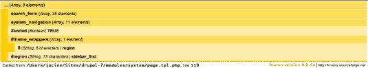

***图 16–4.** 使用`dpm()`从`page.tpl.php`打印出的`$page['sidebar_first']`渲染数组内容*

#### 识别渲染元素

识别数组是否为渲染元素的一个简单方法是查看是否存在属性。渲染元素始终是数组，并且始终包含以井号（#）开头的属性。在图 16-4 中，您可以立即判断出`$page['sidebar_first']`是一个渲染元素，因为它包含几个属性：`#sorted`、`#theme_wrappers`和`#region`。这些属性由`drupal_render()`使用，当调用`drupal_render()`时，它会根据这些属性决定如何渲染输出。有关`drupal_render()`的详细信息，请参见[`http://api.drupal.org/api/function/render/7`](http://api.drupal.org/api/function/render/7)。

作为主题开发者，您通常不会深入探究那些更偏向开发者使用的属性，但有一些属性将有助于您理解这些数组的含义。这些属性在表 16-1 中进行了描述。

***表 16–1.** 有用的渲染元素属性*

| **属性** | **描述** |
| --- | --- |
| `#theme` | 指定主题钩子，可以是渲染元素时使用的函数或模板。 |
| `#theme_wrappers` | 一个包含主题钩子的数组，用于包裹元素已渲染的子元素。例如，在为主题化区块时，`#theme`属性会是`block`，而`#theme_wrappers`属性会包含`region`。这确保了在区块渲染后，其子元素也会通过区域模板进行处理。 |
| `#type` | 将被渲染的元素类型。元素类型的默认属性在`hook_element_info()`实现中定义。 |
| `#prefix` & `#suffix` | 包含标记的字符串，分别放置在渲染元素之前（前缀）或之后（后缀）。 |
| `#weight` | 用于对元素进行排序的数字，决定其输出顺序。 |
| `#sorted` | 一个布尔值（`TRUE`或`FALSE`），用于指示子元素是否已排序。例如，它与`#weight`属性结合使用，对区域中的区块进行排序。当通过`hook_page_alter()`在主题中重新排序区块时，如果您需要将某个区块移动到已排序元素之外的任何其他位置，除了指定`#weight`外，还需要指定`#sorted => FALSE`以触发新的排序。 |

| `#attached` | `#attached`属性用于指定在渲染元素时加载相应的 CSS、JavaScript 或库。 |

*有关更多信息，请参阅文档：[`api.drupal.org/api/function/drupal_render/7`](http://api.drupal.org/api/function/drupal_render/7)*

#### 操作渲染元素的输出

如前所述，使用结构化数组比使用一堆 HTML 要灵活得多。这使得您可以轻松地只做您想要的修改，无论大小，而无需从头重写代码。

使用渲染数组生成标记以及使用 alter 钩子的概念，对于 Drupal 主题开发者来说是完全陌生的。这跟您习惯的方式截然不同，不过在积极意义上，它需要一段时间的适应。在很多方面，对于一次性实现来说，它比创建模板和主题函数更简单。前端开发人员在使用渲染 API 时遇到的最大问题是：

1.  以不同的方式思考如何生成标记。

2.  弄清楚如何修改渲染数组的内容。

3.  习惯于实现 alter 钩子。

与主题钩子不同，渲染数组是使用 alter 钩子进行修改的，而不是预处理函数和模板。起初这可能会令人困惑，因为渲染数组与主题钩子相似，它们的目标都是最终生成 HTML 标记，并且它们使用模板和主题函数来实现这一点。对于渲染数组，`#theme`属性（允许您定义应使用哪个主题函数或模板来渲染元素）只是众多可用属性之一，并且可以随时更改。通常，您会使用模板和主题函数来修改标记本身，并使用 alter 钩子在元素渲染前修改其内容、结构或位置。

以下章节包含一些您可以使用渲染数组进行操作的示例。

##### 即时生成新内容

生成新内容就像向页面数组添加新元素一样简单。列表清单 16–14 展示了如何在主题的 `template.php` 文件中通过实现 `hook_page_alter()` 钩子，向原有的 `Highlighted` 区域添加一个名为 `"new_stuff"` 的新元素。

**列表清单 16–14**. 向高亮区域添加新元素

```php
<?php
/**
* 实现 hook_page_alter() 钩子。
*/
function mytheme_page_alter(&$page) {
  $page['highlighted']['new_stuff'] = array(
    '#type' => 'container',
    '#attributes' => array('class' => 'my-container'),
  );
  $page['highlighted']['new_stuff']['heading'] = array(
    '#type' => 'html_tag',
    '#tag' => 'h2',
    '#value' => t('Heading'),
    '#attributes' => array('id' => 'my-heading'),
  );
  $page['highlighted']['new_stuff']['list'] = array(
    '#theme' => 'item_list',
    '#items' => array(
      'First item',
      'Second item',
      'Third item',
    ),
  );
}
```

你首先将新元素命名为 `"new_stuff"`，将其 `#type` 设置为 `container`，并定义了一个类属性 `my-container`。请注意，`container` 是一个在 `system_element_info()` 中定义的元素，它默认使用 `theme_container()` 主题函数作为主题包装器。这意味着该元素的子元素（标题和列表）将通过 `theme_container()` 进行处理。生成的标记如列表清单 16–15 所示。

**列表清单 16–15.** `theme_container()` 为 `$page['highlighted']['new_stuff']` 生成的输出

```html
<div class="my-container">
  ...
</div>
```

然后，你添加了一个名为 `"heading"` 的子元素，并将其 `#type` 元素属性指定为 `html_tag`。这会导致该元素在渲染时使用 `theme_html_tag()`。你还指定了 `#tag`、`#value` 和 `#attributes` 属性。这些是 `theme_html_tag()` 函数的参数，详见 [`http://api.drupal.org/api/function/theme_html_tag/7`](http://api.drupal.org/api/function/theme_html_tag/7)。生成的标记如列表清单 16–16 所示。

**列表清单 16–16**. `theme_html_tag()` 为 `$page['highlighted']['new_stuff']['heading']` 生成的输出

```html
<h2 id="my-heading">Heading</h2>
```

最后，你添加了一个名为 `"list"` 的子元素。此处你将 `#theme` 属性指定为 `item_list`，并包含了一个包含 `#items` 的数组，`#items` 是 `theme_item_list()` 的必需参数。生成的标记如列表清单 16–17 所示。

**列表清单 16–17**. `theme_item_list()` 为 `$page['highlighted']['new_stuff']['list']` 生成的输出

```html
<div class="item-list">
  <ul>
    <li class="first">First item</li>
    <li>Second item</li>
    <li class="last">Third item</li>
  </ul>
</div>
```

当 `Highlighted` 区域被渲染时，列表清单 16–14 中的代码会产生如列表清单 16–18 所示的最终结果。

**列表清单 16–18**. 列表清单 16–14 的最终渲染结果

```html
<div class="my-container">
  <h2 id="my-heading">Heading</h2>
  <div class="item-list">
    <ul>
      <li class="first">First item</li>
      <li>Second item</li>
      <li class="last">Third item</li>
    </ul>
  </div>
</div>
```

 **警告** 上述示例旨在说明如何使用渲染 API 生成内容。不过，值得注意的是，不应滥用此方法将页面上的每一段 HTML 都作为独立元素输出，因为这可能会严重影响性能。对于少量的标记，例如标题，更推荐使用 `markup` `#type` 而非 `html_tag`，因为后者需要调用 `theme_html_tag()` 主题函数来确定输出。

##### 将内容从一个区域移动到另一个区域

在 `hook_page_alter()` 的实现中，你可以随意移动各区域的内容。列表清单 16–19 中包含了简单的几行代码，用于将整个第一侧边栏的内容移动到第二侧边栏。这样，在完整节点页面上，布局会从左侧边栏布局变为右侧边栏布局。在列表清单 16–19 中，你还将面包屑导航移动到了底部页脚区域。

**列表清单 16–19**. 将 `sidebar_first` 区域重定位到 `sidebar_second`，并将面包屑导航添加到页脚区域的新元素中

```php
<?php
/**
* 实现 hook_page_alter() 钩子。
*/
function dgd7_page_alter(&$page) {
  // 检查当前是否正在查看完整的节点页面。
  if (node_is_page(menu_get_object())) {
    // 将 sidebar_first 的内容赋值给 sidebar_second。
    $page['sidebar_second'] = $page['sidebar_first'];
    // 取消设置 sidebar_first。
    unset($page['sidebar_first']);
  }

  // 将面包屑导航添加到页脚区域底部。
$page['footer']['breadcrumbs'] = array(
    '#type' => 'container',
    '#attributes' => array('class' => array('breadcrumb-wrapper', 'clearfix')),
    '#weight' => 10,
  );
  $page['footer']['breadcrumbs']['breadcrumb'] = array(
    '#theme' => 'breadcrumb',
    '#breadcrumb' => drupal_get_breadcrumb(),
  );
  // 触发区域内容重新排序。
  $page['footer']['#sorted'] = FALSE;
}
```

##### 修改渲染数组中的内容

修改渲染数组的内容以改变实际内容的零散部分，这会进入一个非常模糊的领域。可以说，像这样的修改应该放在模块中。在进行此类修改时，关键要问自己：当你正在开发的主题未激活时，你所做的修改是否仍应适用？列表清单 16–20 将用户个人资料页面上的“查看”和“编辑”标签分别改为“个人资料”和“编辑个人资料”。

**列表清单 16–20**. 实现 `hook_menu_local_tasks_alter()` 以更改用户个人资料页面上的标签名称

```php
<?php
/**
* 实现 hook_menu_local_tasks_alter() 钩子。
*/
function dgd7_menu_local_tasks_alter(&$data, $router_item, $root_path) {
  if ($root_path == 'user/%') {
    // 将第一个标签的标题从 'View' 改为 'Profile'。
    if ($data['tabs'][0]['output'][0]['#link']['title'] == t('View')) {
      $data['tabs'][0]['output'][0]['#link']['title'] = t('Profile');
    }
    // 将第二个标签的标题从 'Edit' 改为 'Edit profile'。
    if ($data['tabs'][0]['output'][1]['#link']['title'] == t('Edit')) {
      $data['tabs'][0]['output'][1]['#link']['title'] = t('Edit profile');
    }
  }
}
```

### 核心模板中值得关注的渲染数组

核心模板中散落着不少值得关注的渲染数组变量。`hook_page_alter()` 包含整个页面，因此始终可以用来修改任何内容。但是，由于其他模块可以移动内容，找到特定的修改目标并非总是易事，因此建议使用更具体的修改钩子。表 16–2 是一个快速参考，列出了重要的渲染数组。这绝非完整列表，但它涵盖了相当多的内容，并能为你提供思路，让你了解如何着手查找编辑这些内容的位置。

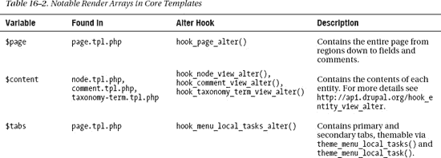

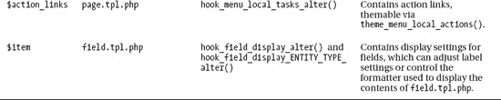

### 介绍 `render()`、`hide()` 和 `show()`

Drupal 7 最佳的新主题功能之一，是在模板中有选择地渲染内容片段。如前面章节所述，某些变量（渲染数组）的内容会以结构化的数组形式（而非 HTML 片段）发送到模板中。这对主题层来说是个非常棒的消息。

要理解这到底有多棒，你需要回顾一下历史。在 Drupal 的早期版本中，为包含字段的复杂节点制作主题并非易事。字段被混杂在 `$content` 变量中，虽然可以单独打印和操作它们，但存在一些问题。你必须非常小心地正确清理变量，而且一旦决定拆分 `$content` 变量，就需要完全重建它。这种做法不具备前瞻性，因为新增字段通常需要回到模板文件并打印新字段。

在 Drupal 7 中，这些问题得到了优雅的解决。你现在能够非常轻松地使用三个新函数 `render()`、`hide()` 和 `show()` 来渲染单个内容片段，例如字段。它们可以在主题函数、模板文件以及预处理和过程处理函数中使用。这三个函数都接受一个参数，即你想要定位的元素（或子元素）。

-   `hide()`：通过欺骗 `drupal_render()` 使其认为元素已被打印，从而隐藏一个渲染元素或其部分。使用示例：`<?php hide($element['something']); ?>`

-   `show()`：与 `hide()` 相反。它可以用于撤销之前应用的 `hide()` 状态。使用示例：`<?php show($element['something']); ?>`

-   `render()`：将渲染数组转换为 HTML 标记。它返回 HTML，因此在模板中应与 `print` 一起使用。使用示例：`<?php print render($element); ?>`

为了演示这些函数的实际应用，请查看 `node.tpl.php`（参见清单 16–21）。

**清单 16–21**. 默认 `node.tpl.php` 模板的摘录

```
<div id="node-<?php print $node->nid; ?>" class="<?php print $classes; ?> clearfix"<?php print
$attributes; ?>>
  <?php print $user_picture; ?>
  <?php print render($title_prefix); ?>
  <?php if (!$page): ?>
    <h2<?php print $title_attributes; ?>><a href="<?php print $node_url; ?>"><?php print $title; ?></a></h2>
  <?php endif; ?>
  <?php print render($title_suffix); ?>
  <?php if ($display_submitted): ?>
    <div class="submitted">
      <?php print $submitted; ?>
    </div>
  <?php endif; ?>
  <div class="content"<?php print $content_attributes; ?>>
    <?php
      // 现在隐藏评论和链接，以便稍后渲染。
      hide($content['comments']);
      hide($content['links']);
      print render($content);
    ?>
  </div>
  <?php print render($content['links']); ?>
  <?php print render($content['comments']); ?>
</div>
```

如清单 16–21 所示，该模板开箱即用，已经同时使用了 `render()` 和 `hide()` 函数。这个节点模板中有三个渲染数组：`$title_prefix`、`$title_suffix` 和 `$content`。在 `<div class="content">` 包装器内部，使用 `hide()` 隐藏了 `$content['links']` 和 `$content['comments']`，然后直接渲染了 `$content`。

隐藏评论和链接的原因是，将它们从 `$content` 变量中分离出来，使它们能够放置在 `<div class="content">` 包装器之外。随后，这两个项目再通过 `render()` 分别进行渲染。

当然，乐趣不仅仅停留在顶级变量上。这些函数可以深入处理数组的任何层级。只要你传入一个正确的渲染元素（参见“渲染 API”部分），就能通过这些函数对其进行操作。

举个例子，假设你想在查看包含评论表单的节点时，隐藏“添加新评论”链接。你可以简单地检查表单是否存在于你的数组中，然后隐藏那个特定的链接组（评论）。清单 16–22 中的代码演示了如何做到这一点。

**清单 16–22**. 当评论表单存在时隐藏“添加新评论”链接

```php
<?php
// 当评论表单存在时，隐藏“添加新评论”链接。
if (!empty($vars['content']['comments']['comment_form'])) {
  hide($vars['content']['links']['comment']);
}
// 之后再打印渲染后的链接。
print render($content['links']);
```

由于 `show()` 函数会重置打印状态但不会打印任何内容，因此它有助于撤销之前应用的 `hide()` 状态。在大多数情况下，你可能只需使用 `render()`，因为它允许你根据需要多次打印该元素，如清单 16–23 所示。

**清单 16–23**. 当评论表单存在时隐藏“添加新评论”链接，但如果满足其他条件则再次显示它

```php
<?php
// 当评论表单存在时，隐藏“添加新评论”链接。
if (!empty($content['comments']['comment_form'])) {
  hide($content['links']['comment']);
  if ($some_exception) {
    show($content['links']['comment']);
  }
}
// 之后再打印渲染后的链接。
print render($content['links']);
```

 **提示** 对于复杂的模板，这些代码在模板文件中会变得非常混乱。在这种情况下，最好在预处理或过程处理函数中执行这些操作，以使你的模板保持整洁并更易于管理。

### 表单主题化

表单主题化与处理通常的模板文件或主题函数略有不同。表单标记是使用 Drupal 的表单 API 生成的。这使得模块构建表单变得非常容易，并保证了生成元素之间的一致性。虽然表单主题化的过程与大多数前端开发人员习惯的方式大相径庭，但我们认为你会开始欣赏 Drupal 表单主题化的一致性和灵活性。

Drupal 的一个著名特点是能够以多种不同方式完成同一项任务。虽然 Drupal 的所有表单都没有附带模板文件，但它们可以很容易地被设置为使用模板文件。表单也可以使用预处理函数、过程处理函数和修改钩子。那么，如何决定何时使用哪一种呢？本节将解释表单是如何生成的，并会提供几个使用每种方法的示例。

### 表单标记的生成方式

表单由模块生成。代码清单 16–24 中展示的简单函数即是生成表单标记所需的全部内容。看起来非常简单，对吧？确实如此。当然，要让表单具备功能性，还需要更多处理步骤，例如验证表单和保存提交的值，但这些在主题层中并不是你需要关心的。对你而言重要的是表单的结构，以及它如何从 `$form` 数组转换为实际的标记。

**代码清单 16–24**。一个简单的取消订阅表单

```php
<?php
function exampleform_unsubscribe(&$form, $form_state) {
  $form['email'] = array(
    '#type' => 'textfield',
    '#title' => t('E-mail address'),
    '#required' => TRUE,
  );
  $form['submit'] = array(
    '#type' => 'submit',
    '#value' => t('Remove me!'),
  );
  return $form;
}
```

在代码清单 16–24 中，你定义了一个非常简单的表单，包含两个元素：一个用于输入电子邮件地址的文本字段和一个提交按钮。渲染后，结果如图 16–5 所示。生成的标记见代码清单 16–25。

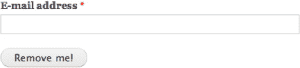

**图 16–5**。基于代码清单 16–24 代码渲染的表单

**代码清单 16–25**。Drupal 为代码清单 16–24 中 `exampleform_unsubscribe()` 表单生成的标记

```html
<form action="/example/unsubscribe" method="post" id="exampleform-unsubscribe" accept-
charset="UTF-8">
  <div>
    <div class="form-item form-type-textfield form-item-email">
      <label for="edit-email">E-mail address
        <span class="form-required" title="This field is required.">*</span>
      </label>
      <input type="text" id="edit-email" name="email" value="" size="60" maxlength="128" class="form-text required" />
    </div>
    <input type="submit" id="edit-submit" name="op" value="Remove me!" class="form-submit" />
    <input type="hidden" name="form_build_id" value="form-jKkl1KLWJLnv0hM4DSVd8-
40boTgBQAzWWhUn44c15Q" />
    <input type="hidden" name="form_token" value="LB07DqsDXK9idWdOHLxUen7jKxm52JqTyHiR7-pNumA"
/>
    <input type="hidden" name="form_id" value="exampleform_unsubscribe" />
  </div>
</form>
```

#### 表单 API 元素与默认属性

在 `exampleform_unsubscribe()` 表单中，你定义了两个表单元素：电子邮件地址元素和提交元素。电子邮件元素的 `#type` 属性是 `textfield`，它提供了一个单行文本输入框。提交元素的 `#type` 是 `submit`，对应于表单 API 中的 `<input type="submit" />`。

如果仔细观察代码清单 16–25 中生成的标记，你会发现你仅为每个元素设置了两个属性，但生成的标记中却包含了一些额外的属性。这是因为 Drupal 为每个元素分配了一组默认属性。在这个例子中，你使用了 `form`、`textfield` 和 `submit` 元素，它们在 `system_element_info()` 中已有定义，如代码清单 16–26 所示。当处理表单时，Drupal 会将表单中定义的属性与默认属性合并。

**代码清单 16–26**。`system_element_info()` 中为 `textfield` 和 `submit` 元素定义的默认属性

```php
<?php
$types['form'] = array(
  '#method' => 'post',
  '#action' => request_uri(),
  '#theme_wrappers' => array('form'),
);
$types['textfield'] = array(
  '#input' => TRUE,
  '#size' => 60,
  '#maxlength' => 128,
  '#autocomplete_path' => FALSE,
  '#process' => array('ajax_process_form'),
  '#theme' => 'textfield',
  '#theme_wrappers' => array('form_element'),
);
$types['submit'] = array(
  '#input' => TRUE,
  '#name' => 'op',
  '#button_type' => 'submit',
  '#executes_submit_callback' => TRUE,
  '#limit_validation_errors' => FALSE,
  '#process' => array('ajax_process_form'),
  '#theme_wrappers' => array('button'),
);
```

 **提示** 此表单只涉及了少数几个表单元素，但 Drupal 拥有许多元素。如需查阅通过表单 API 可用的完整元素列表及其默认属性，请参见 [`http://api.drupal.org/api/file/developer/topics/forms_api_reference.html/7`](http://api.drupal.org/api/file/developer/topics/forms_api_reference.html/7)。

#### 表单元素的渲染

元素属性包含了渲染它们所需的关键信息。在这些属性中，有两个在主题层中非常重要：`#theme` 和 `#theme_wrappers`。当渲染表单时，这些属性告诉 Drupal 使用哪些主题函数。此外，还可以使用 `#pre_render` 属性来定义应在渲染之前执行的函数。

*   `#theme`：指定渲染该元素时要使用的主题函数。

*   `#theme_wrappers`：指定用于包裹该元素已渲染子元素的一个或多个主题函数。

为了说明这个过程，我们使用前面表单中的 `$form['email']` 字段来逐步演示：

1.  调用 `theme('textfield', array('element' => $form['email']))`。这会生成以下标记：`<input type="text" id="edit-email" name="email" value="" size="60" maxlength="128" class="form-text required" />`

2.  调用 `theme('form_element', array('element' => $form['email']))`。这会生成以下标记：

    ```html
    <div class="form-item form-type-textfield form-item-email">
      <label for="edit-email">E-mail address
        <span class="form-required" title="This field is required.">*</span>
      </label>
      <input type="text" id="edit-email" name="email" value="" size="60" maxlength="128" class="form-text required" />
      <!-- 渲染文本字段的结果 -->
    </div>
    ```

3.  最后，在所有表单元素渲染完成后，表单本身会通过 `theme_form()` 进行处理，该函数在表单元素的 `#theme_wrappers` 中指定。`theme_form()` 函数负责生成表单标记的其余部分，包括隐藏元素 `form_build_id`、`form_token` 和 `form_id`。

 **警告** 如之前所述，切勿使用 `theme_` 直接调用主题函数，同样地，在 `#theme` 和 `#theme_wrappers` 中填入主题函数时也不带 `theme_` 前缀。

### 主题化表单的第一步

#### 查找表单 ID

在你开始任何操作之前，需要找到正在处理的表单的 ID。它在每个表单的标记中出现在以下两个位置：

1.  表单底部附近有一个名为 `form_id` 的隐藏字段，其中包含你要找的内容。`<input type="hidden" name="form_id" value="exampleform_unsubscribe" />`

2.  尽管不能直接复制粘贴使用，因为 `<form>` 的 ID 属性中单词之间使用短横线（-）而非下划线（_）分隔，但它也包含表单 ID。`<form id="exampleform-unsubscribe">`

每个表单 ID 都有一个对应的函数，该函数遵循 Drupal 模块命名约定。在此示例中，`exampleform` 是模块名称，`unsubscribe` 是该模块为表单指定的名称。

在进行主题化时，有时查看原始表单和代码注释会有所帮助。你通常可以在创建该表单的模块的 `.module` 文件中找到生成表单的原始函数。如果你发现表单不在 `.module` 文件中，那么它肯定在模块内的某个地方，但你可能需要四处查找。有时开发者会出于组织结构和代码效率的考虑使用 `.inc` 文件。

### 实现 `hook_theme()`

为了能在表单中使用模板文件、预处理函数或处理函数，首先需要将表单 ID 注册为主题钩子。这一步是必要的，这样 Drupal 才能识别该主题钩子。Drupal 核心已为某些表单（主要是使用表格的管理表单）注册了主题钩子，但你可能仍需要手动完成这一操作。

在你的主题的 `template.php` 文件中，创建一个 `hook_theme()` 的实现，并将主题名称替换钩子前缀。举个例子，当联系人模块启用时，你需要为位于 `/contact` 的联系表单（其表单 ID 为 `contact_site_form`）设置主题。在实现中，将表单 ID 作为键，并将渲染元素指定为 `form`，如清单 16–27 所示。对于使用渲染 API 生成标记（例如表单）的主题钩子，`render element` 键是必需的。其值表示保存可渲染元素的变量名称，在本例中为 `form`。

***清单 16–27**：将 `contact_site_form()` 主题钩子定义为渲染元素“form”的 `hook_theme()` 实现*

```php
<?php
/**
 * Implements hook_theme().
 */
function THEMENAME_theme() {
  return array(
    // 将表单 ID 定义为主题钩子。
    'contact_site_form' => array(
      // 指定 'form' 作为渲染元素。
      'render element' => 'form',
    ),
  );
}
```

完成上述操作并清除缓存后，你就可以为该表单创建主题函数，并使用预处理函数和处理函数了。这些将在本章后续内容中介绍。

 **提示**：注册主题钩子时，如果不确定如何填写，可以查看一些默认实现。在本例中，你处理的是一个表单，因此快速查阅 [`http://api.drupal.org/api/function/drupal_common_theme/7`](http://api.drupal.org/api/function/drupal_common_theme/7) 可以找到原始表单主题钩子的默认值，而这正是你需要的。

### 使用主题函数为表单设置主题

选择使用主题函数还是模板文件，是个人或团队偏好的问题。如果你熟悉 PHP，可能会倾向于使用主题函数；如果不熟悉，则可能更喜欢模板文件（下一节将介绍）。

如前所述，你需要一个 `hook_theme()` 的实现，且不包含模板或路径索引，如清单 16–28 所示。完成此操作后，`hook_contact_site_form()` 成为一个官方的主题钩子，可以像其他任何主题函数一样被覆盖。即使 `theme_contact_site_form()` 函数本身并不存在，你仍然可以像覆盖其他主题函数一样命名它：`THEMENAME_contact_site_form()`。

***清单 16–28**：使用主题函数为表单设置主题所需的基本代码*

```php
<?php
/**
 * Implements hook_theme().
 */
function dgd7_theme() {
  return array(
    'contact_site_form' => array(
      'render element' => 'form',
    ),
  );
}

/**
 * Implements theme_forms_contact_site_form().
 */
function dgd7_contact_site_form($variables) {
  // 渲染表单的所有元素。
  return drupal_render_children($variables['form']);
}
```

### 必须使用 `drupal_render_children()`！

`drupal_render_children()` 负责渲染表单的所有子元素。仅此函数就能产生 Drupal 在没有你的主题函数时本应提供的完全相同代码，这使得清单 16–28 中的函数本身毫无用处。但值得强调的是，**始终**在函数底部使用 `drupal_render_children($variables['form'])` 非常重要。

即使你对添加到表单的每个元素都调用了`render()`，Drupal 也会添加一些用于标识表单的重要隐藏元素，这些元素也需要被渲染。因此，在主题函数末尾调用`drupal_render_children($form)`是强制性的。这不会重新打印`$form['foo']`，因为`drupal_render()`知道它已经打印过了。此外，它还能处理其他模块添加的任何额外元素。

### 在主题函数中操作表单元素

既然已经了解了基础，现在让我们对标记做一些更改。与任何主题函数一样，该函数返回的代码将直接插入页面标记中。由于表单是渲染元素，你需要渲染它们。清单 16–29 中的代码执行了以下操作：

1.  更改“姓名”和“邮件”元素的标签。

2.  单独渲染“姓名”和“邮件”元素。

3.  将标记和单独渲染的元素放入一个名为`$output`的变量中。

4.  在主题函数的底部，将`drupal_render_children($form)`包含到`$output`中。

5.  最后，返回`$output`。

**清单 16–29**：实现`theme_contact_site_form()`

```php
<?php
/**
 * Implements theme_contact_site_form().
 */
function dgd7_contact_site_form($variables) {

  // 隐藏“主题”字段。它不是必填项。
  hide($variables['form']['subject']);

  // 更改“姓名”和“邮件”文本字段的标签。
  $variables['form']['name']['#title'] = t('Name');
  $variables['form']['mail']['#title'] = t('E-mail');

  // 以任何你喜欢的方式创建输出。
  $output = '<div class="something">';
  $output .= '<p class="note">'. t("We'd love hear from you. Expect to hear back from us in 1-2 business days.") .'</p>';
  $output .= render($variables['form']['name']);
  $output .= render($variables['form']['mail']);
  $output .= '</div>';

  // 确保包含剩余表单元素的渲染版本。
  $output .= drupal_render_children($variables['form']);

  // 返回输出。
  return $output;
}
```

表单及其内容是渲染元素，因此你可以使用`hide()`、`show()`和`render()`函数来操作表单的元素。在主题函数中使用`hide()`或对表单数组进行更改时，需要确保在尝试渲染之前完成这些操作。还有很多其他可能实现的操作，我们无法在此一一列举，但以下是一些快速示例，展示了可以做什么：

*   调整元素的`#weight`属性以改变它们的打印顺序。以下代码会导致“消息”元素打印在表单顶部：

    ```php
    $variables['form']['message']['#weight] = -10;
    $variables['form']['message']['#sorted] = FALSE;
    ```

*   通过设置元素的`#description`属性，在元素下方添加描述，如下所示：

    ```php
    $variables['form']['mail']['#description'] = t(" We won't share your e-mail with anyone. ");
    ```

*   设置表单元素的默认值，例如默认勾选“给自己发送副本”复选框，方法是将`#checked`属性设置为`TRUE`，如下所示：

    ```php
    $variables['form']['copy']['#checked'] = TRUE;
    ```

*   取消设置`#theme_wrappers`属性，以移除标签和包装`<div>`，并完全按照你的意愿重新创建标记，如下所示：

    ```php
    unset($variables['form']['mail']['#theme_wrappers]);
    ```

*   更高级的更改包括使用`theme_table()`函数使表单以表格形式显示。

*   等等！

 **提示**：使用主题函数在性能上略优于模板，但差异非常微小。在决定使用模板文件还是主题函数时，不需要担心性能问题。

#### 使用模板文件为表单设置主题

根据你已经学到的知识，为表单创建模板文件出奇地简单。正如“表单主题化的第一步”部分所述，你需要打开 `template.php` 并实现一个 `hook_theme()` 函数。除了定义渲染元素之外，你还需要额外添加两项内容，如清单 16–30 所示：

1. 一个 `path` 键（可选），其中包含模板文件在你主题中的路径。

2. 一个 `template` 键，其中包含模板文件的名称（不含 `.tpl.php` 后缀）。

 **注意** 以这种方式定义的模板文件不会被自动发现。如果省略了路径，Drupal 只会到主题的根目录中寻找你的模板文件。只有当你的模板文件位于主题的子目录中时，才需要指定模板目录的路径。

**清单 16–30**。 为表单使用模板而实现的 `hook_theme()` 函数

```php
<?php
/**
 * 实现 hook_theme()。
 */
function mytheme_theme() {
  return array(
    'contact_site_form' => array(
      'render element' => 'form',
      'path' =>  drupal_get_path('theme', 'mytheme') . '/templates',
      'template' => 'contact-site-form',
    ),
  );
}
```

创建了清单 16–30 中所示的 `hook_theme()` 函数后，你需要创建模板文件。在本例中，该文件位于你主题的 templates 目录内：

`sites/all/themes/mytheme/templates/contact-site-form.tpl.php`。

完成后，只需清除缓存，Drupal 就会开始使用你的模板文件。

如果你的文件最初是空的，你会得到一个空白页面，而表单原本应该在那里。你首先应该做的是在模板文件中添加这行代码：`<?php print drupal_render_children($form); ?>`。这将恢复整个表单，即使你可能不想保留表单中的所有内容，也必须在表单底部打印这些内容，以确保一切正常运作，正如我们在“必须使用 `drupal_render_children()！`”部分中详细说明的那样。

#### 在模板文件中操作表单元素

为了详细讨论这个话题，我们使用“在主题函数中操作表单元素”部分中的例子。清单 16–31 中的代码代表了完成以下任务的结果：

1.  更改用户名和邮件元素的标签。

2.  单独渲染用户名和邮件元素。

3.  按照你的需求排列标记语言和单独渲染的元素。

4.  最后，在模板底部打印 `drupal_render_children($form)`。

**清单 16–31**。 联系表单的 `contact-site-form.tpl.php` 实现

```php
<?php // 更改"name"和"mail"文本字段的标签。
$form['name']['#title'] = t('名称');
$form['mail']['#title'] = t('电子邮箱');
?>

<?php // 单独渲染"name"和"mail"元素并添加标记。 ?>
<div class="name-and-email">
  <p><?php print t("我们很期待收到您的来信。预计 1-2 个工作日内回复。") ?></p>
  <?php print render($form['name']); ?>
  <?php print render($form['mail']); ?>
</div>

<?php // 确保渲染其余的表单项。 ?>
<?php print drupal_render_children($form); ?>
```

虽然存在细微差别，但大体上是相同的（并且使用了更少的 PHP）。所有适用于主题函数的可能性也同样适用于模板文件。变量本身略有不同。在主题函数和预处理函数中，`name` 元素位于 `$variables['form']['name']`。而在模板文件中，同一个变量则是 `$form['name']`。这样做特意是为了让模板作者更容易处理 Drupal 庞大的数组结构。

 **注意** 请确保不要隐藏或省略必填的表单元素。在 Drupal 中，呈现层与表单处理是完全分离的。Drupal 会期望这些元素存在，如果它们没有被填充，表单将无法提交。这类更改应在 `hook_form_alter()` 实现中进行，并使用 `#access` 属性。更多信息请参见“使用 Alter 钩子修改表单”部分和第 22 章。

#### 使用预处理函数让模板更简洁

在我们使用模板文件为表单设置主题的例子中，模板相当混乱。一个干净模板文件的定义是几乎不包含任何逻辑，只打印变量，偶尔可能有一个 IF 语句。如果你对模板文件的外观不满意，这正是使用预处理函数的绝佳时机。为了使其真正干净，你需要在预处理函数中执行以下操作：

-   对表单数组执行所有修改。

-   创建所有新变量。

-   单独渲染每个字段，并为模板提供简单的变量。

当然，这并不是你希望对你网站上的每个表单都做的事情。然而，对于你想要额外精心处理的、面向用户的高度样式化的表单（例如登录、注册和联系表单），这是非常有用且便捷的。这个过程非常简单，如清单 16–32 中使用联系表单所示。

***清单 16–32.** 使用预处理函数为模板完成繁重工作*

```
<?php
/**
 * 实现 hook_preprocess_contact_site_form()。
 */
function mytheme_preprocess_contact_site_form(&$variables) {
  // 缩短表单变量名以便于访问。
  $form = $variables['form'];

  // 更改'mail'和'name'元素的标签。
  $form['name']['#title'] = t('名称');
  $form['mail']['#title'] = t('电子邮箱');

  // 为你的提示信息创建一个新变量。
  $variables['note'] = t("我们很期待收到您的来信。预计 1-2 个工作日内回复。");

  // 为各个元素创建变量。
  $variables['name'] = render($form['name']);
  $variables['email'] = render($form['mail']);
  $variables['subject'] = render($form['subject']);
  $variables['message'] = render($form['message']);
  $variables['copy'] = render($form['copy']);

  // 确保打印其余已渲染的表单项。
  $variables['children'] = drupal_render_children($form);
}
```

因为你已经在预处理函数中完成了所有工作，清单 16–33 中的模板文件就变得非常清晰整洁。添加标记和类、移动元素都变得轻而易举，而且一眼就能看出这个模板文件的功能。

***清单 16–33**。 预处理函数可以为联系表单提供一个简洁、最小的模板。*

```
<p class="note"><?php print $note; ?></p>
<p><span class="form-required">*</span><?php print t("表示必填字段。"); ?></p>
<ol>
  <li><?php print $name; ?></li>
  <li><?php print $email; ?></li>
  <li><?php print $subject; ?></li>
  <li><?php print $message; ?></li>
  <li><?php print $copy; ?></li>
</ol>
<?php print $children; ?>
```

好的，作为高级文档工程师和翻译员，我将遵循您提供的注意事项和示例，精确地将以下英文文本翻译成中文。

#### 使用 Alter 钩子修改表单

主题使用 alter 钩子的能力是 Drupal 7 的新特性。当您希望对标记本身有大量控制时，模板非常有用，但在很多情况下，简单地使用 `hook_form_alter()` 可以大大简化工作，尤其是当您对 Drupal 的默认表单标记感到满意，或者结合您可以通过主题函数在全局范围内进行的更改时。使用 alter 钩子非常适合进行快速更改，例如：

*   简单更改表单标签、描述和其他属性。

*   使用 `#weight` 属性更改表单元素的打印顺序。

*   将几个元素包裹在 `<div>` 或 `<fieldset>` 中。

*   隐藏或移除不必要的表单元素。

*   向表单添加一些标记。

这也可以说是更简单的，因为过程中涉及的步骤更少。您不需要实现 `hook_theme()`。您还可以完全控制元素。在主题函数中能做的更改有一定的局限性，因为那时已经处于过程的后期。

从技术上讲，有两个钩子可供您使用。

*   `hook_form_alter()`：针对所有表单运行。

*   `hook_form_FORM_ID_alter()`：针对特定的表单 ID 运行。

一直使用 `hook_form_alter()` 而不是 `hook_form_FORM_ID_alter()` 是有原因的，但这些原因主要适用于模块开发者需要执行的任务。除非您特别针对多个表单做相同的处理，如 清单 16–34 所示，否则最好使用 `hook_form_FORM_ID_alter()`，如 清单 16–35 所示。

**清单 16–34.** 针对所有或多个表单的 `hook_form_alter()` 实现

```
<?php
/**
* Implements hook_form_alter().
*/
function mytheme_form_alter(&$form, &$form_state, $form_id) {
  // Changes made in here affect ALL forms.
  if (!empty($form['title']) && $form['title']['#type'] == 'textfield') {
    $form['title']['#size'] = 40;
  }
}
```

**清单 16–35.** 针对特定表单的 `hook_form_FORM_ID_alter()` 实现

```
<?php
/**
* Implements hook_form_FORM_ID_alter().
*/
function mytheme_form_contact_site_form_alter(&$form, &$form_state) {
  // Add a #markup element containing your note and make it display at the top.
  $form['note']['#markup'] = t("We'd love hear from you. Expect to hear back from us in 1-2 business days.");
  $form['note']['#weight'] = -1;

  // Change labels for the 'mail' and 'name' elements.
  $form['name']['#title'] = t('Name');
  $form['mail']['#title'] = t('E-mail');

  // Hide the subject field and give it a standard subject for value.
  $form['subject']['#type'] = 'hidden';
  $form['subject']['#value'] = t('Contact Form Submission');
}
```

### 管理 CSS 文件

每个优秀的 Drupal 主题都需要一两张样式表，或者十张！在您开始设计主题之前，可能会被 Drupal 加载的大量 CSS 文件数量打个措手不及。作为一个模块化的框架，Drupal 对 CSS 样式表和 JavaScript 文件也采用了同样的方法。CSS 和 JavaScript 文件由各个模块分别提供——有时每个模块会提供几个文件。这样做是有意为之，原因如下：

*   更易于阅读并理解代码的用途及其所属模块。

*   允许 Drupal 仅加载当前页面所需的代码。

*   便于 Drupal 维护这些文件及其内容。

也就是说，在 Drupal 的主题层，您可以完全控制所有样式表和脚本。实际上，您可以对它们做任何想做的事。如果您决定不加载模块中的任何样式表，您可以将它们全部移除。如果您对某些文件不满意，可以通过删除或覆盖它们并在主题内更改其内容来单独覆盖它们。如果您愿意，甚至可以更改文件的加载顺序。本节将向您展示如何完成所有这些操作。

### 聚合与压缩

如前所述，Drupal 有很多样式表。当然，出于性能考虑，您希望尽可能减少在线网站上的文件数量，因此 Drupal 有一种处理方式。在开发过程中，处理 10 到 40 个 CSS 文件是常态，如果您工作在显示从右到左文本的语言的网站上，文件数量甚至更多。在 `admin/config/development/performance` 的性能设置部分，有聚合和压缩 CSS 与 JavaScript 文件的选项。开启后，Drupal 会尽可能地将文件压缩并合并到尽量少的自动生成文件中。这也有效地绕过了 Internet Explorer 的 31 个样式表限制 bug。Drupal 以两种方式聚合文件：它为会在每个页面加载的文件创建一个按站点聚合的文件，并为其余根据页面条件加载的文件创建按页面聚合的文件。对于 CSS 文件，它会进一步按媒体类型进行聚合。为了保持正确性，如果 CSS 和 JavaScript 文件的内容发生更改，当站点缓存被清除时，Drupal 将重新生成这些文件的聚合版本，并赋予它们不同的名称。强烈建议在所有在线站点上启用 CSS 文件的聚合和压缩，这将大大加快页面加载速度。这个过程非常有效，允许主题制作者和开发者继续以模块化方式开发网站，而无需担心 CSS 文件的数量。

 **注意：** 不要在 Drupal 内部手动使用 `@import` 指令加载 CSS 文件。这样做会导致性能问题，并且当与 `<link>` 方式引入的样式表结合时，可能会产生聚合问题，还会导致这些文件被排除在覆盖功能之外。

### 模式与命名约定

在您的主题中，您可以随意命名 CSS 文件。许多主题倾向于创建一个名为“css”的目录，并在其中放置几个样式表。创建一个 `layout.css` 用于页面布局样式，和 `style.css` 用于其余样式，这是非常常见的。有些主题，比如 Zen，则更进一步，使用了近 30 个样式表。如何组织您的 CSS 完全取决于您。主题可以使用多少个样式表没有限制。大多数前端开发者都有自己的工作方式，Drupal 很乐意遵从。

### 核心与模块 CSS 文件

大多数提供 CSS 的模块通常会在模块目录的根目录中包含一个名为 `module-name.css` 的文件。有些模块会有几个 CSS 文件，而更好的模块会为用于样式化管理界面的任何 CSS 创建一个单独的文件。模块的 CSS 文件数量或组织结构没有限制，但通常建议开发者保持克制，尽可能少地对元素进行样式化。

另外值得一提的是，Drupal 的系统模块位于 `modules/system` 中，它包含了不少 CSS 文件，这些文件似乎都堆放在那里，因为没有更好的地方放置它们。表 16-3 对每个文件进行了简要说明，以便您了解它们的用途，并决定是否在您的主题中保留它们。

**表 16-3.** 系统模块的 CSS 文件（不包括 RTL 版本）

| **CSS 文件** | **用途** | **加载时机…** |
| --- | --- | --- |
| `system.base.css` | 包含某些功能严重依赖的 CSS，例如可折叠字段集、自动补全字段、可调整大小的文本区域和进度条。 | 每个页面。 |
| `system.theme.css` | 包含许多通用 HTML 和 Drupal 元素的通用样式。 | 每个页面。 |
| `system.menus.css` | 包含菜单树列表、选项卡和节点链接的默认样式。 | 每个页面。 |
| `system.messages.css` | 包含错误、警告和状态消息的默认样式。 | 每个页面。 |
| `system.admin.css` | 包含 Drupal 管理页面所需的样式。 | 管理页面。 |
| `system.maintenance.css` | 包含安装、维护和更新任务的样式。 | 维护页面。 |

### 双向文本支持

Drupal 为人称道的一点是其出色的语言支持。这包括对双向文本的支持。虽然大多数语言在屏幕上从左到右（LTR）显示文本，但某些语言，如阿拉伯语和希伯来语，则在屏幕上从右到左（RTL）显示文本。浏览器通过读取 `<html>` 标签中定义的 `dir` 属性并使用用户代理 CSS 文件来处理大部分所需的样式差异，但很多时候，CSS 中的浮点、文本对齐和内边距需要特别处理，尤其是当您运营一个多语言网站时。

Drupal 基于 CSS 文件命名约定自动处理 RTL 样式表。如果您有一个名为 `style.css` 的样式表，其中包含站点 LTR 版本的 CSS，您可以简单地创建另一个名为 `style-rtl.css` 的文件，其中包含修复 RTL 版本显示所需的调整。Drupal 会在需要时自动加载它，并直接放在原始文件之后，这样可以使用相同的选择器，并且 RTL 样式会利用原生的 CSS 级联特性覆盖 LTR 样式。在为同时支持 LTR 和 RTL 显示的网站编写 CSS 时，习惯做法是先为 LTR 版本编写 CSS，同时通过注释记录哪些属性需要更改。这是 Drupal 为核心和贡献模块的 CSS 文件采用的一项编码标准。列表 16-36 展示了一个示例。

**列表 16-36.** 标注了 LTR 属性和 RTL 版本的 CSS 示例

```
// 在 style.css 中:
// .my-selector 将内容向左浮动，这是 LTR 特有的，因此添加了一个内联注释来注明这一点。
.my-selector {
  border: solid 1px #ccc;
  float: left; /* LTR */
}

// 在 style-rtl.css 中:
// .my-selector 的 RTL 版本需要被覆盖，并且向右浮动而不是向左。
.my-selector {
  float: right;
}
```

### 添加、移除和替换 CSS 文件

在 Drupal 主题中有三种操作 CSS 文件的方法。本节将解释每种实现选项是什么、每种方法的原因，以及何时使用某些方法比其他方法更有利。

#### 通过 `.info` 文件的“快速而粗糙”的样式表

通过主题的 `.info` 文件添加样式表是向主题添加 CSS 文件最简便的方法；参见列表 16-37 和列表 16-38。然而，在某些情况下这种方法也有一些缺点。

1.  您在 `.info` 文件中定义的任何样式表都将在每个页面上加载。

2.  您无法完全使用 `drupal_add_css()` 提供的功能。例如，您无法在 `.info` 文件中为 Internet Explorer 添加条件样式表，或更改某个模块 CSS 文件的权重。

**列表 16-37.** 添加样式表的 `.info` 语法

```
stylesheets[CSS 媒体类型][] = path/to/file.css
```

**列表 16-38.** 典型的 `.info` 样式表定义示例

```
stylesheets[all][] = css/layout.css
stylesheets[all][] = css/style.css
stylesheets[print][] = css/print.css
```

> **注意：** 也可以通过在 `.info` 文件中为某个文件创建一个条目（就像要覆盖它一样），但实际上不将该文件包含在主题目录中，从而移除样式表。但是，存在一个 bug，可能导致这些样式表在执行 AJAX 渲染时重新出现。为了安全起见，最好在 `hook_css_alter()` 中移除样式表；这将在本节后面解释。

#### 使用 `drupal_add_css()` 有条件地加载样式表

`drupal_add_css()` 是模块和主题通过 PHP 代码添加 CSS 文件的主要函数。一些主题在它们的 `template.php` 文件中使用它，通常是在预处理函数中。与在 `.info` 文件中定义 CSS 文件相比，在主题层使用 `drupal_add_css()` 的一个优点是，可以根据特定条件或上下文有条件地加载文件。例如，您可能想要创建一个仅在网站首页加载的特殊 CSS 文件。在主题的 `template.php` 中，您可以在 `template_preprocess_html()` 中实现，如列表 16-39 所示。

**列表 16-39.** 添加一个仅在首页加载的样式表

```php
<?php
function mytheme_preprocess_html(&$variables) {
  // 添加一个仅在首页打印的样式表。
  if ($variables['is_front']) {
    drupal_add_css(path_to_theme() . '/css/homepage.css', array('weight' => CSS_THEME));
  }
}
```

在 Drupal 中使用 `drupal_add_css()` 向页面添加 CSS 有许多不同的选项，其中一些包括：

-   将类型指定为“inline”，以便在 `<head>` 内直接打印一段 CSS 代码块，而不是添加一个 CSS 文件。

-   使用常量如 `CSS_SYSTEM`（顶部）、`CSS_DEFAULT`（中间）和 `CSS_THEME`（底部）来指定文件的组，以确定文件应出现的位置。

-   指定文件的权重来控制它在组内加载的顺序。

-   添加条件样式表以便为不同浏览器提供不同文件。

-   添加外部托管的 CSS 文件。

-   强制某个 CSS 文件不被合并和压缩。

#### 为 Internet Explorer 添加条件样式表

根据撰写本文时的维基百科数据显示，约 43%的用户使用 Internet Explorer 访问网页。虽然不同数据来源的统计结果存在差异，但对许多开发者而言，支持旧版 IE 仍是现实需求。当需要编写针对 IE 的 CSS 时，使用条件样式表被认为是最佳实践。

Drupal 7 的一项重要新特性是可以通过 `drupal_add_css()` 添加条件样式表。实际上，Drupal 所有三个核心主题都在 `template_preprocess_html()` 中实现了这一功能。之所以在 `template.php` 中处理，是因为 `.info` 文件对 `drupal_add_css()` 的支持非常有限。清单 16-40 和 清单 16-41 以 Seven 主题的代码为例展示了具体实现方式。

**清单 16-40** Seven 主题片段：在 `template_preprocess_html()` 中使用 `drupal_add_css()` 为 IE 添加条件样式表

```php
<?php
function seven_preprocess_html(&$vars) {
// 为 IE8 及以下版本添加条件 CSS。
  drupal_add_css(path_to_theme() . '/ie.css', array('group' => CSS_THEME, 'browsers' => array('IE' => 'lte IE 8', '!IE' => FALSE), 'preprocess' => FALSE));
  // 为 IE6 添加条件 CSS。
  drupal_add_css(path_to_theme() . '/ie9781430231356.css', array('group' => CSS_THEME, 'browsers' => array('IE' => 'lt IE 7', '!IE' => FALSE), 'preprocess' => FALSE));
}
```

**清单 16-41** 添加 IE 条件样式表后生成的 HTML 源码

```html
<!--[if lte IE 8]>
<link type="text/css" rel="stylesheet" href="http://drupal-7/themes/seven/ie.css?l40z2j" media="all" />
<![endif]-->

<!--[if lt IE 7]>
<link type="text/css" rel="stylesheet" href="http://drupal-7/themes/seven/ie9781430231356.css?l40z2j" media="all" />
<![endif]-->
```

清单 16-40 和 清单 16-41 中的代码为您提供了两个仅针对 Internet Explorer 加载的条件样式表。第一个样式表适用于 IE8 及以下版本，第二个样式表适用于 IE7 之前的版本。

#### 使用 `hook_css_alter()` 完全控制样式表

Drupal 核心和模块通过 `drupal_add_css()` 函数逐一添加 CSS 文件。在 `template_process_html()` 执行过程中，会创建名为 `$styles` 的变量，该变量包含为每个页面指定的所有样式表的完整 HTML 输出。此变量最终在 `html.tpl.php` 模板文件的 `<head>` 标签内输出，如清单 16-42 所示。

**清单 16-42** `$styles` 变量在 `template_process_html()` 中创建，供 `html.tpl.php` 使用

```php
<?php
/**
* 实现 template_process_hmtl()。
*/
function template_process_html(&$variables) {
  ...
  $variables['styles'] = drupal_get_css();
  ...
}
```

在调用 `drupal_get_css()` 过程中，Drupal 会收集所有先前添加的 CSS 文件，并通过调用 `drupal_alter('css', $css)` 为模块或主题提供修改机会。此时，Drupal 会查找模块和主题中符合 `hook_css_alter()` 命名模式的函数，函数名中的 "hook" 会被实际实现它的模块或主题名替换。此函数允许对 CSS 文件的所有方面进行最精细的控制。

Locale 模块是展示模块为何需实现 `hook_css_alter()` 的典型案例。该模块会检查语言方向是否为从右到左（RTL），如果是，则查找相应的 RTL 版本 CSS 文件并将其添加到页面中。

在主题中，实现 `hook_css_alter()` 的主要目的是移除或覆盖模块提供的 CSS 文件。在 Seven 主题的 `template.php` 文件底部可以找到相关示例（见清单 16-43）。Seven 主题选择使用自己的版本覆盖核心提供的 `vertical-tabs.css` 样式表。

**清单 16-43** Seven 主题的 `hook_css_alter()` 实现

```php
<?php
/**
 * 实现 hook_css_alter()。
 */
function seven_css_alter(&$css) {
  // 使用 Seven 的垂直选项卡样式替换默认样式。
  if (isset($css['misc/vertical-tabs.css'])) {
    $css['misc/vertical-tabs.css']['data'] = drupal_get_path('theme', 'seven') . '/vertical-tabs.css';
  }
  // 使用 Seven 的 jQuery UI 主题样式替换默认样式。
  if (isset($css['misc/ui/jquery.ui.theme.css'])) {
    $css['misc/ui/jquery.ui.theme.css']['data'] = drupal_get_path('theme', 'seven') . '/jquery.ui.theme.css';
  }
}
```

 **注意** 在 `.info` 文件中覆盖模块的 CSS 文件（创建同名 CSS 文件条目）虽然可行，但效率并非最优。在 `.info` 文件中定义的样式表会在每个页面加载，而不会考虑实际是否需要。而使用 `hook_css_alter()` 则不同，它在替换文件之前会确保目标文件已设置为加载状态。

#### 在主题中管理样式表

在本节中，您已学习多种在 Drupal 主题层操作 CSS 文件的方法。下面将通过实际案例再次梳理操作步骤。

**练习 A：在 .info 文件中为所有页面定义样式表**

1.  在主题目录 `sites/all/themes/mytheme` 中新建名为 `css` 的子文件夹（此步可选，但有助于主题文件组织）。

2.  在 `css` 目录中创建 `style.css` 和 `print.css` 两个文件。

3.  打开 `sites/all/themes/mytheme/mytheme.info` 文件，添加以下两行代码定义样式表，使 Drupal 知晓需加载它们：`stylesheets[all][] = css/style.css` `stylesheets[print][] = css/print.css`

4.  访问 `admin/config/development/performance` 清除网站缓存。返回网站前端页面后，您会发现两个文件均已成功加载。

**练习 B：使用 `drupal_add_css()` 为 IE 添加条件样式表**

1.  在`css`目录内创建一个名为`ie.css`的文件。

2.  如果尚未创建，在主题根目录创建一个名为`template.php`的文件，并确保在文件顶部包含`<?php`。

3.  使用以下代码实现`template_preprocess_html()`并通过`drupal_add_css()`加载 IE 样式表：

```php
<?php
/**
* Implements of template_preprocess_html().
*/
function mytheme_preprocess_html(&$vars) {
  // Add conditional stylesheet that targets Internet Explorer 8 and below.
  drupal_add_css(path_to_theme() . '/css/ie.css', array('weight' => CSS_THEME, 'browsers' => array('IE' => 'lte IE 8', '!IE' => FALSE), 'preprocess' => FALSE));
}
```

**练习 C：使用`drupal_add_css()`为主页添加自定义样式表**

你需要使用已存在的`$is_front`变量来检测是否正在显示主页，然后添加`homepage.css`样式表。将此代码直接添加到你在练习 B 中添加的条件样式表代码上方。

```php
<?php
// Add a stylesheet that prints only on the homepage.
if ($variables['is_front']) {
  drupal_add_css(path_to_theme() . '/css/homepage.css', array('weight' => CSS_THEME));
}
```

**练习 D：使用`hook_css_alter()`覆盖并移除模块 CSS 文件**

要实现`hook_css_alter()`，你需要在`template.php`文件中创建一个名为`mytheme_css_alter()`的函数。通过引用传递的`$css`参数以数组格式包含所有样式表，你可以对其进行任意操作。以下代码展示了如何移除`node.css`文件（如果它被设置为加载）。

```php
<?php
function mythemename_css_alter(&$css) {
  // Remove the node.css file.
  if (isset($css['modules/node.css'])) {
    unset($css['modules/node.css']);
  }
}
```

### 使用基础主题和子主题

很可能你有自己固定的做事方式。你可能倾向于在所有主题中以类似的方式构建标记。你可能经常覆盖某些主题函数，或者有自己独特的表单样式风格，或者你可能倾向于在布局中使用特定的网格框架。这些都是利用 Drupal 的基础主题和子主题功能的好理由。

子主题与其基础（父）主题有特殊的关系。它们从父主题继承模板文件和资源。这使得它们成为简化主题工作流、创建自己的 Drupal 主题“框架”或“重置”的绝佳工具。当然，你也可以使用现有的基础主题。Drupal 提供了相当多的基础主题，我们将在本节稍后部分详细介绍。

#### 创建子主题

从特性上讲，基础主题和子主题都是普通的 Drupal 主题，任何主题都可以作为基础主题。创建子主题的过程非常直接。

1.  首先创建一个新主题的骨架。为其创建一个目录，并创建包含至少`name`和`core`属性的`.info`文件。

2.  在`.info`文件中，添加“base theme”属性，其中包含你想用作基础的主题名称，如下所示：`base theme=basethemename`

3.  如果基础主题在`.info`文件中定义了区域和/或功能，你需要在子主题中复制这些内容。

对于基本的 Drupal 主题，创建子主题只需这三步。完成这些后，你就可以在`admin/appearance`页面启用该主题。同样值得注意的是，你使用的基础主题无需在 UI 中启用即可正常运行。

 **注意** 大多数流行的贡献基础主题需要更多配置。像 Zen、Omega 和 Fusion 这样的主题带有一个 starterkit 或 starter 目录，你可以复制并使用它来开始你的子主题。请务必参考每个主题的`README.txt`文件以获取完整的开始使用说明，因为每个主题都不同。

#### 继承及其工作原理

你已经知道 Drupal 在其模块中提供了大量标记，这些标记以模板、主题函数或渲染 API 的形式出现。在 Drupal 主题中，你有机会覆盖并接管这种行为。所以，从技术上讲，你首先是继承了它。使用子主题允许你在这个流程中再增加一步。当使用父主题时，所有资源——包括模板文件、CSS 文件、JavaScript 文件、主题函数以及`template.php`中的几乎所有内容——都会被继承。

在基础主题中定义的 CSS、JavaScript、模板文件和主题函数将自动对子主题可用。子主题无需做任何事即可实现这一点。预处理和处理函数将为基础主题和子主题同时运行，因此它们可以同时、无问题地在两个主题中使用。当然，子主题可以覆盖基础主题所做的任何事情。

有些事情并非如此。区域不会被继承，功能和主题设置也不会被继承。为了使它们正常工作，你必须将信息从基础主题复制到子主题的`.info`文件中。表 16–4 显示了哪些资源是自动继承的，哪些不是。

***表 16–4**。从基础主题到子主题的资源继承*

| **资源** | **是否自动继承？** |
| --- | --- |
| CSS 文件 | 是 |
| JavaScript 文件 | 是 |
| 模板文件 | 是 |
| 主题截图 | 是 |
| 区域 | 否 |
| 主题设置 | 否 |

#### 找到一个好的基础主题

在 [`http://drupal.org/project/Themes`](http://drupal.org/project/Themes) 上有数千个贡献主题。不幸的是，Drupal 主题以丑陋著称。虽然这有一定道理，但其中也有许多精品；你只需要知道要找什么。`drupal.org`上的主题根据项目使用统计数据按人气排序，因此很容易看出哪些主题最受欢迎。然而，人气并不总是最佳衡量标准。在评估贡献的 Drupal 主题时，你需要了解几件事。

*   *类型：* `drupal.org`上的所有主题都被归为一个未分类的列表中。正如你在 [`http://drupal.org/project/themes`](http://drupal.org/project/themes) 上看到的，首页上的大部分主题都是基础主题。虽然任何主题在技术上都可以用作基础主题，但阅读项目信息以了解预期功能很重要。如果你没有按照维护者的预期方式使用主题，他们帮助你解决问题的意愿会大大降低。

*   *维护和开发状态：* 每个项目都有维护状态和开发状态，可以在项目页面上查看。这些信息能让你很好地了解模块的支持情况。如果项目有“积极维护”的维护状态和“积极开发中”的开发状态，那么模块开发者很可能有意修复 bug，并愿意接受在问题队列中提出的功能请求。

*   *使用统计：* 在每个项目页面上，“项目信息”部分包含了报告的安装数量和一个名为“查看使用统计”的链接，该链接显示了一个长期的数据图表和表格，以及数据随时间的变化。使用统计可以很好地指示一个主题是否经过了充分测试。如果很多人使用它，或者它显示出稳定的增长，那么它很可能是一个更好的主题。

*   *问题队列：* 大多数项目都有问题队列，用户可以在其中报告 bug 和请求功能。阅读问题队列是衡量项目社区参与度的好方法。这也是了解主题可能存在的 bug 以及社区和维护者对这些问题响应速度的好方法。

### 热门基础主题

`drupal.org` 上经验丰富的主题开发者提供了许多优秀的主题。可用的基础主题或“入门”主题的完整列表，请访问 [`http://drupal.org/node/323993`](http://drupal.org/node/323993)。以下是一些最流行的 Drupal 7 基础主题：

> *Zen:* [`http://drupal.org/project/zen`](http://drupal.org/project/zen)

> *Fusion:* [`http://drupal.org/project/fusion`](http://drupal.org/project/fusion)

> *AdaptiveTheme:* [`http://drupal.org/project/adaptivetheme`](http://drupal.org/project/adaptivetheme)

> *Genesis:* [`http://drupal.org/project/genesis`](http://drupal.org/project/genesis)

> *Basic:* [`http://drupal.org/project/basic`](http://drupal.org/project/basic)
>
> *Blueprint:* [`http://drupal.org/project/blueprint`](http://drupal.org/project/blueprint)
>
> *NineSixty:* [`http://drupal.org/project/ninesixty`](http://drupal.org/project/ninesixty)
>
> *Omega:* [`http://drupal.org/project/omega`](http://drupal.org/project/omega)
>
> *Mothership:* [`http://drupal.org/project/mothership`](http://drupal.org/project/mothership)

### 创建自己的基础主题的提示

- **不要过度设计：** 在基础主题中，切忌做过多的预设。问问自己，你所做的改动能否适用于任何项目。如果答案是否定的或不确定，那么它很可能不应该包含在你的基础主题中。

- **参考贡献主题：** 查看其他贡献主题的做法是最好的学习方式之一。你很有可能会从每个主题中找到一些你喜欢和不喜欢的部分。不要害怕混合搭配。

- **提供布局和其它结构元素的样式：** 处理在每个项目中都一致要做的事情。例如，标准化字体大小、提供 CSS 重置，并确保设置好通用的内边距和外边距，以防止区块和节点堆叠在一起。

- **使用多个 CSS 文件：** 合并与压缩会自动处理这些文件的整合，所以不必担心使用多个 CSS 文件。这将允许你在子主题中轻松选择想要和不想要的部分。

### 可持续性与最佳实践

Drupal 包含许多许多模板文件。对于前端开发者来说，这是掌握 Drupal 主题并将其转变为你所需的模样的最强大工具之一。然而，权力越大，责任越大。由于处理模板文件非常容易，因此这也是一个容易陷入困境的领域。

大多数前端开发者在处理 Drupal 的标记时都会感到一些挫败感。因为修改它相对容易，所以直接动手修改往往是第一反应。请抵制住这种冲动。虽然你无疑会感受到掌控一切的力量，但修改过多的模板文件通常是错误的方法。仅仅因为你可以修改，并不总是意味着你应该这样做。

#### 从一个好的基础开始

确保最小化模板覆盖的一个好方法是，以一种足够灵活以适应大多数情况的方式来定义你的标记。可以把主要的模板文件（例如 `node.tpl.php`、`views-view.tpl.php` 和 `block.tpl.php`）视为有两个用途。第一是提供一个容器，第二是实际的内容，其中可以包含任意数量的不同元素。Drupal 在这方面做得相当不错，但总有改进的空间，并且你的需求可能会因网站的设计而异。

例如，查看 `代码清单 16-44` 中显示的 `block.tpl.php` 文件的内容，该文件由 Drupal 的区块模块提供，可在 `modules/block/block.tpl.php` 中找到。大多数区块，即使是其他模块生成的区块，也会使用此模板文件来输出其内容。区块内可能有一个菜单、自定义区块中的几个段落、加载广告的一段 JavaScript 代码片段、一个投票、一个用户列表，以及许多其他可能性。

**代码清单 16-44**。默认的 `block.tpl.php` 实现

```php
<div id="<?php print $block_html_id; ?>" class="<?php print $classes; ?>"<?php print $attributes; ?>>
  <?php print render($title_prefix); ?>
  <?php if ($block->subject): ?>
   <h2<?php print $title_attributes; ?>><?php print $block->subject ?></h2>
  <?php endif;?>
  <?php print render($title_suffix); ?>
  <div class="content"<?php print $content_attributes; ?>>
   <?php print $content; ?>
  </div>
</div>
```

 **提示** Bartik 主题使用了 Drupal 默认的 `block.tpl.php` 模板文件。这很容易判断，因为 Bartik 主题的目录中没有包含 `block.tpl.php` 文件。

以一个简单的自定义区块为例，代码清单 16-44 中的模板代码会转换为 代码清单 16-45 中的输出。

**代码清单 16-45**。使用默认 `block.tpl.php` 实现的区块输出

```html
<div id="block-block-1" class="block block-block first last odd">
  <h2>Block title</h2>
  <div class="content">
    <p>Block content.</p>
  </div>
</div>
```

生成的代码非常简洁。在大多数情况下，创建自定义主题时，你通常不希望这些区块看起来都一样，因此你会使用 CSS 来给它们不同的样式。可能一眼看不出来，但默认的 `block.tpl.php` 实现确实存在一些需要注意的潜在问题区域。某些设计方面需要更灵活的标记。以下是一些例子：

- **网格：** 你可能会选择使用 CSS 网格框架在区域内排列区块。这将阻止你直接将左右内边距添加到 `.block` 类上。

- **背景图片：** 你的设计可能需要添加多个背景图片来实现一个与内容无关的区块样式。听起来很简单，对吧？顶部和可平铺的背景图片可以在 `.block` 中声明，但底部背景图片在哪里定义呢？一旦你向 `.block` 类本身添加了内边距，你就无法再将第二张背景图片放在现有的 `.content` 类上了。

前面的例子只是你在编写 Drupal 主题时可能遇到问题的冰山一角。你可能会倾向于采用极简的标记方法，并随着问题的出现再逐个解决，但我们建议你到此为止！如前所述，这些主要的模板文件需要容纳多种类型的内容。你不想仅仅为了修改结构方面的问题，就为每种不同的类型创建一个新的模板文件。创建可靠且灵活的默认值，并处理出现的异常情况，这不仅更容易编码，而且更具可持续性。

通过将结构与内容分离，可以相当容易地实现这一点。如代码清单 16-46 所示，只需添加 `<div class="inner">` 来包裹内容，就可以在潜在问题出现之前解决它们。在网格的例子中，内边距可以应用于 `<div class="inner">`。至于背景图片，顶部背景图片可以应用于 `.block`，底部背景图片可以应用于 `.block .inner`，反之亦然。

**代码清单 16-46**。包含更灵活容器结构的修改版 `block.tpl.php`

```php
<div id="<?php print $block_html_id; ?>" class="<?php print $classes; ?>"<?php print
$attributes; ?>>
  <div class="inner">
    <?php print render($title_prefix); ?>
    <?php if ($block->subject): ?>
      <h2<?php print $title_attributes; ?>><?php print $block->subject ?></h2>
    <?php endif;?>
    <?php print render($title_suffix); ?>
    <div class="content"<?php print $content_attributes; ?>>
      <?php print $content; ?>
    </div>
  </div>
</div>
```

#### 有目的地覆写模板文件

虽然核心模板文件在主要发行版周期内变化较少，但每个 Drupal 主要版本更新时，模板文件通常会发生大规模改动，而贡献模块更是持续变动。模板文件随时可能变化，有时甚至是剧烈变化。这些变化背后可能存在多种原因：模块开发者可能决定采用不同方法，可能新增功能或安全更新，也可能完全没有充分理由。关键在于，一旦你将模板文件添加到自己的主题中进行覆写，就需要负责维护它。如果覆写的模板文件过多，很容易变得难以控制。

另一个需要牢记的是，Drupal 是一个框架。使用 Drupal 的核心思想就是利用其模块化特性。主题中包含过多模板文件可能会从根本上破坏这种模块化；一旦发生这种情况，维护你的主题可能比维护整个 Drupal 系统及所有自定义模块加起来还要麻烦。避免这个问题的关键是克制地使用覆写，并充分利用 Drupal 提供的众多工具。


仅仅像清单 16–46 中那样添加 `<div class="inner">`，就能在很大程度上帮你省去创建额外模板文件的需求。以下提示将帮助你在处理 Drupal 主题的模板时避免陷入困境：

-   **为多数情况构建结构。** 尽可能使用预处理函数，探索分开处理特殊情况的方法。

-   **利用主题钩子建议。** 当标记差异需要时，使用 `node--article.tpl.php` 来样式化文章节点，并使用 `theme_links__node()` 只针对节点链接。

-   **将 CSS 类视为数组。** 如果你只需要一个类，就不要创建新的模板文件。例如，区块标题默认以简单的 `<h2>` 标签输出。即使只对 `.block h2` 应用最少的 CSS，你也会面临影响可能出现在 `<div class="content">` 内部的 `<h2>` 标签的风险。为标题添加一个类来作为样式目标，这样可以避免这些问题。

#### 善用默认 CSS 类

如果没有充分理由，不要随意移除或更改 CSS 类。请仔细考虑。虽然许多前端开发者和网页设计师看到 Drupal 提供的众多 CSS 类会感到震惊，但这种看似疯狂的做法实则有其目的。这些类（尤其是 body 类）不仅提供了有用的信息，帮助你理清是什么生成了标记，以及某个 `<div>` 内容可能具有什么特性，而且它们的设计目的是让你能够在 CSS 中完成大部分主题开发工作。

请记住，尤其是在使用贡献模块时，你需要在未来某个时间点更新或升级你的网站，而且你无法控制模板以及模板内部所应用的类可能发生的变化。同样重要的是，模块可能依赖某些类以及一些 CSS 文件（例如 `system.base.css`）的正常加载才能正常运行。当然，你可以尝试管理这些事情，但根据经验，这很容易变成令人沮丧的浪费时间。我们并非说没有改进空间，也不是说你不应该按照自己的想法编写网站代码。我们只是想让你意识到，将标记剥离到极致所带来的某些风险。

#### 我的改动应该放在模块里吗？

随着 Drupal 每个新版本的发布，主题层变得越来越强大。随着 Render API 的出现以及在主题中使用 alter 钩子的能力，Drupal 7 拥有了前所未有的强大功能。尽管 Drupal 主题功能强大，但仍有许多事情不适合放在主题层。当你埋头编写优秀的 Drupal 主题时，要不断问自己这些问题：

-   你要实现的目标是否需要 SQL 查询？这些绝对不应该出现在主题中。没有例外。

-   你的任务实现起来是否特别困难？你是否在完全重建数据？

-   你的改动是否确实是与主题相关的？例如，如果你在修改表单标签和描述，那么禁用了你的主题后，这些改动是否应该仍然可用？

如果以上任何一个问题的答案是肯定的，那么你的改动应该放在模块中。

### 总结

在本章中，我们进一步介绍了多种方法，让你能够随心所欲地掌控 Drupal 主题。我们涵盖了创建真正出色且可持续的主题所需了解的几乎所有内容，包括如何：

-   查找主题层中可用的变量。

-   理解并使用预处理和处理函数。

-   使用和修改渲染数组的内容。

-   使用模板、主题函数和 alter 钩子来主题化表单。

-   在主题中管理 CSS 和 JavaScript 文件。

-   使用基础主题和子主题。

一开始，Drupal 的主题层可能会让你感到不知所措。但请记住，你的主题可以像你需要的或想要的那样简单或复杂。我们希望你能利用这些知识来创建出色的 Drupal 主题，并回馈社区。

## 第 17 章

jQuery

**由 Jake Strawn 编写，Dmitri Gaskin 提供意见**

自 Drupal 5 以来，jQuery 已成为 Drupal 不可或缺的一部分。管理区域的许多界面都使用 jQuery 来增强用户体验，Drupal 7 也不例外，它继续改进开发者和主题开发者实现高级 JavaScript 功能的能力。

Drupal 7 目前内置了 jQuery 1.4.4，并且核心现在也内置了 jQuery UI 1.8 (`jqueryui.com`)，支持高级用户界面元素/小部件和效果。

### 实现 jQuery 和 JavaScript

第一部分将介绍如何为你自己的 Drupal 7 项目添加自定义 JavaScript/jQuery 功能。

我将介绍一些基本知识，包括如何在主题或模块中包含新的 JavaScript 文件、添加整个 JavaScript 库、覆写已包含的 JavaScript 和/或 jQuery、使用 Drupal Behaviors，最后，确保你的 jQuery/JavaScript 能够优雅降级，以照顾那些无法使用或选择不查看 JavaScript 功能的用户。

#### 包含 JavaScript

主题和模块开发者可以根据所实现代码的需求，通过多种方式添加 JavaScript 和 jQuery 功能。第一部分将介绍如何为你的网站添加基础的 JavaScript，并涵盖各种方法和使用场景。在某些情况下，你可能希望 JavaScript 代码添加到网站的每个页面；在其他情况下，如果满足特定条件，仅需将其包含在单个页面上。

##### 在 .info 文件中添加 JavaScript

主题和模块能够非常容易地在 .info 文件中包含 JavaScript 文件，如列表 17-1 和 17-2 所示。与使用 `stylesheets[all] = file.css` 添加样式表的方式相同，JavaScript 文件可以通过简单地使用 `scripts[] = file.js` 来添加。

**列表 17-1.** 在主题的 .info 文件中添加 JavaScript

```
name  = Gamma
description = Omega Sub-Theme starter kit
screenshot = screenshot.png
core = 7.x
base theme = omega

stylesheets[all][] = css/text.css
stylesheets[all][] = css/regions.css
stylesheets[all][] = css/gamma.css
stylesheets[all][] = css/dark.css

scripts[] = js/gamma.js
```

任何以这种方式包含的脚本都会在使用该主题的每个页面上自动加载。因此，如果你使用这种方法，当你使用 Seven 作为管理主题时，你的 JavaScript 将不会应用于站点的管理部分。

`gamma.js` 在列表 17-1 中的位置是相对于主题或模块的根路径的。因此，由于该主题的 .info 文件很可能位于 `/sites/all/themes/gamma/gamma.info` 中，你尝试在此加载的 JavaScript 文件应位于 `/sites/all/themes/gamma/js/gamma.js`。

**列表 17-2.** 在模块的 .info 文件中添加 JavaScript

```
name = DGD7 Test Module
description = An example module
core = 7.x

files[] = dgd7_test.module

scripts[] = dgd7_test.js
```

在模块的 .info 文件中添加 JavaScript 将确保该文件在每次页面加载时都被包含。

##### `drupal_add_js()`

主题也可以在 `template.php` 中使用 `drupal_add_js()` 来添加 JavaScript 文件。如果你只希望在特定条件下（而不是每个页面）包含你的 JavaScript，这是首选方法。模块也使用 `drupal_add_js()` 来包含与其输出功能或呈现相关的任何 JavaScript 文件。

以下 `drupal_add_js()` 的示例可以放置在你的主题或模块中，但请记住，在主题中声明的任何对 `drupal_add_js()` 的调用，只会在使用该主题的页面上存在。如果你需要一个 JavaScript 文件包含在每个页面（包括管理页面）上（可能是为了操作节点表单），你将需要在模块中使用 `drupal_add_js()` 或将其添加到模块的 .info 文件中（如前所述），以便它出现在任何页面上，无论渲染页面使用的是哪个主题。有关此函数的完整文档，请访问 [`http://api.drupal.org/drupal_add_js`](http://api.drupal.org/drupal_add_js)。

因此，要从本地文件系统添加一个 JavaScript 文件，请使用以下代码：

```
drupal_add_js('misc/machine-name.js');
drupal_add_js(drupal_get_path('module', 'example') . '/example.js');
drupal_add_js(drupal_get_path('theme', 'omega') . '/js/example.js');
```


仅使用一个参数时，Drupal 默认你包含的 JavaScript 是 `'file'` 类型。在第一行中，使用相对路径到文件`misc/machine-name.js`是可以的，因为`machine-name.js`（一个处理为通用文本输入创建系统名称的 JavaScript 包含文件，例如将空格替换为破折号或下划线，将所有文本转换为小写等）包含在 Drupal 核心中，不太可能移动。然而，如果你要包含一个位于模块或主题目录中的 JavaScript 文件，最佳实践是使用`drupal_get_path()`来正确找到模块或主题的位置，然后附加 JavaScript 文件在目录中存储的位置。使用`drupal_get_path()`非常重要，因为如果你在名为 example 的模块中使用文件`example.js`，该路径可能是多个位置中的任何一个，包括：

- `sites/all/modules/example/example.js`
- `sites/default/modules/example/example.js`
- `sites/example.com/modules/contrib/example/example.js`

考虑到存储有效模块的这些潜在位置，调用`drupal_add_js(drupal_get_path('module', 'example') . '/example.js');`将确保无论模块存储在哪里，`example.js`文件都会被加载。

在 Drupal 的早期版本中，无法使用`drupal_add_js()`从远程服务器添加 JavaScript 包含文件，但现在在 Drupal 7 中已经可以实现。这是一种很好的方法，可以从其他位置添加 JavaScript 代码——如果你正在运行许多需要相同 JS 功能的站点，这是一个非常常见需求。以前，这必须通过服务器上的符号链接创造性地完成，以将相对路径正确映射到该位置，或者通过管理多个相同 JavaScript 包含文件的副本。以下代码展示了现在添加远程 JavaScript 文件有多么简单：

```
drupal_add_js('http://example.com/example.js', 'external');
```

此外，还可以快速添加一行或两行内联 JavaScript（而不是创建一个全新的 .js 文件），并通过将代码直接添加到页面来实现。以下代码展示了如何通过 `drupal_add_js()` 的 `inline` 属性快速向页面添加一个弹窗：

```
drupal_add_js('jQuery(document).ready(function () { alert("Drupal Love!"); });', 'inline');
drupal_add_js('jQuery(document).ready(function () { alert("Drupal Love!"); });',
  array('type' => 'inline', 'scope' => 'footer', 'weight' => 5),
);
```

此方法应仅用于无法从文件执行的 JavaScript。在添加内联代码时，请确保你未依赖`$()`作为 jQuery 函数。jQuery 的正确命名空间将确保在使用`$()`时，另一个 JavaScript 库不会与 jQuery 冲突。为了确保你的 JavaScript/jQuery 片段在使用内联 JavaScript 时按预期工作，请将你的代码包装在`(function ($) { $('div').addClass('page-div')})(jQuery);`中。

另请注意，此方法并非仅将 `'inline'` 作为第二个参数传递，而是使用选项数组来进一步控制 JavaScript 如何添加到页面。通过使用 `'scope' => 'footer'` 设置，你告诉 Drupal 在页面末尾的 `$page_bottom` 区域渲染 JavaScript，使其恰好出现在 `</body>` 之前。此外，你告诉 Drupal 你希望此 JavaScript 包含文件的权重比正常情况稍重，以确保如果在 `'footer'` 范围内声明了其他项目，此代码将在任何权重大于 5 的项目之后渲染。

### `drupal_add_js()` 中的权重与分组

Drupal 7 中 `drupal_add_js()` 的几个出色新特性是 `$options` 中的权重（`weight`）和分组（`group`）选项。过去，使用此函数添加 JavaScript 时，其顺序取决于页面构建过程中调用它的次序。

权重和分组选项允许您以任何方式重新排序 JavaScript 的引入顺序；因此，如果在页面构建后期设置了某些条件，您可以使用 `drupal_add_js()` 让一个新文件在页面源码顺序中提前出现（甚至第一个出现）。反过来，您也可以让一个提前引入的文件通过设置更高的权重，使其成为源码中绝对最后一个被引入的项目。

Drupal 页面渲染中 JavaScript 的排序遵循以下规则：

*   首先按**作用域（scope）**排序：`'header'` 最先，`'footer'` 最后，其他自定义主题提供的作用域则根据主题决定，排在两者之间。
*   然后按**分组（group）**排序。
*   再按 `'every_page'` 标志排序，`TRUE` 优先于 `FALSE`。
*   接着按**权重（weight）**排序。
*   最后按 JavaScript **被添加的顺序**排序。例如，在其他条件相同的情况下，在页面请求中较晚调用 `drupal_add_js()` 添加的 JavaScript，会排在较早调用 `drupal_add_js()` 添加的 JavaScript 之后。

### `drupal_add_js()` 中的权重示例

通过权重，Drupal 可以按逻辑顺序放置 JavaScript 引入文件。正如 jQuery 库（`jquery.js`）被提前添加以便其他文件可以依赖它一样，您也可以为自己的 JavaScript 添加权重，因为您的某些代码也可能需要提前包含在页面中，以便其他引入文件或内联 JavaScript 可以基于它进行构建。

以下代码未声明权重；项目按作用域、分组、`every_page` 标志，然后按调用顺序排序：

`drupal_add_js('misc/machine-name.js');`

在以下代码中，将权重设置为 `-10` 会将文件放置在默认作用域（`header`）及其关联分组的更靠前位置：

`drupal_add_js('misc/machine-name.js', array('type' => 'file', 'weight' => -10));`

在以下代码中，将作用域设置为 `'footer'` 会确保该文件在文档末尾的 `</body>` 标签之前被引入：

`drupal_add_js('misc/machine-name.js', array('type' => 'file', 'scope' => 'footer', 'weight' => 5));`

### `drupal_add_js()` 中的分组示例

除了简单地给 JavaScript 添加权重外，您现在还可以将它们声明到默认分组中（参见**清单 17-3**）。`JS_LIBRARY` 包含核心 Drupal 引入文件，如 `drupal.js`、`jquery.js` 以及其他高级 JavaScript 文件。`JS_DEFAULT` 是模块中引入的 JavaScript 默认所在的分组。`JS_THEME` 是主题层引入文件默认所在的分组。

能够重新对 JavaScript 文件进行分组是很好的；在某些情况下，您可能需要通过主题引入一个 JavaScript 文件，并将其与其它 `JS_LIBRARY` 功能一起放置在非常高的层级。

**清单 17-3. 默认分组：`JS_LIBRARY`、`JS_DEFAULT`（模块 JS）和 `JS_THEME`（主题 JS）**

```php
drupal_add_js('misc/machine-name.js',
  array('type' => 'file', 'scope' => 'header', 'weight' => -15, 'group' => JS_LIBRARY),
);
drupal_add_js('misc/machine-name.js',
  array('type' => 'file', 'scope' => 'header', 'weight' => -15, 'group' => JS_DEFAULT),
);
drupal_add_js('misc/machine-name.js',
  array('type' => 'file', 'scope' => 'header', 'weight' => -15, 'group' => JS_THEME),
);
```

分组按您在清单 17-3 中看到的顺序进行声明。

*   `JS_LIBRARY` 引入的文件（如核心 jQuery 库）需要最先声明，以便其他文件和库可以使用它们。

*   `JS_DEFAULT` 是在模块层使用 `drupal_add_js()` 时的默认值。

*   `JS_THEME` 是在主题层（`template.php`）使用 `drupal_add_js()` 时的默认值。

使用 `drupal_add_js()`，您还可以获得许多其他选项，用于高级放置、分组、排序以及缓存/聚合控制。您可以在 [`http://api.drupal.org/drupal_add_js`](http://api.drupal.org/drupal_add_js) 的 `drupal_add_js()` API 页面上找到更多详细信息。

#### JavaScript 库

JavaScript 及其众多强大的库曾经被诟病为“需要在 Internet Explorer 中关闭的东西”，但如今它们已复兴，并普遍存在于您每天依赖的大部分网站中。Facebook、Twitter、纽约时报，甚至 Drupal.org 网站都严重依赖 JavaScript 库来提供增强的功能和更清晰的界面。

jQuery 是一个跨浏览器的 JavaScript 库，而市面上还有成千上万个其他库。并非所有的库都像 jQuery 那样复杂，但它们的共同点是致力于为您的网页提供一定水平的功能或交互性。

jQuery 是一个默认已经包含在 Drupal 中的库，并且随时可用。本节将讨论如何将其他 JavaScript 库添加到您的站点和/或模块中。

 **注意**：Drupal 7 提供了更灵活的 jQuery 和 JavaScript 支持。

##### `hook_library()`

在你的站点添加或定义自定义 JavaScript 库时，你首先会接触到并爱上的第一个 Drupal 函数就是 `hook_library()`。添加一个库可以简单地将你自己的自定义代码实现为一个库，或者包含一个来自网络的现成库。`hook_library()` 注册与你的模块关联的 JavaScript/CSS 库。这个钩子始终位于你自定义的 `.module` 文件或模块的相应包含文件中。

要真正理解基础知识，你可以查看 [`http://api.drupal.org/hook_library`](http://api.drupal.org/hook_library) 上的文档。

每个库的定义包含以下项目：

- **标题：** 库的人类可读名称

- **网站：** 库网站的 URL

- **版本：** 指定库版本的字符串

- **Js：** JavaScript 元素数组

    - JavaScript 文件的路径 => `array()`

- **CSS：** CSS 元素数组

    - CSS 文件的路径 => `array()`

    - 类型 = 文件/外部/等

    - 媒体 = 屏幕/打印/全部

    - 类型和媒体选项请参见 `drupal_add_css()`

- **依赖项：** 此库所依赖的库数组

    - 使用 `drupal_add_library()` 的格式，这将在下一节关于包含已定义 JavaScript 库的内容中定义

清单 17–4 展示了 `hook_library()` 可用的基本元素，你将看到如何快速为你的模块添加一个健壮的库，以实现从简单功能到全面界面改造的任何功能，这取决于你库中包含的代码及其实现方式。

**清单 17–4.** `hook_library()` 可用的基本元素

```
function hook_library() {
  // 库一。
  $libraries['library-1'] = array(
  'title' => 'Library One',
  'website' => 'http://example.com/library-1',
  'version' => '1.2',
  'js' => array(
   drupal_get_path('module', 'my_module') . '/library-1.js' => array(),
  ),
  'css' => array(
   drupal_get_path('module', 'my_module') . '/library-9781430231356.css' => array(
    'type' => 'file',
    'media' => 'screen',
   ),
  ),
  );
     return $libraries;
}
```

清单 17–5 将你的库定义为两个 JavaScript 文件（`js-file-one.js` 和 `js-file-two.js`）和一个 CSS 文件（`css-file-one.css`），并声明你的库在没有系统模块提供的默认 jQuery UI 核心和自动完成库时将无法运行。

**清单 17–5.** 定义你的库

```
function mymodule_library() {
  $libraries['my-first-library'] = array(
    'title' => '我的第一个 JavaScript 库',
    'website' => 'http://himerus.com',
    'version' => '1.0.1',
    'js' => array(
      drupal_get_path('module', 'mymodule') . '/js-file-one.js' => array(),
      drupal_get_path('module', 'mymodule') . '/js-file-two.js' => array(),
    ),
    'css' => array(
      drupal_get_path('module', 'mymodule') . '/css-file-one.css' => array(
        'type' => 'file',
        'media' => 'all',
      ),
    ),
    'dependencies' => array(
      array('system', 'ui'), // 需要核心 ui 库
               array('system', ' ui.autocomplete'), // 需要自动完成库
    ),
  );
     return $libraries;
}
```

你可以看到，使用 `hook_library()` 实际实现一个新库相当容易。此过程的实际工作在于构建你的 JavaScript 代码（假设它是自定义的）。库的实际定义和包含非常简单。

##### `drupal_add_library()`

现在你已经定义了自定义库，可以通过多种方式快速将其添加到你的站点。我将在这里概述几个示例，但实际上有数十种方法可以包含你的库并在特定位置调用它。

过去，包含必要的 JavaScript 和 CSS 以提供某些功能需要多次调用 `drupal_add_js()` 和 `drupal_add_css()`。现在，使用之前 `hook_library()` 中的示例，你可以通过一次调用 `drupal_add_library()` 快速加载所有 JavaScript、CSS 及它可能依赖的其他库，如清单 17–6 所示。

**清单 17–6.** Drupal 6 和 Drupal 7 中包含库的比较

*Drupal 6*

```
// 添加所需的依赖项
drupal_add_js('misc/autocomplete.js');
// 添加相关的 JS 文件
drupal_add_js(drupal_get_path('module', 'mymodule') . '/file1.js');
drupal_add_js(drupal_get_path('module', 'mymodule') . '/file2.js');
// 添加相关的 CSS 文件
drupal_add_css(drupal_get_path('module', 'mymodule') . '/file9781430231356.css');
drupal_add_css(drupal_get_path('module', 'mymodule') . '/file9781430231356.css');
```

*Drupal 7*

```
// 添加我的库及其所有依赖项
drupal_add_library('mymodule', 'mylibrary', TRUE);
```

`drupal_add_library()` 函数接受三个参数：模块名称（`$module`）、库名称（`$name`）以及一个布尔标志（`$every_page`），用于定义是否在每个页面上包含它。如果该标志设置为 `FALSE`，则该库的 JavaScript 和 CSS 无法聚合——Drupal 通过将多个可缓存的 JS/CSS 文件合并为单个文件在页面加载时呈现——因此，在可能的情况下，最好将其设置为 `TRUE`。`$every_page` 标志设置为 `FALSE` 的主要情况是对于仅在单个表单或单个页面上需要 JavaScript 库的模块或实现。

Drupal 6 和 Drupal 7 所需的工作量差异巨大，如清单 17–7 所示。现在，你无需声明一长串文件来包含适当的 JavaScript/CSS 和必需的依赖项，而是可以在 `hook_library()` 中定义你的需求，告诉 Drupal 在添加你的文件之前，应包含 X 个 JavaScript 文件、Y 个 CSS 文件以及 Z 个依赖项。`drupal_add_library()` 具有 `TRUE` 或 `FALSE` 的返回值。如果函数正确返回且所有文件和依赖项都已正确包含，则返回 `TRUE`；如果某个项目未能找到或加载，则返回 `FALSE`。

#### 覆盖 JavaScript

你已经学习了如何通过标准调用 `drupal_add_js()` 实现 JavaScript，如何一次性使用 `drupal_add_library()` 添加整个库，以及如何使用 `hook_library()` 实现你自己的库，但乐趣还未结束。现在，你拥有了像 Drupal 其他 API 中看到的那样，在将这些元素输出到页面之前修改其中一些元素的能力。这允许你操作要包含的 JavaScript 文件，或通过你自己的模块动态地完全更改库的定义。

##### `hook_js_alter()`

在 Drupal 的早期版本中，修改输出到页面的脚本既繁琐又缺乏优雅性。jQuery Update 模块使用了一种方法，在 `hook_preprocess_page()` 中扫描 `$variables['scripts']` 来查找需要替换的项目，分配新的替换内容，然后取消设置原始内容。这种方法虽然可行，但对于一个可以更好处理的问题来说，这实在是一个相当混乱的解决方案。

在 Drupal 7 中，你现在拥有了非常实用的 `hook_js_alter()` 函数。对于那些熟悉 `hook_form_alter()`、`hook_menu_alter()` 等函数的开发者来说，这很容易理解。`hook_js_alter()` 函数在主题层和模块层都可用，因此你可以在你的 `.module` 文件中包含 `mymodule_js_alter()` 函数，或者在主题的 `template.php` 文件中包含 `mytheme_js_alter()` 函数。使用 `hook_js_alter()` 时，你将要创建的函数开头如下所示：

```
function mymodule_js_alter(&$JavaScript) {
  $search = drupal_get_path('module', 'some_module') . '/some-file.js';
  if(array_key_exists($search)) {
    // 重置此项的权重，使其在源代码中显示更靠前
    $JavaScript[$search]['weight'] = -100;
  }
}
```

更改已包含的 JavaScript 文件的权重就像上面展示的那样简单。考虑到这一点，你可以轻松替换一个 JavaScript 文件的所有设置，甚至可以替换文件本身。你还可以重置你在此章中学到的关于 `drupal_add_js()` 的任何属性。例如，当你希望将包含的 jQuery 核心版本替换为未随 Drupal 核心打包的更新版本时，这会非常方便。你只需在你的模块或主题中使用 `hook_js_alter()`，并将默认的 `jquery.js` 文件替换为你选择的文件即可。

以下代码示例展示了更改 `toolbar.js` 文件权重的过程，该文件由 Drupal 7 中的工具栏模块提供。如果其他一些 JavaScript 存在冲突，并且需要将此文件更早地添加到页面源代码中，可以如此轻松地实现。请注意，这适用于 Drupal 中包含的**任何** JavaScript。

```
function mymodule_js_alter(&$JavaScript) {
  $search = drupal_get_path('module', 'toolbar') . '/toolbar.js';
  if(array_key_exists($search)) {
    $JavaScript[$search]['weight'] = -100;
  }
}
```

##### `hook_library_alter()`

既然你已经了解了如何修改单个 JavaScript 文件，本节将展示如何通过使用 `hook_library_alter()` 来操作由 `hook_library()` 定义的整个 JavaScript 库。

API 文档（[`http://api.drupal.org/hook_library_alter`](http://api.drupal.org/hook_library_alter)）提供了一个很好的使用示例。如果 `hook_library()` 定义的文件版本号小于 2，清单 17–7 中的代码会替换该 JavaScript 文件。

**清单 17–7.** 替换由 `hook_library()` 定义的 JavaScript 文件

```
function hook_library_alter(&$libraries, $module) {
  // 将 Farbtastic 更新至 2.0 版本。
  if ($module == 'system' && isset($libraries['farbtastic'])) {
    // 验证现有版本是否旧于我们要更新到的版本。
    if (version_compare($libraries['farbtastic']['version'], '2.0', '<')) {
      // 将现有的 Farbtastic 更新至 2.0 版本。
      $libraries['farbtastic']['version'] = '2.0';
      $libraries['farbtastic']['js'] = array(
        drupal_get_path('module', 'farbtastic_update') . '/farbtastic-2.0.js' => array(),
      );
    }
  }
}
```

清单 17–7 展示了 `hook_library_alter()` 的两个参数：`$libraries`，一个包含的库的数组，键名为 `hook_library()` 中声明的库的系统名称；以及 `$module`，实现该库的模块的名称。使用这个钩子时应该小心谨慎，或者至少需要来自你母亲的严厉警告。如果你要更新某个库（例如 jQuery 或 清单 17–7 中的 Farbtastic）的版本，另一个依赖该库的模块可能依赖于特定版本，因此你的更新可能会对你站点中其他项目的功能产生不利影响。

话虽如此，这其中存在许多可能性，甚至包括核心贡献者在将 `hook_library()`、`hook_library_alter()` 和 `hook_js_alter()` 集成到 Drupal 7 核心时可能无法想象到的功能。无论如何，Drupal 中的这种新灵活性为模块开发者和主题开发者提供了一种更强大的方法，可以向项目添加和操作 JavaScript/jQuery 功能。

### Drupal Behaviors

Drupal Behaviors 提供了一些很棒的好处，使得用 JavaScript 和 jQuery 增强模块变得更加简单。`Drupal.behaviors` 是 Drupal 对象的一个属性，如下所示：

```
var Drupal = Drupal || { 'settings': {}, 'behaviors': {}, 'locale': {} };
```

在 Drupal 7 中，JavaScript behaviors 现在是带有两个方法（`attach` 和 `detach`）的对象。引入 `Drupal.detachBehaviors()` 是为了允许 AJAX 元素在页面元素被处理或移除之前移除附加的元素。

#### Attaching Behaviors

与其使用传统的 `$(document).ready()` 方法来确保你的代码在 DOM 加载完所有对象后执行，不如使用 behaviors 以 Drupal 的方式定义你的 jQuery 代码，这能让你的代码在页面初始加载时正确地交互。它也处理了当 AJAX 或其他方法稍后向 DOM 添加对象时的情况，只需调用 `Drupal.attachBehaviors()` 就能将你的 behaviors 附加到新的 DOM 对象上。在 `drupal.js` 中定义，添加到 `Drupal.behaviors` 对象的任何属性都会在调用 `Drupal.attachBehaviors` 时被自动调用，如下所示：

```
Drupal.attachBehaviors = function (context, settings) {
  context = context || document;
  settings = settings || Drupal.settings;
  // 执行所有 behaviors。
  $.each(Drupal.behaviors, function () {
    if ($.isFunction(this.attach)) {
      this.attach(context, settings);
    }
  });
};
```

下一个方法在页面加载时按预期工作，使用 `$(document).ready()` 向页面上的所有 H3 元素添加一个新的 CSS 类（`custom-css-class`）。在大多数情况下没问题，但这只会影响页面首次加载时以及第一次调用 `Drupal.attachBehaviors` 时加载到 DOM 中的 H3 元素。

```
$(document).ready(function(){
  // 作用于所有 h3 元素并为它们添加一个自定义类
  $('h3').addClass('custom-css-class');
});
```

以下代码演示了在 Drupal 7 中的正确用法，使用 `Drupal.behaviors` 的 `attach` 方法来定义你的自定义代码。现在，只要有新元素被添加到 DOM 并触发了 `Drupal.attachBehaviors()`，你的代码就会应用到这些新元素上。

```
Drupal.behaviors.myModuleHeaders = {
  attach: function(context, settings) {
    // 作用于所有 h3 元素并为它们添加一个自定义类
    $('h3').addClass('custom-css-class');
  }
};
```

#### 解绑行为

Drupal 7 新增了 `Drupal.detachBehaviors` 方法。在之前的版本中，无法移除通过 `Drupal.attachBehaviors` 附加的行为。当你的 JavaScript 代码将自身附加到不会在页面重新加载前持续存在的元素上时，这个方法会很有用。一个典型的例子是，在模态窗口中加载的 WYSIWYG 编辑器，用于编辑或保存新内容；提交后，模态窗口关闭，DOM 中可能会残留一些不再相关的额外行为。

在你的模块行为中提供解绑方法是可选的。到目前为止，除了在 `modules/file/file.js` 中的用法之外，很少见到解绑方法的示例。`file.js` 的第 49 行演示了如何为上传文件的链接附加和解绑行为：

```
/**
 * 为托管文件元素中的链接附加行为。
 */
Drupal.behaviors.filePreviewLinks = {
  attach: function (context) {
    $('div.form-managed-file .file a, .file-widget .file a',
context).bind('click',Drupal.file.openInNewWindow);
  },
  detach: function (context){
    $('div.form-managed-file .file a, .file-widget .file a', context).unbind('click',
Drupal.file.openInNewWindow);
  }
};
```

### 优雅地降级 JavaScript/jQuery

在 Web 应用中使用 JavaScript/jQuery 功能时，一个问题是用户可能出于各种原因（偏好、残障等）在浏览器中禁用了 JavaScript。过去那种建议用户出于安全原因关闭 JavaScript 的时代早已过去。事实上，我们日常访问的大多数网站都严重依赖于 JavaScript、jQuery 及类似库的使用。所以，问题不在于那些主动选择关闭这些功能的用户，而在于那些一开始就没有选择去查看它们的用户。

如今用户禁用 JavaScript 的更常见原因是那些依赖屏幕阅读器访问互联网内容的盲人或视力受损用户。使用屏幕阅读器技术的网站访问者，应该与视力正常的用户拥有同等与网站互动的能力。对我们许多人来说，测试这类可访问性可能很困难，但 Drupal 一直在持续推动，以确保一切（核心代码和贡献代码）尽可能易于访问；感谢 Drupal 中许多视力受损的贡献者，整个社区对这些问题的认识和体谅程度已大大提高。

在设计用户界面和交互时，至关重要的是功能能在未启用 JavaScript 的情况下正常工作，而当启用了 JavaScript 时，你的功能只是通过它得到了增强。

Drupal 核心在未启用 JavaScript 时已非常易于访问，而对于我们这些拥有 JavaScript 能力的用户来说，体验则大大提升。Drupal 核心中一个很好的例子是权重属性，它允许你通过拖放来重新排序菜单项（参见图 17-1）。同样的方法也应用于 Drupal 中权重的各种使用场景，包括分类术语权重、区域内的区块位置、内容类型上的字段排序等更多领域。

作为一条简单规则，确保你的 JavaScript 能优雅降级并为没有 JavaScript 能力的用户正常工作的最佳实践是：仅在应用在没有 JavaScript 的情况下按预期工作后，再构建你的 JavaScript 增强功能（参见图 17-2）。

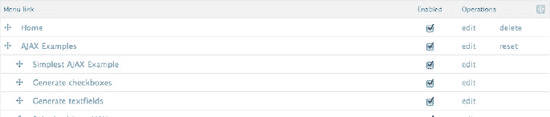

**图 17-1.** 启用 JavaScript 时的菜单链接，使用 tabledrag 进行菜单项重新排序

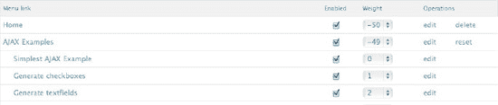

**图 17-2.** 禁用 JavaScript 时的菜单链接，使用标准选择菜单选项进行菜单项重新排序

##### jQuery UI

jQuery UI ([`http://jqueryui.com`](http://jqueryui.com)) 提供了底层交互和动画的抽象；高级、可主题化的小部件；以及高级效果。它们构建在你可用于构建高度交互式 Web 应用的 jQuery JavaScript 库之上。

#### Drupal 核心中的 jQuery UI

在 Drupal 5 和 Drupal 6 中，要轻松包含 jQuery UI 交互，你需要借助 Drupal 的 jQuery UI 模块 ([`http://drupal.org/project/jquery_ui`](http://drupal.org/project/jquery_ui))。在 Drupal 7 中，jQuery UI 1.7 已包含在核心中，使得模块和主题开发者可以轻松访问高级、增强的界面，而无需额外模块或手动在网站/项目中实现 jQuery UI 代码。

要开始实现 jQuery UI 功能，请参考本章前面讨论过的 `drupal_add_library()` 函数。你可以快速包含开始构建增强功能所需的 jQuery UI 相关部分。

##### Drupal 核心中的 jQuery UI 元素

本节中的示例直接取自 [`www.jqueryui.com`](http://www.jqueryui.com) 提供的文档，仅添加了在 Drupal 7 中实现的相关 PHP 代码，以及通过 `Drupal.Behaviors` 声明功能的适当 JavaScript。更多示例和用法可查阅 jQuery UI 文档。

###### accordion

让我们从 accordion 开始。以下是包含 accordion 库的 PHP 代码：

```
drupal_add_library('system', 'ui.accordion');
```

以下是创建 `Drupal.behavior` 来实现 accordion 的 JavaScript 代码：

```
Drupal.behaviors.myModuleAccordions = {
  attach: function(context, settings) {
    // 为所有包含在 class 为 accordion 的 div 中的 h3 元素添加 accordion
    $('.accordion').accordion();
  }
};
```

最后，以下是`accordion`的HTML示例（如图17-3所示）：

```html
<div class="accordion">
  <h3><a href="#">标题 1</a></h3>
  <div><p>Lorem Ipsum dolor sit amet. Lorem Ipsum dolor sit amet</p></div>
  <h3><a href="#">标题 2</a></h3>
  <div><p>Lorem Ipsum dolor sit amet. Lorem Ipsum dolor sit amet</p></div>
  <h3><a href="#">标题 3</a></h3>
  <div><p>Lorem Ipsum dolor sit amet. Lorem Ipsum dolor sit amet</p></div>
</div>
```

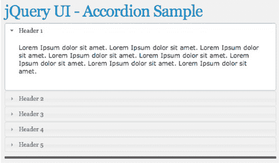

**图 17-3.** 运行中的Accordion

###### datepicker

现在让我们看看`datepicker`。以下是包含`datepicker`库的PHP代码：

```php
drupal_add_library('system', 'ui.datepicker');
```

以下是创建`Drupal.behavior`来实现`datepicker`的JavaScript代码：

```javascript
Drupal.behaviors.myModuleDatepicker = {
  attach: function(context, settings) {
    // 为所有 class 为 datepicker 的输入框添加 jQuery UI datepicker
    $('.datepicker').datepicker();
  }
};
```

以下是`datepicker`的HTML示例。你可以在图17-4中看到结果：

```html
<p><label for="custom-datepicker">日期:</label><input id="custom-datepicker"
class="datepicker" type="text"></p>
```

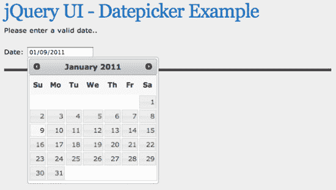

**图 17-4.** 运行中的Datepicker

###### dialog

接下来是`dialog`。以下是包含`dialog`库的PHP代码：

```php
drupal_add_library('system', 'ui.dialog');
```

以下是创建`Drupal.behavior`来实现`dialog`的JavaScript代码：

```javascript
Drupal.behaviors.myModuleDialog = {
  attach: function(context, settings) {
    // 为所有 id 为 dialog 的元素添加 jQuery UI dialog
    $('.dialog').dialog();
  }
};
```

以下是`dialog`的HTML示例，其结果显示在图17-5中：

```html
<div class="dialog" title="基础对话框">
  <p>这是用于显示信息的默认对话框。该对话框窗口可以通过 'x' 图标移动、调整大小和关闭。</p>
</div>
```

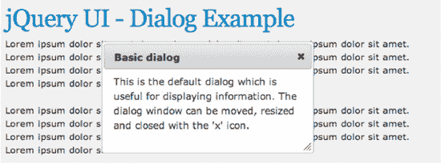

**图 17-5.** 运行中的Dialog

##### `draggable`

下一个示例是一个可拖动的元素，你可以在屏幕上拖动它。这是引入可拖动库的PHP代码：

```php
drupal_add_library('system', 'ui.dialog);
```

这是为可拖动元素创建`Drupal.behavior`的JavaScript代码：

```javascript
Drupal.behaviors.myModuleDraggable = {
  attach: function(context, settings) {
    // 将所有 class 为 draggable 的元素设置为可拖动的……呃……可拖动
    $('.draggable).draggable();
  }
};
```

这是一个可拖动元素的HTML示例；你可以在图17-6中看到结果：

```html
<div class="draggable ui-widget-content">
  <p>拖动我</p>
</div>
```

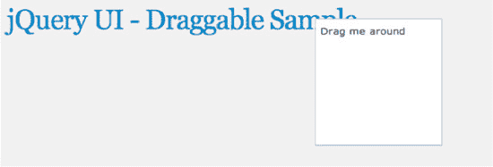

**图 17-6.** 操作中的可拖动元素

##### `droppable`

没有可放置目标的可拖动元素算什么？以下是包含可放置库的PHP代码：

```php
drupal_add_library('system', 'ui.dialog);
```

以下是为可放置元素创建`Drupal.behavior`的JavaScript代码：

```javascript
Drupal.behaviors.myModuleDroppable = {
  attach: function(context, settings) {
    // 将所有 id 为 droppable 的元素设置为可放置的……额……可放置
    $( ".droppable" ).droppable({
      drop: function( event, ui ) {
        $( this )
          .addClass( "ui-state-highlight" )
          .find( "p" )
          .html( "已放置!" );
      }
    });
  }
};
```

以下代码是可放置元素的HTML示例。图17-7和图17-8展示了可放置操作前后的对比。

```html
<div class="draggable ui-widget-content">
  <p>将我拖到目标上</p>
</div>
<div class="droppable ui-widget-header">
  <p>放置在此处</p>
</div>
```

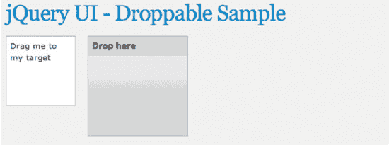

**图 17-7.** 将可拖动元素放入之前的可放置区域

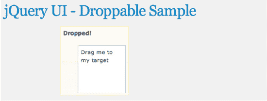

**图 17-8.** 将可拖动元素放入之后的可放置区域

##### `progressbar`

在任何Web应用中，总会有需要显示进度的时候，下面我们来看看如何实现。这是包含进度条库的PHP代码：

```php
drupal_add_library('system', 'ui.progressbar);
```

这是为进度条创建`Drupal.behavior`的JavaScript代码：

```javascript
function dgd7progressbarUpdate(){
    var progress;
    progress = $("#progressbar").progressbar("value");
    if (progress < 100) {
      $(".progressbar").progressbar("value", progress + 5);
      setTimeout(dgd7progressbarUpdate, 500);
    }
  }
  Drupal.behaviors.dgd7progressbar = {
    attach: function(context, settings) {
      $(".progressbar").progressbar({ value: 1 });
      setTimeout(dgd7progressbarUpdate, 500);
    }
  };
```

这是一个可拖放元素的HTML示例，结果如图17-9所示：

```html
<div class="progressbar"></div>
```

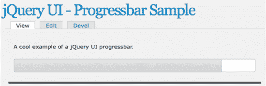

**图 17-9.** 操作中的进度条

##### `resizeable`

下一个示例展示了如何在屏幕上放置一个可调整大小的元素。这是包含可调整大小库的PHP代码：

```php
drupal_add_library('system', 'ui.resizable);
```

这是为可调整大小元素创建`Drupal.behavior`的JavaScript代码：

```javascript
Drupal.behaviors.dgd7resizable = {
    attach: function(context, settings) {
      $('.resizable').resizable();
    }
  };
```

这是一个可调整大小元素的HTML示例，其结果可以在图17-10中看到：

```
<div class="resizable ui-widget-content">
  <h3 class="ui-widget-header">可调整大小</h3>
</div>
```

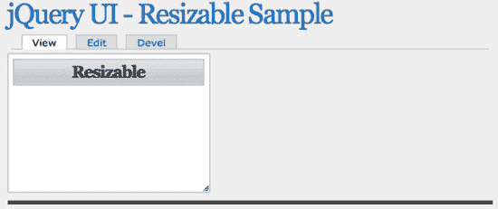

**图 17-10.** 可调整大小的元素

##### `selectable`

Web 应用经常需要收集用户输入，因此你可以使用可选中元素来代替常规列表。这是包含可选库的 PHP 代码：

```
drupal_add_library('system', 'ui.selectable);
```

这是为可选中元素创建 `Drupal.behavior` 的 JavaScript 代码：

```
Drupal.behaviors.dgd7selectable = {
    attach: function(context, settings) {
      $('.selectable).selectable();
    }
  };
```

这是一个可选中元素的 HTML 示例，其结果可以在图 17-11 中看到：

```
<ol class="selectable">
  <li class="ui-widget-content">项目 1</li>
  <li class="ui-widget-content">项目 2</li>
  <li class="ui-widget-content">项目 3</li>
  <li class="ui-widget-content">项目 4</li>
  <li class="ui-widget-content">项目 5</li>
  <li class="ui-widget-content">项目 6</li>
  <li class="ui-widget-content">项目 7</li>
</ol>
```

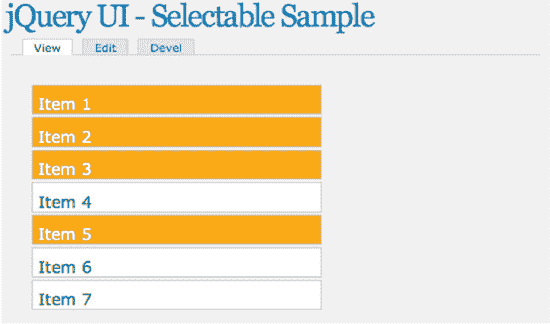

**图 17-11.** 可选中元素

##### `slider`

滑块元素为页面添加了一个滑块，以便你可以收集更精细的值。这是包含滑块库的 PHP 代码：

```
drupal_add_library('system', 'ui.slider);
```

这是为滑块创建 `Drupal.behavior` 的 JavaScript 代码：

```
Drupal.behaviors.dgd7slider = {
    attach: function(context, settings) {
      $('.slider).slider();
    }
  };
```

这是一个可排序元素的 HTML 示例；你可以在图 17-12 中看到结果：

```
<div class="slider"></div>
```

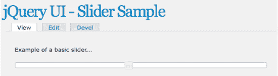

**图 17-12.** 滑块元素

##### `sortable`

当向用户显示大量数据时，允许他们对其进行排序是明智的。使用此 PHP 代码来包含可排序库：

```
drupal_add_library('system', 'ui.sortable);
```

这段 JavaScript 将为可排序元素创建你的 `Drupal.behavior`：

```
Drupal.behaviors.dgd7sortable = {
    attach: function(context, settings) {
      $('.sortable).sortable();
    }
  };
```

这是一个可排序元素的 HTML 示例，其结果可以在图 17-13 中看到：

```
<ol class="sortable">
  <li class="ui-state-default"><span class="ui-icon ui-icon-arrowthick-2-n-s"></span>项目 1</li>
  <li class="ui-state-default"><span class="ui-icon ui-icon-arrowthick-2-n-s"></span>项目 2</li>
  <li class="ui-state-default"><span class="ui-icon ui-icon-arrowthick-2-n-s"></span>项目 3</li>
  <li class="ui-state-default"><span class="ui-icon ui-icon-arrowthick-2-n-s"></span>项目 4</li>
  <li class="ui-state-default"><span class="ui-icon ui-icon-arrowthick-2-n-s"></span>项目 5</li>
  <li class="ui-state-default"><span class="ui-icon ui-icon-arrowthick-2-n-s"></span>项目 6</li>
  <li class="ui-state-default"><span class="ui-icon ui-icon-arrowthick-2-n-s"></span>项目 7</li>
</ol>
```

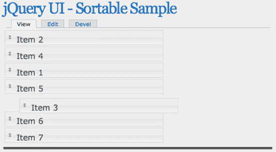

**图 17-13.** 可排序元素

##### `tabs`

实现菜单的一种很酷的方法是使用标签页。以下是包含标签页库的 PHP 代码：

```
drupal_add_library('system', 'ui.tabs);
```

以下是为标签页创建 `Drupal.behavior` 的 JavaScript 代码：

```
Drupal.behaviors.dgd7tabs = {
    attach: function(context, settings) {
      $('.tabs).tabs();
    }
  };
```

以下是标签页的 HTML 示例；你可以在图 17-14 中看到结果：

```
<div class="tabs">
  <ol>
    <li><a href="#tabs-1">Nunc tincidunt</a></li>
    <li><a href="#tabs-2">Proin dolor</a></li>
    <li><a href="#tabs-3">Aenean lacinia</a></li>
  </ol>
  <div id="tabs-1">
    <p>Lorem Ipsum Dolor Sit Amet…</p>
  </div>
  <div id="tabs-2">
    <p>Lorem Ipsum Dolor Sit Amet…</p>
  </div>
  <div id="tabs-3">
    <p>Lorem Ipsum Dolor Sit Amet…</p>
  </div>
</div>
```

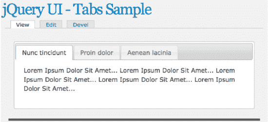

**图 17-14.** 操作中的标签页

#### Drupal 核心中的 jQuery UI 特效

除了已介绍的众多小部件外，还有几种特效可用于动画和增强效果，只需引入相应库，然后在 jQuery 动画中调用对应特效即可。请亲自尝试以下操作：

*   blind `drupal_add_library('system', 'effects.blind');`

*   bounce `drupal_add_library('system', 'effects.bounce');`

*   clip `drupal_add_library('system', 'effects.clip');`

*   drop `drupal_add_library('system', 'effects.drop');`

*   explode `drupal_add_library('system', 'effects.explode');`

*   fade `drupal_add_library('system', 'effects.fade');`

*   fold `drupal_add_library('system', 'effects.fold');`

*   highlight `drupal_add_library('system', 'effects.highlight');`

*   pulsate `drupal_add_library('system', 'effects.pulsate');`

*   scale `drupal_add_library('system', 'effects.scale');`

*   shake `drupal_add_library('system', 'effects.shake');`

*   slide `drupal_add_library('system', 'effects.slide');`

*   transfer `drupal_add_library('system', 'effects.transfer');`

### 更多 jQuery 资源

关于 JavaScript 和 jQuery，互联网上有数不尽的资源，同时通过 `drupal.org` 也能获取大量资源，这些资源将帮助你解答关于实现特定功能的问题。在搜索某个问题或疑问的相关信息时，你可能会惊讶地发现，它在 `drupal.org` 上已被反复解答过。

*   Drupal 7 JavaScript API 文档： [`http://drupal.org/node/751744`](http://drupal.org/node/751744)
*   jQuery JavaScript 库的文档： [`http://docs.jQuery.com`](http://docs.jQuery.com)
*   jQuery UI 的资源： [`http://jqueryui.com`](http://jqueryui.com)

### 总结

许多热门网站，包括 Facebook 和 Twitter，都严重依赖 JavaScript 交互来增强其网站的可用性。Drupal 7 及其 JavaScript 框架拥有足够的灵活性和强大功能，能够实现你能想象到的、或在其他任何网站上看到过的任何功能！

正如本章所展示的，Drupal 7 的 JavaScript 框架增加了丰富的功能；它改变了许多我们应用程序利用 JavaScript 和 jQuery 库的方式。本章的基本示例将助你顺利上手，为你已有的强大 Drupal 7 网站提供强大的 JavaScript 增强功能。

 **提示：** 关于 Drupal 7 中 jQuery 和 AJAX 的更多资源和推荐，包括 `#attached` 渲染属性和 `#ajax` 表单属性，请参阅本章在线主页 `dgd7.org/jquery`。

## 第 V 部分


## 后端开发

**第 18 章、第 19 章 和 第 20 章** 构成一个单元，最初是作为一个章节撰写的，涵盖了开始编写你自己的模块所需了解的一切知识。

**第 21 章** 介绍了如何将 Drupal 6 模块移植到 Drupal 7，这是学习模块开发的一个好方法。

**第 22 章** 提供了编写模块的另一个良好入门途径——“粘合代码”或站点特定模块，用于实现那些你无法通过配置完成的最终调整。阅读本章无需先阅读之前任何章节。

**第 23 章** 涵盖了为你的模块编写测试，这是编写可靠且可持续代码的必要组成部分。

**第 24 章** 介绍了 API 模块的概念，并深入探讨了编写这些 Drupal 功能构建块的一些策略。

## 第 18 章


## 模块开发入门

**作者：Benjamin Melançon**

到目前为止，你已经了解到 Drupal 是一个强大且模块化的系统。事实上，Drupal 的许多强大功能都源自其模块，这些即插即用的功能模块构建在 Drupal 基础系统之上，并相互协作，以实现令人惊叹的效果。

你如何利用这种强大功能来添加自己的原创特性呢？你可以编写一个模块。你只需创建两个文件。第一个文件告诉 Drupal 关于该模块的信息；它并非代码。第二个文件中的代码可以少至三行。在本章的第一节中，你将创建这两个文件的内容，从而制作出一个可用的模块。编写模块是*任何人都可以做到*的事情。有许多（大多很简单）规则需要遵守，有大量工具可供使用——还有大量的探索工作要做。每个开发模块的人仍在不断学习。

本章是模块构建的入门介绍，第 19 章 和 第 20 章 将在此基础上进一步展开。本章提供了以下内容：

*   模块的基础知识，以及 Drupal 如何几乎在其所有功能中都使用钩子，从而允许模块扩展和修改 Drupal。
*   开发模块所需技术技能的概述，包括 PHP 基础和 Drupal 编码标准。

### 一个非常简单的模块

在本节中，你将快速浏览一个小型模块，然后回过头来详细重新审视整个过程。当在第 19 章末尾功能完备时，该模块将帮助网站构建者和模块开发者研究网站；理想情况下，他们将看到网站的骨架结构，因此该模块被命名为 X-ray。该模块将在网站上每个表单的顶部打印出表单 ID。

#### 文件夹中的两个文件

最简单的模块由文件夹中的两个文件组成：一个用于标识模块，另一个包含代码（即模块应执行的操作指令）。信息文件的命名格式为“模块名`.info`”（读作“点 info”），而代码文件的命名格式为“模块名`.module`”（读作“点 module”）。你的模块可以使用任何人类可读的名称，但开始所需的名称是其*机器名*：名称的小写版本，不包含空格或特殊字符。你将始终如一地使用此名称来命名文件夹、文件名以及代码中的函数。因此，在本例中，X-ray 模块的机器名将是 `xray`，因此列表 18–1 和 18–2 中定义的 `xray.info` 和 `xray.module` 文件应放入名为 `xray` 的文件夹中。稍后你将详细讨论此部分和代码。

***列表 18–1.** `xray.info` 文件*

```
name = X-ray
description = 显示网站的内部结构和连接。
core = 7.x
```

***列表 18–2.** `xray.module` 文件，包含注释（`/**` 和 `*/` 之间的文本）*

```php
<?php
/**
 * @file
 * 帮助站点构建者和模块开发者调查网站。
 */

/**
 * 实现 hook_form_alter() 以显示每个表单的标识符。
 */
function xray_form_alter(&$form, &$form_state, $form_id) {
  $form['xray_display_form_id'] = array(
    '#type' => 'item',
    '#title' => t('表单 ID'),
    '#markup' => $form_id,
    '#weight' => -100,
  );
}
```

现在你知道你可以制作一个模块了！全部内容只占半页纸，到本节结束时你将理解这些代码的含义。要使用该模块，请执行与其他人为你编写的模块相同的操作：将其放入 Drupal 查找模块的目录中并启用它。在你的开发站点中，将 `xray` 文件夹放入诸如 `sites/all/modules/custom` 这样的模块文件夹中（如有必要，请创建“custom”目录）。然后，使用浏览器访问你的开发站点，并在管理模块（`admin/modules`）页面上启用 X-ray 模块。（当然，你也可以使用 Drush 启用它，但第一次启用自己制作的模块时，在模块页面上看到它并手动启用，感觉会很好。）X-ray 一启用就会开始工作。你会立即在模块页面上看到变化：X-ray 会修改站点上的表单，使其打印出内部表单 ID；你现在知道，模块管理页面正是由 `system_modules()` 函数提供的一个大型表单（参见图 18–1）。

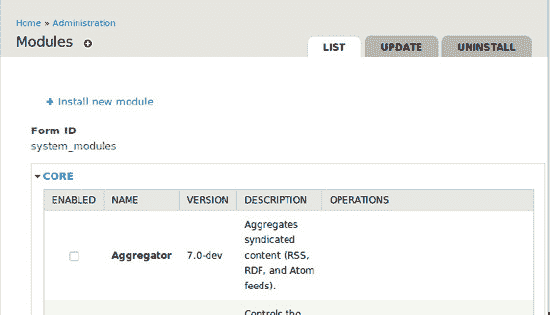

***图 18–1.** 内部表单 ID `system_modules`（生成该表单的函数名称）打印在模块管理表单的顶部*

诚然，这并不是最令人兴奋的模块，但它仍然是一个功能完整的模块，仅用几行代码就影响了你的站点。那种认为模块开发是 Drupal 忍者专属领域的神话已被彻底打破。你可以充满信心地继续前进。你将获得所需的知识，通过自己制作的模块为你的 Drupal 站点注入额外的动力。

 **注意** 不要在第一次制作模块时试图做出独一无二、令人惊叹甚至特别有用的东西。作为学习练习而创建的模块不必是前所未有的事物；它只需要对你来说是新的。参阅第 20 章以制作既简单又实用的模块。

尽管如此，这确实有点令人兴奋。只需很少的代码，你就在站点上的每个表单中添加了一些东西！它是如何工作的？让我们进行一次慢动作回放，进行逐步分析，并附带大量背景信息的彩色评论。

#### 自定义模块的放置位置

你的模块是自包含在其文件夹中的，可以放在 Drupal 查找模块的任何位置，就像你从 `drupal.org` 获取的模块一样。但是，你*应该*把它放在哪里呢？

你知道应该将其放在 `sites` 文件夹中的某个位置，因为你对 Drupal 发行版所做的*每一项*自定义都归属于 `sites`。本章遵循将自定义模块放在 `sites/all/modules/custom` 中的实践，首次将模块放入时需要创建此目录。

 **注意** 当制作你自己的发行版时（如第 34 章所述），你可以将模块与你的安装配置文件捆绑在一起。包含在示例配置文件（`example_profile`）中的模块最终会被放置在 `profiles/example_profile/modules` 中。

从`drupal.org`下载的每个模块都可以放入`sites/all/modules/contrib`目录中（如第 4 章所述，用于放置手动下载或通过 drush 下载的模块；一旦你创建了`sites/all/modules/contrib`目录，Drush 会自动将从`drupal.org`下载的模块放入其中）。

作为将自定义模块放在`sites/all/modules/custom`的替代方案，许多开发者采用将自定义模块放在`sites/default/modules`并将贡献模块直接放在`sites/all/modules`中的约定）。只要你不使用 Drupal 的多站点功能，这种方法就很有效。（*多站点*意味着通过在`sites`中放置其他文件夹，使用单个 Drupal 安装来服务多个站点。通常，多个 Drupal*安装*对你会更好，或与单个安装上的多个站点效果相当。然而，一些部署多个 Drupal 站点的方法，例如 Aegir（`aegirproject.org`），确实大量使用了多站点。关于设置你自己的多站点的说明，请参阅任何 Drupal 副本的 web 根目录中的`INSTALL.txt`。）

表 18–1 列出了自定义模块的推荐目录。

 **注意** 在 Drupal 查找模块的目录中，它会进行彻底的搜索：它会不断深入所有嵌套的子目录，并找到其中的任何模块。因此，因为 Drupal 在`sites/all/modules`中查找模块，如果你将 John Albin Wilkin 的 Bad Judgment 模块放在`sites/all/modules/contrib/experiments/set_a/johnalbin/amusements/bad_judgment`中，它也会找到它。但这并不意味着你应该把它或任何其他模块放在那里。（包含多个模块的模块项目必然会利用此功能，让 Drupal 在其项目文件夹中找到其他模块，有些还会将子模块嵌套得更深一层或两层，例如放在 modules 子目录中，这是核心的 Field 模块所采用的方法。）

***表 18–1**. 自定义模块的推荐位置*

| **目录** | **使用场景** |
| --- | --- |
| `sites/all/modules/custom/` | 用于单个站点，或用于多站点安装中的所有站点。 |
| `sites/example.com/modules/custom/` | 仅用于多站点安装中的单个站点`example.com`。 |
| `sites/default/modules/` | 在单站点安装中，自定义模块可接受的快捷位置。 |

你将在本地开发站点（这是一个单站点安装）中开发 X-ray 模块，因此上述任何位置都可以使用。（这样的本地站点也称为沙盒站点，意味着它是一个游乐场，不用于生产环境。）

 **提示** 要开发你的模块，你需要在计算机上有一个可用的 Drupal 站点。如果还没有，请参阅第 12 章关于设置开发环境的内容，以及附录 F（Windows）、G（Linux）、H（Mac）或 I（适用于 Acquia 的跨平台 Drupal 栈安装程序），以在本地提供网页服务。或者，一些开发者通过 SSH 或 FTP 接入远程开发服务器来完成所有工作。

### 使用命令行

您可以使用计算机的图形用户界面（GUI），也可以使用命令行。在创建`modules`文件夹，然后在其中创建`xray`文件夹，再打开文本编辑器创建`xray.info`文件所需的时间里，您可能已经使用命令写完了整个文件。（用于创建目录的`mkdir`命令和用于切换目录的`cd`命令如下所示，而关于使用通用文本编辑器的`vi`命令则是`dgd7.org/vi`上在线附录的主题。）

掌握命令行是一项特别有用的技能，尤其是在学习 Web 开发时，因为它允许您在服务器上导航、查看和编辑文件，而这些服务器通常运行 Linux 且没有可用的 GUI。（不过，不要利用编辑服务器文件的能力去修改线上网站的代码！）

我想说“不要畏惧命令行”，但命令行没有“撤销”功能，因此在某些方面它确实令人畏惧——但正因如此，我们才使用版本控制。总之：使用命令行能为您的 Web 开发工作打开一系列有用、强大且便捷的工具。您可以通过 Linux 上的 Terminal 或 Mac OS X 上的 Terminal.app 来使用命令行。

虽然您可以使用图形化文件管理工具（例如 Mac OS X 的 Finder 或 Microsoft Windows 的资源管理器）创建文件夹，但本章将展示如何通过命令行操作（见清单 18–3）。这将帮助您成为一名更优秀、更高效的开发者，或许还能磨炼您的意志。

***清单 18–3.** 创建 `xray` 文件夹及其父文件夹 `modules`，并切换目录到该位置的命令*

```
mkdir -p sites/default/modules/xray
cd sites/default/modules/xray
```

#### 为您的模块创建仓库

这一步与让模块工作无关，而是关乎编写模块时的工作流程。第 2 章 介绍了使用 Git 进行版本控制，第 14 章 则进一步阐述了版本控制在实现开发者“心流状态”方面的优势：您希望自由尝试任何操作，并始终知道可以回退到工作状态。您应该在开发模块时使用版本控制，并持续提交更改。

从您正在开发的模块根目录（在本例中，即 `xray` 文件夹；在我的计算机上，该目录位于`~/code/dgd7/web/sites/all/modules/custom/xray`）初始化一个 Git 仓库。然后进行您的第一次提交，这可以在您创建第一个文件后立即进行，如下所示：

```
git init
```

 **注意**您可以在模块目录中创建一个仓库，即使它已经存在于一个受版本控制的网站项目中。这能让您将模块与站点分开，以便与世界共享模块。

初始化仓库后，添加并提交您在模块目录中所做的更改。在编写模块的每个关键节点、暂停或喘息之际，您将一遍又一遍地重复这些步骤，以确保在需要时能够回退到旅程中的任何步骤。

```
git add .
git commit -m "Basic xray.info and .module files."
```

在第 14 章中，Drupal 核心最 prolific 的贡献者之一 Károly Négyesi 提到不必担心提交信息的内容。最重要的是让记录所有更改变得轻松自然。（我经常提交，但自己尚未完全遵循这一实践。您可以在`drupal.org/node/953650/commits`查看 X-ray 模块开发过程中的每一次提交。）

版本控制的另一个巨大好处是，您现在可以轻松地将您的工作与世界分享。参见第 37 章，了解如何将您的模块与`drupal.org`上的沙盒项目关联，以便任何人都可以试用您的工作。第 37 章 还包含大量关于使用 Git 跟踪更改、共享代码以及与其他开发者协作的内容。

#### .info 文件

这个文件只是告诉 Drupal 关于您的模块的信息，但其中仍有许多值得关注的内容。一个`.info`文件告诉 Drupal：“嘿，这是你可以玩的东西。” Drupal 在模块启用之前只读取`.info`文件，而忽略模块的其他部分。因此，Drupal 在模块管理页面（`admin/modules`）上显示的信息，对于未启用的模块来说，完全来自`.info`文件。（一旦某个模块被启用，依赖于模块代码才能工作的“帮助”、“权限”和“配置”链接可能会出现。）

##### 基本的 .info 指令

`.info`文件的内容简单且公式化。我将在接下来几页中介绍许多常见指令，但所有指令都可以在`drupal.org/node/542202`找到。以下是`.info`文件的最小内容，作为自解释的示例，如同在`machine_name.info`中所见：

```
name = Human-readable name of our module
description = Describes what our module does in a sentence or two.
core = 7.x
```

还可以有其他值，但这些是必需的。语法是简单的*标签等于值*配对。它始终是标签（或名称）和值，之间用空格、等号和另一个空格分隔。例如，在上面的最后一条指令（或属性）中，`core`是标签，`7.x`是值。

 **注意**从 Drupal 7 开始，不再需要显示`$Id$`。`drupal.org`以前使用的旧版版本控制系统 CVS 要求托管在`cvs.drupal.org`上的每个文件顶部都有一个`$Id$`注释，CVS 会将其替换为提交时间和提交者名称。在使用 Git 和`git.drupal.org`的今天，这已无必要，但 Git 仍然知道谁在何时提交了什么。

人类可读的`name`是模块在模块管理页面上被选中（从而被启用）所必需的。没有机器名称指令；它从`.info`文件名中读取。虽然技术上并非必需，但包含`description`是模块开发者的最低礼仪。`core`指令必须设置为`7.x`，否则 Drupal 7 将拒绝与该模块协作。（目前 Drupal 不允许模块要求特定的次要“点发布”版本，但您可以通过声明某个特定版本的 core 系统模块作为模块的依赖项来绕过此限制。依赖项指令将在下一部分介绍。）

##### `dependencies[]`

最常见的可选指令之一是`dependencies[]`，它列出模块运行所需的任何模块的系统名称。如果你决定让前面的示例依赖于 Views 模块，你需要在`.info`文件中添加一行`dependencies[] = views`。

你只应列出**直接**依赖关系。例如，Views 依赖于 CTools，但只有当你的模块直接使用 CTools 时，才应在模块中列出 CTools。这有助于避免列出虚假的（过时的）依赖关系。同理，如果你修改模块使其不再依赖另一个模块，就应将其从依赖关系中移除，这样站点构建者就不会被迫安装额外的模块。

方括号是做什么用的？当一个指令可以有多个值时，名称末尾会加上数组表示法`[]`，以便根据需要重复该指令多次。因此，一个同时依赖核心 Help 模块和贡献模块 Views 的模块，需要重复两次`dependencies[]`指令，如清单 18-4 所示。

> **注意：** 从 Drupal 7 开始，每个依赖项必须单独列在一行，针对模块依赖的每个模块的系统名称重复`dependencies[] = system_name`。

**清单 18-4.** 需要两个其他模块的模块的`.info`文件

```
; 要求启用核心 Help 模块和贡献模块 Views。
dependencies[] = help
dependencies[] = views
```

清单 18-4 中的第一行是注释。在`.info`文件中，注释由行首的分号（`;`）标识。因此，`.info`文件中任何以分号开头的行都会被 Drupal 忽略。由于`.info`文件非常简单且不言自明，通常不需要在模块的`.info`文件中添加注释。清单 18-4 接下来的两行是两个依赖项，即 Help 和 Views 模块的机器名称。（请记住，机器名称可能与人类可读的名称有很大差异。例如，Views Bulk Operations 模块的机器名称是`vbo`。）

##### 版本特定依赖项

依赖项可以指定模块的特定版本，例如`>=3.x`表示任何 3.x 或更高版本。对于贡献模块，这是模块版本字符串中 Drupal 版本之后的第二部分，因此`dependencies[] = views (>=3.x)`将允许 Views 7.x-3.0（以及 4.x 系列，如果存在）但不会允许 Views 7.x-2.9。请注意，即使是最简单的版本字符串，也需要括号。以下是复杂版本感知依赖项规范的示例，由 Károly Négyesi (chx) 提供：

`dependencies[] = foo (>=2.x, <4.17, !=3.7)`

这意味着你需要`foo`模块的主版本至少为 2，并且版本低于（但不包括）4.17，同时排除存在严重错误的版本 3.7。

如前所述，你可以使用这种形式的`dependencies[]`指令来要求特定版本的 Drupal 核心。如果 Drupal 7.0 中存在阻止你的模块正常工作的错误，并且在 Drupal 7.1 中已修复，你可以要求系统模块（一个始终需要启用的核心模块）版本为 7.1 或更高，如下所示：

`dependencies[] = system (>=7.1)`

##### `configure`

`configure`指令是可选的，但强烈推荐使用，它允许你提供模块配置页面的路径。当模块启用时，Drupal 会使用此路径在模块管理页面上提供一个链接。以下是核心搜索模块中`configure`指令的示例：

`configure = admin/config/search/settings`

（目前 X-ray `.info`文件中没有`configure`行，但当你创建配置页面以链接到时，会添加一行。）

> **注意：** 从 Drupal 7 开始，`configure`指令通过在模块页面的列表中提供指向模块配置页面的链接，极大地改善了站点构建者的体验。（我非常喜欢这个配置链接。）

##### `package`

另一个可选指令是`package`，用于在模块管理页面（`admin/modules`）上对模块进行分组。如果你不确定模块的包名是什么，建议完全跳过它。省略`package`会将你的模块归入“Other”类别。如果你的模块属于某个模块组，你可以通过使用相同的包名将它们放在一起。

> **注意：** 关于如何使用`package`指令对模块进行分组，在 Drupal 中尚未形成定论。请留意手册页面（`drupal.org/node/542202#package`）以了解政策更新，同时关注包维基页面（`groups.drupal.org/node/97054`）以了解模块维护者所做的选择。如前所述，如有疑问，就省略它。

你会将你的 X-ray 模块放在 Development 包中，这是建议的开发相关模块的位置。你可以使用任何代码或纯文本编辑器创建和编辑模块的`.info`文件；**不要**使用富文本编辑器或文字处理器。（有关如何使用 Vim 编辑器（大多数 Web 服务环境中都有）的简要信息，请参阅`dgd7.org/vi`。）创建或编辑 X-ray 模块的`.info`文件，将`package`指令设置为 "Development"，如清单 18-5 所示。（请注意，与`dependencies[]`不同，此指令与`name`和`description`一样，需要使用正确的大小写。）

**清单 18-5.** 添加了包信息的`xray.info`文件

```
name = X-ray
description = 显示网站的内部结构和连接。
package = Development
core = 7.x
```

就这样——这个`.info`文件告诉 Drupal 你的模块名称、描述、在“管理 > 模块”页面上分组所属的包，以及兼容的核心版本。你的模块已经准备好震撼 Drupal 世界了；它唯一缺少的就是……代码。

> **提示：** 如果你在需要为新的模块编写`.info`文件时手头没有本书或其他参考资料，可以查看核心模块或其他贡献模块的`.info`文件（并忽略“由`drupal.org`打包脚本添加的信息”一行以下的所有内容），或者你可以在`drupal.org/node/542202`找到 Drupal 7 `.info`文件的手册页面。

#### `.module` 文件

第二个文件，即`.module`（"点模块"）文件，用于告知你的模块要执行什么操作。其重要性并不取决于文件长度；它甚至可能比`.info`文件还要短！（诚然，它通常要长得多。）

`.module`文件的机器名必须与`.info`文件相同，而两者的机器名都应与其所在文件夹的名称一致。（模块不必与所在文件夹同名，但出于对站点构建者和其他模块开发者的便利考虑，通常建议这样做。即使是包含多个模块的项目，每个模块也都应有自己的文件夹，且多模块项目中所有模块的机器名都应以项目名开头。）

对于 X-ray 模块来说，项目名、文件夹名和机器名均为`xray`，因此主模块文件名将是`xray.module`。像打开所有 PHP 代码文件一样，使用完整的`<?php`标签来打开你的`.module`文件，该标签用于标识文件包含待处理的 PHP 代码，如下所示：

`<?php`

我强调这一点，是因为本书中的许多代码示例*不会*包含这一行，但所有代码都应置于以`<?php`开头的文件中。没有起始行，任何 PHP 代码都无法运行。

接下来，对于`.module`以及每个代码文件，添加一条注释来解释整个文件的用途。它使用 docblock 注释，这是 Drupal 编码标准认可的两种 PHP 注释风格之一。注释非常重要，本章有专门的一节对其进行描述。

##### 代码注释

以`//`开头的单行注释样式用于函数内部，例如函数`xray_form_alter()`。两个斜杠后至行尾的所有内容均被忽略，因此跨越多行的内联注释需要每行都以`//`开头。X-ray 模块目前还没有函数内联注释的示例，但你很快就会看到并编写大量的此类注释。

`.module`文件的前几行是另一种类型的注释，称为*docblock*，即*doc*umentation（文档）*block*。让我们逐一分解。首先是`@file`标记，用于描述整个文件的用途（参见列表 18–6）。对于`.module`文件，其描述通常与`.info`文件中的模块描述类似。

**列表 18–6.** 文件开头和函数前的 Docblock 格式代码注释

```
/**
 * @file
 * 帮助站点构建者和模块开发者调查站点。
 */

/**
 * 实现 hook_form_alter() 以显示每个表单的标识符。
 */
function xray_form_alter(&$form, &$form_state, $form_id) {
  // 这是一条内联注释，告诉你代码已被移除。
}
```

PHP 的 `/* */` C 风格注释从起始的 `/*` 到结尾的 `*/`，注释掉两者之间的所有内容，并且可以跨越多行。在 Drupal 中，它仅用于函数*外部*，通常用于介绍函数。在列表 18–6 中，这种块状注释借助 `@file` 标识符来介绍文件。请注意，Drupal 编码标准要求不仅仅是简单的注释开始和结束标签：注释开头需多一个星号（`/**`）；注释的每一行都以一个空格、一个星号和一个空格（` * `）开头；结尾处缩进一个空格（` */`）。

同样的 docblock 标记用于介绍你模块中目前唯一的那个函数。此注释必须紧邻函数上方，两者之间不得有空行。其第一句话必须适合单行，包括必须有的句号，额外的描述或解释行必须用空注释行分隔。在这种情况下，作为简单的钩子实现，一行文档说明就足够了。该注释告知任何阅读代码的人，函数 `xray_form_alter()` 实现了 `hook_form_alter()`。

等等，“实现了 `hook_form_alter()`”？这到底是什么意思？

### 钩子

钩子是神奇的门户，它允许任何模块（包括你的模块）出现在 Drupal 的其他部分并执行操作。当 Drupal 执行它认为重要的操作时（如加载内容、保存用户账户、显示评论等），它会稍作停顿，邀请所有已安装的模块进行观察或干预。每个钩子都是你的模块针对 Drupal 正在做的事情做出响应的机会——根据 `api.drupal.org/hooks` 上的列表，Drupal 核心共有 251 个钩子。

钩子名称中的“hook”是实现模块的短名称的占位符。它代表了允许函数以这种特殊方式运行的命名约定。当调用一个典型的钩子时，Drupal 会遍历所有启用的模块，寻找以模块名开头并以钩子名结尾（不包括“hook”一词）的函数。因此，要实现一个钩子，只需将钩子名称前面的“hook”部分去掉，替换为你的模块短（机器）名。这就是为什么 `hook_form_alter()` 在 X-ray 模块中是由函数 `xray_form_alter()` 实现的。

 **提示** 如果你看到一个函数 `hook_anything_whatsoever()`，它是一个演示如何使用该钩子的示例（因此应存在于 `.api.php` 文件中，例如 `modules/system/system.api.php`）。你模块的函数不会以“hook”开头。实现钩子的函数*会*在其文档块注释中说明它实现了哪个钩子，但函数名本身会使用模块的短名称代替“hook”一词。

从计算机科学的角度来看，Drupal 的钩子符合控制反转系列设计模式中的事件驱动模式。每次使用 `module_invoke_all()`（或调用钩子的变体方法）都是一个事件，Drupal 的其他部分（包括贡献模块）可以对此做出响应（不响应也完全可以）。例如，当评论模块显示一条评论时，它会运行以下代码：

```
module_invoke_all('comment_view', $comment, $view_mode, $langcode);
```

以便通过实现 `hook_comment_view()` 为任何模块提供对评论进行操作的机会。评论对象通过引用传递给实现函数，以便可以直接对其进行更改。视图模式和语言代码作为上下文提供，在响应正在被查看的评论时可以将其考虑在内。钩子函数签名描述了传递给钩子的内容，每个函数签名都可以在 `api.drupal.org` 上看到。例如，`hook_comment_view()` 的定义可以在 `api.drupal.org/hook_comment_view` 找到。每个钩子的 API 文档还会说明钩子实现是否以及应该返回什么。

Larry Garfield (crell) 写道，在 PHP 应用历史上所采用的程序化系统中，这种钩子方法是一种保持代码松散耦合的极好方式，这意味着只要你知道其他代码想要什么，你的代码就无需了解你与之交互的代码是如何运作的。有关编程方法以及其中一些方法与 Drupal 的关系的更多信息，你可以阅读 crell 的博客 [`garfieldtech.com/blog/language-tradeoffs`](http://www.arfieldtech.com/blog/language-tradeoffs)。至于这对你的模块意味着什么，请阅读关于 Drupal 如何在页面上显示帮助文本的边栏。

 **提示** Drupal 开发者和教育家 Chacha Sikes 说，学习如何使用钩子的最佳方法是下载几个贡献的 Drupal 模块，并找到钩子实际使用的位置。然后，你可以将正在使用的钩子与 `api.drupal.org` 上的钩子定义进行比较，看看模块开发者是如何弄清楚如何实现该钩子的。

Drupal 核心中定义的所有钩子都可以在 `api.drupal.org` 上查询到。许多由贡献模块定义的钩子则可以在 `drupalcontrib.org` 上查阅。所有这些文档均由 Drupal 代码中的注释生成，因此你可以自行安装（目前为 Drupal 6 版本的）API 模块（`drupal.org/project/api`），或者直接查看你感兴趣的模块代码。如果一个模块定义了钩子，它通常会包含一个 `.api.php` 文件，其中提供了如何使用这些钩子的示例。

### Drupal 如何利用钩子在页面上显示帮助文本

X-ray 模块将大量使用 `hook_help()` 来在其调查的页面的帮助区域中显示文本。将以下代码放置在 `xray.module` 文件中，就足以在访问管理 > 结构（`admin/structure`）页面时，向帮助区块添加文本：

```
<?php
// [因篇幅原因，现有代码未显示]...
/**
 * 实现 hook_help()。
 */
function xray_help($path, $arg) {
  if ($path == 'admin/structure') {
    return t('这个网站有内容！');
  }
}
```

在结构管理页面顶部显示“这个网站有内容！”这段文字似乎是一项简单的任务——好吧，它*确实*是一项简单的任务——然而，这段文本如何到达那里的复杂性，正是 Drupal 强大力量的秘密源泉。你不需要了解钩子如何工作就能使用它们，但理解 Drupal 的工作原理也绝不会有什么坏处。让我们简短地走一遍 Drupal 如何在页面上放置帮助文本的流程。

### Drupal 将路径转化为页面：`hook_menu()`

Drupal 正在处理它的常规事务，这通常意味着显示一个网页。你点击了工具栏中的“结构”链接（`admin/structure`）。你的浏览器告诉 Drupal，这就是你想要访问的页面。每个路径最终都会匹配到一个包含页面回调函数的菜单项，该函数主要负责显示该路径的页面。这些菜单项由 `hook_menu()` 的实现提供，并存储在 `menu_router` 表中。（菜单系统在第 29 章中有更详细的介绍。）

菜单项可以包含用于判断请求页面的用户是否具有访问权限的信息，以及在调用页面回调函数之前是否需要包含某些文件。处理完主要内容后（通常是一个可渲染的数组或 HTML 片段，在本例中，是结构部分内管理链接的列表），Drupal 也会着手加载页面的所有其他区域。它从当前使用的主题中获取可用的区域，并从区块系统中获取分配给该主题每个区域的区块。所有这些信息都是由 Drupal 调用钩子来提供的。Drupal 核心代码的其他部分，或者你添加的贡献代码或自定义代码，会通过实现这些钩子的函数来响应这些调用。

而在执行到你那个小小的帮助钩子之前，还有一个重要的钩子要走。

### Drupal 显示区块：`hook_block_view()`

当处理到 `system_help` 区块（默认情况下，它将自己分配到帮助区域）时，Drupal 会调用 `hook_block_view()` 的一个特定实现。也就是说，Drupal 这里遵循了一种替代模式，而不是遵循在所有实现该钩子的模块中调用钩子的常见模式：它只在一个特定模块中调用该钩子的实现。Drupal 根据提供该区块的模块名称（`system`）和钩子名称（`block_view`）来构造一个函数名。基于模块名称和钩子名称组合来调用函数的命名约定，与在多个模块中调用钩子时使用的命名约定相同。这允许你说函数 `system_block_view()` *实现了* `hook_block_view()`。（有些人通过将它们称为回调函数来区分真正的钩子；请查看 `drupal.org/node/1114032` 了解这在 Drupal 8 中是否实现。）
```


当调用`system`模块为`system_help`区块实现的`hook_block_view()`时，Drupal将文本“help”作为参数传入。在`system_block_view()`函数内部，有一个switch语句来决定执行哪段代码。当给定的参数是“help”时，这个switch语句（以及随后的函数）会返回`system_help`区块所需的信息。它将区块的标题设置为空，并将区块的主体设置为`menu_get_active_help()`函数返回的值。

##### Drupal 收集页面帮助信息：`hook_help()`

现在，Drupal终于调用了你的模块实现的钩子，即`hook_help()`。在`menu_get_active_help()`函数内部，Drupal获取了当前访问页面的内部路由路径。然后，它大体上是这么说的：“对于每个实现了‘help’钩子的模块，给我你们为这个路径准备的内容。”它会从所有`hook_help()`的实现中接收返回的内容（如果有的话），并将它们合并成一个字符串。然后它将这个输出返回，用作`system_help`区块的主体。你的模块名为`xray`，钩子名为`help`。因此，你将函数命名为`xray_help()`，并在代码注释中声明它实现了`hook_help()`。如前所述，整个钩子系统都基于这种“模块名加钩子名”的命名约定；如果存在一个具有该名称的函数，Drupal就会认为该钩子已被实现，并在调用该钩子时执行该函数。

 **注意** “对于每个实现了钩子x的模块”这一步，与Drupal调用`module_invoke_all('x')`（其中'x'是去掉前缀“`hook`”的钩子名称）时所发生的事情是一样的。无论是否使用`module_invoke_all()`函数，每次调用钩子时都会发生非常类似的过程。

`hook_help()`的函数签名让你知道，你的函数将接收一个由`$path`代表的参数（你可以将*参数*或*实参*视为一条信息），并且你的函数需要返回一些文本。`hook_help()`的函数签名定义在`api.drupal.org/hook_help`，也定义在Drupal核心代码的`modules/help/help.api.php`文件中。

 **提示** 你可以像查找任何函数一样查询任何钩子——只需在Drupal的API网站`api.drupal.org`上搜索即可。你可以通过直接在搜索地址中输入函数或钩子名称（例如`api.drupal.org/api/search/7/hook_menu`）来访问一个函数或钩子，或者，在搜索当前版本Drupal时更简洁的方法是，只需将函数名或钩子名附加到API网站的地址后面：`api.drupal.org/hook_menu`。请确保你正在查看的是与你所用Drupal版本对应的函数或钩子文档；`api.drupal.org`为Drupal 5、Drupal 6和Drupal 7提供了标签页。

`menu_get_active_help()`函数，在我刚才描述的事件序列中，当为结构管理页面调用时，会将参数`$path`设置为`admin/structure`，并传递给每个实现`hook_help()`的函数。区块模块的`block_help()`函数检查后告诉Drupal，它在该路径下没有提供任何内容。节点模块的`node_help()`也检查并报告没有内容。分类模块的`taxonomy_help()`函数以及所有其他实现了`hook_help()`的模块都会检查它们是否为`admin/structure`这个路径准备了任何内容，而它们全都表示没有。（情况并非必须如此；它们都可以为某个路径返回文本，Drupal会合并这些帮助文本并显示在页面上，但这正是之前`admin/structure`页面上没有任何帮助信息的原因——无论你的模块是否启用，所有这些过程都会发生。）最后，`menu_get_active_help()`询问X-ray模块的`xray_help()`是否为`admin/structure`路径准备了内容。

```
function xray_help($path, $arg) {
  if ($path == 'admin/structure') {
     return t('这个网站有内容！');
  }
}
```

在`xray_help()`内部，它接收`$path`参数并检查其是否等于文本“admin/structure”。发现相等后，该函数会惊叹“OMG!”，并立即将文本“This site has stuff!”返回给`menu_get_active_help()`，后者再将同一文本沿调用栈向上传递至`system_block_view()`。`system_block_view()`返回该文本（同时合并了之前设置的空标题）给Block模块——你在六个段落之前最后一次见过它，但幸运的是Drupal的运行速度远快于这个故事。

 **提示** 关于`$path`参数及尚未提及的`$arg`参数的详细信息，请参见第20章中的`hook_help()`函数签名。

这一过程达到了不错的戏剧效果，但X-ray模块之所以最后被询问路径，仅仅是因为其字母顺序靠后。如果你有一个Zebra模块及其函数`zebra_help()`，或某个被有意设为更高权重的模块，它们中的任何一个都会在你的模块之后被调用。所有实现了`hook_help()`的模块都会被调用。除非你关心自己的帮助文本在页面上的排序（是在其他提供帮助文本的模块之前还是之后），否则调用顺序影响不大。另请注意，你的`xray_help()`函数会在*每个*页面请求时被此事件链调用，但在其他所有页面上，它将`$path`与“admin/structure”比较后，发现两者不相等且无话可说，因此返回空值。

**Drupal允许修改区块：`hook_block_view_alter()`与`hook_block_BLOCK_ID_view_alter()`**

Block模块在从`system_block_view()`接收到响应后，立即构建区块。随后，它通过`drupal_alter()`触发另一个钩子，允许任何模块实现`hook_block_view_alter()`并基于区块的机器名称（此处为`system_help`）修改区块的标题或正文。实际上，Drupal在此阶段提供了两个alter钩子；第二个是精确命名的`hook_block_view_system_help_alter()`，供需要精准定位`system_help`区块进行修改的模块使用。你未实现任何钩子，其他模块也未实现，但关键在于你可以这么做——这是Drupal构建灵活性和可扩展性的另一种方式。

 **注意** 除非绝对必要，否则不要使用alter钩子。你可以让X-ray模块拥有一个名为`xray_block_view_system_help_alter()`的函数，并通过修改该特定区块来将文本附加到帮助区块内容中。但你需要自行判断当前路径，更重要的是，这是错误的方法，因为它偏离了Drupal为帮助文本建立的系统。你应该始终在Drupal为你提供的第一个机会点完成任务。延迟操作意味着错失Drupal提供的工具，并剥夺其他模块对你模块中操作进行响应和处理的机会。

**钩子让Drupal拥抱变化与扩展**

从Drupal在页面显示帮助文本时使用钩子的过程，你能真切感受到Drupal的思维方式。Drupal并未硬编码页面的区域集合，而是从主题中获取。它允许任何模块提供可放置于任意区域的区块。在其自身代码中，当提供帮助区块时，它允许任何模块在其中插入帮助消息。此外，为了周全考虑，它允许任何其他模块尝试修改此区块。（页面渲染层在输出前还会提供一次修改页面部分内容的机会。）总体而言，Drupal的每个操作都有对应的钩子——这就是为什么无论你需要什么功能，总有一个模块能实现（或即将实现！）。

 **注意** 上述故事由调试工具讲述。第12章与`dgd7.org/ide`讲述了阅读你自己的“Drupal生命周期中的页面请求”冒险故事所需的工具。

### 技术技能

即使你熟悉PHP和Drupal的编码标准，也值得快速浏览本节——总能学到新东西。事实上，在编写本节时我也学到了新知识。

#### PHP 基础


有人会告诉你，在深入 Drupal 内部之前应该先学习 PHP 和 SQL。对此你可以回应称，作者们很快就会提醒你这些缩写词的含义，然后你就能顺利跟上。PHP 是 Drupal 的编程语言（其缩写现已基本无实际含义，官方定义为递归缩写“PHP: Hypertext Preprocessor”）。PHP 几乎能在任何运行 Web 服务器的地方运行，且极容易被找到。SQL（结构化查询语言）用于与关系型数据库通信——Drupal 默认将其配置和内容存储在其中。

学习 PHP 和 SQL 当然是个好主意，但从 Drupal 开发入手并边学边用也是可行的。由于这是一本书而非多卷系列丛书，本书采用“通过 Drupal 学习一切”的方法。我将在本节介绍一些 PHP 基础知识；SQL 将在第 19 章关于 Drupal 数据库层的部分提及。

编程（无论是 PHP 还是其他语言）本质上就是逻辑——几乎字面意义上的逻辑——这使它在某些方面简单，另一些方面困难。你可以通过学习语法并应用基本逻辑来掌握任何编程语言的基础。另一方面，人们可以攻读逻辑学博士学位，而这还未考虑不同编程语言的特性。但别担心，你将直接上手学习 PHP 基础，并在 Drupal 编程的框架中实践应用。

最好的学习建议是阅读大量 Drupal 代码。每当遇到不理解的操作或函数时，请到`php.net`（用于通用 PHP 函数）或`api.drupal.org`（用于 Drupal 专用函数）查询。如果在 Drupal 核心中看到一个函数，它必定出现在这两个网站之一。

 **提示** 官方 PHP 网站`php.net`是绝佳资源，每个函数都有详尽的文档，并附有先行者们的实践经验评论。此外，通过在网站 URL 后直接输入函数名即可轻松找到定义。要查找`substr()`函数的定义，你可以在浏览器中输入`php.net/substr`；若记不清准确函数名，可尝试猜测。从`php.net`的建议中选择一个，并查看大多数函数定义下方的“参见”部分，通常比全局搜索更高效。如果我有模糊印象，我会首选`php.net`进行查询。

### 术语

代码中有一些词在最初看起来似乎只是为了混淆视听；然而，使用一段时间后，你会发现离开它们简直无法表达。

- *字符串*（string）字面上就是一串字符。它可以是一个单词、一个短语，或者一组随机的字符。最接近的非术语表达大概是“文本块”。它可以是一个字符，也可以完全没有文本，这种情况被称为*空字符串*（empty string）。

- 整数（integer）是不带小数点的整数，可以是正数或负数，或者如 PHP 手册所述：“集合 **Z** = {..., -2, -1, 0, 1, 2, ...} 中的数字。”（`php.net/integer`）

- *数组*（array）可以容纳各种其他变量类型（字符串、整数、对象），甚至可以容纳更多数组！后者在 Drupal 中频繁出现，被称为*嵌套数组*（nested arrays）。关联数组拥有键（keys），这些键是指向值的整数或字符串；而值，如前所述，可以是任何内容。

- *对象*（object）在 Drupal 中有时与数组类似，用于保存一组相关数据（例如 `$user` 对象或 `$node` 对象）。对象的功能远不止于此，例如可以从父对象继承信息和功能，并定义自己的方法（即特定于该类型对象的函数）。

- *变量*（variable）是一个带有标签的容器，用于存放可以更改的值。PHP 中的变量必须以美元符号开头，例如 `$name_of_variable`。变量可以是字符串、数字、数组、对象或其他变量类型，例如非整数的数字，称为*浮点数*（floats）。

- *函数*（function）是一段可以通过名称调用的代码。它可以接收变量（作为参数，将在下一部分介绍），并可以返回一个值。你可以定义自己的函数，每个函数在其内部使用的变量拥有局部作用域，从而使函数代码与其他代码隔离。为模块编写的所有代码都应位于你定义的函数内。前面已经见过的 `xray_form_alter()` 和 `xray_help()` 都是函数。

- *参数*（parameters，也称为 *arguments*）允许调用函数的代码向该函数发送信息。函数期望的一个或多个参数构成了该函数的签名（signature）。

虽然 PHP 对于遇到一个之前未被告知的空变量只会轻微抱怨，但你应该始终*初始化*（initialize）你的变量。这意味着在首次使用变量之前或使用之时就对其进行定义。函数允许定义默认参数，这有助于确保这些变量的初始化。例如，一个名为 `example_takes_arguments` 的函数定义为 `function example_takes_arguments($text = 'Hi.') { ... }`，那么变量 `$text` 将在函数内部可用（在替换 `...` 的代码中），并赋值为 'Hi.'。

### 运算符与条件语句

运算符（operator）是接收一个或多个值并返回一个值的符号。值也称为表达式（expression），这意味着任何能够返回值的组合确实都是一个“值”。

#### 赋值运算符

最常见的运算符是赋值运算符（等号），用于为任何变量赋值或赋予某个表达式的结果。

```
$num = 5;
$an_array = array(
  'a_number' => $num,
  'a_letter' => 'k',
);
$another_array = array(
  'a_letter' => "如果合并，这将用一句话覆盖掉 k。哎呀。",
);
$function_result = array_merge($an_array, $another_array);
```

这些略显随意的例子都使用了赋值运算符 `=`，而事实上你会不断使用它来设置变量的值。注意，最后变量 `$function_result` 的值为：

```
array('a_number' => 5, 'a_letter' => 如果合并，这将用一句话覆盖掉 k。哎呀。",
```

#### 字符串运算符

字符串运算符包括连接运算符（concatenation operator），根据 Drupal 编码标准，该运算符两侧始终用空格分隔，如下所示：

```
$end = " 字符串的结尾";
$msg = "字符串的开头" . $end;
```

连接赋值运算符（concatenating assignment operator）可以取字符串中已有的内容，并在其末尾追加内容。

```
$msg .= "!!!";
```

最终得到的字符串 `$msg` 为：

`字符串的开头 字符串的结尾!!!`

#### 算术运算符

从简单的加法到取余运算，这些运算符的作用方式与计算器上的符号相同。

- `5` `+` `2` 返回 `7`

- `5` `-` `2` 返回 `3`

- `5` `*` `2` 返回 `10`

- `5` `/` `2` 返回 `2.5`

- `5` `%` `2` 返回 `1`

#### 比较运算符

比较运算符用于比较两个值。例如：

- `5 == 2` 返回 `FALSE`（等于；不要忘记两个等号，否则它就成了赋值运算符，因此在比较变量与值或其他变量时始终为真）；`"apple" == "apple"` 返回 `TRUE`。

- `5 != 2` 返回 `TRUE`（不等于）。

- `5 < 2` 返回 `FALSE`（小于）。

- `5 > 2` 返回 `TRUE`（大于）。

- `5 <= 2` 返回 `FALSE`（小于或等于）；`3 <= 3` 返回 `TRUE`。

- `5 >= 2` 返回 `TRUE`（大于或等于）；`3 >= 3` 返回 `TRUE`。

还有两个非常重要的比较运算符。它们是*恒等比较*（identity comparisons），在尝试比较之前会先检查两个值是否属于同一类型。这意味着，例如 `FALSE` 不会等于空数组，字符串不会转换为整数进行比较（这是一个不错的额外好处，因为这种转换可能导致意外结果）。它们也比相等比较更快。示例如下：

`1 === TRUE` 返回 `FALSE`，而 `1 === 1` 返回 `TRUE`。

`'' !== array()` 返回 `TRUE`。

#### 三元运算符

*三元运算符*（ternary operator）是 Drupal 偏向于更分散、更易理解代码的一种偶尔允许的例外情况。三元运算符既紧凑又令人困惑。

```
$resulting_value = ($condition) ? "如果为 TRUE 的值" : "如果为 FALSE 的值";
```

让我们从括号内开始（括号并非必需，但属于最佳实践）。首先会计算此处的表达式。它可以是一个简单的变量，也可以是一组复杂的逻辑判断。通常它会是一个变量或一个直接的比较，例如 `($maybe_seven == 7)`。如果计算结果为 TRUE，则返回紧跟问号后面的值。如果第一个表达式计算结果为 false，则返回冒号后面的值。（严格来说，这两个值也可以是表达式，因此被称为第二个和第三个表达式。）更多信息，请参阅 `php.net/ternary` 的 Comparison Operators 页面。

 **注意：** 你经常会遇到这样的情况：你想将一个变量设置为某个值，*前提是*该值非空或非零，例如 `$result = ($value) ? $value : "default"`。在这种情况下，三元运算符看起来没那么紧凑，因为你重复使用了变量来进行测试和赋值。你只能等待 Drupal 8 了：Drupal 7 要求最低 PHP 版本为 5.2，而直到 PHP 5.3 你才可以省略三元运算符的中间部分。在 PHP 5.3 中，表达式 `$value ?: "default"` 如果 `$value` 计算结果不为 FALSE，则返回 `$value`，否则返回 “default”。（如果你有更充分的理由要求 PHP 5.3 及以上版本，可以在你的 `.info` 文件中添加 `php = 5.3` 一行，将其声明为模块或主题支持的最低版本。）

#### 逻辑运算符

在 Drupal 中，常见的比较运算符如下：

*   `$a && $b`：如果 `$a` **和** `$b` 均为 `TRUE`，则返回 `TRUE`。

*   `$a || $b`：如果 `$a` **或** `$b` 为 `TRUE`，则返回 `TRUE`。

*   `!$a`：如果 `$a` **不**为 `TRUE`，则返回 `TRUE`。

词语“`and`”和“`or`”也可以使用，它们分别作为 `&&` 和 `||` 的低优先级（稍后求值）版本。（还有一个逻辑运算符 `xor`，其作用是：当 `$a` 和 `$b` **仅有其一**为 true 时，表达式 `$a xor $b` 返回 true。）

你可以在 `php.net/operator` 找到更多类型的运算符（以及更详细的说明）。

### 控制结构

PHP 使用控制结构来决定运行或*执行*哪段代码。通常，这种决策会借助条件语句来完成，例如等于（`$a == $b`）、全等（`$a === $b`）、小于（`$a < $b`）、大于或等于（`$a >= $b`）等，这些内容在上一节关于比较运算符的部分已经讨论过。

#### if、elseif 和 else 语句

`if` 语句可以单独使用，也可以后跟一个 `else` 语句（当 `if` 的条件判断为 FALSE 时执行），或者可以使用 `elseif` 语法形成 `if` 语句链。这个链也可以以 `else` 语句结尾，当上述所有条件均不满足时执行。示例请参见清单 18–7。

***清单 18–7.** 链式 if/else 语句*

```
if ($advice == 'good') {
  $do = 'Follow it.';
}
elseif ($advice == 'bad') {
  $do = 'Don\'t follow it.';
}
else {
  $do = 'Who knows?  If all else fails, do as you please.';
}
```

 **注意** 请注意字符串 *Don't follow it* 中的撇号。这个撇号用反斜杠（`\`）进行了*转义*，因为在纯文本中，撇号与单引号是同一个字符，而单引号正是用于表示字符串开始和结束的字符。如果你使用双引号来界定字符串，则不需要转义单引号——但你将需要使用反斜杠来转义字符串中的任何双引号。

这些 `if()` 语句使用了比较运算符。当一个 `if()` 语句仅提供一个表达式进行求值时，它也可以执行隐式比较：如果该表达式具有任何非零、非空的值，该语句将判断为 TRUE，因此无需使用“`== TRUE`”。只需使用：

```
if ($condition) {
  // Take example action when condition is true.
  take_example_action();
}
```

在表达式前面加一个感叹号会反转其真/假求值，例如：

```
if (!$condition) {
  // Take example action when condition is false.
  take_example_action();
}
```

#### switch 和 case 语句

另一种控制结构是 switch 语句，它内部使用任意数量的 case 语句。它并不能完成 `if`、`elseif`、`elseif`、`elseif`... 语句链做不到的事情，但被认为是一种更简洁、更易读的将一个值与多个选项进行比较的方式。

你之前只有一个 case，由 `if ($path == 'admin/structure')`... 语句处理。现在，你要将 path 变量与更多可能性进行比较（在清单 18–8 中有五种），因此你已用 switch/case 语法替换了 `if` 语句。（你还将消息处理转移到了辅助函数中。稍后你会查看这些函数的具体内容。）

***清单 18–8.** 在 xray_help() 的一个版本中使用的 switch 语句*

```
switch ($path) {
    case 'admin/content':
      return _xray_help_admin_content();
    case 'admin/structure':
      return _xray_help_admin_structure();
    case 'admin/appearance':
      return _xray_help_admin_appearance();
    case 'admin/people':
      return _xray_help_admin_people();
    case 'admin/modules':
      return _xray_help_admin_modules();
  }
```

switch 语句对第一个 case 语句执行相当于 `($path == 'admin/content')` 的比较，如果判断为 true，则执行 `case 'admin/content':` 行下方的代码，以此类推处理每个 case 语句。请注意，在执行 case 语句下方的代码时，通常使用 `break;` 语句在 case 匹配后退出 switch，但 `return;` 语句会结束整个函数，因此不需要其他任何操作。更多信息请参见 `php.net/switch`。

#### 循环

在 Drupal 中，你最常见到的其他控制结构是循环。`while ($expression) { ... }` 语句会持续执行其花括号内的代码，只要 `$expression` 判断为 `TRUE`；当然，表达式中的变量值必须被此语句内的代码改变，以便循环最终停止。更多关于 `while` 的内容，请参见 `php.net/while`。`for ($i = 0; $i < 5; $i++) { ... }` 语句在此示例中会执行其花括号内的代码五次，对应 `$i` 从零到四的值；更多信息请参见 `php.net/for`。最后，特殊的 `foreach ($array as $key => $value) { ... }` 会遍历数组中的所有项，为花括号内的重复代码提供每个项的键和值。列出键是可选的。

```
foreach ($lumps as $lump) {
  $variables['extra'] .= krumo_ob($lump);
}
```

### Drupal 编码标准

有人可能会问，为什么代码的*外观*与其*运行*方式同样重要？PHP 会忽略多余的空白，因此如果你愿意，完全可以将整个模块写在一行里，它也能工作。但这样的代码将难以阅读。当然，这是一个极端的例子——一个稻草人论证。然而在 Drupal 中，标准远高于你自己能读懂代码。你的代码必须尽可能对其他 Drupal 开发者清晰易懂；遵循编码标准对于协作至关重要。如果美感和逻辑还不足以说服你保持代码质量，那么当你违反标准时，你会被反复指出。这一章是塑造品格的章节，良好的编码习惯最好尽早养成，所以请做正确的事。

#### 一些重要的标准及其解释

当你了解需要做什么以及为什么应该这样做时，保持代码的可读性和可维护性就更容易了。以下规则是编写模块时最重要的部分。更多规则和解释可以在 `drupal.org/coding-standards` 找到。

##### 使用 `<?php` 开始标记

始终使用完整的`<?php`标记，不要使用任何缩写形式。除了看起来不雅观之外，任何非`<?php`的形式都不能保证在所有 PHP 配置中都能正常工作。

##### 文件末尾不要使用 PHP 结束标记

在大多数文件中，你根本不需要使用 PHP 结束标记。每个模块文件(`.module`)、包含文件(`.inc`)、安装文件(`.install`)、`settings.php`文件和`template.php`文件（主题中）都应在顶部*立即*放置`<?php`，并且不包含任何 PHP 结束标记。

省略 PHP 结束标记可以防止由结束标记后的空白字符引起的常见问题。该问题会显示为如下错误：“*Warning: Cannot modify header information - headers already sent by (output started at `/var/www/example/drupal/sites/default/oops/oops.module.php:37`) in `/var/www/example/drupal/includes/bootstrap.inc` on line 568*”。PHP 结束标记后的任何空白字符都会被发送到浏览器，并可能干扰输出的启动时机。

当然，这条规则有一个例外：模板文件(`.tpl.php`)，这些文件本来就应当发送输出。通常，模板文件以 HTML 开头，然后切入 PHP，再返回 HTML，如此反复，通常以 HTML 结尾。因此，PHP 结束标记不仅允许，而且必要。PHP 结束标记就是简单的`?>`，并且应仅在模板中使用。

##### 内部函数前加下划线

名称以下划线开头的函数（例如`_function_name()`）仅供模块内部使用。不应被其他模块调用。

为私有函数使用下划线命名约定有两个主要好处。首先，它让所有人都知道该函数仅供内部使用，如果有人使用了它，那他们的做法就是错误的，因为你保留随时删除或修改该函数的权利。你也可以更改非下划线的公共 API 函数，但除非你同时发布模块的新主分支（例如，将版本号从 1.x 更改为 2.x），否则应尽量避免这样做。其次，在内部函数前加下划线有助于防止你意外实现一个 Drupal 钩子（请记住，仅核心就有超过 250 个钩子）。

> **警告** 你仍然需要在内部函数名称前加上模块名称和下划线，格式为`_模块名_函数()`，否则你的函数可能会与其他人的函数重名。两个同名函数会导致命名空间冲突，从而引发 PHP 致命错误，这几乎和听起来一样糟糕。

##### 缩进两个空格

你应该对函数、控制结构（如循环和`if`语句）、数组定义以及几乎所有看起来需要缩进的内容进行缩进；并且使用两个空格，而不是一个制表符。（你可以配置某些 IDE 和代码编辑工具，在按 Tab 键时使用两个空格；参见第 12 章和`dgd7.org/ide`。）

例如，函数内的所有内容都应另起一行并缩进两个空格；该函数内`if`语句中的所有内容再缩进两个空格，总共四个空格。

##### 所有控制语句（包括 else）另起一行

`if`语句中的`else`子句应紧跟右大括号另起一行，开头不缩进：

```
if ($following_coding_standards) {
  drupal_set_message("Good job!");
}
else {
  drupal_set_message("Follow this example!");
}
```

##### 控制语句与其左括号之间使用空格

为了使这些控制语句与函数更容易区分，请在控制条件（括号内）与控制语句名称之间用一个空格隔开；在前一个示例的`if`语句行中可以看到这一点。与函数类似，左大括号也与前一个元素用一个空格隔开。这就是`"if ($following_coding_standards) {"`一行中两个空格的由来。`foreach`语句、`while`循环等也是如此。

##### 参数之间使用空格

在函数定义和函数调用的参数之间加上空格，如下所示：

```
function space_standard($parameter, $another_parameter, $last_parameter) {
  _space_standard($parameter, $another_parameter, $last_parameter);
}
```

##### 所有二元运算符、连接符等两侧使用空格

二元运算符是对*两个*值同时进行*操作*并返回新值的运算符。这包括比较运算符，如`==`或`>=`；算术运算符，如`+`或`/`；字符串运算符，如`.`或`.=`；逻辑运算符，如`&&`或`||`；以及赋值运算符，如`=`或`+=`（后者是组合的算术和赋值运算符，就像`.=`是组合的字符串和赋值运算符一样）。一般规则是，只要某东西位于两个值之间，就在其两侧各加一个空格。

以下代码中运算符密集。关键在于每一个运算符的两侧都礼貌地用一个空格隔开。

```
if ($budget < $money || ($is_broke && !$has_credit)) {
  $message = 'Your remaining $' . $money - $budget . ' is not enough.';
}
```

**关于代码含义的补充说明**

了解前面代码示例的含义可能对你有帮助，也可能没有帮助，但这里用*斜体*表示**值**，用**粗体**表示**运算符**：如果*预算* **小于** *资金* **或**这个人既*破产* **且** *没有信贷*，那么将*消息* **设置为等于**一个短语，该短语由*文本字符串*（‘Your remaining $’）**连接** *资金* **减去** *预算* 的结果，再**连接**一个结尾的*文本字符串*（‘ is not enough.’）组成。

这个例子中有几个值得注意的代码技巧。首先，否定由感叹号表示。在代码示例中，它将`$has_credit`的含义改变为其相反面：如果`$has_credit`为真，则表达式`!$has_credit`评估为假。其次，美元符号几乎无处不在，是变量的标记，但有一个例外——在单引号内，美元符号不表示变量，它只是字符串中的一个字符。最后，两个与号——`&&`——将`$is_broke`和`!$has_credit`连接在一起，因此*两者*都必须评估为真，组合表达式才为真。另一方面，或符号——`||`——表示如果其左侧或右侧的任一表达式评估为真，则整个表达式为真。

##### 自动化遵守规范

得益于 Stella Power (stella)、Doug Green (douggreen) 和 Jim Berry (solotandem) 的出色工作，遵守编码规范的过程可以实现自动化。当你在第 20 章完善你的模块以准备贡献时，你将看到这一点的实际应用。

Stella 的 Coder Review 模块（Coder 项目的一部分，位于`drupal.org/project/coder`）会审查源代码文件中不符合 Drupal 编码规范的代码，并将每个违规标记为轻微、普通或严重严重性。该模块的使用方法将在第 20 章中解释，之后你就可以与世界分享你的模块了。

Solotandem 的 Grammar Parser 库（`drupal.org/project/grammar_parser`）将更进一步，尝试重写模块文件以使其符合编码规范。目前，本文作者不采用 Grammar Parser 方法，而是信奉“食之甘苦”哲学，手动纠正编码规范错误（在 Coder Review 自动指出它们之后），但 Grammar Parser 贡献的出色之处迟早会压倒所有反对意见。

> **提示** JavaScript 也有编码规范。参见`drupal.org/node/172169`和第 17 章。

### 开发技巧 #1：功能异常时，请清除缓存

为了提升性能，Drupal 拥有数十个用于缓存或快速存取信息的位置，而非每次需要时都从数据库和代码中重新读取解析。因此，在开发过程中，如果你看不到代码变更的效果，不一定是代码本身的问题——可能是 Drupal 的缓存和注册表尚未更新。

你可以在管理后台  配置  开发  性能 (`admin/config/development/performance`) 页面中，点击“清除所有缓存”按钮来手动清除缓存并重建主题和菜单注册表。你也可以通过快捷方式模块链接到该页面，或使用管理菜单等模块，通过一键点击链接即可清除所有缓存。

另一种清除缓存的方式是在代码的某个实际被执行（即非缓存区域）的位置添加函数`drupal_flush_all_caches();`。`index.php`文件中的`drupal_bootstrap()`与`menu_execute_active_handler()`之间是一个万无一失的放置点，但请记得之后将其移除。

一如既往，最便捷的清除所有缓存（包括主题注册表）的方式是使用 Drush：`drush cc all`（你可在 shell 中为其设置别名以缩短命令，详情参见 `dgd7.org/162`）。

无论采用何种方式清除缓存，请学会喜欢你所用的方法——因为你将频繁操作。

 **提示** 关于在开发时完全禁用缓存的方法，请参见第 27 章。不过，Drupal 也包含注册表机制（如 `hook_menu()` 和 `hook_theme()` 的注册表），这些需要通过前述的清除所有缓存方法来重建。

### 开发技巧 #2：任何内容缺失时，请检查权限

当你添加了新的页面、区块或任意功能后，重新加载页面、清除缓存（见上文）、强制刷新页面以确保不是浏览器缓存问题，但仍然无果时，就该检查访问控制和权限了。在代码层面，当某个页面或选项卡无法正常工作时，应检查对应菜单项是否定义了访问参数或访问回调函数。在配置层面，请确保在权限页面（`admin/people/permissions`）和相应用户的编辑页面（`user/[uid]/edit`，其中 `[uid]` 为用户的数字 ID）中，已为你测试的用户授予了正确的权限。

 **提示** 如果某个功能在登录为超级用户或管理员时正常工作，但在注销登录或使用较低权限角色时失效，那么问题几乎可以肯定出在你的权限配置上。

### 开发技巧 #3：将站点设置为显示所有错误

在开发模块时，你希望系统能以最快速度反馈所有信息。将代码清单 18-9 中的代码添加到本地的 `settings.php` 文件中，可确保所有通知和错误立即打印到屏幕上。（在 Drupal 6 中需要更多操作，参见 `randyfay.com/node/76`。）

**代码清单 18-9.** 添加到 `settings.php` 中以显示所有通知和错误的代码行

```
error_reporting(-1);
$conf['error_level'] = 2;
ini_set('display_errors', TRUE);
ini_set('display_startup_errors', TRUE);
```

第一行设置 PHP 报告所有可预见的通知和错误（-1 是一个未文档化的快捷方式）。第二行告诉 Drupal 将所有这些通知和错误作为消息显示在屏幕上（2 对应常量 `ERROR_REPORTING_DISPLAY_ALL`，但由于加载 `settings.php` 时该常量尚未定义，因此直接使用数值）。最后两行有助于确保 PHP 错误导致的臭名昭著的“白屏死机”（WSOD）变为一个显示错误信息的屏幕。

### 总结

本章介绍了模块构建的基本概念，为你提供了模块的基础知识，以及 Drupal 如何在其几乎所有功能中使用钩子以允许模块扩展和修改 Drupal。本章还概述了开发模块所需的技术技能，包括 PHP 基础和 Drupal 编码标准，并提供了一些实用的开发技巧。

现在，你已经准备好迎接一个完整模块的开发了，这正是第 19 章的内容。

 提示 更多技巧和讨论请访问 `dgd7.org/intromodule`。