# 在模块中使用 Drupal 的 API

**作者：Benjamin Melançon**

为 Drupal 制作模块的本质在于使用 Drupal 为你提供的工具。API 是应用程序编程接口的缩写，通俗地说，它意味着代码之间拥有明确定义的通信方式。本章将围绕构建第 18 章中介绍的 X-ray 模块，专门介绍 Drupal 提供的 API（即钩子和函数）。当模块的每个功能都需要使用 Drupal API 工具箱中的另一个工具时，我将介绍并应用它。

截至本文撰写时，Drupal 核心提供了 **251** 个钩子。本章涵盖了一些最常用的钩子。尽管钩子是这场大戏的主角，但它只是你可用工具集的一部分。Drupal 优秀的实用函数构成了绝佳的辅助阵容。这些函数也属于 Drupal API 的组成部分。

本章构建的模块大致基于 Zoë Neill-St. Clair 在贡献模块创意小组（`groups.drupal.org/contributed-module-ideas`）上发布的建议。她提议开发一个模块，用于提供 Drupal 站点的技术摘要，展示内容类型之间的关系以及 Drupal 中生成每个页面的来源。你目前还不知如何实现，但你知道这是可以做到的；剩下的工作就是填充细节。

在本章中，你将看到使用 Drupal 提供的钩子和函数的说明与示例。这些内容将在构建一个完整模块的过程中逐一涵盖，具体包括：

- 修改表单。
- 本地化（提供可翻译的用户界面）。
- 使模块可主题化并设置模块样式。
- 使用 `hook_menu()` 创建页面。
- 使用和定义权限。
- 利用数据库抽象层检索和存储数据。

## 修改表单

改变表单的任何内容都需要用到我最钟爱的钩子：`hook_form_alter()`。无论你是想修改表单元素、调整表单元素的顺序、完全移除某些内容，还是添加新内容，这个钩子都能满足你的需求。它有两种变体：原始的通用 `hook_form_alter()`，它会作用于 Drupal 输出的每一个表单；以及遵循 `hook_form_FORM_ID_alter()` 模式的任意数量钩子，这些钩子专门针对特定表单。

一如既往，你可以在 `api.drupal.org` 上找到任何函数或钩子的文档，因此对于这个钩子，只需输入 `api.drupal.org/hook_form_alter`。`hook_form_alter()` 实现接收的第一个参数是代表表单的嵌套数组。这个钩子之所以如此强大，是因为 Drupal 在渲染和处理表单时，会将所有关于表单的信息都存储在这个数组中，因此你做出的任何更改都能干净地影响表单，而不仅仅是表面上的改动。

表单元素的详细文档可在 `api.drupal.org/api/drupal/developer--topics--forms_api_reference.html/7` 查阅。（为方便起见，我会从 `dgd7.org/forms` 链接到本文档和相关文档。）幸运的是，要开始修改表单，你无需了解所有可能的表单元素——只需查看你选择要修改的表单中已有的元素即可。

这是 `hook_form_alter()` 的另一个优点：你在处理其他表单时学到的一切，在构建自己的表单时也同样适用。无论是创建新表单还是向现有表单添加内容，表单元素的定义方式完全相同。

提醒一下，你在第 18 章 中开始的 X-ray 模块会打印站点上每个表单的表单标识符。这次我不再仅仅展示代码，而是会解释要编写哪些代码。将代码清单 19-1 中的代码添加到 `xray.module` 文件中（如果你已经定义了 `xray_form_alter()`，则只需在其中添加调试行——PHP 中不能有两个同名函数）。

**代码清单 19-1.** X-ray 模块对 `hook_form_alter()` 的实现，仅包含调试语句

```
/**
 * 实现 hook_form_alter()。
 */
function xray_form_alter(&$form, &$form_state, $form_id) {
  debug($form, $form_id, TRUE);
}
```

 **提示** 首次创建任何 `modulename_form_alter()` 或 `modulename_form_FORM_ID_alter()` 函数后，*请清除缓存*。例如，你可以使用 Drupal shell 命令 `drush cc all` 来完成此操作。（有关功能强大且便捷的 Drush 的更多信息，请参见第 26 章。）

`debug()` 函数可以接受任何变量，包括对象或数组（例如你的表单），并将其打印到屏幕上。如果你没有看到任何调试输出，可能是某些东西干扰导致（例如 Devel 模块的回溯日志记录选项被选中时可能发生这种情况），而不是因为你的代码未运行（例如由于模块未启用、钩子名称格式错误或缓存尚未清除）。你可以在代码中添加一行 `exit('Show me a sign');`（并附带你选择的状态文本），作为一种快速检查代码是否被运行的方法。

 **提示** Drupal 7 引入了 `debug()` 函数，这在开发（或调试）时非常方便。要使用它，你可以将任何变量或输出生成函数作为第一个参数，然后可选地添加一个标签，以帮助你跟踪 `debug()` 的多次使用。例如，`debug($user, 'User object');` 会打印 `$user` 变量的内容，在 Drupal 的大部分地方，该变量是一个代表当前登录用户的对象。

访问任何包含表单的页面（如果启用了搜索模块和搜索块，则每个公开页面都包含表单），都会为每个表单打印一条消息，其中包含所有表单元素（它们本身也是数组）的数组，这些元素既包括可见的也包括隐藏的。然而，表单中看起来始终可能令人感兴趣的部分只有表单 ID，它在代码清单 19-1 中作为表单数组的标签被打印出来。

对于你要添加到表单的说明性内容，不应使用可被提交的表单元素类型。通常仅用于显示的 `#type` 是 `'markup'`（并且由于如果未定义 `#type`，`'markup'` 是回退类型，因此不必显式声明）。

 **提示** Drupal 7 中的新增功能，默认 `#type` 为 `'markup'` 的表单元素的输出必须通过 `#markup` 属性提供，如下所示：`$form['just_for_show'] = array('#markup' => t('Form, not function.'));`。

然而，Drupal 提供了另一种表单元素类型 `'item'`，它也用于静态标记，但包含了真实表单元素的特性，例如 `#title` 和 `#description` 属性。你将使用这个仅包含信息的表单项来在每个表单顶部打印表单 ID（参见代码清单 19-2）。

**代码清单 19-2.** 实现 `hook_form_alter()` 以向每个表单添加仅包含标记的项目

```
/**
 * 实现 hook_form_alter()。
 */
function xray_form_alter(&$form, &$form_state, $form_id) {
  $form['xray_display_form_id'] = array(
    '#type' => 'item',
    '#title' => t('表单 ID'),
    '#markup' => $form_id,
    '#theme_wrappers' => array('container__xray__form'),
    '#attributes' => array('class' => array('xray')),
    '#weight' => -100,
  );
}
```

 **注意** 在开发过程中，使用 `#prefix` 和 `#suffix` 进行标记是一种快捷方式；事实上，此表单元素最初并不是用 `#theme_wrappers` 和 `#attributes` 构建的，而是简单地使用了 `'#prefix' => '<div class="xray">'` 和 `'#suffix' => '</div>'`，但在一个完成的模块中不应使用这种方式。（你可以在 X-ray 模块的仓库中看到修正：`drupalcode.org/project/xray.git/commit/839927e`）。有关发现过程，请参见第 33 章，但本例中使用的替代属性是 `'#theme_wrappers' => array('container__xray__form')` 和 `'#attributes' => array('class' => array('xray'))`。它们与手动添加的前缀和后缀具有相同的 HTML 输出，但消除了标记不匹配的风险（例如缺少闭合的 `</div>`）。更重要的是，它们允许主题制作者更改标记，而无需尝试重新修改表单。在主题包装器 `container__xray__form` 中，“xray”和“form”前面的双下划线意味着对于覆盖容器标记的主题函数来说，它们是可选的。如果存在名为 `THEME_container__xray__form()` 或 `THEME_container__xray()` 的主题函数（其中 `THEME` 是主题的名称），则会使用它；否则，将使用 `THEME_container()`。如果没有主题函数覆盖它，请参阅 `api.drupal.org/theme_container` 了解将包装器主题化到此表单元素的函数。如何使你的模块支持主题化将在本章后面介绍。

`#markup` 属性会将其值直接打印到 HTML 中，因此你需要确保传递给函数的参数在 HTML 中是安全的。大多数情况下，`$form_id` 是一个 PHP 标识符，只能包含数字、字母和下划线，因此它在任何 HTML 上下文中都被认为是安全的；在极少数其他情况下，模块作者有责任不允许未经过滤的用户输入成为 `$form_id`。Drupal 核心本身会将 `$form_id` 作为隐藏变量打印在表单 HTML 中。

较大的负权重值（-100）确保了在几乎所有可预见的表单中，这个新增的表单元素都会被打印在顶部。

#### **注意** 表单 API 是 Drupal 中一个非常重要的 API。当人们可能期望有一个特殊的 API 让模块出于特定原因相互通信时，Drupal 有时会依赖其强大的表单 API 来引入新功能。Node 模块通过实现一个表单修改钩子，基于内容类型增强了 Block 模块的区块可见性。在 `node.module` 中，函数 `node_form_block_admin_configure_alter()` 是 `hook_form_FORM_ID_alter()` 的一个实现，其中 `block_admin_configure` 是所修改表单的 ID，符合那种表单模式。类似地，Open ID 模块使用 `openid_form_user_login_alter()` 或 `openid_form_user_login_block_alter()`（分别针对主 `user_login` 表单或 `user_login_block` 表单）来修改登录表单。

### 使用 `t()` 和 `format_plural()` 进行本地化

在 `form_alter()` 的实现中，有一个函数很容易被忽略，因为它只有一个字符长：`t()`。*t* 代表 *translate*（翻译），而 `t()` 函数是 Drupal 中使用最频繁的函数。它是本地化系统的一部分，该系统使得翻译 Drupal 用户界面成为可能——即 Drupal 由代码生成的部分，而非用户编写的内容。这个可翻译的用户界面应包括你在任何一个模块中放置的所有文本。在大多数情况下，这意味着所有这些文本都应该包裹在 `t()` 函数中。

#### **注意** 用于翻译内容（网站用户所写的文字）的工具通常被称为*国际化（internationalization）*，并且不属于 Drupal 核心。Drupal 中由管理员定义的文字的灰色地带（例如站点名称和标语；欢迎消息；以及菜单、某些分类法和内容类型名称等结构）也属于国际化的范畴，并且这也是翻译最难（呃，最有趣）的地方。在编写模块时，这些形式的翻译通常不是你需要关心的，你只需要关心本地化。在 Drupal 的讨论甚至模块名称中，本地化常被缩写为 *l10n*，而国际化则被缩写为 *i18n*。（这些缩写来自每个单词的第一个字母和最后一个字母，以及中间字母的数量。）目前针对这两项任务的资源列表可以在 `dgd7.org/translate` 找到。

这一点可能显而易见，但只有你编写的文本才能提前被翻译，以便下载你模块的人可以使用（如果你或其他人花时间进行翻译的话）。而由用户或管理员修改并由你的模块输出的文本——任何无法提前预知的内容——则不应包裹在翻译函数中。此外，不要尝试翻译变量。以 X-ray 模块为例，报告页面上的副标题 `t('Content summary')` 就是一个经典例子。用于翻译的字符串总是用英文编写；如果你能立即为你的模块提供另一种语言的翻译，那当然很棒！但是，你代码中的文本必须是英文的，这样所有本地化工作才能从同一个基础开始。

这很直截了当。当你可以为字符串中不应翻译的部分使用占位符时，情况就变得更有趣了。当你使用占位符数组时，`t()` 函数内置了安全性，用于显示这些（潜在的）用户提交的数据。你会看到这一用法贯穿本章的示例——以 `@` 开头的占位符用于对变量进行净化处理，`%` 用于净化并强调，而 `!` 用于在不进行任何安全检查或修改的情况下插入（顺便提一下，只有当你确定来源安全时（绝不来自用户）或已经转义之后，才可以使用 `!` 占位符）。关于这些占位符的详细文档在 `api.drupal.org/t`。以下代码展示了 `%` 强调占位符的使用：`%func` 被替换为数组中 `%func` 键对应的已净化值（即 `$page_callback` 变量与一对括号拼接的结果），并包裹在 `<em>` 标签中：

```
$output = t('the function %func', array('%func' => $page_callback . '()'));
```

当你需要根据所讨论项目的数量（单数或复数）来改变文本时，Drupal 也提供了一个函数给你，那就是 `format_plural()`。请注意，`t()` 函数在它内部被使用（参见 列表 19–3）。

**列表 19–3.** 使用 `format_plural()` 函数

```
  $output .= format_plural(
    xray_stats_content_type_total(),
    'The site has one content type.',
    'The site has @count content types.'
  );
```

`format_plural()` 函数的第一个参数是一个数字。这个数字应该始终是一个整数（当然是一个会变化的整数，因为如果你已经知道它是单数还是复数，你完全可以相应地直接编写文本字符串）。在这个例子中，这个数字由你的函数 `xray_stats_content_type_total()` 提供。第二个参数是当第一个参数给出的数字恰好为 1 时要使用的字符串；第三个参数是当数字为 2 或更多（或为 0）时要使用的字符串。`@count` 占位符（即第一个参数提供的数字）在两个字符串中始终可用，但你也可以在第四个参数中通过数组提供更多的占位符和值（就像为 `t()` 函数提供参数一样）。

### 寻找实现所需功能的 Drupal 函数

寻找实现所需功能的函数通常分三步：先找到与你想实现功能相似或展示了你感兴趣信息的页面，再查找生成该页面的函数，最后深入该函数查看其调用的其他函数。

以下示例并非最简洁（本书采用真实案例而非虚构场景，正是为了展示这类方法在实际应用中的效果），但请不要因为追踪函数需要花费篇幅而却步。基本步骤确实简单到只需三步！

1.  确定一个能生成类似你所需输出的页面。

2.  查找该页面菜单项对应的 `page callback` 函数。

3.  查看 `page callback` 函数中使用了哪些函数（或执行了哪些数据库查询）。

 **提示** 可按照类似流程查看 Drupal 如何生成指定区块；参见 `dgd7.org/233`。

你希望展示主题信息的摘要。如同之前一样，你可以直接查询数据库获取信息（主题和模块都在 `system` 表中）。但无论何时，只要能使用 Drupal 已提供的函数，即使只是拉取数据，也应当避免重复造轮子。在编写自己的数据库查询之前，应尽力寻找能实现所需功能的函数。

通过查找操作你关注的数据表的代码，是发现这类函数的好方法。即使已知主题位于 `system` 表中，直接搜索代码中的 `system` 一词也帮不上太大忙。仅 `system.module` 文件就有近 4000 行代码。需要更精确的方法来定位与主题信息列表相关的函数。

这就是为什么要在 Drupal 中寻找一个与你目标功能相似的页面。尤其在 Drupal 核心中，这通常是一个管理页面。浏览 Drupal 的管理区寻找主题列表，很快就能找到：管理  外观（`admin/appearance`）页面似乎列出了所有主题！

借助调试器（参见 `dgd7.org/ide`），你可以监控该页面加载时调用的所有函数。即使不使用调试器，有时也能更快完成，通常只需两步：首先找到加载页面的菜单项，其次查看菜单项调用的函数。你可以通过搜索 Drupal 代码中该页面的路径来定位菜单项。

访问外观管理页面（`admin/appearance`）时，你会看到已启用和可用的主题。路径由 `hook_menu()` 的实现提供，钩子实现通常位于 `.module` 文件中。由于该页面由 Drupal 核心提供，你可以将搜索范围限制在顶层模块文件夹，例如：

```
grep -nHR --include=*.module 'admin/appearance' modules
```

使用强大的命令行文本搜索工具 `grep` 进行搜索会返回多个匹配行，但以下这行正是你需要的：

***

```
modules/system/system.module:590:  $items['admin/appearance'] = array(
```

***

现在进入第二步：顺着代码找到这个函数。你知道了函数所在的文件（`modules/system/system.module`）和行号（590）。`$items` 表示这是菜单定义的一部分（`hook_menu()` 的实现应返回一个菜单项数组）。搜索输出已告知了位置，于是你打开 `system.module` 亲自查看（参见 列表 19–4）。

***列表 19–4.** `system.module` 中第 590 行的 `admin/appearance` 路径定义*

```
  // 外观。
  $items['admin/appearance'] = array(
    'title' => '外观',
    'description' => '选择并配置你的主题',
    'page callback' => 'system_themes_page',
    'access arguments' => array('administer themes'),
    'position' => 'left',
    'weight' => -6,
    'file' => 'system.admin.inc',
  );
```

菜单项非常有用，因为它们明确告诉你页面由什么构成以及在哪里实现。`page callback` 是生成页面的函数，而 `file`（如果指定）则表示该函数所在的文件。本例中，文件为 `system.admin.inc`。如果未指定文件，则 `page callback` 函数与 `hook_menu()` 的实现位于同一个 `.module` 文件中。

因此，转到 `system.admin.inc`，查找 `system_themes_page()` 函数。果然，在该函数开头，它调用了 `system_rebuild_theme_data()` 来获取主题列表。

但且慢，这应该能行……不过仅从函数名来看，似乎有些大材小用了。重建主题数据？你只是想知道有哪些主题！可以再深入查看该函数，评估它是否适合使用。

在函数 `system_rebuild_theme_data()` 内部，它调用了内部函数 `_system_rebuild_theme_data()`（注意前导下划线表示这不是供任何模块使用的公开函数）。你可以在代码中查找此函数，也可以查阅 Drupal API 网站 `api.drupal.org/api/function/_system_rebuild_theme_data/7`。查阅后者后你会发现，它恰好被两个函数调用。其中之一正是 `system_rebuild_theme_data()`（你正是通过它找到的）。另一个是 `list_themes()`，功能上与 `system_rebuild_theme_data()` 等效，但名字更直观。（已在 `drupal.org/node/941980` 提交了一个问题，以减少 Drupal 8 中的代码重复。）

 **注意** `list_themes()` 函数还具有静态缓存功能；如果在一次页面加载中被调用两次，第二次调用几乎不消耗资源。大多数具有静态缓存的函数，都可以通过函数顶部类似 `list_themes()` 中的一行代码轻松识别：

```
$list = &drupal_static(__FUNCTION__, array());
```

### 探究函数返回的内容

现在你已经有了一个函数 `list_themes()`，它……用于列出主题。X-ray 需要提供一个摘要，说明网站上存在多少主题、哪些主题已启用，以及任何对站点管理员可能有用的其他信息。

在调试器中观察“外观”管理页面的加载过程，可以让你查看 `_system_rebuild_theme_data()` 返回的变量，如前所述，该变量是 `list_themes()` 所输出一切数据的来源。或者，你也可以创建一个测试 PHP 文件，引导 Drupal 启动并打印 `list_themes()` 的输出。又或者，既然你已经在开发一个模块，可以在代码中插入一个 `debug()` 调用。我们就采用最后一种方法；请参见清单 19-5。

**清单 19-5.** 在 X-ray 模块存根函数中使用 `debug()` 打印 `list_themes()` 的数据

```
/**
 * 实现 hook_help()。
 */
function xray_help($path, $arg) {
  switch ($path) {
// ...
    case 'admin/appearance':
      return _xray_help_admin_appearance();
// ...
  }
}

/**
 * admin/appearance 页面的帮助文本。
 */
function _xray_help_admin_appearance() {
  debug(list_themes());
}
```

重要的新增内容已用粗体标出——`debug(list_themes());`。其余部分是我们的老朋友 `hook_help()` 的摘录，它在有人访问“外观”管理页面（路径为 `admin/appearance`）时调用一个函数。这个函数 `_xray_help_admin_appearance()` 目前只是一个存根，里面除了你的调试代码之外什么都没有。

关于主题的信息非常冗长，因此请查看你自己的输出，或参考 `dgd7.org/145` 以获取完整结果。在使用 Drupal 进行开发时，你必须习惯处理巨大的嵌套数组（参见清单 19-6）。

**清单 19-6.** 从函数 `list_themes()` 的输出中摘录的 Bartik 主题信息

Debug:

```
array (
  'bartik' =>
  stdClass:__set_state(array(
     'filename' => 'themes/bartik/bartik.info',
     'name' => 'bartik',
     'type' => 'theme',
     'owner' => 'themes/engines/phptemplate/phptemplate.engine',
     'status' => '1',
     'bootstrap' => '0',
     'schema_version' => '-1',
     'weight' => '0',
     'info' =>
    array (
      'name' => 'Bartik',
      'description' => 'A flexible, recolorable theme with many regions.',
      'package' => 'Core',
      'version' => '7.0-dev',
      'core' => '7.x',
      'engine' => 'phptemplate',
      'stylesheets' =>
      array (
        'all' =>
        array (
          'css/layout.css' => 'themes/bartik/css/layout.css',
          'css/style.css' => 'themes/bartik/css/style.css',
          'css/colors.css' => 'themes/bartik/css/colors.css',
        ),
        'print' =>
        array (
          'css/print.css' => 'themes/bartik/css/print.css',
        ),
      ),
      'regions' =>
      array (
        'header' => 'Header',
        'help' => 'Help',
        'page_top' => 'Page top',
        'page_bottom' => 'Page bottom',
        'highlighted' => 'Highlighted',
        'featured' => 'Featured',
        'content' => 'Content',
        'sidebar_first' => 'Sidebar first',
        'sidebar_second' => 'Sidebar second',
        'triptych_first' => 'Triptych first',
        'triptych_middle' => 'Triptych middle',
        'triptych_last' => 'Triptych last',
        'footer_firstcolumn' => 'Footer first column',
        'footer_secondcolumn' => 'Footer second column',
        'footer_thirdcolumn' => 'Footer third column',
        'footer_fourthcolumn' => 'Footer fourth column',
        'footer' => 'Footer',
        'dashboard_main' => 'Dashboard main',
        'dashboard_sidebar' => 'Dashboard sidebar',
      ),
      'settings' =>
      array (
        'shortcut_module_link' => '0',
      ),
      'features' =>
      array (
        0 => 'logo',
        1 => 'favicon',
        2 => 'name',
        3 => 'slogan',
        4 => 'node_user_picture',
        5 => 'comment_user_picture',
        6 => 'comment_user_verification',
        7 => 'main_menu',
        8 => 'secondary_menu',
      ),
      'screenshot' => 'themes/bartik/screenshot.png',
      'php' => '5.2.5',
      'scripts' =>
      array (
      ),
      'overlay_regions' =>
      array (
        0 => 'dashboard_main',
        1 => 'dashboard_sidebar',
      ),
      'regions_hidden' =>
      array (
        0 => 'page_top',
        1 => 'page_bottom',
      ),
      'overlay_supplemental_regions' =>
      array (
        0 => 'page_top',
      ),
    ),
     'stylesheets' =>
    array (
      'all' =>
      array (
        'css/layout.css' => 'themes/bartik/css/layout.css',
        'css/style.css' => 'themes/bartik/css/style.css',
        'css/colors.css' => 'themes/bartik/css/colors.css',
      ),
      'print' =>
      array (
        'css/print.css' => 'themes/bartik/css/print.css',
      ),
    ),
     'engine' => 'phptemplate',
  )),
// ...
)
```

以上代码位于 `xray_help_admin_appearance()` 中（文件路径：`/home/ben/code/dgd7/web/sites/default/modules/xray/xray.module`，第 109 行）。

Garland、Seven、Stark 和 Test 主题，以及 Update 测试基础主题都已从此输出中移除。你可能从未听说过测试主题；它们在这个数组中有一个额外的属性：`hidden`，其值为 `TRUE`。你需要考虑到这一点，不要将它们与常规主题一起列出（参见清单 19-7）。

### 清单 19-7. 用于统计和显示隐藏主题数量的初始代码

```php
/**
 * 获取主题相关信息。
 */
function xray_stats_enabled_themes() {
  $themes = list_themes();
  // 初始化用于收集数据的变量。
  $num_hidden = 0; // 隐藏主题的数量。
  // 遍历每个主题，收集所需的数据。
  foreach ($themes as $themename => $theme) {
    // 统计每个隐藏主题。
    if (isset($theme->info['hidden']) && $theme->info['hidden']) {
      $num_hidden++;
    }
  }
  return compact('num_hidden');
}

/**
 * 管理/外观页面的帮助文本。
 */
function _xray_help_admin_appearance() {
  $output = '';
  $data = xray_stats_enabled_themes();
  $output .= format_plural(
    $data['num_hidden'],
    '有 1 个隐藏主题。',
    '有@count 个隐藏主题。'
  );
```

`return theme('xray_help', array('text' => $output));`

`}`

`$num_hidden` 变量初始设置为零。`foreach` 函数遍历主题数组，在 `if` 语句内部，每处理一个隐藏主题就对 `$num_hidden` 变量加一。`$num_hidden++` 是 `$num_hidden = $num_hidden + 1` 的简写形式。`if` 语句通过检查主题信息数组中是否存在 `'hidden'` 项*并且*其值等于 TRUE 来识别隐藏主题。必须使用第一个 `isset()` 函数，否则 PHP 会在你要求它查找不存在的信息时报错；非隐藏主题的信息数组中不一定包含 `'hidden'` 项。如果该项不存在，`if` 语句会立即退出并执行下一段代码。（在此例中，即继续执行 `foreach` 循环，循环结束后返回你正在收集的信息。）如果 `'hidden'` 项*确实*存在，`isset()` 函数返回 TRUE，那么 `if` 语句继续执行第二个表达式（在 `&&` 之后），并读取 `$theme->info['hidden']` 的值。如果此值也计算为 TRUE（数字 `1` 也是如此），则运行 `if` 语句内的代码。

 **提示** 如果第一个表达式返回 TRUE，则 `&&` 连接的两个表达式都必须被求值；但如果第一个表达式返回 FALSE，则可以立即停止求值（因为无论第二个表达式是什么，组合结果都是 FALSE，而 `&&` 是在问“这个表达式 AND 那个表达式都为 TRUE 吗？”）。这与 `||` 连接的两个表达式相反。这里，如果第一个表达式为 TRUE，则无需对下一个表达式求值；如果第一个表达式为 FALSE，则需要对下一个表达式求值，因为只要第一个*或*第二个为 TRUE，整个条件就成立。

`compact()` 函数会从已命名的变量（如果存在）中创建一个数组，这就是你要返回的值。这里只返回了 `'num_hidden'`（它使用 `$num_hidden` 变量），但它也可以是一个包含多个变量名的列表，你将在下一个代码清单中看到。

你只想要隐藏主题的计数，但你会向管理员展示其他主题的更多信息。为此，你需要继续查看主题对象中的信息。查看清单 19–7 中 Bartik 的数据输出，一个明显重要的属性是状态，它表示主题是否已启用（1）或未启用（0）。其余大部分有趣信息都嵌套在 info 数组的更深处。区域、功能和样式表至少都是你可以轻松计算的东西。它们都在数组中，这意味着你可以使用 `count()` 函数，如清单 19–8 所示。（有关该函数的定义，请参阅 `php.net/count`。）

***清单 19–8.** 从主题数据数组中提取和汇总信息*

```
/**
 * 获取主题相关信息。
 */
function xray_stats_enabled_themes() {
  $themes = list_themes();
  $num_themes = count($themes);
  // 初始化用于收集数据的变量。
  $num_hidden = 0; // 隐藏主题的数量。
  $num_enabled = 0;
  $summaries = array();
  // 遍历每个主题，收集所需的数据。
  foreach ($themes as $themename => $theme) {
    // 不为隐藏主题收集统计数据，但保留其计数。
    if (isset($theme->info['hidden']) && $theme->info['hidden']) {
      $num_hidden++;
    }
    else {  // 这是一个可见主题。
      if ($theme->status) {
        $num_enabled++;
        // 这是一个已启用主题，提供更多统计信息。
        $summaries[$theme->info['name']] = array(
          'regions' => count($theme->info['regions']),
          'overlay_regions' => count($theme->info['overlay_regions']),
          'regions_hidden' => count($theme->info['regions_hidden']),
          'features' => count($theme->info['features']),
          'kindsofstylesheets' => count($theme->info['stylesheets']),
          'allstylesheets' => isset($theme->info['stylesheets']['all']) ? count($theme->info['stylesheets']['all']) : 0,
        );
      }
    }
  }
  return compact('num_themes', 'num_hidden', 'num_enabled', 'summaries');
}
```

这个更大的函数中使用的所有内容刚刚都讨论过了；它发生在同一个 `foreach` 循环中，使用了 `++` 简写（注意变量先定义），以及 `count()` 来返回数组中的元素数量。最后使用了三元运算符和 `isset()`，仅在存在 `'all'` 子数组时才对 `'stylesheets'` 的 `'all'` 子数组进行计数，否则返回零。用于显示所有这些主题信息的代码，请参见 `dgd7.org/262`！

 **提示** 在开源自由软件社区工作的一个巨大好处是，你可以期待其他人看到并评论你的代码，并提出改进建议。不过，你不必被动等待这种情况发生。如果某些地方看起来不太对劲，可以在 IRC 上提问。如果你已经做了足够的研究并找到了一个或多个可能的答案，但不确定哪个是最好的答案，在开发讨论频道或论坛中，没人会介意你提出这样的问题：“我想显示一个主题列表，最简单的方法是什么？到目前为止我只找到了 `system_rebuild_theme_data()`。” 当然，能否得到答案取决于是否有人知道答案，但一个有趣的问题可以激发人们去探究答案，即使他们原本不知道！如果你的问题可以用“是”或“否”来回答（例如“有没有更好的方法来做 X？”），这表明你可以更好地措辞。试着这样问：“我想做 X，并且已经尝试了 Y 和 Z。最好的方法是什么？”

### 使用 `hook_menu()` 创建页面

定义一个完整的页面是让你感受创建自定义模块威力的方式之一。你可以将页面放在任何你想要的路径上，并在那里显示任何内容，同时仍然保留 Drupal 提供的所有周边设计、区块、登录功能以及其他一切。

 **提示** 请查阅示例项目（`drupal.org/project/examples`）中的 `menu_example` 模块以及 `api.drupal.org/hook_menu`，以获取关于 `hook_menu()` 的纯事实实现，并参阅第 29 章以了解更多关于菜单（路由）系统在 Drupal 中的作用。

当然，你可以创建一个节点并使用 Path 模块将其放置在几乎任何你想要的路径上。但用户可编辑的节点并不适合存储模块提供的信息。而且，Drupal 是如何理解底层的 `node/1883` 路径，从而在你访问时向你显示 ID 为 1883 的节点的呢？没错：就是 `hook_menu`。如果你想建立自己的、更好的系统来处理数据片段，你可以定义路径 `megabetternodes/`，它接收 *字母* 而非数字形式的参数，比如 `megabetternode/rg`。这是个糟糕的主意；节点系统非常出色，并且可以通过 Node API 钩子（`api.drupal.org/api/group/node_api_hooks/7`）、字段以及许多其他优秀特性轻松扩展，试图复制它是不明智的。但事实仍然是，Drupal 所有主要的子系统，但凡拥有专门用于显示实体的路径（例如 `node/`、`user/`、`taxonomy/term/`），都是由 `hook_menu()` 提供的，并且它赋予了你同样的能力。

让我们从一个更适度的目标开始。X-ray 模块需要一个属于自己的页面。这个页面将显示你之前通过 `hook_help()` 在某些管理页面上显示的所有信息，甚至更多。

### 为管理页面选择路径

你该给这个页面什么路径呢？在一个像 Drupal 这样可扩展且流行的系统中，你总是必须尽量避免命名空间冲突——两个页面不能拥有相同的路径。因此，最佳实践是将你的模块名称合并到由模块创建的路径中，因为托管在 `drupal.org` 上的每个项目都有一个唯一的系统名称。

 **注意** 在模块提供的路径中使用模块系统名称的惯例，在 Drupal 核心中由 Node 模块和 Contact 模块等遵循。无论是面向用户的路径（如 `node/99` 或 `contact`）还是管理路径（如 `admin/content/node` 和 `admin/structure/contact`）都是如此。（User 模块有面向用户的路径如 `user/3/edit` 和 `user/register`，但自 Drupal 7 起，其管理页面位于 `admin/people` 和 `admin/config/people`。这个故事给我们的启示：有时，核心可以做那些你不应该自己去做的事情。）

按照目前的构想，X-ray 模块是为管理员设计的。因此，它应该显示在站点的管理区域中，也就是路径下所有以 `admin/` 开头的页面。但你还没做完——像 `admin/xray` 这样的路径借助 `hook_menu()` 的力量完全可以实现，但这样做相当冒失。这就像是在说你的模块与整个配置部分（`admin/config`）或模块列表（`admin/modules`）一样重要！你必须更仔细地观察，并与其他模块和谐共处。

Drupal 核心中的每个模块都将其管理页面归入以下类别，即管理菜单项的顶级：仪表盘、内容、结构、外观、人员、模块、配置、报告和帮助。实际上，对于大多数模块管理页面来说，最佳选择是在“结构”和“配置”部分之间，大多数情况下是在“配置”下。然而，X-ray 有点不同。它提供关于站点的信息，因此自然归属于“报告”菜单。这将使你的页面路径为 `admin/reports/xray`。

### 通过常规菜单项定义页面

现在你知道你想把页面放在哪里了；你只需要把它放在那里。在 Drupal 中显示的每个页面（无论是节点、管理页面还是其他任何内容）的根源都是 `hook_menu()`。

 **注意** Drupal 的菜单系统命名并不准确，因为它所做的远不止菜单。除了使 Drupal 中的每个页面成为可能（无论它们是否在任何菜单中有链接），`hook_menu()` 最终负责每一个路径，无论它是否返回一个页面。某些用于 AJAX 请求的路径仅返回少量数据。

与每个 Drupal 钩子或 Drupal 函数一样，你可以通过在 Drupal API 网站地址后添加它来获得关于 `hook_menu()` 的极佳文档。例如：`api.drupal.org/hook_menu`，它会重定向到 `api.drupal.org/api/function/hook_menu/7`。

你也可以在大多数模块的 `.module` 文件中寻找 `hook_menu()` 的示例，包括前面提到的关于其管理路径的核心模块，如 Node 模块和 Contact 模块。

让我们看看 `node.module` 文件，它位于 Drupal 代码下载包中的 `modules/node` 文件夹内。`hook_menu()` 的实现必须返回一个包含一个或多个菜单项的数组。菜单项本身也是数组。Drupal 喜欢数组。（以及数组的数组的数组的数组的数组。如果你每 5 到 10 行不写一个数组，你很可能做错了什么。）我将在列表 19-9 之后讨论它们的结构。

**列表 19–9.** Node 模块 `hook_menu()` 实现的摘录

```
/**
 * 实现 hook_menu()。
 */
function node_menu() {
  $items['admin/content'] = array(
    'title' => '内容',
    'description' => '查找和管理内容。',
    'page callback' => 'drupal_get_form',
    'page arguments' => array('node_admin_content'),
    'access arguments' => array('access content overview'),
    'weight' => -10,
    'file' => 'node.admin.inc',
  );
// ...
  return $items;
}
```

 **警告** 查看核心或其他 Drupal 代码中的示例是学习的好方法，但你永远不能期望你所查看的任何特定代码段能够与你的需求一一对应。

菜单项数组以至关重要的路径作为键；上面代码片段中菜单项的路径是 `admin/content`。

菜单项数组中的第一个元素是标题。（PHP 和 Drupal 不关心键控数组中元素的顺序，但 Drupal 开发者通过将标题放在第一位来表明其重要性。）如果存在，`description` 元素通常列在第二位。对于页面，即默认类型为 `MENU_NORMAL_ITEM` 的菜单项，描述用于指向该页面的菜单链接上的标题文本（悬停工具提示）。它也会显示在管理列表中。然而，在标准的 Drupal 安装中，你通常不会在路径 `admin` 处或悬停在工具栏的“内容”链接上看到文本“查找和管理内容。”，因为 Comment 模块在其 `hook_menu_alter()` 实现中将 `admin/content` 的描述更改为“管理内容和评论。”。

 **注意** 自 Drupal 7 起，菜单项的标题和描述默认会通过 `t()` 函数处理，因此你无需像处理模块中所有其他面向用户的文本那样，自己将它们包裹在 `t()` 函数中。通过将标题回调设置为其他函数或 `FALSE`，可以将标题交由不同函数处理或不处理。在这种情况下，你应该自行处理通过翻译函数提供的运行文本。描述则始终会通过 `t()` 处理。

#### 排版后的内容

菜单项不一定需要标题，但某些元素必须存在才能使菜单项发挥实际作用；所需元素取决于菜单项的目的。显示页面时最重要的元素是页面回调（`page callback`）。当访问菜单项的路径时，Drupal 会调用页面回调中指定的函数。该页面回调函数必须提供页面的主要内容。

 **提示** Node 模块在 `file` 属性上展示了一个巧妙的技巧。在菜单项中加入 `'file' => filename.extension` 会告诉 Drupal 包含该命名文件。这使得 `pagecallback` 中的函数可以位于该外部文件中，而不必放在 `.module` 文件中。这有助于你以合理的方式组织复杂模块的代码，将与某个页面功能相关的函数分组到同一个文件中。同时，它还能通过排除不需要加载和解析的代码来提升 Drupal 的性能（在没有 APC 等操作码缓存的站点上）。这就是为什么 Drupal 经常将与管理相关的代码放在单独的文件中，正如这里对 `admin/content` 路径和 `node.admin.inc` 文件所做的那样。与显示节点（内容）、分类术语或区块的代码不同，管理节点的代码仅当具有足够权限的用户访问此页面时才需要加载。

清单 19–9 中的代码摘录是 Node 模块在其长而复杂的 `hook_menu()` 实现中定义的第一个菜单项，它为你想要实现的目标提供了一个很好的模型。它定义了一个完整的管理部分（虽然你可能不想这么做），但你只需在路径中添加内容即可将其降低一个层级；正如前面讨论的，不再使用 `admin/content`，而是使用 `admin/reports/xray`。

### 使用本地任务菜单项定义选项卡

你可以就此打住，但 Node 模块通过第二个菜单项做了一些很酷的事情。它仅用五行代码定义，如清单 19–10 所示。

***清单 19–10.** Node 模块 hook_menu() 实现摘录：定义的第二个菜单项*

```
$items['admin/content/node'] = array(
    'title' => 'Content',
    'type' => MENU_DEFAULT_LOCAL_TASK,
    'weight' => -10,
  );
```

这第二个菜单项提供了一个默认选中的选项卡。这就是 `MENU_DEFAULT_LOCAL_TASK` 类型的解释方式。第一个菜单项未指定 `type` 属性，因此它默认为 `MENU_NORMAL_ITEM`（即一个页面），这样第一个菜单项定义的页面就可以通过多个选项卡进行扩展（参见图 19–1）。


***图 19–1.** Content 本地任务（选项卡）由 Node 模块的 `admin/content/node` 菜单项提供。*

本地任务的工作原理是，它们会作为选项卡显示在你扩展的页面上。由于它是默认的本地任务，无论你访问 `admin/content` 还是 `admin/content/node`，页面都是一样的。

你将利用这一点，使你的页面不仅是一个页面，而且还是 X-ray 报表的“概述”选项卡。这样，你就可以轻松地添加更多、更深入的报表页面作为额外的选项卡。

 **注意** Drupal 不会为本地任务显示任何描述（Drupal 将它们主题化为选项卡时，甚至不会显示链接标题的工具提示文本）。这在 Drupal 8 中可能会有所改变（`drupal.org/node/948416`），但对于 Drupal 7，建议避免混淆，为类型为 `MENU_LOCAL_TASK` 或 `MENU_DEFAULT_LOCAL_TASK` 的菜单项省略 `description` 元素。

### 为 X-ray 模块声明菜单项

在大量铺垫之后，清单 19–11 展示了你自己的菜单声明。

***清单 19–11.** X-ray 模块的 hook_menu() 实现*

```
/**
 * Implements hook_menu().
 */
function xray_menu() {
  $items['admin/reports/xray'] = array(
    'title' => 'X-ray technical site overview',
    'description' => 'See the internal structure of this site.',
    'page callback' => 'xray_overview_page',
    'access callback' => TRUE,
  );
  $items['admin/reports/xray/overview'] = array(
    'title' => 'Overview',
    'description' => "Technical overview of the site's internals.",
    'type' => MENU_DEFAULT_LOCAL_TASK,
    'weight' => -10,
  );
  return $items;
}
```

 **陷阱** 要使你的菜单项（以及页面）出现，必须清空 `menu_router` 表。**保存模块页面（不启用或禁用任何模块）已不再能完成此操作（就像在 Drupal 6 中那样）。** 你可以直接将 `menu_rebuild()` 函数放入你的代码中——但注意要放在 `hook_menu()` 实现之外，因为该钩子仅在菜单重建时才会被调用！（参见 `data.agaric.com/node/3376` 了解如何在模块页面无变化时跳过刷新所有缓存的代码。）可靠的 `drush cc all`（或更精确的 `drush cc menu`）也能重建菜单。

我还没有解释菜单声明中的所有细节。每个新路径的一个非常重要的部分是访问控制。换句话说，用户能否查看页面（或访问其他回调）？`access callback` 通常是一个函数，如果允许访问则返回 `TRUE`，如果拒绝访问则返回 `FALSE`。（默认情况下，它是 `user_access()` 函数，因此 Drupal 可以直接在 `access arguments` 中传入一个权限名称，以评估给定用户的角色是否有权访问该菜单项。）通过将 `access callback` 的值设置为 `TRUE`，你可以绕过所有这些检查，使页面始终对任何人可见。这并不推荐，但在你选择或定义一个权限之前，它可以作为权宜之计。

 **警告** 菜单项默认拒绝访问。如果你不为 `access callback` 或 `access arguments` 属性提供任何值，那么你的菜单项（包括尝试访问其定义的页面）将被所有人拒绝——甚至包括用户 1（通常用户 1 可以绕过访问检查）。

作为一个定义管理页面的菜单项，X-ray 模块的 `admin/reports/xray` 应该限制对授权用户的访问。要设置此访问权限，你可以使用 `hook_permission()` 创建一个新权限，或者复用一个现有权限。

### 在模块中使用现有权限

权限管理页面（`admin/people/permissions`）是 Drupal——乃至任何内容管理系统中——最令人生畏的配置页面之一。Drupal 精细的权限系统是一大优势，但这也意味着需要面对一个庞大的复选框网格，才能为每个角色配置所有权限。对于基于 Drupal 核心默认安装配置文件的新站点，这仅仅涉及三个角色（横向排列）和大约 60 个权限（纵向排列），如图 19-2 所示。

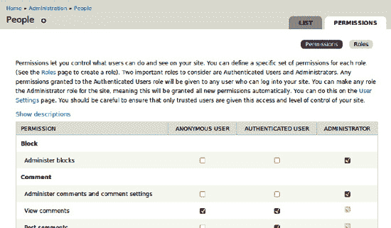

**图 19-2.** 全新 Drupal 核心默认安装配置文件的权限配置页面顶部

随着站点角色数量的增加，以及功能与权限数量的同步增长，这个页面在视觉上会变得更加令人眼花缭乱。每个新增的内容类型都会增加独立的创建、编辑和删除权限，此外，每个内容类型还有针对内容作者的额外编辑和删除权限。

Drupal 的常规准则是*有疑问时，使其可配置或可扩展*。换句话说，不要试图猜测别人需要的用例；相反，要努力让一切成为可能。如果有选项，就提供它。然而，当涉及到管理选项，特别是权限时，我倾向于避免增加“复选框之墙”的规模，除非存在明确的用例。需要特定权限的人可以提交一个 issue 来申请；对于不寻常的用例，需要更细粒度权限的站点开发者可以创建自己的权限，并通过 `hook_menu_alter()` 修改现有菜单项来使页面要求该权限。

 **注意** 当你确实想创建自己的一个或多个权限时，`hook_permission()` 是一个非常直观的钩子，正如 `system.module` 中的示例所示，该示例文档位于 `api.drupal.org/hook_permission`。

因此，你想要重用现有权限，而不是创建自己的权限。但这有一个问题。你在管理  人员的权限标签页（`admin/people/permissions`）中看到的权限，其名称与你的模块必须使用的系统名称或内部名称并不完全相同。首先，所有内部名称（几乎总是）只包含小写字母，但单词也可能不同。这不是你可以猜测的事情；访问将被拒绝，因为没有用户能拥有一个不存在的权限（除了用户 1，它无视用户访问检查）。

 **注意** 从 7 版本开始，权限具有人类可读的名称和描述。这对人类来说很棒，但你们这些试图编写与机器对话代码的开发者，却有点被冷落了。

毫无疑问，会有一个模块用于匹配权限的人类可读名称与内部系统名称——实际上，你会将这个功能整合到 X-ray 中——但作为开发者，即使你总是使用便捷工具，也应该知道如何在没有辅助模块的情况下获取这些信息。

#### 在数据库中查找权限的系统名称

资深 Drupal 开发者 Moshe Weitzman 提倡将探索数据库作为理解 Drupal（无论是整体上还是在特定站点情况下）的一种方式。要列出所有权限的内部名称，你可以从查看 Drupal 站点的数据库开始。查看其中的所有表（通过命令行，如代码清单 19-12 所示，或使用 phpMyAdmin 等更图形化的应用程序），你会发现 `role_permission` 表是唯一名称中提及权限的表。然后，你可以查看 `role_permission` 表内部，以了解它所持有的权限。

**代码清单 19-12.** 用于列出 Drupal 数据库表和权限系统名称的 SQL 命令

```
mysql
mysql> SHOW DATABASES;
mysql> USE d7scratch;
mysql> SHOW TABLES;
mysql> SELECT * FROM role_permission WHERE rid=3;
```

 **提示** 代码清单 19-12 中的命令行步骤对 SQL 命令使用了所有大写字母，以帮助区分命令和数据库、表、字段名称等信息；但是，你不需要全部大写输入 SQL 命令，而且不按 Shift 或 CapsLk 键会容易得多。

正如你将看到的，即使对于未碰过的 Drupal 标准安装，也有大量权限。`rid`（角色 ID）为 3 的是 Drupal 的管理员角色，默认情况下它被授予所有权限（参见代码清单 19-13）。仅针对此角色进行选择，可以让你查看全新安装中存在的所有权限，而无需重复。`role_permission` 表的作用是跟踪哪些角色拥有哪些权限。这就是权限的机器名称可以出现多次的原因（或者对于从未授予任何角色的权限，则根本不会出现）。

**代码清单 19-13.** 在全新 Drupal 标准安装上执行 `SELECT * FROM role_permission WHERE rid=3` 查询的输出


```text
+-----+------------------------------------+------------+
| rid | 权限名称                           | 所属模块   |
+-----+------------------------------------+------------+
|   3 | 访问管理页面                       | system     |
|   3 | 访问评论                           | comment    |
|   3 | 访问内容                           | node       |
|   3 | 访问内容概览                       | node       |
|   3 | 访问上下文链接                     | contextual |
|   3 | 访问仪表盘                         | dashboard  |
|   3 | 访问覆盖层                         | overlay    |
|   3 | 在维护模式下访问站点               | system     |
|   3 | 访问站点报告                       | system     |
|   3 | 访问工具栏                         | toolbar    |
|   3 | 访问用户资料                       | user       |
|   3 | 管理操作                           | system     |
|   3 | 管理区块                           | block      |
|   3 | 管理评论                           | comment    |
|   3 | 管理内容类型                       | node       |
|   3 | 管理过滤器                         | filter     |
|   3 | 管理图片样式                       | image      |
|   3 | 管理菜单                           | menu       |
|   3 | 管理模块                           | system     |
|   3 | 管理节点                           | node       |
|   3 | 管理权限                           | user       |
|   3 | 管理搜索                           | search     |
|   3 | 管理快捷链接                       | shortcut   |
|   3 | 管理站点配置                       | system     |
|   3 | 管理软件更新                       | system     |
|   3 | 管理分类法                         | taxonomy   |
|   3 | 管理主题                           | system     |
|   3 | 管理 URL 别名                        | path       |
|   3 | 管理用户                           | user       |
|   3 | 屏蔽 IP 地址                         | system     |
|   3 | 绕过节点访问控制                   | node       |
|   3 | 取消账户                           | user       |
|   3 | 修改自己的用户名                   | user       |
|   3 | 创建文章内容                       | node       |
|   3 | 创建页面内容                       | node       |
|   3 | 创建 URL 别名                        | path       |
|   3 | 自定义快捷链接                     | shortcut   |
|   3 | 删除任意文章内容                   | node       |
|   3 | 删除任意页面内容                   | node       |
|   3 | 删除自己的文章内容                 | node       |
|   3 | 删除自己的页面内容                 | node       |
|   3 | 删除修订版本                       | node       |
|   3 | 删除分类 1 中的术语                  | taxonomy   |
|   3 | 编辑任意文章内容                   | node       |
|   3 | 编辑任意页面内容                   | node       |
|   3 | 编辑自己的文章内容                 | node       |
|   3 | 编辑自己的评论                     | comment    |
|   3 | 编辑自己的页面内容                 | node       |
|   3 | 编辑分类 1 中的术语                  | taxonomy   |
|   3 | 发表评论                           | comment    |
|   3 | 恢复修订版本                       | node       |
|   3 | 搜索内容                           | search     |
|   3 | 选择账户取消方法                   | user       |
|   3 | 跳过评论审核                       | comment    |
|   3 | 切换快捷链接集                     | shortcut   |
|   3 | 使用高级搜索                       | search     |
|   3 | 使用文本格式 filtered_html         | filter     |
|   3 | 使用文本格式 full_html             | filter     |
|   3 | 查看自己未发布的内容               | node       |
|   3 | 查看修订版本                       | node       |
|   3 | 查看管理主题                       | system     |
+-----+------------------------------------+------------+
61 行记录 (0.00 秒)
```

在列表靠前位置，由核心系统模块提供的权限中，有一个非常适合 X-ray 概览页面的权限：“访问站点报告”。这与管理后台 报告 (`admin/reports`) 下其他页面使用的权限相同。你也可以将其用于 X-ray 页面。

 **提示** Drupal 在其数据库中存储了各种有趣且重要的信息。花些时间探索其中的内容非常值得。

#### 在代码中查找权限的系统名称

另一种查找机器名称的方法是在 Drupal 核心代码中搜索。如前所述，只有当至少一个角色被授予权限时，该权限才会存在于数据库中。一旦你在权限管理页面（`admin/people/permissions`）中看到“查看站点报告”，你就可以在 Drupal 核心模块的代码中搜索它。代码清单 19-14 展示了一个可在终端运行的`grep`命令；你的操作系统的文件浏览器或 IDE 也可以在 Drupal 代码中搜索文本字符串。如果在 Drupal 安装根目录运行，此`grep`命令只会搜索`modules`文件夹中`.module`文件中包含“View site reports”的文本。

**代码清单 19-14.** 在 Drupal 核心中搜索“View site reports”文本的命令行步骤（加粗部分）

```bash


`grep -nHR --include=*.module 'View site reports' modules`

```
modules/system/system.module:233:      'title' => t('View site reports'),
```

正如`grep`命令（或其他搜索方式）所示，这个文本唯一出现的位置是`system.module`文件的第 233 行，如代码清单 19-15 所示。

**代码清单 19-15.** 系统模块`hook_permission()`实现代码片段

```php
/**

 * 实现 hook_permission().

 */

function system_permission() {

  return array(

// ...

    'access site reports' => array(

      'title' => t('View site reports'),

    ),

// ...

  );

}
```

 **提示** 当然，这也是定义自定义权限的方法。第 24 章对此有更深入的描述，但正如代码清单 19-15 中的代码所示：它就是`hook_permission()`实现返回的数组。

每个`hook_permission()`实现都需要返回一个权限数组，该数组以内部系统名称为键（并且至少包含一个带有面向用户名称的 title 元素）。在`system_permission()`返回的数组中，标题为“View site reports”的权限键是“access site reports”，因此你可以将其用作菜单项中的访问参数，如代码清单 19-16 所示。

**代码清单 19-16.** 使用“access site reports”权限进行访问控制的菜单项

```php
  $items['admin/reports/xray'] = array(

    'title' => 'X-ray 技术站点概览',

    'description' => '查看此站点的内部结构。',

    'page callback' => 'xray_overview_page',

    'access arguments' => array('access site reports'),

  );
```

默认的本地任务将继承此访问控制（但其他任务或标签页不会）。

### 补充默认本地任务的第二个本地任务

如前所述，当你创建第一个本地任务时，会生成一个默认本地任务。但直到至少定义了两个用户可访问的本地任务后，这些本地任务才会以选项卡形式显示，如清单 19–17 所示。

**清单 19-17.** 为 X-ray 权限名称页面定义本地任务（显示为选项卡）的菜单项

```php
function xray_menu() {
  $items = array();
// ...
  $items['admin/reports/xray/permissions'] = array(
    'title' => 'Permissions',
    'page callback' => 'xray_permission_names_page',
    'type' => MENU_LOCAL_TASK,
    'weight' => 10,
    'access arguments' => array('access site reports'),
  );
// ...
  return $items;
}
```

你为其设置了权重值 10，这样它会显示在权重为-10 的“概览”选项卡之后。权重值较低（更轻）和负值会被认为会浮到顶部（对于垂直排列的元素）或前面（对于水平排列的元素）。在从左到右书写的语言中，这意味着权重最轻（负值最大或数值最小）的本地任务会作为选项卡显示在权重更重选项卡的左侧，如图 19–3 所示。


**图 19-3.** 当定义至少两个本地任务时，选项卡会显示出来。

 **注意** 默认选项卡（`MENU_DEFAULT_LOCAL_TASK`）会从其父级菜单声明中继承访问控制，但其他选项卡（`MENU_LOCAL_TASK`）则不会。你必须在菜单项声明中声明 `access arguments` 和/或 `access callback`。

现在我们来创建你定义的回调函数 `xray_permission_names_page()` 的具体实现，让这个页面为你提供权限名称，既有人类可读的名称，也有机器名称！

### 调用钩子的所有实现

根据先前查找权限机器名称的研究，你需要的信息存在于各模块对 `hook_permissions()` 的实现中。如何自己获取这些信息呢？有一个专用函数：`module_invoke_all()` 用于调用指定钩子的所有实现。通过以下单行代码，可以从某个模块中调用 Drupal 中所有 `hook_permission()` 的实现，并收集它们的数据：

```php
  $permissions = module_invoke_all('permission');
```

此时 `$permissions` 变量是一个以权限机器名称为键的数组，但其值则是由权限描述和其他你不需要的信息组成的另一个数组。可以快速遍历该数组，丢弃多余数据，如下所示：

```php
  // 从每个权限数组中仅提取权限标题。
  foreach ($permissions as $machine_name => $permission) {
    $names[$machine_name] = $permission['title'];
  }
```

现在，在将这些名称交给主题函数处理之前，我们先按标题字母顺序排序。PHP.net 有出色的内置搜索功能，你只需访问 `php.net/sort` 即可查看结果。它会直接跳转到 PHP 的 `sort()` 函数，但阅读该函数的注释后会发现它并不够好：它会为数组分配新的键，而你使用的是键值数组——系统名称作为键，指向对应的人类可读标题。丢弃机器名称键会破坏你展示机器/系统权限名称与标题对应关系的目的。因此，你将改用 `asort()`，如下所示：

```php
  // 按标题字母顺序排列权限名称。
  asort($names);
```

 **提示** 务必阅读 PHP 手册页面中的“注释”和“参见”部分。特别是“参见”部分列出的相关函数，能让你深入了解 PHP 并帮助你选择真正需要的函数，而不是仅凭第一印象。

下一步，将排序后的 `$names` 数组交给主题函数，格式化为表格显示，这需要一些研究。

### 将数据格式化为表格显示

你希望将权限机器名称和权限标题以整洁的网格形式展示为 HTML 表格。这种需求非常普遍，Drupal 必定有用于打印表格的辅助函数或 API。让我们在核心代码中找找实现实例。由于这是用户界面元素，与其查看代码，不如先浏览用户界面。

点击，再点击……找到了！权限页面本身（`admin/people/permissions`）就是一个表格（一个包含大量复选框的复杂表单，但仍是一个表格）。在代码中搜索 `'admin/people/permissions'` 以查找创建该页面和表格的代码，会在 `modules/user/user.admin.inc` 中发现以下两个函数：`user_admin_permissions()` 和 `theme_user_admin_permissions()`。你也可以通过 `api.drupal.org/user_admin_permissions` 和 `api.drupal.org/user_admin_permissions` 在线查看完整函数。

在复用代码时，你可以从 User 模块中借鉴 Doxygen 文档块。函数 `theme_user_admin_permissions()` 包含如清单 19–18 所示的文档内注释。

**清单 19-18.** `theme_user_admin_permissions()` 的 Doxygen 文档块

```php
/**
 * 返回用于管理权限页面的 HTML。
 *
 * @param $variables
 *   一个关联数组，包含：
 *   - form: 表示表单的渲染元素。
 *
 * @ingroup themeable
 */
```

与所有主题函数一样，它接受一个参数 `$variables`。有时 `$variables` 只包含一个渲染元素（本例中为 `'form'`），但如该文档块所述，它仍然以关联数组形式提供。

#### 使用 `@ingroup themeable` 为可主题化代码编写文档


此外，`User` 模块在其介绍性文档块中通过添加 `@ingroup themeable` 这一行，将 `theme_user_admin_permissions()` 函数归入了一个与主题相关的组。使用 `@ingroup` 指令是一种让你的代码自文档化的方式。

这个主题函数相当复杂，因为它正在切割和拼接一个大型表单。你不需要关心这些细节，可以直接跳到末尾，看看表格是如何生成的。即下面这一行：

`$output .= theme('table', array('header' => $header, 'rows' => $rows, 'attributes' => array('id' => 'permissions')));`

`$rows` 变量需要是一个行的数组，而每一行本身又是一个单元格的数组。每个单元格既可以只是一个字符串，也可以是一个数组，将数据（每个单元格的内容）与应用于该表格单元格的 HTML 属性分开。更多细节请参见 `api.drupal.org/theme_table`。

代码清单 19–19 是 X-ray 模块的一个简单主题化表格版本，它基于调用所有 `hook_permission()` 实现所返回的数据构建而成。

**代码清单 19–19.** 权限名称的主题表格（适用于机器和人类）

```
/**
 * 显示 X-ray 权限名称页面。
 */
function xray_permission_names_page() {
  $names = xray_permission_names();
  return theme('xray_permission_names', array('names' => $names));
}

/**
 * 收集权限名称。
 */
function xray_permission_names() {
  $names = array();
  $permissions = module_invoke_all('permission');
  // 从每个权限数组中提取权限标题。
  foreach ($permissions as $machine_name => $permission) {
    $names[$machine_name] = $permission['title'];
  }
  // 按标题字母顺序排列权限名称。
  asort($names);
  return $names;
}

/**
 * 返回包含权限机器名称和显示名称的表格的 HTML。
 *
 * @param $variables
 *   一个包含以下键的关联数组：
 *   - names: 以机器名称为键的可读名称数组。
 *
 * @ingroup themeable
 */
function theme_xray_permission_names($variables) {
  $names = $variables['names'];
  $output = '';
  $header = array(t('权限标题'), t('权限机器名称'));
  $rows = array();
  foreach ($names as $machine_name => $title) {
    $rows[] = array($title, $machine_name);
  }
  $output .= theme('table', array('header' => $header, 'rows' => $rows, 'attributes' => array('id' => 'xray-permission-names')));
  return $output;
}
```

最终的主题函数接收一个权限名称数组，其中机器名称为键，供人类查看的名称版本为值，该数组由紧接其上定义的 `xray_permission_names()` 函数创建。

如果你未向 Drupal 主题系统注册，那么 `theme_xray_permission_names()` 这个主题函数以及任何用于覆盖它的函数都不会接收到任何内容，也不会被调用。这一点将在下一节介绍。

### 使模块可主题化

模块和主题完美结合，正如 Drupal 强力民谣《我可以做你的模块，你可以做我的主题》（`drupal.org/project/powerballad`；收听风险自负）中所说的那样。一个制作精良的模块允许其呈现的所有元素被使用它的网站的主题所覆盖。这通过在你想向屏幕输出内容时使用 `theme()` 函数，或者向 Drupal 中接受可渲染数组的部分（包括所有页面和块输出）提供一个可渲染数组来实现。（在提供可渲染数组的情况下，Drupal 会为你调用 `theme()`，并利用 `#theme` 和 `#theme_wrapper` 属性。）对于复杂的输出，多个主题函数可能会汇入另一个主题函数。

为了让你的主题函数被识别，你的模块必须实现 `hook_theme()`，该函数返回一个主题钩子或回调及其相关信息的数组；大多数情况下，你只需给出一个名称（你将在其前面加上 `theme_`），而主题将把其 `THEMENAME_` 加在前面。因此，从代码清单 19–19 的代码来看，就是 `xray_permission_names`，你需要告诉它这个钩子接收的是单个渲染元素还是变量数组（你可以为其命名并提供默认值）。代码清单 19–20 展示了 X-ray 模块的 `hook_theme()` 实现，定义了一个带有单个变量（称为 'render element'）的 `xray_permission_names` 主题钩子。

**代码清单 19–20.** 使用单个变量和 'render element' 定义 `xray_permission_names` 主题钩子

```
/**
 * 实现 hook_theme()。
 */
function xray_theme() {
  return array(
    'xray_permission_names' => array(
      'render element' => 'names',
    ),
  );
}
```

尽管此处声明 `xray_permission_names` 接收一个可渲染数组，但当它被传递给一个主题化函数（如 `theme_xray_permission_names()`）时，它会被嵌套在另一个数组中，因此可以像 `$variables` 数组一样被处理，用于向主题化函数传递多个变量，你稍后会看到这一点。

 **提示** 无论何时你对 `hook_theme()` 的实现进行了修改，都需要重建主题注册表才能使这些更改生效，包括你首次定义该钩子时，如果你的模块已经启用的话。你可以通过在代码中运行的地方放置 `drupal_flush_all_caches();` 函数来实现；记得稍后将其移除。你也可以通过管理  配置  开发  性能（`admin/config/development/performance`）页面，点击“清除所有缓存”按钮来手动清除缓存和主题注册表。和往常一样，最方便的方式是通过 Drush 命令 `drush cc all`。

#### 模块主题化资源

阅读第 15 章（关于制作主题）无疑会帮助你理解模块的主题化。在 `drupal.org` 上可以查看更多关于从模块代码生成高质量、可覆盖输出的信息。

- 在 Drupal API 网站 `api.drupal.org/hook_theme` 上阅读更多关于 `hook_theme()` 的内容。

- 在 `api.drupal.org/api/group/themeable/7` 上查看 Drupal 核心中的每个 `theme_` 函数——每个主题制作者可以覆盖以改变 Drupal 输出外观的函数。

- 在 Module Developer's Guide 中阅读“使用主题层 (Drupal 7.x)”，地址为 `drupal.org/node/933976`。

- 在 `groups.drupal.org/node/6355` 上查看 Drupal 标记风格指南，了解关于模块应生成何种 HTML 的工作提案。

 **注** `Drupal.org` 的文档页面完全由志愿者编写和维护。你可能会找到一篇关于如何在 Drupal 6 中完成某项操作的文章，却找不到解释 Drupal 7 中相应操作的指南页面。当你弄清楚某些内容时，你可以编辑或创建相应的指南页面。

### 一种更 Drupal 7 化的方式：利用渲染数组的力量

如前所述，权限名称表格示例取自 Drupal 7 核心，但仍有一种更 Drupal 7 化的方式来实现它！（你从中取例的`User`模块或许也需要一些改进。）如今，可渲染数组被接受并推荐作为页面回调函数的返回结果。本质上，Drupal 会将显示页面所需的所有信息收集成一个巨大的结构化数组，并知道该数组的每个部分需要运行哪个主题函数，但在所有信息整合完毕之前不会执行任何操作。这使得任何人都可以轻松地移动页面的各个部分（在附录 C 中对此有描述）。我们在`xray_permission_names_page()`回调中调用了自己的主题函数，随后对表格主题函数的调用打断了页面流程，在一定程度上改变了功能。采用可渲染数组的方法也让重构代码变得合理，甚至无需自定义主题函数，如清单 19–21 所示。

**清单 19–21.** 重构 X-ray 权限名称页面回调以利用 Drupal 7 的渲染系统

```php
/**
 * 显示权限的机器名和显示名称的表格。
 *
 * @return
 *   一个符合 drupal_render() 预期的数组。
 */
function xray_permission_names_page() {
  $build = array();
  // 收集数据：一个以机器名为键、人类可读名称为值的数组。
  $names = xray_permission_names();
  // 将数据格式化为表格。
  $header = array(t('权限标题'), t('权限机器名'));
  $rows = array();
  foreach ($names as $machine_name => $title) {
    $rows[] = array($title, $machine_name);
  }
  $build['names_table'] = array(
    '#theme' => 'table__xray__permission_names',
    '#header' => $header,
    '#rows' => $rows,
    '#attributes' => array('id' => 'xray-permission-names')
  );
  return $build;
}
```

你使用了相同的数据收集函数并以相同的方式设置数据，也使用了之前确定的同一个`theme_table()`函数，但你是通过在返回的子数组中标识`#theme`属性来告诉 Drupal 调用该函数。之前传递给表格主题调用的一组变量，现在变成了附加属性（`#rows`、`#header`、`#attributes`），Drupal 会将这些属性交给表格主题函数处理。

你刚刚撤销了之前的工作吗？嗯，是的。放弃旧代码正是代码改进的方式。但你学到的所有关于主题化的知识仍然适用，并且很快会再次用到！

你在这里做了一项创新：将表格主题钩子的名称从`'table'`扩展为`'table__xray__permission_names'`。每对双下划线表示双下划线之后的部分是可选的，因此核心的`theme_table()`函数仍然会为你处理主题化，但现在你让那些想要调整你的表格的主题者能够仅在此实例中（或者对于所有 X-ray 表格，停在第一个下划线对处）覆盖`theme_table()`，而不是提出修改 Drupal 中所有表格主题化这种不可行的方案。在通过`theme()`调用表格函数时，同样可以做到这一点。

从流程中移除你的自定义函数意味着：例如，如果主题者想要添加文本，他们不应覆盖你的主题函数，而是应该通过`hook_page_alter()`将其添加到可渲染的页面数组中。参见附录 C 以了解更多关于可渲染数组以及它们在事后修改页面时提供的灵活性。

### 直接调用 Drupal 函数

钩子并非与 Drupal 代码交互的唯一方式；Drupal 还有许多你会想要直接调用的有用函数。清单 19–22 中的示例是一个在此案例中比较内部导向的函数（因为 X-ray 模块的目标是展示 Drupal 的内部运作），但它演示了从 Drupal 函数中获取数据并使用其中一部分的原理。

**清单 19–22.** 使用`menu_get_item()`信息显示路由信息

```php
/**
 * 提供页面回调函数（以及其他路由项信息）。
 */
function xray_show_page_callback() {
  // 不要传入路径；menu_get_item() 会自动查找动态路径，
  // 但如果传入 help 的 $path 变量（例如 node/% 对应 node/1），则会失败。
  $router_item = menu_get_item();
  // 当通过 drush 命令行调用时，menu_get_item() 可能返回 null。
  if ($router_item) {
    return theme('xray_show_page_callback', $router_item);
  }
}

/**
 * 为页面回调和路由项的其他可选元素进行主题化。
 */
function theme_xray_show_page_callback($variables) {
  extract($variables, EXTR_SKIP);
  $output = '';
  $output .= '<p class="xray-help xray-page-callback">';
  $output .= t('本页面由 ');
  if ($page_arguments) {
    foreach ($page_arguments as $key => $value) {
      $page_arguments[$key] = drupal_placeholder($value);
    }
    $output .= format_plural(count($page_arguments),
      '参数 !arg 传递给 ',
      '参数 !arg 传递给 ',
      array('!arg' => xray_oxford_comma_list($page_arguments))
    );
  }
  $output .= t('函数 %func',
               array('%func' => $page_callback . '()'));
  if ($include_file) {
    $output .= t('以及包含的文件 %file',
                 array('%file' => $include_file));
  }
  $output .= '.</p>';
  return $output;
}
```

第一个函数将`menu_get_item()`的返回值赋给变量`$router_item`，并将其传递给一个主题函数。这个主题函数的默认实现是清单 19–22 中的第二个函数。它检查可用信息，并将其添加到输出变量中，最后返回该变量。请注意，它使用了另一个为 X-ray 模块创建的函数`xray_oxford_comma_list()`，该函数将在本章后面定义。

 **提示** 主题函数总是接收数组，即使对于单一的渲染元素也是如此。如清单 19–22 中的`theme_xray_show_page_callback()`所示，处理数组的一个快速方法是将主题函数的第一行设为`extract($variables, EXTR_SKIP);`。这会将`$variables`中的单个元素转换为由`'render element'`提供的名称所对应的变量，并将多个`$variables`元素转换为`hook_theme()`实现中`'variables'`提供的名称所对应的变量。`EXTR_SKIP`参数是一项安全预防措施，用于防止覆盖任何现有变量。

请记住，这个`theme_xray_show_page_callback()`函数（以及任何会覆盖它的函数）——你指望它来显示你收集的信息——除非你在`hook_theme()`中将其注册到 Drupal，否则 Drupal 主题系统将无法找到它；参见清单 19–23。

**清单 19–23.** 在`hook_theme()`中添加内容，用三个变量定义`xray_show_page_callback`主题函数

```php
/**
 * 实现 hook_theme()。
 */
function xray_theme() {
  return array(
// [为节省空间，未显示现有代码]
    'xray_show_page_callback' => array(
      'variables' => array(
        'page_callback' => NULL,
        'include_file' => NULL,
        'page_arguments' => NULL,
      ),
    ),
  );
}
```

不要忘记清除缓存！

传递给`$variables`数组中主题函数的任何变量都将可用于该主题函数，但只有那些在`hook_theme()`中定义的变量（本例中为`page_callback`、`include_file`和`page_arguments`）才能绝对确保被初始化——即存在并具有设定的值，本例中均为`NULL`，但也可以设置任何默认值。（在这种将整个函数的结果提供给主题的特殊情况下，与清单 19–23 中定义计划使用的三个变量不同，你本可以在主题钩子中运行`menu_get_item()`，仅仅为了将其返回的每个键定义为`NULL`或空字符串。）

开始看到这项工作的最后一步是使用`hook_help()`来打印它；你可以在`dgd7.org/259`看到效果。

### 为模块设置样式：添加 CSS 文件

模块在外观方面的首要职责是能够被主题修改。这并不意味着它不能提供自己的默认外观。而且 Drupal 绝不会限制你的风格！模块可以像主题一样，通过在`.info`文件中列出它们，将层叠样式表 (CSS) 添加到每个页面。CSS 文件使用你赋予模块 HTML 输出的类或 ID 来设置其样式。

使用`stylesheets[TYPE][]`指令添加样式表，其中`TYPE`是样式表应使用的媒体类型（例如打印、屏幕等）。第二组方括号是因为同一种媒体可以有多个样式表。如果你希望无论通过何种媒体查看网站都使用你的样式表，请使用“all”作为类型，如清单 19–24 所示。

**清单 19–24.** 带有样式表指令的`.info`文件

```
name = X-ray technical site map
description = Shows internal structures and connections of the web site.
package = Development
core = 7.x
stylesheets[all][] = xray.css
```

 **注意** 样式表文件在`.info`文件中使用`stylesheets`指令列出，*而不是*`files`指令。

**清单 19–25.** X-Ray 模块的 CSS 文件，平淡地（但正确地）命名为`xray.css`

```
p.xray-help,
div.xray {
  display: block;
  color: white;
  padding: 5px;
  background-color: black;
  border: 4px solid white;
  -webkit-border-radius: 8px;
  -moz-border-radius: 8px;
  border-radius: 8px;
}
```

在清单 19–25 中，添加到`xray.info`的那一行告诉 Drupal 在每个页面上添加这个 CSS（指定文件`xray.css`的内容）。文件`xray.info`和`xray.css`都位于 xray 目录的同一层级，否则`xray.info`必须提供`xray.css`的路径。清单 19–25 中定义的样式为帮助消息和标识表单的 div 提供了时尚的、显瘦的黑色背景和圆角边框。之所以有效，是因为你在通过`hook_help()`和`hook_form_alter()`打印输出时，用这些类包裹了输出内容。

 **警告** 始终为模块的 CSS 文件添加命名空间；也就是说，使用模块的名称作为 CSS 文件的名称或 CSS 文件名称的第一部分。这是因为 Drupal 允许主题仅通过同名文件来自动覆盖 CSS 文件，而你不希望主题意外覆盖你的样式表。

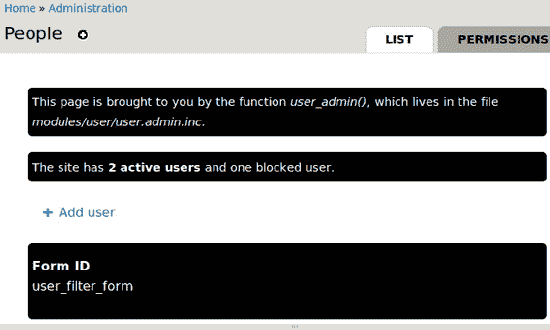

**图 19–4.** X-ray 模块的显示（包括两个帮助区域消息和在表单中打印的表单 ID）

**清单 19–26.** 对`xray.css`文件的补充

```
/* 使非帮助区域的 xray 字体大小与帮助文本大小一致。 */
div.xray {
  font-size: 0.923em;
}

/* 移除 X-ray 输出中多余的表单项内边距（用于表单 ID）。 */
div.xray .form-item {
  margin: 0;
  padding: 0;
}
```

一旦你的 CSS 文件中有适用于你需要影响的 HTML 的条目（并且清除了 Drupal 的 CSS 聚合和浏览器的缓存），你就可以使用诸如 Firefox 的 Firebug 之类的 HTML/CSS 检查工具来调整属性，直到达到你想要的视觉效果。清单 19–26 显示了对`xray.css`文件的补充。你的模块样式至少应在 Stark、Bartik 和 Garland 这些核心主题中进行测试。如果你的模块输出任何将在管理区域看到的内容，这些部分还应在核心的 Seven 主题中进行测试。

### 数据库 API

Drupal 7 引入了一个健壮的数据库层，它构建在 PHP 数据对象 (PDO) 之上，PDO 是一个轻量级、一致的数据库访问接口。Drupal 7 数据库 API 由其首席开发者 Larry Garfield (crell) 称为 DBTNG (Database The Next Generation)，它提供了用于添加、修改和读取 SQL 数据的面向对象工具。

这个用于访问多种数据库服务器的、与供应商无关的抽象层，旨在尽可能保留 SQL 的语法和功能，但更重要的是，它：

*   允许开发者使用复杂功能，例如事务，这些功能可能并非所有数据库引擎原生支持。

*   为动态构建查询提供了结构。

*   强制实施安全检查和其他良好实践。

*   为模块提供一个干净的接口来拦截和修改站点的查询。

最明显的好处是，你的 Drupal 应用可以运行在任何拥有适用于 Drupal 7 数据库 API 的驱动程序的数据库（或不止一个数据库）上。所有正确编写以利用数据库层的查询都不会关心你的站点使用的是哪个数据库。Drupal 核心开箱即支持 MariaDB/MySQL、PostgreSQL 和 SQLite。MSSQL (`drupal.org/project/sqlsrv`) 和 Oracle (`drupal.org/project/oracle`) 的后端数据库也已经存在。（所谓的 NoSQL 数据库 MongoDB 用于帮助 Drupal 扩展，如第 27 章所述，它利用 Field API 的可插拔存储，并且*不*使用为 SQL 数据库设计的数据库抽象层。）

 **注意** 从版本 7 开始，Drupal 提供了事务支持。这意味着如果你正在对数据库进行更改，并且这些更改必须是全部或全无（经典例子是从一个账户扣款到另一个账户），那么你需要将对数据库的操作包裹在一个事务中。这通过使用此处描述的函数`api.drupal.org/db_transaction`声明一个事务变量来实现。该事务一直持续到该变量被销毁（包括在其定义的函数关闭时）。

另一个巨大的优势来自于动态查询（包括所有插入、更新和删除查询）的统一结构，即智能的数据库层有助于你的站点扩展。对于支持此特性的数据库（以及非常常见的 MariaDB/MySQL 等其他数据库），多个插入操作将在一次查询中执行（一种快得多的方法），而对于不支持该特性的数据库，则回退到重复执行一系列单个查询。

总而言之，DBTNG 是 Drupal 7 发布周期中关键的开发者体验计划之一。接下来，我将介绍如何使用它。你也可以参考位于`drupal.org/developing/api/database`和`api.drupal.org/api/group/database`的优秀文档，以及位于`drupal.org/project/examples`的 DBTNG 示例模块。

#### 使用选择查询获取数据

从数据库中提取数据是你在 Drupal 核心、贡献模块以及自己的模块中遇到的最常见的数据库相关任务。

对于 Structure 管理页面顶部提供的摘要 X-Ray 功能，显示站点拥有多少内容类型会很方便。这当然意味着要统计内容类型的数量。你可以通过查看`node_type`表来获取内容类型的数量。请使用命令行数据库客户端或 phpMyAdmin 等应用程序浏览站点的数据库表及其中的列和内容。

开箱即用，Drupal 将数据存储在关系数据库中（MariaDB/MySQL、Postgres 和 SQLite 就是此类数据库）。通过使用标准化的结构化查询语言 SQL，可以访问、操作和保存这些数据。如前所述，所有动态查询（包括操作和保存）都应使用数据库 API 查询构建器，但非动态或*静态*查询可以且应该直接使用 SQL。（标准化方面存在一些不足，而解决这些不足正是数据库 API 的目的之一，不过这在你选取数据的大多数情况下并不是问题。）

我们鼓励你在数据访问查询中尽可能使用纯 SQL（稍后会详细介绍）。这意味着对于以 SELECT 开头的 SQL 查询，要使用`db_query()`函数，如清单 19-27 所示。

**清单 19-27.** 从`node_type`表中统计内容类型数量的基本 SQL 查询

```
db_query("SELECT COUNT(*) FROM {node_type}")->fetchField();
```

SQL 位于引号之内。通常，这样的 SQL 会采用"`SELECT column_a, column_b FROM table_y`"的形式。在这个例子中，它不是通过列名来选取数据，而是统计`node_type`表中所有行的数量。当添加了用于获取单个字段的方法`->fetchField()`时，`db_query()`会直接返回一个数字。对于新安装的标准 Drupal 安装包（具有 Article 和 Basic page 这两种内容类型），该数字是 2。

`db_query()`函数几乎会原封不动地将你提供的任何内容传递给数据库；它只负责添加表前缀和展开数组占位符，仅此而已。这是 Drupal 获取可通过单个标准 SQL 查询获取的数据的最简单、最快速的方式。

**提示** 除了`fetch*()`方法之外，你不能向`db_query()`附加其他方法。

为了完整起见，该查询不应返回任何已禁用的内容类型的数据。这意味着需要添加一个 WHERE 子句。

**提示** 使用 phpMyAdmin 或命令行`mysql`来测试查询。你需要使用实际的表名（不带花括号）和实际的值（而不是占位符）。你还必须自行处理转义（字符串加引号，数字不加引号）；而使用`db_query()`和`db_select()`并正确使用占位符编写的查询，Drupal 会替你处理这些。这样做的好处是你可以立即测试查询，而且 phpMyAdmin 等工具可以帮助你构建查询。

清单 19-28 中的代码是一个原始 SQL 查询的例子，可以在命令行或使用 phpMyAdmin 等应用程序中运行。

**清单 19-28.** 从节点类型表返回可用内容类型数量的原始 SQL

```
SELECT COUNT(*) FROM node_type WHERE disabled = 0;
```

**注意点** 如果你不熟悉 SQL，这里有一个容易出错的地方——等号比较使用单个等号，而不是两个。在 SQL 中，应使用`<>`来表示“不等于”的比较，这在 PHP 中同样有效。

要在 Drupal 中使用此查询，你可以使用`db_query()`函数并对 SQL 进行几处修改。清单 19-29 是与清单 19-27 相同的查询，但采用了 Drupal 作为`db_query()`内容所需的风格；换句话说，它在表名两侧添加了花括号，并通过占位符传递值。

**清单 19-29.** 从`node_type`表中统计内容类型数量的推荐基本 SQL 查询

```
db_query("SELECT COUNT(*) FROM {node_type} WHERE disabled = :status", array(':status' => 0))->fetchField();
```

你已经将`node_type`替换为`{node_type}`，这样你的模块就能在使用数据库表前缀的站点上正常工作。第二个更大的改动是使用了占位符。你使用了`disabled = :status`，而不是`disabled = 0`。在这种情况下，它替换的是一个硬编码的零，并非严格必要。但当它是一个可能来自用户的变量时，则绝对必要。你绝不应看到类似`disabled = $status`的写法；它应该始终是`disabled = :status`，并在 select 查询的第二个参数中使用`array(':status' => $status)`。请注意，这个数组中可以包含任意数量的占位符。

使用占位符数组是一种最佳实践，对于可能来自用户的变量是绝对必要的，因此所有变量都应始终使用它。占位符还会为你处理字符串值的引号（并传入不带引号的数值）。

**提示** 你可以通过创建一个包含`index.php`前三行（共四行）代码的文件，然后在该文件后添加你想要运行的代码，在引导后的`test.php`文件中测试像这样的简单查询（以及其他代码）。别忘了打印输出。有关如何使用`test.php`文件来辅助开发流程的完整说明，请参见第 33 章或`dgd7.org/testphp`。

Drupal 更复杂的数据库函数`db_select()`也可用于构造获取数据的静态查询，不过不建议这样使用。即使你只了解一点 SQL，简单的`db_query()`方法对你来说也是最容易的。如果你不熟悉 SQL，同时学习普通 SQL 和 Drupal 面向对象的数据库语法可能会让人应接不暇。使用`db_select()`函数编写的相同简单选择查询可能看起来像清单 19-30 中的内容，它统计一个站点上的内容类型数量，却不必要地使用了完整的数据库 API（仅作示例）。

**清单 19-30.** 一个简单的选择查询

```
db_select('node_type')
  ->fields('node_type')
  ->condition('disabled', 0)
  ->countQuery()
  ->execute()
  ->fetchField();
```

此查询选择`node_type`表，为了查询能运行而添加`node_type`表的所有字段，添加一个等同于"`WHERE disabled = 0`"子句的条件，添加`countQuery()`方法，执行查询，并获取单个字段。`countQuery()`方法使这个查询返回结果集中行的数量，而不是任何字段的内容。有关`db_select()`版本静态查询的更多反例，请参见`dgd7.org/235`。

**注意** 实现避免重复代码和编写可维护代码这些优点的最佳实践表明，你应该研究其他从 Drupal API 获取此信息的方法，而不是编写自己的查询。而 Drupal 提供了大量的 API。与获取内容类型信息（以及你将看到的 Drupal 其他核心组件）极为相关的 Drupal 7 新 API 是实体 API。这将在接下来的章节“Drupal 实体：站点组件背后的通用结构”中介绍（在此之前还会详细介绍更多数据库 API 的内容）。

在继续讲解需要使用`db_select()`的动态查询之前，让我们先看更多几个将 SQL 放入`db_query()`函数的静态查询示例。

### 使用两表联动的静态查询获取数据

X-ray 模块还能提供另一项信息：每个主题（theme）启用了多少个区块（block）。`modules/block.module` 中有几个查询从区块表中获取信息，但它们并没有精确获取这些信息，而且无论如何它们都不在你可以使用的独立 API 函数中。因此，你完全有理由编写自己的查询。你可以将其封装在一个函数中，以便日后重用，如清单 19-31 所示。

**清单 19-31.** 统计每个主题已启用区块数量的静态查询

```
/**
 * 获取每个主题已启用的区块数量。
 */
function xray_stats_blocks_enabled_by_theme() {
  return db_query("SELECT theme, COUNT(*) as num FROM {block} WHERE status = 1 GROUP BY theme")->fetchAllKeyed();
}
```

Drupal 数据库 API 为 `db_query()` 对象提供的 `->fetchAllKeyed()` 方法，会获取任意一个两列的结果集（这里指主题和区块计数），并生成一个数组，其中第一列的值作为键，对应第二列的值。

**清单 19-32.** `db_query("SELECT theme, COUNT(*) as num FROM {block} WHERE status = 1 GROUP BY theme")->fetchAllKeyed()` 返回的数组

```
array (
  'bartik' => '10',
  'garland' => '7',
  'seven' => '9',
  'stark' => '7',
)
```

 **注意** `->fetchAllKeyed()` 方法*仅*返回结果集的前两列，并会静默忽略其余列。

清单 19-32 中仍存在两个问题。首先，本节的标题是“带联动的静态查询”，但该查询尚未包含联动。其次，该查询返回了每个主题的已启用区块数量，而将报告限制为仅针对已启用的主题会更有意义。让我们修改查询以解决这两个问题，如清单 19-33 所示。

**清单 19-33.** 涉及从区块表到系统表联动的静态查询，以将报告数据限制为已启用的主题

```
/**
 * 获取每个已启用主题已启用的区块数量。
 */
function xray_stats_blocks_enabled_by_theme() {
return db_query("SELECT b.theme, COUNT(*) as num FROM {block} b INNER JOIN {system} s ON b.theme = s.name WHERE s.status = 1 AND b.status = 1 GROUP BY b.theme")->fetchAllKeyed();
}
```

此查询第一个必要的新部分是对 `{block}` 表的引用后跟一个字母 `b`（可以是任何字符或单词），用作其*表别名*。下一个主要添加部分是 `JOIN` 语句，这也就是需要表别名的原因；现在可能有两个来自不同表的同名列。然后，`b` 被用在 `WHERE` 条件 `status = 1` 之前，使其变为 `b.status = 1`。这对于数据库引擎区分区块状态和主题状态来说是必要的，因为你要联接到区块表的 `system` 表也有一个 `status` 列。

`system` 表也被赋予了一个别名 `s`，如在 `JOIN` 语句中所见，该语句紧随其后并成为 `FROM` 语句的一部分，因此整体读作 `FROM {block} b INNER JOIN {system} s ON b.theme = s.name`。

内连接 (`INNER JOIN`) 意味着两个表中都必须有匹配项，结果集中才会存在行；语句的 `ON` 部分声明了用于匹配两个表的列；在本例中，是区块 (`b`) 表的 `theme` 列（包含主题系统名称）与系统 (`s`) 表的 `name` 列（包含包括主题在内的项目名称）。整个查询中一致地使用了表别名以避免歧义，尽管在本例中 `system` 表没有 `theme` 列，`block` 表没有 `name` 列，因此在引用 `theme` 列时可以省略区块表的别名 `b`，在引用 `name` 列时可以省略别名 `s`，但一旦开始使用表连接，明确指定别名是很重要的。

#### 非数据库插曲：在两个位置显示相同数据

在继续讨论动态结构化查询之前，让我们先离开数据库，完成这个循环，向网站构建者展示 X-ray 的信息。首先，清单 19-34 展示了一个函数，用于提供“结构”页面的完整摘要，该函数调用了你刚刚定义的函数 `xray_stats_blocks_enabled_by_theme()`，以及另外几个在其他地方定义的函数。

**清单 19-34.** 在结构页面上显示摘要数据

```
/**
 * 结构部分的摘要数据 (admin/structure)。
 */
function xray_structure_summary() {
  $data = array();
$data['blocks_enabled_by_theme'] = xray_stats_blocks_enabled_by_theme();
  $data['block_total'] = xray_stats_block_total();
  $data['content_type_total'] = xray_stats_content_type_total();
  // @TODO menu, taxonomy
  return $data;
}

/**
 * 实现 hook_theme()。
 */
function xray_theme() {
  return array(
// [为节省篇幅，未显示现有代码] ...
'xray_structure_summary' => array(
'variables' => array(
'data' => array(),
'attributes' => array('class' => 'xray-help'),
),
),
  );
}

/**
 * 实现 hook_help()。
 */
function xray_help($path, $arg) {
  $help = '';
// [为节省篇幅，未显示现有代码] ...
  switch ($path) {
    // 主要管理部分的摘要。
// [为节省篇幅，未显示现有代码] ...
case 'admin/structure':
$variables = array('data' => xray_structure_summary());
return $help . theme('xray_structure_summary', $variables);
// [为节省篇幅，未显示现有代码] ...
    default:
      return $help;
  }
}

/**
 * 返回“结构”部分 (admin/structure) 数据的 HTML 文本摘要。
 *
 * @param $attributes
 *   （可选）一个关联数组，包含 HTML 标签属性，适合通过 drupal_attributes() 展开。
 * @param $variables
 *   一个包含以下键值的关联数组：
 *   - data: xray_structure_summary() 的结果。
 *
 * @ingroup themeable
 */
function theme_xray_structure_summary($variables) {
  // 将 xray_structure_summary() 的数据元素提取为直接变量。
  extract($variables['data'], EXTR_SKIP);
  $attributes = drupal_attributes($variables['attributes']);

  $output = '';   $output .= "<p $attributes>";
  $output .= t('此站点共有 @total 个可用区块。其中，',
             array('@total' => $block_total));
  $output .= ' ',
  $list = array();
foreach ($blocks_enabled_by_theme as $theme => $num) {
$item = '';
$item .= format_plural($num, '1 个已启用', '@count 个已启用');
$item .= ' ' . t('在 %theme 上', array('%theme' => $theme));
if ($theme == variable_get('default_theme', 'bartik')) {
$item .= t('，这是默认主题');
}
elseif ($theme == variable_get('admin_theme', 'seven')) {
$item .= t('，这是管理后台主题');
}
$list[] = $item;
}
$output .= xray_oxford_comma_list($list, array('comma' => '; '));
  $output .= '.  ';
  $output .= format_plural($content_type_total,
    '该站点有一个内容类型。',
    '该站点有 @count 个内容类型。'
  );
  return $output;
}
```

`xray_oxford_comma_list()` 函数在第 20 章中标题为“当 Drupal 的 API 无法满足需求时编写实用函数”的部分定义。目前，你只需知道它可以将传入的项目数组转换为文本字符串输出即可。

**清单 19-35.** 在 X-ray 报告概览页面上复用摘要

```php
/**
 * 包含站点内部数据摘要的总览页面。
 */
function xray_overview_page() {
  $build = array();
  $build['intro'] = array(
    '#markup' => '<p>' . t("站点内部结构的技术总览。这些摘要也会出现在/可以配置为出现在主管理区域。") . '</p>',
  );
  // 重复每个管理区域顶部的摘要。
// [为节省空间，现有代码未显示] ...

  $build['structure_title'] = array(     '#theme' => 'html_tag',
    '#tag' => 'h3',
    '#attributes' => array('class' => 'xray-section-title'),
    '#value' => t('结构摘要'),
  );
$data = xray_structure_summary();
$build['structure_summary'] = array(
'#theme' => 'xray_structure_summary',
'#data' => $data,
'#attributes' => array('class' => 'xray-report'),
);

  return $build;
}
```

总览页面以一个可渲染数组的形式构建。与稍显过时的 Help 系统不同——你必须在其中自行调用 `theme()` 将变量数组处理成 HTML 字符串——在页面回调函数 `xray_overview_page()` 中，你可以构建并返回一个完整的可渲染数组，Drupal 会自行处理它。站点构建者可以通过更改 `#theme` 函数甚至向 `#data` 数组添加内容来修改此页面数组，但很少有人需要如此复杂的操作。大多数主题开发者的需求通过 CSS 即可满足，因此你还可以传入一个不同的类（在 `#attributes` 数组中），以便你或其他人可以轻松地通过 CSS 对其设置不同的样式。

还有两个函数为你刚才主题化并呈现的站点“结构”管理区域提供数据。这些数据也通过 SQL 查询提供。

### 使用 `variable_get()` 及另一个静态 SELECT 计数与分组查询

用于呈现结构相关信息的其他输入也来自静态（`db_query()` 风格）的 SQL 查询。其中获取内容类型统计数据的函数是 `xray_stats_content_type_total()`，它返回你在清单 19–26 中展示的查询，用于计算非禁用内容类型的数量。

使用的另一项数据是可用的区块总数，这可以从区块表中计算出，并通过主题进行过滤，因为区块表中每个主题的每个区块都有一行记录。

**清单 19–36.** 返回站点可用区块总数的查询

```php
/**
 * 获取 Drupal 站点上可用区块的总数。
 */
function xray_stats_block_total() {
  // 获取区块总数。所有区块在区块表中会为每个主题重复出现，
  // 因此你需要针对一个主题进行过滤（可以是任何主题）。
  return db_query("SELECT COUNT(*) FROM {block} WHERE theme = :theme", array(':theme' => variable_get('theme_default', 'bartik')))->fetchField();
}
```

清单 19–36 使用了 Drupal 的 `variable_get()` 函数。`variable_get()` 函数的有趣之处在于它必须始终提供自己的默认值作为第二个参数（此处为 'bartik'）。该值应与对应的 `variable_set()` 函数使用的值相同。这是因为 `variable_set()` 函数可能从未被执行过——例如，如果从未有人保存过使用该函数的设置页面。在这种情况下，该配置值在 `{variable}` 表（该表在每个页面加载时会被加载到 `$conf` 数组中）中不存在，`variable_get()` 将返回空值。

模块中使用类似的查询和主题化函数来获取站点其他区域的信息；请参阅代码或 `dgd7.org/252`。

 **提示** Drupal 为其表的命名方案并不完全一致。这通常是由于需要避免各数据库保留使用的特殊词。因此，尽管规则是表名采用其所存内容的单数形式（*comment*、*block*、*variable*），但用户记录的表仍被称为 *users*，因为 *user* 这个术语在 MySQL 中是保留字。

### 动态查询

如前所述，在可能的情况下最好使用简单的 SQL 查询，并且你已经开始演示查询构建器的替代方案，但尚未定义“可能的情况”具体指什么。对于所有动态查询，必须使用数据库 API 的函数和方法（即 DBTNG 在开篇部分所描述的所有优点），其中包括使用 `db_select()` 替代 `db_query()` 进行动态 SELECT 查询。动态查询包括：

- *所有* `INSERT`、`UPDATE` 或 `DELETE` 查询（数据库 API 分别提供 `db_insert()`、`db_update()` 和 `db_delete()`）。

- Drupal 可能需要修改的 `SELECT` 查询，例如用于提供访问控制。

- 希望基于用户输入进行更改的 `SELECT` 查询（这意味着查询结构会发生变化，因为 `db_query` 可以处理传入的内容）。

- 使用在不同数据库引擎之间实现不一致的功能的 `SELECT` 查询。例如，如果你在 `->condition()` 方法中使用 `db_select()` 配合 `LIKE`（或 `NOT LIKE`）作为第三个参数，则可以确保比较将以不区分大小写的方式进行。

 **注意** 提供访问控制的需求包括每次查询节点表时，因此你必须使用 `db_select()` 查询构建器，并在 `->execute()` 方法之前包含 `->addTag('node_access')` 方法。省略此标签将构成安全漏洞，导致站点访客可能看到未经授权的內容，例如未发布的节点。别告诉别人你是在这里看到的，但如果你刚接触 SQL 并同时在学习数据库 API，有时即使不需要也使用更重量级的数据库 API 函数，只要你用得更顺手，也并无大碍。然而，`db_query()` 的 SQL 方法还有几个额外的优点，使得它在可能的情况下值得被使用：你能学习到底层查询（这对使用查询构建器方法也有价值）；你能比用 `db_select()` 查询构建器更快地测试查询（例如直接在数据库上操作而完全不依赖 Drupal）；最后，你可能会遇到查询构建器无法完成的复杂查询。

本章中你已经大量接触了数据库。在一个理想的 Drupal 世界中，你的模块不应查看其他模块的数据库表；而是应该有一个 API 来获取所需的一切信息。实际上，对于一个模块开发者来说，为其他模块可能从数据中需要的任何内容都尝试创建一个函数，无异于一次过早优化的练习。如前所述，Drupal 7 中的数据库层非常健壮，它允许数据存储由任何与 Drupal 数据库层集成的数据库来处理，而你的代码无需关心具体使用哪种数据库。然而，当你的模块需要存储数据时，使用数据库层无疑是你分内之事！

你已经看到了一个查询构建器的刻意示例；现在让我们看一些真实的例子。但首先，如果你的模块要使用 SQL 操作其*自身*的数据，它需要创建一个数据库表。

### `.install` 文件

你可能已经猜到，创建数据库表涉及另一个钩子：`hook_schema()`。

到目前为止，你看到的每个钩子都在 `.module` 文件中实现，但有四种主要类型的钩子需要放在一个不同的文件中：即 `.install` 文件。这些钩子是 `hook_install()`、`hook_schema()`、`hook_uninstall()` 和 `hook_update_N()`。当你的模块拥有自己的数据库表时，你需要一个实现 `hook_schema()` 的 `.install` 文件。拥有 `.install` 文件还有其他原因。你的 `hook_install()` 可以往该数据库表（或其他模块的表中）插入数据，并且可以用它来通过 `drupal_set_message()` 添加一条友好的消息，以帮助人们在你的模块启用后知道该做什么。如果你的数据库表的架构发生了变化，则需要一个或多个 `hook_update_N()` 的实现，例如 `example_update_7000` 和 `example_update_7001()`。虽然你应该始终确保 `hook_schema()` 包含最新的架构，但如果你已经发布了模块的某些版本，然后更改了架构，你就需要 `hook_update_N()` 来帮助那些安装了旧架构版本模块的用户进行更新。

其他`.install`模块钩子（或者实际上，所有这些都被称为回调函数，因为它们仅为正在安装的单个模块而被调用）包括`hook_requirements()`，用于在安装模块前检查你能编码的任何需求是否满足；以及`hook_update_dependencies()`，用于确保依赖于另一个模块的`hook_update_N()`函数的`hook_update_N()`函数不会在其之前运行。请参阅`dgd7.org/253`以获取指向`api.drupal.org`上这些函数的便捷可点击链接，以及关于所有`.install`回调的更多信息。

 **注意：** 从 Drupal 7 开始，如果你的模块只需要定义一个数据库表，你可以跳过实现`hook_install()`和`hook_uninstall()`。如果 Drupal 在你的`.install`文件中看到了`hook_schema()`的实现，它会推断出你想要在安装时创建其中定义的表，并在卸载时删除它们。请注意，如果你的模块在变量表中放置了任何配置设置，你仍然必须使用`hook_uninstall()`并结合`variable_del()`或通过`db_delete()`自行调用 SQL 来清理这些设置。

### 确定你的数据模型

在创建数据库表之前，理想情况下是在编写相关部分的代码之前，你需要确定什么样的数据模型能服务于你的目的。

X-ray 模块需要一个数据库表来存储站点上钩子调用的记录，这样它就不必在每次缓存刷新时从头开始，并且可以将来自多个来源的钩子信息合并到一个可排序的表中。你想要存储的信息是：

- 被调用钩子的名称。
- 你首次记录该钩子被调用的时间。
- 你最后一次记录该钩子被调用的时间。
- 实现此钩子的模块列表（如果有的话）。

收集钩子信息的代码，即`module_implements_alter()`钩子的调用，仅在钩子实现缓存被清除时运行，因此记录钩子被调用的总次数似乎没有确定的含义。但你无论如何还是会放一个计数器进去，看看是否会出现任何模式。

 **注意：** 当 Drupal 存储可能具有不同结构或数量的额外数据，并且不希望对其进行排序时，Drupal 通常选择将所有数据作为序列化数组塞进单个列中。

由于数据库无法对信息列表（例如你将存储在模块列中的信息）进行排序，你可以添加另一条你想单独存储的信息：实现模块的数量。（你也可以将实现模块存储在一个单独的数据库表中，该表包含两列，`hook`和`module`，这两者一起提供唯一的组合——但为此设立一个单独的表违反了从简单开始，并在需要时**才**添加所需功能的常识。最初，X-ray 甚至完全跳过了自己的表，从 Drupal 的`cache_bootstrap`表中提取被调用的钩子信息；请参阅`dgd7.org/255`。）

### 创建数据库表

Drupal 核心的`.install`文件及其`hook_schema()`实现是了解如何定义各种数据类型的好地方。对于钩子名称，你需要一个基本的文本字符串：`varchar`。对于时间戳，使用数字：`int`。对于中等大小的序列化数组的数据库字段类型比较难找，但`system_schema()`在`{system}`表的 info 数组中就有，因此你可以复制并修改其定义，其类型是`blob`。对于计数，你又需要一个整数（`int`）。主键是钩子（每个钩子在表中应该只出现一次），并且你需要确保为你想要排序的每个附加列（字段）添加一个索引。请注意，主键会自动被索引。

闲话少说。现在让我们定义一个数据库表。如果你还没有`.install`文件，请创建一个，并实现`hook_schema()`。列表 19–37 显示了用于保存钩子调用和实现信息的 X-ray 模块的架构定义，该表包含四列（或称字段）。

 **注意：** 虽然每个拥有自己数据库表的模块都应该在其`.install`文件中定义这些表，但当数据存储由模块代劳时（例如 Field API 的情况），你不需要自己定义表。

***列表 19–37.** `xray.install`文件的全部内容*

```php
<?php
/**
 * @file
 * X-ray 模块的安装、更新和卸载函数。
 */

/**
 * 实现 hook_schema()。
 */
function xray_schema() {
  $schema['xray_hook'] = array(
    'description' => '钩子调用记录（使用 module_invoke_all）。',
    'fields' => array(
      'hook' => array(
        'description' => '钩子的主要标识符。',
        'type' => 'varchar',
        'length' => 255,
        'not null' => TRUE,
        'default' => '',
      ),
      'first' => array(
        'description' => '首次记录钩子的时间戳。',
        'type' => 'int',
        'unsigned' => TRUE,
        'not null' => TRUE,
        'default' => 0,
      ),
      'last' => array(
        'description' => '最后一次记录钩子的时间戳。',
        'type' => 'int',
        'unsigned' => TRUE,
        'not null' => TRUE,
        'default' => 0,
      ),
      'count' => array(
        'description' => '钩子被记录为调用的总次数。注意，这仅在缓存清除后才会记录。',
        'type' => 'int',
        'unsigned' => TRUE,
        'not null' => TRUE,
        'default' => 0,
      ),
      'modules' => array(
        'description' => '实现此钩子的模块机器名称的序列化数组。',
        'type' => 'blob',
        'not null' => TRUE,
      ),
      'modules_count' => array(
        'description' => '实现模块的数量计数。',
        'type' => 'int',
        'unsigned' => TRUE,
        'not null' => TRUE,
        'default' => 0,
      ),
    ),
    'indexes' => array(
      'xray_hook_first' => array('first'),
      'xray_hook_last'  => array('last'),
      'xray_hook_count' => array('count'),
    ),
    'primary key' => array('hook'),
  );
  return $schema;
}
```

虽然你不再需要告诉 Drupal 在安装时创建数据库表或在卸载时销毁它，但如果你有一个已发布的现有模块，你*确实*需要通过更新钩子（update hook）告诉它创建该表。此外，你需要将该表结构（schema）复制到那个更新钩子中，因为它需要作为运行任何其他更新的基准。想象一下，你在模块的 1.2 版本中添加了一个数据库表，在 1.3 版本中向该表添加了一个列，并在 1.4 版本中更改了唯一索引。下载 1.4 版本的用户应该拥有一个包含所有这些信息的`hook_schema()`版本。然而，你的忠实用户（你真正关心的那个人）如果之前用的是 1.1 版本并升级到了 1.2，则需要一个创建该数据库表的更新钩子。当更新到 1.3 版本时，同一个用户还需要一个添加列的更新钩子。同样，当更新到 1.4 版本时也是如此。（事实上，X-ray 在这个表添加之前就有一个测试版，因此需要一个安装完整表的更新钩子。关于此细节以及`hook_update_N()`的更常见用法，请参见`dgd7.org/261`。）

### 插入与更新数据

你已经有了一个数据库；现在该往里面填充数据了。在代码的同一个位置，你经常需要插入新的数据行或更新现有的数据行。正如后面所述，`db_merge()` 通常是实现这一目的的最佳函数。但情况并不总是如此，这里也不例外：在向前一节定义的 `{xray_hook}` 表中添加或更新钩子信息时，你需要同时使用 `db_insert()` 和 `db_update()`。

你不能使用 `db_merge()` 的原因是：如果是插入操作，你需要设置 "first time" 字段，但如果是更新操作，则不应修改该字段。同时，你还需要递增计数值。因此，你需要检查该钩子是否已经保存过，并从 `count` 列中获取该值。这应该通过直接的 SQL 语句完成，并且可以在一条语句中完成。清单 19–38 展示了 `db_insert()` 和 `db_update()` 数据库 API 函数的使用。由于在通往你最关心的两个 DBTNG 函数的过程中会遇到一些波折，代码中这部分以粗体显示。

**清单 19–38.** 使用 `db_insert()` 和 `db_update()` 数据库 API 函数

```php
/**
 * 实现 hook_module_implements_alter()。
 */
function xray_module_implements_alter(&$implementations, $hook) {
  // 由于 hook_module_implements_alter() 在 xray_hook 表创建之前
  // 就会为 X-ray 调用，检查该表是否存在，如果不存在则退出此函数。
  // 由于此钩子在缓存清除后的页面加载中可能被多次调用，因此静态缓存此检查结果。
  static $table = NULL;
  if ($table === FALSE || !($table = db_table_exists('xray_hook'))) {
    return;
  }

  $is_existing = (bool) $count = db_query('SELECT count FROM {xray_hook} WHERE hook = :hook', array(':hook' => $hook))->fetchField();
  // 将此钩子被调用检查的次数增加 1。
  // 如果 $count 为 FALSE，则 $count++ 无法正常工作。
  if ($is_existing) {
    $count++;
  }
  else {
    $count = 1;
  }

  // 你不希望第一次和最后一次的时间戳在它们本应相同的情况下
  // 出现一秒的差异。
  $timestamp = time();

  $fields = array(
    'last' => (int) $timestamp,
    'count' => (int) $count,
    'modules' => serialize($implementations),
    'modules_count' => (int) count($implementations),
  );

  if ($is_existing) {
    // 更新钩子记录。
    db_update('xray_hook')
      ->fields($fields)
      ->condition('hook', $hook)
      ->execute();
  }
  else {
    // 该钩子尚未记录，将其插入数据库。
    $fields['hook'] = (string) $hook;
    $fields['first'] = (int) $timestamp;
    db_insert('xray_hook')
      ->fields($fields)
      ->execute();
  }
}
```

**提示** 如果你不需要检查第一次时间是否存在（并相应地提供或不提供它），你可以使用非常便捷的 `db_merge()` 函数，它会自动执行与主键已存在时等效的 `db_update()` 操作，以及主键不存在时等效的 `db_insert()` 操作。请参见 `api.drupal.org/db_merge` 和 `drupal.org/node/310085`。

在最初编写这段代码时，我遇到了很多错误。在找出我犯错的地方时，我部署了许多 `debug()` 语句；请参见 `dgd7.org/256` 来和我一起（或笑话我）同情我的问题。

### 在可排序表格中显示数据

接下来你应该已经轻车熟路了。在核心模块中找一个你喜欢的部分。数据库日志模块的“最近日志消息”页面看起来是个不错的选择。该页面的三列是可排序的，并且没有管理复选框带来的表单复杂性。“查找所需 Drupal 函数”一节会带你找到这个表格的创建位置——或者 X-ray 会告诉你：“本页面由函数 `dblog_overview()` 和包含文件 `modules/dblog/dblog.admin.inc` 提供支持。”那么开始吧。

 **提示** `dblog_overview()` 函数及其在 `modules/dblog/dblog.admin.inc` 中的辅助函数也提供了一个使用过滤器查询和过滤器表单的示例，允许用户对表格进行筛选。

图 19–5 中的表格几乎每个部分都是示例代码中日志消息表格的简化版本。它使用可渲染数组结构将多个参数（作为数组的属性）传递给表格主题函数（`'#theme' => 'table'`）。第一个选择实现 `'table'` 的函数（你甚至可以通过双下划线魔法进一步美化它，使用 `'#theme' => 'table__xray__hooks'` 来允许主题函数接管 `'table__xray'` 或 `'table__xray__hooks'`）将会生成 HTML 表格。在本例中（实际上几乎所有情况下），没有模块或主题选择承担表格主题化的任务，因此由 Drupal 核心的 `theme_table()` 负责。你已经看过 `theme_table()`，和之前一样，你可以在 `api.drupal.org/theme_table` 查看它所期望的参数。更棒的是，你还有 `dblog.admin.inc` 这个示例。

代码清单 19–39 中的代码引入了 `db_query()` 函数的合法使用（以粗体显示，因为本节主要讨论数据库 API）。通过向查询添加 `->extend('TableSort')` 方法，并且字段在查询中使用与表格表头相同的表别名（`'h'`），`theme_table()` 函数就能神奇地知道要操纵哪个查询来以不同方式对表格进行排序。

对实现模块数组（从数据库中反序列化得到）使用 `array_keys()` 值得稍作解释。这要追溯到 Drupal 将实现传递给 `xray_module_implements_alter()` 的方式，正是在这里你将此信息保存到了数据库中。实现模块列表的键为模块名称，值仅为 `FALSE`。如果某个模块的名称作为键存在，说明该模块实现了钩子；值不会被使用。Drupal 这样做是因为对键进行搜索比对值进行搜索更快。（在 Drupal 的其他地方，出于同样的原因，有时也会使用相同的键和值。）由于你在保存到数据库之前没有改变这一点，因此在将数据传递给任何列表函数之前，你需要使用 `array_keys()` 从键中提取数组（并丢弃值）。

让我们直接看代码！第一个片段是添加这个菜单回调以便显示页面。你需要清除缓存才能看到管理报告X-ray 部分新增的“钩子”选项卡。

**代码清单 19–39.** 将 `{xray_hook}` 数据库表中的信息显示为可排序 HTML 表格的回调函数

```
/**
 * 实现 hook_menu()。
 */
function xray_menu() {
  // [因篇幅原因，现有代码未显示] ...
  $items['admin/reports/xray/hooks'] = array(
    'title' => '钩子',
    'page callback' => 'xray_hook_implementations_page',
    'type' => MENU_LOCAL_TASK,
    'weight' => 20,
    'access arguments' => array('access site reports'),
  );
  return $items;
}

/**
 * 显示可用钩子及其实现模块的表格（如有）。
 */
function xray_hook_implementations_page() {
  $build = array();

  $header = array(
    array('data' => t('钩子'), 'field' => 'h.hook'),
    array('data' => t('实现模块'), 'field' => 'h.modules_count'),
    array('data' => t('首次记录'), 'field' => 'h.first'),
    array('data' => t('最后记录'), 'field' => 'h.last'),
  );
  $rows = array();

  $query = db_select('xray_hook', 'h')->extend('TableSort');
  $query->fields('h', array('hook', 'modules', 'modules_count', 'first', 'last'));
  $result = $query
    ->orderByHeader($header)
    ->execute();

  foreach ($result as $invocation) {
    // 准备实现模块的文本。
    if (empty($invocation->modules)) {
      $modules_text = t('<em>无</em>');
    }
    else {
      $modules = array_keys(unserialize($invocation->modules));
      $modules_text = xray_oxford_comma_list($modules);
    }
    $rows[] = array(
      // 单元格。必须与 $headers 的顺序一致！
      $invocation->hook,
      $modules_text,
      format_date($invocation->first, 'short'),
      format_date($invocation->last, 'short'),
    );
  }

  $build['hook_table'] = array(
    '#theme' => 'table__xray__hooks',
    '#header' => $header,
    '#rows' => $rows,
    '#attributes' => array('id' => 'xray-hook-implementations'),
    '#empty' => t('尚未记录任何钩子（这种情况不太可能）。'),
  );

  // 返回为页面构建的可渲染数组。
  return $build;
}
```

稍后再对代码多说几句，但首先……它奏效了！

这里隐藏着一个很酷的特性，并非来自“最近日志消息”表格。钩子 HTML 表格显示的数据来自数据库表的一列，但却是基于另一个数据库表的数据对该 HTML 列进行排序。这允许模块列表（来自数据库中一个不可排序的 blob 字段）根据模块数量进行排序。

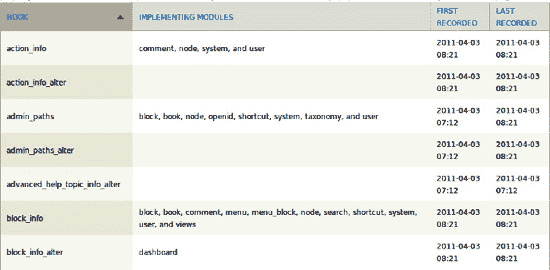

**图 19–5.** 成功！你现在拥有了一张美观且可排序的表格，列出了 Drupal 通过`module_implements()`调用的每一个钩子。

 **提示** 如果你想知道某件事是否可行，那就去尝试。没有人事先知道一切，在带有版本控制的开发环境中编码意味着你总能从失败中恢复。

不太方便的是，当你第一次点击*实现模块*时，它会按模块数量升序排序，这意味着首先显示的是没有模块实现的钩子，这比最常用的钩子更无趣。有一个问题允许在点击表格表头时默认进行降序排序：请参阅`drupal.org/node/109493`。我是如何找到这个问题的？我在搜索“drupal table sort different column”时发现的，但并没有直接得到答案。我是如何真正发现可以用与显示不同的字段来排序一列的呢？我只是试了试。这或许是学习和取得成功最重要的方法，如第 14 章所述。如果你有疑问，就去尝试。这不会有什么损失，而且你可能会有一个很酷的发现。

 **注意** 这个表格的初始版本使用了 Drupal 核心的`item_list()`函数——`theme('item_list', array('items' => $modules));`——来格式化实现模块列表，但最常用钩子的行变得高得无法阅读。下一章定义的`xray_oxford_comma_list()`函数解救了这一困境。另一个常见技巧是使用 CSS 将 HTML 列表显示为内联元素。

最后一点：虽然使用数据库中的`modules_number`字段对“实现模块”列进行排序的猜测几乎立刻成功了，但第一次编写这部分代码时，还有其他二十件事出了问题。数据库错误花费的时间最长，但甚至打印“实现模块”列表也先默默地失败了，因为我从查询中漏掉了`modules`字段（哎！），然后因为我在`$invocaton`中有一个拼写错误而非常响亮地失败，最后又因为我忘记反序列化该列的数据而中等程度响亮地失败。一个问题的三种不同原因！（这在编程中令人不安地常见。）其他书籍和章节的作者可能犯的错误更少，但请相信我，没有人能第一次就把所有事情做对，你甚至不应该尝试。（但不要漏掉你想要显示的字段。也不要让序列化的数据保持序列化。更不要犯拼写错误。跳过我的愚蠢错误，去追求明智的、有雄心的错误。当事情不工作时，修复错误。当它最终成功工作时，更要享受其中的乐趣！）

### Drupal 实体：站点组件背后的通用结构

Drupal 7 引入了*实体*的概念，以标准化其对基本数据对象的处理。用户、节点、评论、分类词汇表、分类术语和文件——这些都是 Drupal 7 核心中的实体。贡献模块可以通过实现`hook_entity_info()`来注册额外的实体类型；这在第 24 章中有所介绍。

节点是 Drupal 站点上的主要内容对象，是典型的实体；Drupal 7 中实体概念的创建很大程度上是为了让其他对象的行为更像节点。特别是，Drupal 核心中字段的引入使得有必要为非节点对象提供类似于内容类型（也称为节点类型）的东西。在 Drupal 6 中，内容构造工具包项目（`drupal.org/project/cck`）和相关模块使得向内容类型添加字段（文本字段、数字字段、电子邮件地址字段、文件字段、图像字段等）成为可能。每个内容类型代表一组字段。在 Drupal 7 中，任何实体都可以拥有字段（如果其实体类型定义声明它是“可字段化的实体”），但也希望一种实体类型能拥有具有不同字段集的实体。*Bundle* 这个词在 Drupal 中被强制征用，用来描述“带有字段的东西”这种通用含义，即非节点实体的内容类型类比。

 **注意** 实体引入了*bundle*的概念，而内容类型是*bundle*的例子。换句话说，内容类型就是一个*bundle*——这是你在 Drupal 7 中最可能遇到的最常见的*bundle*。

你可以通过名为`field_info_bundles()`的函数获取 Drupal 站点上每个*bundle*的信息。在确定“结构”管理页面要显示什么以及如何显示时，你可以使用`debug()`函数打印此函数或其他函数的输出以及变量。（当然，你也可以使用调试器；请参阅`dgd7.org/ide`）。在一个已引导的`test.php`文件（`dgd7.org/testphp`）或一个被调用的函数中（例如`hook_help()`中的回调或页面回调），放置代码`debug(field_info_bundles());`

输出是关于你站点实体的大量信息。如果放在本书中，它将占用 11 页，所以请查看你自己的输出（或参考`dgd7.org/151`）以获取完整结果。这是一个非常大的数组，但在使用 Drupal 开发时，巨大的嵌套数组是意料之中的。

从`field_info_bundles()`函数输出的实体和*bundle*信息中，你可以了解到，在一个典型的安装中，你的站点上已经有六种类型的实体。这些实体是*comment*、*node*、*file*、*taxonomy_term*、*taxonomy_vocabulary*和*user*。每种实体类型进一步划分为至少一个*bundle*。例如，*file*实体类型只定义了*file*这个*bundle*，而*comment*实体类型则为每个附加了评论的内容类型都提供了*bundle*。

 **陷阱** 节点类型不存储在评论表中。它仅在评论实体中可用，因此需要通过`field_info_bundles()`这样的函数来获取。不要期望所有*bundle*信息都能在数据库中轻易找到！

你可以使用`field_info_bundles()`配合 X-ray 模块来提供所有实体和*bundle*的列表。请参阅`dgd7.org/254`了解如何将调试语句转化为格式良好的信息表格——当然，你也可以从调试输出中获取所需的所有信息。

### 总结

本章向你介绍了 API，并教你如何编写一个完整的模块。你看到了使用 Drupal 提供的钩子和函数的说明和示例，其中包括修改表单、本地化、使模块可主题化、使用`hook_menu()`创建页面以及使用和定义权限。这些都是在构建一个完整模块的过程中介绍的。随着模块的每个特性需要使用 Drupal API 工具箱中的另一个工具，我介绍了这些工具并向你展示了如何使用它们。

现在你知道编写一个完整的模块需要什么了，但模块的故事还有更多内容，这将在第 20 章中完成，你将学习创建配置页面和设置表单，并将你的模块完善成一个符合`drupal.org`标准的模块，包括修复错误和检查编码标准。

 提示 另请查看`dgd7.org/intromodule`，了解关于本章令人困惑的部分以及 X-ray 模块持续开发的讨论。

## 第 20 章


## 完善你的模块

**作者：Benjamin Melançon**

第 18 章和第 19 章向你展示了如何编写模块，但一个模块不仅仅包含你编写的代码。在本章中，你将学习如何：

*   创建配置页面和设置表单。

*   将你的模块完善成一个符合`drupal.org`标准的模块，包括修复错误和检查编码标准。

### 为你的模块创建配置页面

X-ray 模块可以设置合理的默认值，并且不需要配置页面。“别让我思考”的设计理念（泛指，但特指 Steve Krug 那本同名经典著作）主张移除非必要的选项。尽可能用合理的默认值取代用户需要做出的选择。或许，与完全省略配置选项几乎一样好（甚至更好）的是，提供一个大多数使用你模块的管理员永远不需要访问的配置页面。

X-ray 模块将允许管理员关闭管理部分摘要、页面回调和表单 ID 的显示。这些默认情况下都将处于开启状态，以便模块开箱即用。

#### 配置页面的放置位置

Drupal 的管理后台中有一个专门的“配置”分区，因此关于配置页面的放置位置，通常没有太多疑问。当然，事情并没有这么简单。Drupal 7 的配置分区被划分为许多子分区，包括（在 Drupal 核心中）人员、内容编写、媒体、搜索与元数据、区域与语言、系统、用户界面、开发及 Web 服务。由于 X-ray 明显是一个开发辅助工具，它的配置应归入开发（`admin/config/development`）分区，但你需要根据核心模块以及任何相关且受尊敬的贡献模块，为你创建的每个（有配置分区的）模块决定其归属类别。就我个人而言，我不喜欢将模块的管理页面分散到完全不同的分区中，因为这会让管理员需要查找信息的地方翻倍。然而，这种分离正是 Drupal 7 的方式；实际上，这也将是未来的发展方向。像 X-ray 这样为管理员提供报告的模块，应将其放在管理后台的报告分区；如果该模块提供了任何配置选项，则应放入配置分区。从长远来看，这确实有道理，因为它使模块的工作方式与 Drupal 核心保持一致，但对于刚刚启用模块并试图弄清楚如何使用它的网站构建者来说，这种分离增加了导航本就令人应接不暇的界面的难度。你将在“按 Drupal 设计意图使用 `hook_help()`”部分再次使用 `hook_help()`，以便从 X-ray 的报告页面生成一个指向其配置页面的链接，反之亦然。

#### 为设置表单定义菜单项

配置表单在 Drupal 核心以及贡献模块中都是如此常见的需求，以至于 Drupal 提供了许多有用的函数和快捷方式（参见列表 20–1）。

**列表 20–1.** X-ray 设置页面的菜单项

```
/**
 * 实现 hook_menu()。
 */
function xray_menu() {
  $items = array();
  // ...
  // 管理页面。
  $items['admin/config/development/xray'] = array(
    'title' => 'X-ray 配置',
    'description' => '配置将显示内部站点结构的哪些元素。',
    'page callback' => 'drupal_get_form',
    'page arguments' => array('xray_admin_settings'),
    'file' => 'xray.admin.inc',
    'access arguments' => array('administer site configuration'),
    'weight' => 0,
  );
  return $items;
}
```

与此前你见过的内容相比，这个菜单项声明中最有趣的部分是 `'page callback'`、`'page arguments'` 和 `'file'` 指令。这里的 `'page callback'` 并非像其他例子中的自定义函数，而是一个用于获取表单的 Drupal 核心函数。这个函数 `drupal_get_form()` 需要被赋予一个表单标识符，该标识符通常是一个返回表单结构（数组的数组）的函数名，但它也可以是通过 `hook_forms()` 注册的、能返回实际函数的标识符。此处，这个表单 ID 作为传递给 `'page arguments'` 的数组中的唯一一项传入。最后，指定了 `'file'`，因为你传递给 `drupal_get_form()` 的参数 `'xray_admin_settings'` 意味着函数 `xray_admin_settings()` 将被调用——而该函数，正如我将在下面介绍的，是在一个单独的文件中定义的。

**提示** 对于许多管理页面那样纯粹是表单的页面，Drupal 经常使用一种节省代码的技巧。菜单项的页面回调不是自定义函数，而是 `'drupal_get_form'`，并通过页面参数传递一个表单标识符。这避免了仅仅为了处理显示表单的页面回调而创建一个函数。

你将借用这个菜单定义的代码，就像借用它所调用的设置表单的代码一样，这些都来自 Drupal 核心。用户模块提供了一个很好的例子。这段代码直接模仿了 `user.module` 中 `user_menu()` 对账户设置管理页面的定义。关于 `admin/config/people/accounts`，X-ray 本身会告诉你：“此页面由传递给函数 `drupal_get_form()` 的参数 `user_admin_settings` 提供，并借助文件 `modules/user/user.admin.inc` 实现。”

#### 为管理代码创建单独文件

将代码划分到不同的文件中有两个优点。首先，它有助于你将代码组织成易于管理的片段。其次，它允许 Drupal 在不使用相关代码时避免将其加载到内存中。（这就是在 `admin/config/development/xray` 菜单项定义中指定 `file` 指令的意义所在。只有当该路径被访问时，文件 `xray.admin.inc` 才会被包含。）

你的页面回调是函数 `drupal_get_form()`，它已在 Drupal 引导过程中加载。它所处理的那个表单标识符是一个函数名，该函数返回一个表单数组。文件 `xray.admin.inc` 及其中的 `xray_admin_settings()` 函数是仿照 `user.admin.inc` 和 `user_admin_settings()` 编写的。

**注意** 当然，核心文件中的内容并非全部符合你的需求。用户模块对 `hook_menu()` 的实现定义了路径 `admin/config/people`，并使用回调函数 `system_admin_config_page()`。你创建的大多数模块不需要这样做，因为它们的配置页面将放入配置分区中已有的子分区。至于 X-ray 模块，它归入开发子分区（`admin/config/development`）。

#### 构建设置表单

借助 Drupal 表单 API 中一个专门函数的辅助，你的设置表单可以非常精简。在返回 `$form` 数组之前使用 `system_settings_form()` 函数，它会接收你提供的字段集和三个复选框选项，并负责添加提交按钮，以及处理所有表单键与变量名匹配的提交操作！注意，`'xray_display_section_summaries'` 既是表单数组中的标识符，又是 `variable_get()` 函数中的默认值。Drupal 会使用 `variable_set()` 来保存某人提交表单时选择的值；你无需处理任何这些操作！清单 20–2 是一个管理文件，其中包含了 X-ray 设置表单的表单定义，该文件仅在访问 `admin/config/development/xray` 时才会加载，并附带了用于管理设置的表单构建函数。

**清单 20–2.** 包含 X-ray 设置表单表单定义的管理文件

```php
<?php
/**
 * @file
 * X-ray 模块设置 UI.
 */

/**
 * 表单构建器；配置显示哪些 X-ray 信息。
 *
 * 此表单为 X-ray 设置页面提供菜单回调。
 *
 * @ingroup forms
 * @see system_settings_form()
 */
function xray_admin_settings() {
  $form = array();
  // X-ray 输出可见性设置。
  $form['display'] = array(
    '#type' => 'fieldset',
    '#title' => t('显示选项'),
  );
  $form['display']['xray_display_section_summaries'] = array(
    '#type' => 'checkbox',
    '#title' => t('在管理部分显示摘要。'),
    '#default_value' => variable_get('xray_display_section_summaries', 1),
    '#description' => t('如果取消选中，摘要仍将显示在
<a href="@xray-overview">X-ray 报告</a>页面上。',
      array('@xray-overview' => url('admin/reports/xray'))
    ),
  );
  $form['display']['xray_display_callback_function'] = array(
    '#type' => 'checkbox',
    '#title' => t('在所有页面上显示页面回调函数。'),
    '#default_value' => variable_get('xray_display_callback_function', 1),
  );
  $form['display']['xray_display_form_id'] = array(
    '#type' => 'checkbox',
    '#title' => t('在表单中显示表单 ID。'),
    '#default_value' => variable_get('xray_display_form_id', 1),
  );
  return system_settings_form($form);
}
```

如图 20–1 所示，你现在正在你定义的管理页面上生成一个表单。

**图 20–1.** 默认开启三个复选框的管理页面

### 让 DRUPAL 存储配置设置 vs. 创建数据库表

在 Drupal 中存储配置设置有两种方式：让 Drupal 来做，或者你自己来做。Drupal 让你能够轻松地将配置存储在全局配置变量（`$conf` 数组，从中可以通过 `variable_get()` 检索单个设置）中。默认情况下，`system_settings_form()` 将一个裸表单数组包装在一个提交处理器中，该处理器会自动将所有表单元素通过 `variable_set()` 保存到变量表中。每个页面加载时，这些信息都会加载到全局 `$conf` 变量中。

我破例认为，在 Drupal 中遵循阻力最小的路径不一定是最佳实践。每个页面加载时都可用的配置信息不应被仅在特定情况下才需要的设置所膨胀。模块作者应该多花费一点额外精力，将那些在 Drupal 全局上下文中不需要的大量数据单独存储。

**提示** 在 Drupal 8 中有一项倡议，旨在让 Drupal 的配置保存更智能且可插拔；请参阅 `dgd7.org/config` 获取相关链接，包括所有向后移植到 Drupal 7 的内容。

如果 X-ray 模块有一些仅在访问 X-ray 报告页面时才使用的设置，那么将它们保存在自己的数据库表中是有意义的。然而，你已有的设置会影响许多或所有页面视图，因此应将它们放入加载到 `$conf` 数组的变量表中。

#### 定义新权限

你还有非常重要的一步要走：让你的代码遵循你的新设置。然而，在这样做之前，让我们重新审视一下 X-ray 的权限问题，或者说权限的缺失。如果你允许管理员关闭特定类型的消息，你可以预见到有些人会想对整类用户隐藏 X-ray 的消息。（这些人不会是你或我，因为我们会遵循第 13 章 中的部署实践，绝不会在实际网站上启用 X-ray，但那些没有读过本书的人有极小的可能会使用 X-ray。）

这就需要一个“查看 X-ray 消息”的权限。查看 `admin/people/permissions` 页面发现，没有合适粒度的权限用于 X-ray 模块管理。“管理站点配置”这个权限很可能被授予各种类型的管理员，而开启或关闭 X-ray 设置的能力只对那些至少有些开发倾向的用户才有意义。你可以尝试通过直觉推断，拥有“管理站点配置”和“查看 X-ray 输出”权限的用户应该能够配置显示，但 Drupal 不赞成这种对管理员来说不透明的技巧。因此，这里需要两个直接的新权限：“管理 X-ray”和“查看 X-ray 输出”。这些内容如清单 20–3 所示。

**清单 20–3.** 实现了 `hook_permission()` 的 X-ray 模块，并定义了两个新权限

```php
/**
 * 实现 hook_permission()。
 */
function xray_permission() {
  return array(
    'view xray messages' => array(
      'title' => t('查看 X-ray 消息'),
      'description' => t('允许用户看到 X-ray 输出。'),
    ),
    'administer xray' => array(
      'title' => t('管理 X-ray'),
      'description' => t('允许管理员配置显示哪些 X-ray 消息。'),
    ),
  );
}
```

在清除缓存之前，这些权限不会出现在 `admin/people/permissions` 页面上。

**注意** 请记住，像上面那样使用单引号来界定字符串时，如果在字符串中使用撇号，则会破坏一切。请对这些字符串使用双引号，或使用 `\` 对撇号进行转义。

回到你最近对 `xray_menu()` 的添加中，你需要将 `'administer site configuration'` 替换为 `'administer xray'`，这样才能让你的新细粒度权限生效。而为了让“查看 X-ray 消息”权限有意义，你需要在检查不同 X-ray 消息类型是否显示配置的同时，也在代码中检查该权限。

##### 根据配置或用户访问权限有条件地执行操作

在 Drupal 代码中，你经常会希望仅在特定配置设置或取决于用户权限时执行某些操作——或者在使用 X-ray 模块的情况下，同时检查这两者。

根据配置设置有条件地执行操作通常就像检查 `variable_get()` 的结果一样简单。一个 `if` 语句使用 `variable_get()` 加载配置变量，如果该设置为 TRUE 则继续执行；对于更复杂的设置，它可以将设置中的几个可能值与您关心的条件进行比较。简单的情况如下所示：

`if (variable_get('xray_show_formid')) { ... }`

根据用户可能拥有或不拥有的权限有条件地执行操作，需要调用 `user_access()` 函数。该函数接收一个包含权限机器名称的字符串。它也可以放在 `if` 语句中，包裹住那些只在用户有权访问时才需要运行的代码（基于授予角色的权限以及授予用户的角色）。或者，在函数内部，`if` 语句可以反转检查条件并立即返回，这意味着跳过所有剩余代码；请参见清单 20–4。

**清单 20–4.** 如果用户没有所需权限，则通过权限检查来退出整个函数

```
function example_something($account = NULL) {
  if (!user_access('do something complex', $account)) {
    return;
  }
  // 如果用户没有 'do something complex' 权限，
  // 这里的大量复杂代码永远不会被执行。
}
```

最佳实践是将函数与对任何全局变量（例如当前登录用户的账户）的依赖分离开。通过适当分离，函数可以因不同目的而重用。当`$account`参数不存在时，`user_access()`函数会为当前用户执行检查，这会将函数限制为仅检查当前登录用户的访问权限。最好是在执行工作的函数之外进行用户访问检查，或者至少能够接受一个可以设置为非当前登录用户的用户账户。这就是清单 20–4 所采用的方法。当`$account`为 NULL 时（这也是默认值），`user_access()`会检查当前登录用户的访问权限，但`example_something()`函数具备为任何传入的用户账户执行检查的潜力。

清单 20–5 中的代码不在潜在可重用的函数中，而是在一个钩子实现中，在这里*可以*预期全局环境变量（例如当前登录用户）是唯一重要的变量。它包含了在`xray_form_alter()`中添加的一个配置检查（你是否应该显示表单 ID？）和一个用户访问检查（该用户是否拥有查看 X-ray 消息的权限，该权限已被授予他们所属的角色？）。

**清单 20–5.** 添加了配置检查和用户访问检查的 `xray_form_alter()`

```
xray_form_alter(&$form, &$form_state, $form_id) {
  if (variable_get('xray_show_formid', TRUE) && user_access('view xray messages')) {
    $form['xray_display_form_id'] = array(
      '#type' => 'item',
      '#theme_wrappers' => array('container__xray__form'),
      '#attributes' => array('class' => array('xray')),
      '#title' => t('Form ID'),
      '#markup' => $form_id,
      '#weight' => -100,
    );
  }
}
```

只有粗体显示的代码是新增的：`if`语句的开始及其与`}`的闭合。中间的代码已经缩进以满足编码规范，保证清晰性。如果`xray_show_formid`设置为 TRUE 并且`user_access`返回 TRUE，那么`xray_display_form_id`项将被添加到表单数组中。

 **注意** 别忘了`variable_get()`的默认值！Drupal 不会抛出错误，但将其留空相当于声称默认值是 FALSE，这与您在此情况下的意图相反。每次使用`variable_get()`都应该有两个参数：变量名及其默认值。

### 当 Drupal API 不能满足需求时编写工具函数

在阅读了几十页关于 Drupal API 的内容之后，如果你认为你所有的编码需求都可以通过`drupal.org`和`PHP.net`来满足，这是情有可原的。从某种意义上说，这是真的；你编写的代码当然是为了 Drupal，并且其编写语言是 PHP。但是 Drupal 中的每一个函数都是为了满足某种需求而创建的，你也可以编写自己的函数。

 **注意** JavaScript，这种增强 Drupal 前端的客户端脚本语言，是全 PHP 规则下的一个例外。即便如此，Drupal 也提供了一些用于处理 JavaScript 的 PHP API 函数。而在 JavaScript 中，Drupal 提供了用于翻译和其他 Drupal 特有功能的函数。更不用说 Drupal 包含了 JQuery 库，它提供了许多许多的工具函数，使得使用 JavaScript 变得更加容易，尤其是在跨浏览器支持方面。

#### 将列表数据格式化为人类可读、标点规范的文本

X-ray 模块在代码中大量使用了 `t()` 函数，并可能创下了模块中使用 `format_plural()` 次数最多的记录。两者都能妥善处理变量的嵌入。然而，在将数据转换为自然语言文本时，X-ray 模块遇到了 Drupal 核心未能满足的一个反复出现的需求：将一个数组项处理成带有逗号和连词、可直接用于句子的列表。

在我搜索“逗号分隔列表 PHP”及类似关键词后，找到的函数可能出现在任何 PHP 项目中——任何人都能贡献一段代码片段。但这段代码是由一位 Drupal 爱好者分享的，因为社区的力量很强大。以该代码片段为基础，我们构建了清单 20–6 中展示的实用函数。

**清单 20–6.** 牛津逗号函数

```
/**
 * 将数组项制作成格式规范、标点正确且可直接用于句子的列表。
 *
 * 参考 www.drupaler.co.uk/blog/oxford-comma/503
 * 这是一个符合语法的辅助函数，用于将句子中的各项列表化，即
 * 将数组转换为类似 'a, b, and c' 的字符串。
 *
 * @param $list
 *   要连接的单词或项目数组。
 * @param $settings
 *   用于生成牛津逗号列表的可选设置数组：
 *   - type
 *     最后两项之间使用的文本。默认为 'and'。传入
 *     'or' 和 'and' 时不进行翻译；其他连接词需要翻译。
 *   - comma
 *     列表的连接符。默认为逗号加空格。
 *     若要使用分号生成牛津逗号列表，请使用 '; '。
 *   - oxford
 *     若将此默认值 'TRUE' 修改，你就是个外行。
 */
function xray_oxford_comma_list($list, $settings = array()) {
  // 设置默认设置。
  $comma = ', ';
  $type = 'and';
  $oxford = TRUE;
  // 用传入的适用设置覆盖默认设置。
  extract($settings, EXTR_IF_EXISTS);
  // 翻译 'and' 和 'or'。
  if ($type == 'and') {
    $type = t('and', array(), array('context' => '最终连接词'));
  }
  elseif ($type == 'or') {
    $type = t('or', array(), array('context' => '最终连接词'));
  }
  //
  if ($oxford && count($list) > 2) {
    $final_join = $comma . $type . ' ';
  }
  else {
    $final_join = ' ' . $type . ' ';
  }
  // 从 $list 数组中移除最后两个元素。
  $final = array_splice($list, -2, 2);
  // 将最后两个移除的元素与最终连接字符串组合。
  $final_string = implode($final_join, $final);
  // 将组合后的元素（现已成为单个元素）重新添加回列表数组。
  array_push($list, $final_string);
  // 返回以逗号（或其他符号）连接的文本字符串列表。
  return implode($comma, $list);
}
```

这个函数写起来很有趣，尤其是大部分工作已经由他人完成。它引入了翻译函数的*上下文*概念，通过向 `t()` 函数提供第三个参数，明确表明此处的 'and' 和 'or' 用于最终连接，而非其他人可能给出的其他不当用法。

另一个新特性是使用了`extract()` 并搭配一个新常量，指示它*仅在存在时提取*。（经验法则：永远不要使用裸 `extract()`；始终添加第二个参数。）参见 `dgd7.org/245` 了解旧版默认设置代码的详细写法，而通过此处使用 `extract()`，代码变得更简洁、更清晰。

随着你对 Drupal 和 PHP 的深入了解，你会更清晰地感知什么是可能的（几乎所有事情），并且，既然知道某些事情可能实现，你也会明白能找到实现它的方法。实际上，实现方法往往不止一种。将功能封装在函数和方法中的代码之美在于：可以在不总是关注其他所有代码的情况下，对某一段代码进行可读性或性能优化。`xray_oxford_comma_list()` 函数经历了多次重大修改，以增加功能并纯粹出于代码优雅性考虑——毫无疑问，未来它还会经历更多优化。

### 犯错并拥抱错误消息

遵循“写你所知”的建议，我决定用一整节来讨论犯错。不存在没有 bug 的代码，尤其是在初稿中。知道代码出错时该怎么办，才是通往胜利之路。

### 搜索答案

在错误消息方面，网络搜索始终是你的得力助手。请务必移除消息中与你环境相关的特定部分，例如网站 URL 或 Drupal 目录路径。

 **提示** 引用足够多的错误消息以返回精确结果，但要去掉任何与你的站点或系统相关的部分（例如站点名称或主文件夹的系统路径）。即使你在初步搜索方面已经很熟练，有效搜索遇到的错误解决方案也需要反复试验。通常值得尝试 `drupal.org` 的搜索以及通用互联网搜索。

查看其他人发布过的相同错误，并阅读他们的评论。运气好的话，再坚持一下，你就能找到有人提供了解决方案。大多数情况下，搜索答案都是有效的，但了解如何识别和解决某些类型的错误（如下列所示）也很有好处。

### 语法致命错误

致命错误意味着我们还在编程实践中。它们表明我们的代码正在产生影响。而且它们通常很容易修复：只需添加、删除或移动一个分号、圆括号或花括号即可。由于 PHP 不是编译型语言，尝试实际运行代码（从本地服务器加载网页）失败的速度，与在编辑器中检查代码语法并给出提示的速度几乎一样快。不过，任何好的 PHP IDE 都提供语法检查功能。

 **提示** 在 Vim 编辑器中启用语法检查；参见 `dgd7.org/vi`。

大多数情况下，Drupal 代码行应以分号结尾（当该行表示一条语句时）；当它是多行数组定义的一部分时，每个项目之间用逗号分隔。这类错误通常很容易修复，因为 PHP 会告诉你错误在哪一行。最难修复的语法错误是花括号不匹配。遗漏一个闭合花括号（也称为大括号）可能会产生一个指向文件末尾的错误，而实际原因可能在文件更靠前的位置。

### 运行时致命错误

如前所述，语法致命错误会在运行时显现，因为 PHP 并非编译型语言，但由于在运行整个应用程序的代码之前（仅加载代码就会触发错误）很容易捕获它们，因此此处将它们单独处理。我称之为运行时致命错误的情况，仅在执行使用你代码的操作（包括访问页面）时才会发生：

`Fatal error: Cannot use object of type stdClass as array in`  `/home/ben/code/dgd7/web/sites/default/modules/xray/xray.module on line 186`

如果你的开发环境设置得当，此错误会打印在你的屏幕上。即便在生产环境中，它也会写入服务器的错误日志，这很有帮助，因为你可能看到的只是信息量不足的白屏死机 (WSOD)。（更好的情况是，正确设置的开发环境会提供所有被调用函数的调用栈。下一节将展示如何启用 Devel 模块的堆栈跟踪。另外，请参阅第 30 章了解函数调用栈的演练，类似于你在本章开头所做的那样。）

PHP 非常贴心，它精确地告诉了你问题在何处以及是什么问题。错误出现在第 186 行，你正在尝试将对象用作数组。列表 20–7 中的代码展示了触发错误的代码以及修正后的代码。

**列表 20–7.** 破坏一切的代码行及其修正版本

```php
<?php
// 第 186 行代码是这样的：
    if (isset($theme['info'] ['hidden']) && $theme['info'] ['hidden'] == TRUE) {
// ...
}

// 但它需要这样写：     if (isset($theme->info ['hidden']) && $theme->info ['hidden'] == TRUE) {
// ...
}
?>
```

关键在于，并非看起来像前者的代码总是错误的（如果 `$theme` 是一个数组，那它就是正确的）；关键在于，当你遇到 "Cannot use object of type stdClass as array" 的错误时，这表示你正在处理一个对象，应该使用对象表示法，即箭头 (`->`)。

### 追踪错误和警告的原因

如果你在编写模块时网站上出现了新的错误，很可能是你的代码引起的。然而，错误消息可能指向某个你从未碰过的核心文件。在这种情况下，几乎可以确定错误源自其他地方，无论是由你编写的代码还是你安装或配置的内容引起的。弄清楚错误或 bug 来自何处并修复它的过程称为*调试*。图 20–2 显示了在编写 X-ray 模块时出现的一个此类错误。


**图 20–2.** "Warning: `htmlspecialchars()` expects parameter 1 to be string" 错误消息

警告：`bootstrap.inc` 文件的第 1,476 行给出了数组，警告：给出了对象？你该怎么处理？你甚至从未看过 `bootstrap.inc` 文件！你现在可以查看一下 Drupal 函数 `check_plain()` 中 `htmlspecialchars()` 是如何使用的，然后你可以搜索 Drupal 中所有调用 `check_plain()` 的 157 个函数。是的，157 个；请参阅 `api.drupal.org/check_plain` 获取列表。指出调用 `check_plain()` 的函数之一是 `t()` 翻译函数是多余的，该函数仅在内核中就被调用了 1,246 次，是 Drupal 中使用最频繁的函数。所以你可以查看所有使用 `t()` 的地方，以及所有其他使用 `check_plain()` 的地方，以及调用它们的函数，依此类推，向上追溯，试图找到是哪一个让 `htmlspecialchars()` 对你发脾气...

或者，你可以让工具瞬间处理这个问题。有独立的调试工具和集成开发环境 (IDE)，这些在 `dgd7.org/ides` 有讨论，但作为 Drupal，也有一个模块可以做到。Devel 模块包含一个选项，可以从 PHP 警告或错误开始，向上回溯函数链打印出回溯信息，并使用 Krumo 格式化以便阅读。让我们看看它是如何工作的。

### 使用 Devel 模块向上回溯堆栈追踪错误

Devel 模块包含用于 Drupal 开发的工具，值得常备在手。让我们安装带有 Krumo 的 Devel 模块，并观察它如何转换错误消息。

1.  从 `drupal.org/project/devel` 或使用 Drush 下载 Devel 模块：`drush dl devel`（并感谢 Moshe Weitzman，他是 Devel 和 Drush 的创建者）。

2.  在 `admin/modules` 或使用 Drush 启用模块：`drush -y en devel`。

3.  转到 `admin/config/development/devel`（你可以通过 `admin/modules` 上的"配置"链接到达那里）。

4.  向下滚动页面找到"错误处理程序"，将其从"标准 Drupal"改为"回溯"，然后点击"保存配置"提交表单。

5.  导航到引起错误消息的页面并享受结果。

现在，回到你的 `htmlspecialchars()` 警告（参见图 20–3）。

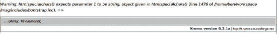

**图 20–3.** 使用 Devel 和 Krumo 显示的 "Warning: `htmlspecialchars()` expects parameter 1 to be string" 错误消息

好吧，这还帮不上什么忙。点击 "... *(Array, 19 elements)*" 文本（其中 19 是你的回溯数组中的元素数量）来展开 Krumo 格式化的数组；请参见图 20–4。

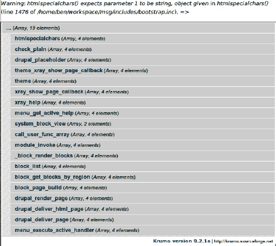

**图 20–4.** 针对 "Warning: `htmlspecialchars()` expects parameter 1 to be string" 错误的 Krumo 格式化回溯数组

现在你可以开始工作了。你可以看到从发起抱怨的 `htmlspecialchars()` 函数开始，向上经过调用它的函数、调用那个函数的函数，以及调用*那个*函数的函数，一直到 `menu_execute_active_handler()` 函数，这个函数位于 `index.php` 中，大多数时候是 Drupal 的启动函数（请参阅第 30 章，通过这个函数的视角来观察 Drupal）。在这个长长的列表中，有多个来自 X-ray 模块的函数，它们远比一个核心函数自发产生错误更值得怀疑。

你可以在函数堆栈中点击 `theme_xray_show_callback`，并深入查看传递给它的参数。正如错误消息所指出的，`page_arguments` 数组中包含一个对象，这是 `xray_show_page_callback()` 的过错。

 **提示** 如果你手头没有 Devel 模块或任何其他工具，你可以在 Drupal 报告错误的地方放置一个 `debug(debug_backtrace())` 调用，但输出的可读性远不如 Krumo 处理得那么清晰。

要防止此错误，你需要检查每个页面参数，并确保在将其传递给 `drupal_placeholder()` 时，它不是对象或数组。主题函数（或模板）中出现这种复杂性级别，是一个明确的信号，表明应该有一个预处理函数在它之前清理变量。

### 创建预处理函数

在为主题函数或模板文件创建预处理函数时，可以（通常情况下）借鉴 Drupal 核心的示例作为参考。`Node` 模块提供了 `template_preprocess_node()` 这一可能的模型（例如，通过命令行搜索 `grep -nHR 'preprocess' modules/node` 命令搜索“preprocess”后获得）。

 **注意** 自 Drupal 7 起，主题函数可以像模板一样拥有预处理函数。但对于主题制作者来说，能够复制和修改模板文件而非在 `template.php` 中覆盖主题函数，仍被认为是更友好的做法。不过，主题函数在性能上优于模板，因此更适用于小型功能或不太可能被重新主题化的场景。关于如何在模块中使用主题层的更多信息，请参阅模块开发者指南中的 `drupal.org/node/933976`。

模块中定义的预处理函数以 `template_` 开头（主题则使用主题名称）；接着是 `preprocess_`；最后是主题函数的名称或下划线。无需在 `hook_theme()` 的实现中添加任何额外内容；Drupal 会自动查找预处理函数。无论是用于模板文件还是主题函数，预处理函数的外观和行为都相同。关键点是 `$variables` 数组是通过引用传递的，因此对该数组的任何更改或添加都需要在引用的副本上进行。示例请参见清单 20–8。

***清单 20–8.** 为 `theme_xray_show_page_callback()` 准备变量的预处理函数*

```
/**
 * 为显示页面回调主题函数处理变量。
 */
function template_preprocess_xray_show_page_callback(&$variables) {
  if ($variables['page_arguments']) {

    foreach ($variables['page_arguments'] as $key => $value) {
      // 数组和对象不易在消息中直接打印，因此标识它们是什么。
      if (is_array($value)) {
        $value = t('array') . ' ' . $key;
      }
      elseif (is_object($value)) {
        $value = t('object') . ' ' . $key;
      }
      // 为安全进行清理，并为每个参数添加强调。
      $variables['page_arguments'][$key] = drupal_placeholder($value);
    }
  }
}

/**
 * 主题化页面回调以及路由项的其他可选元素。
 *
 * @param $variables
 *   一个关联数组，由 menu_get_item() 生成，包含：
 *   - page_callback: 用于显示网页的函数。
 *   - page_arguments: （可选）传递给页面回调函数的参数数组。
 *   - include_file: （可选）在调用页面回调之前包含的文件；允许将页面回调等放在单独的文件中。
 *
 * @see template_preprocess_xray_show_page_callback()
 *
 * @ingroup themeable
 */
function theme_xray_show_page_callback($variables) {
  extract($variables, EXTR_SKIP);

  $output = '';   $output .= '<p class="xray-help xray-page-callback">';
  $output .= t('此页面由 ');
  if ($page_arguments) {
    $output .= format_plural(count($page_arguments),
      '传递给 ',
      '传递给 ',
      array('!arg' => xray_oxford_comma_list($page_arguments))
    );
  }
  $output .= t('函数 %func',
               array('%func' => $page_callback . '()'));
  if ($include_file) {
    $output .= t('以及所包含的文件 %file',
                 array('%file' => $include_file));
  }
  $output .= t(' 提供。');
  return $output;
}
```

可以说，这种数据清理应该在预处理函数之前就完成。没有什么比将代码发表在一本书中更能引发审查了，因此请访问本章的在线配套资源 `dgd7.org/61`，那里无疑会有更多针对此代码的批评和改进意见。

 **注意** 清单 20–8 中的代码通过引入 Krumo 输出功能得到了增强（同时也变得更复杂）。改进和扩展版本请参见 `dgd7.org/259`，其中包含一个用于处理数组和对象的辅助函数。

### 最终考量

你已经了解了一打 API，查看了大量代码，并编写了自己的代码，但你制作了一个模块吗？基本上，是的！X-ray 模块的每一行代码并未全部展示（特别是重复部分），但你可以在 `dgd7.org/code` 找到它，以及本书中的所有代码。

此模块适合扩展，但你并未提供供其他模块扩展的 API；相反，非常欢迎补丁（项目维护者可以轻松应用的代码添加或修改）！现在我们来讨论一些最终考量，包括 Coder 模块审查和同行审查。

当然，最重要的最终考量是，你是否达到了所尝试做的事情的最低要求。其他一切都是次要的——但仍然重要。

- 确保没有硬编码人们想要更改的内容。

- 仔细检查安全漏洞。使用 Coder 审查模块（将在下一节介绍）有助于发现许多漏洞，但无法捕捉所有问题。用户访问权限是否在任何管理操作可见或更改前得到检查？用户可能输入的任何内容是否会在未经转义的情况下再次输出？转义潜在危险标记的需求包括：展示已保存到数据库中的用户提交数据；数据库 API 提供的防止 SQL 注入攻击的保护与 `t()`、`check_plain()`（`t()` 使用的函数）和 `filter_xss()` 等清理函数提供的防止 HTML 和 JavaScript 注入攻击的保护无关。安全考量概述请参见第 6 章。

- 检查代码以确保符合编码标准；请参见 `drupal.org/coding-standards`。Coder 审查模块可在这方面提供帮助；详情请参阅下一节。

 **注意** 你的大部分代码都写入了 `.module` 文件，但例如你的下一个钩子实现应该放在文件中的哪个位置？目前没有官方的编码标准或广泛认可的最佳实践。选择一种有助于你找到代码的方式（一个好的代码编辑器可以让你轻松跳转到特定函数），并且不要花太多时间思考这个问题。我将所有钩子实现放在 `.module` 文件的顶部，并优先按重要性排序，当犹豫不决时则按字母顺序排列。另一种方法是按执行顺序排列（顺序请参见第 30 章）。我将其余代码按功能分组，这与其说是科学，不如说是艺术。

#### 代码模块审查

使用 `Coder review module` 对模块代码进行自动化审查，永远不会嫌太早——该模块位于 `drupal.org/project/coder` 项目中。但建议务必在发布前将其作为最后一步执行。

下载并启用 Coder 审查模块（`drush dl coder; drush -y en coder_review`），然后进入管理  配置  开发  代码审查（`admin/config/development/coder`），保持所有选项为默认值。默认启用的审查项包括：Drupal 编码标准、Drupal 注释标准、Drupal SQL 标准、Drupal 安全检查以及国际化。你可以选择"minor"级别，这样 Coder 会显示它发现的所有错误或潜在问题。在"选择特定模块"部分，按字母顺序列出的模块机器名称中找到你正在开发的模块。

对 X-ray 模块运行审查后，显示了这样的信息："Coder found 1 projects, 3 files, 1 critical warnings, 12 normal warnings, 9 minor warnings, 0 warnings were flagged to be ignored"。幸运的是，那个严重警告是误报——解析器尚未更新以识别新的数据库 API 查询方式。

然而，其他错误暴露了一个编码失误，这个失误实际上除了 Coder 审查模块外没有任何文档记录：`t()`函数中的文本不应以空格开头或结尾。原因在于翻译人员不太可能理解或注意到空格，但为了构建依赖于是否存在页面参数的句子，我多次违反了这一规则。（此问题已在模块代码及本书展示的代码中得到修复。）

这个故事告诉我们：在期望他人查看和使用你的代码之前，一定要使用自动化代码审查进行最后检查。而让他人检查你的代码也是一种极好的学习方式，就像你通过阅读他人代码学习一样。

#### 同行评审

> *"为 Drupal 贡献代码就像与整个社区进行结对编程。"*
>
> —Mark Ferree（`twitter.com/mrf`）

参与开源项目意味着可能有成千上万的审查者帮助改进你的代码。当你向 Drupal 核心贡献代码时，你的工作自然会得到审核。当你在`drupal.org`上发布第一个项目到自己的项目页面时（参见第 37 章），它同样会收到代码审查。其他情况下，你需要主动请求审查。

很长一段时间里，Drupal 都没有推荐的工作流程来请求代码审查。最优秀的贡献者会主动请求：即使是在为核心提交补丁时，顶级贡献者也会找其他人审查代码，他们经常互换审查以推动进度。IRC 通常是最有效的请求渠道（这在多数情况下都适用）。如果模块与现有小组相关，你也许能在`groups.drupal.org`上找到感兴趣的人。

现在已有专门的代码审查请求流程，以`groups.drupal.org/peer-review`上的同行评审小组为核心。该计划旨在将寻求项目审查的人与愿意提供审查的人匹配起来。记住，*提供*审查和接收审查都是学习以及建立社区关系的绝佳方式。要请求代码审查，请遵循以下步骤：

*   在寻求审查前，你需要将代码上传到`drupal.org`。关于如何使用 Git 沙箱项目，请参见第 37 章。

*   为你希望审查的项目创建一个新问题——该问题应专门针对整体项目审查，而非在现有问题上添加标签。问题类别应为"任务"，状态自然设置为"需要审查"。（这有点滥用"需要审查"状态，通常它表示有一个需要审查的补丁，但这里你将其用于整个项目。）在描述中，说明你最希望审查哪些方面，并明确承诺会根据建议进行改进。

*   提交问题前，添加`peer-review`标签（`peer`和`review`之间用连字符）。所有请求同行评审的问题都使用此标签。你可以通过添加`code-review`、`ux-review`、`accessibility-review`等标签来聚焦审查类型。当前标签列表请参见`groups.drupal.org/peer-review/requests`。

*   任何自愿审查者都会在该问题中回复。如果审查者发现问题，可以将状态从"需要审查"改为"需要修改"（应在评论中描述问题，或作为独立问题报告提交到你的项目）。通常"已分配"属性属于负责代码的人，但由于你提交了问题且大家都理解你将修改代码，因此审查者可以使用此属性声明自己为主要审查者角色。

*   修复所有发现的问题后，将状态改回"需要审查"。如果幸运的话，审查者会回来并在认可你的工作后将其标记为"已由社区审查和测试（RTBC）"。

*   欢迎将"由[用户名（链接到用户账户）]于[日期（链接到问题）]审查"添加到项目页面的描述中！

与核心贡献者一样，如果你主动请求审查，更容易获得及时审查；可以提出交换审查作为回报。在 IRC（参见第 9 章）中活跃通常是提出这类非正式请求的方式。Drupal 聚会也是交换代码审查的好场所！

 **注意** 在请求他人投入时间改进你的代码之前，遵循本书描述的最佳实践并遵守编码标准（位于`drupal.org/coding-standards`）非常重要。

最好的审查者是那些因为需要使用你的模块而被激励的人。你不一定非要主动请求这种审查——错误报告、功能建议和支持请求都会自动进入你的问题队列。如果你有机会观察他人尝试使用你的模块，那将提供无价的反馈。许多用户遇到的可用性问题不会自行上报。获得可用性审查的最佳方法是观察他人尝试使用某功能并立即收集反馈。你并不需要在实验室环境中进行才能学到很多。如果无法找到愿意参与的测试者，可以请那些感兴趣的人试用你的模块，并报告他们遇到的任何 bug 或困惑之处。

#### 按 Drupal 原意使用 `hook_help()`

`hook_help()`最常见的用法可能正是你尚未使用过的场景。但首先，我承诺过要完整解读这个钩子的定义。

##### `hook_help()`函数签名

每个钩子都有函数签名：传递给钩子实现的参数，以及期望返回值类型（如果有）。定义了输入和输出数据类型，中间部分你可以自由发挥——这就是 API 的本质。

 **注意** `hook_help()`的实现应返回 HTML 字符串，这很可能是由于 Drupal 7 向可渲染数组迁移时被忽略所致。关于适用于 Drupal 其他所有地方的渲染系统，详见附录 C。

##### 参数 `$path` 和 `$arg`

你首先接收到的内容被称为函数的*参数*或*实参*。传递给实现 `hook_help()` 的函数的 `$path` 变量是路由路径，这是 Drupal 基于 `hook_menu()` 实现所定义的路径，对其当前所在路径的理想化理解。这仅意味着，在代码定义的页面上（例如 `admin/structure`），路由路径也是 `admin/structure`；而在可能由用户创建的页面上（例如 `node/1`），路由路径是 `node/%`。因此，要想只将消息显示在特定节点（或用户、分类术语）上，你仍然可以实现 `hook_help()`，但必须使用 `$arg` 参数来查看你当前所在的实际路径。

对于那些不总是直观的页面，了解这些路径是什么的一种方法，是实现 `hook_help()`，并在每个页面上打印路径和 arg 变量。在一个名为 `test` 的模块中（在此提及只是为了提醒你，可以创建名称不是 X-ray 的模块），该函数可以实现此功能；清单 20–9 展示了 `test.module` 的内容，配合一个基础的 `test.info` 文件并在启用后，它会在每个页面上打印由帮助系统解释的路径和参数。

**清单 20–9.** `test.module` 的内容

```php
<?php
function test_help($path, $arg) {
  return $path . '<pre>' . var_export($arg, TRUE) . '</pre>';
}
```

通过在 `xray.module` 的 `xray_help()` 函数中添加上述返回语句，也能达到相同的效果。

**提示** 你几乎可以在 Drupal 的任何位置使用 `debug()` 函数将任意变量打印到屏幕上，例如：`debug($path, 'path'); debug($arg, 'arg');` 第二个参数（标签）是可选的。（对于大型数组或对象的变量，可能需要第三个参数 `TRUE` 来避免错误。）

使用这个方法，你可以访问 `node/add/article`，并看到内容类型的机器名称（article）存在于路由路径 `node/add/article` 中。即使是你自己修改或创建的内容类型也是如此，因为所有内容类型的添加节点页面的路径都是在 `node_menu()` 中动态定义的。然而，对于整个内容类型的编辑表单（例如节点的编辑表单），其路径在路由路径中使用了通配符占位符。例如，当你前往 `admin/structure/types/manage/article` 编辑 Article 内容类型时，此路径的 `$path` 参数如下所示：`admin/structure/types/manage/%`（*article* 已被百分号 % 替换，它表示通配符占位符）。要查看你正在编辑的是哪个内容类型，你需要查看 `$arg` 参数，它是一个数组，包含了真实路径的每个部分（`admin`、`structure`、`types`、`manage` 和 `article`）。

##### 模块的站内文档

你在 X-ray 模块中对 `hook_help()` 的使用（在站点各处添加摘要和信息片段）并不常见。其常见用途是为站点管理员记录如何使用模块本身。这可以表现为模块配置页面上的帮助消息，其工作方式与你基于路径的使用方式相同。但具有讽刺意味的是，最常用的 `hook_help()` 用法，从代码角度来看，却是一个特例。当 `hook_help()` 的实现为路径 `admin/help` 加上井号（`#`）后跟模块名称（在你的例子中是 `admin/help#xray`）返回文本时，Drupal 会在 `admin/help/xray`（你的模块对应的路径）为模块创建一个帮助页面，并从 `admin/help` 链接到这个专用帮助页面。

让我们通过为 X-ray 模块添加一个适当的、普通的帮助页面来结束本章；请注意它返回的路径（参见清单 20–10）。

**清单 20–10.** X-ray 模块的经典帮助页面

```php
/**
 * 实现 hook_help()。
 */
function xray_help($path, $arg) {
  $help = '';
  // 在帮助消息中显示提供当前页面的函数。
  $help .= xray_show_page_callback();
  switch ($path) {
    // 主要管理区域的摘要。
    case 'admin/content':
      $variables = array('data' => xray_content_summary());
      return $help . theme('xray_content_summary', $variables);
    case 'admin/structure':
      $variables = array('data' => xray_structure_summary());
      return $help . theme('xray_structure_summary', $variables);
    case 'admin/appearance':
      $variables = array('data' => xray_appearance_summary());
      return $help . theme('xray_appearance_summary', $variables);
    case 'admin/people':
      $variables = array('data' => xray_people_summary());
      return $help . theme('xray_people_summary', $variables);
    case 'admin/modules':
      $variables = array('data' => xray_modules_summary());
      return $help . theme('xray_modules_summary', $variables);
    // 模块自身的主帮助页面。
    case 'admin/help#xray':
      // 这将作为一个普通页面显示；不要包含
      // xray_show_page_callback 的 $help，否则会显示两次。
      return _xray_help_page();
    default:
      return $help;
  }
}

/**
 * X-ray 模块的帮助页面。
 */
function _xray_help_page() {
  $output = '';
  $output .= '<h3>' . t('关于') . '</h3>';
  $output .= '<p>' . t('X-ray 模块从几个不同的角度展示了您站点的骨架结构，旨在帮助开发者和站点构建者。') . '</p>';
  $output .= '<p>' . t('它在主要管理区域（结构页面的区块、内容类型、菜单；外观页面的主题等）上方的帮助区域添加了相关对象的统计摘要。', array('@structure' => url('admin/structure'), '@appearance' => url('admin/appearance'))) . '</p>';
  $output .= '<h3>' . t('用途') . '</h3>';
  $output .= '<dl>';
  $output .= '<dt>' . t('页面回调与参数') . '</dt>';
  $output .= '<dd>' . t('X-ray 会在页面的顶部帮助消息中显示主要负责提供该页面的函数名。如果函数接收参数，它会将参数显示在函数名之前。它还会提供该函数所在文件的名称（如果可用的话）（仅当回调函数不在 .module 文件中时，文件信息才可用）。请注意，函数接收到参数并不意味着这些参数一定被使用。') . '</dd>';
  $output .= '</dl>';
  return $output;
}
```

许多用于在各个管理概览页面（例如“人员”和“模块”页面）上显示站点摘要数据的其他函数，与本章“结构”页面中展示的函数非常相似，可以在 `dgd7.org/252` 找到。值得再次指出的是，除了数据收集函数和主题函数之外，X-ray 的摘要数据还需要实现 `hook_theme()`、`hook_menu()`（以及一个页面回调函数）和 `hook_help()`。与所有托管在 `drupal.org` 上的模块一样，你可以查看 X-ray 的代码，了解这些消息和任何新特性是如何实现的。

### 摘要

到现在为止，你可能已经发现，如果我能做到，你也能做到。读完第 18 章、第 19 章和第 20 章后，我希望你已准备好投入回报丰厚的工作：构建自己的模块，为你的 Web 项目增添功能，并为 Drupal 做出贡献。

 **提示** 请在`dgd7.org/intromodule`讨论第 18 章、第 19 章和第 20 章，以及 X-ray 模块的后续工作和模块开发的一般话题。

## 第 21 章


## 移植模块到 Drupal 7

**作者：Robin Monksand Benjamin Melançon**

与许多开源项目一样，Drupal 依赖志愿贡献者来保持其开发生态的活跃与现代。这是开源软件的关键优势之一；弊端在于，当其他事务占据时间后，那些曾志愿为 Drupal 付出的人往往会退出。

因此，你偶尔会发现一个完全符合需求的模块，但开发者尚未将其升级到 Drupal 7。在本章中，我将把一个简单的 Drupal 6 模块升级到 Drupal 7。我会介绍执行模块升级的不同流程，并展示将模块从 Drupal 6*移植*到 Drupal 7 时一些常见的必要改动。

`Add another`模块的设计目的是节省批量添加同类型内容的时间——在提交节点后会显示“添加另一个”提示。这个有用的模块能让你的站点对贡献者更友好。遗憾的是，它目前只有 Drupal 6 版本，尚无 Drupal 7 版。好在只需一些简单的努力，你就能解决这个问题！

请注意，即使你个人没有需要移植到 Drupal 7 的模块，也可以寻找那些别人请求过移植的模块。移植模块能带来三重好处：

- 社区获得了所需的功能。

- 移植比从头创建自己的模块更容易。

- 你能通过两种方式强有力地扩展 Drupal 知识：一是检视你正在升级的代码，二是留意 Drupal 在 6 与 7 版本之间的变化。

你无需完全理解要升级项目的每个方面（也无需了解 Drupal 中的每个变化），就能成功将项目升级到 Drupal 7。不过，你将在这一过程中学到很多东西。你可能无法立刻理解代码运作的每个细微之处，但在查看其他开发者的代码，并理解到足以修改 API 发生变更的部分时，你的学习将自然而然地发生。

### 决定升级模块

当你需要为 Drupal 站点添加某个功能时，重要的是先在现有 Drupal 社区中搜索，看看是否有人有过同样的需求。如果有，那么对方很可能已经解决了问题——通常是以向 Drupal 社区贡献模块的形式。

几乎毫无例外，与其从零开始开发，不如拿来他人的相似或过时模块（某些情况下甚至是代码片段），再根据自身需求进行调整。

幸运的是，将模块从 Drupal 6 升级到 Drupal 7 是获取项目所需功能的一种简单方式，并且如前所述，这也是了解 Drupal 更多知识、回馈社区的有趣途径。

在你开始实际升级工作这个有趣的环节之前，需要先做一些准备工作，确保自己没有重复劳动。同时，你也需要让其他人知道升级工作正在进行中。

在本章中，你将始终以`Add another`模块为示例进行练习。该模块公开托管在`drupal.org/project/addanother`上；我正是用本章所述方法将其从 Drupal 6 移植到了 Drupal 7。

 **提示** 一旦你确定某个模块应该升级——或任何 Drupal 项目需要添加功能、修复漏洞或进行其他更改——你应该先调查是否有人在项目的议题队列中发布了相同的想法。如果没有，就主动发布一个。

#### 提交问题

在社区环境中处理代码时，你首先需要向所有可能关心的人宣布你对代码的意图。虽然站在屋顶上大喊大叫可能是实现这一目标的有趣第一步，但最好的做法是下来，进入项目的议题队列。

项目的议题队列总是可以通过项目页面上的链接访问，该页面位于 [`http://drupal.org`](http://drupal.org)，如图 21-1 所示。你也可以直接通过 `drupal.org/project/issues/项目名称` 访问项目的议题队列。要访问 Add another 模块的议题队列，请前往 `drupal.org/project/issues/addanother?status=All`，查看人们已提交的议题。可选的 `?status=All` 查询参数将显示所有议题；默认情况下，议题页面会过滤掉已关闭的议题。议题的显示顺序是最新更新的在前；你可以按状态（议题是否正在处理或是否有需要审核的补丁）、版本（例如所有 6.x 或所有 7.x 议题）和优先级（议题的相对重要性）等条件进行过滤。

 **提示** 要无需搜索即进行过滤，请将**搜索**文本字段留空，然后使用所需的下拉菜单来过滤议题列表：

**状态** 按议题的当前阶段过滤（例如，活跃、已修复）

**优先级** 按议题的紧急程度过滤（例如，重大、次要）

**类别** 按议题的类型过滤（例如，错误报告、支持请求）

**版本** 按 Drupal 版本和模块版本过滤

**组件** 按项目的组件过滤（例如，代码、文档）。然后你仍需点击**搜索**，但由于搜索字段中无文本，过滤器将应用于所有议题。

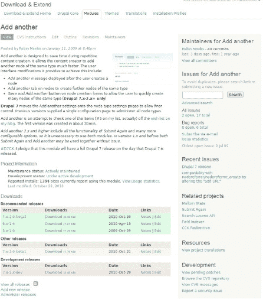

***图 21-1.** Add another 模块的区块议题显示开放议题与总议题数及错误报告的摘要。*

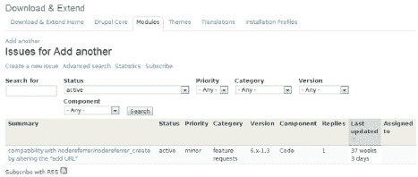

***图 21-2.** Add another 模块议题列表的摘录*

看看图 21-2 中的所有信息；你可以看到每个议题的标题（理想情况下是一个简短准确的**摘要**）；议题**分配给**了谁（如果有人分配）；以及你可以用来过滤列表的信息。议题会根据其当前**状态**进行颜色编码（该状态也在第二列中写明）。你可以按此表格中任一粗体标题进行排序。如前所述，**最后更新**是默认排序方式（点击可反转排序，先显示最早的议题）。

如果所有议题或所有开放议题超过一页，逐一阅读议题标题将变得枯燥乏味，因此请使用**搜索**框来查找与你类似的问题。在 Add another 议题队列中，你可以搜索 "Drupal 7"、"port" 和 "7.x version"，但会发现搜索结果为空或与升级无关。

从所有议题的列表中，点击“创建一个新议题”链接（在 Add another 模块的情况下，该链接会带你前往 `drupal.org/node/add/project-issue/addanother`）。

在议题创建表单中，**版本**是必填字段；由于尚无 7.x 版本，请使用最新的 6.x 版本。项目的维护者（或*一位*维护者；一个项目可以有多个维护者）需要创建一个 7.x 分支以解决此议题。届时，该议题可以被正确地标记为 7.x 版本。另一个必填字段是**组件**，应选择*代码*（大多数与功能相关的议题都会如此），而**类别**可以是*任务*（在推荐修改模块代码时，更常见的是提交*功能请求*或*错误报告*）。**优先级**、**分配给**和**状态**可以保留为默认值。

你可以为标题发挥创意：*7.x 移植*。大多数议题需要多行来描述，但在升级的情况下，一句话就足够了：“这个简单且有用的模块需要一个 Drupal 7 移植版本。”

#### 为什么不用自定义代码？

如果某个模块在你的 Drupal 版本中不存在、根本不存在，或者不能完全满足你的需求，那么自定义的站点特定模块始终是一个选择。（对于功能高度定制的站点，这通常是必要的。有关编写此类模块（通常称为*粘合代码*）的更多信息，请参见第 22 章）。通常来说，编写仅针对你的站点、但在其他情况下不可用的代码更容易。如果你确切知道自己需要什么，就无需通过用户界面来实现配置。即使是在升级现有模块的情况下，抓取并修改关键的几行代码可能比移植整个模块更容易。

然而，仅从自私的角度来看，有两个强有力的理由去升级（或创建、扩展）一个具有用户界面的、正式的、公开发布的模块。首先，你（以及与你合作的人）可以在不修改代码的情况下进行更改。例如，如果添加了一个新内容类型，并且该类型也应该具有“提交并添加另一个”选项，这可以通过管理 UI 中的一个简单复选框来实现。其次，通过将你的代码作为 `drupal.org` 托管的模块与社区共享，你可以获得其他人对功能和代码的审视；可能有人会在漏洞或安全漏洞对你造成影响之前就发现它们。甚至可能有人会添加功能，或者在时机成熟时将模块升级到 Drupal 8！这确实会发生，就像你现在正将 Drupal 6 版本的 Add another 模块升级到 Drupal 7 一样。

### 着手进行升级

如果你将 Add another 放入 Drupal 7 站点的模块目录中，你会在模块页面上看到它，显示着它的 Drupal 6 版本号 (6.x-1.6) 和描述（“向用户提供一个选项，在添加节点后创建另一个相同类型的节点”）。但之后，Drupal 会添加一条注释：“此版本与 Drupal 7.x 不兼容，应予以替换。”你甚至无法尝试启用它，如图 21-3 所示。

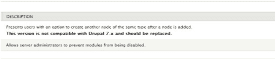

***图 21-3.** 如果模块是为早期版本编写的，Drupal 将显示错误。*

 **提示** 一旦你开始工作，就可以将你创建的议题分配给自己。只有在你真正开始工作时才应该这样做；如果你不得不离开超过一天，请将其设置回*未分配*状态。议题队列中有大量议题分配给了数月或数年没有进行任何工作的用户。

如果它能正常工作，那会很有趣，但我们必须付出一些努力，让 Add another 模块能在 Drupal 7 中运行。对于最简单的模块，可能只需更改 `.info` 文件中指定的核心版本即可，但盲目尝试实际上并不是让模块工作的最佳方法。

#### 记录你需要了解的内容

随着对 Drupal 的修改以创建下一个主要版本，会记录一份全面的 API 变更列表。这些变更可以在 `drupal.org` 手册的 *为 Drupal 开发*  *模块开发者指南*  *更新你的模块* 下找到。从 Drupal 6 到 Drupal 7 的变更位于名为“将 6.x 模块转换为 7.x”的页面，网址为 `drupal.org/update/modules/6/7`。

记录 Drupal 主要版本之间的变更并保持此列表更新是 Drupal 社区的一项了不起的努力。尽管这项工作值得尊敬，但你确定要审查这个列表上的 200 多项吗？作为学习练习，这是度过一个漫长下午的极好推荐方式……但对于你升级的每个模块呢？

一些坚毅的人已经付出了努力，进一步改善了 Drupal 开发者的体验（有时缩写为 *DX*）。

#### 自动化（部分）模块升级

Jim Berry 在 Jon Duell 等人的协助下，为我们带来了便捷的 `Coder Upgrade` 模块。你可以从 `drupal.org/project/coder` 获取该模块，它属于 Coder 项目包的一部分。

`Coder Upgrade` 模块需要依赖 `Grammar Parser` 模块来检查代码并提供修改建议，因此你还需下载 `drupal.org/project/grammar_parser`。关于完成上述操作的最快捷方法，请参阅本章的“命令行步骤”部分。

 **提示** 你也可以通过在线服务 `upgrade.boombatower.com` 使用这些工具。

与所有开发工作一样，此操作应在你的本地计算机或测试服务器上进行，切勿直接在公网服务器的线上站点操作。你甚至不需要复制站点环境（尽管本示例中会这样做）；全新的 Drupal 7 安装即可满足模块升级需求。由于使用的是开发沙箱，请将 `Coder` 与 `Grammar Parser` 放置在 `sites/all/modules` 目录下——尽管这些开发者模块最终不会纳入站点项目。

在你的本地 Drupal 安装中，访问 *管理*  *模块* (`admin/modules`)。在此处启用 `Coder`、`Coder Upgrade` 以及 `Grammar Parser`（`Coder Upgrade` 所依赖的模块）。

现在需要获取待升级的模块。前往该模块的项目页面，查找最新版本代码。通常这位于名为`HEAD`的`-dev`开发分支；升级模块或添加新功能时，应使用此最新开发版本。以`Add another`模块为例，访问其项目页面[`http://drupal.org/project/addanother`](http://drupal.org/project/addanother)，你会发现最新可用版本是正式发布版。查看代码仓库（可通过项目页面的链接浏览）后发现自该版本后未提交任何新工作。因此，请下载最新版本`6.x-1.4`开始移植。解压模块的压缩包，将所得文件夹和文件放入`Coder Upgrade`要求的暂存区；该暂存区位于Drupal站点文件目录（通常为`sites/default/files`）下，需创建`coder_upgrade`子目录及其下的`old`目录（即`coder_upgrade/old`）。换句话说，完整路径为`sites/default/files/coder_upgrade/old`。请注意，你可以根据需要创建父目录。

##### 命令行步骤

从Drupal安装的Web根目录（本例中为`drupal7`）开始，输入以下命令：

```
drush dl coder grammar_parser
drush en coder coder_upgrade grammar_parser
mkdir -p sites/default/files/coder_upgrade/old
cd ../
drush dl addanother --default-major=6 --select --
    destination=drupal7/sites/default/files/coder_upgrade/old
```

 **注意** `mkdir`命令的`-p`参数代表`--parents`；在此例中，它会在创建`old`目录的同时自动创建`coder_upgrade`目录。

在上述步骤中，我们需要从Drupal 7站点目录退出一级，以便让`drush`下载Drupal 6模块，这正是`cd`（切换目录）命令的作用。

 **提示** `drush`的`--select`选项会显示模块当前所有可用版本，并允许你选择所需版本。

强烈建议通过上述命令行方式安装模块并获取待升级模块。但后续的升级步骤仍需通过`Coder Upgrade`的用户界面来完成。

 **提示** 许多模块都内置了详尽的帮助文档，可访问`admin/help`。你也可以在本地站点的`admin/help/coder_upgrade`页面阅读`Coder Upgrade`模块在模块内提供的非常详尽的文档。

开始自动升级：访问*管理*  *配置*  *开发*  *Coder*  *升级* (`admin/config/development/coder/upgrade`)，点击*目录*垂直选项卡，找到要升级的模块。模块按系统名称列出，`Add another`的系统名称是`addanother`。`Coder Upgrade`还会显示路径——`coder_upgrade/old/addanother`——以便你确认这是刚下载的模块。勾选该模块，然后点击底部的“转换文件”按钮，如图 21–4 所示。

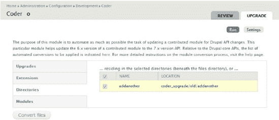

***图 21–4.** Coder提供了简化模块升级的管理界面。*

你将看到以下令人兴奋的系统消息：

- 模块转换代码已运行

- 点击查看转换日志文件

- 可通过点击下方“目录”和“模块”选项卡中的名称链接来查看补丁文件

你可以点击转换日志文件链接，但其中有趣的内容不多：仅列出了升级所查找的钩子列表。查看补丁文件则有趣得多。补丁文件展示了`Coder Upgrade`对模块所做的所有更改。

通常，自动升级的模块只是部分升级，但值得进行测试。

你可以将`Coder Upgrade`放置在`sites/default/files/coder_upgrade/new`中的升级后模块移动到`sites/all/modules`或`sites/default/modules`目录，也可以使用`Coder Upgrade`提供的补丁就地升级模块的`6.x`版本。选择后者可避免处理权限问题。

##### 命令行步骤

```
mv sites/default/files/coder_upgrade/old/addanother sites/default/modules/
patch -p0 <sites/default/files/coder_upgrade/patches/addanother.patch
```

 **提示** Drupal在`drupal.org/patch/apply`中提供了关于如何应用补丁的详细文档。我认为这个链接是快速回忆`patch`命令中尖括号方向的最佳捷径。（另一种方法：记住补丁命令“吃掉”补丁。因此，上一条代码的最后一行可以理解为“`patch -p0 < aiee-the-alligator-is-going-to-get-me.patch`”。）

如果其他方法都不奏效，自动升级必须完成的关键变更就是将模块的`.info`文件中的核心指令改为7.x。这一行可能会出现两次，因为如注释所述，`drupal.org`会向下载的模块添加日期戳和其他自动信息（注意`.info`文件中的注释行以分号`;`开头）。这些由打包脚本添加的行可以安全删除，即使`coder_upgrade`尝试更新了核心行。另外，在编写本文时，受支持的Coder Upgrade版本错误地为`.install`和`.module`文件添加了`files[]`指令行；这一问题已在Coder Upgrade开发版中修复，但如果你看到这些残留的Drupal 7早期阶段产物，可以将其删除。

```
name = Add another
description = "Presents users with an option to create another node of the same type after a node is added."
core = 7.x
; Information added by drupal.org packaging script on 2010-04-19
version = "6.x-1.6"
core = 7.x
project = "addanother"
datestamp = "1271637006"
```

 **注意** 如果你直接从`drupal.org`的版本控制系统检出模块，就不会获得打包脚本添加的这些信息；Drupal仅修改打包成可下载版本的`.info`文件。

现在你应该启用该模块，并检查模块添加的其他配置选项（请在你的开发站点上操作，绝非任何类型的生产站点）。大多数模块会向管理用户菜单添加内容：*配置*下新增的设置项、*创建内容*下新增的节点类型，或管理界面中某处的新菜单链接或选项卡。不过，你不会看到该模块添加的任何内容。它本应在*配置*下添加一个“Add another”链接，但那里什么都没有。

如果自动移植成功了，那本会相当棒。

然而，即使自动升级完全成功，你仍然需要审查代码。现在就来研究这个模块吧！

##### 找出问题所在

在编程时，如果能明确知道某个具体功能不工作，其实是相当好的起点。这意味着你面前有一个非常清晰定义的任务。实际上，测试驱动开发（参见第 23 章）采取的方法是：先编写一个关于预期行为是否发生的自动化测试，并明知测试会失败。然后程序员让测试通过，并可以重构（改进）代码，同时确信一旦破坏了任何部分，他们会立即知晓。在这个案例中，这意味着测试*配置*下是否存在“Add another”菜单项。

无论你是否使用测试驱动开发，你都需要深入模块内部来修复代码。

模块就在你上次放置的位置，即`sites/default/modules`目录下。打开`addanother`目录中的`addanother.module`文件。

##### 命令行步骤

从网站根目录输入以下命令：

```
cd sites/default/modules/addanother/
vi addanother.module
```

现在你已经进入模块。该从哪里开始寻找呢？

每当你需要在 Drupal 中创建菜单项时，都需要以某种形式处理 `hook_menu`。在 Drupal 7 中，为配置页面指定路径的方式略有变化。在 Drupal 6 中，你可以将菜单路径指定为 `admin/settings/YourModuleName`；Coder Upgrade 会将其重新格式化为 `admin/config/YourModuleName`。遗憾的是，这并不符合 Drupal 7 在配置页面显示项目的标准，因为你需要向路径中传递另一个元素来指明你的配置所属的配置组，其中最基础的是 `system`。这样你的链接就会变成 `admin/config/system/YourModuleName`。我们来实际看看这个变化。

##### Coder 模块输出

```
/**
'* 实现 hook_menu()。
'*/
function addanother_menu() {
  $items = array();
  $items['admin/config/addanother'] = array(
    'title' => 'Add another',
…
}
```

##### 修正后的代码

```
/**
 * 实现 hook_menu()。
 */
function addanother_menu() {
  $items = array();
  $items['admin/config/system/addanother'] = array(
    'title' => 'Add another',
…
}
```

每当你对 Drupal 的菜单系统进行更改后，都需要清除菜单缓存才能使更改生效。有两种方法可以实现。第一种是进入*配置*，然后选择*开发*下的*性能*，再点击“清除所有缓存”按钮。第二种方法是使用 Drush 清除缓存；你可以直接在命令行中输入以下命令：

```
drush cc
```

无论你选择哪种方式清除页面缓存，“Add another”菜单项现在应该出现在你站点的配置页面上。你现在可以访问“Add another”页面，并为 Drupal 默认附带的“文章”内容类型启用“Add another”。你还可以为了测试模块的其他功能，同时启用所有三个显示设置：节点创建后显示“Add another”消息、在支持的节点类型上显示“Add another”选项卡、以及在支持的节点编辑页面上也显示“Add another”选项卡（如图 21–5 所示）。

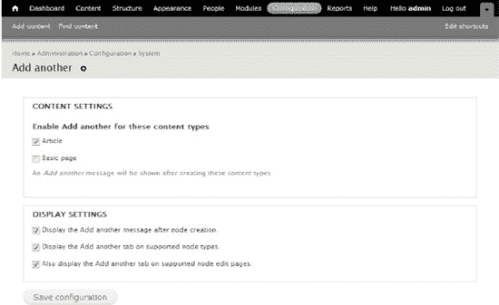

*图 21–5。“Add another”配置页面正逐渐接近你所需的功能。*

好了，你离所需的功能越来越近了。然而，如果你尝试创建一个“文章”节点类型，就会看到几条错误信息，而不是预期的消息：

```
Notice: Undefined index: access in _menu_translate() (line 776 of C:\xampp\htdocs\d7\includes\menu.inc).
```

```
Notice: Undefined index: access in menu_local_tasks() (line 1890 of C:\xampp\htdocs\d7\includes\menu.inc).
```

这是由于 Drupal 7 中的另一个变化，Coder 未能自动捕获。由于 Add another 的 Drupal 6 版本包含一个名为 `addanother_access` 的函数，Coder 假定它是一个节点访问函数，并将其重命名为 `addanother_node_access` 以适应 Drupal 7。这是不正确的；你需要将函数名改回去。因此这段代码

```
/**
 * 检查是否应在节点上显示“Add another”提示。
 */
function addanother_node_access($nid) {
…
}
```

变成了

```
/**
 * 检查是否应在节点上显示“Add another”提示。
 */
function addanother_access($nid) {
…
}
```

现在，如果你创建一篇文章，就肯定有进展了！你可以看到“Add another”选项卡正常工作，但“Add another”消息仍未显示。这是由于 Drupal 7 中处理顺序的变化，你可以利用这一变化，将 `drupal_set_message` 调用移至 `addanother_node_insert` 函数中。同时，你还可以通过移除处理现已弃用的 `Submit Again` 模块的遗留代码来进行清理。具体更改如下：

###### 原文

```
/**
 * 实现 hook_node_insert()。
 */
function addanother_node_insert($node) {
  if ($node->op == t('保存并创建另一个')) {
    // 防止“添加另一个”的消息与“再次提交”冲突。
    return;
  }
  $allowed_nodetypes = variable_get('addanother_nodetypes', array());
  if (user_access('使用添加另一个') && isset($allowed_nodetypes[$node->type]) && $allowed_nodetypes[$node->type]) {
    global $_addanother_message;
    $_addanother_message = t('添加另一个 <a href="@typeurl">%type</a>。', array(
          '@typeurl' => url('node/add/' . str_replace('_', '-', $node->type)),
          '%type' => node_type_get_name($node)
          ));
  }
}
```

```
/**
 * 实现 hook_nodeapi()。
 */
function addanother_nodeapi_OLD(&$node, $op, $a3 = NULL, $a4 = NULL) { }
```

```
/**
 * 实现 hook_form_alter()。
 */
function addanother_form_alter(&$form, &$form_state, $form_id) {
  if (isset($form['#node']) && $form['#node']->type . '_node_form' == $form_id
&& variable_get('addanother_message', TRUE)) {
    $form['buttons']['submit']['#submit'][] = '_addanother_message';
  }
}
```

```
/**
 * 如果由 addanother_nodeapi() 设置了“添加另一个”消息，则显示该消息。
 */
function _addanother_message($form, &$form_state) {
  global $_addanother_message;
  if (isset($_addanother_message)) {
    drupal_set_message($_addanother_message, 'status', FALSE);
  }
}
```

###### 更新后

```
/**
 * 实现 hook_node_insert()。
 */
function addanother_node_insert($node) {
  $allowed_nodetypes = variable_get('addanother_nodetypes', array());
  if (user_access('使用添加另一个') && isset($allowed_nodetypes[$node->type]) && $allowed_nodetypes[$node->type]) {
    $_addanother_message = t('添加另一个 <a href="@typeurl">%type</a>。', array(
      '@typeurl' => url('node/add/' . str_replace('_', '-', $node->type)),
      '%type' => node_type_get_name($node)
      ));
    drupal_set_message($_addanother_message, 'status', FALSE);
  }
}
```

如您所见，您现在能够移除那个空的 `hook_nodeapi` 函数，以及不再需要的 `_addanother_message` 函数和调用它的 `hook_form_alter`。这是一个极好的示例，展示了 Drupal 7 中引入的一些更改如何让模块编写过程变得更加轻松。

 **Drupal 7 的新特性** Drupal 编码标准要求，实现钩子的函数应使用注释 `Implements hook_somethingorother().` 来标识。（请参阅 `drupal.org/coding-standards`，尤其是 `drupal.org/node/161085` 上的“模块文档指南”页面。）以现在时第三人称（他/她/它）动词（如“implements”）开头的函数描述是 Drupal 7 引入的新规范。

保存模块并再次创作一篇文章后，如图 Figure 21–6 所示，尽享成功的美妙滋味！

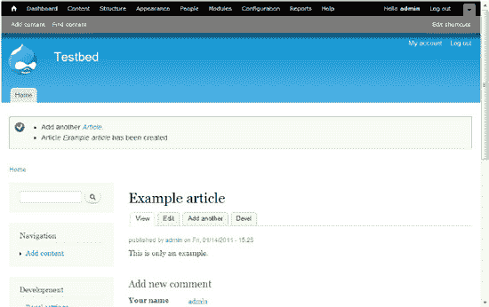

*图 21–6. “添加另一个”消息终于正常工作了！*

#### 寻找可效仿的范例

查阅 Drupal 核心代码是学习编写优质 Drupal 代码的最佳方法之一。尽管核心的某些部分（讽刺的是）在“以 Drupal 的方式”行事方面并非尽善尽美，但核心代码通常受到最广泛的关注，也投入了最多的心血。您可以确信这些代码运行良好。

 **提示** 另一个寻找范例代码的好去处是 `drupal.org/projects/examples` 上 Examples 项目中的模块套件。

以这个模块为例，您本可以将菜单钩子与核心中生成系统菜单的其他模块（如 `comment.module`）进行比较。您还可以查看 `drupal.org` 上执行与您自身功能类似的其他贡献模块，将其作为范例。

 **注意** 核心模块和贡献模块也经常在模块旁边的包含文件中或子目录中包含代码。以评论模块为例（除了多个主题模板文件、CSS 文件、JavaScript 文件以及 `.install` 和 `.info` 文件外），它还包含 `comment.admin.inc`、`comment.pages.inc` 和 `comment.tokens.inc`。

本章重点讨论了升级模块所需执行的操作，但通过探索您升级或开发的任何模块的代码，您可以从 Drupal 中学到更多。

### 向 Drupal.org 贡献升级内容

在提交补丁之前，你的工作尚未完成。

开源免费软件真是太棒了。你正在他人的工作成果之上进行构建（并且会查看核心软件代码以获取指导）。现在，你需要与社区分享你完成的工作，并且你将至少获得一两个人的审阅和测试带来的好处。在你完成的工作被整合到 `drupal.org` 上的模块中之后，你将能够使用其他人所做的任何修复或改进，而无需保留一个与其它 Drupalistas 用户使用和贡献的版本相分离的版本。

好吧，这些你都知道。那么，你究竟该如何贡献你的更改呢？传统的 Drupal 方式（这在许多软件项目中都很常见）是所有代码更改都以补丁文件的形式提交。关于制作补丁的说明，请参见 `drupal.org/patch/create` 上的“创建补丁”页面（以及手册中“参与进来”部分的“贡献代码”一节）。

在本书的大部分内容中，命令行文本都作为一种可选方案呈现——这是推荐方案，但仍是可选方案。对于创建补丁，它是唯一被描述的方案，尽管也有各种 GUI 程序，例如 [`http://winmerge.org`](http://winmerge.org)，你可以尝试。要在不使用版本控制系统的情况下创建补丁，你需要一份代码的副本。任何类 UNIX 系统（Linux、Mac OS X 或 Windows 上的 Cygwin）都会为你提供 `diff` 命令，用于创建一个显示你的版本与原始版本之间差异的简单文件。

这个命令的使用方法很简单。它需要一些标志来创建 Drupal 社区所期望样式的补丁：`u` 和 `p` 用于统一上下文（每次更改前后各三行未更改的代码）以及代码所在的函数，`r` 用于递归遍历目录（以便能够修补多个文件）。然后，它需要两个参数或操作数：原始代码（文件或目录）和你修改后的代码（一个等效的文件或目录）。最后，你可以使用 `>`（右尖括号）字符和一个文件名将命令的输出指向一个文件。上传到 `drupal.org` 的补丁文件名应包含相关的项目名称、非常简短的更改描述（通常取自问题标题）、问题的节点 ID 以及补丁将附加到的评论编号。

信息量很大，但请注意它如何在一行命令中组合在一起。首先，你必须从模块的目录开始，因为项目补丁应该能够从项目根目录内应用。对于“Add another”项目，它应该从“Add another”文件夹内应用。（同样，所有 Drupal 核心补丁都应该从 Drupal 根目录应用。）

回到 `drupal.org/project/issues/addanother` 找到问题，*7.x 移植*。你可以从问题的 URL [`http://drupal.org/node/554504`](http://drupal.org/node/554504) 获取问题的节点 ID，并查看下一个评论的编号（只需将问题上的最后一个评论编号加一）。现在你已经准备好制作补丁了，这是你所有工作的顶点，如下所示：

```
cd sites/default/modules/addanother
diff -urp ../../files/coder_upgrade/old/addanother/ . > addanother-7.x-port-554504-5.patch
```

你可以使用 `patch` 命令测试该补丁是否适用于“Add another”模块（你应始终检查最新版本）。将补丁复制到一个新目录，获取一份新的 Drupal 6 版本的“Add another”，然后尝试应用补丁，如下所示：

```
wget http://ftp.drupal.org/files/projects/addanother-6.x-1.4.tar.gz
tar -xzf addanother-6.x-1.4.tar.gz
cd addanother
patch -p0 < ../addanother-7.x-port-554504-5.patch
```

只要没有出现错误，补丁就正确应用了。现在，你只需要在问题上发布一条评论并附加 `.patch` 文件即可。永远不要指望一切都能一次成功，尤其是对于每个随后尝试应用你的补丁的人来说。一旦进入问题队列，人们会尝试提供帮助。

当其他人检查和审阅你的代码时，你将有机会对模块进行调整或进一步修改，但大部分工作已经完成。恭喜你完成了第一个 Drupal 模块升级！

 **提示** 访问 `dgd7.org/upmodule`，获取有关移植不同类型模块的更多技巧，以及随着 Drupal.org 转向 Git 版本控制这一新变化，当前最佳的补丁实践。

## 第 22 章

