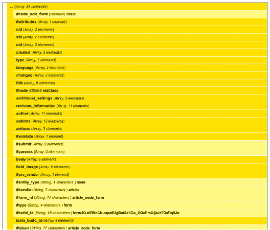

# 编写项目特定代码

作者：Florian Lorétan

Drupal 的一大优势在于其丰富的可用模块选择，从外部媒体集成到复杂的访问限制，应有尽有，许多模块扩展了标准功能以适应特定用例。

组合现有模块可以满足你大部分的需求，但每个项目都不同，并且拥有任何模块都无法覆盖的独特细节。这时就需要*粘合代码*——一种填补现有模块提供的功能与项目精确需求之间空白的项目特定代码。粘合代码使你能将项目完成到 100%，并让客户完全满意。

 **注意** 许多模块提供配置选项，让用户根据自己的需求调整功能。在开始编写自己的自定义代码之前，请务必查看这些选项。

以下是你需要了解的术语：

- *核心模块*：包含在 Drupal 标准下载包中的模块。这些模块由维护核心系统的同一批人维护。
- *贡献模块*：在`drupal.org`上提供下载的模块。其中一些模块被广泛使用，而另一些则仅被特定人群使用。
- *自定义模块*：你在处理项目时编写的模块。它仅包含项目特定的功能，例如对核心模块和贡献模块的自定义。


### 自定义模块

与 Drupal 中的任何功能类似，胶水代码也存在于模块中。自定义胶水代码模块与来自 `drupal.org` 的贡献模块之间没有技术差异，但将你的代码与他人维护的代码分开非常重要。这种分离使得你可以对贡献模块应用更新，并受益于安全更新和功能改进，而不会丢失你的自定义内容。

Drupal 新手开发者常犯的最大错误是直接修改现有模块甚至 Drupal 核心文件。我必须承认，在我 Drupal 职业生涯的早期也曾这样做过，这花费的时间比阅读这本（如果当时存在的话）书要多得多。

编写胶水代码的正确方法是创建一个自定义模块，并使其与贡献模块清晰分离。每种类型的模块都有不同的标准位置，便于区分。目录路径是相对于存放 `index.php` 文件的 Drupal 主目录来指示的。

* 核心模块存储在 `modules` 目录中。你不应该修改此目录中的任何内容。
* 贡献模块存储在 `sites/all/modules/contrib` 目录中。此目录的内容仅应在更新模块时进行修改。
* 自定义模块存储在 `sites/all/modules/custom` 目录中。这些是你自己编写的模块，你可以根据需要自由修改它们。

除了将自定义模块存储在 `sites/all/modules/custom` 中之外，你还应遵循以下约定：

* 为避免与现有名称发生潜在冲突，自定义模块的名称应以项目名称作为前缀，例如 `myproject_comment.module`。
* 对于小型项目，所有内容可以放在一个模块中。如果你需要多个模块，请确保自己模块之间的依赖关系是清晰的。
* 如果自定义模块扩展了其他模块提供的功能，请确保在 `.info` 文件列出的依赖项中包含该模块。

例如，一个为名为 “MyProject” 的项目自定义评论表单的模块，其结构如下：

`sites/all/modules/custom/myproject_comment/myproject_comment.info`

```
name = "MyProject Comment Customizations"
description = "Customize the comment form for MyProject."
core = 7.x
package = "MyWebSite"

; 添加我们依赖的所有模块。
dependencies[] = comment
```

`sites/all/modules/custom/myproject_comment/myproject_comment.module`

```
<?php
```

目前，`myproject_comment.module` 可以留空。你可以从模块管理页面启用该模块，但它目前尚未执行任何操作。

> **注意：** 本章给出的许多示例都可以使用现有的贡献模块来解决；文本中会提及这些解决方案。这些模块通常采用与所展示的自定义代码类似的方法。决定现有模块还是自定义模块更合适，取决于具体项目，这由读者自行判断。

### 钩子

如前所述，胶水代码模块本身不提供功能，而是扩展现有模块提供的功能。在 Drupal 中，让模块相互交互的标准机制是 *钩子系统*。

钩子系统是一种非常灵活的方式，允许一个模块为其他模块提供响应特定事件的可能性。例如，评论模块定义了一个名为 `hook_comment_presave()` 的钩子，该钩子在保存评论之前执行。任何有兴趣在保存前修改评论的模块，都可以通过将 “hook” 替换为模块名称来定义一个函数。在你的例子中，你有一个 “myproject_comment” 模块实现了 `hook_comment_presave`，从而得到以下函数：

```
function myproject_comment_comment_presave($comment) {
  // 在此处执行操作。

}
```

钩子系统使得许多模块可以同时相互构建成为可能。它所提供的灵活性是 Drupal 作为开发平台的成功因素之一，但这种灵活性也意味着 Drupal 新手有时很难跟踪代码的执行过程。一种将自定义功能添加到现有模块的标准化方法，对于保持对模块间发生的各种交互的良好概览非常有帮助。

##### 方法

既然你已经有了放置代码的地方，让我们看看可以往里面放些什么。不过，在我深入介绍各种 API 以及如何使用它们之前，让我们先看看使用自定义代码实现目标的一般方法。无论你是一位经验丰富的 “Drupal 忍者”，还是正在编写第一个模块，编写自定义代码始终是一个由以下问题组成的探索过程：

我需要修改什么，以及为什么要这么做？

我可以在哪里接入（钩入）？

那里已经有什么了？

我如何根据自己的需求修改现有功能？

#### 我需要修改什么，以及为什么要这么做？

我不打算花太多时间讨论想要特定功能的原因，但在开始编写代码之前，“我为什么要这样做？” 总是要问的重要问题。

自定义代码本质上会修改现有功能的标准行为。在开始编码之前，请确保你希望引入系统的更改是有意义的。标准功能之所以成为标准，通常是有原因的，考虑你的更改将带来的影响非常重要。

#### 我可以在哪里接入（钩入）？

Drupal 拥有非常灵活的架构，使得不同模块之间的交互变得非常容易，但这也意味着有许多不同的方法可以达到相似的结果。用于模块交互的主要概念是 *钩子*。当一个模块提供特定功能时，钩子是一种让其他模块知道并做出相应反应的方式。这使得模块可以构建在其他模块之上。事实上，你可以将 Drupal 视为一种分层架构，核心系统位于最底层，一些基础模块构建其上，然后更多的模块扩展这些基础功能。

每个相互构建的模块都使用其下层模块的钩子。你的自定义模块将位于现有模块之上，因此了解接入它们的最佳方式对于构建稳固的功能至关重要。这个问题基本上归结为你想要实现哪个钩子。

虽然没有绝对的规则，但一个好的起点是找出你将处理哪种类型的元素或主要组件。在大多数情况下，它会是一个节点、一个表单或一个菜单路由项。在 `api.drupal.org` 上搜索应该能帮你找到相关的钩子，但表 22-1 展示了一些基本的钩子。

**表 22-1.** 基本钩子

| **组件类型** | **可修改方式** |
| --- | --- |
| 表单 | `hook_form_alter(&$form, &$form_state, $form_id)` |
| 节点 | `hook_node_presave()`、`hook_node_insert()` 等 |
| 菜单路由项 | `hook_menu_alter(&$items)` |

#### 那里已经有什么了？

一旦你找到了接入现有功能的点，你需要知道那里有什么可以操作的。这时，一些调试工具（例如 `debug()` 函数）就派上用场了。自定义模块主要处理由其他模块定义的结构，能够可视化这些结构对于与之交互至关重要。

> **提示：** Devel 模块提供了一套工具，可以轻松调查 Drupal 站点中涉及的各种结构。该模块不向最终用户提供任何功能，并且应在生产环境中禁用，但我绝对推荐在任何项目的开发过程中使用它。


#### 如何根据自身需求修改现有功能？

这是整个流程的最后一步，但也是真正落实工作的环节。你清楚自己想要什么、知道可以挂载到何处、也了解有哪些可用数据；现在只需编写实现目标的代码。如果你在此处发现不知如何继续，回溯之前的步骤应该会有所帮助。

### 示例：更改提交按钮的标签

以下是一个简单的例子来说明这个方法：

1. **我需要修改什么，以及为什么这样做？**

   你有一个来自贡献模块的表单，但为你构建网站的客户希望将显示为"保存"的标准提交按钮替换为"存储此信息"。

2. **我可以挂载到何处？**

   有几个地方可以挂载来实现修改，但由于你要修改的是表单元素，因此需要实现 `hook_form_alter()`，它接受三个参数：`$form`、`$form_state` 和 `$form_id`：

   ```
   function mymodule_form_alter(&$form, &$form_state, $form_id) {

   }
   ```

3. **已经存在什么？**

   使用 Devel 模块及其辅助函数 `dpm()` 来查看参数的内容，例如：

   ```
   function mymodule_form_alter(&$form, &$form_state, $form_id) {
     dpm($form);
     dpm($form_state);
     dpm($form_id);
   }
   ```

   结果显示 `$form` 是一个 Form API 结构化数组，你可以在其中找到要修改的提交按钮（参见 图 22-1）。`$form_state` 包含表单状态的其他信息，例如已提交的值。`$form_id` 参数用于标识这个特定表单；你可以用它来确保不影响其他表单。

   请注意，`hook_form_alter()` 还有一个针对特定表单的变体，形式为 `hook_form_FORM_ID_alter()`，且不接受 `$form_id` 参数。这种变体的优点是只影响特定表单，从而略微提升性能并减少产生意外副作用的风险。

   

   ***图 22-1.** `dpm()` 的输出*

4. **如何根据自身需求修改现有功能？**

   既然已经锁定要使用的关键元素，就可以编写代码了。我们知道表单的 ID，因此也可以使用 `hook_form_FORM_ID_alter()` 变体来仅影响这个特定表单。假设该表单的 ID 是 `article_node_form`，我们的钩子实现将如下所示：

   ```
   function mymodule_form_article_node_formalter(&$form, &$form_state, $form_id) {
     // 替换提交按钮的 #value 属性。
     $form['submit']['#value'] = t('存储此信息');
   }
   ```

### 具体用例

Drupal 中不同钩子提供的可能性是无穷无尽的。关于如何使用每个钩子的文档可在 `api.drupal.org` 上获取，因此在此处全部列出意义不大。相反，我将展示常见任务的示例及其解决方法。

#### 隐藏用户界面中的元素

当谈到定制现有模块提供的功能时，我并不一定是要扩展它。事实上，粘合代码最常见任务之一就是隐藏用户界面中的元素。其目的可以是精简用户体验（移除多余元素），也可以是功能性的——有目的地限制提供给最终用户的选项以符合你的需求。

当需要向用户隐藏元素时，首先想到的是直接完全移除该元素。虽然这大多数时候可行，但在某些情况下这种方法会产生负面副作用。其他模块可能依赖这些元素的存在，因此最佳解决方案不是移除它们，而是拒绝访问，如下所示：

```
/**
 * 实现 hook_form_alter()。
 * 从文章表单中移除评论设置。
 */
function mymodule_form_alter(&$form, &$form_state, $form_id) {
  $form['comment_settings']['#access'] = FALSE;
}
```

这段代码演示了如何使用 `hook_form_alter()` 将表单元素的 `#access` 属性设置为 `FALSE`，从而对所有用户隐藏该元素。该表单元素不可见，但仍在表单结构中，并会被正确处理。在这个例子中，你隐藏了文章创建表单中的评论设置，但使用此表单创建的文章仍会应用默认的评论设置。

下一个示例使用相同的原理处理菜单元素。访问回调通常是定义用户是否有权限访问页面的函数，但通过将访问回调设置为 `TRUE` 或 `FALSE`，我们可以无条件地允许或拒绝所有用户的访问。

```
/**
 * 实现 hook_menu_alter()。
 *
 * 使 http://example.com/node 页面无法访问。
 */
function mymodule_menu_alter(&$items) {
  $items['node']['access callback'] = FALSE;
}
```

这个第二个示例使用相同的原理处理菜单元素。访问回调通常是定义用户是否有权限访问页面的函数，但通过将访问回调设置为 `TRUE` 或 `FALSE`，我们可以无条件地允许或拒绝所有用户的访问。

有时你并不想移除元素，而只想改变它的外观或行为。这通常可以通过更改其类型来实现。基本表单元素可以轻松地从一种类型转换为另一种类型。下一个示例将文本字段转换为选择字段，让用户从预定义选项中选择，而不是输入任意内容。请注意，表单元素只能转换为值兼容的元素类型。文本字段的值是字符串，而复选框组的值是数组；将文本字段转换为复选框组会导致不可预测的结果。

```
/**
 * 实现 hook_form_FORM_NAME_alter()。
 *
 * 不再使用文本字段按类型过滤视图，而是通过选择元素来限制选项。
 */
function mymodule_form_views_exposed_form_alter(&$form, &$form_state) {
  // 将过滤字段的类型更改为选择元素。
  $form['title']['#type'] = "select";

  // 设置仅搜索 Drupal 或开源相关的选项。
  $form['title']['#options'] = array(
    '' => t('列出所有内容'),
    'Drupal' => t('仅列出标题包含 "Drupal" 的文章'),
    'Open Source' => t('仅列出标题包含 "开源" 的文章'),
  );
}
```

最后一个示例非常常见。节点页面或用户注册表单上的选项卡通常是不需要的，尽管它们链接到的页面仍然需要可访问。通过将相应菜单定义的类型从 `MENU_LOCAL_TASK` 更改为 `MENU_CALLBACK`，可以轻松实现此效果，如下所示：

```
/**
 * 实现 hook_menu_alter()。
 *
 * 隐藏编辑文章选项卡，改为在内容末尾创建链接。
 */
function mymodule_menu_alter(&$items) {
  // 默认类型是 MENU_LOCAL_TASK，会显示一个选项卡。
  $items['node/%node/edit']['type'] = MENU_CALLBACK;
}
```

```
/**
 * 实现 hook_node_view()。
 *
 * 添加我们自己的链接。
 */
function mymodule_node_view($node, $view_mode) {
  $node->content['links']['mymodule_link'] = l(t('编辑'), 'node/' . $node->nid . '/edit');
}
```


#### 钩子（Hook）的执行顺序

在添加胶水代码时，了解钩子实现的执行顺序非常重要。通常，您想要扩展的模块与您的自定义模块使用了相同的钩子，在这种情况下，您通常希望自己的模块实现能够明确地在原始模块之前或之后执行。

默认情况下，钩子的执行顺序由对应模块的权重决定，该权重存储在系统表中，并可使用 `hook_install()` 进行设置。（例如，请查看 Devel 模块在 `devel.install` 文件中对 `hook_install()` 的实现。）权重相同的模块会根据路径按字母顺序排序，这意味着存储在 `modules` 目录中的核心模块的钩子会在存储于 `sites/all/modules` 的贡献模块的钩子之前执行。

然而，有时您只需要控制一个钩子，而不是全部。这可以通过 `hook_module_implements_alter(&$implementations, $hook)` 来实现。假设您想在所有其他模块完成表单修改后，再进行一些修改。可以通过以下代码实现：

```
/**
 * 实现 hook_module_implements_alter()。
 */
function mymodule_module_implements_alter(&$implementations, $hook) {
  if ($hook == 'form_alter') {
    $my_hook_implementation = $implementations['mymodule'];
    unset ($implementations['mymodule']);
    $implementations['mymodule'] = $my_hook_implementation;
  }
}
```

#### 使用字段

Drupal 7 最重要的新特性之一是将字段 API（Fields API）包含到 Drupal 核心中。

虽然字段 API 的灵感来源于广泛使用的 CCK 模块，但发生了一些重大变化，使得字段 API 在网站功能中变得更加核心。以前字段仅限于节点，现在它们可以附加到任何实体上。这意味着用户、评论、分类术语以及任何其他定义的实体现在都可以拥有额外的属性。因此，在为 Drupal 7 编写胶水代码时，您会经常遇到字段 API 的结构。

字段的标准结构如下：

`$entity->field_name[language_code][delta]['attribute_name']`

通过查看使用 Devel 模块的标准安装中定义的文章的字段结构，您会发现以下几点：

- 字段名称通常以 `field_` 前缀开头，但并非总是如此。例如，文章的正文字段就是一个字段，但其字段名称仅为 `'body'`。通过用户界面创建的字段将始终带有 `field_` 前缀。
- 当语言环境（locale）模块未启用时，语言代码始终为 `'und'`，即常量 `LANGUAGE_NONE` 的值。但是，当语言环境模块启用时，某些情况下语言代码与文章的语言对应，但某些字段（如 `field_tags`）仍然是与语言无关的。`field_language()` 函数帮助我们确定字段的语言代码，但我们也可以使用 `field_get_items()` 函数，它会为我们处理整个逻辑。

```
/**
 * 实现 hook_node_presave()。
 */
function mymodule_node_presave($node) {
  // 对特定字段使用 field_language()。
  $body_language_code = field_language('node', $node, 'body', $node->language);
  $body_value = $node->body[$body_language_code][0]['value'];

  // 或者，直接获取项目。
  $body = field_get_items('node', $node, 'body');
  $body_value = $body[0]['value'];
}
```

请注意，在处理与字段小部件相关的表单元素时，语言代码可通过 `#language` 表单 API 属性访问，并应通过这种方式获取。

```
/**
 * 实现 hook_form_alter()。
 */
function mymodule_article_node_form_alter(&$form, &$form_state) {
  // 正确： $body_language_code = $form['body']['#language'];
  // 错误： $body_language_code = field_language('node', $node['#node'], 'body');
}
```

- 增量（delta）是一个数字索引，用于多值字段以标识每个不同的值。然而，为了保持一致性，增量是所有附加字段结构的一部分。对于单值字段，增量始终为 0。

```
  // 您可以遍历字段的多个值。
  foreach (field_get_items('node', $node, 'field_tags') as $delta => $item) {
    // 对每个值执行某些操作。
  }
```

- 每种字段类型可以有多种不同的属性。许多字段类型，如文本和数字，都有一个名为 `'value'` 的主属性，但这并非总是如此。分类术语引用字段只有一个 `'tid'` 属性，包含所引用分类术语的标识符。图片字段则包含关于所引用文件的更多信息。如果不确定有哪些数据可用，请使用 Devel 模块进行检查。如果您需要的数据不可用，通常可以基于现有属性加载该数据。

 **注意** 字段 API 提供了更多可能性，这些对于自定义模块非常实用。编写自定义小部件或自定义格式化器是一种非常优雅的方式，可以在保持代码通用和整洁的同时，利用现有的字段结构。有关字段 API 的更多信息，请访问 `api.drupal.org/api/drupal/modules--field--field.module/group/field/7`。

#### 添加动态前端交互

Web 2.0 运动普及了使用 JavaScript 和 Ajax 来改进用户界面，以至于它们已成为用户预期体验中不可或缺的一部分。幸运的是，Drupal 7 包含了许多工具，极大地简化了动态用户界面的创建。有关如何使用这些不同 API 的更多详细信息，请参阅第 17 章。

##### jQuery UI

jQuery UI 库是一套基于 jQuery 构建的用户界面工具，包含在 Drupal 7 中。它提供了辅助函数，以便于创建诸如可调整大小、可拖动或可选择组件等行为。它还提供了 JavaScript 选项卡、折叠面板、滑块以及其他常见的用户界面组件。

清单 22-1 是一个示例，演示了如何使用 jQuery UI 通过 `hook_page_alter()` 将侧边栏区块转换为折叠面板。

***清单 22-1**. 使用 jQuery UI*

```
/**
 * 实现 hook_page_alter()。
 *
 * 将侧边栏区块转换为折叠面板。
 */
function mymodule_page_alter(&$page) {
  if (isset($page['sidebar_first'])) {
    // 使用自定义主题函数调整侧边栏的 HTML 结构。
    $page['sidebar_first']['#theme'] = 'mymodule_sidebar_accordion';

    // 从 jQueryUI 添加折叠面板库。
    $page['sidebar_first']['#attached']['library'] = array(
      array('system', 'ui.accordion'),
    );

    // 添加将侧边栏转换为折叠面板的代码。
    $page['sidebar_first']['#attached']['js'][] = array(
      'data' => '(function($) {
                   Drupal.behaviors.sidebarAccordion = {
                     attach: function(context, settings) {
                       $("#sidebar-first").accordion();
                     }
                   };
                 })(jQuery);',
      'type' => 'inline',
    );
  }
}
```


##### #ajax 和 #states

交互性通常与表单密切相关。`#ajax` 和 `#states` 属性是表单 API 的新增功能，极大地简化了 Ajax 化组件的创建以及表单元素之间依赖关系的定义。这些任务曾需要自定义 jQuery 代码，但现在可以通过在 `hook_form_alter()` 的实现中直接修改表单数组，从 PHP 层面处理。请参见 `api.drupal.org/api/drupal/developer--topics--forms_api_reference.html/7` 上的表单 API 参考文档，了解如何使用这些属性的文档和示例。

### 使代码可复用

尽管你放入自定义模块中的粘合代码大多与具体项目相关，但如果能在不同项目上复用相同的功能，而无需从头开始或花费数小时调整代码以适应新项目，那将非常理想。以下章节包含了一些指导原则，可帮助你保持代码的通用性和可复用性。

#### 使功能可配置

当你需要针对某个特定组件进行操作时，最简单的方式是在模块中硬编码该组件的名称。其缺点是，从此以后，你的模块将依赖于一个具有特定名称的组件。你可以使功能可配置，而不是硬编码组件名称。

例如，你想创建一个小模块，用于在内容可能过时时通知用户，因为你的信息对时效性要求极高。硬编码版本如下所示：

```
/**
 * 实现 hook_node_view()。
 */
function mymodule_node_view($node, $view_mode, $langcode) {
  $display_outdated = $node->type == 'article';
  $age = time() - $node->created
  $is_outdated =  $age > 60*60*24*7;

  if ($display_outdated && $is_outdated) {
    drupal_set_message(t('本文发布于 1 周前，可能已过时。'));
  }
}
```

如果你在另一个需要相同功能（但内容类型为“story”，且阈值从一周变为一个月）的项目中使用此代码，你将需要修改四个地方的代码。这极易导致遗忘某项修改，最终出现损坏的代码。更好的解决方案是使代码可配置，如下所示：

```
/**
 * 实现 hook_node_view()。
 */
function mymodule_node_view($node, $view_mode, $langcode) {
  $delay = variable_get('mymodule_outdated_delay_' . $node->type, 0);
  $age = time() - $node->created
  $is_outdated = $age > $delay;
  if ($delay && $is_outdated) {
    $type = node_type_load($node->type);
    drupal_set_message(t('此 @type 发布于 @delay 前，可能已过时。', array('@type' =>  $type->name, '@delay' => format_interval($age, 1));
  }
}
```

这段代码不再依赖于特定内容类型的存在。相反，它定义了可为任何内容类型设置的变量。要使此配置对最终用户可用，你可以简单地扩展节点类型配置表单，如清单 22-2 所示。

***清单 22-2**. 扩展节点类型配置表单*

```
/**
 * 实现 hook_form_FORM_NAME_alter()。
 */
function mymodule_form_node_type_form_alter(&$form, &$form_state) {
$form['mymodule_outdated_delay'] = array(
    '#title' => t('过多久后你想警告用户。'),
    '#type' => 'select',
    '#default_value' =>  variable_get('mymodule_outdated_delay_' .  $form['#node_type'], 60*60*24*7),
    '#options' => array(
      0 => t('不警告过时内容'),
      60*60 => t('1 小时'),
      60*60*24 => t('1 天'),
      60*60*24*7 => t('1 周'),
    ),
  );
}
```

此代码将允许用户随其他节点设置一起配置功能。这些设置存储为变量，你可以像在 `hook_node_view()` 的实现中那样，从代码的其他部分访问它们。现在，配置与功能解耦，你就可以在具有类似功能但配置不同的另一个项目上复用相同的代码了。

#### 连接组件

粘合代码在大多数情况下依赖于其他结构，例如内容类型、视图和其他配置组件。在清单 22-2 中，你使代码变得通用，以便能够将功能附加到任何内容类型上，但在某些情况下，你需要存在特定的结构。

例如，如果不存在用于博客文章的内容类型和用于列出博客文章的视图，那么自定义博客模块就没什么意义。与其让安装模块的人自己创建这些组件，不如让你的自定义模块自行定义它们。你可以使用 `hook_node_info()` 定义新的节点类型，并使用 `hook_views_default_view()` 定义用于博客列表的视图。

然而，手动定义这些结构可能很繁琐，更新此类结构也很困难。Features 模块可以极大地帮助将配置组件导出为代码，但这为你的模块增加了一个额外的依赖项。第 34 章 包含有关如何使用 Features 的更多详细信息。

#### 为代码编写文档

你可能已经听过很多次了，所以我不会在这点上花太多时间，但仅仅因为你编写的是项目特定的代码，并不意味着你不应该为代码编写文档。作为 Drupal 项目的 PHP 开发者，自定义代码是你花费大部分时间的地方，因此缺乏文档会带来很大危害，并且无疑会降低代码的可复用性。

#### 遵循 Drupal 的编码标准

与许多项目一样，Drupal 拥有保证编码风格清晰一致的编码标准。尽管在编写自己的代码时你可以自由发挥，但使用与其他 Drupal 模块开发者相同的编码风格，将更容易让你所有项目保持一致性，并提高可读性。

关于官方 Drupal 编码标准的更多信息，请访问 `drupal.org/coding-standards`。

#### 发布你的作品

无论你需要什么样的自定义功能，很可能总有其他人与你有类似的需求。如果你一直在保持代码的整洁和通用性，那么在 `drupal.org` 上发布你的代码是一个绝佳的主意。（这也不必非得是一个完整的、受支持的项目——许多人能够从你以沙盒项目形式分享的自定义代码中受益。）

所有 Drupal 模块均以 GPL 2 许可发布。如果你的开发工作是有偿的（无论是作为雇员还是承包商），请与你的联系人确认，确保他们对你将他们付费编写的代码公开没有异议。

除了为开源项目做贡献能积攒好口碑之外，公开发布代码还能为所有参与方带来诸多其他好处。让更多人使用你的模块，意味着代码会有更多人审查，很可能你的用户会贡献 bug 报告和新功能。


### 修补现有模块

修改现有模块的代码通常被认为是一种不良实践。然而，当你正在改进模块本身时，这样做是合理的——只要将改进内容回馈给维护者，以便他们能在未来版本中包含这些改进。请注意，此类更改应始终在开发环境（而非生产服务器）中进行，并且应使用版本控制系统，以确保在必要时可以回滚更改。

大多数情况下，你将修复原始模块的漏洞或添加新功能。尽管具体细节可能有所不同，但以下是基本步骤：

- 查看模块的问题队列，看看是否有人报告过类似问题并最终解决了。
- 如果漏洞尚未报告，请撰写一个 issue，描述问题及其复现方法。
- 如果新功能尚未被请求，请撰写一个 issue，描述新功能及其必要性。
- 如果有任何建议的解决方案，请尝试一下，并报告它们是否有效。
- 如果没有建议的解决方案，或者建议的解决方案无效，请尝试自己解决问题。
- 务必更新你所发现的内容。即使是一次不成功的尝试，也可能提供有用的信息。
- 一旦有了有效的解决方案，可以将其保留在代码库中。请确保保存对该 issue 的引用以及补丁的副本，以备日后需要重新应用。

### 发布新模块

最后，在某些情况下，你创建的新功能不属于现有模块，而是需要一个独立的模块。在 `drupal.org` 上获取模块维护者账户的步骤超出了本章的范围，但你可以在 `drupal.org/node/7765` 找到更多相关信息（并参见第 37 章，了解如何使用 Git 在 `drupal.org` 上维护项目）。

在发布代码之前，请务必检查以下几点：

- 代码整洁、文档完善，并遵循 Drupal 的编码标准。
- 所提供的功能对其他人有用。
- 没有现有模块具有相同用途。如果有，请尝试与该模块的维护者合作。重复的模块会给最终用户造成混淆。
- 代码没有你所知道的安全漏洞。

### 总结

随着每个新版本的发布，Drupal 的 API 使得无需破解现有模块就能实现更多功能。从 Drupal 7 开始，绝不应再需要破解模块。正确使用 API 编写自己的胶水代码，不仅能避免给自己带来问题，还能让你成为一名更优秀的 Drupal 开发者。

保持代码整洁有助于你更好地利用 Drupal 周围的开发社区，而在遇到漏洞和新功能时贡献修复和代码，可能是你做出贡献并成为社区活跃成员的最简单方式。

 **提示** 请关注 `dgd7.org/glue`，获取本章的链接、更多资源以及读者提示。

