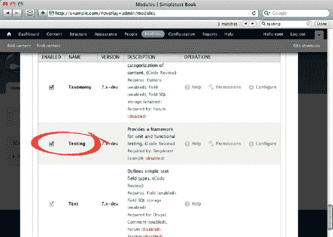
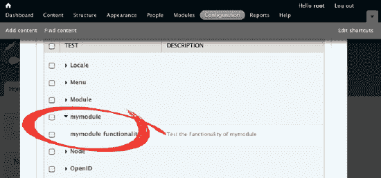
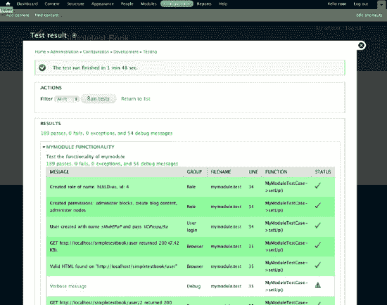
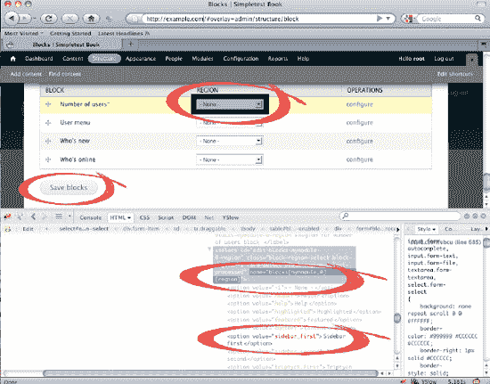

# 使用 Simpletest 进行功能测试简介

作者：Albert Albala

Drupal 7 的发布标志着一个转折点，尤其是在自动化测试方面，因为它允许核心和贡献模块开发者验证其代码是否按预期工作。由于内容管理系统最初是为更简单的网站设计的，自动化测试的相对复杂性传统上使其优先级较低。然而，在最近的版本中，特别是版本 7，Drupal 已远不止是一个简单的内容管理系统。它是一个*平台*，一个利用异常处理、面向对象编程以及自动化测试等现代概念的复杂应用程序。

Drupal 现在支持两种类型的自动化测试：

- *单元测试*验证代码单元（尤其是函数）。例如，单元测试可以向 `square_root()` 函数输入值 9，并确认其返回 3。

- *功能测试*验证涉及真实用户的特定用例是否产生预期结果。Drupal 核心节点模块测试（`modules/node/node.test`）中的一个实际示例验证了具有“创建页面内容”权限的用户可以转到添加内容  基本页面并成功创建页面。

本章将专门聚焦于功能测试，这是 Drupal 中迄今为止最广泛使用且最适应 Drupal 编写方式的测试。Drupal 社区以其 Simpletest 测试框架基于同名的 PHP 库构建，尽管 Drupal 中的 Simpletest 并不需要该库（对于 Drupal 6，请参见 `drupal.org/simpletest`）。事实上，Simpletest 现已紧密集成到 Drupal 核心开发工作流中，所有新的核心代码几乎都必须通过功能测试验证。

本章将向你展示如何利用 Simpletest 在自己的模块和补丁中进行功能测试（有关开发模块的更多信息，请参见第 18 章）。将功能测试视为*验证模块是否确实按预期与真实用户交互*。例如，假设你想开发一个简单的模块，如果超过 25 个用户在过去一个月内至少发布了一个节点，则显示文本“超过 25 名活跃用户！”。

如果没有自动化功能测试，你会编写模块，然后通过创建 25 个用户并为每个用户发布一篇文章来进行测试。只有这样，你才能确定“超过 25 名活跃用户！”文本确实在应该出现时出现。Simpletest 允许你在功能测试中定义这些步骤，以便它们可以在一个全新的临时 Drupal 站点中自动重复模拟任意次数——你无法直接操作该站点，只能通过测试文件中的代码进行操作（稍后你将看到）。

实际上，你将在本章后面创建这个确切的模块和功能测试。但首先，让我们快速概览一些关键的 Simpletest 概念。然后你将学习如何在 Drupal 7 中设置 Simpletest 工作环境。（别担心，其实没那么复杂。）

## 使用 Simpletest 的优势（及注意事项）

你的第一个问题很可能是：将 Simpletest 整合到工作流程中是否会增加开发时间。如果你考虑的是项目整个生命周期内的开发时间（而你确实应该这样考虑！），在大多数情况下你会发现使用 Simpletest 实际上能节省时间。是的，在项目初期，你会花更多时间来定义测试。但真正的回报出现在项目生命周期的后期。原因如下：

*   *自动化测试允许你通过在全新的临时 Drupal 安装环境中运行特定用例来验证代码是否按预期工作。* 这使你能够尽早发现问题（希望在网站用户发现之前），并消除对代码的假设。

*   *测试是模块文档的重要组成部分。* 当你查看本章后面的示例测试或 Drupal 核心自带的测试（参见 `modules/node/node.test`）时，你会发现测试*讲述了一个故事*，从用户的角度说明了模块的实际功能。这将为未来的程序员（包括你自己）节省宝贵的理解模块最初意图的时间。

*   *自动化测试有助于避免回归。* 一旦某个功能通过测试验证，后续再破坏它就变得更困难。如果你实施的 Bug 修复引入了*回归*（破坏了之前正常工作的功能），当你对新代码运行测试时，问题就会立刻引起你的注意。你将花费更少的时间来修正错误和维护代码。

但请记住，测试就像任何其他代码一样，容易出现 Bug 并且需要维护。要警惕你编写的测试中的逻辑错误，尤其是那些本应失败却通过的测试。

## 何时使用 Simpletest

最初使用 Simpletest 非常耗时。虽然理想情况下所有代码都应经过功能测试验证，但你很快会发现 Simpletest 在以下场景中能带来最高回报：

*   在广泛使用的模块上，这些模块更容易出现 Bug。

*   在你预期会长期进行积极开发的模块上。

*   在对你网站至关重要的模块上。

*   在需要多个步骤来测试某个预期用例的模块上。

为了获得最有效的测试，不要局限于正常的工作流程。务必也要测试当用户尝试执行不被允许的操作时会发生什么（例如，一个测试可以验证匿名用户无法创建内容）。别忘了：测试的质量完全取决于你如何编写。

## 什么是测试驱动开发（TDD）？

测试驱动开发将自动化测试推向了合乎逻辑的下一步。在 TDD 项目中：

*   你模块的当前版本不应包含任何失败的测试（因此也不应包含任何不成熟的功能）。

*   测试应与你的代码并行（甚至*先于*代码）定义。这让你在编码时能够专注于满足测试的要求。

*   在纯 TDD 模型中，你模块的当前版本甚至不应包含任何未经测试验证的功能。

你越是将这些概念应用于你的代码，Bug 就越难潜入。以下是针对特定任务的基本 TDD 工作流程：

*   添加一个会失败的测试，证明你的 Bug 存在或你的功能尚未实现。

*   修改模块（包括其测试），直到测试通过。

*   一旦你的测试通过，并且你已验证了修改有效，那么工作就完成了。

当然，通过测试并不能保证你的代码质量高！你的测试和模块代码仍然需要认真编写。

## Simpletest 的工作原理

在 Drupal 中，任何定义了用户界面的模块都可以（并且应该！）定义一个或多个功能测试。然后，你可以在任何启用了 Simpletest 的 Drupal 站点上运行这些测试（参见“设置与运行测试”部分）。但在大多数情况下，测试只会在你的开发站点上运行；一旦你的模块稳定下来，它们将在生产站点上存在，但测试会被忽略。

这些测试定义在哪里？Drupal 模块是至少包含两个文件的文件夹：`mymodule.info` 和 `mymodule.module`。（有关开发模块的更多信息，请参见第 18 章。）测试定义在另一个文件 `mymodule.test` 中。例如，你的测试文件可能位于 `sites/all/modules/mymodule/mymodule.test`。

 **注意** 在 Drupal 7 中，包含类的文件必须在 `.info` 文件中显式引用。因此，除了创建 `.test` 文件外，你还需要在 `.info` 文件中添加一行：`files[] = mymodule.test`。

稍后你将在“.test 文件剖析”部分更详细地了解具体细节；你还可以在 `dgd7.org/167` 以及本书的页面 [`www.apress.com`](http://www.apress.com) 上找到本章的所有代码。基本上，每个测试定义了模块应该*在一个全新的 Drupal 安装环境（而非你当前的站点）*中执行的特定操作。如果某个测试依赖于某些已存在的内容或用户，这些应在测试本身中创建（你将在本章后面看到如何操作）。

一旦测试存在，你就可以通过 Simpletest 模块运行它（参见“设置与运行测试”部分）。即使运行一个基本的测试也可能需要几分钟时间（你甚至可能认为站点卡住了；其实没有）。这是因为 Simpletest 会为每个测试创建一个全新的临时 Drupal 站点，然后在测试完成后将其删除。

 **注意** 重要的是要理解，每个测试在运行时，会完全忽略你当前站点数据库中的任何内容或其他测试中的数据。这是为了避免测试被外部数据“污染”。尽管目前正在努力实现在现有站点的克隆（而非全新安装）上运行测试（参见 `drupal.org/node/666956` 和 `drupal.org/project/simpletest_clone`），但这种功能目前尚未准备就绪。

对于每个测试，Simpletest 会通过安装所有数据库表来创建一个新站点；在每个测试结束时，这些表会被丢弃。Simpletest 使用的数据库与你启用了 Simpletest 模块的开发 Drupal 站点使用的数据库相同，具有相同的用户名和密码；为了避免命名冲突，每个临时表都会使用一个随机的唯一前缀创建。

 **注意** 我不建议在安装你的开发站点（即你启用 Simpletest 的那个站点）时使用表前缀。但是如果必须使用，请保持前缀简短。Simpletest 会在每个临时表名前添加自己的前缀再加上你的前缀，如果表名变得过长，将会导致错误。表名的最大长度因系统而异，但我曾在使用超过六个字符的前缀时遇到问题。如果可以的话，完全避免使用前缀。

## 设置与运行测试

在 Drupal 7 之前，用户需要下载并安装 `Simpletest` 模块，然后在执行测试前对核心进行修补。而在 Drupal 7 中，`Simpletest` 已成为 Drupal 核心的正式成员，因此你只需在任意 Drupal 7 网站上启用它，即可开始测试，无需对服务器进行任何繁琐配置。

由于你将测试的是*模块*而非*网站*，且运行测试会消耗大量处理器资源，因此不应在生产环境的网站上运行测试。最好建立一个专用的 Drupal 站点（例如在你的笔记本电脑上），专门用于开发和测试。你将在此开发模块、启用 `Simpletest` 并运行测试。用于测试的临时 Drupal 站点会与这个开发站点使用同一个数据库。请勿在生产站点上启用 `Simpletest`。

 **注意** 虽然 `Simpletest` 模块的机器名为 `simpletest`，但其人类可读名称是 Testing。因此，如果你通过 `admin/modules` 的网页界面启用该模块（参见图 23–1），请寻找 Testing 而非 Simpletest。如果你是通过命令行使用 `Drush` 启用模块（参见第 26 章），请使用 `drush en simpletest`。



***图 23–1.** 启用 Testing 模块*

让我们从运行一个 Drupal 核心自带的测试开始：核心博客模块中包含的功能测试。安装一个新的 Drupal 7 站点，启用 Testing 模块，然后进入配置  开发  Testing 页面。在这里，你会看到所有拥有关联自动化测试的模块（即使它们未处于激活状态）（参见图 23–1）。勾选博客复选框，然后点击运行测试按钮。

运行博客测试需要几分钟时间（你的网站并未冻结，请耐心等待），因为它会在一个虚拟浏览器中安装一个全新的 Drupal 网站、创建一些用户和内容，并确保一切按预期运行。当你盯着进度条时，所有这些操作都在后台完成。

如果你展开结果页面中的结果区域，会看到大约 250 个绿色显示的测试以及若干条*详细信息*。点击任意一条详细信息，可以看到临时测试网站在测试特定阶段时的快照。这不是截图，而是测试机器人在特定时间点看到的实际 HTML 代码。当你的模块中出现测试失败时，这将是一个无价的工具——你可以精确地看到在何时出了什么问题。

 **注意** 在配置  开发  Testing  设置（`admin/config/development/testing/settings`）的 `Simpletest` 设置页面中，“运行测试时提供详细信息”选项在 Drupal 7 中默认应为开启状态。如果你正在开发一个测试并反复运行它，并且期望 HTML 快照有所差异，由于这些详细快照的存储方式，你的浏览器可能会显示缓存的版本。如果看到过时的快照，只需刷新浏览器即可。

### `.test` 文件的结构分析

审视现有的 `.test` 文件（例如 `modules/node/node.test`）可能会很快让人不知所措——它们使用的函数和面向对象结构可能对某些 Drupal 开发者来说不太熟悉，且看起来非常复杂。为了让你对 `.test` 文件的结构有个基本概念，清单 23–1 提供了其最基本的骨架。测试代码应放入一个具有 `.test` 扩展名的特殊文件中，该文件应放置在模块目录内，与 `.module` 和 `.info` 文件同级。然后，你需要在 `.info` 文件中添加一行引用你的 `.test` 文件（参见本章前面的“`Simpletest` 工作原理”部分）。

***清单 23–1.** `.test` 文件的结构*

```php
<?php
/**
 * @file
 * 在此描述你的文件。
 */

/**
 * 以下类是一个测试用例。测试用例拥有名称和描述，
 * 并且会显示在 Simpletest 用户界面中。它们可以包含任意数量的测试，
 * 这些测试共享相同的设置过程。
 * 当你通过 Simpletest 运行一个测试用例时，该用例中的每个测试
 * 都会执行以下步骤：创建一个新的临时 Drupal 站点，
 * 运行通用的设置代码，运行测试本身，然后销毁临时 Drupal 站点。
 * 一个 .test 文件中可以包含多个测试用例类。
 */

class MyModuleTestCase extends DrupalWebTestCase {

  /**
   * 此测试用例的信息。
   */
  public static function getInfo() {
    return array(
      'name' => '测试用例的一行描述',
      'description' => t('测试用例的更长描述。'),
      'group' => 'mymodule',
    );
  }

  /*
    测试用例内所有测试的通用设置。
  */
  public function setUp() {
    // 使用默认核心模块、mymodule 及其依赖项设置新站点。
    parent::setUp('mymodule');
    // 创建一个具有所需权限的新用户；然后登录。
    $admin = $this->drupalCreateUser(array('权限一', '权限二'));
    $this->drupalLogin($admin);
  }

  /*
    测试——通过函数名以 'test' 开头来识别。
    对于每个测试，Simpletest 会创建一个全新的 Drupal 安装，
    运行通用的 setUp() 函数，然后执行此代码。
  */
  public function testMainTest() {
    // 你的测试代码写在这里。注意此时
    // setUp() 已经运行过，因此如果在 setUp() 函数中
    // 你已作为特定用户登录，则当前仍处于登录状态。
  }
}
```

如果你熟悉面向对象编程，会注意到你刚刚定义了一个新类，其中包含了测试用例的信息。一个测试文件可以包含任意数量的测试用例类，而每个测试用例类又可以包含任意数量的测试。测试用例中的每个测试函数*必须以小写的 "test" 开头*。这是 `Simpletest` 将其识别为实际测试的依据。

例如，如果你的测试文件包含三个测试用例，每个用例有三个测试函数，那么将创建并销毁九个新的临时 Drupal 站点。如果你在多个模块上运行多个测试用例，那么在结果出来之前，你甚至有时间去慢跑一圈。

#### 编写你的第一个测试

运行现有的测试固然不错，但真正的乐趣在于编写和运行你自己的测试。

你首先要编写一个模块，该模块在一个自定义区块中显示“超过 25 名活跃用户！”。然后，你将编写一个测试来确保它能正常工作。该区块应仅当在上个月有超过 25 名用户至少创作了一个节点时才渲染。

如果你希望这段代码能直接运行，请将你的模块命名为`mymodule`。（关于编写自定义模块，请参见第 18 章。）首先，在你的 Drupal 7 站点中，在`sites/all/modules`下创建目录`mymodule`。将代码清单 23-2 中的代码放在新文件`sites/all/modules/mymodule/mymodule.module`中（请注意，你可以在配套网站`dgd7.org/167`以及本书的页面[`www.apress.com`](http://www.apress.com)上找到这段代码）。

***代码清单 23-2.** `mymodule.module`*


```php
<?php
/**
 * @file
 * 本文件定义了一个区块，如果过去 30 天内有超过 25 名用户创建了文章，
 * 则显示 t('Over 25 active users!')。
 */

/**
 * 实现 hook_block_info()。
 */
function mymodule_block_info() {
  $blocks[0]['info'] = t('Number of users');
  return $blocks;
}

/**
 * 实现 hook_block_view()。
 */
function mymodule_block_view($delta = '') {
  if ($delta == 0 && mymodule_active_users() >= 25) {
    $block['subject'] = t('Number of users');
    $block['content'] = t('Over 25 active users!');
    return $block;
  }
}

/**
 * mymodule_active_users()。
 * 返回活跃用户的数量，活跃用户定义为在过去 30 天内发布过节点的用户。
 * @return
 *   活跃用户的数量（见上文）。
 */
function mymodule_active_users() {

  return db_query('SELECT COUNT(DISTINCT uid) FROM {node} WHERE
  :time - created < :threshold', array(
    ':time' => REQUEST_TIME,
    ':threshold' => variable_get('mymodule_threshold', 60*60*24*30),
    ))
    ->fetchField();}
```

基本上，你定义了一个区块，仅当函数`mymodule_active_users()`返回 25 或更多时，它才显示“Over 25 active users!”。函数`mymodule_active_users()`统计有多少用户作为节点作者，这些节点创建时间在一个月以内。

如果没有 Simpletest 来测试这个模块，你将不得不创建 25 个用户并为每个用户创建一篇帖子，这相当麻烦。而这正是编写功能测试的绝佳时机！创建测试文件`sites/all/modules/mymodule/mymodule.test`，并将代码清单 23-3 中的代码填入其中，这就是你的测试代码。

**代码清单 23-3.** `mymodule.test`

```php
<?php
/**
 * @file
 * 本文件包含了对 mymodule 功能的测试，
 * mymodule 是一个旨在演示 Simpletest 的测试模块。
 */

/**
 * 该类对应一组测试（称为一个测试用例）。
 * 复杂的模块会有多个这样的测试用例。在同一测试用例中，
 * 所有测试都会执行相同的初始设置。
 */

class MyModuleTestCase extends DrupalWebTestCase {

  /**
   * 此测试用例的信息。
   */
  public static function getInfo() {
    return array(
      'name' => 'mymodule 功能',
      'description' => t('测试 mymodule 的功能'),
      'group' => 'mymodule',
    );
  }

  /*
   测试用例内所有测试的共同初始设置。
  */
  public function setUp() {
    // 使用默认核心模块、mymodule 及其依赖项建立一个新站点。
    parent::setUp('mymodule');
    // 创建一个具有所需权限的新用户，然后登录。
    $admin = $this->drupalCreateUser(array('administer blocks', 'create blog
      content', 'administer nodes'));
    $this->drupalLogin($admin);

    // 进入区块管理页面，将你的区块区域设置为 sidebar_first，
    // 以确保运行时 Simpletest 能看到它。因为涉及填写表单，所以使用了
    // drupalPost()。参见《Drupal 7 权威指南》（dgd7.org）
    // 第 23 章中的“Simpletest 与表单”部分。
    $this->drupalPost('admin/structure/block', array('blocks[mymodule_0]
      [region]' => 'sidebar_first'), t('Save blocks'));
  }

  /*
   测试——因其以 'test' 开头而可被识别。对于每个测试，
   Simpletest 都会创建一个全新的 Drupal 安装，运行公共的 setUp() 函数，
   然后执行这段代码。
  */
  public function testMainTest() {
    // 注意此时 setUp() 函数已执行完毕。
    $this->assertNoText(t('Over 25 active users!'), t('确保区块尚未可见，因为尚未创建任何内容。'));

    // 创建 25 个用户，并为每个用户创建一篇博客文章。
    for ($i = 0; $i < 25; $i++) {
      // 每个用户都有创建博客文章的权限。
      $user = $this->drupalCreateUser(array('create blog content'));

      // 注意我们仍然以主（管理员）用户身份登录（参见 setUp() 部分）。
      // 我们将访问博客创建页面，设置一个随机标题，并确保作者名称
      // 设置为我们刚刚创建的用户的名称，然后点击保存。
      $this->drupalPost('node/add/blog', array('title' =>
        $this->randomName(32), 'name' => $user->name), t('Save'));
    }

    $this->assertText(t('Over 25 active users!'), t('确保区块现已可见，因为我们刚刚创建了 25 个用户并为每个用户创建了一篇博客文章。'));
  }
}
```

最后，创建文件`sites/all/modules/mymodule/mymodule.info`，如代码清单 23-4 所示。

**代码清单 23-4.** `mymodule.info`

```
name = My Module
description = Displays t('over 25 active users') if 25 users or more have posted at least one
node in the last month. This module was created to demo simpletest as part of the book
definitivedrupal.org.
dependencies[] = blog
files[] = mymodule.test

core = 7.x
```

### 运行你的第一个测试

恭喜，你已经成功构建了第一个测试！现在就来运行它吧。在你的 Drupal 7 站点上，启用 `Simpletest`。在 配置 → 开发 → 测试（参见 图 23–2）的测试列表中，你应该能看到你模块的测试用例（如果看不到，请清空缓存），然后就可以运行你的测试了！

> **注意：** 如果 `Simpletest` 已经启用，而你正在添加新的测试，你可能不会在这个列表中看到它们。在这种情况下，你或许需要访问 系统 → 性能 并点击 **清空所有缓存** 来清理缓存。



在测试结果页面（参见 图 23–3），你可以点击查看详细消息，这些消息会展示 `Simpletest` 在创建 25 个用户、为每个用户发布一篇博客文章，并确认（断言）文本“超过 25 名活跃用户！”确实出现在临时 Drupal 站点上时，所存储的一张张快照。


这里面涉及了很多内容。如果你回头查看代码清单 23–3 中的代码，你会发现你的测试中包含了许多断言，例如 `assertText()`，它用于确保某些文本出现在当前页面上（参见“Simpletest API 与延伸阅读”部分），以及像 `drupalPost()` 这样的操作，用于填写表单（参见“Simpletest 与表单”部分），但这里并没有 189 个断言！那么，为什么这里会有 189 项检查呢？对于你编写的每个函数调用，`Simpletest` 都会运行许多后台步骤和检查；每项检查都会记录在测试结果页面上。

现在，为了更真实地感受 `Simpletest`，尝试制造一个错误：在你的 `.module` 文件（而不是 `.test` 文件）中，将所有 `25` 实例替换为 `50`，然后重新运行测试。注意观察结果页面如何让你精准定位到失败之处。

> **练习：** 细心的读者可能已经注意到“超过 25 名活跃用户！”模块中有一个小异常：当用户数量恰好为 25 时，该区块也会显示。要修复此问题，请修改你的测试，断言当用户数为 25 时文本不出现，而当用户数为 26 时文本出现。然后，修正模块代码本身，直到你的新测试通过。这就是实践中的测试驱动开发！



### Simpletest 与表单

代码清单 23–3 中的测试需要填写不少表单，以验证模块的功能。例如，如果你希望 `Simpletest` “看到”一个区块的内容，你需要在测试或 `setUp()` 函数中，将你的区块分配到一个区域，否则在运行时，`Simpletest` 将无法看到它。

在 `Simpletest` 中将区块分配到某个区域，涉及模拟人类用户的操作。请记住，`Simpletest` 对你当前站点的配置一无所知。你需要转到区块配置页面并填写表单。在 `Simpletest` 中，使用 `drupalPost()` 函数来填写表单。在代码清单 23–3 中，你看到了下面这一行代码：

```
$this->drupalPost('admin/structure/block', array('blocks[mymodule_0][region]' => 'sidebar_first'), t('Save blocks'));
```

这行代码模拟了访问区块配置页面，将模块的区域设置为左侧边栏，然后提交表单的过程。以下是决定在此函数中编写什么内容的步骤：

1.  首先，你需要导航到要在测试中包含的表单。在本例中，是 `http://example.com/#overlay=admin/structure/block`（将 `example.com` 替换为你实际的域名）。记下此 URL 中的 Drupal 路径；在本例中是 `admin/structure/block`。

2.  在表单上，对于每个你想修改的表单字段，使用诸如 Firefox 的 Firebug 等工具，在页面的 HTML 源代码中找出表单输入元素的 `name` 属性值。就你的模块而言，你要寻找的 HTML 是 `<select name="blocks[mymodule_0][region]" ...>`，因此该字段的名称是 `blocks[mymodule_0][region]`，如图 23–4 所示。

3.  然后，你需要找到该表单元素所需的值；在本例中是 `sidebar_first`（同样，参见图 23–4）。

4.  最后，你需要将提交按钮的名称嵌入到 Drupal 的 `t()` 函数中；在本例中是 `t('Save blocks')`，如图 23–4 所示。



有了这些信息，你就可以构建一个函数调用，告诉 `Simpletest` 转到区块页面，并将你的区块移动到 `sidebar_first` 区域，如下所示：

```
$this->drupalPost('admin/structure/block', array('blocks[mymodule_0][region]' => 'sidebar_first'), t('Save blocks'));
```

类似地，要在测试中创建一个节点，你需要模拟填写节点创建表单。以下是来自代码清单 23–3 的另一行代码：

```
$this->drupalPost('node/add/blog', array('title' => $this->randomName(32), 'name' => $user->name), t('Save'));
```

它访问博客节点创建页面，插入一个随机名称作为标题，将作者的 `name` 设置为指定的用户名，然后点击**保存**。为了更好地理解这行代码，在你的 Drupal 站点上，确保博客模块已启用，转到**添加内容** → **博客条目** (`node/add/blog`)，然后使用 Firefox 的 Firebug 检查表单，看看代码操作了哪些字段（`'title'` 和 `'name'`）。

### Simpletest API 与延伸阅读

为了充分利用 Simpletest，复习面向对象的 PHP 技能会很有帮助（尽管并非必要）。你还需要熟悉 Simpletest 的 API，即测试中可用的函数。你可以在代码清单 23–3 中看到 Simpletest 的一些函数；欢迎使用本章中的任何代码作为你项目的基础。

下面列出了一些常用函数。因为你的测试编写在类中，所以每次调用前别忘了加上 `$this->`（如代码清单 23–3 所示）。

*   `drupalGet('path')` 将 Simpletest 指向所提供的路径。

*   `drupalPost('path', array('input1' => 'value1', 'input2' => 'value2'), t('Button Name'))` 将 Simpletest 指向所提供的路径，用提供的值填写表单，然后点击指定按钮（参见“Simpletest 与表单”一节）。

*   `assertText('text')` 确保当前页面上存在某些文本。

*   `assertNoText('text')` 确保当前页面上*不*存在某些文本。

*   `assertRaw('html')` 确保当前页面的源代码中存在某些 HTML。

*   `assertNoRaw('html')` 确保当前页面的源代码中*不*存在某些 HTML。

*   `$user = drupalCreateUser(array('permission 1', 'permission 2'))` 创建一个具有指定权限的用户对象。

*   `drupalLogin($user)` 使用通过 `drupalCreateUser()` 创建的 `user` 对象登录。

*   `randomName()` 生成一个随机字符串，这对于创建临时节点和用户非常有用。

*   `verbose($text)` 在测试输出中显示一些文本，有助于调试测试。

更多 Simpletest 资源：

*   完整的 Simpletest 函数列表可在 `api.drupal.org/DrupalWebTestCase` 找到。

*   查看 Drupal 核心模块的现有测试，了解测试的编写方式。在 Drupal 7 中，大多数核心模块都包含测试文件，例如 `modules/contact/contact.test` 或 `modules/node/node.test`。

*   查看 `modules/simpletest/drupal_web_test_case.php`，了解所有 Simpletest 函数的源代码。

*   浏览 `drupal.org/simpletest` 上的 Simpletest 手册。

*   安装并检查 `drupal.org/project/examples`，这是一个包含更多注释示例代码的模块。

### 向 Drupal.org 提交补丁

你经常会（有时甚至一天几次！）在 Drupal 核心或贡献模块中发现错误，或者想到一个希望看到的有用新功能。由于 Drupal 是开源软件，你可以（并且应该）通过问题（参见第 38 章）在 `drupal.org` 上贡献你的想法，在那里你可以描述问题，如果你有相关技术能力，还可以提交补丁。

补丁是使用 Simpletest 的绝佳场合。因为你的补丁改变了模块的工作方式，自动化测试可以很好地展示你的代码实际做了什么。如本章引言所述，如果你正在修补核心，包含一个功能测试几乎是必须的。

与其简单地修复错误或添加功能然后向 `drupal.org` 提交补丁，为什么不将测试驱动开发整合到你的工作流程中呢？以下是具体步骤：

1.  首先，如果你要修补的模块中还没有 `.test` 文件，请先添加一个。

2.  添加一个会失败的测试。

3.  修改代码（以及测试），直到测试通过。

4.  创建你的补丁。

5.  将其提交至 `drupal.org` 上项目的问题队列。

### 总结

现在，你应该已经掌握了所有工具，可以为你的模块和补丁添加测试了。开始在关键任务和广泛使用的模块中，针对难以测试的用例使用测试。需要记住的一些关键点：

*   从设计上看，Drupal 更倾向于使用功能测试而非单元测试。这是由于 Drupal 的编写方式决定的，它主要作为一个面向最终用户体验的内容管理系统。

*   功能测试测试用户界面以及你的网站与虚构人类用户之间的交互。

*   测试的目的是验证模块，而非网站。运行每个测试时，你网站上的所有内容（以及其它测试中的内容）都会被忽略，从而将测试与外部污染隔离开来。需要用户、节点或其它任何东西来运行测试吗？你必须在测试本身中定义它们。

*   你编写的每个功能测试（包含在 `test...()` 函数中）将创建一个全新的、隔离的、临时的、功能完整的 Drupal 网站用于运行；一旦测试结束，这个临时网站将被销毁。你永远无法直接访问这些临时网站；所有操作都必须通过测试文件中的代码来完成。

*   确保在 Simpletest 的设置页面（`admin/config/development/testing/settings`）上勾选了“运行测试时提供详细输出信息”，以便你能够准确定位问题出在哪里（问题总会出现的！）。

*   自动化测试现已紧密集成到 Drupal 核心开发的工作流程中，并正在用于贡献模块。

 **提示** 请登录 `dgd7.org/test` 查看更多笔记和资源。

## 第 24 章

