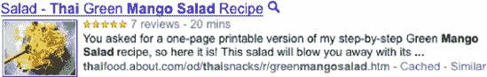
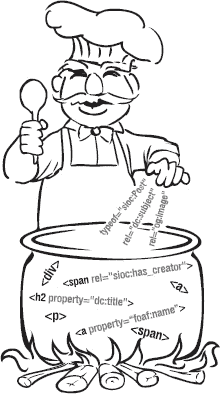
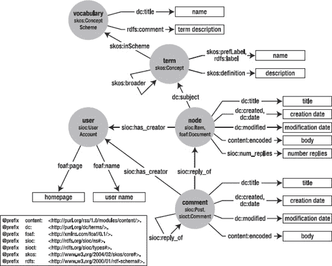
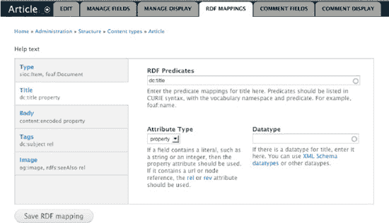
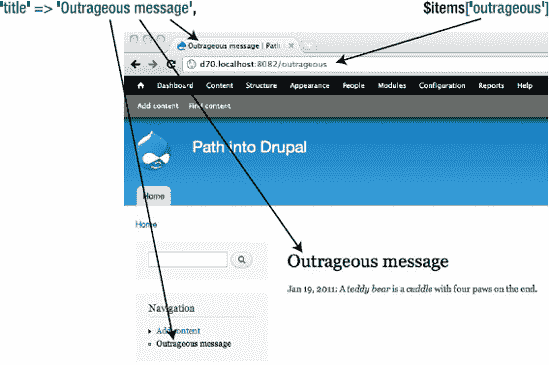
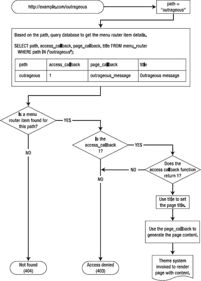
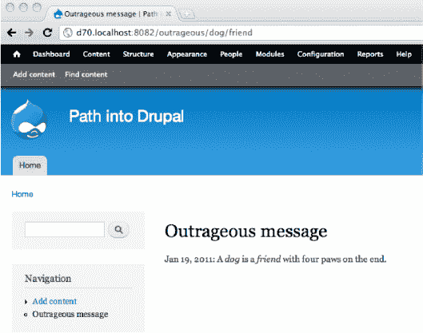
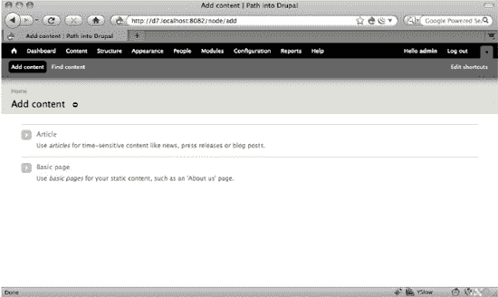
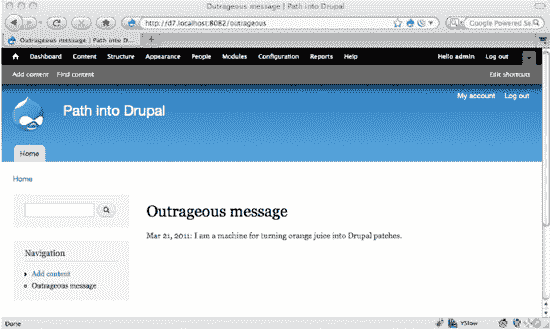

# 用语义佐料为你的内容添味

**作者：斯特凡·科洛斯基**

过去，搜索引擎不得不猜测页面的哪些部分需要展示，才能让你的网站在搜索结果中显得相关且吸引人。如今，Drupal 为你提供了工具，让你能清晰地表达内容所承载的含义，从而帮助网络上的其他应用真正理解你的网站，并以潜在实用且吸引人的方式重用你的内容（参见图 28-1）。



*图 28-1. Drupal 提供了清晰表达内容的工具。*

得益于这张食谱页面使用的语义标记，它会在谷歌搜索“泰式芒果沙拉”时显示出来，并附带图片和网站用户给出的评分。当你的网页以机器可理解的方式提供信息时，谷歌可以在搜索结果页（SERP）的呈现中，将选定的信息片段（例如图片和评分）置于优先位置。

借助 Drupal 7，你可以轻松地为页面添加语义标记。通过网站用户界面实现这一方法，将在 RDF UI 部分中介绍。然而，日益发展的语义网所带来的挑战与前景更为深远，而 Drupal 7 将在帮助你驾驭并构建这个信息丰富的未来方面发挥重要作用。

### 信息过载

网络上公开可访问的页面超过 200 亿个，此外还有 9000 亿个*深度页面*^(1)（即受密码保护的页面或搜索后生成的动态页面）。如果将连接到网络的所有个人电脑、数据服务器及其他设备计算在内，在线存储容量估计超过 600 艾字节（即 6000 亿千兆字节）。加之存储成本低廉，以及越来越多的用户加入网络，我们人类每天处理的信息量正在飞速增长。关键在于，如果没有机器的帮助，我们将无法消化这种信息过载。

_________

¹ LLRX，“Deep Web Research 2007”，[`www.llrx.com/features/deepweb2007.htm`](http://www.llrx.com/features/deepweb2007.htm)，2006 年。

但我们现在不就已经在使用机器上网了吗？确实如此，但我们并未充分发挥它们的能力；要理解大多数网页的结构和内容，仍然需要人类读者。像谷歌、雅虎和必应这类搜索引擎，不断抓取网络上的页面，并将其镜像到它们的服务器群中，以便为终端用户提供极快的搜索结果。但这其中存在一个问题。所有搜索引擎能访问的只是 HTML 页面或 PDF 文件中的纯文本。RSS 信息源虽然以 XML 形式提供了更结构化的信息，但仅限于标题、日期和内容；它无法表达项目类型（新闻、博客文章、用户资料、待售商品、活动），也无法表达评论数量、图片或价格。

对人类大脑来说，识别页面上各类信息片段并猜测正在阅读的信息类型（文本、日期或图片）相当简单。同样，判断页面各元素之间的关系及其所指内容（这是撰写页面的作者姓名，还是页面的主题？）也是如此。但对于机器而言，这些任务要困难得多，因为它们缺乏像我们人类在日常生活中的那种推断上下文线索的能力。

换句话说，访问网站的机器主要看到的是链接到其他页面或图片的纯文本。专家们必须运行许多复杂的算法，试图逆向工程还原页面构建的过程。一个非常简单但资源密集的例子是，通过正则表达式搜索由斜杠分隔的数字来查找页面中的日期。面对像`08/07/10`这样的日期，当连英国读者和美国读者都会以不同方式解读时，机器又怎能判断它是 7 月 8 日还是 8 月 7 日呢？机器需要一种清晰、无歧义的方式来解读这类信息。

词语也是如此。当机器遇到“苹果”这个词时，它会推断出什么？英语中有许多词汇都具有多重含义和微妙差别。语义网是一套旨在解决这些问题的工具和标准，它通过在现有网络之上添加一层语义来实现。重要的是要理解，语义网并非试图取代现有网络，而是为内容添加供机器理解上下文的线索，就像是网络厨师添加香料来调和内容，使其对机器来说更美味、更有意义。

语义网多年来在实际应用中产生了越来越大的影响，最近还被网络巨头们采用。在所有语义网标准中，`RDFa`（`RDF in attributes`）是应用最广泛的一个。2008 年，雅虎的`Search Monkey`率先支持了启用`RDFa`的页面。一年后，谷歌推出了富摘要（`Rich Snippets`）功能。2010 年 4 月，Facebook 宣布将`RDFa`作为开放图谱协议（`Open Graph protocol`）的一部分，此后该协议已被部署在数百万个网页上。你可能在不知不觉中浏览过由`RDFa`增强的网站：如白宫、奥莱利、百思买、《纽约时报》。此外，大多数`Drupal 7`网站也在此列。

### 资源描述框架（THE RESOURCE DESCRIPTION FRAMEWORK）

资源描述框架（`RDF`）是一套用于信息建模的 W3C 规范。在`RDF`中，每条信息或断言都包含主语、谓语和宾语，类似于自然语言中的基本句子。将这些断言组合起来，就能对多种事物进行知识建模。以苹果派的食谱为例：它需要 30 分钟准备，并且有 25 条评价。在`RDF`中，每个断言都遵循主语-谓语-宾语的相同结构，因此上述句子可以这样表达：

```
[recipe] - [name] – "Apple pie"
[recipe] - [preparation_time] –"30 min"
[recipe] - [number_reviews] – "25"
```

这种用于断言基本信息元素的主语-谓语-宾语模式，在`RDF`术语中有时被称为*三元组*（*triple*）。谓语通常被称为*谓词*（*predicate*）或*属性*（*property*）。为了确保网络上的互操作性，重复使用相同的谓语至关重要，这样当其他人阅读这个食谱时，他们就能理解数字 25 代表什么。在自然语言中，这是通过约定所用词语的共同含义来实现的。对于机器而言，在`RDF`中则通过使用`URI`来实现。关联数据（Linked Data）² 最佳实践鼓励使用`HTTP URI`，因为它们为机器和人类 alike 提供了一种查询谓语含义的方法。如果你不确定某个谓语的含义，可以直接将其粘贴到浏览器中以了解更多信息。这个过程被称为“顺藤摸瓜”（following your nose），机器也可以用它来发现`URI`背后的含义。这类似于在字典中查找一个单词。

这些`RDF`中的“字典”被称为*本体*（*ontologies*）、*词汇表*（*vocabularies*）或*模式*（*schemas*）。它们包含针对特定主题的`URI`定义集。一个流行的例子是“朋友的朋友”（`FOAF`）³ 词汇表，其中包含描述人物及其朋友的术语。这为机器学习和推理新知识提供了激动人心的可能性，例如，发现来自不同词汇表的两个谓语是否实际上是同义词，或者某个特定谓语是否附带一组额外的断言。例如，在`RDF`语句中使用`foaf:img`意味着主语是一个人，宾语是一张图片。

请注意`foaf:img`这种简写符号，它用于指代`FOAF`词汇表中的`img`谓语。这种符号是*CURIE 语法*⁴（紧凑型`URI`），有助于避免使用完整`URI`，因为完整`URI`往往冗长且容易出错。`CURIE`总是在特定上下文中使用，其中分号前的`prefix`绑定到词汇表的命名空间。以`foaf:img`为例，`foaf`前缀绑定到`FOAF`命名空间`http://xmlns.com/foaf/0.1/`，如`FOAF`词汇表规范所定义。`foaf:img`的完整`URI`（即指向`img`术语的`URI`）是命名空间与术语的拼接：`http://xmlns.com/foaf/0.1/img`。

让我们再看一个`RDF`有用的例子：网页元数据。以下内容描述了一个网页的标题、创建日期和一个主题：

```
<http://example.org/home.html>    dc:title      "Joe's homepage"
<http://example.org/home.html>    dc:created    "Dec 1, 2005"
<http://example.org/home.html>    dc:subject    "London"
```

注意这里的新前缀：`dc`。在该示例的上下文中，`dc`指代都柏林核心（`Dublin Core`），这是一个用于描述物理资源（如图书）以及数字项目（如视频、文本文件或网页文档）的词汇表。`dc`前缀通常绑定到命名空间`http://purl.org/dc/terms/`。

最后一条语句的宾语是一个字符串。`RDF`的另一个特性是允许宾语是一个`URI`，因此最后一条语句可以写成：

```
<http://example.org/home.html>    dc:subject    <http://dbpedia.org/resource/London_Ontario>
```

使用`URI`而非字符串的好处是避免了纯文本字符串可能带来的歧义。其次，该`URI`还能提供该城市（伦敦，安大略省）的坐标、一些图片、各种统计数据，以及比单纯一个字符串所能表达的更多信息。

请注意，`RDF`中的知识表示非常通用，并不绑定任何特定的语法。这意味着你可以将`RDF`嵌入到多种语言中，例如`HTML`、`JSON`、`XML`、`RSS`和`Atom`。

沿用自然语言的类比，相同的信息可以用多种不同的方式表达：想法和概念可以作为词语（用英语、法语等）或图表（白板风格或古埃及象形文字）来表达。类似地，一张照片可以保存为`jpg`文件、`png`文件，或者打印在纸上；所有这些媒介都承载着照片中本质上相同的信息。通常，你会选择最适合你和接收方进行沟通的媒介或语言：如果你在和西班牙朋友聊天，你可能会说西班牙语；如果双方都习惯英语，你可能会选择英语。同样地，`RDF`提供了多种格式来表达或序列化（serialize）相同的信息。在网页上下文中，`RDFa`是最合适的语法，因为它通过添加一层薄薄的属性，提供了一种直接在`HTML`中嵌入`RDF`的方式。

---

² W3C, “Linked Data,” `www.w3.org/DesignIssues/LinkedData`, 2006.

³ XMLNS, “FOAF Vocabulary Specification 0.98”, `http://xmlns.com/foaf/spec/`, 2010

⁴ W3C, “CURIE Syntax 1.0: A syntax for expressing Compact URIs,” `www.w3.org/TR/curie/`, 2010.

### 我们是如何走到这一步的？（How Did We Get There?）

任何数据源都倾向于在互联网上公开，以便能够根据网站许可进行共享、重用，并与其他数据融合。像`Drupal`这样的内容管理系统帮助人们在线制作内容。无论是通过自建网站、软件即服务（`SaaS`），还是免费平台（如 Facebook、Twitter、MySpace 或 Gmail），普通网络用户都有多种方式在线生产内容。

从 Twitter 上的 140 字更新，到四段的博客文章，再到一百页的 PDF 文档，所有这些信息片段都以某种形式出现在网络上。有些是公开的；有些则位于防火墙或密码保护之后。这些内容中的大部分最终以`HTML`形式呈现，但也存在其他格式，如文本文件、PDF 文档和图片。其中一些数据直接来自用户上传到网络的内容（内容、想法、思考），但围绕这些用户输入，还存在大量元数据，例如输入日期、页面访问次数或页面收到的评论数量。

随着 Mozilla Firefox 和 Google Chrome 等浏览器的广泛采用，浏览网络并为网络做出贡献变得非常容易；这些浏览器现在可用于台式机、笔记本电脑、平板电脑和移动设备等多种平台。电子邮件客户端是另一种在网络上发布内容的方式；邮件列表就是一个很好的例子。

### 去中心化数据空间

当蒂姆·伯纳斯-李爵士于 1990 年创建万维网时，他设想了一个全球分布式信息空间，在这个空间中，每个人都可以自由地谈论任何事物，而无需应对繁复的官僚程序、企业政策或任何形式的集中控制权威。最重要的是，这个信息空间将对每个人保持自由和开放：你可能需要向本地互联网服务提供商（ISP）付费才能接入这个信息空间，但一旦连接上，你就可以自由地做你想做的事。每个用户都可以拥有自己的数据空间，可以声明自己认为正确的内容，与世界分享自己的观点，并与其他人的数据空间建立链接，无论同意与否。

像 Drupal 这样的 Web 应用使互联网用户能够构建自己的数据空间、创建内容，并将其链接到其他数据空间。所有这些数据空间的集合就是我们通常所说的 Web，它建立在自 20 世纪 60 年代以来不断发展完善的互联网基础设施之上。

### 在全球 Web 规模上链接数据

在深入探讨 Drupal 和 RDF 的细节之前，理解语义网的另一个方面以及它如何让你超越网站边界来定位信息至关重要。大多数应用程序使用外键的概念来存储数据，这使得它们能够寻址数据库中的每个数据项，并轻松跨表查找与每个数据项相关的数据。这在封闭系统中运行良好，因为很容易对这些外键施加约束，例如确保每个标识符唯一。但这在全球范围内行不通，因为 Web 上的每个站点并不依赖集中式权威机构来分配标识符。

虽然我在个人网站上的用户 ID 是 1，但这并不意味着我在 Web 上的所有站点都有相同的用户 ID。在`drupal.org`上，我的用户 ID 是 52142，而在`groups.drupal.org`上则是 3258。同样，我在`identi.ca`上的用户名是"scor"，但在 Twitter 上这个用户名已被占用，所以我不得不选择"scorlosquet"作为用户名。关键在于，在像万维网这样完全分布式的系统中，谈论纯粹的 ID 或用户名毫无意义，充其量只会造成歧义！

为了解决这个问题，RDF 使用 URI（统一资源标识符）来命名和定位互联网上的资源。URI 看起来很像 URL，以`http://`或`https://`开头。因此，RDF 不会用整数来指代用户，而是会使用类似`http://drupal.org/user/52142`的字符串。这样一来，我们就能声明诸如`http://drupal.org/user/52142`和`http://groups.drupal.org/user/3258`是同一个人的两个用户资料页面。借助 URI，每个网站都可以拥有自己专属的命名空间，并根据需要创建任意数量的资源，而无需征询任何人的意见。Drupal 通常会为每个用户分配一个 ID，并将其 URI 构建为`http://站点名称/user/{用户 ID}`；节点、分类术语等也是如此。这个路径可以使用 URL 别名进行自定义；Drupal 会确保每个 URL 别名都指向你网站上的唯一资源，从而避免任何歧义。

既然你已经看到了 URI 的重要性，就可以继续了解它们在哪些场景下有用。你已经明白，如果没有某种命名空间（例如所属网站），用户名在 Web 上是毫无意义的。除了这个用例之外，请思考在谈论概念时出现的歧义问题，例如给一篇博客文章打上"apple"标签。你又回到了使用字符串来标识一个可能带来歧义的概念，就像用户名的情况一样，这也是 RDF 可以帮助你解决的问题。你可以将自己的概念托管在自己的命名空间上，但对于像"name"或世界上所有国家这样的通用概念，使用某种公认的集中式存储库则更有意义。

维基百科^(5)包含了关于物体、概念、名人、城市、国家、组织等海量信息。每个条目在维基百科上都有一个 URI，用于显示关于该主题的一些信息。谈论"apple"可能指水果，也可能指公司。如果你改用 URI，就能轻松消除任何歧义；`http://en.wikipedia.org/wiki/Apple`是指水果，而`http://en.wikipedia.org/wiki/Apple_Inc`则描述公司。对于能够根据上下文理解其意涵的人类来说，这种区分可能并非必要，但对于机器而言却至关重要。使用相同标识符的网站越多，机器就越容易进行交叉引用，从而推断出一组帖子是否在谈论同一个主题。

---

⁵ 维基百科（`http://en.wikipedia.org/`）是一个在线多语种百科全书，拥有超过一千七百万篇文章。Dbpedia（`http://dbpedia.org/`）是一个独立项目，旨在从维基百科中提取结构化信息，并以 RDF 格式在线提供。借助 DBpedia，可以对维基百科内容运行复杂查询，并更容易地在 RDF 应用程序中重用这些数据。

### 你明白我的意思吗？

Drupal 提供了一个用户友好的界面来生成 HTML。在提交数据时，Drupal 通常会将其存储在数据库中，然后进行处理以生成 HTML 输出。Drupal 确切知道应从哪些表和列中提取数据；在构建页面时，它知道页面的标题、创建日期和主要内容对应什么。它知道节点的当前版本，并能从正确的数据库记录中提取。然而，一旦将页面组合成 HTML，所有这些结构都丢失了；实际数据被恰当地布局在页面上，并针对人眼进行格式化，但语义已经丢失。

早期的 HTML 版本并非设计用于向机器显式表达这种结构。但设想一下，如果 HTML 标签提供了一种方式来指定标签包含的数据类型，以及该数据与页面上或 Web 其他页面上其他信息片段之间的关系呢？这正是万维网联盟工作组在 2008 年 10 月发布的"RDFa in XHTML"W3C 推荐标准^(6)中所解决的问题。

### RDFa，或者说如何为 HTML 添加语义

从 Web 开发者的角度来看，RDFa 不过是一些 XHTML 属性，可以添加到网页中，以明确声明 HTML 标签中所含数据的语义（参见图 28-2）。RDFa 标记不会改变页面在 Web 浏览器中的渲染方式；对用户而言，页面看起来完全一样。然而，对于任何能够读取页面的 RDFa 软件来说，差异是显而易见的，因为它能够理解语义标记。

Web 浏览器随后可以根据页面包含的数据类型增强用户体验：例如，一些浏览器扩展可以根据页面中包含的 RDFa 标记提供额外的功能。搜索引擎通常也会充分利用这些数据，因为这使它们能够更好地理解当前信息，并在搜索结果中相应地显示；提取页面的标题、日期和图片变得很容易，这可以极大地改善在搜索结果中的可见性，并有助于特定网站的搜索引擎优化（SEO）。价格、评分和评论数量也是能够为电子商务网站带来更多流量的相关元素。雅虎报告称，由于使用了 RDFa，点击率提升了高达 15%（[`www.slideshare.net/NickCox/ses-chicago-2009-searchmonkey`](http://www.slideshare.net/NickCox/ses-chicago-2009-searchmonkey)）。

_________

⁶ W3C，“RDFa in XHTML: Syntax and Processing”，[`www.w3.org/TR/rdfa-syntax/`](http://www.w3.org/TR/rdfa-syntax/)，2008 年。



*图 28-2. 通过向现有的 HTML 标签添加几个简单的 XHTML 属性，RDFa 用机器可读的提示丰富了网页的内容。*

RDFa 处理模型依赖于一种 DOM 遍历技术，其中每个 DOM 元素都会被访问，从文档对象开始，以递归方式遍历到每个子元素。通过一些基本示例最能说明 RDFa。请记住，RDFa 的全部意义在于向现有的 XHTML 标记添加属性。首先，需要对 XHTML 模板的顶部进行一些调整，使其符合 RDFa 规范。

```
<!DOCTYPE html PUBLIC "-//W3C//DTD XHTML+RDFa 1.0//EN"
  "http://www.w3.org/MarkUp/DTD/xhtml-rdfa-1.dtd">
<html xml:lang="en" version="XHTML+RDFa 1.0" dir="ltr">
<head profile="http://www.w3.org/1999/xhtml/vocab">
```

其次，让我们设置一些前缀，以便可以使用在 RDF 部分讨论过的 CURIE 语法。这是在 HTML 标签中使用特定语法完成的。对于 FOAF，它将是：

```
xmlns:foaf=http://xmlns.com/foaf/0.1/
```

Drupal 7 负责处理上述所有内容，并包含一组常用的命名空间。模块可以声明额外的前缀和命名空间。

现在，你已经准备好开始在 HTML 文档中使用 RDFa 标记了。为了表示 HTML 中的属性，我们将它们前面加上一个`@`符号。RDFa 属性包括`@about`、`@content`、`@datatype`、`@href`、`@property`、`@rel`、`@rev`、`@resource`、`@src`和`@typeof`。每个 RDFa 属性都会影响如何根据 HTML 文档的结构和内容构建 RDF 语句。你可能认识其中一些属性（如`rel`、`href`或`src`），你很快就会看到它们在 RDFa 中扮演的角色，以及 RDFa 如何重用现有的属性值。

属性`@property`、`@rel`和`@rev`指定了 RDF 语句的谓语（动词）。要理解它们是如何工作的，最好查看以下示例：

```
<h1 property="dc:title">Joe's homepage</h1>
<div rel="sioc:has_creator"><a href="/user/9">John Smith</a></div>
```

`dc:title`和`sioc:has_creator`是两个不同的 RDF 谓语，分别指定了页面的标题和作者。在第一个示例中，`@property`强制 RDF 语句的宾语是一个字符串。在第二个示例中，使用`@rel`代替`@property`，以强制语句的宾语是一个指向作者页面的 URI；换句话说，它是一个资源，而不是一个简单的字符串。这样做允许标记包含比仅用字符串多得多的关于作者的信息。作者资源不仅可以包含他的名字，还可以包含他的简介以及他其他文章的链接，从而实现内容发现。

对 RDFa 的详尽描述超出了本章的范围，因此请查阅[`www.w3.org/TR/xhtml-rdfa-primer/`](http://www.w3.org/TR/xhtml-rdfa-primer/)上的 RDFa 入门指南，以更详细地了解 RDFa 标记是如何被处理的。另请参阅发表在 *A List Apart Magazine* 上的这些关于 RDFa 的优秀文章：

```
www.alistapart.com/articles/introduction-to-rdfa/
www.alistapart.com/articles/introduction-to-rdfa-ii/
```

#### RDFa、微格式和微数据

RDFa 并不是为 HTML 添加语义的唯一语法。微格式（`microformats.org`）是第一种被 Web 开发者社区广泛采用的语法。然而，微格式从未被标准化，并且由于其设计，其词汇表（如 hCard、vCard 等）的开发是集中的，并且局限于一个组织。另一方面，由于 RDF 的性质，RDFa 可以自由扩展：外部词汇表可以组合起来，并且在需要时可以构建自定义的特定领域词汇表。RDFa 还受益于过去十年间在语义网栈上投入的所有工作。许多工具可用于解析、存储和查询 RDF 数据。其中最著名的是`SPARQL`（[`en.wikipedia.org/wiki/SPARQL`](http://en.wikipedia.org/wiki/SPARQL)），这是一种类似于关系数据库的`SQL`的 RDF 查询语言，允许对来自任何 RDF 源的联合数据运行查询。

自 2008 年起，RDFa 已成为 W3C 标准，并被许多知名的 Web 公司采用，如 Google、Facebook、BBC 和百思买。雅虎最近的调查显示，RDFa 在 2010 年呈爆炸式增长，是增长最快的数据标记格式（[`http://tripletalk.wordpress.com/2011/01/25/rdfa-deployment-across-the-web`](http://tripletalk.wordpress.com/2011/01/25/rdfa-deployment-across-the-web)）。微数据（[`www.whatwg.org/specs/web-apps/current-work/multipage/links.html#microdata`](http://www.whatwg.org/specs/web-apps/current-work/multipage/links.html#microdata)）是 HTML5 规范的一部分，是一种新的语法，在撰写本文时仍在开发中。微数据与 RDFa 的共同点比与微格式更多，例如都使用 URI 来实现可扩展性。在 Drupal 7 的开发阶段，微数据和 HTML5 都还太新，而更为成熟的 RDFa 标准则更有前景，并且更适合 Drupal 原生的 XHTML 输出。虽然 RDFa 1.0 版仅适用于 XHTML 标记，但即将推出的 RDFa 1.1 将允许在 XHTML5 和 HTML5 中使用 RDFa。请参阅[`http://dev.w3.org/html5/rdfa/`](http://dev.w3.org/html5/rdfa/)上的 HTML+RDFa 1.1 草案文档。RDFa 1.1 还吸收了微格式和微数据社区的反馈，从而实现了更简单的语法和更多的用例。鉴于 RDFa 1.1 向后兼容 Drupal 7 的 RDFa 1.0 标记，预计不久将在 Drupal 7 上看到支持 RDFa 的 HTML5 页面。请加入[`http://groups.drupal.org/html5`](http://groups.drupal.org/html5)上关于 Drupal 中 HTML5 的讨论。

#### Drupal 7 与语义网

在浏览 Drupal 7 的模块目录时，你可能已经注意到一个 `rdf` 文件夹，或者在管理界面的 `Modules` 页面上看到过它。如果你安装了标准版配置文件，该模块可能已经启用（参见 图 28-3）。


*图 28-3. 通过访问网站管理部分的 `Modules` 页面，确保 `RDF` 模块已启用。*

`RDF` 模块的所有工作都在后台进行。实际上，它不包含任何用户界面，仅提供供其他模块使用的 API（很像 `Field` 模块）。核心中的许多模块都利用了 `RDF` 模块，包括 `Node`、`Comment`、`User`、`Taxonomy`、`Forum`、`Blog` 和 `Tracker`。

`RDF` 模块主要做两件事：用 `RDF` 映射（将 Drupal 字段关联到单个或多个 RDF 术语）描述 Drupal 站点的数据结构，然后将这些映射以 RDFa 属性的形式插入到 `HTML` 输出中。`RDF` 模块利用了 Drupal 7 引入的实体、包和字段的新概念。下面我们将仔细看看这些 RDF 映射的生命周期。

从较高层面看，像 `node` 这样的实体类型具有一组属性（例如 `title` 或 `date`），这些属性可以映射到 RDF 属性。当这些值在 `HTML` 中输出时，该 RDF 属性会被添加到 `HTML` 中，以便从外部角度查看此 `HTML` 的代理仍能理解数据的来源和意义。一个非常简单的示例：标题为“我的比利时之旅”的节点将被输出到 `HTML` 中：

```
<h2 property="dc:title">我的比利时之旅</h2>
```

注意添加到包装标签 `h2` 上的额外 `property` 属性，它清晰地标明了节点的标题。除了实体类型的属性外，还存在一种针对实体实际类型的特殊映射。从 Drupal 的角度来看，这听起来可能有些多余，但请记住，RDF 映射的作用是帮助那些对你网站内部结构一无所知的外部应用程序。

实体类型是另一个会丢失且无法在 `HTML` 中明确显示的信息元素，但 `RDF` 模块提供了通过 RDF 映射结构的 `rdftype` 键解决此问题的机会（参见 清单 28-1）。这种 RDF 类型映射会以 RDFa 形式相应地出现在页面中。

**清单 28-1.** 在 `user.module` 中定义的用户实体类型的 RDF 映射结构

```
/**
 * 实现 hook_rdf_mapping()。
 */
function user_rdf_mapping() {
  return array(
    array(
      'type' => 'user',
      'bundle' => RDF_DEFAULT_BUNDLE,
      'mapping' => array(
        'rdftype' => array('sioc:UserAccount'),
        'name' => array(
          'predicates' => array('foaf:name'),
        ),
        'homepage' => array(
          'predicates' => array('foaf:page'),
          'type' => 'rel',
        ),
      ),
    ),
  );
}
```

RDF 映射生命周期的第二层发生在内容类型和其他包上（参见 第 18 章）。实体类型本身永远不会被实例化；它们首先经过一层特化，成为包，此时可以获得其他可选特性，例如修订版本、评论、分类法，以及最重要的字段。一个属性集较小的实体类型，可以根据站点管理员的需求，通过一组可定制的字段进行扩展。字段可以通过 Drupal 7 核心自带的字段用户界面附加到包上。

也可以通过编程方式实现同样的功能，例如在 Drupal 7 的标准版配置文件中就是这样。节点是理解包概念的理想用例：当使用标准版配置文件安装 Drupal 7 时，你会发现两个预定义的内容类型：`Article` 和 `Basic Page`，它们只是节点实体类型的两个包。虽然这两种内容类型共享一些属性（如 `title` 和 `date`），但它们的字段集合不同。例如，`Basic Page` 包含一个标题和一个正文，而 `Article` 则附带一些额外的字段：标签和图片。每个包都会继承其父实体类型的 RDF 映射结构。

这在节点的情况下非常方便，因为某些属性是所有包共有的且不易改变（例如 `title` 和 `date`）。与为每个实体定义 RDF 映射的方式类似，也可以在必要时为每个包定义 RDF 映射。大多数情况下，由于每个包继承了实体类型的 RDF 映射结构，只需为特定于包的字段指定 RDF 映射即可，如 清单 28-2 所示。请注意，这里仅需指定特定字段的 RDF 映射。

**清单 28-2.** 标准安装配置文件中为 Article 包指定的 RDF 映射结构

```
array(
  'type' => 'node',
  'bundle' => 'article',
  'mapping' => array(
    'field_image' => array(
      'predicates' => array('og:image', 'rdfs:seeAlso'),
      'type' => 'rel',
    ),
    'field_tags' => array(
      'predicates' => array('dc:subject'),
      'type' => 'rel',
    ),
  ),
)
```

请注意，包和实体类型的 RDF 映射结构是相似的，唯一的区别是：影响实体类型的 RDF 映射结构必须将 `RDF_DEFAULT_BUNDLE` 指定为包键的值。相比之下，针对包的 RDF 映射结构应明确声明该映射是针对哪个包的。

#### 理解 RDF 映射的结构

RDF 映射是一个嵌套的关联数组，用于定义 Drupal 内部属性与有意义的 RDF 谓词之间的关系。这些谓词旨在被外部应用程序理解并与之互操作。一个映射结构包含三个必需的键。`type` 和 `bundle` 键分别指代实体类型和 RDF 映射所属的 *bundle*。第三个键是 `mapping`，它列出了应映射到 RDF 的 Drupal 属性。

除了之前描述的特殊的 `rdftype` 键之外，其他键要么指代 Drupal 自定义属性（`title`、`date`、`author`），要么指代由核心 Field 模块定义的字段。每个项目都包含一个数组，在 `predicates` 键中列出了此属性的 RDF 谓词。当处理字符串值（例如节点的标题，或代码清单 28-1 中用户的名称）时，这样做就足够了。但是，当处理引用带有 URI 的其他资源（链接、图像或另一个实体）的属性时，开发者应该为映射元素指定一个 `type`。此类型指明了两个资源之间相对于所使用的 RDF 谓词的关系方向。

在大多数情况下，`type =>rel` 是必需的；`rel` 关系表示父 HTML 元素是主语。例如：

```
<div>Lora is interested in <a rel="foaf:interest" href="http://drupal.org">Drupal</a></div>
```

声明了用户 Lora 对 Drupal 感兴趣。

当需要反向关系时，可以使用 `rev` 值，如下所示：

```
<div about="http://drupal.org">Drupal is interesting to <a rev="foaf:interest" href="user/5">Lora</a></div>
```

这种方向上的细微差别继承自基于有向图的 RDF 模型。通常，使用 `rel` 类型会更简单；很少有开发者需要使用反向类型。因此，您只需要记住为任何非字符串链接使用 `rel` 类型。

回到代码清单 28-2，Drupal 7 标准安装配置文件将 `article` bundle 的 `field_image` 映射到 `og:image` RDF 谓词。换句话说，它通过 `og:image` 有向关系将每个文章节点链接到其图像。此关系会自动以 RDFa 的形式反映在页面的 HTML 输出中，清晰地帮助任何应用程序（例如搜索引擎）理解哪些图像与文章相关联。同样的情况也适用于 `field_tags` 字段映射元素，它通过 `dc:subject` 谓词在文章与其涵盖的主题之间建立了明确的语义关系。一旦这些关系在 RDF 映射结构中建立起来，RDF 模块将负责将它们添加到 HTML 标记中需要的位置；开发者无需担心 RDFa 元素的放置问题。

##### 使用 RDF 映射结构

Drupal 开发者基本上有两种选择来处理 RDF 映射。鼓励创建自己实体类型和 bundle 的模块开发者使用 `hook_rdf_mapping()` 来将 RDF 谓词与其属性关联起来。Drupal 核心模块（即 Node、User、Comment 和 Taxonomy）可作为参考。

其次，为了保持 Drupal 的可扩展性和灵活性传统，RDF 模块还提供了 API 函数来修改模块定义的 RDF 映射。标准安装配置文件正是使用这些函数，在通过 Field API 创建图像和标签字段并将其附加到 `article` bundle 后，立即为这些字段添加 RDF 映射。所有使用这些 CRUD 函数定义的 RDF 映射都存储在数据库中。CRUD 函数 `rdf_mapping_load()`、`rdf_mapping_save()` 和 `rdf_mapping_delete()` 可用于指定新 bundle 和字段的 RDF 映射，以及修改已保存到数据库（在模块安装时保存）且不通过 CRUD API 无法修改的现有 RDF 映射。代码清单 28-3 是一个修改 `article` 内容类型某些映射的示例。请注意，只需要指定要更改的字段的 RDF 映射。

**代码清单 28-3.** 修改某些 RDF 映射的 PHP 代码示例

```php
$article_rdf_mappings = array(
  'type' => 'node',
  'bundle' => 'article',
  'mapping' => array(
    'field_image' => array(
      'predicates' => array('og:image', 'rdfs:seeAlso'),
      'type' => 'rel',
    ),
    'field_tags' => array(
      'predicates' => array('dc:subject'),
      'type' => 'rel',
    ),
  ),
);
rdf_mapping_save($article_rdf_mappings);
```

### Drupal 7 中的 RDF 词汇表

正如您之前所见，网络上已经存在许多模式，其中一些被搜索引擎等应用程序很好地理解。Drupal 7 使用的主要词汇表如下：

*   **都柏林核心** 适用于通用文档、新闻文章或出版日期等在线媒体。参见 [`http://dublincore.org/documents/dcmi-terms/`](http://dublincore.org/documents/dcmi-terms/) 上的都柏林核心规范。

*   **朋友的朋友 (FOAF)** 描述了人与人之间的关系，以及他们的姓名、地址、照片、位置，以及他们的社交网络属性，如电子邮件、主页、OpenID 或兴趣爱好。FOAF 还包含一些更广泛的术语来定义文档、组织、群组及其成员以及项目。参见 [`http://xmlns.com/foaf/spec/`](http://xmlns.com/foaf/spec/) 上的 FOAF 规范。

*   **语义互联在线社区 (SIOC)** 用于对在线创建的内容与创建这些内容的用户之间的联系进行建模。它可以描述多种讨论渠道，例如论坛、博客、投票和一般新闻。参见 [`http://rdfs.org/sioc/spec/`](http://rdfs.org/sioc/spec/) 上的 SIOC 规范。

*   **简单知识组织系统 (SKOS)** 专门用于表示和共享知识组织系统，如叙词表、分类法、主题词系统和分类方案。它非常适合 Drupal 的分类法，无论是用于受控词汇表还是自由标签。参见 [`www.w3.org/TR/skos-reference/`](http://www.w3.org/TR/skos-reference/) 上的 SKOS 规范。

图 28-4 描绘了这些词汇表在 Drupal 7 中的原生使用方式。



**图 28-4.** Drupal 7 中定义的默认 RDF 映射

模块可以通过实现 `hook_rdf_namespaces()` 来添加新的命名空间及其关联的前缀。代码清单 28-4 中的代码片段将 WGS84 地理定位命名空间添加到 Drupal，该命名空间将与 HTML 输出中由其他模块定义的其他命名空间一起序列化。然后，在使用 WGS84 地理定位词汇表定义 RDF 映射时，可以使用前缀 `geo`。

**代码清单 28-4.** `user.module` 中定义的用户实体类型的 RDF 映射结构

```php
function mymodule_rdf_namespaces() {
  return array(
    'geo'  => 'http://www.w3.org/2003/01/geo/wgs84_pos#',
  );
}
```

### 使用贡献模块在 Drupal 核心之外应用 RDF

前面章节仅介绍了 Drupal 7 核心 API 支持的功能，但贡献模块还提供了更多功能。以下是一些扩展 Drupal 7 RDF 能力的贡献项目。这些项目发展迅速，请查阅其项目页面上的最新说明以获取最新信息。

`RDF Extensions` 项目（下载地址：[`http://drupal.org/project/rdfx`](http://drupal.org/project/rdfx)）提供了一套实用模块，可直接与 Drupal 7 核心 RDF 模块交互。偏好使用用户界面而非编写代码的网站管理员，可通过 `RDF UI` 模块修改 RDF 映射，如图 28–5 所示。该软件包还提供更多 RDF 序列化格式，如 RDF/XML、N-Triples 和 Turtle。



**图 28–5.** `RDF Extensions` 用户界面允许网站管理员无需编写代码即可编辑 RDF 映射。

`SPARQL` 项目可通过索引所有 RDF 数据，将你的 Drupal 网站转变为 SPARQL 端点。网站管理员还可以注册其他模块可用的外部端点来获取数据。`SPARQL` 软件包还公开了一个 API，供其他模块即时运行 SPARQL 查询，而无需担心在本地设置 SPARQL 端点。下载 `SPARQL` 请访问 [`drupal.org/project/sparql`](http://drupal.org/project/sparql)。

`SPARQL Views` 是一个针对 `Views 3` 的查询插件，允许你将 SPARQL 端点的数据导入 `Views`。下载 `SPARQL Views` 请访问 [`http://drupal.org/project/sparql_views`](http://drupal.org/project/sparql_views)。

`Examples` 项目包含一个展示 RDF 映射示例的模块。下载 `Examples` 请访问 `http://drupal.org/project/examples`。

### 本章小结

在本章中，你学习了资源描述框架，这是一个抽象数据模型，用于描述信息并以主语-谓语-宾语表达式的形式对 Web 资源进行陈述。你还了解了如何将 RDF 直接嵌入 XHTML 和 HTML5 中，以注解其包含的信息片段，从而使机器更容易理解手头的内容，这反过来帮助互联网用户找到他们需要的信息。

你已看到 Drupal 7 如何通过 RDF 映射在其内部数据建模中使用 RDF，以及这些结构化信息如何在 HTML 渲染过程中呈现。许多 RDF 映射已针对通用内容类型默认设置；例如，博客和文章包含作者、标签和评论。更复杂或特定领域的网站可以利用 Drupal 的 RDF 映射 API 来添加新的词汇表，并为其数据选择合适的映射。

 **提示** 语义网技术正热门。请让你的机器访问 `dgd7.org/semantic`，以了解 Drupal 社区对新技术发展的看法。

## 第 29 章


## 菜单系统与 Drupal 路径

**作者：Robert Douglass**

一个通用且易于理解的架构为广泛的社区参与奠定了基础，Drupal 的菜单系统就是例证——它负责将 Drupal 网站上的路径与网站向访问者返回的内容关联起来。

开放的设计使得 Drupal 内部简单且可扩展的架构转化为社区层面的高度参与。

本章将探讨促成 Drupal 开放性和灵活性的特性之一。它是一个调度器，负责接收传入的 Drupal 路径并将其映射到回调函数。在此过程中，它会解决所有访问控制问题，并加载所需的数据对象。Drupal 将此称为菜单系统，因为这些路径也可用于构建网站的可见导航结构（即菜单）。^(1)

每个 Web 应用程序都会以某种方式解决 URL 调度和访问控制问题，因此菜单系统本身的存在并非开创性。菜单系统的精妙之处在于其低入门门槛，以及它能够深入到代码库的每个角落，修改、扩展或替换已有内容的能力。

### 通过示例理解 Drupal 菜单系统

Drupal 开发人员的一个典型入门任务是集成一些现有代码，并使其输出在 Drupal 网站上下文中显示。此任务的要求包括：Drupal 应用程序需完全加载（包括用户认证和数据库连接），包含输出的页面需有自己的 Drupal 路径，并且该页面需在 Drupal 网站的可见导航中可用。

代码清单 29–1 展示了在 XHTML 页面上下文中显示一条离谱消息所需的代码。它位于一个名为`outrageous`的假设模块中，并满足了上述三个要求。

__________

¹ 当前的菜单系统首次在 Drupal 6 中添加，由 Károly Négyesi 在 Peter Wolanin 的协助下构思并实现。此后许多人也为其做出了贡献。

**代码清单 29–1.** *一条离谱的消息*

```php
<?php

function outrageous_menu() {
  $items['outrageous'] = array(
    'title' => 'Outrageous message',
    'access callback' => TRUE,
    'page callback' => 'outrageous_message',
  );

  return $items;
}

function outrageous_message() {
  // 创建一条离谱的消息。基于 Gill Davies 的一句引言。
  // t() 是一个包装函数，允许文本本地化。
  $message = t('A teddy bear is a cuddle with four paws on the end.');

  // 获取格式化日期。
  $time = date('M d, Y');

  $page = array(
    '#markup' => "$time: $message",
  );

  return $page;
}
```



**图 29–1.** 代码清单 29–1 中的代码定义了一个路径`outrageous`，该路径在一个完全启动的 Drupal 应用程序中显示一条离谱消息。在主导航菜单中创建了一个链接，用于访问`outrageous`页面。

在代码清单 29–1 中，第一个函数`outrageous_menu()`定义了页面的路径、页面标题、访问条件以及将生成页面内容的回调函数。所有这些都以一个简单的 PHP 数组形式呈现。第二个函数`outrageous_message()`生成如图 29–1 所示的内容区域中显示的输出。

这段代码位于一个名为`outrageous.module`的文件所代表的模块中。`outrageous_menu()`函数是核心 Drupal 钩子`hook_menu()`的一个实现。^(2) 命名约定规定：如果你的模块名为`outrageous`，而钩子通常被称为`hook_menu`，那么函数名`outrageous_menu()`就是要被调用的函数。每当 Drupal 构建用于将 Drupal 路径调度到回调函数的数据库菜单路由表时，`hook_menu()`的实现就会被调用。基于“模块名”加“钩子名”的命名约定来调用函数的模式在 Drupal 中被广泛使用。

__________

² 有关 Drupal 钩子的更多信息，请参阅 `api.drupal.org/api/group/hooks`。特别是关于 `hook_menu` 的更多信息，请参见 `api.drupal.org/api/function/hook_menu/6`。

**DRUPAL 的钩子**

代码清单 29–1 引入了钩子的概念。钩子是 Drupal 运行的基础，而菜单钩子仅仅是编写 Drupal 模块的开发人员可用的众多钩子之一。

#### Drupal 钩子与菜单系统

本质上，钩子是 Drupal 与其模块之间的一种契约，规定了在页面执行的特定节点，将以特定参数调用某些函数。这些函数的命名遵循一种约定，即使用模块名和钩子名动态生成要调用的 PHP 函数名称。清单 29–1 中的模块定义在 `outrageous.module` 文件中，因此 Drupal 知道其模块名为 `outrageous`。当页面执行到需要调用某个钩子的节点时，Drupal 会获取 `outrageous` 以及所有其他已启用的模块，并对每个模块调用 `outrageous_hookname()`。因此，在编译菜单路由器表时，Drupal 会调用 `hook_menu`，而 `outrageous_menu()` 就是被调用的函数之一。

整个机制得益于 PHP 能够在运行时感知其可用的函数。PHP 函数 `function_exists($function_name)` 使得 Drupal 能够在页面执行过程中，在实际调用某个函数之前检查该函数是否存在。

所有进入 Drupal 的请求都指向一个单一的入口点，即位于 Drupal 基础目录下的 `index.php` 文件。然而，在示例或许多 Drupal 站点上这一点并不明显，因为 Web 服务器会在后台不断重写传入的 URL，使其指向 `index.php`。因此，`http://example.com` 这样的 URL 会被重写为 `http://example.com/index.php`。URL 的其余部分被称为 Drupal 路径。它也会被重写，所以 `http://example.com/outrageous` 在内部会被表示为 `http://example.com/index.php?q=outrageous`。Drupal 将 `q` 参数称为路径，在此例中路径就是 `outrageous`。

根据清单 29–1 中的代码，`http://example.com/outrageous` 这个 URL 会映射到内部路径 `outrageous`，并根据数组键 `$items['outrageous']` 匹配到 `outrageous_menu()` 函数中定义的菜单项。一旦调度器将传入路径匹配到菜单路由器表中的相应条目，就会寻找一个回调函数。在此例中，该函数在 `$items` 数组中通过键 `'page callback'` 定义，并将调用 `outrageous_message()` 函数。

`$items` 数组还定义了一个将在页面上显示的标题。这里的标题是一个硬编码字符串，但后面的示例会展示如何通过回调动态生成标题。

对此菜单路由器项的访问权限通过键 `'access callback'` 设置。该键的值可以是布尔值（此例中 `TRUE` 表示所有人都有权限），也可以是一个必须返回布尔值的回调函数名。

你可以在图 29–1 中看到，站点导航菜单中出现了一个可见的导航项。虽然此处未涉及，但此导航项及其他导航项目都可以通过 Drupal 的管理界面进行配置、重命名、隐藏或移动。网站的最终决定权在于站点管理员，而非开发者。

以下是从 URL 到 Drupal 页面的所有步骤，按顺序列出：

1.  `http://example.com/outrageous` 被重写为 `http://example.com/index.php?q=outrageous`。

2.  `q` 参数 `outrageous` 被识别为 Drupal 路径。

3.  基于该路径，选择最初由示例代码中 `$items['outrageous']` 定义、现已在运行时从数据库加载的菜单路由器项来处理此页面回调。

4.  根据菜单路由器的 `'access callback'` 项进行访问检查。其值为 `TRUE`，因此允许访问。

5.  页面标题根据菜单路由器的 `'title'` 项设置。标题现在是“Outrageous message”。

6.  调用页面回调参数中指定的函数 `outrageous_message`。该函数定义了此特定页面内容区域中显示的内容。

7.  Drupal 使用表示层和应用程序的配置构建页面的其余部分。这就是图 29–1 中的徽标、导航菜单和阴影区域的来源。



**图 29–2.** 处理从 URL 到页面输出的请求

刚接触 Drupal 的 Web 开发人员通常能立即理解此示例的精髓，并体验到能够自由编写代码且让代码在 Drupal 中适时包含并执行的满足感。所需的不过是一个简单的 PHP 数组和一些生成输出的代码。第一个入门障碍已被克服，并且 Drupal 已被扩展。

### 菜单路由器项

Drupal 数据库中的表之一是 `menu_router` 表。在清单 29–1 中，你已经看到菜单路由器项由路径及描述路径行为的元数据组成。所有已安装并启用的模块中的所有菜单路由器项定义都会存储在该 `menu_router` 数据库表中。

#### 无限路径

在清单 29–1 中，Drupal 路径是 `outrageous`。菜单系统的一个实用特性是此路径是开放式的。相同的回调定义也将匹配并处理路径 `outrageous/dog/friend`。路径会根据斜杠被拆分成多个段，而每个超出 `outrageous` 的段都将作为参数传递给回调函数。在清单 29–2 中，回调函数已被重写以接受并使用两个参数。如果没有参数，其工作方式与图 29–1 中相同。

**清单 29–2.** 来自 Drupal 路径中包含两个参数的 Outrageous Message：`http://localhost/outrageous/dog/friend`

```
/**
 * 现在带有参数，默认值为消息的原始版本。
 */
function outrageous_message($animal = 'teddy bear', $noun = 'cuddle') {
  // 创建一个离谱的消息模板。基于 Gill Davies 的一句话。
  $message = 'A %animal is a %noun with four paws on the end.';

  // 将 %animal 和 %noun 占位符替换为 $animal 和 $noun 参数。
  // t() 包装器不仅允许本地化，还执行了占位符替换。
  // t() 还保证了 $animal 和 $noun 是纯文本，从而防范 XSS 攻击。
  $message = t($message, array('%animal' => $animal, '%noun' => $noun));  

  // 获取格式化后的日期。
  $time = date('M d, Y');

  $page = array(
    '#markup' => "$time: $message",
  );

  return $page;
}
```



**图 29–3.** 消息由 Drupal 路径中的路径段组合而成。

## 路径的结构

在某些情况下，能够向回调函数传递任意参数是可以接受的，但通常需要更细致和精确的方法。Drupal 中的一个典型模式是使用数据对象的主键标识符来引用它们（在 Drupal 术语中称为实体）。Drupal 中内容的主要对象类型称为节点（node），这只是对文章、博客帖子、图片或日历事件等内容的通用术语。节点具有整数类型的主键标识符。表 29–1 中的路径都对节点编号 42 执行了不同的操作。

**表 29–1.** 各种节点路径及其操作

| **路径** | **操作** |
| --- | --- |
| `node/42` | 加载并显示节点 #42 |
| `node/42/edit` | 加载并显示节点 #42 的编辑表单 |
| `node/42/revisions` | 显示节点 #42 的修订历史 |

一种模式逐渐显现：

`node + id + action`

在上述每个案例中，路径的第二段表示主键 id，第三段指定操作（而 `node/42` 隐含有“查看”操作）。人们可能会倾向于在单个回调函数中处理这种模式，如 清单 29–3 所示。

**清单 29–3.** 不推荐：错误处理节点路径的方式

```
/**
 * $arg1 对应整数 id。
 * $arg2 对应操作。
 */
function node_callback($arg1, $arg2) {
  // 如果 $arg1 是整数，则用它来加载节点。
  if (is_numeric($arg1)) {
    $node = node_load($arg1);
  }

  // 如果节点存在，则继续处理。
  if ($node) {
    if ($arg2 == 'edit') ...

    if ($arg2 == 'revisions') ...
  }
}
```

这种方法有很多缺点：

*   **难以扩展。** 如果你以后想编写一个处理 `node/42/send` 的模块怎么办？如果所有 `node/integer/action` 类型的路径都由一个函数处理，你就不得不修改该函数或完全替换它。

*   所有的 `if {…}` 语句使代码变得杂乱。

*   当你考虑到 Drupal 也能处理的这个路径：`node/add`，整个情况会变得更加复杂。

此路径会显示一个页面，其中包含用于添加新内容的链接。现在，第二个段根本不是整数，因此显然我们需要一种方法来区分路径中所有不同的可能性。

菜单系统非常优雅地处理了这种广泛的动态路径。使用通配符表示法不仅简化了动态路径的处理，也简化了加载公共对象的工作。请参考 清单 29–4 中的 `hook_menu` 实现。

**清单 29–4.** 推荐：Drupal 如何处理节点路径

```
/**
 * 实现 hook_menu()。
 */
function node_menu() {
  $items['node/add'] = array(
    'title' => '添加内容',
    'page callback' => 'node_add_page',
    'access callback' => '_node_add_access',
  );
$items['node/%node'] = array(
    'title callback' => 'node_page_title',
    'title arguments' => array(1),
    'page callback' => 'node_page_view',
    'page arguments' => array(1),
    'access callback' => 'node_access',
    'access arguments' => array('view', 1),
  );

  $items['node/%node/edit'] = array(
    'title' => '编辑',
    'page callback' => 'node_page_edit',
    'page arguments' => array(1),
  );

  return $items;
}
```

这是处理前述节点路径的 Drupal 实际实现的一个略微简化的版本。原始代码可以在 Drupal 的 `node.module` 文件中找到，根据命名约定，每当 Drupal 需要构建菜单路由表时，就会调用 `node_menu()`^(3) 函数。

## 回调函数

这里有几个需要注意的地方。第一个条目映射到路径 `'node/add'`，它使用 `node_page_add()` 回调来生成一个页面，该页面显示向系统添加各种内容的链接。然而，要访问此页面，用户必须拥有正确的访问权限。用户是否拥有正确的访问权限由函数 `_node_add_access()` 决定，这由 `'access callback'` 键指定。在 清单 29–1 中，这一项是 `'access callback' => TRUE`，这只是表示所有人都可以访问的简写形式。现在，在 清单 29–4 中，有一个将访问控制交给专用回调函数的示例。

 **7 版新特性** Drupal 7 新增了一些元素来修改菜单项的行为。可以定义“delivery callback”让一个自定义函数处理渲染；通常使用默认值 `drupal_deliver_html_page` 即可。当用你自己的函数替换默认函数时，你需要确保替换函数能处理原函数负责的所有情况。交付回调函数处理访问拒绝、未找到、网站离线以及内容渲染等情况。另一个新元素 context，允许菜单项被用作上下文链接（参见 第 24 章 的示例）。很少使用的“theme callback”和“theme arguments”元素允许你提供一个函数，以便在该菜单项的页面加载时指定一个不同的主题。有关完整列表及简要说明，请阅读 API 介绍。^(4)

__________

³ Drupal 的 `node_menu()` 函数：`api.drupal.org/api/drupal/modules--node--node.module/function/node_menu/7`

⁴ `api.drupal.org/api/drupal/modules--system--system.api.php/function/hook_menu/7`



**图 29–4.** 路径 `node/add` 指向一个页面，其中列出了可以创建的各种内容类型。此页面上的内容由函数 `node_add_page()` 生成。

菜单路由项 `'node/%node'` 包含一个通配符段 `%node`，它会匹配该段中的任何内容。这个条目会匹配路径 `node/42`、`node/foo` 等。虽然它通常也会匹配 `node/add`，但在这个例子中不会，因为有一个菜单路由项精确定义了 `node/add`，而精确匹配的优先级高于通配符匹配。

### 加载函数
```

每当菜单系统将传入的 Drupal 路径与一个以 `%node` 这样的标记表示的通配符段匹配时，它就会尝试调用一个特殊的加载函数，以自动加载一个对象供后续的回调函数使用。具体的加载函数由命名约定决定；当百分号后面跟着一个字符串（例如 `%foo`）时，系统会寻找一个名为 `foo_load()` 的加载函数。`%node` 对应的加载函数是 `node_load()`。因此，路径 `node/42` 会调用函数 `node_load(42)`，并将匹配到的整数作为参数传入。其结果是一个完全加载并构建好的 `$node` 对象，其主标识符为 42。这个对象随后可作为参数供各种回调函数使用。在清单 29–4 中，它被传递给了负责为当前请求生成内容输出的页面回调函数。在清单 29–5 中，请查看 `'node/%node'` 项对应的页面回调键。

**清单 29–5.** `node/%node` 菜单路由项的详细信息

```
$items['node/%node'] = array(
...
  'page callback' => 'node_page_view',
  'page arguments' => array(1),
...
);
```

这些键指示菜单系统使用 `node_page_view()` 作为主页面回调函数，并传入一个参数。该参数通过 `'page arguments'` 键来指定，其数组包含了应作为参数的路径段。在此示例中为 `array(1)`，所以应使用路径段 1。路径段编号从零开始，因此 `array(1)` 指的是路径中的 `%node` 部分。如前所述，这是一个完全加载并构建好的 `$node` 对象，而这个对象将被传入回调函数。对于路径 `node/42` 所执行的代码，功能上等价于以下代码片段：

```
// 使用参数 42 调用 node 的 _load 函数。
$node = node_load(42);
// 使用构建好的 $node 对象调用页面回调函数。
return node_page_view($node);
```

让我们再看一下 `'node/%node'` 菜单路由的完整定义，如清单 29–6 所示。

**清单 29–6.** `node/%node` 菜单路由项

```
$items['node/%node'] = array(
  'title callback' => 'node_page_title',
  'title arguments' => array(1),
  'page callback' => 'node_page_view',
  'page arguments' => array(1),
  'access callback' => 'node_access',
  'access arguments' => array('view', 1),
);
```

在清单 29–1 中，我们的菜单路由项有一个 `'title'` 键，标题在其中直接设置。而 `'node/%node'` 菜单路由项则使用了 `'title callback'` 和 `'title arguments'` 键作为替代。这些键允许动态设置页面的标题。负责设置标题的回调函数是 `node_page_title()`，并且与 `node_page_view()` 一样，它也接收同一个已加载的 `$node` 对象，正如 `'title arguments' => array(1)` 所指定的那样。通过这种方式，页面的标题可以利用 `$node` 对象中的动态信息来生成。

同样地，该菜单路由项的访问回调函数也接收一些参数，其中之一就是动态加载的 `$node` 对象。根据 `'access callback'` 和 `'access arguments'` 键，系统将执行类似于以下代码片段的操作，以判断发起请求的用户是否有权访问 `'node/4711'` 路径：

```
// 段 1 被传入 %node 的加载函数。
$node = node_load(4711);
// 加载的 $node 对象被传入访问回调函数。
return node_access('view', $node);
```

`'node/%node'` 菜单路由项是一个极好的例子，展示了如何通过一个相对简单的元数据数组，将回调函数及其参数进行关联，从而串联起大量的功能。菜单系统负责处理数据对象的加载以及回调函数的调用，以设置页面标题、检查当前用户是否有权访问该路径，并生成页面内容。

开发者通过菜单路由项的定义向系统描述应该发生什么，但所有这一切究竟是如何最终实现的，则在幕后处理。这种方式——使用数据数组来描述期望的行为——相比于直接编写几行代码来加载并显示节点，其优势将在后面讨论 `hook_menu_alter` 时体现出来。开发者能够重新连接菜单路由项（甚至包括 Drupal 核心中描述的那些），这对于让贡献模块有机会在需要时改变任何事物至关重要。请记住，即使是最异想天开的想法，“通过贡献模块实现”也必须是一个可行的选择。

#### 适配度

当一个路径能够被多个菜单路由项匹配时，会发生什么？如何选择真正匹配的那一项？哪一个项最适合处理给定的请求？考虑路径 `node/12345/edit`。该路径可以被以下来自清单 29-4 的两个菜单路由项同时匹配：

`$items['node/%node']`

`$items['node/%node/edit']`

`node/%node` 项被认为是 `node/%node/edit` 的祖先，因为它们除了最后一个段 `edit` 之外，其余部分完全相同。在搜索用于处理路径的菜单路由项时，Drupal 首先计算该路径所有可能的祖先。以下是 `node/12345/edit` 的完整理论祖先列表：

`node/12345/edit`

`node/12345/%`

`node/%/edit`

`node/%/%`

`node/12345`

`node/%`

`Node`

通配符段会被简化，并以占位符 `%` 表示。并不能保证这些菜单路由项中的任何一个实际已被定义，但通过生成祖先列表，Drupal 至少知道要查找哪些路由项。这大致转化为如下 SQL：

```sql
SELECT * FROM menu_router
  WHERE path IN
  ('node/12345/edit',
  'node/12345/%',
  'node/%/edit',
  'node/12345',
 'node/%',
 'node')
```

这将找到所有可以处理请求的可能的菜单路由项，但哪一项是处理 `node/12345/edit` 的最佳选择呢？这里就引入了适配度的概念。任何菜单路由项路径都会被按段拆分，并转换为一系列 `1` 或 `0`。明确的段（例如 `node` 或 `edit`）变为 `1`，而通配符变为 `0`。由此得到的 `1` 和 `0` 字符串随后被解释为一个二进制整数，用以计算该菜单路由项的适配度。将这些规则应用于 `node/12345/edit` 路径的祖先，就得到了表 29-2 中的列表。

**表 29-2.** Drupal 路径祖先与适配度。来自 `drupal.org/node/109134`

| **路径** | **十进制适配度** | **二进制适配度** |
| --- | --- | --- |
| `node/12345/edit` | 7 | 111 |
| `node/12345/%` | 6 | 110 |
| `node/%/edit` | 5 | 101 |
| `node/%/%` | 4 | 100 |
| `node/12345` | 3 | 11 |
| `node/%` | 2 | 10 |
| `Node` | 1 | 1 |

菜单路由数据库表中始终会连同任何路径一起保存十进制适配度值。如下面的 SQL 查询所示，适配度用于对路径进行排序。在任何一组菜单路由项中，具有最高适配度的项将被用来处理给定的请求。因此，由 `node/12345/edit` 实际生成的 SQL 变为：

```sql
SELECT * FROM menu_router
  WHERE path IN
    ('node/12345/edit',
    'node/12345/%',
    'node/%/edit',
    'node/12345',
    'node/%',
    'node')
  ORDER BY fit DESC
  LIMIT 0, 1
```

恰好会从实际路径的祖先中选出一个项——即适配度最高的那个。如果查询 `menu_router` 表没有产生任何结果，则会生成一个 404 未找到页面。对于 Drupal 模块开发者而言，通常无需理解适配度是如何计算的，但正是菜单系统的这个方面使其成为一种优美的架构。

希望这个解构 Drupal 菜单路由路径的练习，能展示出一些可供开发者用于扩展 Drupal 应用程序的工具。在 Drupal 应用程序内部定义新路径、将它们连接到回调函数、预加载对象以及管理访问权限的能力，足以让您添加几乎任何新功能。在下一节中，我将向您展示如何使用 `hook_menu_alter` 来修改现有功能。

#### 修改现有路由项

到目前为止的示例都集中在扩展 Drupal 上。那么如何修改或替换现有功能呢？开发者如何在不改动 Drupal 核心代码本身的情况下改变其核心行为？Drupal 将其整个菜单路由完全暴露给任何模块，以便其进行更改。实现这一点的机制称为 `hook_menu_alter`。模块可以实现自己的 `hook_menu_alter` 函数，并简单地更改任何已定义的菜单路由项。

让我们回到本章的第一个例子，那个离谱消息。如果有人为开发离谱消息提出了一个自定义实现，但不想或无法说服离谱模块的维护者相信新实现更好，他可以实现自己的模块，以改变离谱消息的生成方式（见 清单 29-7）。

**清单 29-7.** 离谱模块回顾

```php
<?php

function outrageous_menu() {
  $items['outrageous'] = array(
    'title' => '离谱消息',
    'access callback' => TRUE,
    'page callback' => 'outrageous_message',
  );

  return $items;
}

function outrageous_message() {
  // 创建一条离谱消息。基于 Gill Davies 的一句名言。
  // t() 是一个允许文本本地化的包装器。
  $message = t('泰迪熊是一个长着四肢的抱抱玩具。');

  // 获取格式化日期。
  $time = date('Y 年 m 月 d 日');

  $page = array(
    '#markup' => "$time: $message",
  );

  return $page;
}
```

清单 29-8 中的 `moreoutrageous_menu_alter()` 函数遵循模块名 + 钩子名的命名约定实现了 `hook_menu_alter`，它接收以 `$items` 数组形式呈现的整个菜单路由项表。

**清单 29-8.** 更离谱模块

```php
<?php
function moreoutrageous_menu_alter(&$items) {
  // 更改路径 'outrageous' 的回调函数。
  $items['outrageous']['page callback'] = 'moreoutrageous_message';
}

function moreoutrageous_message() {
  // Károly Négyesi 的劲爆（误）引。
  $message = t('我是一台将橙汁转化为 Drupal 补丁的机器。');

  // 获取格式化日期。
  $time = date('Y 年 m 月 d 日');
$page = array(
    '#markup' => "$time: $message",
  );

  return $page;
}
```

`$items` 数组是所有已启用模块中所有 `hook_menu` 实现返回的所有菜单路由项的总和。由于该数组是通过引用传递的，对其进行的任何更改都将持续存在，超出函数的范围。这段代码更改了在离谱模块的 `outrageous_menu()` 函数中指定的 `'page callback'` 值，并指定该值应改由更离谱模块中的 `moreoutrageous_message()` 函数处理。



**图 29-5.** 更离谱的消息，多亏了 `hook_menu_alter`

构建菜单路由表是一个相对成本较高的操作。首先调用 `hook_menu`，这会检查所有模块是否实现了相关函数。一旦收集了所有模块的菜单路由项并将其拼接成一个大型数组后，就会调用 `hook_menu_alter`，为每个模块提供更改该数组的机会。幸运的是，这并不是在每个页面请求时都会执行。只有当 Drupal 应用程序的基本状态发生变化时，才会重建菜单路由表。例如，安装新模块、定义新内容类型或创建新的内容视图。一旦所有菜单路由项的最终数组构建完成，它就会被持久化存储到 `menu_router` 数据库表中。后续的页面请求可以查询此表来查找回调函数和路由项，直到下一次需要完全重建的时刻到来。

### 摘要

菜单系统是一款能够提供强大控制力与丰富可能性的工具。它易于掌握，具备不同技能和能力的开发者都能高效使用。它并非扩展或修改 Drupal 的唯一工具。如果你的目标是修改表单，或扩展节点、内容类型的定义与行为，还有其他工具可供选择。将这些工具结合使用，可以在避免修改核心代码的前提下，增强和改变 Drupal 的核心功能与行为。正是由于拥抱了这种对开放、可访问架构的需求，Drupal 才得以拥有数量庞大的社区参与，成为成千上万人和组织的平台选择，并让数千名开发者成为开源贡献者。