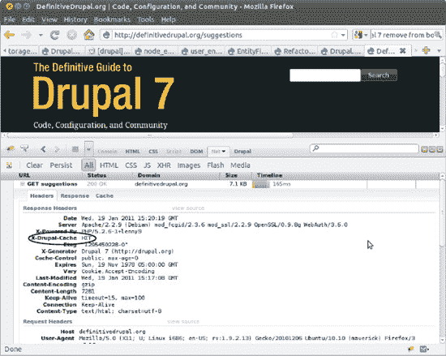
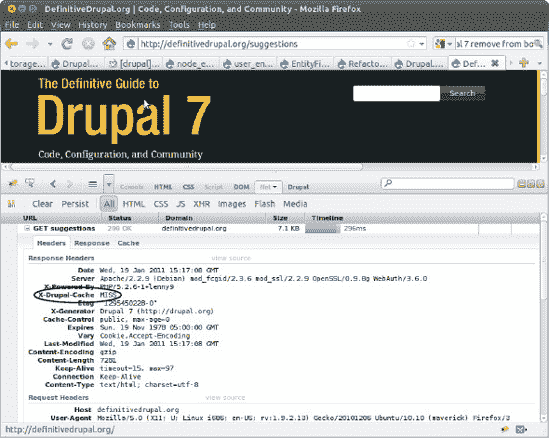
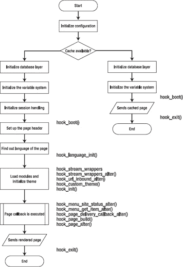
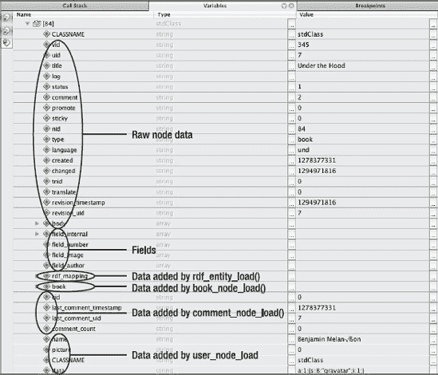
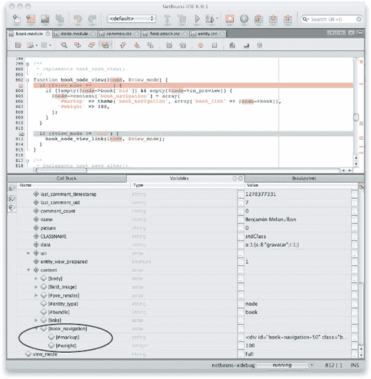
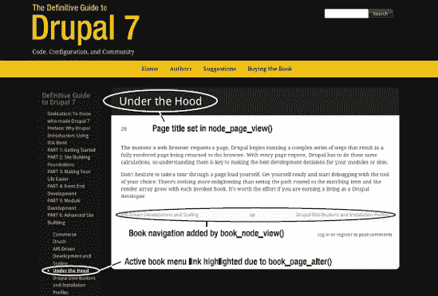
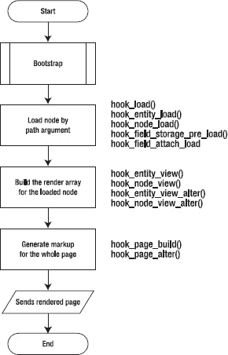

# 幕后探秘：Drupal 在显示页面时的内部运作

**作者：Stefan Freudenberg**

当网页浏览器请求一个页面时，Drupal 便开始执行一系列复杂的步骤，最终将一个完整渲染的页面返回给浏览器。每次页面请求，Drupal 都必须重复执行这些相同的计算过程，因此，理解这些步骤对于为你的模块或网站做出最佳的开发决策至关重要。

在本章中，你将了解当请求一个 Drupal URL 时会触发什么，例如请求 `http://definitivedrupal.org/node/84`。第 29 章介绍了 Web 服务器如何将 URL 解析为 `index.php?q=node/84`。在本章中，我将从 Web 服务器将路径 `node/84` 交给 Drupal 的 `index.php` 后发生的事情开始讲起。

Web 服务器的 PHP 解释器会解析 `index.php` 并执行代码。Drupal 的开发者将创建 Drupal 页面的过程组织为两个序列：引导加载（Bootstrap）以及与当前路径关联的页面回调函数的执行。这种划分使得在生成网页以外的应用中也能使用可工作的 Drupal 环境。一个很好的例子是 Drupal 自身的 cron 任务，它在完成引导加载并执行一些基本检查后，会执行 `hook_cron()`。

```php
/**
 * Drupal 安装的根目录。
 */
define('DRUPAL_ROOT', getcwd());

require_once DRUPAL_ROOT . '/includes/bootstrap.inc';
drupal_bootstrap(DRUPAL_BOOTSTRAP_FULL);
menu_execute_active_handler();
```

对于完整的页面加载，引导加载过程始终相同。页面回调函数的执行则取决于传入的路径，在本例中是 `node/84`。

### 引导加载

引导加载的任务是通过包含所有必要的库、准备数据库连接以及读取配置，为业务逻辑和主题渲染搭建好舞台。它分多个阶段完成，每个阶段必须且仅执行一次，并且必须按照特定的顺序执行。这是通过 `drupal_bootstrap()` 函数以及为每个阶段分配代表其处理顺序的整型常量来强制实现的（参见表 30–1）。`drupal_bootstrap()` 被调用时，需要传入应达到的引导加载阶段作为参数。

**表 30–1.** Drupal 引导加载阶段

| 编号 | 阶段 | 目的 |
| --- | --- | --- |
| 0 | `DRUPAL_BOOTSTRAP_CONFIGURATION` | 初始化配置 |
| 1 | `DRUPAL_BOOTSTRAP_PAGE_CACHE` | 尝试提供缓存页面 |
| 2 | `DRUPAL_BOOTSTRAP_DATABASE` | 初始化数据库层 |
| 3 | `DRUPAL_BOOTSTRAP_VARIABLES` | 初始化变量系统 |
| 4 | `DRUPAL_BOOTSTRAP_SESSION` | 初始化会话处理 |
| 5 | `DRUPAL_BOOTSTRAP_PAGE_HEADER` | 设置页面头部 |
| 6 | `DRUPAL_BOOTSTRAP_LANGUAGE` | 确定页面语言 |
| 7 | `DRUPAL_BOOTSTRAP_FULL` | 加载模块并初始化主题 |

#### 第一阶段：初始化配置

在第一阶段，会从 `sites/default` 文件夹读取 `settings.php`，并设置最重要的全局变量，这些变量要么直接来自 `settings.php`（如 `$databases`），要么是根据服务器环境计算得出的。以下是你在日常站点开发中会遇到的三个变量：

*   `$base_url`：你的所有 Drupal 页面共享的基准 URL。每个路径都会附加到其后。它必须是一个不带尾部斜杠的有效 URL。仅当 Drupal 无法正确确定该值时，才需要手动设置。`$base_url = 'http://www.example.com/drupal'; // 没有尾部斜杠！`^(`1`)
*   `$base_path`：基准 URL 的路径部分（要么是 '/'，要么是域名部分后面的任何内容），并带有尾部斜杠。它来源于 `$base_url`，并且本身也很有用。`$base_path = '/drupal/';`
*   `$base_root`：包含 URL 的协议和域名部分。它要么是基准 URL 本身，要么是移除了基准路径（如果有的话）后从基准 URL 派生而来。`$base_root = 'http://www.example.com';`

__________

¹ Jeff Eaton 曾试图用一个更戏剧性的方式来记录这个要求。参见 `drupal.org/files/issues/settings.php_1.patch`

#### 第二阶段：尝试提供缓存页面

在第二阶段，如果配置界面的“性能”部分启用了页面缓存，并且访问者未登录，Drupal 会尝试从其缓存中提供整个页面。如果能找到缓存的页面版本且未过期，它将在调用 `hook_boot()` 和 `hook_exit()` 之间被发送出去。

如果缓存后端需要数据库连接（由 `settings.php` 中的 `$conf['page_cache_without_database']` 决定），则在获取缓存页面之前，会先执行第三和第四引导阶段。

调试页面缓存可以通过 Drupal 开发者为此引入的一个附加 HTTP 头部来简化：如果页面确实是从缓存提供的，`X-Drupal-Cache` HTTP 头部会被设置为 `HIT`（参见图 30–1）；否则，其值被设置为 `MISS`（参见图 30–2）。



**图 30–1.** `X-Drupal-Cache` HTTP 头部被设置为 `HIT`。你需要 Firebug 插件才能在 Firefox 中查看 HTTP 头部。



**图 30–2.** `X-Drupal-Cache` HTTP 头部被设置为 `MISS`。

 **提示** 缓存后端是可插拔的。默认情况下，Drupal 使用数据库表来缓存页面、区块等。可以通过在 `settings.php` 中的 `$conf['cache_backends']` 添加文件名来注册替代的后端。该文件必须包含一个实现了 `DrupalCacheInterface` 的类。Drupal 自带了一个数据库缓存实现，以及一个安装期间所需的模拟实现。一个流行的替代缓存实现是由 memcache 模块（`drupal.org/project/memcache`）提供的，它使用 `memcached` 作为后端（详情参见第 27 章）。为了支持像 Varnish（`www.varnish-cache.org/`）这样的反向代理缓存代理来为匿名访客提供页面缓存，必须显式禁用 `hook_boot()` 和 `hook_exit()`。这是确保对源服务器的请求和对缓存中间服务器的请求行为一致所必需的。在你的 `settings.php`^(2) 中添加以下代码行：

```php
$conf['page_cache_invoke_hooks'] = FALSE;
if (!class_exists('DrupalFakeCache')) {
  $conf['cache_backends'][] = 'includes/cache-install.inc';
}
// 依赖外部缓存进行页面缓存。
$conf['cache_class_cache_page'] = 'DrupalFakeCache';
```

__________

² 参见 `http://drupal.org/node/797346`

##### 第三引导阶段：初始化数据库层

本阶段将建立数据库抽象层。由于此时无需建立连接，仅包含基类与工具函数（如 `db_query` 等）。此外，自动加载类与接口的回调函数会注册到标准 PHP 库（SPL）自动加载栈中^(3)。包含类与接口的文件由模块的 `.info` 文件声明，或存放于主包含文件夹中，Drupal 会维护一个注册表来追踪这些文件。执行过程中首次需要某个类或接口时，回调函数会利用该注册表加载所需文件。

 **注意** Drupal 7 的数据库抽象层是相较 Drupal 6 变革最剧烈的部分之一。取代了曾经令人又爱又恨的 `db_query()` 等函数，现在采用基于 PHP 5 PDO 的现代数据库层：查询构建器、流畅接口、提供迭代器接口的结果集、具名占位符，以及一致性事务与主从复制支持。（如果你喜欢 `db_query()`，有个好消息：它依然作为非动态查询的封装函数存在。）

##### 第四引导阶段：初始化变量系统

在第四引导阶段，Drupal 从变量数据库表（包含配置设置与持久化变量）中获取所有值，并将其与 `settings.php` 中定义的变量合并到全局变量 `$conf` 中。通过 `$conf['variable_name']` 在文件中设置的值优先于数据库中存储的值；换言之，你可以通过在 `settings.php` 文件中定义变量，防止这些变量通过用户界面被覆盖。

`$conf` 变量以巨型关联数组的形式存在。可通过调用 `variable_get('key_name', 'a default value')` 获取其值。在代码中调用 `variable_set('key_name', 'value')` 可持久化变量。

除变量外，引导过程中所需的所有模块均被加载，并实现引导期间调用的钩子：`hook_boot()`、`hook_exit()`、`hook_language_init()` 和 `hook_watchdog()`。可插拔锁系统也被包含在内。“可插拔”意味着你可以提供替代实现，并通过在 `settings.php` 中定义 `$conf['lock_inc'] = 'path/to/your/lock.inc'` 让 Drupal 使用它。本章前面已提及此类模式。

__________

³ [`http://php.net/manual/en/function.spl-autoload-register.php`](http://php.net/manual/en/function.spl-autoload-register.php)

 **提示** Drupal 优秀的代码内文档解释了锁机制：“Drupal 实现了一种协作式、顾问式的锁系统。任何可能被多个请求并行尝试的长时间运行操作，都应先尝试获取锁再继续执行。通过获取锁，一个请求知会其他请求：特定操作正在进行中，不得并行执行。”

变量初始化代码中可见一例。从变量表中获取所有数据已被证明是性能瓶颈，因此在 Drupal 7 中，该查询结果会被缓存。当多个进程尝试在缓存尚未就绪时填充变量缓存时，问题便会出现。这通过锁系统得以解决。在从数据库获取变量数据之前，必须先获取锁。若另一个进程已持有相同锁，则代码执行暂停一秒；随后再次尝试获取变量数据。此过程持续进行，直至最初获取锁的进程释放锁。如此，即可确保只有最先声明锁的进程从数据库获取变量，并将其存入缓存供后续请求使用。详见 [`http://api.Drupal.org/api/Drupal/includes--lock.inc/group/lock/7`](http://api.Drupal.org/api/Drupal/includes--lock.inc/group/lock/7)

##### 第五引导阶段：初始化会话处理

目前已完成的内容：数据库、设置、变量、部分通用 Drupal 函数与常量、全局变量以及引导模块。

本阶段，Drupal 注册其会话处理器，并为已认证用户关联会话。通常，匿名用户根本不会获得会话，除非需要在 `$_SESSION` 中存储内容；在此情况下，会预生成一个会话 ID。这允许对匿名访客进行 HTTP 代理缓存。若 Drupal 无法检测到已登录用户，则会在本阶段创建一个虚拟用户对象，代表 Drupal 数据库中用户 ID 为 0 的匿名访客。

如果你需要比 Drupal 自身数据库方案更高级的会话处理，可以在 `settings.php` 中将 `$conf['session_inc']` 指向一个包含所需实现函数的文件。拥有大量已认证访客的站点可从更高效的会话存储中受益。第 27 章 中介绍的 Mongodb 模块便提供了此类替代方案。

##### 第六引导阶段：设置页面头部

经过上述一系列初始化后，首条输出——HTTP 头部——将被生成并发送给站点访客。Drupal 发送给客户端的默认头部仅影响缓存。准确来说：没有字节真正发送给访客，因为 Drupal 运行在输出缓冲模式下。换言之，在缓冲区刷新之前（这发生在循环的最后阶段），任何内容都不会离开服务器。等等！在此之前还会发生一件事：`hook_boot()` 被调用，这给了模块在页面创建周期中首次干预的机会。注意，必须禁用此钩子以支持外部缓存机制（详见第三阶段的提示）。

##### 第七引导阶段：确定页面语言

引导过程的倒数第二步处理多语言站点当前访客的语言选择。确定语言后，`hook_language_init()` 的实现可以进行响应，例如设置语言相关的变量。

###### 语言协商算法

用于确定使用哪种语言的协商算法可通过 `hook_language_negotiation_info()` 提供，现有算法可通过 `hook_language_negotiation_info_alter()` 修改。这些提供者将按照站点管理员在语言配置页面（`admin/config/regional/language/configure`）设定的顺序依次尝试确定语言。每个定义的协商算法必须提供一个回调函数来确定语言。一旦某个提供者返回有效语言，语言选择即停止。

以下是语言提供者的示例：

```php
$providers[LOCALE_LANGUAGE_NEGOTIATION_URL] = array(
  'types' => array(LANGUAGE_TYPE_CONTENT, LANGUAGE_TYPE_INTERFACE, LANGUAGE_TYPE_URL),
    'callbacks' => array(
      'language' => 'locale_language_from_url',
      'switcher' => 'locale_language_switcher_url',
      'url_rewrite' => 'locale_language_url_rewrite_url',
    ),
    'file' => $file,
    'weight' => -8,
    'name' => t('URL'),
    'description' => t('从 URL（路径前缀或域名）确定语言。'),
    'config' => 'admin/config/regional/language/configure/url',
  );
```

##### 最终引导阶段：加载模块并初始化主题

最后会执行 `drupal_bootstrap_full()`。所有包含 Drupal 工具函数的文件都被引入。已启用的模块被加载（换言之，`.module` 文件被引入）。模块有机会通过 `hook_stream_wrappers()` 注册流包装器^(4)，并通过 `hook_stream_wrapper_alter()` 修改现有的包装器。（到目前为止你已经知道，所有用于注册事物的钩子也都有一个对应的 alter 钩子）。`$_GET['q']` 中的路径被规范化，主题被初始化。

> **注意**：你可以通过在 `settings.php` 中提供替代的 `menu.inc` 或 `path.inc` 文件来替换 Drupal 菜单系统和路径处理函数的部分或全部原始功能。如果你想提升 Drupal 网站的性能，可能会考虑这样做……前提是你有足够的胆量和钢铁般的神经。请务必小心；你可能会无意中改变 Drupal 核心的行为。

__________

⁴ [`http://api.drupal.org/api/drupal/modules--system--system.api.php/function/hook_url_inbound_alter/7`](http://api.drupal.org/api/drupal/modules--system--system.api.php/function/hook_url_inbound_alter/7)

路径规范化的任务是 `drupal_get_normal_path()` 完成的。它会检查存储在 `$_GET['q']` 中的路径是否是一个路径别名或自定义 URL，需要将其映射到内部的 Drupal 实体 URL（如 `node/84`、`user/123`）。如果普通的存储别名对你来说不够用，`hook_url_inbound_alter()` 的实现可以添加一些魔法。此钩子在 URL 别名表中的别名被映射到系统路径之后被调用。使用方法示例请参见 API 文档。

初始化主题层涉及查找当前激活的主题，该主题可以是：在 UI 中设置为默认主题的主题、用户个人偏好的主题、由 `hook_custom_theme()` 实现返回的主题，或者通过菜单系统为当前路径显式设置的主题。所有在主题的 `.info` 文件中声明的 CSS 和 JavaScript 都被添加到页面中，如果主题的 `hook_init()` 实现存在，则会被调用。

在此阶段的最末尾，当 Drupal 完全设置好后，会调用 `hook_init()`。关于使用 `hook_init()`，API 文档指出：“它通常用于设置请求后续阶段所需的全局参数。” Drupal 核心的 Locale 模块实现了 `hook_init()` 来根据用户当前的语言初始化日期格式。

> **注意**：在 Drupal 6 中，`hook_init()` 通常用于添加每次页面加载都需要的 CSS 或 JavaScript 文件。虽然你仍然可以这样做，但这些资源现在也可以列在模块的 `.info` 文件中，例如 `scripts[] = example.js` 或 `stylesheets[all][] = example.css`。然后系统模块的 `hook_init()` 实现 `system_init()` 会负责添加这些文件。

### 页面回调的执行

完成引导阶段后，Drupal 就可以构建、渲染和交付内容了。由于所有请求都通过 `.htaccess` 中的重写规则路由到 `index.php`，Drupal 需要一个内部机制来将给定的请求 URL 分派给处理该请求的程序。在 Drupal 中，这个程序就是当前菜单项的页面回调。一个菜单项包含关于如何响应客户端对特定路径请求的信息集合。你已经在第 29 章中学习了菜单系统的工作原理。最重要的部分是页面回调——一个返回可渲染数据结构的函数。渲染过程在附录 C 中解释。

Drupal 需要考虑几种情况：

*   网站处于离线模式。

*   在 `menu_router` 表中未找到请求路径对应的菜单项。

*   访问者没有权限查看与菜单项关联的资源。

*   一切正常，页面回调被执行。

此算法的结果要么是一个与对应 HTTP 状态码相等的整数，要么是一个符合 `drupal_render()` 期望格式的渲染数组。它被传递给 `drupal_deliver_page()`，后者让交付回调产生输出。默认情况下，交付回调是 `drupal_deliver_html_page()`。它利用 `drupal_render()` 将页面回调返回的渲染数组与同样结构化的区域数据合并，并将整个页面转换成 HTML。图 30-3 展示了整个页面加载周期，并标明了 Drupal 的钩子被调用的时机。



**图 30-3**. 详细展示引导过程的页面加载周期

### 一个典型的示例

让我们回到本章开头的示例 URL：`node/84`。Drupal 的菜单系统通过调用 `node_load(84)` 来加载由节点 ID 84 标识的节点。在底层，`DrupalDefaultEntityController` 及其子类 `NodeController` 负责从数据库中获取匹配的记录，并调用 `hook_load()`、`hook_entity_load()` 和 `hook_node_load()`，从而让模块有机会操作节点对象或触发其他操作。关联的字段通过 `field_attach_load()` 加载。实现了 `hook_field_storage_pre_load()` 或 `hook_field_attach_load()` 的模块有机会动态地为每个字段添加和修改字段数据。节点 84 是一个由书籍核心模块提供的“书籍”类型的节点。图 30-4 显示了加载完成后节点对象的调试器视图。各个模块添加的属性和字段都已标明。

在下面的示例代码中，您会看到 `book_node_load()`，即书籍模块对 `hook_node_load()` 的实现。像所有实现一样，它接受两个参数：一个节点数组和一个节点类型数组。如果加载的节点是书籍的一部分，则会将附加数据附加到该节点以扩展其行为：该节点会意识到自己是书籍的一部分。这里忽略了类型，但对于其他模块可能很重要。作为开发人员，理解这个复杂的加载过程实际上为您减轻了很多负担是很重要的。您只需要实现合适的钩子即可。

```
/**
 * 实现 hook_node_load()。
 */
function book_node_load($nodes, $types) {
  $result = db_query("SELECT * FROM {book} b INNER JOIN {menu_links} ml ON \
b.mlid = ml.mlid WHERE b.nid IN (:nids)", array(':nids' => \           array_keys($nodes)),
array('fetch' => PDO::FETCH_ASSOC));
  foreach ($result as $record) {
    $nodes[$record['nid']]->book = $record;
    $nodes[$record['nid']]->book['href'] = $record['link_path'];
    $nodes[$record['nid']]->book['title'] = $record['link_title'];
    $nodes[$record['nid']]->book['options'] = unserialize($record['options']);
  }
}
```

加载节点对象后，它会被传递给给定路径的页面回调函数 `node_page_view()`。它将节点的标题设置为页面标题，并向 HTML 头部元素（尚未渲染）和 HTTP 标头添加一个规范链接和一个简短链接^(5)。构建渲染数组是 `node_show()` 的职责，它将其委托给 `node_view_multiple()`。在此函数中，每个节点的渲染数组由 `node_view()` 构建。字段被准备好以供渲染，模块可以通过 `hook_entity_prepare_view()` 对要显示的内容进行操作。这个钩子尤其重要；实现新实体的开发人员应确保通过调用 `entity_prepare_view()`（就像 `node_view_multiple()` 所做的那样）在 `ENTITY_build_content()` 或 `ENTITY_view_multiple()` 函数中调用它。请阅读 `entity_prepare_view()`^(6) 的 API 文档以了解更多详细信息。

__________

⁵ 规范链接非常有用，可以避免因对同一内容发布多个 URL 而受到搜索引擎的惩罚。一个非常常见的例子是短 URL，它在短信服务中非常流行。

⁶ `api.drupal.org/api/drupal/includes--common.inc/function/entity_prepare_view/7`



**图 30-4.** 完全加载的节点对象的 Netbeans 调试器视图

每个单独的节点（对于此页面只有一个）由 `node_view()` 渲染，并将大部分工作委托给 `node_build_content()`。字段和链接被转换为渲染数组，并且模块可以通过 `hook_entity_view()` 和 `hook_node_view()` 进一步向渲染数组添加内容。书籍模块实现了后者，并使用它来添加书籍导航元素，如图 30-5 所示。它在最终页面上的显示效果如图 30-6 所示。在离开页面回调上下文之前，会调用 `hook_entity_view_alter()` 和 `hook_node_view_alter()`，这是修改其他模块之前所做操作的最后机会。



**图 30-5.** `book_node_view()` 将书籍导航添加到渲染数组后的节点 84 的调试器视图



**图 30-6**. 最终结果

当页面回调最终返回渲染数组时，它会被传递给 `drupal_deliver_page()`，后者将渲染工作留给交付回调函数 `drupal_deliver_html_page()`。它确保其他模块在 `drupal_render()` 遍历渲染数组以生成标记之前，通过调用 `hook_page_build()` 和 `hook_page_alter()` 有最后一次更改结果的机会。区块模块使用 `hook_page_build()` 将内容添加到主题定义的区域中。`book_page_alter()` 利用强大的新钩子 `hook_page_alter()` 将书籍菜单添加到活动菜单中。

```
/**
 * 实现 hook_page_alter()。
 *
 * 将书籍菜单添加到用于在查看书籍页面时构建活动路径的菜单列表中。
 */
function book_page_alter(&$page) {
  if (($node = menu_get_object()) && !empty($node->book['bid'])) {
    $active_menus = menu_get_active_menu_names();
    $active_menus[] = $node->book['menu_name'];
    menu_set_active_menu_names($active_menus);
  }
}
```

总结这个典型页面加载周期的示例，渲染的详细信息可以在附录 C 中找到。一旦标记准备就绪，精美的页面就会被发送到访客的浏览器。图 30–7 说明了本章第二部分中涵盖的最重要的钩子。



**图 30-7.** 详细说明页面回调执行的节点页面加载周期

在深入研究了 Drupal 页面的完整加载周期之后，最好从鸟瞰的角度来审视它。引导过程已经为模块向访客提供内容搭建好了舞台。对于您网站的所有页面，这个过程都是相同的。在各个阶段会调用许多钩子，为您在全局层面上影响网站行为提供了机会。在为 Drupal 模块做贡献或创建自己的模块时，请仔细考虑某段代码何时需要被执行，并选择最合适的钩子。在页面加载的后期阶段确定语言选择是没有意义的；完成该任务所需的一切在引导期间都已可用，并且所有页面都可以从中受益。

### 总结

Drupal 7 引入了几个新概念，其中最突出的是实体和字段。您可以使用众多钩子来影响内容的行为和呈现。这些钩子使您能够轻松地用简洁的代码和很少的努力产生巨大的效果。研究一些核心模块，看看它们如何利用实体和字段 API。

不要犹豫，亲自体验一次页面加载的过程。使用您选择的工具开始调试——没有什么比看到路由路径与匹配项对应，以及渲染数组随着每个调用的钩子而增长更令人明了的了。如果您以 Drupal 开发为生，那么这是值得付出的努力。一份用于深入了解 Drupal 内部机制的工具摘要（包括您的建议）将在 `dgd7.org/inside` 上保持更新。

## 第 31 章

