# 搜索与 Apache Solr 集成

作者：彼得·沃拉宁

本章将从 Apache Solr 搜索集成模块如何实现 Drupal 核心搜索模块钩子的角度、如何创建自定义搜索的角度以及其功能性角度进行讨论。本章还将重点介绍一些额外的钩子，这些钩子允许自定义和扩展模块的行为。该模块可视为将 Drupal 与网络服务集成的示例，并运用了一些面向对象的代码。

Drupal 核心中的`Search`模块为各模块提供搜索功能提供了一个框架和 API。`Search`模块本身除了提供搜索表单和一些管理配置选项外，几乎不做任何事情。为了让搜索表单显示出来，一个或多个模块必须实现 Search 模块的钩子。在 Drupal 核心中，`Node`模块和`User`模块都实现了搜索钩子。

`Node`模块提供了对内容进行关键词搜索的能力。由于它是 Drupal 核心的一部分，它使用 SQL 数据库作为存储和搜索机制。虽然`Node`模块的搜索实现提供了非常好的关键词匹配，但其对数据库的使用可能会导致较大型网站出现显著的性能问题。此外，虽然它可以处理一些过滤（例如，通过高级搜索表单按用户或分类术语进行过滤），但这相当有限。

Apache Solr 搜索集成模块（位于`drupal.org/project/apachesolr`）为索引和搜索内容提供了`Node`模块搜索的替代方案。它提供了更广泛的内容索引和过滤功能，并且可以从多个 Drupal 站点访问 Solr 服务器。Drupal 7 中 Search 模块 API 的许多增强和变更，是基于在 Drupal 6 Search 模块上创建 Apache Solr 搜索集成时遇到的局限性而推动的。有几个关键特性使其区别于`Node`模块搜索：

*   使用 Facet API 模块进行分面搜索。

*   结果为用户提供多种可选的排序方式。

*   高度可定制的权重调整，允许你调整搜索结果的相关性评分，以控制哪些结果优先显示。

*   对大量内容（例如，超过 10,000 个节点）进行快速搜索。

*   具备进行多站点搜索或联邦搜索的潜力，例如在同一结果集中同时显示用户搜索和内容搜索。


> **注意** 术语“分面”指的是搜索结果（或整个搜索索引）中文档的一个属性，例如一个分类术语。“分面搜索”指的是一个基于分面过滤搜索结果的界面，这是一种帮助用户找到所需结果并避免无效搜索的技术。

Apache Solr 本身是一个开源项目。实际上，它是 Lucene Java 项目的一部分：Lucene 是 Solr 所基于的实际搜索库。Apache Solr 提供了 HTTP 接口，因此可以（在同一台服务器或完全独立的服务器上）与 Drupal（或几乎任何其他应用程序）集成。Solr 可以在独立服务器上运行这一事实，是它在 Drupal 社区流行的原因之一：它允许站点管理员减少数据库服务器的负载，即使对于拥有数十万个节点的站点也能获得快速的搜索结果。Solr 还内置了对主从复制的支持，因此可以轻松地为搜索请求提供高可用性；如果搜索流量超过一台服务器的容量，它还可以进行水平扩展。该 Drupal 模块主要设计用于与稳定的 Solr 1.4.x 发布系列一起工作，尽管大多数或所有功能也应适用于即将发布的 Solr 版本。

如果你想运行 Solr，你有以下几种选择：

*   自己运行。通常，此选项适用于至少拥有一台专用服务器或 VPS 的用户。至少需要具备在 Java Servlet 容器（如 Jetty 或 Tomcat）中部署 Solr，并通过防火墙规则、HTTP 认证或其他认证方式控制对其访问的能力。

*   为托管的 Solr 索引付费。Acquia 为每位拥有 Drupal 支持订阅的客户提供一个 Solr 索引。其他公司提供更通用的服务。

*   通过非营利组织或合作组织（如 May First People Link）汇集资源。

Apache Solr 项目附带了一个易于运行的 Jetty 部署，几乎所有有兴趣尝试该模块的人都可以在本地机器上几分钟内运行起来。步骤概述在 Apache Solr 搜索集成模块附带的`README.txt`文件中。但是，这种简单的部署类型不包含任何认证机制，因此在公共服务器上用于生产站点时，至少需要通过防火墙来保护对 Solr 的访问。

### 搜索模块管理选项

Drupal 7 中搜索模块的管理界面提供了一些 Drupal 6 中没有的关键配置选项。搜索模块和 Apache Solr 搜索集成设置都可以在`admin/config`路径下的“搜索和元数据”部分找到，如图 31-1 所示。

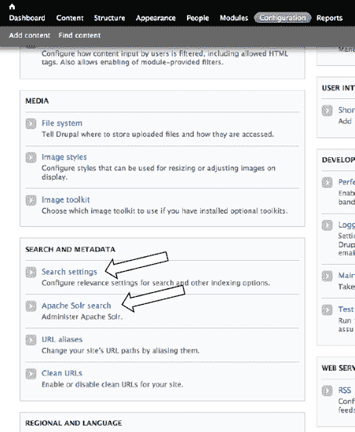

*图 31-1. 管理员配置界面中的搜索设置*

特别值得注意的是搜索模块（如图 31-2 所示），位于`admin/config/search/settings`的表单允许你有选择地启用任何或所有实现了搜索钩子的模块。你还可以选择其中任何一个作为默认搜索（即从搜索块表单和默认标签页运行的搜索）。如果你想使用 Apache Solr 搜索集成作为主要搜索，你应将其设为默认搜索，并可能禁用`Node`模块的搜索。

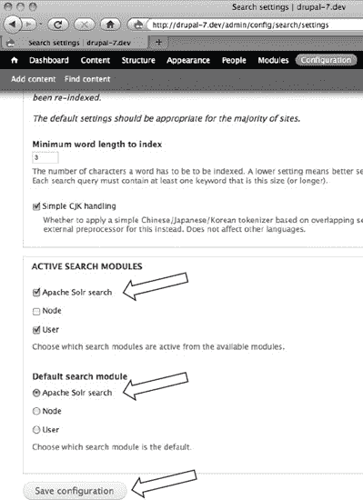

*图 31-2. 搜索模块配置选项*

### 搜索结果与分面块

进一步的配置将在本章后面讨论，但在启用适当的过滤器并配置好块之后，你会得到一个默认搜索，它允许你查看当前的关键词和过滤器，以便通过移除当前过滤器之一来缩小或扩大搜索范围。与当前搜索结果相关的已启用过滤器将显示在一个分面块中。该块中的每个链接将应用一个额外的过滤器来缩小结果集。默认设置会显示带有复选框的分面（这是通过 JavaScript 添加的）。一旦对搜索结果应用了分面过滤器，你还可以勾选“保留当前过滤器”复选框，这实质上是为你提供了使用不同关键词和当前过滤器再次搜索的选项（参见图 31-3）。

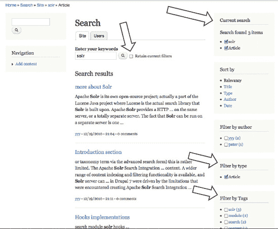

*图 31-3. 带有当前搜索块、分面块以及使用新关键词时保留过滤器的复选框的搜索结果*

### 搜索模块 API

Drupal 核心中的`Search`模块提供了一个其他模块可以使用的框架。特别是，它们可以利用来自`Search`模块的搜索界面和标准结果格式化功能。

关于这些钩子的更多详细信息可以在 Drupal 7 搜索模块附带的`search.api.php`文件中找到；相同的文档也可以在`api.drupal.org`上在线访问。本节将重点介绍由 Apache Solr 搜索集成模块实现的钩子，这基本上是任何模块要实现自定义搜索所需实现的最小钩子集合。

#### 创建搜索功能所需的钩子实现

以下钩子是定义新搜索标签页所必需的。一个模块只能定义一个搜索，这是一个有意的限制——这有助于保持 API 更简洁。

`hook_search_info()`

`hook_search_execute()`

仅需这两个钩子，你的新搜索功能就能生效。`hook_search_info()` 让搜索模块了解你的搜索实现、搜索标签页的标题、用于执行搜索的路径，以及（可选）一个回调函数的名称，该函数用于在关键词之外添加其他条件（如过滤器）到搜索中。另一个必需的钩子 `hook_search_execute()` 在用户访问搜索路径并发现存在关键词或条件时被调用。请注意，虽然搜索表单通过 POST 请求提交，但搜索模块实际上是从 URL 中获取所有搜索参数。因此，你可以例如将搜索加入书签，然后访问该 URL 重新运行以查找新结果。`hook_search_execute()` 的返回值是一个结果数组，每个结果都是一个包含主题函数所期望的特定键值对的数组。

 **注意** 所有搜索参数通过 GET 请求在 URL 中传递，这一事实不仅允许你将搜索加入书签，还有其他好处。例如，由于 Drupal 将页面 URL 用作缓存键，你可以从 Drupal 页面缓存中受益，为网站上的任何常用搜索（例如向用户提供特定搜索 URL 的链接）提供缓存页面。

#### 其他搜索模块钩子

以下钩子是可选的，但它们允许你的模块更好地控制搜索过程和索引过程（如果使用搜索模块的索引功能），或者允许你向搜索模块管理界面添加内容：

`hook_search_access()`

`hook_search_reset()`

`hook_search_status()`

`hook_search_admin()`

`hook_search_page()`

`hook_search_preprocess()`

`hook_update_index()`

如果你实现了 `hook_search_page()`，则可以完全控制搜索结果的流程和显示，在这种情况下，你可以根据需要更改 `hook_search_execute()` 的返回格式，而无需遵循搜索模块所期望的格式。清单 31–1 中所示的实现与核心搜索模块的实现非常相似，但增加了一个额外的输出选项，用于浏览所有分面区块。

`apachesolr_search` 集成模块实现了其中的五个钩子，以及在 `hook_search_info()` 中可选指定的回调。最后一个回调非常重要，因为它允许代码从查询字符串中提取额外的过滤参数，并用于在没有任何关键词时也执行搜索。正是基于 Apache Solr 搜索集成的这个需求，该功能被添加到了核心搜索模块中。你还会注意到，`hook_search_info()` 返回的信息实际上是一个变量的内容，尽管该变量（目前）并未在用户界面中暴露以供配置。这将允许开发人员更改搜索标签页的名称和路径，而无需使用 `hook_menu_alter()`。

**清单 31–1.** 具有额外输出功能的基本搜索模块

```php
/**
 * 实现 hook_search_info()
 */
function apachesolr_search_search_info() {
  return variable_get('apachesolr_search_search_info', array(
    'title' => '站点',
    'path' => 'site',
    'conditions_callback' => 'apachesolr_search_conditions',
  ));
}

/**
 * 实现 hook_search_execute()
 */
function apachesolr_search_search_execute($keys = NULL, $conditions = NULL) {
  $filters = isset($conditions['filters']) ? $conditions['filters'] : '';
  $solrsort = isset($_GET['solrsort']) ? $_GET['solrsort'] : '';

  try {
    return apachesolr_search_run($keys, $filters, $solrsort, 'search/' . arg(1), pager_find_page());
  }
  catch (Exception $e) {
    watchdog('Apache Solr', nl2br(check_plain($e->getMessage())), NULL, WATCHDOG_ERROR);
    apachesolr_failure(t('Solr 搜索'), $keys);
  }
}

/**
 * 实现 search_view() 的条件回调
 */
function apachesolr_search_conditions() {
  $conditions = array();

  if (isset($_GET['filters']) && trim($_GET['filters'])) {
    $conditions['filters'] = trim($_GET['filters']);
  }
  if (variable_get('apachesolr_search_browse', 'browse') == 'results') {
    // 设置条件以触发搜索。
    $conditions['apachesolr_search_browse'] = 'results';
  }
  return $conditions;
}

/**
 * 实现 hook_search_reset()
 */
function apachesolr_search_search_reset(){
  apachesolr_clear_last_index('apachesolr_search');
}

/**
 * 实现 hook_search_status()。
 */
function apachesolr_search_search_status(){
  return apachesolr_index_status('apachesolr_search');
}

/**
 * 实现 hook_search_page()
 */
function apachesolr_search_search_page($results) {
  if (!empty($results['apachesolr_search_browse'])) {
    // 显示分面浏览区块。
    $output = apachesolr_search_page_browse($results['apachesolr_search_browse']);
  }
  elseif ($results) {
    $output = array(
      '#theme' => 'search_results',
      '#results' => $results,
      '#module' => 'apachesolr_search',
    );
  }
  else {
    // 给用户一些自定义的帮助文本
    $output = array('#markup' => theme('apachesolr_search_noresults'));
  }
  return $output;
}
```

显然，这里的代码主要包装了对其他内部模块函数的调用；实现状态和重置钩子只是为了允许状态和重置操作在搜索模块管理页面以及 Apache Solr 搜索集成管理页面中正常工作。请注意，实现了 `hook_search_page()`，以便在没有搜索结果时提供分面区块浏览或自定义的帮助文本。格式化正常搜索结果的代码与搜索模块中的默认实现相同。

### Apache Solr 搜索配置

Apache Solr 搜索集成的管理界面提供了许多配置选项，能够满足大多数初始定制的需求。特别是，通过配置提升设置并进行一些关于最终用户对结果排序满意度的基本测试，你可以帮助搜索结果变得更加相关。

#### 启用的过滤器

为了让最终用户能够通过特定分面进行导航，你需要遵循两个步骤。首先，通过 Apache Solr 搜索集成设置启用该过滤器，然后通过常规的块模块界面启用相应的块。启用过滤器的操作意味着 Solr 服务器会执行额外的处理，并返回额外的数据。因此，你只应启用那些你会使用其块或将数据用于其他目的的过滤器。例如，为了使标签字段的分面块可用，需要启用最后一个过滤器（参见图 31–4），然后对块进行配置。

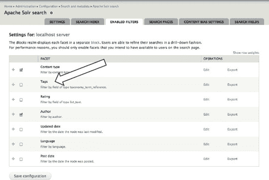

**图 31–4.** 启用过滤器会在搜索结果中增加一个可供使用的分面。

##### 内容类型加权与排除

网站常见需求是：某些类型的内容应在搜索结果中获得加权，或某些内容类型根本不应被添加到搜索索引中。例如，你可能希望将用户引导至博客文章。或者，你可能希望他们首先找到由书籍节点代表的文档。最初，所有内容类型都被同等对待。通过将某个值设置为“忽略”以外的选项，即表示你网站内容中的特定节点类型具有更高重要性，并应在搜索结果中获得更高评分。相反，有些内容可能根本不应被索引。这适用于自动生成或代表数据而非实际网站内容的节点类型。

管理界面允许你按内容类型配置加权和排除（参见图 31-5）。如果你将某个类型添加到排除列表，模块将尝试立即从搜索索引中删除所有相关节点，因此请勿随意进行此更改。

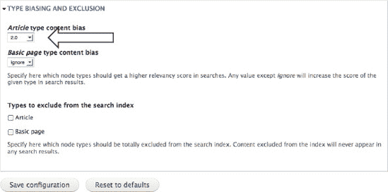

**图 31-5.** 为特定内容类型设置搜索结果偏向与排除设置

### Apache Solr 搜索定制

Apache Solr 搜索集成模块只是为 Drupal 网站实现完全优化界面的一个起点。此外，Solr 的过滤和排序功能使其作为某些列表页面（如电子商务网站、图书馆网站或 `drupal.org` 上列出所有模块的页面）的数据源极具吸引力。`apachesolr.api.php` 文件中记录了大量的钩子，但对于大多数典型定制，仅需使用其中少数几个即可。

#### 用于向 Solr 输入数据的钩子

在索引节点时，Apache Solr 搜索集成模块默认会向文档添加某些字段。如果你想进行自定义过滤、加权等操作，则需要在索引中向文档添加额外字段。为此，你可以实现 `hook_apachesolr_update_index($document, $entity, $namespace)`。此钩子用于在文档发送到 Solr 之前向其中添加更多数据；它也可用于修改或替换由 Apache Solr 或其他模块添加到文档中的数据。它类似于修改钩子，但由于文档是一个对象，因此无需通过引用传递变量。向 Solr 索引添加数据时，查看 `schema.xml` 文件以了解动态字段的类型名称会很有帮助。你只需使用正确的前缀命名文档上的属性，即可控制数据索引方式。例如，你可以像这样添加一个单值字段：

```
function MYMODULE_apachesolr_update_index($document, $node, $namespace) {
  if ($node->type == 'site_product' && $document->entity_type == 'node') {
    // 向索引添加一个额外的自定义节点字段。
    $document->fs_price = $node->price;
  }
}
```

有几种方法可以将可搜索数据放入索引。最简单的方法是在索引时简单地向要渲染的节点添加更多内容。另一种方法是实现 `hook_node_view($node, $view_mode, $langcode)`，并查找 `$view_mode` 的值为 `'search_index'` 的情况。还有一种选择是通过 `hook_node_update_index($node)` 添加内容。从该钩子返回的任何内容都会附加到发送到搜索索引的内容中。然而，在后两种情况下，这些内容只会作为关键词搜索的一部分被找到，而无法用于创建分面或排序。

Drupal 7 核心版本的一个重大特性是字段 API。Apache Solr 搜索集成模块内置了对索引节点或（可能）其他实体类型字段的支持，可基于字段类型甚至逐个字段进行。此功能基于模块 6.x-2.x 版本中对内容构建工具包 (CCK) 字段的支持而创建；在 7.x 版本中，它已扩展为包含对分类术语引用字段的处理。默认情况下，只有分类和所有列表类型字段（例如 `list_text`）会作为 Solr 文档中的单独字段被索引。如果你需要添加或更改此索引，可以实现 `hook_apachesolr_field_mappings_alter(&$mappings)`。更多详情请参阅 `apachesolr.api.php`。

最后要考虑的一点是，如何有选择地将数据排除在搜索索引之外。之前，你看到了用于排除所有特定类型节点的管理界面，但你可能需要更精细地排除内容。在这种情况下，你可以实现 `hook_apachesolr_node_exclude($node, $namespace)`。如果任何模块返回 `TRUE`，则该节点不会被发送到索引。

#### 用于修改查询和结果的钩子

修改发送给 Solr 的查询的首要且最常见的原因是从搜索结果的文档中检索额外字段。这是通过 `hook_apachesolr_update_index($document, $node, $namespace)` 向文档添加额外字段的补充操作。通常，当你修改查询时，不希望最终用户在分面链接等处看到该修改。在这种情况下，应使用 `hook_apachesolr_modify_query($query, $caller)`，并将你的字段名称附加到发送给 Solr 的 `'fl'` 参数中，如下所示：

```
function MYMODULE_apachesolr_query_alter($query) {
  // 同时从索引中返回任何价格数据到结果中。
  $query->addParam('fl', 'fs_price');
}
```

`hook_apachesolr_modify_query()` 还可用于向搜索添加最终用户不可见的过滤器。这一点非常重要，例如在实现 Apache Solr 节点访问模块时。该模块使用 `node_access_grants()` 根据节点访问系统向搜索查询添加过滤器。它还使用前面描述的 `hook_apachesolr_update_index()` 来将节点访问信息作为额外字段与每个从节点派生的 Solr 文档一起索引。

一个非常相似的钩子是 `hook_apachesolr_query_prepare($query)`。使用此钩子所做的任何更改最终可能会在搜索结果页面上对用户可见，因此其用途比 `hook_apachesolr_query_alter()` 更为有限。

还有一些钩子（和主题钩子）可用于在搜索结果向用户显示之前修改或丰富它们。最常用的是 `hook_apachesolr_search_result_alter($doc, $extra)`，它允许对结果集中的每个文档进行单独修改。

### 与 Apache Solr 服务器集成

为了稍微理解 Apache Solr 搜索集成模块中搜索模块钩子实现为何如此编写，对 Apache Solr 服务器的工作原理有一个广泛的概念性理解是很有用的。Drupal 通过 HTTP 请求与 Solr 交互，对 Drupal 而言，这意味着使用 `drupal_http_request` 函数（不过，也可以通过 PHP 中的其他方式实现，包括使用 curl 函数或 `file_get_contents()`，具体取决于 PHP 安装）。Solr 具有 RESTful API 接口，但至少在 1.4.x 版本中，它并不支持所有 HTTP 方法作为动词，因此从这个意义上说，它并非*真正的* REST 接口。相反，它使用不同的 URL 路径（并且可以为每个搜索索引配置）；POST 请求用于数据更改操作，GET 请求用于查询。

一个 PHP 库被改编用于提供将数据传入和传出 Solr 的某些底层逻辑。该库可在 `code.google.com/p/solr-php-client` 找到。Apache Solr 搜索集成模块提供了一个改编自主库类的类，该类改变了其行为。最重要的改动是使用 `Drupal_http_request()` 而不是 `file_get_contents()`，以便所有 Drupal 网站都能使用该模块。这是类 `DrupalApacheSolrService`，它扩展了 `Apache_Solr_Service`。文档类来自该库，仅做了最小限度的修改。

#### 管理 Solr 索引中的数据

数据以 XML 文档的形式添加到 Solr 索引中，通过 `POST` 请求发送到 Solr 服务器的 `/update` 路径。Solr 将数据存储为文档，每个文档必须有一个唯一的字符串 ID 值。Solr 本身没有任何文档间关系概念，也没有将文档 `JOIN` 起来的能力。从这个意义上说，它类似于基于文档的 NoSQL 数据库（如 MongoDB），因此你必须将希望能够在搜索结果中搜索或检索的节点或其他实体的所有属性存储在一起。删除文档是通过 `POST` 请求发送一个 XML 文档来完成的，该文档要么指定文档 ID，要么通过一个查询来删除所有匹配的文档。

#### 搜索与分析

常规搜索仅基于 URL 路径和查询字符串进行。根据你的配置，不同的搜索可能使用不同的路径，例如关键词搜索与“更多类似结果”搜索。如果某些功能未按预期工作，在本地运行 Solr 会非常有帮助，因为你可以直接在 URL 中输入查询，或使用 Solr 管理界面的其他功能。特别是，分析功能有助于理解索引内容或搜索关键词如何被 Solr `schema.xml` 中配置的分析器和过滤器转换。如果使用示例 Jetty 部署在本地运行 Solr，你可以通过 [`http://localhost:8983/solr/admin/`](http://localhost:8983/solr/admin/) 访问该界面。图 31–6 显示了管理界面：顶部括号内是正在使用的模式名称，然后是分析界面的链接以及可以发起搜索的文本框。

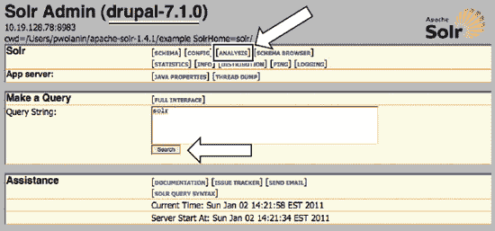

**图 31–6.** Apache Solr 管理页面，包含分析界面的链接

### 总结

通过使用 Apache Solr 搜索集成，你可以提高网站上搜索结果的质量和搜索界面，这将有助于留住用户，并帮助他们找到所需内容。

Drupal 7 版本的 Apache Solr 搜索集成将随着对用户和文件等其他实体的索引功能可用，以及 Drupal 7 版本的 Views 发布而得到增强。

 **提示** 在 `dgd7.org/solr` 查找更新。

## 第三十二章


## 用户体验

作者：Bojhan Somers 和 Roy Scholten

学习 Drupal 的工作原理需要花费大量时间——而这还只是核心部分。随着模块的添加，复杂性也随之增加。作为 Drupal 开发者，你不希望这种复杂性妨碍用户和网站管理员从你的工作中充分受益。这在设计方面带来了一些挑战。这个模块如何与其他所有模块配合？我们如何设计 Drupal 管理界面以适应无限的可能性？

这时，设计实践——最重要的是关注用户行为的交互设计——就派上用场了。例如，Drupal 7 设计中最大的变化之一是引入了名为 `Seven` 的管理主题。

没有默认的管理主题从人们开始使用 Drupal 6 的第一秒起就造成了困惑，因为它不符合他们对 CMS 工作方式的认知。管理界面在视觉上位于网站内部，而不是一个独立的管理界面，这让人们感到困惑。

### 模块化

无需破解应用程序即可插入功能是 Drupal 的核心。然而，一旦你开始组合使用多个模块，工作流问题就会出现。你能想象为了达成一个目标，需要在 Firefox 或 iPhone 中使用多个插件吗？

### 人性化 API

我们倾向于认为人类是理性的、有逻辑的生物，会基于深思熟虑做出有意识的行动。但事实是，我们的许多（如果不是大多数）决定都是无意识做出的，受到情绪和大脑中我们无法有意识访问的部分发出的自动触发器的驱动。

大脑这个潜意识部分是一个相当快速且智能的输入处理器——这是理所当然的——因为我们的五感每秒捕捉约 1100 万条信息。其中只有 40 条被有意识地处理。幸好我们有潜意识来处理所有其他信息，否则我们几秒钟内就会超负荷。

### 短期记忆

你有没有过走进一个房间却忘了自己要做什么的经历？你刚刚遇到了短期记忆的限制，同时也体验到了自己容易分心的能力。在界面世界中，我们必须考虑到这一点，因为用户一天中很容易被许多事件打断他们的任务流程，比如同事走进来或电子邮件弹出。

短期记忆（持续时间从几秒到大约 30 秒）的存储容量有限。心理学教授乔治·A·米勒在一篇著名论文《神奇的数字七，加减二》（1956 年）中写道，一个人能记住大约 7（±2）个项目。随着对这一主题研究的深入，人们发现人类可能记住的甚至更少（大约 4（±1）个项目），而且我们倾向于以块的形式记忆信息，比如电话号码。这就是为什么在游戏节目中，参与者更容易记住一大组相似或相关的名称，而不是少量不相关的名称。

在设计界面时，我们需要考虑到用户容易在任务流程中被打断，并且他们很难从一个屏幕到下一个屏幕记住大量信息，特别是当其中包含不熟悉的信息时。在不同屏幕之间以逻辑块的形式重复重要的信息集合，将帮助用户完成手头的任务。

### 长期记忆

你还记得为即将到来的学校考试而学习的情景吗？你可能尝试了所有技巧，从间隔重复（逐渐增加学习材料重复之间的间隔）到你妈妈告诉你的需要睡眠来处理和恰当地组织记忆。当用户接触界面时，大量的长期记忆会通过识别熟悉元素（它们如何工作、下一步是什么等）而被激活。

语义记忆是关于概念和含义的记忆。它不是你第一次学习如何使用复选框表单元素的故事，而是关于它如何工作以及它与其他表单元素有何不同的具体知识。

程序性记忆是我们对执行任务所涉及步骤的记忆。这使我们能够系鞋带，也使经验丰富的 Drupal 用户能够不假思索地设置一个模块。通常，当我们打破这些习得的过程时，用户混淆就会发生。

通过更深入地理解用户的长期记忆（概念、先前经验和现有流程），我们可以提供更好的界面。我们可以匹配他们对事物工作方式的期望，甚至可以通过引导他们发现更多可能性来超越他们的期望。

Drupal 模块的工作方式是一个生态系统的一部分，从 Web 到内容管理系统，再到 Drupal 本身。所有这些系统都引入了用户在您的模块中会利用的概念和流程。通过遵循标准，你更有可能避免与概念和流程出现明显的错配。然而，随着 Drupal 模块变得越来越复杂，你可能需要进行额外的研究，以了解用户如何看待您的模块中涉及的概念，以及哪些现有知识可以应用于使其更易用。

#### 心智模型

在用户接触 Drupal 之前，他们对其运作方式已有心智模型——这不仅来自以往使用内容管理系统的经验，也源自整体的计算机使用体验。在思考心智模型时，我们需要区分系统的实际运作方式（系统模型）与用户认为可借助系统达成目标的方式（交互模型）。

系统界面旨在弥合这两种模型之间的差距，这种界面被称为表征模型——即开发者或设计师选择呈现功能的方式。若未能充分理解用户在实际使用功能前的交互模型，开发者与设计师往往倾向于依据系统模型来设计界面，这通常会导致界面难以使用。例如，Drupal 7 的字段管理界面就是基于系统模型设计的，要求用户将注意力从"创建表单和内容区块"的交互模型转移到"构建数据库字段"上。

退一步思考用户（在首次看到模块前）如何构想通过你的模块达成目标，是打造可用界面的关键。这也是构建界面过程中常被遗忘的步骤。

图 32-1 展示了用户交互模型与系统模型的简化对比。我想要列出什么内容？在哪里展示？如何呈现？每个条目采用什么格式？

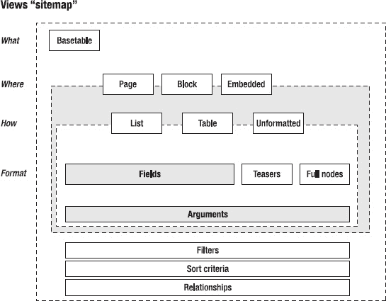

**图 32-1.** 视图模块的概念模型

### 感知

理解人类为何将某些事物视为前景而将其他视为背景，是设计优秀界面的基础。当环境刺激作用于感官时，我们开始讨论感知——即对这些刺激的解读。

> *“感知并非简单由刺激模式决定；它是对现有数据不断寻求最佳解释的动态过程。”*

>

> ——理查德·格雷戈里

自上而下的感知理论认为，感知处理是基于我们的知识、预期和思维建构而成的。而自下而上的感知处理则主要由物理元素驱动。

在 Drupal 6 的一次可用性测试中，有一段知名视频显示：一名参与者艰难地寻找着"创建内容"链接——这个链接始终显示在左侧菜单中，但用户在管理界面各处辗转后，仍花了 5 分钟才在屏幕上找到它。这清晰展现了预期和先验知识如何主导用户的视线方向，也暴露出 Drupal 未能突出展示内容管理系统中最重要链接的问题。

在设计时，我们必须牢记如何利用视觉焦点之外的感知——即所谓的周边视觉。当人们浏览页面时，会通过周边视觉识别许多对象。基于这一原则的设计意味着：将相关元素进行视觉分组，并降低次要功能在视觉上的重要性。

感知是心理学最古老的领域之一，为模块界面设计提供了丰富的理论和实用洞见。本文将仅涉及两个主题：格式塔理论（页面元素间的形态与和谐性）以及一些通用的色彩使用技巧。在思考形态与色彩时，以下特性决定了其意义：

- 形态

    - 线条方向

    - 线条长度

    - 线条宽度

    - 尺寸

    - 空间分组

- 色彩

    - 色调

    - 色度

    - 饱和度

    - 明度

理解感知在很大程度上是为了通过更符合逻辑的信息分组来管理界面复杂性。对于视图和规则这类模块而言，这些挑战尤为艰巨，会深刻影响模块的实用性、效率、效能、易学性和整体满意度。

#### 格式塔心理学

在查看界面时，我们不会将页面中不同元素的不同刺激视为独立个体，而是将其视为一个更大的整体。格式塔心理学专注于理解：人类如何将某些元素视为前景而将其他视为背景、如何区分不同形态、以及如何在形态间发现相似性。

库尔特·科夫卡、沃尔夫冈·克勒和马克斯·韦特海默在 1920-1940 年的研究引入了这一理念——将物体或环境的感知视为一个整体形态，其中包含前景部分和背景部分。格式塔感知被归纳为"完形律"，以下定律在 Drupal 环境中适用：

- 相似律

- 邻近律

我们将简要介绍每条定律及其在 Drupal 中的应用。这些定律通常有助于评估和优化模块的表单设计。

### 相似律

我们会将具有相似特征（如颜色、形状、方向、尺寸、空间等）的项目归为一组。当我们在图 32-2 中看到一排圆形位于方块区域中时，会将其感知为一行或一线，而非独立的圆形。

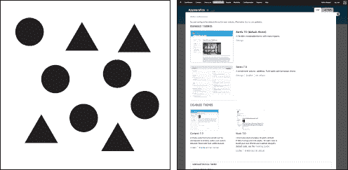

**图 32-2.** 活跃主题使用大图预览，非活跃主题使用小缩略图

这一模式在 Drupal 中常被用于区分不同项目，如图 32-2 右侧所示——通过尺寸对相似项目进行分组。这也是建筑和零售店中常用的"宏大"设计手法——通过重复相似部件营造宏伟感。

### 邻近律

如图 32-3 所示，常见的模式是将视觉元素彼此靠近放置。从心理学角度看，当看到两人站得很近时，我们会默认他们彼此相识。这一模式在互联网上随处可见，最典型的例子是 Flickr——其页面几乎所有元素都采用此模式，仅偶尔使用线条进行分隔。Drupal 也采用此模式，如图 32-3 所示。


**图 32-3.** 利用留白定义表单标签与表单元素之间的关系

我们在 Drupal 中广泛运用这一原则来布局各类列表页面，甚至在细节层面也通过留白来定义表单元素之间的关系。应用这一原则的关键在于：将页面视为整体，以引导视线的方式对页面元素进行分组。

这一基本定律经常被误用——要么留白过多，要么过少。正确应用的小技巧是：退后一步，将页面适当模糊处理后，你还能清晰看到页面上的分组吗？如果不行，你可能需要让分组更加明确，或减少分组数量。

### 色彩

色彩不仅能美化事物，还能赋予页面元素结构、吸引注意力并传达意义。“感知”部分已阐述了色彩如何增强页面元素的构成并帮助传达信息。描述色彩本身既复杂又令人困惑，因为我们常赋予“暗淡”或“明亮”等词语不同含义，尤其在像这样一本黑白印刷的书中。从技术角度来说，色彩通过**色相**、**色度**、**饱和度**和**亮度**来描述。

- **色相**指的是我们识别主色时的尝试。红色、绿色、蓝色和黄色被称为独特色相。

- **色度**是指色彩的纯度——即不含其他颜色的程度。例如，闪亮的深蓝色具有高色度，而紫色则具有中等色度。

- **饱和度**描述的是色彩随明暗变化的程度；更关键的是，它关乎给定色彩的强度——即为何一种颜色显得苍白而另一种却显得鲜艳。

- **亮度**是衡量色彩明亮程度的指标。

Drupal 的管理界面（Seven）谨慎使用色彩。这主要出于品牌和可用性考虑。我们力求在页面的实际表单交互中尽可能减少视觉干扰。另一项考虑因素是无障碍性，因为我们社会中相当一部分人存在某种形式的色觉障碍。Seven 使用了表 32-1 中描述的中性色。

***表 32-1.** Seven 的色彩*

| **Seven 的色彩** | **用途** |

| --- | --- |

| `#a6a7a2`（浅灰色） | 选项卡、选中的表格列标题 |

| `#e1e2dc`（浅灰色） | 表格标题背景 |
| `#0074bd`（蓝色） | 所有链接 |
| `#008800`（绿色） | 成功消息、已启用的模块 |
| `#b14400`（橙色） | 警告 |
| `#8c2e0b`（暗红色） | 错误提示 |
| `#b4d7f0`（浅蓝色） | 演示区块的背景 |

如表 32-1 所示，系统内置了多种色彩可供使用，绝大多数模块使用这些颜色即可满足需求。对于需要超出这些预设色彩的模块，需遵循以下几条原则。

#### 色彩和谐

在 Drupal 中，我们使用浅灰色，因为它不像蓝色、红色和绿色那样引人注目。选择色彩时，有多种色彩组合方式可供选择——从类似色（色轮上相近的色彩组合）到互补色（色轮上相对的色彩组合），再到不同色相和色度的色彩组合。

关键是要理解你希望着色的元素传达何种意义并吸引何种程度的注意力。尽管如此，请尽量限制新色彩的使用，因为色彩容易冲突，和谐感会被破坏，让用户困惑于这些色彩试图传达什么信息。

色彩理论是一门广阔的学科，我们在此仅触及基础。欲了解更多信息，我们推荐以下书籍：约翰内斯·伊滕的《色彩艺术：色彩的主观体验与客观理性》（John Wiley & Sons，1997 年）和维多利亚·芬蕾的《色彩：调色板的自然史》（Random House Trade Paperbacks，2003 年）。但最重要的是，这是一个需要实验的领域——通过精心选择的色彩来寻找和谐与意义。

### 实践

> *“理论上，理论和实践是一样的。实际上，它们不一样。”*
>
> ——尤吉·贝拉

那么，有了这些理论，如何将原则付诸实践呢？关键在于建立一个流程，在模块创建过程中将设计视为一项活动，而非最后一刻才做的事情。

这是构建良好 UI 的重要方面：愿意采取必要步骤，绘制草图、线框和模型，然后让一些用户进行测试。本节描述的流程适用于大多数数字项目，但我们将其具体应用于 Drupal。

我们坚信，如果我们想打造一个更引人入胜的 Drupal，使其贡献模块的用户体验与 Drupal 核心及彼此之间无缝衔接，那么设计在当前模块设计流程中所扮演的角色必须改变。

#### 流程

大多数 Drupal 模块服务于非常特定的需求，而这往往只是构建网站更大目标的一部分。设计行为主要关注两个部分：理解用户希望通过你的模块实现什么，以及他们如何通过你的 UI 以最佳方式实现这一目标。

设计流程关乎一个非常简单的理念：要获得好的设计，你需要探索各种可能性，并根据用户的反馈不断迭代。重要的是要认识到，你的模块通常是更大工作流程的一部分；因此，不打破现有的交互模式、不破坏流程是关键。

我们将描述以下流程：

- **概念：** 明确你要构建什么。
- **设计：** 勾画模块的界面和关系草图。
- **构建：** 构建用户界面，并对照核心交互模式进行检查。
- **优化：** 让用户进行测试，并根据测试结果进行优化。
- **发布：** 准备项目文件，以便在 `drupal.org` 上分享。

此流程可以根据你所处的周期阶段全面或部分应用；尽管如此，随着迭代的进行，每个步骤都会不时地被重新审视。在遵循流程的过程中，你会逐渐明白哪些活动能让你从程序员角色转变为设计师角色；这也能让你理解为何仅基于实现模型的设计往往无法满足用户需求。

设计活动关乎从全局视角看待你的模块所承担的角色及其如何融入整体。你的模块如何与其他模块协同使用？你正在为哪个任务流添加功能？用户可能在该流程的哪个环节使用它？如何以融合并提升用户体验的方式来实现？

在实践部分，你将把这个流程应用于 Rules 模块的管理界面。该模块的界面多年来不断发展，但在 Drupal 7 中进行了大规模改造，以更好地满足用户在其网站上的使用需求。与许多其他技术性更强的模块一样，其领域可能极其复杂。因此，用户界面必须处理大量数据和配置，才能真正发挥作用，使用户能够完成工作——这并非易事。

#### 挑战

设计良好的用户体验很困难。一旦你的 1.0 版本发布，模块就进入了一个新阶段：它将真正被他人使用。可能需要一些时间，但最终问题会出现在你的问题队列中。哎呀！发现了 bug。或者更糟：功能请求！

为像 Drupal 这样的模块化、可扩展且灵活的框架设计组件是一项艰巨的任务。让我们看看在 Drupal 生态系统中设计应用程序时可能遇到的一些主要挑战。

##### 专注于核心功能（学会说“不”）

随着模块的迭代，新功能很可能会不断加入。久而久之，模块最初的简洁性和专注性可能会丧失。这对任何软件项目都是威胁，尤其是在那些功能实际使用情况鲜有反馈的模块中——常见模块功能实际上往往只有该模块的维护者本人在使用。

正如我们在 Drupal 核心开发中所经历的，问题队列并非获取用户界面反馈的最佳场所。该队列中的人通常都是经验丰富得多的 Drupal 用户（事实上是专家级用户），并且愿意花时间真正撰写问题报告。这些用户通常不能反映普通用户的需求或用户界面方面的问题，因此，当你处理这些问题时，请在心里牢记这一点。

例如，如果我们仅仅依据问题队列中收到的反馈，那么 Drupal 7 最大的问题就会是权限页面，第二大问题则是模块页面。然而，从测试中我们了解到，大多数问题在于如何找到创建内容的方法以及究竟在哪里才能找到相应功能。因此，Drupal 7 在管理区新增了“添加内容”链接，对管理区进行了重组，并引入了用于编辑和配置的上下文链接；而模块页面和权限页面则要等到 Drupal 8 才能进行彻底改革。

如果某个功能请求偏离了你对模块的初衷，就要大胆地说“不”。有些模块通过为特定功能请求提供附加模块，或是在代码中提供该选项但不在用户界面中显示，来做到这一点。保持专注意味着你能够轻松交付模块的核心价值，并且你的界面将保持简洁，不会有令人分心的设置。

##### 如何做出明智的设计决策

很少有问题报告会以“在观察并与一位用户交谈后……”开头，因为这不是什么值得分享的激动人心的信息。但说到底，这才是最能让你做出明智决策的依据：即它如何影响用户。你如何知道你的目标受众是谁，以及中级用户想要达成什么目标？你如何深入了解你的用户，从而做出明智的设计决策？

最快、最好的方法就是与他们交谈，并观察他们使用你的模块。这看起来可能是个大动作，但通常你可以在身边找到能提供此类反馈的人。

在整个 Drupal 7 的设计过程中，我们经常与问题队列中的用户、当地技术聚会和会议的参与者，以及那些更新当地侦察网站的用户进行交流。从所有这些案例中，我们得以就更明智地做出设计决策，了解设计对用户、代码以及他们的协作工作产生的影响。

##### 在资源有限的情况下进行设计

在软件开发环境中，开发人员的数量远超设计人员是很常见的；在开源项目中，这种差距甚至更为悬殊。然而，要让你的设计奏效，你常常需要得到设计人员的反馈，以确保对齐方式、颜色使用以及页面上元素之间的关系等视觉提示达到平衡。

#### 概念：你到底在构建什么？

这主要是关于退一步，审视全局。为了帮助你设定项目范围并映射将使用它的不同受众，有两个首要问题：

- 你在构建什么？
- 谁会使用它（不包括你自己）？

这两个问题都可以快速界定，并在需要时进行扩展。实际上，将这两个问题的答案记录下来，可以为讨论后续开发奠定良好基础，并有助于与社区进行沟通。那么，回答“你在构建什么？”这个问题需要包含哪些内容呢？

这个答案并非主要体现在工具的功能特性上，而是要在稍抽象的层面上，着眼于该模块旨在支持的用户目标。这里的机会在于，将模块的技术能力与真实的用户需求联系起来。

“谁会使用它”这个问题，主要是关于以一种超越将用户简单划分为初级、中级和高级组别的方式来理解你的用户。研究人们的不同需求，并考虑你的模块将如何在更大的工作流程中被使用。

让我们以示例项目——规则模块（`drupal.org/project/rules`）为例，来看看这两个问题。规则模块允许站点管理员定义按条件执行的操作，这些操作可由站点或应用中发生的事件触发。例如，你可以创建一条规则，当新用户在站点注册时，自动向站点管理员发送一封电子邮件。电子商务网站也广泛应用规则：例如，计算运费或应用促销码以获得更低价格。

让我们尝试回答这两个有助于界定该工具概念的问题。

##### 规则模块：你在构建什么？

规则模块旨在为用户提供一套完整的工具集，用于在 Drupal 应用中定义业务逻辑。其预期范围非常广泛：规则模块的目标是成为在站点上定义和处理事件的主要、可扩展的平台。

图 32-4 中的概念模型解释了规则模块试图解决的普遍问题。

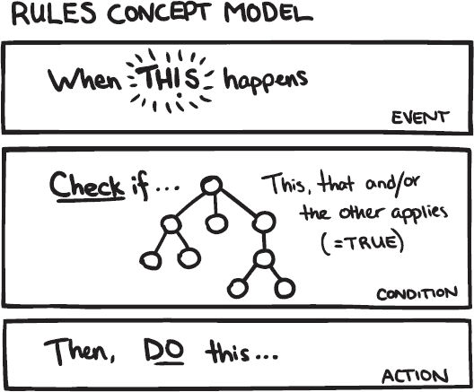

*图 32-4. 规则模块的概念模型*

##### 规则模块：谁会使用它？

规则模块的主要受众可以分为三类角色或人员：开发者、站点构建者和业务开发者。

他们使用规则模块的共同主要原因是：定义站点或应用的业务逻辑。开发者使用规则 API 来自定义系统工作流。站点构建者使用规则界面来定义站点上的不同交互如何触发其他事情。而有业务头脑的人则负责实施和改进订单处理及营销活动。

##### 设计

那么，你如何将这些关于你的项目及其受众的想法，转化为软件的实际界面呢？你可以通过草图探索多种思路，在线框图中优化最佳方案，并为最终选定的方案创建一个模拟图。

不要害怕糟糕的想法。自由地去探索吧。

### 获取创意：草图绘制

俗话说：“获得好创意的最佳途径就是拥有大量创意。”要打造优秀的设计，首先需要探索多种可能性。

在软件设计中，几乎普遍存在一个问题，那就是投入在探索多种可行方案上的时间和精力非常少。往往第一个设计就被直接选中，而它通常并非最优解。

从抽象层面来看，设计实践就是在两种对立的思维状态之间来回切换：发散性思维和收敛性思维，如图 32–5 所示。运用发散性思维时，你寻找多种思路和机会；而收敛性思维则是对这些思路进行评估，并决定舍弃哪些、深化哪些。

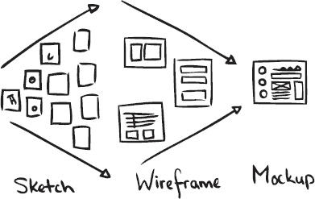

**图 32–5.** 展示从发散性思维到收敛性思维过程中设计交付物的流程

草图绘制可以通过任何媒介完成：纸笔、线框软件、图形软件，甚至代码。在探索设计方案时，你可以拿起铅笔，快速勾勒出界面可能的样子。关键在于暂时抛开技术限制，进行头脑风暴，思考在理想状态下它应该如何运作。不断探索，再探索。把这些（或许很烂的）想法从脑子里倒出来，快速记下，然后转向下一个想法。

在比尔·巴克斯顿（Bill Buxton）所著的《用户体验草图设计：正确设计与设计正确》（摩根·考夫曼出版社，2007 年）一书中，草图被定义为具备以下属性：

*   **快速**：绘制草图不需要太多时间。
*   **及时**：能够在需要时立即提供。
*   **廉价**：成本不应限制探索的可能性。
*   **可弃**：投入在于构思本身，而非呈现效果。
*   **丰富**：草图以系列或集合的形式出现效果最佳。
*   **清晰的语汇**：草图拥有独特的风格，易于识别。
*   **鲜明的笔触**：不是严谨精确，而是开放流畅。
*   **极简细节**：仅包含传达概念所必需的内容。
*   **适度的精炼程度**：精确度与项目实际所处的精炼阶段相匹配。
*   **建议与探索，而非确认**：不要规定解决方案，而是指明通向答案的途径。
*   **模糊性**：留有多种解读的空间。

你可能已经注意到，这个列表里并没有提到你必须画功了得。重点不在这里。也不在于你必须使用纸笔。草图也可以用代码来完成。关键是要专注于产生多种想法。工作到足以传达出想法的要点即可。截图或用其他方式记录下来，然后继续下一个想法。我们在示例中使用纸笔，是因为这是我们最习惯的方式。选择你顺手且能让你快速工作的工具。

反馈循环从这里开始。首先要将草图展示给他人，目的是获取更多想法，而不必急于区分好坏。如果别人提出了其他建议，就立刻把这些想法也草草画出来。

如果你选择自己缩小选择范围，务必以相对新鲜的眼光来审视你的想法。在草绘和筛选之间留出一些时间间隔。试着倒着看或从远处观察这些草图。

### 规则用户界面的草图绘制

我们来看一个规则模块的例子。如果探索规则界面，你会发现许多核心 UI 基础组件，如选项卡、表格和字段集都在发挥作用。但更引人注目的是，有几个地方刻意偏离了核心模式。有几个页面在一个页面上展示了多个表格。规则列表页面将活动规则和非活动规则分别放在各自的表格中。规则编辑页面则在一页内从上到下展示了不下三个表格。让我们追溯性地为这两种情况探索一些想法，并找出当初做出那些设计决策的原因。

### 规则列表页面

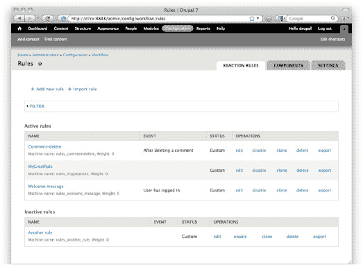

**图 32–6.** 规则列表页面截图。注意活动规则和非活动规则各自展示在独立的表格中

如图 32–6 所示，系统中的所有规则被分成两个表格：一个是所有活动规则的表格，其下方是另一个非活动规则的表格。这是区分两者的最佳方式吗？让我们尝试提出一些不同的处理方案，如图 32–7a 至 32–7g 所示。

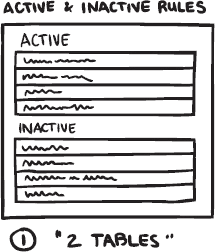

**图 32–7a.** 当前情况：一个活动规则表格和一个非活动规则表格

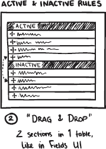

**图 32–7b.** 一个表格，底部为非活动部分。你可以通过拖放将规则移动到表格的相应区域，使其变为活动或非活动。这是在字段 UI 中使用的一种模式的变体，该交互用于在实体上显示或隐藏单个字段。

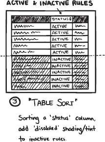

**图 32–7c.** 如果所有规则都放在一个表格中，并可以通过筛选仅显示活动或非活动规则，效果会如何？

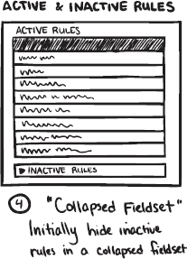

**图 32–7d.** 如果将非活动规则全部放入活动规则下方一个可折叠的字段集中，效果会如何？

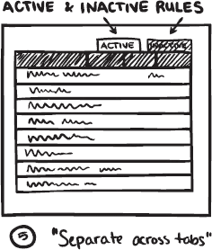

**图 32–7e.** 将它们分散到不同的选项卡中是否是一个可行的方案？

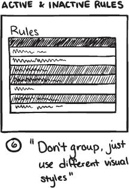

**图 32–7f.** 是否必须根据活动或非活动来分组规则？能否只对非活动规则采用不同的样式（如灰显）？

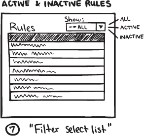

**图 32–7g.** 如果所有规则都放在一个表格中，并可以通过筛选仅显示活动或非活动规则，效果会如何？

如你所见，有些想法很容易被舍弃（如 32–7e 和 32–7f），但筛选方案（32–7g）和字段集方案（32–7d）看起来很有前景。筛选方案之所以可行，是因为界面上已经存在一个包含筛选选项的字段集。进一步的探索将着重研究如何通过设计来容纳这个活动/非活动筛选器。

另一种方案，即将所有非活动规则（放在一个表格中）置于一个可折叠的字段集内，看起来也不错，因为这使得它们在界面中不那么突出。可以合理地假设，当用户访问这个页面时，他们更频繁地是为了处理活动规则。让非活动规则占用更少的屏幕空间可以支持这种使用场景。这两种分组方式清晰地区分开来，从而更容易辨识。

从真实用户那里获取对页面概念的反馈。询问他们这如何契合他们的心智模型，向他们展示草图，并询问他们的看法。

对于真正复杂的问题，你可能需要十个或更多的构思草图，才能感觉对问题空间进行了充分的探索。对于不太复杂的场景，三个草图通常就足够了。但即便如此，你也有了可供选择的素材，这仍然让你领先一步，因为你现在可以做出明智的决定，确定将沿着哪条路线前进并继续深化探索。

你可能会问：具体怎么做？

### 线框图

线框图可用于多种目的：确定内容优先级、初步设计简报、验证需求、在上下文中评估文案撰写，或作为可用于可用性测试的纸质原型。这种多功能性也带来了对多个受众传达过多信息的风险。制作线框图时，要明确其目的并坚持下去。保持这种专注才能使其发挥最大效用。

制作线框图可以使用多种工具：纸笔、专用图表软件、绘图软件，甚至办公效率工具也具备在屏幕上绘制带标签方框的基本功能。与草图一样，使用何种媒介并不重要。数字创建的线框图可能更容易在线分享，因为你需要先扫描或拍摄纸笔绘制的图纸。

假设你想为一个`Drupal`管理页面制作线框图。根据你的草图，你已经选出了两三个似乎指向解决方案的想法。你已经缩小了选择范围。现在，是时候审视这些想法，并对每一个进行更详细的探索。

很有可能，到现在为止，你已经非常清楚需要做什么了，因为你的项目范围很小。

*   线框图是关于收集和安排所需的各个部分，其中“部分”指的是表单元素，“部分”的组合则是指交互模式（稍后会详细说明）。
*   使用`Seven`主题。它施加了有趣的限制，比如单列布局，并提供了一个可以扩展的漂亮基准线。其视觉语言是克制的。这留出了很大的实验空间。而你绝对应该去尝试。在贡献模块中，有许多复杂的界面是核心没有现成答案的。但是要让`Drupal`管理界面出彩，就要让它隐形。你也应该尊重这种克制，并对添加到视觉语言中的内容精挑细选。

#### 获取线框图的反馈

如前所述，明确线框图的目的并坚持下去非常重要。这在向没有背景信息（即你之前的工作流程）的其他人征求反馈时尤其重要。以最能服务于其目的的方式呈现线框图。无论你使用什么工具，确保包含以下元素以实现有效的可视化：

1.  **标题和描述。** 是的，这显而易见，但也容易被遗忘。如果不知道他们在看什么，人们将很难给出有意义的反馈。最好将标题直接添加到图形中。这样做可以确保线框图不依赖于周围的文本来进行这种基本的说明。
2.  **主要页面区域。** 对于一个网页，勾勒出页眉、页脚、内容区域和侧边栏。对于`Drupal`管理页面，为工具栏和快捷键添加一个方框。在其下方为面包屑导航、页面标题和选项卡再添加一个。你的模块不太可能更改这些区域的内容，但加入它们可以提供上下文。
3.  **高亮和注释** 属于你设计中的具体细节。在你想要高亮的部分旁边放一个数字。在线框图旁边的列中重复该数字，并简要描述该特定位置的情况。

现在，再次到了邀请他人对你的设计提出意见的时候了。

### 现实检验

用四种基本屏幕状态对设计进行压力测试：正常、空白、溢出和错误。所有这些屏幕状态最终都会出现，你应该为每一种状态进行设计。

#### 正常


**图 32–8.** 正常状态

`图 32–8` 展示了一个可管理的内容列表、少量标签以及具有适中链接数量的菜单。这很可能就是你的线框图已经描绘的状态。一切都很平均——没有极端情况。

#### 空白

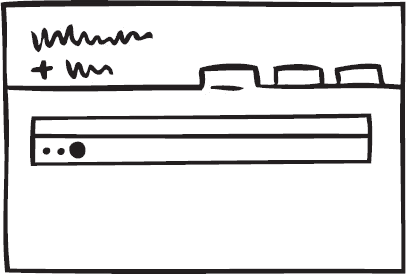

**图 32–9.** 空白状态

如果你的模块生成对象列表，你很可能会使用表格来展示这个列表。但如果没有可用的项目呢？一方面，这种情况非常少见。另一方面，大多数列表一开始都是空的。所以，虽然这种状态（`图 32–9`）并不经常发生，但可以肯定的是，它在非常重要的首次使用场景中会发生。`Drupal` 7 引入了一种标准的表格空白模式，你也应该实现它。

### 溢出

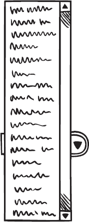

*图 32–10. 溢出选择列表状态*

“我启用了太多模块，导致`站点配置`下拉菜单超出了我的屏幕高度。”当你拥有 68,000 个内容条目时会发生什么？或者有 1429 个分类术语、500 万条评论，或是一个包含 63 个字段的内容类型？如果你的模块很可能会遇到这种情况（如`图 32–10`所示），那么用户界面将提供哪些工具来帮助用户管理如此大量的数据？搜索、排序、筛选？

### 错误

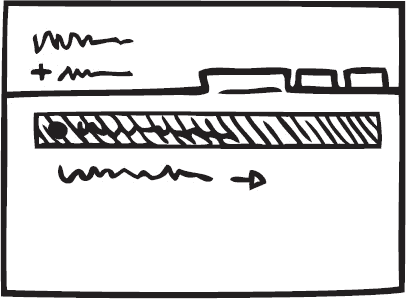

*图 32–11. 错误状态*

`图 32–11` 是一个你不想显示的屏幕。当然，最好的错误消息就是没有错误消息。不过，你仍然需要建设性地处理这种情况。`Drupal`提供了关于如何以及在哪里显示系统状态消息的基本模式。你将使用什么措辞来编写错误消息，以及如何引导用户解决问题？

这次审查将帮助你找到可能尚未考虑到的用户界面部分。根据需要修改你的线框图。必要时，草拟多个方案；注意不要简单地修补一下了事。

## 用于详细设计的静态模型

在线框图制作或审查设计时，你可能会遇到一些特别棘手的特定界面部分。也许你注意到，在测试时，人们很难找到某个特定的信息或功能。

那么，是时候将你的设计保真度再提升一个层次，并创建一些静态模型了。你已经通过绘制草图表提出了大概思路。然后你制作了线框图来细化各个屏幕。当你发现屏幕中的某个特定元素需要更详细的设计探索时，就该创建静态模型了。静态模型看起来与最终界面完全一样。你可以使用`Photoshop`或其他图像编辑软件制作它们。如果你已经有功能代码，那么使用`Firebug`插件或直接在模块代码中调整设计也完全可以，而且可能效率更高。

创建静态模型来仔细推敲细节，使设计完全准确。使用默认模式和样式可能让界面达到大约 80%的完成度。深入挖掘，完成最后 20%的细节是非常值得的。

## 构建：构建阿尔法版本并与用户验证

你已经确定了项目的范围和目标受众。你探索了屏幕布局的各种方案并选定了一个方向。是时候真正开始构建你的项目了。

你的目标是尽快获得一个可用的原型，这意味着要专注于只构建你想要实现的主要功能。如果你的项目包含多个屏幕，那么先让贯穿这些屏幕/状态的主要流程能够运行起来。着眼于大局；细节的填充留待以后。

为什么如此强调可用的原型？因为一个可工作的概念验证可以被其他人测试。如果人们无法实现你的项目想要支持的主要目标，那么所有你可能想要添加的漂亮小功能都是无用的。与其他人员一起验证。仅仅因为你已经对事物（应该）如何运作了解得太多，所以*你*并不是验证功能是否匹配用户目标的最佳人选。因为你已经了解，你已无法想象在不了解的情况下事物是如何被感知的。这被称为“知识的诅咒”，它是实现简洁性的障碍。你可能会觉得自己是在把事情简单化甚至过度简化。在大多数情况下，观察其他人使用你的应用会纠正这一点，并告诉你需要澄清说明。

所以，让基本功能运转起来，并观察其他人如何使用它。本章稍后会更多介绍如何通过简单的可用性测试获得最佳结果。

但是，假设你的项目已经处于大多数功能都按计划运行的状态。人们能够成功使用该界面来完成工作。那么，是时候进行一次你*可以*自己完成的检查了，即验证你的界面元素是否遵循核心惯例，这些惯例可以在 `drupal.org/ui-standards` 找到。

重要的是要认识到，当你在构建一个模块时，你的 UI 将会在核心模块和其他多个贡献模块的上下文中被看到。这就是一致性原则如此重要的原因：你几乎永远不会知道你的 UI 将出现在哪种确切的上下文中。那么最好的策略就是不要试图标新立异，而是尽最大努力融入其中。

## 优化：观察与新版迭代

一旦你的模块构建和设计完成，你应该对用户想要什么以及你的模块是否实现了这一点有了清晰的认识。最后阶段是根据实际情况优化你的模块。随着你的模块进入阿尔法阶段，你很可能会收到用户的反馈。

这个阿尔法阶段也是进行更彻底的可用性测试的最佳时机。任何可用性测试的主要目标都是为设计决策提供信息。

-   模块是否达到其目的？它有用吗？

-   它是否帮助人们实现他们更广泛的目标？

-   它是否高效、有效，甚至用起来令人愉悦？

本章将介绍进行定性可用性测试的一些基础知识，这种测试运行快速且适用于模块开发。我们遵循一个相当基础的流程来运行可用性测试：

-   制定测试计划。

-   招募参与者。

-   设置模块、录制和日志记录。

-   运行可用性测试。

-   分析结果。

-   报告问题。

-   制定测试计划。

测试计划是你的可用性测试蓝图，确保你充分准备测试，并能一致地运行每个单独的环节。但它也可以作为一种工具，说服他人你不是随便找用户测试一下，而是执行了一个经过深思熟虑的计划。

### 测试计划大纲

-   为什么进行测试？

-   你测试哪种类型的用户？

-   你如何进行测试？

-   方法

-   场景

-   任务

-   环境

-   分析方法

-   报告方法

这是一个非常基础的测试计划，它省略了你在大型站点上通常会做的许多细节工作。这里的想法是，你可以更频繁地重复这个测试计划，并且其他人可以通过对周围的参与者执行该计划来提供帮助。那么，让我们使用这个测试计划大纲来为 Rules 模块设置一个可用性测试。

### 为什么要测试 Rules 模块？

你进行测试是为了查明用户是否能够使用 Rules 2 界面设置一条规则。具体来说，你想了解：

-   模块的工作流程与用户的期望有多接近？

-   基本的事件、条件和动作关系是否清晰？

-   用户对他们的规则会被触发的信心有多大？

你进行测试还为了向社区提供材料，帮助人们在未来为这个模块的用户界面做出更好的设计决策。

### 你测试哪种类型的用户？

在概念阶段，你为这个模块确定了三个受众群体。现在你必须评估在这个阶段应该测试哪些用户以及测试多少人。

-   **开发者**：开发者可以提供有价值的见解，了解他们在界面中看到的流程是否符合他们的期望，尤其是当他们从实现模型的角度来看待这个问题时。

-   **站点构建者**：站点构建者能否设置一条规则，并且他是否有足够的信心认为这条规则能够成功执行？哪些触发因素可以帮助用户理解界面中所需的步骤？

-   **业务开发者（销售、内容策略师、店主）**：Rules 界面的引导性是否足够让他们理解需要采取哪些步骤？它是否符合他们的心智模型？

站点构建者和开发者受众应该很容易从你周围的人中招募，但最后一组人会困难得多，因为他们也只占你目标受众的一小部分。对于测试，请参考 表 32–2 中显示的分布。

**表 32–2.** *测试分布*

| **参与者类型** | **参与者人数** |
| --- | --- |
| 开发者 | 2 |
| 站点构建者 | 2 |
| 业务开发者 | 1 |
| **参与者总数** | **5** |

让我们避免招募熟悉 Rules 2 界面或 Rules 2 实现的参与者。

这些参与者将通过 Drupal.org 论坛、IRC 以及在你周围的人中招募。

### 你如何进行测试？

本次可用性测试将是一次探索性测试，要求每位用户使用 Rules 2 界面创建两条规则。测试过程将被录制并与社区分享。

#### 方法

你将进行五次独立的测试环节，每次大约持续 20 分钟。在此环节中，参与者将被要求执行两项任务。理想情况下，每个环节的场景和任务将根据参与者的背景进行调整。

测试主持人将介绍任务，并在适当时提问，同时做笔记并确保录像正常进行。

#### 场景

你正在为一家在线销售鞋子的小商店构建一个网上商店，你使用 Rules 在某种特定鞋子的订单超过 20 双时向商店管理层发送通知（以便检查商店库存），并在夏季促销期间为鞋子安排定期折扣。

#### 任务

1.  当用户超过三个月未访问网站时，向其发送促销邮件。

2.  从 6 月 1 日到 8 月 31 日，对所有鞋子提供 20% 的折扣。

#### 环境

你需要有一个至少包含 Carlos 牌鞋子的网上商店。这个网上商店系统需要利用 Rules；这可以使用像 Drupal Commerce 或 Ubercart 这样的电子商务系统来设置，或者使用带有鞋类内容类型价格字段的 Drupal 核心来设置。

由于你将录制每个环节，你需要一个视频录制工具。如果你进行远程测试，你还需要一个屏幕共享工具（参见 `remoteusability.com/tools/` 了解远程测试工具）。