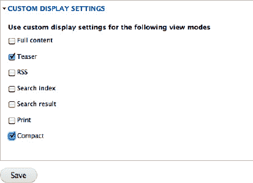
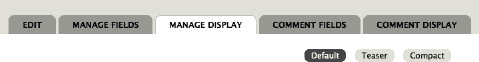
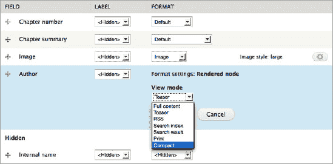
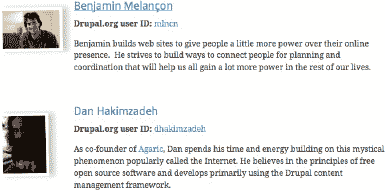
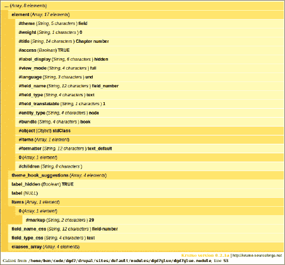

# 无用文案的成因

退一步看，是什么导致了`Drupal`及其贡献模块中出现如此多无用的文案？

* **不聚焦于当前任务**：用户总是严格以任务为中心。为了实现目标，他们知道页面只是其中一步；因此，只有在确实必要时才会阅读描述。

* **对用户的错误态度**：我们很少能看到那种听起来轻松且对用户充满信心的文字。相反，大量文本试图说教，并且假设用户不关心。从我们写“请注意”、“警告”等字眼的频率中就能看出这一点。对用户说教从来不是好事。

* **开发者文档渗透到用户界面**：描述常常试图解释技术概念，从界面中“节点”一词的使用，到解释某些性能选项的影响等等。

* **为糟糕的界面打补丁**：我们经常看到一些描述试图弥补难用的界面。当你发现自己不得不撰写描述来解释页面上的各个部分时，说明你创造了一个不流畅的交互。

* **不了解用户从何而来**：你的界面很少是他们进入`Drupal`后首先看到的内容，所以要思考他们从哪里来，要到哪里去。这将为你需要解释的内容划定界限。

* **措辞不够清晰**：界面中的文案应力求简洁。应当使用主动语态，去掉所有不必要的词语，以及那些本可以用简短词汇替代的长词。用“现在”代替“当前”之类的快速改进，有助于让你的写作更清晰。

当用户未能理解一段描述的含义时，他们通常会自责；他们会回头重读一遍，或者干脆无视继续操作。作为界面开发人员，你需要化身为作家，用极具清晰度和意义的方式遣词造句。反复修改你的文案，直到你想要表达的意思完全清楚为止。

就像好的设计一样，好的文案绝非偶然。它通常来自一个反复打磨、不断修改的过程。

## 原则

以下列出的原则是我们用于 Drupal 7 核心的原则。显然，写作时还需要应用更多原则，例如正确的拼写、语法和语气。

* **使用主动语态**：主动语态强调主语执行某个动作；被动语态则强调动作已完成。例如，"用户创建内容"（主动），"内容由用户创建"（被动）。此原则适用于 Drupal 中我们希望引导用户执行特定操作的大部分文本。

* **聚焦当前任务**：描述或标签应仅针对当前任务，不应涉及任何前置或后续任务。

* **清晰优先于精确**：程序员的天性是追求尽可能精确；但在文案撰写中，这通常意味着冗长、密集且非常复杂的句子。请始终将清晰置于精确之上。你的精确表述很可能无法被用户理解，而你最重要的观点也会被忽略。当你需要解释它如何影响不同使用场景时，最好引用文档说明。

在更技术性的模块（如 Drupal 7 的字段界面，它本质上是一个用于设置数据库表的接口）中，你会更频繁地遇到这个问题；其文案对于熟悉数据库概念并能有效使用的人而言足够精确。然而，这意味着任何不完全熟悉数据库概念的人都无法以易于理解的方式获取所需信息。

* **先砍掉 50%；再砍掉 50%**：在写作过程中，尤其是当你整合其他人的反馈时，很容易将文本扩充成一大段。许多作家使用的一个技巧是不断砍掉文本的大部分内容；这迫使你舍弃那些精心雕琢但未能传达含义的句子。关键在于不断评估文本中的每个单词是否都有其作用。你会惊讶地发现，仅仅通过通读并删减文本，就能大幅度改善界面。前面提到的"分类"页面经历了多次修订；在 Drupal 7 的生命周期中，它从内容过多，到内容过少（无法传达含义），再到恰到好处，历经多次变化。你可能需要将一句话重写三遍、四遍，甚至十遍才能写对；写对这句话将为许多模块用户节省大量时间。

* **仅在需要时添加描述**：这听起来显而易见，但在 Drupal 6 中，我们花了很大力气才移除所有那些描述要么是重复上面的标签，要么是几乎没有增加额外含义的地方。

如果你能在标签中增加两三个额外的单词，从而让描述变得多余，那最好这样做。我们强烈推荐模块维护者避免在表单中添加任何描述；这是一个好习惯，因为它意味着你的标签本身就足够具有描述性。

* **与核心术语保持一致**：Drupal 7 中应用了许多现有的文本模式，从我们标记菜单项、按钮和链接的方式，到单复数的正确使用方式。在编写界面文本时，请将你的工作与 Drupal 核心中的类似界面进行比较。这有助于你在术语和语气上保持一致性。

在 Drupal 核心中，我们还有一些避免使用的词汇，这些词汇列在表 32–4 中。

**表 32–4.** Drupal 核心中避免使用的词汇

| **不要用** | **请用** | **原因** |
| --- | --- | --- |
| Drupal | 站点 | 这会使发行版变得复杂。 |
| 请 | - | 听起来咄咄逼人；通常可以省略这个词。 |
| 我们 | 用户、管理员，明确指明某人 | "我们"常常无法明确说明适用于哪个用户，因此请具体指明受此影响的人。 |
| 节点 | 内容、单篇内容 | "节点"对用户来说是一个未知概念。 |
| 帖子 | 单篇内容 | "帖子"可用作动词；"帖子"可能与其他概念混淆。 |
| 输入格式 | 文本格式 | 词语"文本"能更好地触发用户的心理模型。 |
| 插件、扩展 | 模块 | 这些词可能有其他含义。 |

希望你现在已经准备好为用户体验进行设计，并帮助 Drupal 变得更好！

 提示 请访问 `dgd7.org/ux` 获取本章提及的资源链接（以及更多内容），并跟踪 Drupal 用户体验方面的持续发展。

## 第 33 章


## 完成一个站点：另外的 90%

**作者：Benjamin Melançon**

> *侯世达定律："即使你考虑了侯世达定律，它花费的时间总是比你预期的要长。"*

你已经构建了内容类型、视图、区块和菜单（如果还没有，请返回第 1 章）。你还做了更多类似的工作以及大量其他配置（参见第 8 章）。你制作了一个自定义主题（参见第 15 章和第 16 章）。这个站点毫无疑问已经完成了 90%。只不过最后的 10%很可能会花费你与之前投入相同的时间。完成一个站点通常意味着大量的反复调整和精益求精，直到所有功能和外观都达到完美。

如果这个站点具有高知名度，并且必须看起来很棒且易于使用，那就继续努力，直到像歌里唱的那样，"你"已经完成了所有需要完成的事情。

本章将涉及高级配置，但主要是使用粘合代码来为 `DefinitiveDrupal.org` 站点增添自定义功能和改进用户体验（粘合代码是指为满足特定站点需求而编写的主题函数或模块；有关此方法的完整介绍，请参见第五部分"后端开发"，特别是第 22 章）。你甚至将看到一个为该站点构建但已足够通用而贡献给 `drupal.org` 的衍生模块。

本章*不*涉及主题制作。关于完成站点的这一关键部分，请参见第 15 章和第 16 章，以及 `DefinitiveDrupal.org` 主题本身。Jacine Luisi 正在将该主题作为独立项目贡献给社区，其现成的生产版本也包含在站点的源代码中。请访问 `dgd7.org/theme` 和 `dgd7.org/code`。

 **注意** 与本章相关的在线资源和讨论请访问 `dgd7.org/other90`。

### 创建视图模式

视图模式（在 Drupal 6 中称为构建模式）在第 8 章中曾提及，它们根据上下文改变内容或其他站点实体的显示方式，这一功能依然强大。在`DefinitiveDrupal.org`上，作者简介的独立页面使用“完整内容”视图模式（该模式继承“默认”视图模式的显示设置），而作者列表视图之一则使用“摘要”视图模式。然而，当作者简介显示在章节内容中时，最好能有另一种更精简的作者简介内容显示方式。

这时就需要借助视图模式的魔力。代码清单 33–1 中的代码放在一个名为 `dgd7glue.module` 的模块文件中；该代码改编自 Benjamin Doherty 在佛罗里达 DrupalCamp 上所做的演示，随后发布在其 GitHub 账户 `github.com/bangpound/fldrupalcamp-demo` 上。第一个函数定义了一个视图模式；直觉上可能认为这需要实现 `hook_entity_info_alter()`，但一旦你掌握了方法，这并不困难。

**代码清单 33–1.** 为节点定义一个新的构建模式“紧凑”

```
<?php
/**
 * 实现 hook_entity_info_alter()。
 *
 * 为节点实体揭示新的视图模式。如果你在字段用户界面的“管理显示”屏幕上看不到你的视图模式，
 * 可能需要多次清除缓存或重建菜单，直到它出现。
 */
function dgd7glue_entity_info_alter(&$entity_info) {
  $entity_info['node']['view modes']['compact'] = array(
    'label' => t('Compact'),
    'custom settings' => FALSE,
  );
}

/**
 * 实现 hook_preprocess_node()。
 *
 * 专门为视图模式添加类和主题钩子建议。
 */
function dgd7glue_preprocess_node(&$vars) {
  $view_mode = $vars['view_mode'];
  $vars['classes_array'][] = 'node-' . $view_mode;
  $type = $vars['type'];
  $vars['theme_hook_suggestions'][] = 'node__' . $type . '__' . $view_mode;
}
```

第二个函数，`hook_preprocess_node()` 的实现，并不是使用视图模式的必要条件，但它是一个极佳的主题辅助工具。例如，向 `classes_array` 添加内容，使得 CSS 可以通过寻找 `node-compact` 类来定位使用“紧凑”视图模式显示的内容。向 `theme_hook_suggestions` 数组添加内容，则允许主题开发者复制 `node.tpl.php` 并重命名为例如 `node--profile--compact.tpl.php` 或 `node--article--teaser.tpl.php`，然后进行修改，这些修改仅影响以紧凑模式显示的简介内容或以摘要模式显示的文章内容。后面会介绍如何使用主题钩子建议为视图模式创建自定义模板。

 **注意** 由于 `hook_preprocess_node()` 也可以在主题的 `template.php` 文件中实现，因此为视图模式使用主题钩子建议的能力可能已经在那里添加了。

在编写或修改预处理函数时（如同在 Drupal 中的许多其他地方），你可以使用调试器或调试函数将输出打印到屏幕上。`hook_preprocess_node()` 可用的变量集通常太大，`debug()` 无法优雅处理，因此建议安装 Devel 模块并使用增强的 Krumo 调试输出函数，例如 `kpr()`。

在 `hook_preprocess_node()` 的实现中使用 `kpr($vars);` 会在你显示的每个节点上运行，因此不建议在模块中包含变量打印代码时查看节点列表。同时请记住，你需要安装并启用 Devel 模块才能使用 `kpr()`。预处理函数可以完成*很多*工作。作为规则，你在预处理函数中更改或添加的任何内容，都将在相应的主题函数或模板中可用。在 `hook_preprocess_node()` 的变量数组中添加的内容，例如 `$vars['current_time'] = date('Y M d H:m:s', time());`，将在 `node.tpl.php`（及其所有变体，包括 `node--article.tpl.php` 和现在可用的 `node--article--teaser.tpl.php`）中以 `$current_time` 的形式提供，可使用 `print $current_time;` 输出，对于渲染数组变量则使用 `print render($complex);`。你将在本章后面看到更多预处理函数的用法。

 **注意** 代码清单 33–1 中的代码需要放在名为 `dgd7glue.module` 的文件中，该文件应放在名为 `dgd7glue` 的文件夹中，该文件夹可以放在你网站的 `sites/all/modules/custom/` 目录下。然后你的自定义模块还需要一个 `.info` 文件，`dgd7glue.info`（见代码清单 33–2），它应与 `dgd7glue.module` 一同放在 `dgd7glue` 文件夹中。（如何制作模块在第 18 章至第 20 章中有详尽介绍，而创建站点特定模块的目的与本例相同，则在第 22 章中介绍。）

***代码清单 33–2.** `dgd7glue.info`*

```
name = DGD7 Glue Code
description = [dgd7glue] 针对 DefinitiveDrupal.org 的站点特定自定义代码。
package = Custom
version = 7.x-1.0
core = 7.x
```

 **注意** 版本指令仅包含在内，因为此站点特定代码不会托管在 `drupal.org` 上；对于贡献的代码，d.o 打包脚本会自动添加该行。

现在——在启用 DGD7glue 模块后，或者如果已启用，则清除缓存（很可能不止一次）——你可以访问某个内容类型的“管理显示”标签页，例如 管理  结构  内容类型  作者简介  管理显示 (`admin/structure/types/manage/profile/display`)，然后看到在折叠的表单集 **自定义显示设置** 中，有一个新的视图模式：紧凑（见图 33–1）。



***图 33–1.** 用于启用视图模式自定义显示设置的复选框，现在新增了“紧凑”选项*

 **提示** 如果你希望为新视图模式自动启用所有内容类型的自定义设置（就像摘要那样），可以在 `hook_entity_info_alter()` 实现中，将 `$entity_info['node']['view modes']['viewmodename']` 数组中的 `custom settings` 行改为 `'custom settings' => TRUE,`。使用这种方法，它可能一开始没有显示任何字段。



***图 33–2.** 在“管理显示”标签页中可见的新视图模式“紧凑”*

转到图 33–2 中所示的“紧凑”子标签页，并配置当使用紧凑视图模式时应显示的字段。你可以让它显示作者的头像（作为缩略图并链接到其内容）；将 `drupal.org` 用户 ID 显示为账户链接；以及简介文本，截断至仅 300 个字符。隐藏所有其他字段。

接下来，转到“章节”内容类型并管理其字段的显示。你也可以为其紧凑显示模式设置自定义设置，但当前的目标是让它的节点引用“作者”字段使用紧凑视图模式来显示作者简介。对于“作者”字段，格式选项可能是一个下拉菜单，包含“标题（链接）”、“标题（无链接）”、“渲染节点”和“<隐藏>”。选择“渲染节点”，然后点击下拉菜单右侧的齿轮图标，为“作者”字段的渲染节点配置设置。在这里你可以选择“紧凑”作为视图模式（见图 33–3）。



***图 33–3.** 在章节内容上显示作者简介时使用紧凑视图模式。这是通过“章节”内容类型在其默认视图模式的“管理显示”页面中设置的。*

下一节将介绍如何为主题化你的视图模式。

### 创建自定义主题模板

为自己定义的模板钩子建议创建自定义模板文件的过程，与为核心提供的模板建议创建自定义模板文件完全相同。许多建议（例如基于内容类型的建议）都是内置的。要为所有作者个人资料使用自定义模板文件，你需要在主题中创建一个 `node--profile.tpl.php` 文件（其中 *profile* 是作者个人资料内容类型的机器名称）。下面，你将对你创建的、同时识别内容类型和显示模式的模板钩子建议执行相同操作。

1. 确保你的自定义主题文件夹（或主题文件夹内的 `templates` 子目录）中有一个 `node.tpl.php` 文件。除非你的主题中包含基础模板的版本，否则 Drupal 无法识别你的模板变体。

2. 复制此 `node.tpl.php` 文件，使其匹配你想要使用自定义模板的模板建议模式。对于之前定义的模板钩子建议，该模式为 `node__content_type__view_mode`。在模板文件中，下划线会替换为短横线，因此它看起来像 `node--content-type--view-mode.tpl.php`。对于采用紧凑显示模式的作者个人资料，这将是 `node--profile--compact.tpl.php`。

3. 修改此文件以满足你的主题需求。

 **注意** 在 Drupal 7 中，你需要使用两个短横线（或函数中的下划线）来分隔建议的每个部分。在 Drupal 6 中，你只需要一个——正如你从 `node--content-type--view-mode.tpl.php` 示例中可能猜到的那样。使用两个短横线可以避免在处理机器名称中包含下划线的内容类型时产生混淆。

`代码清单 33–3` 展示了修改后的节点模板文件（你可以在源代码中查看原始文件，即你复制的 `node.tpl.php`，以及 `api.drupal.org/api/modules--node--node.tpl.php`）。如前所述，该文件是 `node--profile--compact.tpl.php`。在你的主题中，它位于 `templates` 文件夹内。前三行是关于如何了解可用变量的方法；在用于正式站点之前应将其删除。

 **警告** `代码清单 33–3` 中的代码使用了 Devel 模块提供的一个函数——如果你还没有下载并启用该模块，则需要执行此操作，或者使用 Drupal 核心函数（如 `debug()`）或 PHP 函数（如 `print_r()`）替代。Devel 的 `dpm()` 和核心的 `debug()` 都会将输出发送到 Drupal 的消息区域；Devel 的 `kpr()` 和 PHP 的 `print_r()` 默认直接在其所在位置打印输出，这适用于模板文件和预处理函数。

**代码清单 33–3.** 以紧凑显示模式展示作者个人资料的自定义节点模板

```
<?php
  kpr($content);
?>
<div id="node-<?php print $node->nid; ?>" class="<?php print $classes; ?> clearfix"<?php print $attributes; ?>>
  <?php print render($content['field_image']); ?>
  <div class="author-info">
    <h3<?php print $title_attributes; ?>><a href="<?php print $node_url; ?>"><?php print $title; ?></a></h3>

    <?php
      // 我们隐藏评论和链接。应该没有任何评论和链接。
      hide($content['comments']);
      hide($content['links']);
      print render($content);
    ?>
  </div>
</div>
```

此模板移除并重新排列了一些标记，并添加了一个 `div`，但它所做的最重要的事情是使用 `print render($content['field_image']);` 这一行在节点标题（作者姓名）之前打印作者头像。请注意，当使用 `render()` 打印其余内容时，图像不会再次打印。所有这些内容将在第 15 章和第 16 章中解释。

`代码清单 33–3` 中的模板生成的 HTML 与 `代码清单 33–4` 中显示的配套 CSS 配合使用，该 CSS 主要通过 Firebug 实验开发而成（参见 `getfirebug.com`）。

**代码清单 33–4.** 主题目录中 style.css 的补充内容，利用新的显示模式和自定义模板对紧凑作者个人资料进行主题化

```
/**
 * 紧凑作者个人资料。
 */
.node-compact .field {
  padding: 0;
}

.node-compact .field-name-field-image {
  position: absolute;
}

.node-compact .author-info {
  margin-left: 130px;
}
```

绝对定位之所以有效，是因为 `.node` div 已被定义为 `position: relative`。总的来说，这使得页面看起来相当不错，如图 33–4 所示。



**图 33–4.** 附加到章节的两个作者个人资料，采用紧凑显示模式和 CSS 样式

 **提示** 创建模板文件永远不应该是你的首选；随着情况变化，它们最难维护。其他方法，例如通过 CSS 设置样式、通过 Drupal 用户界面进行配置以及操作预处理函数中的变量，通常可以为你提供所需的所有灵活性。

请记住，仅使用 CSS（尤其是当显示模式添加到节点主体类时）就可以实现很多效果，然后通过预处理函数甚至可以更进一步，而无需创建节点模板，因为当对内容类型进行更改时，维护节点模板可能需要大量工作。正如第 15 章和第 16 章所述，虽然你可以实现 `theme_node__suggestion()` 或 `node--suggestion.tpl.php`，但没有与这些等效的 `hook_preprocess_node__suggestion`。相反，你可以使用 `hook_preprocess_node()` 实现中提供的众多变量来检查一个或两个变量的值，例如内容类型（在 `$vars['type']` 中）或显示模式（在 `$vars['view_mode']` 中），以决定是否要修改任何其他变量。（注意：`$vars` 可以是 `$variables` 或你在实现 `hook_preprocess_node()` 时放在括号中的任何内容，并且还要注意，所有这些同样适用于 `hook_preprocess_page()`、`hook_preprocess_comment()` 等。这些钩子可以在模块或主题中使用，并在第 15 章和第 16 章中进行了介绍。）

 **注意** `代码清单 33–3` 中的模板看起来很简洁，并且适用于你的目的，但是当 Drupal 打印它时，会分别为 `field`、`field-items` 和 `field-item` 生成一个 `div`。这对于一致性非常有利：无论是一个单值字段还是包含五十个项目的字段，都将应用相同的 CSS。如果这影响了你的审美或干扰了你的设计，你可以更改围绕字段的输出。采用与在 `hook_preprocess_node()` 中提供模板钩子建议直接类似的方法，你可以通过实现 `hook_preprocess_field()` 为字段提供模板钩子建议。参见 `dgd7.org/222`。

### 修改章节编号字段的显示

如前所述，您还可以在字段输出前使用预处理函数来修改它们。章节编号/附录字母字段被设定为只能接受两个字符。目前 Drupal 不允许调整文本字段的尺寸（尽管某些模块可以覆盖此限制，甚至可能安全地做到；请参阅 `dgd7.org/226`），因此您必须提供一个代码解决方案，而原本或许可以让用户直接输入诸如“第 1 章”之类的内容。好消息是，当然有可能实现一个优雅的代码解决方案。

按照惯例，您可以首先查阅相关的 API 函数（例如 `template_preprocess_field()`），并且最有效的方法是，在继续使用同一自定义模块的同时，打印出您的 `hook_preprocess_HOOK()` 实现（此例中为 `dgd7glue_preprocess_field()`）中可用的变量。

 **注意** 各种预处理钩子被视为 `hook_process_HOOK()`（请参阅 `api.drupal.org/hook_process_HOOK`）的特殊情况，并且目前没有其独立的 API 文档。

您也可以在主题的 `template.php` 文件中实现预处理钩子；使用您的主题名作为前缀，而不是模块名（请参阅列表 33-5）。

**列表 33-5.** 使用 Krumo 显示 `hook_preprocess_field()` 实现中所有可用数据

```
function dgd7glue_preprocess_field(&$vars) {
  kpr($vars);
}
```

 **提示** 使用 Drupal 消息系统进行调试的函数（包括 `debug()` 和 Devel 模块的 `dpm()`），在预处理函数内部运行时，其功能可能不一致。在页面构建、渲染和主题化周期中，此时直接从这些函数打印输出是可行的，因此对于小型数组使用 `print_r()`，对于大型数组和对象使用 `krumo()`（需启用 Devel 模块）效果很好。列表 33-5 中展示的 `kpr()` 函数将对数组使用 `krumo`，并以标量形式打印变量。

通过`krumo`（即 Devel 模块的`kpr()`），您可以看到给定字段的变量以一种高度可读的结构呈现。它一开始会折叠所有子数组和子对象；您可以单击展开感兴趣的部分。在图 33-5 中，`element`变量被展开；您可以看到它提供了非常有用的信息，例如`#field_name`中的字段名、`#view_mode`中的视图模式，以及`#bundle`中的内容类型。`element`变量是为渲染 API 层设计的（请参阅附录 C），它只是在预处理过程所在的主题化层面的信息，但这些信息非常有用。

其余变量是您可以在预处理函数中更改的；特别是完全展开的`items`，您可以在此处更改字段输出的值，当前值为`29`。`items`的多层数组嵌套在代码中对应于`$vars['items'][0]['#markup']`。



**图 33-5.** Krumo 输出，即查看一个包含“数字”字段的节点页面时，为`hook_preprocess_field()`的实现调用`kpr($vars);`的结果。

我会再次提及这一点，因为它将为您节省大量猜测修改为何不生效的时间。用于决定何时以及如何采取行动的可读信息位于`element`变量中；而您可以修改以影响字段显示的数据位于`items`和其他变量中。

 **易错点** `element`数组中的任何值都不会产生效果。只有`$vars['items'][0]['#markup']`能改变字段输出的值（针对字段的第一个值；第二个值将位于索引 1 而非 0 的位置）。如果不在这里读到，我不知道您如何能知道这一点。我当初就是花了几个小时琢磨为什么修改诸如`$vars['element']['#items'][0]['safe_value']`这样的变量毫无效果。请参阅`dgd7.org/225`，了解那段有趣旅程的一些摘录。

综合这些信息，您可以编写预处理函数的代码，来检查是否是您关心的字段和内容类型（bundle），为数字打印“第”，为字母打印“附录”，并进一步检查视图模式，以便在紧凑视图模式下打印更短的文本。

列表 33-6 中代码的最终结果是：在查看本章节节点时（位于`dgd7.org/other90`），打印**第 33 章**而不是**33**；在查看附录 C 时（位于`dgd7.org/render`），打印**附录 C**而不是 C；并且在紧凑列表（如`dgd7.org/chapters`）中显示时，则打印**Ch 33**和**App C**。

**列表 33-6.** 实现`hook_preprocess_field()`，将数字或字母分别转换为文本“Chapter [number]”或“Appendix [letter]”，并对紧凑视图模式使用简短形式

```
/**
 * 实现 hook_preprocess_field()。
 */
function dgd7glue_preprocess_field(&$vars) {
  if ($vars['element']['#field_name'] == 'field_number'
      && $vars['element']['#bundle'] == 'book') {
    $v = $vars['items'][0]['#markup'];
    if (is_numeric($v)) {
      if ($vars['element']['#view_mode'] == 'compact') {
        $v = t('Ch !n', array('!n' => $v),
          array('context' => '第（Chapter 的缩写）'));
      }
      else {
        $v = t('Chapter !n', array('!n' => $v));
      }
    }
    else {
      // 不是数字，因此是附录。
      if ($vars['element']['#view_mode'] == 'compact') {
        $v = t('App !n', array('!n' => $v),
          array('context' => '附录（Appendix 的缩写）'));
      }
      else {
        $v = t('Appendix !n', array('!n' => $v));
      }
    }
    $vars['items'][0]['#markup'] = $v;
  }
}
```

作为编码者，您可以通过预处理函数完全控制字段输出。也可以通过对字段格式化器进行编码，为网站管理员提供更改字段显示方式的能力，这将在下一部分介绍。