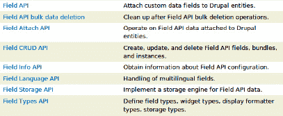
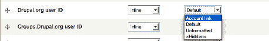

# 使用字段格式化程序链接到 Drupal.org 和 Twitter 账户

正如第 8 章中所构建的，作者个人资料包含了用于连接到其他特定网站的字段：一个 `drupal.org` ID、一个 `groups.drupal.org` ID 以及一个 Twitter 用户名。前两个 ID 被设置为整数字段，而用户名则被设置为纯文本字段。将这些数据转换为可读（且可点击）链接的任务被推迟到了这里进行。幸运的是，制作字段格式化程序是件有趣的事。

你已经见过格式化程序的实际应用，例如，在选择文本字段应显示为默认、纯文本或修剪格式时。要制作你自己的格式化程序，你可以直接查看 Drupal 自身的代码，或者在 `api.drupal.org` 上寻找答案。这次我们选择后者，访问 `api.drupal.org` 并点击“主题”链接，你会进入 `api.drupal.org/api/drupal/groups/7`，这是一个包含了大量已分组内容的列表——大约有两页之多——但 Field API 就在第一页。实际上，Field API 以某种形式被列出了八次（参见图 33–6）。



***图 33–6.** `api.drupal.org` 上列出的 Field API 主题*

第一个列出的“Field API”链接到所有其他 Field API 主题（在提供了大量关于字段的背景信息之后）。但正是最后一个列出的“Field Types API”才是你真正需要的：“定义字段类型、小部件类型、*显示格式化程序类型*、存储类型”（着重号为后加）。点击进入 `api.drupal.org/api/group/field_types`（这是可用的最短 URL；你会被重定向到长版本 URL），在钩子列表的底部，有两个被特别文档化了：

> *字段类型 API 还定义了两种可插入的处理程序：小部件和格式化程序，它们分别指定了字段在编辑表单[小部件]和显示实体[格式化程序]中的外观。小部件和格式化程序可以由字段类型模块为其自身的字段类型实现，也可以由第三方模块实现以扩展现有字段类型的行为。*

你可以通过一个模块来扩展现有字段类型的行为。所引用的钩子是 `hook_field_formatter_info()`，定义在 `api.drupal.org/hook_field_formatter_info`，并且它还提供了示例代码！你可以修改函数名中的模块名部分以及一些其他细节，并将其添加到胶水模块中（见代码清单 33–7）。

***代码清单 33–7.** `dgd7glue.module` 中 `hook_field_formatter_info()` 的基本实现*

```
/**
 * 实现 hook_field_formatter_info()。
 */
function dgd7glue_field_formatter_info() {
  return array(
    'dgd7glue_number_account_link' => array(
      'label' => t('账户链接'),
      'field types' => array('number_integer'),
    ),
    'dgd7glue_text_account_link' => array(
      'label' => t('账户链接'),
      'field types' => array('text'),
    ),
  );
}
```

清除缓存，然后访问一个包含文本或整数字段的字段显示管理页面，例如管理  结构  内容类型  作者个人资料  管理显示 (`admin/structure/types/manage/profile/display`) 下作者个人资料内容类型的“管理显示”页面，你会看到文本和整数字段的格式化程序选项中多了一个**账户链接**选项。目前它还没有任何功能，但它已经显示出来了！参见图 33–7。



***图 33–7.** 整数字段的账户链接格式化程序选项*

如果你正在定义的两个格式化程序需要可配置，那么它们就需要一些设置。你可以从 Drupal 核心提供的文本和整数字段中获取格式化程序设置的示例。整数字段类型在数字模块中定义，该模块位于字段模块内部；数字模块的主文件位于 `modules/field/modules/number/number.module`。文本模块也位于字段模块内部。这两个模块定义的内容远不止格式化程序，但你只对其中各种格式化程序函数感兴趣：`hook_field_formatter_*()` 的实现——包括 `info`、`settings_form`、`settings_summary` 和 `view`。

 **注意** 你可以使用 `hook_field_formatter_info_alter()` 为现有的文本和整数字段格式化程序添加设置，但要在字段数据周围添加链接需要其自身的格式化程序视图，因此需要一个新的格式化程序。

要向字段显示表单添加设置表单和设置摘要，你首先需要在你的 `hook_field_formatter_info()` 实现中添加默认设置；见代码清单 33–8。

***代码清单 33–8.** 为整数和文本字段的自定义账户链接格式化程序添加默认设置*

```
/**
 * 实现 hook_field_formatter_info()。
 */
function dgd7glue_field_formatter_info() {
  return array(
    'dgd7glue_number_account_link' => array(
      'label' => t('账户链接'),
      'field types' => array('number_integer'),
      'settings' => array('web_site' => 'drupal_org'),
    ),
    'dgd7glue_text_account_link' => array(
      'label' => t('账户链接'),
      'field types' => array('text'),
      'settings' => array('web_site' => 'twitter_com'),
    ),
  );
}
```

这提供了默认值，但管理员还没有办法更改这些默认值。你需要一个带选择列表的设置表单——一个具有预定义选项的表单元素。数字模块的字段格式化程序设置表单钩子实现中有一个选择列表元素，你可以从中借鉴（`api.drupal.org/number_field_formatter_settings_form`）。对于数字账户字段，此选择列表中的选项将是 `drupal.org` 和 `groups.drupal.org`；对于文本账户字段，选项则是 `twitter.com` 和 `identi.ca`。代码清单 33–9 中的代码借鉴了数字表单结构和选择列表，并通过添加一个 `if` 语句，根据是数字字段的格式化程序还是文本字段的格式化程序来提供不同的选项。选择选项本身则被移到了辅助函数中。

***代码清单 33–9.** 文本和整数字段的账户链接格式化程序设置表单*

```
/**
 * 实现 hook_field_formatter_settings_form()。
 */
function dgd7glue_field_formatter_settings_form($field, $instance, $view_mode, $form, &$form_state) {
  $element = array();

  $display = $instance['display'][$view_mode];
  $settings = $display['settings'];

  if ($display['type'] == 'dgd7glue_number_account_link') {
    $options = _dgd7glue_number_account_link_options();
  }
  else {
    // 字段类型为 dgd7glue_text_account_link。
    $options = _dgd7glue_text_account_link_options();
  }

  $element['web_site'] = array(
    '#title' => t('网站或服务'),
    '#type' => 'select',
    '#options' => $options,
    '#default_value' => $settings['web_site'],
    '#required' => TRUE,
  );

  return $element;
}

/**
 * 为整数字段提供账户链接格式化程序选项。
 */
function _dgd7glue_number_account_link_options() {
  return array(
    'drupal_org' => t('Drupal.org'),
    'groups_drupal_org' => t('Groups.Drupal.org'),
  );
}

/**
 * 为文本字段提供账户链接格式化程序选项。
 */
function _dgd7glue_text_account_link_options() {
  return array(
    'twitter_com' => t('Twitter.com'),
    'identi_ca' => t('Identi.ca'),
  );
}
```


好的，作为一名高级文档工程师和翻译员，我将严格遵循您的注意事项和示例格式，为您提供以下中文翻译。


```markdown
# Drupal 的 Field API 设置摘要

Drupal 的 Field API 要求您提供所选设置的摘要。与其再次以数字字段为例，不如说明需要指出选择了哪个选项，这更接近于 `text.module` 的简单单行摘要（`api.drupal.org/text_field_formatter_settings_summary`）；请参见代码清单 33–10。

**代码清单 33–10. 所选设置的摘要**

```
/**
 * 实现 hook_field_formatter_settings_summary()。
 */
function dgd7glue_field_formatter_settings_summary($field, $instance, $view_mode) {
  $summary = '';

  $display = $instance['display'][$view_mode];
  $settings = $display['settings'];

  if ($display['type'] == 'dgd7glue_number_account_link') {
    $options = _dgd7glue_number_account_link_options();
  }
  else {
    // 字段类型为 dgd7glue_text_account_link。
    $options = _dgd7glue_text_account_link_options();
  }

  $summary .= t('网站') . ': ' . $options[$settings['web_site']];

  return $summary;
}
```

返回作者资料管理字段显示页面，为 Drupal ID 字段选择“账户链接”，并确认 `drupal.org` 和 `Groups.Drupal.org` 选项已经出现，以此来测试上述功能是否生效。

 **注意：** 如果未同时定义设置摘要钩子，则不会显示设置表单链接（齿轮图标）。

代码清单 33–9 和 33–10 的初稿并没有为格式化器选项提供辅助函数。意识到 `dgd7glue_field_formatter_settings_form()` 和 `dgd7glue_field_formatter_settings_summary()` 都应该使用选项的显示友好版本（例如，用 `'Drupal.org'` 代替 `'drupal_org'`），因此我们重构了代码，将选项放在它们各自的函数中。这样，设置表单函数和设置摘要函数都可以调用它们。（在代码中的两个地方重复信息是不好的做法；当需要修改某些内容时，您或下一个开发者很可能会漏掉其中一个地方。）事后看来，或许一个收集选项的辅助函数（而不是两个）会更简洁，并在其内部根据字段格式化器类型执行 `if` 或 `switch` 语句。然而，自定义代码的重点在于以一种可维护的方式在您的网站上执行有效且特定的操作，而不是为了追求优雅而无休止地重构。

## 实现 `hook_field_formatter_view()`

下一步是实现 `hook_field_formatter_view()`。在开发过程中，您可能希望查看调试器，或者在 `dgd7glue_field_formatter_view()` 中抛出一个 `debug($items)`，以准确地了解它接收到的项是什么，如代码清单 33–11 所示。

**代码清单 33–11. 用于调查传入内容的 `hook_field_formatter_view()` 实现**

```
/**
 * 实现 hook_field_formatter_view()。
 */
function dgd7glue_field_formatter_view($entity_type, $entity, $field, $instance, $langcode,
 $items, $display) {
  foreach ($items as $delta => $item) {
    debug($item);
  }
}
```

现在，查看一个对 `drupal.org` ID 和 Twitter 账户都有值的作者资料页面，结果会输出到屏幕上。对于前者，一个数字字段：

```
array (
  'value' => '64383',
)
```

对于后者，一个文本字段项：

```
array (
  'value' => 'mlncn',
  'format' => NULL,
  'safe_value' => 'mlncn',
)
```

知道了传入 `dgd7_field_formatter_view()` 的项的结构，并且了解您刚刚定义的显示设置表单的结构，您就可以编写一个将两者结合起来的函数。

 **注意：** 如果您需要检查变量 `$display` 的结构，可以在调试器（参见 `dgd7.org/ide`）中查看，或者像上面处理 `$item` 那样，使用 `debug()` 输出。

代码清单 33–12 中的函数使用了一个 `switch` 语句来根据网站设置分配基础 URL（例如，对于 `drupal.org` 指定的字段，使用 [`http://drupal.org/`](http://drupal.org/)），并使用另一个 `switch` 语句来正确设置访问字段值的键。如上所示，`'value'` 是整数字段唯一可用的属性。这是因为经过验证的整数字段本质上是安全的。Drupal 为文本字段提供了 `'safe_value'` 属性，因为您需要一个经过清理的版本来安全地打印它。用户输入的字符串可能包含恶意的 JavaScript 代码。

**代码清单 33–12. 将账户 ID 显示为链接的 `hook_field_formatter_view()` 实现**

```
/**
 * 实现 hook_field_formatter_view()。
 */
function dgd7glue_field_formatter_view($entity_type, $entity, $field, $instance, $langcode,
 $items, $display) {
  $element = array();

  // 允许定义一个函数来获取账户链接标题。
  $title_callback = NULL;
  $item_key = 'safe_value';

  // 通常，视图格式化器会根据显示类型进行切换，但对于 dgd7glue 定义的
  // 账户链接格式化器，重要的是网站。
  switch ($display['settings']['web_site']) {
    case 'drupal_org':
      $href = 'http://drupal.org/user/';
      $title_callback = 'dgd7glue_drupal_page_title';
      break;
    case 'groups_drupal_org':
      $href = 'http://groups.drupal.org/user/';
      $title_callback = 'dgd7glue_drupal_page_title';
      break;
    case 'twitter_com':
      $href = 'http://twitter.com/';
      break;
    case 'identi_ca':
      $href = 'http://identi.ca/';
      break;
  }

  switch ($display['type']) {
    case 'dgd7glue_number_account_link':
      $item_key = 'value';
      break;
    default:
      $item_key = 'safe_value';
  }

  foreach ($items as $delta => $item) {
    if ($title_callback) {
      $title = $title_callback($item[$item_key], $href);
    }
    else {
      $title = $item[$item_key];
    }
    $href = $href .= $item[$item_key];
    $element[$delta] = array(
       '#type' => 'link',
       '#title' => $title,
       '#href' => $href,
     );
  }

  return $element;
}

/**
 * 获取 Drupal 站点上页面的标题。
 *
 * dgd7glue_field_formatter_view() 中账户链接标题的回调函数。
 */
function dgd7glue_drupal_page_title($account_id, $href) {
  return $account_id;
}
```

上面的第一个 `switch` 语句根据字段显示设置中设置的网站提供了 URL 的基础部分，并可选地提供了一个标题回调函数来生成链接的文本部分。最后的那个函数 `dgd7glue_drupal_page_title()` 提供了这个回调。然而，如图所示，它只是一个占位符：它并没有执行您真正想让它做的事情。在下一节中，您将修改它，以便从 `drupal.org` 和 `groups.drupal.org` 的个人资料页面获取作者的用户名。

主函数以一个 `foreach()` 语句（用于处理字段允许多个值的情况）结束，该语句构建要作为可渲染数组返回的元素。通过将 `'#type'` 设置为 `'link'`，Drupal 就知道要创建一个链接。（如附录 C 所述，返回渲染数组而不是 HTML 字符串，可以让其他 Drupal 模块和主题有机会进行修改，例如添加一个 class 或 target 属性。）
```


