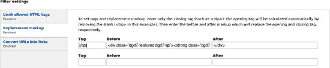

# 正则表达式

看着一个正则表达式——以及围绕这个正则表达式的代码——可能会让你感觉仿佛面对着难以理解的事物。也许你看过的许多其他代码早已给你这种感觉。在不理解的情况下使用某样东西并非理想的方法，但你不可能一下子就成为所有方面的专家。要作为一名开发者成功实践，你必须不断拓展自己的知识边界。随着使用而来的是熟悉。随着熟悉可能带来理解，如果未能理解，那么你应当意识到，对于你多次使用的东西，应该投入更多精力去研究和理解。本小节采用“先使用后理解”的方法，但首先请赋予自己自由实验的能力。

## 创建你自己的 `test.php` 文件

制作你自己的测试脚本，以便在 Drupal 环境中快速测试代码。创建一个名为 `test.php` 或你喜欢的任何名称的文件，并将其保存在与 `index.php` 相同的文件夹中。使用 `index.php` 的前三行代码，你就拥有了一个完全启动的 Drupal，你可以用它来测试各种代码，这比通过菜单系统设置页面要快得多。

这是一个打印 Drupal 所有可用配置信息的示例：

```php
<?php
define('DRUPAL_ROOT', getcwd());
require_once DRUPAL_ROOT . '/includes/bootstrap.inc';
drupal_bootstrap(DRUPAL_BOOTSTRAP_FULL);

drupal_test();
function drupal_test() {
  global $conf;
  print '<pre>';
  var_export($conf);
  print '</pre>';
}
```

 **注意** 全局`$conf` 变量的内容在整个 Drupal 中都可以通过 `variable_get()` 函数 (`api.drupal.org/api/function/variable_get/7`) 获取。

你可以在此处测试任何函数（不包括钩子实现），而无需创建并启用模块。

本小节改编自 Chad Phillips (hunmonk) 的演示文稿，他本人也引用了 Karoly Negyesi (chx) 的成果。这是以开源方式分享技能，现在我将它们传递给你。更多提示：

*   一旦遇到麻烦，立即检查你的变量。

*   使用 `exit($var);` 在你关心的代码部分终止执行（并可选地转储当时可用的变量）。

*   在 Drupal 核心中寻找示例。搜索一个 Drupal 核心安装，或在 `#drupal` 频道（如果你正在回馈你所开发的模块，则进入 `#drupal-contribute` 频道）中询问 Drupal 核心如何实现某个功能的示例。

*   清除你的缓存。

*   记录你的工作。否则，一周或一年后你回过头来看，会完全不明白你当时在想什么。

## 测试正则表达式

使用一个测试 PHP 文件，你可以尝试正则表达式的基础知识。（这个文件使用 PHP 函数而非 Drupal 函数，甚至不需要启动 Drupal。）由于该模块的预期用途是替换成对的开始和结束标签，你需要一个能同时匹配两者、而非单独匹配一个的正则表达式。这使得事情变得有点棘手；参见 列表 33–36。

 **提示** 正则表达式资源链接请参阅 `dgd7.org/regex`。

***列表 33–36.** 一个测试正则表达式*

```php
<?php
$text = "这是环绕注释的文本。

[note] 这是一个注释。 [/note]。

更多文本。

[note]这是另一个注释，一个多行注释。[/note]";
$otag = "[note]";
$ctag = "[/note]";
$before = "BEFORE";
$after = "AFTER";

$text = preg_replace('@' . preg_quote($otag) . '(.+?)' . preg_quote($ctag) . '@s', "$before $1 $after",
  $text);

print $text;
```

得到的输出是：

* * *

`这是环绕注释的文本。BEFORE 这是一个注释。 AFTER。更多文本。BEFORE 这是另一个注释，一个多行注释。 AFTER`

* * *

在 `preg_replace()` 函数内部使用的正则表达式语法成功匹配了位于 `[note]` 和 `[/note]` *之间*的文本。`preg_replace()` 函数将此匹配结果中括号内的部分的值（即内部部分）提供给变量 `$1`，该变量可用于第二个参数，即替换文本。（第三个参数是原始文本。）

第一行构建了正则表达式字符串；实际上，它就是一个字符串，每个点将字符串的一部分连接到下一部分。如果你不对要匹配的字符串使用 `preg_quote()`，事情会变得极其糟糕，因为这些字符串很可能包含对正则表达式有特殊含义的字符。（笔者是通过搜索“*不解释字符串的正则表达式*”和“*php 转义正则特殊字符*”才找到这个函数的。）

这个字符串中的 `@` 符号界定了正则表达式的起止位置。这可以是任何字符，当然不能是出现在该正则表达式中的字符。通常使用 `/`，但结束标签中总会有斜杠，因此在测试中使用了 `@`。当然，所选分隔符可以被专门转义，因此，对于你正在构建的函数，更健壮的方法是在开始和结束标签中检查是否存在分隔符字符。实际上，因为你已经验证了结束标签只包含一个斜杠，你可以转义那个斜杠，并确保被搜索的标签字符串中的字符与表达式的分隔符之间不会发生冲突。这将是接下来要采取的方法。

最后，跟在正则表达式结束分隔符后面的 `s` 修饰符允许通配符匹配换行符，这样注释内就可以包含换行符，就像测试中那样。列表 33–37 将这个方法整合到一个或两个函数中用于该模块。

***列表 33–37.** 用已定义的标记替换开始和结束标签的函数*

```php
/**
 * 根据包含斜杠的结束标签，用标记替换标签。
 *
 * @param $text
 *   要修改的字符串，用标记替换标签，通过引用传递。
 * @param $ctag
 *   结束标签，除了包含一个 / 外与开始标签相同。
 * @param $before
 *   替换开始标签的标记。
 * @param $after
 *   替换结束标签的标记。
 * @return NULL
 */
function dgd7_tip_replace_tags(&$text, $ctag, $before = '', $after = '') {
  $otag = preg_quote(dgd7_tip_otag($ctag));
  $ctag = str_replace('/', '\/', preg_quote($ctag));
  $text = preg_replace(
    '/' . $otag . '(.+?)' . $ctag . '/s',
    "$before$1$after",
    $text
  );
}
```

```php
/**
 * 接收闭合标签并去除斜杠以呈现开放标签。
 */
function dgd7_tip_otag($ctag) {
  return str_replace('/', '', $ctag);
}
```

通过从闭合标签中移除斜杠来创建开放标签的功能被单独放在一个函数中，尽管它完全可以轻松地放在替换标签函数中的一行代码里，而且放在那里也没什么问题；只是因为觉得这个功能以后可能还会再用。在将搜索字符串（`$otag` 和 `$ctag`）放入 `preg_replace()` 函数之前，对特殊字符的转义处理是与上述操作同时进行的，这样能让代码看起来更整洁一些。请注意，将闭合标签中的斜杠替换为转义后的斜杠（将 `/` 替换为 `\/`）是在特殊字符转义*之后*进行的。最后，`"$before$1$after"` 看起来有点杂乱且像是拼凑在一起的，但 PHP 会分别处理每个变量，并将它们无缝拼接在一起（不含空格），这对于构建替换文本来说非常完美。

要进行测试，你需要配置一个文本格式（路径为 `admin/config/content/formats`），为其启用“替换标记”过滤器，然后添加一些测试标签和标记。

无论过滤器是你自己创建的，还是来自他人贡献的模块，输入过滤器的顺序对于实现预期效果都非常重要。“替换标记”过滤器必须排在“限制允许的 HTML 标签”过滤器之后（如果存在该过滤器的话）；否则后者可能会剔除前者添加的标签。然后，你可以进入任意一个节点，使用配置了“替换标记”过滤器的文本格式进行编辑，并插入一对开放和闭合标签，看看替换效果如何。

在开发自己的代码时，你肯定会遇到错误。我开发时就经常遇到。如果把开发过程中遇到的所有错误都列出来，这篇描述就没法看了，但你得做好修复错误的心理准备。能在屏幕上打印出错误信息是好的；它通常能准确告诉你哪里出了问题。如果出了错误但什么也没显示，排查起来可能更费时间，不过将部分代码提取到`test.php`文件中独立测试会有所帮助。最后值得一提的是，作者在开始编写这段代码时（甚至可以说在完成时），对过滤器表单保存系统和`preg_replace()`函数都没有深入理解。但代码最终还是能正常运行。

### 重命名你的模块

你在这个模块上付出了很多心血。你应该把它分享出去，但`dgd7_tip`这个名字实在不太好。

在花费了令人尴尬的长时间思考可能的名称之后——`Tagfilter`？这个名字有点暗示它是一个过滤器模块。`Tagreplace`？`Reptags`？`Replacemarkup`？`Repmark`？`Remark`！使用 “remark” 这个项目命名空间很诱人，但还是把这个名称留给与英文单词 remark 相关的酷东西吧，而不是 “replacing markup”。这个模块将被命名为`Remarkup`。

有些集成开发环境提供了在多个文件中替换文本的工具，有些提供了重命名文件的工具，但通过命令行也能搞定。

在搜索相关信息的帮助下——找到了 Drupal 手册页面“sed - 在单个或多个文件中替换文本”（`data.agaric.com/raw/sed-replace-text-multiple-files`）以及来自非 Drupal 站点 Debian Administration（`debian-administration.org/articles/150`）上的文章“轻松重命名多个文件”，你只需在终端中输入四行命令就能重命名你的模块，如列表 33–38 所示。最后两条命令用于退出模块文件夹并重命名该文件夹。这些命令需要从存放你模块的目录开始执行。

**列表 33–38.** 在多个文件中替换所有字符串出现位置并重命名文件的命令行步骤

```
cd sites/all/modules/custom
sed -i 's/dgd7_tip/remarkup/g' *
rename 's/dgd7_tip/remarkup/' *
cd ../
mv dgd7_tip remarkup
```

这样做会更改每个函数名称以及你的 API 钩子名称（其中包含了你的模块名），这是为了避免命名空间冲突的最佳实践。你的模块名称保证是唯一的（如果与你在`drupal.org`上托管的项目同名的话），因此在钩子名称前加上模块名前缀有助于确保没有其他人将该钩子用于其他用途。这意味着一旦你在`drupal.org`上托管了项目，重命名模块就是一件你不想做的事情。

 **注意** 这体现了 Drupal 社区的力量：作者在谷歌上搜索“在多个文件中替换文本”时（未登录状态，理论上搜索结果是未定制的），第一个结果是`drupal.org`。在他刚开始接触 Drupal 时，很多次针对通用网络相关任务的搜索，结果都会出现 Mambo（现为 Joomla）论坛的帖子；而现在，越来越多的结果是 Drupal 网站了。

### 为管理页面条件性地引入样式表

设置页面需要进行一些清理。用于向页面添加 CSS（区别于向所有页面添加，后者可通过模块或主题的`.info`文件实现）的函数是`drupal_add_css()`。然而，有一种更好的、更符合 Drupal 7 风格的方式来条件性地引入 CSS，即当 CSS 与任何可渲染的元素（包括表单）相关时。这种方式就是`#attached`属性。

 **注意** 哪些是你应该熟知的，哪些是可以按需查询的，这两者之间并没有严格的界限。显然，你做得越多，熟知的东西就越多。作者几乎每次都需要把所有东西记录下来并查询一番，但大多数从事 Drupal 开发的人表现出更强的学习能力。

`drupal_add_css()`函数（该函数在`#attached`属性的内部实现中被使用）只应在没有可用的渲染数组来使用`#attached`属性时使用。`hook_help()`的实现就是一个无法使用`#attached`的例子。在 Drupal 核心中，这两种方法都有大量的示例。你可以在`api.drupal.org/drupal_add_css`上看到该函数的示例，因为`api.drupal.org`网站会链接到函数的使用案例。跳过一些主题使用它的例子，来看看 block 模块是如何使用的：`api.drupal.org/block_admin_display_form`。这几乎和你想要的使用方式一模一样，就在显示管理表单的函数中！表单的顶部是：

```
  drupal_add_css(drupal_get_path('module', 'block') . '/block.css');
```

但是 Block 模块应该在返回的表单上使用`#attached`属性，而不是直接调用`drupal_add_css()`。我为此向核心提交了一个问题（`drupal.org/node/1122584`）；列表 33–39 展示了正确的做法。

**列表 33–39.** 当包含可渲染元素的页面被查看时，使用`#attached`属性引入 CSS 文件

```php
/**
 * 标签过滤器的设置回调函数。
 */
function _remarkup_settings($form, $form_state, $filter, $format, $defaults) {
  // 声明将持有我们设置表单元素的数组。
  $settings = array();
  // [此处省略其他已见过的代码...]
  $settings['rm'] = array(
    // [此处省略其他已见过的代码...]
    // 添加 CSS 使 _remarkup_add_rm_formset() 的表单元素看起来美观。
    '#attached' => array(
      'css' => array(drupal_get_path('module', 'remarkup') . '/remarkup.css'),
    ),
  );
  // [此处省略其他已见过的代码...]
}
```

以这种方式附加的 CSS 文件不必很大，如列表 33–40 所示。

**列表 33–40.** remarkup.css 为 Remarkup 文本过滤器的设置表单提供样式

```css
.remarkup-formset .form-item {
  display: inline-block;
  padding: 0;
  margin-bottom: 5px;
}

.remarkup-formset {
  margin-bottom: 10px;
}
```

当有人查看文本格式设置页面时，这个 CSS 文件会被附加，即使你并没有亲自定义那个页面。不过，仍然缺少一件重要的事情：需要应用此 CSS 的带有类名的 HTML 容器！

### 添加带有指定类名的容器表单元素

最初，CSS 生效所需的`div`和类是通过标签上的`#prefix`属性添加的，代码行如下所示：

```
  $settings['rm'][$i]['tag'] = array(
    '#prefix' => '<div class="remarkup-formset">',
    '#type' => 'textfield',
```

随后，在最终的标记表单元素上添加了对应的`#suffix`属性。这种方法虽然可行，但感觉不够优雅。通过查阅 Drupal API 中关于表单生成的页面（`api.drupal.org/api/group/form_api`），在一长串专为表单设计的`theme_*`函数中，我们发现了`theme_container()`（`api.drupal.org/theme_container`）。它可以直接通过包含三个文本字段表单元素的元素的`#theme_wrappers`属性进行设置，如下所示：

```
  $settings['rm'][$i] = array(
    '#theme_wrappers' => array('container'),
    '#attributes' => array('class' => array('remarkup-formset')),
  );
```

但在研究如何使用容器主题包装器时，发现了一个特别相关的示例：容器表单元素类型。你可以使用容器表单元素来编写更简洁的代码，并达到与上述方法相同的效果。清单 33–41 将其完整呈现在一个函数中——该函数用于定义标签的字段组合及替换标记，可重复调用；现在已包裹在一个容器`div`中，并设置了展示尺寸。请注意，该函数此前名为`_dgd7_tip_add_rm_formset()`。

**清单 33–41.** 定义标签和替换标记的表单元素集合，现已包裹在容器 div 中并设置展示尺寸

```
/**
 * 添加一组表单字段，用于添加新的标签和替换标记对。
 */
function _remarkup_add_rm_formset(&$settings, $i, $tag = '', $replace = array('before' => '', 'after' => '')) {
  $settings['rm'][$i] = array(
    '#type' => 'container',
    '#attributes' => array('class' => array('remarkup-formset')),
  );
  $settings['rm'][$i]['tag'] = array(
    '#type' => 'textfield',
    '#title' => t('Tag'),
    '#maxlength' => 64,
    '#size' => 10,
    '#default_value' => $tag,
    '#element_validate' => array('remarkup_rm_form_tag_validate'),
  );
  $settings['rm'][$i]['before'] = array(
    '#type' => 'textfield',
    '#title' => t('Before'),
    '#maxlength' => 1024,
    '#size' => 45,
    '#default_value' => $replace['before'],
  );
  $settings['rm'][$i]['after'] = array(
    '#type' => 'textfield',
    '#title' => t('After'),
    '#maxlength' => 1024,
    '#size' => 45,
    '#default_value' => $replace['after'],
  );
}
```

借助 CSS 文件、其附件以及用于添加表单元素集合的函数扩展，Remarkup 的设置看起来相当不错。图 33–8 展示了其中一组已填写的标签和标记对，以及另一组空白对。



**图 33–8.** *设置表单，每行包含三个表单元素，使用 CSS 和包裹的 HTML 元素*

### 在 Drupal.org 上分享你的模块

与`Gitorious.org`或`GitHub.com`类似，`drupal.org`允许每位用户创建沙盒，申请流程仅需接受相关准则。对于`drupal.org`而言，这主要指同意仅发布 GPL 代码。（如果你尚未获得在`drupal.org`上创建完整命名空间项目的权限，将代码发布到沙盒仍是第一步。即使已被授予将沙盒升级为完整项目的权限，沙盒项目仍然是尽早分享工作的最佳起点——它甚至自带问题队列。尽管如此，将代码作为正式发布的项目放在`drupal.org`上，仍然能够有效吸引用户和审阅者的关注。）

在接受了 Drupal Git 策略并将公钥添加到你的`drupal.org`账户后，你可以创建一个沙盒项目并将模块仓库推送到那里（见清单 33–42 和 33–43）。

 **提示** UNIX 类计算机或虚拟机上用户的公钥通常位于用户`.ssh`文件夹中的`id_rsa.pub`文件（`less ~/.ssh/id_rsa.pub`），必要时可通过`ssh-keygen`创建公私钥对。参见`drupal.org/node/1027094`。

**清单 33–42.** *将代码作为完整项目推送到 git.drupal.org 的命令行步骤*

```
git checkout master
git remote add origin mlncn@git.drupal.org:project/remarkup.git
git push origin master
git branch 7.x-1.x
git push origin master:7.x-1.x
git checkout 7.x-1.x
```

**清单 33–43.** *通过 add、commit 和 push 分享新修改*

```
git add .
git commit -m "Include form CSS with #attached instead of drupal_add_css()."
git push
```

关于在`drupal.org`上分享项目的更多内容（包括使用 Git 沙盒），请参见第 37 章。

### 贡献模块的尾声

在构建此模块时，你做出了许多妥协，但你也确保了一些核心事项的正确性：

- 它拥有 API。

- 它拥有用户界面。

通过超越眼前的需求——并提供无需修补即可扩展模块的 API——你大大增加了人们使用该模块的可能性，也稍微增加了有人接替你继续维护的机会。

即使你跳过为网站管理员构建用户界面和为模块开发者构建 API 这一步，分享你的模块仍是一个好主意：`git.drupal.org`提供了沙盒，供你分享不一定打算长期维护的代码。

 **注意** 本节开发的模块源代码可在`drupal.org/project/remarkup`获取。

### 创建使用你 API 的站点专用模块

等等，除了制作一个他人可能觉得有用的模块之外，你自己难道没有一些目标吗？

现在是时候编写利用你所建模块的站点专用代码了。得益于你已完成的所有工作，你的胶水代码模块可以非常小巧，如清单 33-44 所示。

**清单 33-44.** *为 Remarkup 钩子定义自定义实现的一种低效且易出错的方法*

```
/**
 * 实现 hook_remarkup_defaults()。
 */
function dgd7_remarkup_defaults() {
  return array(
    '[/tip]' => array(
      'before' => '<div class="dgd7-featured dgd7-tip"><span class="featured-name"><span
 class="leading-square">T</span>ip</span>',
      'after' => '</div>',
    ),
    '[/reality]' => array(
      'before' => '<div class="dgd7-featured dgd7-tip"><strong class="dgd7-name">
Reality</strong>',
      'after' => '</div>',
    ),
  );
}
```

但这种方法会因重复的 HTML 代码而引入不一致性。即使是在执行非常简单的数据提供步骤时，你仍可以自动化处理，如清单 33-45 所示。

**清单 33-45.** *实现钩子以提供默认的 Remarkup，并抽象出重复代码*

```
/**
 * 实现 hook_remarkup_defaults()。
 */
function dgd7glue_remarkup_defaults() {
  $rm = array();
  // 定义简单的提示类替换，包含机器名和可读名称。
  $tips = array(
    'tip' => t('Tip'),
    'note' => t('Note'),
    'hint' => t('Hint'),
    'reality' => t('Reality'),
    'caution' => t('Caution'),
    'gotcha' => t('Gotcha'),
    'new' => t('New in 7'),
  );
  foreach ($tips as $type => $name) {
    $rm['[/' . $type . ']'] = array(
      'before' => '<div class="dgd7-featured dgd7-' . $type . '">
<strong class="dgd7-name">' . $name . '</strong>',
      'after' => '</div>',
    );
  }
  return $rm;
}
```

这样，即使不更简单，也能确保用于提示、注释、提醒等功能的 HTML 代码保持一致性。

**注意事项** 别忘了 `return` 语句；除非实现的是通过引用接收数据的钩子，否则这一点相当重要。钩子系统通常很健壮，不会因为未收到响应而报错。因此，当你的钩子实现似乎没有效果时，首先要查找底部是否有 `return $data` 语句！

现在你可以在模块中为此默认标记提供 CSS。将 CSS 保存到一个文件中，比如 `dgd9781430231356.css`，并放置在 `dgd7glue` 模块目录下。此处我不再占用篇幅展示 CSS 代码；它位于 `dgd7.org/other90` 的项目代码中，你也可以像在任何网站上一样，通过浏览器的“查看源代码”选项或 Firebug 等工具来查看 CSS。

别忘了让你的自定义模块的 `.info` 文件保持最新，如清单 33-46 所示。

**清单 33-46.** 向 `dgd7glue.info` 添加依赖项和样式文件

```
name = DGD7 Glue Code
description = [dgd7glue] 为 DefinitiveDrupal.org 提供的站点专用自定义代码。
package = Custom
version = 7.x-1.0
core = 7.x
dependencies[] = remarkup
styles[] = dgd9781430231356.css
```

### 收获

启用这两个模块。现在你需要编辑要使用的文本格式，例如在 `admin/config/content/formats/filtered_html` 编辑“过滤后的 HTML”，在 `admin/config/content/formats/full_html` 编辑“完整 HTML”。

**注意事项** 由替换标记默认值钩子实现提供的新标签和标记对，在编辑文本格式并导入你的默认设置并保存之前不会生效。

Remarkup 当前实现其默认值钩子的方式，是真正的默认值——在你保存文本格式表单的那一刻，你提供的值就会被保存到数据库中。你添加的新默认标签会被注意到，但已经保存过一次的默认值的更新将不会被识别。可以实现类似 CTools 的导出功能，以便轻松地在代码中进行更新，但这并非本章要涵盖的问题。事实上，如果你有这方面的需求，可以到 Remarkup 队列（`drupal.org/project/issues/remarkup`）提交一个议题，甚至提供一个补丁！（如第 38 章等处所述，补丁是以易于应用的文件形式提供的、对现有代码的修改代码贡献。）

### 为输出添加自定义标记

框架搭建好后，你可以根据需要添加新的标签和替换标记定义，如清单 33-47 所示。

**清单 33-47.** 用于文本文件、PHP 代码和命令行步骤的附加 Remarkup 定义

```
function dgd7glue_remarkup_defaults() {
  $rm = array();
// 已移除的代码，请参见上方上下文。
  // 一些规则是独特的。
  $rm['[/file-txt]'] = array(
      'before' => '<code>',
      'after' => '</code>',
  );
  // 需要 codefilter 模块，并将其过滤器设置为在 remarkup 之后运行。
  $rm['[/file-php]'] = array(
      'before' => '<?php',
      'after' => '?>',
  );
  $rm['[/cli]'] = array(
    'before' => '<h4>命令行步骤</h4>
    <tt>',
    'after' => '</tt>',
  );
  return $rm;
}
```

### 制作模拟图书导航的“上一页”和“下一页”链接

当查看可被视为系列文章一部分的单个帖子时（博客文章、新闻文章、特色简介），为读者提供直接跳转到下一篇或上一篇的途径是一种良好的用户体验，而且非常贴心，无需返回列表页面。为了逐个审阅提交到 `dgd7.org` 网站的所有建议，“上一页”和“下一页”链接按钮几乎是绝对必要的需求。

这可以在主题中实现，但能够移动到下一个项目更多是功能性的问题，而非呈现的问题，因此需要模块来处理。此外，在模块中还可以制作出更可复用的解决方案。

搜索“*Drupal 7 上一篇下一篇链接*”及相关关键词，结果发现了几个项目，但全部都是 Drupal 6 的。作者在 Drupal 6 中未曾使用过 `custom_pagers`，也无法从其进行中的 Drupal 7 移植版（撰写本文时在 GitHub 上）中完全理解其功能。它允许在分页器管理中使用 PHP 和 Views，但似乎是从自定义表中调用 SQL 来执行查询——即，在 SQL 中存储 SQL。对于仅需查看上一篇和下一篇建议这种简单的用例来说，移植它显然是一个重量级的方案。编写自定义代码似乎是一个合理的选择。

#### 提取信息

你可以查阅 `api.drupal.org/node.api.php`，并确定使用 `hook_node_view()` 来为选定的节点添加上一篇和下一篇链接。下一步是了解如何获取这些链接。将 Devel 模块的 `dpm()` 函数放入 `hook_node_view()` 的实现中——对于本章全程使用的站点特定模块，该函数名应为 `dgd7glue_node_view()`——这将显示你可用的数据。查阅数据库层手册，可以找到静态查询方法，例如 `->fetchAssoc()` 用于将结果作为数组返回，相关示例位于 `drupal.org/node/310072`。

 **注意**：如果不使用 Devel 的 `dpm()`，请注意，由于 Drupal 有些古怪，在 `hook_node_view()` 的实现中调用 `debug($node)` 是无效的。在多个地方，例如加载分类术语实体时，Drupal 的递归会引爆 `debug()` 默认使用的 `var_export()` 函数。你可以改为调用 `debug()`，并将其可选的第三个参数（第二个参数是标签）设置为 `TRUE`，这将使其使用更不易崩溃的 `print_r()` 函数，例如 `debug($node, 'Node when viewed', TRUE);`。

基于收集到的信息，你可以快速创建一个概念验证。请注意，虽然清单 33–48 中的代码测试了两件不同的事情，但它们是独立测试的。它没有尝试查询数据库并使用结果向节点添加文本，因为如果那样做不成功，你无法立即知道问题出在哪里。同时执行这两步可以等到你确定它们各自都能正常工作之后再进行。现在，先使用调试函数显示查询结果，并添加直接标记。

**清单 33–48.** 用于查询数据库并向节点显示添加文本的概念验证代码（包含非跨数据库兼容的 LIMIT 函数）

```
/**
 * 实现 hook_node_view()。
 */
function dgd7glue_node_view($node, $view_mode, $langcode) {
  // 在建议节点页面上显示上一页/下一页链接。
  if ($node->type == 'suggestion' && $view_mode == 'full') {
    $markup = 'i can print something';
    $next = db_query('SELECT title, nid FROM {node} WHERE nid > :nid AND status = 1 LIMIT 1', array(':nid' => $node->nid))->fetchAssoc();
    debug($next, 'next'); // 查询正常工作
    $node->content['dgd7glue_prevnext'] = array(
      '#markup' => $markup,
      '#weight' => 100,
    );
  }
}
```

清单 33–48 中的代码打印了查询结果中的一个节点 ID 和标题，以及分配给 `#markup` 的静态文本。它显示了查询可以运行，并且你可以向节点的显示中添加内容。它仍然需要更新，以运行一个仅显示“建议”内容的过滤查询，并且输出需要基于此结果，但概念已被验证。

在使其正确工作的同时，查询还应做到跨浏览器兼容。你可能隐约记得，`LIMIT` 并非 SQL 中所有类型数据库都能以标准方式工作的部分，并且 Drupal 提供了一些帮助来避免此问题。在 Drupal 核心模块目录中搜索 `LIMIT` 发现，除了测试文件中一个被注释掉的查询外，没有在 SQL 查询中使用它。结论：在 SQL 中使用 `LIMIT` 并非最佳实践。搜索小写的 `limit`，以查看代码注释或提及“限制”的地方，会找到很多结果，包括 `modules/user/user.install` 中的这个查询，如清单 33–49 所示。

**清单 33–49.** `user.install` 中包含文本 `Limit` 的查询

```
$result = db_query_range('SELECT f.*, u.uid as user_uid FROM {users} u INNER JOIN {file_managed} f ON u.picture = f.fid WHERE u.picture <> 0 AND u.uid > :uid ORDER BY u.uid', 0, $limit, array(':uid' => $sandbox['last_uid_processed']))->fetchAllAssoc('fid', PDO::FETCH_ASSOC);
```

这给了你想要的函数 `db_query_range()`，并且也清楚地展示了如何使用它。你可以在 `api.drupal.org/db_query_range` 查阅更多相关信息。它还使用了 `->fetchAllAsoc()` 方法，将结果的所有行一次性作为嵌套关联数组返回。

从概念验证过渡到可工作的自定义代码需要一些重要但并不复杂的改动。这段代码仍然没有泛化，但这次它本就不是一个贡献模块；它是站点特定的代码。在清单 33–50 的代码中第二个定义的 `dgd7glue_nextprev_suggestion()` 函数，执行查询并返回一个包含节点 ID 和标题的数组。在这个数组的下一行，添加了一个值为 `'Next >'` 或 `'< Prev'` 的 `text` 键。

**清单 33–50.** 在建议节点页面上创建并显示上一页和下一页链接

```
/**
 * 实现 hook_node_view()。
 */
function dgd7glue_node_view($node, $view_mode, $langcode) {
  // 在建议节点页面上显示上一页/下一页链接。
  if ($node->type == 'suggestion' && $view_mode == 'full') {
    $markup = '';
    $next = dgd7glue_nextprev_suggestion($node->nid);
    $next['text'] = t('Next >');
    $prev = dgd7glue_nextprev_suggestion($node->nid, TRUE);
    $prev['text'] = t('< Prev');
    $markup .= '<div class="nextprev">';
    $markup .= dgd7glue_format_link($prev);
    $markup .= ' | ';
    $markup .= dgd7glue_format_link($next);
    $markup .= '</div>';
    $node->content['dgd7glue_prevnext'] = array(
      '#markup' => $markup,
      '#weight' => 100,
    );
  }
}

/**
 * 获取下一个或上一个建议节点的 nid 和标题。
 */
function dgd7glue_nextprev_suggestion($nid, $previous = FALSE) {
  // 设置 ORDER BY 方向和比较运算符 ($co)。
  if ($previous) {
    $direction = 'DESC';
    $co = '<';
  }
  else {
    $direction = 'ASC';
    $co = '>';
  }
  return db_query_range("SELECT title, nid FROM {node} WHERE nid $co :nid AND type = :type AND status = :status ORDER BY nid $direction", 0, 1, array(':nid' => $nid, ':type' => 'suggestion', 'status' => 1))->fetchAssoc();
}

/**
 * 格式化一个上一页/下一页链接。
 */
function dgd7glue_format_link($link) {
  return l($link['text'], 'node/' . $link['nid'], array('attributes' => array('title' => $link['title'])));
}
```

从查询中获取数组的方法是使用 `->fetchAssoc()`，因为查询总是只返回一条记录：无需一次性获取所有记录（也无需迭代）。在将代码添加到 `dgd7glue.module` 后，需要在线上站点运行 `drush cc all`，或访问 `admin/config/development/performance` 点击“清除所有缓存”按钮，才能使上一页/下一页链接显示出来。Drupal 的缓存机制相当激进！

这对大多数建议帖子都有效，但它没有处理系列中第一个和最后一个节点。让我们看看查询返回的数组为空时是什么样子。（同样，查询被封装在 `dgd7glue_nextprev_suggestion()` 函数中，但在函数内部，是 `db_query_range()` 函数直接通过 `->fetchAssoc()` 方法返回结果。）紧接着它，你可以添加一条 `debug($prev);` 语句。

如果你访问节点 90，这是创建的第一个建议（从线上数据库导入，或者你也可以自己创建一个示例），地址是 `http://dgd7.localhost/node/90`。

查看此页面时，消息区域的输出为：

```
Debug:
false
```

这使得测试变得非常容易。如果有返回值，就打印链接；如果没有，则不打印。这最好在显示层解决，现在是时候重新审视主题化了。当前的方法虽然简单，但与站点上的其他内容不一致。