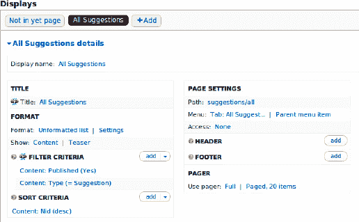
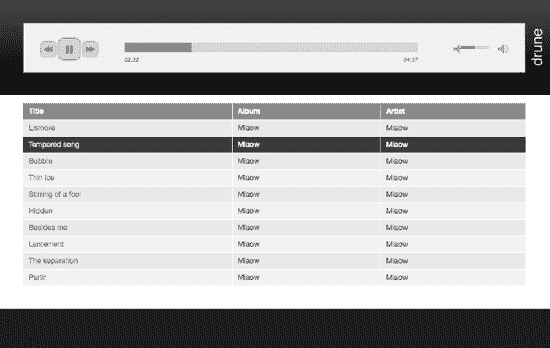
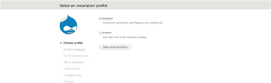
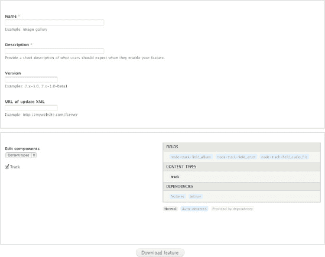

# 使用 Book 模块模板显示非图书导航

该网站已经使用 Book 模块来展示章节大纲，因此借用该导航功能会是个好主意。

 **注意** 这个想法听起来不错，但实际上可能并非如此——不过它仍然可行。

查看`modules/book`目录。其中有一个名为`book-navigation.tpl.php`的模板文件。（没有双连字符，因为这不是对图书内容类型的建议，而是其自身的导航模板，该模板被整合到启用了大纲的节点的显示中。）在`book.module`中，使用图书导航模板`book-navigation.tpl.php`的代码行位于`hook_node_view()`的实现`book_node_view()`中，如清单 33-51 所示。

***清单 33-51.** 调用 book-navigation.tpl.php 文件并将其`$node->book`数组传递给它*

```
$node->content['book_navigation'] = array(
  '#markup' => theme('book_navigation', array('book_link' => $node->book)),
  '#weight' => 100,
);
```

关键行是`#markup`行。对于非图书页面，您不会有`$node->book`，但您可以构造一些能实现相同功能的内容。您可以在`book-navigation.tpl.php`中看到需要提供哪些变量来匹配`$node->book`数组。

 **提示** 为了结束本章，我不会展示最终解决方案之前尝试过的许多错误和不当路径。如需查看其中一些内容，请访问`dgd7.org/230`。

函数`template_preprocess_book_navigation()`（参见`api.drupal.org/template_preprocess_book_navigation`）负责为`book-navigation.tpl.php`模板准备变量，而您需要替换该函数。可以实现`hook_theme_registry_alter()`来告知 Drupal 进行这样的替换。最终结果是可以获取基本的上一页和下一页数据，并将其传递给 Book 模块的主题模板，同时填充所有必要的变量以供显示；参见清单 33-52。

***清单 33-52.** 修改后的 hook_node_view 实现、注册表修改以及它允许您替换的 template_preprocess_book_navigation.tpl.php*

```
/**
 * Implements hook_node_view().
 */
function dgd7glue_node_view($node, $view_mode, $langcode) {
  // Print prev/next links on Suggestion node pages.
  if ($node->type == 'suggestion' && $view_mode == 'full') {
    $next = dgd7glue_nextprev_suggestion($node->nid);
    $prev = dgd7glue_nextprev_suggestion($node->nid, TRUE);
    // Make a fake book link array.
    $link = array();
    $link['dgd7glue'] = TRUE;
    $link['prev'] = $prev;
    $link['next'] = $next;
    $node->content['dgd7glue_prevnext'] = array(
      '#markup' => theme('book_navigation', array('book_link' => $link)),
      '#weight' => 100,
    );
  }
}

/**
 * Implements hook_theme_registry_alter().
 */
function dgd7glue_theme_registry_alter(&$theme_registry) {
  // Replace the default preprocess function with our own.
  foreach ($theme_registry['book_navigation']['preprocess functions'] as $key => $value) {
    if ($value == 'template_preprocess_book_navigation') {
      $theme_registry['book_navigation']['preprocess functions'][$key] =
  'dgd7glue_template_preprocess_book_navigation';
      // Once it's found it we're done.
      break;
    }
  }
}

/**
 * Replaces template_preprocess_book_navigation() when using tpl for non-books.
 */
function dgd7glue_template_preprocess_book_navigation(&$variables) {
  if (!isset($variables['book_link']['dgd7glue'])) {
    // This is a normal book, just use the usual function.
    template_preprocess_book_navigation($variables);
    return;
  }
  // Use our fake book_link variable to provide all the same variables.
  $link = $variables['book_link'];
  $variables['book_id'] = 'dgd7glue-nextprev';
  $variables['book_title'] = t('Suggestions');
  $variables['book_url'] = url('suggestions');
  $variables['current_depth'] = 0;
  $variables['tree'] = '';
  $variables['has_links'] = TRUE;
  $variables['prev_url'] = NULL;
  $variables['next_url'] = NULL;
  if ($link['prev']) {
    $prev_href = url('node/' . $link['prev']['nid']);
    drupal_add_html_head_link(array('rel' => 'prev', 'href' => $prev_href));
    $variables['prev_url'] = $prev_href;
    $variables['prev_title'] = check_plain($link['prev']['title']);
  }

  $parent_href = $variables['book_url'];
  drupal_add_html_head_link(array('rel' => 'up', 'href' => $parent_href));
  $variables['parent_url'] = $parent_href;
  $variables['parent_title'] = $variables['book_title'];

  if ($link['next']) {
    $next_href = url('node/' . $link['next']['nid']);
    drupal_add_html_head_link(array('rel' => 'next', 'href' => $next_href));
    $variables['next_url'] = $next_href;
    $variables['next_title'] = check_plain($link['next']['title']);
  }
}
```

`dgd7glue_nextprev_suggestion()`函数与之前介绍时相同——其余大部分内容都是新的或已修改的！

 **注意** 依赖 Book 模块提供的函数意味着您应该将 Book 模块作为要求添加到您的`.info`文件中，即在您的`dgd7glue.info`文件中添加以下行：

```
dependencies[] = book
```

## 配置清理

虽然您没有使用视图来获取上一页和下一页链接，但您需要创建一个视图来显示建议（在幕后构建）。为此视图，您需要添加一个按节点 ID 排序的条件。其配置页面如图 33-9 所示。



***图 33-9.** 按节点 ID 降序排列的建议视图*


### 创建视图以使用户页面拥有可拼接 URL

为了实现可拼接的 URL（即通过删除 URL 中 `/` 之后的所有部分来浏览网站的能力），你可以使用 `Pathauto` 模块（`drupal.org/project/pathauto`）为所有用户路径设置一个合理的前缀，然后在该前缀下提供所有用户的视图。请注意，`Pathauto` 设置隐藏在管理配置搜索和元数据URL 别名下的一个名为**模式**（`admin/config/search/path/patterns`）的选项卡中。用户账户页面路径的模式位于页面靠下的位置。

本着极度乐观的精神，假设在网站上注册的每个人都在阅读本书，因此将用户路径的前缀设置为 `readers`，后跟一个斜线分隔符和用户名的令牌：`readers/[user:name]`。这样，名为 Dries Buytaert 的用户账户路径将是 `readers/dries-buytaert`。要使此功能对已存在于网站上的用户也生效，请前往路径配置（`admin/config/search/path/update_bulk`）的**批量更新**选项卡，勾选**用户路径**，然后点击更新。

该路径别名并不会使 `readers` 路径真正存在。如果你访问 `readers`，将会看到*页面未找到*。为了改善用户体验并满足你作为 Web 开发者的风水感，你需要在这个路径下放置一些有意义的内容，例如所有用户的列表。

在 `admin/structure/views/add` 创建一个新视图，并且这次，告诉向导**显示**用户。

 **提示** 在创建用户（或任何）视图之前，检查一下 `Views` 是否已提供一个默认视图来大致或精确地完成你想要的功能。没有默认的基于用户的视图，但有接管 Drupal 核心功能的视图，例如基于评论的视图和获取分类术语 ID 的基于节点的视图。

为你的页面显示设置路径为 `readers`，显示格式或许选择 HTML 列表（此格式或未格式化格式需要主题化；网格格式可能无需主题化就看起来不错）。将每页显示项目数设为一个较大的数字，例如 50。在你点击继续并编辑之后，可以将过滤器保留为用户：活跃：是，并添加字段：用户：头像以及用户：名称。取消选中**创建标签**选项，这样就不会显示标签。

无论你是否想为用户视图创建菜单项，如果有人将用户 URL 从 `readers/john-smith` 截断为 `readers`，就像他们将别名为 `suggestions/installing-drubuntu` 的建议路径的 URL 截断为 `suggestions` 一样，他们将看到一个合理的列表，而不是页面未找到。这是一个小细节，却能让网站看起来完整而合理。

### 结语

将本章命名为“完成一个网站”有点误导。只要你拥有一个 Drupal 网站，工作就不会完成。Drupal 网站是关于活跃社区的，它们随着内容管理员和用户贡献的信息而呼吸。他们迟早会想要新功能。如果确实没有人使用你的网站，如果访问者只是浏览它，请将其导出为静态 HTML。关于使贡献代码保持最新的最低要求，请参阅第 7 章；关于部署新功能，请参阅第 13 章；并订阅 `dgd7.org/signup` 以了解如何将新功能添加到 DefinitiveDrupal.org 网站！

 **提示** 与本章直接相关的讨论和更新将在 `dgd7.org/other90` 进行。

## 第 34 章


## Drupal 发行版和安装配置文件

作者：Florian Lorétan

安装配置文件是 Drupal 模块和主题的列表，配合自动配置，让你能够快速轻松地创建一个功能齐全的网站或开发测试平台。它们被打包在发行版中，发行版会指导你完成安装并提供网站代码。例如，默认的 Drupal 发行版附带两个配置文件：标准配置文件和最小配置文件。标准配置文件启用了一组对大多数网站有用的模块和配置；它还包含一些占位内容和对新用户探索 Drupal 功能有帮助的示例。最小配置文件只安装 Drupal 运行所需的最基本的模块和配置；它推荐给那些确切知道新网站需要哪些模块的人。

配置文件也是很好的学习资源。如果你想构建一个网站但不确定如何开始，配置文件可以为你打下很多基础，从而使你能够专注于新功能。配置文件也使用了各种各样的模块和配置选项；如果你找到一个提供了你喜欢的功能的配置文件，研究它如何实现该功能是个好主意。你可以在 [`http://drupal.org/project/installation+profiles`](http://drupal.org/project/installation+profiles) 或从其各自的提供商网站发现更多配置文件。

### 网站模板

当你需要创建许多非常相似的网站时，例如为企业或学术部门，配置文件可以为每个网站提供标准功能和主题，从而以极少的努力启动新网站。

Drupal Gardens ([`http://drupalgardens.com`](http://drupalgardens.com)) 是一个用于快速构建和设计网站及微网站的托管服务。它提供免费和付费订阅功能、一个强大的主题构建器以及越来越多的功能。

你可以选择将你的 Drupal Gardens 网站导出为一个完全打包和配置好的 Drupal 安装。该服务还允许你克隆网站，复制主题、配置和选定内容。这使你能够快速原型化或模板化多种类型的网站。你也可以通过构建一个 Gardens 网站来实现你想要的，然后导出并研究其配置，从而研究如何在你自己的网站上实现某些功能。

例如，Drupal Gardens 提供了一个模板，你可以通过几次点击设置一个博客。如果你熟悉核心 Drupal 博客模块的工作原理，你可能会注意到在浏览 Drupal Gardens 博客时的一些不同行为。例如，每个博客节点底部的链接可能链接回全站博客，而不是单个作者的博客，这对于只有一个作者的博客来说很方便。这是如何实现的？

在配置菜单下，有一个博客设置选项在 `/admin/config/content/blog` 控制此项。要查看 Gardens 如何管理这些更改，请从 `/admin/config/system/site-export` 导出网站，获取网站存档，并检查代码。

找出某事物如何工作的一个好方法是搜索代码库中你在用户界面中看到与之相关的文本字符串。表单上的帮助文本或标签通常效果很好，配置屏幕的菜单路径也是如此。这种方法的一个警告是，代码中的字符串可能使用了占位符，因此如果你搜索看起来动态的文本——例如，包含用户名的内容——最好搜索周围的文本或同一页面上看起来是静态的内容。

在这种情况下，要搜索菜单路径，在导出的文档根目录中运行以下代码：

```
> grep -ri 'admin/config/content/blog' *
```

它应该返回一个结果：

`sites\all\modules\flexible_blogs\flexible_blogs.module`

所以这就是引起这些变化的模块，但它如何工作呢？该模块提供了几个钩子的好例子，不同的链接行为是在 `hook_node_view_alter()` 的实现中处理的。当你着手创建自己的网站和配置文件时，检查他人如何实现与你类似的目标通常是一个有用的起点。也许你会发现你需要的代码已经写好了。


#### 全功能发行版

通过安装配置文件，你可以轻松提供原本需要大量时间安装和配置的服务。本章后续将讨论的 Drune 音乐播放器，就是由发行版提供的服务示例。

Drupal Commons (`acquia.com/products-services/drupal-commons`) 是一款基于 Drupal 发行版构建的社交商业软件。它旨在帮助公司及组织快速创建针对性的社交网络或沟通平台。Drupal Commons 由 Acquia 专门打造，作为商业闭源社交商业提供商的开源替代方案。

你可以使用并研究的 Drupal Commons 特性包括：由 `Homebox` 模块提供的个性化仪表盘，以及由 `Heartbeat` 模块提供的实时成员活动流。Commons 还提供了 `User Relationships` 模块与 `Rules` 模块的集成，这是如何同时使用这两个模块 API 的绝佳示例。与 Open Atrium 类似，Drupal Commons 使用了 `Organic Groups` 和 `Features`；对比它们的配置，能让你获得关于如何在你自己的站点或配置文件中管理和配置这些模块的不同思路。

#### 开发配置

如果你正在开发自己的模块或功能，可以创建一个安装配置，让你能瞬间轻松搭建一个合适的测试站点。其中包含下载所需贡献模块和外部库的脚本，并设置一些合理的默认字段和配置。

`Media` 模块 (`drupal.org/project/media`) 提供了将图片插入富文本或所见即所得编辑器、批量上传文件、拉取外部视频以及众多其他媒体管理任务的工具。Media 的开发配置文件 ([`http://drupal.org/project/media_dev`](http://drupal.org/project/media_dev)) 为有兴趣为 Media 项目做贡献的开发者搭建了一个 Drupal 安装环境。由于 Media 是一个复杂且抽象的项目，该发行版会创建一些示例图片和音频文件，为其他开发者提供具体的可操作示例。

`Feeds` 模块 (`drupal.org/project/feeds`) 允许你向站点导入或聚合数据。它还有一个专注于测试的开发配置文件 (`drupal.org/project/feeds_test`)。借助它，项目的贡献者可以轻松地通过 Simpletest 测试套件运行他们的更改，第 23 章 将对此进行更详细的介绍。

如果你有一个模块或其他项目希望向社区寻求帮助，可以考虑创建一个开发安装配置。你让人们贡献的门槛越低，你收获的贡献就越多。此外，如果你以后想尝试项目的某个分支，或者需要在非自己的电脑上工作，也能轻松搭建出合适的环境。本章稍后将讨论一个开发配置的示例。

#### 一个示例发行版：Drune

我们不会使用泛泛的示例，而是将用一个贯穿本章各节的示例发行版：Drune。Drune 是一个基于 Drupal 构建的网页版音乐播放器，让用户能从他们的浏览器中收听音乐（见图 34-1）。关于 Drune 的更多信息可在 `drune.org` 找到。



***图 34-1.** Drune 网页版音乐播放器*

### 创建安装配置文件

用户在安装 Drupal 7 时看到的第一个页面，就是选择标准安装或最小安装（见图 34-2）。如前所述，标准安装会创建一个具有通用配置的网站，以便用户快速上手。最小安装包含必要的最少设置，适用于确切知道自己想要什么的进阶用户。这两个选项就是 Drupal 核心自带的安装配置文件。



***图 34-2.** 安装配置文件选择表单*

除了内置的安装配置文件，你还可以创建自己的配置文件。这个安装配置文件将负责为你的发行版设置初始配置，同时负责引导用户完成安装过程，并根据需要收集用户输入。

#### 安装配置文件的结构

安装配置文件的结构与模块类似。你需要在 `profiles` 文件夹内创建一个新文件夹，该文件夹至少包含以下两个文件：

*   `profilename.info` 包含元数据，如名称、描述和依赖项。
*   `profilename.profile` 是一个 PHP 文件，包含安装配置文件本身的代码。

请注意，`“profilename”` 需要替换为安装配置文件的名称。在示例中，你将拥有两个名为 `drune.info` 和 `drune.profile` 的文件。

 **提示** 开发安装配置文件是一个迭代过程，因此你可能需要多次运行安装程序，直到一切完全正确。为了在重新运行安装程序时节省时间，请使用 `drush site-install` 命令；它允许你通过命令行运行整个安装过程。

##### drune.info

`profilename.info` 文件包含了关于安装配置文件的关键元数据。你的 `drune.info` 文件内容如下：

```
core = 7.x
name = Drune
description = 一个基于 Drupal 构建的网页版音乐播放器。
files[] = drune.profile
dependencies[] = dblog
dependencies[] = features
dependencies[] = drune_track
dependencies[] = drune_player
```

第一行的 `core` 属性指明了该安装配置文件兼容的 Drupal 核心版本（Drupal 7）。`name` 和 `description` 属性定义了在安装配置文件选择表单上向用户显示的文本。`files` 属性定义了要包含的 PHP 文件列表。`dependencies` 属性定义了开始安装前必须可用的模块。如果没有这些模块，系统将向用户显示一条错误信息。它们将在安装过程开始时，在必需的系统模块启用后自动启用。

`drune_track` 和 `drune_player` 是功能模块（features），这是一种特殊的模块。我将在本章后续部分介绍它们。


`drune.profile`

`profilename.profile` 文件是一个 PHP 文件。该文件可以像模块一样包含钩子（hook），但这些钩子仅在安装过程中处于活动状态。

安装过程由一系列步骤组成。基本步骤，例如检查 `settings.php` 文件或激活模块依赖项，由 Drupal 本身定义。安装配置文件可以通过实现 `hook_install_tasks()` 来添加自己的步骤。清单 34-1 包含了你的 Drune 实现。

**清单 34-1.** 你的 Drune 实现

```php
/**
 * Implements hook_install_tasks().
 */
function drune_install_tasks() {
  $tasks = array(
    // Display a welcome text.
    'drune_welcome' => array(
      'display_name' => st('Welcome'),
      'type' => 'normal',
    ),
    // Set up the basic configuration.
    'drune_setup' => array(
    ),
    // Let users enter information about the location of their music library.
    'drune_config_form' => array(
      'display_name' => st('Drune Configuration'),
      'type' => 'form',
    ),
    // Import files from their music library.
    'drune_import' => array(
      'display_name' => st('Import audio files'),
      'type' => 'batch',
    ),
  );

  return $tasks;
}
```

你的 `hook_install_tasks()` 实现返回一个结构化数组，定义了四个任务：显示欢迎文本、设置基本配置、提示用户输入信息、以及利用该信息导入内容。每个任务的键（key）是一个函数回调的名称。该回调预期返回值的类型由任务的 `type` 属性定义。让我们来看看每个回调函数。

```php
function drune_welcome() {
  drupal_set_message(st('Welcome to Drune'));

  return st('We are going to walk you through the remaining steps required to set up Drune on your server.');
}
```

此任务的类型为 `normal`，这是默认类型。回调返回的文本会直接显示在页面上。

 **注意**：在安装过程中，标准的 Drupal 配置尚未完全就位。这意味着某些子系统（如翻译）不可用。因此，当输出本地化字符串时，你需要使用 `st()` 函数，而不是标准的 `t()` 函数。

```php
function drune_setup() {
  variable_set('site_frontpage', 'library');
}
```

第二个任务也是 `normal` 类型，但它没有返回值。代码执行后，安装程序会自动继续执行下一个任务。请注意，此类步骤可以通过在 `profilename.install` 文件中实现 `hook_install()` 来替代。

### 表单任务（Form Tasks）

表单任务允许你收集用户输入。在你的案例中，你要求用户输入服务器上存储音频文件的位置，以便导入它们（参见 清单 34-2）。

**清单 34-2.** 导入音频文件表单任务

```php
function drune_config_form($form_state) {
  drupal_set_title(st('Drune configuration'));
  $form = array();

  $form['drune_import_source_dir'] = array(
    '#type' => 'textfield',
    '#title' => st('Where are your files located?'),
    '#description' => st('Enter the absolute path to the directory where your music files are currently stored.'),
    '#default_value' => variable_get('drune_import_source_dir', NULL),
  );

  $form[] = array(
    '#type' => 'submit',
    '#value' => st('Save and continue'),
  );

  return $form;
}

function drune_config_form_validate($form, &$form_state) {
  $source_dir = $form_state['values']['drune_import_source_dir'];
  if (!empty($source_dir) != '' && !is_dir($source_dir)) {
    $error_text = st('%dir is not a directory.', array('%dir' => $form_state['values']['drune_import_source_dir']));
    form_set_error('drune_import_source_dir', $error_text);
  }
}

function drune_config_form_submit($form, &$form_state) {
  if ($form_state['values']['drune_import_audio_files']) {
    variable_set('drune_import_source_dir', $form_state['values']['drune_import_source_dir']);
  }
}
```

类型为 `form` 的任务需要返回一个 Form API 结构化数组。验证和提交处理函数的命名规则与常规相同。一旦表单成功提交，安装程序将继续执行下一个任务。

### 批量任务（Batch Tasks）

安装过程中的某些任务可能会花费很长时间，可能超过 PHP 配置中定义的超时时间。对于这些情况，你可以使用类型为 `batch` 的任务，并从回调中返回一个使用 `batch_set()` 格式的结构化数组。

在你的案例中，你收集用户指定目录中的所有 mp3 文件，并使用批处理过程为每个文件创建一个节点。请注意，你正在创建类型为 `track` 的节点，这是由 `drune_track` 特性定义的内容类型，该特性已被标记为依赖项（参见 清单 34-3）。

**清单 34-3.** 批量任务

```php
function drune_import() {
  $batch = array(
    'title' => st('Importing audio files'),
    'error_message' => st('The audio file import has encountered an error.'),
    'finished' => '_drune_import_finished',
  );
  $files = file_scan_directory(variable_get('drune_import_source_dir', NULL), "/.*\.mp3/");
  foreach ($files as $file) {
    $batch['operations'][] = array('_drune_import', array($file));
  }

  return $batch;
}

function _drune_import($file, &$context) {
  global $user;

  $node = (object) array(
    'uid' => $user->uid,
    'type' => 'track',
    'title' => $file->filename,
  );
  $file = file_copy($file, 'public://music/' . $file->filename);
  $node->field_audio_file[LANGUAGE_NONE][] = (array)$file + array('display' => TRUE);
  node_save($node);
  $context['message'] = st('Importing: @filename', array('@filename' => $file->filename));
}

function _drune_import_finished($success, $results, $operations) {
  drupal_set_message(st('Audio file import completed'));
}
```


### 处理配置：功能模块

虽然安装配置文件为用户提供了一个基于预定义配置的良好起点，但它们并不能真正涵盖所有需求。存在的一些问题包括：

- 配置是通过直接调用 API 函数来设置的。这种方法适用于只需要少量变量的简单配置，但不适用于创建完整发行版所需的节点类型、视图、权限和其他组件。
- 安装配置文件仅控制项目的初始设置。没有提供用于维护更新的更新机制。
- 原始配置与用户在安装后所做的最终修改一起存储在数据库中。因此，无法将标准配置与修改内容区分开来。

针对这些问题的所有解决方案都涉及将配置从数据库中导出，并放入可与安装配置文件一起发布的文件中。`Features` 模块通过提供一种统一的机制来导出不同类型的配置组件，已成为实现此目的的标准方式。所有与 `Features` 相关的功能都可以通过管理界面以及使用 `Drush` 命令从命令行使用。关于使用 `Drush` 的更多详情，请参阅第 26 章。

许多模块使用一种标准机制来让其他模块定义默认结构。最常见的例子可能就是 `Views` 模块，它允许其他模块创建默认视图。这些默认结构最初是使用特定的钩子（hook）在模块代码中定义的，但用户随后可以自由地用存储在数据库中的新版本覆盖该结构。以这种方式运行的结构被称为 *可导出组件*（exportables）。`Features` 模块充当了可导出组件的包装器，使得将一组结构转换为自定义模块变得简单。

还有其他类型的结构没有提供让模块定义默认结构的 API。字段配置、块布局和用户权限就属于这一类，通常被称为 *伪可导出组件*（faux-exportables）。幸运的是，`Features` 模块提供了一种机制，几乎可以像处理可导出组件一样处理它们。

对于你的 `Drune` 示例，你将创建一个功能模块，用于定义音轨内容类型以及所有关联的字段，如存储音频文件、艺术家、专辑、封面缩略图等。

一旦这些组件被创建并且 `Features` 模块被激活，你可以导航到 `admin/structure/features/create` 来创建一个新的功能模块（参见图 34-3）。版本和更新 XML 字段的 URL 目前可以留空。



***图 34-3.** 创建新功能模块的用户界面*

 **注意** 关于如何将组件划分到不同的功能模块中并没有严格的规则，但从长远来看，将它们按逻辑实体分组将使你的工作更加轻松。

功能模块界面会创建一个包含自定义模块的存档，你可以直接将其复制到你的模块目录中，但快速浏览一下代码清单 34-4 中生成的代码内容是值得的。

***代码清单 34-4.** `drune_track.info`*

```
core = "7.x"
dependencies[] = "features"
dependencies[] = "file"
dependencies[] = "jplayer"
dependencies[] = "text"
description = "提供音轨内容类型及其关联的结构和功能。"
features[field][] = "node-track-field_album"
features[field][] = "node-track-field_artist"
features[field][] = "node-track-field_audio_file"
features[node][] = "track"
features[user_permission][] = "create track content"
features[user_permission][] = "delete any track content"
features[user_permission][] = "delete own track content"
features[user_permission][] = "edit any track content"
features[user_permission][] = "edit own track content"
name = "Drune Track"
package = "Features"
```

除了属性按字母顺序排序之外，请注意 `features` 属性的存在。组件按组件类型分组，每个组件都有一个唯一的标识符。

#### `drune_track.*.inc`

`Features` 模块会生成不同的包含文件，其中包含 `drune_track.info` 文件中列出的组件的实际定义。组件按类型分组；例如，所有默认视图将位于一个 `.default_views.inc` 文件中，所有字段定义将位于一个 `.features.content.inc` 文件中（文件名中包含 "features" 表示这些组件是不可导出的，并且其代码导出由 `Features` 模块管理）。

#### `drune_track.module`

由 `Features` 模块生成的 `.module` 文件包含一行代码，负责包含定义各个组件的各种包含文件（参见代码清单 34-5）。但是，你可以在此处自由添加模块中允许的任何代码。这通常用于添加与该功能模块中定义的组件相关的粘合代码（参见第 22 章）。

***代码清单 34-5.** `drune_track.module`*

```
<?php

include_once('drune_track.features.inc');
```

### 覆盖

功能模块激活后，仍然可以更改该功能模块提供的配置。当功能模块的配置被修改时，`Features` 模块会自动检测到，并在功能管理界面中将其状态显示为“已覆盖”。此外，还会提供哪些组件类型被覆盖的详细列表。

当功能模块被覆盖时，可以通过还原该功能模块来恢复到代码中存储的配置。这可以在功能管理界面中选择要还原的单个组件来完成，也可以使用 `drush features-revert` 命令从命令行完成。

### 更新

使用 `Features` 模块的优势之一在于，它不仅提供了一种将配置导出到代码的机制，还能让你随着时间的推移更新这些配置。作为开发者，你只需覆盖功能模块以匹配所需状态，然后更新该功能模块即可。这可以通过两种方式实现：从用户界面重新导出功能模块，并用新版本替换旧版本；或者直接使用 `drush features-update` 命令从命令行更新功能模块。

当 `Features` 模块识别到代码中有新版本的配置时，它会直接加载该配置，或者将其状态标记为“需要复审”，在这种情况下，需要还原该功能模块。

***表 34-1**. 不同情况下可导出组件与伪可导出组件行为对比*

| | **可导出组件** | **伪可导出组件** |
| --- | --- | --- |
| **示例组件** | 视图、图像预设 | 内容类型、权限、字段 |
| **默认状态** | 配置仅存在于代码中 | 数据库中的配置与代码中的配置匹配 |
| **已覆盖** | 配置同时存在于数据库和代码中。数据库中的版本优先于代码中的版本。 | 数据库中的配置与代码中的配置不同 |
| **新变更在代码中** | 新版本会自动加载，但大多数情况下需要清除 Drupal 缓存。 | 需要还原功能模块以使数据库与代码同步。 |

 **注意** 除了使构建发行版更简单之外，`Features` 模块还解决了与部署和团队协作相关的许多问题。许多开发者将其作为所有 Drupal 项目中的标准工具。


### 异常情况

遗憾的是，并非 Drupal 项目配置中的所有内容都能通过 Features 模块导出。`features` API 可以轻松地为其他模块的配置添加支持，但即便如此，也并非所有内容都能被导出。

问题主要源于使用序列号作为组件的首要标识符。因为这些序列号是通过从数据库中选取下一个可用的整数来自动生成的，所以无法保证不同环境中的标识符是一致的。一些伪可导出项（如菜单链接）通过使用不同的标识符（菜单链接路径）来替代内部的数字标识符，从而规避了这个问题。

为了支持在安装配置文件中创建不受 Features 管理的配置，你需要编写自己的代码来管理它。例如，你可以使用此方法创建默认节点或用户账户。代码可以放置在以下几个位置之一：

- 如果配置与整个安装配置文件相关，则放在安装配置文件的 `.install` 文件中的 `hook_install()` 里。
- 安装配置文件中的一个安装任务。如果配置基于用户在先前任务中输入的信息，这种方法尤其有用。
- 如果配置与特定模块相关，则放在自定义模块的 `.install` 文件中的 `hook_install()` 里。
- 如果配置与特定模块相关，并且也应影响需要更新的现有实例，则放在自定义模块的 `.install` 文件中的 `hook_update_N()` 里。

选择正确的位置取决于你的配置所关联的上下文，但所有位置都可以使用相同的语法。清单 34-6 包含一个示例，该示例在 `drune.install` 中为你的 Drune 安装配置文件创建了一个“关于”页面和一个默认的非管理员用户。

**清单 34-6.** 创建“关于”页面

```
/**
 * 实现 hook_install()。
 */
function drune_install() {
  // 创建“关于”页面。
  $node = new StdClass;
  $node->type = 'page';
  $node->title = t('关于');

  // … 设置其他节点属性

  node_save($node);

  // 创建一个默认的非管理员用户。
  $default_user = new StdClass;
  $default_user->name = 'drune';
  $default_user->pass = 'drune';
  user_save($default_user);
}
```

关于编写自定义代码的更多详情，请参见第 22 章。

### 将安装配置文件与 Features 作为开发工具使用

将安装配置文件与 `Features` 模块结合使用，你可以定义项目的完整配置，并一步到位地从无数据库的代码库转变为功能完整的 Drupal 站点。这一功能对于创建发行版非常有用，但在任何 Drupal 项目的开发过程中，它也同样强大。

想象一下，例如，一个复杂网站的开发。每个功能部分都被导出到一个包含所需组件和相关自定义代码的 feature 中。安装配置文件可以是一个简单的模块依赖列表（包括 features）和一个空的 `profilename.profile` PHP 文件。`profilename.info` 文件的内容将如清单 34-7 所示。

**清单 34-7.** `profilename.info` 的内容

```
name = "复杂网站"
description = "复杂网站的自定义安装配置文件。"
core = 7.x

; 列出我们导出的 features。
dependencies[] = complex_web site_registration
dependencies[] = complex_web site_forums
dependencies[] = complex_web site_forums

; 列出不被任何 feature 需要的附加模块
dependencies[] = dblog
dependencies[] = toolbar

; 开发模块，这些将在正式站点上被禁用。
dependencies[] = devel
dependencies[] = simpletest
dependencies[] = views_ui

files[] = profilename.profile
```

如前所述，`profilename.profile` 文件可以留作一个空的 PHP 文件。使用此安装配置文件将启用所有 features 及其依赖项，以及其他任何指定的模块。结果就是项目的一个新实例，所有配置都已就绪，可供用户添加内容。

可以通过在 `profilename.profile` 文件中添加任务来以编程方式创建内容，但这种方法仅在内容可以从外部源批量导入时才实用。以编程方式创建编辑性内容可能很繁琐，因此这种方法不适用于主要基于编辑性内容的项目。

## 打包你的代码

你现在拥有了让他人重新创建你的安装配置文件所需的所有组件：一个安装配置文件、一个依赖项列表、几个自定义模块和 features、一个主题（可选），以及一些额外的外部库。问题是用户需要从许多不同的来源获取代码。有时你还需要某个模块的特定修订版本，这只能直接从版本控制系统中获取。你需要一种方法来正式定义如何构建运行你的发行版所需的代码。

Makefile 在软件开发中是一种众所周知的工具，通常与 `make` 命令结合使用，以自动化编译可执行文件的过程。虽然构建 Drupal 项目与编译 C++ 应用程序截然不同，但一些通用的概念仍然适用。Drupal 中与 `make` 命令等价的是 `drush make`，它是 `drush` 的一个扩展，能将 makefile 转换成一个准备安装的 Drupal 项目。

### Drush Makefile

`drush make` 使用的 makefile 语法与你多次遇到过的 `.info` 文件语法类似。清单 34-8 展示了你的 Drune 发行版的 makefile 内容。

**清单 34-8.** Drune 发行版的 `profilename.make` 文件

```
; 指定 drush make API 版本
api = 2

; 指定兼容的 Drupal 核心版本。
core = 7.x

; 从 Drupal.org 下载的包列表。
projects[] = ctools
projects[] = features
projects[] = views

; 模块可以直接从版本控制系统下载。
projects[jplayer][type] = module
projects[jplayer][download][type] = "git"
projects[jplayer][download][url] = "git://git.drupal.org/project/jplayer"
projects[jplayer][download][tag] = "6.x-1.0-beta2"

; 补丁也可以自动应用。此处是指将 jPlayer 模块移植到 Drupal 7 的补丁。
projects[jplayer][patch][] = "http://drupal.org/files/issues/jplayer_d7_1.patch"

; 同时指定外部库。
libraries[jplayer][download][type] = "get"
libraries[jplayer][download][url] = "http://www.happyworm.com/jquery/jplayer/latest/jQuery.jPlayer.1.2.0.zip"
```

这个文件名为 `profilename.make`，直接位于安装配置文件的根目录下（在你的例子中，它将是 `profile/drune/drune.make`）。

请注意，此 makefile 的包列表中并不包含 Drupal 核心。因为它位于配置文件文件夹内，所以它预期在现有的 Drupal 项目内被使用。你可以创建一个简单的 makefile 来获取 Drupal 核心和你的安装配置文件，并且 `drush make` 会递归地解析这些 makefile，如下所示：

```
api = 2
core = 7.x
projects[] = drupal
projects[] = drune
```


#### 托管在 `drupal.org` 上

托管在 `drupal.org` 上的安装配置文件还可以使用一个名为 `drupal-org.make` 的特殊 makefile。该文件由 `drupal.org` 打包脚本自动解析，并会生成一个包含 Drupal 项目和安装配置文件的归档包，用户可直接安装。

由于 `drupal.org` 的托管政策，不允许包含外部库。可以使用 `drush verify-makefile` 命令来检查所有托管于 `drupal.org` 的要求是否满足。如果某个 makefile 不符合要求，可以使用 `drush convert-makefile` 命令将其转换为合规的 makefile。

#### 打包

即使你的安装配置文件托管在 `drupal.org` 上，你可能也希望允许你的发行版用户直接从你的网站下载一个包含安装所需全部内容的归档包。`drush make` 提供的众多选项中，`--tar` 选项正是为此而设，示例如下：

```
drush make --tar drune.make
```

关于 `drush make` 所有功能的完整文档，请查看 `drush make` 下载包中的 `README.txt` 文件。

### 发行版的未来

发行版对 Drupal 的未来至关重要。它们使 Drupal 能够与那些功能单一、难以扩展的系统竞争。例如，Drupal Commons 就是为了与其他闭源社交商业服务竞争而开发的。通过降低站点创建的门槛并创建独特的功能组合，发行版也将 Drupal 带入了利基市场。

由于发行版提供商依赖 Drupal 来提供他们的产品，因此为 Drupal 项目做贡献符合他们的利益。同时，Drupal 也因发行版而变得更加强大，这种反馈循环为所有人创造了更好的产品。

如果你在 Drupal 6 中使用过配置文件，那么你会很高兴地听到，在 Drupal 7 中，它们作为识别这一未来趋势的努力的一部分，得到了极大的重视。它们的构建方式本质上类似于一个包含 `.info` 和 `.install` 文件的模块；无需再学习额外的（有些晦涩的）API。如果你能编写一个模块，你就能编写一个安装配置文件。此外，它们在 `drupal.org` 上获得了更显著的展示位置，现已与模块和主题处于同等地位。让发行版的创建和维护更加容易，将是社区面临的下一项挑战。

本章用作示例的 Drune 音乐播放器，是在作者的桌面音乐播放器因所用专有协议变更而无法与其音乐库交互时，临时创建出来的。本章中的示例是实际代码的简化版本。该项目的当前开发状态可在 `drune.org` 查看。

### 总结

在本章中，你了解到配置文件和发行版允许你快速简便地创建一个预配置好的站点。发行版和配置文件是 Drupal 生态系统的重要组成部分，你应该考虑创建一个配置文件来支持你的 Drupal 项目的开发。编写你自己的配置文件类似于编写你自己的模块，你可以通过检查现有配置文件的构建方式并将其用作模板来学到很多东西。你可以使用 `drush makefiles` 快速简便地从多个位置整合你的配置文件所需的资源。你还可以将逻辑分组的站点配置部分打包成可导出、可重用的特性。大多数特性无法导出的内容，可以存储在 `hook_install()` 和 `hook_update_N()` 的代码中。

## 第七部分


## Drupal 社区

**第 35 章** 讲述了 Drupal 作为一个开源项目的起源故事，以及一些对其发展成今天繁荣社区的关键事件。

**第 36 章** 探讨了如何通过 Drupal 谋生，包括正视 Drupal 软件存在的问题，并提出了如何共同维系你与 Drupal 成功的建议。

**第 37 章** 介绍了如何在 `Drupal.org` 上维护一个与世界共享的项目，以及如何使用 Git 版本控制系统。

**第 38 章** 作为本书的最后一章，讨论了为 Drupal 做贡献的有效方法，以使你所使用的软件和你所处的社区变得更好。并且，或许还能帮助世界变得更美好。

## 第三十五章


## Drupal 的故事：一串意想不到的事件链

作者：Kasey Qynn Dolin

*“对我来说，Drupal 的历史就是一连串有趣的惊喜。”*

——Dries Buytaert，Drupal 创始人兼项目负责人

我曾考虑将本章命名为“历史”，但后来认为这会产生误导。尽管在本书印刷时，Drupal 项目只有十年历史，但一部完整的 Drupal 历史将需要数百页的篇幅，并记录成千上万人的经历。

坦率地说，如果你在寻找关于关键贡献者的详尽传记，那么查看他们的个人资料页面会更有效。虽然许多关键贡献者是迷人而聪明的人物，他们的决策、行动和信仰无疑在全球众多人所熟知和喜爱的社区中留下了印记，但这篇历史并非关于那些大写“人物”塑造 Drupal 的故事。

相反，它讲述的是塑造 Drupal 的事件，以及整个社区如何应对这些事件的故事。说到社区……

作为一位外部观察者，我逐渐认为 Drupal 真正令人惊叹之处在于它对极其广泛的用户群体的吸引力。Drupal 用户涵盖了从业余黑客到企业家、从激进的草根组织者到国家政府、从自由及开源软件（FOSS）布道者到企业战略家——社区包含了众多兼具以上所有特征的实体和个人。

完全可以说，Drupal 代码的质量和灵活性解释了其广泛的吸引力，一个优雅、适应性强且有用的技术拥有令人印象深刻的应用范围，这并不奇怪……

……但同样有理由指出，Drupal 是一个协作产生的企业。来自各大洲、上述每个群体的成员，为了从软件中获得他们想要的最大价值，必须进行沟通、协作并相互依赖——而在此过程中，也共同推动了整个项目向前发展。是什么让这种大规模的开源价值观成为可能？Drupal 项目中的什么特质激发了这种奉献精神，并最终带来了其非凡的成功？

答案是：前述的一串许多意想不到的事件链，^(1) 以及社区的回应。

本章将简要介绍几个塑造了社区如何以及为何能够生存和发展的事件。希望这能捕捉到定义 Drupal 的一些特质（尽管我会让读者自己来定义这究竟是一种什么特质）。在简要回顾 Drupal 的起源之后，第一部分描述了导致 Drupal 吸引到其繁荣所需的关键开发者数量的关键事件。接下来的两部分概述了决定 Drupal 基础设施形态的事件，以及该基础设施如何平衡赋予 Drupal 力量的开源价值观与支持广泛商业应用的能力。


### 最初的意外

我们现在所熟知的 Drupal 项目始于 1998 年，当时一位在安特卫普大学攻读计算机科学学士学位的比利时本科生德里克·布伊塔特，开始搭建一个局域网，以便与他的室友们联网（并避免大学高昂的上网费用）。德里克创建的留言板让他的计算机科学系的同学们能够讨论最新的互联网技术，并保持联系。

后者之所以重要，正是因为这种社区感激励了德里克。在他毕业并搬离宿舍后，为了让讨论继续下去，他将这个内部网站搬到了互联网上。2000 年 4 月 28 日，`drop.org` 诞生了。

 **注意** 万一有读者还不知道 Drupal 名称的由来，这里提供一个简版故事：*起初，只是一个拼写错误。德里克看了看他的拼写错误，觉得还不错……于是就将错就错了。* 在注册新网站的域名时，德里克本想输入荷兰语单词 *dorpje*（意为村庄）的缩写，但错拼成了英语单词 *drop*。后来，在给软件命名时，他将 *drop* 回译成荷兰语 *（druppel）*，然后又按照英语发音拼写成了 *drupal*。

这一举动永远定义了 Drupal 社区的特征：德里克没有试图亲自实现大量的建议、抱怨和反馈，而是选择根据 GNU 通用公共许可证将软件免费提供给所有人。这意味着任何愿意投入时间和精力去尝试自己想法的人，都可以随意试验后来成为 Drupal 的代码——前提是他们同意将自己的实验成果也免费提供给他人。2001 年 1 月 15 日，自由和开源软件（FOSS）运动迎来了新成员——Drupal 1.0 正式发布。

虽然最初 `drop.org` 上的讨论内容旨在涵盖一般的互联网技术，但评论很快开始转向非常具体的话题——即驱动 `drop.org` 网站本身的软件。

在 2001 年 3 月 15 日 Drupal 2.0 发布后不久，德里克决定为所有那些充斥在 `drop.org` 网站上的、专门与 Drupal 相关的活动提供一个场所，于是 `drupal.org` 诞生了。

_____________________

¹ 德里克·布伊塔特在 2007 年 7 月 26 日接受诺埃尔·伊达尔戈采访时，用“一连串许多意想不到的事件”来形容 Drupal，采访链接：[`luckofseven.com/vlog/episode13`](http://luckofseven.com/vlog/episode13)。

### Drupal 站稳脚跟

Drupal 在相对默默无闻的状态下持续发展，直到 2002 年初，德里克与 `kerneltrap.org` 的所有者兼运营者杰里米·安德鲁斯建立了联系。`kerneltrap.org` 是一个报道 Linux 内核及整个 FOSS 世界相关问题的新闻网站，它时常因为被热门技术新闻网站 `slashdot.org/` 提及而遭受流量冲击导致宕机。德里克联系杰里米，建议用 Drupal 替代 PHP-Nuke。杰里米在 2002 年 2 月 14 日将 `kerneltrap.org` 转换为 Drupal 3.0.2 后，开发了节流模块（该模块最终被包含在 Drupal 4.1 核心中）。

虽然节流模块“不过是一块创可贴，试图绕开问题而非解决问题”，² 并且后来被从 Drupal 7 核心中移除，但这段早期合作的影响是巨大的。杰里米后来多年一直是 Drupal 社区的活跃成员，贡献了超过 4400 次提交。但与本章节更相关的是，他曾在 `kerneltrap.org` 上报道了自己早期转向并使用 Drupal 的经历。这种最真诚的认可所带来的宣传效应，被德里克认为是“让技术界许多其他人”³ 注意到了 Drupal 独特能力的关键事件。

如果说 2002 年 `kerneltrap.org` 对 Drupal 的提及代表了它在技术界的“亮相”，那么 2003 年 7 月则标志着 Drupal 开始在更广阔的世界“崭露头角”。当 Drupal 社区忙于攻克 4.2、4.3 和 4.4 版本时，一群热衷政治的年轻人正在使用这个尚不为人知的内容管理系统，试图帮助一位同样不太知名的候选人竞选美国总统。

虽然候选人霍华德·迪恩最终没有当选，但他确实以极大的声势进入了全国视野——这部分归功于 Drupal 软件的组织能力以及构建了推动竞选活动的那些网站的积极分子/开发者的奉献精神。当组织者利用 Drupal 软件创建了 DeanSpace（一个用于联系和组织全美迪恩志愿者的网站），从而指数级地扩大了竞选活动所能触及的人群时，竞选活动的扩张也反过来导致了 Drupal 软件自身的指数级增长。

随着由 Drupal 驱动的迪恩支持者网站如雨后春笋般涌现，为满足这些网站需求而构建模块的开发者也越来越多。大卫·科恩在撰写关于 Drupal 这段历史的文章时，提到 `drupal.org` 上创建的内容增加了 300%。这种促进发展的相互推动甚至在迪恩竞选活动失败后仍在继续；事实上，竞选活动的结束开启了一个新阶段，Drupal 迅速扩展到各种草根和非营利应用中，这很大程度上得益于前迪恩志愿者中 Drupal 开发人才的推动。2004 年 7 月 23 日，DeanSpace 正式宣告终结，而 CivicSpace——“第一家拥有全职员工、专门开发和分发 Drupal 技术的公司”⁴ 则开始起步。Advomatic、Chapter Three 和 Echo Ditto 等其他由迪恩志愿者创立的基于 Drupal 的公司，至今仍为 Drupal 社区做出着重要贡献。

_____________________

² Tag1 Consulting, Inc., “第 3 节：节流模块，” [`http://books.tag1consulting.com/scalability/drupal/performance/throttle`](http://books.tag1consulting.com/scalability/drupal/performance/throttle)

³ 德里克·布伊塔特，2007 年 7 月 26 日，接受诺埃尔·伊达尔戈采访，“第 13 集 – 德里克谈 Drupal，” [`http://luckofseven.com/vlog/episode13.`](http://luckofseven.com/vlog/episode13.)

⁴ DigiDave，《Drupal 国度：驱动左翼的软件》，[`http://blog.digidave.org/2008/12/drupal-nation-software-to-power-the-left`](http://blog.digidave.org/2008/12/drupal-nation-software-to-power-the-left)


***图 35-1.** 2004 年新年前夜，未来 CivicSpace 联合创始人兼 Drupal 核心开发者尼尔·德拉姆的预测*


