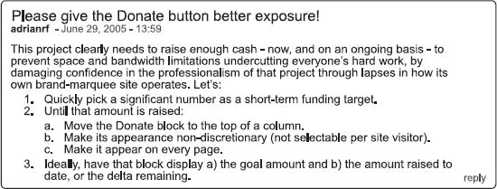
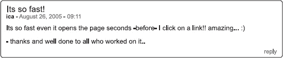
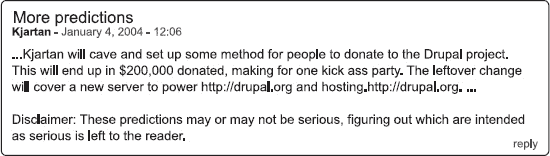

# 哦，原来你的名字是这么念的！

在北美大陆上所有这些大规模且引人注目的活动发生七个月后，大西洋彼岸的 Drupal 迎来了一项传统，这一传统最终定义了其文化本身的特质，其意义与 2004 年的那些事件同样深远（尽管规模要私密得多）。

 **提示** 这少不了大量的啤酒和插排。

2005 年 2 月 26 日，一个重要里程碑出现了：被广泛认为是首届 Drupal 会议的日子（尽管严格来说，首次独立的 `DrupalCon` 还要再过七个月才举行）。`FOSDEM`，即自由与开源开发者欧洲会议，是一项至今仍在比利时布鲁塞尔每年举办的活动，“由志愿者组织，旨在推广自由与开源软件的广泛使用”，并为开发者提供一个交流的场所。^(5) 来自世界各地的 3000 到 3500 人参加了 `FOSDEM 2005`。除了安排的演讲者和以闪电演讲形式进行的简短项目演示外，`FOSDEM 2005` 还设有十八个开发者讨论室，其中就包括 Drupal 的讨论室。^(6)

然而，`DrupalCons` 并非上面提示所指的传统。真正重要的事件发生在 `FOSDEM` 前两日。

2005 年 2 月 24 日至 25 日，即 `Drupal 4.5` 发布四个月后，Drupalistas 们聚集在比利时安特卫普，举行了首次官方 Drupal 开发者冲刺活动。来自 11 个国家的 26 位 Drupal 开发者会面，共同协作（面对面地）解决冲刺组织者们认定在集会前需要集中精力处理的问题。大约 80% 的开发者是从西欧以外地区赶来参加此次活动的，其中 12 人来自不同的洲。

为了相聚而飞越重洋的传统由此诞生。

---

⁵ FOSDEM, 关于页面， [`www.fosdem.org/2010/about/fosdem`](http://www.fosdem.org/2010/about/fosdem)

⁶ FOSDEM, 2005 年存档， [`http://archive.fosdem.org/2005/`](http://archive.fosdem.org/2005/)

## 地狱般的加长周末

`Drupal 4.6` 于 2005 年 4 月 15 日发布。无论以何种标准衡量，Drupal 社区都在继续其快速扩张的趋势：到 2005 年 7 月，有 26,772 名用户和 455 个服务提供商在 `drupal.org` 上注册。实际上，这意味着大量人员受到了 2005 年 7 月 7 日至 11 日事件的影响——史蒂文·维滕斯称之为“地狱般的加长周末”。^(8) 7 月 10 日，试图登录 `drupal.org` 的用户看到以下消息：“`http://drupal.org` 暂时离线。如果没有托管公司的帮助，我们无法让服务器重新上线，但 48 小时后，他们仍未回应我们的支持请求。”^(9)

史蒂文在他的 7 月 12 日 `drupal.org` 新闻与公告帖子中，对事件进行了（不那么简洁/紧张/绝望的）详细描述：“周四晚上，这台服务器被入侵了。我们服务器上的另一个站点为黑客提供了入侵的漏洞；似乎有人想把我们变成一个盗版 FTP，但却完全搞砸了。我们很快发现了入侵，并迅速重新控制了服务器。然而，整个事件发生在我们当前 ISP 计划停电前的几个小时；远程管理的问题以及缺少安装介质意味着我们无法远程修复服务器。周末我们一直打电话试图解决这个问题，但由于与我们的 ISP 沟通不畅，我们不得不等到周一早上才能重新安装操作系统，让服务器重新顺畅运行。”^(10)

尽管服务器崩溃对 Drupal 用户来说可能像是一记耳光，但社区并非没有意识到基础设施问题可能成为一个隐患，如图 Figure 35-2 所示。

***图 35-2.** Drupal 社区意识到基础设施问题可能成为一个隐患。*

在服务器崩溃之前，Dries 已经准备好发布一篇由查理·洛于 7 月 10 日发表于 `drupal.org` 主页的消息，阐述了需要一台新服务器的问题。在崩溃发生时，`drupal.org` 运行在一台与大约 20 个其他站点共享的 Pentium Xeon 3Ghz 服务器上，内存为 1GB；Drupal 资深人士 Kjartan Mannes ([`http://drupal.org/user/2`](http://drupal.org/user/2)) 既负责维护这台服务器，也承担了费用。

---

⁷ Groups.Drupal, 增长图表， [`http://groups.drupal.org/node/1980`](http://groups.drupal.org/node/1980)

⁸ Drupal, “恢复 Drupal.org 与墨菲定律，” [`http://drupal.org/node/26545`](http://drupal.org/node/26545)

⁹ 互联网档案馆时光机， [`http://web.archive.org/web/web.php`](http://web.archive.org/web/web.php), [`http://www.drupal.org/`](http://www.drupal.org/)

¹⁰ Drupal, “恢复 Drupal.org 与墨菲定律，” [`http://drupal.org/node/26545`](http://drupal.org/node/26545)

根据 Dries 的帖子“帮助 Drupal.org 购买一台专用服务器”，仅在 6 月份，`drupal.org` 就产生了 100GB 的流量，提供了超过 300 万个页面；用他的话说，“我们当前的服务器已经不够用了。”给 Drupal 社区的信息开头是：“不少人指出 `drupal.org` 最近变慢了。我们知道它很慢，并且一直在努力优化 `drupal.org`... 事实是，由于 Drupal 越来越受欢迎，服务器几乎全天候处于饱和状态。这解释了 `drupal.org` 性能不佳的原因。”^(11)

接着，这篇文章概述了一项将 `drupal.org` 迁移到由俄勒冈州立大学开源实验室（OSUOSL, OSL）托管的新服务器的计划。该开源实验室于 2004 年 1 月正式成立，其既定使命是“帮助加速全球范围内对开源软件的采纳，并协助开发和使用它的社区。”^(12) 这些自由及开源软件的“仙女教母”在 `drupal.org` 服务器崩溃事件发生前两个月，就已经向 Drupal 资深人士 Jeremy Andrews 伸出了援手；当 Jeremy 开始为 `http://kerneltrap.org` 寻找新的托管主机时，OSL 是他联系的第一家机构。

作为 OSL 的副主任，Scott Kveton 向 Jeremy 解释道：“开源实验室的目标是将自由及开源软件社区聚集在一起，从而促进思想和人员的交叉融合，有助于营造一种围绕开源进行创新的氛围。” 为实现这一目标，到 2005 年年中，OSL 已具备得天独厚的优势，托管了包括 Arklinux、Debian GNU/Linux、Freenode.net、Gentoo Linux、Mozilla 基金会、PowerPC 内核档案库和 SPI 在内的项目。

OSL 主要靠密切关注自由及开源软件的“小道消息”，并在需要时适时提供帮助，从而积累了这份令人印象深刻的参与者名单；正如 Scott 向 Jeremy 解释的那样，OSL 团队会听说“某某项目的一台机器坏了需要帮助，或者某某组织的基础设施快要达到极限，需要援手。”

这几乎完美地描述了 2005 年 6 月 Drupal 所处的境况。Drupal 也符合 OSL 工作人员用来评估潜在被托管方的筛选标准：它专注于社区；拥有“投入、充满活力，并且最重要的是，务实的领导层”；其社区能与 OSL 现有托管项目的社区良好互动；它将利用 OSL 提供的服务来帮助其社区发展；并且 OSL 的资源和服务能使社区专注于快速创新（而不仅仅是维持基本运转）。

> 让我们面对现实吧，开源正在世界各地获得发展势头。伴随着它的成功，本已捉襟见肘的资源面临着额外的压力。我们希望能成为那些不想沦为提供帮助的大公司附庸的开源项目的一个选择。我们并非反公司，也非反对靠开源赚钱；我们只是知道，项目希望确保其社区的未来，因此在选择合作伙伴时非常谨慎。我们知道这需要时间，就像开源世界中的一切事物一样；关键在于我们建立的关系。
>
> ——Scott Kveton，2005 年^(13)

就在 Drupal 服务器崩溃前的几周，合作协议的条款已经敲定：OSL 将提供免费托管——包括机架空间、带宽、电力、域名服务、数据库、备份和邮件中继。Drupal 社区所需做的只是提供硬件。^(14) 所需设备的标价为 3,000 美元。

---

¹¹ Internet Archive 时光机，`http://web.archive.org/web/web.php`，`www.drupal.org/`

¹² KernelTrap，“KernelTrap: New Home At The Open Source Lab，”`http://kerneltrap.org/node/5083`

¹³ KernelTrap，“KernelTrap: New Home At The Open Source Lab，”`http://kerneltrap.org/node/5083`

捐款呼吁于 2005 年 7 月 10 日发布在 `drupal.org` 的临时主页上（当时唯一可以访问的页面）。此后不久，一篇解释 Drupal 困境的文章被发布到 `slashdot.org/`^(15)。在 `drupal.org` 首次发帖十六小时后，3,000 美元的筹款目标已经达成并超出。到 7 月 12 日，Drupal 社区已捐赠超过 10,000 美元，Drupal 组织者手中的资金已远超其需求，名副其实。由于没有基金会或任何其他正式的非营利身份，Drupal 的这笔善款可能需要纳税——而且它还躺在个人 PayPal 账户中。这种情况突显了社区另一个长期被认识到但久被搁置的需求，成立一个协会成为了公认的优先事项。

在“地狱般的超长周末”期间，自由及开源软件社区对 Drupal 展现出的慷慨并不仅仅限于 OSL 和个人捐助者的贡献。Tim Bray——被 Dries 描述为“Sun Microsystems 员工、W3C 成员、XML 共同发明人以及 Drupal 粉丝”^(16)——偶然看到了 `slashdot.org/` 上那篇描述 Drupal 困境的文章（该文章于 7 月 10 日星期日下午 3:39 发布）。出于同情，Tim 将此事上报给了 Sun 的指挥链，并附上了希望提供帮助的请求。^(17) 还是在星期天，Dries 收到了 Sun 公司软件首席技术官 Hal Stern 的电子邮件，告知他 Drupal 荣幸地成为了一台免费 Sun Fire V20z 服务器的新主人。周一签署了相关文件，到了周二，这台服务器就抵达了其位于 OSL 的新家。^(18)

> 一个有趣的旁注：Drupal 的 Dries Buytaert 写信询问“我们从 Sun 获得这样的机器需要什么条件”，Hal 回信说在网站上提一下就好，“无意冒犯，但任何超出上述‘条件’的法律成本都比我们这台硬件的成本还高。”

>

> ——Tim Bray^(19)

到 7 月 19 日，所有捐款都已转入 OSL（从 Dries 的 PayPal 账户转出），由 OSL 和 FireBright（首席执行官 Jonathan Lambert）的团队制定的基础设施方案开始实施，采购了三台 Dell PowerEdge 1850 1U 服务器。到 8 月 25 日，包括 Kjartan Mannes、Corey Shields（OSL 基础设施经理，又名 `cshields`）、Mike Marineau（OSL 系统管理员）、Matt Rae（社区系统管理员及俄勒冈州立大学 `drupal.org` 基础设施经理，又名 `raema`）在内的团队，已成功将 `drupal.org` 的数据库迁移至新服务器^(20)，这让许多人非常高兴。

_____________________

¹⁴ Internet Archive 时光机，`web.archive.org/web/web.php`，`www.drupal.org`

¹⁵ Slashdot，“Drupal Needs a New Home，”`developers.slashdot.org/article.pl?sid=05/07/10/1924256&tid=169&tid=8`

¹⁶ Drupal，“The future Drupal server infrastructure，”`drupal.org/node/26707`

¹⁷ Tim Bray，“Iron for Drupal，”`www.tbray.org/ongoing/When/200x/2005/07/14/Drupal-Server`

¹⁸ Drupal，“The future Drupal server infrastructure，”`drupal.org/node/26707`

¹⁹ Tim Bray，“Iron for Drupal，”`www.tbray.org/ongoing/When/200x/2005/07/14/Drupal-Server`

²⁰ 各种来源。`kveton.com/blog/2005/08/26/drupalorg-before-and-after/`，`drupal.org/node/29670`

***图 35-3.*** Drupal.org 用户对新服务器速度表示喜悦

### 如有疑问，请在提问前先搜索

到 2006 年，Drupal 已具备在自由开源软件世界乃至整个网站开发领域扮演重要角色的定位。但严格来说，OSL 所提供的物理基础设施并非确保 Drupal 这类实体具备足够扩展性以茁壮发展的唯一基础设施类型；社区基础设施本身同样至关重要。

下一节将概述社区基础设施中重要组成部分——Drupal 协会——的成立过程。这个过程历时漫长，在围绕协会应取何种形式展开研究与辩论的同时，Drupal 社区内部也在发生其他令人振奋的活动；不过，深入探究协会的诞生过程在多层面都具有启示意义。不仅协会章程中确立的框架界定了 Drupal 的发展方式（以及谁有权影响这种发展），观察社区构建这一框架的过程同样耐人寻味。

就像服务器崩溃前数月，Drupal 社区已在讨论新基础设施需求，直到崩溃使获取设施成为刻不容缓的首要任务；关于组建某种能处理 Drupal 财务事务的非营利实体的讨论，也已酝酿了一段时间。

***图 35-4.** （玩笑式的？）2004 年除夕预测，由时任`drupal.org`服务器维护者 Kjartan Mannes 发布*

严肃地说，大家都很清楚，任何建立的架构都将对 Drupal 社区（乃至软件本身）产生深远的经济、法律和文化影响。正如 Steven Peck 在 2005 年 6 月 29 日`drupal.org`论坛回复中对一位担忧 Drupal 缺乏大规模募资计划的用户所言："正在讨论中。好事多磨。"^(21)

服务器崩溃几天后，Dries 于 2005 年 7 月 14 日在`drupal.org`宣布将全部募资所得移交给 OSL，这又引发了关于基金会问题的新一轮公开辩论。对于人们担忧 1 万美元中没有任何部分用于建立某种基金会，他们得到（礼貌程度不一的）保证：

1.  确实已为创建非营利实体预留了资金，形式为承诺的配套资金（在需要时提供）。

2.  将全部服务器捐款转交给第三方（该第三方恰好不像 Dries 那样拥有非营利身份）是明智之举，因为第三方会将资金用于服务器和托管——这正是捐赠者期望资金用途所在；而当募集的捐款存放在私人账户时，财务责任问题可能变得模糊，无论这个私人个体多么值得信赖和敬业。

3.  与此事利益攸关的 Drupal 社区成员已在着手处理这个复杂问题，进行细致广泛的研究，并将继续努力直至达成满意的解决方案。

换言之，资金并非主要问题。Advomatic、CivicSpaceLabs、Google 和 Packt Publishing 承诺的未公开金额足以覆盖成本；主要问题在于任务的复杂程度。要推进工作，Drupal 社区必须就它需要和想要（或许更重要的是，不需要和不想要）什么样的基金会达成内部共识。正如 Chris Messina（`factoryjoe`）在 2005 年 7 月 14 日`drupal.org`评论"关于 Drupal 基金会"中指出的，除了"评估各类法律服务提供商"外，另一个优先事项是"向广大开源社区征求想法、意见及其他有益见解，以找到正确做法——如果没必要，我们才不会重新发明轮子！"^(22)

2005 年波特兰 DrupalCon（8 月 1 日至 5 日与俄勒冈州波特兰的 O'Reilly 开源大会同期举行的免费会议）提供了圆桌讨论的场所，讨论有关 Drupal 基金会的需求、期望和顾虑。OSCON 本身则提供了向其他 FOSS 基金会创建者取经的机会。Boris Mann 在`drupal.org`新闻与公告栏发布的帖子"2005 年波特兰 DrupalCon：Drupal 基金会会议"总结了会议要点：

"需求示例包括：

*   接收和发放资金的能力

*   持有资产（如服务器和其他硬件）

*   跟踪资金及其使用情况的簿记能力

小组关于 Drupal 基金会目标的部分想法：

*   吸引更多用户和开发者

*   为相关项目提供服务器基础设施

*   管理知识产权（商标、版权、许可等）

*   资助开发者聚会"^(23)

_____________________

²¹ Drupal，"为何 drupal.org 如此卡顿？"评论，`drupal.org/node/25982#comment-45105`

²² Drupal，"为何 drupal.org 如此卡顿？"评论，`drupal.org/node/25982#comment-45105`

在同一篇帖子的后续部分，Boris 提到 Dries 确定了一个额外目标——设立一个带薪职位，以减轻维护`drupal.org`网站的重担，这些工作原本由每周花费约八小时处理此类维护任务的志愿者（Dries、Steven Wittens 等）承担。巧合的是，同一篇帖子还详细记录了一位社区成员的反馈，他认为成立基金会并非必要步骤：

> *"Kieran……持更务实的观点。Drupal 社区已经知道如何获取资金，我们拥有一个能随时提出解决方案的优秀生态系统。有了 OSL 的免费托管和完善的服务器基础设施，我们目前的状态就很好。^(24)*

>

> - Boris Mann

 **注** Boris 指的是 Kieran Lal，又名 Amazon（`drupal.org/user/18703`），时任 CivicSpace 开发经理，后从协会成立之日起至今每年担任 Drupal 协会董事会成员，最初担任筹款人，后任业务发展总监。

现在我们将时间快进近一整年，来到 2006 年 6 月 25 日至 30 日。尽管一个问题搁置这么久似乎耗时颇长，但请记住，Drupal 从未停止发展；那些讨论基金会方案的人同样有日常工作要做、有代码要写、有漏洞要修复、有会议要组织和参加（至少对 Dries 而言，还有未婚妻要娶）^(25)。