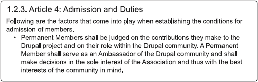

# 第 35 章：*[来自前文的标题]*

这种架构使得社区内的商业实体能够及时了解协会正在讨论的问题，同时让大会的投票成员能够从这些商业实体处获得知情意见，并且避免了商业利益控制协会合同、拨款或薪酬发放的可能性。此外，董事会有权拒绝任何申请加入的实体，"如果董事会认为有证据表明新成员申请人的行为、思想/观点/信仰和/或动机对协会利益不利"，^(34)并且随时，"一位被接纳的成员可以通过董事会的简单决议终止其成员资格。"^(35)

对于永久成员而言，加入（和终止）的程序则更加民主。要成为永久成员，个人必须由一位已经是永久成员的人推荐。获得推荐后，该个人需向董事会主席提交申请。由大会投票决定是否接纳该申请人；如果有三分之二的大会成员同意，则该个人被接纳为永久成员。顾名思义，永久成员没有任期限制（“永久成员资格期限无限。”），但永久成员资格可由大会三分之二多数投票撤销。^(36)

---

³² Drupal，关于页面，`association.drupal.org/about/introduction`

³³ Drupal 协会章程，1.3.1 第 10 条，`association.drupal.org/system/files/statutes-en.pdf`

³⁴ Drupal 协会内部规定 1.2.3 第 4 条，`association.drupal.org/system/files/internal-regulations-en.pdf`

³⁵ Drupal 协会章程 1.2.4 第 8 条第 3 节，`association.drupal.org/system/files/statutes-en.pdf`

³⁶ Drupal 协会章程 1.2.3，第 7 条第 3 节及第 2 节，`association.drupal.org/system/files/statutes-en.pdf`

**图 35-5.** Drupal 协会内部规定 成员资格 接纳与义务

大会还通过（公开表决）投票选举他们中的哪些人进入董事会。任何寻求董事会职位的永久成员都必须向主席提交一份申请，说明他们的动机和拟议的贡献。如果候选人获得大会三分之二多数投票批准，他们便正式成为董事，不过是由董事会其他成员——而非大会——投票决定哪位董事担任哪个职位。换句话说，大会不能直接投票选举主席，只有大会批准的人才有机会成为协会主席。^(37)

### 故事仍在继续

正如开头所述，Drupal 的历史远不止本文所涵盖的内容。除此之外，它还包含了 Drupal 的商业化成长、Drupal 作为企业级软件的演变，以及本书中隐含的 Drupal 7 的发展历程。Drupal 是一个极其混乱的系统，却能产生出奇特功能的结果……就像自然一样。然而，它并非完全随机；本章所叙述的事件表明，影响 Drupal 生态系统的关键行动帮助了 Drupal 社区所享有的成功。此外，很明显，这个不断发展的软件项目仍然对其历史进程和广度的改变持开放态度——也许是因为另一个笔误或服务器崩溃，也许是因为你。

 **注意** 本章的讨论、更新和相关资料可以在 `dgd7.org/history` 找到。

---

³⁷ Drupal 协会章程 1.4.2 第 18 条及 1.4.3 第 19 条，`association.drupal.org/system/files/statutes-en.pdf`