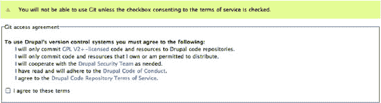
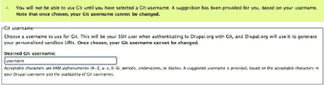
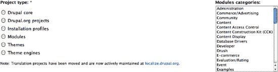
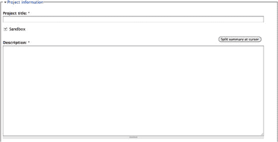

# 打造你的 Drupal 职业生涯

## 规划你的时间

许多全职 Drupal 承包商和开发公司在前几个 Drupal 项目之后，往往会大幅提高收费标准。这并不意味着他们在坐收渔利，而是表明他们致力于长期遵循最佳实践、选择可持续方案并积极参与社区建设，以确保自己走在正确的轨道上。正如我们目前所了解的，这能为客户节省大量金钱和时间，因此实际上是一项不错的投资。

本章还将强调其他时间与规划变量，例如沟通项目“完成”的标准、与社区合作，以及与项目中的其他参与者协调。核心要点是，你应在开发计划中留出充足的时间，以便“三思而后行”，并将你对特定任务的预估时间至少翻倍。

将学习时间或社区参与时间纳入预估中，方式可以是设定一个让你每周用于客户工作的时间少于 40 小时的时薪费率，也可以是将时间预估加倍，从而直接将这些活动包含在内。

## 善用现有资源

除了能迈入这个领域，在 Drupal 社区建立联系还能为你提供一个安全的环境，以便你提问、了解他人的做法，并在需要时获得帮助。当你需要额外助力时，还可以参考一些其他资源。

### 安装配置文件与发行版

Drupal 发行版是一种利用通用功能快速起步的方式，让你的新网站能够受益于那些已经了解特定小众受众需求的人们的研究和辛勤工作。只要发行版得到了良好的支持，其用户也能受益于一群志同道合的用户社区、未来发展路线图，以及针对该特定配置的支持资源。

如果某个安装配置文件非常适合你的项目目标，那么它可能以更低成本提供超出预期的成果。你可以访问 `http://drupal.org/project/installation+profiles` 来开始寻找合适的配置文件。

### 来自朋友的一点帮助

了解在遇到棘手问题时可以求助谁是一件好事，所以从一开始就记下一些资源。一个通常不错的主意是，记下一些经验丰富的开发者，以便你能够咨询他们，请他们评估不同的架构策略、推荐模块，或帮你避免潜在的陷阱。

付费支持的另一个良好来源是与你所依赖的模块或解决方案的维护者建立关系。还有谁比模块的作者更能告诉你为某个模块添加新功能的成本呢？支持模块维护者也有助于确保该解决方案的长期可持续性，这意味着在你升级到 Drupal 8 及更高版本时，它更有可能继续得到支持。

与经验丰富的开发者或策略师合作，可能意味着要为项目的很小一部分预算更高的费率，但这通常非常值得。一小时的洞察可能为你节省数千美元的变通方案和重构成本。

## 打造你的 Drupal 职业生涯

如果规划、开发和支持 Drupal 网站的规则已经改变，那么 Drupal 开发者的职业生涯反映了新方法也就不足为奇了。我描绘了一幅管理良好的 Drupal 项目是如何组织的画面，并重点介绍了你在 Drupal 项目的规划、执行、社区参与和持续支持中可能扮演的众多角色。

一个成功的开发者无需事事亲为，但她需要知道自己擅长哪些角色，以及何时该依靠他人。这意味着你有自由选择去做那些让你最快乐的事情，并专注于它。这也意味着你应该意识到，你有时可能需要填补空白。

### 找到你的位置

首先要弄清楚“谋生”会是什么样子。如果你开心且成功得超乎想象，你在 Drupal 上会如何度过你的时间？这里有作家、市场营销人员、业务分析师、设计师、活动家、架构师、编码员和培训师的一席之地。大多数 Drupal 网站，即便最小的那些，当这些角色都参与到开发和长期维护中时，也会更加成功。

弄清楚你想要担任哪些角色，这将有助于指导你的工作流程，并确定你可能会在哪些方面寻求帮助和参与。例如：

-   如果你对业务流程或某个特定行业的细微差别有很好的理解，你可能成为一名出色的分析师。你的工作将涉及制定项目目标，并确保 Drupal 符合要求。
-   如果你擅长沟通技术概念、组织能力强，并且能够激励他人，那么项目经理的头衔可能就在你的未来。你可以帮助召集项目参与者，并确保每个人都拥有继续前进所需的一切。
-   如果你的强项是设计师，你应考虑寻找具备更高技术能力的人作为高级支持或合作伙伴资源。这将帮助你避免以为某些事情会很容易，结果却陷入超出自己能力的项目困境。
-   同样，从更偏技术的背景出发来处理项目，可能会妨碍你寻找和与需要更多“创意”的客户合作的能力。如果你找到一个值得信赖的设计师，你就可以全身心投入学习 Drupal 的内部运作机制。
-   如果你有良好的人际交往能力并且希望提供持续支持，你可以考虑成为一名培训师或支持服务提供者。

思考你希望合作的项目规模和团队规模也是明智之举。一位 Drupal 专家可以扮演所有角色，并很快推出一个令人印象深刻的网站。其他项目则可能代表拥有众多参与者和自有资源的大型组织，其中每个职能都由一个完整的部门来管理。

如果你是那种希望对项目拥有很大影响力的人，那么你作为独立承包商，或是作为一个小团队或小公司的一员，可能会最快乐。如果你在规模巨大、复杂度高的项目中茁壮成长，那么你可能会发现自己适合作为大型 Drupal 团队的一部分。

### 展现自我

无论你是要独立创业、正在找工作，还是安于现状并定制印有“Drupal 巨星”的名片，你都不是孤立无援的。首要任务是参与社区，这样你才能有一个稳固的基础。你将立刻受益于那些在你之前走过这条路的人们的真知灼见，并且你将开始建立一个网络，在事情变得棘手之前就可以向他们求助。

也许最重要的是，你将把自己展现在潜在的合作者和雇主面前。任何欣赏以可持续的、面向社区的方式取得成功的开发过程的人，都会对你积极为 Drupal 生态系统做出贡献留下深刻印象。


##### 用户组与本地社区

希望到目前为止，你已经成为了 `drupal.org` 社区的一员。这是建立你在社区中的信誉，同时从社区获取所需资源的重要途径。如果你想要更多实践性的帮助，参与用户组是一个很好的学习方式。你可以向那些乐于分享有用发现的人学习，或者在你拥有专业技能时，给他人留下深刻印象（并找到工作）。除了培训和文档，用户组也是我们学习那些你一直听说的**最佳实践**的地方。你可以访问 `groups.drupal.org` 并根据地点或兴趣进行搜索，从而找到本地的用户组。

社区参与程度取决于你自己。如果你想从某个小组或社区中获得不同的体验，不妨考虑如何改进现有资源：

-   如果讨论主题过于基础，或者没有涵盖你想学习的内容，可以建议更符合你需求的会议主题、专项冲刺（sprints）或额外的学习小组。你肯定能吸引到一些志同道合的人。
-   如果你偏好不同的会议形式，可以提出替代方案。在明尼苏达州，我们每月为 Drupal 用户举办三次会议：一次全体会议，一次电子商务主题会议，以及一次在本地酒吧举行的社交欢乐时光。每次活动都由不同的人组织，吸引着不同的受众。
-   向朋友、同事以及那些可能还不知道这个小组的人推荐它。并非所有人都会感兴趣，但吸引新面孔总是好的，而且和已经喜欢的人一起聚会也很有趣。

在任何情况下，都要保持开放和积极的沟通，并在现有资源的基础上继续建设。目标应该是增强本地社区，使其更好地满足你的需求，同时也要认可其他人已经付出的努力。

##### 会议与训练营

`DrupalCon` 与技术会议截然不同，后者大多是大型公司产品代表的销售演讲。相反，你在 `DrupalCon` 参加的每一场会议，其演讲者可能是你依赖的某个模块的作者、你参与的社区的领导者，或是帮助 Drupal 蓬勃发展的公司代表。这是让你紧跟 Drupal 社区脉搏的重要方式，同时你还能了解新模块和解决方案、探索大型 Drupal 站点的内部结构、优化你的业务，并结识新朋友和合作伙伴。简而言之，参加会议极具价值，而且让客户知道你能跟上技术发展（他们无需为此操心）也很有意义。

同时，在 `DrupalCon` 上进行的讨论和专项冲刺定义了 Drupal 自身未来的发展方向。每位与会者都可以选择是旁观、学习，还是参与到帮助 Drupal 及其社区实现积极变革的行动中来。你可能最初以旁观者身份参加 `DrupalCon`，认为自己没什么可贡献的。但突然间，你可能会发现自己正基于“某些事情可以做得更好”的想法而采取行动。这种从旁观者到贡献者的转变，正是 Drupal 得以构建的方式。

差旅时间和会议费用常常令人望而却步，但别担心！本地化的“训练营”运动正在蓬勃发展，它们同样提供演讲者、工作组和实践学习机会。但训练营规模较小，且局限于特定区域。参加家乡附近的训练营是保持信息畅通的好方法，而且你获得的信息往往比 `DrupalCon` 上的更有针对性、更深入。由于 Drupal 无处不在，你很可能在本地训练营中见到一些重要的模块开发者。

##### “思考 Drupal，本地行动”

别忘了 Drupal 的首要目的：将拥有信息的人与发布这些信息的工具连接起来。在 Drupal 之外找到围绕你兴趣的社区同样重要。例如，围绕以下方面的社区：

-   兴趣爱好，如政治、教会团体、体育或户外活动团体，或任何你感兴趣的领域。
-   你已经拥有热情或经验的行业或专业领域。这可能包括非营利事业、房地产或艺术等特定行业，或任何其他专业领域。
-   与你的专长相关的特定技术，如图形设计、社交网络、数据库与编程技术、电子商务、语义网或内容写作。
-   能直接帮助你的业务的社区，例如专业人士团体、工会、联合办公空间或专业发展组织。

你几乎可以找到任何主题的志同道合的社区。思考如何将 Drupal 解决方案应用到现实世界需求中，同时促进个人或职业发展，这非常有趣。最重要的是，你很可能会作为驻地 Drupal 专家而大放异彩！这是建立信心的绝佳途径，甚至可能让你获得理想的工作——即从事 Drupal 开发，*同时*服务于你内心关切的事业。

很容易因为追求经验而以志愿者身份工作，导致自己过度承诺。请记住，要以同样的审慎态度对待每个项目，考虑目标导向的规划、持续的参与和长远的思考，*尤其是*那些无偿的项目——它们很容易因为无法持续投入时间而石沉大海。你在规划、预期、可持续性和持续参与方面学到的一切，对于志愿者网站来说更是加倍适用。

#### 独立创业：构建 Drupal 业务

也许你希望利用你的 Drupal 技能，通过独立创业、启动 Drupal 业务来开创一番事业，或者你可能正在为你现有的业务引入 Drupal 专业服务。找到你的利基市场后，你需要建立一个团队来帮助你为自己和客户维持顺畅的运营。

在承接小型项目时，考虑组建一个“团队”来处理开发和长期支持可能显得有点傻。一个人通常就能处理小型项目中的所有角色。但至关重要的是，要认识到网站上线并非项目的终点，而是线上 Drupal 存在的开始。始终需要考虑以下几点：

-   谁来升级网站，通过添加新功能或将其升级到新版本？
-   谁来负责内容管理和长期的内容管控？
-   谁来确保内容管理员获得他们所需的支持和培训？

最好在你开始第一个 Drupal 项目之前就想清楚所有这些事情。新手 Drupal 用户常常会惊讶地发现，他们无法在交付一个项目后就轻松地转向下一个付费项目。如果你的未来规划中没有长期支持这一项，那么考虑找一个合作伙伴，这样你就可以可持续地卸下负担，而又不让客户陷入困境。


#### 构建 Drupal 职业生涯

在这个充满增长和专业化需求的时期，正是进入 Drupal 就业市场的好时机。在确定自己的兴趣所在之后，你可以开始寻找一份新的 Drupal 工作，或者将更多 Drupal 相关任务融入当前的工作职责中。

如果你在公司里是少数几位 Drupal 开发者之一，那么你的许多工作需求与独立承包商相同。你无需承担经营一家企业的所有责任，但作为内部 Drupal 专家，你可能需要负责解释 Drupal 的独特工作方式。这让你肩负起重新设定预期、确立目标、制定计划，并在整个过程中凝聚各方人员的角色。请确保你拥有足够的时间、资源以及公司的支持，以便做出明智且可持续的决策。以正确且着眼于长远的方式行事，能让你成为办公室里的英雄。

或者，你可能会考虑在一支大型 Drupal 团队中担任一个小角色，比如作为开发和咨询团队的一员。这类公司中，有些优先考虑可持续性、社区精神和良好流程，而另一些则只想快速产出大量工作。你决定在那里工作的部分因素，将基于他们是否愿意按照你期望的方式工作。因此，请务必询问他们的工作流程，并判断自己适合的位置。

### 构建 Drupal：以贡献者的身份谋生

我们对 Drupal 使用得越多，就越能发现可以改进的地方。每一位新用户都会带来新的视角、丰富的经验以及解决沿途问题的新方法。Drupal 使用者与贡献者之间的区别，仅仅在于是否愿意将这些见解、策略和解决方案与整个社区分享。有时，一次有价值的贡献不过是用户组会议上一个富有洞察力的评论。有时，它可能是对 Drupal 关键部分的一次重大重写。无论大小，每一项改变都是 Drupal 及其社区结构中的一条永久线索。

以这种方式贡献，是在帮助他人的同时帮助自己的有益途径。通过公开解决自己的问题，你可以从拥有共同目标的人那里获得新的见解。在此过程中，你也在建立声誉，为客户提供持续的可持续性支持，并参与到让 Drupal 对更多人更具可行性的进程中。

尽管回报丰厚，但*不*以这种方式贡献的主要原因在于资源匮乏。一些开发者已经找到了建立商业模式的方法。我们越能支持并识别这些模式，大家就会过得越好。

#### “回馈”的益处

“回馈”这个词带有利他主义和志愿精神的意味。把你花了时间（本可以赚钱）开发的东西免费送人，看起来非常慷慨。事实上，这是一种相当愚蠢的商业模式：赠送有价值的东西是不可持续的，所以这样描述它忽略了真正的商业逻辑。

##### 做你该做的事——但做得更好

在跳到“赠送”这个环节之前，先想想你最初为什么要编写一个模块。通常，你的动机是满足某个特定目标：无论是更高效地执行任务、通过社交网络建立联系、增加社区参与度，还是在流量激增时保持在线。简而言之，你的目标不是*送出某些东西*，而是*为自己创造更好的东西*。

软件之所以独特而美妙，是因为一旦你将其送出，你仍然拥有它。囤积你为解决自身问题所付出的努力成果，通常不会带来什么好处。毕竟，处理流量问题并没有专属的专利收益。但如果其他有相同需求的人能就他们自身的经验提供反馈，你就能像他们从你的见解中获益一样，从他们的见解中获益。

##### 参与对话

一些更广泛的努力，例如易用性、媒体处理、联系人管理或与远程系统集成，需要大量的工作。当 Drupal 妥善处理这些事情时，将是一个巨大的胜利，能吸引更多用户，并无疑有助于拓展你的业务。但完成这些影响深远的任务需要一个相当大的团队，而你可能不具备这样的条件。

你越是能够沟通、参与并推动一项你关心的计划，就越能影响那些对你业务影响最大的解决方案。Drupal 让每位用户都能在这一过程中扮演主动或被动的角色。每一个扮演主动角色的人，无论贡献多么微小，都能影响 Drupal 的未来，使其更符合自己的目标。

##### 社区声望

在像 Drupal 这样联系相对紧密的社区中，很容易分辨哪些人是在贡献，哪些人只是在消费。如果某位模块维护者点击了一个支持请求关联的用户账户链接，她会看到什么？是一系列只写着“订阅”的评论，还是有意义的评论和有用的补丁？大多数维护者会对来自其他贡献者的问题做出更快速的响应，因为他们可能会从那个人那里得到进一步的帮助或贡献——或者仅仅是出于基本的尊重。

##### 知名度

我们都有虚荣心，有些贡献者“回馈”的唯一目的就是*被看到*在回馈。这同样有效。让你的名字出现在一个备受好评的模块上，是公开展示你 Drupal 技能的好方法，同时也能吸引那些理解支持贡献型 Drupal 开发者价值的客户。


#### 可持续性至关重要！

如果我们都开始认为“回馈”Drupal 不过是一种没有实际好处的志愿行为，那么我们就很难将此事置于工作、家庭和其他责任之上优先考虑。如果每个人都认为 Drupal 就是“免费获取东西”，而不是通过使用和支持一个能帮助我们未来持续推进自身目标的平台来推动自身发展，那将是不可持续的。

在这方面仍有工作要做，因为很少有人会直接支持维护者的工作。我们通常优先满足自己和客户的需求，固守着 Drupal 及其模块应该免费构建、修复和支持的观念，而忘记了有时投入少量资源就能服务于长远目标。

危险在于形成了对志愿行为的依赖。有时这意味着最富有成效的开发者是那些拥有大量空闲时间的人。例如，如果一名学生在空闲时间编写了一个非常棒的模块，她是否获得报酬并不重要，因为她乐于获得学习经验。由于她能编写出如此出色的模块，一家 Drupal 公司在毕业后很快就录用了他。

她的新雇主可能*希望*她继续开发这个出色的模块，但他们的职责是让她有薪工作。只要没人愿意为这个模块的开发提供资金，他们就需要让她从事能为付费项目带来可交付成果的工作。因此，这位开发者的日常工作充满了客户项目，而她的空闲时间则被分割给 Drupal、家庭、朋友和其他爱好。一个关键模块失去了一位优秀开发者的关注，这对依赖该模块的人来说是一个大问题。

作为一个社区，放弃这个开发者模块所提供的功能是不切实际的，给她写愤怒的邮件，坚持让她放弃家庭时间来为我们工作，也是不礼貌的。虽然可能有五万人依赖这个模块，但当前没有一种机制来要求我们每个人贡献出那微小的一部分，以直接维持其开发。只要大多数 Drupal 用户仍然抱有“有人”应该完全免费地修复或更新代码的期望，这个问题就会一直存在。

#### 潜在的商业模式

我描绘的前景可能相当暗淡，但 Drupal 多年来一直蓬勃发展。这是因为任何投入 Drupal 的努力都能带来巨大的杠杆效应。如果一位开发者或最终用户投入他们本可能花在专有解决方案上的一半精力，他们获得的收益将远超采用专有解决方案。

正因如此，有许多间接的方式来支持 Drupal 和开源软件，这构成了贡献者们为了自身需求和我们的共同利益而推动 Drupal 发展的理由。

##### 说服你的客户认识到贡献的价值

大多数 Drupal 贡献者通过为客户开发项目来维持生计。最理想的情况是，客户直接为开发者在贡献代码上花费的时间付费。这符合客户的最佳利益，原因就是前面列举的“回馈”的所有好处。社区贡献可以让你为客户构建的工具，相比你编写专有软件，能以更少的投入更好地运行。

以一个旨在增加销售额的网站为例。客户付费构建一个解决方案，当访客进行关键词搜索时能提供产品推荐。如果你提出将这个功能作为模块发布的想法，客户可能会担心“拱手送人”——即将他们的竞争优势交到竞争对手手中，对方可能会以此对付他们。

但让我们重新审视网站的目标——是增加销售额，而不是成为一家维护软件的公司。如果这个模块对其他人开放，`Drupal.org` 上可能有人会提出改进搜索算法的建议。另一个用户可能会发现并修复一个危及网站访客安全的安全漏洞。原始客户将从这些改进中受益，从而增加销售额和消费者信心。当需要升级到 `Drupal 8` 时，会有助于开发和测试升级路径。因此，客户可以持续进步，获得新的销售改进功能，而付出的努力远少于内部承担全部开发负担。

相比之下，一个保持专有的、一次性的模块，安全漏洞和错误会被掩盖，因为反正没人会看到，而客户则要为每一次修改和修复向开发者付费。这个功能现在成了增长的障碍，因为其全部维护成本都由该客户承担。

要让客户付钱给你编写开源代码，以便他们能把自己的秘密公开，这并非总是易事。但如果你从“目标优先”的开发流程开始，就有可能向精明的客户展示如何利用 `Drupal.org` 来进一步实现自己的需求。

##### “开发+”模式

对客户来说“足够好用”的东西，通常比能够被贡献和支持的东西更便宜。在这些情况下，尝试向 `Drupal.org` 贡献代码是困难甚至毫无意义的。然而，在参与多个项目后，Drupal 开发者开始幻想一些项目，这些项目能简化流程、改善客户使用 Drupal 的体验，并让他们能够事半功倍地完成更多工作。实际上，这使得开发者成为了消费者，她开始贡献那些能“给自己挠痒痒”的代码。

在 `CCK` 模块出现之前，对于用户来说，向现有内容类型添加基本字段很困难，但对程序员来说相对简单。例如，给一篇文章添加副标题可能花费不到一小时。但这项任务变得重复，开发者们开始渴望一种更自动化的方式来完成它。于是，`CCK` 模块诞生了。

将 `CCK` 从一个好主意变为可行的解决方案耗费了数千小时的开发时间。即使是最好的客户经理也很难说服一个客户，让他们资助一千小时的开发工作，以便让用户能够添加字段。因此，`CCK` 的开发源于必要性，以及开发者们对反复执行相同任务的共同挫败感。

经过这番投入，`CCK` 成为了 Drupal 作为一个内容管理系统灵活性和成功的关键因素。但如果没有几位有远见的程序员愿意将时间投入到这个解决方案中，没人能预见到这一点，也不会有人为此投入资金。

这样的故事可以重复讲述很多遍，它也是我们今天所知的 Drupal 结构的组成部分。每一次，为这些努力贡献的时间都是由开发者在业余时间或由能够从 Drupal 自身的长期改进中获益的开发公司自愿奉献的。关键结论是，我们可以通过将自己过剩的资源投资于我们相信的解决方案来创建一种商业模式，从而使其成为我们自身和未来客户更可行的资源。


### 开发产品套餐

`安装配置文件（Install profiles）`是开始构建网站的一种方式，它基于对网站用途或使用人群的某些假设。例如，一个仅用于博客的安装配置文件可以让博客类网站快速启动并运行，并配置好常见的博客文章、评论和分类功能。

理论上，你可以将这些工作打包，作为基于此平台的托管服务提供给博客网站。但请谨慎行事！在竞争激烈的市场中，你的安装配置文件很可能在其他地方被更便宜地下载和安装。

产品本身并非 Drupal 的安装程序，而是围绕它所预装的知识、公共资源和支持模式。你需要瞄准自己已经熟悉的特定人群，或者寻找一位已经了解该市场的主题专家。努力识别共同需求，并开发满足这些需求的解决方案。该解决方案可能包含安装配置文件或托管服务，但真正的模式或许是培训、社区活动，或是建立对每个参与者都有用的关系和工具。

要构建一个能与专有方案竞争的商业模型极具挑战性，但这也是为新开发提供资金的有益方式，同时能确保它对资助者有用。

### 直接资助

前面描述的商业模型描绘了一种模式：我们必须找到间接的方式来覆盖我们为贡献 Drupal 所花费的时间。但为我们在开源解决方案上投入的时间买单的最“诚实”的方式，是带着明确的资助目标来获得报酬，以便我们能够投入时间进行贡献。这出于多种原因都颇具挑战性，但并非不可能。

最好的方法是联系资助者和拨款组织。这些组织正越来越多地看到那些让开发者感到沮丧的重复性资源投入。当一个基金会为 100 个非营利组织提供资源，却发现它们仅仅设法部分实施了同一解决方案的 100 个副本时，它们会开始意识到这是徒劳的。如果它们能看到这种模式，就有可能通过一份资助提案来打动它们，该提案概述了一个能同时服务于众多组织的通用方案所能带来的广泛影响。

也有可能直接向项目的用户群求助，让他们知道你具备承接有偿工作的能力。有充分的理由支持支付模块维护者来修复模块本身的问题，这成本可能相当于一个强力变通方案的费用，而后者否则需要被反复绕开成百上千次。

### 设定预期

在确定了你的总体贡献目标并决定哪种商业模式可能适合你的工作后，你就要开始细化你实际能投入多少时间来支持你的工作。你每天能投入几个小时？还是每年几个小时？你的选择纯粹出于财务考虑，如果有人能提供资助，你就会腾出时间来做贡献工作？

在项目页面上包含这些信息非常重要，方法是在 `README` 文件、你的用户个人资料或模块的描述页面上设置“维护状态”，并提供一小段关于你状态描述的文字。

例如，如果你为客户开发了一个模块，但项目完成后无意继续维护，你应该将模块状态设置为“正在寻找共同维护者”或其他能表明你预期参与程度的状态。

此外，如果你可以承接付费工作，请确保在模块页面上包含该信息，并注明所有帮助你实现当前功能的人。这是一种在获得支持的同时，又能感谢那些迄今为止支持过你的人的有用方法。

## 不断进步

Drupal 为数以十万计的网站提供动力，并为成千上万的开发者提供了富有成效且回报丰厚的工作。而且它只会变得更好：每一个管理得当的项目都会有一个新的成功故事，帮助其他网站所有者做出转型的抉择。而每一次贡献，无论大小，都让开发者更容易利用 Drupal 交付出色的成果。

通过以正确的心态对待 Drupal，我们可以通过武装合适的人员来掌控项目中正确的方面，从而实现我们的目标。虽然起初可能有些棘手，但 Drupal 的持续进步归功于用户们脑海中一盏又一盏灯泡被点亮——他们意识到自己可以对信息传达和在线社区产生影响。坚持下去，做好规划，记住 Drupal 的初衷，你将成为下一个 Drupal 成功故事背后的推动者。

每一位 Drupal 开发者都将其职业生涯归功于它的贡献者，而每一位 Drupal 用户都有可能成为下一个贡献者。通过以正确的心态接触社区，我们可以为推动 Drupal 迈向新高度的持续动力做出贡献。就像 Drupal 7 和之前的每个版本一样，Drupal 8 及后续版本将超越其各部分的总和，比任何一个人所能构想出的都要优秀。现在是与 Drupal 合作发展的绝佳时机！

 注意 请访问 `dgd7.org/sustain` 查看关于本章主题的讨论和更新——这些主题对你的成功和 Drupal 的成功至关重要。

## 第三十七章


## 维护项目

作者：Sam Boyer 和 Forest Mars

*“空谈是银，代码是金。”*

这一原则——是 *“要么拿出行动，要么闭嘴”* 的一个稍微温和的版本——自 Drupal 社区规模尚小、几乎不配称为社区以来，就一直驱动着它。随着项目规模扩大，“代码”的含义已扩展到更接近“贡献”，涵盖了设计师、文档撰写者和培训师的基本工作，没有他们，Drupal 就不值得被写进书里。不过，在本章中，我们将聚焦于最初的定义：贡献代码；更具体地说，是在 `Drupal.org` 上创建和维护一个项目。我们还将讨论一些推荐的开发工作流程，特别是如何利用 Drupal 选择的版本控制系统 Git。

 **注意** Drupal 直到最近才采用 Git 进行版本控制。因此，本章讨论的一些用户界面和流程可能与最终的生产环境有所差异。这些不一致应该很轻微，但我们仍尽力提供了相关规范手册文档的链接。事实上，作为迁移“下一阶段”的一部分，Git 集成的许多改进正在逐步推出。


### 什么是 Drupal 项目？

Drupal 项目是可作为 `.zip` 或 `.tar` 文件下载并安装到 Drupal 站点上的代码包，同时还包含配套功能、版本控制仓库和问题队列。每个项目在 Drupal.org 上都有自己的项目页面，路径为 `/project/PROJECTNAME`。例如，token 模块的项目页面位于 `drupal.org/project/token`。

Drupal 项目有多种不同类型：

- **模块：** 构成 Drupal 运行基础的架构模块。约 85-90% 的贡献项目是模块。它们的开发将在第 5 部分中介绍。
- **主题：** 前端开发、外观与体验、皮肤定制——不同术语，相同概念：主题负责生成标记代码。约 10-15% 的贡献项目是主题。主题开发将在第 15 章和第 16 章中介绍。
- **安装配置模板：** 模块、主题和初始安装逻辑的软件包，在第 34 章中有详细介绍。这些仅占贡献项目的 1% 多一点。
- **翻译：** 核心和/或 Drupal 模块的翻译不再作为 Drupal.org 上的项目处理，而是通过 `localize.drupal.org` 进行。翻译流程差异较大，请参阅该网站以及 `dgd7.org/translate` 获取更多翻译信息。
- **主题引擎：** 主题模板引擎——例如，PHPTemplate、Smarty、PHPTAL。现存不到 10 个，且大部分已废弃多年。理由充分：PHPTemplate 是事实上的标准主题引擎。绝大多数主题都基于它构建。虽然本章的说明也适用于主题引擎，但开发一个新引擎的可能性极低。

所有托管在 Drupal.org 上的项目类型，其创建和维护流程几乎完全相同，因此为简洁起见，本章将统称为“项目”。在任何模块、主题或安装配置模板的处理方式不同的情况下，我们会特别说明。

无论您创建哪种类型的项目，在 d.o 上发布项目都伴随着某些责任。这不像将项目发布到 GitHub 这样的公共代码仓库系统——您的项目将成为 Drupal 社区向全世界提供的资源的一部分，因此，您对该项目的管理不仅反映您个人，也反映整个社区。如果您的模块在很大程度上重复了另一个模块的功能，则会增加找到合适工具的难度。如果您的项目存在安全漏洞，则意味着为本已超负荷工作的 Drupal.org 安全团队增加了工作量，并会发布安全公告——这总会让社区蒙羞。正如我们稍后将讨论的，项目“沙盒”阶段有助于缓解此问题，但您在考虑向 Drupal.org 贡献新项目时仍应牢记这一点。

### 设置您的 Drupal.org 帐户以进行贡献

创建新 Drupal 项目是一个多步骤过程。您需要同意将代码托管在 Drupal.org 上的条件，并配置您的 Drupal.org 帐户以用于 Git 访问。然后，您可以选择一个项目命名空间并将代码上传到项目的沙盒。拥有项目沙盒后，您就可以申请批准您的项目以打包完整版本。请注意，所有沙盒代码都与特定用户的帐户关联，这与具有维护者的完整项目代码略有不同，后者不受该用户帐户的支配。此外，没有“公司”帐户的规定，因此每个 Drupal.org 帐户必须由个人或个人设置，而不是团体。

拥有 Drupal.org 帐户后，第一步是登录并阅读并同意上传代码的条件。这些条件位于您的个人资料标签页下，**编辑** `images` (`images/U001.jpg`) **Git 访问**标签页中（参见图 37-1）。



***图 37-1.** 上传代码的条件*

这些链接中的文档阐述了 Drupal 社区关于贡献的理念，详细说明了与项目维护相关的责任和期望，并解释了将代码放到 Drupal.org 上的法律要求。

这些法律要求虽然简单，但至关重要，因此我们在此对“所有上传到 Drupal.org 的代码必须兼容 GPLv2+”的含义进行释义。实际上，这包含三个条件：

- 首先，如果您想在项目中包含外部库，则只有在库的许可证兼容的情况下，才能将该代码直接存储在项目的 Git 仓库中。
- 其次，将您自己未另行许可的代码推送到 Drupal.org 服务器上的 Git 仓库这一行为，即表示将该代码许可为 GPLv2。此法律协议会自动打包到您的版本中。
- 第三，如果您将他人的不兼容许可证的代码放入 Drupal.org 仓库，则该代码将被删除。反复无视 GPLv2 要求者，其帐户可能被暂停。这是社区对贡献的*唯一*法律要求，但却是必不可少的。

勾选复选框并点击**保存**同意后，您将进入第二步，即创建 Git 用户名（参见图 37-2）。通常，这会与您的 Drupal.org 用户名匹配，并限制使用 URL 安全字符；但这不是强制要求。同样，您可以将密码设置为与 Drupal 帐户相同或不同。



***图 37-2.** 创建 Git 用户名*

### 创建沙盒项目

完成一次性设置步骤后，就可以深入创建项目了——准确地说，是沙盒项目。Drupal.org 使用沙盒项目作为一种方式，让任何人向 Drupal 贡献代码，同时防止全局命名空间被占用，并尽量减少不安全的（或恶意的）代码进入不知情用户所建站点的机会。在您能够在全局命名空间中创建功能完善的项目之前，需要经过一个社区审批流程。

在您完成此社区审批流程之前，您的沙盒项目在几个关键方面与完整项目有所不同，主要区别在于使用数字值代替项目短名称。（项目短名称在 Drupal 钩子系统（hook system）中用于为函数添加前缀，但这种数字替换不会造成任何问题。）

我们稍后将详细讨论该审批流程，但创建沙盒几乎与创建完整项目相同，因此说明在很大程度上可以互换。

 **注意** 有关沙盒项目如何工作的更多信息，请访问 `drupal.org/node/1011196`。

请前往 `drupal.org/node/add/project-project`，您将看到项目创建表单。



***图 37-3.** 项目类别*

### 状态

大多数情况下，新项目应分别将**维护状态**和**开发状态**标记为**积极维护**和**正在积极开发**。不打算发布完整版本的项目也可以上传到您的 Drupal.org 沙盒，例如，为了与其他类似项目共享代码。以这种方式共享代码，您可以利用 Drupal.org 集成的 Git 工具进行高度协作的代码查看和跟踪。


### 项目信息

你的沙盒项目在创建之初会使用一个数字作为名称：沙盒项目不会使用你为项目选择的名称，而是使用一个临时数字名称作为标识。这是为了解决更大的命名空间问题而采取的方法，但它确实增加了一些复杂性。为了配合钩子系统并防止与其他模块中的函数冲突，完整项目会使用其项目短名称作为函数名的前缀。你的沙盒项目的数字名称不适合这样做；相反，应使用一个与你的项目标题具有明确对应关系且在 Drupal 命名空间中唯一的前缀。这并不能保证你选择的前缀在你准备发布时仍然可用，但如果可用，你就省去了一步（参见图 37-4）。

-   **项目标题：** 沙盒的人类可读名称。此字段可以更新。
-   **沙盒：** 在你申请或获得完整的 Git 帐户之前，"沙盒"将默认被选中，并且是你唯一的选择。我们稍后会讨论这个流程。即使你拥有了完全访问权限，将项目作为沙盒项目启动仍然是一个好主意；这样，当你将它转为完整项目时，它已经包含代码并可以立即使用。
-   **描述：** 描述是向 Drupal.org 访问者传达项目目的的主要位置。编写良好的描述能清晰地表达项目旨在服务的目的或用例。如果你的项目有依赖项（无论是外部库还是其他 Drupal 项目），请提供链接。如果你的项目与另一个已有的 Drupal 项目处于相似的问题领域，请提供该项目的链接，并解释你的项目有何不同。当然，在创建新项目时，特别是你的第一个项目时，你可能并不清楚所有这些信息——别担心，你之后随时可以更新描述！完成后，提交表单；你的项目页面将被创建，一个新的 Git 仓库将在 Drupal.org 服务器上生成，随时准备接收你的代码。



**图 37-4.** 项目信息

 **注意** 关于命名空间：要确定你打算使用的函数名前缀是否可用，请访问 Drupal.org 并在 URL 末尾添加 `project/desired_name`。如果你进入了一个项目页面，则说明该命名空间已被占用。如果显示"未找到文件"，则表明该命名空间在你发布时可能可用。但请记住，即使尚未有完整发布版本（因此也没有项目短名称），另一个沙盒项目可能已经预留了这个命名空间。

### 深入 Git

Git 是一个强大的工具，使用它有时感觉像开着法拉利去买菜。我们在第 2 章中介绍了它用于个人版本控制的用法，但那只是小试牛刀——虽然涵盖了最常用的 Git 操作，但并未触及它的全部能力。即使对于习惯了其他类型源码控制的人来说，Git 也可能令人望而生畏；它对一些常见操作有陌生的名称，并且可能需要一段时间才能真正理解你的本地仓库如何与其他 Git 仓库（称为远程仓库）交互。但 Drupal 社区选择它作为首选的版本控制系统是有原因的：只要你坚持下去，你会发现 Git 不仅能够很好地管理你项目的代码，还能管理单个 Drupal 站点的代码库，甚至是跨服务器集群运行并与外部工具和部署策略集成的、高度复杂的基于 Drupal 的大型系统。

所有这些关于代码库、工具和系统的讨论，不应分散我们对维护一个开源自由软件项目真正意义的关注。使用像 Git 这样的分布式版本控制系统的真正原因，是为了让你能与其他高效协作，共同构建令人惊叹的产品。

网络上学习 Git 命令的资源几乎取之不尽——你可以直接从项目 Drupal.org 页面上的标签页提供的命令开始——但学习 Git 的工作原理对于用它来与他人协作维护项目来说是无价的。

我们将在本章剩余部分讨论一些命令和有用的技巧，但我们的重点实际上是项目维护的关键步骤，即那些帮助你推送代码到 Drupal.org 并创建发布版本的步骤。如果你想了解更多，本书末尾有一个关于 Git 资源的附录。请记住，在网络上搜索 "git + drupal" 时，2011 年之前的任何内容可能都没有太大帮助。当时 Drupal 仍在用 CVS，并且在切换之前的很多讨论都集中在如何让 Git 与 CVS 协同工作上。而且 Git 本身在最近的版本中也发生了足够多的变化，你需要确保获得最新的信息（当然，还有最新版本的 Git）。

要访问那个仓库，你需要使用 SSH（安全外壳协议），所以我们将快速绕道了解一下如何设置所有相关内容。

#### 管理 SSH

Drupal.org 使用 SSH 进行所有与 Git 仓库的认证通信，因此你需要确保正确设置了 SSH。在设置好 SSH 密钥之前，每次与服务器交互时都需要输入密码（假设你在命令行界面下工作——许多图形界面工具会为你存储 SSH 密码）。如果你选择继续使用密码认证，那么用于与你的 Drupal 沙盒仓库交互的 SSH 地址将类似于这样：

```
$ git clone dgd7@git.drupal.org:sandbox/dgd7/1041111.git
正在克隆到 1041111...
dgd7@git.drupal.org 的密码：
```

 **注意** 你的沙盒由你的用户名（此示例中为 `dgd7`）标识，而项目则由其分配的数字字符串（示例中为 `1041111.git`）表示，而不是其项目短名称。

如果你的密码被接受并且你有权访问指定的项目，则上述命令会将仓库克隆到你的本地系统（稍后会有更多关于克隆的内容）。如果你觉得密码麻烦或不安全，那么你可以选择使用基于密钥的认证方式，为此你需要在本地机器上生成一个密钥，并将其添加到你在 Drupal.org 的帐户中。

 **注意** 我们将跳过如何创建 SSH 密钥的讨论，因为这有点依赖于特定平台，并且网上有很多很好的教程。特别是 GitHub 的教程专注于配置 Git 所需的步骤：`github.com/guides/providing-your-ssh-key`，这是一个很好的起点。

一旦你有了公钥，请前往你的 Drupal.org 个人资料页面，点击"SSH 密钥"标签页。你会看到一个管理公钥的界面。添加你的密钥，它就可以立即用于所有 Git 命令了。使用基于密钥的认证方式，你无需在 SSH 命令中指定用户名，因此之前的命令变得更简单：

```
$ git clone git@git.drupal.org:sandbox/dgd7/1041111.git
正在克隆到 dgd7_example...
```

由于基于密钥的 SSH 地址少了一个尴尬的变量，我们将在本章的示例中使用它们。如果你使用的是用户名和密码认证，别担心——只需将示例中的 `git` 替换为你的用户名即可。不过，你可能会发现，一旦设置了基于密钥的提交认证，你就会想不通为什么还有人会使用更麻烦的密码认证。


