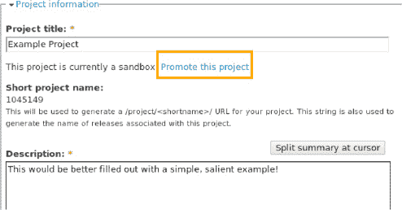

# 在项目上动手开发

现在你已经有了一个沙盒项目在等待，并且 SSH 已全部配置完毕，就可以开始编写和贡献代码了。第一步是设置好你的本地 Git 仓库。为此，我们需要通过 SSH 从 Drupal.org 克隆仓库：

```
$ git clone git@git.drupal.org:sandbox/dgd7/1041111.git
正在克隆到 1041111...
警告：你似乎克隆了一个空的仓库。
```

这个警告是正常的——实际上反而令人鼓舞，因为它表明你刚克隆的仓库是全新的、刚创建且空白的。在这个例子中，你克隆的是自己刚刚创建的项目，所以里头还没有任何内容。不过，你应该意识到，克隆一个仓库会完整复制该仓库的全部内容——也就是项目的整个历史记录——并将其放置在你的本地机器上。举例来说，克隆可能是一项带宽密集型操作，尤其是对于大型项目（在 Drupal 7 发布时，核心仓库大约有 50MB）。然而，拥有完整历史记录对于 Git 的去中心化、分布式功能至关重要，所以我们必须忍受初始克隆的大小问题。

现在你有了仓库，就可以开始进行添加、更改和提交文件的工作了——这些都是 第 2 章 和前面列出的 Git 资源中所涵盖的 Git 基础知识。不过，为了快速回顾一下，让我们在新的仓库中添加并提交一些文件。为简洁起见，以下示例使用 `<?php>` 作为代码的占位符：

```
$ echo 'name = "DGD7 示例模块"' > 1041111.info
$ echo '<?php>' > dgd7_example.module
```

或者使用你喜欢的图形编辑器添加这些文件。构建代码后，`git status` 应该会显示你有未跟踪的文件，如下所示：

```
$ git status
# 位于分支 master
#
# 初始提交
#
# 未跟踪的文件：
#   （使用 "git add <文件>..." 来包含将要提交的内容）
#
#       dgd7_example.info
#       dgd7_example.module
提交为空，但存在未跟踪的文件（使用 "git add" 来跟踪）
```

这些文件目前只存在于你的工作树（即工作目录或工作副本）中，而不在你的索引（即暂存区）里。接下来，我们将把这些文件添加到暂存区索引中，然后提交它们。请注意，你提交消息中的 SHA1 哈希值会不同——该哈希值是根据仓库内容（内容是一样的）以及提交时间（时间不同）计算得出的。

```
$ git add dgd7_example.info dgd7_example.module
$ git commit -m '初始提交'
[master (根提交) c8a69f9] 初始提交
 2 个文件已更改，2 次插入(+)，0 次删除(-)
 创建模式 100644 dgd7_example.info
 创建模式 100644 dgd7_example.module
```

至此，我们完成了 第 2 章 中的全部操作，因为到目前为止所有操作都是本地的。（这是 Git 与其非 DVCS 前辈最重要的区别之一：你的代码存储在本地仓库中。）接下来，我们将额外执行一步操作，将此提交推送到远程仓库，在这个例子中，就是推回 d.o 上的 Drupal 沙盒：

```
$ git push origin master
正在统计对象: 4, 完成.
使用最多 2 个线程进行增量压缩.
正在压缩对象: 100% (2/2), 完成.
正在写入对象: 100% (4/4), 300 字节, 完成.
总共 4 (增量 0), 复用了 0 (增量 0)
正在解包对象: 100% (4/4), 完成.
To git@git.drupal.org:sandbox/dgd7/dgd7_example.git
 * [新分支]      master -> master
```

恭喜——你刚刚将你的第一段代码放到了 Drupal.org 上！请注意，这只是你的新 Drupal 项目（或多个项目）的开始。Drupal 沙盒旨在成为一个开发空间，你可以在此积极工作并提交代码。记得要频繁提交。这将使你的沙盒拥有更丰富的历史记录，以便在申请活跃状态时，模块审查团队能够了解你的编码风格。不要等到你想要发布完整版本时才上传代码的最终版本！这里看重的不是完美，而是过程。

关于通用项目维护，目前就没有更多可说的了——你的沙盒怎么用完全取决于你。如果你只是随便玩玩，无意与外界分享你的代码，那也没问题——沙盒的唯一限制是一些大小方面的限制，而且这些限制主要是为了防止滥用。

不过，如果你想真正与更广泛的 Drupal 社区分享你的项目，就需要采取下一步行动，将你的沙盒升级为完整项目状态，这是拥有官方发布版本的必要条件。

## 从沙盒镇到项目城

所以，你一直在愉快地开发你的模块（或其他项目），快速而自由地在本地提交，并在达到合适节点时推送到 Drupal.org，你开始觉得是时候让你的项目从沙盒状态毕业，加入完整的、面向用户的项目的行列了。太好了！这是项目生命周期中的一个关键节点。

一旦你的沙盒中有了代码，你就可以申请权限，将其提升为完整状态的一流模块。你的项目需要在 Drupal.org 上拥有官方发布版本，就必须获得此批准。不过，你只需申请一次，即在你第一次想要升级项目的时候。具体来说，你不是在申请升级单个项目；你是在申请为自己授予一个角色，该角色使你能够升级你的项目（使用你沙盒中的代码来证明你理解并满足 Drupal 的基本要求）。一旦你第一次被授予此角色，只要你的代码始终遵守 Drupal.org 制定的基本标准，你就可以在需要时升级你的任何沙盒项目。

完整发布版本的主要好处之一是，可以获得对 Drupal 完整测试环境的沙盒访问权限。在撰写本文时，沙盒项目还无法利用 Drupal.org 的自动化测试框架。

为了确保开发者熟悉 Drupal 的编码规范并编写安全的代码，在你第一次想要升级实验项目时，需要申请完整的 Git 权限。这包括：

1.  准备一个待审查的分支。
2.  准备待审查的项目。
3.  在 `drupal.org/project/projectapplications` 提交申请。
4.  参与同行审查，以确保符合编码规范和安全方面的考虑。
5.  在 Drupal.org 上被分配相应的角色。

### 关于 Drupal.org 上的分支和标签

分支和标签，在 Git 中统称为 refs，有时在 Drupal.org 上被称为标签，它们是 Git 中的关键构建块，也是 Drupal.org 上使用的打包和发布系统的重要组成部分。Drupal 的打包系统只需要对分支和标签的工作原理有基本的了解（幸运的是），但深入理解这一点是值得的。Git 的真正优势在于其廉价的分支能力，因此，虽然我们在这里不会深入探讨，但你将需要更深入地研究 Git 所实现的开发效率，以便充分利用 Git 的强大功能。（并期待一些最佳用例被纳入 Drupal 的“下一阶段”Git 部署中。）

那么，refs 有什么特别之处呢？首先，它们被 Drupal.org 的打包和发布系统使用，只有符合特定命名约定的分支和标签才会被批准发布。一旦你理解了分支和标签的约定是如何运作的，你就能更好地理解 Drupal 项目版本背后的开发结构。


好的，作为一名高级文档工程师和翻译员，我将严格按照您的要求，将给定的英文文本翻译成中文，并保留所有格式标记。


#### 为你的应用准备分支

如果你有一个现成的 Git 仓库，并且已经准备好将其放到 `d.o` 上，你只需将 `git.drupal.org` 添加为该仓库的一个新的远程仓库，然后推送即可：

```
$ git remote add origin git@git.drupal.org:project/<项目名称>.git
$ git push --all origin
```

在这个例子中，我们将其添加为 `origin`，这是你的 Git 仓库使用的默认远程仓库名称。如果你已经设置了一个 `origin`（例如，你的主开发服务器），那么你可能已经知道如何将 `git.drupal.org` 上的远程仓库命名为你喜欢的任何名称。由于 Git 对 Tab 键补全提供了出色的支持，我们建议将其命名为 `git.drupal.org`。要查看你的本地仓库知道哪些远程仓库，你可以使用 `cat .git/config`。

在将 `git.drupal.org` 设置为远程仓库后，使用 `git push --all` 将你的完整代码从本地仓库复制到你在 `Drupal.org` 上的项目空间中。请注意，这将推送你本地仓库中的所有分支。

#### 准备你的项目以供审核

申请流程的主要部分是对你提交的代码进行审核，以确认它不是对现有 Drupal 功能的重复，并且满足特定的代码和许可要求。这些代码要求旨在确保所有在 `Drupal.org` 上正式发布的代码都是安全的、有良好文档的，并符合由 Drupal 传奇般的协作开发社区制定的特定编码标准，并且不会出现任何可能对其他 Drupal 用户产生不利影响的许可问题。

##### 编码标准

Drupal 有一套非常具体、详细且有良好文档的编码标准，可在 `drupal.org/coding-standards` 找到。来自其他 PHP 框架或语言的经验丰富的编码者可能不同意我们所做的一些选择，但编码标准是社区协作的关键部分。通过遵守编码标准，我们所有人都可以更轻松地阅读彼此的代码，我们节省了无数因语法选择或基于不同偏好重写代码而争论的时间，并且那些在全世界支持 Drupal 的人也从这些标准提供的一致性中受益。

幸运的是，得益于 Coder 模块（`drupal.org/project/coder`），遵守 Drupal 编码标准变得轻而易举。Coder 甚至可以为你完成大部分工作，读取你编写的内容并输出符合标准的代码。无论你是研究并内化编码标准，还是最后使用 Coder 进行清理，提供符合标准的代码是让你的模块为发布做好准备的第一步。

以下是 Drupal 编码标准的一些示例。这不是一个详尽的列表，但它旨在说明你的代码需要遵守的一些具体要求：

1.  所有类都应有注释。
2.  所有函数都应有注释。
3.  应实现（并通过！）简单测试。
4.  所有代码修订和补丁都应有注释。

##### 安全问题

安全问题可能更难发现，尤其是对于新手程序员来说。Coder 模块在这方面也能提供一些帮助，因为它会高亮显示某些安全漏洞——例如，对数据库查询或用户输入的不当转义。然而，它在处理更微妙的问题上帮助不大，因此请熟悉常见的 Web 应用程序漏洞（XSRF、XSS 等），并努力确保你的代码没有此类问题。新手程序员和 Drupal 新手可以在 `Drupal.org` 的“编写安全代码”（地址为 `drupal.org/writing-secure-code`）找到很好的入门点（另请参阅第 6 章）。

##### 许可

当你最初设置 Git 访问权限时，你同意仅将 GPL 许可的代码上传到你的沙盒。因此，作为你申请的一部分提交的所有代码都应该已经符合 Drupal 的许可要求。

##### 项目描述

审查你的项目描述，确保它对项目的作用提供了详细描述。如果你的项目与 `d.o` 上的另一个项目类似，你需要详细阐述它有何不同，以及为什么会重复这种功能。在提交申请之前，请确保所有数据都是最新的、清晰的，并且已经校对过。不要忘记包含你的项目页面的链接，并且，如果你的项目是一个主题，请包含一张截图。

#### 申请访问权限

申请本身并不复杂：在 `drupal.org/project/issues/projectapplications` 的 `Drupal.org` 项目申请中提交一个议题。

由于审核过程使用 Drupal 的项目议题追踪器，你需要填写以下表单字段：

*   组件（Component）： “新项目申请”和类别（Category）： “任务（task）”
*   状态（Status）： “需要审核（needs review）”
*   标题（Title）： 你的项目标题
*   描述（Description）： 你的项目描述（如上所述）

一旦获得批准，你将被授予创建完整项目以及将沙盒项目提升为完整项目的权限。如果出于某种原因，你的代码被认定不符合要求，你将被告知原因，并有机会进行必要的修复。虽然有些原因应该是显而易见的，但初学的 Drupal 开发人员有时会错过不太明显但同样重要的要求。

有关代码通常被退回改进的更详尽原因列表，请参阅 `drupal.org/node/539608`。

#### 获得访问权限

订阅议题队列以接收关于你申请的反馈，并在你的访问权限被授予时收到通知。一旦你获得访问权限，添加或更新项目的界面就会改变。现在，当你编辑你的项目以进行推广时，你会看到新的选项，如图 37-5 所示。



**图 37-5.** 编辑你的项目以进行推广

### 总结

如果你按照本章概述的说明操作，你将能够在你的 `Drupal.org` 账户上启用 Git 访问权限，创建你自己的项目沙盒并上传代码，并将你的 Drupal 项目（无论是贡献模块、主题还是文档）提升到一流的 Drupal 发布状态。

 **注意** 请查阅 `dgd7.org/maintain` 获取关于在 `Drupal.org` 上维护项目的资源链接。

## 第 38 章


## 为社区做贡献

**作者：Benjamin Melançon 与 Claudina Sarahe**

> *“人们来找我，询问如何做出贡献。我总是告诉他们，做自己想做的事。如果我告诉他们该做什么，那这件事就不一定有趣，也不一定能转化为我希望看到的热情。”*
>
> ——Dries Buytaert，Drupal 项目负责人
>
> *“一位贡献者具备三种特质：他们看到某件事，会说‘这太蠢了'，然后说‘嘿，我真的很想看到这个问题被解决'，接着他们会采取行动。”*
>
> ——Angela Byron，Drupal 7 维护者

有一种普遍的误解，认为必须成为程序员才能为 Drupal 做贡献。这是不对的；即使是对代码知之甚少甚至一无所知的人，也能通过多种方式为社区做贡献，从而帮助 Drupal 变得更好。事实上，这种情况一直都在发生：人们通过组织活动、回答问题以及赞助开发冲刺（sprint）来支持 Drupal 社区——这些都是社区发展所需的关键的非代码贡献。非代码贡献，例如指导他人和编写文档，是培养和发展个人在编码及配置 Drupal 方面技能的理想途径。发展社区意味着，一方面要壮大基础设施和人员数量，另一方面要提升社区成员的能力。

通过本章，我们将带领大家了解各种各样让 Drupal 成为一个更好平台的方式，这个平台可以用来构建网站、谋生、结交朋友，甚至可能创造一个更美好的世界，并以此作为本书的结尾。

 **注意** 本章本可以命名为“回馈社区”，但有些对 Drupal 贡献最大的人，似乎是在*得到*之前就已经开始给予了。

做贡献，就是对你感兴趣改进的事情采取行动。这正是 Dries 和 Angie（这两位对 Drupal 7 的所有改进进行了最终审查并提交的人）所传达的信息。试图在你并不感兴趣的领域做贡献，可能不会很有效。随着 Drupal 的持续发展，对更多贡献者和更多样化贡献类型的需求也在增长。作者希望本章能帮助我们所有人找到可以做出贡献的方式（如果我们尚未贡献的话），激励我们想要贡献更多，并加深我们对驱动 Drupal 成功的燃料——社区的理解。本章阐述了参与其中的理由，以及如何让你的贡献更有效的方法。本章也是对那些已经为 Drupal 做出贡献并仍在继续贡献的人们表达感谢的一种方式。

### 为什么要做贡献？

做贡献的理由有很多。为了创造或帮助他人所带来的内在喜悦，为了促进个人或职业的进步，以及出于对社区的承诺。对作者而言，做贡献就是改善你所在的地方。这就像给汽车换机油；它可能不会立即影响你，但从长远来看，它不仅会给你，也会给他人带来不同。

Evan Donovan（`drupal.org/user/168664`），Drupal 7 核心的数百名贡献者之一，在他的博客（`donanvan.covblogs.com/archives/040454.html`）中强调了贡献的五个理由：

*   学习新事物很有趣。
*   解决问题很有趣。
*   帮助他人很有趣。
*   你回馈给社区的工作可以被社区中的其他人成倍放大。反过来，他们的工作可以为后续的进步奠定基础。
*   有时，它甚至对你的求职前景有益。

Gábor Hojtsy（`drupal.org/user/4166`），Drupal 核心的主要贡献者，也是 Drupal 7 的 Locale 模块以及整个 Drupal 6 系列版本的维护者，将贡献的好处总结为提供以下能力：

*   处理酷炫的技术。
*   在一个国际化的团队中工作。
*   展示你的工作和才华。
*   旅行。
*   赚钱。

Gábor 是 Acquia（由 Dries Buytaert 在创立 Drupal 八年后联合创立的公司）最早聘用的人员之一，他认为为开源项目做贡献是在保护自己的职业生涯：

> *“如果你需要一个确保工作安全的好方法，我认为这就是一种方式。你的活跃工作经历遍布整个互联网，你参加过行业会议，在业内建立了自己的名声。当有人将你与那些在闭源遗留系统上工作、其简历内容（其中更多细节受保密协议约束）只能被部分采信的人相比时，对于一家公司来说，选择谁的风险更小呢？”*

#### 没有贡献，就没有 Drupal

我们——写作的作者和阅读的读者——之所以能在这里，是因为 Drupal。我们参与 Drupal（软件、社区活动、知识）的能力，完全建立在早期他人所做贡献的基础之上，这一切始于 Dries 开源他的代码那一刻。如果没有人挺身而出并做出贡献，就不会有 Drupal。

Larry Garfield（Crell，`drupal.org/user/26398`），核心贡献者，Drupal 数据库层的主要维护者，Palantir 公司的高级开发者，同时也是 Drupal 协会法律事务总监，他用“传递善意”（pay it forward）这个说法来描述自由软件是如何运作的。

> *“当你为一个开源项目工作或以自由软件许可证发布代码时，你是在为他人做事。一个你不认识的人，很可能也不认识你，将因你的行动而受益。你或许会从你所做的工作中受益，但那些从未为你做过任何事的人也同样会受益。而这正是关键所在。”*
>
> *“如果只有一个人这样做，世界会利用他的付出。但如果有一千个人这样做，你就会得到 Drupal。或者 Linux。或者 Apache。或者 Firefox。或者 KDE 桌面。实际上，它们是所有这些项目的总和。这些项目中的每一个都是成千上万人相互传递善意、并将善意传递给你的结果。最终的结果是一个健壮、健康的优质代码环境，更重要的是，形成了一种共享和相互支持的文化，甚至跨越了不同项目。”*
>
> *“在我的日常工作中，我使用 Drupal。我为 Drupal 编写了大量代码，包括核心代码和贡献模块，我的同事们也一样，我们尽可能多地将代码回馈给社区。我们是在向整个 Web 开发世界传递善意，以回报那些已经投入了上百万小时、成就了我们如今免费利用的一切的人们。这就是开源运作的根基。”*

Drupal 的成功在很大程度上归功于人们可以无障碍地进行贡献的多种方式。Drupal 的设计初衷就是可扩展的；它被设计成可以轻松地让人们沿途做出贡献。其软件的模块化特性对于技术和社区两者的迅猛发展至关重要。虽然 Drupal 通过将开发者的需求和快乐置于核心技术设计的前沿，开辟了一条堪称典范的道路，但一个开源技术项目的成功，在于代码的构建、维护和演进，以及社区的持续发展和幸福感之间的平衡。

> *“我想到的原则是自我组织和‘解决自己的痒处’。尽可能不阻碍他人，并赋能人们去完成他们充满热情的事情。当人们能够聚集在一起并协同行动时，就能成就令人印象深刻的事。”*
>
> ——Dries Buytaert


