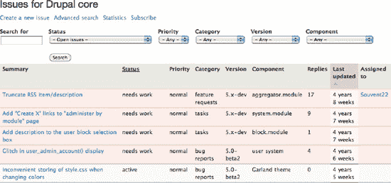
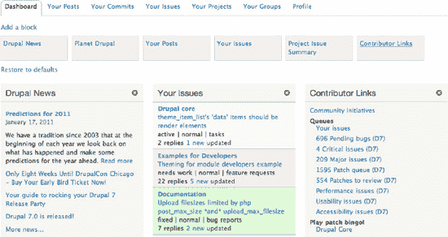

# Drupal 一日通

**Drupal 一日通** 是一项开发面向新手的较短 Drupal 课程的努力。用一天时间尽览 Drupal 精要。

## 在论坛、群组、邮件列表、聚会和 IRC 中回答问题

> *“每次访问 drupal.org 时，快速浏览一下‘新论坛主题’板块。只需花 5 分钟就能帮助到别人。”*
>
> ——Wim Mostrey (wmostrey, `drupal.org/user/21228`)

还记得当你提出一个问题，尤其是你有些胆怯的问题，却得到了有帮助的回复时吗？帮助他人能为你赢得感激，并增长你的知识。Fox (`drupal.org/user/426416`，IRC 上为 hefox) 通过在 IRC 中回答问题，正在建立一个“名副其实的 [Drupal] 天才”的名声。Fox 对 Drupal 的知识近乎百科全書级别，但偶尔也有不知道答案的时候：“我很好奇，所以就去搜索了一下。”

事情就是这么简单：有时别人需要的仅仅是另一个人替他们做一个五秒钟的搜索，而不是告诉他们自己去搜索或阅读手册。多花 30 秒为他们指明正确的方向，对你自己也有帮助；磨练你的搜索技能从来都不是坏事，尤其是在 Web 开发方面。

Angie Byron (webchick, `drupal.org/user/24967`) 通过回答问题开始了她在 Drupal 的旅程，这最终为她带来了以每次几百美元的报酬做一些 Drupal 零散工作的机会。现在，她是 Drupal 7 的维护者，曾是 Lullabot 的顾问，现任 Acquia 公司首席技术官办公室主管，《*使用 Drupal*》的作者，以及全方位的 Drupal 社区超级明星！

第 9 章 列出了你可以获得帮助的地方；这些地方也是你可以帮助他人的地方。请登录 `drupal.org/forum` 查看论坛，在 `groups.drupal.org` 订阅一些群组，注册一些邮件列表，参加 Drupal 聚会，或者泡在 Drupal IRC 频道里。

#### 4. 为 Drupal.org 撰写文档

也许，帮助 Drupal 取得成功最重要，同时也是“做中学”的最佳途径之一，就是撰写文档。你也许构建了一个功能强大、配备所有花哨组件的 Drupal 网站，并且运行完美、毫无瑕疵，但如果人们无法使用它或无法继续开发它，那它的强大之处也会黯然失色。一份完整详尽的文档——无论是针对开发人员、管理员，还是仅仅使用 Drupal 网站的用户——都能决定任何 Drupal 项目的成败。

 **注意** 关于面向最终用户和内部生产团队的文档实践和指南，请参阅第 11 章。

目前存在一种可怕的误解，认为如果你对写作*或*对 Drupal 了解不够多，就不能去写文档。我们作为作者，不知道这种观念从何而来，但事实绝非如此。

首先，有文档总比没有好。相比从零开始撰写文档并找到它所属的位置，别人改进现有文档的写作风格或技术细节要容易得多。当然，你也可以成为那个提高文档清晰度或更新现有文档信息的人。

其次，如果你正在读这本书，并且读到了这里，我们敢打赌你具备读写能力——并且对 Drupal 有一定的兴趣。恭喜你！我们现在宣布，你有资格撰写 Drupal 文档了。撰写文档不需要通过任何测试。只需编写简单、不啰嗦、分步走的操作指南即可。

事实上，对 Drupal 不够精通，反而可能成为文档编写者的一大优势！这会让你更容易注意到用户可能需要帮助的地方、流程不合理之处以及亟需解释的点。

任何拥有 `drupal.org` 账户的人都可以添加和编辑文档。你可以通过 `drupal.org/user/register` 注册账户，并通过 `drupal.org/node/add/book` 创建文档页面。在添加新页面之前，请先搜索一下，确保你想要添加的内容尚不存在。你可能会发现某个页面确实存在，但它并没有链接在你期望的位置。为相关文档增加链接有助于他人找到正确的页面，这是你可以做出的“高价值、低投入”的贡献之一。

有些页面只能由在 `drupal.org` 上被授予“文档”角色的人编辑，该角色允许你发布包含表格和图片的内容。如果你已经是其他文档页面的常驻贡献者，你很可能就会获得这个角色。关于更深入参与文档工作的更多信息，可以在 `drupal.org/contribute/documentation` 和 `drupal.org/contribute/documentation/join` 找到。

以上就是你开始所需了解的全部内容！你当然不必抱着“非要为文档做贡献”的唯一目标才能产生巨大影响。当你使用 Drupal 时，如果发现文档让你感到困惑或不足，就可以随时改进它。

 **注意** 那些在文档上投入大量时间的人，真的不喜欢文档页面上的评论（事实上，在你读到这本书的时候，他们可能已经禁用了这个功能；更多信息请参见 `drupal.org/node/810508`）。如果你有信息需要添加或更正，请直接编辑页面。如果这是一个需要讨论的变更，请针对它提交一个议题。

#### 5. 贡献补丁

贡献补丁并不一定意味着贡献代码。“新手”标签（`drupal.org/patch/novice`）是一种标记和排序那些相对容易解决的核心议题的方法。仅仅通过修改一条注释的措辞，Benjamin 就成为了 Drupal 7 的代码贡献者！

越多用户爱上让 Drupal 变得更好，对所有人就越有利。如果贡献的步伐跟不上用户增长的速度，Drupal 将无法支撑其日益庞大的用户群。目前，只有不到 1% 的 Drupal 用户在回馈社区。这意味着 99% 受益于 Drupal 的用户并没有做出回报。但即便如此微不足道的比例，Drupal 依然能够成就非凡！你的贡献所带来的影响力是巨大的。

 **注意** 许多人都忽略了“新手”标签，尤其是那些对贡献最感兴趣的人。在撰写本文时，将“新手”链接添加到“贡献者”区块（在第“审阅他人贡献”节中提到）的快速链接集中的工作，仍在 `drupal.org/node/448794` 进行中。

开始编写补丁的另一个好方法是参与代码或文档冲刺（Sprint）。这些是自组织的、非正式的开发者聚会，参与者共同协作完成代码和文档的改进。如果你还不是离你最近的 Drupal 群组的成员，可以通过 Drupal 群组活动主日历（`groups.drupal.org/events`）按活动类型进行筛选。

留意那些在群组论坛或讨论中发布指向议题队列的帖子的用户。这些人是在努力召集力量来完成某件事！关于使用 Git 创建补丁的文档，可以在 `dgd7.org/patch` 找到。此外，你可以在 `drupal.org/patch/apply` 找到应用补丁的说明，在 `drupal.org/patch/create` 找到创建补丁的说明。

#### 6. 贡献代码与设计

通过编写和维护项目来贡献 Drupal，涵盖在第 15 和 16 章（主题制作）、第 18 至 24 章（模块开发）以及第 37 章（在 `drupal.org` 上维护项目）中。

### 7. 管理问题队列

为 Drupal 做贡献（以及维护编写代码和文档人员的身心健康）的另一个重要途径，是帮助管理海量的提问、请求和问题报告。`drupal.org`上的每个项目都有一个问题队列。管理问题队列的目标如下：

- 关闭无关、无法重现（或理解）的问题。
- 让合适的人关注到那些可处理的问题。
- 尽力亲自解决问题！

如果你查看一个问题，但不清楚该如何完成上述任何操作，甚至不知道如何提出有用的疑问或澄清说明，那就直接跳到下一个问题。

本书的作者们鼓励你在遇到项目中的故障（即 Bug）或缺失功能时提交问题。尽管项目维护者希望听到你的反馈，但仅仅给他们已经堆积如山的问题再添一笔，通常并不能为你赢得多少好感。丹尼尔·库德温（sun），一位开发者兼设计师，他本人项目队列里就有数十页的问题，他在自己的用户页面（`drupal.org/user/54136`）上提出了一个建议。

> *如果你在问为什么你的问题还没解决，那么请看看我的队列：`drupal.org/project/user/sun`。如果你想让我帮你，那你也得帮我——通过测试其他人的补丁或回答其他用户的支持问题。:)*

通过分类整理来自 Drupal 用户的累积反馈，是直接赢得项目维护者好感的方式。如果这是一个你关心的项目，你也能从中受益，增进自己对项目薄弱环节和优势的了解。而这同时也是在为他人铺路。

以下是 Sun 关于帮助管理项目问题队列的建议总结：

- **寻找维护者的指导说明**。（并非所有项目维护者都提供此类说明，或像 Sun 一样积极回应。）
- **查找重复问题。**
- *将其中一个问题（通常是较新或活跃度较低的问题）的状态设置为* 已关闭（重复）*。*
- *附上指向仍在开放的问题的链接。*

 **提示** 你可以创建一个链接，当输入格式为“井号后紧跟节点 ID”并用方括号括起来时，该链接会自动展开并显示所链接问题的标题，例如：`[#1207734]`。

- *在仍开放的问题下留言，链接到你已关闭的问题，例如：“已将 `[#1234578]` 标记为重复。”*

- **查找相关问题**。两个问题可能并不完全相同，但各自涉及的所有人应该了解对方的情况，以便互相帮助。在 *Linux Journal* 2011 年 2 月对安吉拉·拜伦的采访中，她提到作为维护者，她花了很多时间确保在核心模块中从事类似工作的开发者们能够保持联系。
- **审查补丁。**（本章稍后在“8. 审查他人的贡献”中单独介绍。）
- **回答支持请求**，并关闭已解决的问题（将状态设置为 *已修复*），前提是原始提问者似乎已收到所需信息。
- **将缺乏足够解释或细节以重现的 Bug 报告状态**设置为 *搁置（维护者需要更多信息）*。
- **关闭无用的 Bug 报告**。通常，任何标记为 *需要更多信息*，且在超过一两周内未收到原始发帖人（有时缩写为“OP”）新回复的问题，都可以视为无法重现，并标记为 *已关闭（无法重现）*。

关于项目问题队列的社区管理，一个极好的例子是 Views Bug Squad。虽然其中一些参与规则是针对 Views 模块以及厄尔·迈尔斯（merlinofchaos，`drupal.org/user/26979`）、联合维护者丹尼尔·韦纳（dereine，`drupal.org/user/99340`）和莱内特·迈尔斯（esmerel，`drupal.org/user/164022`）的风格而定，但大部分建议适用于任何模块、主题或其他项目。具体可查看 Views Bug Squad 手册（`drupal.org/node/945414`）中的“如何使用问题队列”页面（[`http://drupal.org/node/945492`](http://drupal.org/node/945492)）。

***图 38–1.** 按“最后更新”排序的 Drupal 核心问题队列。*

 **提示** 一个好的做法是先查看最旧的问题。你可以通过点击表格表头（包括“最后更新”列，参见图 38–1）来对问题队列进行排序。虽然从 Drupal 核心最旧的问题开始可能看起来很艰巨，但从某些方面来说，最旧的问题反而更容易解决。当然，处理较新的问题也完全可以。

在太平洋西北地区 Drupal 峰会上关于 Drupal 社区的演讲中，安吉·拜伦向我们 Drupallers 发出了挑战：每天回答一个支持问题或论坛请求。目标是取得进展，稳步推进，而不是一蹴而就。安吉的视频和幻灯片可在 `webchick.net/node/80` 获取。

### 8. 审查他人的贡献

好吧，到目前为止，每种贡献方式都以“这是最重要的，也是学习的好方法”作为开头。它们确实都是！而且，尤其对审查者有着迫切的需求。审查，就像编写文档一样，是一种非常有效的学习方式，可以让你了解 Drupal 软件和社区的运作方式，同时还能抢先一睹未来的发展。

与 Drupal 中的许多其他工作一样，审查工作的核心也在于问题队列。准备好接受审查的问题会被标记为 *需要审查* 状态。要查找需要审查的 Drupal 核心问题，请访问 `drupal.org/project/issues/drupal` 并按状态筛选。

Drupal 7 的新功能之一是仪表盘。你可以添加自己希望随时掌握的信息块（例如，指向内容的直接链接、Drupal 新闻、项目特定的问题队列）。通过将“贡献者链接”块添加到仪表盘，你可以随时了解每个队列中的问题数量（图 38–2）。

***图 38–2.** 在贡献者链接块中，请注意“队列”下的“待审查补丁”链接。*

#### 使用 Dreditor 审查补丁

所有专业人士和潮人（嗯，很多都是）都使用一个名为 Dreditor 的 Greasemonkey 脚本来执行补丁审查。Dreditor 代表 Drupal 编辑器；它是一个能将你的 Firefox 或 Chrome 浏览器变成补丁审查机器的脚本。由 Drupal 天使丹尼尔·库德温（sun）创建，可在 `drupal.org/project/dreditor` 获取。使用 Dreditor，只需高亮你希望评论的代码部分，在左侧出现的框中输入评论，然后点击保存。

 **注意** 当一个问题下有多个补丁时，请一次只审查一个。

在你点击取消之前，Dreditor 会假定你仍在查看当前补丁。如果你尝试通过点击“审查”来审查另一个补丁，Dreditor 并不会调出你想审查的新补丁；相反，你会继续编辑第一个补丁。

#### 9. 让 Drupal.org 更完善

对整个 Drupal 社区产生最大影响的方法之一就是帮助改进 `drupal.org`。该网站已与 Mark Boulton Designs 合作进行了重大重新设计；所有需求和目标都已明确。高优先级功能概述于 `drupal.org/node/1006924`。你会注意到许多部分仍需升级到 Drupal 7。现在正是以最直接和最重要的方式为 Drupal 项目贡献力量、学习并成为团队一员的最佳时机。改进 Drupal.org 的关键部分属于新的 Prairie 计划，请访问 `groups.drupal.org/prarie-initiative`。

`Drupal.org` 是 Drupal 社区的“在线办公室”，正如 Angie Byron (webchick) 在 DrupalCon 芝加哥大会“扩展社区”专题讨论中所言。Angie 在领导 Drupal 7 开发三年后，正致力于让 `drupal.org` 变得更加强大！能与这样一位出色的社区成员共事是多么美妙。请先阅读“想帮助让 Drupal.org 变得超棒吗？”一文，地址为 `drupal.org/node/1006562`。势不可挡的 Derek Wright (dww, `drupal.org/user/46549`) 维护着一个安装配置文件，用于创建 `drupal.org` 的副本，以便人们进行测试和开发，地址为 `drupal.org/project/drupalorg_testing`。

#### 10. 主办和组织聚会、训练营、峰会及其他活动

> *“想到仅仅几年前，主要的 DrupalCon 规模还比今天的 DrupalCamp 小，这真令人着迷。更令人惊叹的是，你意识到几乎每个周末，全球各地可能都有几个 DrupalCamp 同时在举行。这让我难以置信。面对面的聚会对于 Drupal 的成功和发展至关重要。如果你想在你所在的地区推广 Drupal，请考虑举办 DrupalCamp 并组织常规的聚会。这是启动和培育你本地 Drupal 社区的最佳方式。”*
> 
> —Dries Buytaert

我们现在有六种常用术语来描述 Drupal 聚会，这本身就说明了这些活动的需求。

> **DrupalCon** 是传统的为期多天的会议，通常每年举办两次（一次在北美，一次在欧洲）。DrupalCon 如今参会人数已达约 4000 人。随着 Drupal 的发展，DrupalCon 也在壮大，通过提供付费培训、供应商展位区等方式，反映了参会社区的多样性。这周的活动总是以冲刺日告终，人们利用这一天共同编写代码和撰写文档。全球社区，尤其是亚太和拉丁美洲地区，正在讨论在北美和欧洲主轴之外增加更多 DrupalCon。
> 
> **Drupal 峰会** 类似于小型的区域性 DrupalCon，是多天、多层面的活动。Drupal 峰会是一个新类别，太平洋西北地区 Drupal 峰会（Pacific Northwest Drupal Summit）被认为是第一个使用该术语的。首届拉丁美洲 Drupal 峰会于 2011 年 1 月在秘鲁利马举行。
> 
> **Drupal 训练营** 是一个为期一到两天的活动，有多位演讲者，通常每个城市每年举办一次。训练营可以采用 BarCamp 风格组织（所有会议在活动当天选定），也可以提前安排日程。Drupal 训练营组织指南可在 `groups.drupal.org/node/10437` 找到。也有围绕特定主题组织的训练营。一些专注于设计的训练营起源于希望共同改进 Drupal 设计的人们。首届 Drupal 设计营（D4D）于 2008 年在波士顿举行。现在，D4D 训练营已在美国波士顿、洛杉矶、斯坦福和捷克布拉格等地举办过。
> 
> **Drupal 聚会** 在世界各地的城镇中进行。许多聚会每月定期举行，内容包括闪电演讲（5 到 10 分钟的简报，介绍人们如何使用 Drupal）和供与会者提问、寻求帮助或建议的时间。有关主办聚会的信息，请参阅本地用户组组织者小组（`groups.drupal.org/local-user-group-organizers`）以及 Drupal 教育者 Heather James 对不同聚会风格的介绍（`acquia.com/blog/heather/what-do-you-do-your-drupal-meet`）。
> 
> **Drupal 咖啡馆** 通常是比聚会规模更小的聚会，总是在能方便获取食物和饮料的地方举行。
> 
> **Drupal 道场** 是针对免费、专注的社区学习的较小规模的聚会。奥斯汀、波士顿和西雅图每周或每半月举办一次 Drupal Dojo 培训/协作工作坊。
> 
> **Drupal Kata** 是专注于特定项目的道场会话。
> 
> **冲刺** 是旨在实际产出的活动，因此组织一次冲刺本身就是双重贡献。你可以有代码、文档、营销和规划等类型的冲刺。冲刺可以是开放的，也可以仅限于高级水平。一开始就要确定你希望是教学、编码，还是两者兼有，并确保在你的公告中包含你的计划。当期望值提前设定好时，会议总是更有成效。
> 
> **Drupal 派对** 是较晚才出现的场景。2011 年 1 月初，在 96 个国家有超过 300 个独立组织的 Drupal 7 发布派对！
> 
> **Drupal 开发者日**（`drupaldays.org`），一种混合了训练营、冲刺和峰会形式的活动，于 2011 年 2 月吸引了来自十几个国家的数百名开发者齐聚欧洲。

最重要的是要注意，主办和组织并非自上而下的过程。你无法独自组织一场 DrupalCon，但你绝对可以参与其中。你可以自己组织较小型的活动，并成为其他类型活动的催化剂。发挥创意吧——JohnZavocki (johnvsc) 开始在纽约市各处随机举办 Drupal 游戏日，而 George Matthes 则站出来成为常规主持人。

在决定组织、主办和规划即将进行代码工作的冲刺或训练营时，以下是需要牢记的一些要点和技巧：

*   **找到一个网络连接稳定的地方**。小型的代码冲刺甚至可以在人们家中进行。
*   **尝试让资深程序员参与进来**，并确保至少有一个对项目拥有提交权限的人在场或能远程参与。
*   **指定一个主要负责人记录问题**以及谁在处理这些问题。在 Drupal Wiki 页面或实时协作文档（如 Google Docs 或 Etherpad (`piratepad.net`)）上做笔记。
*   **准备好食物**。每个人最终都会饿的！

#### 11. 资金

开支票捐款是完全有效的贡献方式，并且总是受到赞赏。如果你不确定向何处贡献，或者没有时间投入编码或组织工作，捐钱是表达支持的好方法。举办活动、为代码冲刺购买食物、为训练营参与者购买保险都需要钱。以下是向 Drupal 提供资金支持的方式。

##### 向 Drupal 协会捐款

Drupal 协会支付与 `drupal.org` 基础设施相关的费用，并负责其他选定的事务，例如推广 Drupal 和培育社区。这是一项极其重要的工作。Drupal 之所以能脱颖而出，正是因为其卓越的社区支持。随着社区的发展，其支持需求也会发生变化。如果你成为 Drupal 协会的会员，你的会员资格将是一次年度捐款。有关会员福利的更多信息，请访问 `association.drupal.org/membership`。成为会员后，你可以在 `association.drupal.org/about/donations` 进行更多捐赠。

##### 赞助活动

Drupal 活动总是需要赞助商。Drupal 大会的赞助档位你可能负担不起，但离你最近的 Drupal 训练营肯定有。（如果你附近没有 Drupal 训练营，请参阅关于主办你自己活动的章节！）

##### 赞助开发者

Drupal 开发者炙手可热，但其中一些贡献最大的人，却是在用自己的业余时间进行开发。赞助那些在社区中拥有良好记录的开发者，是表达感谢的好方法。比如，你有一个反复使用的模块，但它可能由于服务于某个特定小众需求而不太流行——但它确实做得很好。那么，你可以联系其维护者；他们可能是在业余时间工作，并且需要一些金钱上的补偿。

奖学金是赞助开发者的另一种方式。这没有固定的流程，但如果你认识某个应该去参加训练营或会议的人，你可以询问他们是否需要火车票、机票或住宿费用。你通常可以通过他们的 `drupal.org` 联系表单向社区成员伸出援手。

 **提示** 参与到 `groups.drupal.org/paying-plumbing` 以探讨如何高效、有目标地筹集和使用资金。

## 12. 让 Drupal 社区更具包容性

> *“真正让 Drupal 项目成其为现在的样子的，是 Drupal 社区，而不仅仅是其软件。因此，培育 Drupal 社区实际上比仅仅管理代码库更重要。”*
> 
> ——Dries Buytaert

我们的主要挑战是，在社区规模扩大的同时，保持其包容性和支持性。Drupal 的 Angela Byron (webchick) 因她在社区中的领导作用以及在 Drupal 7 上的工作，于 2011 年登上了《Linux Journal》的封面，然而，她首次为任何自由软件项目做出贡献，是在她接触并为之兴奋的 10 年之后。曾经有一个让她望而却步的迷思：你必须像爱因斯坦一样聪明才能为开源做贡献。“你不必如此，”她说。“有很多聪明人，但其他所有人也都在贡献和分享他们所知道的东西。那可以是任何事。” Drupal 非常、非常幸运地得到了 webchick，而没有让她转去贡献 Linux，但我们（以及所有开源项目，乃至整个世界）又失去了多少潜在的了不起的贡献者呢？一个不可避免的结论是，我们正在失去潜在的贡献者，因为他们没有过度膨胀的自我。我们需要努力消除这种错误的观念，即你必须达到某种 X 级别的聪明才能使用 Drupal 并为它做贡献。

研究表明，做一些事情来打破（或仅仅是分散人们对）缺乏自信的注意力，能够极大且显著地帮助表现不佳的群体提高考试成绩。这被称为“刻板印象威胁”，而你可以通过欢迎每个人成为贡献者来帮助对抗它。

这也意味着我们需要持续地意识到要重视所有贡献，而不仅仅是代码贡献。正如那些为了代码而来的人，最终会为了社区而留下，并开始以许多其他方式做出贡献；同样，那些最初通过提供支持、进行审查和测试以及编写文档来贡献的人，最终也可能做出重要的代码贡献。

与将每个人都视为潜在贡献者相反的是，基于任何理由对任何人进行刻板化看待。Drupal IRC 频道有指导方针，禁止性别歧视、种族歧视或恐同的言论（参见 `drupal.org/irc/guidelines`）。不当的评论如果得不到处理就会成为问题。当人们看到有人损害他人获得平等待遇的权利时，必须敢于发声。总的来说，这种自我约束是有效的。建议很简单：对歧视保持敏感，并在其发生时采取行动。对于一个社区成员来说，看到有人站出来说“我们这里不允许这样做”，可能意味着一切。避免长时间的尴尬沉默。希望其他成员会支持你，并很快将讨论继续下去。

我们必须确保我们的社区善待每个人。我们需要有意识地重视所有贡献和所有成员，无论其性别、年龄、种族或经济背景如何。我们不可能完全脱离于经济和社会不平等等更广泛的问题，但我们可以努力确保在我们社区内避免重蹈覆辙或使其加剧。重新思考我们的协作模式、为低收入网络项目提供资金、以及教学和培训，都是很好的起点。

多样性使自由软件更加强大。就背景和国家而言，Drupal 拥有一个相当多样化的贡献者群体，但传统上，开源自由软件中女性参与的比例非常低。事实上，开源开发者中*女性占比不到 2%*，而相比之下，专有软件工程师和开发者中女性占 20% 到 30%。Drupal 在这方面做得稍好一些，女性参与率达到 10%，但仍有巨大的改进空间。DrupalChix 小组 (`groups.drupal.org/drupalchix`) 的存在就是为了解决 Drupal 中女性代表性不足的问题，幸运的是，我们可以为此做些什么。总而言之，Drupal 社区在保持环境对所有成员安全友好方面表现卓越。

### 构建运动

协调 Drupal 贡献者的大计并不存在，据安吉·拜伦（Angie Byron）所说，“当你试图主动在社区中促成某事时，情况会变得非常有趣，因为你需要让许多人相信同一件事很重要。社区建立在‘行动主义’（do-ocracy）理念之上……事情得以完成的唯一途径是有人真正动手去做。这是一个相当简单的概念，但没有人拿薪水来关心 Drupal 核心，也没有人拿薪水来关心他们的模块——除非他们有某种特殊安排——所以人们关心某些东西是因为他们需要它，然后就直接投入其中。”

通过这种方式，已经取得了令人惊叹的成就（而且令人惊叹的工作正在进行中），但也值得注意，正是我们具备一定程度的规划和协调能力，才让这一切得以运转。Drupal 在以下方面表现最佳：

-   人们无需（或能轻松获得）批准即可做出贡献。
-   存在协调工具，并且决策流程和权威性清晰。

在这些条件满足的地方，例如在 Drupal 核心和贡献项目中，Drupal 通常发挥出最佳状态。无论讽刺还是恰如其分，在 Drupal 的各种场景中努力改进这两点——恰恰是你最可能需要批准，却又缺乏明确的协调或决策方式的地方（参见 `dgd7.org/resistance`）。

工作中最激动人心的部分或许在于思考这些要点——即如何让众多人能在没有控制或胁迫、经济或其他方面结构的情况下，共同协作完成复杂、关键的项目？——因为这些要点不仅对 Drupal 的成功至关重要，也对建设一个更美好的世界至关重要。

令人惊讶的是，当许多人将 Drupal 视为一场运动时，他们心中所想的正是“一个更美好的世界”。同样，Drupal 社区中的许多人都意识到，Drupal 让他们能够为改变世界的软件做出贡献，同时也能谋生，这是一份独特而美好的礼物。

每当我们向他人介绍 Drupal 时，我们都在分享这份礼物；但我们也有可能利用我们的社区意识以及我们建立的实践，在 Drupal 之外构建社区。虽然目前这种情况还不多见，但 Drupal 在社区中拥有相当有觉悟的人。乔什·柯尼格（Josh Koenig，`joshk`，`drupal.org/user/3313`），最早期的 Drupal 店铺之一 Chapter 3 的创始人，最近在他的博客中写道：“我们正进入一个时代，首次有可能创建一套有效且非压迫性的、能够覆盖全球的规则。只有在这种全球范围的框架内，一个拥有 60 亿参与者的、可行的后工业经济才具有人道地实现的可能。”

将这种广泛存在的、对更美好世界的渴望，与我们为构建更强大的 Drupal 社区所做的工作结合起来，可以极大地提高我们在两个方面的建设成效。毕竟，软件本身主要关乎沟通与协作，而这是一切成就与力量的基础。我们这些从事 Drupal 工作的人，有机会将历史上暂时性的自治与公平报酬的增长，转化为对全人类自由与正义斗争的关键支持。

Drupal 中最艰巨的工作是在建设社区的同时，保留其精神实质：让人们能够以各种可能的方式做出贡献，并创造协调方法来成就大事。这项工作，因为它与我们星球紧迫的需求重叠，也同样是最激动人心的。

我们问题追踪系统里见——或许也能线下相见，或在社区提出的其他任何形式中相见！

## 第 VIII 部分

## 附录

**附录 A** 涵盖了将 Drupal 网站从 Drupal 6 升级到 Drupal 7 的基本步骤，并介绍了其替代方案：数据迁移。

**附录 B** 引导你开始对 Drupal 进行性能剖析，以识别并修复性能瓶颈。另请参阅关于扩展 Drupal 的第 27 章。

**附录 C** 重点介绍渲染系统（即 Render API），这是 Drupal 7 的主要创新之一，以及它如何使网站构建者受益。

**附录 D** 提供了如何从 Drupal 角度处理网站图形设计的技巧。

**附录 E** 解释了 Drupal 的可访问性增强，并帮助你了解应遵循哪些实践以及使用哪些资源，以使你的网站对所有用户都可访问。

**附录 F** 向你展示如何在 Windows 上安装和运行 Drupal，并开始使用基于 Windows 的工具来处理 Drupal。

**附录 G** 让你了解如何在 Ubuntu 上运行 Drupal——包括如果你想使用这个流行的 Linux 变体进行 Drupal 开发，如何在虚拟机上运行 Ubuntu。

**附录 H** 指导你在 Mac OS X 上安装 Drupal。

**附录 I** 涵盖了如何使用跨平台的 Drupal 堆栈安装程序来安装和运行 Drupal。

另外，请访问 `dgd7.org` 和 `dgd7.org/bonus` 获取本书补充的新材料。

## 附录 A

