# 页面渲染与修改

**作者：Károly Négyesi**

Drupal 7 中的一项根本性变革在于浏览器中 HTML 内容的组装方式。例如，在之前的 Drupal 版本中，区块内容会以 HTML 字符串形式返回。随后，`theme_block()` 函数会将该 HTML 与标题一起放入模板，生成一个更大的 HTML 字符串，再将这些字符串拼接起来形成某个区域的 HTML。

而在 Drupal 7 中，区块回调函数返回的内容是一个数组。接着该数组会被放入另一个数组中，以此类推。最终结果是一个庞大的多维数组，被输送给 `drupal_render()` 函数，由该函数最终生成浏览器接收到的 HTML 字符串。但在生成之前，它允许我们以远比过去传递字符串时更丰富的方式与整个页面内容进行交互。

我们先来审视一下默认首页在禁用所有区块时的这个巨大页面数组。随后我们将梳理代码流程，了解它是如何被组装起来的。

为了查看页面数组，我安装了 Devel 模块以获得格式化打印的数组，如图 C-1 所示。

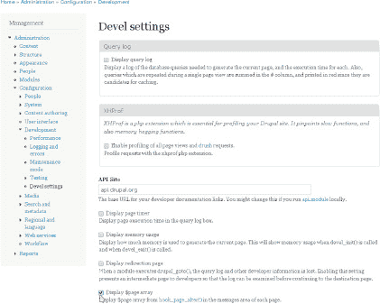

***图 C-1.** 启用 Devel 模块的“显示 `$page` 数组”选项，查看页面在 `hook_form_alter()` 中的呈现方式*

接下来，禁用所有区块（除管理区块外，匿名用户无法访问），如图 C-2 所示。

 **注意** 禁用所有区块后，您需要使用路径‘`user`’重新登录您的 Drupal 站点。

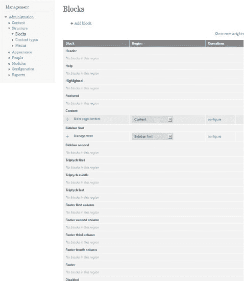

***图 C-2.** 区块管理页面*

经过这些准备，我们终于可以首次查看一个极其精简的页面及其页面数组，如图 C-3 所示。

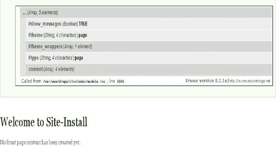

***图 C-3.** Devel 模块显示的、无内容或侧边栏区块的页面数组——最低配置*

该数组的结构可能让您感觉似曾相识，就像查看表单数组一样：这里有以`#`号标记的属性，以及子元素。在本例中，唯一的子元素是 `content`。我想请您特别注意元素 `#type`，其值为 `page`，表示该元素的子元素将由页面模板进行主题化处理（请参阅关于主题化的第 15 章和第 16 章）。让我们深入 `content` 内部一探究竟，如图 C-4 所示。

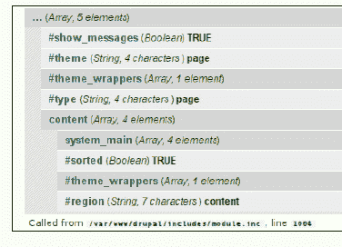

***图 C–4.** 页面数组 `content` 子元素的内部结构*

情况依然如此：更多的属性和一个子元素——让我们打开那个子元素 `system_main`，希望在图 C-5 中能找到有用的内容。

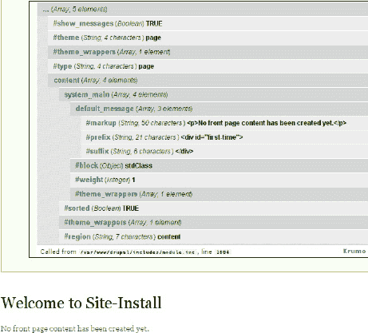

***图 C–5.** 通过子渲染元素 `content` 和 `system_main` 向下钻取到 `default_message`*

好吧，运气不佳，所以我们继续打开了它的子元素 `default_message` 数组。这里就是终点了：我们在 `#markup` 属性中看到了消息“尚未创建任何首页内容。”虽然这里没有 `#type` 属性，但这意味着 `#type` 就是 `markup`，即该元素的 HTML 等价物就是 `#markup` 属性的内容。

唯一未展开的是 `#theme_wrappers` 数组，让我们来看一下（见图 C-6）。

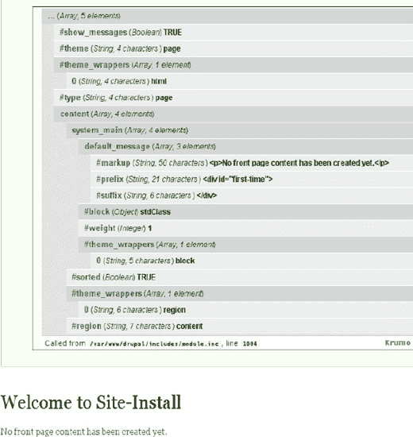

***图 C–6.** 所有元素和属性均已展开的最基本页面数组*

从消息开始，您可以看到它首先被包裹在一个 `block` 主题包装器中，然后是一个 `region` 主题包装器，接着是 `page`，最后是 `html` 主题包装器。现在我们已经完整地看到了这样一个页面数组，接下来让我们看看实际的代码流程——以及我们可以介入干预的地方。

## 第一步：路由项

Drupal 完成引导后，`index.php` 执行的最后操作是调用 `menu_execute_active_handler()`。此函数根据当前路径从 `menu_router` 中检索路由项。这里有一个重要的干预机会：`hook_menu_item_alter()`。它允许您修改路由项的任何属性，例如根据当前用户的 IP 更改访问回调函数。您可以对从办公室登录的人员放宽某些访问控制。或者您可能只想让那些使用节点路径别名的人获得访问权限，而拒绝那些使用 `node/[nid]` 路径的人。这可用于通过创建随机路径别名并将其发送给用户来实现简单的基于令牌的访问。

一旦访问控制通过，菜单系统将调用页面回调函数，该函数负责组装主要内容。`hook_menu_item_alter()` 可用于更改要触发的页面回调函数。例如，路由系统只允许为每个节点设置页面回调函数，或为所有节点设置一个统一的回调函数。但您可能希望为每种节点类型设置不同的页面。或者，如果您运行的是有机群组模块（`drupal.org/project/og`），那么不同的群组可能需要完全不同的页面。所有这些都可以通过 `hook_menu_item_alter()` 实现。

## 第二步：页面回调函数被触发

本书几乎全部内容都在阐述这一步能做什么。页面回调函数可能加载实体、查看实体、创建列表、表格等，但最终它只是返回一个可渲染数组。例如，默认首页返回如下内容：

```
$build['default_message'] = array(
    '#markup' => "<p>尚未创建任何首页内容。</p>",
    '#prefix' => '<div id="first-time">',
    '#suffix' => '</div>',
);
```

我们之前见过这个，对吧？

## 第三步：传送回调函数

现在您回到了 `menu_execute_active_handler()` 函数中。下一个要触发的回调函数是传送回调函数，其默认值为 `drupal_deliver_html_page()`。顾名思义，默认情况下您是将页面回调结果以 HTML 格式传送。

 **注意** 严格使用术语“页面回调结果”很重要，因为“页面”包含页面回调的返回值、区块以及所有其他内容（我们很快就会看到）。

您也可以传送 JSON 格式，或者将页面回调结果的部分内容以 JSON 格式传送。核心功能并未大量使用此能力，但覆盖层模块有一个有趣的案例。当表单提交指示 Drupal 在下一页关闭覆盖层时，仅显示关闭覆盖层所需的样式和脚本，而无需不必要地显示整个页面，这样速度更快。因此，这里有一个什么也不显示的传送回调函数：

```
function overlay_deliver_empty_page() {
  $empty_page = '<html><head><title></title>' . drupal_get_css() . drupal_get_js() .
'</head><body class="overlay"></body></html>';
  print $empty_page;
  drupal_exit();
}
```

您可以使用 `hook_menu_item_alter()` 来更改传送回调函数——您已经看到了更改访问或页面回调函数的实用性，现在您也看到了更改传送回调函数的价值。

我们假设选择了 `drupal_deliver_html_page()`（大多数情况下都是如此），然后检查该函数的功能。它处理页面未找到或访问被拒绝的情况，并且最重要的是，它调用了 `drupal_render_page()`。

## 第四步：`drupal_render_page()`

这个名称极具误导性：该函数的功能远不止渲染页面。请记住，到目前为止您只有页面回调结果，而不是整个页面——因此此函数负责构建页面。毫不夸张地说，Drupal 7 中所有有趣且强大的功能都是由这个函数触发的。（字段 API 虽然强大但较为繁琐。）

首先，会调用 `hook_page_build()`，它允许其他模块向页面数组添加内容——因为这里正是构建页面数组的地方。您的模块也可以向页面数组添加内容。其次，会触发 `hook_page_alter()`。


### 第五步：`hook_page_alter()`

这就是那把让所有问题看起来都像钉子的锤子。如果你见过特种部队破门时使用的"动态破门锤"，没错，它就是这样的利器。

例如，如果你想将节点链接移到一个名为"文章工具"的区块中，这在 Drupal 6 中几乎是不可能完成的任务。链接被固定在节点上，重新编写代码在区块中显示链接比移动它们要容易得多。当然，这会导致大量重复代码，还可能引发昂贵的重复操作。在 Drupal 7 中，我们有一把出色的锤子可以拔出那颗螺栓，只需少量操作就能轻松移动链接。以下示例中的大部分代码实际上是为了确保结果看起来像一个区块（注意：此示例仅在存在名为`sidebar_first`区域时有效，例如默认主题 Bartik）：

```
function dgd7_page_alter(&$page) {
  if ($node = menu_get_object()) {
    // 将链接渲染为 HTML 字符串，以便检查是否为空
    $links = drupal_render($page['content']['system_main']['nodes'][$node->nid]['links']);
    // 从原始位置移除。
    unset($page['content']['system_main']['nodes'][$node->nid]['links']);
    // 以下代码将非空的$links 放入区块。
    if ($links) {
      $page['sidebar_first']['dgd7_tools']['#markup'] = $links;
      $page['sidebar_first']['dgd7_tools']['#block'] = (object) array(
        'module' => 'dgd7',
        'delta' => 'dgd7_tools',
        'subject' => t('文章工具'), // 翻译了字符串内容
        'region' => 'sidebar_first',
      );
      $page['sidebar_first']['dgd7_tools']['#theme_wrappers'][] = 'block';
    }
  }
}
```

另一个例子是修改 Drupal 核心中的固定列表。假设你想在聚合器条目列表或节点评论的中间插入一条广告或公共服务公告。在 Drupal 的早期版本中，这相当棘手——你可能需要在模板中显示广告，并统计评论或条目显示了多少次——但在 Drupal 7 中，这同样变得非常简单：直接放置就完成了：

```
function dgd7_page_alter(&$page) {
  if ($node = menu_get_object()) {
   $comments = &$page['content']['system_main']['nodes'][$node->nid]['comments']['comments'];
   $comments['ad'] = dgd7_get_ad();
   // 第一条评论权重为 0，第二条为 1，插入两者之间。
   unset($comments['#sorted']);
   $comments['ad']['#weight'] = 0.5;
 }
}

function dgd7_get_ad() {
  return array('#markup' => t('你好，我是一条广告！')); // 翻译了字符串内容
}
```

至此，我们终于到达了页面数组构建完成的节点：它以页面回调结果开始，在`hook_page_build()`中添加了区块等额外部分，并通过`hook_page_alter()`完善了细节。经过上述所有操作，一个准备就绪的数组就生成了，随后便会调用`drupal_render()`。正是在这一步，数组会被转换为 HTML。


### 步骤 6：`drupal_render()`

这是一个递归函数，会对页面数组的每一个子元素调用。因此，你需要先运行 `drupal_render($page)`，接着是 `drupal_render($page['content'])`，然后是 `drupal_render($page['content']['system_main'])`，最后是 `drupal_render($page['content']['system_main']['default_message'])`。如果存在兄弟元素，则先处理兄弟元素，再处理子元素（这被称为页面树的广度优先遍历）。

让我们只关注一次 `drupal_render()` 的调用过程。首先是访问权限检查。在 Drupal 7 中，每一块或大或小的内容都可以设置访问控制。接着检查缓存。同样，无论你正在处理的页面部分是大是小，其渲染生成的 HTML 字符串都可以被轻松缓存。为了利用这一特性，需要设置 `#cache` 参数。这是一个关联数组，如果你熟悉 `cache_set`，那么对其中的键会感到熟悉：`key`、`bin`、`expire`（而 `cache_set` 还接受一个 `data` 参数，显然那正是 HTML 字符串本身）。例如：

```
$element['#cache']  = array(
  'cid' => 'foo:bar',
  'bin' => 'cache_something',
  'expire' => 900,
);
```

现在，用多个部分来创建缓存 ID（`cid`）是相当常见的做法——即使这个简单的例子也包含了 `'foo:bar'`。你可以提供一个键名数组，而不是直接指定 `cid` 键：

```
$element['#cache']  = array(
  'keys' => array('foo', 'bar'),
  'bin' => 'cache_something',
  'expire' => 900,
);
```

这样做的好处当然是在 `hook_page_alter()` 中更容易操作这些键。最后，你还可以设置 `'granularity'`，它是以下标志的二进制组合（为什么不用数组？问得好！我们会在 Drupal 8 中修复这个问题）：`DRUPAL_CACHE_PER_ROLE`、`DRUPAL_CACHE_PER_USER`、`DRUPAL_CACHE_PER_PAGE`。例如：

```
$element['#cache']  = array(
  'keys' => array('foo', 'bar'),
  'granularity' => DRUPAL_CACHE_PER_ROLE | DRUPAL_CACHE_PER_PAGE,
  'bin' => 'cache_something',
  'expire' => 900,
);
```

这意味着该元素因角色和页面不同而不同——但不会因每个用户不同而不同，这也就意味着缓存表不会过于臃肿，且缓存未命中的概率更高。

如果发生缓存未命中，则会进入 `#pre_render` 函数数组。它类似于表单中 `#process` 回调函数的数组。

一种可行的扩展策略是：在构建页面时尽可能少做工作，而将耗费资源的工作转移到 `#pre_render` 以及前面提到的缓存机制中。这对于复杂的查询尤其有用。它非常有价值，以至于有一个名为 `drupal_render_cache_by_query()` 的辅助函数专门用于此。该函数会根据查询和 `#pre_render` 属性为你自动设置 `#cache`。以下是来自 `forum.module` 的一个稍加简化的例子：

```
function forum_block_view($delta = '') {
  $title = t('活跃论坛主题');
  $query = db_select('forum_index', 'f')
    ->fields('f')
    ->addTag('node_access');
    ->orderBy('f.last_comment_timestamp', 'DESC')
    ->range(0, variable_get('forum_block_num_active', '5'));
  $block['subject'] = $title;
  // 基于修改后的查询进行缓存。使我们能够在启用节点访问控制的情况下进行缓存。
  $block['content'] = drupal_render_cache_by_query($query, 'forum_block_view');
  $block['content']['#access'] = user_access('访问内容');
  return $block;
}

function forum_block_view_pre_render($elements) {
  $result = $elements['#query']->execute();
  if ($node_title_list = node_title_list($result)) {
        $elements['forum_list'] = $node_title_list;
        $elements['forum_more'] = array('#theme' => 'more_link', '#url' => 'forum', '#title'
=> t('阅读最新论坛主题。'));
  }
  return $elements;
}
```

看到查询是如何仅在 `pre_render` 中执行的吗？请记住，`#pre_render` 仅在缓存检查之后才触发，这意味着只有在缓存未命中时才会向数据库发送查询。你可以对任何 DBTNG 查询采用这种做法。

接下来的步骤会实际生成 HTML，并将结果保存在 `$element['#children']` 中。如果定义了 `#theme`，那么该主题函数将负责生成 HTML。紧接着，如果 `$element['#children']` 为空，则你会遍历该元素的实际子元素——请记住，子元素的键名不以 `#` 开头——对它们调用 `drupal_render()`，并将结果附加到 `$element['#children']` 之后。接下来，`#theme_wrapper` 主题钩子（如果有的话）有机会将该元素包裹到 HTML 中。这些钩子很可能会修改 `$element['#children']`。

你几乎要完成了！子元素最终以 HTML 形式存在于 `$element['#children']` 中。接下来，`#post_render` 函数会执行；它们通常用于对生成的 HTML 进行某种字符串过滤。

倒数第二步是通过处理 `#states` 和 `#attached` 来添加该元素所需的任何 JS 和 CSS。`#attached` 属性允许你向渲染数组添加库、JS 和 CSS，这在 `drupal_process_attached()` 的文档中有所解释（你可以在 `api.drupal.org/drupal_process_attached` 查看）。

最后，`#prefix` 和 `#suffix` 会被分别添加到 `$element['#children']` 的前面和后面，而这正是 `drupal_render()` 的返回值。同时，这也是存储在渲染缓存中的内容。

总而言之，对于传递给 `drupal_render()` 的每一个元素的子元素，要么由 `#theme` 定义的函数处理，要么通过递归调用 `drupal_render()` 将其转换为 HTML。这就是为什么一个完整的 Drupal 页面可以是一个大型的可渲染数组，你可以在渲染之前通过 `hook_page_alter()` 对其进行修改。

 提示 要获取关于页面渲染和修改的更多资源，包括由 Bryan Hirsch 领导的全面记录渲染 API 的工作，请访问 `dgd7.org/render`。

## 附  录  D


## Drupal 的视觉设计

**作者：Dani Nordin**

视觉设计在任何成功的网站项目中都扮演着至关重要的角色。然而，与许多内容管理系统一样，Drupal 对于那些不习惯使用它的设计师来说提出了许多挑战。本附录提供了关于为 Drupal 创建视觉设计的一些背景知识，并提供了一些有用的技巧，以帮助您作为 Drupal 设计师更轻松地工作。


### 为什么设计师应该使用 Drupal

Drupal 最初是一个以开发者为中心的社区，从许多方面来看，人们至今仍会这样看待它。然而，在过去几年里，Drupal 社区见证了设计师、用户体验专业人士以及其他创意工作者的复兴，他们致力于改善设计师在该社区中的体验。

-   在世界各地，Drupal 设计师和主题开发者们齐聚 Drupal Camp，专门探讨为 Drupal 进行设计所面临的挑战。
-   在线平台上，`groups.drupal.org` 上有一个活跃的 `design4drupal` 社区（`groups.drupal.org/design-drupal`），专门讨论这些问题。
-   Drupal 主题开发者，例如 Mustardseed Media（`mustardseedmedia.com/podcast`）的 Robert Christensen 和 Design to Theme（`www.designtotheme.com/`）的 Emma Jane Hogbin，创作了许多有用的内容，旨在帮助 Drupal 设计师理解如何将他们的设计转化为 Drupal 主题。
-   自 2009 年以来，一年一度的 Drupalcon 大会上的“设计与可用性”主题讨论规模显著扩大，独立的“志同道合”（BoF）讨论也将设计师和主题开发者聚集在一起，共同探讨为 Drupal 进行设计所面临的挑战。

除了社区整体的这些努力之外，Drupal 7 的开发以及 `Drupal.org` 的重新设计，代表着在吸引设计师加入 Drupal 方面迈出了重要一步。管理界面的增强、HTML 输出的改进、CSS 输出覆盖的简化，以及随着 Views 3 整合部分语义视图（`drupal.org/project/semanticviews`）模块而在使用 Views 创建语义代码方面（这是 Drupal 设计师长期面临的问题）取得的更多进展，都使得 Drupal 7 成为迄今为止对设计师最友好的版本。

### 为 Drupal 设计：意味着什么

为 Drupal 设计与为 Flash、纯 HTML 甚至像 WordPress 这样的博客系统设计之间最大的区别之一在于：**视觉设计始终必须放在项目生命周期的末尾**。对于不习惯为内容管理系统进行设计的网页设计师来说，这可能是一个巨大的障碍。

实际上，一旦你习惯了 Drupal 的工作方式，就更容易理解如何为其进行设计。如果你已经习惯于使用 HTML 和 CSS（例如，页面的各个组成部分被划分为不同的分区），那么你已经向理解 Drupal 设计迈进了一半。Drupal 带来的主要挑战在于，你作为设计师并不生成 HTML，Drupal 才是。因此，为 Drupal 创建视觉设计的首要挑战是理解，并找到管理 Drupal 所输出的 HTML 的方法。

### Drupal 页面的结构剖析

在大多数网站上，Drupal 创建的页面是由多个不同区域的组合生成的。这是 Drupal 如此强大的原因之一，但在视觉设计方面也增加了复杂性。例如，图 D–1 展示了我创建的一个 Drupal 网站的示例页面。

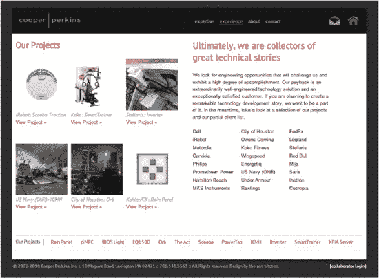

***图 D–1.** Cooperperkins.com 上的“经验”页面*

如果你直接用标记语言创建这个页面，它可能会是这样的：

```
<html>
<head>
        <title>Cooper Perkins :: 经验</title>
</head>

<div id="header">
                <div id="logo"><a href="index.html" title="Cooper Perkins 首页">
</a>
        </div>
<ul id="navigation">
       <li><a href="expertise.html">专长</a></li>
       <li><a href="experience.html" class="active">经验</a></li>
       <li><a href="expertise.html">关于</a></li>
       <li><a href="contact.html">联系</a></li>
</ul>
</div>

<div id="middle">
        <div id="projects">
        <h2>我们的项目</h2>
```

等等。但是，当你深入查看 Drupal 生成的代码时，你会看到大不相同的内容（请参见 图 D–2）。

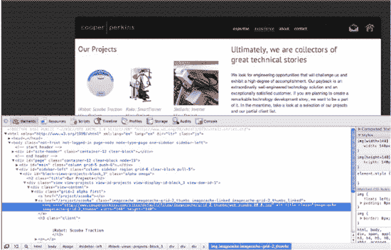

***图 D–2.** 检查幕后代码。高亮文本代表左上角的 Scooba 图像。注意：此网站基于 Drupal 6 构建。*

这是因为 Drupal 通过从网站底层数据库的不同区域提取内容来创建此页面。因此，为 Drupal 设计的第一步是理解：

-   信息从何处被提取以创建你的页面。
-   你能控制其中多少内容。
-   Drupal 实际如何称呼每一段信息，以便可以为其设置样式。

例如，在此网站上，信息从以下区域提取（请参见 图 D–3）：

-   “我们的项目”部分：从一个名为“项目”的视图和一个名为“项目列表”的区块中提取。
-   “我们的项目”菜单：从“项目”视图和一个名为“项目菜单”的区块中提取。
-   页面文本和标题：从节点本身提取。

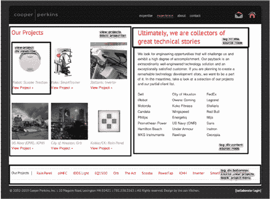

***图 D–3.** 内容提取来源概览*

关于这些页面的结构，与设计相关需要注意的重要一点是，对于许多 Drupal 页面而言，页面的布局实际上取决于 Drupal 的配置方式。这为视觉设计增加了一定的复杂性，但一旦你更深入地了解了 Drupal 的工作原理，就更容易创建出既动态、功能性强又视觉效果好的布局。示例请参见图 D–4 和 图 D–5。

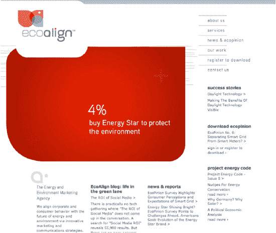

***图 D–4.** Studio Module（`studiomodule.com`）的 Claudio Vera 设计的 EcoAlign 网站，使用了动态 Flash 页眉和独特的形状来增加视觉趣味，营造出明显的“非 Drupal 式”感觉。*

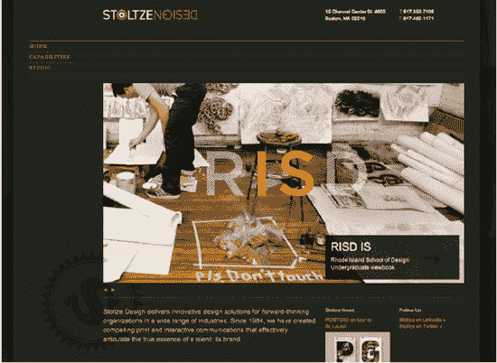

***图 D–5.** Stoltze Design 团队与开发者紧密合作，挑战 Drupal 设计的边界，专注于大胆、动态的图像。*

### 从内容出发进行设计

正如引言（Drupal 的工作原理）中提到的，Drupal 通过将你的内容分类到不同内容类型中的不同节点，并经由页面、区块和视图来显示这些节点（请参见 图 D–6）。

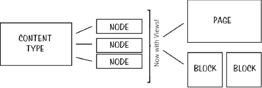

***图 D–6.** Drupal 工作方式的呈现*

这就是为什么内容策略以及理解将要*进入*你网站的内容，是任何 Drupal 项目的关键组成部分。这也是为何视觉设计最好在项目后期完成的原因之一：随着网站内容的变化，设计也随之变化。

### 让作为 Drupal 设计师的工作更轻松

Gravitek Labs（`graviteklabs.com`）的 Jacine Luisi（推特：`@jacine`）是一位专注于企业级 Drupal 网站主题开发的前端开发者。除了撰写本书的“主题开发”章节外，她还是 Sky 主题（一个基于网格、支持 HTML5 的 Drupal 基础主题——`drupal.org/project/sky`）和 Skinr 项目的创建者，后者允许主题开发者创建可在管理界面内复用的自定义 CSS 样式（`drupal.org/project/skinr`），并且她是 Drupal 7 默认主题 Bartik 的主要贡献者之一。我们共同为视觉设计师整理了一些建议，以帮助你在使用 Drupal 时让工作更轻松。

#### 切记——设计的目的是沟通

注意那些对用户来说不够清晰的设计区域——特别是导航、特色内容区域或列表。记住，设计的目的是沟通——而不是炫耀你能把东西做得有多“酷”。


