# 持续维护至关重要

人们常常将无障碍指南视为另一个只需勾选后即可了事的项目。但归根结底，这并不是一种非常有效的实践。真正需要的是实践规范，而不是一列复选框。

WCAG 2.0 提供了一套重要的无障碍成功标准，但孤立地使用这些标准作用有限。一个完全无障碍的网站（达到 WCAG 2.0 AAA 标准）除了最简单的网站外，几乎是无法实现的。网站应尽可能多地满足成功标准，但重要的是定期安排审查，以持续改进，并确保网站的发布实践能持续创建无障碍的内容。

Drupal 是一个强大的框架，任何用户生成的内容都可能导致无障碍问题。像 HTML Purifier（`drupal.org/project/htmlpurifier`）这样的模块，有助于确保所有 xHTML 代码的有效性。其他模块，例如无障碍内容模块（`drupal.org/node/394252`），则能为 Drupal 核心提供特定的无障碍增强功能。

## 定期审核新旧页面

常用页面应借助自动化测试工具定期审查，而定期随机测试的结构有助于尽可能保持网站的可访问性。理想情况下，大型网站应定期邀请焦点小组提供反馈。持续评估是网站能够不断升级以反映用户行为与技术变化的唯一途径。

测试时，要注重流程的策略性。使用 Drupal 7，你可以通过排除一些未知因素来减少测试工作量。之后，只需挑选几个关键页面来测试代表性功能即可。

## 获取专家反馈

考虑聘请一位无障碍专家来协助你改进网站。提供无障碍内容的最佳实践在不断变化，残障人士用来访问你网站的软硬件也在持续更新。随着新标准被制定和采纳，需要重新审视最佳实践，以确保内容能有效呈现。

聘请外部人员或团队来审查你的网站并寻找改进之处，这笔投资是值得的。他们知道如何查找并消除自动化测试工具无法检测到的常见障碍。此外，考虑雇佣一位残障人士来进行此项审查；我们学习和使用技术的方式各不相同，而残障体验是无法完全模拟的。

如有疑问，你可以将其发布到无障碍小组（`groups.drupal.org/accessibility`），并阅读 Drupal 无障碍相关文档，地址为 `drupal.org/about/accessibility`。

 **提示** 关于所有这些链接和资源，以及我们后续发现的更多内容，请访问 `dgd7.org/access`。

# 附 录 F


## Windows 开发环境

**作者：Brian Travis**

对于那些大部分编码时间都在使用微软开发工具的开发者来说，Linux/Unix 的世界令人望而生畏。在本章中，我将介绍各种工具和配置，使 Drupal 成为偏好 Windows 的开发者的友好平台。

有一些系统可以让你的 Windows 环境看起来像 Linux。Cygwin 便是其中之一。但我，以及我认识的许多 Windows 开发者，并不追求这个。在 Windows 上进行开发的人对自己的环境感到舒适，并不希望他们心爱的环境变得像 Linux。他们希望能够使用自己熟悉的工具，同时仍然能享受开源社区辛勤工作的成果。

Windows 开发者与专注 Linux 的群体一样，有回馈社区的愿望，但 Windows 的主流观念大多是付费服务。通过向 Windows 开发者展示 Drupal 世界中存在一个开放共享的社区，他们或许会受到激励去回馈，从而壮大整个社区。

所以，如果你是一位 Windows 开发者，欢迎来到精彩的 Drupal 世界！

如果你偏爱 Linux，请对你那些偏好 Windows 的同行们多一些同理心。不要轻视他们，也不要强迫他们用 Linux。相反，向他们展示如何在他们的世界里生活，同时仍然成为更大规模的开源开发者世界的一部分。

我认为 Drupal 7 可能是一种方式，能够将一大群非常聪明的人引入他们向往的成熟开源环境。

## 从 LAMP 到 WISP

你可能知道，Drupal 是为所谓的 LAMP 架构（Linux/Apache/MySQL/PHP）编写的。虽然可以用 Windows 替代 Linux，但用 IIS 替代 Apache 会更困难一些，用 SQL Server 替代 MySQL 则更加困难。至于用 C# 或 Visual Basic 替代 PHP，就更不用想了。

在 Windows 环境下进行开发，你可以选择三条不同的路径：

*   使用基本的 LAMP 架构，但用 Windows 替代 Linux。这可能是 Windows 程序员启动并运行 Drupal 系统最常用的方法。这通常被称为 “WAMP 架构”。

*   从 WAMP 架构开始，但换掉 Apache，使用 Internet Information Server (IIS) 作为 Web 服务器。这产生了不幸的缩写 “WIMP”，但在那些 IIS 是首选 Web 服务器的地方会用到。

*   直接走到底，用 IIS 替代 Apache，用 Microsoft SQL Server 替代 MySQL。这被称为 “WISP”，得益于 Drupal 7 内置的新数据库抽象层使其成为可能。

我将在本附录中介绍第一种配置。在我的书《面向 Windows 开发者的 Pro Drupal 7》中，你可以找到更多关于在 IIS 和 SQL Server 上运行 Drupal 的信息。

我一直在使用 VMWare 中运行的 Windows 7，因此屏幕截图和工具将针对该平台。请根据你的系统进行调整。

## Visual Studio

在我看来，Visual Studio 是完美的开发环境。Visual Studio 以及基于 .NET 反射的 IntelliSense 与我的开发习惯完美契合；我无法想象没有它该怎么写代码。

Windows 开发者还有其他可用的开发环境。其中许多，包括 Eclipse 和 NetBeans，都是从 Linux 环境移植过来的，有明显的 Linux 风格。我尝试过这些环境，虽然它们确实很丰富，但我发现它们在直观性和易用性方面都不及 Visual Studio。问题在于微软不支持 PHP。

然后我发现了来自 JCX Software 的 VS.Php ([`http://jcxsoftware.com/vs.php`](http://jcxsoftware.com/vs.php))。他们销售一款 Visual Studio 插件，为 PHP 提供了与微软支持的语言 C# 和 Visual Basic 类似的开发环境。`VS.Php` 售价不到一百美元，并且可以与免费的 Visual Studio shell 一起使用。

`VS.Php` 具备你对 Visual Studio 插件所期望的所有优点。除了语法着色，你还能获得断点、单步调试、变量探查和 IntelliSense 等功能。

如果你想为 Drupal（或任何其他基于 PHP 的框架）进行开发，那么使用 `VS.Php` 是显而易见的。我将使用这个插件来演示基于 Windows 的 Drupal 环境。

将 `VS.Php` 安装到你现有的 Visual Studio 环境中，或者使用 `VS.Php` 创建一个新的 Visual Studio shell 实例后，你需要加载一个 WAMP 架构。

## WAMP 堆栈

如果您正在使用 VS.Php Visual Studio 插件，那么您已经拥有了一个 Apache 实例，因为 VS.Php 在安装时会添加它。VS.Php 还会加载 PHP。但是，您没有数据库实例。对于基于 WAMP 的 Drupal 安装，您将需要 MySQL。

市面上有几种免费可用的 WAMP 工具。我更喜欢 WampServer (`http://wampserver.com`)，但您也可以使用任何其他您已安装或出于某种原因偏好的工具。

实际上，除了 VS.Php 之外，您只需要 MySQL。您可以单独安装它，但没有独立的 Apache 实例和 PHP 解释器，您将始终需要通过 Visual Studio 来查看您的网站。通过拥有一个完整的 WAMP 堆栈，您无需加载 Visual Studio 即可访问您的网站。

**提示** 除了 VS.Php 之外，再拥有一个独立的 WAMP 服务器，您可以同时通过 Visual Studio/VS.Php 以及外部浏览器访问您的网站。例如，如果您想测试一个网站在不同浏览器中的外观，或者甚至使用不同的登录用户进行测试，这会很方便。

首先，获取 WampServer 安装包并开始安装。我撰写本文时的当前版本是 2.1。下载安装包，如图 图 F–1 所示。

***图 F–1**. 来自 wampserver.com 的 WampServer 安装包*

安装时，系统会询问您安装包的位置。目前最好采用默认路径 `c:\wamp`，如图 图 F–2 所示。

***图 F–2.** WAMP 安装包的位置*

WAMP 需要一些管理权限。启动 WAMP 服务器可能需要您接受 UAC 屏幕（参见 图 F–3）。

***图 F–3.** WampServer 管理器的 UAC 提示*

**提示** 如果您有 Skype，您需要将其关闭，因为用户报告在 Skype 运行时安装 WampServer 会出现问题。Skype 使用 80 端口（HTTP）作为传入连接的备用端口。如果您想同时使用 WAMP 和 Skype，请进入 Skype 的工具 → 选项 → 高级连接面板，并取消选中“使用 80 和 443 端口作为传入连接的备用端口”选项。

为确保一切已正确加载，请打开网页浏览器并访问 `http://localhost`。您应该会看到 WampServer 的欢迎屏幕，如图 F–4 所示。

这表明一切已加载完毕，并且会显示您加载的当前版本。如果出现问题，请检查 WampManager 图标是否在系统托盘中并且显示为绿色。如果不是，则说明堆栈中的某个组件未启动。

此问题最常见的原因是 Apache 未启动。Apache 未启动最常见的原因是您有其他程序占用了 80 端口。最常见的占用 80 端口的应用程序是 Microsoft IIS。

如果您遇到此问题，可以通过询问 WampServer 来查看谁占用了 80 端口。单击图标将打开 WampServer 控制面板，如图 F–5 所示。

***图 F–4.** WampServer 默认欢迎屏幕*

***图 F–5.** WampServer 控制面板*

在 Apache 子菜单中，有一个“测试 80 端口”选项（参见 图 F–6）。

***图 F–6.** 测试 HTTP 端口*

这将打开一个命令窗口，以便您查看谁正在使用该端口，如图 图 F–7 所示。

***图 F–7.** IIS 正在使用 80 端口*

如果您想解决这个问题，需要关闭 IIS：进入计算机管理。我通常通过在开始菜单的“搜索程序和文件”区域输入 `iis` 来打开它。这将打开 IIS 控制面板。在 Windows 7 上，它看起来像 图 F–8 所示的屏幕。

***图 F–8.** Windows 7 中的 IIS*

在这里我们可以看到，确实，IIS 正在使用 80 端口。单击“停止”应释放该端口，以便 Apache 使用它。可以让 Apache 在不同的端口上运行，但我不建议这样做，尤其是在您可能正在学习新环境的时候。

### Drupal 组件

现在您的 WAMP 环境已设置完毕，是时候加载 Drupal 7 核心代码了。最直接的方法是访问 `http://drupal.org/project/drupal`。在那里您可以看到所有当前支持的版本，包括 `.tar.gz` 和 `.zip` 格式。对于 Windows 用户，`.zip` 格式可能是最简单的（参见 图 F–9）。

***图 F–9.** drupal.org 上当前的 Drupal 发行版*

Windows 资源管理器将打开 `.zip` 文件，如图 图 F–10 所示。

***图 F–10.** 作为 `.zip` 文件的 Drupal 发行版*

将文件夹解压到一个方便的位置。我使用 `c:\wamp\www\drupal-7.0`，但您可以根据自己的喜好放在任何位置（参见 图 F–11）。您需要在下一步中引用此目录。

***图 F–11.** 解压 `.zip` 文件*

现在您需要告诉 Apache 在哪里可以找到 Drupal。这是通过使用 Apache 的配置文件 `httpd.conf` 来完成的。WampServer 提供了一种便捷的方法，可以从 WampServer 管理器应用程序编辑该文件，如图 图 F–12 所示。

***图 F–12.** 编辑 Apache 的配置文件*

这将打开记事本，允许您编辑配置文件（参见 图 F–13）。

***图 F–13.** 设置 Apache 目录以指向 Drupal*

您需要更新此文件中的两行。一个是 `DocumentRoot`，另一个是 `<Directory>`。将这两个都设置为您解压 Drupal 程序的目录。

为此，只需依次搜索这两个字符串：

1.  编辑…查找…`DocumentRoot`

2.  将引号内的值更改为您的目录。我的目录如下所示：`DocumentRoot "c:/wamp/www/drupal-7.0/"`

3.  编辑…查找…`<Directory`

4.  再次将引号内的值更改为您的目录。我的目录如下所示：`<Directory "c:/wamp/www/drupal-7.0/">`

**警告** 可能不止一个条目以 `<Directory` 开头。请确保修改含有属性的那个。同时注意正确地为值加上引号。这是一个 XML 文档，对 XML 格式良好的约束非常敏感。

完成后，保存文件并重新启动 Apache 以读取编辑后的文件（参见 图 F–14）。

***图 F–14.** 重新启动 Apache*

**注意** 如果您的服务无法重启，最可能的罪魁祸首是配置文件中的引号或尖括号位置错误。正如我之前提到的，此配置文件的 XML 部分对语法非常敏感。只需再次打开文件检查一切是否看起来正确。

完成此操作后，再次访问 `http://localhost` 以查看一切是否配置正确。如果正确，您应该会看到 Drupal 安装屏幕（参见 图 F–15）。

***图 F–15.** Drupal 安装屏幕*

从这里开始，配置 Drupal 与在典型的 LAMP 安装下相同。关于如何配置标准 Drupal 安装的信息，请参见 第 1 章。

### VS.Php

一旦你的 WAMP 环境搭建完成，就可以加载 Visual Studio 和 VS.Php 插件了，前提是你选择了这个开发环境。

我使用的是 Visual Studio 2010，但 VS.Php 也支持更早版本的 Visual Studio。此外，VS.Php 还提供一种包含免费 Visual Studio 外壳的发行版，适用于未安装完整版 Visual Studio 的情况。本小节将介绍该版本。

请从 [`http://www.jcxsoftware.com/download.php`](http://www.jcxsoftware.com/download.php) 获取 VS.Php 安装包。如果你使用的是免费的 Visual Studio 外壳，建议下载 Web 安装程序（参见图 F–16）。

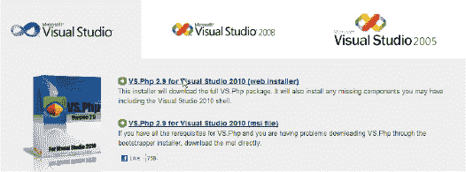

***图 F–16.** VS.Php 安装程序站点*

如果安装程序在你的电脑上未检测到 Visual Studio，它会提供安装外壳的选项，如图 F–17 所示。

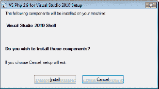

***图 F–17.** 安装免费的 Visual Studio 外壳*

这是在 Windows 上开始使用 Drupal 最经济的方式。在撰写本文时，VS.Php 提供 30 天免费评估。

 **提示** 如果你选择从 VS.Php 安装程序安装 Visual Studio 外壳，可能会提示需要重启系统。重启后，你需要重新启动 `VS.Php` 安装程序。

VS.Php 的安装过程非常简单直接。目前使用默认设置即可。安装完成后，你应看到图 F–18 所示的成功界面。

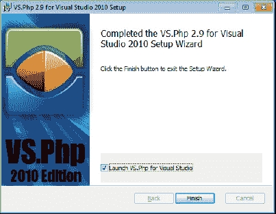

***图 F–18.** VS.Php 安装成功界面*

安装完成后即可启动 VS.Php，它将自动启动 Visual Studio 并集成到开发环境中。现在，我们需要告诉 VS.Php Drupal 代码的位置。在 Visual Studio 中，依次选择“文件”  “新建”  “根据现有代码创建 PHP 项目...”。此时可能会弹出 30 天试用提示窗口。确认后，将出现一个向导，提示你指定 PHP 代码的位置（参见图 F–19）。

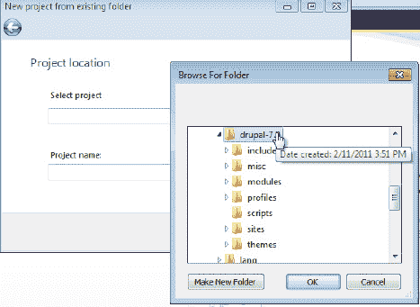

***图 F–19.** 从现有 PHP 代码新建项目*

你可以选择 PHP 5.2 或 5.3 版本；Drupal 7 对两者都提供支持。

由于接触了一种新语言，你需要告诉 Visual Studio 如何处理源代码。以下设置与 Drupal 的代码格式规范兼容。在 Visual Studio 中，依次进入“工具”  “选项”，然后展开“文本编辑器”  “PHP”  “制表符”（参见图 F–20）。

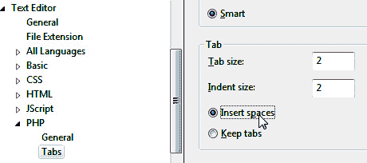

***图 F–20.** 确保制表符与 Drupal 制表符规则一致*

Drupal 的代码格式规范要求缩进使用两个空格，并且应保留空格而非插入制表符。现在，我们需要告诉 Visual Studio 一些额外的文件扩展名也应识别为 PHP 代码文件。这可以在同一界面的“文件扩展名”项下进行设置（参见图 F–21）。

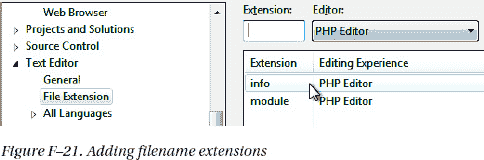

***图 F–21.** 添加文件扩展名*

添加 `.info` 和 `.module` 扩展名，然后点击“确定”。

 **注** Drupal 社区的编码标准已整合到一个链接中：`drupal.org/coding-standards`。作为一名新的 Drupal 程序员，熟悉这些标准是个好主意，以免被贴上菜鸟的标签。

现在，让我们尝试在 Visual Studio 中运行代码。在 `index.php` 的第 21 行设置一个断点，如图 F–22 所示。

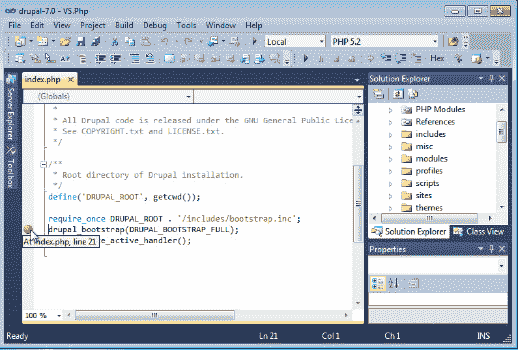

***图 F–22.** 在 PHP 中设置断点*

现在按 `F5` 键开始调试。你可能会收到一个错误提示，指出启动 Web 服务器时出现问题。暂时忽略它，再次尝试调试。一旦开始加载，你可能会看到图 F–23 所示的界面。

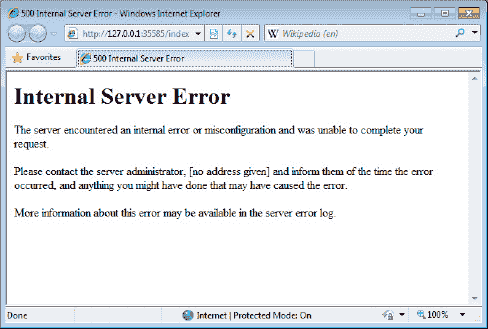

***图 F–23.** 配置错误*

要解决此问题，需要检查以下两点：

*   原因可能是 WampServer 没有运行。请记住，你之前为了加载 Visual Studio 已经重启过系统。只需重新启动 WampServer，然后再次尝试调试即可。

*   `.htaccess` 文件中有一条指令未被 Apache 引擎识别。请打开位于 Drupal 基础安装根目录下的 `.htaccess` 文件，将包含 `Order` 单词的那一行注释掉（参见图 F–24）。

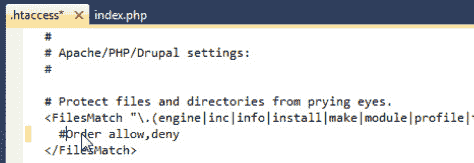

***图 F–24.** 更正 `.htaccess` 文件*

在该行前面加上一个井号（`#`）即可将其变为注释。

 **提示** VS.Php 拥有自己独立的日志文件。在 Windows 7 中，错误日志位于 `C:\Users\{你的用户名}\AppData\Roaming\Jcx.Software\VS.Php\Apache2\drupal-7.0\logs`。

保存文件，然后再次按 `F5` 键进行调试。如果一切顺利，Visual Studio 应该会在你在 `index.php` 中设置的断点处暂停。之后，你就可以像处理你喜欢的 .NET 语言一样，单步执行代码、检查变量、查看调用堆栈等（参见图 F–25）。

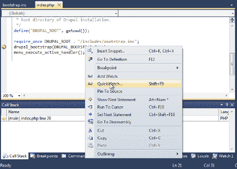

***图 F–25.** VS.Php 将 Visual Studio 转变为 PHP 调试环境*

### phpMyAdmin 和 MySQL 连接器

如前所述，MySQL 已随 WampServer 一起提供。MySQL 附带了一个用于管理数据库服务器的工具。你可以使用它创建和删除数据库、创建和查询表、以及管理用户和权限。该工具名为 `phpMyAdmin`，可以通过 WampServer 控制台访问（参见图 F–26）。

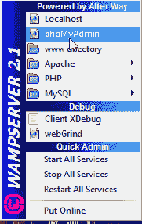

***图 F–26.** 访问 `phpMyAdmin`*

此操作将启动你的默认浏览器并显示 MySQL 数据库，如图 F–27 所示。

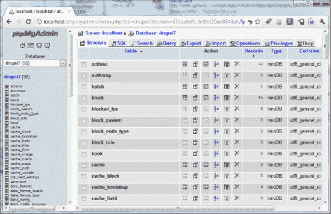

***图 F–27.** `phpMyAdmin` 界面*

如果你更倾向于使用 Visual Studio 来管理数据库服务器，可以安装 .NET 的 MySQL 连接器，该工具可免费从 [`http://dev.mysql.com/downloads/connector/net`](http://dev.mysql.com/downloads/connector/net) 获取。它会被安装到 Visual Studio 中，并提供与 Visual Studio 服务器资源管理器相似的功能（参见图 F–28）。

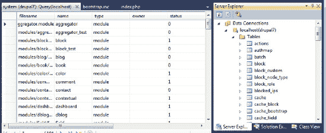

***图 F–28.** 用于 Visual Studio 的 MySQL 连接器*

至此，你已经准备好开始学习过程了。单步执行代码、检查变量、观察数据库如何与代码交互。我认为这是学习新环境最好、最快的方式，而且一切都可以在你熟悉的 Windows 开发环境中舒适地进行。

在下一节中，我们将安装一个对许多 Drupal 开发者来说已不可或缺的工具，那就是 Drush。

### Drush

Drush，即“Drupal shell”，在第 2 章和第 26 章中会详细介绍。Drush 是一套 PHP 程序，能极大地简化你的 Drupal 开发体验。Drush 的运行需要一些类 Linux 工具。在 Linux 机器上，这些工具很可能已经存在，你只需要下载 Drush 代码即可。

不幸的是，标准的 Windows 机器并不包含所有这些工具，因此你需要在你的机器上安装它们。这虽然有点麻烦，但我保证，如果现在花几分钟时间搭建好这个环境，当你开始在 Windows 环境中开发 Drupal 应用时，将会节省更多的时间。

### 在 Windows 上安装 Drush

以下是加载并运行这些工具的步骤。

首先，从 [`http://drupal.org/project/drush`](http://drupal.org/project/drush) 下载 Drush 安装包。下载最新版本（参见 图 F–29）。

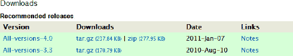

***图 F–29.** 下载 Drush 安装包*

将文件解压到一个方便的目录中。我使用 `c:\drush`。稍后我们会将其添加到环境变量 Path 中。

现在，我们需要获取 Drush 的先决条件。这些都是开源工具，并且它们都有带安装程序的 Windows 二进制版本。第一个工具 `libarchive` 的下载页面如 图 F–30 所示。它位于 [`http://gnuwin32.sourceforge.net/packages/libarchive.htm`](http://gnuwin32.sourceforge.net/packages/libarchive.htm)。

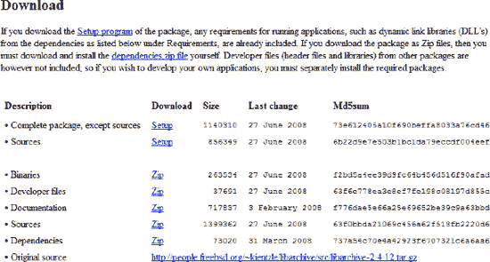

***图 F–30.** 一个开源工具的下载页面*

选择你想要的版本。我通常只下载完整软件包的安装程序。运行安装程序并接受默认设置（参见 图 F–31）。这将会安装你的程序，但不会修改环境变量 Path。我们稍后会处理这个问题。

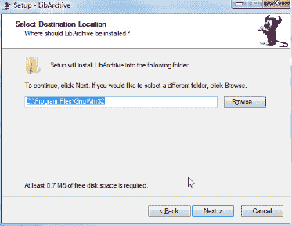

***图 F–31.** 开源工具的安装程序*

你需要总共四个 GNU 软件包才能使 Drush 正常工作：

*   [`http://gnuwin32.sourceforge.net/packages/libarchive.htm`](http://gnuwin32.sourceforge.net/packages/libarchive.htm)

*   [`http://gnuwin32.sourceforge.net/packages/gzip.htm`](http://gnuwin32.sourceforge.net/packages/gzip.htm)

*   [`http://gnuwin32.sourceforge.net/packages/wget.htm`](http://gnuwin32.sourceforge.net/packages/wget.htm)

*   [`http://gnuwin32.sourceforge.net/packages/gtar.htm`](http://gnuwin32.sourceforge.net/packages/gtar.htm)

现在我们需要设置 `PATH` 环境变量，以包含 Drush、PHP 以及已安装的二进制文件的路径。为此，你需要进入环境变量配置界面。该操作方法因操作系统而异。右键点击“计算机”，选择“属性”。点击“高级系统设置”，然后点击“环境变量…”。你将看到如 图 F–32 所示的界面。

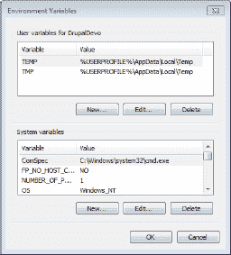

***图 F–32.** 环境变量对话框*

在“用户变量”下，点击“新建…”，你会看到“新建用户变量”窗口，如 图 F–33 所示。

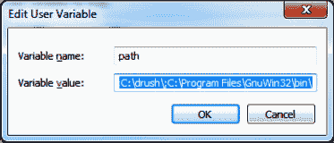

***图 F–33.** 用户变量对话框*

在“变量名”字段中输入 `path`，在“变量值”字段中输入新的目录。请务必包含兼容版本 PHP 的路径，因为 Drush 将会使用它。我使用的是 `C:\drush\;C:\Program Files\GnuWin32\bin`，但你的系统可能不同。

分号用于分隔各个路径。这些路径是你需要定位以下文件所在的位置：`php.exe`、`drush.bat` 以及 `tar`/`gzip`/`wget` 二进制文件。

如果你已经打开了一个命令提示符窗口，你需要关闭它并重新打开，以便它读取新的路径。

### 运行 Drush

现在让我们测试一下 Drush 及其先决条件是否安装成功。使用命令提示符窗口，切换到“modules”和“themes”目录的上级目录。我的目录是 `C:\wamp\www\drupal-7.0\sites\all\`。

在命令提示符下输入 `drush`。你将看到一长串可以执行的操作列表，如 图 F–34 所示。

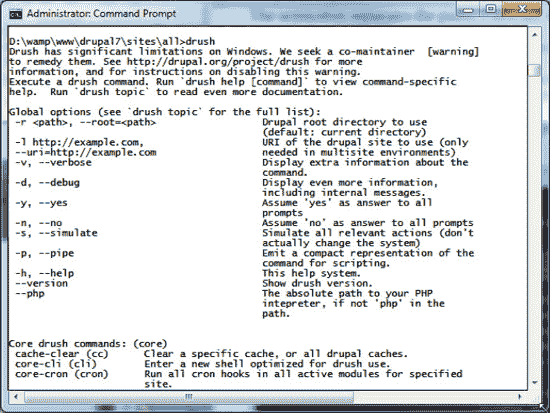

*图 F–34. Drush 帮助屏幕*

 **注意** 我在某些机器上收到一条消息，提示缺少某个特定的 DLL。

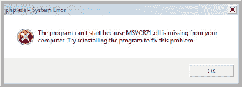

我不确定为什么会发生这种情况，但你可以在 [`www.dll-files.com/dllindex/dll-files.shtml?msvcr71`](http://www.dll-files.com/dllindex/dll-files.shtml?msvcr71) 下载该 DLL 文件。

如果这能正常工作，那么你刚刚让你的 Drupal 使用体验变得更加高效。Drush 可以帮助你完成许多原本需要大量鼠标操作的任务。

Drush 知道 Drupal 项目在“网络世界”中的位置。它也能通过读取安装程序创建的 `settings.php` 文件来了解数据库的位置和登录信息。正因如此，它无需图形用户界面即可执行这些管理任务。当然，这也意味着任何能够访问 Drush 和你目录结构的人都可以做同样的事情。标准的安全预防措施同样适用。

### 总结

Drupal 最初是为在 LAMP 技术栈下运行而设计的。在代码标准化方面已经取得了很大进展，使其能够超越这一特定的技术栈。使用 Drupal 7，可以选用不同的 Web 服务器和数据库。在附录中，我们正是这样做的，用 Windows 替换了 LAMP 中的“L”（Linux）。要了解更多关于在 Windows 上使用 Drupal 的信息，请访问 [`http://drupalforwindows.com`](http://drupalforwindows.com) 并查阅我的书《*Pro Drupal 7 for Windows Developers*》。还有一个专门面向 Windows 开发人员和管理员的 Drupal 群组。网址是 [`http://groups.drupal.org/drupal-windows`](http://groups.drupal.org/drupal-windows)。

我预计，对于 Drupal 在 WISP 技术栈下运行的需求将会很大，并且将会出现一个以 Windows 为中心的社区来支持这个平台，使 Drupal 比现在更加流行。

## 附录 G


## 在 Ubuntu 上安装 Drupal

**作者：本杰明·梅兰松（Benjamin Melançon）**

在 Linux 环境中开发网站意味着你使用的所有工具（像 Drupal 本身一样）默认都是开源免费软件。也许对你更重要的是，Drupal 所依赖的服务器、编程语言和数据库在 Linux 上设置和运行起来更容易。

我强烈建议你在 Linux 环境中开发网站，还有一个额外原因：你的 Drupal 站点很可能托管在运行 Linux 的服务器上。虽然我们衷心支持各种版本的 GNU-Linux，但如果你运行的不是流行的 Ubuntu 版本，我会假定你已经有经验了。本附录将重点介绍如何在 Ubuntu 中设置 Drupal。

 **提示** 如果你目前没有运行 Linux，并且还不想为了开发或只是运行本地网站而切换主操作系统，你可以在虚拟机中运行 Linux。

在开始设置你的开发环境时，最重要的素质就是耐心。前期需要花些时间让一切正常运转，但这会为你以后节省大量时间。

### 在 Windows 或 Mac OS X 上运行 Ubuntu

要在一台运行其他操作系统的计算机上使用 Linux——例如你使用的是 Mac OS X 或 Windows 个人电脑——你可以在虚拟机中非常高效地运行 Linux。近年来，虚拟机的功能已经变得相当完善。

下载你选择的虚拟机软件。开源软件 VirtualBox 对 Windows 或 Mac 是免费的（参见 `virtualbox.org`）。专有软件 VMWare（包括用于在 Mac OS X 上运行 Linux 的 VMWare Fusion）也相当实惠。

同时下载当前 Ubuntu 版本的磁盘映像（访问 `ubuntu.com/download`，选择“下载并安装”）。

一旦虚拟机软件和 Ubuntu 磁盘映像都下载到你的电脑上，请按照你的虚拟机软件的说明来安装操作系统。最重要的事情是告诉虚拟机你的磁盘映像在电脑上的位置（并且它需要保持在这个位置）。对于其他配置，接受默认设置即可。

 **注意** 如果使用 VirtualBox，你可以不必下载 Ubuntu 磁盘映像，而是直接获取一个已为 Drupal 开发配置好 Ubuntu 的 VirtualBox 设备：`drupal.org/project/quickstart`。Quickstart 提供了一个类似于下一节描述的 Drubuntu 的环境，但它与 Drubuntu 不兼容——你必须二选一。

### 使用 Drubuntu 为 Drupal 开发定制 Ubuntu 系统

`Drubuntu` 为单个开发者搭建 Drupal 开发环境，包含 LAMP 栈（Linux、Apache、MySQL、PHP）、Eclipse 集成开发环境、Firefox 开发者工具、Git、Drush 等。`Drubuntu` 还包含其自有的 Drush 脚本，用于添加和删除本地站点。

 **提示** 为 Drupal 开发而搭建的 Ubuntu 环境领域正在快速改善。请参阅 `dgd7.org/ubuntu` 获取最新推荐。

获取安装 `Drubuntu` 的最新说明，请访问其项目页面 `drupal.org/project/drubuntu`。它提供了一种无需事先下载即可引导安装的方法，即直接从仓库中获取 `drubuntu-bootstrap.sh` shell 脚本。当然，你也可以从其项目页面 (`./drubuntu/drubuntu-bootstrap.sh`) 下载 `Drubuntu` 并运行。

输入你的密码，并根据提示输入 **y** 表示同意（系统通常会提示你可能需要输入密码，但有时并不需要），然后耐心等待它安装一个庞大的开发环境，其中包含许多你每天都会使用的工具。

#### 创建 MySQL 根密码

`Drubuntu` 没有为你设置的一个功能是设置 MySQL 根密码，而你可以自行设置，使你的开发环境更加便捷。

`mysqladmin -u root password 你的密码`

然后将该密码添加到 MySQL 配置文件中，这样你就不必每次都输入了。使用 Vim 等文本编辑器打开或创建该文件。

`vi ~/.my.cnf`

添加以下内容：

```
[client]
user=root
pass=你的密码
```

#### 安装 Drupal

`Drubuntu` 的主要价值在于为你安装 LAMP、Git、Drush 等工具。你不需要使用其特殊工具（例如 `drubuntu-site-add` Drush 命令），事实上，本指南中也不会用到。肯定有人会制作出最终的 Drush 命令来启动新站点，而大多数开发者都有自己的 shell 脚本——但这些脚本通常与并非通用的仓库或服务器实践绑定。你可以在 `dgd7.org/sh` 查看用于许多用途的辅助 shell 脚本示例，包括像清单 G-1 所示用一条命令设置新站点。

当一个项目相关的所有内容都放在一处时，就很容易一起纳入版本控制（参见第 2 章）。因此，我建议你创建一个文件夹作为项目文件夹，并将 Drupal 放在该文件夹的子文件夹中（例如，命名为 `drupal` 或 `web`）。在 Web 根目录之上设置项目文件夹，可以让你将不应放在公共 Web 根目录（即 Drupal 的 `index.php` 所在目录）中的材料与项目放在一起。好的做法是为项目（本例中为 **dgd7**）创建一个目录，并将 Drupal 核心放入 Web 根目录（`dgd7/web`）的一个子目录中，我将其称为 Drupal 根目录。

将 Drupal 核心副本放置到该目录后，进入你的 Drupal 根目录，创建 `sites/default/default.settings.php` 文件的副本，在复制时将其重命名为 `sites/default/settings.php`，并更改文件目录的权限以使其可写。

*清单 G-1. 下载 Drupal 并准备运行 Web 安装器的非 Drush 命令行步骤。将 `drupal-7.1` 替换为 Drupal 的当前稳定版本；例如 `drupal-7.4`。*

```
wget http://ftp.drupal.org/files/projects/drupal-7.1.tar.gz
tar -xzf drupal-7.1.tar.gz
mkdir -p ~/code/dgd7
mv drupal-7.1 ~/dgd7/web
cd ~/code/dgd7/web
cp sites/default/default.settings.php sites/default/settings.php
chmod -R o+w sites/default
```

 **提示** 前五个步骤可以使用 Drush 更快地完成：`cd ~/code; mkdir dgd7; cd dgd7; drush dl drupal --drupal-project-rename=web; cd web`。

`Drubuntu` 将 Apache 配置为自动将放在 `~/workspace` 目录中的任何目录作为网站提供服务。也就是说，如果你创建一个目录 `~/workspace/dgd7` 并在其中放入一个 `index.html` 文件，你可以在浏览器中访问 `dgd7.localhost`，你将看到该 `index.html` 文件以网页形式呈现。由于 Drupal 运行在其项目目录的子目录中，请将完整的项目目录放在你自己的 `~/code` 目录中，并从 workspace 目录创建一个指向项目 Web 根目录的*符号链接*，如下所示：

`ln -s /home/ben/code/dgd7/web /home/ben/workspace/dgd7`

在创建不会成为项目（或者不遵循将 Web 根目录作为子目录包含在项目仓库中的方法）的测试站点时，你可以直接在 `Drubuntu` 的 workspace 目录中创建项目，并跳过符号链接步骤。

#### 创建数据库

Drupal 将信息存储在数据库中。有关你网站的所有信息都存储在此数据库中，根据信息类型（例如文章、评论和用户）整齐地划分到不同的表中。使用命令行为你的新 Drupal 网站创建 MySQL（参见清单 G-2）或 MariaDB 数据库既快速又简单，但你也可以使用 phpMyAdmin 等应用程序或 Web 应用程序。如果使用 phpMyAdmin，你可以通过转到“权限”  “添加新用户”，然后在“用户数据库”下选择“创建与用户名同名的数据库并授予所有权限”来同时快速创建数据库和用户。

***清单 G-2.** 在 MySQL 中创建数据库的命令行说明。如果你尚未按照“创建 MySQL 根密码”中所述创建 `.my.cnf` 文件，则第一行必须为 `mysql -u root -p 密码`。*

```
$ mysql
mysql> CREATE DATABASE 数据库名;
mysql> GRANT ALL PRIVILEGES ON 数据库名.* TO "用户名"@"localhost" IDENTIFIED BY "密码";
mysql> FLUSH PRIVILEGES;
mysql> EXIT;
```

用你自己的值替换斜体部分。对于数据库名称，你可以保持简单，将其命名为 `dgd7`，并且为了更简单，也可以将数据库用户命名为 `dgd7`。主机名在本例中为 `localhost`，并且由于在你自己的计算机上安全性不是问题，请继续也将密码设置为 `dgd7`。

 **提示** 请参阅 `dgd7.org/sh` 获取用于自动化创建数据库以及我刚刚涵盖的所有其他操作的 shell 脚本。安装一个站点时影响不大，但当你安装很多站点时，时间累积起来就很重要了，并且养成创建新测试站点的习惯会有所帮助。