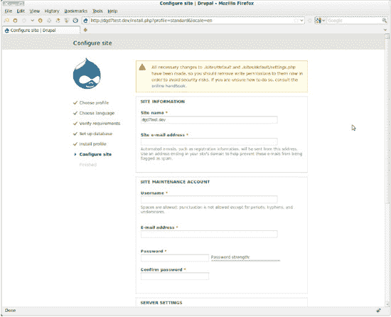

# Drupal 自动安装程序

现在，在浏览器中加载你的 Drupal 根目录。具体地址会因你的本地托管环境而异，通常是 `localhost/drupal` 或类似地址。你会自动重定向到 `install.php` 并启动 Drupal 的自动安装程序。

在第一页，你需要选择要使用的安装配置文件；除非你从 Drupal.org 下载了社区贡献的配置文件，或者创建了自己的配置文件，否则你可能希望使用标准配置文件（Standard），因为最小化配置文件（Minimal）确实非常精简。点击选择语言页面，除非你想先下载非英文翻译，否则直接进入设置数据库页面。在这里，你可能希望将“数据库类型”保留为默认的“MySQL、MariaDB 或等效项”，然后在数据库名称、用户和密码中输入你创建数据库时提供的值。提交表单后，Drupal 将自动安装！安装完成后，你将能填写一些基本站点信息，并创建一个用户名和电子邮件地址，同时为该管理员用户账户设置凭证（参见图 G-1）。

***图 G-1.** 安装站点后，Drupal 的站点名称和第一个特权用户配置页面*

恭喜！你现在拥有了一个空的 Drupal 站点。目前还没有任何内容，Drupal 7 很贴心地告诉你没有首页内容。首页内容（合理来说）指的是标记为“推广到首页”的内容。前往第 1 章开始构建一个新站点。

 **注意** 如需更多信息，尤其是基于读者反馈的更好说明和新建议，请访问 `dgd7.org/ubuntu`。

