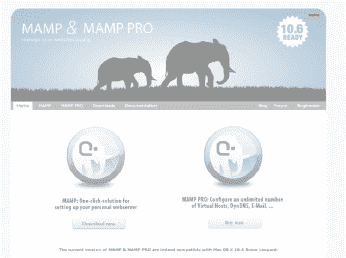
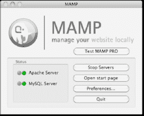
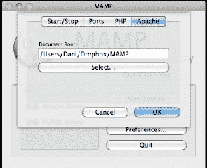
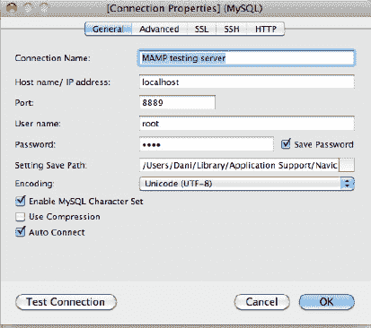

# Mac OSX 安装

**作者：Dani Nordin**

要在 Mac 平台上使用 MAMP 搭建 Drupal 环境，首先在 `mamp.info` 下载 MAMP 的免费版本（左侧图标，参见图 H-1）。文件下载完成后，解压缩并点击解压后的文件启动安装程序。



*图 H-1. `mamp.info` 的截图。你需要选择左侧的图标。*

MAMP 本质上会将你电脑中的一个文件夹变为一个微型开发服务器；因此，你在本地开发的所有站点实际上都是该主文件夹的子文件夹。务必确保将主文件夹的位置设置为你文件系统中一个合理的位置，并定期备份该文件夹。

要启动 MAMP，请执行以下步骤：

1.  点击程序坞中的 MAMP 图标。这将启动 MySQL 服务器和 PHP。

2.  忽略它打开的浏览器窗口，返回 MAMP 屏幕（参见图 H-2）。

    

    *图 H-2. MAMP 主屏幕*

3.  点击“偏好设置”按钮，进入“Apache”标签页。将文档根目录（后续称为“web 根目录”）设置为适合你文件系统的位置。

    

    *图 H-3. 为 MAMP 设置默认文档根目录*

从图 H-3 可以看到，我将主文件夹设置在了一个 Dropbox 文件夹内。Dropbox（可在 `getdropbox.com` 获取）允许你免费存储高达 2GB 的数据，并且所有数据都会在每次更改时通过网络同步。如果你没有大量的大文件需要存储，Dropbox 是一种简便的方法，可以让你无论使用哪台机器都能访问你的数据。

## 下载 Drupal 核心文件

接下来，从 `http://drupal.org/project/drupal`（或 `drupal.org/start`）下载 Drupal 核心安装文件。将该文件解压到你之前在 MAMP 中设置的文档根目录中，并将解压后的文件夹名称更改为 DGD7 或类似名称。

### 命令行操作

以下是下载 Drupal 并准备运行 Web 安装程序的命令行步骤。将代码中的 `drupal-7.0` 替换为 Drupal 7 当前稳定版本的编号，你可以在 [`http://drupal.org/project/drupal`](http://drupal.org/project/drupal) 找到。更好的方法是，在开始之前就从网站上复制链接！

 **注意** 请在 web 根目录下执行此操作。由 ** 括起来的注释描述了实际发生的情况。

```
wget http://ftp.drupal.org/files/projects/drupal-7.0.tar.gz
        **从提供的链接下载文件**
tar -xzf drupal-7.0.tar.gz
        **将其从压缩文件中解压**
mkdir ~/dgd7
        **创建一个名为 dgd7 的新目录**
mv drupal-7.0 ~/dgd7/web
        **将 Drupal 文件夹移动到 dgd7 目录中**
cd ~/dgd7/web
        **导航到新目录**
```

### 创建数据库

要安装 Drupal，你需要在本地 MySQL 服务器上创建一个数据库。你可以使用 phpMyAdmin 创建数据库，该工具是免费的，可在 `phpmyadmin.net` 获取。或者，使用 Navicat（一款付费软件，可在 `navicat.com` 获取），这是我发现的处理数据库最简单的方法之一。尽管高级版软件价格较高（并且在需要启动上线时，用于在多个服务器上复制或同步数据库非常重要），你可以在 `navicat.com/en/download/download.html` 下载一个名为 Navicat Lite 的免费版本，该版本同时适用于 Windows 和 Mac。你也可以免费试用 Navicat 30 天。

为本演示之目的，我将使用 Navicat Premium，但 Navicat Lite 中的流程基本相同。

1.  打开 Navicat 并选择“连接”  “新建连接”  “MySQL”。

2.  按如下方式创建设置：主机名为 `localhost`，用户名和密码均为 `root`。如果你保持 MAMP 默认端口不变，端口可能是 8888。在我的设置中，它已被改为 8889（参见图 H-4）。

    

    *图 H-4. Navicat 的连接设置*

3.  创建连接后，双击左栏中的连接名称打开它。右键单击连接名称，从菜单中选择“新建数据库”。将数据库命名为 `dgd7`。

就这样，完成了。看有多简单？

### 创建数据库的命令行步骤

以下是创建 MySQL 数据库的命令行说明。由 ** 括起来的注释解释了发生的情况。请记住，你将使用“终端”在 web 根目录下执行此操作。

```
$ mysql -u root -p
        **登录到 web 根目录**
mysql> CREATE DATABASE dgd7;
**创建一个名为 "dgd7" 的数据库**
mysql> GRANT ALL PRIVILEGES ON database.* TO "username"@"localhost" IDENTIFIED BY...
  "password";
        **正如其所述**
mysql> FLUSH PRIVILEGES;
        **此操作亦然**
mysql> EXIT;
        **此操作亦然**
```

你需要为斜体部分填写你自己的值。对于 `root`，请使用你数据库的管理员用户名（通常为 `root`）。（在某些设置中，默认情况下 root 密码可能为空。）对于数据库名称，你可以保持简单，命名为 `dgd7`。为了使事情更简单，将数据库用户也命名为 `dgd7`。此情况下的主机名将是 `localhost`，并且由于在你自己的电脑上安全不是问题，请继续将密码也设置为 `dgd7`。