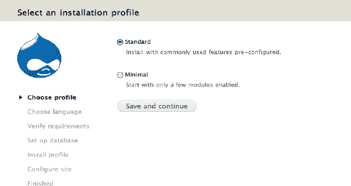
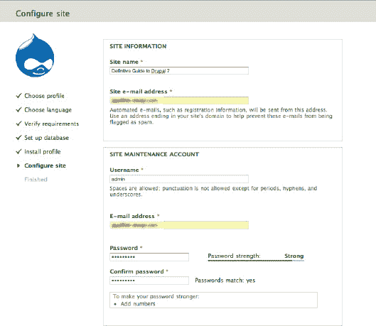
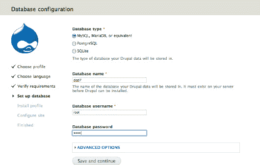
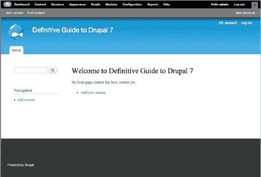

# 开始安装：好戏开场了

创建好数据库后，在浏览器中访问`localhost:8888/dgd7`。这应该会带你到`localhost:8888/dgd7/install.php`。暂时选择标准安装配置；它会为你处理一些基本设置（参见图 H-5）。在下一页，选择英语作为安装语言。如果你需要用其他语言安装，该页面上有一个方便的链接会告诉你如何操作。

**图 H-5.** Drupal 安装界面

现在该使用你刚刚创建的数据库信息了。在接下来的界面中，输入你在创建数据库时提供的值。

提交表单。Drupal 将在几分钟内自行安装。当安装程序完成后，你将能够填写一些基本的站点详细信息，以及管理员用户账户的用户名和电子邮件地址（参见图 H–6 和 H–7）。

**图 H-6.** 设置站点默认值

**图 H-7.** 数据库设置

 **注意** 安装过程中创建的第一个用户被授予在站点上执行所有操作的权限——永久有效。因此，强烈建议永远不要将此用户作为你的个人账户使用。相反，应将其用作“超级用户”或管理员账户，并为其设置一个强密码。该站点目前可能只在你自己的电脑上，但当你将其迁移到线上时，你需要保留这些用户账户。Drupal 要求所有站点用户的电子邮件地址唯一，因此如果你只有一个电子邮件地址，最好创建第二个电子邮件账户，例如`admin.user@gmail.com`，专门用于超级用户账户。

**图 H-8.** 你的新主页，包含 Drupal 管理菜单

恭喜！你现在拥有了一个空的 Drupal 站点，可以准备添加内容了（参见图 H-8）。前往第 1 章开始构建一个新站点。

 **提示** 有关在 Mac OS X 上安装 Drupal 的读者笔记，请访问`dgd7.org/mac`。