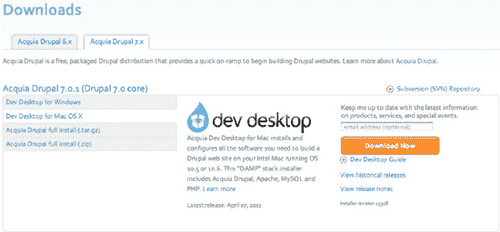
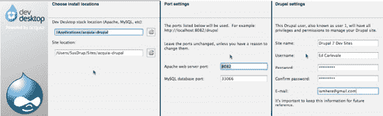
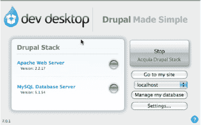
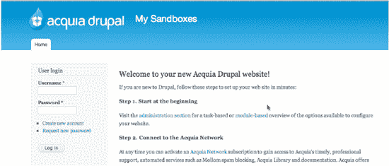
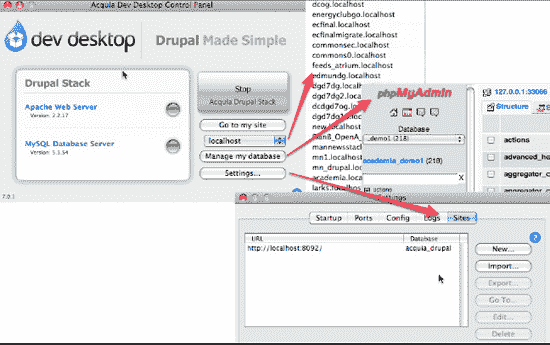
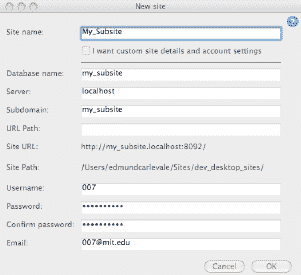
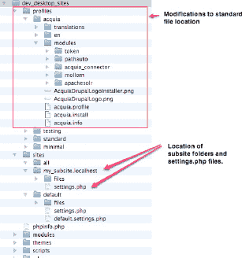
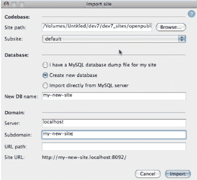

# 附 录 I

## 使用 Acquia Dev Desktop 设置 Drupal 环境

**作者：Ed Carlevale**

Acquia 的 Dev Desktop 应用程序有许多优点。下载安装程序（参见图 I-1），在 10 分钟内，你的服务器、数据库和第一个 Drupal 站点就能启动并运行。只需点击一下即可访问 phpMyAdmin。创建任意数量的全新安装。通过转储数据库并将 `sql` 文件导入到新安装中来克隆站点。优雅、简单且功能强大。

**图 I-1**. Acquia 提供的 Drupal 堆栈安装程序

 **注意** Dev Desktop 适用于 Mac 和 Windows。我只使用过 Mac 版本，而且发现它非常好用。据说适用于 Windows 的 Drupal 6 版本有点问题，不过这些问题可能在 Drupal 7 版本中已经得到解决。

### 安装

从 Acquia 网站（`acquia.com/downloads`）以磁盘映像文件的形式下载 Dev Desktop。

点击文件以展开磁盘映像并打开安装程序。

双击图标启动安装过程。

安装程序将引导你完成一系列关于文件位置、端口设置和默认站点设置的屏幕（参见图 I-2）。默认设置就是你需要的。Drupal 站点设置用于你创建的第一个站点，但你可以修改任何你创建的子站点或导入站点的设置。

**图 I-2.** Dev Desktop 安装的默认设置

 **注意** 你可以设置 Dev Desktop 的多个副本（在你的硬盘、便携式硬盘、Dropbox 等上）。只需重复安装过程并相应地修改设置即可。对于端口设置，增加默认设置（例如 8082, 8083 等）。

当安装过程完成后，安装程序会请求权限来创建你的第一个网站。点击是。这将启动 Dev Desktop 的控制面板（参见图 I-3）并打开一个新的浏览器窗口，显示你新网站的欢迎界面（参见图 I-4）。使用你在设置期间提供的用户名和密码登录。

**图 I-3**. Dev Desktop 的控制面板

**图 I-4**. 堆栈安装程序第一个网站的登录界面

### 更进一步

Dev Desktop 的真正强大之处在于创建更多站点是多么容易。你有两个选择：

1.  在你的主安装上创建子站点——或者用 Drupal 术语来说，是多站点。子站点会创建一个新的数据库，但使用你原始安装的文件和模块。

2.  创建一个新的、独立的 Drupal 7 安装。这对于使用安装配置文件来说非常理想。

前者快速，后者强大。两全其美。

所有这些操作都可以通过 Dev Desktop 的控制面板完成，从今以后它将成为你最好的朋友。在这里，你可以打开 phpMyAdmin，导航到任何你创建的站点，或创建新站点（参见图 I-5）。

**图 I-5.** 控制面板链接

#### 创建子站点

要创建当前安装的子站点，从控制面板开始，转到“设置”  “站点”  “新建”。这将打开如图图 I-6 所示的表单。填写站点名称。数据库和子服务器会自动填写，其他设置则沿用你在安装过程中提供的默认值。点击确定。大约一分钟后，新站点就创建好了。点击“转到”按钮在新浏览器窗口中打开该站点。

更多关于多站点的信息，请参阅 Drupal 的在线文档（`drupal.org/node/53705`）。

**图 I-6.** 创建子站点

 **注意** 在 Drupal 6 版本的 Dev Desktop 中，某些贡献模块被从它们的默认位置（`/sites/all/modules`）移到了核心模块文件夹（`modules/acquia`）内的一个文件夹中，从而使模块更新变得复杂。对于 Drupal 7 版本，一些贡献模块被放置在 Profiles 文件夹中（参见图 I-7），但新的“自动更新”功能可以在后台高效且不显眼地处理更新。

**图 I-7**. Dev Desktop 主 Drupal 安装及其关联子站点的目录结构

#### 导入站点

“导入”选项非常适合与安装配置文件一起使用。只需下载安装文件，将其解压缩到一个方便的文件夹中，并确保它位于存储 Dev Desktop 主 Drupal 安装的文件夹之外。然后，导航到“设置”  “站点”  “导入”（参见图 I-8）。

**图 I-8**. 导入新的 Drupal 安装

有关安装配置文件的更多信息，请参阅第 38 章。前往第 1 章开始构建一个新站点。

 **注意** 有关使用 Acquia 的 Dev Desktop 运行 Drupal 的更新和讨论，请参见 `dgd7.org/stack`。当然，对于本书整体的更正和新材料，请查看 `dgd7.org/updates`。

#### 索引

### 特殊字符与数字

`#access` 属性，338

`#ajax` 属性，511

`#ajax` 属性，通过其实现的动态表单，591–592

`#attached` 属性，322，788–789，932

`#attributes` 数组，449

`#callback` 属性，547

`#description` 属性，336，411，781

`#drupal-contribute`，199，534

`#element_validate` 属性，779，781

`#field_name`，755

`#items` 属性，324

`#markup` 行，796，799

`#markup` 属性，411–412，927

`#post_render` 方法，932

`#pre_render` 属性，332

`#prefix` 属性，322，411，790

`#region` 属性，322

`#sorted` 属性，322

`#states` 属性，511

`#suffix` 属性，322，411

`#theme` 属性，322–324，331，437

`#theme_wrappers` 属性，322，331，435，790，927，932

`#title` 属性，411

`#type` 元素，411，925

`#type` 属性，322，324，927

`#view_mode`，755

`#weight` 属性，322，336，339

`$_GET['q']` 路径，691

`$account` 参数，469

`$action_links` 变量，327，767

`$arg` 参数，396，481

`$attributes` 变量，297

`$base_path`，686

`$base_root`，686

`$base_url`，686

`$classes` 变量，297，314–315

`$closure` 变量，286

`$conf` 数组，637

`$conf` 变量，467，689

`$content` 变量，297，326–328

`$databases = array( )` 行，246

`$directory` 变量，296

`$(document).ready( )` 方法，364

`$every_page` 标志，362

`$filters['dgd7_tip']` 数组，776

`$form` 参数，505

`$form` 数组，465，544

`$form['email']` 字段，332

`$form_id` 参数，505

`$form_id` 参数，505

`$form_state` 参数，505，781

`$has_credit`，406

`$HOME` 目录，602，607

`$HOME/.drush` 目录，608

`$HOME/.drush/drushrc.php` 文件，607–608

`$i` 迭代次数，779

`$i` 变量，779

`$Id$` 注释，389

`$is_admin` 变量，296

`$is_front` 变量，296，347

`$item` 变量，327

`$items` 数组，681–682

`$items['outrageous']` 数组，670–671

`$language` 变量，297

`$logged_in` 变量，296

`$logo` 变量，276

`$main_menu` 变量，277，289

`$messages`变量，311

`$name_of_variable`，399

`$node`对象，399，677–678

`$node->book`数组，799

`$num_hidden`变量，419–420

`$output`变量，335

`$page`变量，326

`$page['content']`变量，286

`$page_bottom`区域，357

`$page_callback`变量，413

`$path`参数，396，481

`$permissions`变量，432

`$picture`变量，277

`$rm`数组，779

`$rows`变量，434

`$secondary_menu`变量，277，289

`$site_name`，276

`$site_slogan`，276

`$styles`变量，345

`$submitted`变量，319

`$tabs`变量，326

`$text`可用，399

`$theme_hook_suggestions`变量，297，305，308–309

`$title_attributes`变量，297

`$title_attributes_array`，319

`$title_prefix`变量，297，301，328

`$title_suffix`变量，297，301，328

`$update_free_access`，142

`$user`变量，277，297，399，410

`$user_profile`变量，326

`$variables`数组，查找内容，317

`$variables`参数，316

`$very_slow_result`，637

`$whole_form`，781

`($every_page)`，362

`($path == 'admin/content')`比较，403

`<?php print $block->subject ?>`标签，300

`<?php print $content ?>`标签，300

`<?php print $sidebar_first; ?>`标签，321

`<?php print drupal_render_children($form); ?>`标签，337

`<?php print render($title_prefix); ?>`行，301

`<?php?>`标签，392，404，860

`@ingroup themeable`方法，用其记录代码，433–435

`[*]_rollback`方法，631

`~/code`目录，973

`~/code/dgd7/web/sites/all/modules/custom/xray`目录，388

`~/workspace`目录，973

`+ entity_exportable_schema_fields( )`方法，551

`->condition( )`方法，451

`->execute( )`方法，451

`->fetchAllAsoc( )`方法，797

`->fetchAllKeyed( )`方法，446

`->fetchAssoc( )`方法，796，798

`->fetchField( )`方法，443

`->save( )`方法，557

`2>&1`修饰符，632

`2bits.com`，88

404错误，用于处理的模块，106–107

- 404 Navigation，107
- Apache Solr，106
- Global Redirect，107
- Search 404，106–107

404 Navigation模块，107

### A

接受任务，217

访问权限

申请访问权限，863

接收访问权限，864

设置，使用服务器创建书签，235–236

限制对“建议”内容类型“状态”字段的访问，187–190

基于用户访问权限有条件地执行操作，468–469

访问参数，678

访问回调项，671，678

访问回调键，670

无障碍性，941–946

无障碍性相关法规，943

受益于无障碍性的用户群体，942–943

近期改进，941

网站无障碍性，943–946

可访问模块，943

自动化测试，944–945

对比度与颜色，944

专家反馈，946

维护，945–946

页面定期审查，946

模拟，945

主题，944

WAI-ARIA，945

无障碍性标准，942

无障碍性小组，946

可访问助手模块，943

无障碍互联网应用（ARIA），942，945

手风琴库，367

账户链接选项，758

ACID（原子性、一致性、隔离性和持久性）与 BASE，643–645

Acquia 公司，197

Acquia Dev Desktop 应用，985–990

使用该应用创建子站点，988–989

使用该应用导入站点，990

安装，986–987

操作链接，54

主动语态，745

活动流，890

添加内容选项，225

添加新评论链接，328

添加上下文链接，767–771

添加或移除快捷链接，277

`addanother_access`方法，495

`addanother_message`方法，496

`addanother_node_access`方法，495

`addanother_node_insert`方法，495

遵循编码标准，406

Drupal 网站管理菜单，224

管理路径，275

`admin/appearance`页面，13，275，278，281，348

`admin/appearance/settings`位置，275

`admin/config`路径，700

`admin/config/content/blog`，804

`admin/config/content/formats`，103，186，773，787

`admin/config/content/formats/filtered_html`，794

`admin/config/content/formats/full_html`，794

`admin/config/development`，463

`admin/config/development/coder/upgrade`，491

`admin/config/development/content_type_overview`，100

`admin/config/development/devel`，474

`admin/config/development/maintenance`，140，142

`admin/config/development/performance`页面，636–637，798

`admin/config/development/testing/settings`，522

`admin/config/development/xray`，465

`admin/config/group/permissions`，122

`admin/config/group/roles`，122

`admin/config/media/image-styles/edit/thumbnail`，184

`admin/config/people`，465

`admin/config/people/accounts`，27，127，184，465

`admin/config/people/comment_notify`，105

`admin/config/people/gravatar`，183

`admin/configs`，918

`admin/config/search/path/patterns`，190

`admin/config/search/path/settings`，96

`admin/config/search/path/update_bulk`，802

`admin/config/search/settings`，701

`admin/config/system/site-export`，804

`admin/config/system/site-information`页面，276

`admin/config/system/YourModuleName`链接，493

`admin/config/user-interface/shortcut`，13

`admin/config/YourModuleName`，493

`admin/content`，21，423–425，767

`admin/content/book/settings`，171

`admin/help`，482

`admin/help#xray`，482

`admin/help/shortcut`, 13

## 管理

- 代码，为其创建单独的文件，465
- 为其预留第一个用户，126
- 主题，274–278
  - 启用并设置为默认，274–275
  - 全局设置，275–277
  - 安装新主题，277–278

## 管理菜单

12–13

## 管理页面

- 为其条件性地包含样式表，788–790
- 视图模块的管理页面，53–56
  - 操作链接，54
  - 高级帮助模块，53
  - 可用视图，55–56
  - 更改列出的视图，54

## 管理信息

为视图定义，71–74

## 管理界面

- 用于管理的模块，99–103
  - 内容类型概览，99–102
  - 环境指示器，99
  - 伪装，103
  - 智能裁剪，99
  - 工作台套件，99
- 为实体提供管理界面，555–559

## 管理选项

搜索模块，700–701

## 管理覆盖层

741

## 管理表格

克隆并利用暴露的过滤器，80–81

## 管理员角色

27

`admin/modules`，51、94、117、422、474、490、521、550

`admin/modules` 模块页面，15

`admin/modules/install`，110

`admin/people/permissions`，13、156、189、407、467–468

`admin/people/permissions/roles` 权限角色，26

`admin/reports`，430

`admin/reports/dblog`，106、142

`admin/reports/status`，142

`admin/reports/updates`，132、139、145、147

`admin/reports/xray`，422、424、426

`admin/settings/YourModuleName` 菜单路径，493

`admin/structure`，481

`admin/structure` 路径，394、396

`admin/structure/block`，21、176、183、529

`admin/structure/block` 页面，282、292

`admin/structure/block/add-menu-block`，176

`admin/structure/content_migrate`，902

`admin/structure/content-types`，767

`admin/structure/features/create`，811、906

`admin/structure/field_permissions`，187

`admin/structure/menu`，162

`admin/structure/menu/manage/main-menu`，277

`admin/structure/menu/manage/user-menu`，277

`admin/structure/menu/settings`，277

`admin/structure/pages`，119

`admin/structure/taxonomy`，24

`admin/structure/types/add`，17

`admin/structure/types/manage/%`，481

`admin/structure/types/manage/blog`，117

`admin/structure/types/manage/book`，168

`admin/structure/types/manage/book/fields`，172

`admin/structure/types/manage/book/fields/body`，172

`admin/structure/types/manage/book/fields/field_image/edit`，186

`admin/structure/types/manage/group`，112

`admin/structure/types/manage/profile/fields`，152

`admin/structure/types/manage/profilevdisplayvteaser`，166

`admin/structure/types/manage/resource/fields`，181

`admin/structure/types/manage/suggestion/fields`，26

`admin/structure/types/manage/suggestion/fields/field_status/field-settings`，188

`admin/structure/views`，56、68–69、85–86、767–768

`admin/structure/views/add`，802

`adminvreports/updates/update`，146

`adminvstructure/types/manage/article`，481

`admin/xray`，422

高级帮助模块，53

高级设置框，73

aegirproject.org，386

美学相关担忧，222

`aggregation`（聚合），CSS 文件，341

`agile`（敏捷）风格，208–209

`ajax` 支持，574

`algorithms`（算法），语言协商，691

`Alias`（别名）上下文，608

`alias drush='~/dev/drush/drush'` 代码，36

`alias drush='/path/to/drush/drush'` 代码，36

`alias` 文件（`aliases.drushrc.php`），用于 Drush，600–601

`aliases`

- 为 `drush` 命令创建别名，35–37
- 用于 Drush，892–893

`aliases.drushrc.php` 文件，601，607，619–620

`all`（所有）目录，94

`--all`（所有）标志，603，615

`--all`（所有）选项，624

`AllowOverride`（允许覆盖）指令，248

`alphas`（Alpha 版本），与用户一起构建和验证，733–734

`alter`（修改）钩子，使用其修改表单，339–340

用于`altering`（修改）查询和结果的钩子，709–710

`Ambiguity`（歧义）属性，725

`analysis`（分析），Apache Solr 项目与，710–711

`analyzing`（分析），选择方法，737

安德森，格雷格，595

`anjaliup_update_7003()` 方法，897

匿名用户角色，27

回答支持请求，876

反垃圾模块（AntiSpam module），98

Apache 配置文件，955

Apache Solr 项目，106

- 配置，707–708
- 启用的过滤器，707
- 类型偏向与排除，707–708
- 自定义，708–710
- 与服务器集成，710–711
- 管理 Solr 索引中的数据，710
- 搜索与分析，710–711

Apache 标签页，MAMP 界面，978

Apache 虚拟主机配置文件，248

Apache Web 服务器，247–248

`apachesolr.api.php`，708–709

API 方法，258

`api.drupal.org`，452

`api.drupal.org/api/function/hook_menu/7`，423

`api.drupal.org/api/group/themeable/7`，436

`api.drupal.org/block_admin_display_form`，789

`api.drupal.org/check_plain`，474

`api.drupal.org/db_query_range`，797

`api.drupal.org/db_transaction`，442

`api.drupal.org/drupal_add_css`，789

`api.drupal.org/drupal_process_attached`，932

`api.drupal.org/form_error`，544

`api.drupal.org/hook_comment_view`，393

`api.drupal.org/hook_field_formatter_info`，757

`api.drupal.org/hook_filter_info`，774

`api.drupal.org/hook_form_alter`，410

`api.drupal.org/hook_help`，396

`api.drupal.org/hook_menu`，396

`api.drupal.org/node_menu_local_tasks_alter`，770

`api.drupal.org/number_field_formatter_settings_form`，759

`api.drupal.org/theme_table`，434，457

`api.drupal.org/theme_user_admin_permissions`，433

`api.drupal.org/timer_start`，`api.drupal.org/timer_stop`，908

`api.jquery.com/category/events`，545

API（应用程序编程接口），258–259

变更列表，489

表单元素，331

表单，591–592

自动文件包含，592

通过`#ajax`属性实现的动态表单，591–592

人类可读的，713

提纲，542

提供，536–537

保持 API 和用户界面分离，536–537

用于隐藏复杂性，537

搜索模块，704–706

Simpletest 框架，530–531

使用此框架的特定站点模块，792–794

外观页面，Drupal，274

Apple Mac OS X，在其上运行 Ubuntu 操作系统，971

应用程序编程接口。*参见* API；渲染 API

应用程序

用于访问，863

为其准备分支，862

细化程度合适的属性，722

归档视图，57

归档文件，解压，238–239

Drush 脚本的参数，618

ARIA（可访问的富互联网应用程序），942，945

算术运算符，400

`array_keys()` 方法，457

`array_merge_recursive()` 方法，783

数组

`$variables`，查找其内容，317

渲染数组

在核心模板中，326

概述，321

可渲染的数组，437

`asort()` 方法，432

`assertNoRaw('html')`，530

`assertNoText('text')`，530

`assertRaw('html')`，530

`assertText()` 方法，527

`assertText('text')`，530

已分配字段，488

已分配任务，217

赋值运算符，399–400

`association.drupal.org/about/donations`，881

`association.drupal.org/membership`，881

原子性、一致性、隔离性、持久性（ACID），与 BASE，643–645

`atzzolo.org/category/topics/drupal-highlights`，869

目标受众，针对规则模块，723

审计，迁移过程，910

已认证用户角色，27

作者字段，225

作者简介，连接到作者用户账户，155–156

作者

每位作者贡献的大致页面数，155

构建作者头像视图，158–162

作者简介视图页面，162–164

图像样式，159–161

页面视图的菜单链接，161–162

授予创建简介的权限，156–157

将章节链接到作者，178

链接到该作者的其他页面，153–154

列出作者，157–164

使用简介页面展示作者，149–157

他们的用户账户，将作者简介连接到，155–156

使用 Pathauto 模块自动生成人类可读的 URL，190–191

自动备份，249

自动化模块安装器，146

可访问性自动化测试，944–945

自动文件包含，592

自动安装程序，11–12，974–975

自动升级，向 Features 模块添加，906–907

避免生产瓶颈，225

### B

反向链接视图，57

`Backup and Migrate`模块，249

`Backupninja`工具，250

**备份**

- 概述，263–264

- 网站备份，249–251

`Banner Ad`区域，291

裸仓库（bare repository），253

`Bartik`主题，270，294，300

BASE（基本可用、可扩展、最终一致性）与 ACID，643–645

基础`Features`模块，905

基表，553

`base theme`属性，279

**基础主题**

- 自定义，351

- 常用，350

- 从优秀主题开始，351–352

- 与子主题，348–351

`.bash_aliases`文件，602

`.bashrc`文件，602

`Basic settings`，163

基本可用、可扩展、最终一致性（BASE）与 ACID，643–645

批处理任务，809

**行为**，364–365

- 附加，364

- 移除，365

Berkun, Scott，219

**主题化最佳实践**，351–354

- 利用默认 CSS 类，353–354

- 模块与主题，354

- 有目的地覆盖模板文件，353

- 从优秀基础主题开始，351–352

偏向，707–708

双向文本支持，343

二元运算符与连接符，两侧空格，406

作者简介，162–164

区块级缓存，916–917

`Block`模块，91，286

区块系统，223

`Block`模板，306

区块主题，927

`block__MODULE`模板，304

`block__MODULE__DELTA`模板，306

`block__REGION`模板，306

`block_admin_configure`，412

`block_view`区块，395

`block--MODULE--DELTA.tpl.php`，306

`block--MODULE.tpl.php`，304

`<blockquote>`标签，940

`block--REGION.tpl.php`，306

**区块**

- 创建新区块，223

- 概述，21–24

- 放置，76

`Blocks administration`页面，287

`block.tpl.php`文件，295，298，301，306，351

`blog/[user]/[title]`，83

`Body`字段，225

`<body>`标签，295，357–358

`Book`元素，24–25

使用`Book`模块制作目录，168–178

- 添加到主菜单，178

- `Chapter`内容类型，172–175

- 设置组织和编写章节的权限，170–171

- 使用`Menu Block`模块优化显示，176–177

复用书籍模块模板显示非书籍导航，798–801

书籍导航，模拟上一页和下一页链接，795–801

`book_node_load()`方法，694

`book_node_view()`方法，798

`book_page_alter()`方法，697

通过服务器访问设置创建书签，235–236

`book-navigation.tpl.php`模板，798–799

**引导阶段**，685–698

- 执行页面回调，692–693

- 初始化配置，686

- 初始化数据库层，689

- 初始化会话处理，690

- 初始化变量系统，689–690

- 加载模块并初始化主题，691–692

- 选择语言，691

- 设置页面头部，690

- 尝试提供缓存页面，687–689

- 典型示例，694–698

`bootstrap.inc`，474

`Bot`模块，107

避免瓶颈，225

头脑风暴会议，214

**分支**

- 为应用程序准备，862

- 以及`Drupal.org`上的标签，861

浏览器与设备兼容性测试，232–233

时间预算与开发者成功，842

`bueditor`模块，97

内置帮助命令，603

**贡献者的商业模式**，849–851

- 说服客户认可贡献的价值，849

- 开发安装配置文件，850

- 开发+模式，850

- 直接资助，850–851

`Buying the Definitive Guide to Drupal 7`页面，19

### C

`--cache`选项，614

缓存表，使用默认缓存表缓存数据，765–766

`cache_get()`方法，637，765

`cache_get`模块，765

`cache_set()`方法，637，765，930

`cache-clear`命令，598

缓存页面，尝试提供，687–689

`cachegrind.out`文件，918

缓存，清除，407

缓存，63，636–638

数据，使用默认缓存表，765–766

开发期间禁用，637–638

`memcached`系统，638

页面和区块级别，916–917

咖啡馆，Drupal，880

回调方法，592

实体访问，定义，554

概述，676–677

回调函数

交付回调，928–929

页面执行，引导阶段，692–693

页面回调，928

设置，776

训练营，845

训练营，Drupal，879

`Cannot modify header information`错误，303

CAP（一致性、可用性和分区容错性），在 ACID 和 BASE 之间，643–645

职业发展，843–847

参与社区，844–846

兴趣社区，845–846

会议和训练营，845

用户组，844–845

可能性，843–847

创业，846

购物车模块，583

CSS 文件。*见* CSS 文件

`case "admin/content":`行，403

`case`语句，403

分类字段，488

分类选项，筛选下拉菜单，486

CCK 模块，850

`cd`命令，42，602

`cd Dropbox/MAMP/dgd7`命令，33

`cd /path/to/site`命令，33

`c:\drush`，965

更改图片链接，在用户照片下添加，320

Chaos Tools 依赖，95

Chaos Tools 项目，256

章节内容类型

使用字段添加元数据，172–173

设置字段显示方式，173–175

章节数字字段显示，754–757

章节选项，225

章节

创建示例，225

链接到作者，178

资源内容类型引用，179–181

允许用户将通用文件附加到内容，180

使用节点引用连接内容类型，181

管理资源内容类型显示，181

复用章节图片字段，179–180

设置组织与写作权限，170–171

`check_plain()` 方法，474，478

签到，215

签出完成，582

签出系统，581–583

`chmod u+x dev/drush/drush` 命令，35

`chmod u+x /path/to/drush/drush` 命令，35

克里斯滕森，鲍勃，226

## 类

添加到模板包装器中，318

通过指定类来包含表单元素，790–791

清除所有缓存按钮，798

清除词汇表属性，724

CLI 上下文，608

面向客户的文档，209

### 客户

以及提前输入内容，222

参与进来，842

与 Drupal 界面的交互，222

克隆视图，57

关闭无用的错误报告，876

关闭 PHP 标签，404

关于贡献模块的尾声，792

## 代码

捕获所有变更，256–260

在线上创建、编辑和审核内容，259

Features 项目，256–258

需要方法论处理的页面或内容部分，259–260

编写更新钩子，258–259

复制，540–541

修正后的代码，493–495

自定义代码，488

代码变更的部署，254–255

在代码中禁用模块，901–902

Drupal 7 基础代码，893–896

在代码中启用模块，901

将视图导出为代码，85–86

查找模型，497–498

保持基础代码最新，132–133

使代码可重用，511–515

编写文档，513

遵循编码标准，513

使方法论可配置，512–513

发布工作，514–515

整合组件，513

原始代码，495–496

打包代码，816–817

托管在 drupal.org 上，817

makefile 文件，816–817

安全审查，132

安全代码，133–135

在 Drupal.org 的沙盒中共享代码，541

代码片段，内部文档，225

可主题化的代码，使用 `@ingroup themeable` 方法编写文档，433–435

更新后的代码，496–497

编写代码，542–543

##### 代码注释

392

## 代码贡献

265

## 代码目录

144

`Code Filter` 模块，103

`Code Sprints` 代码冲刺，880

`<code>` 标签，940

`coder` 模块输出，493

`Coder review` 代码审查模块，478–479

`Coder Upgrade` 升级模块，489–493

`coder_upgrade` 目录，490

`coder_upgrade` 子目录，490

`coder_upgrade/old` 目录，490

`coder_upgrade/old/addanother-` 路径，491

## 编码规范

Drupal，404–406

内部文档，226

概览，862

## 颜色

718–719

无障碍访问，944

和谐配色，719

核心主题的配色方案，13–14

`Color` 模块，91

`--color=auto` 选项，632

`Colorbox` 模块，104

`Coming Soon` 即将上线页面，212

## 命令别名

598

`command` 钩子，用于 Drush 扩展，627–628

## 命令行

访问方式，230–231

Mac OSX 操作系统安装，979–981

操作步骤，490–497

`coder` 模块输出，493

修正后的代码，493–495

原始代码，495–496

更新后的代码，496–497

命令行工具，Linux，264

`commands` 文件夹，606

`Comment` 模块，91

`Comment Notify` 模块，104–105

代码注释，392

`comment.tpl.php` 文件，295

`Commerce` 模块，569

`Commerce` 项目，Drupal。 *参见* Drupal Commerce 项目

`commerce_cart_product_add()` 方法，574

`commerce_cart.module`，574

`commerce_payment.checkout_pane.inc`，591

`commerce_price_create_instance()` 方法，570

`commerce_product_type_get_name()` 方法，590

`commerce_product.forms.inc`，592

`Commerce/Commerce UI`，568

`CommerceProductEntityController` 类，590

## 提交信息

编写规范，263

## 沟通

有效沟通，218

## 社区

195–201，865–883

*另请参阅* 贡献者

为社区构建模块，104–106

`Comment Notify`，104–105

`Organic Groups`，105

`Profile2`，106

`Rate`，105

`Role Limits`，106

`Userpoints`，105

`Voting API` 依赖，105

贡献社区，840，866–881

解答问题，873

通过犯错来学习，871

处理问题队列，875–877

主办会议，879–880

重要性，867–868

改善 Drupal.org，878–879

指导，871–872

资金方面，880–881

非技术支持，869

补丁，874–875

审查补丁，878

编写文档，873–874

文档，226

参与其中，844–846

兴趣相同的社区，845–846

会议和训练营，845

用户组，844–845

其中的善业，848

在哪里找到，196–201

会议和聚会，197

Drupal Planet 聚合器，196

DrupalCamp 活动，198

DrupalCon 会议，198

Drupal.org 论坛，197

Groups.Drupal.org 网站，197

IRC，199–200

问题队列，200–201

本地聚会，198–199

邮件列表，197

播客，196–197

社区网站，使用 Organic Groups 模块创建，109–124

创建内容，117–119

安装和配置，110–114

成员、角色和权限设置，122–124

Panels 模块，119–122

配合使用 Views，115–117

`compact( )` 方法，420

比较运算符，400–401

兼容性测试，浏览器和设备，232–233

完成日期，估算，211–212

组件字段，488

组件选项，筛选下拉菜单，486

CSS 文件的压缩，341

连接符，二元运算符和，406

注意力集中，264

概念设计，定义，213

顾虑，关于美学，222

条件语句。*另请参阅* 运算符

条件样式表，为 Internet Explorer 添加，345

会议，197，845，879–880

可配置的方法，512–513

配置，初始化，686

配置特性，810–815

`drune_track.*.inc` 文件，812

`drune_track.module` 文件，812–815

异常，814–815

覆盖，813

更新，813

使用安装配置文件和特性作为开发工具，815

配置菜单，492，494