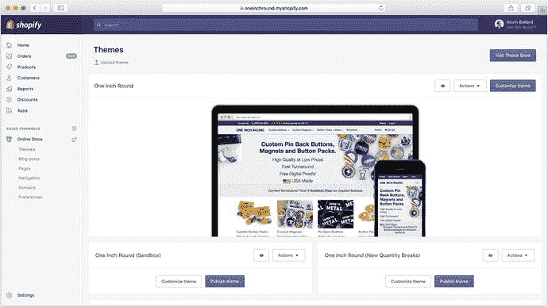
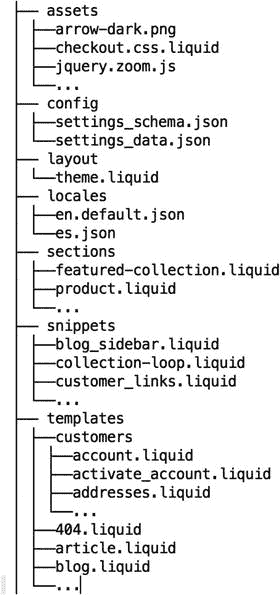
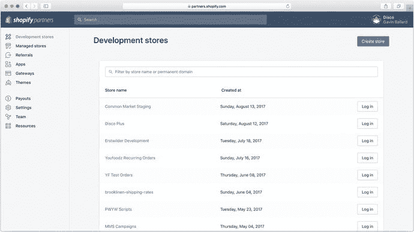
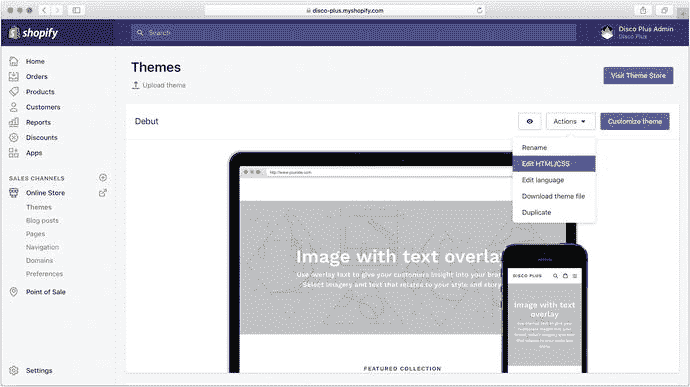

# 1. Shopify 主题入门

对于某些内容平台而言，“主题”一词意味着有限的控制权。它让人联想到从几个预设选项中进行选择，或许只是挑选配色方案或替换一些图片。

Shopify 主题远不止于此；它们让店主能够完全控制其网站前端的每一个方面，包括 HTML、样式表和脚本。我相信，这是 Shopify 最强大的优势之一。这也是它既能适合初次创业的独立企业家，同时又能为世界 500 强公司提供支持的原因。

本章首先解释 Shopify 如何赋予我们这种灵活性。它涵盖了主题包的目录结构，更好地解释了 Liquid（Shopify 的模板语言），说明了资源文件（Assets）的处理方式，并让我们了解这些部分如何协同工作，为我们的客户提供可用的购物体验。

### Shopify 主题剖析

一个 Shopify 商店可以安装多个主题，尽管在任何给定时间只能有一个主题发布并对公众可见。主题可以来自不同的来源——从官方 Shopify 主题商店（`https://themes.shopify.com`）购买、从第三方市场下载、由自由职业者或代理商为特定客户构建，或由商家内部开发。

安装到 Shopify 商店中的每个主题都会在 Shopify 管理后台的“在线商店 - 主题”部分中显示，如图 1-1 所示。



图 1-1：Shopify 管理后台中的主题列表。请注意，其中一个主题（顶部较大的那个）已“发布”，意味着它当前处于激活状态并展示给客户。其他主题已安装，但仅对店主在“预览”模式下可见。

可以通过两种方式向 Shopify 商店添加新主题：直接从主题商店添加，或上传包含标准主题目录结构文件的 `.zip` 文件。主题在发布前可以“预览”，让店主有机会在实际推送给真实客户之前，了解新主题的外观和感觉。

当客户访问商店首页的某个页面时，Shopify 会查看主题中包含的文件，找到合适的模板文件进行渲染，并将它们与“动态”信息（例如商店的当前库存、已登录客户的详细信息以及购物车内容）结合使用，生成 HTML，然后传送给浏览器。通过这种方式，Shopify 主题的运作方式与许多用于生成动态、内容驱动网站的基于模板的平台或编程语言（如 WordPress 或 Drupal）类似。

#### 主题结构

无论来源如何，所有 Shopify 主题在底层都共享一种通用格式：一个按特定目录结构组织的文件包，如图 1-2 所示。



图 1-2：完成版 Shopify 主题的标准目录结构

如您所见，该结构相当扁平，包含七个顶级目录（以及一个子目录），其中包含大量 Liquid 模板文件（`.liquid`）、配置文件（`.json`）和资源文件（`.css`、`.js`、`.png` 等）。

资源文件（Assets）包含您希望在主题中使用的所有静态资源，如图像、样式表和脚本。Shopify 内置了对 Sass 样式表的支持（有一些限制，稍后讨论），因此如果您是 Sass 爱好者，只需将文件以 `.scss` 扩展名直接保存在您的主题中即可。您的主题资源将自动通过 Shopify 的 CDN 提供。

配置（Config）是一个目录，包含全局主题设置的规范，它允许主题设计师创建能够赋予商家对其商店前端布局、外观和数据模型进行控制和灵活调整的主题。主题设置通过 `settings_schema.json` 中定义的标记呈现给店主，并在保存时存储到 `settings_data.json` 中。目前，这是 `/config` 目录中仅有的两个文件。

布局（Layouts）充当主题中所有页面的“主模板”，因此它们包含每个页面共有的所有 HTML（例如，`<head>` 部分）。大多数主题只需要一个名为 `theme.liquid` 的默认布局，但您可以根据需要创建任意数量的基本布局。如果您在 Shopify Plus（Shopify 的企业版产品）上运营商店，您还可以访问 `checkout.liquid`，该文件定义了商店结账页面的布局。

本地化（Locales）是 JSON 格式的翻译文件，用于您的主题可能支持的所有不同区域（地点）——`en.default.json`、`es.json` 等。您不必为主题提供多种语言的翻译，但确保您的主题支持未来的国际化是个好主意。所有提交至 Shopify 主题商店销售的主题都必须完全支持国际化。

块（Sections）和代码片段（Snippets）类似，它们都包含可以从其他模板中引入的小段 HTML 和 Liquid 代码。它们的目标是让您能够将主题代码拆分成更小、更合乎逻辑的组件，从而使维护和重用变得更加容易。它们的不同之处在于，块（两者中较新的概念）允许您定义组件级别的主题设置、样式表和 JavaScript。

虽然块和代码片段都可以通过直接从主题的模板文件中引入来进行“静态”使用，但块还具有额外的能力，即可以由商家在商店主页上动态引入和配置。稍后在我们逐步构建主题的细节中，我们将看到 `块` 和 `代码片段` 的详细示例。

模板（Templates）包含主题中不同类型页面的 HTML 结构——例如，`product.liquid` 用于产品页面，而 `index.liquid` 用于主页，`article.liquid` 用于博客文章。这些单独的页面模板会在主题布局文件（通常是 `theme.liquid`）的“内容”部分中进行渲染。

您可以创建每种模板类型的变体——例如，`article.photo.liquid` 用于基于照片的帖子，`article.video.liquid` 用于基于视频的帖子。请注意，这是唯一包含子目录的顶级目录，该子目录为 `/customers`，其中包含如果商店启用了客户登录账户所必需的几个模板。


### Liquid：Shopify 的模板语言

查看这个主题结构时，你可能已经注意到很多文件都以 `.liquid` 扩展名结尾。

Liquid 是由 Shopify 创建的一种开源模板标记语言。由于其特性（简单、安全且无状态），它非常适合在主题模板中支持动态内容、逻辑和包含功能，同时不会影响安全性或性能。

与你可能熟悉的大多数 HTML 模板语言（如 PHP 或 Ruby 的 ERB）类似，我们通过在常规 HTML 标记中插入特殊标签来使用 Liquid。PHP 和 ERB 分别使用类似 `<?php ... ?>` 和 `<%= ... %>` 的标签，而 Liquid 则使用 ``（控制标签）和 `{{ ... }}`（输出标签）这样的标签。

用于渲染产品集合中产品列表的 Liquid 代码可能如清单 1-1 所示。

```



{{ product.title | upcase }}



集合中没有产品！

清单 1-1
Liquid 代码渲染集合中产品列表的示例
```

从这个例子中我们可以看到，Liquid 使我们能够：

- 编写条件语句，例如 ``；
- 使用 `` 来遍历列表；
- 使用 `{{ ... }}` 输出内容；
- 对输出应用过滤器，例如 `| upcase`；
- 访问 Shopify 提供给模板的变量对象，例如 `collection`

Shopify 的 Liquid 参考文档位于 [`https://help.shopify.com/themes/liquid`](https://help.shopify.com/themes/liquid)，其中全面介绍了 Liquid 的所有标签、过滤器和语法。但如果你和我一样，你可能会发现熟悉 Liquid 的最佳方式就是直接动手实践！浏览默认主题附带的 Liquid 文件，会让你对代码如何组织有相当扎实的理解。无需在开始前试图记住所有语法——一旦你深入实践，很快就能掌握。

Liquid 是一种开源模板语言，它的应用远不止 Shopify 这一个平台。然而，需要注意的是，Shopify 实现的 Liquid 包含一些“标准”Liquid 库不支持的 Shopify 专属过滤器、标签和变量对象。因此，如果你想知道某个 Liquid 示例为什么在你 Shopify 主题中能或不能正常工作，明智的做法是检查你尝试的操作在该平台上是否确实可行。一个有用的参考资源是 Shopify 的 Liquid 速查表，网址为 [`https://www.shopify.com/partners/shopify-cheat-sheet`](https://www.shopify.com/partners/shopify-cheat-sheet)。这是一份方便的单页参考资料，涵盖了 Shopify 主题中所有受支持的逻辑、对象、标签和过滤器。你可能会注意到，在本书和网络上的其他示例中，Liquid 控制标签既可以写成 ``，也可以写成 ``（百分号旁边带有一个减号）。同样地，输出标签可以写成 `{{ ... }}` 或 `{{- ... -}}`。

就逻辑而言，这两种形式是相同的。它们之间的区别在于如何处理 Liquid 标签两侧的空白字符。过去，包含大量控制流逻辑和迭代的 Shopify 主题常常会在输出到浏览器时产生大量空白字符，因此引入了“百分号-减号”形式的 Liquid 标签。使用这种形式会使 Liquid 处理器从生成的 HTML 中剥离 Liquid 标签左右两侧的所有空白字符。

我现在的默认做法是始终使用“百分号-减号”格式，除非这会干扰我期望的输出效果。你可以使用任何一种你想要的格式，但请记住，除了空白字符处理之外，这两种形式在逻辑上是等价的，并且在阅读示例代码时可以互换使用。

### 资产文件

除了 Liquid 文件和 JSON 配置文件（这些将在第 8 章中更详细地介绍），我们在主题中找到的其他文件类型是资产文件。

资产文件包括图像、样式表、JavaScript 以及主题在浏览器中加载所需的其他资源。随着我们逐步讲解一些示例，如何在主题中使用这些资产文件会变得更加清晰，但在此阶段有几点需要注意：

- `assets` 目录中的所有文件都会自动通过 Shopify 的 CDN（`cdn.shopify.com`）提供并托管。这意味着它们会被大量缓存以加快向最终客户的交付速度，但也意味着它们不会从与你的店铺前端相同的域名加载（从而导致跨域浏览器限制的实施）。
- 要从 Liquid 模板中引用资产，Shopify 提供了两个过滤器：`asset_url` 和 `asset_img_url`。两者都接受资产名称并返回该资产在 CDN 上的 URL，后者还允许使用一些附加参数来进行调整图像大小或裁剪等操作。
- Shopify 原生支持样式表的 Sass 预编译，因此你可以直接将 `styles.scss` 文件添加到 `assets` 目录，Shopify 会将其编译为 CSS 并使其可供你的主题使用。（例如，你可以使用 Liquid 代码 `{{ 'styles.scss.css' | asset_url | stylesheet_tag }}` 将其包含在 `theme.liquid` 的 `<head>` 部分。）
- Shopify 还支持基于文本的资产文件（如 JavaScript、样式表或 SVG 图像）拥有 `.liquid` 扩展名，Shopify 会在将其上传到 CDN 之前进行编译。这意味着你可以使用 Liquid 控制流逻辑和主题设置，在资产文件中引入一定程度的动态逻辑。你将在后续章节中看到一些实际示例，尤其是在第 8 章中。


### 使用 Shopify 主题

虽然 Shopify 主题引入了一些新概念，但它们并未偏离“标准”网页开发的概念太多。归根结底，我们使用带标记的模板，并混入一点 Liquid，来生成 HTML，这些 HTML 会被推送到用户的浏览器，并加载图片、样式表和脚本等资源。这使得 Shopify 主题开发对于新手开发者来说相当容易上手，并能让你快速启动和运行。

不过，初次接触 Shopify 开发时可能会遇到一些“陷阱”，我想在此分享几点。

- Shopify 会积极缓存你的 Liquid 模板的 HTML 输出，这意味着你不能依赖 Liquid 模板内的时效性逻辑（例如，根据当前时间来决定显示或隐藏某个产品）。对于此类时效性需求，我建议使用 JavaScript。
- 虽然 Shopify 支持将 Sass 文件编译成 CSS 样式表，但出于安全原因，它不支持 `@import` 语法，这意味着你所有的样式都需要写在一个文件中。Shopify 使用的 Sass 版本也稍旧一些，因此一些较新的 Sass 功能不被支持。由于这些原因，我通常避免使用 Shopify 的 Sass 功能，而是采用更高级的开发工作流（将在下一章讨论）来预编译我的资源。有关 Shopify、Sass 和主题开发的更多细节，请参考 Tiffany Tse 精彩的三部分系列文章：《使用 Sass 开发 Shopify 主题初学者指南》。¹
- 作为 Shopify 主题开发者，你需要意识到，商家的店铺上运行的并不总是只有你的代码。除了 Shopify 为管理和追踪而添加的一些轻量级脚本外，商家添加的任何 Shopify 应用都可能修改你的主题模板或资源文件，加载额外的脚本和样式表，或动态调整你的标记。虽然这可能会令人沮丧，但你可以通过防御性地编程你的主题，使其易于编辑和维护，并遵循稳健的开发工作流实践，来缓解许多问题。

#### 设置开发商店

要真正开始开发 Shopify 主题，我们需要在 Shopify 上创建一个“开发商店”。这是因为，与我们开发常规网站不同，本地无法真正预览或测试我们的 Shopify 主题。

开发商店的功能与常规 Shopify 商店相同（除了无法接收真实付款），因此它们是一个很好的测试平台。你可以通过单击按钮将开发商店转换为功能完整的 Shopify 商店，因此为客户构建店铺时，通常先将其作为开发商店构建，然后再移交。

要能够创建开发商店，只需注册成为 Shopify 合作伙伴（你可以在 `https://www.shopify.com/partners` 进行注册）。注册是免费的，只需几分钟——完成后，你将被带到合作伙伴仪表盘（如图 1-3 所示），在那里你可以查看所有现有的开发商店或创建新的开发商店。



图 1-3

合作伙伴仪表盘中的“开发商店”选项卡

如果你之前没有创建过开发商店，或者没有深入探索过 Shopify 主题的内部结构，那么现在正是开始的好时机！只需从“开发商店”选项卡点击“创建商店”，输入一些登录信息，就可以开始了。

商店创建完成后，你将被带到商店的管理仪表盘。你会在左侧边栏看到一个名为“在线商店 - 主题”的选项卡。点击它，你会看到你的商店已经设置了一个名为 `Debut` 的简单默认主题。

你将在第 2 章了解如何将主题文件同步到你的计算机并在本地编辑它们，但现在，你可以通过使用 Shopify 管理后台内置的主题编辑器来查看默认主题是如何组合的。你可以通过点击默认主题上的“操作”按钮，然后点击“编辑 HTML/CSS”来打开编辑器（见图 1-4）。



图 1-4

打开默认 Debut 主题的主题编辑器

花几分钟时间浏览默认主题的结构，并参考“Shopify 主题剖析”部分，确保你熟悉主题结构中每个部分的作用。完成之后，你可以继续下一章，在那里你将看到如何最好地为自己设置一个轻松的主题开发环境。

### 总结

在本章中，你了解了 Shopify 主题的结构方式，并学习了该结构中每个部分的职责。你已经看到 Shopify 主题开发与常规网页开发工作流有许多相似之处，本章重点介绍了它们之间的主要区别，包括对模板语言 Liquid 的介绍。

最后，你了解了如何通过设置 Shopify 合作伙伴帐户和创建开发商店来开始你的主题开发之旅。

脚注 1

`https://www.shopify.com/partners/blog/a-beginners-guide-to-building-shopify-themes-with-sass-part-1-getting-started-with-sass`

