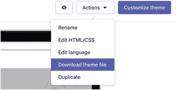
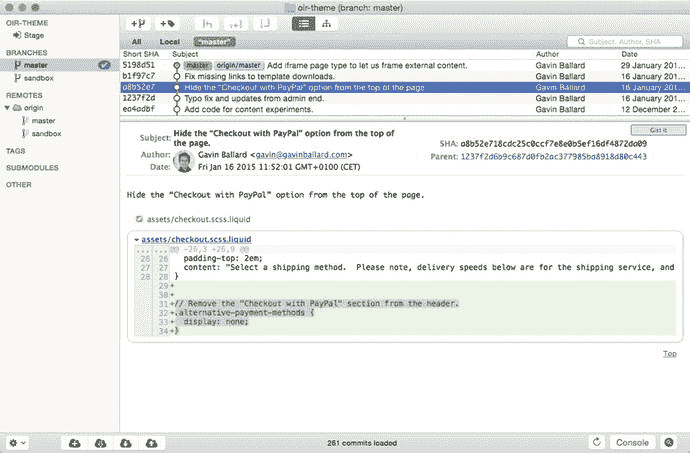
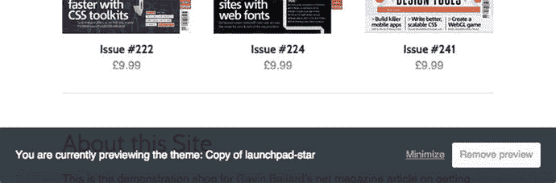
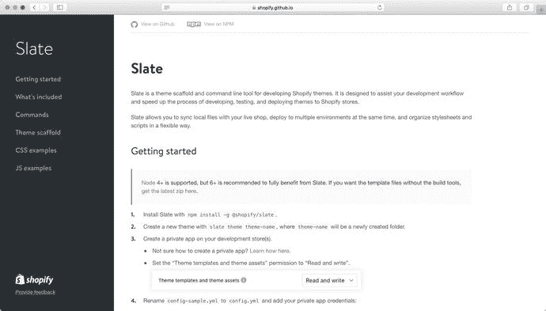

# 2. 工具与工作流

我们已经了解了 Shopify 主题是如何组合的，并在上一章末尾通过 Shopify 管理后台的在线主题编辑器查看了默认 Debut 主题的内容。如果你有点自虐倾向，你完全可以在这个编辑器中完成所有主题开发。不过，如果你尝试这样做，你很可能会遇到以下困难：

- 在线编辑器很不错——同类中最好的之一——但在有用的开发功能方面，它无法与桌面 IDE 或文本编辑器相比。
- 如果你作为一名网页开发者，习惯并高效地使用特定的开发环境，那么你会失去这种效率。
- 你需要在线并在浏览器中才能对主题进行任何修改。
- 与他人在主题开发上进行协作很困难，并且很容易导致覆盖彼此的工作。
- 你的主题只存储在一个地方，没有任何备份。
- 虽然存在有限的版本控制形式（你可以将单个文件恢复到以前的版本），但这与 `Git` 或 `Mercurial` 等“严肃”的版本控制系统无法相比。
- 你需要“原样”编辑文件，这意味着你无法轻易使用诸如合并资源或为生产环境压缩资源之类的技术。

本章着眼于如何通过设置一个本地开发环境来同步你的代码更改到 Shopify，从而解决上述每一个限制。它还探讨了如何使用流行的修订控制系统 (`Git`) 来正确地对主题进行版本管理和更改管理，最后探讨了高级构建工具（Shopify 的 `Slate` 等），这些工具允许我们在处理主题时利用更高级的网页开发技术。

你无需在开始处理主题之前就实施这些实践，但尽早养成其中一些习惯是好的——我可以保证这会让你的 Shopify 开发体验顺畅得多。我确实建议，在进入第 4 章开始开发你自己的示例主题之前，你至少熟悉一下在本地编辑主题文件并将更改自动推送到 Shopify 商店的过程。


### 迁移至本地开发环境

我们对开发工作流程的第一项改进，就是将主题文件的编辑地点从在线编辑器迁移到本地机器。获取当前主题文件副本的操作很简单。在商店后台的“主题”板块，使用“操作”下拉菜单并选择“下载主题文件”（见图 2-1）。



图 2-1

将当前主题下载为 `.zip` 文件

Shopify 会通过电子邮件向您发送一个下载链接。您可以获取该链接，解压缩文件，并将其移动到一个工作目录中，如代码清单 2-1 所示。

```
$ unzip ~/Downloads/example-theme.zip -d /projects/example-theme
$ cd /projects/example-theme
$ ls
assets        config        layout        locales
sections      snippets     templates
代码清单 2-1
在命令行中解压已下载的主题文件并查看其内容
```

现在我们在本地有了主题文件的副本，就可以使用文本编辑器或自己偏好的 IDE 来开发主题了。编辑器或工具集没有唯一的“最佳”选择；实际上，这完全取决于您个人，取决于您熟悉或舒适的工具。如果您暂无头绪，流行的编辑器包括 Vim、Sublime Text 和 Atom。

**提示**

如果您偏好的编辑器支持插件或语法扩展，请务必检查是否有适用于 Liquid 模板语言的扩展。这将极大地提升您处理 Shopify 主题文件的体验。如果找不到专门支持 Liquid 的扩展，您可以尝试寻找支持 Twig（一种语法与 Liquid 非常相似的替代模板语言）的扩展，并在编辑器中将其与 `.liquid` 文件关联。

### 将更改同步到 Shopify

能够在自己的编辑器中修改代码固然很好，这解决了本章开头提到的前几个问题。然而，现在我们又遇到了另一个问题：如何将我们在本地文件中所做的任何更改推送回我们的 Shopify 商店？

我们可以将更改后的文件内容从本地环境复制粘贴到在线网页编辑器，但这似乎算不上改进。我们也可以将主题目录打包成 `.zip` 文件，然后通过 Shopify 后台上传，但如果每次修改都需要这样做，那将非常麻烦。

#### 介绍 Theme Kit

解决这个问题的方案是 Theme Kit ( [`https://github.com/Shopify/themekit`](https://github.com/Shopify/themekit) )，这是一个由 Shopify 构建和维护的小型命令行工具。由于它被构建为简单的、单一的跨平台二进制文件，开发者无论使用什么平台都可以使用它。（Theme Kit 是作为之前解决方案 `shopify_theme` gem 的替代品而构建的。它执行类似的功能，但要求用户在其本地机器上有一个可运行的 Ruby 环境。）

关于不同平台的下载和安装说明，我将留给 Theme Kit 详尽的文档（位于 [`https://shopify.github.io/themekit`](https://shopify.github.io/themekit) ）。但一旦设置完成，它就能让您从命令行下载和上传主题文件，如代码清单 2-2 所示。更棒的是，您可以使用它来监视一个主题目录，并在文件保存时自动上传更改后的文件，如代码清单 2-3 所示。

```
$ cd /projects
$ mkdir /projects/example-theme
$ cd ./example-theme
$ theme configure --store example.myshopify.com --password 905bbb49ee10d0eb9c7b380183b2bc43 --themeid 74729482
$ theme download layout/theme.liquid
[development]: 1 / 1 [================] 100 %
(... 编辑 layout/theme.liquid ...)
$ theme upload layout/theme.liquid
[development]: 1 / 1 [================] 100 %
代码清单 2-2
命令行示例，展示 Theme Kit 的配置及下载/上传流程
```

```
$ cd /projects/example-theme
$ theme watch
[development] 正在监听主机 example.myshopify.com 上的更改
[development] 收到 layout/theme.liquid 的更新事件
[development] 成功对文件 layout/theme.liquid 执行更新操作，已上传至 example.myshopify.com
代码清单 2-3
命令行示例，展示 Theme Kit 监视主题目录的更改并自动上传到 Shopify
```

#### 使用 Theme Kit

设置好 Theme Kit 并让它监视我们的文件更改后，我们就可以使用本地文本编辑器或 IDE 来管理和编辑主题文件，然后切换到浏览器并刷新以查看更改。对于 Web 开发来说，这并非最理想的工作流程（与一些允许在浏览器中自动、即时“热重载”代码的现代 Web 开发工作流程相比，它可能显得有些笨拙），但它的反馈循环足够短，足以应用于日常开发。

关于 Theme Kit 需要注意的几点：

*   它将所有配置细节（商店 URL、API 凭据等）存储在一个名为 `config.yml` 的文件中。此文件允许定义不同的“环境”（例如，开发、预发布和生产），以方便从单个主题目录更新多个主题。
*   使用 Theme Kit，我们可以跳过 `.zip` 文件下载步骤来开始处理现有主题，只需运行主题配置步骤，然后从命令行运行不带任何参数的 `theme download` 命令即可。
*   您可以处理并预览当前未在 Shopify 商店中发布的主题（对于正在被客户积极使用的网站，这是推荐的做法）。您可以通过在 Shopify 后台查找未发布主题的 ID（Theme Kit 的文档中有相关操作说明），将其设置在 `config.yml` 中，然后运行 `theme open` 命令，在默认浏览器中预览该主题。

### 将主题纳入版本控制

如果您尚未这样做，那么本课最重要的收获应该是：在开发主题时，请使用版本控制系统（如 Git 或 Mercurial）。如果您不熟悉 VCS，Git 书籍在 [`https://git-scm.com/book/en/v2/Getting-Started-About-Version-Control`](https://git-scm.com/book/en/v2/Getting-Started-About-Version-Control) 上提供了很好的概述。

在 Shopify 主题的上下文中，版本控制可以：

*   防止您在主题代码库中犯下无法挽回的错误
*   使团队更容易共同开发一个主题
*   跟踪对主题所做的工作（以及由谁完成）
*   让您能够在“功能”分支或“主题”分支上试验新功能，这些分支可以在不影响生产代码的情况下进行测试
*   提供了一种结合部署工具简化主题部署的方法（您将在第 11 章中看到其工作原理）

在开始使用版本控制一段时间后，您还会注意到自己对开发流程的思考方式发生了变化。您会发现自己在思考对主题代码库的修改时，会将其视为一个个小的、原子的、便于您自己、您的同事以及未来的开发者理解的变更块。您还可以利用版本控制生态系统中的各种工具和服务，例如用于代码托管的 GitHub、GitLab 或 Bitbucket，或者用于代码审查的工具如 GitX（见图 2-2）。



图 2-2

GitX，一个可视化的 Git diff 工具，展示了主题的历史记录和更改概览


#### 适用于 Shopify 主题的 Git 工作流

Git 可以说是当下事实上的版本控制系统（也是我唯一熟悉的系统，我已经成功将 RCS 和 Subversion 的不愉快记忆从脑海中抹去）。如果你是 Mercurial 的粉丝，我表示歉意，但以下示例将完全以 Git 为中心。

假设我们已经安装了 Git，清单 2-4 展示了如何开始将我们的示例主题纳入版本控制。

```bash
$ cd /projects/example-theme
$ git init .
已初始化空的 Git 仓库于 /projects/example-theme/.git/
$ echo "config.yml" > .gitignore
$ git add .
$ git commit -m "初始提交。"
清单 2-4
在 Shopify 主题目录中初始化 Git 仓库
```

请注意，在初始化仓库之前，我们必须将 `config.yml` 添加到 Git 的忽略列表中。这是因为 Theme Kit 使用此文件来存储敏感的 API 凭据，我们绝对不希望将其检入版本控制。之后，你可以在本地编辑主题文件，同时运行主题 gem 以自动将更改上传到商店，然后完成工作后，将更改提交到 Git。

如果你不确定本地工作目录是否与 Shopify 商店上的内容匹配，可以运行 `theme download` 来获取所有远程文件，并使用 `git diff` 查看差异。

当我与那些喜欢通过网页编辑器自行对主题进行小改动（通常是微小的文案或样式调整）的客户合作时，这种情况实际上经常发生。执行 `theme download` 并提交他们的任何更改，可以避免在你最终修改同一文件时覆盖他们的工作。（如果这种情况频繁发生，很可能是一个明确的信号，表明客户所做的更改应移入主题设置或语言文件中，这将在第 8 章中介绍。）

**提示**

当你运行 `theme download` 时，有时可能会注意到一些“孤立文件”从你的 Shopify 主题中被拉取下来——这些文件曾经在你的仓库中，后来被重命名或删除，但仍然上传到了 Shopify 服务器上的主题版本中。一个便捷的一行命令（在运行 `theme download` 之后）可以用来清理服务器上的这些文件：`git clean -n | sed 's/Would remove //' | xargs theme remove`。此命令使用 `git clean` 获取不在版本控制中的文件列表，并将它们传递给 `theme remove` 命令，以便从服务器上清理。此命令不会在本地删除文件，因此你无需担心意外丢失工作。

##### 使用 Git 的主题功能分支

在使用 Git 进行开发时，通常希望在功能分支上工作，以便开发新功能而不影响主分支或线上代码库。稍加调整，我们也可以在 Shopify 主题中实现这一点。假设：

1.  你已在 Shopify 商店中安装并发布了一个主主题（“master”主题）。
2.  你有一个已纳入版本控制的该主题的本地副本（“master”分支）。
3.  你正在使用 Theme Kit 将更改同步到主主题，并已使用“master”主题的 ID 配置了 Theme Kit 的 `config.yml`。

你可以创建一个功能分支来进行开发，首先确保 Theme Kit 中的任何 `theme watch` 进程已停止，然后在浏览器中：

1.  打开商店管理后台的主题部分。
2.  打开“master”主题上的操作下拉菜单，选择“复制”。
3.  等待主题复制完成，然后通过单击“自定义主题”按钮并查看 URL 来获取新创建主题的 ID。

然后，在命令行中，切换到新的 git 分支并更换主题 ID，如清单 2-5 所示。

```bash
$ cd /project/example-theme
$ git checkout -b new-feature
切换到一个新分支 'new-feature'
$ sed -i '' 's/[主主题 ID]/[新主题 ID]/g' config.yml
$ theme watch
[development] 正在监听主机 example.myshopify.com 上的更改
清单 2-5
从命令行切换到 Git 功能分支
```

你现在已在 Shopify 商店上创建了一个完全独立的预览主题，该主题将与本地的 `new-feature` 分支同步。进行一些更改，等待它们自动上传，然后运行 `theme open`。你将被带到“new-feature”主题的预览页面（你会在浏览器底部看到相关通知，如图 2-3 所示），但访问常规网站的访客仍然会看到“master”主题。



图 2-3

当我们查看对公众不可见的页面时，浏览器底部会出现此覆盖层

如果你想知道控制台中的那个 `sed` 命令是做什么的，它只是更新 `config.yml` 文件，使其指向商店上主题的新副本，而不是主副本。你也可以通过在文本编辑器中直接打开 `config.yml` 并手动更改包含 `theme_id` 的行来达到同样的效果。

如你所见，这个过程有点棘手，而且当你试图在分支之间来回切换时（这正是你经常想做的），它可能会变得更加棘手。从功能分支切换回主分支工作的过程现在大致如下：

1.  确保所有我们想在功能分支上保留的更改都已提交或暂存。
2.  确保任何 `theme watch` 进程已停止。
3.  运行 `git checkout master`。
4.  编辑 `config.yml` 文件中的 `theme_id`，使其再次指向“master”主题。
5.  运行 `theme watch`。

一旦你习惯了这个过程，就可以很轻松地执行分支切换。你还可以在 `theme watch` 运行时将更改合并到主分支，并将合并后的文件直接更新到主要的 Shopify 商店主题（不过要注意合并冲突！）。

这个工作流目前适合你，并且可以处理我们在后续章节构建示例主题时将遇到的所有情况。在第 11 章中，你将开始了解一些替代的主题部署策略，并学习如何自动化地将主题更改推送到当前生产环境中的主题。

### Slate 与主题构建工具

到目前为止，我们在构建主题时所编辑的主题文件与 Shopify 使用的最终格式之间存在 1:1 的对应关系。这在入门阶段非常棒——它有助于我们完全理解 Shopify 主题是如何组合在一起的，并让我们能够非常快速地开始使用主题。但是，如果你拥有 Shopify 之外的 Web 开发背景，你就会知道现代网站很少在源文件和生产交付物之间保持这种 1:1 的映射关系。

与任何其他网站一样，Shopify 主题可以在将源文件交付给最终用户之前，通过不同方式的转换而受益匪浅。其中两种转换是合并和优化。

合并将许多单独的文件捆绑成一个单独的资产发送到浏览器。这使我们在编写主题时能够在逻辑上分离和维护文件，但只向浏览器发送一个文件。优化则接收一个源文件（可能是 JavaScript、CSS、Liquid 或图像）并对其进行一些处理，通常是为了减少要交付给浏览器的总字节数。

当你阅读到第 10 章（性能）时，你将更详细地了解这些过程的具体细节及其优势。但就目前而言，重点在于一件事：鉴于我们希望对源文件执行这些转换，我们如何将其整合到现有的开发工作流中？


#### Grunt 和 Gulp：自动化任务运行器

直到最近，想要在主题工作流中接入拼接（concatenation）或优化等预处理任务的最佳选择是使用任务运行器，其中最常用的两个是 `Grunt`（[`http://gruntjs.com`](http://gruntjs.com)）和 `Gulp`（[`http://gulpjs.com`](http://gulpjs.com)）。

这些工具对于在其他平台上工作的 Web 开发者来说可能很熟悉，但如果你之前从未见过或使用过它们，那么两者的目标都是提供一种方式，用于定义在特定情况下要执行的一系列自动化任务。在 Shopify 主题的上下文中，这些任务的一些示例包括：

- 优化图像资源
- 预处理并将 `SASS` 或 `LESS` 源文件编译成最终的 CSS 样式表
- 拼接并压缩 JavaScript
- 将主题打包成 `.zip` 文件以便分发

`Grunt` 和 `Gulp` 都允许你定义触发这些自动化任务的事件，因此你可以配置它们来监听主题的源文件，并在保存更改时自动执行处理步骤。在我过去为主题使用的标准设置中，我在本地处理 Shopify 主题的目录结构类似于列表 2-6。

```
/.build
/theme
/Gruntfile.coffee
Listing 2-6
The Top-Level Directory Structure of a Theme Using Grunt for a Preprocessing Workflow
```

在这种配置中，顶层`/theme`目录包含我的主题源文件，其结构便于维护。例如，我不会被限制在将所有脚本和样式表资源放在一个`/assets`目录中的扁平目录结构里，而是将内容分离到`/assets/js/vendor`、`/assets/js/product`、`/assets/js/common`等目录中。`Gruntfile.coffee`定义了所有要运行的任务以及触发它们的规则，而`/.build`则包含最终“构建完成”的主题，其组织方式符合 Shopify 期望的标准目录结构。

当积极开发一个主题时，我会在`/.build`目录内运行 Theme Kit 的 `theme configure` 和 `theme watch` 命令，然后在顶层目录运行 `grunt watch` 命令。当我修改`/theme`中的模板和资源时，`Grunt` 的监听任务会检测到更改，触发相应的处理任务，并将更新编译到`/.build`，Theme Kit 会从那里自动将更改后的文件上传到 Shopify。

此工作流的目录布局（包括设置说明和一个标准的 `Gruntfile.coffee`，它能处理许多常见的 Shopify 构建任务，如 Sass 编译、JavaScript 压缩、图像优化以及生成适合上传到 Shopify 的 `.zip` 文件）可免费在 [`https://github.com/discolabs/shopify-theme-scaffold`](https://github.com/discolabs/shopify-theme-scaffold) 获取。

#### 其他工作流自动化工具

`Gulp` 和 `Grunt` 是相当“底层”的工具，它们需要你花一些时间编写配置文件并将其设置为可与 Shopify 一起工作。我觉得这里应该提一下另外几个工作流自动化工具，它们要么更“用户友好”，要么是专门为 Shopify 设计的：

- `Prepos`（[`https://prepros.io/`](https://prepros.io/)）是一个跨平台的 GUI 工具，用于配置和执行常见的预处理任务，并支持实时浏览器重载。
- `CodeKit`（[`https://codekitapp.com/`](https://codekitapp.com/)）与 `Prepos` 类似，但仅适用于 Mac（不过开发者似乎更有幽默感）。
- `Quickshot`（[`https://quickshot.readme.io`](https://quickshot.readme.io)）是一个命令行工具，但它是专门针对 Shopify 开发而设计的。它支持预编译、并行上传和下载，以及一些不错的高级功能，例如能够下载/上传 Shopify 博客、页面和产品内容。

#### 介绍 Slate

在上一节中，我提到像 `Grunt` 和 `Gulp` 这样的工具“直到最近”还是向主题工作流添加自动化任务的最佳选择。2017 年，Shopify 发布了 `Slate`，这是一个新的命令行工具，专门专注于辅助 Shopify 主题的开发（见图 2-4）。



图 2-4

位于 [`​shopify.​github.​io/​slate`](https://shopify.github.io/slate) 的 Slate 文档页面

`Slate` 提供了与 `Grunt` 或 `Gulp` 驱动的类似工作流：它允许你使用灵活的目录结构开发 Shopify 主题，并将预处理任务接入开发流程。它还提供了一些额外的功能，例如：

- 主题脚手架生成，允许通过一个简单的 `slate theme new-theme` 命令为新的 Shopify 主题创建源目录和构建目录。
- 内置支持监听、重新编译并将更改上传到多个 Shopify 环境，这意味着你只需要运行一个 `watch` 进程，而不是像 `Grunt`/`Gulp` 和 Theme Kit 示例中那样需要运行两个进程（`Slate` 底层使用 Theme Kit 来实现此功能）。
- 支持在浏览器中实时重载主题，以缩短修改代码和看到结果之间的循环时间。
- 向工作流添加自动化测试和样式检查。
- 提供大多数 Shopify 主题通用的可复用前端组件。

由于 `Slate` 是专为 Shopify 主题开发而设计的，它提供了比 `Grunt`、`Gulp` 或其他工具更流畅的体验。虽然它仍是 Shopify 生态系统中的一个非常新的成员，并且还有一些粗糙之处需要打磨，但我预计 Shopify 主题开发者将以我们在不太标准的 `Grunt` 和 `Gulp` 工作流中未曾见过的方式围绕 `Slate` 实现标准化，这将使得在项目和项目之间共享可复用的主题片段和设计模式变得更加容易。

在本书中的大多数示例开发中，我们不会使用 `Slate` 或任何其他构建工具。原因是它在我们编写的代码和 Shopify 上运行的代码之间增加了一层额外的间接层。然而，在本书的最后一章中，你将看到如何将你的示例主题迁移到由 `Slate` 驱动的工作流中，以及如何将其接入更高级的部署流程。通过示例 GitHub 仓库，你将看到确切需要修改的代码以及使用 `Slate` 处理你自己主题所需运行的命令。

### 总结

本章涵盖了一些你可以用来开发 Shopify 主题的关键工具，并解释了它们如何帮助你更高效地构建商店。它涵盖了本地开发、版本控制和工作流自动化，并介绍了 `Slate`，一个 Shopify 开发的工具，它提供了许多开箱即用的功能。


