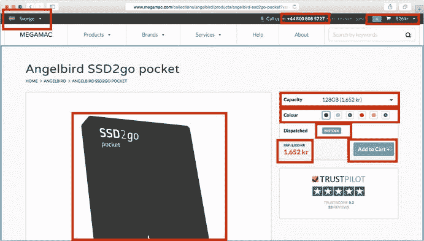

# 3. 原则与流程

既然我们已经扎实掌握了 Shopify 主题的构成要素（第 1 章），并了解了如何组合一个主题（第 2 章），那么是时候深入实践开始编码了，对吧？还差一点！

在进入实操练习前的最后一步，是退后一步，从宏观角度思考主题开发流程。你的目标是什么？如何才能最大程度地确保交付的主题成功实现这些目标？你可以做些什么来确保你的交付成果无论现在还是六个月后都易于维护？

在本章中，我将讨论我在开发 Shopify 主题时喜欢牢记的一些原则，并探讨主题开发者用于成功交付项目所用的各类流程。为了避免太多看似高深却空洞的套话，我会用一些真实的案例来支撑我的建议。

阅读过程中，你可能会觉得本章只针对为客户构建定制主题的自由职业者和机构。如果你觉得这不适用于自己，请不要气馁——我相信，无论你是为自己建站、作为内部团队的一员，还是计划在 Shopify 主题商店中出售主题，这些建议同样适用。在这些情况下，你只需将自己、你的公司或广大 Shopify 商家视为“客户”即可。

### 设计原则

优秀设计的标志在于它能解决问题。

由于 Shopify 是一个在线电商平台，作为主题设计师，我们解决的问题大多围绕客户展开。我们如何在访问的第一秒传达品牌的“感觉”？如何让某些产品更容易被发现？我们可以做些什么来优化客户的结账体验？我们又能做些什么来追加销售，提升客户的客单价？

#### 理解设计目标

从某种意义上说，首要的设计目标是帮助商店实现收入最大化。（如果你觉得这有点过于露骨的资本主义色彩，那么请考虑到这个总目标确实涵盖了品牌设计、创建独特且令人喜爱的网站，以及提供出色的客户体验。）

在与客户（或你自己）讨论某个功能或变更的目标时，牢记这一点会很有用。如果需求是“在主页添加一个轮播图”或“我们把这个按钮的颜色改改怎么样？”，将讨论拉回到对底线的潜在影响上，有助于优先安排有意义的工作，并为基础问题找到更简单的解决方案。

在场的设计师们会认出这里运用的“五个为什么”技巧：针对任何拟议的功能或变更，连续问五次“为什么”，有助于揭示根本问题，并将其与首要目标关联起来。

以这种方式追问“为什么”，还能揭示出连客户自己都未明确意识到的更广泛的潜在目标。我们最近在为一位客户进行需求发现阶段时就遇到了这种情况。那是一家护肤品公司，计划在澳大利亚和新西兰市场推出多个新品牌，并为每个品牌设计定制化的 Shopify 主题。

在初次沟通和阅读背景资料时，我们注意到，与“传统”电商功能（如产品表单和结账流程）相比，客户对“产品展示”功能（轮播图、主视觉大图、长篇幅产品详情页）的重视程度要高得多。深入挖掘后，我们发现客户预计其大部分销售额将由与零售商的线下合作来驱动。

这帮助我们认识到，该 Shopify 网站最重要的目标之一根本不是传统的电商功能，而是作为销售代表向潜在零售合作方进行推销时的营销工具。了解这一点后，我们能够调整方案，更侧重这个应用场景，并使我们的解决方案契合客户的实际目标。

#### 为人而设计

一旦我们确立了 Shopify 网站的设计目标，接下来就要努力构建主题来实现这些目标。通常，这意味着你的主题应以帮助人类（客户）达成其目标（在网站上找到想要的东西并购买）为导向。

风格与装饰应让位于可用性与可访问性。添加一个全屏视差滚动轮播图在原型中可能看起来很棒，但它的价值必须与页面加载时间的增加、用户导航复杂度的提升以及可访问性的潜在下降进行权衡。

用户界面和信息传达应力求清晰和有用，而不是事后才想到的敷衍了事。如果某产品因缺货而无法添加到购物车，应返回一条详细的说明信息，而不是一条索然无味的“错误”或“无库存”提示。要设法给用户提供可操作的下一步（“我们有蓝色的变体库存，您愿意改买这个吗？”），而不是让他们沮丧地卡在死胡同里。

用户的需求（清晰的导航和页面结构、快速的页面加载和响应时间）应优先于商家的需求（页面内广告、大量的第三方跟踪代码以及侵入式的追加销售）。

尽量避免排除用户——让你的主题具备可访问性，并遵守 WAI-ARIA（`https://www.w3.org/TR/wai-aria`）等标准。这不仅体现了体贴，能最大化可访问你商店并购买商品的人数，而且在某些情况下，未能做到这一点还可能带来法律风险¹。

在构建主题时，像这样支持用户体验有几个好处。首先，它能帮助你聚焦真实用户的使用场景和讨论，而不是停留在空泛的理想状态。其次，深切关注客户体验会在其他方面带来回报：快速、无痛的购买能促进回头客生意，激发口碑推荐，并且（如你将在第 9 章所见）对搜索引擎排名产生积极影响。


#### 针对不同场景的设计

尽管我们尚未全部接入云端，但过去几年中，普通西方消费者的互联网连接水平确实有所提升；连接方式也日益多样化——无论是在家中使用传统台式机/笔记本，在移动中通过五花八门的移动设备，还是通过集成消息应用或联网冰箱等新兴平台。

其中任何一种都可能与电子商务商店相关，具体取决于商家及其典型客户。作为 Shopify 主题设计师，你需要开始考虑客户在访问商店时可能遇到的各种使用场景以及他们所处的具体情境。

请注意，我强调的焦点是“针对不同场景的设计”，而不仅仅是不同设备。这是因为，重要的不仅是思考客户可能使用哪些设备，还要考虑他们何时使用、以及希望达成什么目标。

以一位访问服装精品店首页的访客为例：

*   他们是在工作日午休时，用办公桌上的台式机浏览系列商品、寻找时尚灵感吗？
*   他们是在当晚坐在沙发上，边喝红酒边用手机，冲动购买白天看到的那件衬衫吗？
*   还是他们同样在用手机，但正值交通高峰，正拼命想在商店关门前找到离自己最近的门店位置？

通常情况下，投入时间和精力去构建一个能同时优化所有场景的网站是不可能的，但优秀的设计师会花时间识别这些不同的潜在使用场景，并与客户协作确定其优先级。

### 开发原则

一旦你走出设计阶段，开始主题的开发，有几件事值得牢记，以便让交付成果既健壮又易于维护。

优先考虑这些原则并不总是那么容易，尤其是当我们面临截止日期，或试图向客户证明多花些时间合理时。它们确实往往需要在前期多投入一点时间，但根据我的经验，从长远来看，它们带来的回报远超成本。

#### 保持简单

你的主题中概念和代码越简单，编写和维护起来就越容易。就代码而言，这意味着：

*   将包含的 `Liquid` 代码片段数量控制在最小，以简化代码的逻辑模型
*   将巧妙的 `Liquid` 单行代码拆解为更小、更易于理解的步骤
*   在驱动动态逻辑时，优先使用 HTML 和 `Liquid`，而非 JavaScript
*   识别那些定义在不同位置但服务于相同目的的页面或组件，并考虑将它们合并为一个

**注意**

那些允许将源码拆分成小而逻辑组件的开发实践对此大有裨益。你在第 2 章（“工具与工作流”）中看到了一些例子，并在第 11 章（“协作式主题开发”）中会遇到更多。

此外，专注于利用 Shopify 的内置功能和概念（如集合、产品、链接列表和标签），而不是尝试自行开发，也会有所帮助。理解 `Liquid` 和 Shopify 的局限性，并在这些界限内工作，可以减少头痛问题，比起用巧妙的 hack 绕开它们要省心得多。

与此相关，我会尽可能避免为常见的电子商务功能依赖 Shopify 应用。不仅使用应用会产生持续的经济成本，许多应用还要求复杂的 `Liquid` 代码修改和额外的 JavaScript，这增加了心智和性能负担。许多 Shopify 应用是编写良好、健壮的软件，不会干扰商店的主题或其他应用——但也有很多不是，这可能在后续引发各种问题。

举个例子，我经常看到商家和开发者依赖某个应用来实现简单的追加销售功能，比如“如果客户购物车中有产品 A，则建议他们添加产品 B”。虽然有多个应用能处理这种情况及更复杂的场景，但大多数应用依赖 JavaScript 来检查和调整购物车（这意味着需要加载额外的脚本文件，并为用户带来延迟），在某些情况下，还会强制用户刷新整个页面。相比之下，请看列表 3-1 中的 `Liquid` 代码片段，它基于客户购物车的当前内容显示一条可配置的追加销售消息，简洁明了。

```




遍历当前购物车中的商品，检查我们是否有触发产品
但还没有目标产品。











何不 
添加一件 {{ settings.upsell_target_product.title }}？



```
**列表 3-1**  
购物车页面上一个简单的、可配置追加销售消息的 `Liquid` 实现

#### 利用渐进增强

作为网页设计师，我们通常希望利用浏览器提供的最前沿、最酷的功能。然而，确保不把部分访客群体排除在外非常重要——尤其是在 Shopify 主题的背景下，这种排除会直接转化为金钱损失。

渐进增强是一种以“自下而上”方式设计网站的做法——从能为能力最基础的设备（例如，一台不支持 JavaScript、图形支持有限的黑白 Kindle 浏览器）正常工作的内容开始，然后当更高级的功能可用时，“渐进地”加以利用（比如 JavaScript！CSS3！推送通知！彩色！）。

采用这种方法在开发阶段并不一定需要更多精力，而且它有助于我们避免出现整个潜在客户群体被剥夺购买机会的情况。（这方面的高调失败案例令人警醒——例如，访问 `Nike.com` 的访客会看到一个黑屏，除非他们的浏览器支持特定的 CSS 功能；更过分的是，在很长一段时间里，沃尔玛的“加入购物车”按钮甚至对没有启用 JavaScript 的用户根本不显示！）²

**注意**

在本书的实践部分中，我们将对我们开发的所有代码采用渐进增强的方法，重点关注无障碍支持，并确保你的主题为没有 JavaScript 的用户提供可靠的后备体验——这是电子商务商店最关心的两个问题。


### 文档化工作

初入 Shopify 主题开发的开发者常犯的一个错误（我自己也曾深陷其中）是过度关注 Shopify 网站的上线交付，而忽略了成功上线之后的维护工作。

如果一切顺利，使用你主题的网站持续运营，那么新的季节、产品线、竞争对手和行业趋势都将要求对主题进行迭代和大规模修改。无论是你本人还是其他开发者负责这些修改，对代码、流程和架构进行恰当的文档化记录，都能让每个人的工作轻松得多。

对于代码而言，这意味着要花时间清晰地组织你的 `Liquid`、`JavaScript` 和样式表，并为它们添加详尽且有意义的注释。

比较清单 3-2 和清单 3-3 中的 Liquid 代码片段，两者功能相同。与第二个示例相比，你需要花费多少额外的时间和精力来理清第一个示例在做什么？你对修改这两个代码片段中的哪一个更有信心？

```





















清单 3-2
一个难以解析的、用于计算相关产品的 Liquid 代码片段
```

```

通过使用相似标签作为简单的评分系统来计算相关产品。







































清单 3-3
一个与清单 3-2 功能相同，但更具可维护性的 Liquid 代码片段
```

良好的文档化工作也不仅限于代码层面。其他一些有用的做法包括：

-   在你的源代码的 `README` 文件中记录主题的概念和架构。
-   为其他人编写一份“入门指南”，提供设置开发环境的分步说明，讲解主题中的任何非标准方面，并突出显示任何“陷阱”。
-   为客户和商店所有者提供一份“内容管理指南”，说明如何在不依赖开发人员的情况下管理其 Shopify 主题的各个方面。遵循“展示，而非告知”的原则，我经常为此目的录制简短的截屏视频。

### 采用防御式与模块化编程

防御式编程意味着我们尽量在代码中少做假设，并优雅地处理失败情况。在 Shopify 主题的上下文中：

-   避免编写因页面中不存在某个 DOM 元素或未使用特定 Liquid 模板而失败的代码。其他第三方代码、应用程序或开发者可能已经调整了主题。
-   在 Liquid 代码中分配变量时，尽量使用唯一的变量名，以避免覆盖其他代码可能依赖的通用名称（例如，使用 `` 而不是 ``）。
-   对于 JavaScript，如果 jQuery 或其他库不在你的直接控制之下，请不要假设它们存在。如果必须使用，则从你的脚本中自行加载它们，但要避免编写加载八个不同版本 jQuery 的代码（是的，我亲眼见过）。
-   同样对于 JavaScript，避免编写需要特定执行顺序或需要在页面顶部执行的代码。这样做不仅能避免代码中许多常见的功能性问题，还能让你更容易构建高性能的主题（见第 10 章）。

采用模块化编程，我们尝试将主题分解为具有单一逻辑功能的小型、独立的组件。这能让我们在任意时刻需要记住的知识量降到最低，并使修改代码变得更加容易。它还允许我们以最小的麻烦在主题的其他地方重用这些组件。

作为一个实际例子，请考虑图 3-1，这是一个处理动态送货目的地、货币和变体选项的 Shopify 产品页面。



图 3-1  
一个标有多个动态页面元素的 Shopify 产品页面

当客户更改目的地国家、客户货币或产品选项时，可能需要对页面进行各种更新（特色图片、页眉中的客户支持号码、显示的价格等）。我们可以通过一个大的 JavaScript 回调函数来处理所有页面的更新，但一个更清晰的解决方案是将页面上的每个框分解成各自独立的组件，这些组件监听相关事件，并且只关注更新自身。

这种方法允许我们编写像清单 3-4 这样的小段代码，该代码负责在所选变体或货币发生变化时更新显示的价格元素。

```
$(document).on('variant.changed currency.changed', function(e, variant, currency) {
var formattedPrice = Currency.format(variant.price, currency);
$('[data-variant-price]').text(formattedPrice);
});
清单 3-4
针对图 3-1 中产品页面的模块化 JavaScript 函数
```

如果你以后想更改显示价格的渲染方式，可以在这个代码片段中修改，而无需担心影响其他任何东西。同样，如果你想更改 `variant changed` 或 `currency changed` 事件的触发方式，也可以在不了解此价格组件实现细节的情况下进行修改。


### 流程原则

任何主题构建流程都不可能完全相同——每位设计师、开发者或机构都会有自己独特的处理方式，即便在同一个人手中，也会根据客户或项目的不同而有所变化。

由于无法为成功的 Shopify 主题开发流程提供一套单一的规范性指南，我在本节中力求做的是：梳理出我所观察到的成功开发者通常共同关注的四个重要事项。

#### 客户与项目匹配度

当你与客户双方都感到彼此合拍，感觉是在协作而非进行交易时，项目通常会取得好得多的成果。在承诺承接项目之前，请务必提前花些时间了解客户及其目标。

问问自己这些问题：

-   与客户交流时我感到自在吗？我和他们相处融洽吗？
-   客户所从事的事业是否能激发我的动力？
-   该项目在技术层面是否有趣？
-   我的意见和专业知识会得到重视，还是我只被当作“一双干活的手”？
-   最重要的是——我是否认为交付这个项目会为客户带来成功？

根据具体情况，你可能会觉得自己应该同意，尽管感觉这个项目并不适合你或客户。虽然你需要自行判断，但我的经验（以及业内许多其他人的经验）是，你的直觉通常是准确的，而这样的关系和项目往往会以失败告终。

#### 迭代开发与客户投入

对于最终选择合作的客户，确保他们在主题设计开发过程中保持密切参与至关重要。启动项目后消失三个月，然后带着一个“成品”回来，这绝对是交付客户不想要、不需要或没有投入感的产品的必由之路。

你确实需要主导和管理你的开发流程，以避免被客户微观管理，但要确保该流程包含多种有结构的方式，让客户能够提供反馈、讨论用例并测试可能的设计方案。一种常见的技术是将设计和开发规划为短期（一到两周）的“冲刺”或“周期”，每个冲刺或周期都有其特定的目标，并为你提供展示进展和接收反馈的机会。

提前采用迭代方法进行规划，也更便于将不可避免的变更纳入你的时间表和预算中，并最终提高你交付满足客户需求产品的可能性。让客户定期参与反馈和迭代过程，也会让他们对最终产品拥有更强的归属感。

#### 预期设定

许多项目和客户关系恶化的问题根源在于预期设定不当。这有时是由于客户沟通不畅，但更多情况下，是自由职业者或机构未能清晰说明交付物的性质、时间表、项目范围与界限，以及职责划分。

一个好的开发流程应向客户提供这样一份划分，清晰地界定在范围之内的事项（例如，与已开发的模型和线框相匹配的精美主题的代码）以及范围之外的事项（例如，在 Shopify 后台录入 5000 个 SKU 的数据）。时间表的设定应切合实际，并考虑到各方提供反馈、进行调研以及处理原始范围修订所需的时间。

最后，必须指出的是，预期不是单行线。重要的是，你要向客户明确你对他们的预期，无论是及时对你最新的迭代版本提供反馈、发送文案和图片，还是支付发票。对于每一项预期，都要清楚说明未能满足这些预期对时间表和交付物的影响。

#### 用户测试

无论商店或项目规模如何，最有用却最常被忽视的事项之一就是用户测试——让真实用户坐下来使用你的主题。虽然没有任何硬数据支持，但我认为造成这种忽视的原因可能是：用户测试预期（实际上也是期望）的结果是更多的工作——修复你之前未意识到的用户体验问题。

解决方案很简单——将其作为你流程的一部分进行规划和预算，在你的时间表（以及你的自尊心）中为处理因主题对可用性的假设所引发的问题留出空间。

最简单的用户测试形式（老实说，即使预算极其有限，这也毫无借口可言）就是“咖啡店或同事”测试。找一个从未见过你网站的人，让他们坐在台式机或移动设备前，给他们一个任务，比如“找一件你喜欢的毛衣并买下它”或“找出来自某位特定设计师的所有鞋子”。在他们身后观察，大量记笔记（如果可能的话录下过程），最重要的是，咬住舌头，不要帮助他们。任何设计在第一次接触真实用户时都不会完美，我保证你会发现自己之前未曾意识到的许多可用性问题。

对于较大的项目，你可能需要投入时间和金钱进行专业的用户测试，可以委托专门从事此事的公司，或使用在线用户测试服务。使用此类服务可能比不那么正式的“背后观察”方法更有优势，因为它们能帮助你进行大规模测试，同时选择更能准确反映你商店访客构成的人群。

最后，一旦部署了你的主题，你可以密切关注实际访客在你的网站上的行为，以识别潜在的可用性问题。在最近的一个项目中，我们对 Shopify 结账流程进行了一些定制，在过程中向客户收集了一些额外信息。这些改动相当大，无论是前端还是流向第三方物流系统的结果数据，因此我们对部署采取了相当谨慎的态度。第一步是使用“背后观察”方法，并在多种不同浏览器和设备上进行前端测试。

随后，我们进行了为期一小时的改动实时测试，并利用用户分析工具 Hotjar（[`https://www.hotjar.com`](https://www.hotjar.com)）记录了每个用户会话在结账流程中的操作。回放时，我们可以逐一查看每段录屏，精确了解用户如何与新界面互动，以及他们在何处遇到困难或延迟。

这种方法发现了一些可用性问题，这些问题一旦我们看到就显而易见，但在与真实客户接触之前从未出现过。其中最明显的一个问题如图 3-2 所示。一个新按钮设计的可点击区域小于按钮的视觉区域，这意味着许多用户无法正确激活它，从而无法进入下一个结账步骤。


图 3-2

用户测试前（左）和修正后（右），我们一个自定义结账按钮的可点击区域（绿色/深色部分）


### 总结

在本章中，我们退后一步，从整体角度思考 Shopify 设计以及构建主题时力求实现的目标。本章讨论了与用户共情的重要性，以及为各种情境下的访客进行设计的重要性。

本章还讨论了在开发主题过程中应牢记的一些最佳实践，并介绍了一些在测试阶段帮助发现可用性问题的技巧。

脚注 1

这方面最常被引用的例子是塔吉特百货，他们因未能让视障顾客正常访问其在线商店而遭到起诉，最终以 600 万美元达成和解。详见 [`https://www.w3.org/WAI/bcase/target-case-study`](https://www.w3.org/WAI/bcase/target-case-study)。

2

这些例子取自 Filament Group 的著作《渐进增强设计》，作者是 Todd Parker、Patty Toland、Scott Jehl 和 Maggie Costello Wachs。

