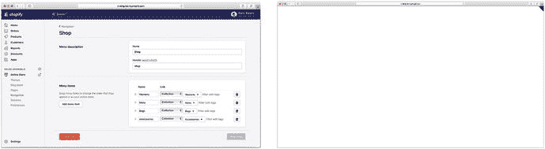
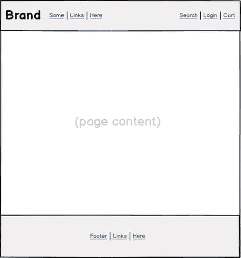
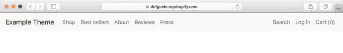
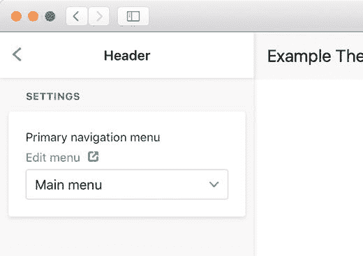
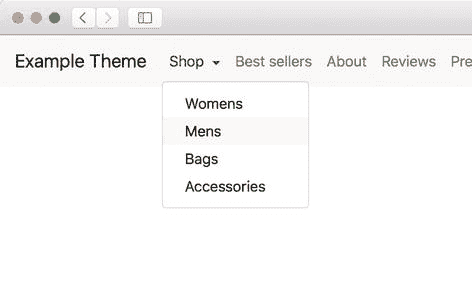
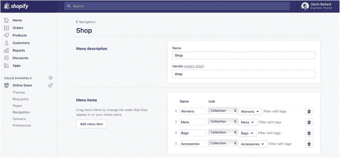
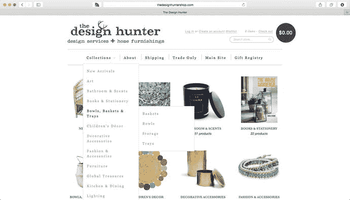
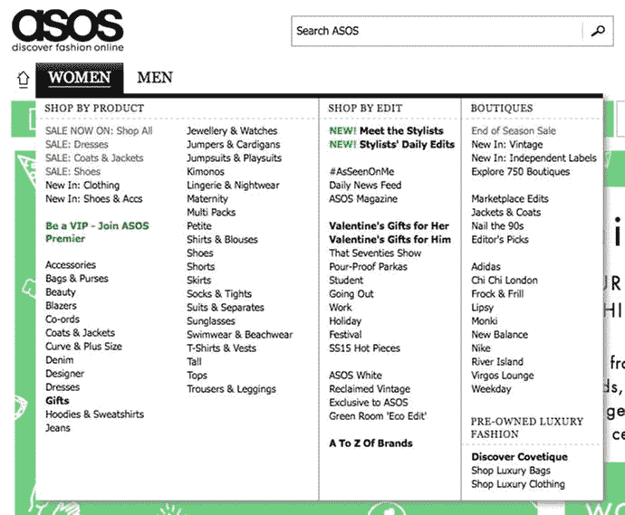
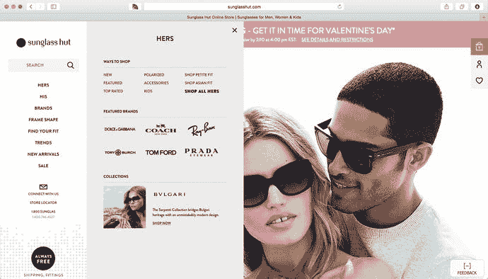
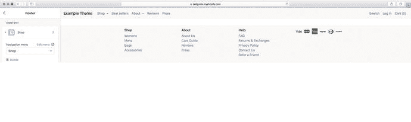

# 4. 设计主题基础

在接下来的四章中，我们将一步步地设计并构建一个示例 Shopify 主题——逐页、逐功能地推进。在本章中，我们将探讨新主题的起步方式，然后设计并实现整个商店共有的关键元素——布局和导航。

重点将放在构建 Shopify 主题的基础知识上，而非网页或视觉设计的基础知识。这意味着你不会看到太多关于样式、视觉调整或前端框架选择的讨论，除非这些内容与 Shopify 特有的问题直接相关。

在构建电商网站时，不同场景下可以且应该做出多种设计选择——使用何种导航风格、产品页面的最佳布局是什么等等。正确答案（如果存在的话）当然会因商店和目标受众的不同而有所差异。

我们不可能在一本书的范围内详细探讨每一种可能的选择。因此，面对这些选择时，我会先讨论不同的可行方案，然后选定一种常见方案用于演示。

此外，为了避免将所有用于构建示例主题的代码直接堆砌在书中，我已将其放在一个 GitHub 仓库中（`https://github.com/gavinballard/defguide-theme`）。该仓库的提交历史记录着本章开始后示例主题的进展，方便你逐节跟踪所做的具体修改。

当代码有助于阐明某个观点或演示某项技术时，我会在文中使用它。为了使这些示例尽可能清晰且实用，我会剔除无关信息（如 HTML 类名或可访问性属性）。你随时可以查阅示例主题仓库中对应的完整代码片段。

准备好了吗？我们开始吧！

### 起点

在开始设计和构建主题之前，我们先确定工作流程并做好准备工作。我在第 2 章中讨论了多种工具和工作流技术，包括 Shopify 的 Slate 以及其他构建工具，这些工具能将你的主题从不同的源文件结构组装成 Shopify 期望的目录结构。

了解并使用这些工具很重要，但首先，你需要在简单性和易用性之间找到平衡。这里我们假定直接使用 Shopify 主题目录结构（因此不使用 Grunt 或 Slate 等构建和编译工具），但在本地使用文本编辑器处理文件，并利用 Theme Kit 或 Theme gem 保持变更与开发商店同步（如需复习这两种工具的使用，请回顾第 2 章）。

#### 主题脚手架

在日常处理 Shopify 主题的工作中，大部分时间你会在已有的 Shopify 源文件上工作——也许你会被请来定制一个从主题商店购买或由他人开发的主题。当你从头开始一个“绿地”项目时，拥有一个起点——一块可以工作的空白画布——会很有帮助。以下是几个免费可用的主题脚手架：

*   **Slate**：Shopify 官方主题开发工具，包含其自身的默认主题设置，当你运行 `slate theme new-theme-name` 时会自动生成。它相当精简，为你提供模板文件以及一些初始样式和 JavaScript 辅助函数。Slate 使用一系列构建工具从源目录“编译”你的主题。
*   **Timber**：在 Slate 出现之前，这是 Shopify 的官方主题框架，提供了许多样式辅助函数和 Ajax 购物车等 JavaScript 功能。随着 Slate 的推出，Timber 已不再维护，因此最好将 Timber 视为实现特定 Shopify 功能的灵感来源，而非起点。
*   **Shopify Theme Scaffold**：这是一个非官方项目，基于我们在 Disco 的主题工作。它包含一个简单的基于 Grunt 的主题编译工作流。与其他工具不同，它是一块真正的空白画布，因为其中只包含空的模板文件，没有任何样式或 JavaScript。

随着时间的推移，你可能会逐渐形成自己处理 Shopify 主题的偏好，并开始构建自己的起点脚手架。

不过，就本书而言，我们将回归最基础的方式。我们会从将 `blank.zip`（可从本书的 GitHub 资源中获取）上传到你开发商店的主题编辑器开始。顾名思义，`blank.zip` 是一个完全空白的主题，只包含 Shopify 认为有效上传所必需的最小内容。从图 4-1 中可以看到，一旦上传成功，它确实名副其实。



图 4-1

你可以直接将 `blank.zip` 文件上传到 Shopify 后台的“主题”页面（左图）。完成后，预览该主题会呈现一个令人兴奋的画面（右图）


#### 示例产品数据

常见的设计错误是围绕不切实际的“虚拟”数据（比如 Lorem Ipsum）进行构建，而非使用网站上线后实际会用到的真实内容。我鼓励所有主题开发者养成一个习惯：在开始构建主题之前，务必确保客户提供了实际的产品数据和文案。

这并非总是可行，但幸运的是，Shopify 提供了一系列可供导入到开发商店的虚拟库存数据，帮助你处理真实的数据。这些虚拟产品包含各种尺寸的图片、不同数量的变体以及长度各异的描述，从而让你的主题能够在一系列内容中得到充分测试。

你可以从 [`https://github.com/shopifypartners/shopify-product-csvs-and-images`](https://github.com/shopifypartners/shopify-product-csvs-and-images) 下载四组示例产品数据中的任意一组。

**练习：起点**

1.  搭建一个 Shopify 开发商店，以便开始跟随实践练习。具体步骤请参考第 1 章。
2.  从本书的资源页面下载 `blank.zip`，然后通过 Shopify 后台的“主题”页面上传到你的商店。
3.  从 Shopify 下载一组示例产品数据，并将其导入你的商店。
4.  按照第 2 章“迁移到本地开发”中概述的步骤，将空白主题的副本下载到本地机器，并使用 Theme Kit 确保你在本地所做的任何更改都能同步到你的 Shopify 商店。
5.  一个可选（但强烈推荐）的步骤是将你的主题纳入版本控制，这样你就能保存整个过程中的进度，并将其与 GitHub 上示例主题的提交历史进行比较。请按照第 2 章“将你的主题置于版本控制下”中概述的步骤进行操作。

#### 主题的布局

除非另有指定，否则主题中的所有页面模板都将在默认布局 `theme.liquid` 内呈现。空白起始主题附带的布局文件如清单 4-1 所示。

```
{{ content_for_header }}
{{ 'styles.css' | asset_url | stylesheet_tag }}

{{ content_for_layout }}
{{ 'theme.js' | asset_url | script_tag }}
```

清单 4-1 – 默认 `theme.liquid` 的内容

整体结构对于任何使用过 HTML 的人来说应该都很熟悉。特定于 Shopify 的元素包括：

-   `{{ content_for_header }}`：Shopify 要求将此输出标签放置在布局的 `<head>` 部分。它将利用此位置在商店前端渲染的每个页面上添加 Shopify 端的 JavaScript、样式和跟踪代码。
-   `{{ content_for_layout }}`：Shopify 要求将此输出标签放置在布局的 `<body>` 部分。这是每个独立页面模板（`page.liquid`、`article.liquid` 等）内容将被渲染的位置。
-   `{{ 'styles.css' | asset_url | stylesheet_tag }}` 和 `{{ 'theme.js' | asset_url | script_tag }}`：这些标签并非严格必需，但我将它们包含在默认布局中，因为你通常希望在每个页面都添加全站样式表和脚本。`asset_url` 和 `stylesheet_tag` / `script_tag` 是 Liquid 过滤器，它们将特定资源的名称（如 `'theme.js'`）首先转换为该资源在 Shopify CDN 上的引用，然后转换为加载该资源的 HTML 标签，例如：`<script src="//cdn.shopify.com/s/files/1/1744/7651/t/2/assets/theme.js?2331723957652526606" type="text/javascript"></script>`。

随着时间的推移，我们将向 `theme.liquid` 添加越来越多的内容。其中大部分是我们希望在每个页面上显示的内容或元素，而另一些则会根据当前页面模板有条件地加载。首先，我们将研究整体站点布局和导航元素的设计考虑与实现——这些内容通常会影响到网站的所有页面。

### 设计布局与导航

设计 Shopify 网站的布局和导航远不止是在网站顶部设置一个漂亮的导航栏并确保下拉菜单正常工作。这需要思考网站的用户，以及如何以最少的步骤，最好地帮助他们找到所需内容。

在网站布局方面，主题设计师面临的一个矛盾是“惯例与创意”。长期以来，客户对特定电商网站外观和运作方式的期望已经形成，这意味着我们往往会看到电商网站的外观趋于一致。看一下图 4-2 中“原型电商网站”的布局，你可能会同意 90% 的电商网站都属于这种基本结构。



图 4-2 – 原型电商网站布局

我不认为这种趋同一定是坏事。如果我们的网站遵循客户的期望，他们将能够更有效地找到所需内容，这本身就是设计师的职责之一。在这些惯例之内，我们仍然有足够的空间来寻找品牌的“声音”。

对于这个示例主题，我们将实现一个与图 4-2 中“原型”布局非常相似的结构：一个包含标题区域的布局，左侧是 Logo 和文本链接，右侧是搜索栏、账户信息和购物车链接。在标题下方，我们为各个页面内容留出空间，最后在底部添加一个包含网站各版块链接的页脚。

由于我们预计会有大量移动端访客（访问 Shopify 网站的流量中，超过一半来自移动设备），我们需要确保布局具有响应式设计，并且通过折叠导航项、创建大触控区域以及调整字体大小，使其在移动设备上易于使用。


#### 站点页眉

对于示例主题，我们将添加一个新的 `header.liquid` 区块（参见代码清单 4-2），该区块会渲染店铺名称，遍历主导航菜单（可从 Shopify 后台配置）中定义的链接，以及搜索、登录/我的账户和购物车链接。随后，我们将其包含在 `theme.liquid`（参见代码清单 4-3）中，使其出现在网站的每个页面上。

```liquid
{{ shop.name | escape }}



{{ link.title | escape }}



搜索




{{ customer.first_name | escape }}



登录




购物车 ({{ cart.item_count }})

代码清单 4-2
一个简单的 sections/header.liquid 区块
```

```liquid
...


{{ content_for_layout }}
...
代码清单 4-3
将页眉区块包含在 theme.liquid 顶部，使其出现在每个页面上
```

在 Shopify 站点上呈现时，效果类似于图 4-3（请注意，本书跳过了所有样式代码的添加；详情请参考示例主题仓库）。注意，菜单栏中的项目（如“商店”、“畅销商品”等）是在 Shopify 后台的“在线商店 > 导航”部分定义的，而非直接在主题中定义。



**图 4-3** 示例主题的页眉

简单但有效！需要注意以下几点：

* 实现方式保持一致。我们不会根据当前页面更改可用的菜单项或菜单项的布局。保持网站导航结构在页面之间的一致性非常重要，因为这能减少用户在切换页面时需要处理的信息量。对网站布局或结构进行重大的“上下文相关”更改可能会让用户感到困惑，应予以避免。
* 购物车链接位于其常规位置（页面右上角）。保留此元素意味着，无论顾客身在何处，他们都知道如何执行电商网站最重要的步骤——进入结账环节。同时请注意，购物袋中当前的商品数量会显示出来，以帮助顾客跟踪其购物车状态。
* 该设计仅允许在页眉中显示单级导航。此阶段没有下拉菜单或分类筛选器。稍后你将更详细地了解导航模式。

##### 使页眉可配置

使用区块而非代码片段来实现页眉的优势之一在于，我们可以直接在区块中定义配置设置，并使这些设置在 Shopify 后台的主题定制器中以简单界面形式呈现。为了演示这一点，让我们进行一项更改，允许店铺所有者选择要使用的导航菜单，以渲染站点顶部的链接列表（目前固定在 `main-menu`，这是默认的 Shopify 导航菜单）。

我们可以首先在 `sections/header.liquid` 顶部添加一个 `` 定义，然后更新获取导航菜单的方式（参见代码清单 4-4）。完成后，从 Shopify 后台打开主题定制器的用户将能够选择要使用的菜单（见图 4-4）。请注意，`link_list` 类型指的是 Shopify 后台中标题为“导航菜单”的项。



**图 4-4** 添加 `` 标记为用户提供了一个优美的界面，使其能够在 Shopify 后台的主题定制器中进行配置更改

```liquid

{
"name": "页眉",
"settings": [
{
"id": "primary_link_list",
"type": "link_list",
"label": "主导航菜单",
"default": "main-menu"
}
]
}


...




...
代码清单 4-4
添加  标记
```

#### 导航菜单

导航页眉的初始方法仅提供单级选项。对于页面或产品数量非常有限的店铺，这种简单方法可能就足够了。然而，许多店铺为用户提供更多选择以及更快缩小产品范围的方式会更有用。这通常通过添加上下文相关的菜单选项（例如下拉菜单）来实现。


### 导航菜单设计

为你的网站选择合适的菜单设计方案，需要深入理解网站的信息层级，尤其是产品层级。你需要考虑以下事项：

- 客户/店铺所有者如何对商品进行分类
- 竞争对手如何对相同或相似商品进行分类
- 客户如何对商品进行分类
- 分类是“深”的（顶层类别少，但包含大量子类别和孙类别）还是“宽”的（顶层类别多，子类别很少或没有）
- 类别之间的重叠程度
- 需要筛选或搜索的产品属性维度
- 网站是否“内容密集”（例如，包含大量博客文章和文章）

这个列表可能有点令人畏惧，但在确定你的导航菜单需要多大规模时，这是一个需要考虑的重要因素。如果店铺只销售 2-3 种商品，你可以完全跳过分类；如果销售 50 种，可能只需要类别就够了；如果销售 500 种以上，那么你至少需要两级分类。

重要的是，要意识到 Shopify 后台在分类方面（常被诟病的）局限性。严格来说，我们只被允许有一“真正”级的分类（用 Shopify 的术语来说就是“集合”）。并没有内在的子类别概念。我们真正得到的是产品上几个不同的字段，让我们可以对它们进行分组：**标签**、**产品类型**和**产品供应商**。**标签**最常用于模拟子类别功能。

在 Shopify 开发的几乎所有领域，我的一般性建议是避免过于聪明，过度突破边界会导致麻烦。作为推论，我不建议尝试用 Shopify 实现孙类别，除非你有非常明确的需求和可维护的方法（也许需要应用程序支持）。

对于示例店铺，我使用 Shopify 提供的“Apparel”示例产品数据。这为我们提供了 25 种产品的库存，涵盖了一些服装（男装和女装）、包袋和一些配饰。考虑到产品的分布以及客户可能如何看待它们，我将为此店铺设定四个主要产品类别：**女装**、**男装**、**包袋**和**配饰**。由于每个类别下只有 4-5 种产品，我暂时不对它们进行子分类。

除了这个产品层级，我还要假设店铺所有者认为有几个内容页面很重要——**关于我们**、**商品评价**和**媒体报道**。我还想为客户提供一个到达最受欢迎产品的快捷方式，我们可以通过一个指向“畅销品”集合的链接来实现。基于这些信息，主导航菜单的最终示例信息层级如下：

- 店铺
  - 女装
  - 男装
  - 包袋
  - 配饰
- 畅销品
- 关于我们
- 商品评价
- 媒体报道

一旦我们有了一个层级结构，就需要决定如何在店铺前端最好地实现它。鉴于 Shopify 不原生支持层级导航菜单（在撰写本文时，此功能仍处于测试阶段），实现它们的标准方法是：

1. 在 Shopify 后台为每个子菜单创建一个新的导航菜单，其名称与其顶层名称匹配（在此示例中，意味着创建一个名为“店铺”的新导航菜单，其中包含指向“女装”、“男装”、“包袋”和“配饰”集合的链接）。
2. 在遍历顶层菜单项时，更新 Liquid 代码以检查当前项是否存在子菜单。如果存在，则通过依次遍历其项来渲染该子菜单。

你可以在 Shopify 后台（参见图 4-5）和 `header.liquid` 部分（参见代码清单 4-5）中看到我如何为示例店铺实现这一点，并在前端看到结果（参见图 4-6）。



图 4-6：示例主题店铺前端上的最终简单下拉菜单



图 4-5：在 Shopify 后台配置子导航菜单

```









{{ link.title | escape }}




{{ child_link.title | escape }}





```
代码清单 4-5：更新后的导航菜单链接循环，用于处理子菜单导航项

### 下拉菜单设计指南

-   **限制菜单选项：** 尽量避免菜单项超过七个，因为这会给用户带来过大的认知负担。如果你觉得需要更多，可以考虑增加一级层级，或者仅仅依靠集合页面流畅的筛选体验来让用户缩小结果范围。记住，这是一个**上限**，而不是目标——ASOS 的店铺只有三个顶层菜单项（首页、男装和女装）。
-   **保持下拉菜单只有一级：** 尽管在下拉菜单一侧添加子菜单很诱人，但研究表明这对用户来说操作繁琐且棘手。当下拉菜单通过悬停激活时尤其如此——除非用户非常小心地移动鼠标，否则就会“丢失”菜单。如果你需要能够显示更大的类别范围，可以考虑使用下一节讨论的超级菜单。
-   **通过点击激活下拉菜单，而不是悬停：** 这意味着你不必担心移动设备和平板电脑等触控设备（在这些设备上无法触发悬停事件）有不同体验。它还允许你即使光标离开菜单，也能保持打开的菜单就位，从而避免用户的主要挫败感和潜在的可访问性问题。

图 4-7 中的下拉菜单是一个存在一些问题的菜单示例。首先，它太长，客户必须滚动才能看到所有选项。其次，它是悬停激活的，鼠标一离开就会立即关闭（在滚动以查看底部时非常常见）。最后，它包含的子菜单也存在同样的悬停问题，并且主菜单没有通过任何方式（例如右侧的箭头）提示它们的存在。



图 4-7：一个存在若干可用性问题的下拉菜单


#### 大型菜单（Mega-Menus）

如果你的分类很多，可能会发现信息量太大，无法在单级下拉菜单中容纳。这时，常见的大型菜单设计模式就派上了用场。大型菜单允许你向用户提供许多深层次的导航选项，并以你可控且可配图的结构呈现（见图 4-8）。



图 4-8

尽管看起来有些杂乱，但这个示例展示了如何使用大型菜单对 ASOS 网站上大量深层链接进行分类。

由于大型菜单提供了高度的空间和灵活性，它们应被视为一个独立的设计画布，而不仅仅是列出大量项目的方式。这样做，并结合以下建议，将帮助你充分利用菜单，为客户提供更好的购物体验。

-   使用标题和列来清晰地划分和标识你所选的菜单部分。列的选择应反映客户浏览产品范围的常见方式——例如，“按尺寸选购”、“按品牌选购”和“按价格选购”。
-   你不必简单地按字母顺序排列产品或分类。利用大型菜单的灵活性，在菜单的左上角推广你的畅销品或特色商品。
-   保持大型菜单简短。菜单过高会给屏幕较小的用户带来问题。你可以通过充分利用屏幕宽度来弥补。
-   不要害怕使用图片或图形来美化产品或分类（但不要过度，以免让你的大型菜单变得视觉混乱）。
-   通过使用响应式设计技术，确保你的菜单在移动设备上友好。

Sunglass Hut 提供了一个优秀的大型菜单示例，如图 4-9 所示。精心挑选的顶级项目（女款、男款...）通过点击打开一个提供更深层次导航的大型菜单。该菜单有效利用图形提供了“特色品牌”功能以及底部的特色系列。



图 4-9

Sunglass Hut 在大型菜单上有趣的横向变动是菜单设计的一个绝佳范例。

大型菜单背后的实现逻辑与我们已经在示例主题中实现的下拉菜单类似；主要区别在于所显示元素的样式和大小。基于这个原因，并且因为我们还没有处理那么多产品，让我们暂时搁置在商店中实现大型菜单的工作，转而讨论另一个重要的导航元素——页脚。

#### 网站页脚（The Site Footer）

页脚不仅仅是放置电子邮件注册表单的地方，设计师们常常忽视页脚在导航中极其有用的作用。对于已经滚动到页面底部但未找到所需内容的用户来说，页脚可以充当“救星”工具，降低用户跳出你网站的可能性。由于惯例，页脚也通常是客户寻找有关运费、退款和退货政策信息时首先查看的地方。

此外，页脚是放置信任信号的好地方，例如“安全”或“可信赖”网站徽章和标志、知名客户的标志，或报道过你品牌的媒体公司标志。研究表明，在每个页面上使用这些类型的信号来加强网站的可信度，可以对转化率产生积极影响。

> **注**
> 如果你的商店在系列页面上采用了“无限滚动”技术，页脚中所有这些有用的信息可能会丢失。这是我不建议在电商网站使用无限滚动的几个原因之一。在深入探讨系列页面设计的第 6 章中，你将更深入地了解这一点。

为了在示例主题中实现页脚，我们将采用与页眉类似的方法，创建一个名为 `footer.liquid` 的新部分（参见代码清单 4-6），然后从 `theme.liquid`（参见代码清单 4-7）中包含它，这次放在 `{{ content_for_layout }}` 标签之下。与 `sections/header.liquid` 一样，我们需要在顶部包含一个 `` 部分，以允许用户自定义页脚。

```liquid

{
"name": "Footer",
"blocks": [
{
"type": "link_list",
"name": "导航菜单",
"settings": [
{
"id": "link_list",
"type": "link_list",
"label": "导航菜单"
}
]
},
{
"type": "payment_icons",
"name": "支付图标"
}
]
}











代码清单 4-6
新建 sections/footer.liquid 文件的内容
```

```liquid
...
{{ content_for_layout }}

{{- 'jquery-3.1.1.min.js' | asset_url | script_tag -}}
...
代码清单 4-7
在 theme.liquid 中包含新的页脚部分
```

`footer.liquid` 代码引入了一个新的 Liquid 概念：块。块是内容和设置的封装器，可以在特定部分内添加、删除和重新排序。当你希望允许主题所有者定义重复的内容部分或控制内容出现的顺序时，使用块是合理的。

在此页脚中，我们在页脚部分内定义了两类块——一个 `link_list` 类型和一个 `payment_icons` 类型。第一个允许在页脚列内呈现垂直导航菜单，第二个则在商店前台显示支持的支付图标列表。通过主题定制器，店主将能够自由添加或删除这些块来配置页脚。

在 `footer.liquid` 中，代码会遍历在该部分中配置的每个块，检查其类型，并包含 `footer-block-link-list.liquid` 或 `footer-block-payment-icons.liquid`。这些是 Liquid 代码片段文件，存储在主题的 `snippets` 目录中，以便在逻辑上划分和简化 `footer.liquid` 部分中的代码。这里使用的文件名只是一种约定，用以标识它们是从页脚部分作为块被包含进来的。请查看示例主题仓库以获取这些代码片段的完整实现。

图 4-10 展示了在主题定制器和主题预览中添加页脚后的结果。



图 4-10

添加页脚代码段可提供可自定义的多列页脚布局

#### 练习：布局与导航

1.  按照本章的步骤，向你的主题添加页眉和页脚部分，包括可配置的 `` 部分，以允许用户配置每个部分中使用的导航菜单。
2.  为你自己假设的商店设计最重要页面的信息层级，包括产品层级和合理的分类系统。
3.  如果你的信息层级需要多层信息，请在主导航中添加一个下拉菜单，以便客户更容易找到他们想要的东西。如果你有雄心壮志，可以将该下拉菜单实现为大型菜单，并在展开区域内包含一些额外的图形信息。


### 总结

在本章中，我们为构建一个新的 Shopify 主题做好了充分准备。本章涵盖了开发人员在开始新主题时可以使用的选项和框架，并解释了如何利用已有的示例产品 CSV 文件，基于真实数据开始构建。

你学习了一些关键的 Shopify 概念，如布局、区块和块，并了解了在为商店主题设计导航布局时应遵循的设计原则。

脚注 1

关于导入产品数据的说明，请参见[`https://www.shopify.com/partners/blog/93467590-design-your-store-faster-with-product-csvs-and-images`](https://www.shopify.com/partners/blog/93467590-design-your-store-faster-with-product-csvs-and-images)。

