# 5\. 设计产品页面

一旦我们有了可用的基础主题结构，就可以开始构建商店中的各个页面。本章将从最重要的页面——产品页面——开始讲解。

### 产品页面

对于电子商务商店来说，产品页面通常是最重要的页面。顾客在这里评估商品并做出购买的关键决定。它需要向访客传达大量信息——核心信息包括你的产品是什么、有什么功能、外观如何、价格多少、有哪些配置选项；以及补充信息，如尺码指南、配送详情、产品指南和顾客评价。

除了清晰地呈现所有这些信息，它还需要提供交互元素，帮助顾客根据喜好配置产品（例如，选择合适的尺码和颜色）、将其加入购物车，并进入结账流程。

根据我的经验，设计师和店主往往花费过多时间来思考和完善网站的主页，却牺牲了产品页面。这完全可以理解——毕竟，当店主想查看自己的网站时，他们输入域名后看到的就是主页——但人们很容易忽视这样一个事实：许多商店访客并非从主页进入，然后依次线性地浏览到集合页和产品页。图 5-1 展示了设计师和店主常常如何构想顾客在网站中的浏览路径（左侧），以及现实情况（右侧）。如果你正在为一个现有商店设计主题，可以申请查看已有的分析数据，以便了解商家实际顾客最常见的访问路径。

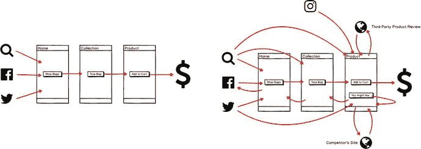

图 5-1：设计师和店主如何构想顾客在网站中的浏览路径（左侧）与现实情况（右侧）

通过谷歌搜索、付费广告或社交网络到达网站的顾客，更有可能直接进入与其兴趣相符的特定产品页面，而非主页。因此，确保该页面的体验尽可能流畅至关重要。

出于这个原因，我建议你优先开始产品页面的设计和开发工作，这正是我们在本章示例主题中的做法。

### 产品页面信息层级

要设计一个高效的产品页面，我们首先需要建立信息层级——哪些产品信息对访客最重要？我们应该优先展示什么？哪些可以被视为不需要那么突出的“补充”信息？

答案会因商店而异，尽管通常有些信息比其他信息更重要。一种“标准”的信息层级，将产品信息按优先级分类，可能如图 5-2 所示。

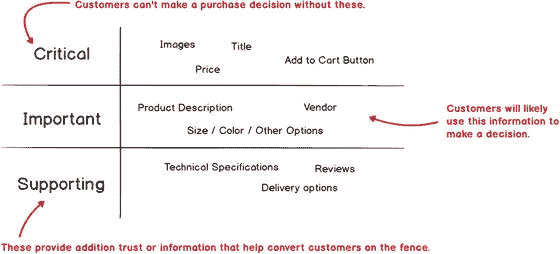

图 5-2：一种“标准”的产品信息层级

偏离这个标准层级的原因可能包括：我们销售的产品类型、我们对访问商店顾客的了解，甚至是我们预期访客使用的设备。举个例子，比较图 5-3 中 Colonna Coffee 的烘焙咖啡豆产品页面与 Bespoke Verse 的礼品马克杯产品页面。Colonna 的咖啡豆包装外观相似，无论烘焙程度或风味如何，因此产品图片相对较小，重点放在了咖啡口味的文字描述和可用选项（浓缩咖啡与过滤咖啡，长杯与短杯）上。相反，Bespoke Verse 的礼品马克杯根本不需要任何文字描述，因为产品图片本身就说明了一切，并且被非常突出地展示。

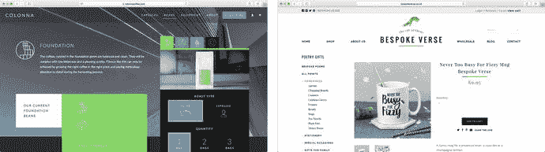

图 5-3：Colonna Coffee（colonnacoffee.com，左侧）的整颗咖啡豆产品页面与 Bespoke Verse（www.bespokeverse.co.uk，右侧）的礼品马克杯产品页面

对于这个示例主题，我们将采用图 5-2 中的“标准”信息层级。第一版将使用基于图 5-4 中粗略设计稿的布局来实现这一点。如你所见，我分别为移动端和桌面端环境独立应用了该层级，以确保信息优先级的一致性，同时也要考虑用户在不同设备上浏览页面的体验。

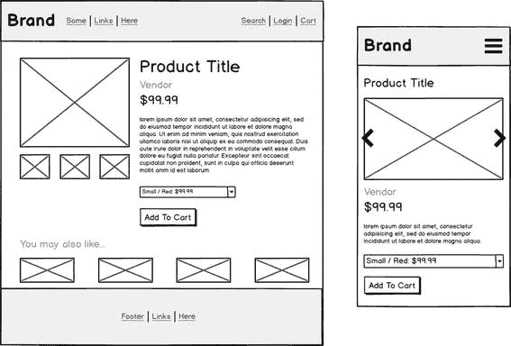

图 5-4：基于标准产品信息层级并插入第 4 章开发的布局格式中，为示例主题产品页面制作的粗略设计稿


### 添加产品图片

让我们开始为例题主题中的产品页面编写代码。

默认情况下，商店中所有产品均使用 `templates/product.liquid` 文件进行展示。与其他页面模板文件类似，`product.liquid` 的内容由 Shopify 处理，并渲染在 `theme.liquid` 的 `{{ content_for_layout }}` 标签中。接下来，我们将通过一个简单的产品图片轮播代码，开始向 `product.liquid` 添加内容。其简化版 HTML 代码见`[5-1]`清单，显示效果见`[图 5-5]`。如果产品有多个图片，则会显示产品缩略图列表。用于生成`[图 5-5]`所示产品模板的更详细的 `product.liquid` 文件，可在例题主题的 GitHub 仓库中找到。

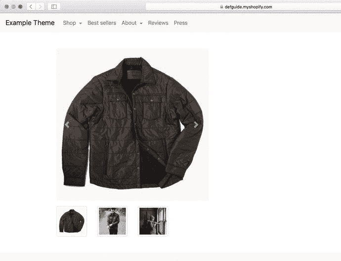

*图 5-5 – 示例产品页面上[5-1]清单的运行结果*

```






{{ 'image' | placeholder_svg_tag }}

```

*清单 5-1 – 显示主产品的简化版 `product.liquid` 代码*

在此，我添加了一些 HTML 标记，用于创建一个左侧列来插入产品图片。通过 Liquid，我们查询 `product` 变量（Shopify 在所有产品页面上自动提供该变量），以查看店主是否已为产品添加了图片（``）。如果已添加，我们会在一个大的 `` 标签中显示“主”图；如果产品有多个图片，我们则遍历所有产品图片，生成一个产品缩略图列表。

目前，当点击缩略图时，实现方式是在新浏览器窗口中打开图片，而不是将大图替换为缩略图版本。如果你查看 GitHub 仓库中更完整的示例，会发现我利用了一个轮播控件，它允许用户通过左/右箭头滑动切换产品图片，也可以使用缩略图直接跳转到特定产品图片。

#### 产品图片的设计考量

在例题主题中添加产品图片的过程中，有必要考虑一些高层次的指导原则。产品图片通常应满足：

*   **尺寸够大**（即使在较小的屏幕上或对于视力不佳的访客，也能轻松辨认细节）
*   **画质够高**（无论是拍摄技术还是文件质量）
*   **对于实物产品，应体现产品尺寸比例**
*   **同时展示产品本身及使用场景**
*   **不要使用任何明显的滤镜或数字修改**
*   **在视觉风格、质感和宽高比上尽可能保持一致性**

你并非总能控制主题中使用的产品图片，但当有机会时，应努力倡导这些原则。鼓励客户投入时间和预算，聘请专业团队拍摄（最好是具有电商产品摄影经验的摄影工作室）。顾客对电商网站的产品摄影质量非常敏感，如果你的产品图片看起来不专业，他们转化的可能性会大大降低。

在主题设计项目开始时，你能做的最好的事情之一，就是为产品图片的分辨率和宽高比设定严格的指导原则。要求商家上传尽可能高分辨率的图片（2048 x 2048 像素是一个不错的目标，也是 Shopify 渲染的最大尺寸）。为了避免页面加载时间过长，你可以利用 Shopify 的图片滤镜（将在下一节讨论）在适当位置渲染低分辨率版本的图片。

在整个网站上为产品图片坚持使用一致的宽高比，可以降低产品并排渲染时出现不规则或突兀外观差异的可能性。我倾向于鼓励使用方形（1:1）图片，但根据所售产品类型，4:3 或 3:4 的比例也能取得不错的效果。虽然你可以使用样式表和 Shopify 的图片滤镜来裁剪、拉伸和修剪图片，但拥有一个共同的起点总是更容易处理。

#### Shopify 的图片滤镜

Shopify 的实用功能之一是能够使用 Liquid 滤镜对图片进行即时尺寸调整和编辑。这意味着店主可以将最高分辨率的产品图片上传到后台，而主题开发者则可以使用这些滤镜生成适合特定位置尺寸和宽高比的版本。

这里涉及的关键滤镜叫做 `product_img_url`，你可以在`[5-1]`清单中看到它的用法。你可以查阅 Shopify 文档了解详细信息¹，但该滤镜的主要用途包括：

*   **使用较小版本的图片**，以减小文件大小和页面加载时间（你将在关于性能的`[第 10 章]`中学习相关内容）
*   **裁剪或填充图片**，确保它们具有一致的宽高比
*   **将图片转换为渐进式 JPEG**，以加快加载速度

#### 可缩放的产品图片与产品灯箱

实现可缩放的产品图片（将鼠标悬停在产品图片上，会显示“放大”版本）或产品灯箱（点击产品图片会弹出一个“模态”全屏产品图片），是让顾客近距离查看产品的绝佳方式。但至关重要的是，这些设计元素不应让用户感觉离开了原产品页面，从而打断他们的浏览流程。在实现这些功能时，还需要注意以下几点：

*   它们应**渐进增强**，确保在未启用 JavaScript 时也能保持可用性。
*   考虑在移动设备上**禁用**这些功能，因为在移动设备上产品图片通常已经是全宽显示，或者用户习惯于通过捏合触屏来放大图片。
*   确保它们**支持键盘操作**，用户应能使用方向键在连续的图片间移动，并能通过 `Escape` 键关闭灯箱。


#### 产品视频

在产品页面添加相关的视频可以带来显著的转化率提升²，并且越来越多的在线零售商很可能会利用视频来更好地展示其产品和独特卖点。

如何将视频整合到主题中，取决于高质量视频是适用于所有产品，还是仅适用于部分产品。如果商店中每一件产品都有高质量的大尺寸视频，那么在每个产品页面上为这些视频预留出显眼的空间就很有意义，如图 5-6 所示的 Sonos 网站。

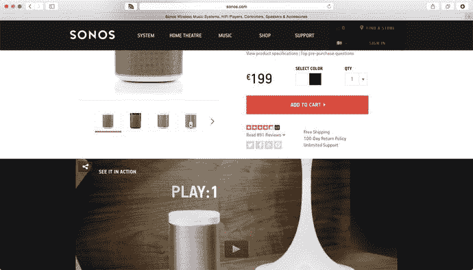

图 5-6

Sonos 在其产品页面上突出展示了产品视频

对于那些并非所有产品都有视频，或者每件产品有多个视频的商店，主题可以通过第二个“缩略图”区域来展示这些视频。

避免使用会自动加载并显示控件或品牌标识（例如 YouTube）的视频嵌入工具，因为它们可能会分散用户的注意力。实际上，出于性能考虑，最好避免在页面加载时加载任何依赖大量 JavaScript 的播放器，而是提供一个图片，当用户点击该图片时，再触发视频播放器弹窗或嵌入。请参见图 5-7。

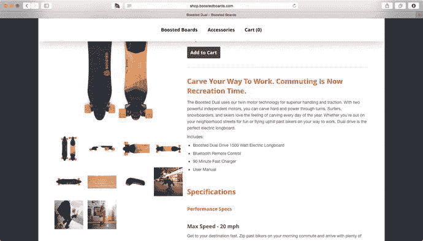

图 5-7

Boosted Boards 在展示其产品方面做得不错，但他们的一些产品缩略图是视频。他们可以通过在这些缩略图上添加“播放视频”覆盖层来提高可发现性。

### 添加产品详情与“加入购物车”表单

回到示例主题，我们现在来充实图 5-4 中桌面版模拟图右侧的内容：产品详情、描述以及一个基本的“加入购物车”表单。代码清单 5-2 展示了实现此功能所需的简化版 Liquid 代码，图 5-8 显示了其在浏览器中的呈现效果。

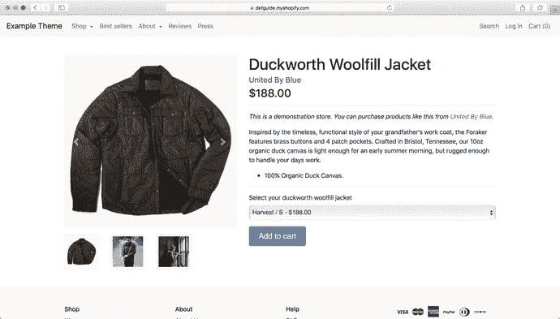

图 5-8

添加了产品信息和“加入购物车”表单的示例产品页面

```
... (产品图片代码已省略) ...

{{ product.title | escape }}
{{ product.vendor | escape }}
{{ product.price_min | money }} - {{ product.price_max | money }}{{ product.price | money }}
h3>
{{ product.description }}


选择您的 {{ product.title | downcase }}


{{ variant.title | escape }} - {{ variant.price | money }}





加入购物车

代码清单 5-2
在 templates/product.liquid 中添加产品信息与“加入购物车”表单
```

我们来逐一解析这些更改。

#### 产品详情与描述

用于呈现产品详情和描述的代码清单 5-2 中的代码并不复杂。实际上，只需在像 `<h1>` 这样具有适当信息层级的 HTML 元素中输出相应的 Liquid 变量（`product.title`，`product.min_price`）即可。

我使用了几个 Liquid 过滤器来输出这些信息。在输出标题和供应商时，我使用了 `| escape` 过滤器。这在输出任何用户生成的文本内容时是一个好习惯，可以避免潜在的格式或输出问题（例如，如果你的产品标题包含像 `<` 这样的 HTML 字符，escape 过滤器会确保它被渲染为文本而非 HTML）。我还使用了 `| money` 过滤器，以商店货币和偏好设定的格式来显示产品价格（Shopify 以分为单位存储，例如 `18800`）。

`product.description` 是直接输出的。它可以包含 HTML（以允许描述内容中的锚点链接等），因此我们没有对其使用 `| escape` 过滤器。如果你希望确保描述不会渲染出任何可能破坏页面布局的怪异内容，可以使用 `| strip_html` 过滤器将其强制转换为纯文本。

你可能注意到示例在显示产品价格时使用了一些 Liquid 逻辑。这样做是因为不同的产品款式（例如颜色和尺寸的组合）可能有不同的价格。我们应该检查当前产品是否属于这种情况（``），以决定是显示单一价格（`product.price`）还是价格范围（`product.price_min` 到 `product.price_max`）。在本章后面，你将看到如何调整这种方法，动态更新 `price` 元素，使其仅显示当前所选款式的价格。

**提示**

在设计产品页面时，应使用真实的产品描述，而不是虚拟文字或占位符（lorem ipsum）文本。这样你能更好地了解产品的呈现效果和布局，避免日后出现意外。

另一件要避免的事情是从制造商或竞争对手网站复制粘贴产品描述。这样做不仅可能因为重复内容对 SEO 产生负面影响，而且你也错失了在描述中注入品牌独特声音并说服客户的机会。


#### 添加到购物车表单

在最简单的形式中，Shopify 的“添加到购物车”表单是一个 `<form>` 元素，它使用 `POST` 方法将数据提交到商店前端的 `/cart/add` 链接。表单数据中必须提交的唯一信息是一个或多个待添加到购物车的变体 ID（如果只添加单个变体，这些参数应命名为 `id`；如果同时添加多个变体，则应命名为 `id[]`）。

在本示例中，我们允许客户通过一个 `<select>` 下拉菜单来选择要添加到购物车的变体，该下拉菜单包含产品所有变体的列表，并显示每个变体的描述及其价格。在渲染下拉菜单之前，我们会检查是否确实需要它（``）。如果只有一个变体，我们就通过一个隐藏输入将其 ID 作为参数提供给表单。

在渲染下拉菜单中的可用选项时，我们使用一个名为 `product.selected_or_first_available_variant` 的 Liquid 变量来判断在加载页面时是否应默认选中某个特定选项。`product.selected_or_first_available_variant` 是一个名称冗长但准确命名的变量，用于表示“已选中的”变体（由请求链接中的 `?variant=` 参数决定）或第一个“可用的”产品变体，其中可用性取决于商家库存策略下该变体是否有库存。请参见图 5-9。

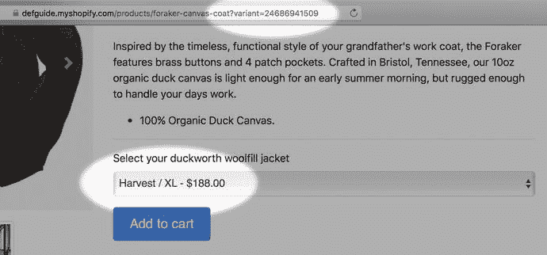  
图 5-9 – 在链接的 `?variant=` 参数中指定变体 ID，即可在“添加到购物车”表单的下拉菜单中预选该变体

“添加到购物车”表单的最后一个元素是至关重要的“提交”按钮。在本示例中，它被实现为一个标准的 HTML 按钮。我添加了一些 Liquid 逻辑，以便在产品不可用（即所有变体均已售罄）时禁用“添加”按钮。

这个初始的“添加到购物车”表单虽然简单，但它是重要的基础，我们可以在此基础上增加对更多动态变体选择器、自定义输入和 Ajax 功能的支持。在添加这些额外功能时，牢记基本的可用性和可访问性准则非常重要，具体包括：

-   确保所有输入都有对应的标签
-   尽量避免使用内联表单元素和输入
-   使用适当的 HTML5 输入类型（例如 `type="number"`）
-   对输入类型做出合理的选择（例如，对于选项较少的情况，使用单选按钮而非下拉菜单）
-   确保所有输入均可通过键盘访问
-   确保像“提交”按钮这样的操作输入有清晰标示并具备可交互的外观

### 添加推荐产品

我们即将完成图 5-4 中规划的页面布局，只差在页面底部添加“你可能也喜欢……”的推荐产品部分了。

#### 关联产品与替代产品

许多主题对此感到困惑，或者没有区分两种不同类型的推荐产品：关联产品与替代产品。

-   **关联产品**是当前展示产品的配件或补充品。比如说，与相机兼容的电池，或者与开衫相配的围巾。在产品页面上显示关联产品列表，既提供了一条“追加销售”路径以鼓励客户增加购买，也提高了客户对商店整体产品范围的认知。
-   **替代产品**，顾名思义，是当前展示产品的可能替代品或备选方案。比如说，用 Xbox 代替 PlayStation，或者选择另一种款式的大衣。与关联产品不同，替代产品列表的目的不是为了增加客户购物车中的商品数量，而是为了确保客户首先能找到他们真正想要的东西。

由于关联产品和替代产品服务于两种截然不同的目的，它们不应被一起展示。它们应该被清晰地标注，以便客户能理解推荐的来源——例如使用“购买此商品的用户也购买了……”而非“关联产品”，以及使用“我们认为您也可能喜欢……”而非“替代产品”。

在关联产品旁边添加一个小型的、由 Ajax 驱动的“添加到购物车”链接，是一种很好的方式，可以在不将客户带离主产品页面的情况下，让追加销售变得轻松无感。


#### Shopify 上的推荐商品

Shopify 并没有为管理推荐商品列表提供任何明确的内置支持，尽管有很多 Shopify 应用可以提供此功能（在 Shopify 应用商店中搜索“product recommendations”）。

虽然这些应用可以做一些非常巧妙的事情，例如使用销售数据算法生成推荐，或为个别访客量身定制推荐，但我更倾向于在求助应用之前，先尝试用 Shopify 的“原生”概念和一些自定义的 Liquid 代码来解决问题。这不仅能降低经营店铺的持续成本，还能减少应用相互干扰、破坏店铺功能或对性能产生负面影响的风险。虽然应用可能提供稍多一些的功能，但在许多情况下，基于主题的解决方案对于商家的需求来说已经足够好了。

我们可以通过几种方式使用 Shopify 的内置功能来优雅地实现相关和替代产品功能。首先，我们可以允许店主为其店铺中的每款产品手动指定一个推荐商品列表，然后在产品模板中显示该列表。店主可以通过以下两种方法之一来实现此指定：

-   在产品上设置一个包含相关产品标识符列表的元字段。你将在本章后面了解更多关于元字段的内容；现在，你只需要知道它们允许店主在产品和其他 Shopify 对象上存储自定义信息。这些信息可以在 Liquid 中检索，并用于渲染相关产品列表。
-   使用命名约定，创建一个与产品 URL（标识符）匹配的集合，然后用所需的相关产品填充该集合。例如，如果产品的标识符是 `foraker-canvas-coat`，店主可以创建一个标识符为 `foraker-canvas-coat-related` 的集合。Liquid 代码可以计算出当前产品相关产品集合的预期名称，检查它是否存在，如果存在则显示这些产品。

手动指定推荐商品的优点在于，它让店主能够对产品列表中显示的产品进行精细控制，但其缺点是创建和维护起来非常耗时。作为替代方案，我们可以使用一些 Liquid 逻辑来自动计算相关产品列表。同样，我们有两种可能的策略：

-   找到一个当前产品所属的非通用集合，并认为该集合中的其他产品是“相关的”。这可能是一种简单的方法，但在许多情况下都能产生足够好的结果。
-   将当前产品与商店中的所有其他产品进行比较，并根据它们与当前产品共享的标签和集合数量来“评分”。得分较高的产品被认为与当前产品密切相关。这种方法的实现稍微复杂一些，但可能比第一种方法产生更好的结果。

对于示例主题，我们将实现一个 Liquid 片段（`snippets/related-products.liquid`，位于主题目录中），该片段支持这三种方法，用于在页面上显示最多四个相关产品的列表。当在产品页面上引用时，它将：

1.  检查产品是否定义了“related_products”元字段。如果是，它将使用该元字段来渲染其中列出的前四个产品。
2.  如果没有定义“related_products”元字段，那么它将检查是否存在一个与产品具有相同标识符（但末尾带有 `-related`）的集合。如果存在，它将渲染该集合中的前四个产品。
3.  如果既没有元字段也没有集合存在，那么它将回退到寻找当前产品所属的一个集合，并渲染该集合中的前四个产品。

这种方法为我们提供了一种基本方式，可以在每个产品页面上自动查找相关产品，同时让店主可以选择创建集合或元字段来覆盖默认行为，如果他们需要更多控制的话。该片段逻辑的概要如代码清单 5-3 所示（为简洁起见进行了删节；完整版本可在示例主题仓库中找到）。代码清单 5-4 展示了如何在 `product.liquid` 中包含该片段。最后，图 5-11 展示了在浏览器中实现的结果。

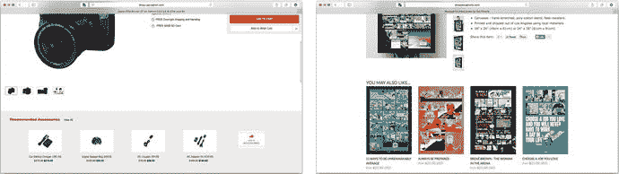

图 5-11

佳能网站上的“推荐配件”部分是通过相关产品进行追加销售的绝佳示例（左图）。Zen Pencil 的“您可能也喜欢…”部分则建议了替代海报作为当前选择的替代品（右图）

```




... 从元字段渲染产品...






... 从集合渲染产品...














... 从集合渲染产品...



代码清单 5-3
related-products.liquid Liquid 片段的逻辑概要
```

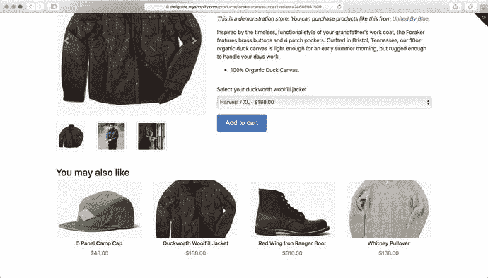

图 5-12

将相关产品片段添加到示例主题产品页面底部的结果

```

...

...

您可能也喜欢


代码清单 5-4
在 templates/product.liquid 底部包含相关产品 Liquid 片段
```

### 改进产品页面

恭喜！你的产品页面的桌面版现在已经完全实现了你在图 5-4 中计划的布局设计。你拥有了一个简单但功能齐全的产品页面，客户可以使用它来浏览你的产品、选择所需的产品变体，并将该选择添加到购物车。由于这个页面非常简洁，它加载速度很快，并且无需任何 JavaScript 即可运行。

在本章的剩余部分，我们将逐步实现主题设计者可能在此起点上添加的一些常见功能。


#### 添加产品信息

在原始产品信息层级结构中（见图 5-2），我们发现了一类“辅助性”信息——这些产品详情虽然不像标题或价格那样至关重要，但客户仍可能用其来辅助购买决策。常见的例子包括产品的技术规格、配送与退货信息、尺码指南或服装护理说明。在向产品页面添加此类信息时，我们需要考虑：

- 如何以最佳方式展示信息（表格、图形、图表、文本等）
- 信息在页面上的显著程度及放置位置（内嵌于页面下方、选项卡组件内部、弹出对话框中等）
- 该信息是否适用于商店中的每一件产品，还是仅适用于部分产品
- 该信息在不同产品之间是存在差异，还是在全店范围内保持一致
- 在何处存储这些额外的产品信息，以及如何让店主能够管理和更新这些信息

为了示例主题的需要，我们将实现一种处理附加产品信息的常见模式——将产品描述区域转换为一个选项卡面板，让客户能在单独的选项卡中查看配送信息。同时，我们还会允许店主使用 Shopify 的元字段（metafields）来指定每件产品的服装护理说明，并在单独的选项卡中显示这些信息（若存在）。

清单 5-5 展示了一个简单的选项卡实现，它被提取为 `product-details.liquid` 代码片段，并在一个选项卡中显示动态的产品描述，在另一个选项卡中显示一些静态的配送信息。图 5-13 显示了实现后的效果。

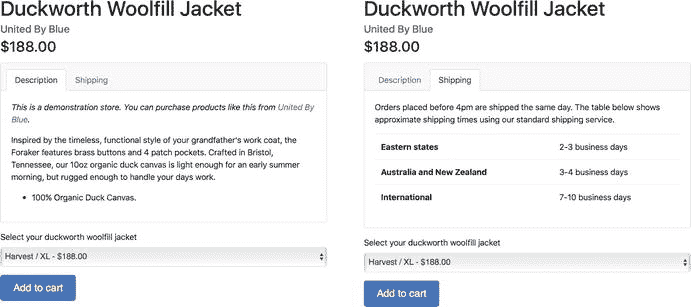

图 5-13  
将清单 5-5 中的产品描述选项卡添加到产品详情界面

```
描述

配送

{{ product.description }}

下午 4 点前下的订单将在当天发货。
下表显示了使用我们标准配送服务的大致配送时间。

...
清单 5-5
产品信息选项卡的简单实现
```

##### 使用元字段管理附加信息

下一步是向产品页面添加一个“服装护理”选项卡。我们不能像处理“配送信息”选项卡那样静态地编码这个选项卡，因为该选项卡的内容——以及该选项卡是否显示——在不同的产品之间会有所不同。

一种潜在的解决方案是将护理信息直接硬编码到 Liquid 模板中——类似于清单 5-6 所示。

```
...


服装护理


...

...


始终存放在干燥、通风良好的地方。


...

清单 5-6
有条件显示服装护理信息的一种可行（但不推荐）方法
```

这种方法的局限性在于，每当我们想要修改服装护理信息本身，或者为新产品添加护理信息时，都需要打开 Liquid 模板并进行更改。一般来说，在 Liquid 模板内部管理内容是一场灾难。这种方式对店主来说难以管理，很容易被其他用户或自动主题部署脚本覆盖。这也意味着，经验不足的店主可能会忘记关闭某个 HTML 标签，从而给网站的所有产品页面造成严重破坏。

我们将使用元字段（metafields）来解决这个问题。元字段是 Shopify 的一项功能，允许针对产品、客户、商品系列等对象存储任意的自定义数据。在 Liquid 代码中这样访问元字段：`{{ product.metafields.extra.garment_care }}`，其中 `extra` 是元字段的“命名空间”或“分组”（旨在避免元字段冲突），而 `garment_care` 是特定元字段值的“键”。

过去，Shopify 使得访问和管理元字段数据非常笨拙，并且没有在 Shopify 后台的产品页面上公开元字段控件，因此市面上有数十个提供元字段功能的 Shopify 应用。但实际上，你并不需要它们——你可以通过构造一个批量编辑 URL 来在 Shopify 后台内编辑产品元字段，这个 URL 看起来像 `https://defguide.myshopify.com/admin/bulk?resource_name=Product&edit=metafields.extra.garment_care:string`。 ³

如果你在浏览器中打开该 URL（将 `defguide.myshopify.com` 替换为你自己的商店域名），将会看到一个产品列表，并能够为每个产品的 `extra_garment` 元字段键设置一个值。店主可以为这个 URL 添加书签，随时返回以更新或添加一个或多个产品的服装护理信息。

有了管理护理信息的策略，我们现在可以更新产品详情代码片段，使其在元字段存在且包含信息时，有条件地显示“服装护理”选项卡，如清单 5-7 所示。实现后，当客户浏览到已设置服装护理信息的产品时，我们会得到图 5-14 中的结果。如前所述，这个改进版本使用元字段（而非硬编码数据）来在单独的选项卡中显示服装护理信息。

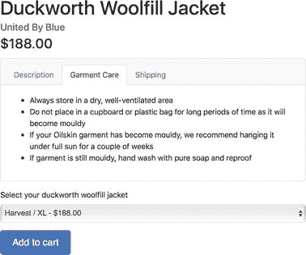

图 5-14  
当相关元字段存在时，服装护理信息的显示效果

```
...


服装护理


...

...


{{ product.metafields.extra.garment_care }}


...

清单 5-7
清单 5-6 的改进版本，使用了元字段
```


#### 改善移动端体验

到目前为止，我们的示例主要关注主题在桌面端的呈现效果和运行情况。若只关注桌面端而忽略移动端体验——即便你使用的是“响应式”框架——在电商领域也是十分危险的。Shopify 商店的流量中，超过一半来自移动设备，部分商家的这一比例甚至高达 75%。

在开发 Shopify 主题时，请务必考虑使用移动设备浏览的顾客将如何查看信息层级，或执行添加商品到购物车等关键操作。这不仅仅意味着在桌面端缩小浏览器窗口——你需要实际拿起一到两台设备，亲自浏览网站，才能充分体会其不同的使用体验。触控区域的大小、按钮是否便于拇指触及，以及可见内容区域等因素，都会产生影响。

请看图 5-15，其中展示了当前示例商品页面在移动设备上的状态。有几个问题点会立刻凸显出来：

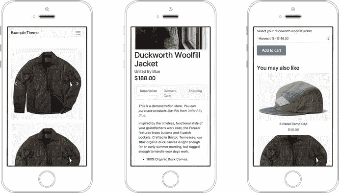

图 5-15

在移动设备上滚动浏览当前商品页面时，会暴露出一些显示和可用性问题

*   商品页面的初始视图并未显示商品标题、供应商或价格——这些都是我们在商品信息层级中确认的重要信息。
*   商品图片轮播区域的显示效果尚可，但所有缩略图都以全宽图片的形式显示在下方，导致我们需要滚动很长距离才能看到商品信息。
*   `服装护理`标签页上的文字发生了断行，破坏了布局。
*   “加入购物车”按钮宽度不足屏幕一半且偏左，使得右手持单机操作的用户更难用拇指触及。
*   “你可能也喜欢…” 区域每行只显示一件商品，导致需要滚动很长时间才能浏览完毕。

解决这类问题通常并不困难，特别是当你使用了提供响应式辅助工具的 CSS 框架或库时。为了解决示例主题中的这些问题，我决定：

*   在页面顶部添加一个仅在移动端可见的商品标题、供应商和价格版本，并隐藏页面靠下位置的相同信息。
*   保留商品轮播区，预期移动用户可以通过左右滑动来浏览可用的商品图片，但完全隐藏商品缩略图。
*   在小屏幕上，对于“`服装护理`”标签页，隐藏“服装”二字，因为“护理”已能传达足够信息。如果你有更多标签页，另一种常见做法是在空间有限时改用图标。
*   让“加入购物车”按钮在移动设备上变为全宽，以便于点击。
*   将相关商品以 2x2 的网格形式展示，而非每行一个。

实现这些更改的代码可在示例主题的代码库中找到。如图 5-16 所示，这些更改带来了更友好的移动端体验。

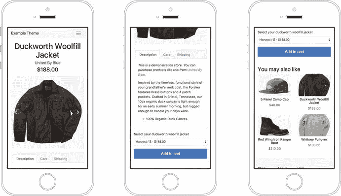

图 5-16

仅需几个简单的改动，就解决了网站移动版的一些主要可用性问题。

#### 创建备选页面模板

商品页面目前看起来相当不错了，因此我们将继续探讨网站的其他方面，从第 6 章的主页开始。在继续之前，我将快速介绍最后一个 Shopify 主题功能——备选页面模板。

对于 Shopify 主题中存在的每种 Liquid 模板类型（如 `product.liquid`、`collection.liquid`、`article.liquid` 等），你都可以创建这些模板的“备选”版本，用以完全不同的方式有选择性地渲染不同的商品（或不同的商品系列、不同的文章）。这在某些情况下会非常有用，例如，你的一些商品带有演示视频，这完全改变了页面的预期布局；或者你想要为基于文本的博客文章和以照片为主的博客文章创建不同的布局。

要创建并使用备选页面模板，只需创建一个新的模板文件，其名称与基础模板相同，但增加一个额外的后缀——例如 `product.video.liquid`。上传到商店后，Shopify 会在相关页面上显示一个模板选择界面，你或商店所有者可以在此选择所需的模板。见图 5-17。

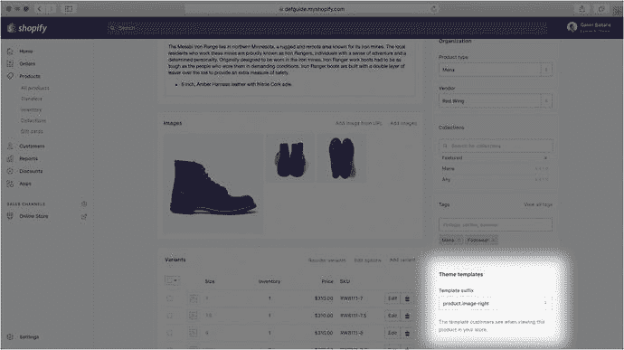

图 5-17

当所显示的对象类型有多个模板选项可用时，“主题模板”部分会出现在 Shopify 管理后台中。

为了在示例主题中演示这一点，我创建了一个 `product.image-right.liquid` 模板（代码可见于示例主题代码库），该模板简单地将商品页面的列顺序反转，使商品信息显示在左侧，图片显示在右侧。你可以在图 5-18 中看到它在商店中的显示效果。

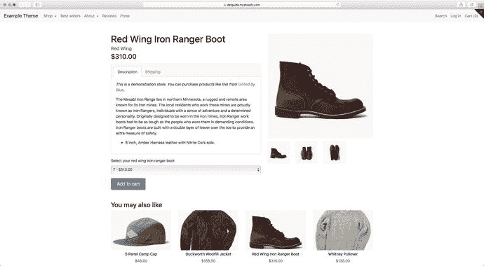

图 5-18

使用备选模板 `product.image-right.liquid` 显示的商品页面。

**提示**

虽然“主题模板”部分仅在 Shopify 管理后台中针对特定数量的对象类型（商品、商品系列和博客）显示，但所有 Shopify 页面都支持备选模板，并且你可以为一个页面创建任意数量的备选模板。要按需渲染这些备选模板，只需在 URL 中包含一个 `?view=` 参数即可——例如，你可以通过链接到 [`https://defguide.myshopify.com/products/foraker-canvas-coat?view=image-right`](https://defguide.myshopify.com/products/foraker-canvas-coat?view=image-right)，强制示例商店中的任何商品页面以图片居右的方式渲染。

备选页面模板的一个巧妙用途是，以 JSON 格式渲染对象的自定义表示形式（例如 `product.json.liquid`），你可以通过 Ajax 从其他可能需要动态获取商品信息的页面中获取它。

### 总结

本章深入探讨了 Shopify 商店商品页面的设计与实现。我们从讨论商品信息层级的重要性开始，并阐述了不同商品信息的重要性如何因商店和用户情境而异。

在掌握了示例商品信息层级后，我们逐步讲解了构建一个功能完整的 Shopify 商品页面所需的代码。

**脚注**

1 [`https://help.shopify.com/themes/liquid/filters/url-filters#product_img_url`](https://help.shopify.com/themes/liquid/filters/url-filters#product_img_url)

2 例如，参见 [`blog.kissmetrics.com/product-videos-conversion/`](https://blog.kissmetrics.com/product-videos-conversion/)。

3 如果你是 Google Chrome 用户，我强烈推荐查看 ShopifyFD ([`shopifyfd.com`](http://shopifyfd.com))，这是一个 Chrome 扩展程序，它连接到 Shopify 管理后台，允许直接在商品管理页面上编辑元字段。

